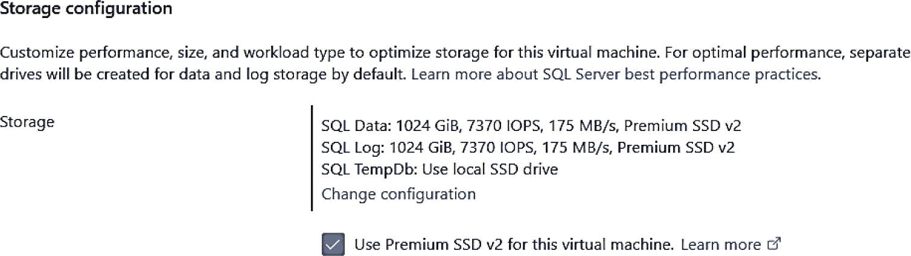
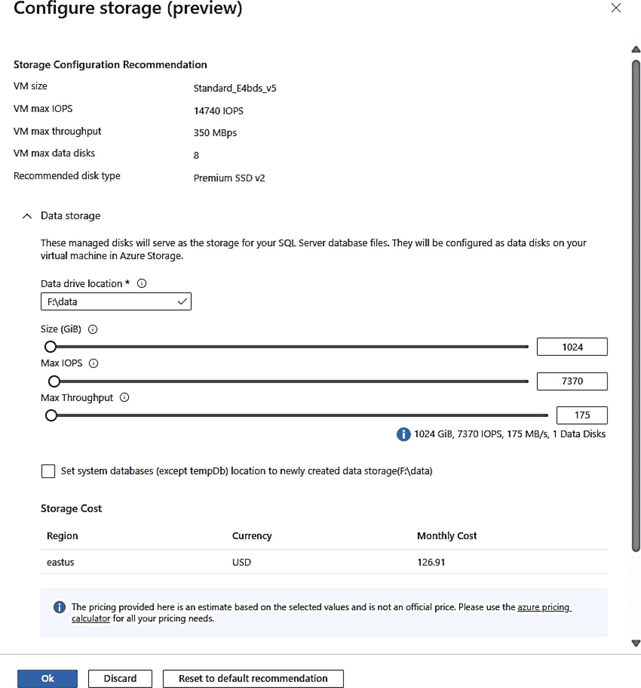

# 配置 Azure 虚拟机

在虚拟机内部，你的 SQL Server 配置与你在数据中心部署的虚拟机完全相同。从 Azure 基础架构的角度来看，虚拟机的配置有一些方面值得关注。

## 停止与解除分配

关闭 Azure 中的虚拟机可能有几个原因。如果你在虚拟机内部关闭虚拟机（例如，Windows 关机），虚拟机将停止，但计算资源仍为该虚拟机保留，这意味着你仍需为计算付费。虚拟机状态在门户和 CLI 界面中将显示为 `已停止`。要关闭虚拟机并确保不为计算付费，你需要使用虚拟机外部的界面（例如 Azure 门户中的“停止”命令菜单或 az CLI）来停止虚拟机。在这种情况下，虚拟机的状态列为 `已停止（已解除分配）`。根据你的要求，你甚至可以使用 Azure 界面自动化虚拟机的启动和停止过程。在 [`https://techcommunity.microsoft.com/t5/educator-developer-blog/azure-virtual-machine-auto-shutdown/ba-p/379342`](https://techcommunity.microsoft.com/t5/educator-developer-blog/azure-virtual-machine-auto-shutdown/ba-p/379342) 阅读更多。

一个相关的主题是托管虚拟机的基础架构的维护窗口。在 [`https://learn.microsoft.com/azure/virtual-machines/maintenance-and-updates`](https://learn.microsoft.com/azure/virtual-machines/maintenance-and-updates) 阅读更多关于 Azure 虚拟机主机更新和维护的信息。

## 调整大小

如果在部署时没有选择合适的 Azure 虚拟机大小怎么办？你可以使用 Azure 门户（从服务菜单中选择大小）或 CLI 界面来更改虚拟机的大小。此过程称为 Azure 虚拟机的 `调整大小`。调整大小非常类似于在你的数据中心内为虚拟机更改可用资源（CPU、存储、内存等）。虽然你可以在 Azure 虚拟机运行时调整其大小，但调整大小操作需要重新启动虚拟机。可用于调整大小的选项取决于你的虚拟机是正在运行还是已停止（已解除分配）。这种差异是因为当前虚拟机主机上可能只有某些大小可用（运行情况）。要查看完整的虚拟机大小列表，我建议你首先停止（解除分配）你的虚拟机。在 [`https://azure.microsoft.com/blog/resize-virtual-machines/`](https://azure.microsoft.com/blog/resize-virtual-machines/) 阅读 Azure 虚拟机调整大小的整体说明。

你可以使用 Azure Migrate 将 Azure 虚拟机迁移到其他区域。在 [`https://learn.microsoft.com/azure/site-recovery/azure-to-azure-tutorial-migrate`](https://learn.microsoft.com/azure/site-recovery/azure-to-azure-tutorial-migrate) 阅读更多。此外，要更改虚拟机的资源组或订阅，请阅读 [`https://learn.microsoft.com/azure/azure-resource-manager/management/move-resource-group-and-subscription`](https://learn.microsoft.com/azure/azure-resource-manager/management/move-resource-group-and-subscription) 的文档。

## 安全性 (RBAC)

基于角色的访问控制 (RBAC) 允许你向其他 Azure 帐户分配权限，以管理 Azure 虚拟机。可以将其视为如何控制 `虚拟机外部` 的安全性。你通过服务菜单上的 `访问控制 (IAM)` 选项进行管理。这是许多 Azure 资源的常见选项。在 [`https://learn.microsoft.com/azure/role-based-access-control/quickstart-assign-role-user-portal`](https://learn.microsoft.com/azure/role-based-access-control/quickstart-assign-role-user-portal) 了解更多。

### 其他配置选项

除了通过门户或 CLI 界面从服务菜单配置 Azure 虚拟机外，还有其他选项可用。

例如重置管理员用户密码、查看安全建议以及将虚拟机重新部署到其他主机。有关其中一些选项的更多信息，请参阅 [`https://learn.microsoft.com/azure/virtual-machines/windows/tutorial-config-management`](https://learn.microsoft.com/azure/virtual-machines/windows/tutorial-config-management)。

## 最大化存储性能

根据我们与客户合作的经验，为 Azure 虚拟机选择合适的大小是确保 SQL Server 获得所需性能的首要因素（标准的 SQL Server 性能优化实践除外）。让我们更详细地探讨为何这一选择如此重要。

### 最佳实践

你在本章前面已经看到了 SQL Server 库映像将如何基于 Azure 高级存储创建额外的托管 `数据磁盘`。为了在 Azure 虚拟机上为 SQL Server 实现最佳 I/O 性能和可用性，你应该牢记以下原则，其中一些在我演示如何在 Azure 门户中配置存储时已经提到：

*   使用 Azure 门户来指导你的选择，因为它会在虚拟机大小不支持你的 I/O 选择时发出警告。它还能帮助你轻松配置多个磁盘（底层使用 Windows 存储空间）、分离数据和日志存储、将系统数据库移出操作系统驱动器以及配置 `tempdb` 存储。

*   不要在操作系统磁盘上创建任何用户数据库。

*   将 `tempdb` 放在本地 SSD 驱动器上，该驱动器也称为临时存储。如果您的虚拟机因任何原因故障转移到不同的主机，`tempdb` 的内容将会丢失，但没关系，因为 `tempdb` 在启动时会重新创建。

*   将数据库文件和日志文件放在不同的 `托管` 磁盘上，就像任何 SQL Server 生产部署一样。

*   至少使用高级托管磁盘（也称为高级 SSD）。对于极端低延迟的一个选项是超级磁盘。超级磁盘更昂贵，但对于 SQL 生产工作负载，如果事务日志的延迟很重要，对于繁重的写入工作负载来说可能是一个必要的选择。有关如何配置此功能的更多信息，请访问 [`https://learn.microsoft.com/azure/azure-sql/virtual-machines/windows/storage-migrate-to-ultradisk`](https://learn.microsoft.com/azure/azure-sql/virtual-machines/windows/storage-migrate-to-ultradisk)。

### 高级 SSD v2

正如你从通过 Azure 门户配置存储的示例中所看到的，可能需要过度配置存储以满足你的 IOPS 和吞吐量需求。这是因为这些资源数量与高级托管磁盘的大小相关联。

用于 SQL 的高级 SSD v2（目前处于预览状态）提供了一种新的方法来独立于磁盘大小控制你的 IOPS 和吞吐量。

我们有一个新的 Azure 门户体验来使用此新选项。但是，在本书撰写时，它要求你使用可用性区域部署虚拟机，即使对于单个 SQL 实例也是如此。虽然这不会给你带来任何特定问题，但在单个可用性区域中部署 Azure 虚拟机并不会真正为你带来额外的可用性。可用性区域通常仅适用于高可用性场景（如 Always On 可用性组）的虚拟机。

如果你在门户的“基础”屏幕（在“可用性选项”下）做出此选择，你会在 SQL Server 设置下的“存储配置”中看到一个新选项，如图 3-28 所示。

图 3-28
为 SQL 选择新的高级 SSD v2 存储

当你选择 `更改配置` 时，现在会看到一个新的门户体验，可以独立控制大小、IOPS 和吞吐量，如图 3-29 所示。

图 3-29
新的高级 SSD v2 存储体验

更多详情请访问 [`https://learn.microsoft.com/azure/azure-sql/virtual-machines/windows/storage-configuration-premium-ssd-v2`](https://learn.microsoft.com/azure/azure-sql/virtual-machines/windows/storage-configuration-premium-ssd-v2)。

### 了解更多

当然，你必须在这些选择与成本之间取得平衡。所有托管磁盘都基于 Azure Blob 存储。要向你介绍 Azure Blob 存储和托管磁盘的工作原理，需要一整章的篇幅。现在，请查看这些资源：

*   有关 Azure 托管磁盘类型的详细信息，请访问 [`https://learn.microsoft.com/azure/virtual-machines/disks-types`](https://learn.microsoft.com/azure/virtual-machines/disks-types)。在这些表格中，你将看到每种类型支持的尺寸、IOPS 和吞吐量。

*   我们的文档中有针对为 Azure 虚拟机上的 SQL Server 选择合适存储的指南，请访问 [`https://learn.microsoft.com/azure/azure-sql/virtual-machines/windows/performance-guidelines-best-practices-checklist`](https://learn.microsoft.com/azure/azure-sql/virtual-machines/windows/performance-guidelines-best-practices-checklist)。

*   该文档提供了关于如何为 Azure 高级存储以及虚拟机大小选择合适尺寸的良好指南。你可以在此阅读 [`https://learn.microsoft.com/azure/virtual-machines/premium-storage-performance`](https://learn.microsoft.com/azure/virtual-machines/premium-storage-performance)。

*   GigaOm 发布了一项关于 Azure 虚拟机上 SQL Server 性能的独立研究。更多信息请访问 [`https://techcommunity.microsoft.com/t5/sql-server-blog/sql-server-on-azure-vms-the-best-price-performance-gets-even/ba-p/3727091`](https://techcommunity.microsoft.com/t5/sql-server-blog/sql-server-on-azure-vms-the-best-price-performance-gets-even/ba-p/3727091)。

我之前提到过一个主要关键点，但值得重复：`匹配正确的虚拟机大小以满足你的存储需求`，因为虚拟机大小对数据磁盘数量、总 IOPS 以及所有磁盘的总吞吐量有限制。然后，在该总 IOPS 范围内，为你数据库和事务日志文件所需的数据磁盘进行配置。

## 性能监控

由于 SQL Server 部署在虚拟机内部，你应该使用所有可用的常规技术来监控性能，包括 SQL 工具（如动态管理视图 `DMVs`）和操作系统工具（如 Windows 性能监视器或 Linux 工具）。

话虽如此，Azure Monitor 为虚拟机提供了集成的性能指标，包括 SQL Server 性能计数器（仅适用于 Windows）。

