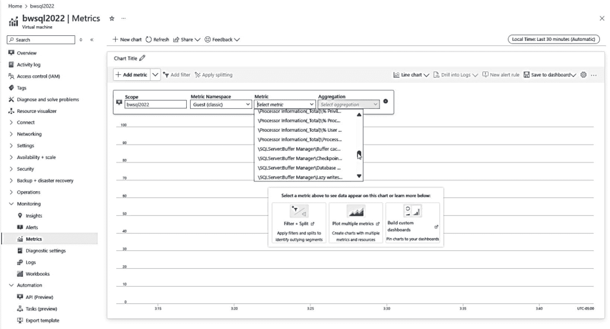

# Azure 指标

您可以通过服务菜单中的“监控”选项获取 Azure 提供的丰富指标。默认情况下，您获得的是虚拟机主机的指标。但很可能，您需要的是虚拟机*内部*（即来宾）的指标。为此，您需要从虚拟机的服务菜单（而非 SQL 虚拟机）中选择“诊断设置”，在虚拟机所在的同一区域预配一个新的 Azure 存储账户（有关如何快速创建一个的说明，请参阅以下指南：[`https://learn.microsoft.com/azure/storage/common/storage-account-create`](https://learn.microsoft.com/azure/storage/common/storage-account-create)），然后选择 `启用来宾级监控`。

启用来宾级监控后，系统会显示各种选项，包括为来宾 VM 添加特定计数器的功能。在“性能计数器”选项下，您可以选择 SQL Server 计数器。应用此设置后，您现在就可以使用门户服务菜单中的“指标”选项来查看基本指标，就像在虚拟机内使用 Windows 性能监视器一样。以下是我虚拟机的示例，如图 3-30 所示。

图 3-30：虚拟机的 Azure 来宾 VM 指标

您还可以从服务菜单中选择 `日志` 选项，通过使用 Kusto 查询语言 (KQL) 查询来查看 Azure 指标。这使您可以查看来自 Log Analytics 的指标，这些指标的跨度可以超过门户中使用 Azure 指标默认的 14 天期限。了解更多，请访问 [`https://learn.microsoft.com/azure/azure-monitor/vm/tutorial-monitor-vm-guest#view-logs`](https://learn.microsoft.com/azure/azure-monitor/vm/tutorial-monitor-vm-guest%2523view-logs)。

