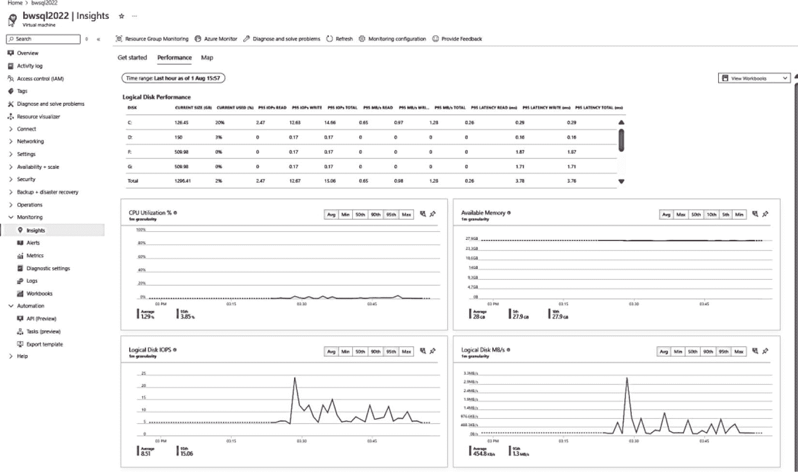

# 洞察

当您选择了 `启用来宾级监控` 后，Azure Monitor 便开始在 Log Analytics 工作区中收集指标。通过从服务菜单中选择 `洞察` 选项，您可以查看这些指标的另一种可视化形式。您可以在图 3-31 中看到这些指标的示例。

图 3-31：使用 Log Analytics 查看 Azure 虚拟机的洞察

您可以更进一步，使用一个称为“工作簿”的概念，您可以在 [`https://learn.microsoft.com/azure/azure-monitor/vm/vminsights-workbooks`](https://learn.microsoft.com/azure/azure-monitor/vm/vminsights-workbooks) 阅读更多相关内容。

#### 网络

当我在本章前面部署 Azure 虚拟机时，在资源组中创建了多种类型的网络资源，包括虚拟网络、网络接口、公共 IP 地址和网络安全组。

公共 IP 地址非常重要，因为它允许您使用远程桌面等工具连接到虚拟机。网络接口是 VM 与虚拟网络之间的互连。网络安全组 (NSG) 提供访问控制列表 (ACL) 规则，用于允许或拒绝流向 VM 的网络流量（类似于防火墙）。您可以在 [`https://learn.microsoft.com/azure/virtual-network/network-overview#network-security-groups`](https://learn.microsoft.com/azure/virtual-network/network-overview%2523network-security-groups) 阅读关于网络和 Azure 虚拟机的完整信息。

之前，我使用远程桌面客户端 (RDP) 连接到虚拟机，该客户端使用了公共 IP 地址并访问了 RDP 端口 (3389)。您可能还想使用其他方法连接到虚拟机。

我建议不要将 SQL Server 端口 1433 开放到公共 Internet。然而，这是将 SQL Server 客户端应用程序或工具（如 SSMS）连接到 Azure 虚拟机中 SQL Server 实例的唯一方法，除非您在连接到 VM 虚拟网络的计算机上运行该应用程序或工具。一种实现方法是将该应用程序或另一个 VM 部署在 Azure 中，并加入同一个 Azure 虚拟网络。您也可以部署在另一个 Azure 虚拟网络中，并设置一种称为虚拟网络对等互连的配置，您可以在 [`https://learn.microsoft.com/azure/virtual-network/virtual-network-peering-overview`](https://learn.microsoft.com/azure/virtual-network/virtual-network-peering-overview) 阅读相关信息。

最后，您可能会发现需要将本地资源（如应用程序或其他计算机或虚拟机）连接到 Azure VM 的虚拟网络。您可以在 [`https://learn.microsoft.com/azure/architecture/reference-architectures/hybrid-networking`](https://learn.microsoft.com/azure/architecture/reference-architectures/hybrid-networking) 阅读有关设置此类配置的更多详细信息。

