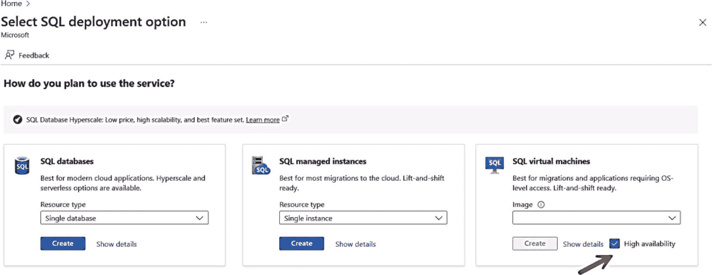
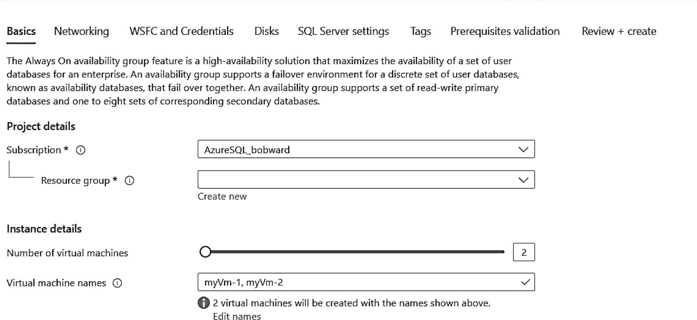
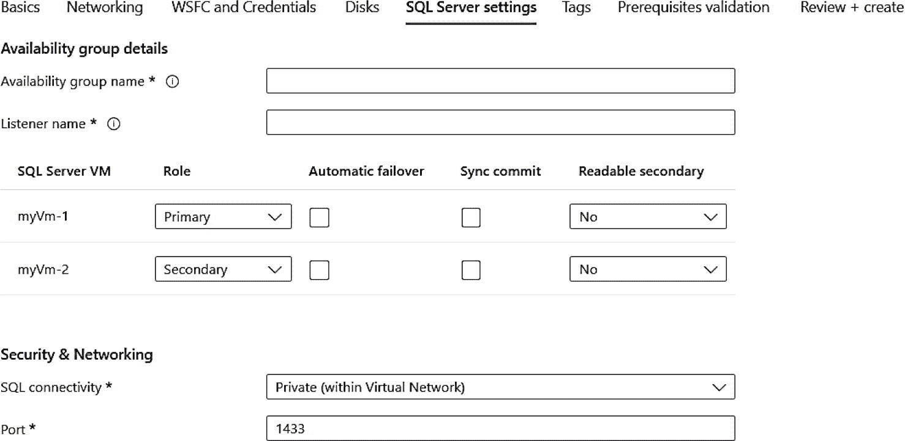

# 高可用性与灾难恢复

无论您在何处部署 SQL Server，几乎所有人都会在某种程度上需要高可用性以及在必要时执行灾难恢复技术的能力。Azure 提供了多种方法来交付高可用性与灾难恢复的选择。

## Azure 存储

在本章向您展示如何在 Azure 虚拟机中部署 SQL Server 的示例中，我使用了基于 Azure 存储的高级托管磁盘的 `数据磁盘`。默认情况下，托管磁盘具有内置的冗余功能，称为 `本地冗余存储 (LRS)`。LRS 在数据中心区域内维护数据的三个副本。您可以在 [`https://learn.microsoft.com/azure/storage/common/storage-redundancy`](https://learn.microsoft.com/azure/storage/common/storage-redundancy) 阅读更多关于 Azure 存储冗余的信息。您实际上可以使您的磁盘区域冗余，但由于数据不会跨区域复制，您可能会看到性能影响。

### 备份

由于您在 Azure 基础设施中运行 SQL Server，您无疑会希望将 SQL Server 数据库和事务日志的备份存储在 Azure 中。您可以使用 T-SQL 将备份存储到使用托管磁盘的独立数据磁盘上。然而，另一个选项是利用 SQL Server 的 `backup to URL` 功能将备份存储到 Azure 存储帐户。您可以在 [`https://learn.microsoft.com/sql/relational-databases/backup-restore/sql-server-backup-to-url`](https://learn.microsoft.com/sql/relational-databases/backup-restore/sql-server-backup-to-url) 阅读更多关于 SQL Server 备份到 URL 的信息。我之前提到过使用 Azure 门户的自动备份选项，该功能就使用了备份到 URL。使用 URL 备份的一个优势是，您可以将 Azure 存储帐户配置为使用更高级别的可用性，称为 `geo-redundant storage (GRS)`。查看 Azure 存储帐户的服务级别协议 (SLA) 请访问 [`https://www.microsoft.com/licensing/docs/view/Service-Level-Agreements-SLA-for-Online-Services`](https://www.microsoft.com/licensing/docs/view/Service-Level-Agreements-SLA-for-Online-Services%253Flang%253D1)。

另一个选项是将 SQL Server 备份与 `Azure Backup` 服务集成。Azure Backup 提供基于流的服务，将 SQL Server 备份到 Azure 存储。Azure Backup 涉及一个虚拟机扩展，该扩展将使用虚拟设备接口 (VDI) API 与 SQL Server 进行备份。在 [`https://learn.microsoft.com/azure/backup/backup-azure-sql-database`](https://learn.microsoft.com/azure/backup/backup-azure-sql-database) 阅读更多关于将 Azure Backup 与 SQL Server 配合使用的信息。

Azure 中备份的最后一个选项使用 `file snapshot backups`。文件快照备份可以非常快。它们要求将 SQL Server 数据文件直接存储到 Azure 存储帐户，而不是托管磁盘。您可以在 [`https://learn.microsoft.com/sql/relational-databases/backup-restore/file-snapshot-backups-for-database-files-in-azure`](https://learn.microsoft.com/sql/relational-databases/backup-restore/file-snapshot-backups-for-database-files-in-azure) 阅读更多关于 Azure 中 SQL Server 文件快照备份的信息。

另一个需要考虑的概念是 `Azure File Share`。Azure 文件共享就像您组织中可能有的网络文件共享，但可供任何虚拟机使用（想象一个基于 SMB 的网络文件共享）。存储在此文件共享上的任何文件都是可用的，即使虚拟机不可用。Azure 文件共享的一个选项称为 `premium file share`，最多可支持 100TB。

提示

由于您有连接到虚拟机的托管高性能磁盘，您也可以将数据库本地备份到其中一个磁盘（例如备份到 G: 盘）。但是，这些磁盘仅在连接到虚拟机时才可用。使用本节列出的其他方法，您可以独立于虚拟机的可用性来访问备份。

### 提升 Azure 可用性

Azure 虚拟机是 Azure 基础设施的一部分，可在计划外和计划事件中提供可用性。例如，如果发生计划外硬件问题，Azure 可以使用实时迁移技术将您的虚拟机故障转移到健康的主机。Azure 还可能更新您的虚拟机底层主机，这可能需要也可能不需要重启。您可以在 [`https://docs.microsoft.com/azure/virtual-machines/windows/manage-availability#understand-vm-reboots---maintenance-vs-downtime`](https://docs.microsoft.com/azure/virtual-machines/windows/manage-availability%2523understand-vm-reboots%252D%252D-maintenance-vs-downtime) 阅读更多关于 Azure 虚拟机计划外和计划内停机时间的信息。

Azure 提供了更多选项来进一步提高 Azure 虚拟机的高可用性，我在本书前面提到过，但值得重复一下：

1.  `Availability Set` – 将您的虚拟机分散在同一数据中心内的多个故障域和更新域中。基本上，这确保您的虚拟机分布在不同的机架和交换机上。SLA 为 99.95%。

2.  `Availability Zone` – 可以将其视为在区域内的数据中心之间扩展一个可用性集。SLA 为 99.99%，但成本可能更高。

不幸的是，您需要在部署时做出此选择。以后可以更改，但必须迁移您的虚拟机才能完成。

如果您计划使用 HADR 解决方案（例如 Always On 故障转移群集实例或可用性组），则需要这些选择。对于单个虚拟机部署，使用这两种选项都没有意义。

### Always On 故障转移群集实例

Always On 故障转移群集实例 (FCI) 通过共享存储为 SQL Server 提供高可用性。由于这是一个虚拟机，使用 FCI 将非常类似于正常的 SQL Server。话虽如此，请考虑这些重要概念，以使 FCI 在 Azure 中的成功部署：

*   您需要使用可用性集或可用性区部署群集中的任何虚拟机。

*   对于群集的共享存储，请考虑 `Azure Shared Disks`。Azure 共享磁盘专为跨虚拟机共享托管磁盘（如群集场景）而设计。更多信息请参见 [`https://learn.microsoft.com/azure/virtual-machines/disks-shared`](https://learn.microsoft.com/azure/virtual-machines/disks-shared)。

*   每个 Windows 故障转移群集解决方案 (WFCS) 都需要一个见证人来仲裁。Azure 为云提供了一种特定类型的见证人，称为 `cloud witness`。可以将云见证视为一个托管的见证人。您创建云见证，它会处理您需要的一切。在后台，它使用一个虚拟机和 Azure 存储。更多信息请访问 [`https://learn.microsoft.com/windows-server/failover-clustering/deploy-cloud-witness?tabs=windows#what-is-cloud-witness`](https://learn.microsoft.com/windows-server/failover-clustering/deploy-cloud-witness%253Ftabs%253Dwindows%2523what-is-cloud-witness)。

*   您需要某种类型的网络抽象来处理侦听器。Azure 能够让您创建 `multi-subnet virtual network` 以避免对负载均衡器或分布式网络名称的需求。更多信息请访问 [`https://learn.microsoft.com/sql/sql-server/failover-clusters/windows/sql-server-multi-subnet-clustering-sql-server`](https://learn.microsoft.com/sql/sql-server/failover-clusters/windows/sql-server-multi-subnet-clustering-sql-server)。

要构建 FCI 的完整教程，请从这里开始，然后按照下一步操作每篇文章：[`https://learn.microsoft.com/sql/sql-server/failover-clusters/install/before-installing-failover-clustering`](https://learn.microsoft.com/sql/sql-server/failover-clusters/install/before-installing-failover-clustering)。

### Always On 可用性组

`Always On 可用性组` (AG) 通过使用副本提高了您的高可用性 `RPO`（恢复点目标）和 `RTO`（恢复时间目标）。它是 SQL Server 旗舰级的 `HADR` 功能，采用非共享存储概念与副本。

我们知道在 Azure 上设置 AG 可能是一个艰巨的过程。事实上，在 Windows 上设置带有自动故障转移的 AG 的完整教程记录在 [`《在 Windows 上手动配置 Always On 可用性组（单子网）教程》`](https://learn.microsoft.com/azure/azure-sql/virtual-machines/windows/availability-group-manually-configure-tutorial-single-subnet)。

幸运的是，我们的团队在 Azure 门户中构建了一种新体验来简化此过程。假设您首先设置了一个 Windows 域控制器和虚拟网络，然后使用新的 Azure 门户体验来部署解决方案的其余部分，包括故障转移群集和 AG。

如果您还记得本章前面的内容，我向您展示了选择 Azure SQL 解决方案的体验，如图 3-32 所示。

图 3-32

部署 SQL Azure 虚拟机时选择 HA 选项

请注意这里的高可用性选择。选择您的映像并单击“创建”后，您将拥有与本章前面类似的体验，不同之处在于您现在可以选择部署`多个虚拟机`并配置您的集群和 AG。

例如，如图 3-33 所示，您可以在“基础”屏幕中选择部署多个虚拟机。

图 3-33

部署 SQL HA 的基础配置

在“网络”屏幕中，您可以设置多子网，包括侦听器 IP 地址。还请注意 `WSFC` 和凭据的选项。当您选择“SQL Server 设置”时，您现在可以选择配置要部署的 AG，如图 3-34 所示。

图 3-34

用于为 SQL Server Azure 虚拟机配置 AG 的 SQL Server 设置

要了解完整的体验，请参阅 [`《在 Azure 门户中配置 Always On 可用性组》`](https://learn.microsoft.com/azure/azure-sql/virtual-machines/windows/availability-group-azure-portal-configure)。

另一个要考虑的场景是从本地 AG 主副本设置 Azure 中的 AG 辅助副本。您可以在 [`《从本地配置 Azure 虚拟机 SQL Server 可用性组》`](https://learn.microsoft.com/previous-versions/azure/virtual-machines/windows/sqlclassic/virtual-machines-windows-classic-sql-onprem-availability) 获取有关如何设置此场景的更多指导。如果您将异步辅助副本设置为*被动*，则可以将此虚拟机标记为 `HA` 目的并避免 SQL 许可成本。

### SQL Server 与 Linux 高可用性

Linux 上的 SQL Server 通过数据库引擎支持 `Always On 故障转移群集实例` 和 `可用性组` 功能。自动故障转移功能通常通过 `Pacemaker`、`DH2i` 或 `HPE ServiceGuard` 等 Linux 包来支持。

要了解在 Linux 上部署 `Always On 可用性组` 的完整说明，请参阅 [`《在 Linux 上为 SQL Server 配置高可用性可用性组》`](https://learn.microsoft.com/sql/linux/sql-server-linux-availability-group-ha)。

## Microsoft 创新与 Azure Boost

Microsoft 一直在致力于改进托管 Azure 虚拟机的基础结构。其中一项创新被称为 **Azure Boost**。

`Azure Boost` 是由 Microsoft 设计的系统，它将传统上由虚拟机监控程序和主机操作系统执行的服务器虚拟化过程卸载到专用的软件和硬件上。

`Azure Boost` 的一大优点是，您只需要选择支持 Boost 的虚拟机大小（可以在 [`《Azure Boost 概述 - 当前可用性》`](https://learn.microsoft.com/azure/azure-boost/overview%2523current-availability) 找到），所有优势都会在主机上自动交付。

使用支持 `Boost` 的虚拟机大小的主要好处包括更快的网络、延迟更低的更快存储、更高的 `IOPS/`吞吐量、更安全的主机，以及由于 `CPU` 资源可以更专用于来宾虚拟机而带来的更高性能。所有详细信息请访问 [`https://aka.ms/azureboost`](https://aka.ms/azureboost)。

## 本章摘要

在本章中，您学习了如何使用 Azure 虚拟机部署和配置 SQL Server，了解了部署过程中的许多不同选项。您还学习了与 SQL Server 和 Azure 虚拟机相关的安全性、性能和 `HADR` 的独特方面。Azure 虚拟机为运行 SQL Server 提供了出色的基础结构，是将 SQL Server 迁移到云端的最简单方式。

通过完成我的 SQL 专业人员云 workshop GitHub 仓库 ([`https://aka.ms/cloudsqlworkshop`](https://aka.ms/cloudsqlworkshop)) 中的以下实验，检验您对本章所学知识的掌握程度：

[`《实验 03：在 Azure 虚拟机上部署 SQL Server》`](https://github.com/microsoft/cloudsqlworkshop/tree/main/cloudsqlworkshop/03_Deploy_SQL_AzureVM)

[`《实验 04：管理与优化 Azure 虚拟机上的 SQL Server》`](https://github.com/microsoft/cloudsqlworkshop/tree/main/cloudsqlworkshop/04_Manage_and_Optimize_SQL_AzureVM)

现在您已经学习了 Azure 虚拟机上的 SQL Server，接下来将向您展示如何部署和配置 Azure SQL Database 和 Managed Instance。

