# 4. 部署 Azure SQL

部署 Azure SQL Managed Instance 或 Database 与部署 SQL Server on Azure Virtual Machine 的体验不同但相似。相同之处在于您可以使用 Azure 门户和 `CLI`。不同之处在于 Azure *管理着虚拟机*和基础结构，因此您不必担心为虚拟机选择的几个选项。

在本章中，您将学习部署和连接到 Azure SQL Managed Instance 和 Database 的选项与过程。您还将学习将现有数据库迁移到 Azure SQL 的选项。此外，您将了解用于托管 Azure SQL Managed Instance 和 Database 的架构的一些实现细节。

您可以选择跟随本章中的示例操作。完成这些示例需要满足以下条件：

*   一个 Azure 订阅。
*   至少具有该 Azure 订阅的“参与者”角色访问权限。您可以在 [`《Azure 内置角色》`](https://learn.microsoft.com/azure/role-based-access-control/built-in-roles) 阅读有关 Azure 内置角色的更多信息。
*   访问 Azure 门户（Web 或 Windows 应用程序）。
*   安装 `az` `CLI`（有关更多详细信息，请参阅 [`《安装 Azure CLI》`](https://learn.microsoft.com/cli/azure/install-azure-cli)）。您也可以使用 Azure Cloud Shell，因为 `az` 已经安装。您可以在 [`《Azure Cloud Shell 入门》`](https://azure.microsoft.com/get-started/azure-portal/cloud-shell) 阅读有关 Azure Cloud Shell 的更多信息。
*   您将在本章中运行一些 `T-SQL`，因此请安装一个工具，例如 `SQL Server Management Studio` (`SSMS`)，地址为 [`https://aka.ms/ssms`](https://aka.ms/ssms)。

在本章末尾，我还提供了您可以进行的自学实验链接。

## 部署前规划

在您开始部署 Azure SQL 数据库或托管实例之前，我建议您花些时间做一些部署前规划。审视您的选择并做出几个明智的决定，将为您节省时间和精力。

### 新部署还是迁移

首先要做的决定之一，是计划迁移现有的数据库或实例，还是部署新的数据库或实例。部署的过程将是相同的，但迁移意味着您需要在部署前评估当前的 SQL Server 实例、数据库或其他数据库环境。您的评估将根据当前需求，为您需要做出何种部署选择提供指导。您必须决定需要对当前的 SQL Server 或其他数据库平台上的应用程序、架构、脚本或其他方面做出哪些必要的更改。您还必须考虑如何将实际数据迁移到新的部署中。本章将包含专门讨论迁移到 Azure SQL 托管实例和数据库时可以使用的注意事项和工具的部分。以下是一些您在考虑迁移时可以参考的优秀资源：

*   `Azure 云迁移和现代化中心` – 这是一个集中的信息资源，您可以访问 Microsoft 专家，将任何资源迁移到 Azure。请访问 [`https://azure.microsoft.com/solutions/migration`](https://azure.microsoft.com/solutions/migration)。

*   `Microsoft 数据迁移指南` – 获取针对任何类型数据迁移到 Azure 的分步指导。了解更多信息，请访问 [`https://aka.ms/datamigration`](https://aka.ms/datamigration)。

*   `由 Azure Arc 启用的 SQL Server 迁移评估` – 在撰写本书时此功能处于预览版，它允许您通过 Arc 将现有的 SQL Server 连接到 Azure，并获得关于迁移到 Azure 的最佳解决方案的 `持续` 评估，包括资源（规模）建议。了解更多信息，请访问 [`https://learn.microsoft.com/sql/sql-server/azure-arc/migration-assessment`](https://learn.microsoft.com/sql/sql-server/azure-arc/migration-assessment)。

*   `Azure 数据库迁移服务 (DMS)` – 这项 Azure 服务允许您执行到 Azure SQL 托管实例和数据库的离线及在线迁移（仅限离线迁移数据库）。了解更多信息，请访问 [`https://learn.microsoft.com/azure/dms/dms-overview`](https://learn.microsoft.com/azure/dms/dms-overview)。

*   `Azure Migrate` – 使用此服务进行 `大规模` 评估和迁移（使用 DMS）。了解更多信息，请访问 [`https://aka.ms/azuremigrate`](https://aka.ms/azuremigrate)。

*   `托管实例链接` – 虽然 DMS 提供了在线迁移解决方案，但它使用的是日志传送方法。一个可能更好的在线迁移路径是 Azure SQL 托管实例链接。它允许您使用 Always On 可用性组的强大功能，将 SQL Server 2016、2019 或 2022 实例迁移到 Azure SQL 托管实例。了解更多信息，请访问 [`https://learn.microsoft.com/azure/azure-sql/managed-instance/managed-instance-link-feature-overview?view=azuresql#migrate-to-azure`](https://learn.microsoft.com/azure/azure-sql/managed-instance/managed-instance-link-feature-overview%253Fview%253Dazuresql%2523migrate-to-azure)。

### 做出部署选择

无论您是迁移还是创建新的部署，都有几个值得花时间去规划的选择。本书第 2 章非常值得回顾阅读，因为它描述了 Azure SQL 托管实例和 Azure SQL 数据库之间的选择与差异。

话虽如此，让我们从高层次回顾一些可能影响您决策的重要选择：

*   如果您需要 SQL Server 代理、数据库邮件和跨数据库查询等 SQL Server 实例功能，那么托管实例是您需要做出的选择。

*   如果您的数据库大小超过 32TB，在撰写本书时 `您唯一的选择` 就是 Azure SQL 数据库超大规模。

除了这两个选择之外，Azure SQL 托管实例或数据库都可能满足您的需求。然而，正如我在本书第 2 章中指出的，使用 Azure SQL 数据库可能有优势，因为 Microsoft 将同时管理基础设施和 SQL Server 实例，让您能专注于数据库本身。此外，Azure SQL 数据库可以为您提供更多选项，例如无服务器计算和弹性池。

在部署托管实例或数据库时您将做出的选择，可以参考图 4-1 所列内容（感谢我的同事 Anna Hoffman 提供此图）。


图 4-1

Azure SQL 的部署选择

#### 免费部署

如果您正在寻找用于开发或概念验证 (POC) 场景的免费部署 Azure SQL 的方法，请考虑以下选项：

##### Azure SQL 托管实例免费试用版

我听过很多客户问我，他们如何在不必花费大量资金的情况下，对 Azure SQL 托管实例进行测试以迁移 SQL Server。我们现在为 Azure SQL 托管实例提供免费的 12 个月试用版，让您具备这种能力。此优惠适用于任何 Azure 订阅。了解更多信息，请访问 [`https://learn.microsoft.com/azure/azure-sql/managed-instance/free-offer`](https://learn.microsoft.com/azure/azure-sql/managed-instance/free-offer)。

##### Azure SQL 数据库免费优惠

SQL Server 开发人员版非常受欢迎，因为开发人员可以免费开发和测试他们的应用程序。我们现在为 Azure SQL 数据库提供了类似的选项，而且这不是试用版。只要您的 Azure 订阅有效，您现在就可以部署一个免费的 Azure SQL 数据库。了解更多信息，请访问 [`https://aka.ms/freedboffer`](https://aka.ms/freedboffer)。

### 部署方法

你可以通过 Azure 门户或使用 CLI 工具（如 `az` 命令行工具）、PowerShell 甚至 REST API（`az rest` 可以提供帮助）来部署 Azure 托管实例或数据库。

如果你只是试用 Azure SQL 或进行概念验证，可以轻松使用 Azure 门户。然而，如果需要一个可重复的部署流程（想象一下，如果你需要完全按照原始配置重新部署一个托管实例），那么使用 CLI 脚本是更好的选择。请记住，你也可以使用 Azure 模板来帮助自动化部署。你可以在以下链接中阅读更多关于为 Azure SQL 使用 Azure 模板的信息：[`https://learn.microsoft.com/azure/azure-sql/database/arm-templates-content-guide?view=azuresql&tabs=single-database`](https://learn.microsoft.com/azure/azure-sql/database/arm-templates-content-guide%253Fview%253Dazuresql%2526tabs%253Dsingle-database) 和 [`https://learn.microsoft.com/azure/azure-sql/database/arm-templates-content-guide?view=azuresql&tabs=managed-instance`](https://learn.microsoft.com/azure/azure-sql/database/arm-templates-content-guide%253Fview%253Dazuresql%2526tabs%253Dmanaged-instance)。

你还可以选择使用 `Bicep` 来部署 Azure SQL 托管实例（[`https://learn.microsoft.com/azure/azure-sql/managed-instance/create-bicep-quickstart`](https://learn.microsoft.com/azure/azure-sql/managed-instance/create-bicep-quickstart)）或 Azure SQL 数据库（[`https://learn.microsoft.com/azure/azure-sql/database/single-database-create-bicep-quickstart`](https://learn.microsoft.com/azure/azure-sql/database/single-database-create-bicep-quickstart)）。

`Terraform` 同样支持部署 Azure SQL 托管实例（[`https://learn.microsoft.com/azure/azure-sql/managed-instance/instance-create-terraform`](https://learn.microsoft.com/azure/azure-sql/managed-instance/instance-create-terraform)）和 Azure SQL 数据库（[`https://learn.microsoft.com/azure/azure-sql/database/single-database-create-terraform-quickstart`](https://learn.microsoft.com/azure/azure-sql/database/single-database-create-terraform-quickstart)）。

让我再为你介绍一种方法。我在本书的第 2 章提到了 Azure 中的 Copilot 体验。图 4-2 展示了一个示例，说明如何请求 Copilot 提供一个使用 `az` CLI 部署 Azure SQL 数据库的示例。

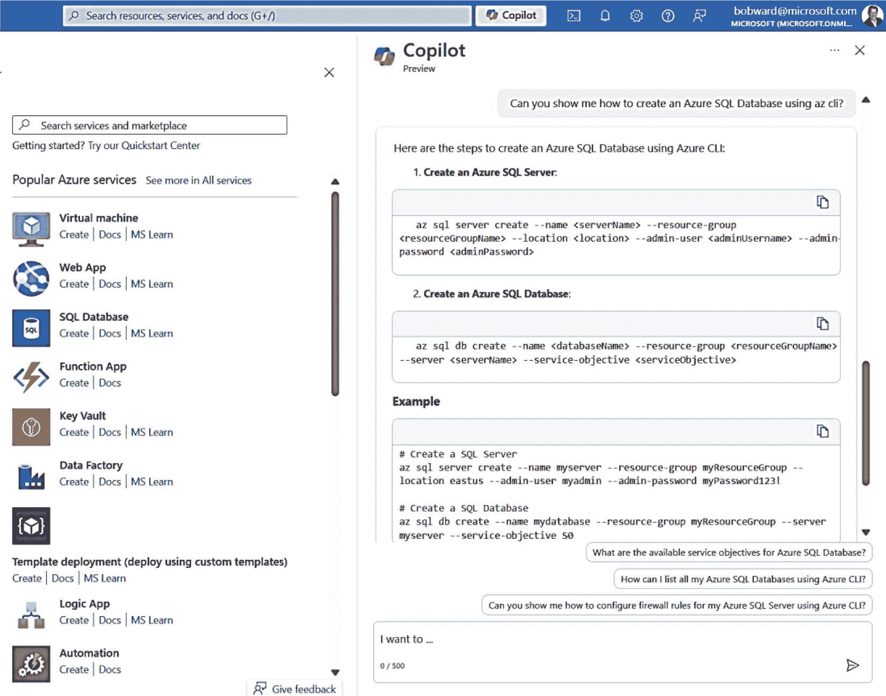

图 4-2

在 Azure 中使用 Copilot 帮助部署 Azure SQL 数据库

注意

你可以看到，在提供响应后，Copilot 还会为你可能想做的其他事情提供建议。此时，我尚未部署数据库，因此 Copilot 没有 `上下文`。在本书后面，你将看到部署数据库后更复杂的体验。然而，在你阅读本章时，可以就章节中看到的主题向 Copilot 提出不同的问题。它可以在文档中查找概念，并在许多情况下比你自己搜索更快地提供示例。

### 部署选项

我之前已经讨论过是选择 Azure SQL 托管实例还是数据库。在这两种选项中，都有使用 `池` 的选择。正如我在本书第 2 章中提到的，Azure SQL 托管实例提供了 `托管实例池`，这可能更适合规模较小、成本效益更高的托管实例。使用池的部署时间也要快得多。你可以在 [`https://learn.microsoft.com/azure/azure-sql/managed-instance/instance-pools-overview`](https://learn.microsoft.com/azure/azure-sql/managed-instance/instance-pools-overview) 阅读更多关于托管实例池的信息。我将在本章后面几处讨论托管实例池的使用。

注意

在撰写本书时，托管实例池经历了一次公开预览版的 `刷新`。它曾长期处于公开预览阶段，所以很多人认为它永远不会达到正式发布阶段，但在我看来，它现在正走在正确的道路上。

正如我在本书第 1 章和第 2 章中都提到的，Azure SQL 数据库提供了一个称为 `弹性池` 的选项。如果你计划使用 Azure SQL 数据库来托管许多数据库，弹性池可能是一个不错的选择。独立软件供应商和软件即服务开发者通常会选择它来节省成本并更高效地管理数据库。我将在本章后面几处更详细地讨论弹性池。

### 区域

选择特定的 Azure 区域可能很重要，正如我在关于虚拟机的第 3 章中所描述的那样。你需要确保你的部署选项在你选择的 Azure 区域中可用。

你可能有特定的合规性和安全要求，这些要求也决定了你选择哪个区域。

你可能正在实施特定的高可用性与灾难恢复选项，如可用性区域、异地复制或自动故障转移组，并且心中有特定的区域来确保这些部署成功。请记住，我在本书第 2 章中谈到过一个叫做 `配对区域` 的概念，这对于做出这些地理区域选择非常重要。

如果你需要将 Azure SQL 托管实例或数据库移动到另一个区域，请阅读我们文档中的检查清单：[`https://learn.microsoft.com/azure/azure-sql/database/move-resources-across-regions`](https://learn.microsoft.com/azure/azure-sql/database/move-resources-across-regions)。

Azure SQL 数据库是一项“Ring 0”服务，这意味着它默认部署在每个区域。托管实例尚未完全达到该状态，但它已在所有区域普遍可用。

此外，你还需要考虑你的应用程序将托管在何处，以及应用程序托管位置与你的 Azure SQL 部署之间的延迟要求。考虑性能以及与其他服务的接近程度。我曾与我的同事 Anna Hoffman 就此话题聊天。她说：“……但我认为这不仅仅是应用程序在哪里的问题——用户在哪里？应用程序应该放在哪里？如果你有异地复制或自动故障转移组，你如何构建一个全局可用的解决方案？”

### 购买模型

仅适用于 Azure SQL 数据库，你需要选择一个 `购买模型`。选项有 `DTU` 或 `vCore`。我在本书的第 1 章和第 2 章中解释了这些模型及其背后的历史。虽然 `DTU` 模型对你来说可能是一个选择，但我推荐 `vCore` 模型。使用 `vCore`，你可以有更多的选择以及许可选项，例如 Azure 混合权益（`AHB`）。`vCore` 模型让你对底层资源（CPU、内存、存储）有更高的透明度和控制权，更容易匹配你数据库的性能需求。

如果你选择了 `DTU` 模型并希望在以后迁移到 `vCore` 模型，请查阅文档：[`https://learn.microsoft.com/azure/azure-sql/database/migrate-dtu-to-vcore`](https://learn.microsoft.com/azure/azure-sql/database/migrate-dtu-to-vcore)。


### 服务层级 (SLO)

如果你的部署选项是 Azure SQL 托管实例，那么你需要选择一个*服务层级*（我们也称之为服务级别目标或 SLO），即 `通用型 (GP)` 或 `业务关键型 (BC)`。我在本书的第 2 章中描述了这些服务层级选项。虽然资源限制和性能可能有所不同，但这些层级的一个主要区别在于其可用性工作方式，你将在本书的第 8 章中了解更多相关内容。`业务关键型`的一个显著区别是它支持内存中 OLTP 功能。还记得在第 2 章中，我谈到了托管实例 `GP` 的“下一代”版本。请务必查看该选项，因为它提供了更多选项和更强大的存储性能。托管实例 `GP` 和 `BC` 的比较可以在 [`https://learn.microsoft.com/azure/azure-sql/managed-instance/resource-limits`](https://learn.microsoft.com/azure/azure-sql/managed-instance/resource-limits) 找到。

**提示**

你将在本章后面看到，部署一个托管实例通常需要时间。在 `GP` 和 `BC` 之间进行更改是可能的，但可能会导致显著的停机时间。你可以在 [`https://learn.microsoft.com/azure/azure-sql/managed-instance/management-operations-overview`](https://learn.microsoft.com/azure/azure-sql/managed-instance/management-operations-overview) 了解更多关于具体时间的信息。托管实例确实支持一个称为快速预配的概念，适用于某些配置下的 `GP` 服务层级。你甚至可以在 30 分钟内完成预配。在 [`https://learn.microsoft.com/azure/azure-sql/managed-instance/management-operations-overview?view=azuresql#fast-provisioning`](https://learn.microsoft.com/azure/azure-sql/managed-instance/management-operations-overview?view=azuresql#fast-provisioning) 了解更多。

如果你的部署选项是 Azure SQL 数据库，那么你同样可以选择 `通用型 (GP)` 与 `业务关键型 (BC)` 服务层级。此外，你还有 `超大规模` 的选择。如果你选择 `通用型` 或 `超大规模`，你还可以选择 `预配型` 与 `无服务器型`。这也被称为*计算模型* *或层级*。我在本书的第 2 章中介绍了所有这些选项，但在本章中我也会涵盖这个主题。

**Azure SQL 数据库超大规模**我相信将成为你的数据库的 `默认` 选择。我在本书的第 1 章中谈到了 `超大规模`（Project Socrates）的历史。如果你读过本书的第一版，你可能会留下这样的印象：`超大规模` 仅适用于最大的数据库部署。而这是我们造成的印象，不是你的问题。自 2020 年以来，`超大规模` 发生了一些变化：

*   `超大规模` 现在支持 `无服务器`。
*   `超大规模` 现在支持弹性池。
*   2023 年底，`超大规模` 的价格 `显著降低`。在 [`https://azure.microsoft.com/updates/general-availability-lower-simplified-pricing-for-azure-sql-database-hyperscale-expected-in-december-2023`](https://azure.microsoft.com/updates/general-availability-lower-simplified-pricing-for-azure-sql-database-hyperscale-expected-in-december-2023) 了解更多关于此的信息。

关于 `超大规模` 的一个关键点是，其存储是自动扩展的！你无需指定需要多少数据库空间。我们会根据你的需求自动增长。

**我相信超大规模现在成为任何人的起点**，只需让计算（`无服务器`）和存储的自动扩展随着应用程序需求的增长或变化而灵活调整。在 [`https://learn.microsoft.com/azure/azure-sql/database/service-tier-hyperscale`](https://learn.microsoft.com/azure/azure-sql/database/service-tier-hyperscale) 阅读关于 `超大规模` 的所有细节。

说到 `无服务器`（我在本书的第 1 章中谈过），这是我们为自动扩展以及你的数据库可能并不总是被充分利用的场景创建的一个独特选项。它提供了一种部署和使用 Azure SQL 数据库的新的、经济高效的方式。在 [`https://learn.microsoft.com/azure/azure-sql/database/serverless-tier-overview`](https://learn.microsoft.com/azure/azure-sql/database/serverless-tier-overview) 阅读更多关于 `无服务器` 的信息。

对于 Azure SQL 数据库，在 `GP` 和 `BC` 之间切换通常比托管实例快得多。你也可以轻松地在 `无服务器` 和 `预配型` 之间切换。对于 `超大规模`，你可以切换回 `GP` 服务层级。在 [`https://learn.microsoft.com/azure/azure-sql/database/manage-hyperscale-database`](https://learn.microsoft.com/azure/azure-sql/database/manage-hyperscale-database) 了解更多。

### 硬件

尽管对于 Azure SQL，我们为你抽象了部署所使用的基础设施和虚拟化，但我们提供了*硬件代系*的选项。

对于 Azure SQL 托管实例，你有三种选择：

*   标准系列称为 `Gen5`（它曾是 `Gen4`，因为我们持续改进我们的硬件代系）。它在 vCore 数量和每个 vCore 的内存方面有很好的选择。
*   `高级系列` 使用了新一代的处理器，并提供更多的 vCore 和更高的每个 vCore 内存。
*   `内存优化高级系列` 类似于 `高级系列`，但提供了更高的每个 vCore 内存。`通用型` 的这个选项不支持像 `高级系列` 那么多的 vCore。

在 [`https://learn.microsoft.com/azure/azure-sql/managed-instance/resource-limits?view=azuresql#hardware-configuration-characteristics`](https://learn.microsoft.com/azure/azure-sql/managed-instance/resource-limits?view=azuresql#hardware-configuration-characteristics) 保持关注所有细节。

对于 Azure SQL 数据库，你有以下选择：

*   标准系列也称为 `Gen5`（它曾是 `Gen4`，因为我们持续改进我们的硬件代系）。它在 vCore 数量和每个 vCore 的内存方面有很好的选择。
*   `Fsv2 系列` 具有最快的 CPU 速度，但你无法像 `Gen5` 那样预配同样多的 vCore。此选择仅适用于 `通用型` 服务层级。
*   `DC 系列` 仅支持 8 个 vCore，但对于安全性至关重要，因为它支持用于 Always Encrypted 安全飞地的 Intel 软件防护扩展 (Intel SGX)。
*   `超大规模` 支持 `高级` 和 `高级内存优化` 选择，以获得更多的 vCore 和更高的内存与 vCore 比率。

在 [`https://learn.microsoft.com/azure/azure-sql/database/service-tiers-sql-database-vcore?view=azuresql&tabs=azure-portal#hardware-configuration`](https://learn.microsoft.com/azure/azure-sql/database/service-tiers-sql-database-vcore?view=azuresql&tabs=azure-portal#hardware-configuration) 保持关注这些选择的所有细节。

### vCore 和存储大小

一旦你确定了这些选项，你就可以选择存储大小。Azure SQL 数据库的 DTU 模式有一个你可以选择的 DTU 数量（以及数据大小）。对于 vCore 购买模型，你需要选择 vCore 数量和数据库存储最大大小（记住 `超大规模` 不需要此选项）。根据你的其他选择，这些选项的工作方式有一些不同。在本章剩余部分带你完成部署过程时，我将描述这些差异。


#### 价格

与 Azure 虚拟机类似，您可以利用 Azure 定价计算器，输入其中一些选项来预估成本。这包括使用 `Azure 混合权益`。您可以在 [`https://azure.microsoft.com/pricing/details/azure-sql/sql-managed-instance/single/`](https://azure.microsoft.com/pricing/details/azure-sql/sql-managed-instance/single/) 找到 Azure SQL 托管实例的定价计算器，在 [`https://azure.microsoft.com/pricing/calculator/?service=sql-database`](https://azure.microsoft.com/pricing/calculator/?service=sql-database) 找到 Azure SQL 数据库的定价计算器。

> **提示**
>
> 为确保找到 Azure SQL 数据库和托管实例，请搜索 Azure SQL 数据库。从那里，您可以更改类型以查看托管实例。

图 4-3 展示了 Azure SQL 数据库定价计算器的示例。

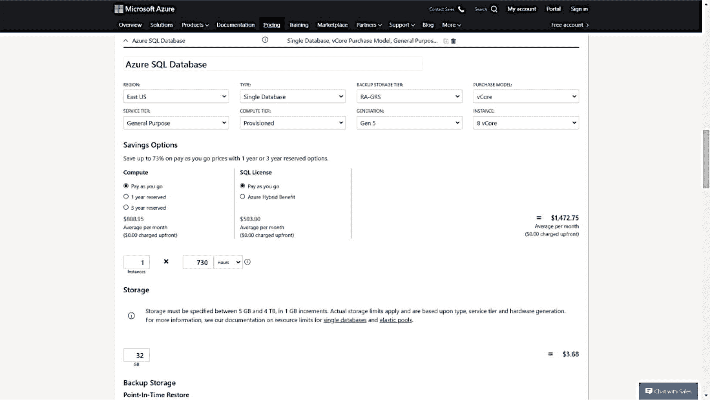
**图 4-3**
Azure SQL 数据库的定价计算器

### 考虑资源限制

您在部署选项、服务层级和大小方面的选择会影响您的资源限制。以下是您在做这些选择时需要考虑的资源限制。我特别指出这些，是因为当您通过 `Azure 门户`进行部署时，这些限制可能并不显而易见：

*   最大内存
*   最大日志大小
*   日志速率调控
*   IOPS 和 I/O 延迟
*   `tempdb` 的最大大小
*   最大并发工作线程数
*   备份保留期

我将在本书的第 7 章中更详细地讨论日志速率调控以及 IOPS 和 I/O 延迟。现在，请牢记这些概念，因为它们可能影响应用程序的性能，例如那些事务日志工作负载繁重的应用程序。

要查看 Azure SQL 托管实例的具体限制，请参阅 [`https://learn.microsoft.com/azure/azure-sql/managed-instance/resource-limits`](https://learn.microsoft.com/azure/azure-sql/managed-instance/resource-limits) 上这些记录完善的表格。要查看 Azure SQL 数据库的具体限制，请参阅 [`https://learn.microsoft.com/azure/azure-sql/database/resource-limits-vcore-single-databases`](https://learn.microsoft.com/azure/azure-sql/database/resource-limits-vcore-single-databases) 上的表格。

您还应该知道，每个订阅在每个区域都有整体的 Azure SQL 限制。您可以在 [`https://learn.microsoft.com/azure/azure-sql/managed-instance/resource-limits`](https://learn.microsoft.com/azure/azure-sql/managed-instance/resource-limits) 和 [`https://learn.microsoft.com/azure/azure-sql/database/resource-limits-logical-server`](https://learn.microsoft.com/azure/azure-sql/database/resource-limits-logical-server) 查看这些限制是什么。

可以向 Microsoft 提出增加订阅限制的请求。这被称为 *配额增加请求*。请在 [`https://learn.microsoft.com/azure/azure-sql/database/quota-increase-request`](https://learn.microsoft.com/azure/azure-sql/database/quota-increase-request) 阅读更多信息。

## 部署 Azure SQL 托管实例

与我在第 3 章中为虚拟机记录的过程类似，通过 `Azure 门户`部署 Azure SQL 托管实例，首先从 Azure 市场使用 Azure SQL 选项开始（我在图 3-1 中向您展示了此视图）。

使用三个 Azure SQL 选项，您需要选择 SQL 托管实例和单实例，然后单击**创建**。

### 部署过程演练

让我们逐步演练托管实例部署选项的每个屏幕，然后通过 `Azure 门户`进行部署。我将以新的 `NextGen 通用型` 服务层级为例，带您走一遍部署体验。您将看到与第 3 章中关于 Azure 虚拟机上 SQL Server 所见相似但略有不同的体验。

正如我在本章前面关于预部署规划所提到的，我强烈建议您花时间查看我将要展示的所有选项。这是因为您将要做出的一些选择只能在部署时进行，并且之后无法修改（这需要您进行迁移）。此外，一些选择可以修改（如服务层级），但可能会导致一些停机时间。


### 基础配置

图 4-4 展示了你在 `Basics`（基础配置）屏幕顶部需要填写的字段，包括选择 `Subscription`（订阅）、`Resource Group`（资源组）、`Instance Name`（实例名称，这将成为服务器名称的一部分以及实例的 `@@SERVERNAME`）、`Region`（区域）、`Pool`（池）以及 `Compute+Storage`（计算+存储）。

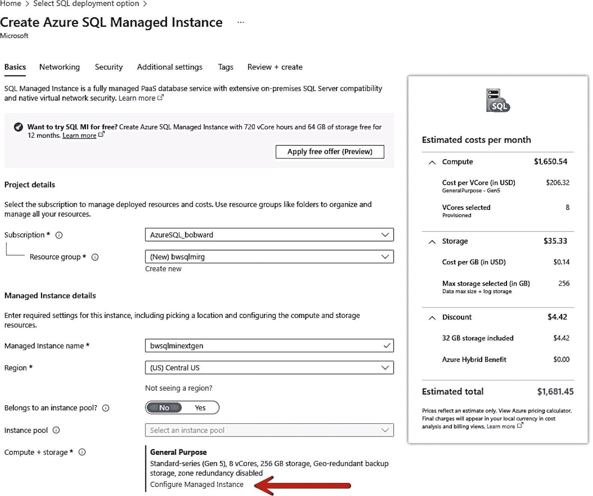

图 4-4

用于部署 Azure SQL 托管实例的基础配置屏幕顶部

我喜欢在我做出所有选择时，估算费用会列在右侧。这是我们为 Azure SQL 提供的一种常见体验。

请注意名为 `Compute + Storage` 的选项。在这里，你将选择 `Service Tier`（服务层级）和 `Size`（大小）（`vCores` + `Storage`）。请注意，默认设置是 `General Purpose`（通用型），具有 8 个 `vCores` 和 256GB 最大存储空间。点击 `Configure Managed Instance`（配置托管实例）查看你的选项，应该如图 4-5 所示。

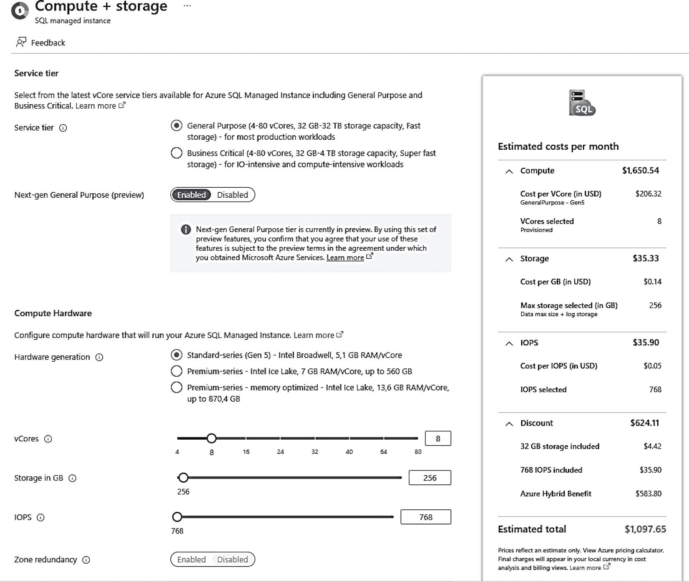

图 4-5

Azure SQL 托管实例的计算+存储配置屏幕顶部

这是一个为部署做出重要选择的屏幕，所以我们来看看这些选项。

在此屏幕顶部，你可以看到可以选择默认的 `General Purpose` (`GP`)，或 `Business Critical` (`BC`)，并且列出了每种选择的一些资源限制和性能预期。根据部署前的规划，请记住选择 `BC` 还有其他重要原因，包括：

*   可使用 `In-Memory OLTP`（内存中 OLTP）功能
*   更高的可用性，因为 `BC` 使用本地存储和副本架构

接下来，你会注意到我启用了 `NextGen GP`（下一代通用型）选项。随着此功能全面上市，我预计这将成为默认的 `GP` 行为。

现在我可以选择硬件代系，我在本章前面已经描述过这些选择了。

现在我可以选择“大小”选项，包括 `vCores`、最大存储空间和 `IOPS`（这是 `NextGen` 的新功能之一）。

你选择的硬件代系决定了你可能的最大 `vCore` 值，最高可达 128。

最大存储值称为*最大实例大小*，是允许与托管实例的数据库关联的*所有*数据库和事务日志文件的最大总大小。你应该将其视为数据库的最大存储驱动器。最大存储空间因你的 `vCore` 选择以及 `GP` 和 `BC` 的选择而异。`GP` 允许最大 32TB，`BC` 允许最大 16TB。

注意

我在本书的第 2 章讨论了业务关键型部署的架构，并将在第 8 章详细阐述此架构。`BC` 存储限制较低的原因是数据库存储在本地 SSD 驱动器上，而非 Azure 存储中。

`Tempdb` 的最大大小取决于 `vCore` 选择，但会计入整体最大存储限制。实际上，所有数据库，包括系统数据库，都会计入整体最大实例存储空间。

部署托管实例后，你可以运行以下查询（在任何数据库上下文中）以查看你的数据库相对于实例最大存储空间占用了多少空间：

```sql
SELECT TOP 1 used_storage_gb = storage_space_used_mb/1024,
max_storage_size_gb = reserved_storage_mb/1024
FROM sys.server_resource_stats ORDER BY start_time DESC;
```

向下滚动，你可以在图 4-6 中看到其余选项。

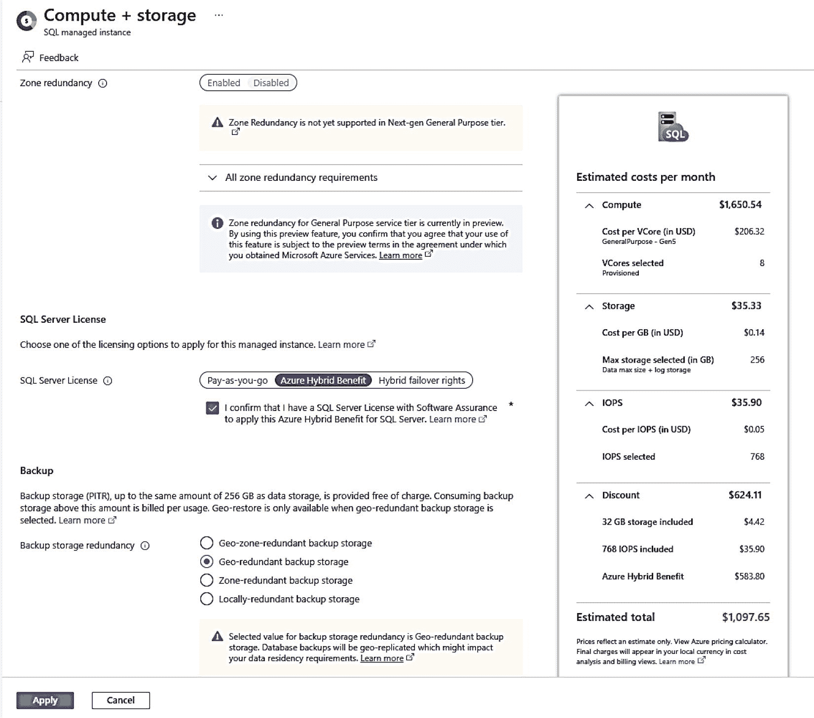

图 4-6

Azure SQL 托管实例计算+存储的其他选项

你的第一个选择是 `zone redundancy`（区域冗余）。该选项在 `NextGen GP` 预览期间被禁用，但一旦全面上市即可用。区域冗余使用 `Availability Zones`（可用区）使你的部署具有更高的可用性。我强烈建议你在部署时考虑此选项。我将在本书的第 8 章详细讨论这个概念。

你还可以选择使用你现有的 SQL Server 许可证通过 `Azure Hybrid Benefit` (`AHB`)（Azure 混合权益）来节省成本。我需要说明一下，混合故障转移权益适用于用于灾难恢复的托管实例。更多内容请参阅本书的第 8 章。

你还可以选择备份的冗余选项。除非你有特定的数据驻留要求，否则我推荐 `geo-redundant backups`（异地冗余备份），它会将你的备份复制到 Azure 存储中的已知配对区域。我将在第 8 章详细讨论备份冗余和成本。

进行任何更改后，点击 `Apply`（应用）（仅当你更改了默认设置时 `Apply` 才可用；你可以点击右上角的 `X` 返回到 `Basics` 屏幕）。

提示

点击 `Apply` 不会立即部署托管实例，但请花时间在此处尽可能准确地做出选择。为什么？你以后可以更改它们，但托管实例对层级和大小的更改可能是一个漫长的操作。

正如你在图 4-7 中看到的，我们在 `Basics` 屏幕上还有一个选择要做。

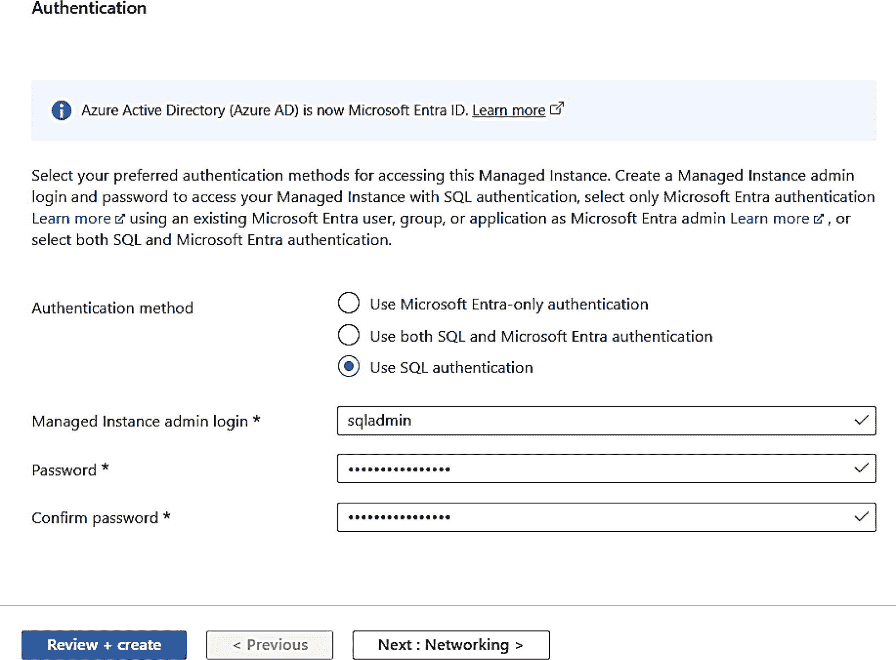

图 4-7

Azure SQL 托管实例部署期间的身份验证选择

此选项允许你选择 `Microsoft Entra authentication only`（仅 Microsoft Entra 身份验证）、`mixed`（混合）或仅 `SQL Authentication`（SQL 身份验证）。如果你选择任何 `Entra` 选项，则必须指定一个 `Entra` 帐户。这些选择将成为实例的 `sysadmin` 角色成员。如果你从未使用过 `Microsoft Entra` 身份验证，这将需要你进行一些学习。它与在 SQL Server 上使用 `Windows Authentication`（Windows 身份验证）非常相似，但也有一些差异。此功能是最安全的方法，甚至支持无密码应用程序。

然而，为 Azure SQL 托管实例设置此功能可能存在一个障碍（这就是我在此处未使用它的原因）。你必须在你的 `Microsoft Entra` 系统中拥有特殊权限才能使用此选项（我在 Microsoft 默认没有此权限，因此需要特殊流程来申请）。请阅读 [`https://learn.microsoft.com/azure/azure-sql/database/authentication-aad-configure?view=azuresql&tabs=azure-powershell#provision-microsoft-entra-admin-sql-managed-instance`](https://learn.microsoft.com/azure/azure-sql/database/authentication-aad-configure%253Fview%253Dazuresql%2526tabs%253Dazure-powershell%2523provision-microsoft-entra-admin-sql-managed-instance) 了解更多信息。

## 网络配置

点击 `Next: Networking >`（下一步：网络配置 >）以查看你的网络配置选择。你的屏幕应如图 4-8 所示。

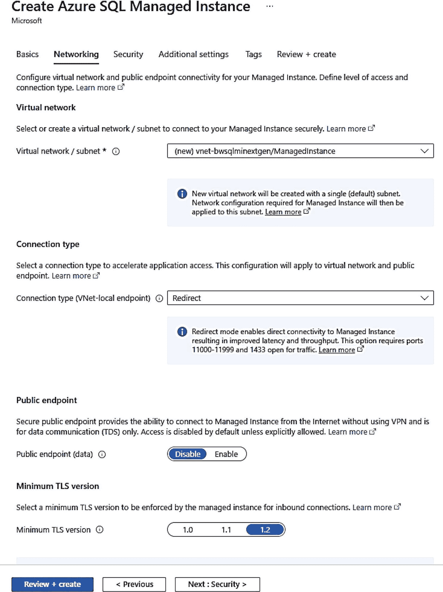

图 4-8

Azure SQL 托管实例网络配置选项

#### 虚拟网络

在屏幕顶部，你可以看到将创建一个新的虚拟网络来托管 Azure SQL 托管实例。托管实例的优势之一是它部署在私有虚拟网络中。你可以先部署你自己的 Azure 虚拟网络（可以使用 Azure 门户或 CLI），然后在此部署屏幕上选择该虚拟网络。如果选择使用自己的虚拟网络，则必须以特定方式进行配置，你可以在 [`https://learn.microsoft.com/azure/azure-sql/managed-instance/vnet-existing-add-subnet`](https://learn.microsoft.com/azure/azure-sql/managed-instance/vnet-existing-add-subnet)`.` 阅读相关信息。

提示

你知道可以在同一虚拟网络中部署多个实例吗？这样做将加快后续部署速度，但请确保这符合你的安全和网络需求。


### 连接类型

请注意，在我的屏幕上，我选择的连接类型是 `Redirect`。默认值是 `proxy`。代理连接要求工具或应用程序到托管实例的任何连接（连接到 TDS 端口 `1433`）都必须始终通过 `gateway`。重定向连接类型使用网关来查找包含托管实例的节点的直接虚拟私有 IP 地址。所有后续流量直接流向该节点。你可以在 [`https://learn.microsoft.com/azure/azure-sql/managed-instance/connection-types-overview`](https://learn.microsoft.com/azure/azure-sql/managed-instance/connection-types-overview) 阅读更多关于这些连接类型的信息。代理可能更安全，但重定向可能更快。如果你选择在此部署步骤中创建虚拟网络，虚拟网络和包含的子网将应用所有适当的网络安全组（`NSG`）规则。

### 公共端点

你可以选择在公共端点上启用 TDS 流量。公共端点将在端口 `3342` 上启用（并在虚拟网络中重定向到节点实例端口 `1433`）。虽然我不建议在生产环境中使用此选项，但它是连接到托管实例的最快方法之一。你可以在 [`https://learn.microsoft.com/azure/azure-sql/managed-instance/public-endpoint-overview`](https://learn.microsoft.com/azure/azure-sql/managed-instance/public-endpoint-overview) 阅读更多关于托管实例公共端点的信息。

你还可以控制实例的最低 `TLS` 连接加密。我始终建议使用最新的 `TLS` 版本。你可能想使用不同版本的唯一原因是针对不支持该版本的旧应用程序。在 [`https://learn.microsoft.com/azure/azure-sql/managed-instance/minimal-tls-version-configure`](https://learn.microsoft.com.com/azure/azure-sql/managed-instance/minimal-tls-version-configure) 了解更多信息。

请注意，托管实例会自动启用加速网络。

### 安全性

点击 `Next: Security >` 进行进一步的安全选择，如图 4-9 所示。

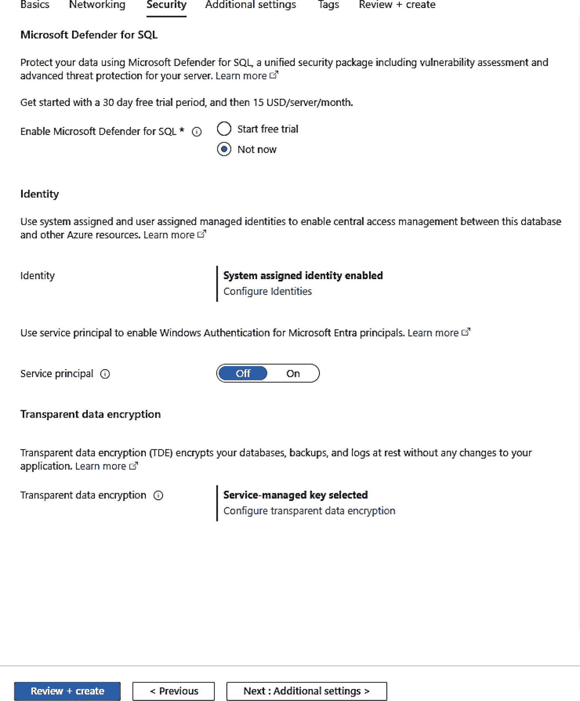

图 4-9

Azure SQL 托管实例的安全选择

我在前面的章节中提到过 `Microsoft Defender`，相同的功能（但为托管实例定制）可用于漏洞评估和高级威胁保护。

你可以为无密码应用程序设置自己的用户定义的 `managed identity`。默认情况下，你会获得一个系统定义的托管身份。

如果你想在你的应用程序中对 Azure SQL 托管实例使用 `Windows Authentication`，可以启用服务主体（`Service Principal`）的选项。如果你希望避免更改应用程序以使用 Microsoft Entra 身份验证，请考虑此选项。在 [`https://learn.microsoft.com/azure/azure-sql/managed-instance/winauth-azuread-overview`](https://learn.microsoft.com/azure/azure-sql/managed-instance/winauth-azuread-overview) 了解更多信息。

`Transparent Data Encryption`（`TDE`），即数据库和事务日志存储的静态加密，默认是启用的（你需要为每个单独的数据库启用此功能）。此选项允许你设置自己的加密密钥。

#### 附加设置

点击 `Next: Additional settings >` 以启用部署的一些附加选项，如图 4-10 所示。

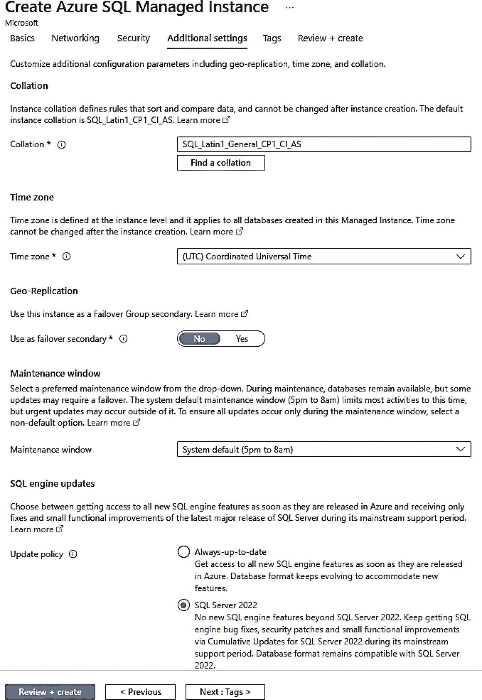

图 4-10

托管实例的附加设置

这里的 `collation` 类似于为 SQL Server 设置排序规则。重要的是要知道，在此处提供之后，你无法更改实例排序规则。

注意：在部署后，你*可以*在托管实例上设置和更改*数据库*排序规则。只需记住，不同的数据库排序规则可能会导致跨数据库查询或临时表操作出现问题。

`time zone` 是托管实例节点上 SQL Server 引擎识别的时区。我已将其更改为我的本地时区，但也可以是 `UTC` 或你想要选择的任何时区。部署后无法更改此设置。

托管实例可以是 `failover group` 的一部分，我们将在本书的第 8 章中详细讨论。当你稍后复习那些主题时，你将使用该选项。现在，保留其默认值 `No`。

`Maintenance window` 允许你定义一个不同的时间段，以便将计划更新应用到你的部署。默认是基于你所在时区的下午 5 点到上午 8 点之间的任何时间，或者你可以将其配置为周一至周四或周五至周日的晚上 10 点到早上 6 点。部署后你可以更改维护窗口。

`Update policy` 是一个相对较新的概念。你可以选择将你的托管实例保持在与 SQL Server 2022 兼容的版本。我将在第 8 章向你展示如何利用这一点来实现在线灾难恢复功能。但是，如果你选择此选项，你将无法获得通常来自无版本部署的新功能（但累积更新会自动应用）。第一个选项确保你始终是最新的，但你将无法还原备份或参与与 SQL Server 2022 的在线灾难恢复场景。

我将选择 SQL Server 2022 更新策略，以便我可以在本书后面向你展示这些新的兼容性功能。

### 标签

点击 `Next: Tags >` 来定义一个标签，就像我在第 3 章中关于 Azure 虚拟机描述的那样。

### 部署！

点击 `Next: Review + create >` 查看部署前的最终屏幕。就像 Azure 虚拟机的部署一样，此屏幕显示估计成本、使用条款、隐私政策、你选择的所有选项的审查，以及下载描述这些部署选项的 Azure 模板的选项。

你还会看到一个警告，根据我的选择，部署可能需要长达 6 小时才能完成。对于我的部署，它在大约 1 小时 45 分钟内完成。如果你想在部署期间跟踪更多信息，可以使用 Azure 门户（[`https://learn.microsoft.com/azure/azure-sql/managed-instance/management-operations-monitor`](https://learn.microsoft.com/azure/azure-sql/managed-instance/management-operations-monitor)）。

所以，点击 `Create` 进行部署，保持此屏幕打开以查看进度，并继续阅读下一节关于使用 `CLI` 部署的内容，然后是一些你可能会感兴趣的架构和实现细节，解释为什么部署需要运行。

```
if (condVar > someVal) {console.log("xxx")}
```


### 使用 CLI 部署

Azure 托管实例可以通过命令行界面 (CLI) 使用 `az sql mi`（[`learn.microsoft.com/cli/azure/sql/mi`](https://learn.microsoft.com/cli/azure/sql/mi)）命令接口或通过 `New-AzSQLInstance` PowerShell cmdlet（[`learn.microsoft.com/powershell/module/az.sql/new-azsqlinstance`](https://learn.microsoft.com/powershell/module/az.sql/new-azsqlinstance)）进行部署。

我尝试使用 `az sql mi` 构建一个示例，发现需要运行多个 `az` CLI 命令来创建虚拟网络、子网以及所有关联设置。因此，我只建议你在使用 *Azure 模板* 时配合使用 `az sql mi` CLI。可以在 [`learn.microsoft.com/azure/azure-sql/managed-instance/create-template-quickstart?view=azuresql&tabs=azure-cli`](https://learn.microsoft.com/azure/azure-sql/managed-instance/create-template-quickstart%3Fview%3Dazuresql%26tabs%3Dazure-cli) 找到一个示例模板。

**提示**

就像我之前向你展示如何使用 Azure 中的 Copilot 通过 `az` CLI 创建数据库一样，它也可以为你提供关于如何为 Azure SQL 托管实例执行此操作的提示和示例。它还提供选项来帮助你配置虚拟网络和子网。

PowerShell 要求你在执行 `New-AzSQLInstance` 之前设置虚拟网络和其他上下文。在 [`learn.microsoft.com/azure/azure-sql/managed-instance/scripts/create-configure-managed-instance-powershell`](https://learn.microsoft.com/azure/azure-sql/managed-instance/scripts/create-configure-managed-instance-powershell) 有一个关于使用 PowerShell 的优质教程。

正如我在本章前面提到的，你还可以选择使用 Bicep 和 Terraform 来部署 Azure SQL 托管实例。

### 实现细节

**注意**

随着我们对服务的更改和改进，这些实现细节可能会随时间而变化。我提供其中一些细节，是为了让你了解我们如何构建、管理和运行该服务。

Azure SQL 托管实例部署在由 Azure Service Fabric 提供支持的节点（虚拟机）上，采用一种称为*环*或*虚拟集群*的概念。虚拟集群是在虚拟网络子网中运行的一组专用的隔离虚拟机。

正如我在示例中所做的那样，当你在新虚拟网络（子网）中部署第一个托管实例时，实际上是在部署一个完整的虚拟集群。这就解释了为什么初始部署可能需要很长时间才能完成。你可以在*同一虚拟网络子网*中部署其他托管实例，部署速度会稍快一些。更多关于预期时间的具体信息，请访问 [`learn.microsoft.com/azure/azure-sql/managed-instance/management-operations-overview`](https://learn.microsoft.com/azure/azure-sql/managed-instance/management-operations-overview)。

托管实例是一个完整的 SQL Server 引擎数据库实例，部署在虚拟集群中的一台专用虚拟机上。Microsoft 将决定如何在集群的各个节点上部署这些虚拟机。一个节点可能有一台装有实例的虚拟机，也可能是多台虚拟机。根据平台即服务 (PaaS) 的承诺，Microsoft 将这些细节抽象化，使你无需关心。你与托管实例的交互是通过标准的 SQL Server 接口（如 T-SQL）或 Azure 接口（如门户、CLI 或 REST API）进行的。你永远不会直接访问底层虚拟机。

这种架构也解释了为什么某些管理操作（例如扩展 vCores）也可能需要很长时间，因为其中一些操作需要部署一个新的虚拟集群，可能涉及从 Azure Storage 附加文件或重新设定副本。

我在本书第 2 章中描述了通用型 (GP) 与业务关键型 (BC) 层的一些架构。我将在本书第 8 章中进一步描述它们。这两种服务层都使用相同的虚拟集群架构，只是存储和高可用性实现方式不同。

托管实例的 `资源限制`（如内存限制、最大存储大小等）通过多种机制强制执行，具体取决于你的部署选择。例如，内存限制是通过 Windows 作业对象强制执行的（并且你无法配置 `"最大服务器内存"`）。你可以在 [`learn.microsoft.com/en-us/windows/win32/procthread/job-objects`](https://learn.microsoft.com/en-us/windows/win32/procthread/job-objects) 阅读更多关于 *Windows 作业对象* 的信息。存储容量（或最大大小）由文件服务器资源管理器 (FSRM) 强制执行，你可以在 [`learn.microsoft.com/windows-server/storage/fsrm/fsrm-overview`](https://learn.microsoft.com/windows-server/storage/fsrm/fsrm-overview) 阅读更多相关信息。

*托管实例池部署* 可以快得多，因为实例池可以是一组在同一虚拟机中运行的 SQL Server 实例。隔离和资源限制通过 Windows 作业对象应用。图 4-11 展示了托管实例与池的架构对比图。此图源自文档 [`learn.microsoft.com/en-us/azure/azure-sql/managed-instance/instance-pools-overview?view=azuresql#architecture`](https://learn.microsoft.com/en-us/azure/azure-sql/managed-instance/instance-pools-overview%3Fview%3Dazuresql%23architecture)。

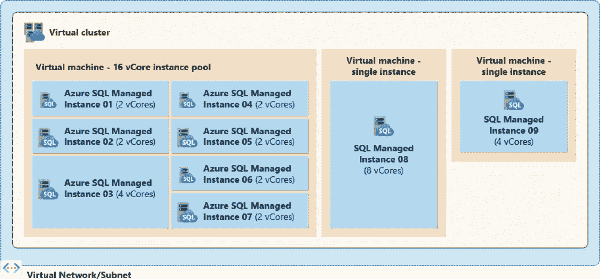
图 4-11: 托管实例与池的架构

### 连接并验证部署

部署完成后，你的屏幕应如图 4-12 所示。

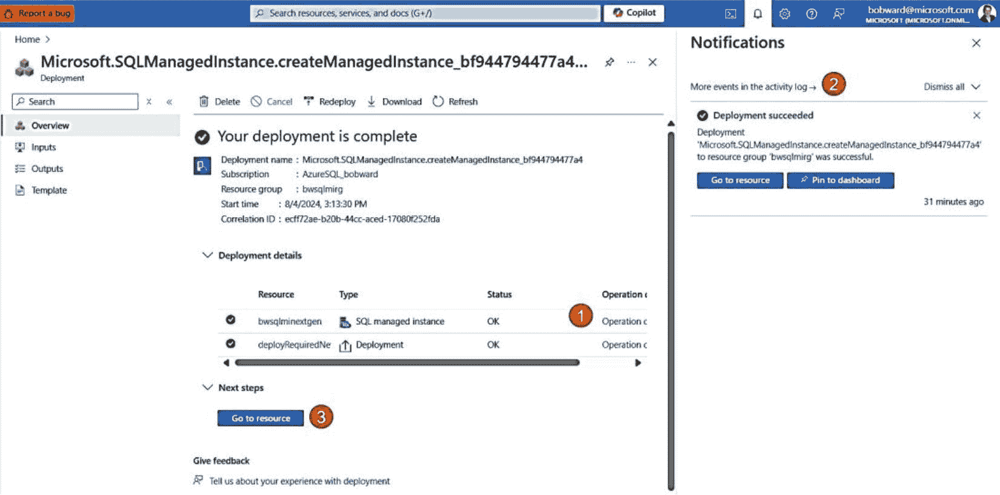
图 4-12: 托管实例部署完成

让我们看一下屏幕上的几个细节：

1.  如果你想要部署摘要，可以选择 `操作详细信息`，除其他信息外，它还可以显示部署的持续时间。
2.  你可以通过在活动日志中选择 `更多事件` 来获取有关部署每个步骤的更多详细信息。
3.  你可以选择 `转到资源` 在 Azure 门户中查看已完成的部署。

如果你点击 `转到资源`，你将看到一个类似于图 4-13 的屏幕。

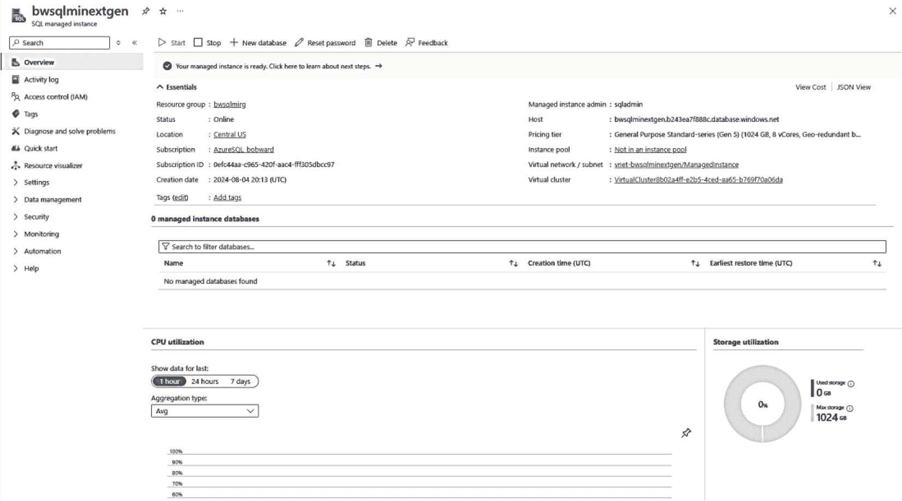
图 4-13: Azure SQL 托管实例的“概述”屏幕

此时，你可能想要采取的第一步是尝试连接到新实例并验证部署。我喜欢使用一组简单的 T-SQL 查询来验证我的 SQL Server 安装。


## 连接到托管实例

有多种不同的方法可以连接到你的托管实例，你可以在 [`https://learn.microsoft.com/azure/azure-sql/managed-instance/connect-application-instance`](https://learn.microsoft.com/azure/azure-sql/managed-instance/connect-application-instance) 查看所有这些方法。

我个人喜欢做的是，通过部署过程中创建的虚拟网络*内部*的一台 Azure 虚拟机进行连接，这样我就不必启用公共端点。我将这台虚拟机称为***跳转盒***。我会使用 RDP（远程桌面协议）连接到该虚拟机，然后在虚拟机内部，使用 SSMS 等工具通过实例的私有网络进行连接。

我会在与我的托管实例相同的资源组中创建一个新的 Azure 虚拟机（我直接从市场中使用 SQL Server Developer Edition）。在部署虚拟机期间，我会选择为托管实例创建的虚拟网络（通常是 vnet-<MI 名称>，因此这里的名称是 vnet-bwsqlnextgeni）。在这个屏幕上，我选择管理子网配置。这允许我创建一个名为“default”的新子网（并使用默认选项）。这成为我的 VM 等应用程序用于连接到托管实例虚拟网络的私有子网。

我的网络设置如图 4-14 所示。

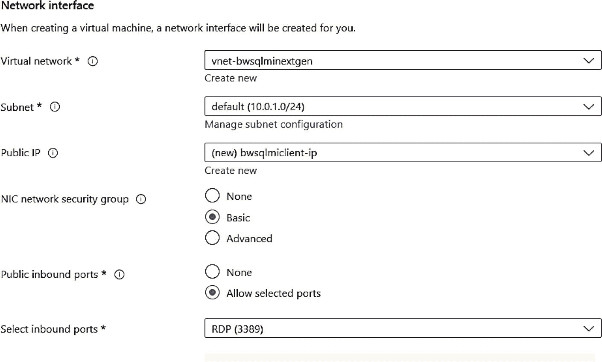

图 4-14

用于连接跳转盒 VM 到托管实例的网络设置

随着我的跳转盒部署完毕，我将使用 VM 内部的 SSMS 连接到托管实例。当你连接到一个托管实例时，服务器名称会变成这样一个 URL（你可以在托管实例门户的“概述”屏幕上找到它）。

### bwsqlminextgen.b243ea7f888c.database.windows.net

图 4-15 展示了一个 SSMS 连接到 Azure SQL 托管实例的示例。

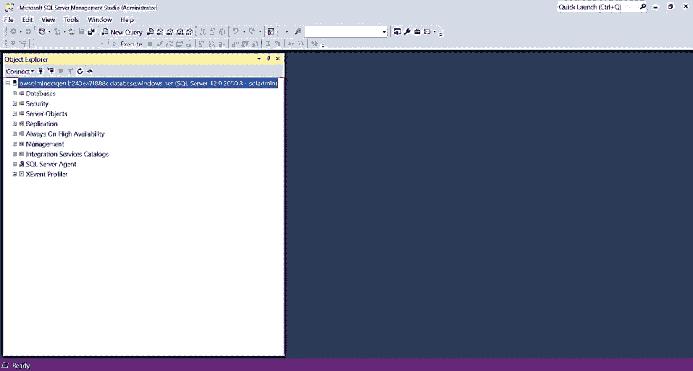

图 4-15

通过跳转盒连接到 Azure SQL 托管实例的 SSMS

#### 验证部署

请注意，SSMS 中的“对象资源管理器”看起来与 SQL Server 几乎完全相同，只是服务器名称是完全限定域名（FQDN）。

要验证 SQL Server 的安装，我通常会使用几种技术，包括对系统目录视图和 DMV 运行查询，以及查看 ERRORLOG。

### 检查 ERRORLOG

你无权访问托管托管实例的虚拟机的文件系统。要查看 ERRORLOG，我们需要像 SSMS 或 T-SQL 这样的工具。

你可以使用 SSMS 中的对象资源管理器来查看 ERRORLOG，但我更喜欢直接使用 T-SQL，这样我可以执行 `sp_readerrorlog` 来查看当前的 ERRORLOG 文件。我必须提醒你，我们在托管实例的 ERRORLOG 中转储了各种额外的信息（是的，甚至比 SQL Server 还要多），执行可能需要几秒钟的时间。我的同事 Dimitri Furman 写了一篇博客文章，其中包含一些用于过滤托管实例 ERRORLOG 的示例代码。你可以在 [`https://techcommunity.microsoft.com/t5/datacat/azure-sql-db-managed-instance-sp-readmierrorlog/ba-p/305506`](https://techcommunity.microsoft.com/t5/datacat/azure-sql-db-managed-instance-sp-readmierrorlog/ba-p/305506) 查看。

我在启动时关注 ERRORLOG 中的几个关键消息，并在我的托管实例中找到了这些：

```
SQL Server detected 1 sockets with 4 cores per socket and 8 logical processors per socket, 8 total logical processors; using 8 logical processors based on SQL Server licensing. This is an informational message; no user action is required.
SQL Server is starting at normal priority base (=7). This is an informational message only. No user action is required.
Detected 44645 MB of RAM. This is an informational message; no user action is required.
```

我可以看到检测到了八个逻辑处理器，这与我部署了一个 8 vCore 实例的预期相符。

检测到的内存是 SQL Server 引擎从主机或 VM 检测到的内存量。你将在本书的多个地方看到 Azure 如何使用 Windows 作业对象来限制 SQL Server 可见的内存，以强制执行每个服务层和 vCore 的资源限制。你会发现，对于此托管实例，作业对象将不允许 SQL Server 访问 ERRORLOG 中显示的所有内存。事实上，你不应该依赖 ERRORLOG 显示的内容，而应该依赖 DMV `sys.dm_os_job_object`，我将在下一节向你展示如何使用它。

### 验证查询

每当安装 SQL Server 时，我通常会使用一些 T-SQL 查询作为完整性检查。让我们看看这些查询以及它们在托管实例与 SQL Server 上的结果：

```
SELECT @@version
Microsoft SQL Azure (RTM) - 12.0.2000.8   May 28 2024 14:55:16   Copyright (C) 2022 Microsoft Corporation
```

我在本书描述 Azure SQL 历史的第 1 章中解释了为什么 v12 是该服务的一个里程碑式时刻。从那时起，我们就没有更改过主版本号 12。

基本上，Azure SQL 托管实例的主版本号没有意义。它与 SQL Server 的任何主版本都不对应，因为 Azure SQL 托管实例是*无版本*的。我将在本书第 5 章中进一步讨论无版本的概念。只需知道，Microsoft 致力于使用所有正确的更改和修复使 Azure SQL 的实例和数据库保持最新状态，因此您无需担心应用更新。

注意
尽管版本不改变，但 `@@VERSION` 中的时间戳是我们上次更新实例的时间。这不是一个保证，但我从未见过它不是这种情况。

```
SELECT database_id, name, compatibility_level FROM sys.databases;
database_id    name        compatibility_level
1              master      160
2              tempdb      160
3              model       160
4              msdb        160
```

这看起来很正常（我没有创建任何用户数据库），除了 `mssqlsystemresource` 数据库没有像在 SQL Server 中那样被列出（它确实存在，正如您在 `ERRORLOG` 中可以看到的）。请注意，兼容性级别设置为 160，这是 SQL Server 2022 的 `dbcompat`。

```
SELECT name, object_id, type_desc FROM sys.objects;
```

此查询的结果与您在 SQL Server 的 `master` 数据库中通常看到的一样，系统表位于列表顶部。

```
SELECT * FROM sys.dm_os_schedulers;
```

由于我们部署了一个 8-vCore 托管实例，我预计会有八个 `VISIBLE ONLINE` 调度器，情况确实如此。我还预计会看到几个 `HIDDEN ONLINE` 调度器，它们也出现在此查询的结果中。

```
SELECT * FROM sys.dm_os_sys_info;
```

这是一个提供有关 SQL Server 系统信息的 DMV。从这个 DMV 的输出中，我可以看到检测到的 CPU 数量、检测到的内存量、目标（最大服务器内存）、引擎使用的总内存以及实际的工作线程最大值（8 vCores 对应 1640），并且使用了传统内存模型。我将在本书第 5 章中进一步讨论锁定页面。

```
SELECT * FROM sys.dm_os_process_memory;
```

此 DMV 显示与操作系统相关的内存信息，包括是否使用了锁定或大页面（对于 Azure SQL 托管实例或数据库，它们未被使用）。我通常只将此作为在虚拟机或服务器中为 SQL Server 提供足够内存的完整性检查。

```
SELECT * FROM sys.dm_exec_requests;
```

这是世界上最常见的用于检查 SQL Server 上运行状态的 DMV 之一。我运行它只是为了确保所有正常的后台进程都在运行，包括 `LAZY WRITER`、`RECOVERY WRITER`、`LOCK MONITOR` 等，并且我可以看到活动查询。

```
SELECT SERVERPROPERTY('EngineEdition');
```

根据文档 [`https://learn.microsoft.com/sql/t-sql/functions/serverproperty-transact-sql`](https://learn.microsoft.com/sql/t-sql/functions/serverproperty-transact-sql)，值 8 表示托管实例。

还有两个特定于 Azure 的新 DMV，在 SQL Server 中找不到：

```
SELECT * FROM sys.dm_user_db_resource_governance;
```

此 DMV 确实旨在显示特定 Azure SQL 数据库的资源限制，但它也适用于托管实例（您将看到除 `tempdb` 外所有数据库（包括系统数据库）的一行）。您可以查看诸如内存、最大存储、日志速率等限制。您可以在 [`https://learn.microsoft.com/sql/relational-databases/system-dynamic-management-views/sys-dm-user-db-resource-governor-azure-sql-database`](https://learn.microsoft.com/sql/relational-databases/system-dynamic-management-views/sys-dm-user-db-resource-governor-azure-sql-database) 阅读此 DMV 的文档。请注意，文档说这主要供内部使用，这意味着将来可能会更改。

注意
有一个名为 `sys.dm_instance_resource_governance` 的未记录 DMV，它显示实例级别的资源限制。

```
SELECT * FROM sys.dm_os_job_object;
```

这是一个特定于 Azure 的 DMV，显示 Azure 使用 Windows 作业对象应用于托管实例的资源限制。我特别查看的列是 `memory_limit_mb`，它向我显示了托管实例可访问的真正内存量。我在“实现细节”一节中讨论了 Windows 作业对象。

此时您可能要问，托管实例有什么特别之处，因为从使用 SSMS 等工具的角度来看，它感觉就像在 Azure 虚拟机中运行的 SQL Server。这正是托管实例的意义所在。我们希望您拥有 SQL Server 实例的体验，但无需担心虚拟机可能需要考虑的细节。而且由于 Azure SQL 托管实例（MI）是一项 PaaS 服务，您将看到使用 MI 的好处，特别是在无版本 SQL Server、可预测的性能、内置高可用性和灾难恢复方面。

## 迁移到 Azure SQL 托管实例

我在本章前面讨论了迁移到 Azure SQL 托管实例的一些考虑因素和工具。

让我添加一些迁移时应考虑的其他注意事项的细节：

*   当您将受透明数据加密保护的数据库迁移到使用原生还原选项的托管实例时，*必须在* 数据库还原*之前*迁移来自本地或 Azure VM SQL Server 的相应证书。
*   不支持还原系统数据库。要迁移实例级对象（存储在 `master` 或 `msdb` 数据库中），我们建议将它们编写为脚本，然后在目标实例上运行 T-SQL 脚本。例如，您可以使用 SSMS 将 SQL Server 代理作业编写为 T-SQL。
*   数据库兼容性完全受 Azure SQL 托管实例支持，包括所有当前支持的 SQL Server 版本。我的许多客户在迁移到 Azure 时选择保留其当前的 `dbcompat`，然后进行测试并在以后更新。有关 `dbcompat` 的更多信息，请阅读 [`https://aka.ms/dbcompat`](https://aka.ms/dbcompat)。
*   虽然您始终可以将完整备份（离线）还原到 Azure SQL 托管实例，但您也有在线选项可选，包括使用 Azure 数据库迁移服务 (DMS) 的日志传送方法以及使用 Always On 可用性组的托管实例链接进行更精细的方法。即使您在本地未部署 AG，托管实例链接也适用。有关如何使用托管实例链接的更多信息，请访问 [`https://aka.ms/milink`](https://aka.ms/milink)。
*   对于迁移到托管实例，应用程序更改应该最小，除了使用新的服务器名称（您在本章前面关于如何连接的部分中看到了）以及可能的身份验证方法。现在提供了一项新功能，可以使用 Windows 身份验证并减轻应用程序为身份验证所需的更改。了解更多请访问 [`https://learn.microsoft.com/azure/azure-sql/managed-instance/winauth-azuread-setup`](https://learn.microsoft.com/azure/azure-sql/managed-instance/winauth-azuread-setup)。


## 部署 Azure SQL 数据库

部署 Azure SQL 数据库与部署 Azure SQL 托管实例既有相似之处，也有不同之处。体验相似之处在于，你将使用 Azure 门户或 CLI（甚至 T-SQL）来部署一个数据库；不同之处则在于，你部署的是……嗯，一个数据库，而不是一个 SQL Server 实例。既然你只部署一个数据库，正如我在本书中所描述的，你会获得更多选项，包括 `Serverless`、`弹性池` 和 `Hyperscale`。

部署 Azure SQL 数据库的基本流程是：

*   ✓ 决定部署单个数据库还是弹性池
*   ✓ 选择资源组和区域
*   ✓ 选择现有或新建逻辑数据库服务器
*   ✓ 选择你的购买模型、计算模型、服务层级、硬件配置和大小
*   ✓ （可选）提供其他配置选项
*   ✓ 部署它！

### 部署与选项

首先，我将使用 `Azure SQL` 界面进行部署。方法是在市场中搜索 Azure SQL，就像我在第 3 章演示在 Azure 虚拟机上部署 SQL Server 时那样，但这次在左侧选择**单一数据库**，然后点击**创建**。我将向你展示如何部署一个单一数据库，这也将允许我部署一个数据库服务器（并且我会描述你需要数据库服务器的原因以及它是什么）。

就像我们为 Azure SQL 托管实例所做的那样，让我们逐步了解通过 Azure 门户部署数据库的所有选项。

#### 基本

如果你选择单一数据库，你会看到一个类似于 Azure SQL 托管实例的“基本”屏幕，如图 4-16 所示。

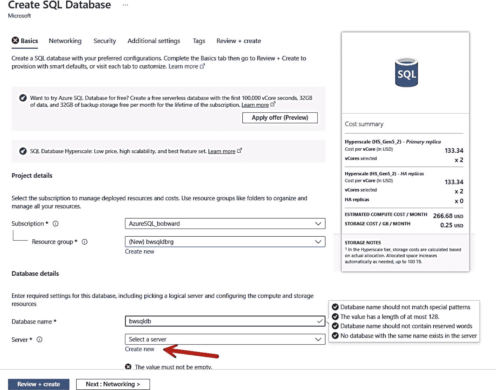

图 4-16
部署 Azure SQL 数据库的“基本”屏幕

从我的屏幕中可以看到，我已经创建了一个新的资源组，定义了一个数据库名称，并可以选择首先创建一个新的数据库（或逻辑）服务器。

注意

请注意此屏幕顶部的选项，可以选择免费的数据库优惠，地址是 [`https://aka.ms/freedboffer`](https://aka.ms/freedboffer)。

你可能想知道为什么需要数据库服务器，毕竟 Azure SQL 数据库的承诺是“你拥有数据库；Azure 管理其他一切”。

`数据库服务器`，也称为 `逻辑服务器`，是存储在 Azure 基础结构中的元数据集合，用于组织一个或多个 Azure SQL 数据库。它*不是*物理服务器上的单一 SQL Server 实例。数据库服务器包含一个 `逻辑 master 数据库`，就像真正的 SQL Server 实例一样。请注意，区域与逻辑服务器关联，而不是与数据库关联。为逻辑服务器创建的任何数据库都将托管在该服务器的区域中。所有连接和网络都将与逻辑服务器关联。实际上，你可以先创建一个逻辑服务器，连接到该服务器，然后使用 `T-SQL CREATE DATABASE` 来创建 Azure SQL 数据库。你为逻辑服务器提供的登录名和密码将成为逻辑 master 数据库中的一个登录名，该用户是服务器级别的主体，实际上相当于所有数据库的 `服务器管理员`。

你可以在图 4-17 中看到我创建逻辑服务器的选择，包括你的区域和首选的身份验证方法。在本例中，我将同时设置 Microsoft Entra 和 SQL 身份验证，并为两者分别提供管理员。

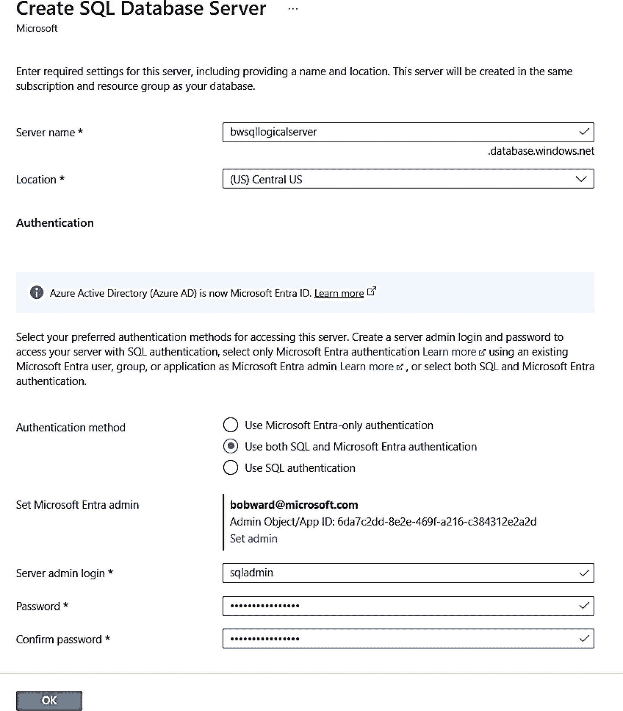

图 4-17
为 Azure SQL 数据库创建逻辑服务器

一旦你为逻辑服务器点击**确定**（它将作为部署的一部分创建），你可以选择是否希望将其作为弹性池的一部分，但在此我不会这样做。你可以先单独创建一个逻辑服务器，然后再为其创建数据库。在此场景中，我正在创建一个新的数据库以及一个逻辑服务器，并将该数据库与这个新服务器放在一起。

现在，我有更多选项来完成“基本”屏幕，如图 4-18 所示。

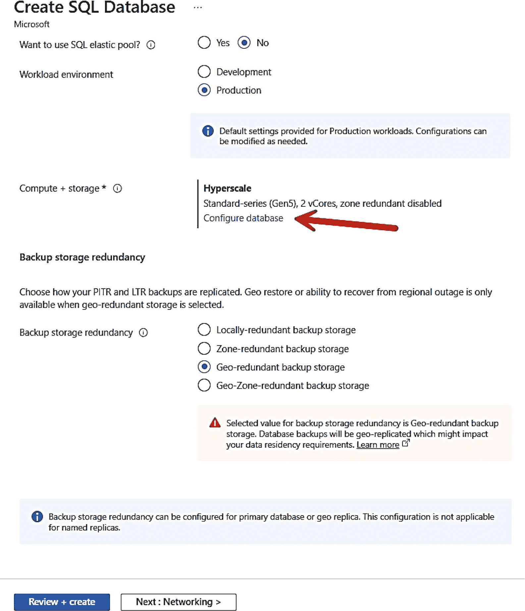

图 4-18
完成 Azure SQL 数据库的“基本”屏幕选择

“工作负载环境”是一个便捷的方法，用于为开发环境选择较低的服务层级和 vCore 大小，或者选择生产选项，该选项将默认为 `Hyperscale`。我将选择**生产**。

然后，你可以选择配置部署的多个方面，包括服务层级和其他资源选择。你可以选择**配置数据库**来进行这些选择。在我向你展示这些选项之前，你还可以选择备份存储冗余选项。这与 Azure SQL 托管实例的选择类似。除非你有数据驻留要求，否则我建议你选择地域冗余选项。地域-区域冗余具有最高级别的冗余和成本，但如果你将区域冗余选择为部署选项，则需要区域冗余选项。实际上，我将为部署选择一个区域冗余选项，我的备份选项也会相应更改。

图 4-19 显示了当你选择**配置数据库**时的选项。

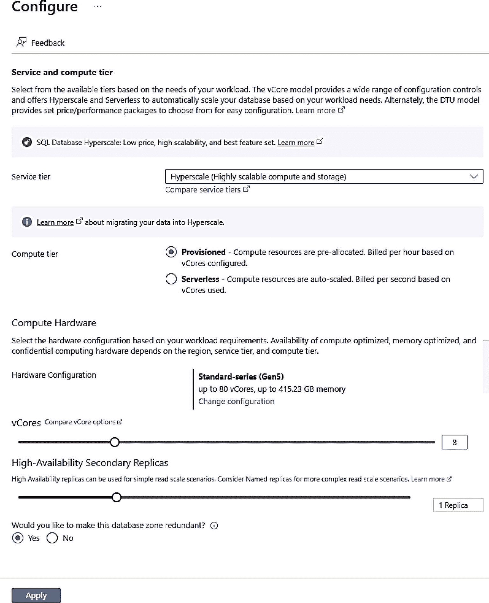

图 4-19
Azure SQL 数据库的计算和存储选项

让我们逐一了解这些选项。

##### 服务层级

我之前提到了你的选择：`通用型 (GP)`、`业务关键型 (BC)` 和 `Hyperscale`。

##### 计算层级

对于 `GP` 和 `Hyperscale`，你可以选择 `Serverless` 或 `预配型`。我将在本章后面向你详细介绍 `Serverless`。

##### 硬件配置

在这里你可以选择 `Gen5`、`FSv2`、`DC` 或 `高级硬件`。

##### vCores

根据你的服务层级和硬件配置，你可以选择所需的 `vCores` 数量（以后可以放大或缩小）。最多可拥有 128 个 `vCores`。

##### HA 副本和区域冗余

`Hyperscale` 允许最多 30 个命名副本，因此你可以在此处选择副本数量。我将在本书的第 8 章详细介绍 `Hyperscale` 的可用性。你不必为 `Hyperscale` 设置任何副本，但如果你选择区域冗余，则需要至少有一个副本。

##### 其他选择

*   如果你选择了 `GP` 或 `BC` 层级，你需要选择最大存储大小。对于 `GP` 和 `BC`，最大可达 4TB。对于 `Hyperscale`，没有最大存储限制，因此你无需做出选择。
*   对于 `GP` 和 `BC` 服务层级，你可以选择 `Azure 混合权益` 进行许可。`Hyperscale` 的新定价结构不需要此选项。

我意识到这里的选择太多了，很难跟上。我为之前的一次演示创建了这张幻灯片，你可能会觉得有用，如图 4-20 所示。

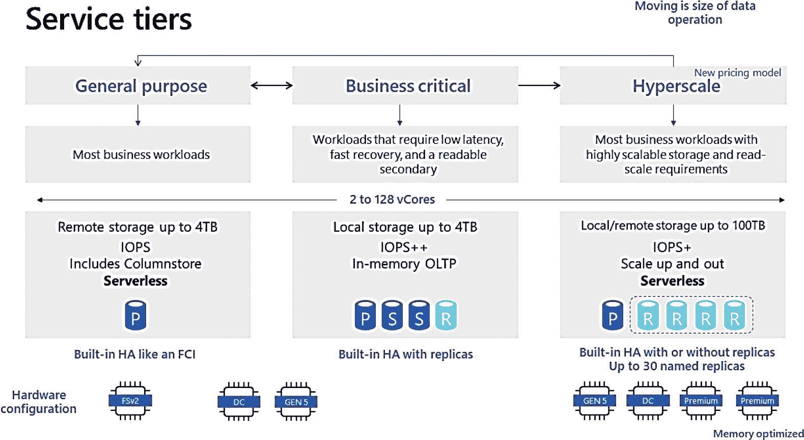

图 4-20
Azure SQL 数据库部署选项


#### 网络

点击`Next: Networking >`查看连接性和网络安全选项，如图 4-21 所示。

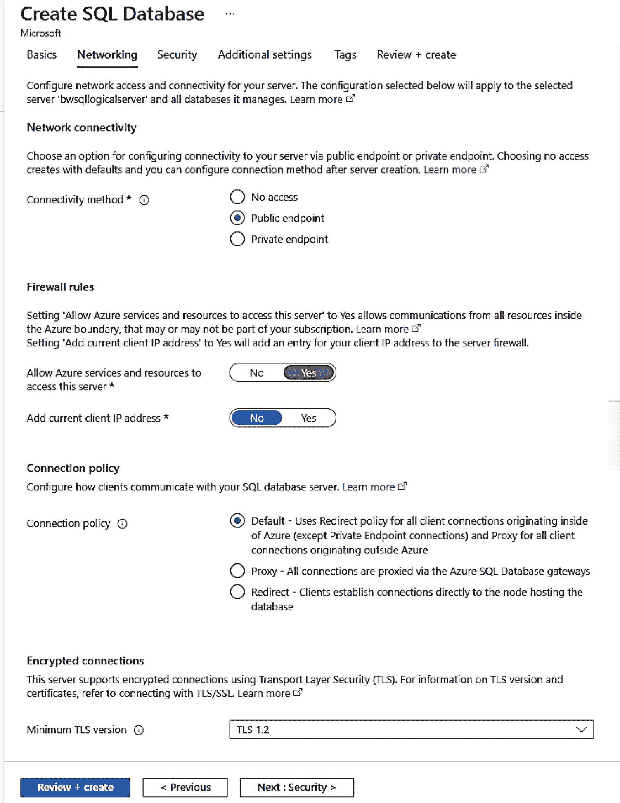

图 4-21

部署 Azure SQL Database 时的网络选项

与 Azure SQL 托管实例不同，Azure SQL Database 本身并非私有虚拟网络的一部分。在部署时，你有三种选择：

*   **无访问权限** – 部署数据库，但在你准备好做出选择之前不允许任何连接。
*   **公共终结点** – 向 Azure 内或 Internet（或两者）公开逻辑服务器和/或数据库的连接。
*   **专用终结点** – 这是 Azure SQL Database 的一项新功能，使其非常安全。这允许你拒绝公共访问服务器和/或数据库，只允许在 Azure 内外定义的虚拟网络内进行专用连接。

目前，我将选择公共端点，并将`Allow Azure services and resources access this server`设置为`Yes`。这允许我部署一个 Azure 虚拟机（无论是什么虚拟网络）并连接到此数据库，或者在我当前部署浏览器的客户端计算机上使用 SQL 客户端工具进行连接。我将在本书的第 6 章向你展示如何加强此模型的安全性。

这里还有一些与 Azure SQL 托管实例类似的连接策略（`Proxy` 或 `Redirect`）和最低 TLS 版本选项。

#### 安全

点击`Next: Security >`设置几个安全相关选项，如图 4-22 所示。

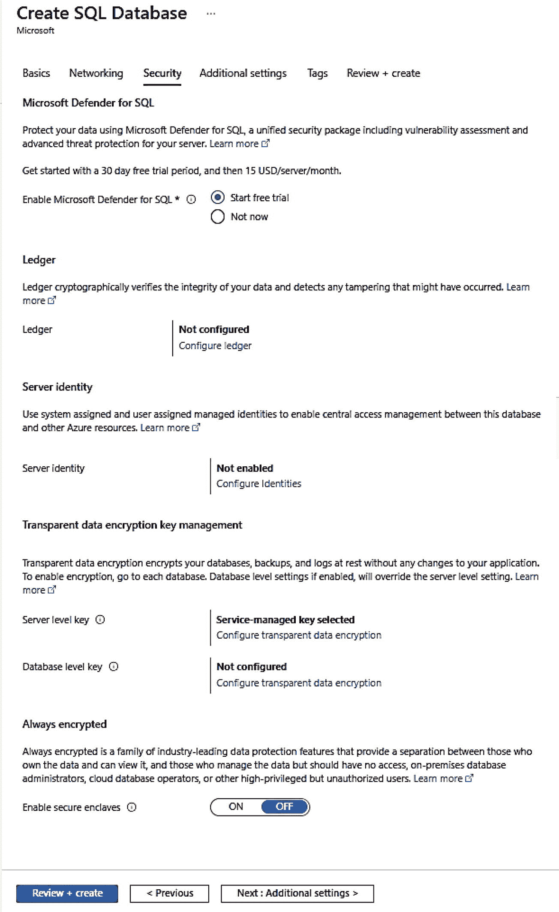

图 4-22

Azure SQL Database 的安全选项

与 Azure SQL 托管实例类似，你可以为 SQL 启用`Microsoft Defender`，并获得漏洞评估和高级威胁防护等功能。

`Ledger` 是一项提供数据库更改防篡改记录的功能，类似于 SQL 内部的区块链。你将在本书的第 10 章了解更多关于 Ledger 的信息。

服务器身份允许你为使用 Microsoft Entra 的*无密码*应用程序配置`托管身份`。

`透明数据加密`（TDE），即静态加密，默认对 Azure SQL Database 开启。此选项为你提供了`自带密钥`（BYOK）的能力。

最后一个选项是为`Always Encrypted`配置`安全飞地`。Always Encrypted 是 SQL 的端到端加密功能。在 [`https://learn.microsoft.com/sql/relational-databases/security/encryption/always-encrypted-enclaves`](https://learn.microsoft.com/sql/relational-databases/security/encryption/always-encrypted-enclaves) 了解更多关于安全飞地的信息。

#### 附加设置

点击`Next: Additional settings >`查看部署的更多选项。图 4-23 显示了这些附加选项。

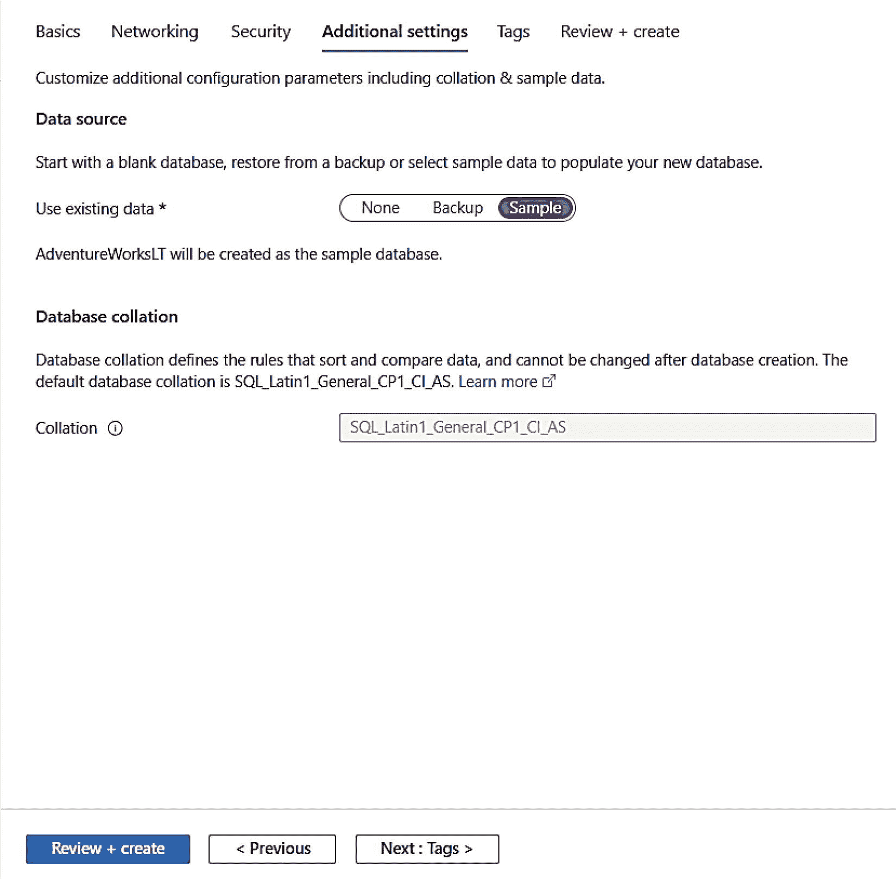

图 4-23

Azure SQL Database 部署的附加设置

你的第一个选择是创建一个空白数据库，或者基于地理复制的 Azure SQL Database 备份或示例 `AdventureWorksLT`（LT 代表轻量版）创建一个数据库。你可以在 [`https://learn.microsoft.com/azure/azure-sql/database/recovery-using-backups`](https://learn.microsoft.com/azure/azure-sql/database/recovery-using-backups) 了解更多关于如何从地理复制备份中还原的信息。

下一个选择是*数据库排序规则*。由于我选择了示例数据库，排序规则已经确定。对于新的空白数据库，在部署期间选择此选项非常重要，因为以后无法更改。

#### 标记

点击`Next: Tags >`为部署定义一个可选标记。

#### 开始部署！

点击`Next: Review + create >`查看最终的验证屏幕，就像任何 Azure 资源部署一样。与托管实例一样，你可以看到预估费用、使用条款、隐私政策、你的选择回顾以及下载 Azure 模板的能力。

点击`Create`开始部署。与托管实例一样，如果你不离开此屏幕，你将在门户的通知区域和主屏幕上看到部署进度。

在我的示例中，部署仅用了几分钟，如图 4-24 所示。

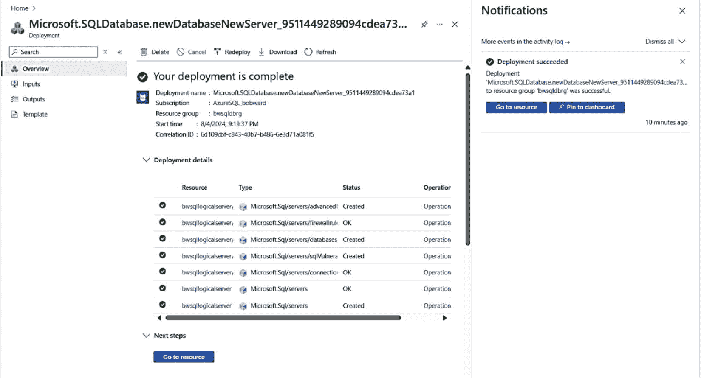

图 4-24

Azure SQL Database 的已完成部署

与托管实例部署一样，你可以点击活动日志中的`More events`查看所有资源的部署顺序。

点击`Go to resource`查看数据库的概述屏幕，如图 4-25。

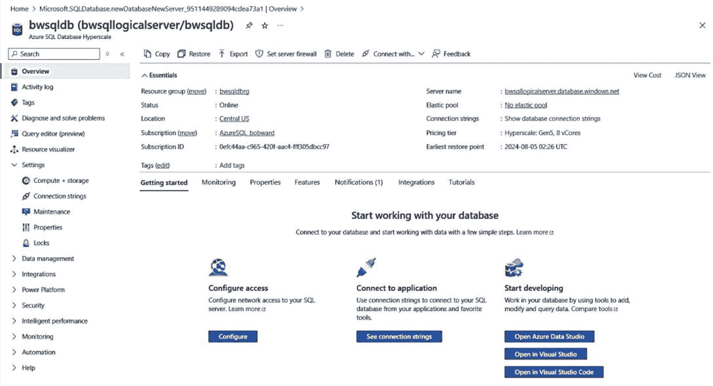

图 4-25

Azure SQL Database 的概述屏幕

与虚拟机和托管实例类似，门户显示了服务菜单、命令栏、工作窗格和监控窗格。虽然这看起来像其他 Azure 资源，但其中大部分信息是 Azure SQL Database 特有的。在你探索安全、性能、可用性和其他功能时，我们将在本书的剩余部分使用这些选项中的许多。我将在本书的第 5 章讨论数据库的一些具体配置选择。

### 部署无服务器版

让我们首先通过查看指定 vCore 方面的独特差异，了解如何为超大规模部署无服务器数据库。

在你刚刚部署的数据库的概述屏幕上，点击服务器名称。这将带你进入如图 4-26 所示的屏幕。

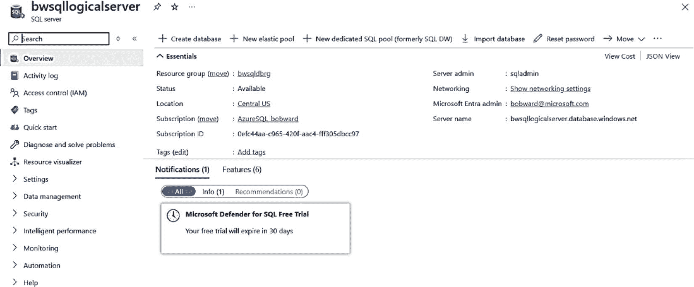

图 4-26

Azure SQL Database 逻辑服务器的概述

点击命令菜单中的`+ Create Database`为该逻辑服务器创建一个新数据库。

在这个新数据库的“基础”屏幕上，我将使用名称`bwsqldbserverless`，然后选择`Configure database`。然后我将使用如图 4-27 的选择来选择无服务器部署。

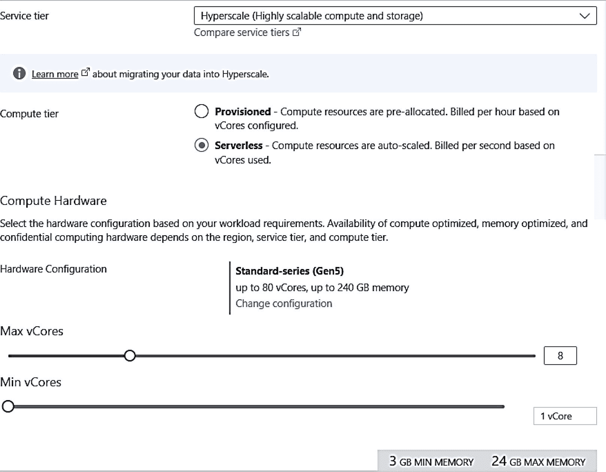

图 4-27

部署无服务器超大规模数据库

请注意，对于无服务器，我现在可以选择最小和最大 vCore 范围。我的数据库可以根据我的资源需求自动向上和向下扩展。无服务器的关键因素是，我只需为每秒使用的 vCore 付费，最小 vCore 作为最低固定成本。

我的所有其他选项都与我的第一次数据库部署相同。就像我可以更改预配数据库的固定 vCore 数量一样，我以后也可以更改无服务器的最小和最大值。我将在本书的第 5 章讨论配置无服务器数据库。

注意

通用服务层的无服务器数据库也有一个自动暂停选项，但在本书撰写时，超大规模尚不可用。


### 部署弹性池

让我们通过查看部署弹性池及池中每个数据库的不同选项，来一起探讨如何部署一个包含两个超大规模数据库的弹性池。

使用与之前部署无服务器数据库相同的方法，我将为同一个逻辑服务器创建一个新数据库。但如你在图 4-28 中所见，需要选择将新数据库放入新弹性池的选项。

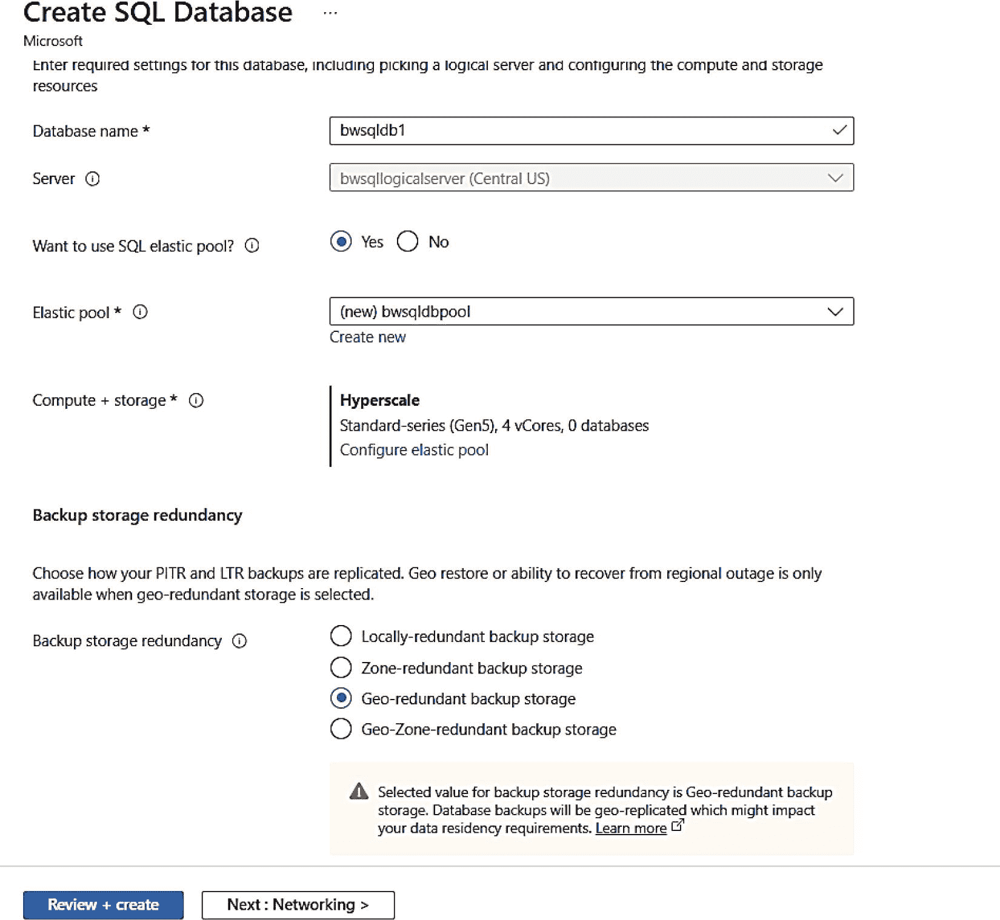
图 4-28：在弹性池中创建数据库

你也可以选择先单独创建池。在本场景中，我同时创建了一个数据库和一个池，并将这个新数据库放入了该池中。

现在我的池中已有一个数据库，让我们再添加一个——这次是一个资源分配不同的数据库（因为这正是我会使用池的原因之一）。

在我刚刚部署的数据库 `sqldb1` 的概览页上，你会看到名为 `bwsqldbpool` 的弹性池被列出。点击它，你将看到如图 4-29 所示的弹性池概览屏幕。

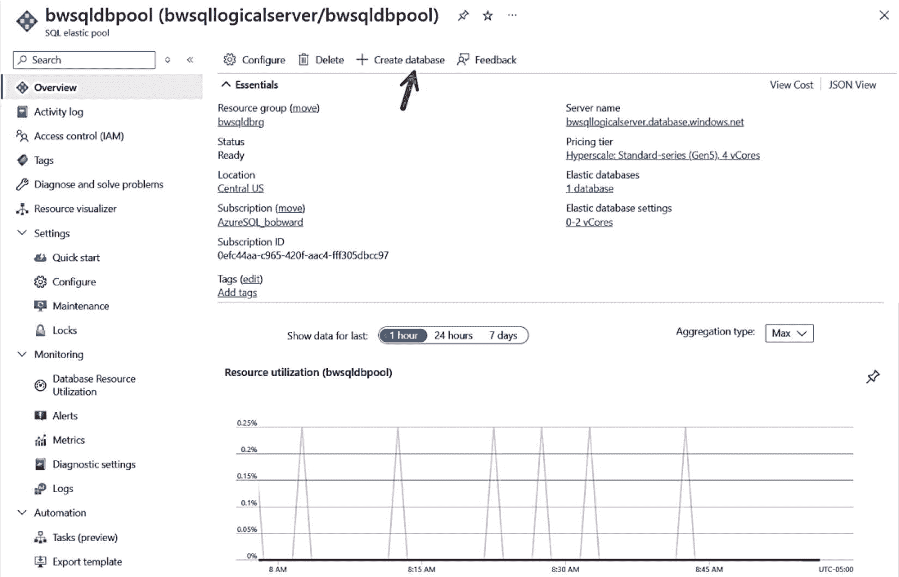
图 4-29：弹性池概览

使用命令窗口中的“创建”按钮，我可以创建另一个数据库。在该体验中，你会发现无需指定服务层、vCPU 或其他选项。这是因为这些选择是在 `池级别` 定义的，而非数据库级别。

你可以在 Azure 门户中查看哪些数据库属于该池。在如图 4-29 所示的同一概览屏幕上，点击“概要”窗格中“弹性数据库”下的数据库，你将获得一个类似图 4-30 的屏幕。

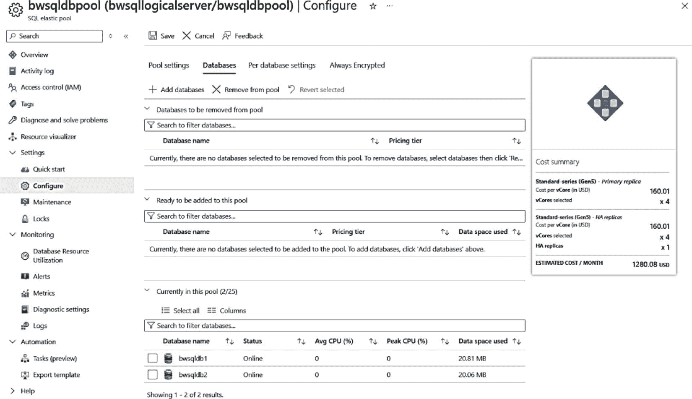
图 4-30：列出弹性池的数据库

你还可以使用目录视图 `sys.database_service_objectives()` 来查找哪些数据库属于特定的弹性池。我将在本书第 5 章向你展示如何为弹性池配置资源选择。

以下是一些值得查阅的弹性池相关参考资料：

*   阅读弹性池概述：[`https://learn.microsoft.com/azure/azure-sql/database/elastic-pool-overview`](https://learn.microsoft.com/azure/azure-sql/database/elastic-pool-overview)。
*   阅读有关为池选择合适大小的指导：[`https://learn.microsoft.com/azure/azure-sql/database/elastic-pool-overview?view=azuresql#how-do-i-choose-the-correct-pool-size`](https://learn.microsoft.com/azure/azure-sql/database/elastic-pool-overview%253Fview%253Dazuresql%2523how-do-i-choose-the-correct-pool-size)。

### 使用 CLI 部署

Azure SQL 数据库可通过命令行接口（CLI），使用 `az sql db` ([`https://learn.microsoft.com/cli/azure/sql/db`](https://learn.microsoft.com/cli/azure/sql/db)) 命令接口或 `New-AzSQLDatabase` PowerShell cmdlet ([`https://learn.microsoft.com/powershell/module/az.sql/new-azsqldatabase`](https://learn.microsoft.com/powershell/module/az.sql/new-azsqldatabase)) 进行部署。

与托管实例不同，为 Azure SQL 数据库使用 `az` CLI 更为简便，无需使用 Azure 模板，因为我只需创建逻辑服务器，然后即可创建数据库（无需先创建虚拟网络及所有组件）。

**提示**

使用类似如下简短的 `az` CLI 命令即可轻松创建数据库：
```
az sql db create -n sqldbiseasy -g bwsqldbrg -s bwsqllogicalserver
```
几分钟内，我便部署了一个通用型 2 vCore 数据库。这假设我已经创建了资源组和逻辑服务器，但它展示了创建新数据库可以有多简单。

你也可以使用 Bicep ([`https://learn.microsoft.com/azure/azure-sql/database/single-database-create-bicep-quickstart`](https://learn.microsoft.com/azure/azure-sql/database/single-database-create-bicep-quickstart)) 和 Terraform ([`https://learn.microsoft.com/azure/azure-sql/database/single-database-create-terraform-quickstart`](https://learn.microsoft.com/azure/azure-sql/database/single-database-create-terraform-quickstart)) 部署 Azure SQL 数据库。

此外，正如我在本章前面所示，你可以使用 **Azure 中的 Copilot** 来获取使用 `az` CLI 部署 Azure SQL 数据库的简易安装步骤。

### 实现细节

**注意**

随着我们对服务进行更改和改进，这些实现细节可能会随时间而变化。我提供其中一些细节，是为了让你了解我们如何构建、管理和运行该服务。

在本书第 1 章，我介绍了我们为 Azure SQL 数据库构建架构以支撑数百万个数据库的非凡历程。让我再为你详细说明一些我们在幕后实现 Azure SQL 数据库的方式。

**注意**

即使在我撰写本章时，我采访了幕后参与 Azure SQL 数据库的许多微软工程团队成员，我们也在研究如何使我们的实现更高效。因此，甚至其中一些细节在你阅读本章时可能已略显过时。这就是云的速度和作者的噩梦！

#### 专用环与实例

与托管实例不同，我们预部署了专用于托管 Azure SQL 数据库的环。除了少数例外情况，每个数据库都由专用的 SQL Server 实例托管（例外情况是“低于核心”的 DTU 选项和弹性池）。这使我们能够为客户提供更好的隔离性，并保持“只需关注数据库”的模型，同时开放一些实例级别的表面区域（例如，DMV 和列存储索引）。我们可能会在同一虚拟机或节点上配置这些实例，但只要我们遵守服务级别协议（SLA）和性能目标，这些细节对你来说是抽象的。

所有这些环和实例都由 `Azure Service Fabric` 提供支持和管理。这是你可用于构建自己的微服务的相同基础结构软件。Azure Service Fabric 架构有详细文档：[`https://learn.microsoft.com/azure/service-fabric/service-fabric-architecture`](https://learn.microsoft.com/azure/service-fabric/service-fabric-architecture)。

#### 逻辑服务器

正如我在本章前面所述，数据库或逻辑服务器只是一个元数据概念。我们为服务器和 `master` 数据库提供了一个接口。但是，当你查询 `master` 数据库的各个方面时，我们可能从服务内的其他存储或文件中提取数据来向你展示信息。我记得在构建我们如今著名的 Azure SQL 入门系列 ([`https://aka.ms/azuresql4beginners`](https://aka.ms/azuresql4beginners)) 时，Anna Hoffman 向我提出了这个问题。我告诉 Anna，在 SQL Server 中，`master` 数据库拥有自己的元数据以及服务器上其他数据库的物理位置，这就是为什么你可以非常轻松地“切换”数据库上下文（即 `USE <database>`）。而在 Azure SQL 数据库和逻辑服务器的情况下，`master` 包含存储在网关服务器上的元数据以及用户数据库所在节点的位置。使用 `USE` 语句轻松切换上下文到另一个服务器是有点困难的。


## 存储、计算与网关

在第 8 章中，您将看到更多关于通用版、商业关键版和超大规模服务层级背后实现高可用性 (HA) 的架构细节。我们通过使用 Azure 存储或结合诸如始终可用性组等技术的本地存储来实现某些 HA 能力。

在所有情况下，连接性的一个关键组件是 `网关`。网关是基本上负责将流量路由到托管 SQL Server 数据库节点的节点。本章前文提到了托管实例中重定向与代理连接类型的使用。相同的概念也适用于 Azure SQL 数据库。网关对于连接性至关重要，因为它们为应用程序提供连接抽象，无论数据库节点位于何处，这将在第 6 章（关于安全性）和第 8 章（关于可用性）中进一步阐述。

## 无服务器

无服务器计算涉及我们在 SQL Server 标准部署中实现的几项有趣技术。许多细节已在我们的文档 [`https://learn.microsoft.com/azure/azure-sql/database/serverless-tier-overview`](https://learn.microsoft.com/azure/azure-sql/database/serverless-tier-overview) 中描述。

由于无服务器部署中存储和计算是分离的，因此 `暂停` 数据库并不困难，因为没有应用程序连接。我们只需要保留足够的状态信息，以便在新的登录发生时，可以将数据库连接到实例并“预热”应用程序。

自动缩放则更有趣。我们需要在不中断应用程序的情况下向上或向下扩展数据库 CPU 资源。如果我们可以满足新扩展需求的节点上进行扩展，则不会发生中断。但是，如果我们无法满足该需求，我们可能需要使用 Azure 负载均衡器，在可能的情况下保持应用程序连接，直到找到满足需求的新节点，但在新节点启动时可能会发生断开连接。

内存管理也有所不同，我们必须部署内存策略，在 CPU 或缓存利用率低时回收 SQL Server 实例的内存。可以将这个概念理解为，我们正在向 SQL Server 发出存在外部内存压力的信号，并降低内存目标。无服务器的自动缩放和内存管理在 [`https://learn.microsoft.com/azure/azure-sql/database/serverless-tier-overview?view=azuresql&tabs=general-purpose#autoscaling`](https://learn.microsoft.com/azure/azure-sql/database/serverless-tier-overview%253Fview%253Dazuresql%2526tabs%253Dgeneral-purpose%2523autoscaling) 中有更详细的描述。

## 超大规模

超大规模是针对数据库的一种独特实现，其架构（专用环和节点）与通用版或商业关键服务层级有显著不同。

超大规模部署涉及一系列用于计算、日志记录和缓存的节点，并结合 Azure 存储。我在本书第 1 章中讨论过此架构，但值得再次展示给您，如图 4-31 所示（该图直接来自文档 [`https://learn.microsoft.com/azure/azure-sql/database/service-tier-hyperscale?view=azuresql#distributed-functions-architecture`](https://learn.microsoft.com/azure/azure-sql/database/service-tier-hyperscale%253Fview%253Dazuresql%2523distributed-functions-architecture)）。

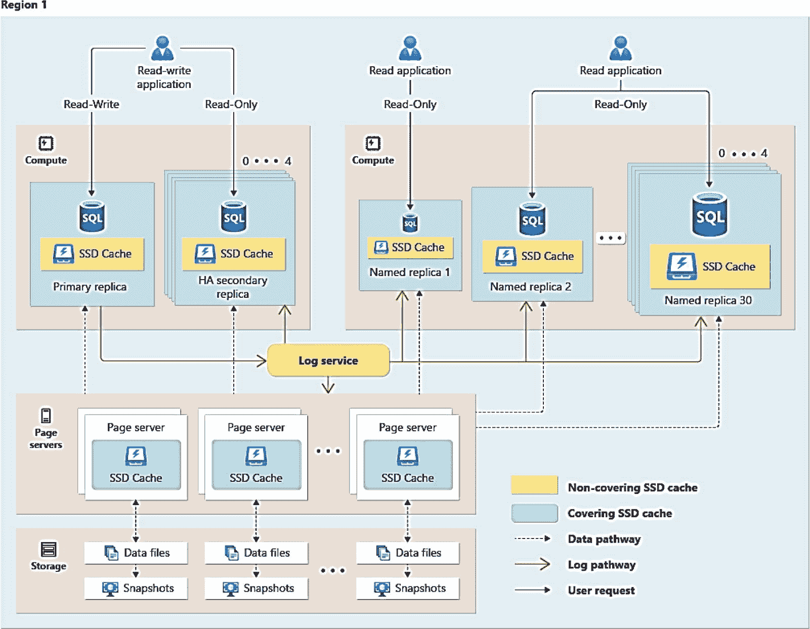

图 4-31：超大规模架构

我将在本书第 8 章向您展示此架构的更多工作部分，但请允许我停下来指出几个关键组件：

*   计算与存储分离

    与通用版类似，我们将数据库文件存储在 Azure 存储上。但请注意，这里我们使用的是 Azure 标准存储。由于缓存系统的存在，访问数据库文件的速度并非首要考量。

*   `缓存` 系统

    我们在页面服务器（实际托管数据库页面的节点）和计算节点上，结合使用页面服务器和缓冲池缓存（可视为扩展缓冲池的 SSD 驱动器）。

*   日志服务

    对于超大规模，任何记录的更改最初仍位于主计算节点的日志缓存中。然而，当日志更改必须刷新到磁盘（提交）时，这些 I/O 请求会被 `重定向` 到运行着一个名为日志服务（也称为 Xlog）组件的另一个节点。日志服务负责确保更改被本地存储（称为 `着陆区`）并刷新到缓存系统、辅助副本，并最终到 Azure 存储。

*   解耦的副本

    在某种程度上，超大规模为您提供了通用版和商业关键版的最佳组合。实际的数据库和事务日志文件存储在 Azure 存储中（具有其自身的冗余），但我们也有副本以实现极快速的高可用性。

    然而，辅助副本系统不使用始终可用性组。实际上，主副本和辅助副本彼此并不知晓。辅助副本使用日志更改方法，但其更改来源于日志服务。一旦日志服务固化了更改，主副本上的提交即可进行。

    即使没有辅助副本，也被允许实现高可用性。如何实现？如果主节点出现问题，我们可以在新节点上部署一个新的主副本，并使用页面服务器甚至 Azure 存储中的数据库文件，因为它已被解耦。话虽如此，有辅助副本存在时，恢复时间目标要快得多。辅助副本系统（因为您最多可以拥有四个）为 Azure SQL 数据库提供了最佳的读取扩展选项。

*   `超快速` 备份与恢复

    由于大多数数据访问来自缓存系统，在 `预热` 的系统中很少需要从数据库文件中读取数据库页面。这使我们能够对数据库文件使用快照备份。快照备份速度极快，因为我们只需将文件复制到另一个存储位置。另一个惊人的地方是恢复。恢复数据库快照的速度快得惊人！

## 资源治理

为了满足 Azure SQL 数据库的服务级别协议要求，我们必须对数据库的使用设置一些资源限制。本章中已描述了其中一些限制。在幕后，我们使用这些技术来执行这些限制。

### SQL Server 资源治理器

Azure SQL 托管实例允许用户定义工作负载组和池。Azure SQL 数据库在后台使用资源治理器来强制执行某些限制。迁移到专用 SQL Server 实例是允许我们使用资源治理器的关键驱动因素。

### 引擎增强

引擎在 Azure 中得到了增强，可以检测特定大小和速率的事务日志记录生成，并在必要时对应用程序进行治理。观察到等待类型为 `LOG_RATE_GOVERNOR` 是此治理正在发生的主要信号。您可以在 [`https://learn.microsoft.com/azure/azure-sql/database/resource-limits-logical-server?view=azuresql#transaction-log-rate-governance`](https://learn.microsoft.com/azure/azure-sql/database/resource-limits-logical-server?view=azuresql#transaction-log-rate-governance) 阅读更多关于日志速率治理的信息。

### Windows 作业对象

本章前面提到过这种技术。Windows 作业对象允许我们控制 SQL Server 引擎进程上的资源使用，以确保我们正确执行诸如内存之类的资源限制。


##### 文件源资源管理器 (FSRM)

FSRM 提供了一种机制，因此我们可以妥善实施超出 SQL Server 文件大小限制控制范围的存储上限。

我们在一篇详细的博客文章中讨论了如何使用这些技术来实施资源限制以及我们为何使用它们：[`azure.microsoft.com/blog/resource-governance-in-azure-sql-database/`](https://azure.microsoft.com/blog/resource-governance-in-azure-sql-database/)。

### 连接并验证部署

部署 Azure SQL 数据库后，您可能希望快速连接并验证部署的各个方面。

#### 连接到 Azure SQL 数据库

在本章前面，我部署了我的逻辑服务器和 Azure SQL 数据库，允许通过公共终结点访问，并设置了选项以允许 Azure 服务访问，同时为我通过门户部署时所用的客户端 IP 地址添加了防火墙规则。我将向您展示如何使用这两种技术进行连接。

由于我在部署数据库的逻辑服务器时使用了"允许 Azure 服务和资源访问此服务器"选项，因此我可以使用 Azure 虚拟机，甚至使用 Azure Cloud Shell 中的 `sqlcmd` 来连接到此服务器和数据库。

要使用 Azure Cloud Shell 连接，您需要找到部署的逻辑服务器的名称。通过门户有很多方法可以做到这一点。您可以直接在门户主页查看您的资源组或资源，并找到服务器 `bwsqllogicalserver`（或您命名的服务器）。

图 4-32 显示了服务器的工作窗格，其中包含使用 SQL Server 工具或应用程序连接时应使用的服务器名称。

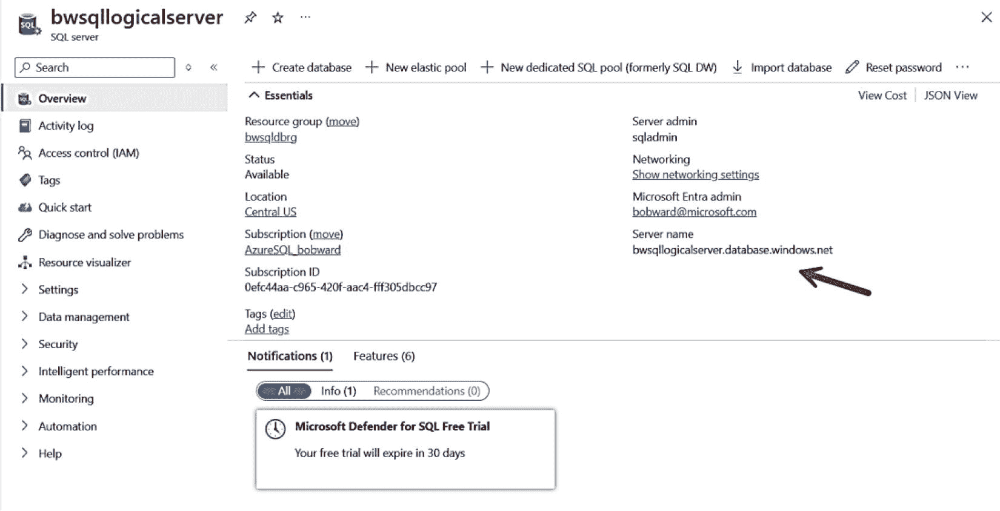

图 4-32
查找要连接的服务器名称

请注意，我点击了服务器名称旁边以将完全限定域名 (FQDN) 复制到剪贴板。您会发现 FQDN 是逻辑服务器名称和 `.database.windows.net` 的组合。

注意

Azure SQL 数据库还支持 DNS 别名的概念，您可以在 [`learn.microsoft.com/azure/azure-sql/database/dns-alias-overview`](https://learn.microsoft.com/azure/azure-sql/database/dns-alias-overview) 阅读相关内容。

我现在可以打开 Azure Cloud Shell（您可以使用门户主页或 [`shell.azure.com`](https://shell.azure.com)）。

由于 `sqlcmd` 已安装在云 shell 中，我可以使用类似于图 4-33 的语法。

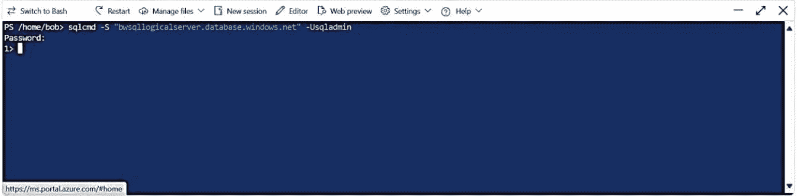

图 4-33
在 Azure Cloud Shell 中使用 `sqlcmd`

我也可以在 Azure 中的虚拟机内使用 SSMS 等工具连接，但让我向您展示另一种方法。

我在使用 Azure 门户时，还为逻辑服务器配置了针对当时计算机 IP 地址的防火墙规则。在逻辑服务器的工作窗格中，我可以选择 **显示防火墙设置** 以查看以下信息。图 4-34 显示了此防火墙设置以及其他网络选项。

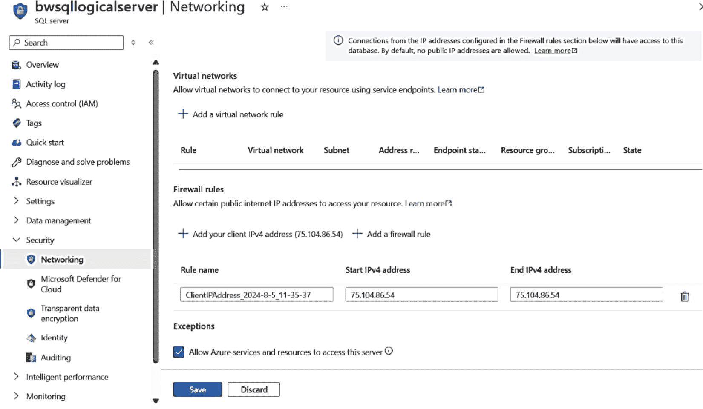

图 4-34
为 Azure SQL 数据库配置防火墙规则

防火墙规则与您在 Windows Server 或 Linux 中配置的防火墙规则非常相似。如果您以前使用过 SQL Server，您会知道默认情况下，我们不会在操作系统中为端口 1433 打开防火墙规则。上面的防火墙规则正在为这个特定 IP 地址打开对此逻辑服务器网关的访问权限。防火墙规则可以在逻辑服务器级别或数据库级别指定。您可以在 [`learn.microsoft.com/azure/azure-sql/database/firewall-configure`](https://learn.microsoft.com/azure/azure-sql/database/firewall-configure) 阅读有关 Azure SQL 数据库防火墙规则的更多信息。我将在本书的第 6 章中更详细地讨论使用一种更安全的方法连接到 Azure SQL 数据库，称为 `专用链接`。

由于我的客户端 IP 地址在防火墙规则中，因此我可以使用 SQL Server Management Studio 等工具从我的客户端笔记本电脑连接到逻辑服务器，如图 4-35 所示。

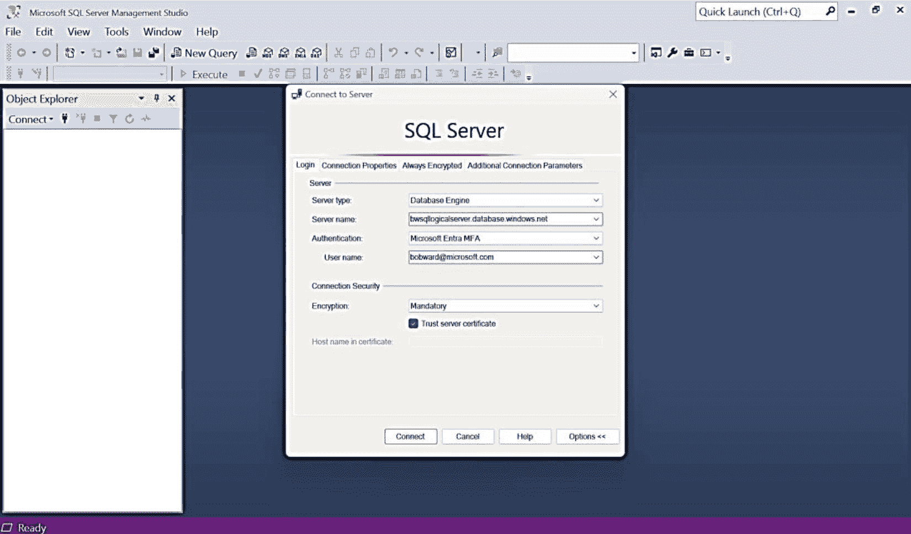

图 4-35
使用 SSMS 连接到 Azure SQL 数据库

您可以看到这里我使用了 Microsoft Entra 身份验证，因为在部署逻辑服务器时，我已将我的 Microsoft Entra 帐户添加为管理员。

点击连接后，我得到了熟悉的对象资源管理器，展开数据库列表，我看到了本章中部署的所有数据库。我可以右键单击服务器，选择"新建查询"，并尝试将数据库上下文切换到我的一个数据库，如图 4-36 所示。

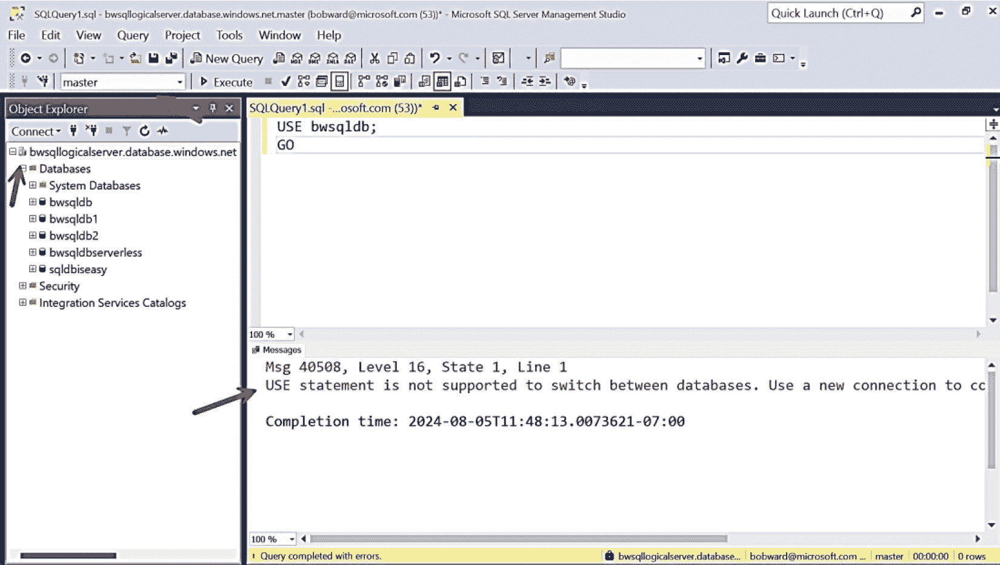

图 4-36
尝试切换 Azure SQL 数据库的数据库上下文

您可以首先看到对象资源管理器 (OE) 的一些差异，包括服务器名称的图标颜色（Azure 蓝色）。另请注意，OE 中的选项没有 SQL Server 或托管实例那么多（因为这不是一个完整的 SQL Server 实例）。

当我使用 SSMS 指定无选项进行连接时，我被置于逻辑服务器的逻辑主数据库上下文中。我尝试使用熟悉的 T-SQL `USE` 语句更改数据库上下文，但失败了。为什么？

如果您考虑在 SQL Server 上使用 T-SQL `USE`，引擎会将上下文切换到存储在实例上的数据库。对于 Azure SQL 数据库逻辑服务器，数据库位于单独的 SQL Server 实例上，这些实例可以分布在 Azure 区域的不同区域中。`USE` 语句并非设计用于将连接重定向到不同的服务器。

因此，对于 SSMS，您可以在点击"连接"按钮之前指定要连接到的数据库（使用"选项"按钮），或者使用下拉框切换数据库上下文（这确实会更改连接上下文）。


#### 验证部署

虽然可以使用活动日志来验证数据库的部署，但没有直接的方法来查看 SQL Server 实例背后的 `ERRORLOG`。因此，可以使用一些 T-SQL 查询来检查部署情况。

##### 注意

尽管有些查询在逻辑主数据库的上下文中运行是有意义的，但我是在我的数据库 `bwsqldb` 的上下文中运行这些查询的。

```sql
SELECT @@version;
```
```
Microsoft SQL Azure (RTM) - 12.0.2000.8   Jun 19 2024 16:01:48   Copyright (C) 2022 Microsoft Corporation
```

这个结果与在 Azure SQL Managed Instance 中得到的结果完全相同，表明这是一个无版本的 SQL Server。

```sql
SELECT database_id, name, compatibility_level FROM sys.databases;
```
```
database_id    name                compatibility_level
1              master              160
5              bwsqldb             160
6              bwsqldbserverless   160
7              bwsqldb1            160
8              bwsqldb2            160
9              sqldbiseasy         160
```

在用户数据库的上下文中，你总是会看到 `master` 数据库和你自己的数据库。但请注意，这仍然是逻辑主数据库，而不是托管数据库的 SQL Server 实例上的物理主数据库。注意，对于 Azure SQL Database，我们已经默认使用 `dbcompat` 160（但你也可以根据需要改回旧的兼容级别）。

```sql
SELECT name, object_id, type_desc FROM sys.objects;
```

由于这个数据库是基于示例 `AdventureWorksLT` 构建的，我从这个目录视图中得到了大约 233 行数据，包括系统表。

```sql
SELECT * FROM sys.dm_os_schedulers;
```

这是我们能够暴露的一个 DMV，因为我们运行在一个专用的 SQL Server 实例上。我部署了一个 8-vCore 的 Hyperscale 数据库，正如我所预期的，我得到了八个 `ONLINE` 的调度器。

##### 注意

`sys.dm_os_sys_info` 是支持的，但 `sys.dm_os_process_memory` 在 Azure SQL Database 中不支持。

```sql
SELECT * FROM sys.dm_exec_requests;
```

这是世界上最常见的用于检查 SQL Server 上运行状态的 DMV 之一。我运行它只是为了确保所有正常的后台进程都在运行，包括 `LAZY WRITER`、`RECOVERY WRITER`、`LOCK MONITOR` 等。

这个 DMV 在 Azure SQL Database 上有一个有趣的转折点。它将显示你数据库所在实例的请求，而不是你逻辑服务器上其他数据库的请求（因为它们部署在其他实例上）。

```sql
SELECT SERVERPROPERTY('EngineEdition');
```

根据 [`learn.microsoft.com/sql/t-sql/functions/serverproperty-transact-sql`](https://learn.microsoft.com/sql/t-sql/functions/serverproperty-transact-sql) 的文档，值 5 表示 SQL Database。

还有两个 Azure 特有的新 DMV，在 SQL Server 中找不到：

```sql
SELECT * FROM sys.dm_user_db_resource_governance;
```

这个 DMV 的设计目的就是显示特定 Azure SQL Database 的资源限制。你可以查看诸如内存、最大存储、日志速率等限制。你可以在 [`learn.microsoft.com/sql/relational-databases/system-dynamic-management-views/sys-dm-user-db-resource-governor-azure-sql-database`](https://learn.microsoft.com/sql/relational-databases/system-dynamic-management-views/sys-dm-user-db-resource-governor-azure-sql-database) 阅读关于这个 DMV 的文档。

```sql
SELECT * FROM sys.dm_os_job_object;
```

这是一个 Azure 特有的 DMV，显示 Azure 使用 Windows 作业对象（Job Objects）施加给数据库的资源限制。我特别关注的列是 `memory_limit_mb`，它显示了数据库可以访问的真实内存量。我在“实现细节”一节中讨论过 Windows 作业对象。

##### 注意

我不建议你依赖在逻辑主数据库上下文中运行这些查询的任何结果。即使你可能看到结果，它们也没有任何意义，因为逻辑主数据库并不是一个真正的物理主数据库。

## 迁移到 Azure SQL Database

迁移到 Azure SQL Database 涉及与迁移到托管实例相同的过程：评估与规划、迁移、应用更改和迁移后步骤。

虽然步骤相同，但你会发现几个重要的区别：

*   首先也是最重要的，你无法将 SQL Server 备份还原到 Azure SQL Database，因此你所有的选择都会感觉像是一种“导出/导入”类型的体验。

*   Azure SQL Database 对功能有更多的限制，因此你可能会发现评估会找出更多需要在迁移前解决的问题。一个例子是像 `Service Broker` 这样的功能，它在托管实例中支持，但在 Azure SQL Database 中不支持。让我给你一个简单的例子。当我第一次尝试将示例 `WideWorldImporters` ([`github.com/Microsoft/sql-server-samples/releases/tag/wide-world-importers-v1.0`](https://github.com/Microsoft/sql-server-samples/releases/tag/wide-world-importers-v1.0)) 迁移到 Azure SQL Database 时，我遇到了一堆问题，因为该示例中使用的某些功能在 Azure SQL Database 中不起作用。因此，我需要使用在 [`github.com/Microsoft/sql-server-samples/releases/download/wide-world-importers-v1.0/WideWorldImporters-Standard.bacpac`](https://github.com/Microsoft/sql-server-samples/releases/download/wide-world-importers-v1.0/WideWorldImporters-Standard.bacpac) 找到的标准版 `WideWorldImporters`。

*   迁移到 Azure SQL Database 需要先迁移你的架构（所有定义），然后是数据。你可以使用 Azure 数据库迁移服务（DMS）来完成此操作。在 [`learn.microsoft.com/data-migration/sql-server/database/database-migration-service`](https://learn.microsoft.com/data-migration/sql-server/database/database-migration-service) 阅读更多关于如何执行此操作的信息。像托管实例一样，考虑使用与你当前 SQL Server 安装匹配的数据库兼容级别，然后再迁移到最新的 `dbcompat` 级别。在 [`aka.ms/dbcompat`](https://aka.ms/dbcompat) 了解更多关于 `dbcompat` 的信息。

    你还可以使用 SSIS 包、Azure 数据工厂、`bcp` 或 `BACPAC` 文件将数据加载到 Azure SQL Database 中。你应该知道，Azure SQL Database 不支持批量导入的最小日志记录。

*   由 Azure Arc 评估的 SQL Server ([`learn.microsoft.com/sql/sql-server/azure-arc/migration-assessment`](https://learn.microsoft.com/sql/sql-server/azure-arc/migration-assessment)) 以及 Azure Migrate 评估 ([`aka.ms/azuremigrate`](https://aka.ms/azuremigrate)) 可以帮助你查看你的数据库配置是否与迁移到 Azure SQL Database 兼容，或者是否需要考虑更改。我经常看到的一个常见例子是跨数据库查询，这在 Azure SQL Database 中是不支持的。

像托管实例一样，应用程序需要更改连接字符串，可能还需要更改身份验证方法。根据所使用的 T-SQL 功能和语言构造，可能需要进行进一步的应用程序更改。为了更彻底，请查阅这份关于 T-SQL 差异的文档：[`docs.microsoft.com/en-us/azure/azure-sql/database/transact-sql-tsql-differences-sql-server`](https://docs.microsoft.com/en-us/azure/azure-sql/database/transact-sql-tsql-differences-sql-server)。

使用本书的其余章节来指导你在迁移后需要进行的任何更改，以充分利用 Azure 中的安全、性能和可用性。

## 总结

在本章中，你学习了如何通过执行一次部署演练，来做出最佳选择以部署 Azure SQL 托管实例或数据库。你了解了托管实例和数据库两者的部署细节，以及一些有趣的实现细节。

你学习了如何连接到托管实例和数据库部署并运行验证查询。你还学习了迁移技术和工具，用于将现有的 SQL Server 迁移到 Azure SQL 托管实例和数据库。

针对 SQL 专业人员的云 workshop ([`https://aka.ms/cloudsqlworkshop`](https://aka.ms/cloudsqlworkshop)) 提供了一些很棒的实践实验，可用于尝试部署 Azure SQL 托管实例和 Azure SQL 数据库。试试这些以获得分步体验：

[`https://github.com/microsoft/cloudsqlworkshop/tree/main/cloudsqlworkshop/05_Deploy_AzureSQLMI`](https://github.com/microsoft/cloudsqlworkshop/tree/main/cloudsqlworkshop/05_Deploy_AzureSQLMI)

[`https://github.com/microsoft/cloudsqlworkshop/tree/main/cloudsqlworkshop/07_Deploy_Manage_Optimize_AzureSQLDB`](https://github.com/microsoft/cloudsqlworkshop/tree/main/cloudsqlworkshop/07_Deploy_Manage_Optimize_AzureSQLDB)

既然你已经完成了部署，可以在下一章中了解更多关于如何做出配置选择，并将这些选择与配置 SQL Server 实例或数据库进行比较的内容。

