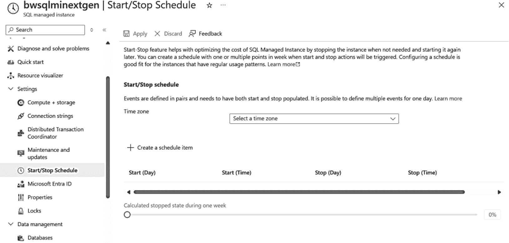
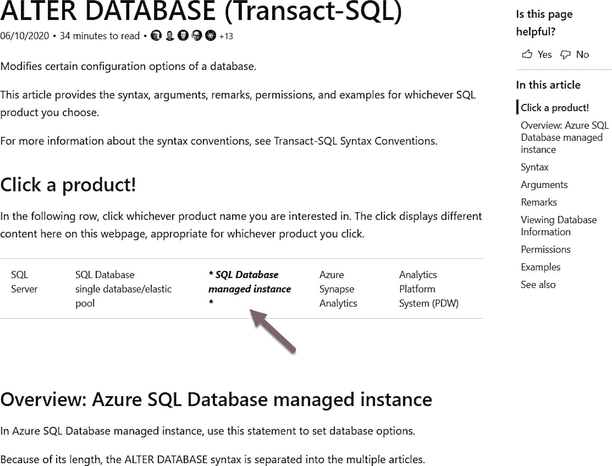

# 5. 配置 Azure SQL

既然你已经部署了 Azure SQL 托管实例或数据库，在进入生产环境之前或之后，可能还需要进行一些配置更改。

在本章中，我们将探讨 Azure SQL 托管实例和数据库的配置选项，并将其与 SQL Server 的配置选项进行比较。此外，我将讨论一些通常可以为 SQL Server 做出但在 Azure SQL 中受到限制的配置选择及其原因。在本章最后，我还将花时间解释空间管理、加载数据的各种技术，以及为什么 Azure SQL 被称为无版本。

你可以尝试本章描述的一些方法。在讨论配置选择和限制时，我将使用本书第 4 章中已完成的现有部署。要尝试本章中我使用的任何技术或命令，你将需要：

*   一个 Azure 订阅。
*   对该 Azure 订阅具有最低限度的参与者角色访问权限。你可以在 [`https://learn.microsoft.com/azure/role-based-access-control/built-in-roles`](https://learn.microsoft.com/azure/role-based-access-control/built-in-roles) 了解更多关于 Azure 内置角色的信息。
*   访问 Azure 门户的权限。
*   一个 Azure SQL 托管实例和一个 Azure SQL 数据库的部署。
*   安装 `az` CLI（更多详情参见 [`https://learn.microsoft.com/cli/azure/install-azure-cli`](https://learn.microsoft.com/cli/azure/install-azure-cli)）。你也可以使用 Azure Cloud Shell，因为其中已预装 `az`。你可以在 [`https://azure.microsoft.com/features/cloud-shell/`](https://azure.microsoft.com/features/cloud-shell/) 了解更多关于 Azure Cloud Shell 的信息。
*   本章将运行一些 T-SQL，因此请安装一个工具，如 SQL Server Management Studio (SSMS)：[`https://aka.ms/ssms`](https://aka.ms/ssms)。

## 配置 Azure SQL 托管实例

有几种选项可用于配置 SQL Server 的实例。让我们看看其中一些与配置 Azure SQL 托管实例的比较。

### sp_configure

在实例级别配置 SQL Server 的一种方法是使用系统存储过程 `sp_configure`。此存储过程支持在 Azure SQL 托管实例中使用，但有以下例外：

*   任何需要重启服务器的配置值都不受支持（因为我们不提供重启实例的接口）。例如，如果尝试更改 `scan for startup procs` 配置选项，将会收到错误：

    ```
    Msg 5869
    对服务器配置选项 scan for startup procs 的更改在 SQL 数据库托管实例中不受支持。
    ```

*   高级配置值是受支持的。
*   某些选项不受支持，因为我们不允许该级别的配置，或者通过资源限制以不同方式强制执行。例如，如果尝试更改 `max server memory` 值，会收到以下错误：

    ```
    Msg 5870
    对服务器配置选项 max server memory (MB) 的更改在此版本的 SQL Server 中不受支持。
    ```

### 跟踪标志

Azure SQL 托管实例将一组预定的全局跟踪标志设置为 ON，你可以使用 `DBCC TRACESTATUS` 查看（截至本书撰写时，设置了大约 31 个跟踪标志）。

我们设置的一些标志无法关闭，例如跟踪标志 1800（用于磁盘扇区大小对齐），而有些则可以关闭和开启。要查看可以开启和关闭的跟踪标志列表，请参阅 [`https://learn.microsoft.com/sql/t-sql/database-console-commands/dbcc-traceon-transact-sql?view=sql-server-ver15#remarks`](https://learn.microsoft.com/sql/t-sql/database-console-commands/dbcc-traceon-transact-sql%3Fview%3Dsql-server-ver15%23remarks)。

不支持会话级别的跟踪标志。

注意

我们一直在努力消除对跟踪标志的需求，但显然有些仍然是必需的。像 `ALTER DATABASE SCOPED CONFIGURATION` 这样的命令的引入，就是替代跟踪标志的配置方法的一个例子。

### Tempdb

Tempdb 的大小上限可通过更改部署选项或大小进行配置。对于通用型部署，每个 vCore 分配 24GB，但最大限制约为 2TB。对于业务关键型部署，其大小受实例的最大存储大小限制。事务日志上限为 120GB，但由于默认启用了加速数据库恢复，并且我们会定期备份事务日志，因此我预计你不会遇到空间不足的问题。

你还可以在 Azure SQL 托管实例中配置 tempdb 的以下属性：

*   tempdb 数据文件的数量（最多 128 个）。新实例默认部署有 12 个数据文件和 1 个事务日志文件。
*   数据文件和日志文件的自动增长增量（与 SQL Server 一样，所有数据文件的大小应相同）。
*   可以更改 tempdb 文件的逻辑名称。

虽然所有这些更改都是持久化的，但唯一的注意事项是所有文件的初始大小为 16MB。你可以更改文件的大小，但每次发生重启或故障转移时，初始大小将重置为 16MB，因此不要依赖对文件大小的更改。

### Master 和 Model

与 SQL Server 类似，你可以配置 master 数据库的大小，甚至可以向其添加对象（尽管这在 SQL Server 上通常也不推荐）。

同样的概念也适用于 model。你可以配置 model 数据库的大小，以便新数据库采用该大小。此外，你可以向 model 添加对象，这些对象将被新的用户数据库继承。

### 配置版本

你可以使用 SQL Server 安装程序（或在 Linux 上使用 `mssql-conf`）来更改 SQL Server 的版本（例如，从标准版到企业版）。

对于 Azure SQL 托管实例，你可以使用 Azure 门户或 CLI 接口（如 `az sql mi update` 或 PowerShell `Set-AzSqlInstance`）来更改部署服务层级（通用型或业务关键型）或大小（vCore 数或最大存储）。

注意

正如我在本书前面所提到的，部署或更改托管实例的部署可能是一个耗时的操作。

### 计算与存储

你在本书的第 4 章中，已经了解了根据所选服务层级而异的各种计算和存储选项。

请记住，对于`托管实例`，对`vCores`、硬件配置和/或最大存储的更改，可能会导致一个需要一些时间才能完成的管理操作。例如，为`通用型`服务层级扩展存储最快可能只需五分钟。然而，为任何服务层级扩展`vCores`都可能需要一个小时。此外，许多影响`业务关键型`服务层级的操作，可能需要将数据库重新分配到另一个节点。由于任何更改在“切换”完成前都不会影响你的应用程序，因此停机时间是最少的。请记住，`通用型`服务层级的`下一代`版本包含了将`IOPS`与计算和存储分开配置的能力。

所有操作及其预期时长的完整列表可在 [`https://learn.microsoft.com/azure/azure-sql/managed-instance/management-operations-overview`](https://learn.microsoft.com/azure/azure-sql/managed-instance/management-operations-overview) 找到。

## 网络配置

一旦你部署了`托管实例`，你可能需要对该实例的网络配置进行一些调整。

你可以选择`将托管实例移动到另一个子网`，这可以在当前虚拟网络内进行，也可以移动到不同的虚拟网络。你可以将此过程想象成：使用你的实例和所有已移动的数据库来预配一个新的虚拟集群，然后移除现有的集群。与其他管理操作一样，这可能是一个漫长的过程，但你的停机时间是最少的。所有详细信息请参阅 [`https://learn.microsoft.com/azure/azure-sql/managed-instance/vnet-subnet-move-instance`](https://learn.microsoft.com/azure/azure-sql/managed-instance/vnet-subnet-move-instance)。

你可以`启用公共端点`（我在部署时将其保持为禁用状态）并`将连接类型`更改为`代理`（这是默认设置，但我在部署时选择了`重定向`）。

此外，部署期间还提供了另一个选项，即`最低 TLS 版本`。传输层安全协议 (`TLS`) 是一种用于加密连接的协议，受到 `SQL Server` 和 Azure SQL 的支持。`TLS 1.2` 是目前推荐的最低支持版本，因为它修复了早期版本中发现的一些漏洞。但是，请谨慎使用此设置，因为它可能会导致使用不支持该 `TLS` 版本驱动程序的应用程序无法连接。你可以在 [`https://learn.microsoft.com/azure/azure-sql/database/connectivity-settings?view=azuresql&tabs=azure-portal#minimum-tls-version`](https://learn.microsoft.com/azure/azure-sql/database/connectivity-settings%253Fview%253Dazuresql%2526tabs%253Dazure-portal%2523minimum-tls-version) 阅读更多关于最低 `TLS` 版本的信息。

`托管实例`的网络选项也可以使用 `az sql mi update` 和 PowerShell 命令 `Set-AzSqlInstance` 进行配置。

我将在本书的第 6 章讨论添加专用端点连接的功能。

### 维护

你可以使用`“设置和维护更新”`选项来配置维护窗口、设置维护活动的警报以及控制更新策略。

正如我在本书第 4 章中所描述的，Azure SQL `托管实例`支持`维护窗口`。这允许你为已部署实例的计划维护定义一个不同的时间段。你可以选择不同的日期范围和时间段，而不是默认设置（即每周任何一天的下午 5 点到早上 8 点）。

此外，你可以设置`警报`，以便在需要进行计划维护活动时提前通知你。

最后，你可以配置我在本书第 4 章中描述过的`更新策略`。这使你可以保持与 `SQL Server 2022` 的兼容性（允许你将备份恢复到 `SQL Server 2022` 并设置在线灾难恢复），或者选择“始终保持最新”选项，该选项是用于持续更新的无版本引擎。

无论配置的更新策略如何，所有实例都将继续接收那些不需要更改 `SQL` 引擎的更新和功能，例如以下功能：区域冗余、实例启停和快速预配。

重要提示

如果你选择了`始终保持最新`策略，则无法回退到 `SQL Server 2022` 策略。

### 启动和停止

自本书第一版以来，Azure SQL `托管实例`团队构建的一个很酷的功能就是能够启动和停止实例，包括按计划进行。

你可以在 Azure 门户中按图 5-1 所示的方式进行配置。



图 5-1

启动和停止 Azure SQL 托管实例

此功能可以节省大量成本，因为当实例停止时，你无需为计算资源付费（但仍需支付存储费用）。但是，启动一个已停止的实例可能需要长达 20 分钟。

### 配置数据库

部署 Azure SQL 托管实例后，您现在可以通过 Azure 门户、SSMS 等工具或 T-SQL `CREATE DATABASE` 或 `ALTER DATABASE` 语句来添加数据库或配置现有数据库。

`CREATE DATABASE` T-SQL 语法非常简单，因为您无需指定文件或任何 `WITH` 选项。例如，对于我部署的托管实例，我可以运行以下 T-SQL 语句来创建一个新数据库：

```sql
CREATE DATABASE gocowboys;
```

新数据库将继承 `model` 数据库的属性，就像 SQL Server 一样。其中一个区别是，我们会自动创建一个名为 `XTP` 的内存优化文件组，如果您查询 `sys.filesgroups` 目录视图，就可以看到它。即使您使用的是不支持内存 OLTP 的常规用途服务层级，我们也会创建 `XTP` 文件组。这使得如果您未来升级到业务关键层级，支持此功能会更加容易。

该数据库也将继承由 `model` 设置的属性，与 SQL Server 类似，但有两个默认开启的关键选项例外：`查询存储` 和 `加速数据库恢复`。

数据库创建后，您可以使用 `ALTER DATABASE` 语句对选项进行各种更改，或添加/删除文件和文件组。我们在 T-SQL 文档中做的一件很棒的事情是，允许您选择一个产品来查看像 `ALTER DATABASE` 这类语句的确切语法支持。图 5-2 显示了在选择了托管实例后，`ALTER DATABASE` 的文档参考（位于 [`https://learn.microsoft.com/en-us/sql/t-sql/statements/alter-database-transact-sql?view=azuresqldb-mi-current`](https://learn.microsoft.com/en-us/sql/t-sql/statements/alter-database-transact-sql?view=azuresqldb-mi-current)）：



您通常在 SQL Server 中看到的大多数 `SET` 选项在托管实例中也可用。一个值得注意的例外是 `ACCELERATED_DATABASE_RECOVERY`。我们默认为您的数据库开启此选项，并且不允许您禁用它。为什么呢？为了满足 SLA 要求并确保您不会遇到事务日志空间耗尽的问题，保持此选项开启对我们来说非常重要。

自本书第一版以来，托管实例最显著的进步之一是允许每个实例包含 500 个数据库。

数据库的一个关键选项是数据库兼容性级别，托管实例支持使用 `ALTER DATABASE` 设置 `dbcompat`。目前托管实例数据库支持 `90` 到 `160` 的兼容级别。有关 `dbcompat` 的更多信息，请参阅 [`https://aka.ms/dbcompat`](https://aka.ms/dbcompat)。

**注意**

如果您从现有的 SQL Server 数据库或托管实例还原备份，我们将保留该数据库备份时的 `dbcompat` 级别。

尽管您无需担心物理文件放置，但您确实有能力添加数据库文件并在达到最大实例存储限制之前更改文件大小。您还可以创建文件组。您可能希望增加文件数量或大小的一个很好例子是为了提高 I/O 性能。我的同事 Jovan Popovic 在一篇非常棒的博客文章中描述了如何执行此操作：[`https://medium.com/azure-sqldb-managed-instance/increasing-data-files-might-improve-performance-on-general-purpose-managed-instance-tier-6e90bad2ae4b`](https://medium.com/azure-sqldb-managed-instance/increasing-data-files-might-improve-performance-on-general-purpose-managed-instance-tier-6e90bad2ae4b)。

话虽如此，新一代 Azure SQL 托管实例不再需要您使用多个文件来提高 I/O 性能，因为您可以单独控制 IOPS。新一代实例还能提供更低的 I/O 延迟、更高的 IOPS 和更好的 I/O 吞吐量。请查看此博文了解更多信息：[`https://techcommunity.microsoft.com/t5/azure-sql-blog/introducing-azure-sql-managed-instance-next-gen-gp/ba-p/4092647`](https://techcommunity.microsoft.com/t5/azure-sql-blog/introducing-azure-sql-managed-instance-next-gen-gp/ba-p/4092647)。

**注意**

SQL Server Management Studio (SSMS) 也支持像操作 SQL Server 一样更改数据库选项和文件选项。

同样重要的是要知道，Azure SQL 托管实例支持 `ALTER DATABASE SCOPED CONFIGURATION` T-SQL 语句，就像 SQL Server 一样。您可以在此处阅读更多信息：[`https://learn.microsoft.com/sql/t-sql/statements/alter-database-scoped-configuration-transact-sql`](https://learn.microsoft.com/sql/t-sql/statements/alter-database-scoped-configuration-transact-sql)。

## 配置 Azure SQL 数据库

由于部署 Azure SQL 数据库实际上就是创建一个数据库，您可能希望在部署时就配置一些关于数据库的设置。您可能还希望对与数据库关联的逻辑服务器执行一些配置，包括在该逻辑服务器上创建新数据库。


