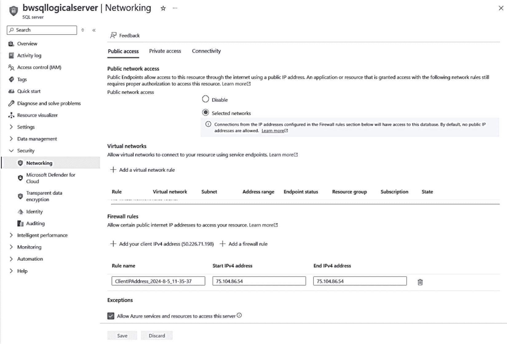
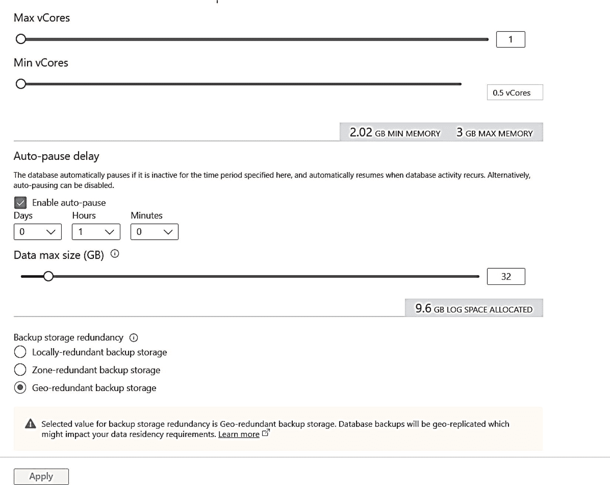
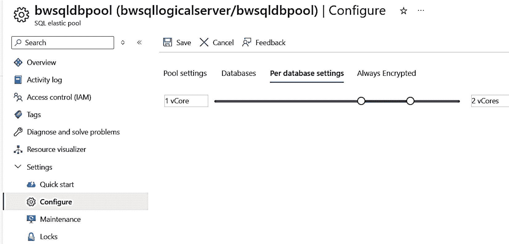
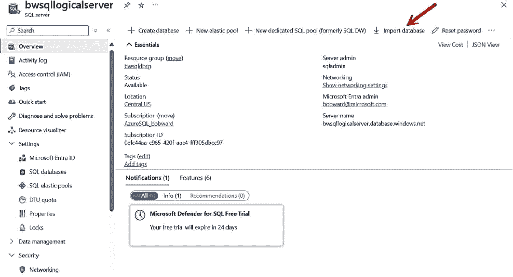
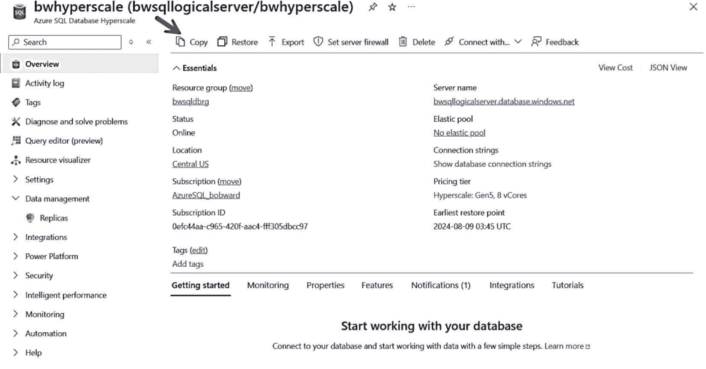

# Azure SQL 数据库管理

## 创建新数据库

在连接到逻辑服务器时（任何数据库上下文中），支持 T-SQL 的 `CREATE DATABASE` 语句。你可以在 [`https://learn.microsoft.com/sql/t-sql/statements/create-database-transact-sql?view=azuresqldb-current`](https://learn.microsoft.com/sql/t-sql/statements/create-database-transact-sql?view=azuresqldb-current) 查看 Azure SQL 数据库 `CREATE DATABASE` 的完整语法。

上方的文档参考展示了 `EDITION` 和 `SERVICE_OBJECTIVE` 可使用的所有可能选项。在此，`EDITION` 用于决定是 DTU 模型、通用型、业务关键型还是超大规模。`SERVICE_OBJECTIVE` 用于选择诸如无服务器、硬件代系和 vCore 数量等选项。

**注意**

请记住，使用 `CREATE DATABASE` 为 Azure SQL 数据库创建数据库是一个部署过程。对于 SQL Server，我们是创建新文件并向 master 数据库添加元数据。而对于 Azure SQL 数据库，我们是在构建一个新的部署（即数据库的专用实例）来托管数据库，并将信息存储在我们的控制平面中（例如，网关）。这意味着 `CREATE DATABASE` 是一个异步操作，但可以通过 DMV `sys.dm_operation_status` 进行跟踪。你必须从逻辑 master 查询此 DMV，并且我们保留一小时的历史记录。

你会注意到，在创建新数据库时只有两个选项：排序规则和部署选项。部署选项允许你选择购买模型、服务层、计算模型和大小。

如果你还记得，在第 4 章中，我使用不同的部署选项部署了多个数据库。连接到第 4 章示例中使用的逻辑服务器 `bwsqllogicalserver`，我可以使用以下 T-SQL 语法创建一个新的超大规模、8 vCore 数据库：

```sql
CREATE DATABASE bwhyperscale
(EDITION = 'Hyperscale', SERVICE_OBJECTIVE = 'HS_Gen5_8');
```

请记住这是一个部署过程，因此可能比你习惯的 SQL Server 数据库创建时间更长。在此示例中，此 T-SQL 语句完成大约需要四分钟。并且请注意，由于我们使用的是超大规模，因此无需指定最大存储选项。

Azure SQL 数据库的 `CREATE DATABASE` 语句还支持 `AS COPY OF` 选项，以创建一个数据库作为另一个数据库的副本，甚至可以来自另一个逻辑服务器。

创建的任何数据库都默认开启以下选项：
*   `SNAPSHOT_ISOLATION_STATE`
*   `READ_COMMITTED_SNAPSHOT`
*   `AUTO_CREATE_STATISTICS`
*   `AUTO_UPDATE_STATISTICS`
*   `FULL RECOVERY`
*   `CHECKSUM`
*   `TDE`
*   `QUERY_STORE`
*   `ACCELERATED_DATABASE_RECOVERY`

如果你检查 `sys.databases`，可能会注意到一个已启用的选项是*过时页面检测*。过时页面检测帮助 Azure SQL 数据库查找因基础架构 I/O 问题可能导致的数据完整性问题。我将在本书第 8 章中讨论更多 Azure SQL 提供的数据完整性检查。

## 修改数据库

对于创建的任何数据库，你可以使用 T-SQL `ALTER DATABASE` 语句来修改某些 `SET` 选项。你可以使用此文档参考 [`https://learn.microsoft.com/sql/t-sql/statements/alter-database-transact-sql-set-options?view=azuresqldb-current`](https://learn.microsoft.com/sql/t-sql/statements/alter-database-transact-sql-set-options?view=azuresqldb-current) 查看可以开启和关闭的选项。你无法更改此数据库背后文件的任何属性。要更改数据库的最大大小，你可以使用 `MAXSIZE` 参数。你还可以使用 `ALTER DATABASE` 或 Azure 门户更改 `EDITION` 或 `SERVICE_OBJECTIVE`。任何 `ALTER DATABASE` 的执行也是异步的，可以通过 `sys.dm_operation_status` 跟踪。

数据库的一个关键选项是*数据库兼容性级别*，Azure SQL 数据库支持使用 `ALTER DATABASE` 设置“dbcompat”。目前 Azure SQL 数据库支持从 90 到 160 的兼容级别。在 [`https://aka.ms/dbcompat`](https://aka.ms/dbcompat) 阅读更多关于 dbcompat 的信息。

同样重要的是要了解，与 SQL Server 一样，Azure SQL 数据库也支持 `ALTER DATABASE SCOPED CONFIGURATION` T-SQL 语句。这是一个非常重要的选项，用于控制各种方法以调节数据库行为。你可以在 [`https://learn.microsoft.com/sql/t-sql/statements/alter-database-scoped-configuration-transact-sql`](https://learn.microsoft.com/sql/t-sql/statements/alter-database-scoped-configuration-transact-sql) 阅读更多内容。

`az sql db` CLI 也支持更改数据库部署选项的能力，如文档 [`https://learn.microsoft.com/cli/azure/sql/db?view=azure-cli-latest#az-sql-db-update`](https://learn.microsoft.com/cli/azure/sql/db?view=azure-cli-latest#az-sql-db-update) 所述。PowerShell 也提供了 `Set-AzSQLDatabase`，其文档位于 [`https://learn.microsoft.com/powershell/module/az.sql/set-azsqldatabase`](https://learn.microsoft.com/powershell/module/az.sql/set-azsqldatabase)。

Azure 门户支持通过服务菜单、命令栏和工作窗格更改有关数据库部署的几个选项。

## 网络配置

当我们在本书第 4 章部署 Azure SQL 数据库时，我们能够为逻辑服务器指定一些网络选项，包括公共终结点访问、允许 Azure 服务、连接类型和防火墙规则。这里的关键词是逻辑服务器。尽管从技术上讲你可以在数据库级别设置防火墙规则，但你的大多数网络配置都发生在逻辑服务器上下文中。

正如你从图 5-3 所见，对于现有的逻辑服务器，你可以配置公共访问、专用访问和连接性的设置。



**图 5-3**
配置逻辑服务器的网络

**公共访问** 允许你配置虚拟网络和防火墙设置。

我们将在本书第 6 章中更详细地介绍**专用访问**，包括专用终结点。

**连接性** 允许你更改出站连接、连接类型和 TLS 等设置。

**出站连接** 允许你为服务器到其他源（如 Azure 存储或其他逻辑服务器）的任何连接创建防火墙规则。受此选项影响的功能包括审核、`OPENROWSET` 和 REST API（你将在本书第 10 章中了解更多）。

连接策略类似于托管实例的连接类型：代理或重定向。请注意，对于 Azure SQL 数据库，这里可以选择默认值。默认使用一种策略：如果连接源自 Azure 外部则使用代理连接类型，如果连接在 Azure 内部则使用重定向。

重定向连接策略可以显著降低应用程序延迟，因为网关用于将流量重定向到 Azure SQL 数据库的直接节点。我的同事 Anna Hoffman 有一个很好的示例，展示了重定向比代理快多少：[`https://github.com/microsoft/sqlworkshops-azuresqlworkshop/tree/master/azuresqlworkshop/02-DeployAndConfigure`](https://github.com/microsoft/sqlworkshops-azuresqlworkshop/tree/master/azuresqlworkshop/02-DeployAndConfigure)。

最低 TLS 版本与本章前面为托管实例描述的 TLS 要求完全相同。


### 配置无服务器

我在本书第 4 章向你们展示了部署无服务器 Azure SQL 数据库的概念。图 5-4 展示了一个通用型无服务器数据库的 vCore 配置选项。



图 5-4 配置无服务器数据库

从这些选项中你可以看到，你可以控制一个 vCore 范围，包括最小值和最大值。最小值可以低至 0.5，最大值可达 80。你将按每秒使用的 vCore 付费（有最低 vCore 设置的最低费用）。对于通用型服务层级，你还可以选择自动暂停。如果我们检测到你对数据库的使用处于空闲状态，我们可以暂停你的计算，在空闲时间你将不会为任何计算付费（仅需支付存储费用）。然后，当你再次连接到数据库时，我们会将你的数据库附加到一个新的 SQL Server 实例并将其启动。

### 配置弹性池

我在本书第 4 章向你们展示了如何在弹性池中部署数据库。你可以像配置数据库一样配置弹性池，*在池级别*，包括设置 vCore、存储和冗余。

弹性池的承诺之一是在多个数据库之间共享资源，因此你不必担心跨它们管理最小和最大资源。然而，你可能希望确保在池内没有哪个数据库试图占用过多资源。

图 5-5 展示了你如何为池中的每个数据库配置最小和最大 vCore。



图 5-5 为弹性池配置每个数据库的资源

## 配置限制

虽然有几种选项可以配置 Azure SQL 托管实例和数据库，但我认为重要的是指出一些你可以在 SQL Server 实例和数据库级别进行但在 Azure SQL 中*受到限制*的配置选项。在可能的情况下，我会说明为什么某些选项在 PaaS 环境中受到限制或不需要。

### Azure SQL 托管实例限制

许多 SQL Server 级别的配置选项是使用 SQL Server 配置管理器（Windows）或 `mssql-conf`（Linux）、T-SQL 或 SSMS 等工具完成的。由于我使用 SQL Server 已有多年，我认为让你了解这些工具和接口中存在哪些选项以及为什么它们对 Azure SQL 托管实例和数据库是受限的会很有趣。

#### 启动和停止服务

你可以停止和启动托管 SQL 实例，但无法对 Azure SQL 数据库执行此操作（请记住，无服务器数据库确实具有自动暂停功能）。

> **注意**
>
> 你将在本书第 8 章学习如何使用 PowerShell 命令 `Invoke-AzSqlDatabaseFailover` 手动故障转移 Azure SQL 数据库。

#### 即时文件初始化

没有用于启用即时文件初始化（IFI）的接口，你可以在 [`https://learn.microsoft.com/sql/relational-databases/databases/database-instant-file-initialization`](https://learn.microsoft.com/sql/relational-databases/databases/database-instant-file-initialization) 阅读相关信息。然而，我认为这不是一个主要因素，有两个重要原因：

*   当数据库启用了透明数据加密（TDE）时，不支持或不使用 IFI。TDE 在 Azure SQL 托管实例和数据库的数据库中默认启用。
*   我对“自动增长”场景进行了一些测试，从未引起任何重大的性能瓶颈。

#### 锁定页面

没有像 SQL Server 那样的接口来启用锁定页面（或大页面）。但是，我们可能会在某些部署中选择启用此功能。关键是你不必为此担心。如果需要使用此设置，我们将控制操作系统和此设置的内存。

#### FILESTREAM 和可用性组

SQL Server 配置管理器允许你启用 FILESTREAM 和 Always On 可用性组功能。Azure SQL 不支持 FILESTREAM。Always On 可用性组（AG）在商业关键服务层级的幕后使用，但你无法自行设置或配置 AG。

#### 服务器排序规则

你可以在部署托管实例期间设置 SQL Server 实例的排序规则，但之后无法更改它。你仍然可以像 SQL Server 一样为数据库或表中的列设置排序规则。

Azure SQL 数据库允许你在部署期间指定数据库排序规则，但之后无法更改它。你也可以在列级别定义排序规则。

#### 启动参数

SQL Server 配置管理器允许你为 SQL Server 引擎设置某些启动参数，如 [`https://learn.microsoft.com/sql/database-engine/configure-windows/database-engine-service-startup-options`](https://learn.microsoft.com/sql/database-engine/configure-windows/database-engine-service-startup-options) 所述。这些选项均未暴露给 Azure SQL 进行修改。根据我的经验，大多数这些选项用于某些“边缘”场景，你不需要或无法使用（例如以单用户模式启动 SQL Server）。尽管如此，正如我在本章前面提到的，你可以为 Azure SQL 托管实例设置一些跟踪标志。

#### ERRORLOG 配置

SSMS 允许你配置 ERRORLOG 文件的数量和最大大小。这些选项不受支持用于配置 Azure SQL 托管实例，因为它需要重启实例。此外，虽然拥有超过默认六个 ERRORLOG 文件可能很好，但 ERRORLOG 最大值通常用于控制磁盘空间，这对于托管实例来说不是问题。

> **注意**
>
> 系统过程 `sp_cycle_errorlog` 在托管实例上受支持。但是，ERRORLOG 文件存储在本地节点上，因此在故障转移时不会保存。

#### 错误报告和客户反馈

SQL Server 提供了一种配置错误报告和客户反馈的方法，如 [`https://learn.microsoft.com/sql/sql-server/usage-and-diagnostic-data-configuration-for-sql-server`](https://learn.microsoft.com/sql/sql-server/usage-and-diagnostic-data-configuration-for-sql-server) 所述。此配置对于 Azure SQL 是不可能的，但也不适用。

> **注意**
>
> 我们确实使用遥测技术来改进 Azure SQL。请查看这篇传奇人物 Conor Cunningham 更详细解释的文章：[`https://redmondmag.com/articles/2018/02/14/qa-lead-sql-architect-part-1.aspx`](https://redmondmag.com/articles/2018/02/14/qa-lead-sql-architect-part-1.aspx)。
>
> 如果你对 Microsoft 收集或使用有关你部署的任何信息有任何疑虑，我建议你仔细阅读 [`https://azure.microsoft.com/support/legal/`](https://azure.microsoft.com/support/legal/) 上的隐私和其他法律文件。

#### ALTER SERVER CONFIGURATION

`ALTER SERVER CONFIGURATION` 是在 SQL Server 几个版本前引入的，作为一种与 `sp_configure` 不同的新配置实例方式。

`ALTER SERVER CONFIGURATION` 不支持用于 Azure SQL，但没有适合为 Azure SQL 实例配置的选项，因为大多数这些选项是自动完成或不适用的。


### “混合模式”安全

Azure SQL 托管实例和数据库都支持与 SQL Server 中“混合模式”安全类似的概念。你可以将实例或数据库的身份验证设置为：

*   仅限 Microsoft Entra 身份验证
*   同时支持 SQL 和 Microsoft Entra 身份验证
*   仅限 SQL 身份验证

关于这些选项的几点说明：

*   如果你已经允许 SQL 身份验证，然后更改为仅限 Microsoft Entra 身份验证，现有的 SQL 登录名不会被删除，只是会被禁用。
*   Azure SQL 托管实例确实支持 Windows 身份验证，以帮助提高应用程序兼容性。

### 登录审核

多年来，SQL Server 引擎一直支持跟踪成功、失败或两者（或均不跟踪）的登录尝试。此跟踪信息会写入 ERRORLOG，通常通过 SSMS 进行配置。对于托管实例，虽然存在配置此登录跟踪的选项，但它们不会生效，因为它需要重启 SQL Server。默认情况下，失败的登录会被跟踪并记录在 ERRORLOG 中。

你可以使用扩展事件或 Azure SQL 的 SQL 审核功能自行审核登录情况。我将在本书第 6 章中向你详细介绍 Azure SQL 的审核功能。

### 服务器代理帐户

SSMS 支持为系统存储过程 `xp_cmdshell` 配置服务器代理帐户。此配置对于托管实例不受支持，因为 `xp_cmdshell` 在 Azure SQL 托管实例或数据库中不受支持。

### 数据库限制

与 SQL Server 类似，许多通过 `ALTER DATABASE` 配置数据库的常用选项在托管实例上是允许的。一个显著的例外是，你无法禁用 `ACCELERATE_DATABASE_RECOVERY`（加速数据库恢复）。这是因为我们依赖 ADR 技术来确保兑现所承诺的可用性 SLA。

### Azure SQL 数据库限制

上一节列出的托管实例的所有限制同样适用于 Azure SQL 数据库。

其他一些值得注意的限制你可能已经猜到，因为 Azure SQL Database 并未暴露完整的 SQL Server 实例：

*   `sp_configure` 不受支持。
*   `DBCC TRACEON` 不受支持。事实上，如果你运行此命令，它会因 Msg 2571（即无权限）而失败。
*   你可以使用 `DBCC TRACESTATUS` 查看我们启用了哪些跟踪标志，即使你无法开启或关闭它们（启用的标志列表与托管实例基本相同）。

`ACCELERATED_DATABASE_RECOVERY` 默认也是启用的，并且无法禁用。查询存储的情况也类似，但你可以禁用查询存储写入数据，使其变为只读。

## Azure SQL 空间管理

另一个与 Azure SQL 配置相关的话题是空间管理。虽然我们为 Azure SQL 托管实例和数据库都抽象了数据库和事务日志文件的物理放置位置，但*大小*仍然是你必须管理和考虑的一个因素。由于 Azure SQL 托管实例和数据库提供不同的部署覆盖范围，空间管理在这两种选项之间可能有所不同。

### Azure SQL 托管实例空间管理

正如我在第 4 章关于部署的描述中所说，托管实例的数据最大大小是所有数据库存储的总大小。你对 vCore 的选择以及“业务关键型”等选项会影响实例的最大存储大小。

在 SQL Server 中，当数据库文件大小达到限制时，你可能会遇到 Msg 1105，表明空间已用尽。如果你托管数据库的文件系统磁盘空间用尽，也可能发生此错误。对于托管实例，如果你的数据库大小达到了其最大值限制，也可能会遇到 Msg 1105。然而，由于我们对所有数据库强制执行最大存储限制，你也可能在数据库空间用尽之前遇到类似以下的错误：

```
Msg 1133
托管实例已达到其存储限制。托管实例的存储使用量不能超过 (%d) MB。
```

需要明确的是，这种情况意味着，在达到单个数据库的最大大小之前，你就可能遇到此错误，因为所有数据库（包括系统数据库）的总量已达到限制。

### Azure SQL 数据库空间管理

Azure SQL 数据库管理空间的方式与托管实例不同。部署时指定的最大大小是单个数据库文件的*可能*最大大小。

如果你部署一个 Azure SQL 数据库，最大大小通常反映在单个数据文件的 `sys.database_files` 表的 `max_size` 列中。但是，对于较大的最大数据库大小值（例如 1TB），我们可能不会将 `max_size` 设置为该值，而是随着数据添加逐渐增长到最终的 `max_size`。

如果你的数据库空间用尽，你将获得配额错误，而不是传统的 1105 错误，如下所示：

```
Msg 40544, Level 17, State 2, Line 12
数据库 '' 已达到其大小配额。请分区或删除数据、删除索引，或查阅文档以获取可能的解决方案。
```

事务日志的处理方式不同。虽然你配置了最大数据存储大小，但我们自动为此大小额外增加 30% 用于事务日志。请注意，在某些情况下我们可以增加这个数字，但你永远不会被收取超过日志 30% 额外空间的费用。不要使用 `sys.database_files` 中的 `max_size` 作为事务日志的最大大小。它不能准确反映配额。在我所有的测试中，我从未用完事务日志空间，原因有二：

*   我们定期且频繁地备份事务日志（记住我们使用完整恢复模式）。
*   我们默认启用了加速数据库恢复 (ADR)，并且你无法禁用它。借助 ADR，即使存在活动事务，日志也可以被截断。

Azure SQL 数据库空间管理的一个例外是超大规模服务层级。超大规模数据库有 100TB 的限制，但从理论上讲，我们认为它可以是无限的。当你部署超大规模数据库时，我们会创建多个总大小约为 40GB 的数据库文件。然后，随着你添加数据，我们会自动增长数据库。事务日志的限制是 1TB，但我们定期备份日志并且也依赖 ADR，因此我认为你不会用完空间。

## 加载数据

无论你是部署了新的托管实例或数据库，还是从现有实例或数据库迁移过来，你都不可避免地需要加载数据。就像 SQL Server 安装一样，你有几种工具和选项可以加载数据。此外，你在 Azure 中还有可用的新服务。


### 请牢记这些要点

就像 SQL Server 一样，在导入大量数据时，你可能需要 `额外的资源`。对于 Azure SQL 托管实例或数据库，请牢记导入数据可能需要额外的 vCore 或空间要求。我已经描述过托管实例的扩展可能需要多长时间，因此在部署时请记住这一点。

有几种数据加载技术涉及加载 `文件`。虽然你始终可以使用这些技术从本地环境加载文件，但在 Azure 基础设施中运行的任何工具或命令都应使用 Azure 存储或 Azure 文件来完成。你的部分数据可能不是 `原生云` 数据，因此请考虑使用 `AzCopy` 之类的工具将文件加载到 Azure 存储或 Azure 文件中。你可以在 [`https://learn.microsoft.com/azure/storage/common/storage-use-azcopy-files`](https://learn.microsoft.com/azure/storage/common/storage-use-azcopy-files) 了解更多关于 AzCopy 的信息。如果你的文件非常大，请查看我们关于指导和工具的文档：[`https://learn.microsoft.com/azure/storage/common/storage-solution-large-dataset-moderate-high-network`](https://learn.microsoft.com/azure/storage/common/storage-solution-large-dataset-moderate-high-network)。

我在书中已经提到，Azure SQL 托管实例和数据库都使用 `FULL`（完整）恢复模型，并且无法更改（我们需要这样做以满足 SLA 要求）。这意味着对于批量操作，`不支持最小化日志记录`（`tempdb` 除外）。因此，你应该确保使用某些技术，例如 `批处理大小`。批量导入的一个批次是一个定义的事务单位。批处理大小为 10,000 意味着一个事务导入 10,000 行。通常，使用较大的批处理大小可以提高批量性能，并且应该用于 Azure SQL。但是，你还应记住，如果使用的批处理大小过大，可能会受到 `日志速率调控` 的限制。你可以在 [`https://learn.microsoft.com/azure/azure-sql/database/resource-limits-logical-server?view=azuresql#transaction-log-rate-governance`](https://learn.microsoft.com/azure/azure-sql/database/resource-limits-logical-server?view=azuresql#transaction-log-rate-governance) 了解更多关于日志速率调控的信息。如果你的数据目标是列存储，你应该考虑直接导入到聚集列存储索引中。你可以在 [`https://learn.microsoft.com/sql/relational-databases/indexes/columnstore-indexes-data-loading-guidance`](https://learn.microsoft.com/sql/relational-databases/indexes/columnstore-indexes-data-loading-guidance) 了解更多关于列存储的数据加载指南。

Azure 会对某些类型的网络流量收费，称为 `入站` 和 `出站`。任何入站流量（例如，从本地环境批量导入数据到 Azure）都是免费的。

如果出站流量在 Azure 区域之间传输，则可能产生费用。如果你使用 Azure 虚拟机或 Azure 数据工厂服务从一个区域进行批量导入，而目标 Azure SQL 数据库在另一个区域，则可能会产生出站网络费用。你可以在 [`https://azure.microsoft.com/pricing/details/bandwidth`](https://azure.microsoft.com/pricing/details/bandwidth) 了解更多信息。

### bcp

批量复制程序 (`bcp`) 可能是 SQL Server 历史上最传统、最流行的数据导出和导入工具。`bcp` 程序可在 Windows、Linux 和 MacOS 计算机上运行。你可以在 [`https://learn.microsoft.com/en-us/sql/tools/bcp-utility`](https://learn.microsoft.com/en-us/sql/tools/bcp-utility) 获取有关 `bcp` 的所有最新信息。

由于 `bcp` 是一个读取文件并将数据 `批量导入` 到 SQL Server 或 Azure SQL 的程序，因此你必须在可以访问该文件并能连接到 Azure SQL 的计算机上运行 `bcp` 程序。这可能是本地计算机或 Azure 虚拟机。在任何这些场景中，你都可以针对托管在你的本地环境、Azure 虚拟机本地存储（可能是 Azure 存储中的数据磁盘）或 Azure 存储中的文件使用 `bcp`。由于 `bcp` 不支持直接访问 Azure 存储的路径（即 URL），因此你可以使用 Azure 文件。

另一个选项是从 Azure Cloud Shell 使用 `bcp`。Azure Cloud Shell 中的 `bcp` 在 Azure 基础设施中运行（可以将其想象成在一个临时的 VM 中运行），因此只要你正确设置了网络连接，就可以批量导入到 Azure SQL 托管实例或数据库。唯一的限制是 Cloud Shell 无法加入虚拟网络，因此你必须设置公共终结点访问。Azure Cloud Shell 通过一个称为 `clouddrive` 的概念支持文件持久化，你可以在 [`https://learn.microsoft.com/azure/cloud-shell/persisting-shell-storage`](https://learn.microsoft.com/azure/cloud-shell/persisting-shell-storage) 了解更多信息。你可以将文件复制到你的 `clouddrive`，然后使用 `bcp` 将文件导入 Azure SQL。

`bcp` 在后台使用 `批量 API`，因此你也可以编写使用 `批量 API` 的应用程序。这里有一个关于 ODBC 批量 API 的示例：[`https://learn.microsoft.com/sql/relational-databases/native-client-odbc-extensions-bulk-copy-functions/sql-server-driver-extensions-bulk-copy-functions`](https://learn.microsoft.com/sql/relational-databases/native-client-odbc-extensions-bulk-copy-functions/sql-server-driver-extensions-bulk-copy-functions)。


### BULK INSERT 与 OPENROWSET

T-SQL 的 `BULK INSERT` 和 `OPENROWSET`（使用 `BULK` 选项）语句支持从文件批量导入数据。这些命令的一个显著优势是它们在 SQL Server 引擎的上下文中运行。

对于 SQL Server，常见的做法是将文件复制到托管 SQL Server 的计算机可以访问的驱动器或网络共享中。然后使用 `BULK INSERT` 引用该文件进行导入。但问题是，对于 Azure SQL 托管实例和数据库，你无法访问底层节点的文件系统。因此，`BULK INSERT` 和 `OPENROWSET` 语句已得到增强，以支持 Azure Blob 存储（甚至可以从本地 SQL Server 访问）。

其工作原理如下。你创建一个 `EXTERNAL DATA SOURCE`（类似于 Polybase）来引用一个 Azure 存储账户。`BULK INSERT` 和 `OPENROWSET` 语句已增强支持 `DATA_SOURCE` 参数。我将在本书的第 9 章更详细地讨论外部数据源。

现在，你可以使用你最喜欢的 SQL 工具（请记住，在 Azure 云 Shell 中可以是 `sqlcmd`）直接连接到你的 Azure SQL 托管实例或数据库，并让 SQL Server 引擎完成工作，从而批量导入数据。

以下是使用 `BULK INSERT` 的语法示例，摘自文档 [`https://learn.microsoft.com/sql/t-sql/statements/bulk-insert-transact-sql?view=sql-server-ver15#f-importing-data-from-a-file-in-azure-blob-storage`](https://learn.microsoft.com/sql/t-sql/statements/bulk-insert-transact-sql?view=sql-server-ver15#f-importing-data-from-a-file-in-azure-blob-storage)。这要求你首先创建一个 Azure 存储账户和容器。

```
CREATE MASTER KEY ENCRYPTION BY PASSWORD = 'YourStrongPassword1';
GO
--> 可选 - 无需数据库作用域凭据，因为 Blob 配置为公共（匿名）访问！
CREATE DATABASE SCOPED CREDENTIAL MyAzureBlobStorageCredential
WITH IDENTITY = 'SHARED ACCESS SIGNATURE',
SECRET = '******srt=sco&sp=rwac&se=2017-02-01T00:55:34Z&st=2016-12-29T16:55:34Z***************';
-- 注意：确保 SAS 令牌前没有 ?，
-- 并且你至少对要加载的对象拥有读取权限 (srt=o&sp=r)，
-- 且有效期有效（所有日期均为 UTC 时间）
CREATE EXTERNAL DATA SOURCE MyAzureBlobStorage
WITH ( TYPE = BLOB_STORAGE,
LOCATION = 'https://****************.blob.core.windows.net/invoices'
, CREDENTIAL= MyAzureBlobStorageCredential --> 如果 Blob 配置为公共（匿名）访问，则不需要 CREDENTIAL！
);
BULK INSERT Sales.Invoices
FROM 'inv-2017-12-08.csv'
WITH (DATA_SOURCE = 'MyAzureBlobStorage');
```

### SQL Server Integration Services (SSIS)

SSIS 包是当今与 SQL Server 一起用于提取、转换和加载（ETL）应用程序的最流行方法之一。

无论 SSIS 包在何处通过 SSIS 运行时运行，Azure SQL 托管实例和数据库始终可以作为数据加载的目标。这意味着你可以构建 SSIS 包，并在本地数据中心或 Azure 虚拟机中运行它们。以下是一个关于如何使用 SSIS 将数据加载到 Azure SQL 数据库的简单教程：[`https://learn.microsoft.com/sql/integration-services/load-data-to-sql-database-with-ssis`](https://learn.microsoft.com/sql/integration-services/load-data-to-sql-database-with-ssis)。

还有其他方法可以在 Azure SQL 本身执行 SSIS 包（你可以使用这些方法来运行将数据导入 Azure SQL 托管实例或数据库的包）。

#### Azure SSIS

没有专门称为 Azure SSIS 的服务，但我创造了这个术语来指代 Azure 中用于托管和执行 SSIS 包的服务。有两个组件使 Azure SSIS 成为现实：

*   **Azure SSIS Integration Runtime (SSIS IR)**

Azure Data Factory (ADF) 是 Azure 中的一项服务，提供 ETL 功能。ADF 支持一个 *集成运行时* 计算环境。集成运行时环境的其中一个选择就是 SSIS。实际上，ADF 将托管计算节点，允许你运行 SSIS 包。此计算环境也可以连接到虚拟网络，为连接到 Azure SQL 资源铺平道路。部署 SSIS IR 的步骤可在 [`https://learn.microsoft.com/azure/data-factory/create-azure-ssis-integration-runtime`](https://learn.microsoft.com/azure/data-factory/create-azure-ssis-integration-runtime) 找到。

*   **Azure 中的 SSIS 目录数据库 (SSISDB)**

虽然不一定要使用 SSIS IR，但你可以在 Azure SQL 数据库或托管实例中托管 SSIS 的目录数据库 *SSISDB*。这样，你就可以执行存储在 Azure SQL 数据库或托管实例中的包，将你所有的 ETL 包管理和执行放在云端。这些包可以访问普通 SSIS 包所能访问的任何数据源，包括本地数据源。可以将此视为在 Azure 中执行所有操作并从本地 *拉取* 数据的一种方式。在 Azure SQL 中创建 SSISDB 目录的最简单方法是在部署 SSIS IR 时预配它。你需要先部署一个 Azure SQL 数据库逻辑服务器或托管实例，才能在 Azure 中部署 SSISDB。请查看 [`https://learn.microsoft.com/azure/data-factory/tutorial-deploy-ssis-packages-azure`](https://learn.microsoft.com/azure/data-factory/tutorial-deploy-ssis-packages-azure) 上的教程。

一旦你为 Azure 部署了 SSIS IR 和 SSISDB，你基本上就拥有了一个运行包的计算结构和一个托管它们的目录（无需你自己预配虚拟机）。

注意

你仍然可以执行存储在文件系统（例如 Azure 文件）中的包。

你现在有多种方法可以执行这些包：

*   使用 `SQL Server Data Tools (SSDT)` 执行包。更多信息请访问 [`https://learn.microsoft.com/azure/data-factory/how-to-invoke-ssis-package-ssdt`](https://learn.microsoft.com/azure/data-factory/how-to-invoke-ssis-package-ssdt)。
*   在托管实例上使用 `SQL Server Agent` 执行包。更多信息请访问 [`https://learn.microsoft.com/azure/data-factory/how-to-invoke-ssis-package-managed-instance-agent`](https://learn.microsoft.com/azure/data-factory/how-to-invoke-ssis-package-managed-instance-agent)。
*   使用支持 Azure 的 `dtexec` 版本（称为 `AzureDTExec`，仅限 Windows）执行包。更多信息请访问 [`https://learn.microsoft.com/azure/data-factory/how-to-invoke-ssis-package-azure-enabled-dtexec`](https://learn.microsoft.com/azure/data-factory/how-to-invoke-ssis-package-azure-enabled-dtexec)。
*   作为 Azure Data Factory (ADF) 管道的一部分，执行一个 `Execute SSIS Package activity`。更多信息请访问 [`https://learn.microsoft.com/azure/data-factory/how-to-invoke-ssis-package-ssis-activity`](https://learn.microsoft.com/azure/data-factory/how-to-invoke-ssis-package-ssis-activity)。你也可以使用 ADF 运行存储过程活动。更多信息请访问 [`https://learn.microsoft.com/azure/data-factory/how-to-invoke-ssis-package-stored-procedure-activity`](https://learn.microsoft.com/azure/data-factory/how-to-invoke-ssis-package-stored-procedure-activity)。

在 Azure 中使用 SSIS IR 和 SSISDB 本身就足以写一章！要了解有关其他选项（包括将现有 SSIS 包迁移到 Azure）的更多详细信息，请阅读以下文档：[`https://learn.microsoft.com/sql/integration-services/lift-shift/ssis-azure-lift-shift-ssis-packages-overview`](https://learn.microsoft.com/sql/integration-services/lift-shift/ssis-azure-lift-shift-ssis-packages-overview)。


## BACPAC

BACPAC 文件（扩展名为 `bacpac`）是一种包含数据库架构和数据的文件。你可以使用通过 SSMS、SqlPackage 或 PowerShell 等工具生成的 BACPAC 文件，将其导入到 Azure SQL 中。在这种情况下，导入过程会创建一个包含文件中架构和数据的完整数据库。根据所使用的工具和导入位置，可以将 BACPAC 文件存储在 Azure 存储中或本地文件中。

Azure SQL Database 支持使用 Azure 门户（BACPAC 文件需在 Azure 存储中）、SqlPackage 工具、SSMS 或 PowerShell 导入到新数据库。图 5-6 展示了从逻辑服务器的命令栏导入包含 BACPAC 文件的数据库的选项。



图 5-6：通过 Azure 门户导入数据库

对于 Azure SQL 托管实例，你可以使用 SSMS 或 SqlPackage，但也可以对备份执行 T-SQL `RESTORE`。BACPAC 文件大小限制为 200GB，因此如果需要更大的尺寸，你将需要使用批量复制选项。完整的数据库迁移可以使用 Azure 数据库迁移服务完成。

要了解更多关于使用 BACPAC 文件在 Azure SQL 中导入新数据库的信息，请查阅我们的文档：[`https://learn.microsoft.com/azure/azure-sql/database/database-import`](https://learn.microsoft.com/azure/azure-sql/database/database-import)。

## 数据库复制

Azure SQL Database 支持通过从事先部署的数据库进行事务一致复制来创建新数据库。你可以使用 Azure 门户、PowerShell、`az` CLI 或 `CREATE DATABASE` T-SQL 语句。此功能的一个好处是可以将数据库复制到不同的逻辑服务器。门户还允许你为目标数据库配置部署选项。

图 5-7 显示，可以从 Azure 门户中现有数据库的上下文中的命令栏访问复制数据库功能。



图 5-7：使用 Azure 门户复制数据库

这与本章前面提到的 `CREATE DATABASE...AS COPY` 选项相同。你可以在以下链接中了解更多关于如何为 Azure SQL Database 复制数据库的信息：[`https://learn.microsoft.com/azure/azure-sql/database/database-copy`](https://learn.microsoft.com/azure/azure-sql/database/database-copy)。

## 还原到托管实例

由于 Azure SQL 托管实例是一个完整的 SQL Server 实例，几乎提供了包括 T-SQL 在内的所有功能，因此你可以对 SQL Server 备份执行原生还原。

这意味着你可以从 SQL Server 备份数据库，将备份文件复制到 Azure 存储，然后使用 `RESTORE DATABASE` 语句将数据库还原到 Azure 托管实例。

目前，只能还原完整数据库备份。托管实例中的 `RESTORE` 与 SQL Server 有一个关键区别。`RESTORE` 是一个异步操作。你可以断开连接，还原操作会在后台完成。你可以使用动态管理视图 `sys.dm_operation_status` 来检查部署状态。

要了解如何在 Azure SQL 托管实例中使用 `RESTORE`，请查阅文档：[`https://learn.microsoft.com/sql/t-sql/statements/restore-statements-transact-sql`](https://learn.microsoft.com/sql/t-sql/statements/restore-statements-transact-sql)。

## Spark 连接器

Spark 是一种常用于 ETL 操作的技术。微软支持一个 Spark 连接器，允许你在 Azure SQL Database 和托管实例之间导入和导出数据。它支持可以非常快速甚至使用 Microsoft Entra 身份验证的批量操作。

在任何可以运行 Spark 并连接到 Azure SQL 的地方，你都可以使用此连接器。了解更多：[`https://learn.microsoft.com/azure/azure-sql/database/spark-connector`](https://learn.microsoft.com/azure/azure-sql/database/spark-connector)。在 GitHub 上获取示例：[`https://github.com/microsoft/sql-spark-connector`](https://github.com/microsoft/sql-spark-connector)。

## Azure Data Factory (ADF)

正如本章前面提到的，Azure Data Factory (ADF) 是为数据集成构建的云服务。你可以构建流水线来编排数据集成活动，很像 SSIS。ADF 的复杂度可以根据你的需要而定。你可以在以下链接看到一个使用 ADF 将数据从 Azure Blob 存储复制到 Azure SQL Database 的简单示例：[`https://learn.microsoft.com/en-us/azure/data-factory/tutorial-copy-data-portal`](https://learn.microsoft.com/en-us/azure/data-factory/tutorial-copy-data-portal)。

虽然 ADF 使用计算集成运行时环境执行，但你应该将 ADF 视为用于数据集成的 PaaS 服务（它包含 SLA）。ADF 团队喜欢将他们的服务视为 **无代码的 ETL 即服务**。

如果你在 SSIS 包上还没有大量投资，并且需要持续在 Azure 上执行 ETL 或仅数据移动操作，我强烈建议你考虑 ADF。请从阅读介绍开始：[`https://learn.microsoft.com/azure/data-factory/introduction`](https://learn.microsoft.com/azure/data-factory/introduction)。

## 更新 Azure SQL

我在本书中提到过，Azure SQL 托管实例和 Azure SQL Database 是无版本的。无版本意味着我们不会在 Azure SQL 中发布主要版本的 SQL Server 然后让你去采用。我们持续更新驱动 Azure SQL 的软件，为你提供最新的更新和增强功能。你完全无需操心并更新操作系统和 SQL Server。


### Azure SQL 的维护

那么，与 SQL Server 相比，最新的更新究竟意味着什么？对于 SQL Server（截至 SQL Server 2017），我们发布主要版本、累积更新 (`CU`) 和通用分发版本 (`GDR`)。客户可以下载并应用他们希望使用的更新。

当我们发布一个新的主要版本时，例如 SQL Server 2019，它不仅包含新功能和特性，还包括一系列错误修复，这些修复包含了上一个主要版本所有 `CU` 和 `GDR` 版本的修复，以及我们根据判断认为有必要包含在主要版本中的一组修复。

对于错误修复（以及一些不一定算作功能的微小增强），我们持续在代码主分支中保持这些修复的最新状态。这些更改会频繁地推送到 Azure SQL 中，通常我们的客户能比等待下一个 `CU`、`GDR` 甚至主要版本发布更早地获得它们。这是在 Azure 中运行的一大优势。我们不断测试这些修复和更改，但实际上，你获得的错误修复流通常只出现在主要版本发布中。

我们不会记录或公布我们向为 Azure SQL 提供支持的 SQL Server 及其他组件推送更新的频率。推送这些更新的过程称为一个 `更新通道`。一个 `更新通道` 包含了支持 Azure SQL 的所有组件的更新，包括操作系统、SQL Server、Service Fabric 组件以及我们用于驱动 Azure SQL 的其他软件。我们不会一次性将 `更新通道` 推送到每个 Azure 区域。相反，这些 `更新通道` 会跨区域逐步推出。如果我们在早期阶段检测到推送 `更新通道` 出现任何问题，可以轻松回滚。由于每个 Azure SQL 部署都具有内置的可用性，当我们更新节点和实例时，可以故障转移部署，并根据与你的部署相关联的 `SLA` 协议确保你的数据可用。可用性区域等概念也有助于提供进一步的可用性。我将在本书的第 8 章中进一步讨论可用性区域。Azure 门户中的资源运行状况选项或通过 `REST` API 可以为你提供有关是否因 `部署` 而发生故障转移的信息。`部署` 是计划内可能影响可用性的维护事件。

注意
SQL Server 的累积更新时间安排可能导致某个修复先出现在 `CU` 中，然后才通过 Azure SQL 的 `更新通道` 推出。除非该 `CU` 中的修复引入了回退问题，否则该修复最终会在部署 `更新通道` 中出现。

正如你在本书中所见，你还可以选择维护窗口来控制更新计划时间，并设置警报以提前通知这些可能影响正常运行时间的维护操作。

注意
如果我们遇到重大的影响客户的问题，我们可能会通知特定客户其部署可能受到影响，以便我们纠正他们的问题。

我们正在努力进行的部分改进将为客户提供预先的维护通知，以便他们能为这些事件做计划。此外，我们也在研究让客户能够为维护事件选择自定义时间表的能力。

我们在云端的工作常常催生创新。我们推出的一项非常酷的能力是 `热补丁`，旨在减少 Azure SQL 维护需要重启 SQL Server（从而导致故障转移）的场景数量。你可以通过我的同事 Hans Olav Norheim 在这篇博文 [`https://azure.microsoft.com/blog/hot-patching-sql-server-engine-in-azure-sql-database/`](https://azure.microsoft.com/blog/hot-patching-sql-server-engine-in-azure-sql-database/) 中了解 `热补丁` 如何提升 Azure SQL 的可用性。

### Azure SQL 托管实例的更新策略

我在本书中介绍了 Azure SQL 托管实例的更新策略概念，有两种选择：

*   **始终保持最新**
    此选择允许托管实例接收持续更新，包括新功能。为此选择备份的任何数据库无法还原到 SQL Server 2022（但可以还原到其他始终保持最新的托管实例）。

*   **SQL Server 2022**
    如果你希望能够将备份还原到 SQL Server 2022 或与 SQL Server 2022 一起使用在线灾难恢复（将在本书第 8 章进一步讨论），请选择此项。选择此项后，你的实例仍会自动应用适用于 SQL Server 2022 的累积更新，但不会获得仅适用于始终保持最新实例的新功能。你可以从此托管实例将备份还原到另一个 SQL Server 2022 或始终保持最新的托管实例（当你使用后者选择时，无法还原回去）。

### Azure SQL 中的新功能和特性

总的来说，在过去几年中，我们一直尝试为 SQL Server 采用 `云优先理念`。我们构建新功能，并首先通过私有（有限客户，通常需要注册）和公共预览（尚未完全正式发布，但客户可以试用）计划在 Azure SQL 中推出。最终，该功能会进入正式发布 (`GA`) 阶段。

然后根据 SQL Server 新主要版本的发布时间，该功能会被包含在该主要版本中。这方面的一个很好的例子是智能查询处理 (`IQP`)，你可以在 [`https://learn.microsoft.com/sql/relational-databases/performance/intelligent-query-processing`](https://learn.microsoft.com/sql/relational-databases/performance/intelligent-query-processing) 阅读相关内容。我们在 `IQP` 随 SQL Server 2019 和 2022 发布之前，就先为 Azure SQL 客户推出了。

我为你创建了两个快捷方式，以便随时了解 Azure SQL 数据库和托管实例的所有最新消息：

[`https://aka.ms/whatsnewsqldb`](https://aka.ms/whatsnewsqldb)

[`https://aka.ms/whatsnewsqlmi`](https://aka.ms/whatsnewsqlmi)

## 总结

在本章中，你学习了在部署后配置 Azure SQL 托管实例和数据库的各种方法、能力、技巧和限制。你既了解了 Azure SQL 特有的配置选项，也学习了使用熟悉的技术（如 `T-SQL`）配置数据库引擎和数据库的选项。

你还了解了空间管理的一些有趣方面，这在管理 Azure SQL 中的数据库时可能很重要。

在本章中，我们介绍了从本地和 Azure 环境向 Azure SQL 加载数据的各种方法。最后，你了解了 Azure SQL 如何更新的细节，以及它为何被称为无版本数据库。

既然你已经学习了如何部署和配置 Azure SQL，现在是时候深入探讨 Azure SQL 的第一大类核心内容：安全性了。下一章，我们将介绍 Azure SQL 与 SQL Server 相比的安全特性。


