# 6. 保障 Azure SQL 的安全

既然您已经部署并配置了 Azure SQL 托管实例或数据库，您会希望确保自己采取了所有正确的措施来全面保障 Azure SQL 部署的安全。Azure SQL 不仅具备 SQL Server 所附带的所有安全功能，还提供了更多。

我的同事 Anna Hoffman 曾问我，为何我一直将安全性、性能和可用性称为 SQL Server 和 Azure SQL 的*主食*。这个说法并非我的原创。它源自我长期以来的同事、著名的 Conor Cunningham。Conor 和我曾在 PASS Summit 主旨演讲中一起做过几次演示。有一次，我考虑做一些相当前沿的演示，Conor 阻止了我说：“Bob，演示固然不错，但我们的客户期望你我展示引擎的核心创新。比如安全性、性能和可用性。你知道的，这些才是 SQL Server 的主食。”从那以后，这个说法就一直沿用下来。哦，顺便说一句，我仍然会尝试构建那些前沿的演示。

**注意**

对于不了解这个短语的人，它是我们德克萨斯州常用的说法，意指某件事物的基础或核心。一顿基本的饭包括肉和土豆。这对我不是问题，因为我两者都爱。

在本章中，我们将探讨您通常用于保护 SQL Server 的所有功能，并将其与 Azure SQL 进行比较。您还将学习用于保障 Azure SQL 托管实例和数据库部署安全的独特能力和方法。

本章按以下安全类别组织：

## 网络安全

在本节中，了解通过各种网络选项（包括防火墙、虚拟网络和专用终结点）提供最安全连接的几种方法。

## 身份验证与访问

在本节中，您将学习提供身份验证和访问的最安全方法，包括基于 Azure 角色的访问控制 (RBAC)、Microsoft Entra、行级安全和 Microsoft Purview。

## 数据保护

在本节中，您将学习如何保护您的数据，包括加密方法、数据屏蔽和账本（SQL 内部的一种区块链）。

## 安全管理

在本节中，您将了解审核、Microsoft Defender 和数据分类等概念。

在讨论安全性时，我将使用本书第 4 章中所做的部署。要试用我在本章中使用的任何技术或命令，您将需要：

*   一个 Azure 订阅。
*   对该 Azure 订阅至少具有“参与者”角色访问权限。您可以在 [`https://learn.microsoft.com/azure/role-based-access-control/built-in-roles`](https://learn.microsoft.com/azure/role-based-access-control/built-in-roles) 详细了解 Azure 内置角色。
*   访问 Azure 门户。
*   部署一个与我在第 4 章中所做类似的 Azure SQL 托管实例和一个 Azure SQL 数据库。
*   要连接到托管实例，您将需要一个 Azure 中的 `jumpbox` 或虚拟机来进行连接。我在本书第 4 章中展示了如何操作。一个简单的方法是创建一个新的 Azure 虚拟机，并将其部署到与托管实例相同的虚拟网络中（您将使用与托管实例不同的子网）。
*   要连接到 Azure SQL 数据库，您可以使用防火墙规则从本地客户端连接，但本章还展示了如何在虚拟网络中使用专用终结点（并结合 Microsoft Entra 托管标识）进行连接，因此您需要一个 Azure 虚拟机。在我的示例中，我将使用本书第 3 章中创建的名为 `bwsql2022` 的虚拟机。
*   安装 `az` CLI（有关更多详细信息，请参阅 [`https://learn.microsoft.com/cli/azure/install-azure-cli`](https://learn.microsoft.com/cli/azure/install-azure-cli)）。您也可以使用 Azure Cloud Shell，因为其中已预装 az。您可以在 [`https://azure.microsoft.com/features/cloud-shell/`](https://azure.microsoft.com/features/cloud-shell/) 详细了解 Azure Cloud Shell。
*   您将在本章中运行一些 T-SQL，因此请安装一个工具，如 SQL Server Management Studio (SSMS)，下载地址为 [`https://aka.ms/ssms`](https://aka.ms/ssms)。

## 网络安全

大多数安装 SQL Server 的管理员都使用公司基础设施内的私有网络。防火墙会阻止该网络内的传入流量。此外，操作系统提供防火墙来保护 SQL Server 等应用程序的端口。事实上，如果您之前安装过 SQL Server，您会知道默认情况下，Windows 和 Linux 上的 1433 端口防火墙都是阻止的。您通常必须采取操作，为远程连接到 SQL Server 的此端口添加一个例外。

Azure SQL 也不例外，不同之处在于您可以选择允许连接到其后的 SQL Server 实例，既可以作为互联网上的公共终结点，也可以作为虚拟网络内的私有终结点。

在您阅读本章此部分信息时，我需要向您坦言：您绝对应该咨询您所在组织的网络专家，以根据您所需的要求来配置 Azure SQL 托管实例或数据库。

### Azure SQL 托管实例网络安全

正如您在第 4 章部署 Azure SQL 托管实例时所见，虚拟网络、公共终结点和私有连接已内置于托管实例体验中。

图 6-1（直接来自文档 [`https://learn.microsoft.com/azure/azure-sql/managed-instance/connectivity-architecture-overview?view=azuresql#communication-overview`](https://learn.microsoft.com/azure/azure-sql/managed-instance/connectivity-architecture-overview?view=azuresql#communication-overview)）很好地可视化了连接选项。

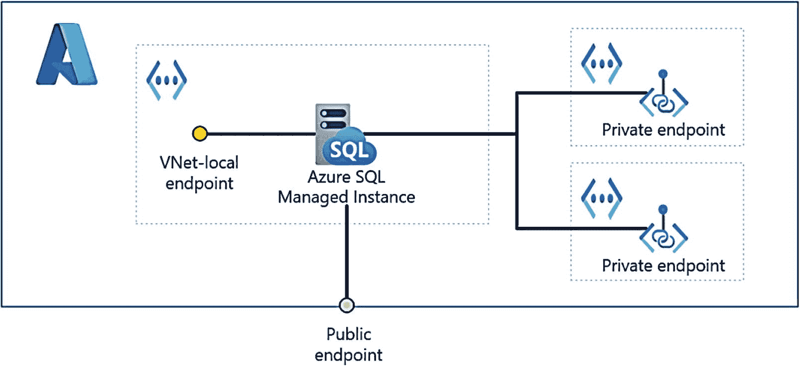

图 6-1：Azure SQL 托管实例的网络连接选项

让我们更详细地探讨这些选项中的每一个。

### 公共终结点

您可以为 Azure SQL 托管实例启用公共终结点，但这是最不安全的方式。这种方法的最大优点是，任何 SQL 客户端只需很少的配置即可连接到该终结点。如果您决定这样做，该终结点位于端口 3342 上（此端口无法更改，不是 1433）。此外，您可以使用网络安全组 (`NSG`) 规则来有效地在该端口上设置防火墙。请阅读 [`https://learn.microsoft.com/azure/azure-sql/managed-instance/public-endpoint-configure`](https://learn.microsoft.com/azure/azure-sql/managed-instance/public-endpoint-configure) 以获取更多信息。


### VNet-本地端点

这是连接托管实例最常见的选项。我向你展示过我首选的一种方法：在与托管实例相同的虚拟网络中（但位于不同的子网），设置一台 Azure 虚拟机（或云应用程序）。这是我在第 4 章中用于跳板机的示例。

但是，也可以使用 Azure 内部或外部的另一虚拟网络进行连接。**VNet 对等互连**允许你从已与另一虚拟网络对等互连的虚拟网络中的资源进行连接。请查看此博客文章，了解如何通过 VNet 对等互连连接到托管实例： [`https://techcommunity.microsoft.com/t5/azure-database-support-blog/connect-to-azure-sql-database-managed-instance-with-virtual/ba-p/369077`](https://techcommunity.microsoft.com/t5/azure-database-support-blog/connect-to-azure-sql-database-managed-instance-with-virtual/ba-p/369077)。你可以在 [`https://learn.microsoft.com/en-us/azure/virtual-network/virtual-network-peering-overview`](https://learn.microsoft.com/en-us/azure/virtual-network/virtual-network-peering-overview) 阅读更多关于虚拟网络对等互连的内容。虚拟网络对等互连可以在同一区域内或跨区域进行。

如果你想从本地连接到托管实例，则需要使用**Azure 虚拟网络网关**。有几种选项可以将本地环境与虚拟网络网关连接：点到站点 (P2S)、站点到站点 (S2S) 和 ExpressRoute。ExpressRoute 绝对是通过网关连接最快（但也是最昂贵）的方式。你可以在 [`https://learn.microsoft.com/en-us/azure/vpn-gateway/vpn-gateway-about-vpngateways`](https://learn.microsoft.com/en-us/azure/vpn-gateway/vpn-gateway-about-vpngateways) 了解所有这些网关选项。正如我在本章前面提到的，如果网络不是你的专长（也不是我的），那么我会建议咨询你所在组织的网络工程师以选择最佳方案。

### 专用端点

最安全的连接选项是专用端点。专用端点可在服务与多个虚拟网络之间建立安全、隔离的连接，而无需暴露服务的整个网络基础设施。我喜欢文档中的类比：“...就像将一根物理网络电缆从运行 Azure SQL 托管实例的计算机延伸到另一个虚拟网络。”

设置这个需要多一点配置，并且存在一些限制，例如不能将其用于故障转移组、分布式事务和托管实例链接。

你可以在 Azure 门户中，通过托管实例的“安全”部分下的“专用端点连接”选项来设置专用链接。请参阅完整的步骤： [`https://learn.microsoft.com/azure/azure-sql/managed-instance/private-endpoint-overview?view=azuresql&tabs=separate-vnets#create-a-private-endpoint-in-a-virtual-network`](https://learn.microsoft.com/azure/azure-sql/managed-instance/private-endpoint-overview?view=azuresql&tabs=separate-vnets#create-a-private-endpoint-in-a-virtual-network)。

我将在本章下一节关于 Azure SQL 数据库的部分，详细介绍如何使用专用端点的示例。

### 其他注意事项

重要的是要知道，除了 SQL Server 端点（用于连接和运行查询的标准 TCP 端口）外，Azure SQL 托管实例还有一个*管理端点*。由于托管实例部署在其自己的虚拟集群中，集群外但在 Azure 内的各种服务（例如 Resource Manager 中的部署）必须能够访问该集群。这种访问是通过管理端点进行的。管理端点是一个受防火墙保护的公共端点。这意味着当你使用门户或 CLI 来管理托管实例（例如，缩放操作）时，你正在连接到此端点。请阅读有关管理端点如何受保护的更多信息： [`https://docs.microsoft.com/en-us/azure/azure-sql/managed-instance/connectivity-architecture-overview#management-endpoint`](https://docs.microsoft.com/en-us/azure/azure-sql/managed-instance/connectivity-architecture-overview#management-endpoint)。

我在第 4 章部署期间展示了连接类型`Proxy`与`Redirect`。即使 SQL Server 端点位于私有虚拟网络中，从技术上讲，`Proxy`连接更安全，因为所有流量都通过*网关*路由。使用`Redirect`连接时，连接首先建立到网关，然后所有后续流量直接发送到托管实例节点。`Redirect`可以快得多，并且由于使用了专用端点，我推荐此选项。任何公共端点的使用都始终使用代理连接。你可以在 [`https://docs.microsoft.com/en-us/azure/azure-sql/database/connectivity-architecture#connection-policy`](https://docs.microsoft.com/en-us/azure/azure-sql/database/connectivity-architecture#connection-policy) 了解有关这些策略的更多信息。

### Azure SQL 数据库网络安全

Azure SQL 数据库（任何部署选项）的网络安全与托管实例有点不同，因为当你部署数据库时，我们没有专用的私有虚拟集群。相反，所有数据库部署都共享 Azure 区域中的虚拟集群（环）。请记住，当我谈到这些网络安全选项时，它们适用于所有数据库的逻辑服务器。此规则的唯一例外是，你可以配置特定于数据库的防火墙规则，该规则与逻辑服务器不同。

这并不意味着你无法受到保护，因为你可以在你的数据库部署上拥有一个专用端点，正如你将在本章本节中看到的那样。


### 使用公共端点

在第 4 章关于部署的内容中，我向您展示了一些数据库部署的连接选项，其中包括：

*   `Allow access to Azure services` – 此选项允许任何 Azure 资源（例如，VM、应用程序或 cloud shell）访问数据库部署的公共端点。

*   `Firewall rules` – 此选项允许您为 Azure 外部的客户端计算机创建特定的防火墙规则。我在第 4 章中使用了此技术，通过我的笔记本电脑和 SQL Server Management Studio (SSMS) 连接到我部署的逻辑服务器。

图 6-2 展示了 Azure 资源和本地计算机如何连接到具有公共端点的逻辑服务器的网络连接图。

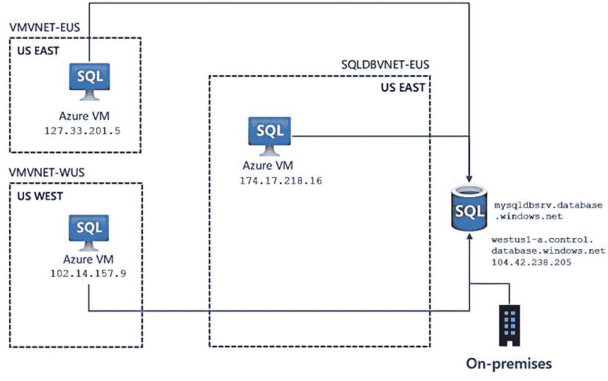
图 6-2 连接到具有公共端点的逻辑服务器

在此图中，您可以看到通过 `Allow access to Azure services` 连接的 Azure VM 资源，以及通过防火墙规则连接的本地计算机。请注意，Azure 虚拟机使用的是它们的公共 IP 地址，因为即使在 Azure 内部，它们也是通过公共端点连接进行连接的。

> **注意**
> 需要明确的是，您可以使用 `Allow access to Azure services` 并关闭所有其他防火墙规则。虽然这不是私有端点的场景，但它确实阻止了任何来自 Azure *外部* 连接到逻辑服务器的连接。

注意在此图中，逻辑服务器的名称是 [mysqldbsrv.​database.​windows.​net](http://mysqldbsrv.database.windows.net)（这是一个示例，并非我使用的逻辑服务器）。这是逻辑服务器的名称，但公共端点如何在互联网上被解析呢？注意在此名称下方是一个公共 IP 地址和一个网络名称 [westus1-a.​control.​database.​windows.​net](http://westus1-a.control.database.windows.net)。此名称是连接到逻辑服务器时，网关节点的 DNS 名称的一部分。

由于启用了 `Allow access to Azure services`，让我们使用我在第 3 章创建的 Azure 虚拟机 `bwsql2022`，来检查连接到我在第 4 章部署的逻辑服务器的连接属性。

我使用 RDP 连接到该虚拟机（我在本章前面提到过在 VM 中安装了 SSMS 和 Azure Data Studio）。然后，我使用 SSMS 连接到我在第 4 章部署的名为 [**bwsqllogicalserver.database.windows.net**](http://bwsqllogicalserver.database.windows.net) 的 Azure 逻辑服务器。`dm_exec_connections` 是 SQL Server 的一个 DMV，可以提供有关到服务器连接的关键信息。因此，我从 SSMS 运行了以下 T-SQL 语句：

```
SELECT client_net_address FROM sys.dm_exec_connections
WHERE session_id = @@SPID;
```

返回的结果是：

```
52.173.38.9
```

这个 IP 地址是 Azure 虚拟机 `bwsql2012` 的*公共 IP 地址*。这证明了 VM 正在通过公共端点连接到逻辑服务器。然而，VM 有权访问（无需通过防火墙允许连接），因为我使用了 `Allow access to Azure services` 选项。

另一种查看 Azure SQL Database 公共端点方面的有趣方法是检查逻辑服务器的 DNS 基础结构。您可以使用 `nslookup` 命令来完成此操作（`nslookup` 在 Windows 和 Linux 操作系统上默认可用；更多信息请参见 [`https://learn.microsoft.com/windows-server/administration/windows-commands/nslookup`](https://learn.microsoft.com/windows-server/administration/windows-commands/nslookup)）。

从我的 Azure 虚拟机中，我随后在 PowerShell 中运行了如下命令：

```
nslookup bwsqllogical.database.windows.net
```

我收到了以下结果：

```
Server:  UnKnown
Address:  168.63.129.16
Non-authoritative answer:
Name:    cr8.cEntralus1-a.control.database.windows.net
Address:  13.89.169.20
Aliases:  bwsqllogicalserver.database.windows.net
dataslice7.cEntralus.database.windows.net
dataslice7cEntralus.trafficmanager.net
```

顶部的结果是 IP 地址 `168.63.129.16`。事实证明，这个地址是用于 Azure 通信的特殊虚拟 IP 地址，因此在 Azure 内部，您的地址始终会显示这个（更多信息请参见 [`https://learn.microsoft.com/en-us/azure/virtual-network/what-is-ip-address-168-63-129-16`](https://learn.microsoft.com/en-us/azure/virtual-network/what-is-ip-address-168-63-129-16)）。

底部的结果显示了逻辑服务器的 DNS 层次结构，其中包括 Azure *控制环*（网关）内的 DNS 服务器。

另外，请注意 ping 是被阻止的，但它显示了如何尝试访问公共端点：

```
ping bwsqllogicalserver.database.windows.net
Pinging cr8.cEntralus1-a.control.database.windows.net [13.89.169.20] with 32 bytes of data:
Request timed out
```

还有第三种选项可以保护连接逻辑服务器的安全性。假设您想关闭 `Allow access to Azure services`，但又不想为防火墙规则使用固定 IP 地址。您可以使用 `virtual network service endpoint` 来允许仅来自虚拟网络（可能包括本地连接）的特定 Azure 资源连接到逻辑服务器。这仍然是一个公共端点连接，但严格限制来自特定 Azure 虚拟网络的资源。有关如何使用虚拟网络服务终结点的更多信息，请参阅 [`https://learn.microsoft.com/azure/azure-sql/database/vnet-service-endpoint-rule-overview`](https://learn.microsoft.com/azure/azure-sql/database/vnet-service-endpoint-rule-overview)。

让我们使用一种不同的技术来加强 Azure 逻辑服务器网络连接的安全性，即专用链接。


### 使用专用链接

假设你不想让任何公共端点访问你的 Azure SQL 数据库，无论连接是来自 Azure 内部还是外部。Azure 团队创建了一个名为 `专用链接` 的概念，允许像 Azure SQL 数据库这样的 PaaS 服务仅通过专用终结点限制访问。你可以在以下网址阅读有关专用链接的概述：[`https://learn.microsoft.com/azure/private-link/private-link-overview`](https://learn.microsoft.com/azure/private-link/private-link-overview)。

让我们看看使用专用链接的图 6-2 的一个新变体。图 6-3 展示了专用链接如何为 Azure SQL 数据库提供专用终结点。

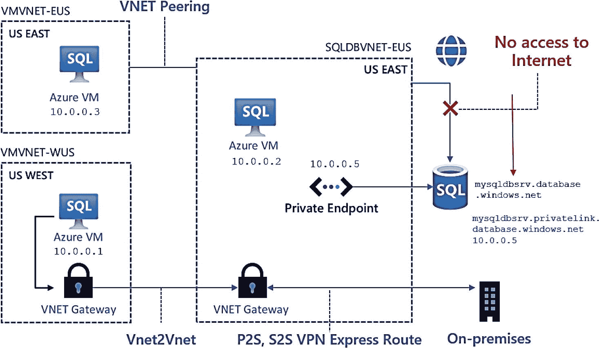

图 6-3 使用专用链接的 Azure SQL 数据库

专用链接将在现有的 Azure 虚拟网络中公开一个专用终结点。请注意，在此图中，逻辑服务器的 DNS 名称不再位于公共 DNS 层次结构中。

让我们看看如何使用第 4 章中的现有 Azure SQL 数据库部署和 Azure 门户实现专用链接连接。从我的逻辑服务器（我的是 `bwsqllogicalserver`）中，我可以在 Azure 门户中创建一个专用终结点，如图 6-4 所示。

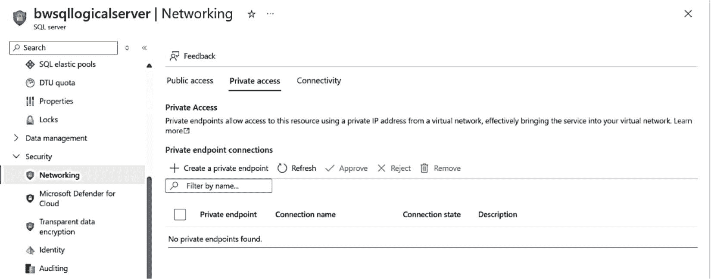

图 6-4 为 Azure SQL 数据库创建专用终结点

系统会提供一系列屏幕，让你为终结点命名、选择虚拟网络（在此案例中，虚拟网络是我第 3 章部署的 Azure 虚拟机 `bwsql2022` 所使用的网络）以及 DNS（我直接使用了默认值）。此链接的部署需要几分钟时间。

注意

专用终结点必须与你选择的 Azure 虚拟网络位于同一区域。请记住，终结点现在成为该 VNet 中的一个资源。但是，你的客户端连接可以通过如图 6-3 所示的 VNet 对等互连或 VNet 网关位于另一个虚拟网络中。

图 6-5 显示了我已部署的、与此逻辑服务器关联的专用终结点。

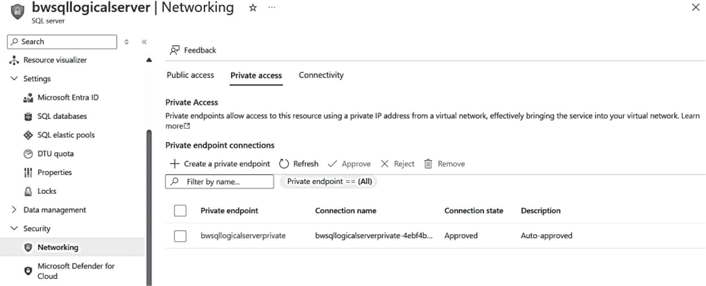

图 6-5 已部署的 Azure SQL 数据库专用终结点

该终结点是其自身的资源，与我的 Azure 虚拟机的虚拟网络以及此逻辑服务器都相关联（它也可以与其他逻辑服务器一起使用）。如果你选择该专用终结点，可以深入了解网络接口并查看其专用 IP 地址。为了展示我如何仅使用此终结点，我还可以通过此逻辑服务器的“服务”菜单中相同的网络选项，在 Azure 门户中禁用任何公共终结点。

现在，我将回到我的 Azure 虚拟机 `bwsql2022`，并再次尝试使用 SSMS 进行连接。我的连接现在成功了。如果我运行以下 T-SQL 语句：

```
SELECT client_net_address FROM sys.dm_exec_connections
WHERE session_id = @@SPID;
```

结果如下：

```
10.0.0.4
```

这是 Azure 虚拟机 `bwsql2022` 的 `专用 IP 地址`（之前是公共 IP 地址）。这次让我们尝试 ping 逻辑服务器：

```
ping bwsqllogicalserver.database.windows.net
Pinging bwsqllogicalserver.privatelink.database.windows.net [10.0.0.5] with 32 bytes of data:
Request timed out
```

请注意服务器的专用 IP 地址以及不在公共层次结构中的新 DNS 名称。

同时，注意 `nslookup` 的输出：

```
nslookup bwsqllogical.database.windows.net
Server:  UnKnown
Address:  168.63.129.16
Non-authoritative answer:
Name:    bwsqllogicalserver.privatelink.database.windows.net
Address:  10.0.0.5
Aliases:  bwsqllogicalserver.database.windows.net
```

在以下文档中阅读更多关于为 Azure SQL 数据库使用 Azure 专用链接的内容：[`https://learn.microsoft.com/azure/azure-sql/database/private-endpoint-overview`](https://learn.microsoft.com/azure/azure-sql/database/private-endpoint-overview)。对于任何希望将其本地环境集成的用户，请特别关注此文档页面：[`https://learn.microsoft.com/azure/azure-sql/database/private-endpoint-overview?view=azuresql#on-premises-connectivity-over-private-peering`](https://learn.microsoft.com/azure/azure-sql/database/private-endpoint-overview?view=azuresql#on-premises-connectivity-over-private-peering)。

提示

Azure SQL 数据库的专用链接连接目前仅支持代理连接类型。我们将 Azure SQL 数据库的连接策略保留为默认设置，因此，如果连接使用位于 Azure 内部的专用链接，它将不会使用重定向，而是使用代理。

通过观看 Anna Hoffman 和 Rohit Nayak 作为 Data Exposed 频道一部分的视频，在你的 Azure SQL 和网络安全知识基础上更进一步：[`https://www.youtube.com/playlist?list=PL3EZ3A8mHh0xtbf4Cr2yR4-xsUtELwPjw`](https://www.youtube.com/playlist?list=PL3EZ3A8mHh0xtbf4Cr2yR4-xsUtELwPjw)。

## 身份验证与访问

你现在已经成功部署了 Azure SQL 托管实例和数据库，并使用安全的网络架构进行了连接。在部署这两个 Azure SQL 服务时，你指定了一个 `管理员`，即一个 SQL 登录名和密码，可能还有一个 Microsoft Entra 管理员。接下来的步骤是设置和配置其他登录名和用户，就像你会在 SQL Server 部署中所做的那样。我将此过程称为设置 `身份验证`。然后，你将根据你的应用程序和业务需求，授予用户访问他们所需对象的权限。

在我们讨论 Azure SQL 身份验证和访问的细节之前，让我们首先回顾一下 SQL *之外*、但在名为 Azure 基于角色的访问控制 (RBAC) 的 Azure 基础结构中的 Azure SQL 资源的身份验证和访问。

### Azure 基于角色的访问控制 (RBAC)

我在本书前面的章节中提到过 Azure RBAC 的概念。今天，当你在 Windows 或 Linux 上部署 SQL Server 时，你必须拥有某些权限和特权才能安装 SQL Server。例如，在 Windows 上，大多数人在安装 SQL Server 时使用本地管理员帐户。

在本书的这个阶段，我已经在几个章节中列出了部署 Azure SQL 的要求，例如 `参与者角色`。属于参与者角色的 Azure 帐户用户拥有管理所有内容的权限，但无法向其他帐户授予对资源的访问权限（该访问权限保留给所有者或用户访问管理员角色的成员）。

因此，如果你被分配了你的 Azure 订阅的参与者角色，你应该拥有部署 Azure SQL 托管实例和数据库的权利。

你可能希望为你的组织设置一个系统，让一些 Azure 用户拥有部署或管理 Azure SQL 托管实例和数据库的权利，但无法访问这些资源。想象一个只部署或管理资源但无法访问底层 SQL Server 的管理员。

Azure 为此提供了以下内置角色。

### SQL DB 参与者

此角色的成员可以部署和管理 Azure SQL 数据库，但无法访问它们。

### SQL Server 参与者

此角色的成员可以部署和管理 Azure SQL 逻辑服务器和数据库，但无法访问它们。

### SQL 安全管理器

此角色的成员可以管理 Azure SQL 逻辑服务器和数据库的安全策略，但无法访问它们。

### SQL 托管实例参与者

此角色的成员可以部署和管理 Azure SQL 托管实例，但无法访问它们。

你可以在以下网址阅读更多关于 Azure 内置角色的信息：[`https://learn.microsoft.com/azure/role-based-access-control/built-in-roles/databases`](https://learn.microsoft.com/azure/role-based-access-control/built-in-roles/databases)。


### Azure SQL 托管实例的身份验证

在 Windows 上部署 SQL Server 时，默认的身份验证`模式`是“仅限 Windows”。这意味着只有 Windows 用户可以登录 SQL Server。`混合模式安全性`则允许 SQL 和 Windows 登录（Linux 需要混合模式）。Azure SQL 托管实例强制使用混合模式安全性，您无法更改此设置。

部署 Azure SQL 托管实例时，您需要指定一个`管理员帐户`，如本书第 4 章所示。这可以是一个 SQL 身份验证帐户、Microsoft Entra 帐户，或两者兼有。此帐户将被添加为 `sysadmin` 角色的成员。`sa` 登录默认是禁用的，但您可以启用并使用它（不过我不推荐这样做）。

通过此 `sysadmin` 登录，您可以像使用 SQL Server 一样添加其他 SQL 登录，并将它们分配给角色（甚至是 `sysadmin` 角色）。您还可以在数据库中创建用户并将其映射到登录名，就像在 SQL Server 中一样。

> **注意**
>
> 一旦部署，您就无法更改 SQL 管理员。您可以通过 `Azure 门户`、`az CLI` 或 `PowerShell` 重置管理员的密码。

### Microsoft Entra 身份验证

我们为您提供了将 `Microsoft Entra 登录`添加到托管实例的功能。当您对 SQL Server 使用 Windows 或域身份验证时，您实际上是在使用 Active Directory 域服务。Linux 上的 SQL Server 也支持此概念。Azure 通过 Microsoft Entra 提供相同类型的服务。

对托管实例使用 Microsoft Entra (Entra) 身份验证的第一步是从一个 Entra 用户中为托管实例预配一个管理员。要在托管实例上使用 Entra，您首先需要创建一个 Entra 目录。当您登录 Azure 门户时，您可能已经属于您组织的 Entra 目录。对我来说，在微软就是这种情况。

要为托管实例设置 Entra 管理员，您必须拥有 Entra 的“管理员”权限以授予读取权限。我在微软没有这些权限。配置此 Entra 管理员的流程记录在 [`https://learn.microsoft.com/azure/azure-sql/database/authentication-aad-configure`](https://learn.microsoft.com/azure/azure-sql/database/authentication-aad-configure)。其中涵盖了为托管实例配置 Entra 管理员的门户和 CLI 选项。

新的 Entra 管理员将成为托管实例的 `sysadmin` 服务器角色的成员。现在，您可以使用 `CREATE LOGIN` T-SQL 语句基于 Entra 用户创建新的登录名。`FROM EXTERNAL PROVIDER` 子句提供了此功能。文档在 [`https://learn.microsoft.com/sql/t-sql/statements/create-login-transact-sql?view=azuresqldb-mi-current`](https://learn.microsoft.com/sql/t-sql/statements/create-login-transact-sql?view=azuresqldb-mi-current) 展示了此语法的示例，如下 T-SQL 语句所示：

```sql
CREATE LOGIN [bob@contoso.com] FROM EXTERNAL PROVIDER;
```

#### Windows 身份验证

许多 SQL 应用程序使用 Windows 身份验证连接到 SQL Server。我们现在为这些应用程序提供了一个选项，使它们在使用 Azure SQL 托管实例时，仍然可以使用 Windows 身份验证，从而无需更改身份验证方法。

此过程在后台仍使用 Microsoft Entra 和服务主体来帮助实现 Kerberos 身份验证。

托管实例上针对 Microsoft Entra 主体的 Windows 身份验证，适用于加入到 Active Directory、Microsoft Entra ID 或混合 Microsoft Entra ID 的虚拟机——混合 Microsoft Entra 用户标识同时存在于 Microsoft Entra ID 和 Active Directory 中，并且可以使用 Microsoft Entra Kerberos 访问 Azure 中的托管实例。

使用此方法可能遇到的唯一问题是，登录名仍然需要在引擎中使用 `CREATE LOGIN FROM EXTERNAL PROVIDER` 创建，就像对 Microsoft Entra 所做的那样。请在 [`https://learn.microsoft.com/azure/azure-sql/managed-instance/winauth-azuread-setup`](https://learn.microsoft.com/azure/azure-sql/managed-instance/winauth-azuread-setup) 了解如何进行设置。

> **注意**
>
> 在撰写本书时，一个名为 `原生 Windows 主体` 的新功能已发布预览。我强烈建议您了解此功能，因为它可以为您提供一种使用熟悉的 `CREATE LOGIN FROM WINDOWS` T-SQL 语句的方式。此功能使用了一个称为身份验证元数据模式的新概念。请在 [`https://learn.microsoft.com/azure/azure-sql/managed-instance/native-windows-principals`](https://learn.microsoft.com/azure/azure-sql/managed-instance/native-windows-principals) 查看详细信息。

### Azure SQL 数据库的身份验证

当我在本书第 4 章向您展示如何部署 Azure SQL 数据库时，我同时通过 SQL 身份验证和 Microsoft Entra 提供了`服务器管理员登录名`。我使用了 SQL 身份验证登录名连接到逻辑服务器。此管理员帐户是逻辑服务器的`服务器级别主体`，并在所有数据库中映射为 `dbo`。

> **注意**
>
> 一旦部署，您就无法更改 SQL 身份验证管理员。您可以通过 `Azure 门户`、`az CLI` 或 `PowerShell` 重置管理员的密码。部署后，您可以更改 Microsoft Entra 管理员。

如果您想创建其他具有管理员能力（但不是完整的服务器管理员）的登录名，您应该使用 `CREATE LOGIN` T-SQL 语句，在逻辑主数据库的上下文中为逻辑服务器创建标准 SQL 登录名。然后，您可以在逻辑主数据库的上下文中创建一个用户，并使用 `ALTER ROLE` 将此用户分配给 Azure SQL 数据库的两个特殊角色：

- `dbmanager` – 分配给此角色的用户可以创建和管理数据库，并将映射到该数据库的 `dbo`，因此拥有完整的数据库所有者权限。
- `loginmanager` – 分配给此角色的用户可以在逻辑主数据库的上下文中创建新的登录名，但不会映射到数据库的 `dbo` 角色。

现在，您可以使用 SQL Server 的标准流程来创建 SQL 登录名，并将其映射到它们需要访问的任何数据库中的用户。您可以将用户分配给角色，甚至可以像在 SQL Server 中一样创建新角色。

> **注意**
>
> 使用登录名的一个复杂之处在于，当您选择像异地复制这样的故障转移选项时，您必须手动在辅助服务器上创建登录名。

#### 使用包含用户

您还可以创建不需要登录名的包含数据库用户。这个概念在 SQL Server 使用包含数据库时已经存在一段时间了。Azure SQL 数据库在某种程度上就是一个包含数据库。包含用户也称为`用户帐户`。

`CREATE USER` T-SQL 语句支持使用 `WITH PASSWORD` 子句创建包含用户。包含用户的一个优势是信息存储在数据库中，因此作为异地复制故障转移部署的一部分被复制。


### Microsoft Entra 身份验证

与托管实例类似，Azure SQL Database 也支持 Microsoft Entra 身份验证。就像在 SQL Server 中使用 Windows 身份验证一样，Entra 身份验证可能是与 Azure SQL Database 一起使用的最安全且最佳的方法。您可以为逻辑服务器创建一个 Entra 服务器管理员（在部署期间创建的 SQL 服务器管理员之外）。然后，您可以基于 Entra 帐户创建包含用户。您甚至可以基于 Entra 组创建用户。

对于身份验证，您可以设置的一个选项是仅使用 Microsoft Entra 身份验证，正如我在这里为已部署的数据库所做的那样，如图 6-6 所示。

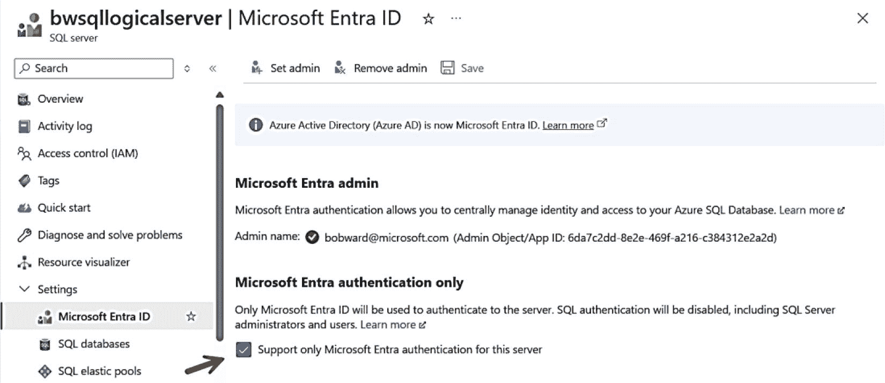
*图 6-6：逻辑服务器的 Microsoft Entra 选项*

这与在 SQL Server 中仅使用 Windows 身份验证非常相似。与 SQL 身份验证一样，我可以使用 Microsoft Entra 帐户创建其他登录名和包含用户。您应该知道，PowerShell 也支持使用 `Set-AzSqlServerActiveDirectoryAdministrator` cmdlet 创建 Entra 管理员，而 az CLI 支持 `az sql server ad-admin create`。

以 Entra 管理员身份连接到此用户数据库后，我可以基于另一个 Entra 帐户创建包含用户，如下所示（这是 Microsoft Entra 中的一个假设帐户）：

```sql
CREATE USER [troyward@microsoft.com] FROM EXTERNAL PROVIDER;
GO
```

然后，我将通过将此用户添加到 `db_datareader` 角色来授予其读取数据的权限：

```sql
ALTER ROLE db_datareader ADD MEMBER [troyward@microsoft.com];
GO
```

> **提示**：如果您想知道在应用程序中使用 Microsoft Entra 身份验证的各种连接字符串选项，请参阅我们文档中的此表：[`https://learn.microsoft.com/en-us/sql/connect/ado-net/sql/azure-active-directory-authentication`](https://learn.microsoft.com/en-us/sql/connect/ado-net/sql/azure-active-directory-authentication)。您会注意到 Azure Active Directory 这个旧名称仍然存在。

### 托管标识

使用 Microsoft Entra 身份验证的一个有趣选项是托管标识。托管标识是 Microsoft Entra 目录中的一个对象，它可以像用户一样“行动”，但不需要密码。因此，使用此选项进行身份验证通常被称为无密码身份验证。

假设您将在 Azure 虚拟机中使用 SSMS 连接到 Azure SQL Database。您现在可以在 Entra 中创建一个托管标识，并将该标识分配给虚拟机。您还可以使用相同的标识启用 Azure SQL Database，并基于该标识创建一个登录名。

现在，SSMS 可以在 VM 中使用该标识登录而无需密码。事实上，任何应用程序都可以使用令牌来获取 VM 中基于标识的登录访问权限。这是因为该标识被分配给了 VM 本身的边界。

图 6-7 展示了其工作原理的可视化。

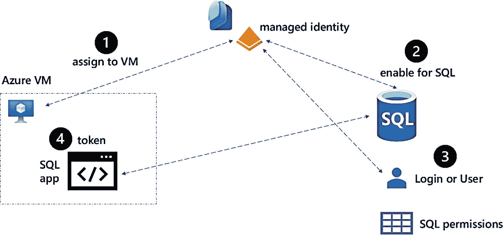
*图 6-7：使用无密码托管标识连接到 Azure SQL Database*

让我展示一下这如何使用我部署的 Azure VM `bwsql2022` 和我的逻辑服务器 `bwsqllogicalserver` 来工作：

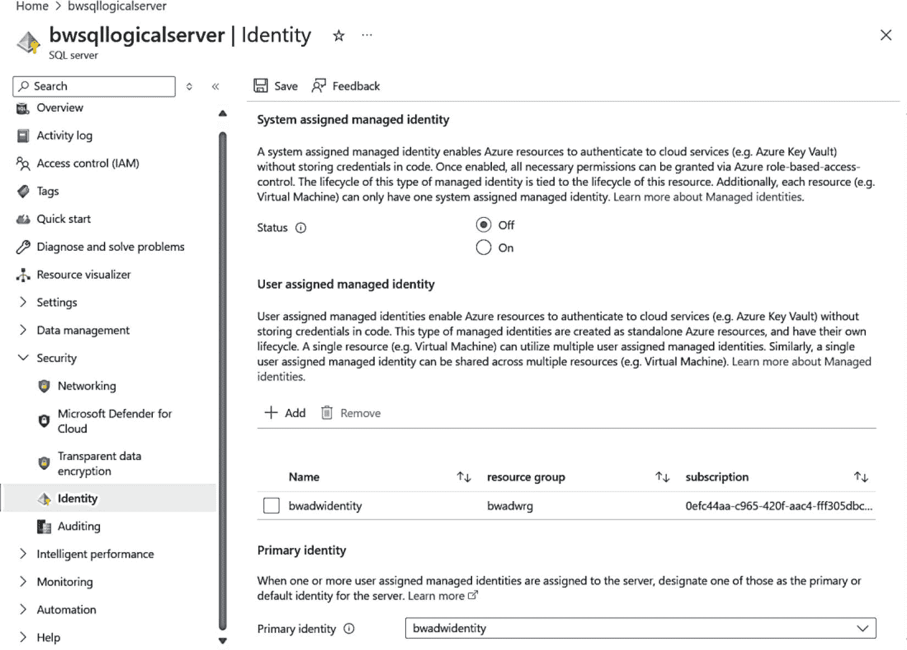
*图 6-8：为逻辑服务器启用托管标识*

1.  我使用以下文档步骤创建了一个用户分配的托管标识：[`https://learn.microsoft.com/entra/identity/managed-identities-azure-resources/how-manage-user-assigned-managed-identities`](https://learn.microsoft.com/entra/identity/managed-identities-azure-resources/how-manage-user-assigned-managed-identities)。我将此托管标识命名为 `bwadwidentity`。

    > **注意**：还有一个系统分配的托管标识的概念，您可以直接为逻辑服务器启用。但是，它仅限于该服务器使用。我喜欢用户定义的托管标识，因为我可以将它们用于所有类型的 Azure 资源。

2.  我现在可以为我的逻辑服务器启用此托管标识，正如您在图 6-8 中从 Azure 门户看到的那样，方法是选择“添加”，然后选择我已创建的标识。我还必须将此设置为服务器的主要标识并单击“保存”。

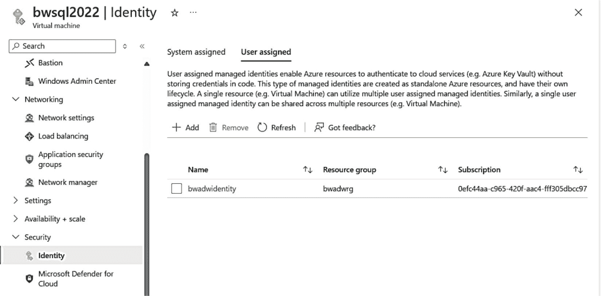
*图 6-9：为 Azure VM 分配托管标识*

3.  现在我需要为此标识创建一个登录名。我将改为使此标识成为特定数据库的用户。因此，我将使用我的 Entra 管理员帐户通过 SSMS 连接，并在 `bwhyperscale` 数据库的上下文中运行以下 T-SQL 语句：

    ```sql
    CREATE USER [bwadwidentity] FROM EXTERNAL PROVIDER;
    ALTER ROLE db_datareader ADD MEMBER [bwadwidentity];
    GO
    ```

4.  现在我需要将该标识分配给我的 Azure 虚拟机。使用 Azure 门户，我可以导航到名为 `bwsql2022` 的虚拟机并分配该标识，如图 6-9 所示。

    > **注意**：您还可以将托管标识分配给应用程序（如 Azure 应用服务）以连接到 Azure SQL Database。

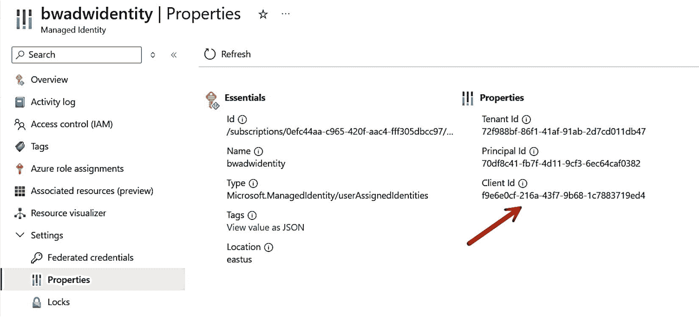
*图 6-10：托管标识概览*

5.  现在让我们尝试使用 SSMS 连接。SSMS 界面使用此方法比较棘手，因为您不能只提供标识名称。现在在 Azure 中找到 `bwidentity` 资源（您只需单击图 6-9 中的标识名称）。您应该在“概览”屏幕上看到类似图 6-10 的内容。

    您需要复制客户端 ID 的值。这就是您将用于通过 SSMS 登录的内容。

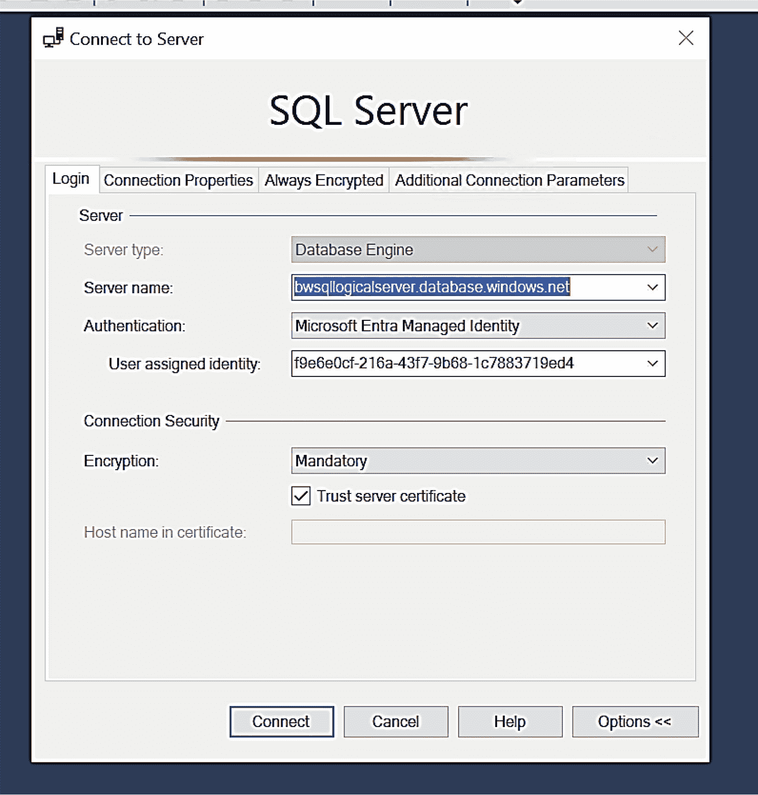
*图 6-11：在 SSMS 中使用托管标识连接*

6.  在 VM 内，启动 SSMS 并像图 6-11 那样选择您的连接。

    用户分配的标识是上一步中标识的客户端 ID。**在单击“连接”之前**，您必须选择“连接属性”选项卡，并在“连接到数据库”字段中输入您的数据库名称（我的是 `bwhyperscale`）。

    您现在可以像使用任何其他 Azure SQL Database 一样使用此连接。相同的概念适用于 Azure SQL 托管实例，只是您需要为该实例创建一个登录名。

应用程序开发人员不必使用此特殊 ID。他们拥有来自 Azure 的 API，可根据分配给应用程序或虚拟机的标识来获取令牌。

#### 设置和配置访问

既然您已经创建了登录名和用户，接下来该做什么呢？就像您为 SQL Server 所做的那样，您需要根据应用程序要求，为数据库内的对象授予访问权限和权限。

这可能涉及创建架构、角色，以及授予或撤销特定权限。如需了解 SQL Server 权限的入门知识，请参阅文档 [`https://learn.microsoft.com/sql/relational-databases/security/permissions-database-engine`](https://learn.microsoft.com/sql/relational-databases/security/permissions-database-engine)。

自本书第一版以来，SQL 访问方面的一个很好的补充是一组**粒度更细**的服务器角色。这些新的固定服务器角色有特定的命名约定 `##MS_<role>##`。它们允许您使用**最低权限**原则，而不必为用户过度分配角色。例如，角色 `##MS_ServerStateReader##` 拥有查看逻辑服务器或任何数据库的系统目录状态的权限，但除此之外没有其他权限。您可以在 [`https://learn.microsoft.com/azure/azure-sql/database/security-server-roles`](https://learn.microsoft.com/azure/azure-sql/database/security-server-roles) 查看所有新的固定服务器角色。

别忘了，Azure SQL 和 SQL Server 一样支持行级安全性 (RLS)。请在 [`https://learn.microsoft.com/sql/relational-databases/security/row-level-security`](https://learn.microsoft.com/sql/relational-databases/security/row-level-security) 阅读有关 RLS 的内容。您可以在 [`https://learn.microsoft.com/azure/azure-sql/database/logins-create-manage`](https://learn.microsoft.com/azure/azure-sql/database/logins-create-manage) 阅读更多关于 Azure SQL 数据库身份验证和访问控制的内容。

### Microsoft Purview

考虑这样一种场景：您正试图为跨多个托管实例或数据库的登录和访问**大规模**设置权限。如果有一个集中控制和管理访问权限的地方就太好了。**Microsoft Purview DevOps** 策略正是为了应对这种场景而生。

考虑这种情况：您需要组织内有人负责在您众多的 Azure SQL 数据库和逻辑服务器上执行所有性能监控。与其为此创建一个单独的登录名并授予其执行此任务的权限（请记住，我们有新的服务器固定角色用于此目的），您可以通过 Purview 来管理您的逻辑服务器，然后设置一个策略，指定哪些 Microsoft Entra 帐户将拥有性能监控角色的访问权限（我们还支持 SQL 安全审计角色），这一切都可以*在一个位置*完成。

现在，这些 Microsoft Entra 帐户将能够登录这些逻辑服务器并执行“性能监控”任务。此角色的实际权限可以在 [`https://learn.microsoft.com/purview/how-to-policies-devops-authoring-generic#role-definition-detail`](https://learn.microsoft.com/purview/how-to-policies-devops-authoring-generic#role-definition-detail) 找到。如果您想撤销此访问权限，可以在 Purview 中通过策略完成，而不必逐台登录逻辑服务器进行操作。请在 [`https://learn.microsoft.com/purview/how-to-policies-devops-azure-sql-db`](https://learn.microsoft.com/purview/how-to-policies-devops-azure-sql-db) 阅读入门指南。

> **注意**
>
> Purview DevOps 策略也支持 Azure SQL 托管实例和 SQL Server 2022。

## 数据保护

确保已为连接和数据访问设置适当的授权只是第一步。您需要从部署的各个方面保护数据，包括连接、静态数据、端到端数据，并确保只有合适的人员才能查看重要数据。Azure SQL 拥有与 SQL Server 一样的数据保护能力。

### 加密连接

与 SQL Server 类似，Azure SQL 支持通过传输层安全性 (TLS) 协议加密连接（您可以在 [`https://en.wikipedia.org/wiki/Transport_Layer_Security`](https://en.wikipedia.org/wiki/Transport_Layer_Security) 阅读关于 TLS 的内容）。

默认情况下，Azure SQL 托管实例强制要求连接加密。工具和应用程序应为托管实例启用加密连接，以避免客户端/服务器协商。此外，您可以强制客户端连接使用最低 TLS 版本。最新的 TLS 1.2 版本修复了一些已知的安全漏洞，因此您可以考虑要求使用此版本。您可以通过 Azure 门户、PowerShell (`Set-AzInstance`) 或 az CLI (`az sql mi update`) 设置最低版本。您可以在 [`https://learn.microsoft.com/azure/azure-sql/managed-instance/minimal-tls-version-configure`](https://learn.microsoft.com/azure/azure-sql/managed-instance/minimal-tls-version-configure) 阅读更多关于 TLS 和托管实例的内容。

Azure SQL 数据库强制要求加密连接，无论客户端或应用程序是否启用。您可以通过检查 `sys.dm_exec_connections` 的 `encrypt_option` 列来验证这一点，您会发现对于任何用户 TCP 连接，该列值始终为 TRUE。Azure SQL 数据库还提供通过 Azure 门户、PowerShell (`Set-AzSqlServer`) 和 az CLI (`az sql server update`) 强制执行最低 TLS 版本（1.0、1.1 和 1.2）的功能。您可以在 [`https://learn.microsoft.com/azure/azure-sql/database/connectivity-settings?view=azuresql&tabs=azure-portal#minimal-tls-versio`](https://learn.microsoft.com/azure/azure-sql/database/connectivity-settings?view=azuresql&tabs=azure-portal#minimal-tls-versio) 阅读更多内容。

> **提示**
>
> 因为 Azure SQL 数据库强制要求加密连接，最佳实践是为您的客户端工具或应用程序启用此功能。如果客户端未设置加密，服务器必须与客户端协商设置加密，这会加快连接速度。

SQL Server 2022 现在支持 TLS 1.3。我预计 Azure SQL 很快也会支持此 TLS 版本。

### 透明数据加密 (TDE)

透明数据加密 (TDE) 是一种**静态数据加密**技术，已在 SQL Server 的多个版本中使用。其概念是 SQL Server 引擎在数据写入和读取磁盘时，对数据库文件进行加密和解密。这样，文件中的数据被加密，以保护任何**离线**访问数据库文件的企图。Azure SQL 托管实例和数据库**默认**启用此选项。

您可能想知道为什么需要此加密选项，因为您或任何人都无法访问 Azure SQL 底层虚拟机中的文件。默认启用 TDE 只是 Azure 为保护您的数据而致力于**纵深防御**方法的另一种机制。许多人使用 TDE 来保护其自有数据中心的 SQL Server 部署，以防止意外入侵导致引擎外部访问数据库文件。即使 Azure 生态系统已为数据中心部署了许多保护机制，这一点在 Azure 中同样适用。

对于 Azure SQL 托管实例，TDE 默认为实例开启，这意味着为该实例创建的所有数据库都启用了 TDE。您无法为实例禁用此选项，但可以通过 `ALTER DATABASE` 或 SSMS 等工具单独为数据库禁用 TDE。对于托管实例，您有一个选项是可以控制用于 TDE 加密的密钥。默认情况下，Azure SQL 托管实例使用服务托管密钥，这意味着 Azure SQL 管理密钥的证书（轮换密钥并使用 Azure 内的根密钥对其进行保护）。

Azure SQL 数据库也支持通过 `ALTER DATABASE` (`ENCRYPTION` 选项) 为数据库配置 TDE，同时还允许通过 Azure 门户、PowerShell (`Set-AzSqlDatabaseTransparentDataEncryption`) 和 az CLI (`az sql db tde set`) 启用和禁用 TDE。默认密钥管理也是在逻辑服务器级别的服务托管密钥。

#### 自带密钥（BYOK）

许多客户希望完全控制用于加密的密钥（例如出于合规性和信任考虑）。SQL Server 提供了一种使用可扩展密钥管理（EKM）提供程序来保护数据库加密密钥（DEK）的方法，该密钥用于通过 TDE 加密数据。允许的 EKM 提供程序之一是 Azure Key Vault。这允许用于加密的密钥存储在 SQL Server 之外。

Azure SQL 提供了一种类似的机制，亲切地称为*自带密钥*（BYOK）。您可能也会看到它被称为*客户管理密钥*（CMK）。使用 Azure Key Vault 实现 BYOK 的机制被称为 `TDE protector`。Azure Key Vault 是 Azure 中的一项服务，可帮助您集中存储和管理机密与密钥。正如 Azure Key Vault 入门文档所述（位于 [`https://learn.microsoft.com/azure/key-vault/general/overview`](https://learn.microsoft.com/azure/key-vault/general/overview)），“机密和密钥由 Azure 保护，使用行业标准算法、密钥长度和硬件安全模块（HSM）。使用的 HSM 符合联邦信息处理标准（FIPS）140-2 Level 2 验证。”

授权以创建密钥库以及创建和管理密钥是通过 Microsoft Entra 完成的。Azure Key Vault 密钥可以在实例或逻辑服务器级别设置，并应用于该实例或逻辑服务器中的所有数据库。此外，Azure SQL 数据库现在支持在数据库级别设置密钥。我喜欢这篇博客文章中的图表（位于 [`https://azure.microsoft.com/blog/announcing-transparent-data-encryption-tde-with-customer-managed-keys-for-managed-instance`](https://azure.microsoft.com/blog/announcing-transparent-data-encryption-tde-with-customer-managed-keys-for-managed-instance)），它展示了 Azure Key Vault BYOK 的工作原理，如图 6-12 所示。

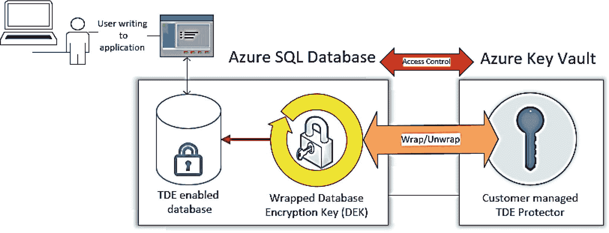

图 6-12

使用 Azure Key Vault 为 TDE 实现 BYOK

让我向您展示如何轻松地在 Azure SQL 数据库中使用 BYOK。我将在 Azure 门户中导航到名为 `bwhyperscale` 的数据库，然后从“服务”菜单的“安全”选项中选择“数据加密”，如图 6-13 所示。

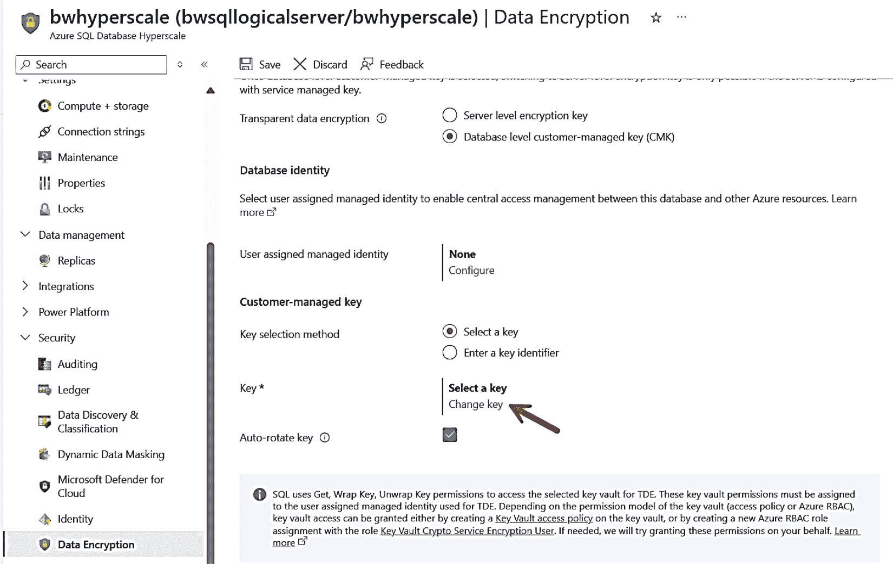

图 6-13

为 Azure SQL 数据库的 TDE 配置 BYOK

您可以看到我已选择“数据库级别的客户管理密钥（CMK）”。我现在可以选择“更改密钥”，使用一个屏幕在 Azure Key Vault 中创建一个新密钥并将其应用于我的数据库加密。我甚至可以使用托管标识来管理密钥，该密钥可用于多个 Azure 资源。

这看起来很简单，但在将 BYOK 与 Azure SQL 一起使用时有几个注意事项：

*   仅当使用 BYOK 时，才支持托管实例的 `COPY_ONLY` 备份（因为您拥有用于还原的密钥），这与使用服务托管的 TDE 加密的备份不同，因为后者证书无法访问。

*   您的密钥保管库和 Azure SQL 部署必须属于同一个 Microsoft Entra 租户。

*   与您管理密钥的任何场景一样，您应定期备份它们。了解有关 Azure Key Vault 备份的更多信息，请访问 [`https://learn.microsoft.com/azure/key-vault/general/backup`](https://learn.microsoft.com/azure/key-vault/general/backup)。

*   对于高可用性下的 BYOK 存在一些考虑因素。请阅读更多信息，网址为 [`https://learn.microsoft.com/azure/azure-sql/database/transparent-data-encryption-byok-overview?view=azuresql&viewFallbackFrom=sql-server-ver15#high-availability-with-customer-managed-tde`](https://learn.microsoft.com/azure/azure-sql/database/transparent-data-encryption-byok-overview?view=azuresql&viewFallbackFrom=sql-server-ver15#high-availability-with-customer-managed-tde)。

### Always Encrypted

Always Encrypted 是一项基于微软研究成果的技术，用于为 SQL 应用程序提供端到端加密。它在 SQL Server 2016 中引入，并在 Azure SQL 中拥有所有相同的功能。与 SQL Server 一样，Always Encrypted 的密钥可以存储在 Azure Key Vault 中。请阅读有关 Always Encrypted 工作原理以及如何设置的完整说明，网址为 [`https://learn.microsoft.com/sql/relational-databases/security/encryption/always-encrypted-database-engine`](https://learn.microsoft.com/sql/relational-databases/security/encryption/always-encrypted-database-engine)。

Always Encrypted 的一个独特方面（自本书第一版以来是新的）是对 Azure SQL 数据库的 `secure enclaves` 的支持。此选项为 Always Encrypted 场景提供了更快、更强大的选择。这是因为 SQL Server 的许多解密操作都在引擎内部使用安全区域完成。这也是为什么我们现在有 Azure SQL 数据库的 DC 系列硬件选项，因为它在后台使用 Intel SGX 芯片架构。阅读更多信息，请访问 [`https://learn.microsoft.com/sql/relational-databases/security/encryption/always-encrypted-enclaves`](https://learn.microsoft.com/sql/relational-databases/security/encryption/always-encrypted-enclaves)。

### 动态数据屏蔽（DDM）

另一种保护数据的方法是控制哪些用户有权查看*敏感*数据。许多应用程序通过*屏蔽*其应用程序显示层中的数据来提供此类保护。例如，Web 应用程序可能对某些用户显示电话号码为 XXX-XXX，而对其他用户显示完整的电话号码。这种方法的问题在于，如果使用的掩码规则或哪些用户可以看到数据或屏蔽数据的规则发生变化，则必须修改应用程序。

SQL Server 提供了一种在数据库层而不是应用程序层控制数据屏蔽的方法。然后，*任何*应用程序或工具都将仅根据使用 T-SQL 定义的屏蔽规则看到数据。此功能称为动态数据屏蔽（DDM），在 SQL Server 2016 中引入。您可以在 [`https://learn.microsoft.com/sql/relational-databases/security/dynamic-data-masking`](https://learn.microsoft.com/sql/relational-databases/security/dynamic-data-masking) 阅读 DDM 的完整文档。Azure SQL 通过 T-SQL 语句支持 DDM，如文档中所述。此外，Azure SQL 数据库允许您通过 Azure 门户管理屏蔽和权限，如图 6-14 所示，这是我基于示例 AdventureWorksLT 创建的数据库。

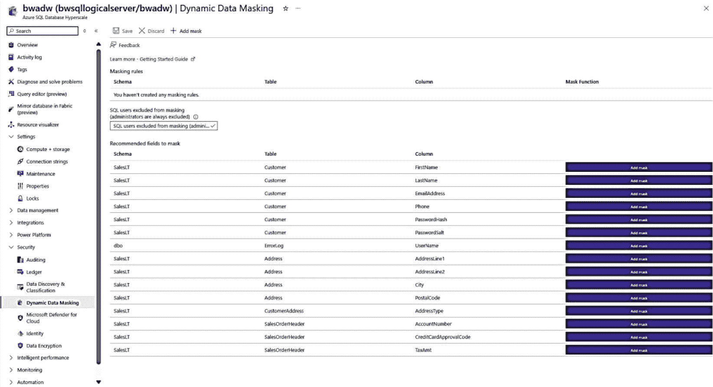

图 6-14

通过 Azure 门户进行动态数据屏蔽

您可以看到，使用 Azure 门户将根据数据库中的列名（例如 `LastName` 或 `EmailAddress`）提供有关要屏蔽列的建议。


