# SQL 账本

如果你阅读过 *SQL Server 2022 揭秘*，我在书中介绍了 SQL Server 中的一个新功能，即在数据库内部实现的区块链。这里的核心概念是，账本提供了数据库变更的防篡改记录。

描述 SQL 账本最好的方式是通过图表，如图 6-15 所示。

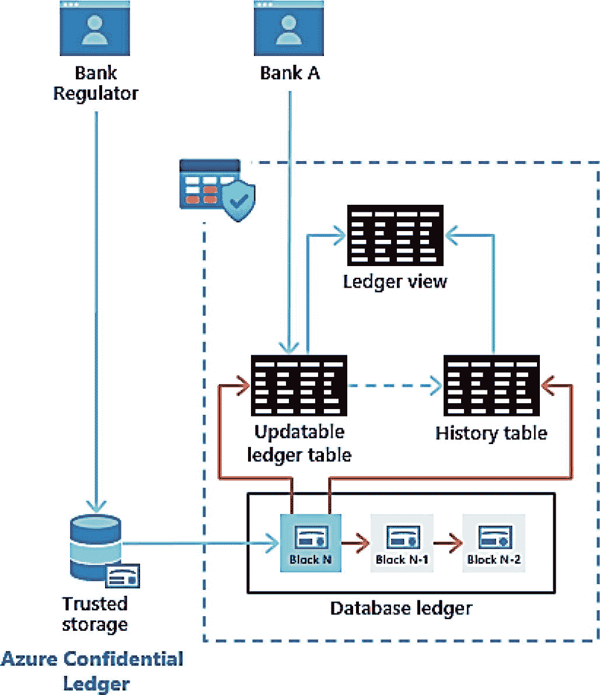

图 6-15 SQL 账本

SQL 账本允许你使用 T-SQL 创建一个表，通过附加语法 `WITH LEDGER = ON`，系统将自动使用时态表的技术来跟踪该表的所有变更。系统将构建一个变更历史表和一个视图，使你能够查看当前表以及历史变更。

这与时态表有何不同？关键在于数据库账本，这是一系列系统内部表，用于跟踪：
- 哪个 SQL 主体进行了变更
- 实际变更的加密哈希值

现在，你可以跟踪变更内容、变更时间、变更执行者，并确保没有人从内部篡改数据。例如，如果有人试图入侵系统，并“伪造”一条 `UPDATE` 操作使其看起来像是原始值以隐藏变更。

数据库账本以链式结构记录这些哈希值，因此构成一个区块链。这比传统的区块链系统更有优势，因为所有数据都保留在 SQL Server 数据库内部。这里不需要应用程序逻辑，因为所有功能都内置在 SQL 中。

此外，可以存储一个独立的摘要，这是在数据库账本之上独立计算的哈希值。这提供了一种独立的方法来验证数据库账本本身的有效性。

图 6-15 中未显示的一个额外选项是，你可以将账本表设置为 `APPEND_ONLY`，这意味着只允许 `T-SQL INSERT` 语句。这几乎类似于“日志”，同时具备账本的其他优势。

Azure SQL Database 提供了一些独特的选项，如图 6-16 所示。

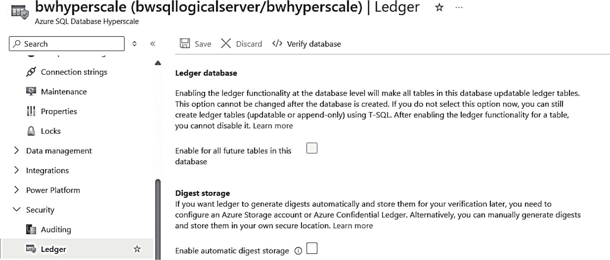

图 6-16 Azure SQL Database 账本选项

你可以通过 Azure 门户默认启用所有表使用账本功能，为所有账本表验证数据库账本，并启用自动将摘要存储到 Azure 存储或 Azure Confidential Ledger 中。

账本功能在 Azure SQL Database、Azure SQL 托管实例以及 SQL Server 2022（包括 Azure 虚拟机和本地部署）中均可用。请访问 [`https://aka.ms/sqlledger`](https://aka.ms/sqlledger) 了解关于 SQL 账本的所有信息。

## 安全管理

在为身份验证、访问和数据保护配置好安全设置后，你将需要管理和审计安全的特定方面。这包括监控活动、使用 SQL 审计以及使用 Microsoft Defender for Cloud 检查安全问题。

### SQL 外部的活动监控

当你在 Windows 和 Linux 上部署和管理 SQL Server 时，操作系统提供了多种不同的方法来审计 SQL Server 外部的活动。你的数据中心内可能还有其他方法来审计此类活动。

Azure 生态系统提供了相同类型的审计能力。你可能在第 4 章中看到过，在部署 Azure SQL 托管实例和数据库后，针对此类活动的 **活动日志**。可以将其视为审计 Azure RBAC 的一种方式。

活动日志是 Azure 生态系统为所有订阅提供的平台日志。实际上，活动日志是 Azure 订阅所有事件的记录，包括针对 Azure SQL 托管实例和数据库的特定事件。基本上，任何在 SQL Server 外部针对 Azure SQL 资源执行的操作都会记录在活动日志中。我使用 Windows 事件日志多年，我喜欢将活动日志视为 Azure 的事件日志。

Azure 门户提供了一种绝佳的方式来查看特定 Azure 资源的活动日志条目。例如，如果我在 Azure 门户中导航到我的逻辑服务器 `bwsqllogicalserver`，然后从资源菜单中选择“活动日志”，并将时间范围更改为一周，我会看到类似图 6-17 中的条目。

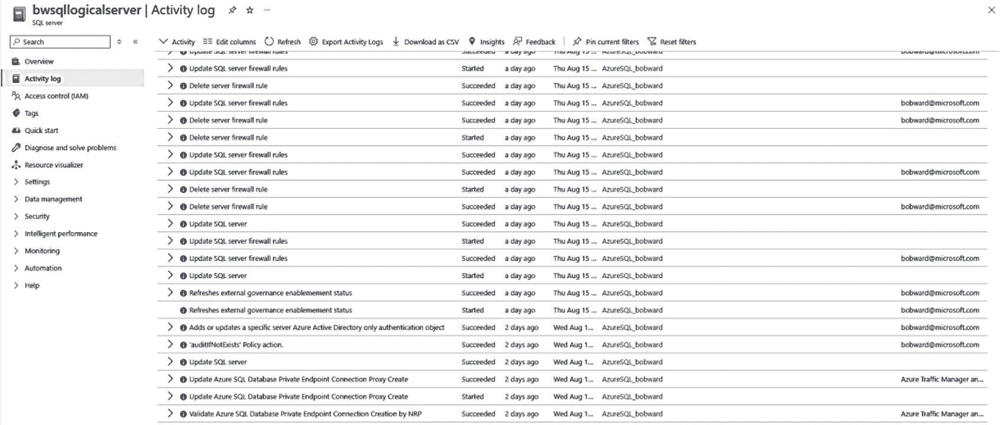

图 6-17 Azure SQL Database 逻辑服务器的活动日志

你可以看到一些日志条目显示了更新防火墙规则或设置专用端点等活动。

默认情况下，Azure 活动日志条目会保留 90 天（之后会滚动更新）。如果你想将活动日志条目保留更长时间，可以创建一个 Log Analytics 工作区。Log Analytics 工作区还为你提供了更强大的查询和可视化活动日志条目的能力。在此屏幕上，顶部有一个“诊断设置”选项。这允许你创建一个 Log Analytics 工作区并将活动日志条目添加到其中。你还可以选择将活动日志条目发送到 Event Hub 进行流式传输。要详细了解活动日志的一般用法，请访问 [`https://learn.microsoft.com/azure/azure-monitor/essentials/activity-log`](https://learn.microsoft.com/azure/azure-monitor/essentials/activity-log)。

### 审计 Azure SQL 托管实例

由于 Azure SQL 托管实例非常类似于完整的 SQL Server 实例，许多熟悉的审计工具和功能都可供你使用。

#### 跟踪登录

据我所知，几乎每个 SQL Server 版本都会在 SQL Server 的 `ERRORLOG` 中跟踪失败的登录。托管实例的 `ERRORLOG` 中，失败的登录如下所示：
```
Error: 18456, Severity: 14, State: 7.
Login failed for user 'sa'. Reason: An error occurred while evaluating the password. [CLIENT: 10.1.0.4]
```
SQL Server 提供了关闭此跟踪或同时跟踪成功登录的能力。此功能不适用于托管实例（即使 SSMS 给你一种它允许的印象），因为它需要重启 SQL Server，而你没有权限执行此操作。

由于 Azure SQL 托管实例为你提供了对 Extended Events 的完全访问权限，你可以使用以下事件来跟踪登录：`process_login_finish`、`login_event` 和 `login`。Azure SQL 托管实例的 Extended Events 支持所有事件、操作和目标。文件目标必须使用 Azure Blob 存储，因为你无权访问底层操作系统文件系统。


### SQL Server 审核

SQL Server 审核是一项存在于多个 SQL Server 版本中的功能，用于审核和跟踪实例及数据库活动。Azure SQL 托管实例完全支持 SQL Server 审核，但有几个例外：

*   审核文件存储在 Azure Blob 存储中。请阅读以下链接了解如何操作：`https://learn.microsoft.com/azure/azure-sql/managed-instance/auditing-configure?view=azuresql#set-up-auditing-for-your-server-to-azure-storage`。
*   不支持在审核失败时关闭 SQL Server 的选项（但支持“继续”和“失败”选项）。

如果您从未使用过 SQL Server 审核，请查阅以下文档：`https://learn.microsoft.com/en-us/sql/relational-databases/security/auditing/sql-server-audit-database-engine`。

SQL Server 审核生成文件以基于扩展事件格式跟踪活动（SQL Server 审核在底层使用扩展事件会话）。Azure SQL 托管实例还允许您将审核事件生成到 Azure Monitor 日志和事件中心。`TO EXTERNAL MONITOR` 选项已添加到 `CREATE SERVER AUDIT` T-SQL 语句中。

请参阅以下示例，了解如何配置 SQL Server 审核以将数据发送到 Azure 日志或事件中心：`https://learn.microsoft.com/azure/azure-sql/managed-instance/auditing-configure?view=azuresql#set-up-auditing-for-your-server-to-event-hubs-or-azure-monitor-logs`。

### 审核 Azure SQL Database

Azure SQL Database 的审核活动通过动态管理视图 (DMVs) 中的指标和 Azure Metrics 提供。此外，SQL Server 审核功能以 **SQL 数据库审核** 的形式提供。

#### 跟踪连接

Azure SQL Database 提供了一个名为 `sys.event_log` 的 DMV，可以在逻辑服务器的逻辑主数据库的上下文中查询。此 DMV 以五分钟的聚合时间间隔显示连接指标的信息。此 DMV 不跟踪单个成功或失败的连接，而是跟踪逻辑服务器所有数据库（包括逻辑主数据库）的连接指标。此 DMV 在 Azure SQL 托管实例中不支持。

您可以查看此 DMV 的示例包括：

*   成功连接数
*   由于登录名无效导致的失败连接数
*   由于防火墙规则阻止导致的失败连接数

虽然此信息存储在所有数据库中，但您可以使用 Azure Metrics 和 Logs 来捕获失败连接、被防火墙规则阻止的连接以及成功连接的聚合数字。

图 6-18 显示了我如何为其中一个 Azure SQL Database 添加成功连接数。

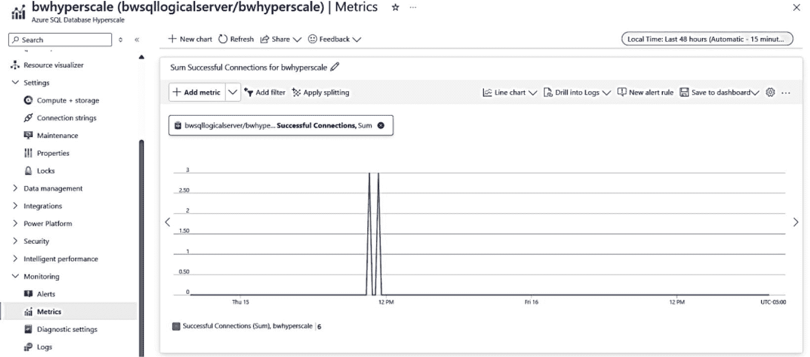

图 6-18 使用 Azure Metrics 跟踪成功连接

#### SQL 数据库审核

由于您无法访问 Azure SQL Database 底层的 SQL Server 实例，因此无法使用 T-SQL 语句 `CREATE SERVER AUDIT` 来使用 SQL Server 审核功能。

因此，我们在 Azure SQL Database *外部* 创建了接口来审核数据库和逻辑服务器活动。我们称之为 **SQL 数据库审核**。请阅读完整文档：`https://learn.microsoft.com/azure/azure-sql/database/auditing-overview`。SQL 数据库审核可以通过 Azure 门户、PowerShell（`Set-AzSqlDatabaseAudit` 和 `Set-AzSqlServerAudit`）以及 az CLI（`az sql db audit-policy`）启用。

您可以将 SQL 数据库审核定向到 Azure 存储帐户、Log Analytics 工作区或用于流式传输的事件中心。

让我们看一个为逻辑服务器创建审核并将审核定向到存储帐户 **和** Log Analytics 工作区的示例（并解释为什么您可能希望使用其中一个或两者）。审核逻辑服务器将审核所有数据库的所有活动。

注意
您也可以为每个数据库创建单独的审核，但当您审核逻辑服务器时，所有数据库的所有活动也会进入该审核。

我首先按照以下步骤创建了一个新的 Log Analytics 工作区：`https://learn.microsoft.com/azure/azure-monitor/logs/quick-create-workspace`。我将其命名为 `bwsqldbloganalytics`。

我通过导航到我的逻辑服务器 `bwsqllogicalserver` 开始了这个过程，从服务菜单中选择了“审核”，并看到了如图 6-19 所示的顶部屏幕。

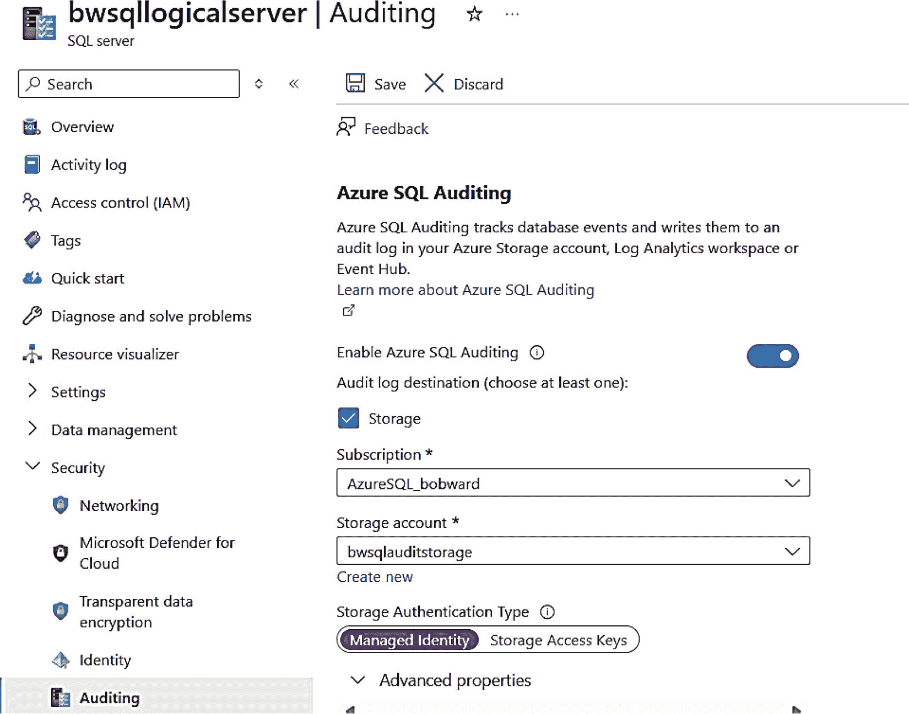

图 6-19 配置 Azure SQL Database 审核的第一部分

我选择了“启用审核”选项，然后选择了“新建”以创建一个新的 Azure 存储帐户来存储审核数据。我还选择了“托管标识”用于身份验证，以创建对审核存储更安全的访问。

向下滚动，我有更多选项可以选择，如图 6-20 所示。

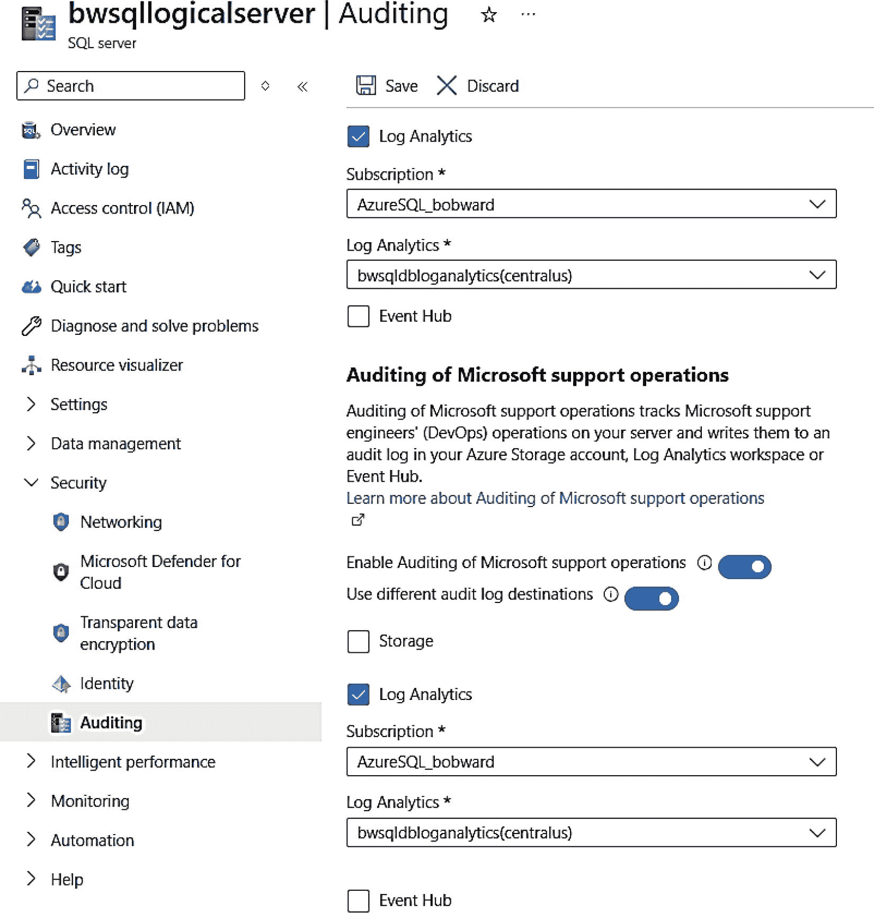

图 6-20 配置 Azure SQL 数据库 SQL 审核的第二部分

我添加了之前创建的 Log Analytics 工作区。此外，我还配置了一个选项，将 Microsoft 支持操作审核到同一个 Log Analytics 工作区（它可以是不同的工作区，甚至是不同的 Azure 存储）。此选项真正显示了 Microsoft 对透明度的重视程度。这意味着如果您因任何问题联系 Microsoft 支持，您可以审核他们对您的部署采取的任何操作。您可以在以下链接中阅读有关此选项的更多信息：`https://learn.microsoft.com/azure/azure-sql/database/auditing-microsoft-support-operations`。我点击了 **保存** 来持久化我的选择。

注意
我还可以选择在数据库级别启用审核。如果我为逻辑服务器启用了审核，则所有数据库都启用了审核。

SQL Server 审核有一个称为操作组的概念，用于定义要审核的活动。SQL 数据库审核默认启用以下操作组：

*   `BATCH_COMPLETED_GROUP` – 审核所有成功的 SQL 语句
*   `SUCCESSFUL_DATABASE_AUTHENTICATION_GROUP` – 审核成功的数据库登录
*   `FAILED_DATABASE_AUTHENTICATION_GROUP` – 审核失败的数据库连接


所有可用的操作组可在 [`https://learn.microsoft.com/sql/relational-databases/security/auditing/sql-server-audit-action-groups-and-actions`](https://learn.microsoft.com/sql/relational-databases/security/auditing/sql-server-audit-action-groups-and-actions) 找到。您可以使用 PowerShell cmdlet `Set-AzSqlDatabaseAudit` 来启用其他操作组。

对于 SQL Server，通常可以通过 SSMS 或使用系统函数 `sys.fn_get_audit_file` 查看审计。事实证明，对于逻辑服务器上的每个数据库，您也可以执行相同的操作。

我刚刚开启了审计功能，因此预计不会有多少活动。我将使用本章前面向您展示的方式，通过我启用并创建了登录名的托管标识进行 SSMS 连接，并且在我设置为管理员的 Microsoft Entra ID 笔记本电脑上进行连接。要查看审计日志，我将导航到我的数据库 `bwhyperscale`，然后从服务菜单的“安全性”部分选择“审计”。接着在屏幕顶部选择“查看审计日志”。我的结果如图 6-21 所示。

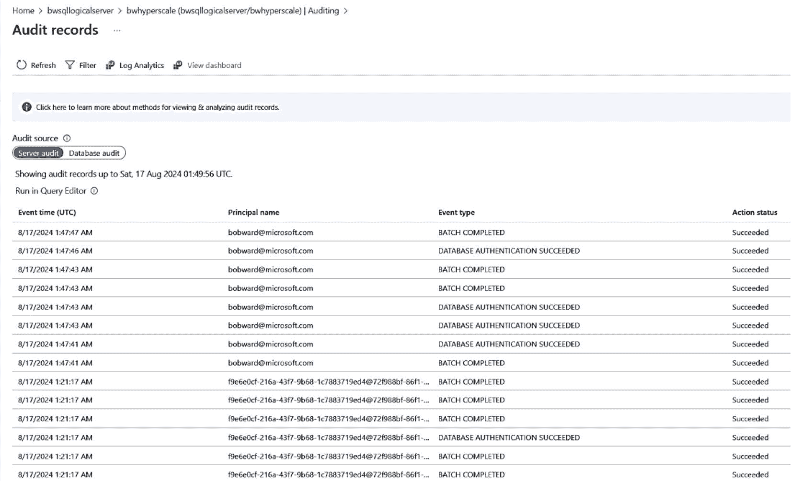
图 6-21 Azure SQL 数据库的 SQL 审计记录

从这些结果中，您可以看到我不同的连接。请注意托管标识以及我的 Microsoft Entra 管理员帐户的 GUID 值。您可以单击查询编辑器中的“运行”以查看这些结果背后的 SQL 查询，该查询使用 `sys.fn_get_audit_file` 系统过程从我为审计配置的 Azure 存储帐户中读取数据，其结果与上一个屏幕中的审计记录相同。您还可以使用命令菜单中的“Log Analytics”选项，通过不同技术查看审计结果。此选项可为您的安全审计提供更直观的表示。更多信息请访问 [`https://learn.microsoft.com/azure/azure-sql/database/auditing-analyze-audit-logs?view=azuresql#analyze-logs-using-log-analytics`](https://learn.microsoft.com/azure/azure-sql/database/auditing-analyze-audit-logs?view=azuresql#analyze-logs-using-log-analytics)。

## Microsoft Defender for SQL

我在本书前面已经多次提到过 `Microsoft Defender for SQL`（它在技术上属于 `Microsoft Defender for Cloud` 的范畴）。`Microsoft Defender for Cloud` 提供针对您所有 Azure 资源（以及其他云资源，这也是该服务更名为 Microsoft 而非 Azure 的原因）的安全漏洞和潜在攻击的洞察。`Microsoft Defender for Cloud` 是一项付费服务，可以按资源或订阅级别启用。启用后，您可以从 `Microsoft Defender for Cloud` 仪表板（在本书第一版中，它被称为 Azure 安全中心）获取所有可能的洞察概览，如图 6-22 所示。

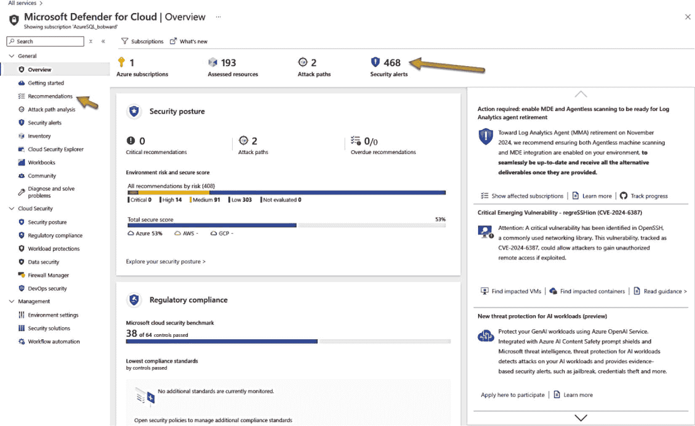
图 6-22 Microsoft Defender for Cloud 概述

看起来信息量巨大，这就是为什么我喜欢首先关注“建议”和“安全警报”。此外，还有一个新的 Copilot 体验来分析详细信息，例如“建议”和“警报”，如图 6-23 和 6-24 所示。

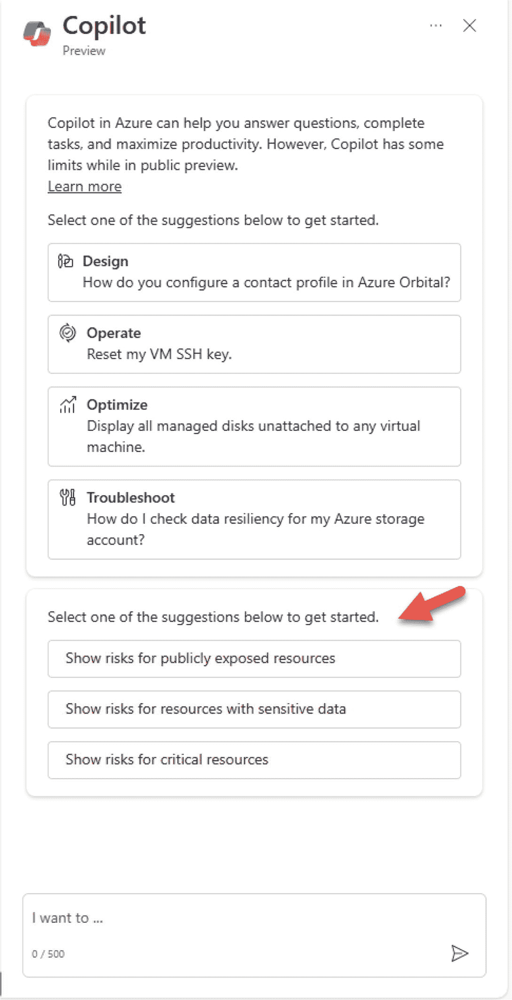
图 6-24 将 Copilot for Azure 与 Microsoft Defender 一起使用

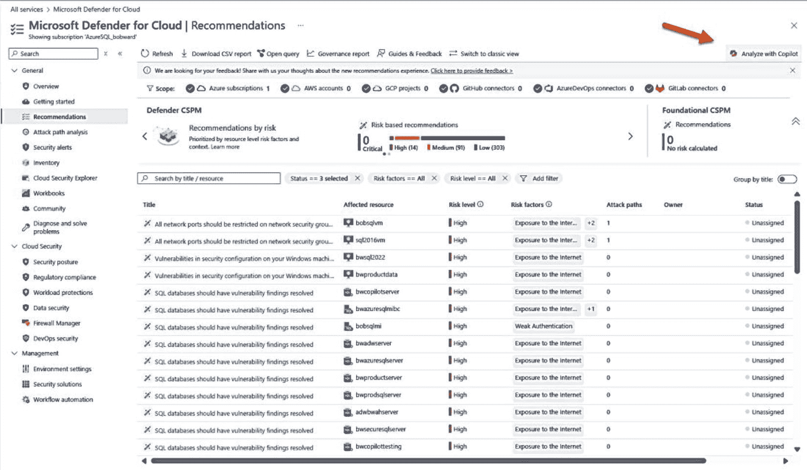
图 6-23 Microsoft Defender for Cloud 建议

**提示：** 此 Copilot 体验是新的 `Copilot for Security` 的一部分，它比您在此处看到的 Defender 功能更强大。您可以在 [`https://www.microsoft.com/security/business/ai-machine-learning/microsoft-copilot-security`](https://www.microsoft.com/security/business/ai-machine-learning/microsoft-copilot-security) 了解更多信息。

对于 Azure SQL，您可以使用 `Microsoft Defender` 的两个主要功能类别：`漏洞评估` 和 `SQL 威胁防护`。

### 漏洞评估

保护数据的另一个方面是主动监控和检查任何已知的安全漏洞。但什么是已知漏洞？Azure SQL 拥有一个我们构建的规则知识库（基于来自 [`https://www.cisecurity.org/cis-benchmarks/`](https://www.cisecurity.org/cis-benchmarks/) 的行业标准），用于扫描您的 Azure SQL 托管实例和数据库，以查找可能被视为脆弱的配置。我喜欢把漏洞评估看作像病毒扫描程序，它使用*扫描*方法来查找可能的问题。我正在为漏洞评估使用一种名为 `快速配置` 的方法。这种新方法现在是默认方法，不需要任何存储来存储结果（经典配置则需要）。

图 6-25 显示了我的逻辑服务器上的漏洞评估。

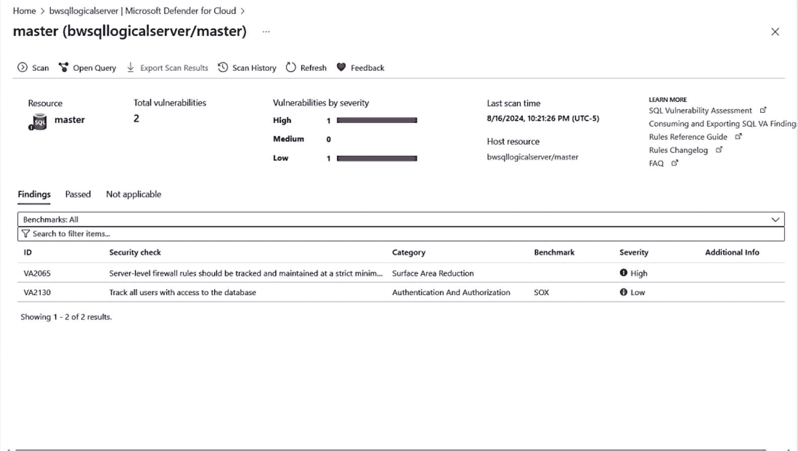
图 6-25 逻辑服务器上的漏洞评估

在此屏幕上，我可以看到发现结果、基本检查信息、它们关联的基准以及严重性。请注意，在命令菜单上，我可以启动手动扫描（漏洞评估通常每周安排一次）并查看扫描历史记录。扫描是轻量级且安全的。它需要几秒钟运行，并且完全是只读的。它不会对您的数据库进行任何更改。

如果我单击特定规则，可以深入查看更多详细信息，如图 6-26 所示。

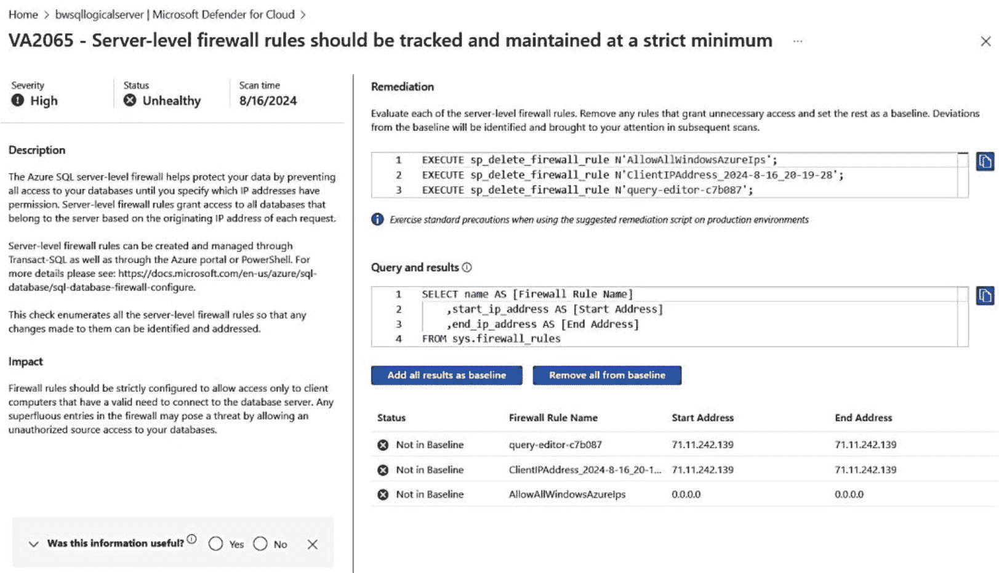
图 6-26 漏洞评估发现的详细信息

此发现是基于我公开了此逻辑服务器的公共终结点这一事实。我使用的是防火墙规则，但允许任何 Azure 资源进行连接。

在左侧，您可以获得有关该发现的更多信息。在右侧，有一个用于修复问题的脚本以及用于检测问题的查询。

下方是选项，用于将结果添加为 `基线` 的一部分或将其删除。如果我按当前状态添加结果，则意味着使用防火墙规则公开公共端点并允许 Azure 资源连接不是问题。因此，后续扫描将不会显示此发现。如果我以后想更改此设置，可以从基线中删除它，它将再次显示。漏洞评估的另一个优点是，您可以配置系统通过电子邮件向您发送按需扫描和每周计划扫描的发现结果。

您还可以使用 PowerShell（例如，`Get-AzSqlDatabaseVulnerabilityAssessmentScanRecord`）来显示和管理漏洞评估。

您可以在 [`https://learn.microsoft.com/azure/defender-for-cloud/sql-azure-vulnerability-assessment-overview`](https://learn.microsoft.com/azure/defender-for-cloud/sql-azure-vulnerability-assessment-overview) 了解有关漏洞评估的更多信息。

**提示：** 我认为您还应该探索 Defender 的另一个新功能，即数据安全仪表板。此功能可帮助您查看可能存在的安全漏洞和威胁，这些漏洞和威胁可能集中在您可能拥有的敏感数据上。更多信息请访问 [`https://learn.microsoft.com/azure/defender-for-cloud/data-aware-security-dashboard-overview`](https://learn.microsoft.com/azure/defender-for-cloud/data-aware-security-dashboard-overview)。


