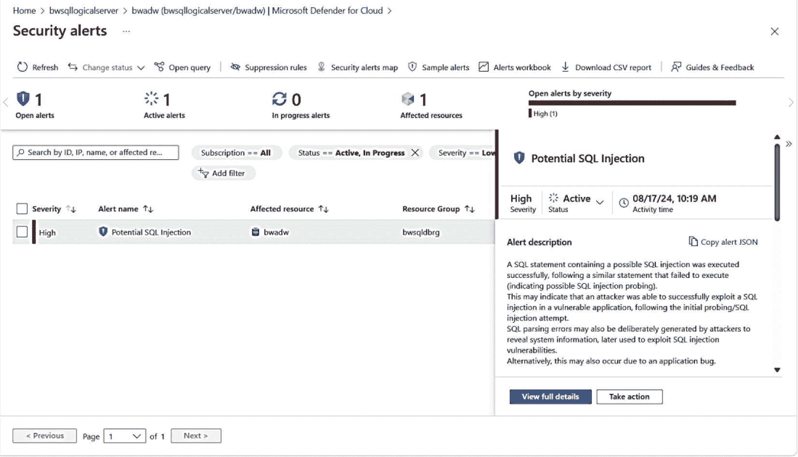

# SQL 威胁防护

我个人不太喜欢这里的“威胁防护”这个说法，因为 SQL 威胁防护并不能预防问题，它只是 `检测` 问题。例如暴力登录攻击、来自异常位置的登录或潜在的 SQL 注入攻击。

SQL 威胁防护利用扩展事件和机器学习技术，来检测并提醒您某些类型的可疑活动。可疑活动的一个例子是专为 `SQL 注入` 设计的代码。您可以在 [`https://learn.microsoft.com/azure/defender-for-cloud/alerts-sql-database-and-azure-synapse-analytics`](https://learn.microsoft.com/azure/defender-for-cloud/alerts-sql-database-and-azure-synapse-analytics) 阅读所有检测到的不同规则和警报。

虽然我们没有记录我们如何检测所有规则的细节，但我可以向您展示如何使用 SSMS 模拟一次 SQL 注入以查看警报。

我将使用笔记本电脑上的 SSMS，通过 SSMS 创建一个新的查询连接，但我会使用 SSMS 的“其他连接参数”（通过“选项”按钮）来输入这个字符串：

```
Application Name=webappname
```

我还使用了“连接到数据库”选项来连接到 `bwadw` 数据库（此数据库使用了示例数据库 AdventureWorksLT）。在查询编辑器窗口中，我输入了以下查询并执行了它：

```
SELECT * FROM SalesLT.Customer WHERE CustomerID like '' or 1 = 1 --' and family = 'test1';
```

> **注意**
>
> 我们会将 SSMS 作为一个应用程序过滤掉，因为没有人会从 SSMS 这样的工具发送注入。因此，我使用了不同的应用程序名称来模拟一个真实应用程序发送看起来像是 SQL 注入攻击的查询。

几秒钟内，我就可以导航到 Azure 门户中的我的数据库，从服务菜单的“安全性”部分选择“Microsoft Defender for Cloud”，然后选择“在 Microsoft Defender for Cloud 中检查此资源的警报”；您将看到一个类似于图 6-27 的屏幕。


*图 6-27：检测到一次 SQL 注入攻击*

您可以单击“查看完整详细信息”以了解更多关于攻击来源以及为何这被视为注入攻击的详细信息。

如果您想知道为什么这是一次攻击，请仔细看看我使用的 SQL 查询：

```
SELECT * FROM SalesLT.Customer WHERE CustomerID like '' or 1 = 1 --' and family = 'test1';
```

在这种情况下，解析器在看到注释符号 `--` 时会停止处理查询。因此，构造此查询的人试图查看所有客户。想象一下，如果 WHERE 子句的输入来自一个应用程序的 Web 输入字段。如果开发人员动态拼接查询和输入字符串，黑客就可以尝试使用这种技术来查看他们本不该看到的数据（情况可能会糟糕得多）。SQL 注入是一个有趣的安全主题，我们在 [`https://docs.microsoft.com/sql/relational-databases/security/sql-injection`](https://docs.microsoft.com/sql/relational-databases/security/sql-injection) 提供了文档来解释这有多危险以及如何避免它们。

与漏洞评估类似，您可以配置您的系统，以便在检测到任何威胁时接收电子邮件。微软对此非常重视；每当我尝试这样的测试时，我都会收到公司安全团队的电子邮件，确保我已经看到此警报并且我的数据库一切正常！

SQL 威胁检测还提供了 PowerShell（例如，`Set-AzSqlDatabaseThreatDetectionPolicy`）和 az CLI（例如，`az sql db threat-policy`）的接口。

