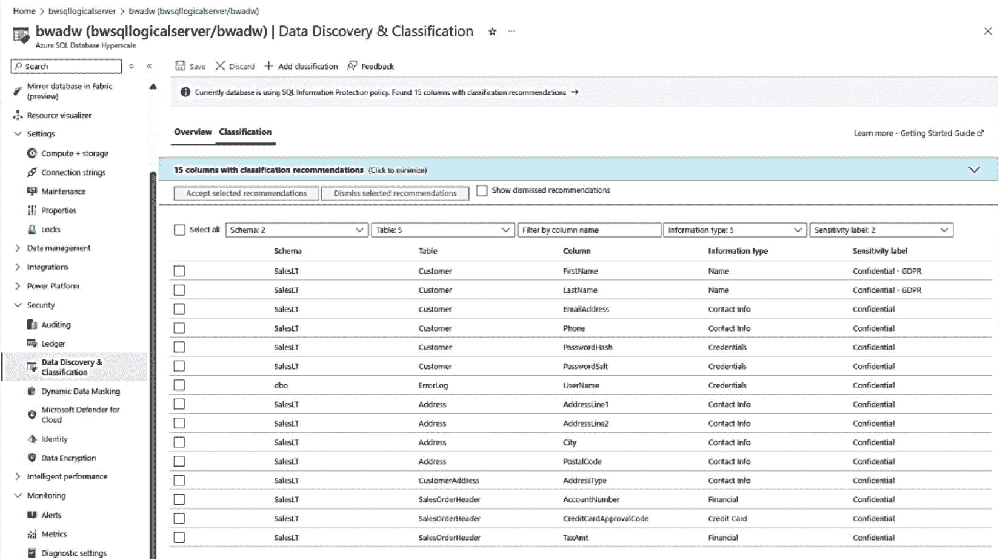
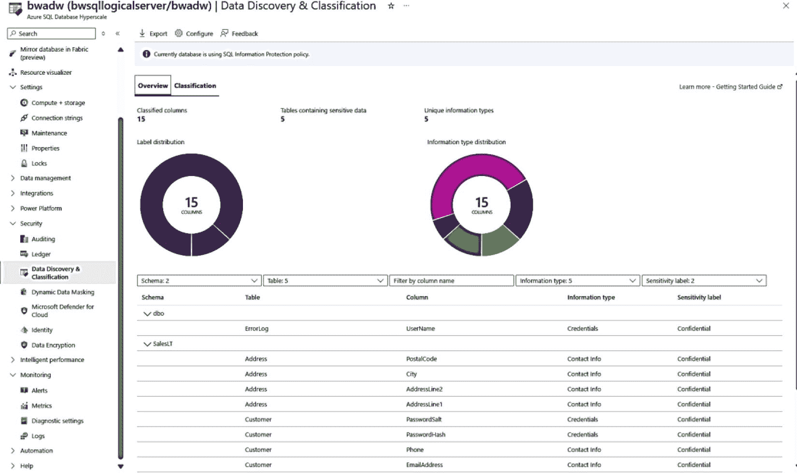

# 数据分类

假设您希望将数据库中的表分类，以查找符合通用数据保护条例（GDPR）或个人身份信息（PII）等策略的数据访问。Azure SQL 的数据分类提供了一种基于检测到的名称模式匹配对列进行分类的方法，或者允许您手动标记它们。

我可以从 Azure 门户中完成此操作，如图 6-28 所示。

*图 6-28：Azure SQL 的数据分类*

如果我选择所有这些建议并单击“接受选定的建议”，我可以使用“概述”窗格来获取数据分类的报告，如图 6-29 所示。

*图 6-29：数据分类概述*

此功能的一个优点是，对标记为已分类数据的访问可以在 SQL 审核中看到。现在，您可以跟踪谁尝试访问您已标记为具有这些信息类型和标签的已分类数据。

展示完这些之后，此功能现在可以与 Microsoft Purview 集成。要了解更多关于如何使用 Microsoft Purview 进行数据分类的信息，请参阅文档 [`https://learn.microsoft.com/azure/azure-sql/database/data-discovery-and-classification-overview?view=azuresql#enabling-access-control-for-sensitive-data-using-microsoft-purview-information-protection-policies-public-preview`](https://learn.microsoft.com/azure/azure-sql/database/data-discovery-and-classification-overview?view=azuresql#enabling-access-control-for-sensitive-data-using-microsoft-purview-information-protection-policies-public-preview)。

## 总结

在本章中，您了解到 Azure SQL 安全在许多方面与 SQL Server 类似。您学习了如何保护网络并验证登录和用户的身份，包括使用 Microsoft Entra。您学习了如何使用各种加密技术保护数据。您了解了可以在 Azure 内外使用的所有审核功能。此外，您还学习了如何使用 Microsoft Defender for Cloud 和数据分类在云端更进一步。

您在本书中学到，云的速度帮助我们快速创新和适应。安全始终是这种创新的一部分。根据安全首席组项目经理 Joachim Hammer 的说法：“我们继续投资于三管齐下的方法，以确保 Azure SQL 满足最严格的安全要求以及行业的监管合规性。这些领域包括先进的内置安全控制、信任与合规性以及威胁检测与评估。”

您可以在云 workshop 的 [`https://github.com/microsoft/cloudsqlworkshop/tree/main/cloudsqlworkshop/07_Deploy_Manage_Optimize_AzureSQLDB`](https://github.com/microsoft/cloudsqlworkshop/tree/main/cloudsqlworkshop/07_Deploy_Manage_Optimize_AzureSQLDB) 尝试一些关于 Azure SQL 数据库的 Microsoft Entra 身份验证的自主进度实验。

在下一章中，我们将探索并深入研究 Azure SQL 核心的第二个主要方面：性能。

