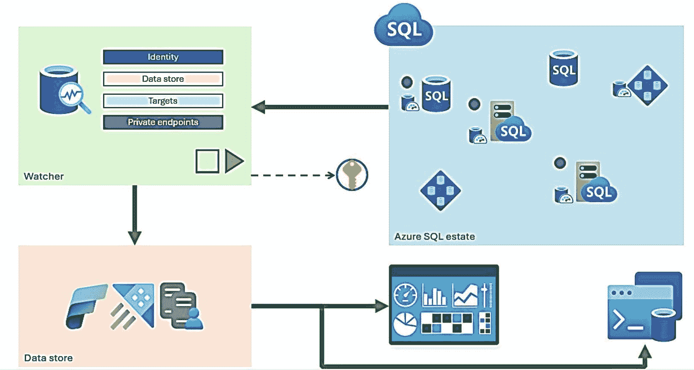

# Azure SQL 性能监控与诊断工具

Azure SQL 提供了丰富的内置工具，用于监控、诊断和优化性能，这些工具与 SQL Server 中的工具相似，但也存在一些云环境特有的差异。

## Azure Monitor

`Azure Monitor` 是 Azure 生态系统的一部分，`Azure SQL` 已与之集成，以支持指标、警报和日志功能。`Azure Monitor` 数据可在 `Azure 门户` 中可视化，或通过应用程序通过 `Azure Event Hub` 或 `API` 访问。`Azure Monitor` 重要性的一个例子是，可以像使用 `Windows 性能监视器` 一样，在 `SQL Server` 工具之外访问 `Azure SQL` 的资源使用指标。在 `Azure 门户` 中，通过 [`https://learn.microsoft.com/azure/azure-sql/database/monitor-tune-overview?view=azuresql#monitoring-and-tuning-capabilities-in-the-azure-portal`](https://learn.microsoft.com/azure/azure-sql/database/monitor-tune-overview?view=azuresql#monitoring-and-tuning-capabilities-in-the-azure-portal) 阅读有关如何将 `Azure Monitor` 与 `Azure SQL` 配合使用的更多信息。

## 动态管理视图 (DMVs)

`Azure SQL` 提供了与 `SQL Server` 相同的 `DMV` 基础结构，但存在一些差异。`DMV` 是性能监控的关键方面，因为您可以使用标准的 `T-SQL` 查询来查看关键的 `SQL Server` 性能数据。诸如活动查询、资源使用情况、查询计划和资源等待类型等信息都可以通过 `DMV` 获得。本章后续将详细介绍 `Azure SQL` 中的 `DMV`。

## 扩展事件 (XEvent)

`Azure SQL` 提供了与 `SQL Server` 相同的 `Extended Events` 基础结构。`Extended Events` 是一种跟踪 `SQL Server` 内关键执行事件的方法，它为 `Azure SQL` 提供支持。出于性能考虑，`Extended Events` 允许您跟踪单个查询的执行情况。本章后续将详细介绍 `Azure SQL` 中的 `Extended Events`。

## 轻量级查询分析

`轻量级查询分析` 是一种检查活动查询的查询计划和运行状态的功能。这是在长时间运行的语句执行时调试其查询性能的关键功能。与使用像 `Extended Events` 这样的工具来跟踪查询性能相比，此功能减少了您解决性能问题所需的时间。`轻量级查询分析` 通过 `DMV` 访问，并且对于 `Azure SQL` 默认是开启的，就像 `SQL Server 2022` 一样。在 [`https://learn.microsoft.com/sql/relational-databases/performance/query-profiling-infrastructure?view=sql-server-ver15#lwp`](https://learn.microsoft.com/sql/relational-databases/performance/query-profiling-infrastructure?view=sql-server-ver15#lwp) 阅读有关 `轻量级查询分析` 的更多信息。

## 查询计划调试

在某些情况下，您可能需要关于单个 `T-SQL` 语句查询性能的更多详细信息。诸如 `SHOWPLAN` 和 `STATISTICS` 之类的 `T-SQL SET` 语句可以提供这些详细信息，并且在 `Azure SQL` 中与在 `SQL Server` 中一样完全受支持。一个使用 `SET` 语句进行查询计划调试的好例子可以在 [`https://learn.microsoft.com/sql/t-sql/statements/set-statistics-profile-transact-sql`](https://learn.microsoft.com/sql/t-sql/statements/set-statistics-profile-transact-sql) 找到。此外，以图形或 `XML` 格式查看计划总是很有帮助的，并且在 `Azure SQL` 中完全有效。在 [`https://learn.microsoft.com/sql/relational-databases/performance/display-the-estimated-execution-plan`](https://learn.microsoft.com/sql/relational-databases/performance/display-the-estimated-execution-plan) 了解更多信息。

### 查询存储

`查询存储` 是存储在用户数据库中的查询执行性能的历史记录。对于 `Azure SQL`，`查询存储` 默认是开启的，并用于提供诸如 `自动计划修正` 和 `自动调优` 之类的功能。`SQL Server Management Studio (SSMS)` 中的 `查询存储` 报告适用于 `Azure SQL`。这些报告可用于查找资源消耗最高的查询，包括查询计划差异和顶级等待类型，以分析资源等待场景。

`查询存储` 现在也用于某些 `智能查询处理 (IQP)` 场景中，以存储用于提高性能的反馈信息。

本章我将向您展示一个在 `Azure SQL` 中使用 `查询存储` 的示例。如果您从未见过或使用过 `查询存储`，可以从阅读 [`https://learn.microsoft.com/sql/relational-databases/performance/monitoring-performance-by-using-the-query-store`](https://learn.microsoft.com/sql/relational-databases/performance/monitoring-performance-by-using-the-query-store) 开始。

## Azure 门户中的性能可视化

对于 `Azure SQL 数据库`，我们已通过可视化效果将 `查询存储` 性能信息集成到 `Azure 门户` 中。这样，您就可以使用一个名为 **查询性能见解** 的选项，在 `Azure 门户` 中看到与使用 `SSMS` 等客户端工具查看 `查询存储` 时相同的一些信息。本章稍后我将向您展示在门户中使用这些可视化效果的示例。现在，要开始使用它，请查阅我们的文档：[`https://learn.microsoft.com/azure/azure-sql/database/query-performance-insight-use`](https://learn.microsoft.com/azure/azure-sql/database/query-performance-insight-use)。

## 数据库监视器

坦率地说，我们在 `Azure` 中曾多次尝试提供一种监控解决方案，以提供丰富且可视化的体验来监控 `Azure SQL`，但都没有成功。

我相信 `数据库监视器`，这个用于监控 `SQL` 的新云服务（在撰写本书时处于预览版），将会有所不同，原因如下：

*   该服务与 `SQL` 是分离的，它通过 `DMV` 和 `查询存储` 等元数据使用内置遥测，并将信息持久化存储在 `Kusto` 群集中。
*   该服务默认附带一组丰富的可视化效果，几乎可以提供 `SQL` 专业人员所需的任何内容。这就是为什么我称它为“云中的 `perfmon`”。
*   该服务允许您跨多个 `Azure SQL 托管实例` 和 `数据库` 收集数据。并且一些可视化效果允许您跨这些对象查看。例如，您可以查看跨数据库（实际上是跨 `查询存储`）的顶级查询。
*   该服务的发布由我的同事 `Dimitri Furman` 负责管理，我认为他是微软内部 `SQL` 领域的顶级专家之一。在本章中，您将看到它的卓越之处。

图 7-1 展示了 `数据库监视器` 的整体架构。

图 7-1
数据库监视器架构

该服务连接到目标（即您的 `Azure SQL 托管实例` 和 `数据库`）。它从这些目标收集数据并存储在 `Kusto` 群集中。该服务附带了一些非常丰富的可视化效果，但您也可以使用 `K-SQL` 或 `T-SQL` 来查询该群集。此外，您可以将遥测数据存储在 `Microsoft Fabric` 实时分析中，以构建像 `Power BI` 报表这样的解决方案。

您可以在 [`https://aka.ms/dbwatcher`](https://aka.ms/dbwatcher) 开始使用 `数据库监视器`，也可以在安娜·霍夫曼（`Anna Hoffman`）著名的 `Data Exposed` 节目中看到她和我对此的讨论：[`https://learn.microsoft.com/shows/data-exposed/database-watcher-your-perfmon-in-the-cloud-data-exposed`](https://learn.microsoft.com/shows/data-exposed/database-watcher-your-perfmon-in-the-cloud-data-exposed)。

