# Azure SQL 数据库中的 Microsoft Copilot 技能

大约在 2023 年夏末，我参与了微软内部一个为 SQL 数据库打造 AI 助手的新项目，该项目属于 Azure Copilot 的一部分。其理念是在 Azure 门户中提供一种`旁加载`式聊天体验。彼时，微软已经推出了多项 Copilot 体验，包括 Microsoft Edge、移动应用和 Microsoft 365。Copilot 是生成式 AI 应用程序（GenAI application）的一个范例，它采用 GPT 等语言模型，以提示应用程序的形式呈现。

我记得在项目初期的会议中，我们的目标之一就是构建一个`利用 Azure SQL 数据库上下文`的丰富体验。如果你在 Azure 门户中导航到自己的数据库，就可以使用`特定于你数据库`的`技能`与 Copilot 聊天。我记得我曾告诉团队，SQL 内置了极其丰富的遥测数据，包括目录视图、DMV、扩展事件和查询存储，我们可以借此打造出真正具有行业差异化的产品。

在我们最初的几次会议上，他们问我应该尝试解决哪些场景。性能问题位列我清单的首位。为什么？因为性能故障排除需要对本身不精确的事物进行精确诊断。事实上，我清楚地记得告诉团队，我应该能够对 Copilot 说“我的数据库很慢”，然后它会根据用户的权限，利用我们的引擎遥测数据来快速定位问题。我向他们展示了我在《面向初学者的 Azure SQL 性能故障排除特别版》(`https://aka.ms/performanceseries`)中使用的“运行中 vs. 等待中”概念。我告诉团队，要仔细研究视频中的所有示例（相关代码可在`https://github.com/microsoft/sqlworkshops-azuresqlworkshop/tree/master/azuresqlworkshop/07-PerformanceTroubleshooting`找到）。我说，如果我能通过与 Copilot 聊天来解决这类场景，那么我们就将打造出微软内外无人能及的东西。

这个项目的首次亮相是在 2023 年 PASS 峰会主题演讲中，我和 Anna Hoffman 进行了一场著名的“对决”（她似乎总是赢？），您可以在`https://youtu.be/M80Ze7nyvVc`观看。而当著名的 Joe Sack 重新加入微软并担任该项目的首席产品经理（他也恰好是本书的技术审阅者）时，项目进程便加速了。整个开发团队在出色的 Katherine Lin 带领下，奋力推进，最终在 2024 年 3 月的 SQLBits 大会上发布了产品的预览版（您可以在`https://sqlbits.com/sessions/event2024/Welcome_to_the_world_of_SQL_Copilots`观看 Joe 和我在 SQLBits 上的演示）。

Joe 制作了一张非常棒的架构图，展示了这项技术的工作原理，如图 7-2 所示。

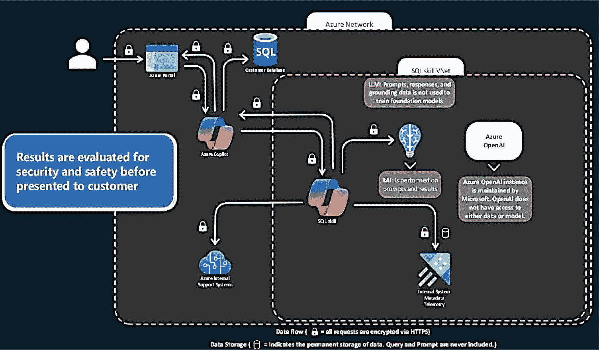

图 7-2

“SQL Copilot” 架构

您可以通过 `https://aka.ms/sqlcopilot` 开始使用 Azure SQL 数据库中的 Microsoft Copilot 技能。

Copilot 的功能远不止帮助您处理性能问题。为了首先向您展示 Copilot 如何理解您的数据库上下文，我使用了如图 7-3 所示的提示。

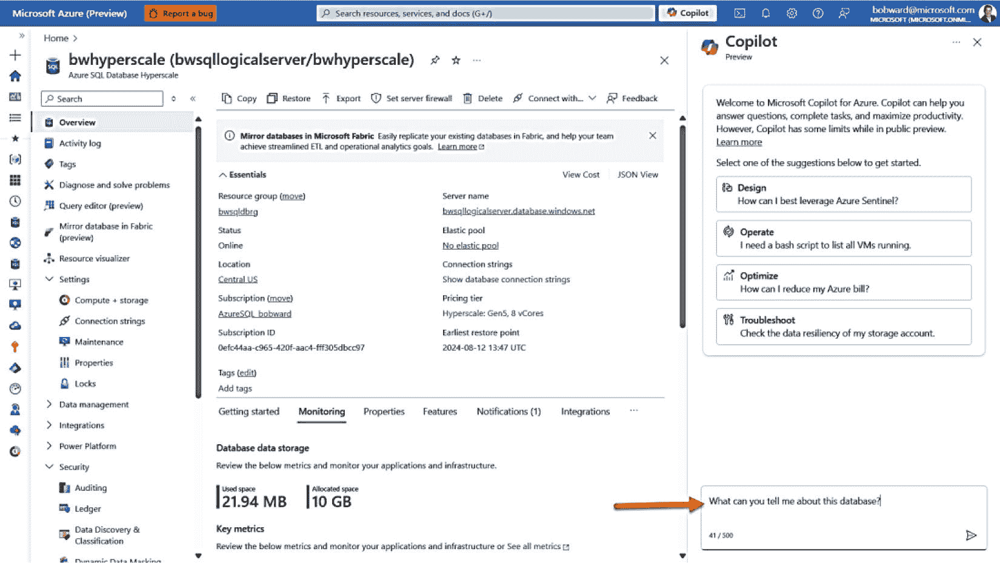

图 7-3

SQL Copilot 数据库上下文

图 7-4 显示了结果。

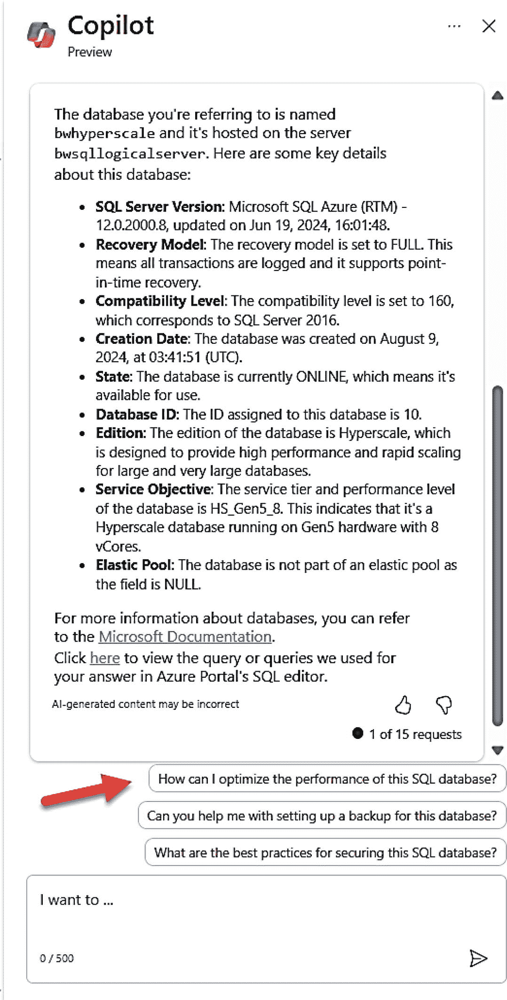

图 7-4

SQL Copilot 数据库上下文结果

您可以看到 Copilot“理解”您当前的数据库上下文。请注意，它还为您可能想使用的其他相关提示提供了建议。图 7-5 展示了“SQL Copilot”在 Azure 门户中能够执行的可能技能类型。

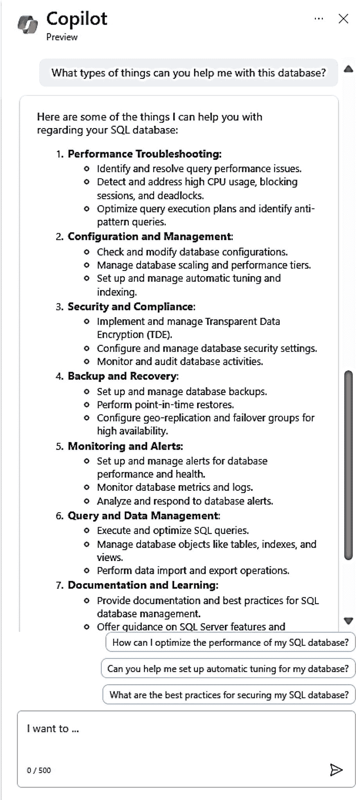

图 7-5

SQL Copilot 技能

您可以看到，除了性能之外，它还具备许多其他功能，但性能无疑是这项能力大放异彩的领域。

注意

Azure 中的 Copilot 即使在您不在数据库上下文时也能“理解”SQL，但其回答将更多来自文档搜索。如图 7-5 所示，即使在数据库上下文中，您也可以使用 Copilot 帮助您搜索微软文档。

在本章后面，我将向您展示一些使用数据库监视器（Database Watcher）和 Azure SQL 数据库中的 Microsoft Copilot 技能来解决性能问题的示例。我还将在本书的第 10 章向您展示 Copilot 的另一部分功能，即将自然语言转换为 SQL（NL2SQL）。

## 深入了解 DMV 和扩展事件

动态管理视图（DMVs）和扩展事件（XEvent）多年来一直是 SQL Server 诊断（包括性能监控和故障排除）的`基石`。我可以诚实地告诉您，DMV 和 XEvent 技术始于多年前像 Slava Oks 和 Conor Cunningham 这样的聪明才智。工程团队中的许多人都曾致力于这些技术的开发、培育和塑造，但我记得我和 Slava 以及我的多年同事 Robert Dorr 和 Keith Elmore 在微软支持部门共事时，就从头开始参与了这些技术的研发。DMV 和 XEvent 是支持 Azure SQL 性能监控和故障排除的非常重要的技术，因为 Azure SQL 由 SQL Server 引擎驱动，而 SQL Server 引擎又为 Azure SQL 托管实例和数据库提供支持。

让我们更深入地探讨一下，对于 Azure SQL 与 SQL Server，哪些 DMV 和 XEvent 功能是相同的，哪些是新的。

### DMV 深入探讨

让我们更深入地探讨 Azure SQL（包括 Azure SQL 托管实例和数据库）与 SQL Server 相比的 DMV。

#### Azure SQL 托管实例

SQL Server 的所有 DMV 都适用于托管实例。关键 DMV 如`sys.dm_exec_requests`和`sys.dm_os_wait_stats`常用于检查查询性能。

有一个特定于 Azure 的 DMV 叫做`sys.server_resource_stats`，它显示托管实例的历史资源使用情况。这是一个重要的 DMV，用于查看资源使用情况，因为您无法直接访问操作系统工具（如性能监视器）。您可以在`https://learn.microsoft.com/sql/relational-databases/system-catalog-views/sys-server-resource-stats-azure-sql-database`了解更多关于`sys.server_resource_stats`的信息。

#### Azure SQL 数据库

您进行性能分析所需的`大多数`常见 DMV，包括`sys.dm_exec_requests`和`sys.dm_os_wait_stats`，都是可用的。重要的是要知道，这些 DMV 仅提供特定于该数据库的信息，而非逻辑服务器下所有数据库的汇总信息。

`sys.dm_db_resource_stats`是 Azure SQL 数据库特有的一个 DMV，可用于查看数据库的历史资源使用情况。使用这个 DMV 的方式类似于在托管实例中使用`sys.server_resource_stats`。我将在本章后面的一个示例中向您展示如何使用此 DMV。现在，您可以在`https://learn.microsoft.com/sql/relational-databases/system-dynamic-management-views/sys-dm-db-resource-stats-azure-sql-database`阅读更多信息。

`sys.elastic_pool_resource_stats`类似于`sys.dm_db_resource_stats`，但用于查看弹性池中数据库的资源使用情况。


## 你需要了解的 DMVs

有一些值得特别说明的动态管理视图（DMVs）是你解决 Azure SQL 某些性能场景所必需的，包括以下：

*   `sys.dm_io_virtual_file_stats` 对 Azure SQL 很重要，因为你无法直接访问操作系统来获取每个文件的 I/O 性能指标。

*   `sys.dm_os_performance_counters` 在 Azure SQL 数据库和托管实例中均可用，用于查看 SQL Server 的常见性能指标。可用于查看通常在 Windows 性能监视器中提供的 SQL Server 性能计数器信息。

*   `sys.dm_instance_resource_governance` 可用于查看托管实例的资源限制。你可以查看此信息，以了解预期的资源限制，而无需使用 Azure 门户。

*   `sys.dm_user_db_resource_governance` 可用于根据 Azure SQL 数据库部署的部署选项、服务层和大小查看常见的资源限制。你可以查看此信息，以了解预期的资源限制，而无需使用 Azure 门户。我将在一个示例中展示查看此 DMV 的方法。目前，你可以在 [`https://learn.microsoft.com/sql/relational-databases/system-dynamic-management-views/sys-dm-user-db-resource-governor-azure-sql-database`](https://learn.microsoft.com/sql/relational-databases/system-dynamic-management-views/sys-dm-user-db-resource-governor-azure-sql-database) 阅读更多信息。

## 用于深度故障排除的 DMVs

这些 DMV 提供了对 Azure SQL 资源限制和资源调控的更深入洞察。它们并非为常见场景设计，但在深入研究复杂的性能问题时可能会有所帮助：

*   `sys.dm_os_out_of_memory_events`

*   `sys.dm_user_db_resource_governance_internal` （仅限托管实例）

*   `sys.dm_resource_governor_resource_pools_history_ex`

*   `sys.dm_resource_governor_workload_groups_history_ex`

*尽情钻研*这些 DMV 吧。第一个 DMV 是在本书第一版之后引入的，可以帮助排查内存不足错误。最后三个 DMV 提供了跨时间（目前约为 30 分钟）的历史信息。使用这些 DMV 时请注意。我们有点像是为了内部调试 Azure 问题而构建了这些视图，以查看诸如后台活动与用户负载之类的问题。所以，如果为了满足我们确保提供优质数据库服务的需求而更改了这些视图，请不要感到惊讶。

## XEvent 为你服务

扩展事件（XEvent）作为 SQL Server 2005 中引入的新跟踪机制，用于取代 SQL Trace。如今的 XEvent 支持 SQL Server 引擎中的 1800 多个跟踪点。XEvent 为其他功能提供支持，包括 Microsoft Defender 的 SQL 审计和 SQL 威胁检测。

### 适用于 Azure SQL 扩展事件

扩展事件可用于 Azure SQL 托管实例，就像用于 SQL Server 一样，通过创建会话并使用事件、操作和目标。创建扩展事件会话时请牢记以下几点：

*   支持所有事件、目标和操作。

*   文件目标支持 Azure Blob 存储，因为你无法访问底层操作系统磁盘。

*   为托管实例添加了一些特定事件，以跟踪与实例管理和执行相关的事件。

你可以使用 SSMS 或 T-SQL 创建和启动会话。可以使用 SSMS 查看扩展事件会话目标数据，或使用系统函数 `sys.fn_xe_file_target_read_file`。

### 适用于 Azure SQL 数据库的扩展事件

扩展事件可用于 Azure SQL 数据库，就像用于 SQL Server 一样，通过创建会话并使用事件、操作和目标。创建扩展事件会话时请牢记以下几点：

*   支持最常用的事件和操作。例如，基础事件 `sql_batch_completed` 对你可用。Azure SQL 数据库提供约 400 个事件，而 SQL Server（及托管实例）则有大约 1800 个。使用 DMV `sys.dm_xe_objects` 可查找所有可用对象。

*   支持文件、环形缓冲区（ring_buffer）和计数器目标。

*   文件目标支持 Azure Blob 存储，因为你无法访问底层操作系统磁盘。以下是 Azure 支持团队提供的一篇关于将 Azure Blob 存储设置为文件目标的分步过程博客：[`https://techcommunity.microsoft.com/t5/azure-database-support-blog/extended-events-capture-step-by-step-walkthrough/ba-p/369013`](https://techcommunity.microsoft.com/t5/azure-database-support-blog/extended-events-capture-step-by-step-walkthrough/ba-p/369013)。

你可以使用 SSMS 或 T-SQL 创建和启动会话。可以使用 SSMS 查看扩展事件会话目标数据，或使用系统函数 `sys.fn_xe_file_target_read_file`。

自本书第一版以来，扩展事件的一个很好的新增功能是能够在 SSMS 中为 Azure SQL 使用 XE Profiler。图 7-6 显示了与 Azure SQL 数据库一起运行的“实时”扩展事件会话。

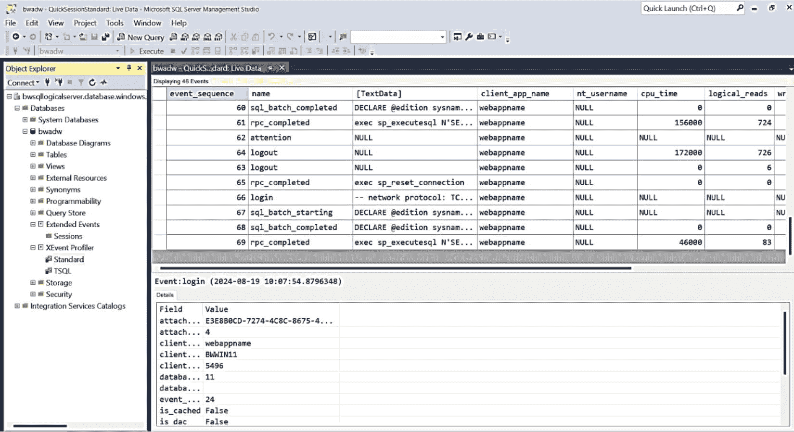
**图 7-6** 与 Azure SQL 数据库配合使用的 XE Profiler

重要的是要知道，为你的会话触发的任何扩展事件都是特定于你的数据库的，而不是跨逻辑服务器的。因此，我们有一组新的目录视图，例如 `sys.database_event_sessions`（定义）和 DMV，例如 `sys.dm_xe_database_sessions`（活动会话）。请查阅我们的文档，了解 Azure SQL 数据库与 SQL Server 之间 XEvent 的完整差异列表：[`https://learn.microsoft.com/azure/azure-sql/database/xevent-db-diff-from-svr`](https://learn.microsoft.com/azure/azure-sql/database/xevent-db-diff-from-svr)。

## 性能场景

在很久很久以前，当我在微软支持部门工作时，我的老朋友基思·埃尔莫（Keith Elmore）被认为是我们性能故障排除方面的专家（就我而言，他现在仍是）。当我们培训其他支持工程师时，基思想出了一个观点：大多数 SQL 性能问题可以归类为 `正在运行` 或 `正在等待`。

> **注意**
> 基思的工作催生了一份名为“性能仪表板报告”的报表。该报告现在已成为 SQL Server 管理工具标准报告的一部分。不幸的是，该报告依赖于一些未暴露给 Azure SQL 数据库的 DMV。不过，该报告适用于托管实例。

理解这个概念的一种方式是通过图 7-7。

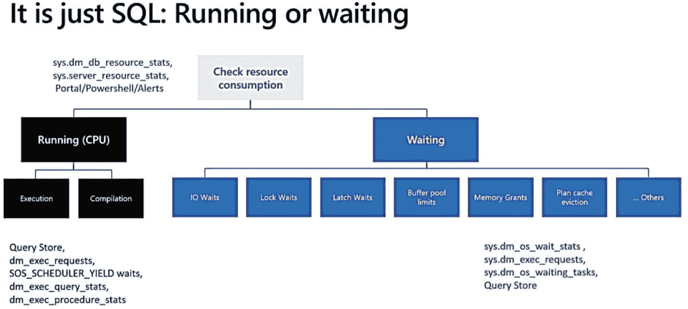
**图 7-7** SQL 性能的“正在运行”与“正在等待”

让我们从性能场景的角度，更详细地看看这张图。

> **注意**
> 在本节中查看 DMV 时，请记住，对于 Azure SQL 数据库，你查看的只是特定数据库的结果，而不是逻辑服务器上所有数据库的结果。

### 正在运行 vs. 正在等待

运行或等待场景通常可以通过查看整体资源使用情况来确定。对于标准的 SQL Server 部署，你可能会使用 Windows 中的性能监视器或 Linux 中的 `top` 等工具。对于 Azure SQL，你可以使用以下方法。

#### Azure 门户/PowerShell/警报

Azure Monitor 具有集成的指标，可查看 Azure SQL 的资源使用情况。你还可以设置警报以查找资源使用情况条件，例如高 CPU 百分比。由于我们已经将一些 Azure SQL 性能数据与 Azure Monitor 集成，设置警报是融入其生态系统的一个巨大优势。有关如何使用 Azure 指标设置警报的更多信息，请参阅 [`https://learn.microsoft.com/azure/azure-monitor/alerts/alerts-create-metric-alert-rule`](https://learn.microsoft.com/azure/azure-monitor/alerts/alerts-create-metric-alert-rule)。


### sys.dm_db_resource_stats

对于 Azure SQL Database，您可以查看此 DMV 以了解数据库部署的 CPU、内存和 I/O 资源使用情况。此 DMV 每 15 秒对此数据拍摄一次快照。此 DMV 中所有列的参考信息可在[`https://learn.microsoft.com/sql/relational-databases/system-dynamic-management-views/sys-dm-db-resource-stats-azure-sql-database`](https://learn.microsoft.com/sql/relational-databases/system-dynamic-management-views/sys-dm-db-resource-stats-azure-sql-database)找到。我将在本节后面的示例中使用此 DMV。

注意
一个名为`sys.resource_stats`的 DMV 在逻辑主数据库中运行，用于查看与逻辑服务器关联的所有 Azure 数据库长达 14 天的资源统计信息。更多信息请访问[`https://learn.microsoft.com/sql/relational-databases/system-catalog-views/sys-resource-stats-azure-sql-database`](https://learn.microsoft.com/sql/relational-databases/system-catalog-views/sys-resource-stats-azure-sql-database)。

### sys.server_resource_stats

此 DMV 的行为与`sys.dm_db_resource_stats`类似，但用于查看托管实例的 CPU、内存和 I/O 资源使用情况。此 DMV 同样每 15 秒拍摄一次快照。您可以在[`https://learn.microsoft.com/sql/relational-databases/system-catalog-views/sys-server-resource-stats-azure-sql-database`](https://learn.microsoft.com/sql/relational-databases/system-catalog-views/sys-server-resource-stats-azure-sql-database)找到此 DMV 的完整参考信息。

#### 使用 Copilot 入手

图 7-7 中缺少的一项是 Azure SQL Database 中的 Microsoft Copilot 技能。Copilot 使用上面列出的资源，通过提示帮助您缩小“运行中与等待中”问题的范围。

图 7-8 展示了一个使用提示来查找 Azure SQL Database 性能问题详细信息及可能原因的示例。

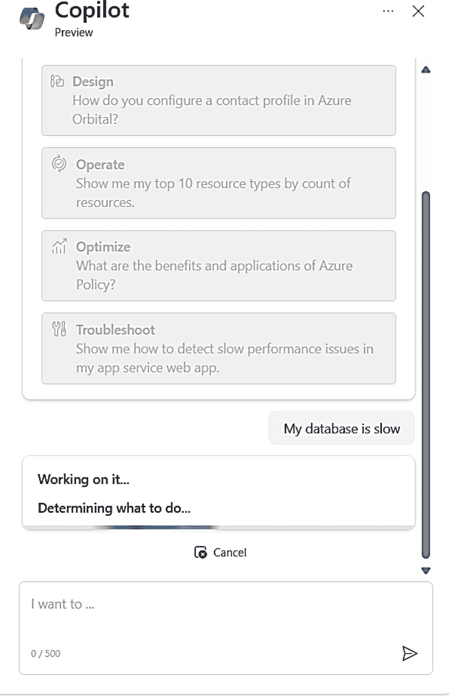
图 7-8
使用 Copilot 缩小性能问题范围

我将向您展示一些 Copilot 使用此类提示检测“运行中”和“等待中”问题的示例。我还将在本章后面使用 Copilot，看看它如何帮助处理一些特定场景。

#### 运行中

如果您确定问题是高 CPU 利用率，则称为“运行中”场景。运行中场景可能涉及通过编译或执行消耗资源的查询。可以使用以下工具进行进一步分析以确定解决方案。

##### Query Store

Query Store 随 SQL Server 2016 引入，一直是性能分析方面最具变革性的功能之一。使用 SSMS 中的“资源消耗最多”报告、Query Store 目录视图或 Azure 门户中的“查询性能见解”（仅限 Azure SQL Database）来查找哪些查询消耗的 CPU 资源最多。您需要 Query Store 的入门指南吗？请从我们的文档开始：[`https://learn.microsoft.com/sql/relational-databases/performance/monitoring-performance-by-using-the-query-store`](https://learn.microsoft.com/sql/relational-databases/performance/monitoring-performance-by-using-the-query-store)。

### sys.dm_exec_requests

此 DMV 可能已成为 SQL Server 历史上最受欢迎的 DMV。此 DMV 显示所有当前活动请求的快照，可能是一个 T-SQL 查询或后台任务。在 Azure SQL 中使用此 DMV 获取活动查询状态的快照。查找状态为`RUNNABLE`且等待类型为`SOS_SCHEDULER_YIELD`的查询，以查看您是否有足够的 CPU 容量。请在[`https://learn.microsoft.com/sql/relational-databases/system-dynamic-management-views/sys-dm-exec-requests-transact-sql`](https://learn.microsoft.com/sql/relational-databases/system-dynamic-management-views/sys-dm-exec-requests-transact-sql)获取此 DMV 的完整参考信息。

##### sys.dm_exec_query_stats

此 DMV 的使用方式与 Query Store 类似，可用于查找消耗资源最多的查询，但仅适用于缓存中查询计划，而 Query Store 提供了性能的持久历史记录。此 DMV 还允许您查找缓存查询的查询计划。请在[`https://learn.microsoft.com/sql/relational-databases/system-dynamic-management-views/sys-dm-exec-query-stats-transact-sql`](https://learn.microsoft.com/sql/relational-databases/system-dynamic-management-views/sys-dm-exec-query-stats-transact-sql)获取完整参考信息。

由于 Query Store 尚未可用于可读副本（我保证即将推出），此 DMV 可能对这些场景很有用。

##### sys.dm_exec_procedure_stats

此 DMV 提供的信息与`sys.dm_exec_query_stats`类似，只是性能信息可以在存储过程级别查看。请在[`https://learn.microsoft.com/sql/relational-databases/system-dynamic-management-views/sys-dm-exec-procedure-stats-transact-sql`](https://learn.microsoft.com/sql/relational-databases/system-dynamic-management-views/sys-dm-exec-procedure-stats-transact-sql)获取完整参考信息。

一旦确定了哪个或哪些查询消耗了最多的资源，您可能需要检查工作负载是否有足够的 CPU 资源，或者使用轻量级查询分析、SET 语句、Query Store 或扩展事件跟踪等工具来调试查询计划。

##### Azure SQL Database 中的 Microsoft Copilot 技能

您在本章前面看到，我展示了一个提示“我的数据库很慢”来帮助缩小性能问题范围。图 7-9 展示了此提示帮助缩小高 CPU 问题范围的示例。

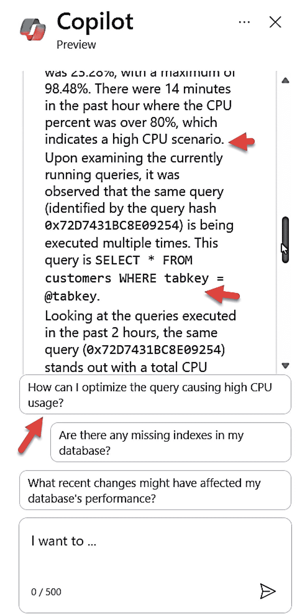
图 7-9
Copilot 检测到高 CPU 问题

请注意关于长时间消耗了多少 CPU 的详细信息，以及导致大部分 CPU 消耗的查询。您还可以看到我被引导使用另一个提示来优化查询。当我选择该提示时，您可以在图 7-10 中看到发生了什么。

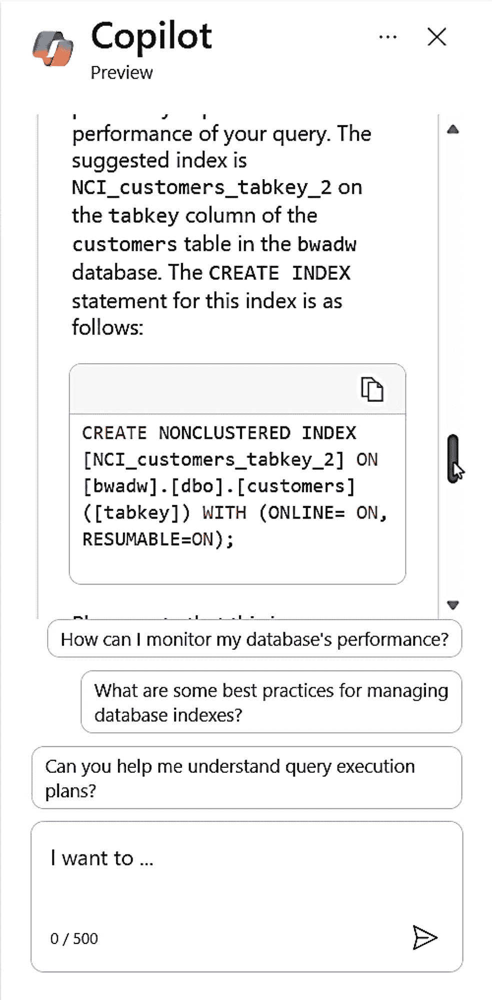
图 7-10
Copilot 检测到缺失索引

Copilot 使用了内置的 SQL 遥测技术来显示缺失索引将减少 CPU 并提高性能。如果您想尝试自己的场景并查看 Copilot 检测到此问题，请使用[`https://github.com/microsoft/sqlworkshops-azuresqlworkshop/tree/master/azuresqlworkshop/07-PerformanceTroubleshooting/highcpu_missingindex`](https://github.com/microsoft/sqlworkshops-azuresqlworkshop/tree/master/azuresqlworkshop/07-PerformanceTroubleshooting/highcpu_missingindex)中的示例。

我还使用 Copilot 检测过反模式查询等场景。完整的文档化场景可在[`https://aka.ms/sqlcopilot`](https://aka.ms/sqlcopilot)找到（我们一直在努力增加此 Copilot 的技能——我们才刚刚开始！）。

我将在本章后面展示另一个“运行中”问题的端到端场景，并了解 Copilot 如何提供帮助。


## 数据库监视器

我曾提到数据库监视器是一项全新的云服务，能为您提供关于 Azure SQL 工作负载的惊人洞察能力。数据库监视器可通过热力图帮助您应对高 CPU 场景。您可以参考图 7-11 中的示例，这是一个针对数据库目标的 CPU 高场景热力图。

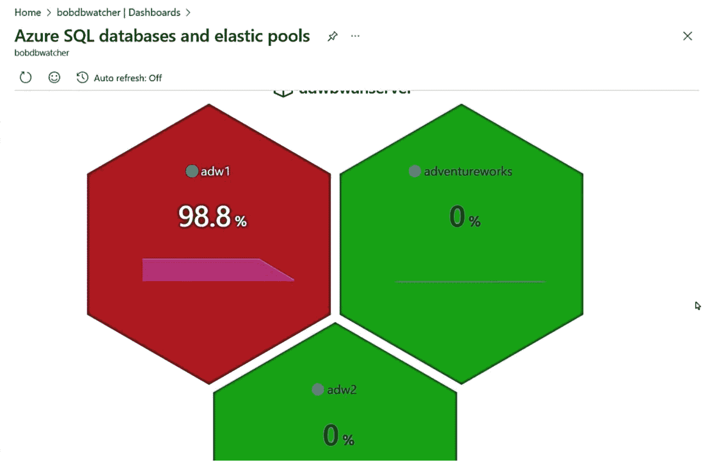

图 7-11

数据库监视器热力图，展示高 CPU 场景

随后，您可以深入查看“热点”数据库以获取更多详情。但当查看所有目标的“Top Queries”（顶部查询）时，数据库监视器也能向您显示导致问题的查询，如图 7-12 所示。

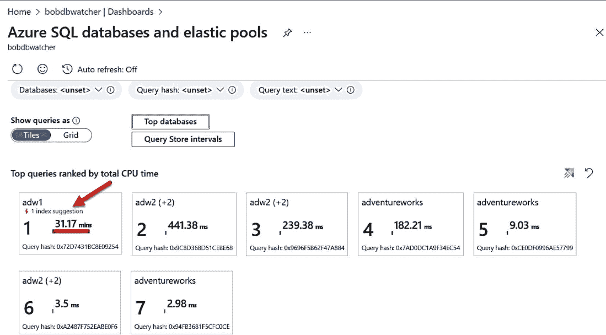

图 7-12

数据库监视器顶部查询

除了能够查看跨数据库的顶部查询（查询存储），在此示例中您可以看到数据库 `adw1` 的顶部查询显示为“红色”，表示其 CPU 使用率高，并且有一条建议提示缺少索引。

您可以设置数据库监视器 (`https://aka.ms/dbwatcher`) 并结合此示例使用 Copilot 来查看一个高 CPU 缺失索引的场景：`https://github.com/microsoft/sqlworkshops-azuresqlworkshop/tree/master/azuresqlworkshop/07-PerformanceTroubleshooting/highcpu_missingindex`。本章后续将介绍如何将这些工具应用于另一个高 CPU 场景。

## 等待

如果您的问题看起来并非高 CPU 资源使用，那么性能问题可能涉及等待某个资源。涉及资源等待的场景包括：

*   **I/O 等待** – 这包括诸如 `PAGEIOLATCH` 锁存等待（等待数据库 I/O）和 `WRITELOG`（等待事务日志 I/O）等等待类型。在 Azure SQL 中，这些等待类型与 SQL Server 中一样可见。这些等待的持续时间过长表明存在 I/O 瓶颈（这可能意味着您需要更改为不同的服务层级或增加 vCore 数量）。

*   **锁等待** – 这些等待会表现为标准的“阻塞”问题。

*   **闩锁等待** – 这包括 `PAGELATCH`（“热点”页面）甚至只是 `LATCH`（内部结构上的并发竞争）。

*   **缓冲池限制** – 如果缓冲池资源耗尽，您可能会遇到意外的 `PAGEIOLATCH` 等待。

*   **内存授予** – 大量需要内存授予或大型授予的并发查询（可能源于高估）可能导致 `RESOURCE_SEMAPHORE` 等待。

*   **计划缓存逐出** – 如果计划缓存不足且计划被逐出，这可能导致更长的编译时间（进而可能导致更高的 CPU 使用率），或者由于 CPU 容量不足以处理编译而导致 `RUNNABLE` 状态与 `SOS_SCHEDULER_YIELD`。您还可能看到它们在等待编译查询所需的架构锁。

要分析等待场景，您通常需要查看以下工具。

### sys.dm_os_wait_stats

使用此动态管理视图 (DMV) 查看数据库或实例的顶级等待类型。这可以根据顶级等待类型指导您下一步采取什么操作。请记住，对于 Azure SQL 数据库，这些等待仅针对该数据库，而非逻辑服务器上的所有数据库。您可以查看完整参考文档：`https://learn.microsoft.com/sql/relational-databases/system-dynamic-management-views/sys-dm-os-wait-stats-transact-sql`。

注意

有一个专门用于 Azure SQL 数据库的 DMV，名为 `sys.dm_db_wait_stats`（它也适用于托管实例，但考虑到您是在查看实例级别，我不建议使用它），它只显示特定于数据库的等待。您可能会发现这个视图很有用，但 `sys.dm_os_wait_stats` 会显示承载您的 Azure SQL 数据库的独立实例上的所有等待。

### sys.dm_exec_requests

使用此 DMV 查找活动查询的具体等待类型，以查看它们正在等待什么资源。这可能是标准的、正在等待其他用户锁的阻塞场景。

### sys.dm_os_waiting_tasks

使用并行处理的查询会为一个查询使用多个任务，因此您可能需要使用此 DMV 来查找特定查询中给定任务的等待类型。

### 查询存储

查询存储提供报告和目录视图，显示查询计划执行顶级等待的聚合信息。在查询存储中查看等待信息的目录视图称为 `sys.query_store_wait_stats`，您可以阅读更多关于它的信息：`https://learn.microsoft.com/sql/relational-databases/system-catalog-views/sys-query-store-wait-stats-transact-sql`。重要的是要知道，`等待 CPU` 等同于 `正在运行` 的问题。

提示

扩展事件可用于任何运行或等待的场景，但需要您设置一个扩展事件会话来跟踪查询，这可以被视为一种*更重量级*的调试性能问题的方法。

### Azure SQL 数据库和数据库监视器中的 Microsoft Copilot 技能

与处理高 CPU（运行）问题类似，Copilot 和数据库监视器也能帮助处理等待问题。我采用了位于 `https://github.com/microsoft/sqlworkshops-azuresqlworkshop/tree/master/azuresqlworkshop/07-PerformanceTroubleshooting/waiting_blocking` 的示例，并向 Copilot 发出提示“我的数据库很慢”。图 7-13 显示了结果。

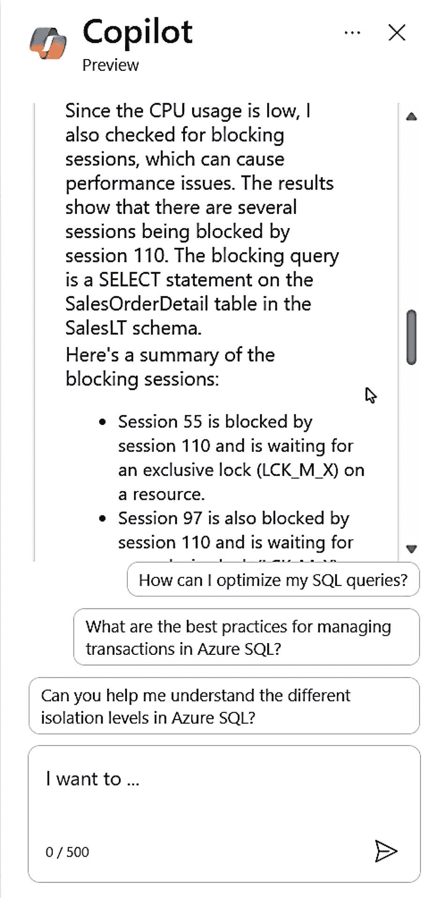

图 7-13

SQL Copilot 检测到阻塞问题

这就是 Copilot 的强大之处，它采用了“运行 vs. 等待”的方法。我发出了一个非常模糊的请求提示，它能够利用内置的遥测功能检查高 CPU。当没有发现高 CPU 问题后，它检查了等待问题，并发现了这个阻塞链。许多阻塞问题是由于会话遗留了未关闭的事务引起的，因此我紧接着向 Copilot 发出一个提示，作为与它*对话*的一部分：“会话 110 是否有未关闭的事务？”，图 7-14 显示了结果。

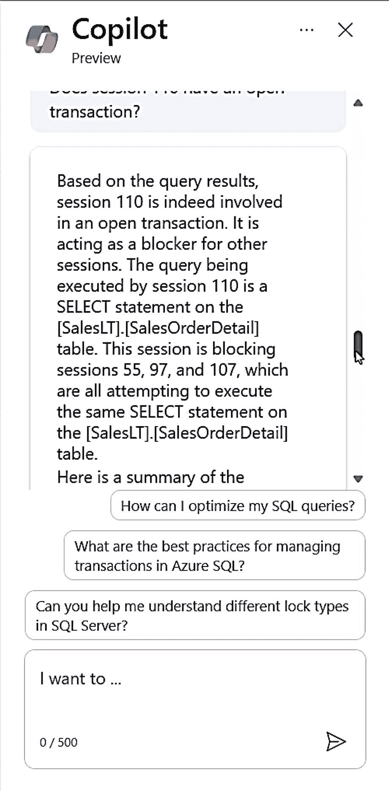

图 7-14

SQL Copilot 检测到导致阻塞的未关闭事务

我可以终止领头会话，但也必须调查导致阻塞的应用程序的原因。如果我还想看看这个问题是否存在趋势呢？这正是数据库监视器令人惊叹的地方。

数据库监视器能够随时间捕获大量洞见信息。其中之一是 SQL 活动，包括阻塞链。图 7-15 显示了一个示例。

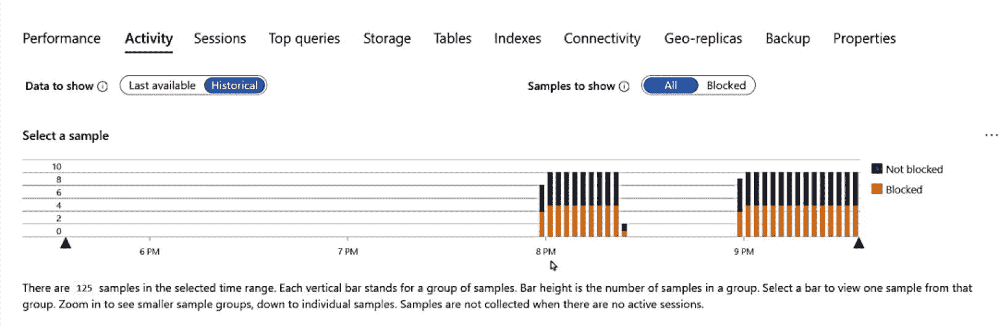

图 7-15

数据库监视器历史 SQL 活动

从这个图表中，您可以看到一个趋势：阻塞持续存在，然后结束，但随后又出现。我可以点击此图表中的柱条查看详情，如图 7-16 所示。

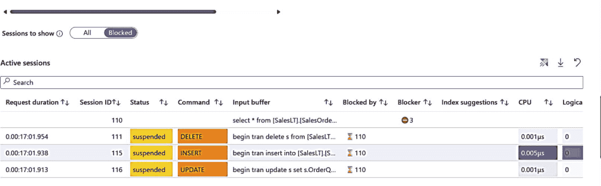

图 7-16

数据库监视器历史阻塞链


## 性能示例

让我们来看一个性能场景的示例，展示如何使用我在本节中讨论的工具和功能来识别一个性能场景。我将在本练习中使用以下资源：

*   之前部署的逻辑服务器 `bwsqllogicalserver` 以及数据库 `bwadw`。该数据库部署为超大规模（Hyperscale）、Gen5、2 vCore 数据库。

*   名为 `bwsql2022` 的 Azure 虚拟机。我沿用了第 6 章的安全设置，因此这台虚拟机可以访问该逻辑服务器和数据库。

*   我将使用 SQL Server Management Studio (SSMS) 运行一些查询并查看查询存储报告。

    提示：如果你使用 SSMS 连接到 Azure SQL 数据库逻辑服务器，并在 SSMS 中选择特定数据库，对象资源管理器将只显示逻辑主数据库和你的数据库。如果你使用服务器管理员账户连接到逻辑主数据库，对象资源管理器将显示所有数据库。

*   我将使用 Azure 门户查看 Azure 指标。

*   我还将为此目标数据库设置数据库监视器（可在 [`https://learn.microsoft.com/azure/azure-sql/database-watcher-quickstart`](https://learn.microsoft.com/azure/azure-sql/database-watcher-quickstart) 快速入门），并使用 Azure SQL 数据库中默认启用的 Microsoft Copilot 功能（如果你未看到其启用，请查阅以下文档：[`https://learn.microsoft.com/azure/azure-sql/copilot/copilot-azure-sql-overview?view=azuresql#enable-microsoft-copilot-in-your-azure-tenant`](https://learn.microsoft.com/azure/azure-sql/copilot/copilot-azure-sql-overview?view=azuresql#enable-microsoft-copilot-in-your-azure-tenant)）。

*   本章提供了脚本文件，可供你在多个示例中使用。你可以在本书源文件的 `ch7_performance\monitor_and_scale` 文件夹中找到此示例的脚本。我还将在本章练习中使用非常流行的工具 `ostress.exe`，该工具随 RML 工具附带。你可以从 [`https://www.microsoft.com/en-us/download/details.aspx?id=4511`](https://www.microsoft.com/en-us/download/details.aspx?id=4511) 下载 RML。请确保将 RML 安装文件夹添加到你的系统路径中（默认为 `C:\Program Files\Microsoft Corporation\RMLUtils`）。

让我们逐步完成一个示例：

1.  使用 DMV 查询设置以监控 Azure SQL 数据库。

    提示：要在 SSMS 中数据库上下文打开脚本文件，请在对象资源管理器中点击数据库，然后使用 SSMS 中的“文件/打开”菜单。

2.  启动 SQL Server Management Studio (SSMS)，并在数据库上下文中加载一个查询，以从脚本 `dmexecrequests.sql` 监控动态管理视图 (DMV) `sys.dm_exec_requests`，其内容如下：

    ```sql
    SELECT er.session_id, er.status, er.command, er.wait_type, er.last_wait_type, er.wait_resource, er.wait_time
    FROM sys.dm_exec_requests er
    INNER JOIN sys.dm_exec_sessions es
    ON er.session_id = es.session_id
    AND es.is_user_process = 1;
    ```

3.  加载另一个查询以观察资源使用情况。

    在数据库上下文的另一个 SSMS 会话中，加载一个查询来监控 Azure SQL 数据库特有的动态管理视图 (DMV) `sys.dm_db_resource_stats`，该查询来自名为 `dmdbresourcestats.sql` 的脚本：

    ```sql
    SELECT * FROM sys.dm_db_resource_stats;
    ```

    此 DMV 将跟踪你的工作负载针对 Azure SQL 数据库的整体资源使用情况，例如 CPU、I/O 和内存。

    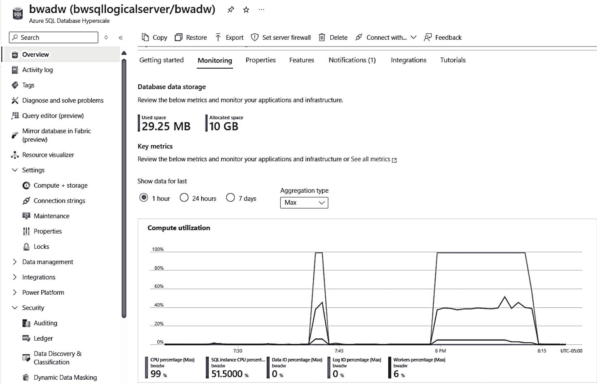
    图 7-17：从 Azure 指标查看 CPU 利用率

4.  编辑工作负载脚本。

    编辑脚本 `sqlworkload.cmd`（该脚本将使用 `ostress.exe` 程序）。

    我将替换我的服务器、数据库和密码。脚本将如下所示（包含你的密码）：

    ```cmd
    ostress.exe -Sbwsqllogicalserver.database.windows.net -itopcustomersales.sql -Usqladmin -dbwadw -P -n10 -r20 -q -T146
    ```

5.  检查我们将用于工作负载的 T-SQL 查询。你可以在脚本 `topcustomersales.sql` 中找到此 T-SQL 批处理：

    ```sql
    DECLARE @x int
    DECLARE @y float
    SET @x = 0;
    WHILE (@x < 10000)
    BEGIN
    SELECT @y = sum(cast((soh.SubTotal*soh.TaxAmt*soh.TotalDue) as float))
    FROM SalesLT.Customer c
    INNER JOIN SalesLT.SalesOrderHeader soh
    ON c.CustomerID = soh.CustomerID
    INNER JOIN SalesLT.SalesOrderDetail sod
    ON soh.SalesOrderID = sod.SalesOrderID
    INNER JOIN SalesLT.Product p
    ON p.ProductID = sod.ProductID
    GROUP BY c.CompanyName
    ORDER BY c.CompanyName;
    SET @x = @x + 1;
    END
    GO
    ```

    这个数据库不大，因此检索客户及其关联的销售信息并按销售额最高的客户排序的查询应该不会产生大的结果集。可以通过减少结果集中的列数来优化此查询，但这些列是此活动演示目的所必需的。你会注意到在此查询中，我未将任何结果返回给客户端，而是赋值给一个局部变量。这将把所有用于运行查询的 CPU 资源都放在服务器端。

6.  现在让我们运行工作负载，并观察其性能以及我们之前加载的查询结果。从命令 shell 或 PowerShell 执行 `sqlworkload.cmd` 脚本来运行工作负载。该脚本使用 `ostress` 模拟十个并发用户运行 T-SQL 批处理。

7.  现在使用你加载的 DMV 在运行时观察性能。首先，在 SSMS 的查询窗口中运行 `dmexecrequests.sql` 中的查询五到六次。你会看到多个用户的状态为 `RUNNABLE`，且 `last_wait_type` 为 `SOS_SCHEDULER_YIELD`。这是工作负载 CPU 资源不足的典型特征。

8.  观察 `dmdbresourcestats.sql` 查询的结果。运行此查询几次并观察结果。你会看到几行数据的 `avg_cpu_percent` 值接近 100%。`sys.dm_db_resource_stats` 每 15 秒对资源使用情况进行一次快照。

9.  让工作负载完成并记录其持续时间。对我来说，完成大约需要 12-13 分钟。

10. 使用 Azure Monitor 和指标。

    让我们通过 Azure Monitor 和指标的视角来看这个性能场景。我将通过 Azure 门户导航到我的数据库。在“监控”窗格中，有一个名为“监视和关键指标”的区域。工作负载运行后，我的图表看起来如图 7-17 所示。

    你可以在屏幕上看到蓝线显示高 CPU（持续高 CPU 左侧的线是我在此示例之前进行的另一个简短测试）。请注意，红线显示低于 100%。这是托管数据库实例的 CPU。这个数字表明我的数据库有扩展空间，这表明我可能没有足够的资源来运行此工作负载。

    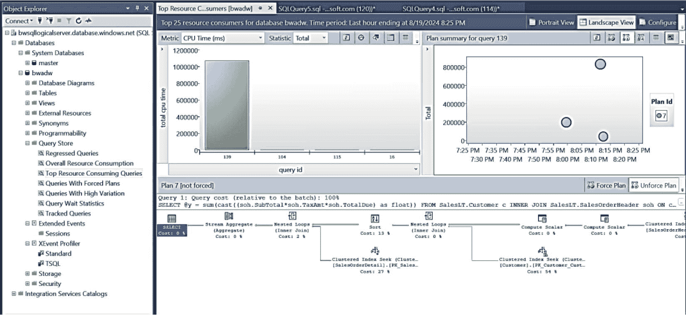
    图 7-18：SSMS 查询存储的耗用资源最多的查询

11. 现在让我们使用查询存储来更深入地研究此工作负载中查询的性能。在 SSMS 的对象资源管理器中，加载“资源消耗最多的查询”，如图 7-18 所示。

    默认指标是“总持续时间”，因此我将其更改为 CPU。你可以看到我在此示例中运行的查询正是消耗所有 CPU 的那个。

    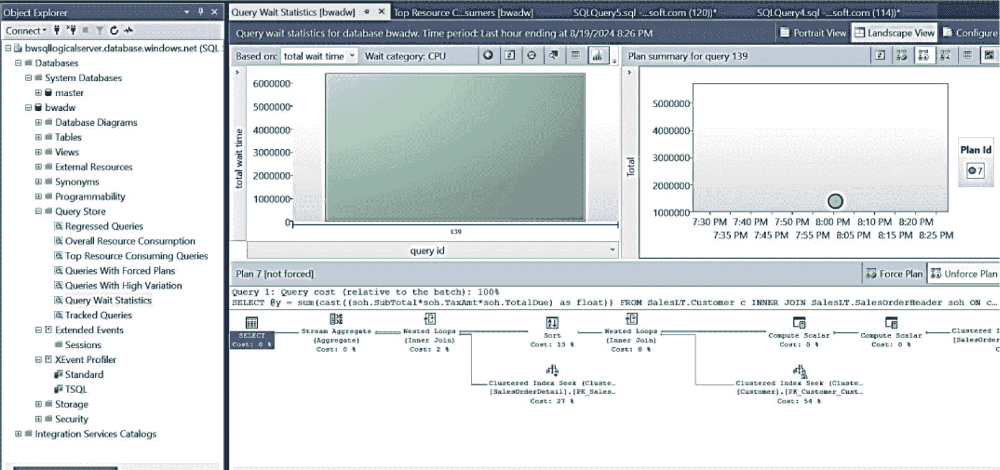
    图 7-19：来自 SSMS 的查询等待统计信息报告

12. SSMS 中的查询存储报告还包括按等待排序的顶部查询。在这种情况下，正如我之前提到的，CPU 问题*也是一个等待 CPU 资源的问题*。图 7-19 显示了这一点。

    现在考虑这些证据：工作负载消耗数据库的 CPU 资源达到 100%（实际上超过了 100%，但我们有上限）。许多请求的状态是 `RUNNABLE`，工作负载的主要等待类型是 `SOS_SCHEDULER_YIELD`。如果无法更改查询，那么最可能的情况就是你的工作负载没有足够的 CPU 资源。本章稍后，我们将使用 Azure 接口使此查询运行得更快。

    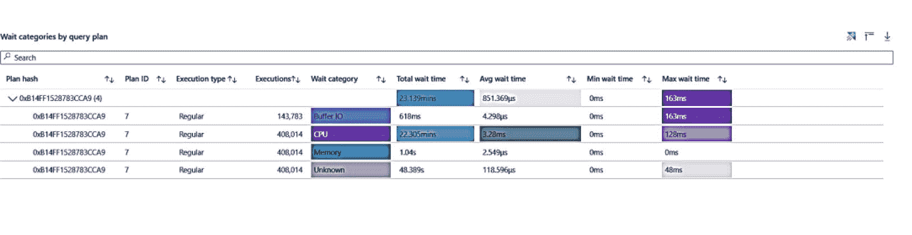
    图 7-23：数据库监视器中查询的等待统计信息

    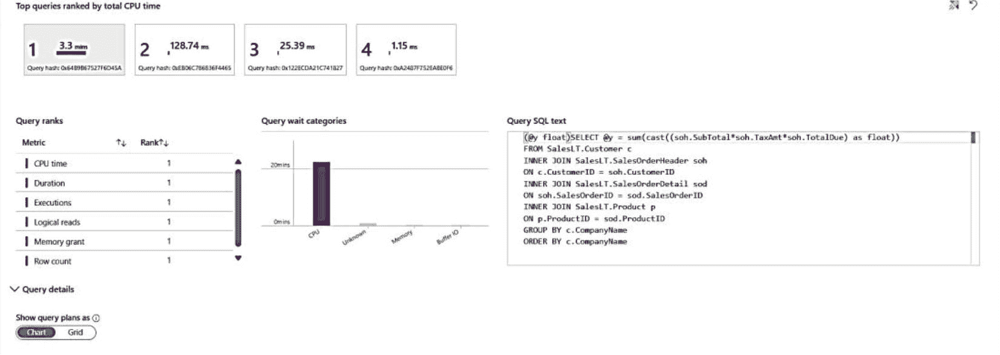
    图 7-22：数据库监视器中的查询详细信息

    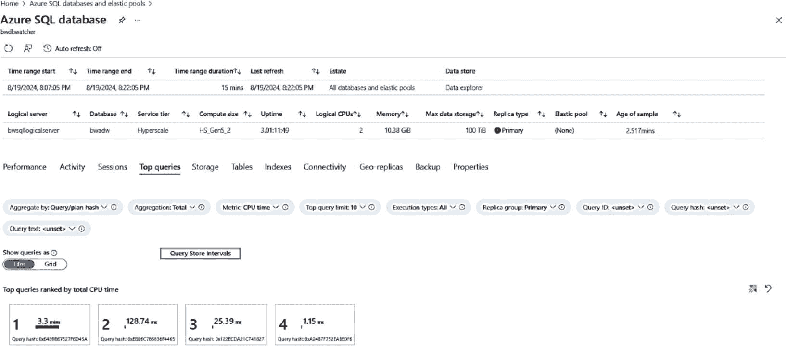
    图 7-21：数据库监视器中的顶部查询

    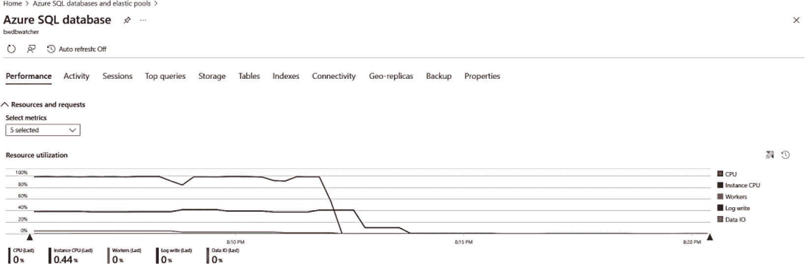
    图 7-20：数据库监视器资源利用率

13. 现在让我们看看数据库监视器显示了什么。

    数据监视器对于这种情况显示了什么？它能否帮助我缩小问题范围？

    本章前面看到的热图显示，过去一小时该数据库看起来是绿色的，CPU 仅显示 < 50%。这是因为工作负载只在 13 分钟的时间窗口内达到 100% CPU。如果我从热图中选择该数据库，会看到一个类似图 7-20 的屏幕。

    我喜欢这个视图，因为我看到的信息与在 Azure Monitor 指标中看到的相同，但我在同一个图表中获得了所有其他资源（如工作线程和 I/O）的信息。尽管我可以在 Azure 指标中看到类似的图表，但我无法深入查看顶部查询。你可以看到我可以从这个屏幕选择“顶部查询”，并看到如图 7-21 所示的结果。

    我看到一个查询被标记为红色（表示它占用了大量 CPU）。

    我可以点击此查询并查看详细信息，如图 7-22 所示。

    如果我从这里向下滚动，会获得特定于此查询的等待统计信息，如图 7-23 所示。

    请注意，查询的大部分等待时间是 CPU，正如查询存储报告所揭示的那样。

    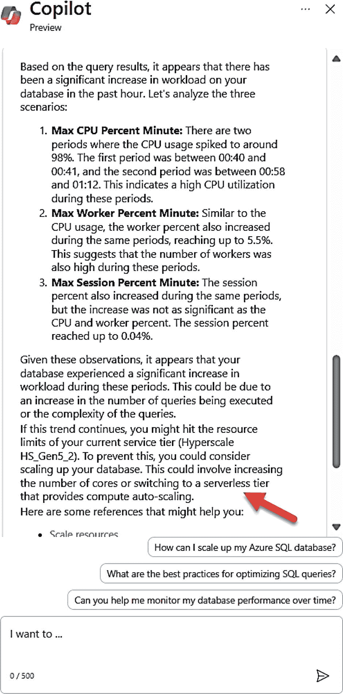
    图 7-25：SQL Copilot 检测到资源限制

    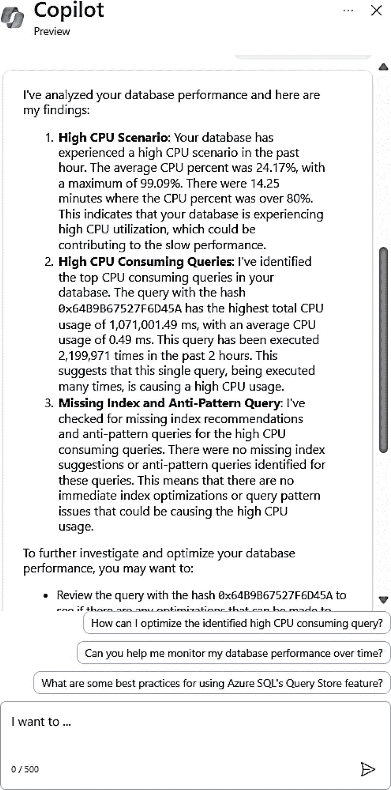
    图 7-24：SQL Copilot 正在分析性能缓慢问题

14. Copilot 怎么样？它能帮忙吗？

    你已经看到了“SQL Copilot”的一些功能。对于提示“我的数据库很慢”这种情况，它是如何回应的？图 7-24 显示了答案。

    Copilot 检测到了一个已知查询的高 CPU 情况，但没有发现如缺失索引等可以解释任何问题的场景。

    然后我回应道（是的，你可以与 Copilot 对话！）：“我是否触及了任何资源限制？”（注意这里使用了“触及”一词。语言模型能理解这个。）图 7-25 显示了回应。

    你可以看到回应是：问题不是查询调优问题，而是我没有足够的资源来运行此工作负载。请注意，建议的一部分是使用无服务器（Serverless）。


### Azure SQL 特定性能场景

基于运行中与等待中场景的区分，Azure SQL 还有一些其特有的场景。

#### 日志治理

Azure SQL 可以对事务日志使用实施称为 `log rate governance`（日志速率治理）的资源限制。这种强制实施通常是为了确保资源限制并满足所承诺的服务级别协议（SLA）。日志治理可能通过以下 `等待类型` 体现：

-   `LOG_RATE_GOVERNOR` – 等待 Azure SQL 数据库
-   `POOL_LOG_RATE_GOVERNOR` – 等待弹性池
-   `INSTANCE_LOG_GOVERNOR` – 等待 Azure SQL 托管实例
-   `HADR_THROTTLE_LOG_RATE` – 等待业务关键版和异地复制延迟

日志速率治理是在 SQL Server 引擎内部、事务日志块提交进行 I/O 之前实施的。官方文档对此工作方式有很好的描述，请参阅 [`https://learn.microsoft.com/azure/azure-sql/database/resource-limits-logical-server?view=azuresql#transaction-log-rate-governance`](https://learn.microsoft.com/azure/azure-sql/database/resource-limits-logical-server?view=azuresql#transaction-log-rate-governance)。将你的部署扩展到不同的服务层级或 vCore 选择，可以为你的应用程序提供更高的日志速率。

#### 工作线程限制

SQL Server 使用一个线程工作池，但对最大工作线程数有限制。具有大量并发用户的应用程序可能需要一定数量的工作线程。关于 Azure SQL 数据库和托管实例如何强制执行工作线程限制，请牢记以下几点：

-   Azure SQL 数据库的限制基于服务层级和大小。如果你超出此限制，新查询将收到类似以下的错误：
    ```
    Msg 10928
    The request limit for the database is  and has been reached.
    ```

-   Azure SQL 托管实例的工作池限制基于 vCore 数量（`(105 * vCores) + 800`）。由于这是一个完整的 SQL Server 实例，其行为类似于 SQL Server 的 `max worker thread`（最大工作线程）设置（你可以在 DMV `sys.dm_os_sys_info` 中看到计算出的值）。如果你用完了工作线程，可能会看到 `THREADPOOL` 等待。在撰写本书时，我们正在讨论是否允许用户通过 `sp_configure` 更改此配置值，因此我不建议你尝试更改它。截至目前，我们尚未遇到默认值无法满足应用程序工作负载需求的客户。

#### 业务关键版 (BC) HADR 等待

假设你为 Azure SQL 托管实例或 Azure SQL 数据库部署了业务关键服务层级。现在你开始运行修改数据的事务，因此需要记录更改。

你查看像 `sys.dm_exec_requests` 这样的 DMV，会看到像 `HADR_SYNC_COMMIT` 这样的等待类型。什么？这种等待类型只在为 Always On 可用性组 (AG) 部署同步副本时才会看到。

事实证明，业务关键服务层级在底层使用了一个 AG。因此，正常看到这些等待类型并不奇怪，但如果你正在监控等待类型，可能会感到意外。

作为日志治理的一部分，以确保我们能履行承诺的 SLA，你可能还会看到 `HADR_DATABASE_FLOW_CONTROL` 和 `HADR_THROTTLE_LOG_RATE_SEND_RECV` 等待。

#### 超大规模场景

我在本书的第 4 章简要介绍过超大规模架构。在第 8 章我将更深入探讨。虽然超大规模与其他部署选项一样有日志速率限制，但在某些情况下，由于页面服务器或副本严重滞后（这将影响我们履行 SLA 的能力），我们必须治理事务日志生成。发生这种情况时，你可能会看到以 `RBIO_` 开头的等待类型。

尽管本书不会深入探讨如何诊断超大规模架构的各个方面，但有一些有趣的功能可供你利用。例如，来自页面服务器的读取现在可在 DMV 中获取，如 `sys.dm_exec_query_stats`、`sys.dm_io_virtual_file_stats` 和 `sys.query_store_runtime_stats`。此外，`sys.dm_io_virtual_file_stats` 中的 I/O 统计信息适用于 RBEX 缓存和页面服务器，因为这些是主要影响超大规模性能的 I/O 文件。

有关超大规模性能诊断的所有详细信息，请访问 [`https://learn.microsoft.com/azure/azure-sql/database/hyperscale-performance-diagnostics`](https://learn.microsoft.com/azure/azure-sql/database/hyperscale-performance-diagnostics)。

### 加速与性能调优

你已经了解了 Azure SQL 的性能功能，包括监控工具。你也看到了一个如何应用监控知识和性能场景来识别潜在性能瓶颈的示例。现在，让我们应用这些知识来学习如何在扩展 CPU 容量、I/O 性能、内存、应用程序延迟以及 SQL Server 性能调优最佳实践等方面加速和调优性能。


