# 扩展 CPU 容量

假设你在*自己的数据中心*中遇到了像我在上一个练习中向你展示的高 CPU 性能问题。你会怎么做？如果你在物理服务器上运行 SQL Server，你可能需要获取更多 CPU，甚至迁移到另一台服务器。对于虚拟机，你或许可以通过重新配置虚拟机来获得更多 vCPU，但如果主机服务器不支持这样做呢？你可能面临将数据库迁移到另一台主机上另一个虚拟机的场景。这很麻烦。

对于 Azure SQL，你可以通过 `Azure portal`、`az CLI`、`PowerShell` 甚至 `T-SQL` 执行非常简单的操作来*扩展*你的 CPU 资源。并且，所有这些操作都无需进行数据库迁移。

对于 Azure SQL Database，扩展 CPU 资源可能会造成一些短暂的停机。对于较大的数据库规模，此停机时间可能会更长，特别是如果我们需要将你的部署移动到具有足够资源以满足你请求的另一台主机时。对于业务关键型服务层，我们还必须确保你的副本具有相同的新资源。超大规模架构提供了更恒定的扩展方式，无论数据库大小如何。

Azure SQL 托管实例的扩展持续时间可能需要关注。我们可能需要构建一个新的虚拟集群，因此扩展操作可能需要更长的时间。这是需要记住的一点，因此为托管实例部署合适的资源非常重要。托管实例池要快得多，但在大多数情况下仍比 Azure SQL Database 耗时显著。

Azure SQL Database 无服务器计算层提供了如我在本书第 4 章所述的自动扩展概念。

让我们回到我们在练习中中断的地方，当时我们确定很可能是因为工作负载没有足够的 CPU 资源（记得 Copilot 帮我们确定了问题所在）。让我们将其扩大，看看工作负载性能是否会有所提升。

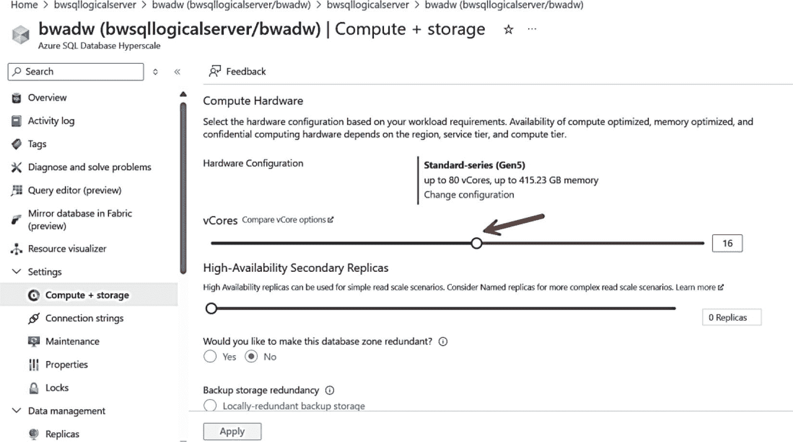

*图 7-27：为 Azure SQL Database 扩展 vCore 数量*

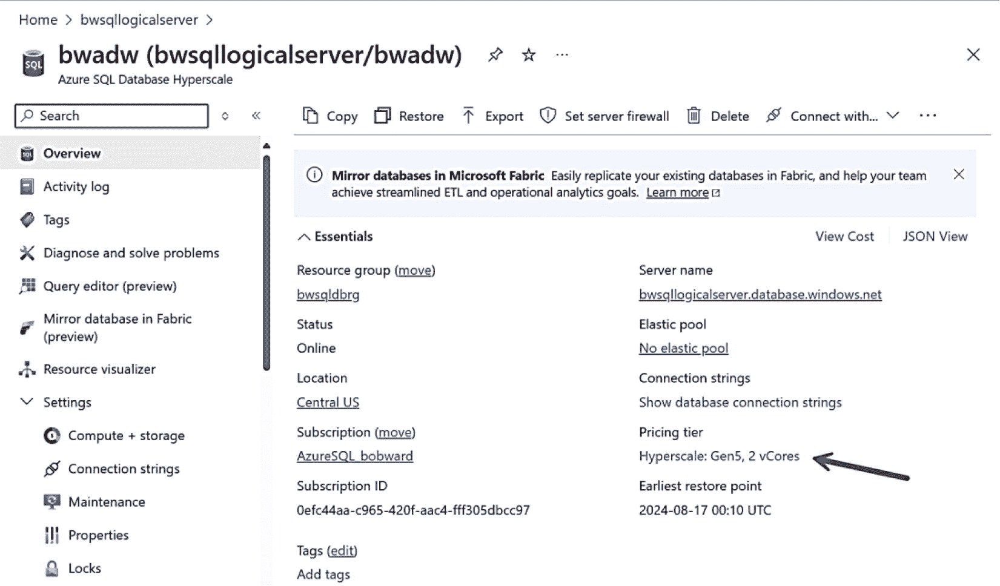

*图 7-26：更改 Azure SQL Database 的定价层*

## 查看 Azure 门户中的扩展选项

我将导航到 `Azure 门户` 中的数据库，并选择定价层，如图 7-26 所示。

现在你会看到一个可以对部署进行更改的屏幕。我在第 4 章描述过部署后的所有选项时，曾向你展示过类似的屏幕。我的选项看起来如图 7-27 所示，我可以用滑块条来增加部署的 vCore 数量。

> **提示**
>
> 除了 `Azure 门户`，还有其他方法可以扩展数据库，包括 `PowerShell`、`az CLI`，甚至使用 `ALTER DATABASE` 的 `T-SQL`。但要使用这些选项，你需要更多地了解一个称为服务等级目标（简称 `SLO` 或 `ServiceObjective`）的概念。我在本书前面提到过这个概念。这是因为要更改 vCore，你需要选择服务层和 vCore 的组合。你可以使用 `T-SQL` `ALTER DATABASE` 文档查看服务目标的所有可能值：[`https://learn.microsoft.com/sql/t-sql/statements/alter-database-transact-sql?view=azuresqldb-current&preserve-view=true&tabs=sqlpool`](https://learn.microsoft.com/sql/t-sql/statements/alter-database-transact-sql?view=azuresqldb-current&preserve-view=true&tabs=sqlpool)。

在我的场景中，我需要为 `ALTER DATABASE` 的 `SERVICE_OBJECT` 参数使用 `HS_Gen5_16` 选项。

在这种情况下，扩展操作应该只需要几分钟，门户会显示消息“扩展已完成”。

## 让我们再次运行工作负载

让我们再次运行工作负载，看看是否有任何性能差异。我将使用与本章前一个示例中相同的脚本、查询和 `SSMS` 报告。

从命令提示符再次运行脚本 `sqlworkload.cmd`。

## 使用 `sys.dm_db_resource_stats` 观察资源使用情况

就像你之前所做的那样，多次运行此查询应显示数据库的整体 CPU 使用率更低。这是一个纯粹的 CPU 密集型工作负载，因此你可能仍然会看到 90% 左右的数字，但持续时间会短得多。这里的关键是，拥有 16 个 vCore 后，由于有更多的 CPU 可用，你应该能够运行其他查询。

## 使用 `sys.dm_exec_requests` 观察活动查询

你应该会看到更多 `RUNNING`（正在运行）的请求和更少的 `SOS_SCHEDULER_YIELD` 等待。

## 观察整个工作负载的持续时间

总体持续时间现在从 12-13 分钟下降到不到 2 分钟。

## 让我们简要看一下 Azure 指标

我点击了“概述”屏幕上的监控图表，而不是仅仅查看它，这让我能够更深入地研究指标，甚至可以更改时间间隔。我的指标现在看起来如图 7-28 所示。

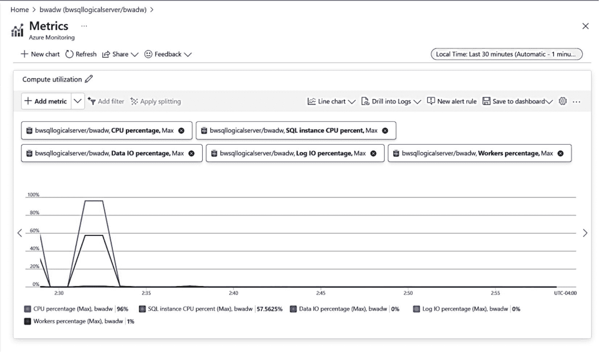

*图 7-28：扩展数据库后的 Azure 指标*

你可以看到，即使在升级到 16 个 vCore 后，工作负载仍然使用了大量 CPU。然而，它并没有完全处于 100%，因此还有空间供其他工作负载使用 CPU。在使用 2 个 vCore 的例子中，我们的工作负载从技术上讲使用了超过 100%，这意味着它必须等待 CPU 资源。

如果我们为工作负载使用 `无服务器` 计算层选项会发生什么？记住，无服务器提供了自动扩展工作负载以及暂停空闲计算的能力。

我部署了一个新的无服务器数据库，最小 vCore = 2，最大 vCore = 16。结果发现在大多数情况下（不保证），无服务器数据库部署时的 `SQL 调度器` 数量等于最大 vCore 数。因此，只要无服务器数据库没有被暂停，运行与此示例相同的工作负载，其性能大致与扩展后的超大规模 16 vCore 部署相当。这就是无服务器相比预配置部署的一大优势。假设在两个小时内，此工作负载仅在 120 分钟中的 15 分钟消耗了计算资源。对于预配置部署，你需要为整个 120 分钟的计算付费。对于无服务器部署，你将为 8 个 vCore 的 15 分钟计算使用量付费，而在剩余的 90 分钟内，你将为相当于最小 vCore 数的计算使用量付费。此外，如果你启用了 `自动暂停`，在该两小时时段的最后 60 分钟内，你将无需支付任何计算费用（这是因为，如果空闲，无服务器部署在暂停前的最短时间为一小时）。

图 7-29 显示了一个无服务器部署的 CPU 利用率示例，其下方是实际计费计算的图表。注意，最高的平均 CPU 计费发生在高计算利用率期间。其余时间的计费是针对数据库空闲时的最小 vCore（2 vCore）。

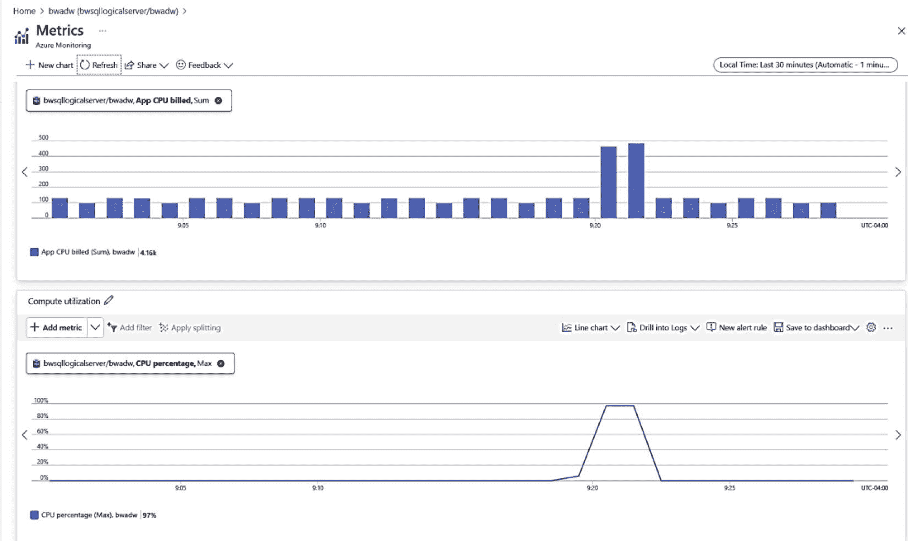

*图 7-29：无服务器的 Azure 指标（CPU 和计费）*

> **注意**
>
> 通用业务层支持在数据库空闲一段时间后自动暂停。当数据库暂停时，你无需支付任何计算费用。在撰写本书时，超大规模尚不支持自动暂停。

**Cloud SQL Workshop** 也提供了展示如何使用无服务器进行扩展的实验，你可以在以下网址尝试：[`https://github.com/microsoft/cloudsqlworkshop/tree/main/cloudsqlworkshop/07_Deploy_Manage_Optimize_AzureSQLDB`](https://github.com/microsoft/cloudsqlworkshop/tree/main/cloudsqlworkshop/07_Deploy_Manage_Optimize_AzureSQLDB)。

### 调优 I/O 性能

I/O 性能对于 SQL Server 应用程序和查询至关重要。Azure SQL 将物理文件放置的细节抽象化了，但仍有方法可以确保您获得所需的 I/O 性能。

`每秒输入/输出操作次数 (IOPS)` 对您的应用程序可能很重要。请确保您已为 IOPS 需求选择了合适的服务层级和 vCore 数量。如果您要迁移到 Azure，请了解如何在本地测量查询的 IOPS（提示：查看性能监视器中的 `磁盘传输次数/秒`）。如果 IOPS 受限，您可能会遇到较长的 I/O 等待时间。如果 IOPS 不足，请增加 vCore 数量或转到 `业务关键型` 或 `超大规模` 层级。请记住，对于 Azure SQL 托管实例，您已在本书中了解到新的 `新一代通用型` 服务层级允许您独立于 vCore 选择来控制 IOPS。

`I/O 延迟` 是影响 I/O 性能的另一个关键因素。对于 Azure SQL 数据库更快的 I/O 延迟，请考虑使用 `业务关键型` 或 `超大规模`。对于托管实例更快的 I/O 延迟，请转到 `业务关键型` 或使用我在本章及本书前面章节中提到的新一代 `新一代通用型` 服务层级： [`https://learn.microsoft.com/azure/azure-sql/managed-instance/service-tiers-next-gen-general-purpose-use`](https://learn.microsoft.com/azure/azure-sql/managed-instance/service-tiers-next-gen-general-purpose-use)。

配置并非唯一的选择。改善事务日志延迟可能需要您使用多语句事务。了解更多信息请访问：[`https://learn.microsoft.com/azure/azure-sql/performance-improve-use-batching`](https://learn.microsoft.com/azure/azure-sql/performance-improve-use-batching)。

在本书第一版中，我有一个实验向您展示了 Azure SQL 数据库 `通用型` 服务层级的 I/O 延迟。由于 `超大规模` 的价格下调，您可以看到我在本书中使用了该服务层级。当我使用 `超大规模` 尝试第一版的实验时，没有出现我在 `通用型` 中看到的 I/O 延迟或问题，因此我直接删除了这些示例。**Cloud SQL Workshop** 确实有一个关于 Azure SQL 托管实例 I/O 延迟的示例，您可以在此处尝试：[`https://github.com/microsoft/cloudsqlworkshop/tree/main/cloudsqlworkshop/06_Manage_and_Optimize_AzureSQLMI`](https://github.com/microsoft/cloudsqlworkshop/tree/main/cloudsqlworkshop/06_Manage_and_Optimize_AzureSQLMI)。

### 增加内存或工作线程数

内存也是 SQL Server 性能的重要资源，Azure SQL 也不例外。您可用于缓冲池、计划缓存、列存储和内存中 OLTP 的总内存容量取决于您的部署选择。正如本章前面所述，使用新的内存优化高级系列的 Azure SQL 数据库 `超大规模` 服务层级可提供最高的内存容量，约为 830GB。对于托管实例，使用内存优化高级系列可获得约 870GB 的内存。另外，请记住，`内存中 OLTP`（仅适用于 `业务关键型` 服务层级）的最大内存是总最大内存的一个子集。

关于内存的一个关键陈述对于 SQL Server 或 Azure SQL 都是成立的：如果您认为内存不足，请确保您的数据库和查询设计是最优的。在扫描大型表后，您可能认为缓冲池即将耗尽。也许应该部署索引来增强查询性能并减少内存使用。列存储索引是压缩的，因此它们比传统索引使用的内存少得多。

注意
`超大规模` 的 vCore 选择不仅影响计算节点可用的内存量，还会影响 `RBEX` 缓存的大小，这同样可能影响性能。

我已在本章中描述了工作线程限制，该限制针对 Azure SQL 数据库和托管实例设置为最大值。与 SQL Server 一样，耗尽工作线程可能是应用程序问题。所有用户都遇到严重的阻塞问题可能导致错误或 `THREADPOOL` 等待，而真正的解决方案是解决阻塞问题。

### 改善应用程序延迟

即使您根据所有资源需求配置了部署，应用程序也可能引入延迟性能问题。请务必遵循以下针对 Azure SQL 应用程序的最佳实践：
- 使用重定向连接类型而非代理。
- 通过使用存储过程或通过批处理等技术限制查询往返次数来优化“聊天式”应用程序。
- 通过将事务分组来优化事务，而非使用单例事务。

请查看此文档页面，了解如何为 Azure SQL 数据库调优应用程序：[`https://learn.microsoft.com/azure/azure-sql/database/performance-guidance`](https://learn.microsoft.com/azure/azure-sql/database/performance-guidance)。

### 像调优 SQL Server 一样调优

Azure SQL 仍然是 SQL Server。因此，除了您在本节和下一节中看到的所有内容外，确保调优 SQL Server 查询并关注以下方面几乎总是无可替代的：
- 合适的索引设计
- 使用批处理
- 使用存储过程
- 合适的查询设计（例如，真的需要扫描一百万行吗？）
- 参数化查询以避免过多的缓存即席查询
- 在应用程序中快速、正确地处理结果（避免可怕的 `ASYNC_NETWORK_IO` 等待）

### 智能性能

我在本章前面提到过，我们的目标是基于数据和您的应用程序工作负载，在数据库引擎中内置智能功能，让您能够 **无需更改代码** 即可获得更快的性能。

让我们更详细地了解智能查询处理、自动计划校正和自动调优这些领域。

## 智能查询处理

在 SQL Server 2017 中，我们增强了查询处理器，使其能够适应查询工作负载，并在使用最新数据库兼容级别时提升性能。我们称之为自适应查询处理。在 SQL Server 2019 中，我们更进一步，将其重新命名为**智能查询处理**。`IQP` 是内置于查询处理器中的一套新功能，需使用最新的数据库兼容级别启用。在 SQL Server 2022 中，我们进一步扩展了这些功能，在某些情况下还增强了先前的 `IQP` 功能。我将 SQL Server 2022 的下一波 `IQP` 功能称为 "NextGen"。这些功能的一大优点是它们都是累积的。图 7-30 展示了最新的 `IQP` 功能集以及先前功能的列表。

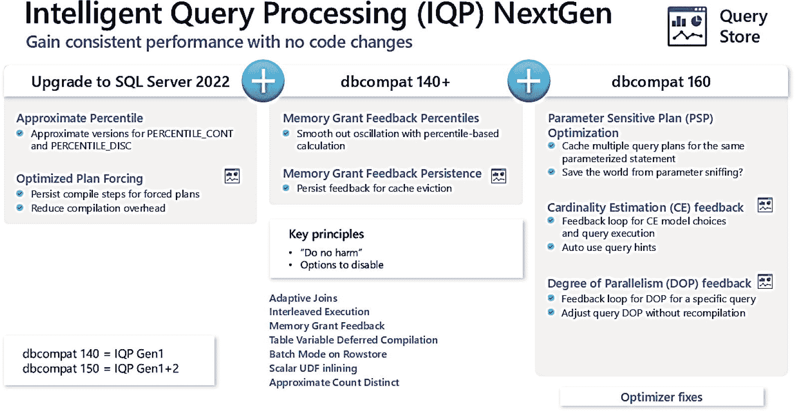

图 7-30 Azure SQL `IQP`

你可以看到，其中两个功能，即近似百分比和优化计划强制，在 SQL Server 2022 或 Azure SQL 中对任何应用程序都可用，与 `dbcompat` 级别无关。如果你使用 `dbcompat` 140 或更高版本，我们还提供了针对内存授予反馈的增强功能。然后，`dbcompat` 160 会启用新功能，以帮助你解决诸如参数嗅探、基数估计和“失控” `DOP` 查询等常见问题。

此外，与之前的版本一样，如果你启用了 `dbcompat` 160（现在是 Azure SQL 数据库的默认设置），则所有优化器修补程序都会被汇总。然后，在图形底部中间是我们在 SQL Server 2017 和 2019 中根据你的 `dbcompat` 级别启用的功能列表。

没有专门的功能“复选框”来启用这些功能。它们都内置于查询处理器中，但有些需要特定的 `dbcompat` 级别或 `ALTER DATABASE` 语句（例如，`DOP` 反馈两者都需要）。你还会在图中看到查询存储的图标。这表示查询存储也是启用该功能所必需的。因为在某些情况下，我们需要查询存储来持久化诸如内存授予、`CE` 或 `DOP` 反馈等反馈。

我在 *SQL Server 2019 Revealed* 和 *SQL Server 2022 Revealed* 这两本书中广泛涵盖了这个主题。你可以通过这些书中的示例亲自试用其中的几个功能。这些功能包括以下内容：

*   你可以试用在 SQL Server 2019 中引入的 `IQP` 功能，例如适用于行存储的内存授予反馈、表变量延迟编译、行存储的批处理模式、标量 `UDF` 内联和近似 `COUNT DISTINCT`，地址为 [`https://github.com/microsoft/bobsql/tree/master/sql2019book/ch2_intelligent_performance/iqp`](https://github.com/microsoft/bobsql/tree/master/sql2019book/ch2_intelligent_performance/iqp)。

*   你可以试用在 SQL Server 2022 中引入的 `IQP` 功能，例如优化计划强制、持久化内存授予反馈和百分比，地址为 [`https://github.com/microsoft/bobsql/tree/master/sql2022book/ch04_builtinqueryintelligence`](https://github.com/microsoft/bobsql/tree/master/sql2022book/ch04_builtinqueryintelligence)。

*   你可以试用在 SQL Server 2022 中引入的其他 `IQP` 功能，例如参数敏感计划优化、`CE` 反馈和 `DOP` 反馈，地址为 [`https://github.com/microsoft/bobsql/tree/master/sql2022book/ch04_builtinqueryintelligence.`](https://github.com/microsoft/bobsql/tree/master/sql2022book/ch04_builtinqueryintelligence)

此外，文档在 [`https://aka.ms/iqp`](https://aka.ms/iqp) 对该主题有广泛介绍。以下是 Joe Sack 的说法，他不仅是本书的技术评审，也是 `IQP` 的组长，他在第一版中谈到了 `IQP` 对于 Azure SQL 的重要性。他当时说：

> “在过去四年中，查询处理团队交付了两波智能查询处理功能——所有这些功能的目标都是在最小化应用程序代码更改的情况下自动提升工作负载性能。今天，我们已经看到数百万个数据库和数十亿个查询在使用 `IQP` 功能。仅举一例，我们已经有数百万个唯一的查询执行计划每天被使用内存授予反馈功能执行数亿次。在 Azure SQL 中，每天这最终防止了数万亿字节的查询溢出和数千万亿字节的用户查询高估。最终结果是改进了查询执行性能和工作负载并发性。”

这个改进查询处理器以帮助你的应用程序的领域对 Azure SQL 至关重要。正如 Joe 所说，展望未来，“我们有一个长期计划和积极的工程投资，以持续缓解客户面临的大规模最棘手的查询处理问题。我们观察无数的信号来确定功能的优先级——包括遥测数据、客户支持案例数量、客户互动和 SQL 社区成员的反馈……” 这一说法后来被证明是真实的，从我们在 SQL Server 2022 中引入的新功能中就可以看出。

## 自动计划纠正

2017 年，我与 Conor Cunningham 在 PASS 峰会上同台，展示了 SQL Server 2017 中一项惊人的技术，用于通过使用查询存储的自动化来解决性能问题。查询存储拥有如此丰富的数据；为什么不将其用于自动化呢？

我在台上展示的是一个可以自动修复的**查询计划回归**问题的演示。

注意

你可以在 [`https://github.com/microsoft/bobsql/tree/master/demos/sqlserver/autotune`](https://github.com/microsoft/bobsql/tree/master/demos/sqlserver/autotune) 查看我用于此演示的代码。

当同一个查询被重新编译并且新计划导致性能变差时，就会发生查询计划回归。查询计划回归的一个常见场景是*参数敏感计划*，也称为参数嗅探。

SQL Server 2017 和 Azure SQL 数据库通过分析查询存储中的数据引入了**自动计划纠正**的概念。当在 SQL Server 2017（或更高版本）和 Azure SQL 数据库中为数据库启用查询存储时，SQL Server 引擎将查找查询计划回归并提供建议。你可以在动态管理视图 `sys.dm_db_tuning_recommendations` 中看到这些建议。这些建议将包括在性能“处于良好状态”时手动强制查询计划的 `T-SQL` 语句。

如果你对这些 recommendations 建立了信心，你可以让 SQL Server 在遇到回归时自动强制计划。自动计划纠正可以使用带有 `AUTOMATIC_TUNING` 参数的 `ALTER DATABASE` 来启用。

对于 Azure SQL 数据库，你还可以通过 Azure 门户或 `REST API` 中的*自动调整选项*来启用自动计划纠正。你可以在文档中阅读有关这些技术的更多信息。自动计划纠正建议对于任何启用了查询存储的数据库始终是启用的（这是 Azure SQL 数据库和托管实例的默认设置）。截至 2020 年 3 月，自动计划纠正对于**新**的 Azure SQL 数据库默认启用。

你可以在 [`https://learn.microsoft.com/sql/relational-databases/automatic-tuning/automatic-tuning?view=sql-server-ver16#automatic-plan-correction`](https://learn.microsoft.com/sql/relational-databases/automatic-tuning/automatic-tuning?view=sql-server-ver16#automatic-plan-correction) 阅读有关自动计划纠正的更多信息。

### 自动调优

从技术上讲，**自动计划修正**是一套旨在通过自动化提升查询性能且无需修改代码的服务的一部分，这套服务称为 `自动调优`。自动计划修正适用于 SQL Server、Azure SQL 托管实例和 Azure SQL 数据库。

在本书的第 1 章中，我讲述了自动调优功能的创建历史。Azure SQL 数据库提供了一项独特的自动调优功能，可帮助自动创建和删除索引，称为 `自动索引`。

注意

目前，自动索引功能不适用于 Azure SQL 托管实例。

此功能被称为 `Azure SQL 数据库自动调优`（在部分文档中也称为 SQL 数据库顾问）。这些服务作为后台程序运行，分析来自 Azure SQL 数据库的性能数据，并包含在任何数据库订阅的价格中。自动调优将分析来自数据库遥测的数据，包括查询存储和动态管理视图，以推荐可提高应用程序性能的待建索引。此外，您可以启用自动调优服务，使其自动创建它认为能改善查询性能的索引。自动调优还将监控索引变更，并推荐或自动删除那些未能改善查询性能的索引。Azure SQL 数据库的自动调优采取保守的方法来推荐索引。这意味着，某些可能出现在 `sys.dm_db_missing_index_details` 等 DMV 或查询执行计划中的建议，不一定会立即作为自动调优的推荐出现。自动调优服务会持续监控查询，并使用机器学习算法来做出真正影响查询性能的推荐。

自动调优在索引推荐方面的一个缺点是，它没有考虑索引可能对插入、更新或删除操作造成的任何性能开销。

注意

您可以在 [`https://www.microsoft.com/research/uploads/prod/2019/02/autoindexing_azuredb.pdf`](https://www.microsoft.com/research/uploads/prod/2019/02/autoindexing_azuredb.pdf) 阅读一篇关于我们的工程团队如何构建自动索引功能的优秀论文。

Azure SQL 数据库自动调优的另一个预览版应用场景是参数化查询。使用非参数化值的查询可能导致性能开销，因为每次非参数化值不同时，执行计划都会重新编译。在许多情况下，具有不同参数值的相同查询会生成相同的执行计划。然而，这些计划仍会分别添加到计划缓存中。重新编译执行计划的过程会消耗数据库资源，增加查询持续时间，并导致计划缓存溢出。这些事件进而导致计划从缓存中被清除。可以通过在数据库上设置强制参数化选项来改变 SQL Server 的此行为（通过执行带有 `PARAMETERIZATION FORCED` 选项的 `ALTER DATABASE` T-SQL 语句完成）。自动调优可以分析数据库上随时间推移的查询性能工作负载，并推荐对数据库启用强制参数化。如果随着时间的推移观察到性能下降，该选项将被禁用。

让我们看一个自动索引实际运作的示例。我将在本章中使用一个基于 AdventureWorks 示例部署的数据库 `bwadw`（现在是一个超大规模 16 vCore 数据库，但进行此示例并不需要 16 个 vCore）来展示此功能。您可以使用 `ch7_performance\tuning_recommendations` 中的脚本自己尝试。此演示还需要 `ostress` 实用工具。

连接到数据库后运行以下步骤：

*   运行 `order_rating_ddl.sql` 脚本以创建表。
*   编辑 `order_rating_insert.cmd` 文件，填入您的逻辑服务器、数据库、管理员登录名和密码。执行此脚本。此脚本使用 `order_rating_insert.sql` 脚本向表中插入行。
*   现在编辑 `query_order_rating.cmd` 脚本，填入您的逻辑服务器、数据库、管理员登录名和密码。执行此脚本。**注意：** 此脚本设计为至少运行 12 小时。它使用 `query_order_rating.sql` 脚本针对一个没有索引的表反复执行查询。

使用这些脚本时的主要问题是：这需要时间和耐心。为什么？我们的算法不仅仅根据单个查询和单次执行来推荐索引。我们会查看一段时间内的查询工作负载以及执行频率，以决定某个索引是否有意义。因此，当您自己尝试时，需要让此脚本运行完成（它会运行数千次迭代）。当我在 12 小时内完成此操作时，我从 Azure 门户中看到了即将向您展示的信息。

运行工作负载并等待 12 小时后，我可以在 Azure 门户的 `性能概述` 中看到我的性能图表和高亮显示的推荐，类似于图 7-31。

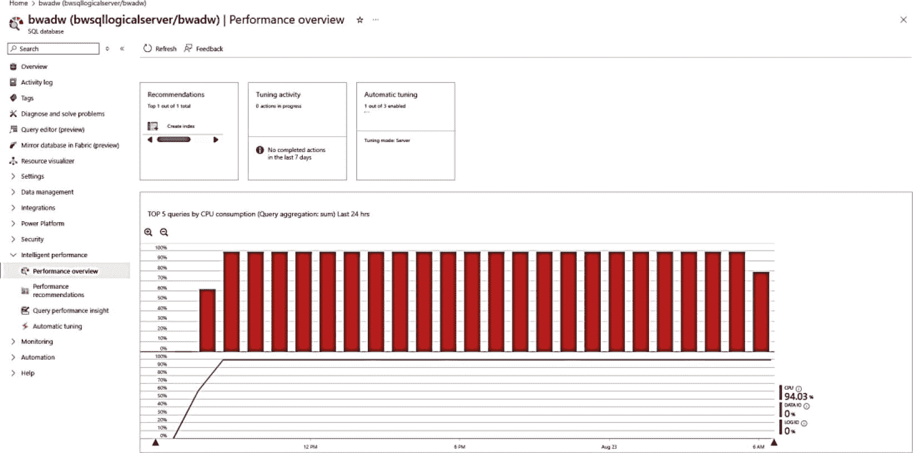

图 7-31

Azure SQL 数据库的性能概述

现在，让我们通过选择 `查询性能见解` 来仔细查看高 CPU 利用率背后的查询，如图 7-32 所示。

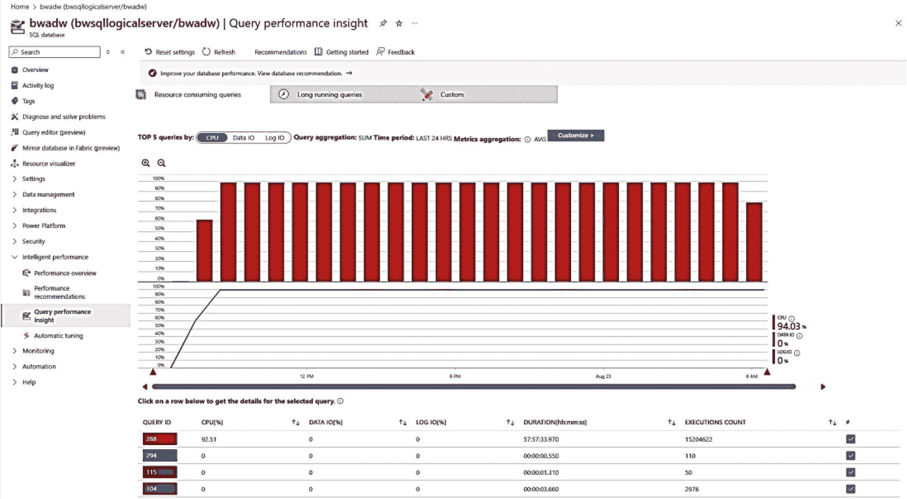

图 7-32

Azure SQL 数据库的查询性能见解

第一个查询消耗了所有 CPU，因此我可以选择它，然后会得到一个如图 7-33 所示的屏幕。

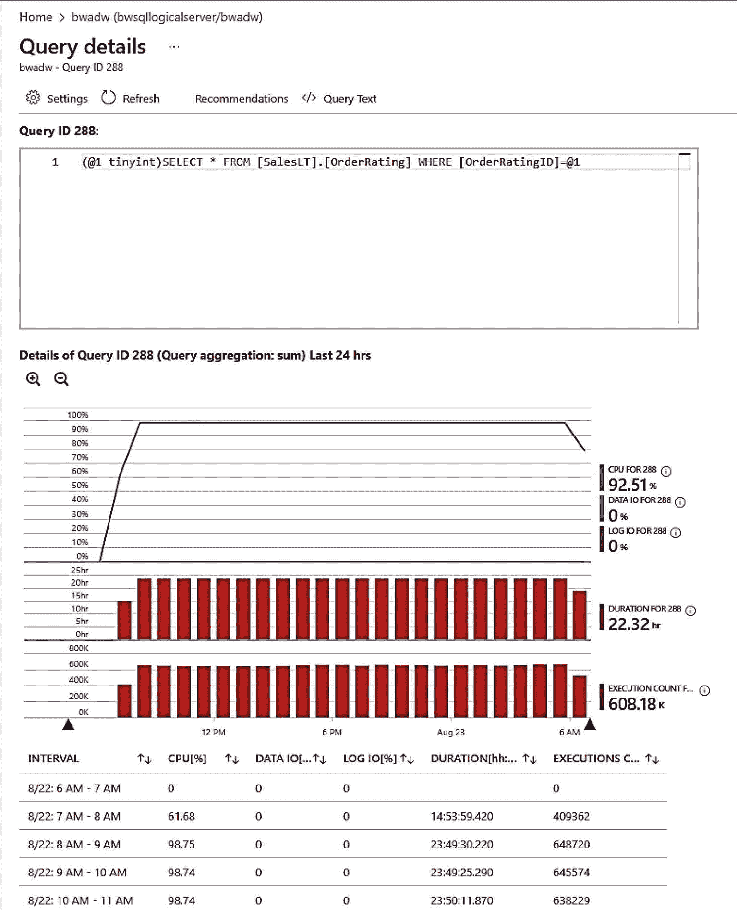

图 7-33

来自性能见解的查询详细信息

这为我提供了历史性能和查询文本。我可以点击此屏幕顶部的“建议”，但不如让我们返回 Azure 门户。在这里，我可以选择 `性能建议`，如图 7-34 所示。

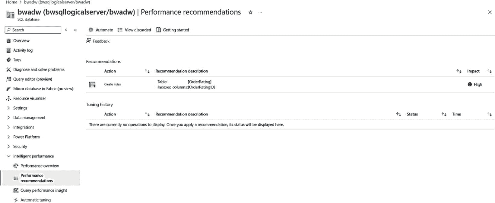

图 7-34

Azure SQL 数据库的性能建议

在此屏幕上，您可以看到其中一条建议是创建新索引，且影响为“高”（这意味着它可能对提高性能有显著的积极影响）。

我可以点击“创建索引”操作，获取有关推荐索引的更多详细信息，如图 7-35 所示。

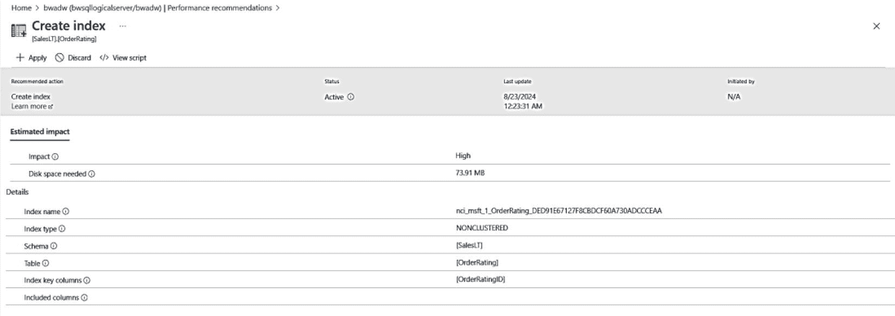

图 7-35

创建索引建议

在此屏幕上，我可以获取有关如何构建索引、其对性能的影响以及构建它所需预计存储空间的详细信息。此时，我可以选择屏幕顶部的“应用”来创建索引。我也可以选择“查看脚本”以获取 T-SQL 命令的详细信息，如图 7-36 所示。

图 7-36

创建索引脚本

您可以看到，在线索引是自动索引使用的默认方法。

假设您喜欢这些建议，甚至希望考虑让 Azure 自动查找并创建它们。您可以从 Azure 门户选择 `自动调优` 来更改这些选项，如图 7-37 所示。

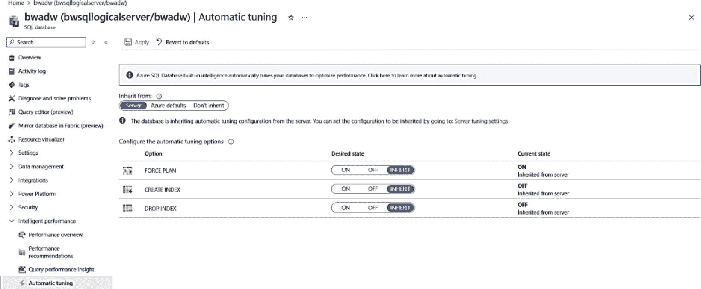

图 7-37

Azure SQL 数据库的自动调优选项

你可以选择强制计划（自动计划修正）、创建和删除索引。你可以在订阅、逻辑服务器或数据库级别设置这些选项。这里的 `DROP` 索引功能非常实用，因为数据可能会发生变化，导致索引不再需要，甚至可能损害性能。

你还可以像图 7-38 所示，在数据库概览屏幕（甚至逻辑服务器概览下的跨数据库视图）上，以另一种方式查看索引建议。

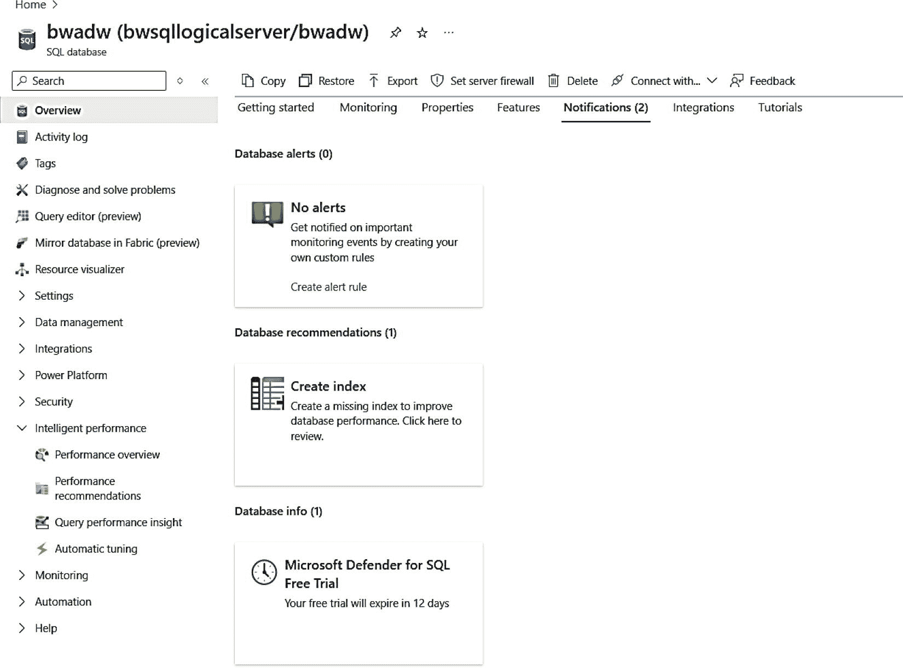

图 7-38

数据库通知

你也可以通过目录视图 `sys.database_automatic_tuning_options` 查看自动调优选项。你可以在 [`https://learn.microsoft.com/sql/relational-databases/system-catalog-views/sys-database-automatic-tuning-options-transact-sql`](https://learn.microsoft.com/sql/relational-databases/system-catalog-views/sys-database-automatic-tuning-options-transact-sql) 查看此目录视图的所有列。

## 总结

要为你的应用程序提供最佳性能，你需要 SQL Server 中经过验证和证明的功能及监控工具。Azure SQL 不仅提供了这些，还包括 Azure 特有的功能和工具。

Azure SQL 为你提供了加速和调优性能的控制和选项，包括无需数据库迁移即可轻松扩展的能力，或部署无服务器超大规模数据库以实现计算和存储的自动扩展。

最后，Azure SQL 内置了智能性能功能，这些功能嵌入查询处理器和服务中，利用了数据库查询存储的强大能力。

在下一章中，我们将探索并深入了解 Azure SQL 的最后一个核心引擎能力：可用性。

