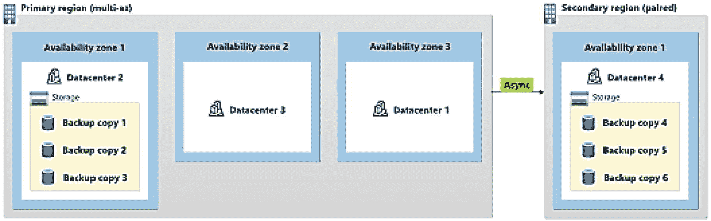
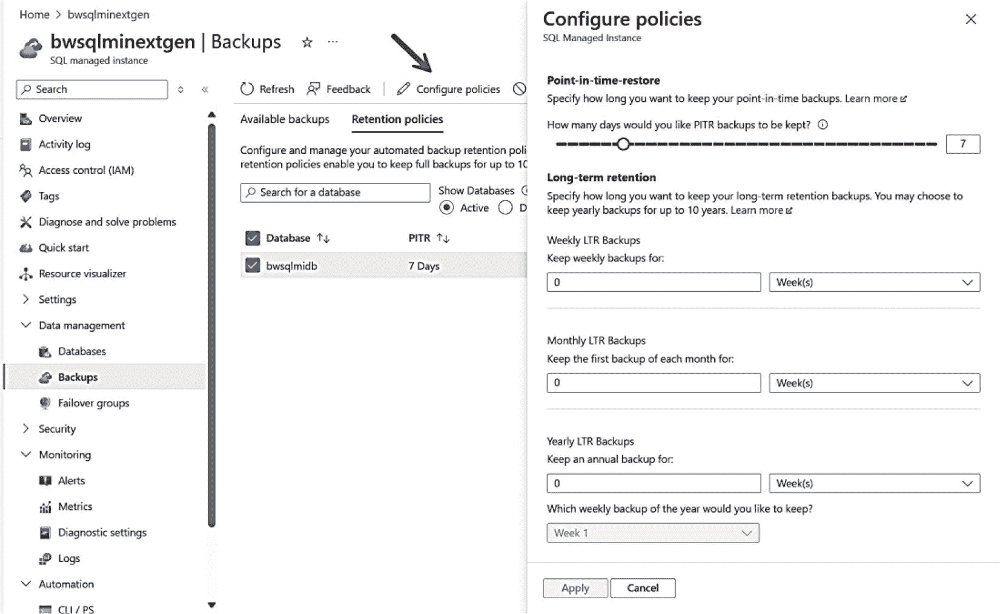
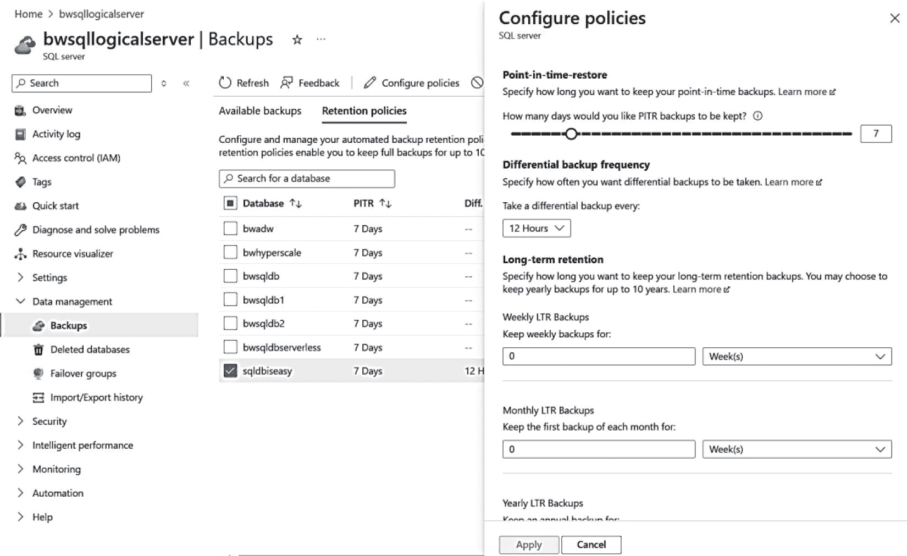
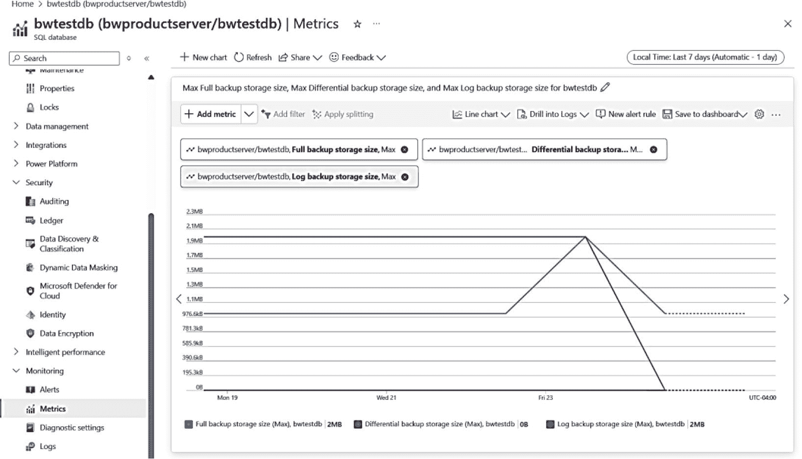
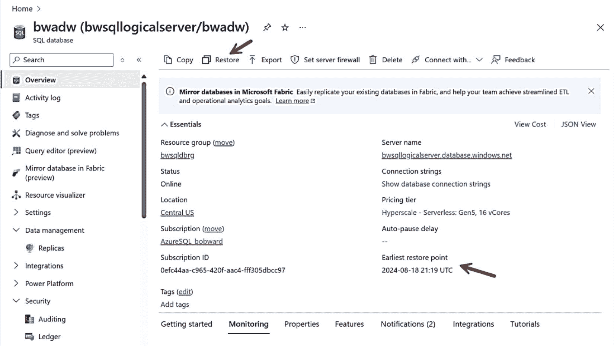
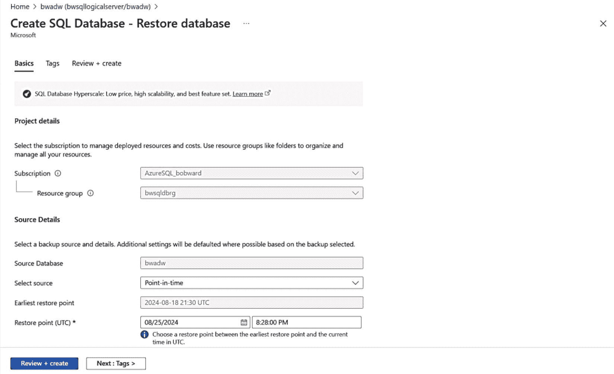
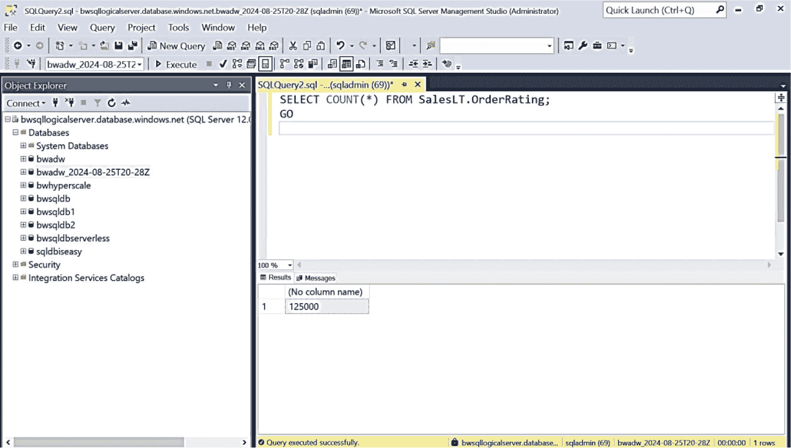

# Azure SQL 高可用性与备份

## 内置可用性

您可能习惯于使用 Always On 故障转移群集实例（`FCI`）或 Always On 可用性组（`AG`）配合 `SQL Server` 来实现高可用性并达到期望的恢复时间目标（`RTO`）。

作为**每一次** Azure `SQL` 部署的一部分，只需部署 Azure `SQL`，您就能获得一个完整的内置可用性系统。这已包含在您的 Azure 订阅和部署费用中。

正如您将在本章中看到的，通用目的部署的行为类似于 `FCI`，而业务关键型则类似于 `AG`。超大规模使用了一种独特的架构，感觉像是两者的结合。在所有情况下，都利用了 Azure Service Fabric 的强大功能来实现自动故障转移能力。

## 区域冗余用于高可用性

当您拥有三个数据中心时，为何还要依赖单个数据中心？Azure `SQL` 可以与一项称为**区域冗余**的功能集成。每个区域是 Azure 区域内一组一个或多个数据中心（因此实际上超过三个），拥有独立的电源、冷却和网络。Azure `SQL` 可以跨区域部署一个***高可用性***解决方案，以便在特定数据中心发生故障时为您提供更高的可用性。

所有 Azure `SQL` 部署都是作为 **Azure 可用性集** 的一部分创建的，其中包括使用不同的容错域和更新域。**容错域**定义了共享公共电源和网络交换机的虚拟机组。**更新域**是可以同时重启的虚拟机和底层物理硬件组。一次只重启一个更新域。重启的更新域有 30 分钟的恢复时间，之后才会在另一个更新域上启动维护。您可以在 [`https://learn.microsoft.com/azure/virtual-machines/availability#configure-multiple-virtual-machines-in-an-availability-set-for-redundancy`](https://learn.microsoft.com/azure/virtual-machines/availability#configure-multiple-virtual-machines-in-an-availability-set-for-redundancy) 阅读有关此概念的更多信息。

## 地理复制与故障转移组

您可能希望通过跨 Azure 区域同步部署来提供更高级别的可用性。Azure `SQL` 提供了两种实现此功能的方法，称为地理复制和故障转移组。我们将在本章中详细介绍每个选项，以及您为何可能选择其中一个而不是另一个。

## 数据库可用性与一致性

对于 `SQL Server`，您习惯于使用各种技术来确保数据库可用并检查一致性。Azure `SQL` 消除了对繁重“紧急”恢复选项的需求，并提供了许多内置的一致性检查。在本章中，我将更详细地探讨 Azure `SQL` 与 `SQL Server` 在数据库可用性、恢复和一致性方面的具体比较。

## 使用托管实例链接进行灾难恢复

托管实例链接提供了使用可用性组的强大功能，从 `SQL Server 2016`、`2019` 或 `2022` 执行在线迁移到托管实例的能力。由于版本化的托管实例与 `SQL Server 2022` 兼容，您还可以在 `SQL Server 2022` 和托管实例之间构建灾难恢复架构。这实际上是在 `SQL Server` 和托管实例之间构建一个分布式可用性组（`DAG`）。

## 免费被动灾难恢复副本

如果您使用托管实例链接、地理复制或故障转移组等技术为 Azure `SQL` 托管实例或数据库配置*副本*，您可以将辅助副本声明为*被动*。这意味着您仅将辅助副本用于灾难恢复目的。如果选择此选项，您可以节省成本，因为您只需为辅助副本的计算和存储付费。这也被称为*备用副本*。

## SQL Server 复制

`SQL Server` 复制多年来一直是在许多 `SQL Server` 版本中提供可用性和数据库同步级别的流行方法。本章不会深入探讨使用 `SQL Server` 复制的细节，但会指出这些功能：

*   Azure `SQL` 托管实例为您提供了设置事务或快照复制系统的全部功能，包括发布者、分发者和订阅者。订阅者可以是另一个托管实例数据库、Azure `SQL` 数据库，甚至是 Azure `VM` 中或本地的 `SQL Server`。请在 [`https://learn.microsoft.com/azure/azure-sql/managed-instance/replication-transactional-overview`](https://learn.microsoft.com/azure/azure-sql/managed-instance/replication-transactional-overview) 阅读有关 Azure `SQL` 托管实例和复制的更多信息。

*   Azure `SQL` 数据库可以作为本地 `SQL Server`、Azure `VM` 中的 `SQL Server` 或托管实例的订阅者，进行事务和快照复制。迁移到 Azure `SQL` 数据库时，这可能是一个有趣的迁移选项，因为它可以提供一种“在线”迁移策略。更多信息请见 [`https://learn.microsoft.com/azure/azure-sql/database/replication-to-sql-database`](https://learn.microsoft.com/azure/azure-sql/database/replication-to-sql-database)。

## 备份与恢复

假设您需要为 `SQL Server` 部署设置自动备份系统。您基本上希望构建一个系统，让其他 `DBA` 无需担心执行备份。您希望这些备份定期运行；结合使用完整、差异和日志备份；并放置在与数据库分离的存储上以实现全面保护。您还希望备份存储能在公司内跨数据中心镜像。

猜猜怎么着？当您部署 Azure `SQL` 托管实例或 Azure `SQL` 数据库时，我们默认就完成了所有这些工作……甚至更多。让我们看看自动备份系统的各个方面以及如何使用这些备份进行恢复。

### 自动备份

当您部署 Azure `SQL` 数据库或为 Azure `SQL` 托管实例部署创建新数据库时，我们会监控此活动并启动以下备份活动计划：

*   每周进行一次完整数据库备份。

*   每 12 或 24 小时进行一次差异备份。

*   每 5-10 分钟进行一次事务日志备份。日志备份的实际频率基于 `vCores` 数量和数据库活动。

注意

我们可能会改变执行此操作的具体实现方式。核心概念是为您提供时间点恢复并满足您的 `RPO` 目标。

所有备份都在后台使用标准 `T-SQL` 语句完成，并与您的数据和日志文件分开存储（即使它们在 Azure 存储上）。您为备份提供的选项之一是***冗余***选项。这些选项包括以下。

#### 本地冗余存储（`LRS`）

您的备份文件在物理数据中心内同步复制三次。虽然此选项不能提供最佳保护，但由于数据驻留要求，它对某些客户来说是一个选择。

#### 区域冗余存储（`ZRS`）

此选项类似于 `LRS`，不同之处在于备份文件的同步副本分布在三个可用性区域中。此选项适用于 Azure `SQL` 托管实例和 Azure `SQL` 数据库，与部署的区域冗余无关。

#### 地理冗余存储（`GRS`）

这是任何 Azure `SQL` 托管实例或 Azure 数据库的默认选项。您的备份文件是本地冗余的，但也会异步复制到另一个区域中的单个物理位置（该位置使用 `LRS`）。

图 8-1 展示了这些备份冗余的示例。



图 8-1

地理冗余备份


### 地理区域冗余存储 (GZRS)

这意味着备份文件会在主区域的三个 **Azure 可用性区域**之间进行复制，并异步复制到另一个区域的单个物理位置（该区域使用 LRS）。此选项仅适用于 **Azure SQL 托管实例**，并且（即使实例本身不是区域冗余的）也适用于 **Azure SQL 数据库超大规模**（当启用区域冗余功能时）。

地理冗余选项为您提供最佳的恢复选项，因为即使您的实例或数据库所在的区域不可用，您仍然可以从备份中还原。对于启用了区域冗余的超大规模数据库，**区域冗余 (ZRS)** 和 **地理区域冗余 (GZRS)** 是唯一的备份选项。数据库创建后，您无法更改超大规模数据库的备份冗余设置。请阅读 Azure 存储地理冗余的更多信息：[`https://learn.microsoft.com/azure/storage/common/storage-redundancy#redundancy-in-a-secondary-region`](https://learn.microsoft.com/azure/storage/common/storage-redundancy#redundancy-in-a-secondary-region)。

注意
地理和区域冗余的备份存储选项可能会产生更多费用。请在此处了解更多：[`https://learn.microsoft.com/azure/azure-sql/database/automated-backups-overview?view=azuresql&tabs=single-database#backup-storage-costs`](https://learn.microsoft.com/azure/azure-sql/database/automated-backups-overview?view=azuresql&tabs=single-database#backup-storage-costs)。

当您部署或创建新数据库时，我们几乎会立即安排一次完整的数据库备份。我们会使用 `CHECKSUM` 和还原技术对您的备份执行完整性检查。请在此处阅读 Azure SQL 自动备份的完整说明：[`https://learn.microsoft.com/en-us/azure/azure-sql/database/automated-backups-overview`](https://learn.microsoft.com/en-us/azure/azure-sql/database/automated-backups-overview)。

### 备份保留期

默认情况下，我们会保留足够的备份文件，使您可以在过去 7 天内的任何时间点执行时间点还原 (PITR)。对于 **Azure SQL 数据库**，您可以将此保留期更改为 1 天或最长 35 天。这被称为**短期备份保留期**。对于为托管实例创建的任何数据库，您都有相同的选择。

保留策略不仅影响您可以回溯到多远的时间点进行还原，还会影响备份所消耗的存储空间。您可以通过 Azure 门户、az CLI (`az sql db ltr-policy`) 或 PowerShell (`Set-AzSqlDatabaseBackupShortTermRetentionPolicy`) 配置 Azure SQL 数据库备份的短期保留策略。

Azure SQL 提供了一个称为**长期备份保留期 (LTR)** 的概念。这允许您将备份保留长达 **10 年**。所有保留的 LTR 备份都是完整的数据库备份。

可以使用 Azure 门户为托管实例的数据库配置备份保留期，如图 8-2 所示，图中展示了我在我的托管实例上部署的一个数据库。


图 8-2：为托管实例数据库配置备份保留期

门户仅允许在数据库级别进行配置，因此对于实例，您可能需要使用脚本来实现自动化。因此，您也可以使用 az CLI (`az sql midb short-term-retention-policy`) 和 PowerShell (`Set-AzSqlInstanceDatabaseBackupShortTermRetentionPolicy`) 来管理托管实例备份的短期保留策略。

图 8-3 展示了如何通过 Azure 门户中的逻辑服务器为 Azure SQL 数据库配置备份保留期。


图 8-3：Azure SQL 数据库的备份保留期

我们的文档中有一个图表，可以帮助您规划长期保留期，地址为：[`https://learn.microsoft.com/azure/azure-sql/database/long-term-retention-overview?view=azuresql#how-long-term-retention-works`](https://learn.microsoft.com/azure/azure-sql/database/long-term-retention-overview?view=azuresql#how-long-term-retention-works)。

### 自动备份

您也可以使用 az CLI (`az sql db ltr-policy`) 或 PowerShell (`Set-AzSqlDatabaseBackupLongTermRetentionPolicy`) 为 Azure SQL 数据库配置长期保留策略。

注意
如果您使用地理复制或故障转移组（我将在本章后面讨论），您可以为这些数据库配置长期保留，但除非该数据库成为主数据库，否则不会进行长期保留备份。

### 备份存储消耗与成本

作为部署的一部分，您会获得相当于数据库最大大小或托管实例存储大小的免费备份存储空间。这包括所有完整备份、差异备份和日志备份的空间。尽管我们会压缩所有备份，但您所需的空间大小将取决于您的数据大小、您进行的更改数量（影响差异备份和日志备份的大小）以及您的备份保留天数。

如果您超过托管实例最大存储大小或 Azure SQL 数据库最大大小所附带的免费备份存储空间，您可能会产生额外的备份费用。

在大多数情况下，我们发现使用默认七天保留期的客户很少会产生额外费用。对于 Azure SQL，您可以使用 Azure 门户查看订阅的账单信息，以跟踪是否正在使用额外的收费空间。了解更多：[`https://learn.microsoft.com//azure/azure-sql/database/automated-backups-overview?view=azuresql&tabs=single-database#backup-storage-costs`](https://learn.microsoft.com//azure/azure-sql/database/automated-backups-overview?view=azuresql&tabs=single-database#backup-storage-costs)。如果您查看此文档页面，您会看到地理和区域冗余备份选项可能会产生更多成本。

对于 Azure SQL 数据库，Azure 指标允许您跟踪甚至设置关于完整备份、差异备份和日志备份所消耗备份存储的警报。图 8-4 展示了通过门户使用 Azure 指标查看可用信息的示例。


图 8-4：Azure SQL 数据库备份存储消耗指标

一些帮助您管理备份存储空间消耗的提示：

*   根据您的要求，将保留期缩短到可能的最短天数。
*   您进行的修改越大，差异备份和日志备份所需的空间就越大。例如，减少不必要的索引重建以避免大型修改。
*   您可以尝试增加最大存储大小以获得更多备份空间，但存储大小的增加成本可能低于备份存储成本。


## 时间点恢复 (PITR)

既然你已经了解了我们使用的自动备份策略，你可能会有使用备份进行恢复的需求。在某些情况下，对于 SQL Server，你可能会遇到影响可用性的事件，例如数据库所有者删除了某张表。

由于我们部署了完整备份、差异备份和日志备份的组合，我们允许你选择一个*时间点*，并使用这些备份恢复到该状态。这个概念被称为 `时间点恢复 (PITR)`，在 SQL Server 中可用（前提是你部署了正确的备份策略）。

如果你查看 SQL Server 文档 [`https://learn.microsoft.com/sql/relational-databases/backup-restore/restore-a-sql-server-database-to-a-point-in-time-full-recovery-model`](https://learn.microsoft.com/sql/relational-databases/backup-restore/restore-a-sql-server-database-to-a-point-in-time-full-recovery-model)，恢复到某个时间点的方法是使用一系列备份，通过 T-SQL `RESTORE` 语句从日志备份进行恢复。对于 Azure SQL，PITR 支持我们为 Azure SQL 托管实例和数据库创建的自动备份。因此，要执行时间点恢复，你必须使用 Azure 界面，例如门户、`az` CLI 或 PowerShell。

注意

尽管托管实例支持 `RESTORE` 语句，但其语法受限，你无法执行时间点恢复。这只能用于从带有 `COPY_ONLY` 选项的备份或从 SQL Server 还原完整备份。

Azure SQL 托管实例通过 Azure 门户（在门户中导航到数据库并从命令栏选择“恢复”选项）、`az` CLI (`az sql midb restore`) 和 PowerShell (`Restore-AzSqlInstanceDatabase`) 支持 PITR。PITR 操作是异步的，并基于你选择的恢复日期和时间创建一个*新数据库（实际上，是一个新部署）*。你的日期和时间选择取决于你的备份保留天数。

Azure SQL 数据库也通过 Azure 门户、`az` CLI (`az-sql-db-restore`) 和 PowerShell (`Restore-AzSqlDatabase`) 支持 PITR。

Azure SQL 的 `关键概念` 是，你永远不会在现有数据库上直接恢复，而是通过从自动备份恢复来启动一个新的数据库部署。

让我们来看一个如何对本书前面部署的名为 `bwadw` 的数据库使用 PITR 的示例。我在撰写本书章节时创建了这个数据库，所以到现在为止，至少已经过去了七天，产生了一系列备份。让我们进行一个练习：我不小心在数据库中删除了一个表，然后使用 PITR 将数据库恢复到删除操作之前的一个新数据库名称，这样我就可以将这些数据合并回当前的数据库。

### 删除表

我将使用在第 3 章部署并在最近两章中使用的 Azure VM `bwsql2022`，通过 SSMS 连接，并以部署时使用的服务器管理员身份（记住它是基于 AdventureWorksLT 示例的）针对 `bwadw` 数据库运行以下 T-SQL 语句：

```
DROP TABLE SalesLT.OrderRating;
GO
```

注意 这是我作为第 7 章示例的一部分创建的表。我在删除表之前保留了大约 125,000 行数据。因此，如果我们正确恢复它，我们应该能找回包含 125,000 行数据的表。

### 将数据库恢复到删除操作之前的时间点

我刚刚删除了表，所以我应该能够回到该表存在且数据存在的更早时间点。我可以选择恢复到这个时间点之前一个小时。

提示 在不知道表何时被删除的真实场景中，你可以使用 SQL 审计来查找 `DROP TABLE` 语句。

你可以使用 Azure 门户选择开始恢复过程，如图 8-5 所示。



图 8-5

启动 Azure SQL 数据库的 PITR 过程

请注意，“概述”屏幕上列出了最早的恢复点。

注意

最早的时间点是基于数据库创建后的第一个事务日志备份。在执行日志备份之前，必须先完成一个完整备份。**这里有个提示。** 使用我们新的 `Copilot`，并使用此提示词：“我可以恢复到多久之前的时间点？”

在我选择“恢复”之后，会出现一个屏幕，我可以在其中填写想要恢复到的时间，如图 8-6 所示。



图 8-6

基于 PITR 创建新数据库

你会注意到我可以选择恢复的日期和时间，这实际上是在我执行 `DROP` 语句之前一小时。屏幕的其余部分，如果向下滚动，允许你像部署新数据库时一样选择数据库名称和其他选项（例如，服务层）。创建的默认数据库名称（你可以更改）是原始数据库名称，包括恢复点的详细信息。对我来说，我的数据库名称是 `bwadw_2024-08-25T20-28Z`。

你需要对此处的部署时间设定期望。这不仅仅是一个新数据库。我们必须执行部署新数据库的所有操作，**并且**恢复一个完整数据库备份以及一系列差异备份和日志备份，直到你选择的时间点。对我来说，这次恢复大约花了十分钟。我可以执行本书第 4 章中讨论的所有活动，查看活动日志，了解恢复如何部署新数据库。我建议客户在这里尝试各种场景，以了解其工作负载的预期恢复时间。请记住，更高的 RTO 和 RPO 目标可以通过地理复制和故障转移群集等概念实现，这些将在本章后面讨论。

注意

你的恢复时间将取决于我们需要恢复什么才能使你到达所需的时间点。在 [`https://learn.microsoft.com/azure/azure-sql/database/recovery-using-backups?view=azuresql&tabs=azure-portal#recovery-time`](https://learn.microsoft.com/azure/azure-sql/database/recovery-using-backups?view=azuresql&tabs=azure-portal#recovery-time) 了解更多信息，包括并发恢复数量的限制。



图 8-7

从 PITR 查询已删除的表

### 验证新数据库已恢复被删除的表

我回到了我的 Azure VM `bwsql2022`，在那里我以管理员身份连接到逻辑主数据库。如果我导航到这个数据库并运行以下 T-SQL 语句：

```
SELECT COUNT(*) FROM SalesLT.OrderRating;
GO
```

我得到了 125,000 行数据，如图 8-7 所示。

我现在有两个选择：

*   删除当前的 `bwadw` 数据库并重命名这个新数据库，这样我的应用程序将丢失自 PITR 时间点以来的所有更改。

*   将这个新数据库中 `SalesLT.OrderRating` 的数据合并到我的原始数据库中。我意识到如果存在外键，这可能不是一个简单的操作。


