# Azure SQL 的地理恢复与还原操作

### 数据库的地理恢复

假设你 Azure SQL 数据库或托管实例中的数据库因数据中心故障而无法使用。虽然这种情况很少见，但如果能从一个未发生故障的其他区域的地理冗余备份中恢复备份，那就太好了。

此过程称为 `geo-restore`（地理恢复），其概述位于 [`https://learn.microsoft.com/azure/azure-sql/database/recovery-using-backups?view=azuresql&tabs=azure-portal#geo-restore`](https://learn.microsoft.com/azure/azure-sql/database/recovery-using-backups?view=azuresql&tabs=azure-portal#geo-restore)。概念是，你将基于一个备份部署一个新的 Azure SQL 数据库或为托管实例创建一个新数据库。选择此选项时，系统将为你显示所有现有 Azure SQL 部署的已知备份。如果存储你常规备份的数据中心宕机，我们将从不同的区域检索该备份的地理冗余副本。

### 从已删除的数据库还原备份

Azure SQL 内置的高可用性与灾难恢复 (HADR) 选项源源不断。假设你不小心删除了 Azure SQL 数据库或托管实例的数据库。

注意：与传统的 SQL Server 相比，删除 Azure SQL 数据库或托管实例的数据库在幕后要执行更多操作，因为我们有各种类型的服务和操作与该数据库相关联。这就是为什么你可以通过 Azure 界面或 `DROP DATABASE` T-SQL 语句来删除数据库。

我意识到这或许不是你几乎从未见过的事情，但内置 HADR 的一个亮点是，当你删除数据库后，你可以基于你配置的保留期，使用点时间还原 (PITR) 从与该已删除数据库关联的备份中恢复。如果你的保留期是七天，而你删除了数据库，我们将无法再执行任何备份，但你可以从最早的备份点到数据库删除的时间点之间，还原到任意时间点。

注意：你无法从已删除的逻辑服务器或托管实例中恢复。但是，如果你配置了长期保留 (LTR) 备份，你可以基于这些备份创建新数据库。你可能会问，既然 LTR 备份不是免费的，我该如何移除 LTR 备份？你可以使用 PowerShell 命令 `Remove-AzSqlDatabaseLongTermRetentionBackup` 或 `Remove-AzSqlInstanceDatabaseLongTermRetentionBackup`，即使逻辑服务器或托管实例已被删除。

你可以通过 Azure 门户、`az` CLI 或 PowerShell 还原已删除的数据库。有关如何执行此操作的更多信息，请访问 [`https://learn.microsoft.com/azure/azure-sql/database/recovery-using-backups?view=azuresql&tabs=azure-portal#deleted-database-restore`](https://learn.microsoft.com/azure/azure-sql/database/recovery-using-backups?view=azuresql&tabs=azure-portal#deleted-database-restore)。

### 在 Azure SQL 托管实例中还原

本章前面我提到过，可以为 Azure SQL 托管实例执行 `BACKUP` T-SQL 语句。我们将此功能称为原生数据库备份。使用“原生”一词是因为你可以使用 `BACKUP` T-SQL 语句执行完整数据库备份到磁盘存储。此磁盘存储必须是 Azure 存储账户，并使用 SQL Server 已支持多个版本的“备份到 URL”功能。

你必须使用 `WITH COPY_ONLY` 选项来备份托管实例的数据库。SQL Server 已支持仅复制备份多个版本。仅复制备份不会影响完整、差异和日志备份的备份序列。我们的团队发布了一篇关于如何在托管实例上设置原生备份的精彩博客，地址为 [`https://techcommunity.microsoft.com/t5/azure-sql-database/native-database-backup-in-azure-sql-managed-instance/ba-p/386154`](https://techcommunity.microsoft.com/t5/azure-sql-database/native-database-backup-in-azure-sql-managed-instance/ba-p/386154)。

既然你可以在托管实例上执行原生备份，你也可以使用 T-SQL `RESTORE` 语句还原这些备份。你只能将托管实例的仅复制备份还原到现有或新的托管实例。请记住，它是一个新数据库。例如，如果你尝试使用 `RESTORE` 的 `WITH REPLACE` 语法，将会收到错误（错误号 41901）。

此外，你可以获取任何受支持版本的 SQL Server 的完整数据库备份，并将其还原到托管实例。这实际上是一种执行从 SQL Server 到托管实例的简单离线迁移的方法。了解更多请访问 [`https://learn.microsoft.com/data-migration/sql-server/managed-instance/database-migration-service?toc=%2Fazure%2Fdms%2Ftoc.json&tabs=online-with-extension`](https://learn.microsoft.com/data-migration/sql-server/managed-instance/database-migration-service?toc=%2Fazure%2Fdms%2Ftoc.json&tabs=online-with-extension)。

以下文档页面将引导你完成在托管实例上执行原生还原的过程：[`https://learn.microsoft.com/azure/azure-sql/managed-instance/restore-sample-database-quickstart`](https://learn.microsoft.com/azure/azure-sql/managed-instance/restore-sample-database-quickstart)。

## 内置可用性

SQL Server 有一个伟大的传统，即提供必要的功能和软件来保持你的数据库高度可用。这个传统始于使用共享存储的 Always On 故障转移群集实例 (FCI)，并集成了诸如 Windows Server 故障转移群集 (WSFC) 等技术以实现自动故障转移。在 SQL Server 2012 中，我们引入了 Always On 可用性组，以支持非共享存储方法、只读副本，并且仍然与 WSFC 集成以进行自动故障转移决策。SQL Server Linux 也支持这些功能，但集成了 Pacemaker 等 Linux 技术。

Azure SQL 工程团队希望提供的一个方面是公开承诺服务级别协议 (SLA)，包括可用性。他们还希望数据库或托管实例的部署过程在配置和设置可用性时能“直接完成”。最后，由于 Azure SQL 是与 Azure Service Fabric (SF) 一起部署的，我们需要与 SF 集成以进行故障转移决策。

结果确实是一个令人惊叹的成果。你选择的每个 Azure SQL 部署选项都具有内置的可用性。让我们看看每个部署选项以及使其成为可能的可用性架构。你也可以参考以下文档页面：[`https://learn.microsoft.com/en-us/azure/azure-sql/database/business-continuity-high-availability-disaster-recover-hadr-overview`](https://learn.microsoft.com/en-us/azure/azure-sql/database/business-continuity-high-availability-disaster-recover-hadr-overview)。尽管本章中关于通用目的和服务业务关键服务层的详细信息适用于 Azure SQL 托管实例和数据库，但对于 Azure SQL 托管实例，有一些值得注意的差异，详见 [`https://learn.microsoft.com/azure/azure-sql/managed-instance/high-availability-sla-local-zone-redundancy`](https://learn.microsoft.com/azure/azure-sql/managed-instance/high-availability-sla-local-zone-redundancy)。


### 通用型可用性

我在本书中多次描述了通用型（GP）服务层级的整体概念。您的数据库存储在 `Azure Storage` 上，而 `tempdb` 则存储在本地的 `SSD` 存储上。让我们用一张图来详细描述通用型架构以及可用性和故障转移的工作原理。（这些图基于文档 [`https://learn.microsoft.com/azure/azure-sql/database/high-availability-sla-local-zone-redundancy?view=azuresql&tabs=azure-powershell#basic-standard-and-general-purpose-service-tier-availability`](https://learn.microsoft.com/azure/azure-sql/database/high-availability-sla-local-zone-redundancy?view=azuresql&tabs=azure-powershell#basic-standard-and-general-purpose-service-tier-availability) 中的示意图。）

图 8-8 展示了 GP 可用性的架构。

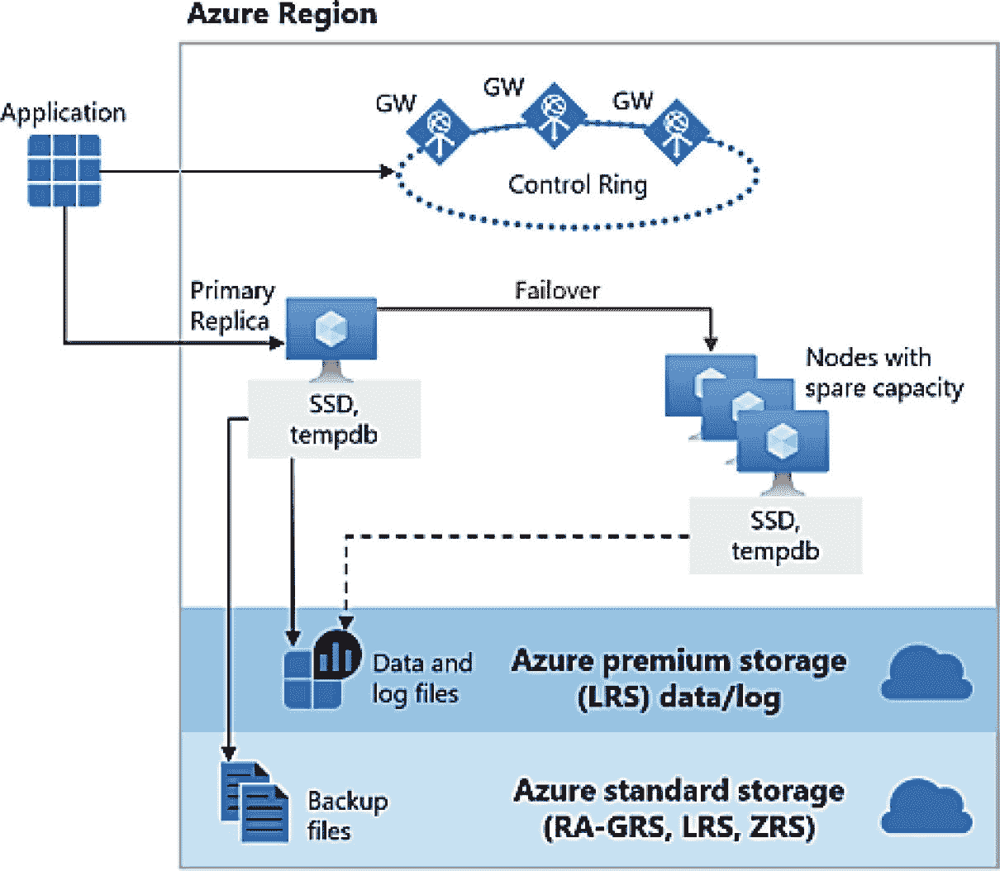

图 8-8

通用型服务层级可用性

应用程序将通过 Azure 区域内控制环中的 `gateways`（网关）连接到主副本（对于通用型，只有一个副本）。如果您还记得，我们在本书第 4 章和第 6 章讨论过网关的 `proxy`（代理）和 `redirect`（重定向）连接类型。无论哪种情况，`gateways` 都为应用程序提供了一个连接抽象层。请注意，部署的本地 `SSD` 存储是 `tempdb` 的存储位置。

数据库和事务日志文件被放置在使用 `LRS`（本地冗余存储）的 `Azure Premium Storage` 上。这意味着您的数据库和事务日志文件会在数据中心物理位置内复制三份。

正如本章前面所述，您的备份文件存储在一个不同的存储位置，并支持 `LRS`、`ZRS` 和 `GRS` 等冗余选项。

注意

即使部署不是区域冗余的，Azure SQL 托管实例也支持 GP 服务层级的 `geo-zone-redundant`（地域区域冗余）备份。

Azure SQL 部署与 `Service Fabric (SF)` 集成，以检测问题（例如节点故障），并在必要时启动 `failover`（故障转移）。如果需要故障转移，系统将找到一个具有足够容量的新节点来承载您的部署。

新节点的本地存储托管 `SQL Server`，包括 `tempdb`。新的 `SQL Server` 将被定向到您位于 `Azure Storage` 上的数据库和日志文件。这种架构类型与 `SQL Server` 的 `FCI`（故障转移群集实例）工作方式非常相似。您的停机时间取决于我们找到具有足够容量的新节点来承载您的部署选择（`vCores` 等）的速度。此外，新节点上托管您数据库的 `SQL Server` 刚刚启动，其缓冲池和计划缓存都是冷的，因此正常的启动活动会影响您的性能（但由于我们使用了 `Accelerated Database Recovery`（加速数据库恢复），数据库恢复将极其迅速）。

您可能想知道故障转移后应用程序如何连接到新节点？答案就是 `gateways`。应用程序无需更改任何名称来连接新节点。`gateways` 负责处理该逻辑。应用程序只需简单地重试连接，即可继续运行。

### 业务关键型可用性

业务关键型（BC）部署依赖于本地存储和一系列副本，非常类似于 `Always On 可用性组 (AG)`。让我们将 BC 架构与通用型进行比较。图 8-9 展示了一个具有可用性的 BC 部署架构。

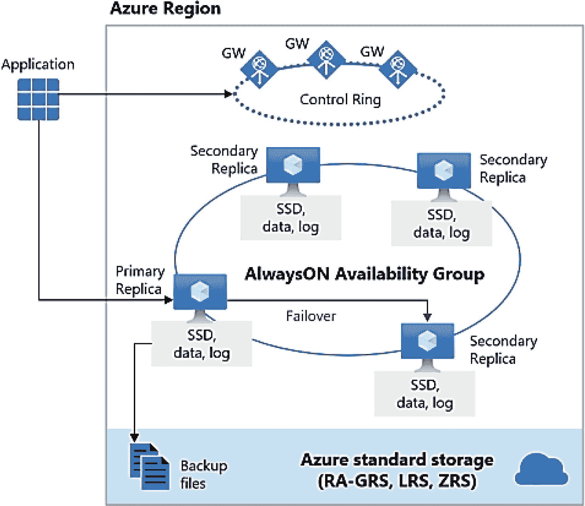

图 8-9

业务关键型服务层级可用性

从图中可以看出，`gateways` 仍然是连接的重要组成部分，并且存在一个主副本。本地存储不仅用于 `tempdb`，也用于数据库和日志文件。此外，与 `Always On 可用性组` 类似，存在辅助副本。对于 BC 部署，我们始终保持四个副本处于运行状态（一个主副本和三个辅助副本）。从事务的角度来看，在*至少一个*辅助副本确认更改已固化之前，主副本上的提交无法进行。

您还可以看到，备份文件存储在 `Azure Storage` 中，支持如本章前面所述的冗余选项。

注意

即使部署不是区域冗余的，Azure SQL 托管实例也支持 BC 服务层级的 `geo-zone-redundant`（地域区域冗余）备份。

如果需要进行故障转移，我们只需选择一个已同步的辅助副本，使其成为主副本，就像 `AG` 一样。与通用型相比，停机时间显著减少，因为新的主副本只需运行撤销恢复即可变为可用。由于启用了 `Accelerated Database Recovery (ADR)`（加速数据库恢复），撤销恢复可以非常快。我将在本章后面详细讨论 `ADR` 的重要性。如果旧的主副本不可用，我们将需要启动一个新的辅助副本（并同步它）以保持四个可用副本。

与通用型服务层级一样，由于使用了 `gateways`，应用程序只需重新连接即可重新开始运行。此外，作为使用 BC 的每月免费福利的一部分，BC 部署将允许您使用*一个*辅助副本作为 `read-only replica`（只读副本）。我们的 `gateways` 有助于提供重定向逻辑。您只需确保应用程序提供了正确的 “`read intent`”（读取意向）选项。您可以在 [`https://learn.microsoft.com/azure/azure-sql/database/read-scale-out`](https://learn.microsoft.com/azure/azure-sql/database/read-scale-out) 了解更多信息。

注意

读取横向扩展支持会话级别的一致性。这意味着，如果 `read-only`（只读）会话在由于副本不可用导致的连接错误后重新连接，它可能会被重定向到一个与 `read-write`（读写）副本不是 100% 同步的副本。同样，如果应用程序使用 `read-write` 会话写入数据，并立即使用 `read-only` 会话读取它，则最新更新可能不会立即在该副本上可见（延迟从毫秒到个位数秒不等）。这种延迟是由异步事务日志重做操作引起的。

让我们看一个示例，您可以测试 `Azure SQL Database` 的内置可用性和故障转移场景。在此示例中，我使用本书中一直在使用的同一逻辑服务器 `bwsqllogicalserver`，部署了一个新的业务关键型服务层级数据库 `bwsqlbc`。该数据库使用示例 `AdventureWorksLT` 部署，并使用 2 个 `vCores`。

要尝试此示例，您还需要本章开头前提条件中描述的、我在前面章节中使用过的 `ostress.exe` 程序。您将在此练习中使用 `Azure PowerShell`，我在 `ch8_availability` 文件夹中也提供了您将用到的脚本。

您可以使用任何需要的客户端。对我来说，我将使用我自己的笔记本电脑，因为我想使用带有 `MFA` 的 Microsoft 帐户通过 Azure 进行身份验证：

1.  **使用 PowerShell 登录 Azure 并设置订阅上下文。** 我首先必须使用以下命令通过 `PowerShell` 登录 Azure：

```
Connect-AzAccount
```


## 故障转移测试

系统会提示输入微软身份验证所需的 MFA 验证码。随后会显示订阅列表以设置上下文。选择正确的序号并回车。

1.  编辑脚本，为测试做准备。

编辑脚本 `querybase_bc.cmd`，填入你的服务器、数据库、登录名和密码。编辑脚本 `failoverbase_bc.ps1`，填入你的资源组、服务器和数据库。如果不确定资源组，可以在逻辑服务器或数据库的“概览”屏幕中查找。

2.  在一个命令窗口中，执行 `querybase_bc.cmd` 来启动测试。命令应类似于以下内容：

```cmd
ostress.exe -Sbwsqllogicalserver.database.windows.net -Q"SELECT COUNT(*) FROM SalesLT.Customer" -Usqladmin -dbwsqlbc -P -n1 -r50000 -T146
```

这将循环显示表中的行数。

3.  在另一个命令窗口中，执行 `failoverbasedb.cmd` 脚本。脚本应类似于以下内容：

```powershell
$resourceGroup = "bwsqldbrg"
$server = "bwsqllogicalserver"
$database = "bwsqlbc"
Invoke-AzSqlDatabaseFailover -ResourceGroupName $resourceGroup -ServerName $server -DatabaseName $database
```

命令成功执行后，会直接返回到命令行界面。请注意，此命令在数据库上下文*之外*执行故障转移，并需要适当的 Azure RBAC 权限（例如，贡献者级别可执行此操作）。

在你运行 `ostress` 的另一个命令窗口中，应开始看到连接故障转移错误。几秒钟内，你应该会看到 `ostress` 程序重新连接并再次开始显示行数。

现在，你可以观察到在部署的 Azure SQL Database 发生故障转移时，应用程序的重新连接速度有多快。

关于这次故障转移测试，有几点值得注意：

*   通用用途服务层级的故障转移耗时会更长，因为它使用共享存储，并且需要启动一个新节点。
*   针对 Azure SQL 托管实例有一个等效的命令：`Invoke-AzSqlInstanceFailover`。
*   每 15 分钟只能执行一次手动故障转移。

## Hyperscale 可用性

到目前为止，我已经在本书的几个章节中描述了 Azure SQL Database 的 Hyperscale 服务层级的独特特性。让我们进一步深入探讨 Hyperscale 架构的各个部分，包括其处理可用性的有趣方式。

让我们看一下图 8-10 中 Hyperscale 架构的可视化示意图，并更详细地描述其可用性相关的组件。

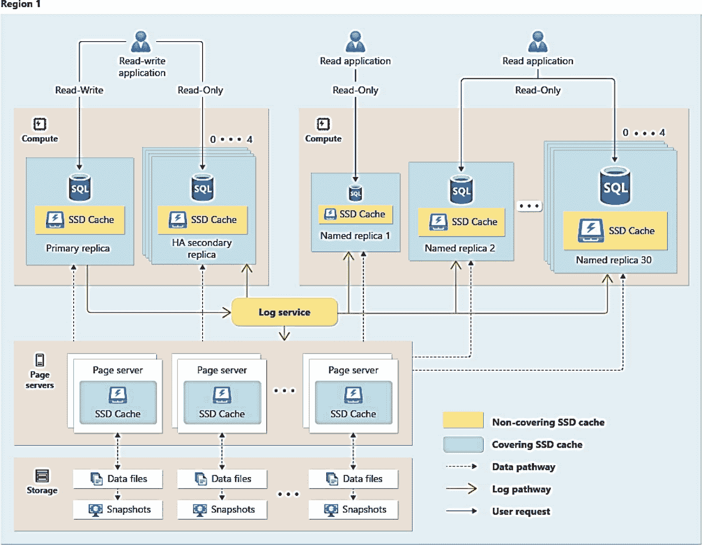

图 8-10. Hyperscale 可用性

`主计算节点` 是 Hyperscale 部署的主副本。Hyperscale 有零到四个辅助高可用性副本，表示为 `辅助计算节点`。我稍后会讨论副本的工作方式。主计算节点承载着你的数据库的 SQL Server 实例。这个 SQL Server 拥有标准组件，如用于托管数据库页面的缓冲池。此外，在这个主计算节点上，还有位于本地存储上的 `tempdb` 数据库以及一个 RBEX *缓存*。Hyperscale 中的缓存都是位于本地 SSD 存储上的文件。RBEX 代表弹性缓冲池扩展。它与缓冲池扩展相似，但并不完全相同（你可以在 [`https://learn.microsoft.com/sql/database-engine/configure-windows/buffer-pool-extension`](https://learn.microsoft.com/sql/database-engine/configure-windows/buffer-pool-extension) 阅读更多内容）。其概念是，如果一个查询需要一个数据库页面，而该页面不在缓冲池中，它将首先尝试从 RBEX 读取该页面。

如果一个页面在计算节点缓冲池或 RBEX 缓存中都不可用怎么办？我们部署了一组 `页面服务器`。页面服务器是装有 SQL Server 的节点，这些服务器在内存中托管数据库页面，并由另一个 RBEX 缓存覆盖。页面服务器是*成对*部署的，以实现冗余和高可用性。Azure SQL 会确定适当的页面服务器数量来支持部署和数据库大小。请记住，对于 Hyperscale，你无需选择最大的数据库大小。我们只是通过页面服务器和 Azure 存储来持续增长和扩展系统，以满足你的数据库大小需求。

提示

我们现在支持一种方法来收缩你的 Hyperscale 数据库以节省空间和成本。详情请见：[`https://techcommunity.microsoft.com/t5/azure-sql-blog/public-preview-shrink-for-azure-sql-database-hyperscale/ba-p/4181976`](https://techcommunity.microsoft.com/t5/azure-sql-blog/public-preview-shrink-for-azure-sql-database-hyperscale/ba-p/4181976)。

如果查询所需的数据库页面既不在计算节点上，也不在页面服务器上怎么办？支持你数据库的数据库文件存储在 Azure 标准存储中。为了最大化性能，这种架构在极少需要前往 Azure 存储检索数据库页面时效果最佳。当页面服务器首次启动时，它们会从 Azure 存储上的数据库文件中播种页面。然后，页面服务器将填充主节点（以及存在的辅助节点）上的 RBEX 缓存。如果一个页面不在主计算节点的缓冲池中，但我们在节点的 RBEX 缓存中找到了它，这被视为*缓存命中*。如果页面不在 RBEX 中，我们会尝试从页面服务器（或其 RBEX 缓存）获取页面，但这被视为*缓存未命中*。


## Azure SQL Hyperscale 架构

将数据库文件存放在 Azure Storage 上，对于 Hyperscale 的自动备份和时间点恢复有一个主要优势。由于数据文件在 Hyperscale 缓存系统预热后很少被访问，我们可以使用`snapshot backups`来备份数据库。此功能非常类似于使用 Azure 虚拟机的文件快照备份，详见[`https://learn.microsoft.com/sql/relational-databases/backup-restore/file-snapshot-backups-for-database-files-in-azure`](https://learn.microsoft.com/sql/relational-databases/backup-restore/file-snapshot-backups-for-database-files-in-azure)。快照备份对 Hyperscale 来说是一个巨大的优势，因为它们不影响应用程序操作，并且数据库的恢复速度极快。与其他 Azure SQL 选项一样，备份存储在与数据和日志文件分离的冗余存储上。

这个模型还有另一个部分尚未讨论。事务日志怎么办？Hyperscale 将事务日志 I/O 从主节点重定向到`Log Service`。计算节点仍然有日志缓存，但当需要 I/O 刷新日志记录时，它们会由 SQL Server 引擎引导到`Log Service`。`Log Service`在不同的节点上运行。它有自己的日志缓存（本地 SSD 存储）、使用 Azure Premium Storage 的日志存储（称为`landing zone`），以及使用 Azure Standard Storage 的冗余存储（称为`long-term log storage`）。我们永远不需要备份事务日志。快照备份和长期日志存储的结合可以用来恢复到某个时间点。

`Log Service`接收日志更改，然后将这些更改反馈给页面服务器和副本（如果存在）。这意味着，虽然 Hyperscale 使用日志更改来更新副本，但它并不使用`Always On Availability Groups`的底层技术来保持副本同步。

Hyperscale 的一个有趣方面是数据库页面 I/O。对于计算节点，脏页不会写入数据库文件。计算节点上的热页被写入`RBEX cache`，因此它们随时可用。页面服务器通过`Log Service`的日志更改进行更新。因此，任何类型的检查点 I/O 都从页面服务器发生到 Azure Storage 上的数据库文件。这非常好，因为它从计算节点卸载了任何数据库文件 I/O。

我之前提到过可以有零到四个辅助 HA 副本的概念。你可能想知道，零副本的架构如何支持内置高可用性？因为底层数据库和事务日志文件位于 Azure Storage 上（而不是本地存储），如果我们需要执行故障转移，只需预配一个新节点，数据将从底层页面服务器（由 Azure Storage 支持）同步。此外，与所有 Azure SQL 一样，启用了`Accelerated Database Recovery (ADR)`，因此当新的计算节点上线或辅助副本成为主节点时，恢复到一致状态的速度极快。Hyperscale 分布式架构的每个方面都是容错的。

如果我们预置了辅助副本，故障转移（与其他 Azure SQL 架构一样，与 Azure Service Fabric 集成）当然会更快，因为我们只需切换到其中一个节点成为新的主节点。此外，如果您的应用程序以只读意向连接数据库，Azure SQL 会在所有可用的辅助副本之间进行负载均衡。

除了四个 HA 副本，您最多还可以有 30 个`named replicas`。HA 副本可以使用`ApplicationIntent`连接字符串的`ReadOnly`属性用于读取工作负载。`Named replicas`专为读取扩展而设计（但不用于故障转移）。它们有自己唯一的数据库名称，并且是严格只读的，因此不需要特殊的连接字符串属性。您可以在[`https://learn.microsoft.com/azure/azure-sql/database/service-tier-hyperscale-replicas?view=azuresql#named-replica`](https://learn.microsoft.com/azure/azure-sql/database/service-tier-hyperscale-replicas?view=azuresql#named-replica)阅读更多关于如何使用命名副本的信息。

关于 Hyperscale 的一站式指南可以在[`https://aka.ms/hyperscale`](https://aka.ms/hyperscale)找到。

**提示**

请记住，由于 Hyperscale 的独特架构，部署后无法将服务层级更改为通用型或商业关键型。您必须导出数据并导入到新层级。如果您从通用型迁移到 Hyperscale，可以回退一次。这是一个“数据规模”操作，因此数据库越大，回退所需的时间就越长。

## 使用 Azure 扩展 HADR

虽然 Azure SQL 的内置可用性确实是您考虑迁移到云端的一个主要优势，但还有更进一步的方法，可以使用 Azure 构建更多的可用性和灾难恢复解决方案。

这包括区域冗余、异地复制、故障转移组和使用托管实例链接进行灾难恢复。此外，了解 Azure SQL 服务级别协议如何满足您的需求非常重要。这包括我们如何管理和限制某些活动，以及部署创新技术（如热修补）以最大化正常运行时间。


## 区域冗余

我在本书第 2 章提到过 Azure 生态系统的一些特性，包括区域和数据中心。为了实现`高可用性`，你可以利用的一项能力是通过`Azure 可用性区域`进行部署。对于 Azure SQL，我们称此功能为`区域冗余`。`可用性区域`是一个区域内独特的物理位置集合。该集合中的每个区域都由多个数据中心组成。区域冗余适用于`通用目的`（需额外付费）和`业务关键`（已包含）服务层级，适用于`Azure SQL 托管实例`和`Azure SQL 数据库`。请检查这些选项的区域可用性，因为它们可能并非在所有 Azure 区域都可用。此外，你也可以为`超大规模`启用区域冗余。本章前面讨论了备份冗余，包括区域冗余。本节重点讨论数据库和日志文件存储以及计算的冗余。

让我们来看看每个服务层级的架构，以及启用区域冗余后的样子。图 8-11 展示了启用了区域冗余的`通用目的`服务层级。

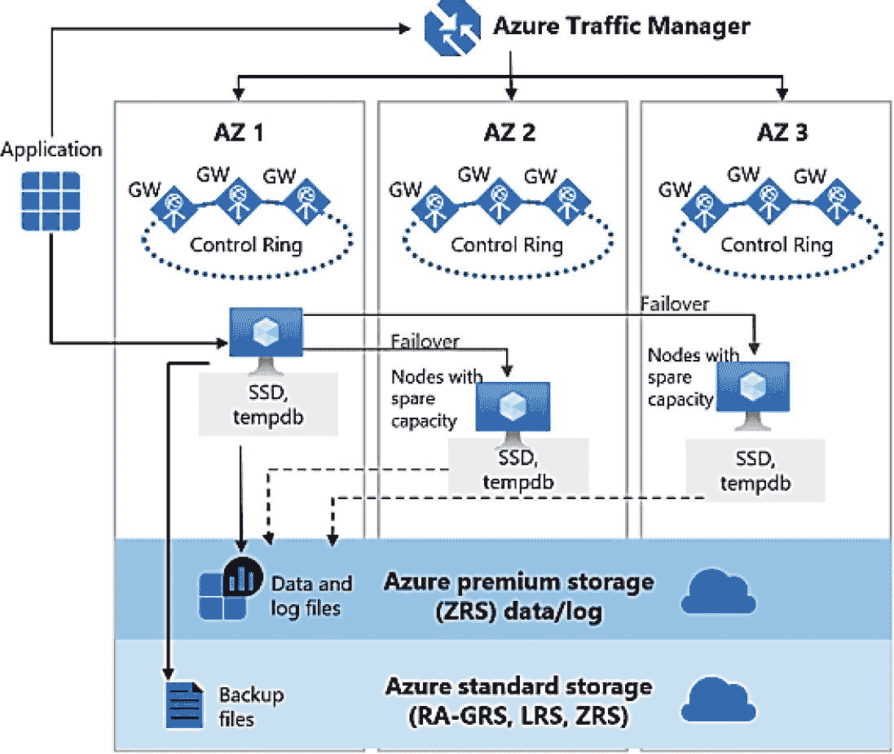

*图 8-11. 启用了区域冗余的通用目的服务层级*

首先，请注意数据和日志文件现在使用 Azure 的`区域冗余存储 (ZRS)`。这意味着这些文件在所有三个区域中同步（这可能会导致此操作出现轻微的性能下降）。在任何给定时间，数据库的`SQL Server`主副本或计算节点都位于特定区域。区域冗余允许 Azure 在发生故障转移时使用不同区域中的新节点。注意图的顶部，用于连接的网关也是区域冗余的，通过流量管理器进行路由。

`业务关键`服务层级部署现在看起来如图 8-12 所示。

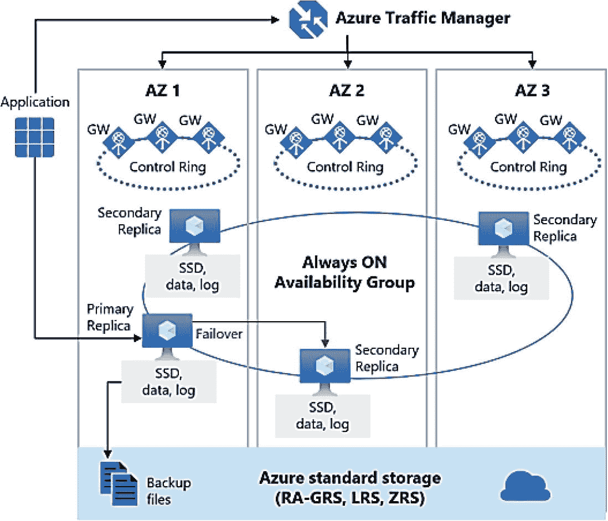

*图 8-12. 启用了区域冗余的业务关键服务层级*

从这张图中可以看到，业务关键层级的副本分布在各个区域，因此任何必要的故障转移都可以在不同的区域发生。存储在本地附属于每个副本。与通用目的层级一样，网关分布在各个区域，由流量管理器提供支持。

最后，图 8-13 展示了启用了区域冗余的`超大规模`架构。

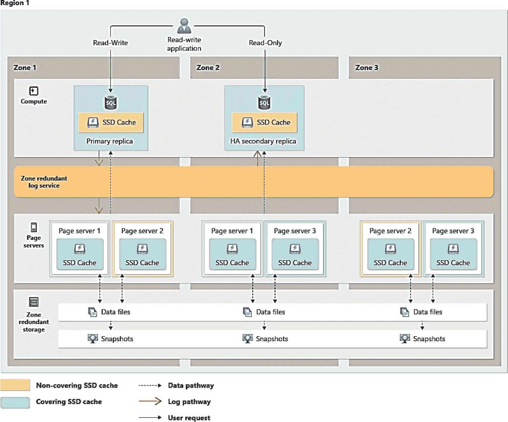

*图 8-13. 启用了区域冗余的超大规模架构*

从图 8-13 可以看到，副本、页面服务器、日志服务和数据文件都是区域冗余的。要使用区域冗余，你必须至少有一个`高可用性`副本。图 8-14 展示了如何在部署时为`超大规模`数据库启用区域冗余。

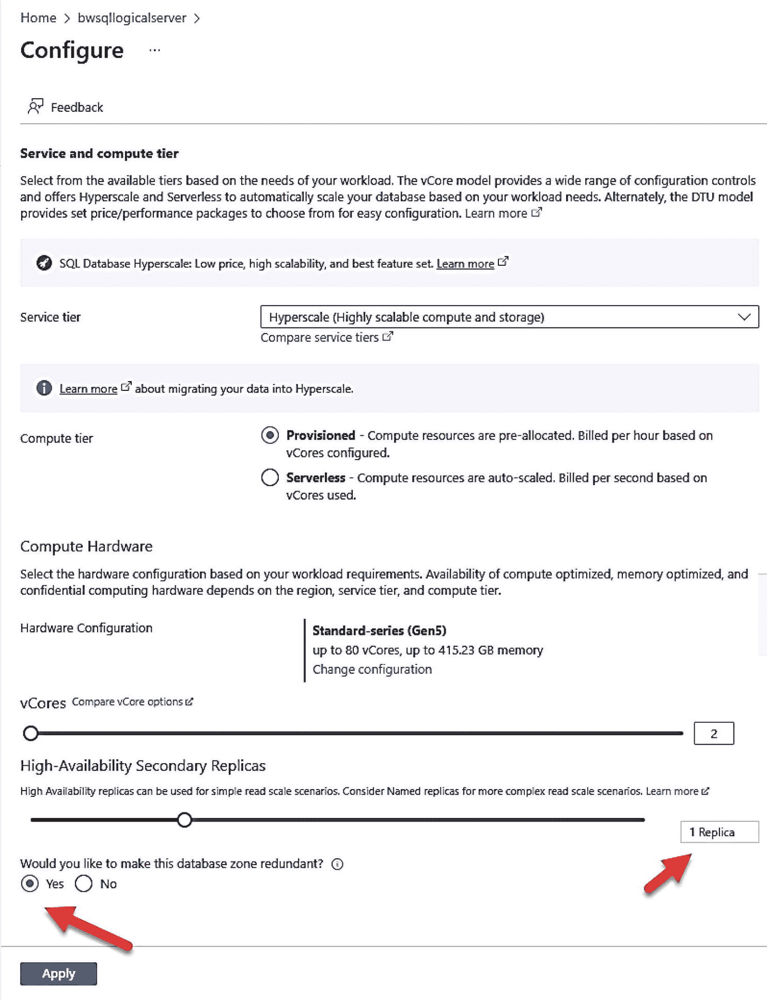

*图 8-14. 为超大规模启用区域冗余*

> **注意**
> 你只能在创建数据库时为`超大规模`选择区域冗余。如果为此选项选择`超大规模`，你的备份冗余必须是区域冗余的（或地理区域冗余的）。

## 地理复制

假设你想更进一步，使你的数据库具备*跨* Azure 区域的弹性。Azure SQL Database 支持一个称为`地理复制`的概念。地理复制使用`Always On 可用性组`技术将日志更改*异步*传输到不同逻辑服务器上的另一个 Azure SQL Database 部署。辅助数据库可以位于不同的 Azure 区域或同一 Azure 区域。辅助数据库可用于副本目的。

> **注意**
> 在同一区域使用地理复制的数据库可以为`通用目的`服务层级提供一个只读副本，或者为`业务关键`服务层级（默认情况下有一个副本）扩展副本数量。

地理复制的数据库可用于故障转移目的，包括应对意外的 Azure 区域事件，或支持以最小停机时间进行应用程序升级。但是，故障转移是一个手动过程，由管理员通过 Azure 界面或通过`T-SQL`（`ALTER DATABASE`）发起。

让我们看看如何为我在本书中部署和使用的一个名为`bwadw`的`超大规模`数据库，在另一个区域创建一个地理副本。

我将导航到 Azure 门户中的我的数据库，并在`数据管理`下选择`副本`，如图 8-15 所示。

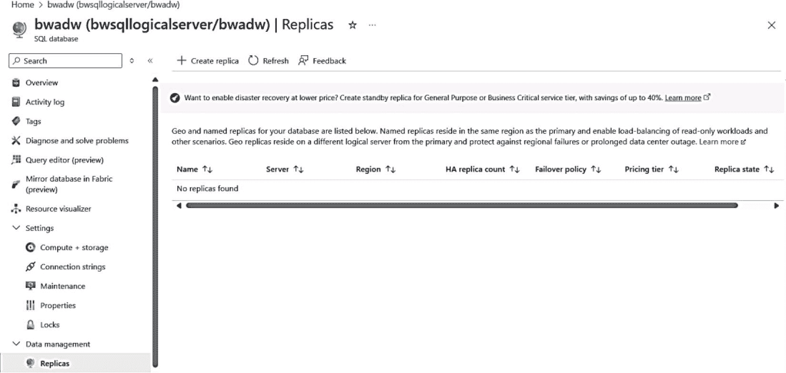

*图 8-15. 创建超大规模数据库的地理副本*

请注意屏幕顶部，正如本章前面提到的，如果我的源数据库使用`通用目的`或`业务关键`服务层级，我可以创建一个待机副本，如果副本是被动的，这可以节省成本。

我可以在此屏幕上选择`创建副本`，然后会出现一个与部署新数据库非常相似的屏幕。你可以在图 8-16 中看到我的一些选择。

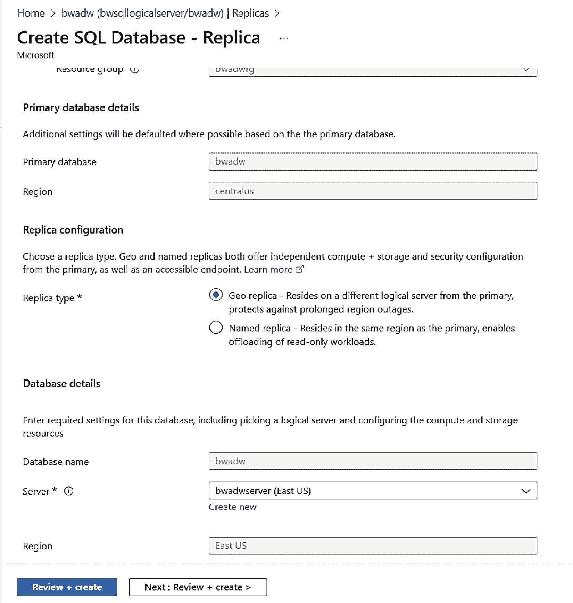

*图 8-16. 部署地理副本的详细信息*

我可以使用相同的体验来创建一个命名副本，正如我在本章前面提到的。请注意，我选择了一个不同区域的不同逻辑服务器作为部署位置，但数据库名称相同。地理复制的一个优点是数据库可以在同一区域，甚至位于同一逻辑服务器上。这是扩展`通用目的`服务层级部署的只读扩展场景，或者为`业务关键`服务层级部署（或者甚至是一个没有副本的`超大规模`数据库）提供额外只读副本的一个例子。

部署会创建一个与主数据库同名的新数据库，然后执行一个称为`播种`的初始同步操作。此操作完成后，你可以看到新辅助数据库的状态，如图 8-17 所示。

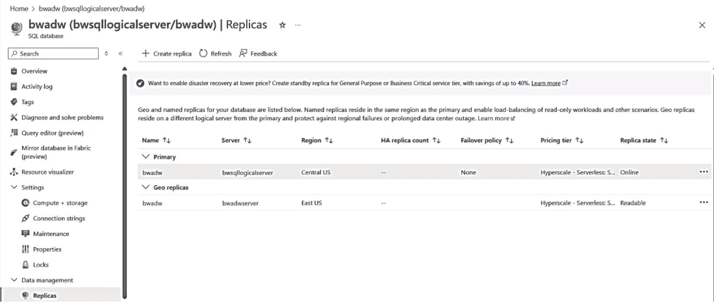

*图 8-17. 播种后的地理复制辅助数据库*

来自主数据库的任何更改都会*异步*发送到辅助数据库（以避免阻塞主数据库工作负载事务）。此外，我现在可以连接到`bwadwserver.database.windows.net`并对`bwadw`数据库执行读取操作。该数据库是只读的，因此任何修改操作都会失败。当我连接到地理复制的辅助数据库时，不需要任何特殊的连接字符串选项。Azure SQL 最多支持配置四个使用地理复制的辅助数据库。

> **提示**
> 允许你基于一个地理复制的辅助数据库创建地理辅助数据库，从而为你提供更多的只读副本。这称为*链式复制*，但要知道，你构建的链条越长，这些链式辅助数据库的数据同步延迟可能会越大。


## 灾难恢复与异地复制

异地复制数据库也可用于灾难恢复的故障转移目的。所有故障转移操作都是手动的。数据丢失情况取决于数据是否已同步到副本以及源数据库的可用性。有几种方法可以启动故障转移，包括 Azure 门户、az CLI、PowerShell 和 `ALTER DATABASE`。“计划内故障转移”（`FAILOVER`）要求源数据库可用，并且主副本和次要副本之间会发生数据同步。“强制故障转移”（`FORCED FAILOVER`）不会等待任何同步，也不要求源数据库可用。动态管理视图 `sys.dm_geo_replication_link_status` 可用于检查主副本和次要副本之间的数据同步状态。

应用程序可以使用 Azure 技术（如 Azure 流量管理器）来设置抽象层，以便在故障转移后仍能连接到主数据库。请从我们的文档中了解更多关于为全局 Azure SQL 数据库部署构建应用程序的信息：[`https://learn.microsoft.com/azure/azure-sql/database/designing-cloud-solutions-for-disaster-recovery`](https://learn.microsoft.com/azure/azure-sql/database/designing-cloud-solutions-for-disaster-recovery)。我们的文档 [`https://learn.microsoft.com/azure/azure-sql/database/active-geo-replication-overview`](https://learn.microsoft.com/azure/azure-sql/database/active-geo-replication-overview) 提供了一个很好的可视化示例，展示了完全部署了异地复制的 Azure SQL 数据库可能的样子，如图 8-18 所示。

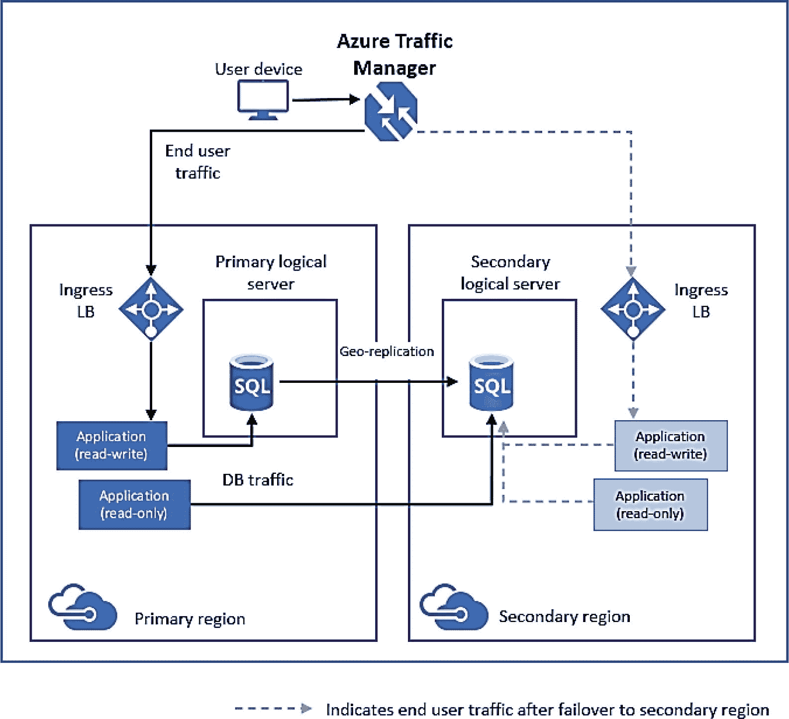
*图 8-18 使用异地复制完全部署的 Azure SQL 数据库*

使用异地复制时需要考虑的一些要点：
*   你可以稍作设置，将异地复制数据库部署到另一个 Azure 订阅中。了解更多：[`https://learn.microsoft.com/azure/azure-sql/database/active-geo-replication-overview?view=azuresql#cross-subscription-geo-replication`](https://learn.microsoft.com/azure/azure-sql/database/active-geo-replication-overview?view=azuresql#cross-subscription-geo-replication)。
*   主服务器上的服务器级防火墙规则不会被复制，因此请考虑使用数据库防火墙规则或其他方法连接到次要副本。
*   使用包含数据库用户（即使使用 Microsoft Entra）具有巨大优势，因为它们会被复制。
*   异地复制使用数据的异步复制。因此，如果你故障转移到次要副本，可能会遇到数据丢失（但不会不一致）。但是，如果你要求次要副本在故障转移前完全同步，可以使用存储过程 `sp_wait_for_database_copy_sync`。了解更多：[`https://learn.microsoft.com/azure/azure-sql/database/active-geo-replication-overview?view=azuresql#preventing-the-loss-of-critical-data`](https://learn.microsoft.com/azure/azure-sql/database/active-geo-replication-overview?view=azuresql#preventing-the-loss-of-critical-data)。
*   az CLI 支持创建和配置异地复制（例如 `az sql db replica`），并且存在支持异地复制的 PowerShell cmdlet（例如 `New-AzSqlDatabaseSecondary`）。

### 故障转移组

SQL Server 中的 Always On 可用性组支持*组*的概念，该组是数据库的集合，作为故障转移的单位。**故障转移组**在 Azure SQL（包括 Azure SQL 托管实例和 Azure SQL 数据库）中提供了相同的概念。

图 8-19 展示了 Azure SQL 数据库故障转移组的架构（你也可以在 [`https://learn.microsoft.com/azure/azure-sql/managed-instance/failover-group-sql-mi?view=azuresql#failover-group-architecture`](https://learn.microsoft.com/azure/azure-sql/managed-instance/failover-group-sql-mi?view=azuresql#failover-group-architecture) 查看 Azure SQL 托管实例故障转移组的架构）。

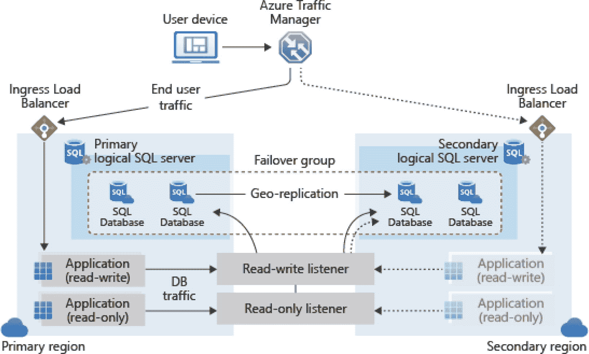
*图 8-19 Azure SQL 数据库的故障转移组*

请注意，与异地复制不同，故障转移组在逻辑服务器级别操作（然后你将数据库放入故障转移组中）。

在此图中请注意，异地复制用于将组中的任何数据库复制到次要副本。此外，提供了两个监听器，用于将应用程序与连接到主副本（读写）和次要副本（只读）抽象开。在此架构中，你可以将应用程序构建为容错的，并使用 Azure 流量管理器来平衡工作负载（你需要实现 Azure 流量管理器解决方案）。

让我们为 Azure SQL 数据库在另一个区域构建一个故障转移组，使用本书中一直使用的逻辑服务器 `bwsqllogicalserver`。我将首先在 Azure 门户中导航到我的逻辑服务器，并从服务菜单中选择“故障转移组”，如图 8-20 所示。

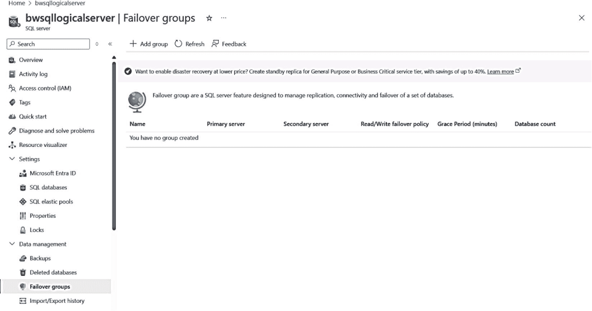
*图 8-20 为逻辑服务器创建故障转移组*

现在我将选择“添加组”来创建故障转移组。你可以在图 8-21 中看到我创建新组的选项。

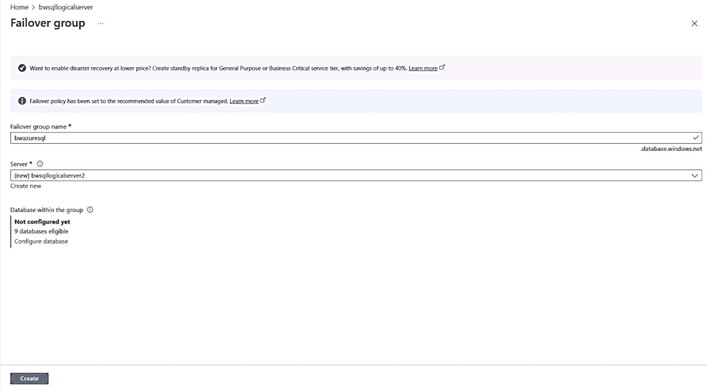
*图 8-21 创建故障转移组的详细信息*

首先，我需要为组提供一个名称。这成为组的逻辑名称，用于读写和只读连接（非常类似于 Always On 可用性组的监听器）。

我还提供了在新区域中定义新逻辑服务器的信息（它也可以是现有的逻辑服务器，但必须在另一个区域）。

现在我可以通过单击“配置数据库”来选择要添加到组中的数据库。我现在会得到一个如图 8-22 所示的屏幕。

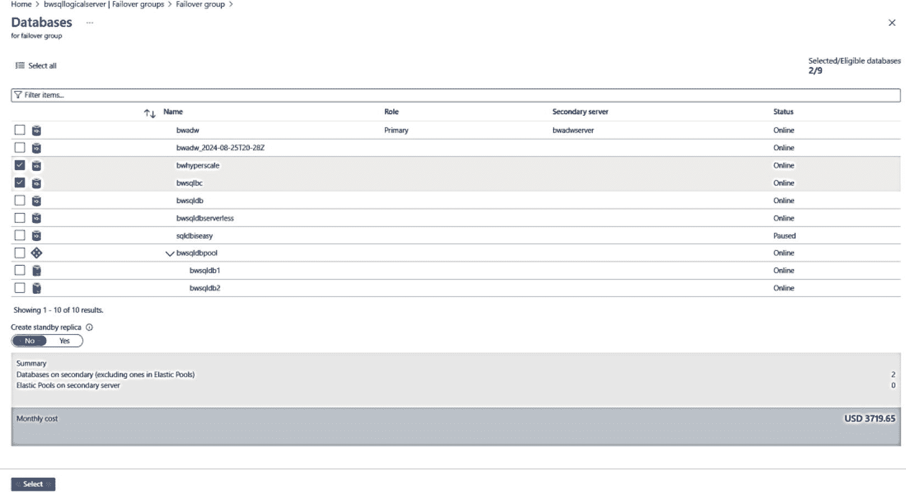
*图 8-22 选择数据库和故障转移组*

我选择了两个已部署的数据库加入该组。这里是故障转移组很酷的部分。这些数据库无需配置相同即可加入组。在此示例中，我选择了“业务关键”服务层级和一个“超大规模”数据库。请注意，我可以选择使这些成为备用副本，当你做出此选择时，可以看到你的成本估算会减少。我将此项保留为“否”并单击“选择”。

我选择了“创建”，这会触发故障转移组的新部署。当部署完成（包括类似异地复制的初始化）后，图 8-23 显示了更新后的故障转移组状态屏幕。

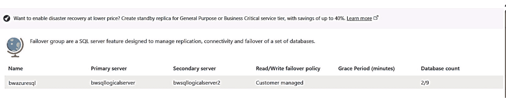
*图 8-23 部署后的故障转移组*

请注意，“读/写故障转移策略”显示为“客户管理”。有两种类型的故障转移策略：


