# Azure SQL 故障转移组与托管实例链接

## 故障转移组策略

*   **客户管理（推荐且默认）** – 当客户发现影响故障转移组中一个或多个数据库的意外中断时，可以执行故障转移。使用 PowerShell、Azure CLI 或 REST API 等命令行工具时，客户管理策略的值为 `manual`。
*   **Microsoft 管理** – 当发生影响主要区域的大范围中断时，Microsoft 会启动所有配置为 Microsoft 管理策略的受影响故障转移组的故障转移。Microsoft 管理的故障转移不会针对单个故障转移组或某个区域内的部分故障转移组启动。使用 PowerShell、Azure CLI 或 REST API 等命令行工具时，Microsoft 管理策略的值为 `automatic`。

> **注意**
> 此功能在本书第一版中称为自动故障转移组，因为默认策略是自动故障转移。过去几年我们了解到，通过管理故障转移流程能为客户提供最佳保护，因此名称和策略类型有所更改。
>
> 你可以在 [Microsoft 文档](https://learn.microsoft.com/azure/azure-sql/managed-instance/failover-group-sql-mi?view=azuresql#failover-policy) 阅读有关故障转移组策略的所有详细信息。

如果你点击故障转移组，会看到一个非常漂亮的全局地图可视化界面，其中包含管理故障转移组的选项以及主服务器和只读副本的连接信息，如图 8-24 所示。

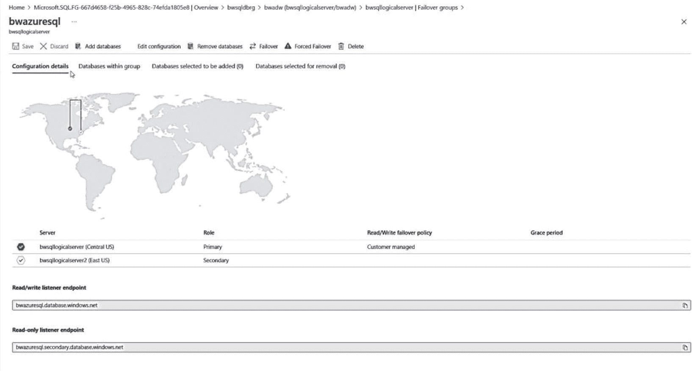

**图 8-24**

在 Azure 门户中配置和管理故障转移组

从这个屏幕中，你可以看到故障转移组逻辑服务器位置的可视化地图以及主副本和辅助副本的详细信息。下方是新的端点（这些将成为你的新逻辑服务器名称），用于连接读写或只读工作负载。

在顶部，你可以向组中添加或删除数据库，或启动计划内或强制故障转移。

以下是有关 Azure SQL 故障转移组的其他几个要点：

*   故障转移组也可以使用 PowerShell（`Add-AzSqlDatabaseToFailoverGroup` 和 `Switch-AzSqlDatabaseFailoverGroup`）进行管理。
*   因为故障转移组在使用异步复制数据时发生自动故障转移，所以可能发生数据丢失。因此，如果你要求故障转移组零数据丢失，应用程序可以在提交事务后调用 `sp_wait_for_database_copy_sync` 存储过程以确保所有数据已同步。更多信息请访问 [Microsoft 文档](https://learn.microsoft.com/azure/azure-sql/database/failover-group-sql-db?view=azuresql&tabs=azure-powershell#preventing-the-loss-of-critical-data)。
*   你可以为 Microsoft 管理的故障转移策略配置的一个选项称为宽限期，使用 `GracePeriodWithDataLossHours` 参数（默认值为一小时）。此参数定义了当主节点宕机且我们相信可能发生数据丢失时，执行自动故障转移前的等待时间。如果未发生数据丢失，则会立即执行自动故障转移。

故障转移组的一个重要限制涉及系统数据库。系统数据库不会被复制。因此，任何实例级数据，如 SQL Server Agent 作业，都必须在辅助实例上手动创建。

## 使用托管实例链接进行灾难恢复

随着 SQL Server 2022 的发布，我们宣布了一种利用云进行灾难恢复的新方法。我称之为托管的灾难恢复。我记得在 2022 年秋天与达拉斯的一位客户交谈。他们向我讲述了一个悲伤的故事：一位管理其 DR 站点的员工已离职。不幸的是，他们没有关于该站点以及如何管理的文档或详细信息。在我解释了我们的托管灾难恢复方案后，这位客户对我说：“给我报名！”

此功能包含在一个名为使用托管实例链接进行灾难恢复的能力中。你已在本书前面了解到如何使用托管实例链接进行迁移。

图 8-25 展示了如何将其用于离线和在线灾难恢复。

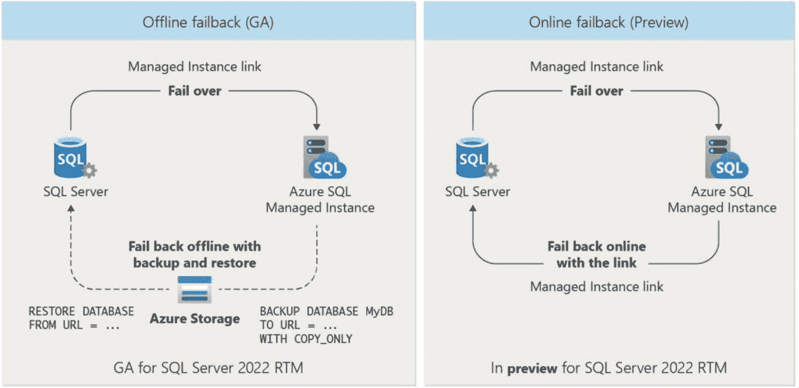

**图 8-25**

使用托管实例链接进行灾难恢复

让我们更详细地看一下这两种场景及其工作方式。

### 离线灾难恢复

利用版本化的 Azure SQL 托管实例，你可以在 SQL Server 2022 和该实例之间创建链接。在后台，使用了可用性组技术（即使你在 SQL Server 2022 上没有 AG，包括标准版），类似于分布式可用性组（DAG）。创建链接会将数据库从 SQL Server 2022 种子化到已部署的托管实例。

更改现在会自动（异步）从 SQL Server 发送到托管实例。如果你想故障转移到托管实例，可以选择计划内故障转移（必须确保数据已同步）或强制故障转移。一旦故障转移，托管实例将成为“读写”主副本。如果你想回退，可以在托管实例上执行 `COPY_ONLY` 备份到 Azure Storage，然后将其还原回 SQL Server 2022。现在 SQL Server 可以再次成为主副本。此技术被认为是离线的，因为 SQL Server 2022 重新上线所需的时间就是还原完整数据库备份所需的时间。

### 在线灾难恢复

离线场景是 SQL Server 2022 发布时作为公共预览版发布的内容，现已正式发布。在本书撰写时，一个预览版新方法可以将 SQL Server 2022 和托管实例设置为故障转移伙伴，就像真正的分布式可用性组（DAG）一样。在此场景中，你可以像在离线场景中一样故障转移到托管实例。但故障转移更像是“角色切换”。这样，任何切换都是在线操作，因为切换操作发生前只需将很少的更改同步到辅助副本。一旦切换到托管实例，你可以再切换回 SQL Server 2022。

在这两种场景中，如果主节点离线，你总是可以强制故障转移到辅助副本，但需知道可能会发生数据丢失。为什么我在本节开始时称此功能为托管灾难恢复？因为你的灾难恢复站点（即 Azure SQL 托管实例）由 Microsoft 管理。你有可用性的 SLA 以及自动备份。没有人需要灾难恢复站点直到……灾难发生，但知道它总是在需要时可用并准备好，这难道不是很好吗？

请访问 [Microsoft 文档](https://learn.microsoft.com/azure/azure-sql/managed-instance/managed-instance-link-feature-overview?view=azuresql#disaster-recovery) 开始使用托管实例链接进行灾难恢复。


### Azure SQL SLA（服务级别协议）

部署 Azure SQL 托管实例和数据库的 SQL Server 的优势之一是其高可用性保证。我在本章描述的架构有助于实现这一承诺。该承诺以**服务级别协议 (SLA)** 的形式为您提供。您可以查看 Azure SQL 的官方 SLA：[`https://azure.microsoft.com/support/legal/sla/sql-database`](https://azure.microsoft.com/support/legal/sla/sql-database)。

Azure SLA 意味着微软将确保我们维持一定的**服务级别**，否则您的账户将有资格获得信用额度。服务级别以“九”的形式表示，即您部署的可用性保证百分比。

例如，如果您部署具有“业务关键型”或“高级”服务层级的 Azure SQL 数据库并使用区域冗余，您的 SLA 为 99.995%。如果查看像 [`https://en.wikipedia.org/wiki/High_availability`](https://en.wikipedia.org/wiki/High_availability) 这样的表格，您会看到 99.995% 被定义为“四个九”，意味着您每年最多可能经历 26.30 分钟或每月 2.19 分钟的*停机时间*。其他部署选项具有不同的服务级别承诺。

如果查看我们的 SLA 文档，停机时间定义为“…在给定的 Microsoft Azure 订阅中，所有数据库累积的部署分钟总数，在此期间数据库不可用。如果在一分钟内，客户尝试建立到该数据库的所有连续连接尝试均失败，则该分钟被视为对给定数据库不可用。”

Azure SQL 的某些特性使我们能够做出这些 SLA 承诺，包括但不限于：

*   内置可用性及与 Azure Service Fabric 的集成
*   强制实施资源限制，例如日志治理
    > **注意**
    >
    > 有多种原因说明 PaaS 服务需要日志治理。这包括数据库可恢复性、高可用性、灾难恢复和可预测的性能。了解更多：[`https://azure.microsoft.com/blog/resource-governance-in-azure-sql-database/`](https://azure.microsoft.com/blog/resource-governance-in-azure-sql-database/)。
*   启用数据库选项，如加速数据库恢复 (Accelerated Database Recovery)。

我们在 Azure SQL 中用于最大化可用性的一项创新技术是**热修补 (hot patching)**。热修补允许我们在不重启 SQL Server 的情况下修补 SQL Server 引擎代码。阅读关于热修补的精彩故事：[`https://azure.microsoft.com/blog/hot-patching-sql-server-engine-in-azure-sql-database/`](https://azure.microsoft.com/blog/hot-patching-sql-server-engine-in-azure-sql-database/)。

## 数据库可用性与一致性

对于 SQL Server，您可能熟悉用于实现或限制数据库可用性或执行高级恢复场景的功能和工具。此外，SQL Server 提供了工具来确保数据库从物理和逻辑角度保持一致。

通常，Azure SQL 在这方面不提供相同水平的高级功能，主要是因为服务内置的高冗余和可用性水平使得这些功能并非必需。

让我们研究一下其中的几个领域，以便在与 SQL Server 比较时，您的知识更加完整。

### 数据库可用性

您可能曾需要在 SQL Server 中使用 `ALTER DATABASE` 将数据库状态更改为 `OFFLINE` 或 `EMERGENCY` 以进行高级恢复场景。您无权使用这些选项，但在了解了 Azure SQL 的所有内置功能和我们的 SLA 之后，您不禁要问，这重要吗？在我看来（相信我，多年来我在支持工作中曾使用这些选项帮助过客户），答案是否定的。

对于 Azure SQL 数据库和托管实例，虽然您不能将数据置于单用户模式，但 Azure SQL 数据库允许您使用 `RESTRICTED_USER` 选项。了解更多：[`https://learn.microsoft.com/sql/t-sql/statements/alter-database-transact-sql-set-options`](https://learn.microsoft.com/sql/t-sql/statements/alter-database-transact-sql-set-options)。

在 SQL Server 2005 年，我和我的同事 Robert Dorr 在微软支持部门工作，我们说服了工程团队创建一种连接到“挂起服务器”的简单方法。结果就是专用管理员连接 (DAC) 功能。Azure SQL *支持* DAC。了解更多：[`https://learn.microsoft.com/sql/database-engine/configure-windows/diagnostic-connection-for-database-administrators`](https://learn.microsoft.com/sql/database-engine/configure-windows/diagnostic-connection-for-database-administrators)。

### 加速数据库恢复 (ADR)

在我的书《SQL Server 2019 Revealed》中，我介绍了加速数据库恢复 (ADR) 的精彩故事。SQL Server 管理员再也不必担心长时间的数据库恢复或失控的事务日志。ADR 不仅仅是一个功能；它是 Azure SQL 可用性故事的一部分！事实上，对于 Azure SQL，它只是引擎的一部分，并非真正需要您开启或关闭的东西。您可以在我们的文档 [`https://learn.microsoft.com/azure/azure-sql/accelerated-database-recovery`](https://learn.microsoft.com/azure/azure-sql/accelerated-database-recovery) 或我们工程团队撰写的白皮书 [`https://aka.ms/sqladr`](https://aka.ms/sqladr) 中了解更多关于 ADR 工作原理的信息。

### 数据库一致性

所有 Azure SQL 数据库都使用 `CHECKSUM` 选项进行配置以确保数据库一致性。使用 PaaS 服务的好处之一是，我们的工程团队拥有自动化流程来检查因校验和问题等问题导致的任何不一致，并采取纠正措施。例如，如果您部署的是“业务关键型”服务层级，我们可以发出在线自动页面修复（了解更多关于其工作原理的信息：[`https://learn.microsoft.com/sql/sql-server/failover-clusters/automatic-page-repair-availability-groups-database-mirroring`](https://learn.microsoft.com/sql/sql-server/failover-clusters/automatic-page-repair-availability-groups-database-mirroring)）。

此外，如果您担心任何数据库一致性问题，请记住以下事实：

*   “常规用途”和“超大规模”层级将数据库和日志文件存储在 Azure 存储上，默认情况下有三个副本进行镜像。
*   “业务关键型”层级始终有三个其他副本可用，并拥有自己的存储。
*   我们的工程团队在我们的服务中内置了数据完整性和一致性警报监控。如果自动化无法解决问题，我们将直接通知客户并采取必要步骤以确保数据恢复和一致性。如果我们认为可以在无数据丢失的情况下修复问题，我们可能会采取此操作，而您可能永远无需被通知。
*   Azure SQL 支持 `DBCC CHECKDB`（但不支持修复选项），以便您随时手动检查数据库一致性。
*   我们增加了针对数据库的“丢失写入”和“过时读取”检测的检查，我们在某些情况下发现这可能是由于底层 I/O 系统问题造成的。

我在第 1 章作为 Azure SQL 历史一部分提到的微软副总裁 Peter Carlin，有一篇很好的博文概述了我们在 Azure 中为管理数据库数据完整性所做的一切。阅读他的文章：[`https://azure.microsoft.com/blog/data-integrity-in-azure-sql-database`](https://azure.microsoft.com/blog/data-integrity-in-azure-sql-database/)。


## 监控可用性

与任何功能集一样，您无疑会希望监控 Azure SQL 各方面的可用性。这包括服务器和实例可用性、数据库可用性、备份/恢复历史记录、副本状态以及故障转移原因。此外，由于 Azure SQL 运行在 Azure 生态系统中，了解区域和数据中心中 Azure 服务的状态和健康状况也可能很重要。

Azure SQL 为您提供了与 SQL Server 类似的监控可用性的接口，包括目录视图、动态管理视图和扩展事件。此外，Azure 门户、`az` CLI、PowerShell、数据库监视器和 Copilot 等 Azure 接口还提供了额外的功能来监控您部署的可用性。

让我们深入了解使用这些接口和监控功能的几个示例。

### 实例、服务器和数据库可用性

除了影响 Azure 服务的事件外，您可以通过 Azure 门户查看 Azure SQL 托管实例或 Azure SQL 数据库的可用性。查看托管实例或数据库不可用的一个可能原因的主要方法之一是通过 Azure 门户检查 `资源运行状况`。您将在本章的这一主要部分稍后看到此场景的示例。

您始终可以使用标准的 SQL Server 工具，如 SQL Server Management Studio，连接到托管实例或数据库服务器，并通过该工具或 T-SQL 查询检查这些资源的状态。

此外，`az` CLI 等接口可以显示 Azure SQL 的状态，例如

*   `az sql mi list` – 列出托管实例的状态
*   `az sql db list` – 列出 Azure SQL 数据库的状态

也可以使用 PowerShell 命令来查明 Azure SQL 数据库的可用性，例如

*   `Get-AzSQLDatabase` – 获取服务器上的所有数据库及其详细信息，包括状态

**注意**

对于 SQL Server，我经常查看过去的 `ERRORLOG` 文件或 `system_health` XEvent 会话文件，以了解服务可用性和运行状况。Azure SQL 托管实例支持这些工具。但是，这些文件不会复制到副本，因此如果发生故障转移，这些文件的历史记录将会丢失。

### 备份和恢复历史记录

Azure SQL 会自动备份数据库和事务日志。对于 SQL Server，使用 `msdb` 系统表查看备份历史记录是非常常见的做法。您也可以在 Azure SQL 托管实例中执行此操作，使用如下查询：

```sql
SELECT database_name, case when type = 'D' then 'Full' when type = 'I' then 'Differential' when type = 'L' then 'Log' end as type,
has_backup_checksums, backup_size, compressed_backup_size, backup_start_date, backup_finish_date
FROM msdb.dbo.backupset
ORDER BY backup_finish_date DESC;
GO
```

我的实例已经运行了一段时间，所以我向下滚动以查看较早的结果，这些结果如图 8-26 所示。

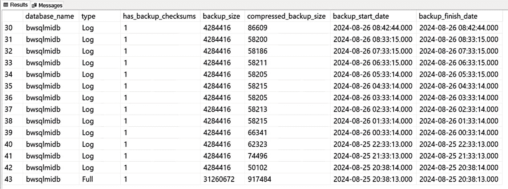

图 8-26

托管实例自动备份的较早结果

这些结果显示了我创建的一个用户数据库，但它会显示为该实例创建的任何用户数据库（它不显示系统数据库备份）。请注意，第一个结果是完整备份，然后是一系列日志备份。滚动到结果顶部，您可以看到其他类型的备份，如图 8-27 所示。

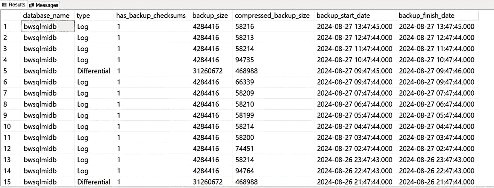

图 8-27

托管实例自动备份的最新结果

可以通过 Azure 门户或 CLI 接口查看长期备份保留历史记录。了解更多信息，请访问 [`https://learn.microsoft.com/azure/azure-sql/database/long-term-backup-retention-configure`](https://learn.microsoft.com/azure/azure-sql/database/long-term-backup-retention-configure)。

此外，Azure SQL 托管实例支持使用 XEvents 来跟踪备份历史记录。有关如何执行此操作的博客文章，请参阅 [`https://techcommunity.microsoft.com/t5/azure-database-support-blog/lesson-learned-128-how-to-track-the-automated-backup-for-an/ba-p/1442355`](https://techcommunity.microsoft.com/t5/azure-database-support-blog/lesson-learned-128-how-to-track-the-automated-backup-for-an/ba-p/1442355)。

使用时间点恢复恢复的任何数据库都会创建一个新数据库，因此恢复历史记录可以视为查看新数据库的创建。所有创建新数据库的操作都可以通过 Azure 活动日志查看。

`msdb` 备份历史记录不适用于 Azure SQL 数据库，但有一个名为 `sys.dm_database_backups` 的 DMV 可用。我在我的一个 Azure SQL 数据库上运行了此查询（不提供备份大小详细信息）：

```sql
SELECT logical_database_name, case when backup_type = 'D' then 'Full' when backup_type = 'I' then 'Differential' when backup_type = 'L' then 'Log' end as backup_type_desc, backup_start_date, backup_finish_date, in_retention
FROM sys.dm_database_backups
ORDER BY backup_finish_date DESC;
GO
```

对于我的业务关键服务层数据库，较早的结果如图 8-28 所示。

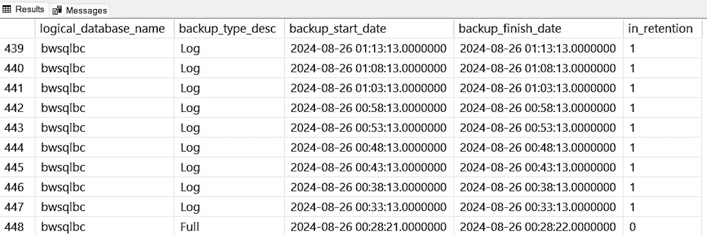

图 8-28

Azure SQL 数据库自动备份的较早结果

在备份历史记录视图中保留和显示的备份取决于配置的备份保留期。保留期之前的备份（`in_retention = 0`）也会显示在 `sys.dm_database_backups` 视图中。它们是在配置的保留期内进行时间点恢复所必需的。

向上滚动，我可以看到最新的结果，如图 8-29 所示，其中包括日志和差异备份。

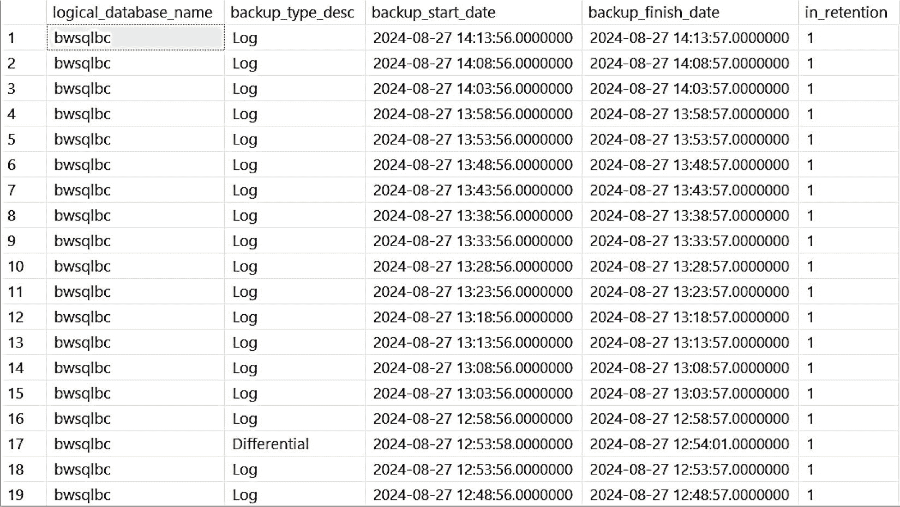

图 8-29

Azure SQL 数据库自动备份的顶部结果

**提示**

我们新的 `Copilot` 也可以用于查找有关备份的信息，例如使用提示 "`我的数据库最近一次备份是什么时候创建的？`"


## 区域、数据中心和服务可用性

要获取 Azure 区域和数据中心的全局状态视图，可以使用 `Azure 状态` 仪表板，您可以在 [`https://status.azure.com`](https://status.azure.com) 找到它。图 8-30 展示了一个带有“当前影响”默认视图的 Azure 状态仪表板示例。

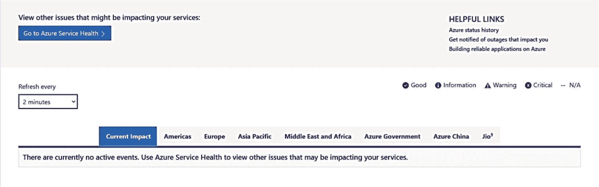

图 8-30

当前影响的 Azure 状态仪表板

Azure 状态可以显示任何 Azure 区域中所有 Azure 服务的状态。此状态显示了所有服务，与您是否使用特定服务无关。在此视图中我选择了“美洲”，您可以在图 8-31 中看到结果。

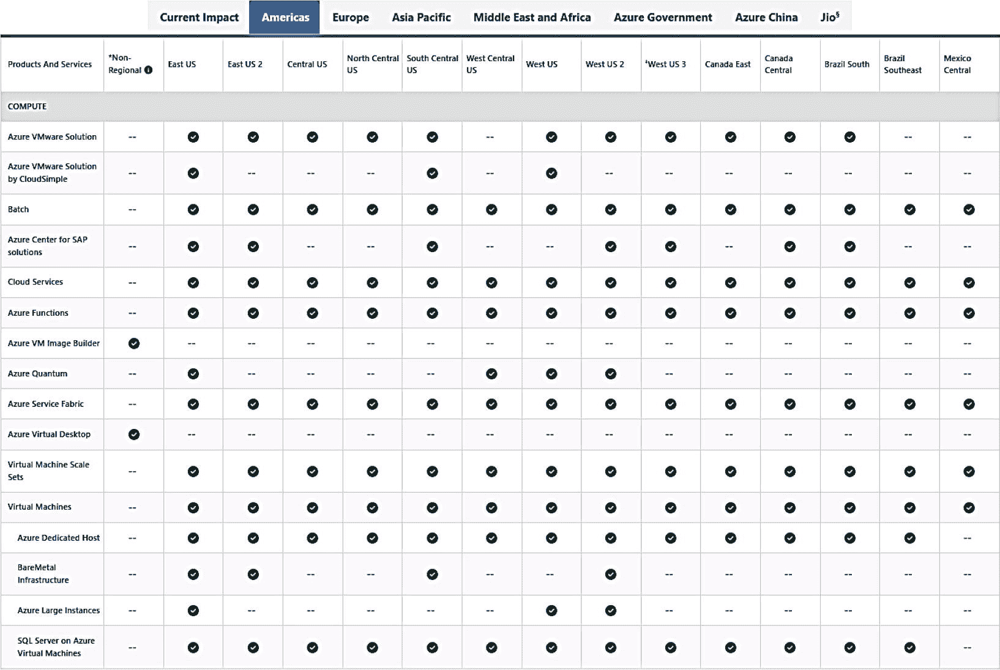

图 8-31

美洲地区的 Azure 服务状态

这是一个很长的表格，您可以向下滚动查看任何服务的状态。任何标有“–”的服务意味着该服务在该区域不可用。

要获取 Azure 状态通知，您可以使用页面顶部的 RSS 源。此外，您可以通过 Azure 状态历史记录（[`https://status.azure.com/status/history`](https://status.azure.com/status/history)）查看 Azure 状态的完整历史。

您还可以通过 Azure 门户中名为 `Azure 服务运行状况` 的功能，获取与您的订阅特定的 Azure 服务运行状况的更多信息。通过 `服务运行状况`，您可以查看 Azure 服务的当前问题、可能影响可用性的计划维护以及运行状况历史记录。在您的门户顶部搜索 `服务运行状况` 或在仪表板上找到它。当我选择此项并选择“运行状况历史记录”时，您可以在图 8-32 中看到我的结果。

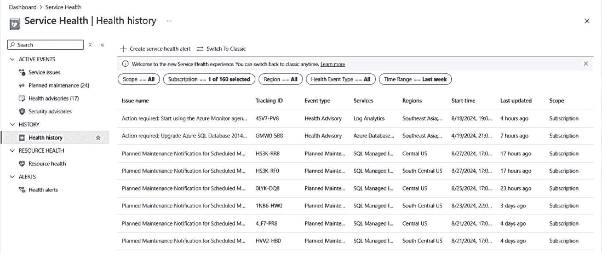

图 8-32

Azure 服务运行状况历史记录

这里的事件包括可能解决未来问题的建议和计划的维护操作。在服务菜单上，您可以看到查看当前服务问题或为计划维护等主题设置警报的选项。

## 可用性指标

假设您希望以更精细的级别跟踪 Azure SQL 数据库的可用性，以查看其是否符合承诺的 SLA。如您在图 8-33 中所见，门户中的 Azure 指标提供了一种新方法。

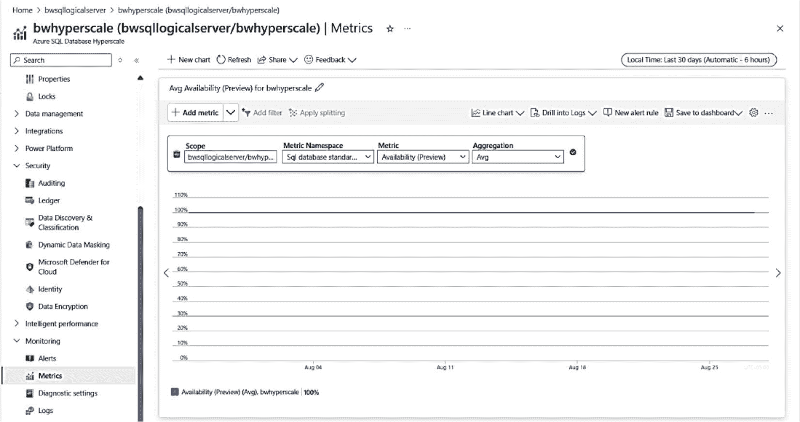

图 8-33

Azure 门户中的可用性指标

我将时间间隔更改为过去 30 天，但此值也可以通过日志检索更长时间的历史记录。此外，与其他 Azure 指标一样，您可以设置警报以查看此值是否从 100% 发生变化。我们的计算基于详细连接指标的平均值组合。更多信息请访问 [`https://learn.microsoft.com/azure/azure-sql/database/monitoring-metrics-alerts?view=azuresql#availability-metric`](https://learn.microsoft.com/azure/azure-sql/database/monitoring-metrics-alerts?view=azuresql#availability-metric)。

如果我不了解这个新指标，并想看看我们新的 Copilot 是否能提供帮助，该怎么办呢？我使用了提示词“过去 30 天内这个数据库的可用性如何？”，并得到了如图 8-34 所示的回复。

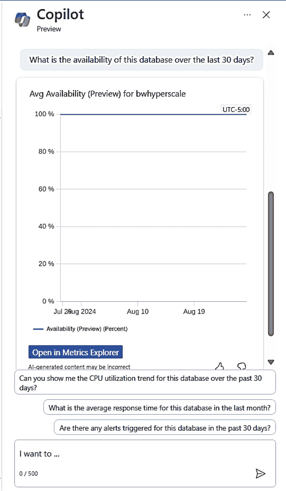

图 8-34

Copilot 显示我的数据库的可用性指标

## 副本状态

要监控 Azure SQL 中副本的状态，您可以使用 DMV `sys.dm_database_replica_states`。例如，此 DMV 可用于查看业务关键服务层的副本状态。您也可以使用此 DMV 来检查具有异地复制或故障转移组的部署的副本状态。

对于本章中我部署的名为 `bwsqlbc` 的数据库，我可以使用 SSMS 连接到此数据库并运行以下 T-SQL 语句：

```
SELECT is_primary_replica, synchronization_state_desc, synchronization_health_desc, last_received_time, last_redone_time
FROM sys.dm_database_replica_states;
GO
```

我从此数据库中得到了结果，如图 8-35 所示。

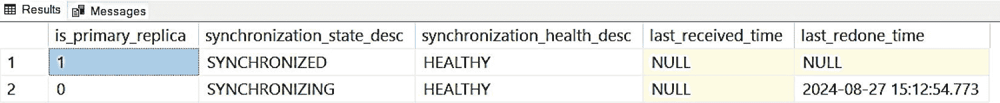

图 8-35

使用业务关键层的 Azure SQL 数据库的副本状态

对于异地复制和故障转移组，还有其他 DMV 可用于检查逻辑服务器和实例之间的复制状态。这包括 `sys.geo_replication_links`（在逻辑主数据库上下文中运行）和 `sys.dm_geo_replication_link_status`（在用户数据库上下文中运行）。使用这些 DMV 的一个例子是种子设定（地理辅助数据库的初始同步）。`sys.geo_replication_links` 可以显示种子设定进程在进行中及完成时的状态。

在本章中，我配置了一个故障转移组。让我们连接到故障转移组服务器，看看这些 DMV 的样子：

我在其中一个数据库的上下文中连接到故障转移组服务器 `bwazuresql.database.windows.net`，并运行了以下 T-SQL 语句：

```
SELECT partner_server, partner_database, replication_lag_sec, replication_state_desc, role_desc
FROM sys.dm_geo_replication_link_status;
GO
```

我得到了如图 8-36 所示的结果。


图 8-36

故障转移组副本状态

`replication_state_desc` = CATCHUP 表示服务器已同步。

您可以在 [`https://learn.microsoft.com/sql/relational-databases/system-dynamic-management-views/sys-dm-geo-replication-link-status-azure-sql-database`](https://learn.microsoft.com/sql/relational-databases/system-dynamic-management-views/sys-dm-geo-replication-link-status-azure-sql-database) 查看 `sys.dm_geo_replication_link_status` 的完整文档。

所有这些用于检查副本状态的 DMV 都适用于 Azure SQL 托管实例和数据库。az CLI 可用于检查副本状态 (`az sql db replica`)。PowerShell cmdlet 支持检查副本状态，例如 `Get-AzSqlDatabaseReplicationLink`。

查看异地复制数据库状态的另一种方法是使用数据库监视器。我在第 7 章中设置了数据库监视器来跟踪数据库 `bwadw`。我还在本章中为此数据库设置了异地复制。我可以使用数据库监视器获取有关异地复制状态的更多详细信息，如图 8-37 所示。

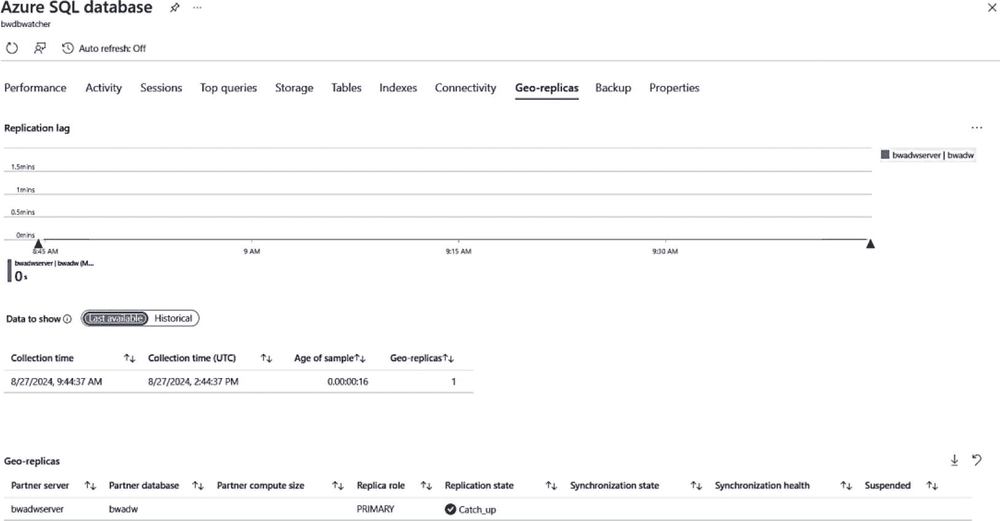

图 8-37

使用数据库监视器查看异地复制数据库状态


### 故障转移原因

对于 Azure SQL 托管实例和数据库，发生故障转移的原因多种多样，包括计划内和计划外的。由于故障转移的原因可能各不相同，跟踪数据库是否发生故障转移的最佳方法是使用托管实例或数据库的 `资源运行状况`。图 8-38 展示了我的一个 Azure SQL 数据库部署的 `资源运行状况` 示例以及一个导致故障转移的运行状况事件。

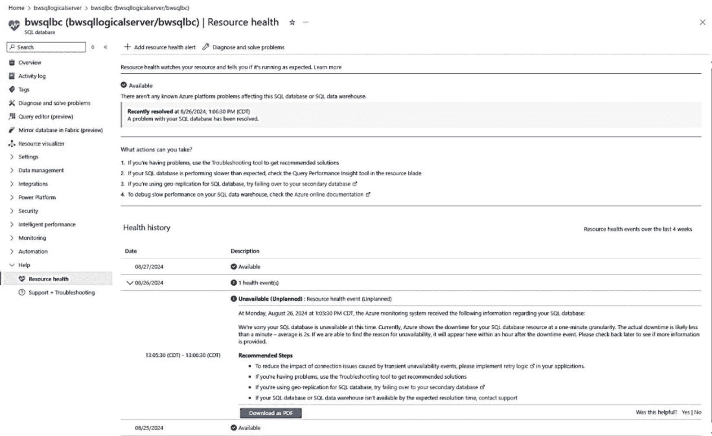
图 8-38
Azure SQL 数据库的 `资源运行状况`

`不可用` 事件与我手动执行数据库故障转移的时间点吻合。请注意它标明这是一个 `计划外` 事件。我如何知道这是由手动故障转移引起的呢？我查看了此数据库的 `活动日志`，并找到了如图 8-39 所示的详细信息。

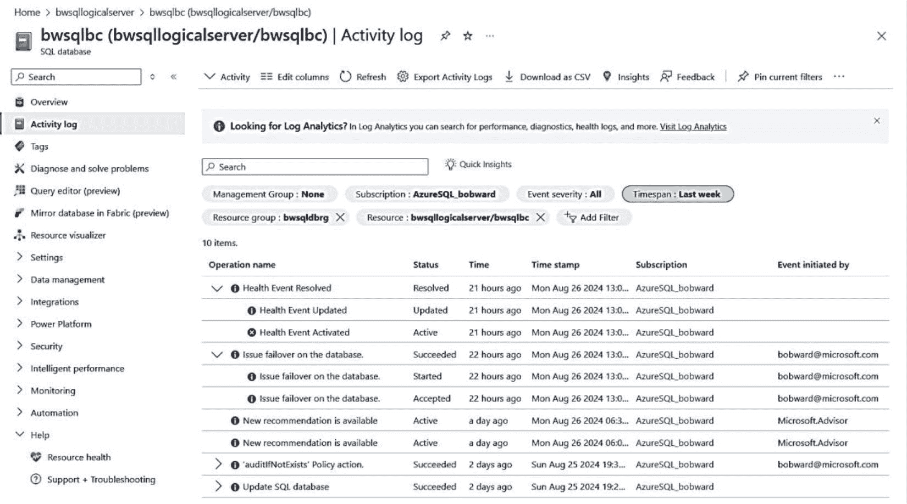
图 8-39
使用 `活动日志` 跟踪手动故障转移

注意
对于 Azure SQL 托管实例和数据库部署，`资源运行状况` 都是在数据库级别报告的。

### 小结

在本章中，你了解了 Azure SQL 惊人的内置可用性功能，包括自动备份、时间点还原，以及 `常规用途`、`业务关键` 和 `超大规模` 的内置可用性架构。

你还学习了如何利用 Azure 的功能通过区域冗余、异地复制和故障转移组实现进一步的冗余。你了解了 Azure 如何提供内置的数据完整性和流程，以及如何监控 Azure SQL 部署的可用性。

你可以使用一些额外的实验（这些是免费的——你只需要一个 Azure 订阅）来了解更多关于 Azure SQL 可用性的信息，网址为：
[`https://github.com/microsoft/cloudsqlworkshop/tree/main/cloudsqlworkshop/06_Manage_and_Optimize_AzureSQLMI`](https://github.com/microsoft/cloudsqlworkshop/tree/main/cloudsqlworkshop/06_Manage_and_Optimize_AzureSQLMI)
[`https://github.com/microsoft/cloudsqlworkshop/tree/main/cloudsqlworkshop/07_Deploy_Manage_Optimize_AzureSQLDB`](https://github.com/microsoft/cloudsqlworkshop/tree/main/cloudsqlworkshop/07_Deploy_Manage_Optimize_AzureSQLDB)

可用性是 Azure SQL 核心内容的最后一部分。在下一章中，你将扩展对 Azure SQL 的了解，学习与安全性、性能或可用性无直接关系的功能。

