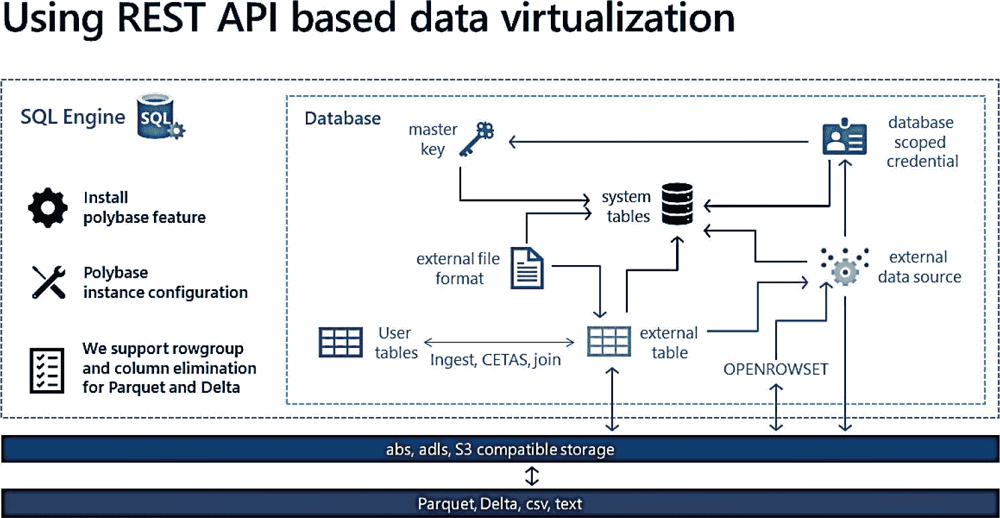
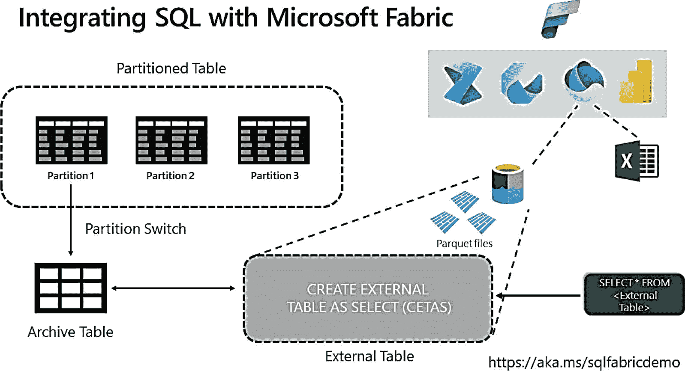

# 9. 扩展 Azure SQL 知识

你已经经历了部署和配置 Azure SQL 托管实例和数据库的旅程。然后，你了解了所有用于保护部署、使 Azure SQL 快速运行并保持高速，以及确保数据高可用性的功能和任务。在本章中，我们将通过更仔细地研究与 SQL Server 的功能对比、理解作业管理的选项、了解可用于支持部署的方法以及回顾使用 Azure SQL 的最佳实践，来扩展你对 Azure SQL 的知识。

本章将包含供你边读边尝试和使用的示例。要尝试本章中使用的任何技术、命令或示例，你将需要：
*   一个 Azure 订阅。
*   对 Azure 订阅至少具有 `参与者` 角色访问权限。你可以在 [`https://learn.microsoft.com/en-us/azure/role-based-access-control/built-in-roles`](https://learn.microsoft.com/en-us/azure/role-based-access-control/built-in-roles) 阅读更多关于 Azure 内置角色的信息。
*   访问 Azure 门户。
*   我将使用本书前面部署的几个 Azure SQL 数据库和一个托管实例。
*   要连接到托管实例，你需要 Azure 中的一个 `跳板机` 或虚拟机。我在本书的第 4 章向你展示了如何操作。一个简单的方法是创建一个新的 Azure 虚拟机，并将其部署到与托管实例相同的虚拟网络中（你将使用与托管实例不同的子网）。
*   要连接到 Azure SQL 数据库，我将使用我在第 3 章部署的 Azure VM，称为 `bwsql2022`，并在第 6 章配置了专用端点（只要能连接到 Azure SQL 数据库，你也可以使用其他方法）。
*   你将在本章中运行一些 T-SQL，因此请安装一个工具，如 SQL Server Management Studio (`SSMS`)，下载地址：[`https://aka.ms/ssms`](https://docs.microsoft.com/en-us/sql/ssms/download-sql-server-management-studio-ssms?view=sql-server-ver15)。

## Azure SQL 的功能范围

在整本书中，我比较了 SQL Server 与 Azure SQL 托管实例和数据库的功能。让我们回顾几个我经常被问到的、与安全性、性能和可用性无直接关系的功能。

在阅读本节时，请参考以下文档：
*   托管实例与 SQL Server 的 T-SQL 差异：[`https://aka.ms/azuresqlmitsqldiff`](https://aka.ms/azuresqlmitsqldiff)。
*   Azure SQL 数据库与 SQL Server 的 T-SQL 差异：[`https://aka.ms/azuresqldbtsqldiff`](https://aka.ms/azuresqldbtsqldiff)。
*   Azure SQL 托管实例与 Azure SQL 数据库的功能对比：[`https://aka.ms/azuresqlfeatures`](https://aka.ms/azuresqlfeatures)。

### 链接服务器和跨数据库查询

SQL Server 用户可以对位于同一 SQL Server 实例的其他数据库（跨数据库查询）或另一个实例（链接服务器查询）中的对象执行查询（并进行联接）。SQL Server 的链接服务器还允许查询其他数据提供程序（通过 OLE-DB），例如 Oracle。跨数据库查询和链接服务器允许读取查询（`SELECT`），也（如果提供程序支持的话）允许分布式事务。

Azure SQL 托管实例支持 **`跨数据库查询`**，但 Azure SQL 数据库不支持。

注意
Azure SQL 数据库支持弹性数据库查询（预览版）的概念，该功能可以跨数据库联接数据。了解更多信息请访问 [`https://learn.microsoft.com/azure/azure-sql/database/elastic-query-getting-started-vertical`](https://learn.microsoft.com/azure/azure-sql/database/elastic-query-getting-started-vertical)。

Azure SQL 托管实例支持 **`链接服务器`**，但 Azure SQL 数据库不支持。不过，Azure SQL 托管实例使用 `链接服务器` 有一些限制。例如，仅支持基于 SQL Server 的提供程序。有关托管实例上 `链接服务器` 的完整差异列表，请参阅 [`https://learn.microsoft.com/azure/azure-sql/managed-instance/transact-sql-tsql-differences-sql-server?view=azuresql#linked-servers`](https://learn.microsoft.com/azure/azure-sql/managed-instance/transact-sql-tsql-differences-sql-server?view=azuresql#linked-servers)。托管实例的 `链接服务器` 支持 Microsoft Entra 身份验证。

注意
你可以从本地 SQL Server、Azure 虚拟机或托管实例创建 `链接服务器`，其中*远程服务器*是 Azure 数据库逻辑服务器。


### 外部表

在 SQL Server 2016 中，我们引入了一项名为 `Polybase` 的功能，它使用 `T-SQL` 对象 `EXTERNAL TABLE` 来指向 Hadoop 文件系统。在 SQL Server 2019 中，我们将此功能扩展到包括其他数据源，例如 SQL Server、Oracle、MongoDB、Teradata 以及其他支持 ODBC 驱动程序的源。我们将此功能称为 `数据虚拟化`，因为数据访问是远程的，但通过外部表，它*感觉就像*数据是本地的一样。

在 SQL Server 2022 中，我们引入了一种新的 `Polybase` 方法，通过支持使用 `REST API` 而不是之前的 ODBC 方法来访问 `Azure 存储`的外部数据源。`REST` 提供了一种更轻量级的方法，因为它是在 SQL 引擎内部执行的。此外，外部表可用于将数据读取或写入 `Parquet`、`CSV` 和 `Delta`（仅限读取）等文件格式。

使用 `Polybase` 与 Azure SQL 托管实例的过程与 SQL Server 2022 类似，如图 9-1 所示。



图 9-1
使用 `REST API` 为 SQL Server 2022 实现数据虚拟化

对于 Azure SQL 托管实例，有一种更易于管理的方法可用。虽然你仍然拥有外部数据源、文件格式和外部表，但与图 9-1 相比有以下不同：

*   无需安装 `Polybase` 功能，因为它已经为托管实例“安装”好了。
*   无需使用 `sp_configure` 配置 `Polybase`，因为它已经启用。
*   在撰写本书时，尚不支持 `S3`，因此仅支持 `Azure Blob 存储 (abs)` 和 `Azure 数据湖存储 (adls)` 数据源。

你仍然需要一个 `数据库范围凭据` 来访问任何私有存储账户，但 Azure SQL 托管实例相对于 SQL Server 2022 的一个优点是它也支持 `托管标识`。

开始使用此功能的最佳方法是连接到你的 Azure SQL 托管实例，并针对已知的公共数据集尝试以下查询：

```sql
SELECT *
FROM OPENROWSET(
    BULK 'abs://nyctlc@azureopendatastorage.blob.core.windows.net/yellow/puYear=2001/puMonth=1',
    FORMAT = 'parquet'
) AS taxidata;
GO
```

你可以看到，对于你的托管实例，开始使用 `数据虚拟化` 是多么容易，且*无需任何配置*。

`数据虚拟化` 的另一个强大功能是能够同时创建外部表并导出数据。我们称之为 `CREATE TABLE AS SELECT (CETAS)`。此功能的好处之一是，可以将此数据的结果作为 `Parquet` 文件，并创建一个与 `Microsoft Fabric` 集成的“冷数据”解决方案。该场景如图 9-2 所示。



图 9-2
使用 `数据虚拟化` 与 `Microsoft Fabric` 进行集成

这里的核心概念是，将被认为是“冷”的 SQL 分区切换到单独的表中。然后使用 `CETAS` 概念将此表作为 `Parquet` 导出到 Azure 存储。由于这是一个外部表，你可以将 parquet 数据作为表进行查询。此外，你可以利用 `Microsoft Fabric` 中的快捷方式概念，轻松地将此数据集成到 `Microsoft Fabric` 中。你可以在 Anna Hoffman 主持的 `Data Exposed` 节目中看到实际操作，链接为 [`https://learn.microsoft.com/shows/data-exposed/sql-integration-with-microsoft-fabric-data-exposed`](https://learn.microsoft.com/shows/data-exposed/sql-integration-with-microsoft-fabric-data-exposed)。你将在下一章中看到一种更高效的方法，使用称为 `镜像` 的概念将你的 SQL 数据与 `Microsoft Fabric` 同步。

在 [`https://aka.ms/midatavirt`](https://aka.ms/midatavirt) 了解更多关于 Azure SQL 托管实例的 `数据虚拟化` 信息。

虽然 Azure SQL 数据库不以这种方式支持 `Polybase`，但它确实支持外部表用于 `弹性缩放查询`。这意味着，从技术上讲，你可以设置一个指向另一个 Azure SQL 数据库逻辑服务器和数据库的 `外部数据源`，并使用该数据源定义一个外部表。因此，你现在可以将远程数据库作为外部表进行查询，甚至可以将本地表与远程数据库表进行联接。你可以在 [`https://learn.microsoft.com/sql/t-sql/statements/create-external-data-source-transact-sql?view=azuresqldb-current&tabs=dedicated#overview-azure-sql-database`](https://learn.microsoft.com/sql/t-sql/statements/create-external-data-source-transact-sql?view=azuresqldb-current&tabs=dedicated#overview-azure-sql-database) 查阅 Azure SQL 数据库外部数据源的 `T-SQL` 参考。

看看我的同事 Dimitri Furman 使用此功能的一个很酷的例子，他使用外部表来查看 `Hyperscale` `读取副本监控`。你可以在 [`https://github.com/dimitri-furman/samples/tree/master/azure-sql-readscale-monitoring`](https://github.com/dimitri-furman/samples/tree/master/azure-sql-readscale-monitoring) 找到源代码。

## 数据库邮件

自 SQL Server 4.21 for Windows NT 时代起，SQL Server 就支持内置的 `邮件` 功能。此功能的最新版本称为 `数据库邮件`。其概念是，你可以使用 `T-SQL` 基于简单邮件传输协议 (`SMTP`) 发送邮件消息。如果你以前从未使用过 `数据库邮件`，可以在 [`https://learn.microsoft.com/sql/relational-databases/database-mail/database-mail`](https://learn.microsoft.com/sql/relational-databases/database-mail/database-mail) 了解更多信息。

我们将 `数据库邮件` 作为一项功能引入 Azure SQL 托管实例，因为许多尝试使用 Azure SQL 数据库的客户在迁移过程中都希望拥有此功能。`数据库邮件` 是一项*实例*级功能，这解释了它为何是 Azure SQL 托管实例的一部分。

使用 `数据库邮件` 的常见场景之一是用于 SQL Server 代理作业的警报。为 SQL Server 代理作业使用 `数据库邮件` 有一些配置上的差异。请在 [`https://learn.microsoft.com/azure/azure-sql/managed-instance/transact-sql-tsql-differences-sql-server?view=azuresql#sql-server-agent`](https://learn.microsoft.com/azure/azure-sql/managed-instance/transact-sql-tsql-differences-sql-server?view=azuresql#sql-server-agent) 阅读更多信息。在 Azure SQL 托管实例上使用 `数据库邮件`，除了文档中指出的这两点不同外，其他几乎所有方面都是相同的：

*   `sp_send_dbmail` 不能使用 `@file_attachments` 参数发送附件。此存储过程无法访问本地文件系统、外部共享或 Azure Blob 存储。
*   `sp_send_db_mail` 存储过程中的 `@query` 参数不起作用。


