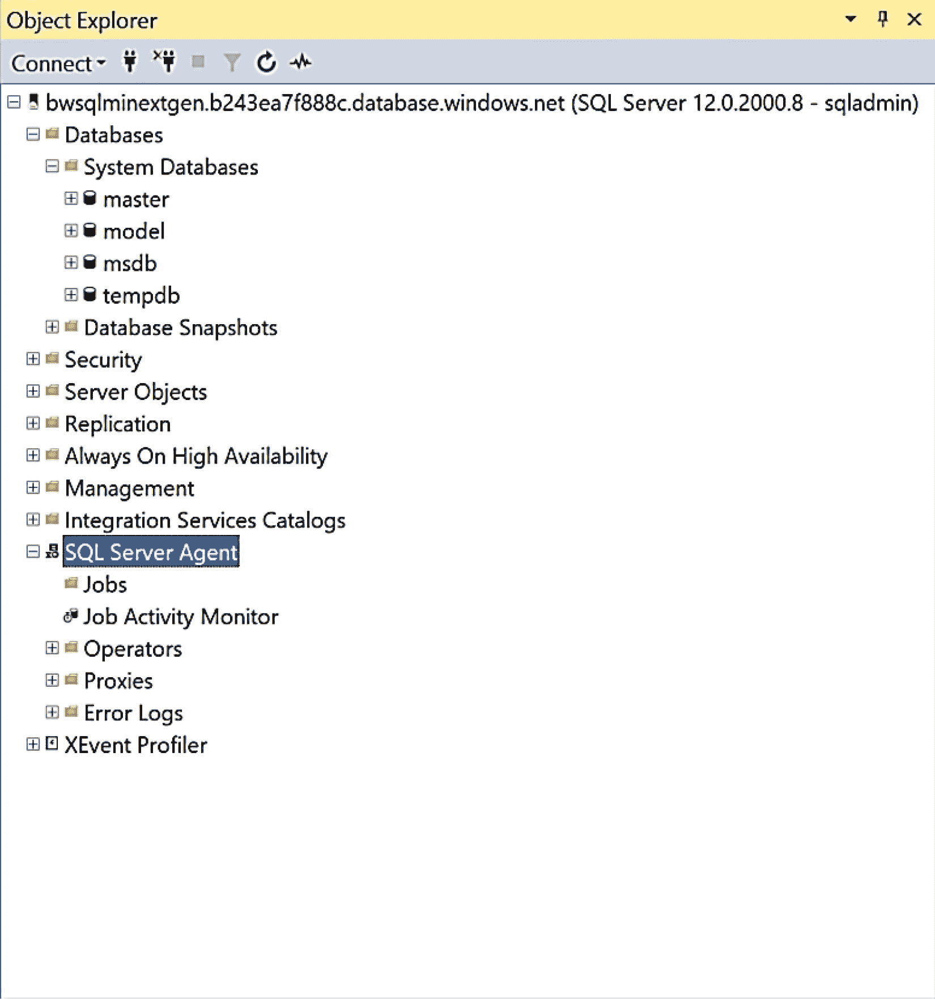
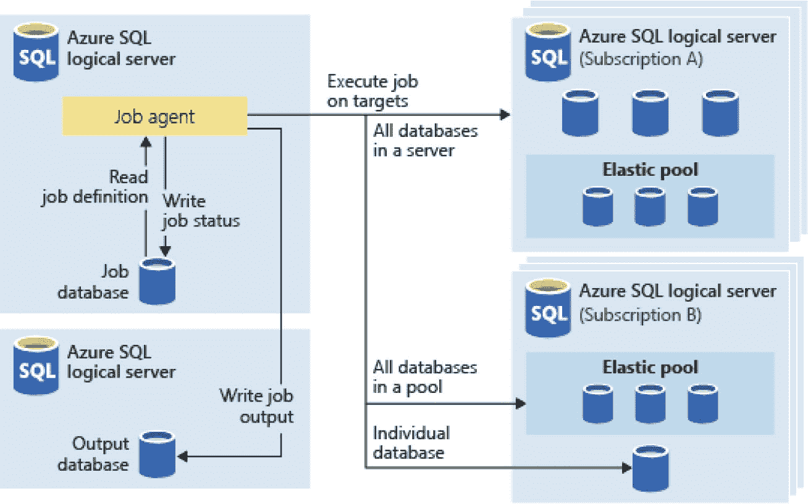
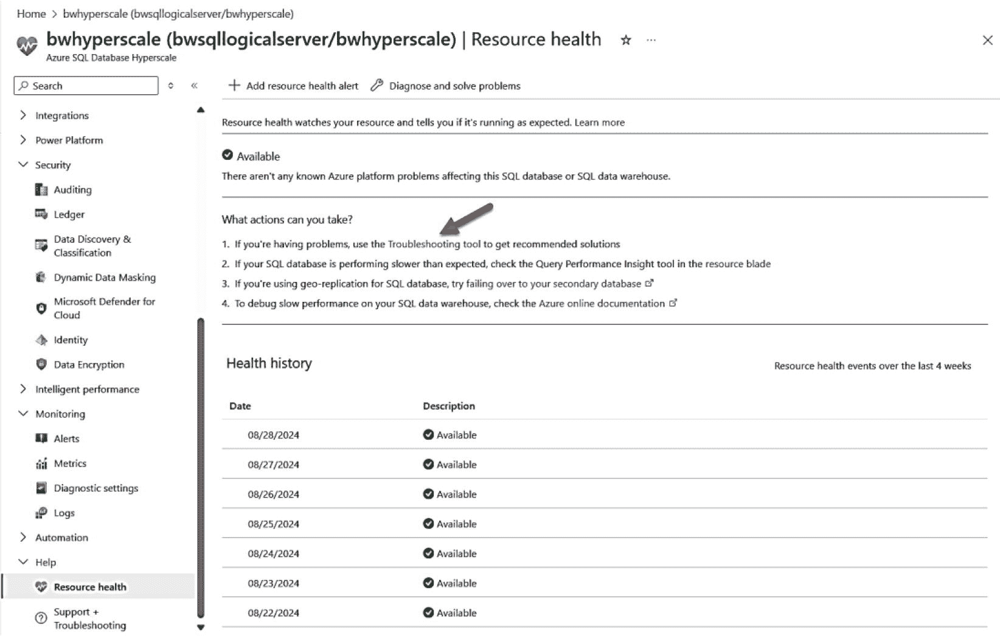
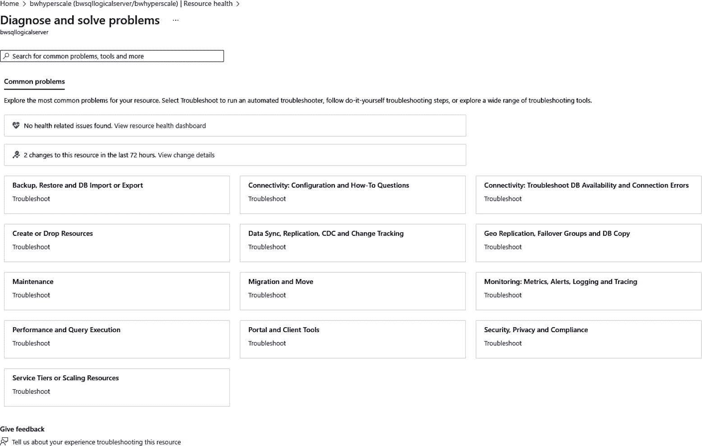
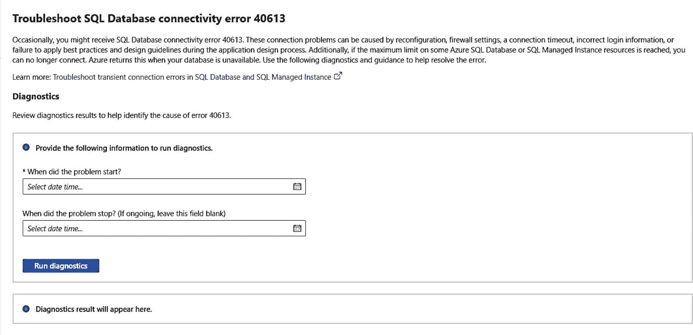
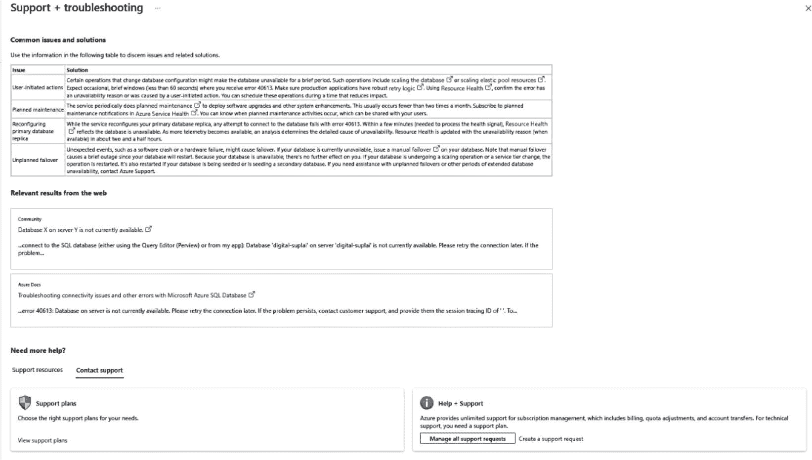
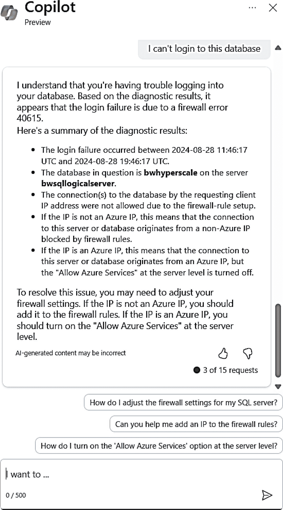
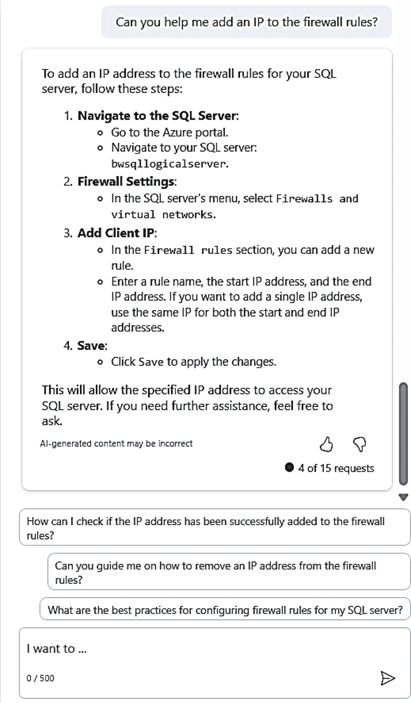
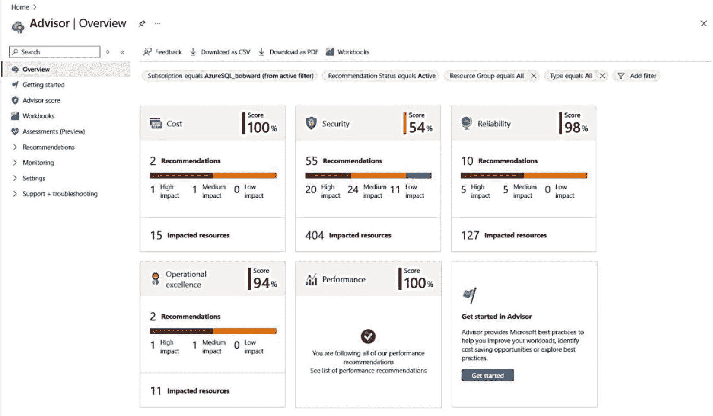

# 作业管理

作为管理 SQL Server 环境的一部分，你无疑会希望安排 `作业` 来执行与 SQL Server 相关的各种任务。让我们回顾一下，在 Azure SQL 部署中，你可以使用哪些选项来执行作业管理的各个方面。


### SQL Server 代理

多年来，SQL Server 的用户一直在使用其内置的 `SQL Server 代理` 功能。`SQL Server 代理` 是一个与 SQL Server 集成的作业调度系统。`SQL Server 代理` 是另一个实例级功能的例子，我们之前在 Azure SQL Database 中未予支持，但现在已通过 Azure SQL 托管实例提供支持。

图 9-3 展示了我在第 4 章部署的跳板机 VM 中的 `SSMS`，连接到我的 Azure SQL 托管实例。



图 9-3

Azure SQL 托管实例中的 SQL Server 代理

您将开始使用 `SQL Server 代理`，其体验与在 SQL Server 中管理作业非常相似。存在一些限制，我们已在 [`https://learn.microsoft.com/azure/azure-sql/managed-instance/transact-sql-tsql-differences-sql-server?view=azuresql#sql-server-agent`](https://learn.microsoft.com/azure/azure-sql/managed-instance/transact-sql-tsql-differences-sql-server?view=azuresql#sql-server-agent) 中进行了记录。

您可能看到的最大区别是我们不支持 `CmdExec` 或 `PowerShell` 作业步骤类型。托管实例的 `SQL 代理` 主要用于 `T-SQL` 作业、`SSIS` 作业和支持复制的作业。

### 弹性作业

如果 Azure SQL Database 是您首选且最佳的部署选项，您确实有一个替代方案来调度执行 `T-SQL` 语句的作业，即使用 **Azure 弹性作业**。在本书第一版中，`弹性作业` 处于预览状态，并且这种情况持续了几年，这让客户对其未来感到困惑是完全可以理解的。我很高兴看到我们在 2024 年 4 月刷新了预览版并宣布了 `弹性作业` 的正式发布。您可以通过阅读 [`https://learn.microsoft.com/azure/azure-sql/database/elastic-jobs-overview`](https://learn.microsoft.com/azure/azure-sql/database/elastic-jobs-overview) 来开始使用。

自最初的预览版以来添加的一些新功能如下：

*   支持 `Microsoft Entra ID`（前身为 `Azure Active Directory`）以集中管理身份验证和权限。
*   支持服务管理的专用链接，以安全地连接到目标数据库。
*   与 `Azure 警报` 集成，用于作业执行状态通知。
*   轻松扩展作业代理的层级，以在 `Azure` 中并发连接到数百个目标数据库。
*   在目标服务器和弹性池中动态枚举目标数据库。
*   作业可以由多个步骤组成，以自定义执行顺序。

`弹性作业` 的一个很酷的功能是，我可以并行运行作业，例如跨多个 Azure SQL Database 调度索引维护。

`弹性作业` 本质上是一个*独立的* Azure 服务，其形式是一个*作业代理*，允许您针对目标（即 Azure SQL Database，包括弹性池）运行 `T-SQL` 作业。`弹性作业` 服务使用自己的 Azure SQL Database（称为作业数据库）来记录调度信息和作业输出。

图 9-4 展示了整体架构。



图 9-4

弹性作业架构

`弹性作业` 代理基于服务层级计费，该层级定义了作业的最大并发数。此外，作业数据库的计算和存储适用标准计费。以下是关于 `弹性作业` 的几个重要点：

*   目标可以按服务器组和/或数据库组定义。
*   您可以为作业数据库使用成本非常低的 Azure SQL Database 服务层级，但如果您安排了大量作业同时针对大量目标运行，作业代理的性能可能会受到影响。这里没有真正的指标来指导您，因此我建议您从小规模开始，甚至使用 `无服务器` 层级并监控使用情况。
*   您可以使用专用端点将作业代理与目标 Azure SQL Database 连接。
*   `弹性作业` 支持动态枚举。这非常酷。您可以在逻辑服务器级别定义一个目标。服务器中的每个数据库现在都将成为该作业目标的一部分。作业代理会在每次运行时选择数据库，因此随着数据库的添加和删除，它可以智能地只选择任何适用的数据库。

请使用 [`https://learn.microsoft.com/azure/azure-sql/database/elastic-jobs-tsql-create-manage`](https://learn.microsoft.com/azure/azure-sql/database/elastic-jobs-tsql-create-manage) 上的教程来了解更多关于创建和使用 `弹性作业` 的信息。

### Azure 自动化

`Azure 自动化` 是一项 Azure 服务，允许您自动化云管理任务，其中可以包括与 Azure SQL 的集成。这包括使用诸如 `PowerShell` 之类的语言执行任务，其概念称为 `运行手册`。请访问 [`https://learn.microsoft.com/azure/automation/overview#process-automation`](https://learn.microsoft.com/azure/automation/overview#process-automation) 了解更多关于 `Azure 自动化` 的信息。

查看我们在 [`https://learn.microsoft.com/azure/azure-sql/database/automation-manage`](https://learn.microsoft.com/azure/azure-sql/database/automation-manage) 上的文档，了解有关如何将 `Azure 自动化` 与 Azure SQL Database 结合使用的具体信息。可以将此视为比 `弹性作业` 更高级的使用 `PowerShell` 针对 Azure SQL Database 自动化任务的方式。

## 支持 Azure SQL

我在微软职业生涯的早期大部分时间都在技术支持部门工作，我在本书中比较的许多 SQL Server 细节都基于我在支持部门获得的知识。

关于支持您的 Azure SQL 部署，有几个与 SQL Server 不同的主题值得在本章中指出，包括错误处理、堆栈转储、使用 Azure 门户中的资源辅助故障排除、使用 `Copilot` 以及通过 `UserVoice` 提供反馈。


### 处理错误

大多数在 Azure SQL 托管实例和数据库中可能遇到的错误与 SQL Server 是共通的。我们的文档提供了完整的引擎错误列表，位于 [`https://learn.microsoft.com/sql/relational-databases/errors-events/database-engine-events-and-errors`](https://learn.microsoft.com/sql/relational-databases/errors-events/database-engine-events-and-errors)。

对于 Azure SQL，你可能会遇到一些新的错误，它们通常围绕着连接性、资源治理和支持。你可以在我们的文档中找到其中一些场景的列表： [`https://learn.microsoft.com/azure/azure-sql/database/troubleshoot-common-errors-issues`](https://learn.microsoft.com/azure/azure-sql/database/troubleshoot-common-errors-issues)。

例如，在本书的第 8 章中，你看到了一个场景：一个应用程序在故障转移期间无法连接，并遇到了一个需要重试连接的错误（使用 `ostress.exe`）。

```
[SQL Server]Database '' on server '' is not currently available.  Please retry the connection later.  If the problem persists, contact customer support, and provide them the session tracing ID of '{CC39135B-D638-4A51-BB25-EABB8A5315A0}'.
```

这是 `Msg 40613`，是一个连接性错误的例子，因为一个有效的逻辑服务器不可用，但你的网络连接是正常的。这个错误实际意味着你可以连接到我们的网关，但我们需要重定向你去的资源（你的逻辑服务器或实例）不可用。

假设问题是你的应用程序发生了网络错误。你可能会得到一个更传统的 SQL Server 错误，例如：

```
10053: A transport-level error has occurred when receiving results from the server. (Provider: TCP Provider, error: 0 - An established connection was aborted by the software in your host machine)
```

一个由于防火墙规则配置不正确而导致连接失败、Azure SQL 特有的错误是：

```
Error 40615:
Cannot open server '%.*ls' requested by the login. Client with IP address '%.*ls' is not allowed to access the server.  To enable access, use the Windows Azure Management Portal or run sp_set_firewall_rule on the master database to create a firewall rule for this IP address or address range.  It may take up to five minutes for this change to take effect.
```

幸运的是，这里很好地说明了问题的原因（未为此客户端设置防火墙规则）。

资源治理类错误的一个例子是超过了部署选项指定的资源限制。例如，对于 Azure SQL 数据库，如果超过了最大工作线程数，你可能会得到如下错误：

```
Msg 10928
The request limit for the database is  and has been reached.
```

你可能遇到的限制可能是存储。以下是当你超过了托管实例的最大存储限制时的错误示例：

```
Msg 1133
The managed instance has reached its storage limit. The storage usage for the managed instance cannot exceed (%d) MBs.
```

最后，你可能因为尝试使用不支持的功能或 T-SQL 语句而遇到错误。例如，如果你试图在托管实例中使用 `sp_configure` 更改“最大服务器内存”选项，你会得到如下错误：

```
Msg 5870
Changes to server configuration option max server memory (MB) are not supported in SQL Database Managed Instances
```

错误可能不会那么明显地指出问题。如果你在连接到 Azure SQL 数据库时尝试执行 `sp_configure`，你会得到类似以下的错误，指出此系统存储过程不支持 Azure SQL 数据库。

```
Msg 2812, Level 16, State 62, Line 1
Could not find stored procedure 'sp_configure'.
```

在某些情况下，你会因为部署选项的限制而无法访问某个功能。例如，内存中 OLTP 仅在业务关键型服务层级中可用。因此，如果你尝试在通用目的服务层级中创建内存优化表，会遇到以下错误：

```
Msg 40536, Level 16, State 2, Line 1
'MEMORY_OPTIMIZED tables' is not supported in this service tier of the database. See Books Online for more details on feature support in different service tiers of Windows Azure SQL Database.
```

### 堆栈转储

在某些情况下，SQL Server 引擎会遇到致命错误（例如 `ACCESS_VIOLATION`），导致应用程序连接终止，并在服务器上创建一个堆栈转储。如果这类问题持续存在，SQL Server 用户习惯与 Microsoft 技术支持合作检查这些转储文件以确定问题原因。以下是一篇描述此类问题示例的 Microsoft 文章： [`https://support.microsoft.com/help/4519796/fix-stack-dump-occurs-when-table-type-has-a-user-defined-constraint-in`](https://support.microsoft.com/help/4519796/fix-stack-dump-occurs-when-table-type-has-a-user-defined-constraint-in)。

对于 Azure SQL，你无法访问底层文件系统来查看这些文件。好消息是，这无关紧要。堆栈转储是 Azure SQL 会自动处理的情况。你的应用程序可能会遇到这类问题，但我们的后端系统有警报来自动监控这类问题。我们的工程师会收到通知并立即启动调查。如果问题严重到需要重启 SQL Server，我们可能会启动故障转移。这种监控的好处之一是，我们可能会识别出影响多个用户的此类问题的模式，并在下一个“火车”上启动代码修复——这是无版本 SQL Server 的又一个好处示例。

### Azure 门户中的故障排除资源

我的前同事与我们的工程团队合作，构建了一些工具，帮助您在 Azure 门户中自行排查问题。

我提到过使用服务菜单中的`资源运行状况`选项来查找可能影响可用性的故障转移。图 9-5 显示了我 Azure SQL 数据库的此屏幕，其中包含选择`故障排除工具`的参考（您也可以从服务菜单的`支持+故障排除`选项访问故障排除工具）。



**图 9-5** 通过资源运行状况访问故障排除工具

如果选择`故障排除工具`，您将看到一组基于 Microsoft 支持从客户支持请求中看到的高发问题的常见问题，如图 9-6 所示。



**图 9-6** 诊断并解决 Azure SQL 的常见问题

我可以搜索常见问题类型，也可以选择一个类别并使用特定的一组屏幕来排查问题。假设我无法连接到我的 Azure SQL 数据库，并收到了本节前面提到的错误`Msg 40613`。

我可以从`连接性：排查数据库可用性和连接错误`中选择“故障排除”链接。我可以选择我的问题是`Msg 40613`，向下滚动可以看到更多细节，帮助我排查我的特定问题，如图 9-7 所示。



**图 9-7** 排查连接错误 40613

我可以选择问题发生的时间范围并运行诊断。诊断可能会利用 Azure 中的内置遥测数据来帮助确定原因。如果这对我没有帮助，我可以像图 9-8 那样向下滚动。



**图 9-8** 用于排查错误 40613 的更多信息

这包括常见解决方案、网页搜索结果，以及搜索社区论坛甚至创建新的支持请求的能力。使用此方法创建支持请求的一个巨大优势是，Microsoft 的支持工程师拥有您在此处选择的所有有关问题、您的数据库上下文以及已运行诊断的上下文信息，从而节省您的时间和精力。

Microsoft 提供各种支持计划来帮助您进行 Azure 部署。所有 Azure 客户都可以免费获得一组基本的支持选项。但是，也有付费支持选项，可提高您的可用性级别，让 Microsoft 支持全天候（24/7）处理关键业务问题。在 `https://azure.microsoft.com/support/plans/` 了解所有 Azure 支持计划。

那么`Copilot`呢？我提到过它是一个帮助您管理和配置 Azure SQL 数据库的新工具。假设我无法登录 Azure SQL 数据库，并收到`错误 40615`，这表明存在防火墙问题。假设我不知道该消息的细节，并且我发现有人抱怨无法登录。我可以像图 9-9 所示那样使用`Copilot`寻求帮助。



**图 9-9** Copilot 帮助解决登录 Azure SQL 数据库失败的问题

我喜欢这里的上下文信息。我知道时间范围、服务器和数据库，并且知道这是一个防火墙问题。系统还提供了提示来帮助我解决问题。

如果我选择“您能帮我将 IP 添加到防火墙规则吗”，我会得到如何执行此操作的具体说明，如图 9-10 所示。



**图 9-10** Copilot 提供的添加防火墙规则的解决方案

我仍然必须找出是哪台客户端出了问题并设置规则。如果我启用了`SQL 审核`，我可以轻松获取该信息。

### UserVoice

您可能正在使用 Azure SQL 并有一个建议，不一定是一个需要支持的问题。Microsoft 通过一个名为`Azure 创意`的概念，为 Azure SQL 提供了一个反馈论坛。您可以在 `https://aka.ms/sqlfeedback` 访问 Azure SQL 和 SQL Server 的反馈。

我可以向您保证，作为一个工程团队，我们确实会查看这些请求以及客户如何对它们进行投票，因此请找到您热衷的事情，并让其他人投票支持您的想法。

## Azure SQL 最佳实践

为了总结本章，让我们看看可以帮助您了解 Azure SQL 部署最佳实践的资源。

### 安全手册

大约一年前，我们团队中专门负责安全的首席项目经理 Jakub Szymaszek（您将遇到的最好的人之一）向我提出了团队正在研究的一个想法。他说“Bob，你使用 SQL Server 很多年了。你能看看我们正在研究的`安全手册`吗？”我给了他一些反馈，并期待着项目的进展。

这项工作的成果已融入我们的文档中，网址为 `https://learn.microsoft.com/azure/azure-sql/database/security-best-practice`。本文档涵盖了我们团队关于保护 Azure SQL 最佳实践的集体知识。这包括身份验证、访问管理、数据保护、网络安全、监控和审核、常见安全威胁以及可用性的安全方面。这是您在部署和保护 Azure SQL 时阅读和学习的“事实”指南。您会发现本书第 6 章学到的许多概念与这些最佳实践相符。

### 性能最佳实践

在本书第 7 章中，您看到了对 Azure SQL 性能的全面了解。正如您在该章中所见，有一些最佳实践需要遵循。我们在 `https://learn.microsoft.com/azure/azure-sql/database/performance-guidance` 也为您准备了一份非常好的性能最佳实践摘要供您阅读。这包括监控、查询设计和应用程序开发的指导。

另一个极好的资源来自我长期的同事 Jack Li，他现在在我们的工程团队工作。在 `https://learn.microsoft.com/azure/azure-sql/identify-query-performance-issues` 了解更多信息。


## Azure Advisor

既然在 Azure 生态系统中，关于你的部署（但不涉及你的数据）有大量的遥测数据，为什么不内置一些自动化来提供建议呢？这就是 `Azure Advisor`。`Azure Advisor` 汇集了整个 Azure 工程团队的集体知识，就成本、安全性、可靠性、操作卓越性和性能等方面为你的部署提供建议。你可以在 [`https://learn.microsoft.com/azure/advisor/advisor-overview`](https://learn.microsoft.com/azure/advisor/advisor-overview) 阅读更多关于 `Azure Advisor` 的信息。图 9-11 展示了我的订阅的 `Azure Advisor` 示例。



图 9-11：Azure Advisor

这里有一篇很好的博文，概述了 `Azure Advisor` 能为你做什么：[`https://azure.microsoft.com/blog/your-single-source-for-azure-best-practices/`](https://azure.microsoft.com/blog/your-single-source-for-azure-best-practices/)。从我的顾问概览中可以看到，我还有一些安全方面的工作需要处理！

请注意 `Azure Advisor` 中的*节省成本*领域。我们的文档在 [`https://learn.microsoft.com/azure/advisor/advisor-cost-recommendations`](https://learn.microsoft.com/azure/advisor/advisor-cost-recommendations) 指出了一些这样的节省成本的想法。对我来说，在满足应用程序对安全性、性能和可用性的需求的同时，节省成本非常重要。请记住以下 `Azure SQL` 的省钱技巧：
- 监控 `Azure SQL Database` 的性能，并随着时间推移调整你的 `vCore` 和存储选择，使其规模合适。你在本书第 7 章已经看到扩展数据库是多么容易。
- 仔细评估 `无服务器` 计算层。`无服务器` 具有自动缩放、按秒计费以及在空闲时暂停计算的功能。
- 当 `Azure SQL 托管实例` 在某段时间内未被使用时，使用其启动/停止功能。
- 利用 `Azure 混合权益` 来使用你现有的许可证。
- 阅读我的关于如何最大化 SQL 节省的博文：[`https://www.microsoft.com/sql-server/blog/2024/02/15/how-sql-developers-can-maximize-savings`](https://www.microsoft.com/sql-server/blog/2024/02/15/how-sql-developers-can-maximize-savings)。
- 如果你只需要一个用于灾难恢复的副本，请将其标记为*被动*以节省成本。这个概念在 `Azure SQL Database` 中称为待机副本。
- 在不使用时关闭 `Azure 虚拟机`。
- 另一种分析成本的方法是使用 `Azure 门户` 中的成本分析选项。这可以很好地细分成本并帮助预测未来成本。在 [`https://learn.microsoft.com/azure/cost-management-billing/costs/quick-acm-cost-analysis`](https://learn.microsoft.com/azure/cost-management-billing/costs/quick-acm-cost-analysis) 了解更多信息。

## 了解新功能

我们的团队为你创建了资源，以便你随时了解 `Azure SQL`（包括预览版和正式版的 `Azure SQL 托管实例` 和 `Azure SQL Database`）的所有新内容。我建议你收藏这些链接：
- [`https://aka.ms/whatsnewsqldb`](https://aka.ms/whatsnewsqldb)
- [`https://aka.ms/whatsnewsqlmi`](https://aka.ms/whatsnewsqlmi)

## 与我们的团队保持联系

我有一些资源供你用来跟踪 `Azure SQL` 的各个方面，获得更多知识并学习更多最佳实践。
- 关注 `X` 账号 `@AzureSQL`。这是我们 `Azure SQL` 工程团队的官方账号。此外，我们经常使用 `#azuresql` 标签发布关于 `Azure SQL` 的有趣公告、演示文稿和事实。我的同事 Marisa Brasile 在利用这些资源让社区和行业保持更新方面做得非常出色。你也可以关注我的账号 `@bobwardms`。
- 我经常在 `LinkedIn` 上发布关于 `Azure SQL` 的重要新闻和公告：[`linkedin.com/in/bobwardms`](https://www.linkedin.com/in/bobwardms)。
- 我们的团队参与的几个博客，我认为你会觉得很有帮助：
    - 我们的 `主 SQL Server 博客`：[`https://www.microsoft.com/sql-server/blog`](https://www.microsoft.com/sql-server/blog)
    - `技术社区博客`：[`https://techcommunity.microsoft.com/t5/azure-sql-database/bg-p/Azure-SQL-Database`](https://techcommunity.microsoft.com/t5/azure-sql-database/bg-p/Azure-SQL-Database)
    - 我们的 `Azure SQL 开发者角落`：[`https://devblogs.microsoft.com/azure-sql`](https://devblogs.microsoft.com/azure-sql)
- 我的同事 Anna Hoffman 和我构建了一系列用于自主学习和实践学习的培训材料。这些材料的内容涵盖实验、视频和开源项目。所有这些都是完全免费的！查看这些链接：
    - [`https://aka.ms/azuresqlfundamentals`](https://aka.ms/azuresqlfundamentals) – 这是一门可以在 `Microsoft Learn` 上学习的自主进度课程。这门课很酷的一点是，你不需要 `Azure` 订阅。它会提供一个免费的沙盒供你试用 `Azure SQL`！
    - [`https://aka.ms/azuresql4beginners`](https://aka.ms/azuresql4beginners) – 这是在 `YouTube` 上的一系列短视频（超过 60 个），供你自主学习 `Azure SQL`。这些视频与 `Azure SQL 基础` 实验室内容对应（但这里的内容甚至更多）。
    - [`https://aka.ms/azuresqlworkshop`](https://aka.ms/azuresqlworkshop) – 这是一个出色的入门研讨会，我们构建它来补充 `Azure SQL 入门` 和 `Azure SQL 基础`。
    - [`https://aka.ms/cloudsqlworkshop`](https://aka.ms/cloudsqlworkshop) – 这是我最近构建的一个研讨会，用于关于 `Azure SQL`（包括 `Azure VM`、`托管实例` 和 `Azure SQL Database`）的现场全天研讨会。它包含自主进度实验和完整的 PowerPoint 幻灯片。
- Anna 还主持了一个名为 `Data Exposed` 的视频系列，其中工程团队成员讨论了 `Azure SQL` 和 `SQL Server` 的各个方面。在 [`https://aka.ms/dataexposed`](https://aka.ms/dataexposed) 查看这个系列。

## 总结

在本章中，你通过查看与 `SQL Server` 相比的功能（如链接服务器和 `Database Mail`）、理解作业管理的选项、探索支持部署的方法以及回顾使用 `Azure SQL` 的最佳实践，扩展了你对 `Azure SQL` 的知识。

那么，关于 `Azure SQL` 还有什么需要学习的呢？如果你还记得，我在第 1 章和第 2 章提到了 `Azure SQL` 中超越传统 `关系数据库管理系统` (`RDBMS`) 的新能力。继续阅读本书的最后一章，*超越 RDBMS*。


