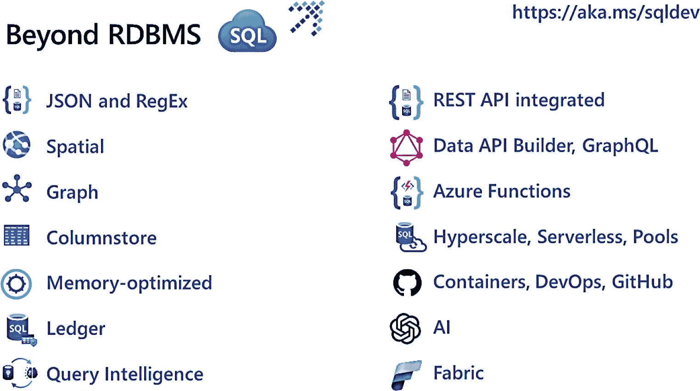
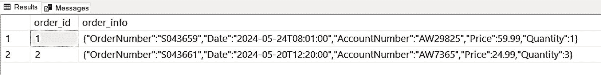
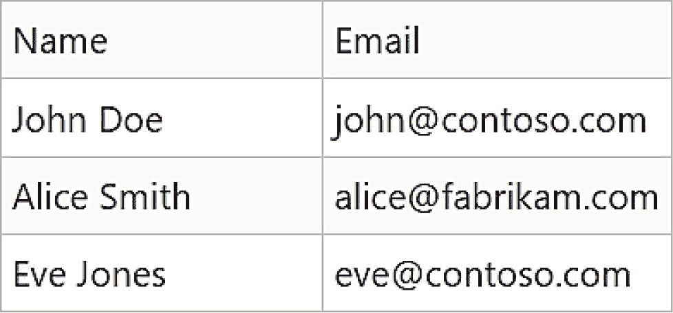
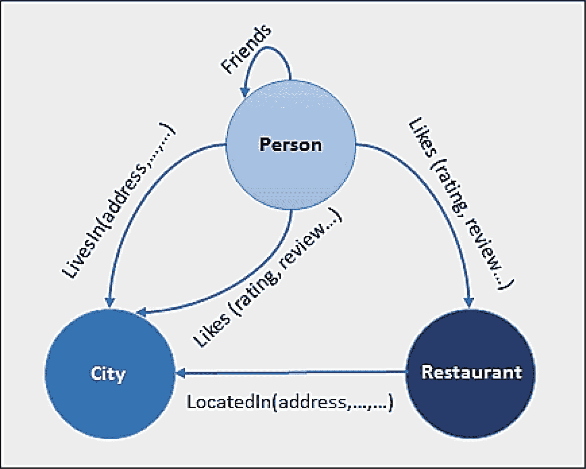
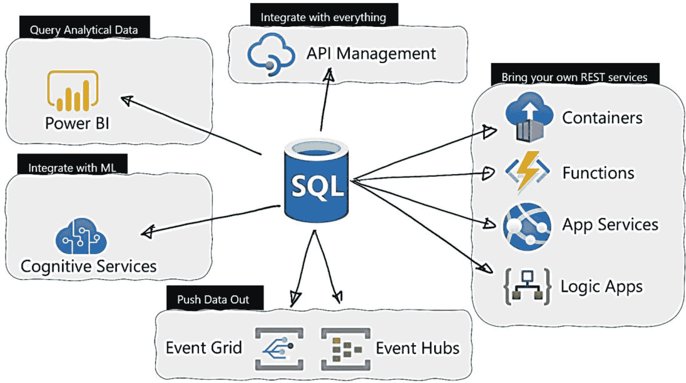
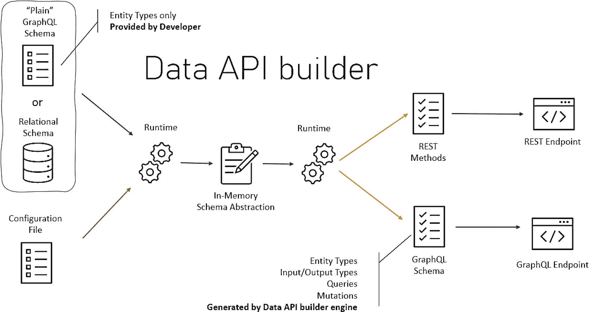

# 10. 超越关系数据库管理系统

2023 年夏天，我试图想出一种方法来描述我们在 Azure SQL 中所拥有的一些强大功能，这些功能是“开箱即用”的，但同时也是传统关系数据库管理系统通常不具备的特性。“超越”这个词自然而然地浮现在我脑海中，用以描述这种情况。于是，我（还是老派作风）开始在纸上勾画出两栏：

*   哪些功能是内置于数据库中的，而在许多情况下可能需要插件或其他产品？我将它们列在了左侧。
*   哪些功能超出了许多人对传统关系数据库管理系统的认知？这些列在右侧。

勾画完这些之后，我制作了一张幻灯片，如图 10-1 所示，来描述所有内容。



图 10-1

Azure SQL 超越关系数据库管理系统

本章将更详细地描述你在此图中看到的内容。左侧列出的一些功能我们在本书中已经讨论过，但对它们进行一次总结会很有益。

本章将包含供你尝试和阅读时使用的示例。要尝试本章中使用的任何技术、命令或示例，你需要：

*   一个 Azure 订阅。
*   至少拥有该 Azure 订阅的“贡献者”角色访问权限。你可以在 [`learn.microsoft.com/azure/role-based-access-control/built-in-roles`](https://learn.microsoft.com/azure/role-based-access-control/built-in-roles) 了解更多关于 Azure 内置角色的信息。
*   访问 Azure 门户的权限。
*   在本章中，我将使用 Azure SQL Database，因为许多这些功能已为该服务启用，但其中许多功能现在已经或将作为 Azure SQL Managed Instance 的一部分。
*   要连接到 Azure SQL Database，我将使用我在第 3 章部署的名为 `bwsql2022` 的 Azure 虚拟机，并在第 6 章为其配置了专用终结点（你可以使用其他方法，只要能连接到 Azure SQL Database 即可）。你可以使用任何你喜欢的方法，只要能连接到 Azure SQL Database。
*   本章中你会看到一些 T-SQL，因此请安装一个工具，如 SQL Server Management Studio (SSMS)，下载地址为 [`aka.ms/ssms`](https://docs.microsoft.com/en-us/sql/ssms/download-sql-server-management-studio-ssms%253Fview%253Dsql-server-ver15)。
*   在本书撰写时，我将在此展示的一些功能处于预览状态且未公开提供。但未来它们会公开，因此我在本章中列出了资源供你了解我们的最新进展，以便你将来可以访问它们。

## “这是‘箱中自带’的功能吗？”

图 10-1 的左侧代表内置于 Azure SQL 服务中的功能，所有这些功能都集成到数据库引擎和 T-SQL 语言中。

让我们通过一些示例，逐一了解图 10-1 左侧的每个功能。

### JSON

JSON 是一种非常流行的数据存储格式，适用于各种类型的应用程序。过去，我们提供了一系列 T-SQL 函数来处理和查看 JSON 格式的数据，包括以下能力：

*   解析 JSON 文本并读取或修改值。
*   将 JSON 对象数组转换为表格格式。
*   对转换后的 JSON 对象运行任何 Transact-SQL 查询。
*   将 Transact-SQL 查询的结果格式化为 JSON 格式。

例如，你可以使用 T-SQL 提取 JSON，如下例所示：

```sql
DECLARE @jsonInfo NVARCHAR(MAX)
DECLARE @town NVARCHAR(32)
SET @jsonInfo=N'{"info":{"address":[{"town":"Paris"},{"town":"London"}]}}';
SET @town=JSON_VALUE(@jsonInfo,'$.info.address[0].town'); -- Paris
SET @town=JSON_VALUE(@jsonInfo,'$.info.address[1].town'); -- London
```

在这些示例中，使用的数据类型是局部变量的字符数据类型，但它也可以是基于字符的列。我们提供了大量用于 JSON 数据的 T-SQL 函数，你可以在 [`aka.ms/jsonsqlfunctions`](https://aka.ms/jsonsqlfunctions) 查看完整列表。

新出现的是一个 *原生* JSON 数据类型，在本书撰写时处于预览状态，现在允许你使用相同的 JSON T-SQL 函数集，但使用一种更适用于 JSON 文档的类型。

这种原生 JSON 类型，称为 `json`，比使用字符列更高效，因为它提供：

*   更高效的读取，因为文档已被解析。
*   更高效的写入，因为查询可以更新单个值而无需访问整个文档。
*   更高效的存储，针对压缩进行了优化。
*   与现有代码的兼容性无变化。

JSON 类型内部使用 UTF-8 编码 `Latin1_General_100_BIN2_UTF8` 存储数据。此行为符合 JSON 规范。

一个在表中使用的示例如下所示。假设你正在存储从应用程序捕获的、以 JSON 格式记录的订单常规信息。最初，你的表定义可能如下（此示例的功劳归于我的同事 Umachandar Jayachandran（我们称他为 UC））：

```sql
CREATE TABLE dbo.Orders(
order_id int NOT NULL IDENTITY,
order_info nvarchar(max) NOT NULL
)
```

现在它可以是这样：

```sql
CREATE TABLE dbo.Orders(
order_id int NOT NULL IDENTITY,
order_info json NOT NULL
)
```

现在，任何描述日志的 JSON 文档都可以原生地直接存储在表中，如下所示：

```sql
INSERT INTO dbo.Orders(order_info)
VALUES
(
'{
"OrderNumber": "S043659",
"Date": "2024-05-24T08:01:00",
"AccountNumber": "AW29825",
"Price": 59.99,
"Quantity": 1}'
),
(
'{
"OrderNumber": "S043661",
"Date": "2024-05-20T12:20:00",
"AccountNumber": "AW7365",
"Price": 24.99,
"Quantity": 3}'
)
```

如果你查询这些数据，你将看到类似图 10-2 所示的结果。



图 10-2

使用新 JSON 数据类型的结果

现在，你可以使用 JSON 函数从 JSON 格式中提取字段，形成关系型结果，如下列查询所示：

```sql
SELECT o.order_id, JSON_VALUE(o.order_info, '$.AccountNumber') AS account_number
FROM dbo.Orders o;
```

除了帮助构建 JSON 文档外，我们还有两个新的 T-SQL 函数。

#### JSON_ARRAYAGG

根据值的聚合生成一个 JSON 数组。基本上，就是获取多行数据并生成一个包含这些值的单一 JSON 数组。例如，基于上述数据的查询：

```sql
SELECT JSON_ARRAYAGG(JSON_ARRAY(o.order_info))
FROM dbo.Orders o;
```

生成一个单一数组，结果如下：

```json
[[{"OrderNumber":"S043659","Date":"2024-05-24T08:01:00","AccountNumber":"AW29825","Price":59.99,"Quantity":1}],[{"OrderNumber":"S043661","Date":"2024-05-20T12:20:00","AccountNumber":"AW7365","Price":24.99,"Quantity":3}]]
```

#### JSON_OBJECTAGG

这个函数类似，但在生成作为键/值对的 JSON 文档对象时非常有价值。例如，基于上述数据的查询：

```sql
SELECT JSON_OBJECTAGG(o.order_id:JSON_OBJECT('AccountNumber':o.order_info))
FROM dbo.Orders o;
```

生成如下键/值对：

```json
{"1":{"AccountNumber":{"OrderNumber":"S043659","Date":"2024-05-24T08:01:00","AccountNumber":"AW29825","Price":59.99,"Quantity":1}},"2":{"AccountNumber":{"OrderNumber":"S043661","Date":"2024-05-20T12:20:00","AccountNumber":"AW7365","Price":24.99,"Quantity":3}}}
```

请亲自尝试并访问 [`aka.ms/jsonsql`](https://aka.ms/jsonsql) 了解更多信息。


### 正则表达式

SQL Server 自带了诸如 `LIKE` 之类的 T-SQL 运算符以及一系列 T-SQL “字符串”函数。但多年来，社区一直呼吁我们将正则表达式（RegEx）直接内置到 T-SQL 语言中。

注意
关于正则表达式的入门知识，我建议你阅读这篇文档文章：[`https://learn.microsoft.com/dotnet/standard/base-types/regular-expression-language-quick-reference`](https://learn.microsoft.com/dotnet/standard/base-types/regular-expression-language-quick-reference)。

我很高兴看到我们在 2024 年春季宣布了这项功能。截至本书撰写时，它仍处于预览版，因此除了我们在以下博客中宣布此新功能的文章外，没有其他文档参考：[`https://devblogs.microsoft.com/azure-sql/introducing-regular-expression-regex-support-in-azure-sql-db`](https://devblogs.microsoft.com/azure-sql/introducing-regular-expression-regex-support-in-azure-sql-db)。

注意
这些示例仅在你于本书撰写时参与了预览计划的情况下才有效。

以下是你可以从该博客中看到的一个很好的例子：

```sql
-- 创建包含一些记录以及针对 Email 和 Phone_Number 列的检查约束的 Employees 表
DROP TABLE IF EXISTS Employees
CREATE TABLE Employees (
ID INT IDENTITY(101,1),
[Name] VARCHAR(150),
Email VARCHAR(320)
CHECK (`REGEXP_LIKE`(Email, '^[A-Za-z0-9._%+-]+@[A-Za-z0-9.-]+\.[A-Za-z]{2,}$')),
Phone_Number VARCHAR(20)
CHECK (`REGEXP_LIKE` (Phone_Number, '^(\d{3})-(\d{3})-(\d{4})$'))
);
-- 插入一些示例数据
INSERT INTO Employees ([Name], Email, Phone_Number) VALUES
('John Doe', 'john@contoso.com', '123-456-7890'),
('Alice Smith', 'alice@fabrikam.com', '234-567-8901'),
('Bob Johnson', 'bob@fabrikam.net','345-678-9012'),
('Eve Jones', 'eve@contoso.com', '456-789-0123'),
('Charlie Brown', 'charlie@contoso.co.in', '567-890-1234');
-- 查找所有邮箱地址以 .com 结尾的员工
SELECT [Name], Email
FROM Employees
WHERE `REGEXP_LIKE`(Email, '\.com$');
```

`REGEXP_LIKE`()` 可以取代传统的 `LIKE` 运算符，以提供更丰富的模式匹配体验。此查询的结果如图 10-3 所示。


*图 10-3：正则表达式搜索的结果*

同时请注意在 `CREATE TABLE` 语句中，使用了 `REGEXP_LIKE` 来强制规定电话号码和电子邮件的格式。

### 空间与图形

空间数据类型已在 SQL Server 中存在多个版本。但我发现很多用户常常不知道它们的存在。空间数据类型内部基于 SQLCLR，并支持以下数据类型：
*   `geometry` 类型在欧几里得（平面）坐标系中表示数据。
*   `geography` 类型在球面坐标系中表示数据。

因此，无需使用其他产品与 SQL 集成，这些类型本身就具备空间智能，并内置于引擎和 T-SQL 语言中。

这些类型是*对象*，这意味着它们包含值以及可对值执行的方法。例如，`geography` 类型具有诸如 `STDistance` 之类的方法，可用于查找一个 `geography` 实例中的点与另一个 `geography` 实例中的点之间的最短距离。

通过 [`https://aka.ms/sqlspatial`](https://aka.ms/sqlspatial) 了解更多关于 SQL 空间数据类型的所有细节。

并非所有数据都能整齐地放入关系型表集合中。实际上，有一种数据模式是图。考虑一个包含人员、他们喜欢特定城市餐馆的数据网络。表示此数据并*遍历*网络的一种简单方法是使用如图 10-4 所示的图。


*图 10-4：表示为图的数据网络*

图数据库是一种专用数据库，用于处理以此方式表示的数据。对于 Azure SQL，我们已将图功能内置到引擎和 T-SQL 语言中。

T-SQL 已被扩展，可将表定义为 `nodes`（节点）和 `edges`（边）。在图 10-4 中，`Person`、`City` 和 `Restaurant` 是节点表。`LivesIn`、`Likes`、`LocatedIn` 和 `Friends` 是边表。有了此数据存储，你现在可以使用新的语法通过 `MATCH` 关键字进行搜索，如以下示例所示：

```sql
-- 查找 John 喜欢的餐馆
SELECT Restaurant.name
FROM Person, likes, Restaurant
WHERE MATCH (Person-(likes)->Restaurant)
AND Person.name = 'John';
```

通过 [`https://aka.ms/sqlgraph`](https://aka.ms/sqlgraph) 了解如何开始使用图数据。

### 列存储与内存优化

我在本书第 7 章中提到过列存储索引，但绝对值得重申，因为我看到这项技术被严重低估。列存储索引的效果简直令人惊叹。我仍然不断看到客户未能充分利用这项功能。对于合适的工作负载，列存储索引可以将读取查询性能提升 100 倍。你选择的任何 Azure SQL 部署选项都支持列存储索引。关于列存储的一个误解是它*只*是一种内存中技术。事实是，当列存储索引适合内存并使用压缩时，其性能最佳，因此更多数据可以容纳在内存限制内。然而，列存储索引并不要求全部数据都必须装入内存。这里有一个证明这项技术重要性的例子：我们在所有的 TPC-H 基准测试中都使用了列存储索引（[`https://www.tpc.org/tpch/results/tpch_perf_results5.asp?resulttype=noncluster&version=3`](https://www.tpc.org/tpch/results/tpch_perf_results5.asp%253Fresulttype%253Dnoncluster%2526version%253D3)）。要开始使用列存储索引，请参阅 [`https://aka.ms/sqlcolumnstore`](https://aka.ms/sqlcolumnstore) 的文档。

我还在本书第 7 章中提到了内存中 OLTP 的内存优化功能。这也值得重申，因为这项技术有许多用例，并且它已内置于 Azure SQL 的数据库引擎中。内存中 OLTP 通过内存优化表来体现。内存优化表仅在业务关键型服务层中可用。但是，Azure SQL 数据库的超大规模层确实允许使用内存优化表变量，这对存储过程很有用。通过 [`https://aka.ms/sqlmemoryoptimized`](https://aka.ms/sqlmemoryoptimized) 了解更多信息。

### 总账本

我在本书第 6 章中介绍了总账本（Ledger）主题，官方称为 SQL 总账本。SQL 总账本允许你使用 T-SQL 创建一个带有额外语法 `WITH LEDGER = ON` 的表，然后我们将自动使用时态表技术来跟踪该表的所有更改。我们将为你构建一个更改历史记录表和一个视图，该视图允许你查看当前表以及历史更改。这与时态表不同，因为我们还包括一个数据库总账本和一个摘要，通过加密哈希值为你提供对谁进行了更改的审核以及验证数据是否被篡改的方法。通过 [`https://aka.ms/sqlledger`](https://aka.ms/sqlledger) 了解更多信息。


### 查询智能

查询智能包含内置于数据库引擎中以使您的应用程序运行更快的功能，称为**智能查询处理** (`IQP`)，以及利用引擎的功能，如 `Automatic Tuning`。

我在本书的第 7 章中广泛介绍了这个主题。请在 [`https://aka.ms/iqp`](https://aka.ms/iqp) 了解更多关于 `IQP` 的信息。请在 [`https://aka.ms/sqlautotuning`](https://aka.ms/sqlautotuning) 了解更多关于 `Automatic Tuning` 的信息。

本书第一版以来新增的一个尚未涉及的增强功能是优化的锁定。`Azure SQL Database` 现在拥有一个改进的锁管理系统，称为**优化锁定**。通过使用加速数据库恢复（版本控制）和**已提交读快照隔离** (`RCSI`) 等功能，优化锁定减少了大型事务所需的锁数量，从而减少了锁内存和锁升级。任何受到锁升级困扰的开发人员都会欣赏现在内置于引擎中以消除它们的功能。请在 [`https://learn.microsoft.com/sql/relational-databases/performance/optimized-locking`](https://learn.microsoft.com/sql/relational-databases/performance/optimized-locking) 阅读更多信息。

## REST API 集成

在引擎内部连接您的 SQL 数据有很多优势：

*   您可以利用引擎的安全性，使用您所熟知的所有标准安全原则和访问控制。
*   像存储过程一样，您减少了应用程序流量，并使用服务器端编程模型使数据集成更加高效。

我觉得 `Polybase` 具有类似的优势。借助 `Azure SQL`，我们构建了一个新功能来对接任何 `REST API` 端点。代号为 Project Solaria，我们现在有一个名为 `sp_invoke_external_rest_endpoint` 的系统存储过程，用于向 `REST API` 端点发送有效负载并接收响应（输出）。下面是我同事 Davide Mauri 在 2022 年我们首次发布此功能的公开预览版时制作的图 10-5 中的图表。



图 10-5

最初的 Solaria 项目

该解决方案是通用的，因为您可以将 `JSON`、`XML` 或 `TEXT`（取决于端点的协议）发送到任何 `REST API` 以实现特定目的。`REST API` 可以处理输入，并可选择以字符数据形式返回答案（或响应/输出）。根据协议或 `REST API` 端点，字符数据可能是 `JSON`、`XML` 或仅仅是 `TEXT`。

以下是一个代码片段，用于从数据库表中检索数据，并将数据作为消息发送到 Azure Event Hub（然后可以处理该消息以执行某种操作）：

```sql
DECLARE @Id UNIQUEIDENTIFIER = NEWID();
DECLARE @payload NVARCHAR(MAX) = (
    SELECT *
    FROM (
        VALUES (@Id, 'John', 'Doe')
    ) AS UserTable(UserId, FirstName, LastName)
    FOR JSON AUTO,
    WITHOUT_ARRAY_WRAPPER
)
DECLARE @url NVARCHAR(4000) = 'https://.servicebus.windows.net/from-sql/messages';
DECLARE @headers NVARCHAR(4000) = N'{"BrokerProperties": "' + STRING_ESCAPE('{"PartitionKey": "' + CAST(@Id AS NVARCHAR(36)) + '"}', 'json') + '"}'
DECLARE @ret INT, @response NVARCHAR(MAX);
EXEC @ret = sp_invoke_external_rest_endpoint @url = @url,
    @headers = @headers,
    @credential = [https://.servicebus.windows.net],
    @payload = @payload,
    @response = @response OUTPUT;
SELECT @ret AS ReturnCode, @response AS Response;
```

输入是可选的，因为一些 `REST API` 端点可用于“获取”数据。以下是从 Azure 存储文件中检索数据的示例：

```sql
DECLARE @ret INT, @response NVARCHAR(MAX);
EXEC @ret = sp_invoke_external_rest_endpoint
    @url = N'https://blobby.blob.core.windows.net/datafiles/my_favorite_blobs.txt?sp=r&st=2023-07-28T19:56:07Z&se=2023-07-29T03:56:07Z&spr=https&sv=2022-11-02&sr=b&sig=XXXXXX1234XXXXXX6789XXXXX',
    @headers = N'{"Accept":"application/xml"}',
    @method = 'GET',
    @response = @response OUTPUT;
SELECT @ret AS ReturnCode, @response AS Response;
```

我们支持一组已知的端点，但完整的列表请见 [`https://learn.microsoft.com/sql/relational-databases/system-stored-procedures/sp-invoke-external-rest-endpoint-transact-sql?view=azuresqldb-current&tabs=request-headers#allowed-endpoints`](https://learn.microsoft.com/sql/relational-databases/system-stored-procedures/sp-invoke-external-rest-endpoint-transact-sql?view=azuresqldb-current&tabs=request-headers#allowed-endpoints)。

当我们最初构建此功能时，我们并未像今天这样专注于 GenAI 应用程序。然而，您可以想象现在一个巨大的焦点是 AI。幸运的是，许多 AI 托管引擎或推理端点都支持 `REST`。您将在本章后面的“SQL 和 AI”部分看到如何使用此功能在 `Azure SQL` 内部构建任何 AI 应用程序。

在撰写本书时，`sp_invoke_external_rest_endpoint` 对于 `Azure SQL Database` 已正式发布，对于 `Azure SQL Managed Instance` 处于预览阶段。我的同事 Brian Spendolini 是此功能的首席产品经理，请关注他的博客以查看更多示例：[`https://devblogs.microsoft.com/azure-sql/author/bspendolini`](https://devblogs.microsoft.com/azure-sql/author/bspendolini)。


## 数据 API 生成器与 GraphQL

任何需要编写代码与数据库交互的开发者都知道，无论你使用哪种编程语言，连接和查询数据库总会有一些额外的工作。使用数据库通常涉及*身份验证*和运行*查询*（或存储过程）。使这一切得以实现的代码有时被称为*样板*代码。

如果有一种更简单的方法来构建应用程序，并减少甚至消除这些样板代码呢？**数据 API 生成器**（DAB）应运而生。DAB 是跨平台的、开源的，并且独立于语言、技术和框架。它需要零代码和单个配置文件。最重要的是，它是免费的（你可以在 [`https://github.com/Azure/data-api-builder`](https://github.com/Azure/data-api-builder) 查看开源的 GitHub 仓库）。

展示其工作原理的最佳方式是通过图表，文档在图 10-6 中提供了一个非常好的示意图。



图 10-6

数据 API 生成器 (DAB) 架构

虽然 DAB 可以与其他数据库配合使用，但我将重点介绍它如何与 Azure SQL 协同工作。

DAB 是一个软件运行时（可以作为独立服务运行，也可以在 Azure 静态 Web 应用等应用程序内运行），它有效地将你对连接和架构的配置转换为支持 GraphQL 或 REST 的端点。你可能听说过 REST，但如果不熟悉 GraphQL，可以在 [`https://graphql.org`](https://graphql.org) 学习基础知识。你也可以选择在容器中运行 DAB。

作为应用程序开发者，你现在可以编写 REST 或 GraphQL 格式的文本或命令，DAB 会通过驱动程序将其转换为实际的后端数据库调用，以连接并执行查询。

我喜欢文档中的这个例子来展示一些基础知识：[`https://learn.microsoft.com/azure/data-api-builder/database-objects#stored-procedures`](https://learn.microsoft.com/azure/data-api-builder/database-objects%2523stored-procedures)。

在这个示例中，有一个包含 books 和 authors 表的数据库（完整架构可以在 [`https://github.com/Azure/data-api-builder/tree/main/samples/getting-started/azure-sql-db`](https://github.com/Azure/data-api-builder/tree/main/samples/getting-started/azure-sql-db) 找到）。假设你有一个选择某位作者所著书籍的存储过程。使用 DAB 和 REST，你可以组合出如下字符串：

```
GET http:///api/GetCowrittenBooksByAuthor?author=isaac%20asimov
```

这将调用参数为“Isaac Asimov”的存储过程，并通过端点将结果返回给调用应用程序。

我认为 DAB 对开发者来说是一个游戏规则的改变者。我相信它可以为你节省时间并提高应用程序质量，因为它减少了你需要编写和维护的代码行数。在 [`https://aka.ms/dab`](https://aka.ms/dab) 开始你的旅程吧。同时，请观看我的同事、该功能的首席产品经理 Jerry Nixon 参与的这期 Data Exposed 节目：[`https://learn.microsoft.com/shows/data-exposed/data-api-builder-is-now-generally-available-data-exposed`](https://learn.microsoft.com/shows/data-exposed/data-api-builder-is-now-generally-available-data-exposed)。

## DevOps、GitHub 与容器

开发者需要具备高效的工具和能力，以构建数据驱动的应用程序。Azure SQL 有三个特性在这些领域为开发者提供支持。

### 数据库项目

开发者需要能够构建数据库项目、创建新数据库、新的数据层应用程序（DAC）以及更新现有数据库和数据层应用程序。这些项目使用诸如 `sqlpackage.exe`、Visual Studio 中的 SQL Server 数据工具（SSDT）、DACPAC 和 BACPAC 文件等工具。我们拥有这些技术已有一段时间，以帮助开发者构建包含数据库对象和数据的应用程序。

我们在这个领域取得的一项进步是 **SDK 风格的 SQL 项目**。SDK 风格的 SQL 项目对于通过流水线交付或在跨平台环境中构建的应用程序尤其有利。

我的同事 Drew Skwiers-Koballa 在这篇精彩的博文 [`https://techcommunity.microsoft.com/t5/azure-sql-blog/microsoft-build-sql-the-next-frontier-of-sql-projects/ba-p/3290628`](https://techcommunity.microsoft.com/t5/azure-sql-blog/microsoft-build-sql-the-next-frontier-of-sql-projects/ba-p/3290628) 中解释了 SDK 风格 SQL 项目的区别。总而言之，其优势包括：

*   项目使用“通配符”文件选择（globbing）来选取 .sql 文件。这大大减小了项目定义的规模。
*   项目可以使用 `dotnet build`，这提供了跨平台兼容性和更简单的体验，包括在 CI/CD 流水线中。
*   与 GitHub Actions 无缝集成，适用于 DevOps 场景。

SDK 风格项目的初始版本随 Visual Studio Code 发布，但我相信未来它会被集成到 Visual Studio 中。

### GitHub Actions

任何新的 DevOps 项目都必须有一种通过 CI/CD 流水线进行代码开发、测试和发布到生产的高效方法。

我们目前通过 Azure DevOps 和 Azure Pipelines 支持这一过程，你可以在 [`https://learn.microsoft.com/azure/devops/pipelines/targets/azure-sqldb`](https://learn.microsoft.com/azure/devops/pipelines/targets/azure-sqldb) 阅读相关内容。

GitHub 已经成为开发的行业标准，因此我们觉得有必要支持相同类型的 DevOps 能力。因此，我们构建了一个与 GitHub Actions（[`https://docs.github.com/actions`](https://docs.github.com/actions)）集成的功能，称为 **sql-action**。

`sql-action` 允许你通过 YAML 文件（`.yml`）声明一组步骤，以使用 SDK 风格的 SQL 项目、容器和 `sqlcmd` 来帮助运行测试，从而构建和测试你的数据库项目。

注意

`sql-action` 使用 `go-sqlcmd` 来获得 `sqlcmd` 功能。`go-sqlcmd`（也被称为 `sqlcmd`——我知道这很令人困惑）是基于 Go 语言构建的新版本 `sqlcmd`，并且是完全开源的。完整故事请见 [`https://github.com/microsoft/go-sqlcmd`](https://github.com/microsoft/go-sqlcmd)。

我想测试一下这里可以实现什么，因此构建了一个示例，你可以在 [`https://github.com/microsoft/bobsql/tree/master/demos/devops_sqlcontainers/githubactions`](https://github.com/microsoft/bobsql/tree/master/demos/devops_sqlcontainers/githubactions) 亲自尝试。

我在这里的想法是使用 GitHub Actions 在 Azure SQL 数据库中创建数据库和所有数据库对象。但我首先使用 GitHub Actions 在 SQL Server 2002 容器中进行了测试。而最神奇的部分是：GitHub 支持一个称为 *运行器* 的概念。这允许我在虚拟机或容器中免费测试我的代码和 SQL 数据库！（如果你需要更大的规模，你可以升级到付费版本。）

在我的场景中，我期望我的 GitHub Action 运行一个“冒烟测试”，以确保特定查询的性能是可接受的，并且没有遇到任何警告，例如检测到反模式查询。

对数据库对象（如存储过程）的任何更改，当提交到 GitHub 仓库时都会被自动检测到。该操作自动启动并运行我的“冒烟测试”。如果检测到问题，操作会失败，提交也会失败。Drew 在 [`https://github.com/Azure/sql-action`](https://github.com/Azure/sql-action) 创建了一套很好的文档来说明这一点。


