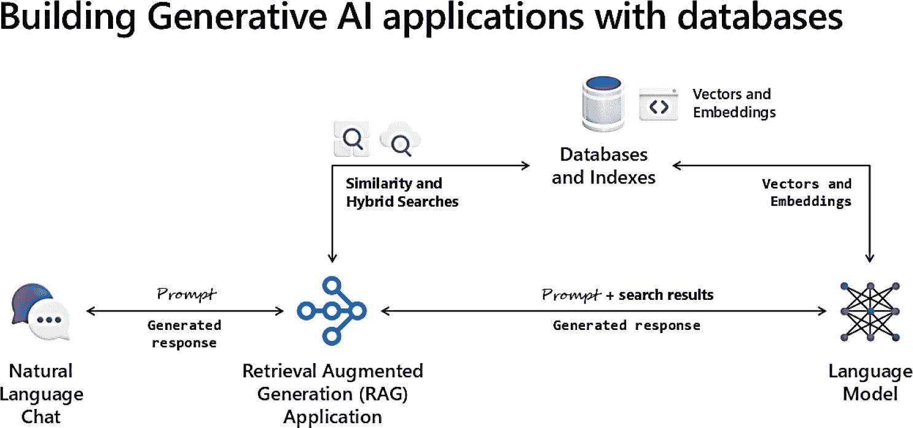
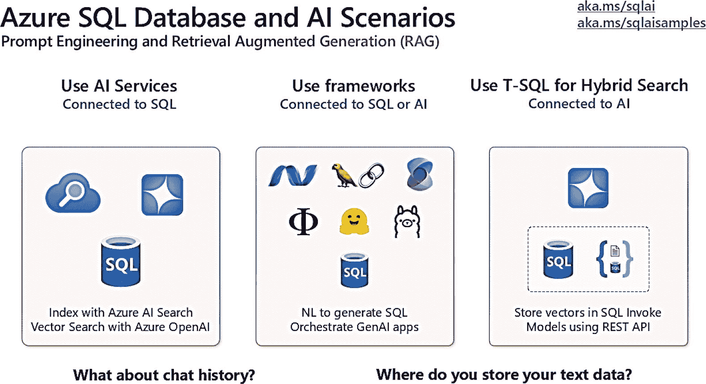
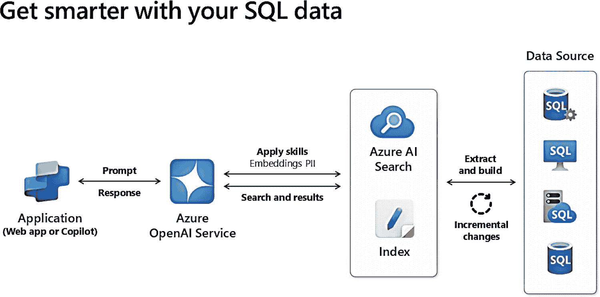
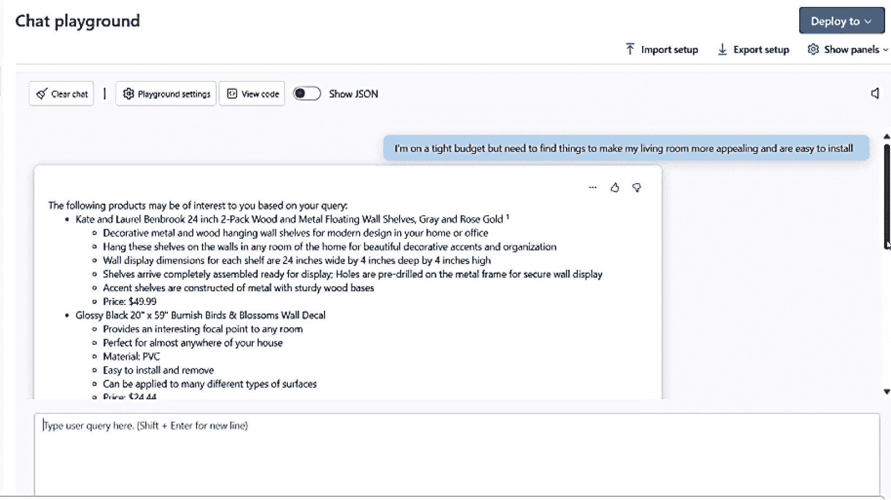
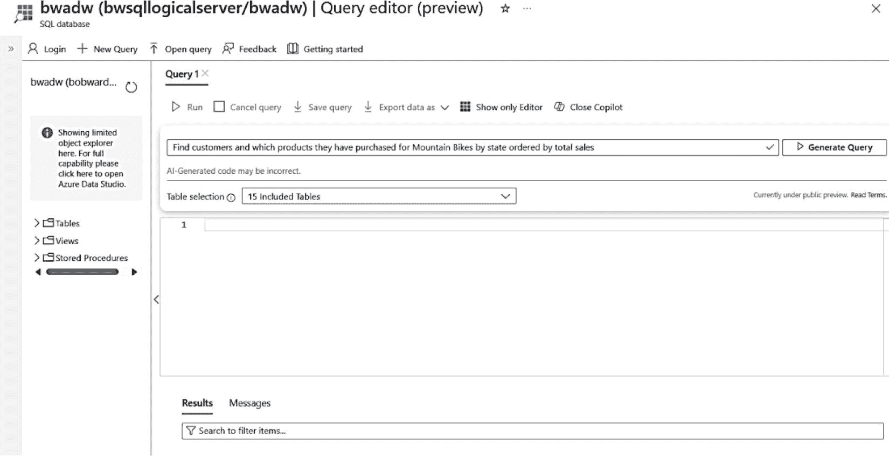
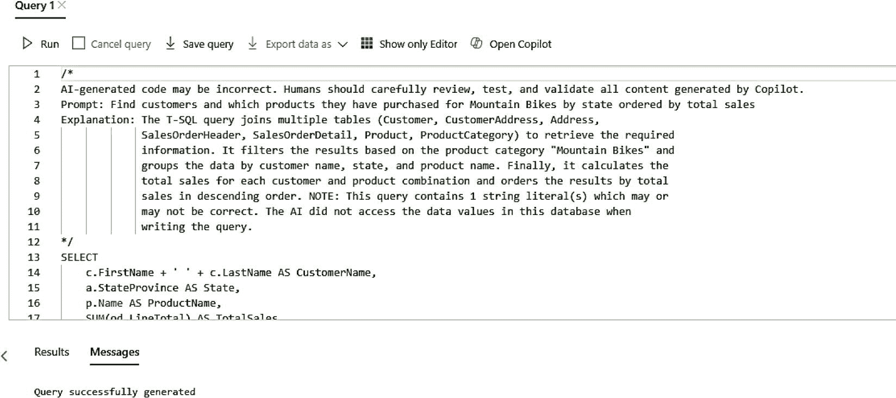
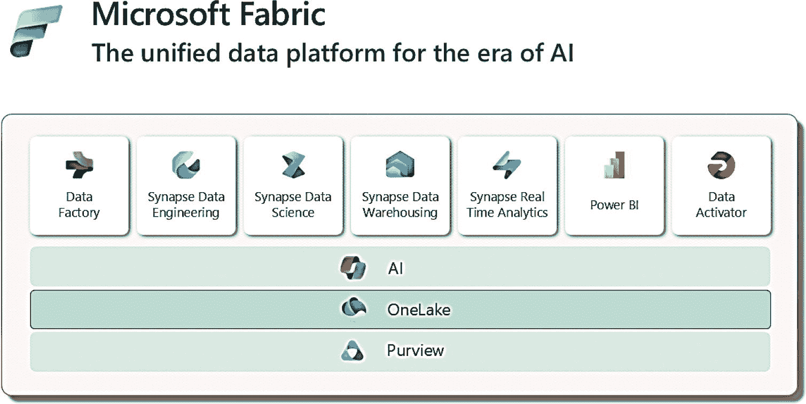
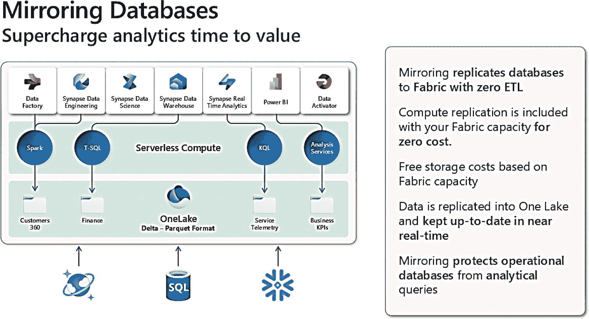
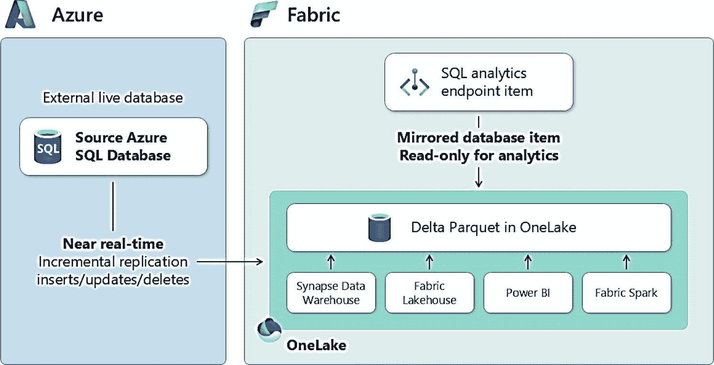
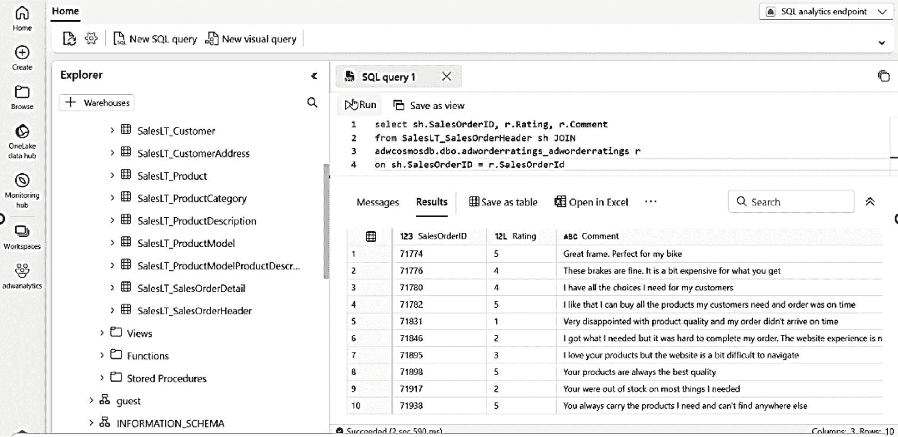

# 容器

在过去几年里，容器是我所见过最出色的开发者创新之一。SQL Server 已作为容器得到完全支持，我在 *Pro SQL Server Linux*、*SQL Server 2019 Revealed* 和 *SQL Server 2022 Revealed* 这几本书中广泛讨论了这个主题。容器使得打包 *解决方案* 变得如此简单，包括那些与 SQL Server 集成的解决方案。

对于 Azure SQL，我们最近发布了一个名为 `Azure SQL 数据库的开发容器模板` 的概念，这是一个由我的同事 Carlos Robles 主导的项目。在上面列出的书中，我谈到 SQL 容器的一个主要优势是 *一致性*。我可以部署一个具有一致版本的 SQL 容器，甚至可以包含特定的数据库脚本或任何我想要的工具，这样环境就能跨平台（Linux、MacOS、Windows）或多云环境下，始终如一地满足我的要求。

开发容器模板扩展了这个概念，确保我拥有一个完全一致的开发环境，包括 SQL Server、开发者框架，甚至允许使用 SDK 风格 SQL 项目的开发者工具。此外，它们还与我们的 GitHub `sql-action` 实现了无缝集成。

请阅读 Carlos 的这篇博客来了解该主题：[`https://devblogs.microsoft.com/azure-sql/azure-sql-dev-containers`](https://devblogs.microsoft.com/azure-sql/azure-sql-dev-containers)。

> **注意**
>
> 当我上次与 Carlos 交流时，我们正在考虑的一个想法是打造一个*行为*类似 Azure SQL 数据库的 SQL 容器。换句话说，该容器将是一个无版本之分的数据库引擎，其功能和限制与 Azure SQL 数据库相匹配，从而为您提供与云极佳的兼容性。

## SQL 与 AI

我在本书第 7 章中讲述了我们在 Azure SQL 数据库中设计和构建 Microsoft Copilot 技能的故事。同样在 2023 年夏天，我们的团队深知需要在 Azure SQL 上进行投资，以支持生成式 AI (GenAI) 应用程序。我们的 Copilot 是一个 AI 助手，也是 GenAI 应用程序的一个好例子。实际上，这个应用程序使用了检索增强生成 (RAG) 模式。RAG 模式是指应用程序*增强*发送给语言模型的提示。

我们也知道，GenAI 应用程序的一个常用技术是使用 `embeddings` 的概念来执行 `向量搜索`（有时也称为相似性搜索）。嵌入是由 AI 模型生成的向量，并由 AI 模型理解。它们对于对数据执行*更智能*的搜索非常强大。用于此目的的大多数 AI 模型被称为语言模型，其规模从大型语言模型 (LLM) 到小型语言模型 (SLM) 不等。

图 10-7 是我经常展示如何将这个故事组合在一起的示意图。



*图 10-7. 结合数据库的 GenAI 应用程序基础*

这个示意图主要需要关注两个概念：

*   您可以使用标准的 SQL 搜索技术来获取数据上下文，并用这些数据结果增强提示，然后发送给语言模型，从而构建 RAG 模式应用程序。
*   或者，您可以使用语言模型根据数据库中的文本数据生成嵌入，并将其作为向量存储在表的列中。这使得 SQL 现在成为一个支持*原生向量*的*向量存储*。然后，您可以获取应用程序的提示来生成该文本的嵌入。接着，您可以使用向量搜索将提示的嵌入与数据库中的嵌入进行比较。有些模型是专门为此目的设计的，称为嵌入模型（许多通用语言模型也可以生成嵌入，但嵌入模型通常更精确）。使用 SQL 来实现这种方法有优势，因为您可以将向量搜索与标准的 SQL 搜索技术结合起来。我称之为 `混合搜索`。

您可以更进一步，将混合搜索的结果用来增强发送给语言模型的提示，从而创建更精确的 RAG 模式。

现在，让我们看看如何使用这些技术通过 SQL 构建 GenAI 应用程序的具体方法。此外，我们还将探讨一种使用 Copilot 体验来生成 SQL 查询的不同方式。

### GenAI 与 SQL

要开始使用 GenAI 和 SQL，让我们看一个简单的例子，它与 SQL 引擎内的 AI 模型进行交互。此示例使用了我在本章前面描述过的 REST API 支持，它来源于我的同事 Brian Spendolini 的一篇博客文章：[`https://devblogs.microsoft.com/azure-sql/using-openai-rest-endpoints-with-azure-sql-database`](https://devblogs.microsoft.com/azure-sql/using-openai-rest-endpoints-with-azure-sql-database)：

```sql
-- 声明一个变量来存储 API 端点
declare @url nvarchar(4000)
= N'https://skynetbeta.openai.azure.com/openai/deployments/chattykathy/chat/completions?api-version=2023-07-01-preview';
declare @headers nvarchar(102) = N'{"api-key":"1001001sos1001001indistress"}'
-- 声明一个变量来存储 POST 请求的有效负载（请求体）。
declare @payload nvarchar(max) = N'{"messages":[[{"role":"system","content":"You are an AI assistant that helps people find information."},
{"role":"system","content":"Why is the sky blue?"}]}'
-- 声明用于存储过程返回状态和 API 响应内容的变量
declare @ret int, @response nvarchar(max);
exec @ret = sp_invoke_external_rest_endpoint
@url = @url,
@method = 'POST',
@headers = @headers,
@payload = @payload,
@timeout = 230,
@response = @response output;
-- 显示存储过程的返回代码和 API 的响应
select @ret as ReturnCode, @response as Response;
```

在这个例子中，AI 模型的 URL 是虚构的。在本节后面，您将看到一个 Azure 中 OpenAI 模型的例子。这里的一个关键点是，您可以通过 REST 端点向任何 AI 模型发送*提示*。在这个案例中，我们只是向一个*语言模型*提出一个问题。请注意，输入或有效负载包含一个提供行为指令的系统消息和一个问题。

以下是 JSON 格式的响应片段：

```json
"choices": 
{
"index": 0,
"finish_reason": "stop",
"message": {
"role": "assistant",
"content": "The sky appears blue because when the sun's light enters Earth's atmosphere,
it is scattered by the gases and particles in the air. This scattering causes the shorter
blue wavelengths of light to be dispersed more than the other colors in the spectrum.
This is known as Rayleigh scattering. As a result, when we look up at the sky during
the day, we see it as blue."
},
```

这个例子可能并不代表您会如何使用 SQL 与语言模型交互，所以让我们看看您可以用于 Azure SQL 上 GenAI 应用程序的三种类型方法，如图 [10-8 所示。



*图 10-8. Azure SQL 的 AI 场景*

让我们进一步探讨图中的场景和其他概念。


#### 使用 AI 服务

第一个场景常用于构建"与你的数据聊天"的体验，其组件位于 SQL 之外。图 10-9 展示了这些组件如何协同工作的示意图。



图 10-9：将 Azure AI 服务与你的数据结合使用

Azure OpenAI 服务与 Azure AI 搜索索引紧密集成。在此场景中，你可以基于 Azure SQL 数据库表构建 Azure AI 搜索索引。在构建索引时，可以对该索引应用`技能`。其中一项技能是根据表中的列在索引中生成嵌入。你还可以应用其他技能，包括内容审核，以剔除任何个人身份信息（PII）。

构建好此索引后，你现在可以构建一个生成式 AI 应用程序，使用带有嵌入的向量搜索或 RAG（检索增强生成）模式来查询索引。一个简单的方法是使用 Azure AI Studio。该工具允许你测试各种类型的提示，这些提示会被转换为针对索引的向量和/或混合搜索。你可以使用`聊天演练场`，如图 10-10 所示。



图 10-10：测试 Azure 搜索索引的聊天演练场示例

注意，提示是一个使用了诸如“紧预算”和“吸引人”等词语的不精确问题。这正是语言模型大放异彩的地方，因为它们能理解这些词语，并可以使用嵌入找到正确的结果，并以非常易于理解的方式进行格式化。你甚至可以在演练场中进行测试，并构建一个简单的应用程序或在你数据上构建你自己的`Copilot`。

同时请注意，在图 10-10 中，Azure AI 搜索索引可以使用 Azure SQL 支持的变更数据捕获（CDC）等功能，从底层 SQL 数据中自动更新。

有关如何亲自尝试的端到端步骤，请参阅[`https://aka.ms/sqlaisamples`](https://aka.ms/sqlaisamples)。

#### 使用 T-SQL 进行混合搜索

利用我在图 10-7 及本章前面描述的概念，你可以使用 T-SQL 中的新功能在 SQL 内部执行混合搜索，包括使用 REST API 和新的 T-SQL 函数来处理嵌入。

我的同事 Pooja Kamath 和 Davide Mauri 撰写了一篇博客文章，宣布了`原生向量支持`的私人预览版，你可以在[`https://devblogs.microsoft.com/azure-sql/announcing-eap-native-vector-support-in-azure-sql-database`](https://devblogs.microsoft.com/azure-sql/announcing-eap-native-vector-support-in-azure-sql-database)阅读。

在此示例中，概念是：

- 使用 REST API 调用 Azure OpenAI 的嵌入模型，根据数据库中的文本（对食物的客户评论）生成嵌入。嵌入以 JSON 格式返回。
- 使用新的 T-SQL 支持将 JSON 中的嵌入转换为二进制格式，并将其存储在`varbinary`列中。
- 从应用程序获取提示，使用 REST API 获取提示的嵌入并将其转换为二进制。
- 使用称为`向量距离`的概念，对提示和数据库中的评论进行向量搜索比较，如下所示：

```
--假设你有一个存储过程，用于获取给定文本的嵌入
DECLARE @e VARBINARY(8000);
EXEC dbo.GET_EMBEDDINGS @model = '', @text = 'healthy options instead of coke', @embedding = @e OUTPUT;
SELECT TOP(10) ProductId,
Summary,
Text,
VECTOR_DISTANCE('cosine',@e, VectorBinary) AS Distance
FROM dbo.FineFoodReviews
ORDER BY Distance;
```

距离数值越小，搜索结果越`相似`。在此示例中，我们构建了一个 SQL 存储过程`GET_EMBEDDINGS`，它在后台使用 REST API 和语言模型，如下所示：

```
CREATE PROCEDURE [dbo].[GET_EMBEDDINGS]
(
@model VARCHAR(MAX),
@text NVARCHAR(MAX),
@embedding VARBINARY(8000) OUTPUT
)
AS
BEGIN
DECLARE @retval INT, @response NVARCHAR(MAX);
DECLARE @url VARCHAR(MAX);
DECLARE @payload NVARCHAR(MAX) = JSON_OBJECT('input': @text);
-- 在 EXEC 语句之前，使用正确的连接设置@url 变量
SET @url = 'https://.openai.azure.com/openai/deployments/' + @model + '/embeddings?api-version=2023-03-15-preview';
EXEC dbo.sp_invoke_external_rest_endpoint
@url = @url,
@method = 'POST',
@payload = @payload,
@headers = '{"Content-Type":"application/json", "api-key":""}',
@response = @response OUTPUT;
-- 使用 JSON_QUERY 直接提取嵌入数组
DECLARE @jsonArray NVARCHAR(MAX) = JSON_QUERY(@response, '$.result.data[0].embedding');
SET @embedding = JSON_ARRAY_TO_VECTOR(@jsonArray);
END
GO
```

既然你能获取向量距离，就可以将其与其他 SQL 搜索方法或混合搜索结合使用，如下所示：

```
-- 假设你有一个存储过程，用于获取给定文本的嵌入
DECLARE @e VARBINARY(8000);
EXEC dbo.GET_EMBEDDINGS @model = '', @text = 'quick fix breakfast option for toddlers', @embedding = @e OUTPUT;
-- 包含多个过滤器的综合查询。
SELECT TOP(10)
f.Id,
f.ProductId,
f.UserId,
f.Score,
f.Summary,
f.Text,
VECTOR_DISTANCE('cosine', @e, VectorBinary) AS Distance,
CASE
WHEN LEN(f.Text) > 100 THEN '详细评论'
ELSE '简短评论'
END AS ReviewLength,
CASE
WHEN f.Score >= 4 THEN '高分'
WHEN f.Score BETWEEN 2 AND 3 THEN '中等分数'
ELSE '低分'
END AS ScoreCategory
FROM FineFoodReviews f
WHERE
f.UserId NOT LIKE 'Anonymous%' -- 基于用户的过滤器，排除匿名用户
AND f.Score >= 2 -- 分数阈值过滤器
AND LEN(f.Text) > 50 -- 用于筛选详细评论的文本长度过滤器
AND (f.Text LIKE '%gluten%' OR f.Text LIKE '%dairy%') -- 包含特定词语
ORDER BY
Distance,  -- 按距离排序
f.Score DESC, -- 次要按评论分数排序
ReviewLength DESC; -- 第三按评论长度排序
```

现在想象一下，结合使用 JSON、正则表达式、空间、不等式和等式运算符以及向量距离，利用 SQL 的强大功能真正执行更智能的搜索。这超越了传统关系型数据库管理系统（RDBMS）的能力！

请记住，你还可以像 Davide Mauri 在这篇博文中展示的那样，将混合搜索的结果*与 RAG 模式结合使用*：[`https://devblogs.microsoft.com/azure-sql/rag-with-azure-sql`](https://devblogs.microsoft.com/azure-sql/rag-with-azure-sql)。

**注意**

这个故事只会越来越好。这包括对向量数据类型、索引以及其他 T-SQL 内置功能的支持，以使整个混合搜索方案变得更简单、更精简，并与你的应用程序无缝集成。我将把这些内容留给下一本书。

使用 SQL 引擎来驱动你的生成式 AI 应用程序有许多好处，包括：

- T-SQL 语言的熟悉度
- 集成到查询处理器和数据类型中
- 受益于引擎的扩展性，包括 Azure SQL 超大规模
- 使用你信任的安全边界，包括引擎内的身份验证和访问控制


## SQL 与生成式 AI 集成：关键考量

#### 使用框架

虽然利用 SQL 引擎有优势，但您仍需要使用驱动程序或提供程序来连接和执行查询。一个可用的例子是用于 Entity Framework Core 的，您可以在 [`https://github.com/Azure-Samples/azure-sql-db-vector-search/tree/main/EFCoreVectors`](https://github.com/Azure-Samples/azure-sql-db-vector-search/tree/main/EFCoreVectors) 找到。

此外，拥有一套能够*协调*为生成式 AI 应用程序使用 SQL 活动的库（框架）会很有帮助。

当今两个流行的框架是 `LangChain` 和 `Semantic Kernel`，它们都是开源库。`LangChain` 和 `Semantic Kernel` 都内置了对 SQL 的支持，并且随着我们进一步构建向量存储方案，也会将 SQL 作为向量存储包括进来。`LangChain` 还提供了一个库，帮助您根据自然语言提示从您的数据库架构生成 SQL 查询。

您可以在 [`https://github.com/microsoft/semantic-kernel/tree/main/dotnet/src/Connectors/Connectors.Memory.SqlServer`](https://github.com/microsoft/semantic-kernel/tree/main/dotnet/src/Connectors/Connectors.Memory.SqlServer) 了解更多关于 `Semantic Kernel` 对 SQL 的支持。

您可以在 [`https://python.langchain.com/v0.2/docs/integrations/tools/sql_database`](https://python.langchain.com/v0.2/docs/integrations/tools/sql_database) 了解更多关于 `LangChain` 对 SQL 的支持。

#### 聊天历史如何处理？

当今许多生成式 AI 应用程序都是使用提示的聊天体验。我们观察到，大多数此类聊天体验除了需要用户对聊天体验的反馈外，还需要存储聊天历史（并带有用户权限）。数据库似乎是存储此类数据的天然选择，因此 Azure SQL 可能是一个很好的候选方案。目前这个领域还没有很多标准，但我预计未来会出现。

一个可用于聊天历史和反馈的架构示例来自开源项目 `ChainLit`（用于构建聊天机器人），网址为 [`https://docs.chainlit.io/data-persistence/custom`](https://docs.chainlit.io/data-persistence/custom)。

#### 您的文本数据存储在哪里？

所有生成式 AI 示例都提供对文本数据的智能搜索，因为这类数据是语言模型的天然适配对象（尽管也存在支持视频、音频、图像等的语言模型）。

虽然 SQL 可以在许多情况下用于存储文本以及作为其他列的文本属性，但我见过许多客户将他们想要用于生成式 AI 的文本数据存储在其他存储系统中，包括文件系统、Azure Storage、S3 等。这些可能是 JSON 文档、文本文件、CSV 文件，以及更突出的 PDF 文档。

因此，在您审视生成式 AI 时，您应该考虑将此文本数据存储在 Azure SQL 中是否合理，并将文本与其他属性一起在列中分类，以证明与 AI 模型的混合搜索是可行的。

一个值得考虑的资源是使用 Python 库（如 [`https://pypi.org/project/pypdf`](https://pypi.org/project/pypdf)）来帮助您将 PDF 提取为文本以插入 SQL。PDF 文件非常普遍，我认为这将是未来需要关注的一个场景。

#### 资源

收藏以下资源，以随时了解我们关于 SQL 和 AI 的所有最新内容：

[`https://aka.ms/sqlai`](https://aka.ms/sqlai) – 这是我们文档中所有关于 SQL 和 AI 主题的一站式中心。

[`https://aka.ms/sqlaisamples`](https://aka.ms/sqlaisamples) – 这是一个包含代码示例的 GitHub 仓库。

[`https://aka.ms/sqlaiworkshop`](https://aka.ms/sqlaiworkshop) – 这是我的同事 Muazma Zahid、我以及我们团队的其他成员构建的一个研讨会，可以全面了解 SQL 和 AI。

另一个关于我们能力的良好总结可以在我的博客文章中找到：[`https://www.microsoft.com/sql-server/blog/2024/06/26/getting-started-with-delivering-generative-ai-capabilities-in-sql-server-and-azure-sql`](https://www.microsoft.com/sql-server/blog/2024/06/26/getting-started-with-delivering-generative-ai-capabilities-in-sql-server-and-azure-sql)。在这篇博客文章中，我还引用了一个我与著名的 Microsoft Mechanics 团队录制的视频，您可以在 `https://aka.ms/SQLAIMechanics` 观看。

### 自然语言转 SQL 查询

你已经在整本书中看到了 Microsoft Copilot 技能在 Azure SQL Database 中的应用示例，这些技能可帮助你管理和排查 Azure SQL 的问题。我们开发了另一种 AI 辅助体验，称为 **自然语言转 SQL 查询**。

此体验现已通过 Azure 门户中的查询编辑器在数据库上下文中可用。此功能使用 RAG 模式，将你的架构（包括表名、列名和键）传递给语言模型以生成 SQL 查询。

了解其工作原理的最佳方式是亲眼看看实际操作。我导航到了在本书中创建的名为 **bwadw** 的数据库，该数据库在部署时使用了示例 AdventureWorksLT。

我从“服务”菜单中选择了查询编辑器并登录。现在，查询编辑器中有一个新选项 **Open Copilot**。当我点击它时，会出现一个新的编辑框，用于输入与我的数据库上下文相关的自然语言语句，如图 10-11 所示。



图 10-11
使用自然语言为多连接场景生成 SQL

从我使用的文本可以看出，查询可能需要使用多个表，这通常需要几次连接。**表选择**选项允许我在编辑器中建议 Copilot 使用哪些表来为模型的 RAG 模式提供信息。此功能不使用你的数据，仅使用你的架构。默认是使用所有表。

如果我选择 **生成查询**，然后选择 **接受**，我将得到如图 10-12 所示的生成查询。



图 10-12
为多连接场景生成的查询

这里没有显示完整的查询，但我想向你展示生成的注释，它解释了查询的生成内容。你可以在代码片段中看到连接多个表所需的 T-SQL。完整的查询如下：

```sql
SELECT
c.FirstName + ' ' + c.LastName AS CustomerName,
a.StateProvince AS State,
p.Name AS ProductName,
SUM(od.LineTotal) AS TotalSales
FROM
SalesLT.Customer AS c
JOIN SalesLT.CustomerAddress AS ca ON c.CustomerID = ca.CustomerID
JOIN SalesLT.Address AS a ON ca.AddressID = a.AddressID
JOIN SalesLT.SalesOrderHeader AS oh ON c.CustomerID = oh.CustomerID
JOIN SalesLT.SalesOrderDetail AS od ON oh.SalesOrderID = od.SalesOrderID
JOIN SalesLT.Product AS p ON od.ProductID = p.ProductID
JOIN SalesLT.ProductCategory AS pc ON p.ProductCategoryID = pc.ProductCategoryID
WHERE
pc.Name = 'Mountain Bikes'
GROUP BY
c.FirstName + ' ' + c.LastName,
a.StateProvince,
p.Name
ORDER BY
TotalSales DESC;
```

你可以看到，为了支持像“按州”和“按...排序”这样的自然语言语句，生成了所有必需的连接和聚合。

我现在可以通过选择“运行”来获取并执行该查询，或者将生成的查询放到我喜欢的 SQL 工具中运行。

另一个我觉得很有趣的例子是生成一个允许你在关系表中导航层次结构的查询。所以，我在编辑器中向 Copilot 提供了以下提示：

```text
Find the heirarchy of product categories at any level
```

> 注意
> 我故意拼错了 hierarchy（层次结构）这个词，看看它是否仍然有效。

编辑器中的 Copilot 生成了以下查询：

```sql
WITH RecursiveCTE AS (
SELECT
ProductCategoryID,
Name,
ParentProductCategoryID,
0 AS Level
FROM
SalesLT.ProductCategory
WHERE
ParentProductCategoryID IS NULL
UNION ALL
SELECT
pc.ProductCategoryID,
pc.Name,
pc.ParentProductCategoryID,
rc.Level + 1
FROM
SalesLT.ProductCategory pc
INNER JOIN
RecursiveCTE rc ON pc.ParentProductCategoryID = rc.ProductCategoryID
)
SELECT
ProductCategoryID,
Name,
ParentProductCategoryID,
Level
FROM
RecursiveCTE
ORDER BY
Level, ProductCategoryID;
```

太棒了。生成的查询是递归公用表表达式（CTE）的一个例子。你可以在 [`https://learn.microsoft.com/sql/t-sql/queries/with-common-table-expression-transact-sql?view=sql-server-ver16#guidelines-for-defining-and-using-recursive-common-table-expressions`](https://learn.microsoft.com/sql/t-sql/queries/with-common-table-expression-transact-sql?view=sql-server-ver16#guidelines-for-defining-and-using-recursive-common-table-expressions) 了解更多关于此查询技术的信息。我相信此功能将帮助许多人构建从最简单到最复杂的 SQL 查询，为你节省时间和精力。

我与负责该项目的产品经理 Joe Sack（他也恰好是本书的技术编辑）讨论了这个功能。他对我说：“Bob，你知道这个 Copilot 可以为系统目录视图和 DMV 生成查询吗？” 我回答：“呃，不知道。” 我们知道所有系统目录视图和 DMV 的架构，因此我们可以轻松地将任何这些元数据传递给语言模型。所以，我尝试了两个例子：

**显示此数据库中占用空间最多的表**

生成的查询如下：

```sql
SELECT
t.NAME AS TableName,
s.Name AS SchemaName,
p.rows AS RowCounts,
SUM(a.total_pages) * 8 AS TotalSpaceKB,
SUM(a.used_pages) * 8 AS UsedSpaceKB,
(SUM(a.total_pages) - SUM(a.used_pages)) * 8 AS UnusedSpaceKB
FROM
sys.tables t
INNER JOIN
sys.indexes i ON t.OBJECT_ID = i.object_id
INNER JOIN
sys.partitions p ON i.object_id = p.OBJECT_ID AND i.index_id = p.index_id
INNER JOIN
sys.allocation_units a ON p.partition_id = a.container_id
LEFT OUTER JOIN
sys.schemas s ON t.schema_id = s.schema_id
WHERE
t.NAME NOT LIKE 'dt%'
AND t.is_ms_shipped = 0
AND i.OBJECT_ID > 255
GROUP BY
t.Name, s.Name, p.Rows
ORDER BY
TotalSpaceKB DESC;
```

这是对目录视图的一个很好的测试。

那么 DMV 呢？我尝试了这个提示：

**显示此数据库中排名靠前的抢占式等待**

生成的查询正是我想要的：

```sql
SELECT TOP 10 wait_type, wait_time_ms, signal_wait_time_ms
FROM sys.dm_os_wait_stats
WHERE wait_type LIKE 'PREEMPTIVE%'
ORDER BY wait_time_ms DESC;
```

我知道 Joe 和团队正在测试在此功能中可以实现的各种选项，所以我非常期待看到它的未来。


## SQL 与 Microsoft Fabric

在《SQL Server 2022 揭秘》一书中，我介绍了一项名为 `Synapse Link` 的功能。其概念是将数据从 Azure SQL 或 SQL Server 同步到 Azure Synapse，然后捕获更改并将其输送到 Synapse，以实现实时分析解决方案。

2023 年，我们发布了一个名为 Microsoft Fabric 的新数据平台，它包含了所有类型的数据解决方案，包括分析。图 10-13 展示了 Microsoft Fabric 的直观图景。



图 10-13

Microsoft Fabric

你可以看到 Synapse 现在是 Fabric 大家庭的一部分。但更重要的是，一个名为 `OneLake` 的概念是这个故事的关键部分。

OneLake 在文档中被定义为“OneLake 是适用于整个组织的单一、统一、逻辑数据湖。数据湖处理来自各种来源的大量数据。”我最喜欢的是 OneLake 主要文档页面的标题，它写着 **OneLake，数据的 OneDrive** ([`https://learn.microsoft.com/fabric/onelake/onelake-overview`](https://learn.microsoft.com/fabric/onelake/onelake-overview))。我喜欢这个描述，因为我将我的 OneDrive 视为一个可以随时存储任何类型文件的地方。

但我认为 OneLake 的一个关键区别在于，其通用数据格式是 `Delta`。Delta 是一种基于 Parquet 的文件格式，非常容易像查询表一样查询数据。这意味着 Fabric 团队可以为你提供一个 `SQL endpoint`，来查询 OneLake 中任何采用 Delta 格式的数据。

现在回到 Synapse Link 的故事。**带有 Synapse Link 的 Azure SQL** 使用 parquet 文件将表初始同步到暂存区。Synapse 然后获取这些数据并创建 Synapse 池表。Azure SQL 随后使用基于事务日志的新更改反馈架构将更改发送到暂存区，这些更改由 Synapse 消费并提交到池表中。

Fabric 使用了一个称为 `mirroring` 的概念。图 10-14 展示了 Fabric 的数据库镜像功能。



图 10-14

Fabric mirroring

**用于 SQL 的 Fabric mirroring** 与 SQL 的 Synapse Link 功能基本相同，只是数据存储在 Fabric OneLake 中，如图 10-15 所示。



图 10-15

用于 SQL 的 Fabric mirroring

在幕后，我们的 SQL 代码与用于 Azure SQL 和 SQL Server 的 Synapse Link 几乎相同，只是暂存区位于 Fabric 中。Fabric 现在自动将该数据以 Delta 格式复制到 OneLake 中。

既然数据已经在 OneLake 中，整个 Fabric 生态系统就对你的 SQL 数据可用。图 10-16 展示了一个使用 SQL Analytics 端点针对 SQL 镜像数据运行 SQL 查询的示例。



图 10-16

在 Fabric 中使用 SQL Analytics 端点

现在想象一下，可以将此数据与 OneLake 中的任何其他数据连接，或使用此数据构建 Power BI 报表。

Synapse Link 目前仍然受支持，但我们在该领域的未来方向是镜像。以下是一些显著区别：

*   镜像支持 DDL 更改，例如添加/删除列。
*   即使在 Fabric 中，你的数据也不会发送到 Synapse。它存储在 OneLake 中，所有针对此数据的查询都使用无服务器查询。

我们已经为 Azure SQL Managed Instance 提供了镜像预览版，我预计很快也会为 VM 中和本地的 SQL Server 提供镜像。请访问 [`https://aka.ms/sqldbmirroring`](https://aka.ms/sqldbmirroring) 获取开始使用的所有详细信息。你可以在 [`https://aka.ms/sqlaisamples`](https://aka.ms/sqlaisamples) 查看在 Fabric 中将 SQL 镜像与 AI 结合使用的示例。

## Azure Arc

本章最后一个不属于图 10-1 中“超越 RDBMS”范畴的主题是 **Azure Arc**。我将 Azure Arc 纳入本章是因为我在本书第一版中简要提到过它，并且值得再次重点介绍。我还在《SQL Server 2022 揭秘》一书中广泛涉及了这个主题。

Azure Arc 是一个简单而强大的概念。这不是在 Azure 中部署 SQL，而是将你现有的本地或其他云中的 SQL Server *连接*到 Azure。

连接意味着在你的 VM 内或安装 SQL Server 的机器上运行轻量级代理。这些代理将你连接到 Azure，为你提供额外功能，并使其*感觉*像在 Azure 中运行。我们称之为 Azure Arc 启用的 SQL Server。

Arc 的一个强大方面是，我们可以在不更改 SQL Server 的情况下持续添加功能，同时也可以利用新主要版本带来的新功能。Azure Arc 启用的 SQL Server 每月更新一次。截至本书撰写时，以下是 Arc 为你提供的功能列表：

*   从 Azure 门户**大规模管理你的 SQL Server 实例**
*   **最佳实践评估**，查看服务器和数据库当前配置可能存在的问题
*   为 SQL Server 2022 提供的**Microsoft Entra 身份验证**支持
*   我们在本书第 6 章详细介绍的**Microsoft Defender for Cloud**
*   我们在本书第 6 章介绍的、针对 SQL Server 2022 的**Microsoft Purview** 支持
*   SQL Server 的**按需付费许可**，特别是对于不常使用的 SQL Server 实例，可以节省许可成本
*   针对旧版 SQL Server 的**扩展安全更新**
*   **性能仪表板**，为你提供 SQL Server 性能的轻量级可视化
*   **迁移评估**，持续检查你迁移到 Azure SQL 选项的能力

请访问 [`https://aka.ms/arcsqlserver`](https://aka.ms/arcsqlserver) 了解有关 Azure Arc 启用的 SQL Server 的更多信息。


## 前景展望

我认为 Azure SQL 的前景非常光明，尤其是在本章描述的领域。我对此有一些未来的思考。这些都不是来自 Microsoft 的承诺或功能保证，但我认为分享我的见解很重要。在接下来的一年左右，我们将看看我的直觉是否正确。

### 小型语言模型 (SLM) 的使用

我认为如今许多人正在为 AI 应用程序*过度配置*大型语言模型，因为没有人真正知道如何为语言模型“确定合适的规模”。我认为 `SLM` 的使用将会变得流行，因为它们成本更低，消耗的资源更少。然而，找到合适的模型和规模将成为 AI 领域的下一组挑战。

### NL2SQL 框架

向量搜索对于文本数据效果很好，你可以将其与混合搜索结合。但考虑一下希望由 AI 生成所有 SQL 的开发人员。因此，我认为你可能会看到更多框架被用于生成 `NL2SQL`，并且这些 SQL 可能包含混合搜索。

### 生成式人工智能从本地到云端

如果我们遵循我们如何承担其他重大投资的模式，我预计 `SQL Server` 将会出现支持 `GenAI` 应用程序的功能。我在 2024 年看到像 Dell、HPE、Nvidia、AMD 和 Red Hat 这样的公司强调 AI 应用程序不需要在公共云中运行。Microsoft 恰好拥有地球上最流行的数据库之一 `SQL Server`，所以……

### 更多且增强的 Copilot 体验

Copilot 已经存在；这只是优化它们并确保它们以合适的速度运行并提供价值的问题。我认为 Microsoft 将继续投资于这个领域，包括我们运行 `Azure SQL`、`SQL Server` 和我们的工具的团队。

### JSON 和向量的增强功能

我们在 SQL 中的 `JSON` 和向量方面有一个良好的开端，但我们还需要更多，我预计你将看到我们更多的投入。

### 持续投资 Microsoft Fabric

在 2024 年，`Microsoft Fabric` 大受欢迎！它继续是一个流行的数据平台，我预计它将继续增长。我期望在未来能看到 `Microsoft Fabric` 带来新的、更深入的数据体验。

## 总结

我认为在本书最后一章的总结中，看看 Microsoft Word 中的 Copilot 是否能构建一个好的摘要是合适的。我觉得它相当不错，因此我将其原封不动地放在这里并用引号引用。

> “Azure SQL 提供了超越传统关系数据库管理系统 (RDBMS) 的高级功能。这些功能包括广泛的 `JSON` 支持，允许对 `JSON` 数据进行高效解析、转换、查询和格式化。此外，`Azure SQL` 支持正则表达式 (`RegEx`) 用于高级模式匹配和验证，增强了传统的 `T-SQL` 字符串函数。该平台还包括空间和图形数据类型，能够使用节点和边来建模和查询类似网络的数据结构。
>
> 此外，`Azure SQL` 提供列存储索引和内存优化，以显著提升查询性能。`SQL Ledger` 功能使用时间表来自动跟踪更改，通过加密哈希确保可审计性和数据完整性。智能查询处理 (`IQP`) 和自动调优功能可优化查询性能和应用程序效率。`Azure SQL` 还与 `REST` API 集成，允许直接从数据库引擎与外部服务进行无缝数据交换和交互。
>
> 最后，`Azure SQL` 支持 AI 应用程序和 DevOps 实践，包括 `GenAI` 和自然语言到 `SQL` 查询生成。该平台与 `GitHub Actions` 和容器集成，促进了现代开发工作流。数据 API 生成器 (`DAB`) 通过将数据库连接和架构转换为 `REST` 或 `GraphQL` 端点，简化了应用程序开发，减少了对大量连接代码的需求。这些高级功能使 `Azure SQL` 成为现代数据管理和应用程序开发的强大工具。”

