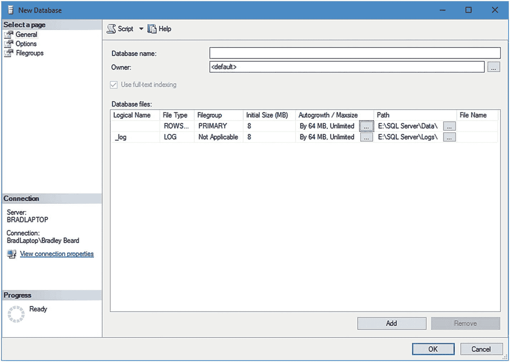
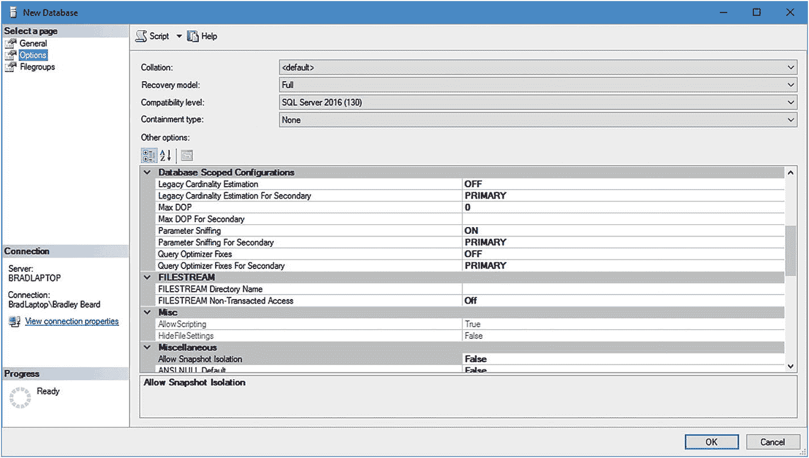
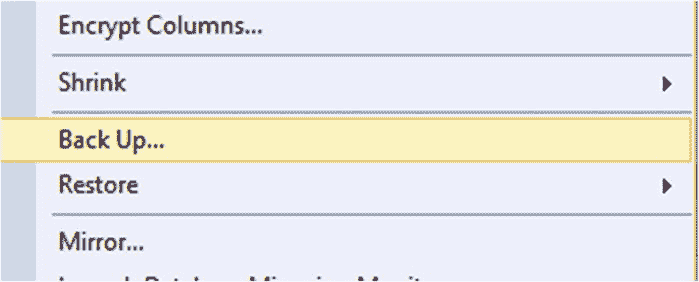
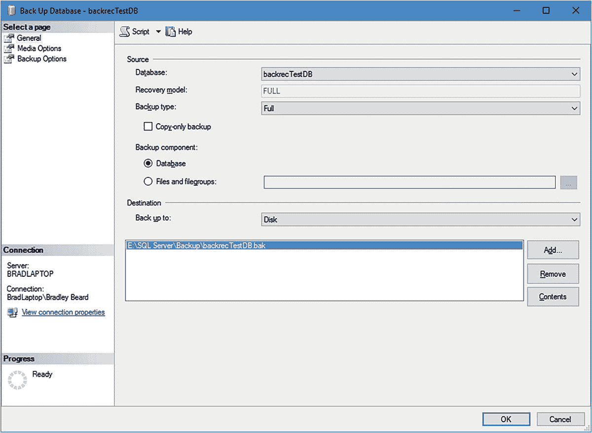
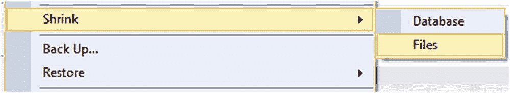
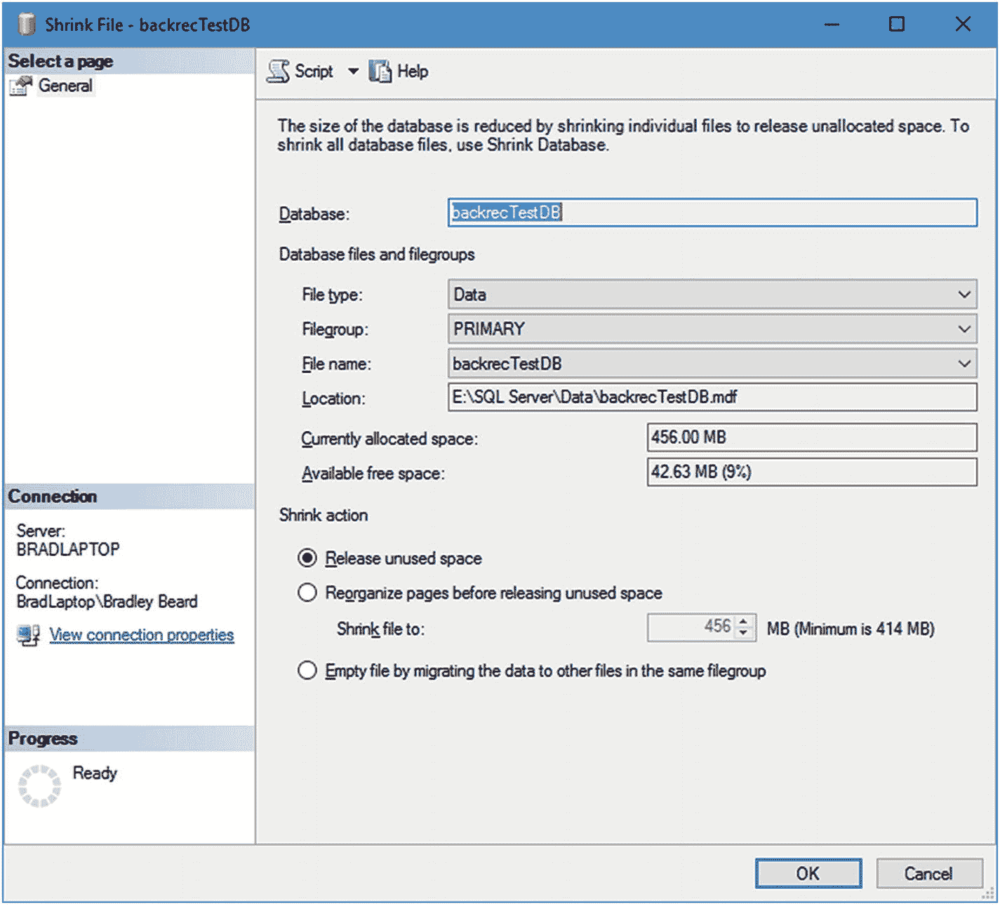
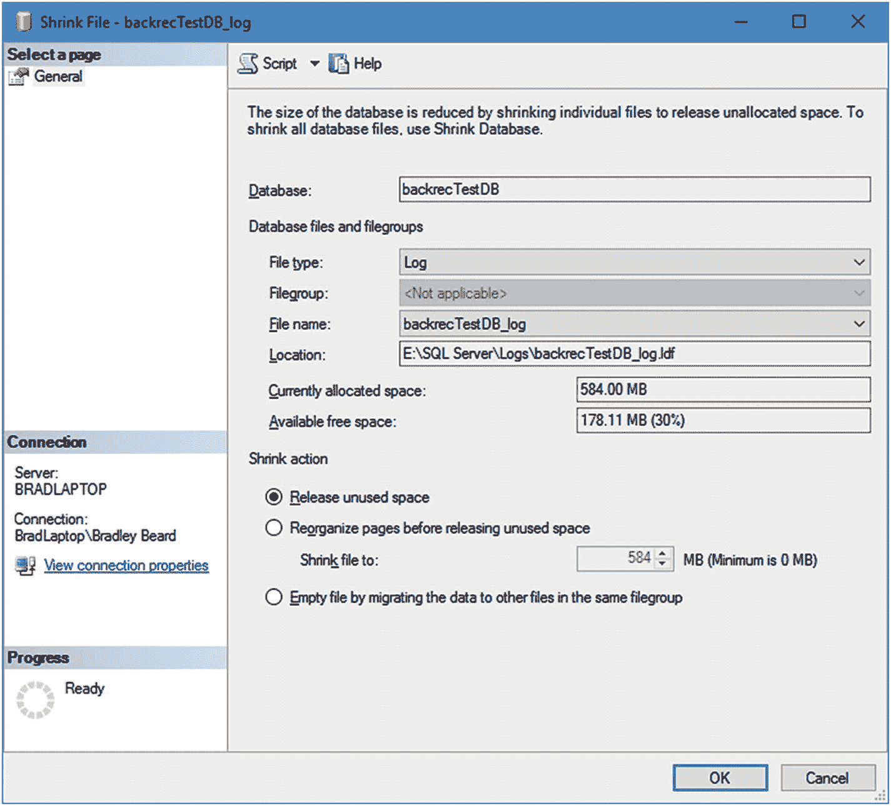
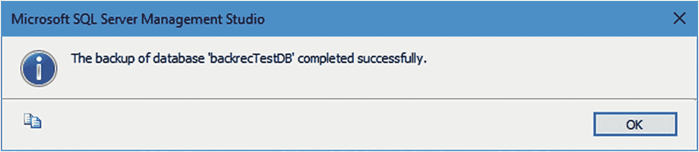
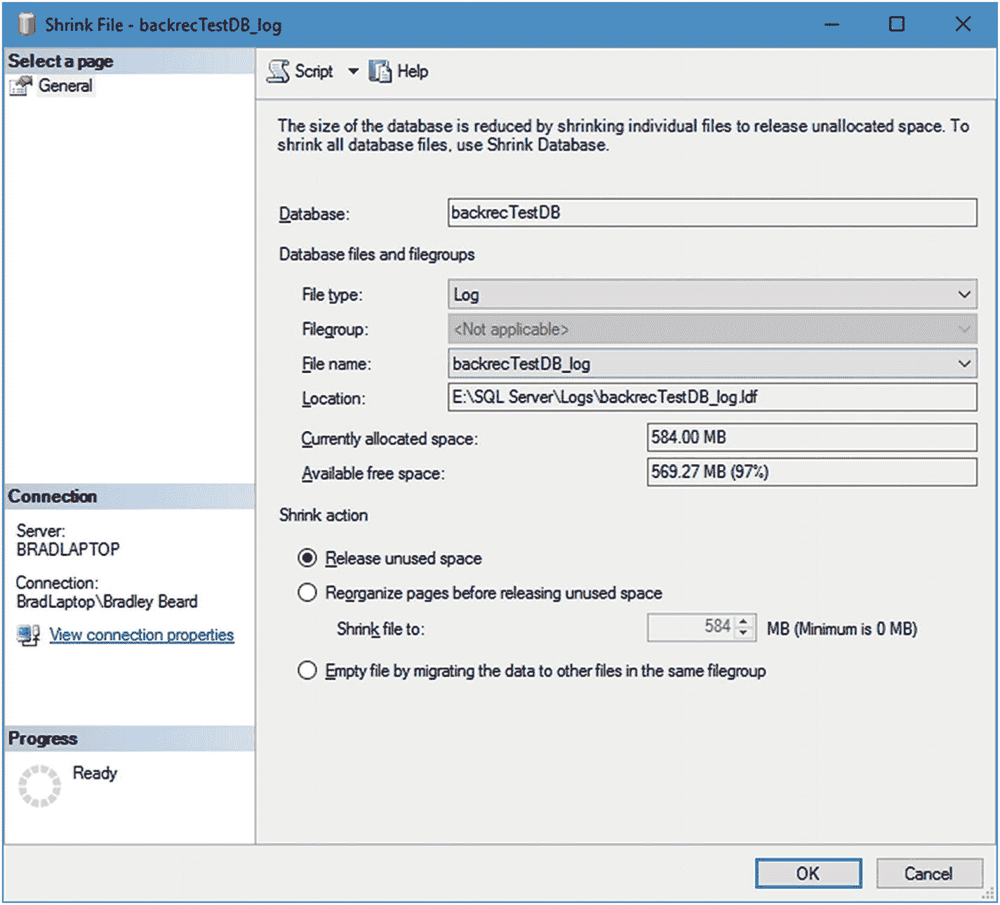

# 1. 完整备份

数据备份的概念本应极其直观，但在实践中却常常执行不力，甚至被完全忽视。我认识不少数据库管理员（DBA），他们并不担心定期、结构化的备份，因为他们的数据库服务器位于 SAN（存储区域网络）上，因此数据会自动定期备份。在我看来，这完全没有道理，因为除了恰好作为完整 Windows 备份方案一部分被备份的数据外，完全没有针对数据时间点恢复的应急措施。如果发生灾难性故障，DBA 必须将数据库重建到故障发生点，这将难以轻松完成。原因在于，必须从最后一次 Windows 备份重建整个 Windows 映像，这意味着数据库只能恢复到该特定时间点，而非所需的时间点。例如，如果 Windows 映像每晚运行，但数据库备份每小时运行一次，那么你将拥有一套完美的每小时备份集，直到 Windows 备份运行的时间点。如果 Windows 在晚上 11:59 分故障，那么当天所有的数据库备份都将丢失。通常的经验法则是将备份文件放在与操作系统不同的驱动器上。只要备份驱动器未损坏，这可以缓解前述问题。

在数据库管理领域，我认为最好将你的数据库服务器想象成一个独立的系统。这意味着想象没有 SAN、没有 Windows 备份方案，完全没有诸如此类的东西。你必须能够管理与你的服务器相关的整个数据宇宙。这具体意味着什么？这正是本书将要探讨的内容；如何备份和恢复你最重要的资产——你所负责的数据。

注意
我们也将简要介绍数据存储技术，尽管这不是主要重点。这是因为，虽然我们会重点介绍特定的存储技术，但最终是否实施本地文件系统可用技术之外的存储技术，取决于你的决定。

#### 什么是完整备份？

完整备份是指备份运行时数据库内的全部数据。完整备份也包含部分事务日志；这样做是为了最终能够使用备份的数据成功运行恢复。备份可以保存到本地磁盘、可用的网络共享，甚至 Windows Azure Blob 存储中（如果你运行的是 SQL Server 2012 或更高版本）。完整备份类型为完整恢复提供了起点，也为差异恢复（在第 6 章介绍）和事务日志恢复（在第 7 章介绍）提供了起点。换句话说，没有完整备份，既无法成功恢复差异备份，也无法成功恢复事务日志备份。

在我的第一本书《SQL Server 中的实用维护计划》（Apress 出版）中，我在第 1 章“备份数据库”中简要讨论了备份的概念。在该章中，我介绍了恢复模式和备份类型，然后解释了如何设置维护任务以自动执行这些作业。出于本书的目的，我认为我们不需要再回顾作业创建部分，但我们将介绍恢复模式和备份类型。

##### 恢复模式

恢复模式是告诉 SQL Server 如何恢复数据的方式。图 1-1 显示了查找恢复模式配置区域的位置。可以通过右键单击现有数据库并选择`属性`，然后从左侧菜单中选择`选项`来找到它。在所示示例中，我选择创建一个新数据库，因此你在图中看到的是“新建数据库”屏幕。


图 1-1. 新建数据库屏幕中的恢复模式位置

我将这个数据库命名为`backrecTestDB`，这将是我们贯穿本书使用的数据库。显然，你将维护你自己独立的数据库，但这将作为我们的参考。

请注意，我们位于`常规`选项卡上，如前面图中的左窗格所示。点击`选项`，你应该能看到如图 1-2 所示的内容。


图 1-2. 选项

`选项`区域的初始界面现在可见。

注意
请记住，我使用 SQL Server Management Studio (`SSMS`)来管理我的 SQL Server 2016 实例，该工具可从 Microsoft 单独下载。

在此屏幕的最顶部，第二个选项是恢复模式。恢复模式有三个选项。这些选项如下：

*   `完整`：此选项允许数据库恢复到几乎任何时间点，是许多 DBA 的明确选择。
*   `大容量日志`：与完整恢复类似，但此方案允许对大容量操作（特别是复制）进行最小化日志记录。
*   `简单`：这是针对小型、非关键任务数据库的选择。它不允许像完整恢复那样的时间点恢复，也不支持像大容量日志那样的大容量操作。它仅允许使用最后一次备份进行恢复。

我们将在这里保留`完整`选项，因为我们希望能在本书后面部分查看时间点恢复。

##### 备份类型

SQL Server 有三种独特的备份类型，将在后面的章节中讨论。它们各自表现不同，可以协同工作或单独工作，为你的数据提供备份解决方案。可供你使用的备份类型也完全取决于为数据库使用的恢复模式。我们稍后会更详细地讨论这一点。现在，让我们看一下清单 1-1，它概述了不同的备份类型。

清单 1-1. 备份类型

*   完整备份
    *   完整备份将备份整个数据库，包括事务日志。使用此方法，可以恢复备份运行时间点之前的任何数据。
*   差异备份
    *   差异备份包含自上次完整备份以来未备份的任何数据。
*   事务日志备份
    *   事务日志备份将包含自上次备份以来影响数据库当前状态的单个交易。

关于这些不同但相似的备份类型，有几点需要注意。

首先，完整备份与事务日志备份不同，完整备份类型包含数据库内的全部实际数据，而事务日志备份仅包含随时间推移影响数据库内数据的单个交易。

其次，没有最近的完整备份，差异备份就毫无用处。差异备份应用于完整备份，从而为该特定差异备份集创建时间点恢复。关于差异备份需要记住的一个重要点是，它们不包含事务日志，因此，如果不恢复事务日志备份，差异备份之后的任何数据都将无法恢复。

最后，重要的是要记住，备份事务日志时，会释放一大块内存返回给操作系统，并保持日志运行顺畅。如果事务日志从未备份，那么可能会有一个日志文件占据整个日志所在硬盘的大小。因此，我们可以很容易地看出，备份事务日志显然很重要。


##### 恢复模型如何影响备份类型？

恢复模型与备份类型密切相关，这意味着选择哪种恢复模型将决定可用的备份类型选项。请参考表 1-1 中展示的信息。

表 1-1
恢复模型与备份类型

|     | 完全恢复模型 | 大容量日志恢复模型 | 简单恢复模型 |
| --- | --- | --- | --- |
| 备份类型 | 完全、差异、事务日志 | 完全、差异、事务日志 | 完全 |
| 数据恢复 | 特定时间点 | 任意备份的结尾 | 任意备份的结尾 |
| 数据丢失 | 几乎没有 | 几乎没有 | 自上次备份以来的所有数据 |

这里的关键在于，完全恢复模型和大容量日志恢复模型可以使用任何备份类型，而简单恢复模型只能使用完全备份类型。其原因在于简单恢复模型不支持事务日志备份，而事务日志备份是进行差异备份所必需的。这显然排除了其他两种备份类型，使得简单恢复模型仅剩下完全备份类型。

在数据恢复方面，完全恢复模型提供了最高级别的恢复粒度，而大容量日志和简单恢复模型都只能恢复到任何完全备份或差异备份的结尾。

最后，在处理数据丢失问题时，我们可以看到完全和大容量日志恢复模型提供了最低可能的数据丢失风险，而简单恢复模型则会包含自上次备份以来丢失的所有数据。

#### 准备进行完全备份

回顾一下我们之前在图 1-2 中看到的内容，可以看到我们已将恢复模型保持为“完全”。目前，此页面上的其余设置可以保持原样，除非您的特定情况要求做出更改。

由于这是一个新数据库，我们还没有任何可以备份的表。别担心！让我们创建一些虚拟数据，用于演示如何备份数据。可以肯定地说，这将与您的环境有所不同，因为我们将要创建的这些表和数据并非业务核心数据。

我们希望分四个步骤完成此操作：

-   为少量数据创建表
-   将虚拟数据插入这些表中
-   使用 `SELECT * INTO` 语句，通过 `CROSS JOIN` 将数据从表中插入到另一个不同的表中
-   删除保存少量原始数据的表，仅保留主表

要创建表，请使用以下脚本：

```sql
CREATE TABLE [fname] (fname varchar);
CREATE TABLE [lname] (lname varchar);
CREATE TABLE [animal] (animal varchar);
CREATE TABLE [language] ([language] varchar);
CREATE TABLE [users1] ([fname] varchar, [lname] varchar, [animal] varchar, [language] varchar);
CREATE TABLE [users2] ([fname] varchar, [lname] varchar, [animal] varchar, [language] varchar);
```

请注意，我们在这里创建了两个用户表。我很快会解释为什么这样做。

接下来，我们要用虚拟数据填充这些表。这相当简单，所以如果您有自己喜欢的填充方法，或者使用常规数据的备份，那完全没问题。我们需要每个表中有十行数据，以便生成一组像样的数据，因此您可以使用以下代码，或者使用您自己的代码。

```sql
INSERT INTO [fname] VALUES ('Bradley');
INSERT INTO [fname] VALUES ('Jessica');
INSERT INTO [fname] VALUES ('Josh');
INSERT INTO [fname] VALUES ('Kaylee');
INSERT INTO [fname] VALUES ('Matthew');
INSERT INTO [fname] VALUES ('Emma');
INSERT INTO [fname] VALUES ('Sommer');
INSERT INTO [fname] VALUES ('Tommy');
INSERT INTO [fname] VALUES ('Emily');
INSERT INTO [fname] VALUES ('Courtney');
INSERT INTO [lname] VALUES ('Beard');
INSERT INTO [lname] VALUES ('Jackson');
INSERT INTO [lname] VALUES ('Joseph');
INSERT INTO [lname] VALUES ('Dun');
INSERT INTO [lname] VALUES ('Hexum');
INSERT INTO [lname] VALUES ('Martinez');
INSERT INTO [lname] VALUES ('Mercury');
INSERT INTO [lname] VALUES ('May');
INSERT INTO [lname] VALUES ('Taylor');
INSERT INTO [lname] VALUES ('Deacon');
INSERT INTO [animal] VALUES ('Cat');
INSERT INTO [animal] VALUES ('Dog');
INSERT INTO [animal] VALUES ('Fish');
INSERT INTO [animal] VALUES ('Horse');
INSERT INTO [animal] VALUES ('Pig');
INSERT INTO [animal] VALUES ('Turtle');
INSERT INTO [animal] VALUES ('Guinea Pig');
INSERT INTO [animal] VALUES ('Hamster');
INSERT INTO [animal] VALUES ('Rat');
INSERT INTO [animal] VALUES ('Mouse');
INSERT INTO [language] VALUES ('English');
INSERT INTO [language] VALUES ('Spanish');
INSERT INTO [language] VALUES ('French');
INSERT INTO [language] VALUES ('Portuguese');
INSERT INTO [language] VALUES ('German');
INSERT INTO [language] VALUES ('Russian');
INSERT INTO [language] VALUES ('Slovakian');
INSERT INTO [language] VALUES ('Afrikaans');
INSERT INTO [language] VALUES ('Hindi');
INSERT INTO [language] VALUES ('Urdu');
```

这样我们就得到了四个表，每个表中填充了十行数据。简单的数学计算告诉我们，通过 `CROSS JOIN`，我们将很快得到 10,000 条记录。是的，我们正在打破数据库管理的一条基本原则，故意创建笛卡尔积，但这是为了创建此测试数据的目的。数据库管理员监督者肯定会允许我们破例这一次。

现在我们已经有了数据，需要将其合并到我们之前创建的用户表中。为此，只需运行以下语句：

```sql
INSERT INTO users1 SELECT * FROM [fname] CROSS JOIN [lname] CROSS JOIN [animal] CROSS JOIN [language];
INSERT INTO users2 SELECT * FROM [fname] CROSS JOIN [lname] CROSS JOIN [animal] CROSS JOIN [language];
```

这将向每个表中插入 10,000 条记录。

要清理（删除）原始表，请运行以下代码：

```sql
DROP TABLE [fname];
DROP TABLE [lname];
DROP TABLE [animal];
DROP TABLE [language];
```

这样我们就只剩下了 users 表。接下来的代码将运行一个 `WHILE` 循环 100 次，并在每次循环中将 `users2` 的值插入到 `users1` 中。代码如下：

```sql
DECLARE @cnt INT;
SET @cnt = 0;
WHILE @cnt <= 1000
BEGIN
INSERT INTO users1 SELECT * FROM users2;
SET @cnt = @cnt + 1;
END;
```

基本上，我们声明了一个变量 `@cnt`，然后立即将其设置为 0。接着我们设置 `WHILE` 循环，只要 `@cnt` 小于或等于 1000，我们就将 `users2` 的值插入到 `users1` 中，然后增加我们的计数器。这将为我们生成大量假数据，您很快就会看到。

一旦完成（这需要几秒钟运行），我们需要验证其中确实有我们可以使用的数据，因此您可以通过运行以下脚本轻松获取表的计数：

```sql
SELECT count(*) as cnt FROM users1;
```

这应该会显示表中现在有 10,020,000 条记录。

注意
创建测试数据的整个过程可作为本书的下载内容提供，文件名为 `CreateTestData.sql`。

现在我们有了一个漂亮的大表可供处理，让我们看看如何设置数据的完全备份。

右键单击数据库名称，将鼠标悬停在 `任务` 上，然后选择 `备份`，如图 1-3 所示。


图 1-3
“备份”选项的位置

将打开另一个屏幕，允许您手动备份数据库。这个屏幕相当重要，所以让我们逐一介绍此区域中每个屏幕上的功能。


##### 备份数据库：“常规”选项卡

最初，选择“备份”选项时会显示“常规”选项卡，如图 1-3 所示。此选项卡包含可在最高层级进行的选择，从最左侧菜单开始的每个后续选项卡都会进一步深入细节选项。图 1-4 显示了我的数据库中“常规”选项卡的默认设置。



图 1-4

常规选项卡

首先，让我们看看我们的事务日志运行情况。填满的事务日志是那些会导致数据库戛然停止的事情之一，除非你知道要查找什么，否则其原因可能难以确定。从事务日志的角度来看，定期备份将使您的数据库保持平稳运行，并且还能让您提供更高级别的数据完整性和安全性，这从来都不是坏事。

###### 事务日志检查

再次右键单击数据库并选择“任务”，然后将鼠标悬停在“收缩”上，最后选择“文件”选项。如图 1-5 所示。



图 1-5

“收缩文件”选项

最初，您应该看到如图 1-6 所示的内容。



图 1-6

收缩文件（数据）

此页面显示我们可以为备份选择文件类型、文件组和文件名。重要的是，这不是事务日志；这是针对`.mdf`文件的，即主数据文件。

下拉“文件类型”菜单，从选项中选择“日志”。界面会略有变化，然后您将看到图 1-7 所示的内容。



图 1-7

收缩文件（日志）

现在，我们可以看到这是事务日志。此界面告诉我们，当前为事务日志分配了`584MB`，其中`178.11MB`可用。这意味着事务日志当前大约使用了`406MB`。这不算巨大，但它确实只留下了当前分配空间的 30%供事务日志增长。

此时，我们可以做两件事中的一件：我们可以运行完整备份，这将收缩事务日志；或者我们可以运行事务日志备份，这显然也会备份事务日志。为了演示的目的，我将对数据库运行一次完整备份，并展示此事务日志的大小会发生什么变化。

###### 手动备份数据库

暂时保持图 1-7 所示的屏幕打开，但切换回上次在图 1-4 中显示的“备份数据库”屏幕。在这里，我们可以看到已选择完整备份类型，并且恢复模式也设置为“完整”，此选项无法更改。我们还有备份组件选项，让我们可以选择备份数据库还是仅备份文件或文件组。在此处保留默认选项“数据库”已选。接下来，我们可以选择备份到“磁盘”或“URL”。

> **注意**
> “备份到 URL”选项是`SQL Server 2016`中的新增功能，专门用于连接到 Azure 实例或用于备份存储的远程 URL。

请注意，默认选择“磁盘”选项，并且系统已自动为我们填写了默认位置。这是因为，在我安装`SQL Server 2016`时，我定义了日志和备份的位置。在安装过程中花时间处理好所有这些，从长远来看对您会更有利。位置窗口中指定的位置是有效位置，并且文件位置中没有同名的备份，因此这将是一个全新的备份；换句话说，我们不是附加到现有备份。您可以单击“添加”按钮并选择另一个名称，或者单击“删除”按钮清除当前选项，但我们将保持原样，然后单击“确定”。此处其他选项卡上的选项此时不是特别相关，但以后可以根据安装的需要用于特定目的。

单击“确定”后，进度条会显示百分比状态，直到我们最终看到图 1-8 所示的内容。



图 1-8

备份成功

现在，让我们回到之前打开的“收缩文件”屏幕，如图 1-7 所示。再次单击“文件类型”菜单，选择“数据”，然后再次从同一菜单中选择“日志”。这基本上刷新了数据；我想您可以通过关闭并重新打开此窗口来实现相同的结果。界面刷新后，我们可以看到图 1-9 所示的内容。



图 1-9

事务日志已收缩

可用空间的值已上升到`569.27MB`，即 97%可用。这意味着这单次备份操作释放了 67%的事务日志可用空间。

#### 总结

本章引导我们了解了完整备份的介绍，然后简要演示了如何手动运行数据库的完整备份。

我们可以清楚地看到完整备份给我们的优势；它不仅为我们提供了预期的备份解决方案，还为我们提供了一个（基本）新鲜的事务日志来使用。我们看到了完整备份如何不仅影响正在创建的备份，还帮助维护事务日志的大小，使其不会失控增长。

如果您当前的环境尚未实施备份解决方案，希望前四章在您成功实施一个极其强大可靠的备份系统中发挥不可或缺的关键作用。

