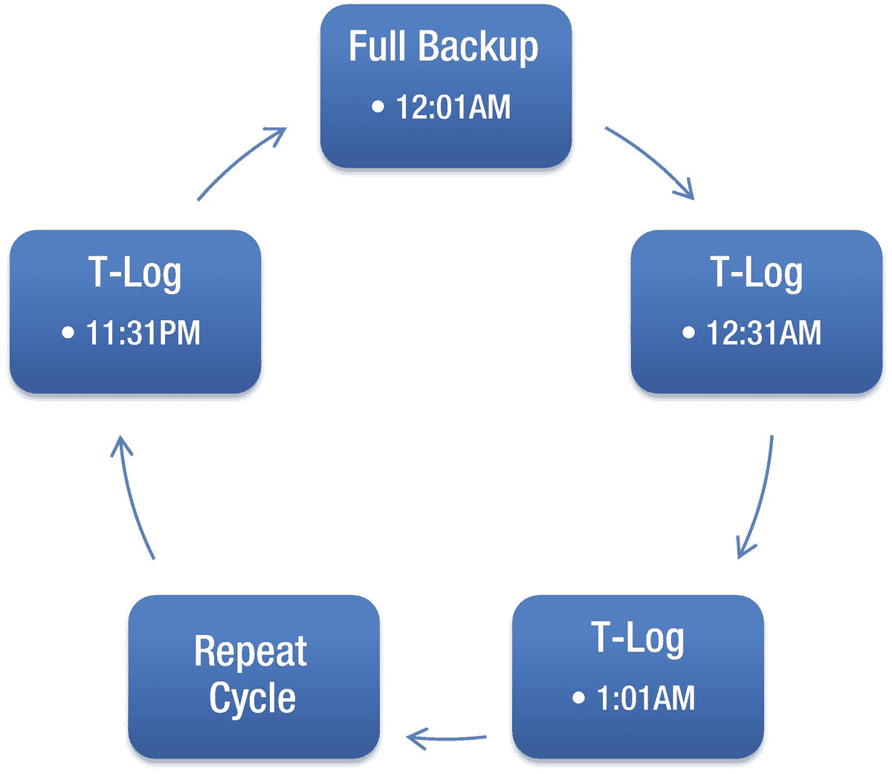
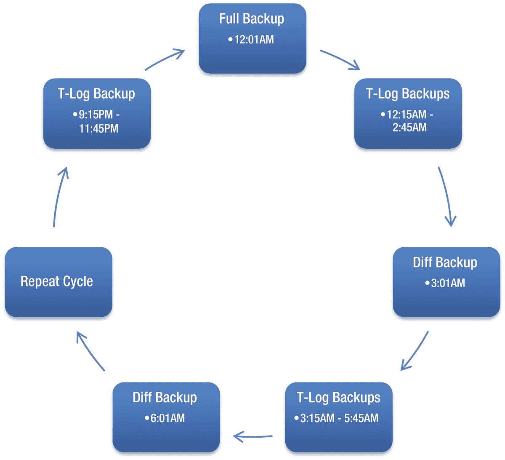
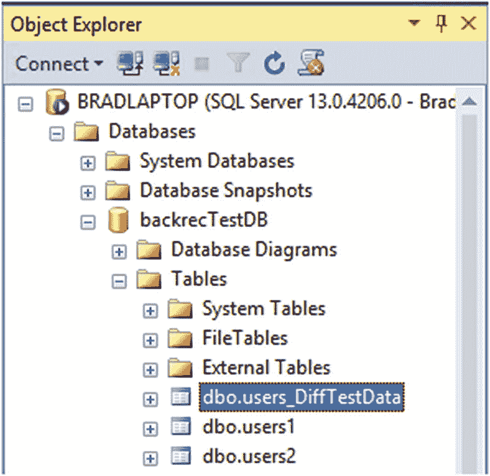
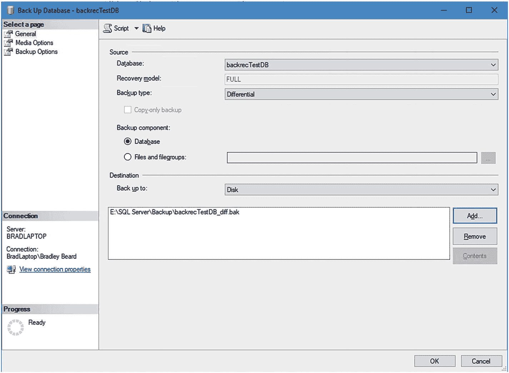
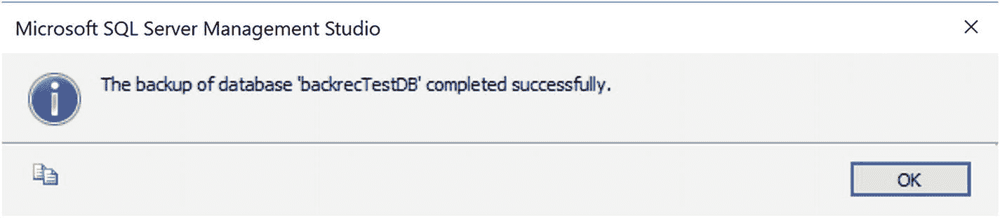
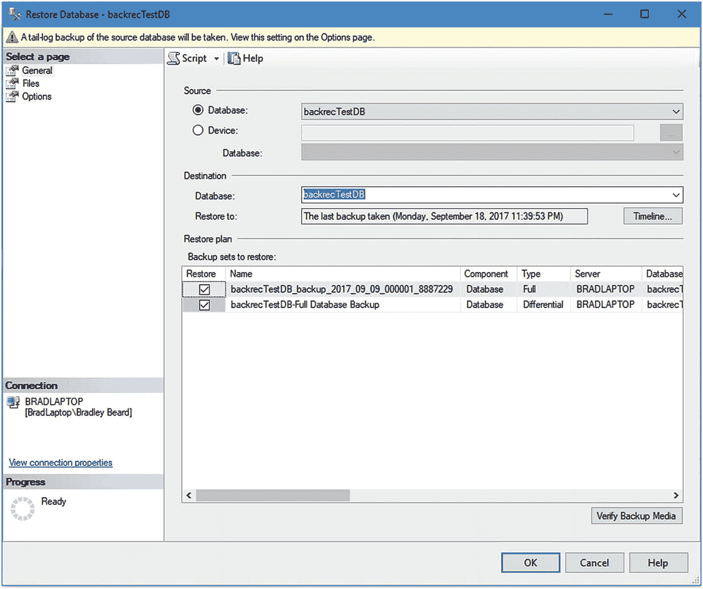

# 2. 差异备份

设置结构化的、周期性备份不仅仅包括计划的完整备份。那只是成功了一半；老实说，只是三分之一。一个好的备份策略降低了存储在数据库中的数据的总体风险。降低风险最有效的方法之一是减少备份链中的“环节”总数（即，在灾难情况下需要还原的文件总数）。备份过程中创建的每个文件都有损坏的可能性。如果您在还原周期中有大量备份，则在该还原周期中某处存在损坏数据的风险更大；链条越长，风险越大。这就是差异备份进入备份策略的地方。


#### 什么是差异备份？

差异备份捕获自上次执行完整备份（也称为 `differential base`）以来数据库中所有已更改的数据。与完整备份类似，差异备份包含事务日志数据，可以备份整个数据库，或者备份特定文件和文件组。与完整备份不同的是，差异备份要成功执行，必须满足对其他备份类型的依赖条件。

多年来，我有不少同事将差异备份与增量备份混为一谈；这是一个常见的误解，并且可能给数据库管理员带来麻烦。一般来说，增量备份是自上次任何类型备份（完整或差异）以来已更改数据的备份。差异备份则是自上次基准备份以来已更改数据的备份。区别在哪里？在这个语境中，“基准”这个词至关重要。增量备份会备份自上次备份（无论是完整备份还是增量备份）以来任何更改的数据。差异备份则持续捕获自上次**完整备份**以来所有已更改的数据，无论中间执行了多少次差异备份。考虑到这一点，我们来看看差异备份的依赖关系。

##### 差异备份的依赖关系

差异备份有一个主要的依赖项——完整备份。如果在差异备份之前未成功执行完整备份，那么差异备份将无法执行。

**注意**
`COPY_ONLY` 备份的执行无法满足完整备份的依赖项。只有在差异备份之前进行的传统完整备份才有效。这并非说传统完整备份完成后不能进行 `COPY_ONLY` 备份，而是说传统完整备份是必需的。

#### 为何使用差异备份？

当我实施一个使用差异备份的备份策略时，通常会被问到的第一个问题是：“既然有事务日志备份，差异备份的意义何在？它不是只会占用更多磁盘空间吗？” 这个问题通常来自基础设施团队的成员；往往是存储区域网络管理员。我提到这个并不是要为难他们，提出这些问题是他们的职责；我提及此事是为了说明，你的备份策略在某个时候总会受到质疑，人们会问你为何选择这条路径。

不过，核心问题仍然是：为何要使用差异备份，而不是完全依赖事务日志备份？答案可以用一个词概括……风险。

我认为，数据库管理员最重要的职责就是保护数据。当然，性能、安全和维护都非常重要，不容忽视。然而，对于任何现代组织的成功而言，数据的完整性和可恢复性至关重要。这正是差异备份提供最大价值的地方——降低数据恢复的风险。我在我的每一本书中都强调了这一点，仅仅是因为作为数据库管理员，没有比这更重要的任务了；如果不严格遵守备份和恢复实践，我们的数据将完全处于脆弱和暴露的状态。这不是一种可接受的方法。为了降低这种风险，我们需要为不可避免的事情做好准备，而最好的方法就是制定一个可靠的备份和恢复计划。

差异备份通过简化备份链来降低风险。每次执行差异备份时，你都无需再处理自上次完整备份以来到执行差异备份之间所产生的所有事务日志备份。恢复过程中每一个必需的文件，都意味着多一个出错的机会。

##### 无差异备份的场景

让我们回顾一个未部署差异备份的场景。在此场景中，你是一个数据库管理员，所在环境的最大数据丢失容忍时间为 30 分钟。处理此问题的最简单方法是设置一个事务日志备份（详见第 3 章），在每晚的完整备份之后每 30 分钟执行一次，如图 2-1 所示。


*图 2-1：无差异备份的备份策略*

继续前面的场景，想象在晚上 11:47，当天最后一次事务日志备份完成后，数据库服务器崩溃了。重启后，SQL 实例恢复正常运行，但你发现数据库处于不可恢复的状态，剩下的唯一选择是从备份中恢复数据库。看起来很简单，对吧？你首先恢复完整备份，然后开始恢复 47 个事务日志备份文件。但在处理第 27 号文件（下午 1:31 的备份）时遇到了错误；该文件已损坏，无法恢复。这导致超过十小时的数据无法恢复并丢失。

##### 运行差异备份的场景

现在让我们回顾一个部署了差异备份的场景，使用与之前相同的条件。基于相同的场景，使用差异备份，你设置一个事务日志备份（同样，详见第 3 章），在每晚完整备份之后每 30 分钟执行一次。此外，你还添加了一个每三小时执行一次的差异备份，如图 2-2 所示。


*图 2-2：包含差异备份的备份策略*

遵循相同的场景，数据库服务器在晚上 11:47 当天最后一次事务日志备份完成后崩溃。重启后，SQL 实例恢复运行，但你发现数据库处于不可恢复的状态，剩下的唯一选择是从备份中恢复数据库。这一次，你的工作轻松多了：你首先恢复完整备份，然后恢复晚上 9:01 执行的差异备份，接着只需恢复五个事务日志备份文件。结果是数据库完全恢复，仅丢失了两分钟的数据。这是因为能够跳过晚上 9:01 差异备份之前的整个事务日志文件。这意味着损坏的数据被排除在外，我们得到了一个干净的数据库副本，更重要的是，数据库没有损坏，并且数据损失量大大减少。

**注意**
我们将在第 5、6 和 7 章详细介绍如何恢复数据库。


#### 为备份解决方案添加差异备份

为现有的备份解决方案添加差异备份，就像在现有解决方案中增加一个额外的步骤一样简单。差异备份的频率取决于多个因素；例如，您的数据库对事务数据的依赖程度、这些事务是否包含数据更改、事务日志备份的频率以及完整备份的频率。如您所见，这是一个相当复杂的主题，将在本书第三部分详细讨论；然而，为了简单起见，我们将使用前一节的场景作为基础，通过示例备份策略来突出在备份解决方案中包含差异备份所带来的差异。表 2-1 展示了一个不含差异备份的简单备份策略的分解情况，表 2-2 则展示了包含差异备份的相同时间段。

表 2-2
包含差异备份的示例备份策略

|   | 开始时间 | 频率 | 总文件数 (24 小时) |
| --- | --- | --- | --- |
| 完整备份 | 每 24 小时 | 每 24 小时 | 1 |
| 差异备份 | 凌晨 3:01 | 每 3 小时 | 7 |
| 事务日志备份 | 凌晨 12:15 | 每 30 分钟 | 48 |

表 2-1
不含差异备份的示例备份策略

|   | 开始时间 | 频率 | 总文件数 (24 小时) |
| --- | --- | --- | --- |
| 完整备份 | 每 24 小时 | 每 24 小时 | 1 |
| 事务日志备份 | 凌晨 12:30 | 每 30 分钟 | 47 |

正如我之前强调的，在备份策略中添加差异备份会以磁盘空间为代价来降低风险。让我们使用前面两个解决方案，比较一下文件数量和数据丢失情况。

表 2-3 对前面详述的两个基本备份解决方案进行了比较。此表比较了将数据库恢复到可能的最晚时间点所需的文件数量，同时还给出了数据丢失的分钟数。

表 2-3
恢复所需文件数

| 不含差异备份的备份方案 |
| --- |
| 停机时间 | 完整文件数 | 差异文件数 | 事务日志文件数 | 总文件数 | 数据丢失 (分钟) |
| --- | --- | --- | --- | --- | --- |
| 凌晨 2:00 | 1 | 0 | 3 | 4 | 29 |
| 早上 6:00 | 1 | 0 | 11 | 12 | 29 |
| 中午 12:30 | 1 | 0 | 24 | 25 | 29 |
| 晚上 11:57 | 1 | 0 | 47 | 48 | 26 |
| 包含差异备份的备份方案 |
| 停机时间 | 完整文件数 | 差异文件数 | 事务日志文件数 | 总文件数 | 数据丢失 (分钟) |
| 凌晨 2:00 | 1 | 0 | 4 | 5 | 15 |
| 早上 6:00 | 1 | 1 | 6 | 8 | 15 |
| 中午 12:30 | 1 | 1 | 1 | 3 | 15 |
| 晚上 11:57 | 1 | 1 | 6 | 8 | 12 |

如您所见，通过在备份解决方案中加入差异备份，所需文件数量永远不会超过八个（一个完整备份，一个差异备份和六个事务日志备份）。因此，一天晚些时候发生的停机，其恢复所需文件将减少 83%，从而显著降低您的总体风险。

需要重点注意的是，如果此时某个差异备份损坏，我们仍然可以使用事务日志恢复到相同的时间点。

#### 为差异备份做准备

继续使用我们在第 1 章创建的数据库 `backrecTestDB`，让我们为差异备份做准备。由于这是一个测试数据库，并且已经很长时间没有数据变更，现在立即启动差异备份效果甚微。它只会创建一个 1KB 的可恢复备份文件；然而，出于测试目的，这用处不大。因此，我们改为创建一个快速脚本，用于创建一个新表并复制几行数据进去。

可以通过运行以下脚本创建新表：

```sql
SELECT TOP 500000 * INTO [users_DiffTestData]
FROM [users1]
```

脚本完成后，您应该看到以下输出：

```
(500000 row(s) affected)
```

最后，我们要做的最后一件事是验证我们创建的表是否正确。当然，我们本可以在 `SELECT INTO` 脚本中指定数据库；然而，对于本次测试，我更愿意我们手动检查。

在对象资源管理器面板中，右键单击 `backrecTestDB` 并选择 `刷新`。接下来，展开数据库，然后展开表。您应该看到列出了三个表，如图 2-3 所示。


图 2-3
对象资源管理器显示表
注意

上一步假设您遵循了第 1 章的步骤：创建了测试数据库，构建了表并插入了数据，并进行了完整备份。如果跳过了其中任何步骤，您必须返回第 1 章并完成它们，然后才能运行上述脚本。

一旦此脚本完成，并且我们已确认新表存在，我们就准备好启动差异备份了。

#### 执行差异备份

与微软世界中的大多数事情一样，有多种方法可以执行差异备份。如果备份是您备份策略的一部分，差异备份的执行将是解决方案的一部分（例如，SQL 维护计划的一部分或一个独立的 `SQL Server Agent` 作业）。如果您是手动执行备份，则可以从 `SQL Server Management Studio (SSMS)` 的 `GUI` 中启动它，使用 `T-SQL` 编写脚本，甚至使用 `PowerShell` 来启动备份。

在本章中，我将引导您使用 `SSMS` 中的 `GUI` 和 `T-SQL`。两种情况下的最终结果是相同的：我们将成功生成一个可以恢复到数据库的差异备份。在这里使用 `PowerShell` 会是个好主意；然而，这本身就是一个值得更多关注的独立主题。

##### 通过 SSMS 的 GUI 进行备份

通过 `SSMS` 的 `GUI` 进行差异备份与进行完整备份完全相同。因此，我不会介绍 `GUI` 中的所有选项；只介绍将备份从完整类型更改为差异类型所需的不同之处。

差异备份可以通过六个简单的步骤完成：

*   右键单击 `backrecTestDB`
*   将鼠标悬停在 `任务` 上，然后单击 `备份…`
*   在 `常规` 屏幕上，单击 `备份类型` 下拉菜单并选择 `差异`
*   在 `目标` 下，单击 `删除`，然后单击 `添加`
*   在 `文件名` 文本框中，输入 `“E:\SQL Server\Backup\backrecTestDB_diff.bak”` 并单击 `确定`
*   返回 `常规` 选项卡，单击 `确定`

图 2-4 显示了为差异备份集配置正确的备份 `常规` 选项卡。


图 2-4
差异备份设置

按下最后一个 `确定` 后，您将在 `“备份数据库”` 窗口的左下角看到一个进度百分比。因为我们只向新表复制了 500,000 行数据，所以备份将在几秒钟内完成。将弹出一个完成窗口，确认备份成功，如图 2-5 所示。


图 2-5
备份完成窗口


##### 通过 SSMS 的图形界面验证备份

通过图形界面在 SSMS 中验证备份可以在多个位置完成。查看活动备份最简便的位置是“还原数据库”界面。由于本章旨在回顾如何执行差异备份而非还原它们，我仅会简要介绍如何检查数据库的备份状态。我们将在本书第二部分详细讨论数据库还原。

要访问“还原数据库”界面，您将遵循与进入“备份”界面类似的步骤。

-   右键单击 `backrecTestDB`。
-   将鼠标悬停在“任务”上，接着是“还原”，然后单击“数据库”。

一旦“还原数据库”界面加载完成，请查看“还原计划”窗口：您应该能看到两个数据库备份。在“类型”列下，您会看到一个列为完整备份，另一个列为差异备份，如图 2-6 所示。


*图 2-6：还原数据库窗口*

这可以被视为备份按预期进行并准备好从此界面进行恢复的“生命迹象”。再次强调，我们将在本书后面部分讨论此操作的还原方面。目前，您可以确信备份已准备好进行还原。

##### 通过 T-SQL 执行差异备份

通过 T-SQL 执行差异备份相当简单。可以传递许多参数到脚本中；然而，对于此示例，我们将保持脚本简单。

在 SQL Studio Manager 中，运行以下脚本：

```
BACKUP DATABASE [backrecTestDB]
TO DISK = N'E:\SQL Server\Backup\backrecTestDB_diff.bak'
WITH DIFFERENTIAL
```

如果您熟悉 `BACKUP DATABASE` 命令，您会注意到差异备份只有一个区别，即添加了 `WITH DIFFERENTIAL`。

当脚本完成时，您将看到类似以下的输出：

```
已为数据库 'backrecTestDB' 处理了 52688 页，文件 'backrecTestDB' 位于文件 1 上。
已为数据库 'backrecTestDB' 处理了 2 页，文件 'backrecTestDB_log' 位于文件 1 上。
BACKUP DATABASE WITH DIFFERENTIAL 已成功处理 52690 页，耗时 9.620 秒 (42.790 MB/秒)。
```

就是这样！您现在拥有了 `backrecTestDB` 的一个差异备份。

#### 小结

本章带我们了解了差异备份的基础知识及其重要性。它向我们展示了差异备份如何通过减少数据库恢复所需的文件数量来降低数据恢复的总体风险。

第 3 章将涵盖事务日志，这是最后一种备份类型。第 4 章将引导您设置一个完整的备份解决方案，并详细回顾有关备份的适用行业标准或最佳实践。

完成第 4 章后，第一部分也将完成。届时，您应该对备份各个部分如何协同工作和独立工作有一个粗略的理解。然后，我们将运用这些知识在第二部分中构建备份/还原过程的第二部分，重点在于还原已备份的数据。最后，在第三部分中，我们将把各部分整合到一个界面中，然后使用 SQL Server 代理实现自动化。

