# 5. 完整还原

按照前面章节的格式，我们将通过深入探讨本书的第二部分，继续备份与还原之旅。第一部分，包含第 1 至 4 章，涵盖了备份部分；这第二部分，包含第 5 至 8 章，将涵盖还原部分。

至此，我们认识到数据库备份是整个数据恢复过程的基础。没有备份，就不可能有还原。因此，确保所执行的备份是正确的至关重要，这一点我们之前已经讨论过。现在，基于这些基础知识，我们将进一步探讨执行完整数据库备份还原的各种方法。

需要重点指出的是，数据库还原主要在 `SQL Server Management Studio` 中完成。我想在这里强调“主要”这个术语，因为它并非还原数据的唯一方式。例如，如果您的 `master` 数据库已损坏，则必须在 SQL Server 正确启动之前从完整备份中还原它。这是因为 `master` 存储了 SQL Server 的所有配置信息。`master` 数据库损坏带来的一个主要问题，除了明显的 SQL Server 无法启动之外，还在于所有其他系统数据库（`msdb` 和 `model`）都依赖于 `master` 才能正常运行。如果 `master` 损坏严重到一定程度，那么将需要单独重建系统表，这是一件非常麻烦的事情。


#### 什么是完全恢复？

简而言之，完全恢复正如其名，但又并非完全如此；它恢复的是先前执行的完整数据库备份中包含的所有数据，但并不恢复整个数据库。回想一下，完整数据库备份只备份数据，而不备份系统设置。数据库备份中只包含指定数据库的表数据。

注意

如果你需要备份与 SQL Server 安装相关的系统设置，你必须拥有 `master`、`msdb` 和 `model` 数据库的当前备份。这些是系统数据库，对于 SQL Server 的平稳运行极其重要。

我刚开始接触 SQL Server 时，正值 SQL Server 7 和 SQL Server 2000 之间。我多少已经习惯了 MySQL 在界面和可用性方面的工作方式，所以一开始切换过来有点困难，但我逐渐掌握了窍门。MySQL 有一点我非常喜欢，那就是它们的“备份”就是巨大的 `.sql` 文件，里面包含大量的 `INSERT` 命令。没错，整个数据库的内容都被按顺序导出；先是针对某张表的 `DROP` 和 `CREATE` 命令，然后是该表中所有数据的单独 `INSERT` 语句。在有些人看来，这似乎是浪费空间，但要我说，精妙之处就在于细节。这样，时间充裕的数据库管理员就可以仔细检查那个备份，并在 SQL Server 中无法实现的细粒度级别上，实际掌控数据的插入。我的意思是，SQL Server 不会以这种格式创建备份；SQL Server 中的备份是专门为 SQL Server 引擎执行而创建的，不是为了方便人类阅读。是的，在 SQL Server 备份中，数据当然在那里，但无法通过在记事本中打开等方式读取。

完全恢复的另一个方面是，它们可用于创建现有数据库的完美副本。在开发环境中能够拥有这种功能对我来说绝对非常宝贵，因为我可以轻松地创建一个基于生产数据库的完整开发数据库，主要用于测试。然后，我可以创建另一个数据库，它是开发数据库的完全复制品，但将其命名为不同的名称。之后，如果我需要恢复数据，我可以轻松地在第一个开发数据库中 `TRUNCATE` 任何表，并使用 `INSERT INTO` 语句快速替换数据，其中第二个开发数据库作为源，第一个开发数据库作为目标。我将在本章后面详细展示如何操作。

首先，让我们暂时将注意力转向系统数据库。有三个主要的系统数据库，名为 `master`、`msdb` 和 `model`。这三个数据库承载着你的 SQL Server 安装的配置信息，因此它们对于整个安装的健康状况至关重要。从技术上讲，还有第四个名为 `tempdb` 的系统数据库，但此数据库在每次为特定 SQL Server 实例创建该实例时都会被销毁和创建，因此无需担心备份它。

#### 恢复 Master 数据库

如果你不得不恢复 `master` 数据库或任何系统数据库，我真诚地希望这不是因为严重的损坏问题。我可以亲口告诉你，这是一项重大的任务，必须极其谨慎和细致地完成。本节将展示从完整数据库备份恢复 `master` 数据库的各个步骤和说明。这些步骤可应用于恢复任何系统数据库，但现在，我将只关注 `master` 数据库。

本节依赖于存在一个当前的 `master` 数据库备份。通常，最好在每次更改表的结构或数据库的基础架构时都对 `master` 数据库进行一次备份。备份 `master` 数据库并确保在紧急情况下可用，将缓解未来的许多问题，我建议将这些系统数据库的备份作为你正常备份维护计划的一部分。我在前面讨论备份的章节中没有涉及这一点，因为本书的内容是基于单个数据库备份，而不是更高级别的数据库管理，在后者中我们也会处理系统数据库的备份。继续之前，请快速运行一次 `master` 数据库的备份，或使用你已准备好的备份。

要恢复 `master` 数据库，我们必须做的第一件事是在单用户模式下启动 SQL Server。对于不熟悉此操作的用户来说，单用户模式以有限的连接数（一个）启动 SQL Server，以便可以在不给服务器增加额外负担的情况下进行紧急工作。


##### 以单用户模式启动 SQL Server

以下是将 SQL Server 置于单用户模式的逐步说明：

*   打开 **SQL Server 配置管理器**，或者如果你使用的是 Windows 10，则打开开始菜单并输入 `sqlservermanager13.msc`，按 Enter 键，然后在右窗格中找到 `SQL Server (MSSQLSERVER)` 项。
*   右键单击并选择 **属性**，然后选择 **启动参数** 选项卡。
*   在 **指定启动参数** 字段中输入 `-m`。
*   单击 **添加** 按钮。
*   单击 **应用**，你会注意到出现一条消息，告诉我们更改在重启服务后才会生效。我们将立即重启服务。在此消息上单击 **确定**，然后在 `SQL Server (MSSQLSERVER) 属性` 窗口上单击 **确定** 将其关闭。
*   单击 **SQL Server Agent** 项，然后在工具栏中单击 **停止服务** 按钮。
*   重启 `SQL Server (MSSQLSERVER)` 服务。

这些步骤将我们的 SQL Server 实例设置为单用户模式。不过，让我们更深入地了解这些步骤的细节，以便真正理解我们的操作目标。

要让 SQL Server 以单用户模式启动，我们必须打开 **SQL Server 配置管理器**。这有点难找，但如果你使用的是 SQL Server 2016 和 Windows 10，只需打开开始菜单并输入 `sqlservermanager13.msc` 然后按 Enter。图 5-1 显示了此时你应该看到的屏幕。

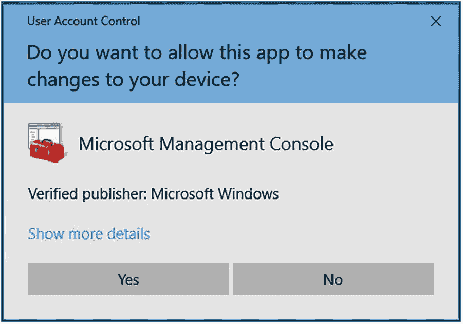

**图 5-1 用户帐户控制**

我们希望在这里单击 **是** 以继续。打开的下一个屏幕是 **SQL Server 配置管理器**，如图 5-2 所示。

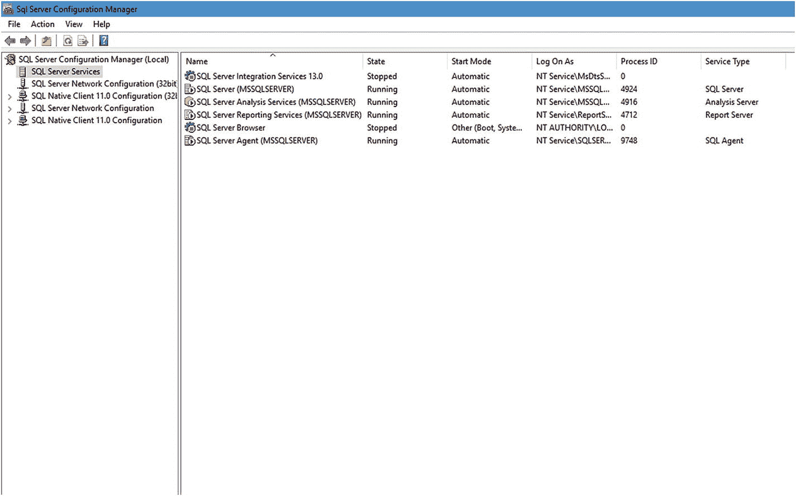

**图 5-2 SQL Server 配置管理器**

如果你不熟悉 **SQL Server 配置管理器** 界面，建议你花点时间在这里看看。此部分有非常多的配置选项。

要继续操作，我们需要右键单击 `SQL Server (MSSQLSERVER)` 实例（或者你想要以单用户模式启动的任何实例），然后选择 **属性**。默认界面如图 5-3 所示。

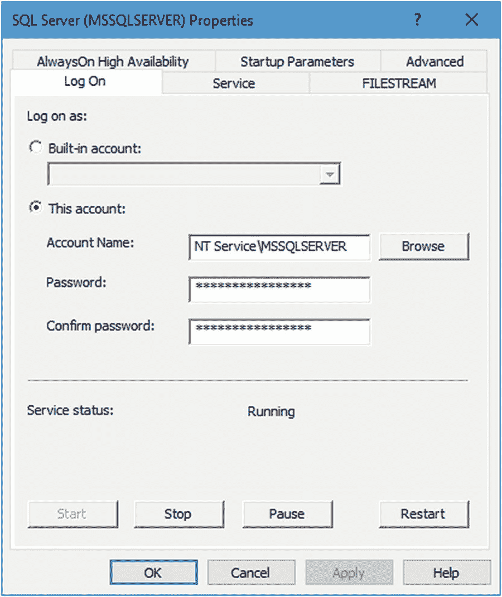

**图 5-3 SQL Server (MSSQLSERVER) 属性，登录选项卡**

请注意，默认选中的选项卡名为 **登录**。我们需要单击屏幕顶部的 **启动参数** 选项卡，打开如图 5-4 所示的屏幕。

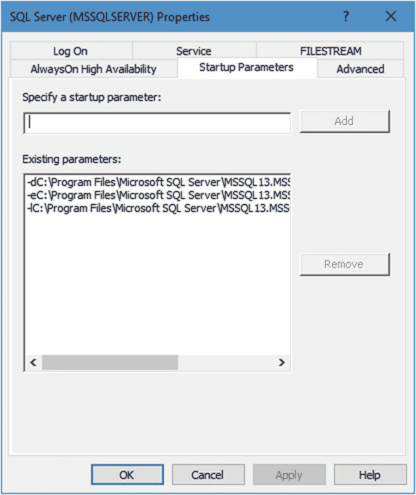

**图 5-4 SQL Server (MSSQLSERVER) 属性，启动参数选项卡**

标有 **指定启动参数** 的文本框是我们要输入文本 `-m` 的地方。这是以单用户模式启动 SQL Server 所需的启动参数。输入该值并单击 **添加** 按钮（一旦在参数字段中输入参数，该按钮就会启用）。图 5-5 显示了在启动参数字段中输入 `-m` 后你应该看到的内容。

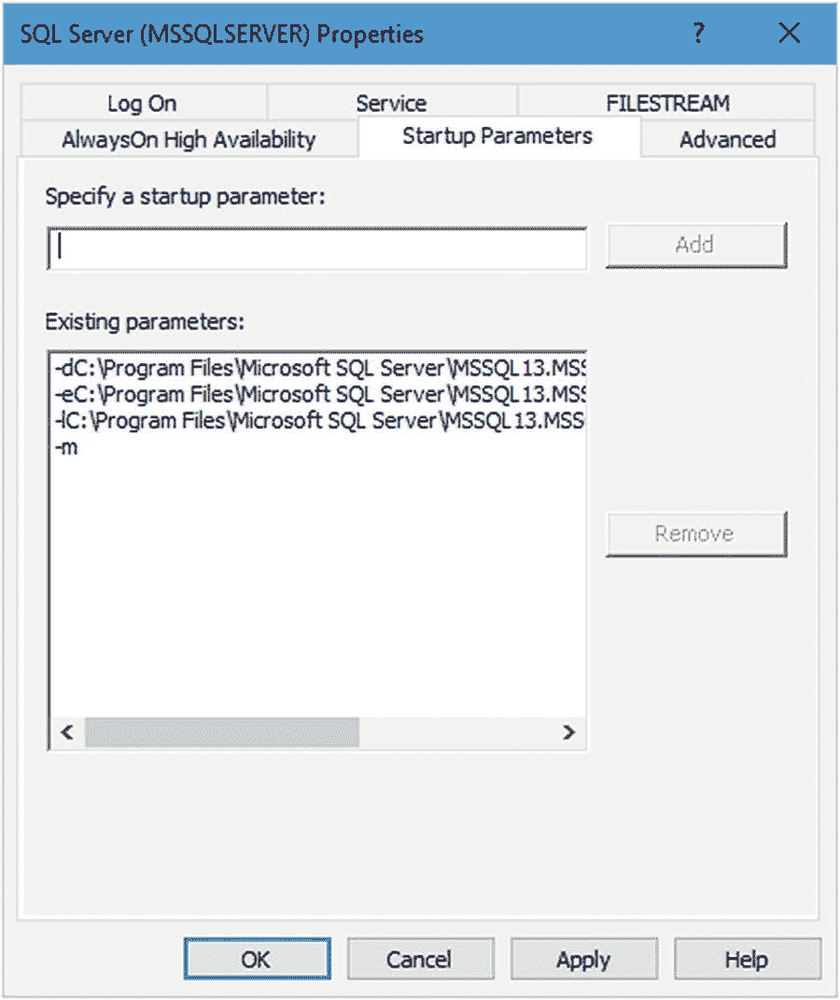

**图 5-5 已输入 -m 启动参数**

此时，我们需要单击 **应用** 保存更改，然后会立即弹出如图 5-6 所示的对话框。

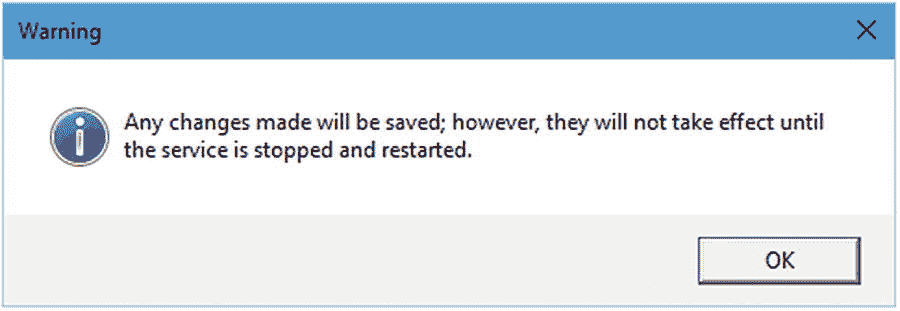

**图 5-6 警告**

该消息提示我们需要重启 SQL Server 服务，所以这里单击 **确定**，然后在 `SQL Server (MSSQLSERVER) 属性` 窗口上单击 **确定**。这应该会将我们带回到图 5-2 中看到的 **SQL Server 配置管理器** 界面。

在 **SQL Server 配置管理器** 界面中，确保你在左侧的 **SQL Server 服务** 部分中，然后右键单击右侧面板中的 `SQL Server (MSSQLSERVER)` 项并选择 **重启**。

接下来，我们需要停止 SQL Server Agent 服务，所以右键单击 `SQL Server Agent` 并选择 **停止**。原因在于，如果 SQL Server Agent 正在运行，它将占用数据库可用的唯一连接。

至此，我们的 SQL Server 实例已在单用户模式下运行，且没有活动连接。启动 **SSMS**，你会看到常规的登录屏幕。像往常一样在此处连接，你应该会进入启动 SSMS 后看到的常规界面。我的界面如图 5-7 所示。

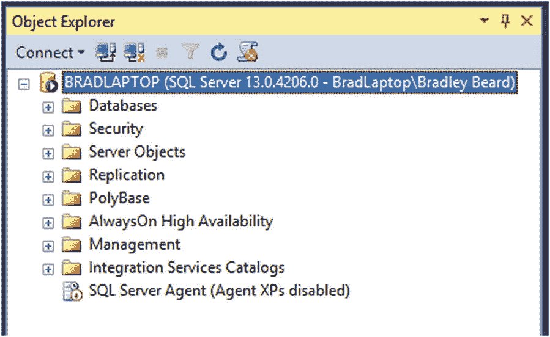

**图 5-7 我的 SSMS 界面**

关于这个初始屏幕，有两点要提一下：第一，没有明显的迹象表明我处于单用户模式；第二，SQL Server Agent 显示为禁用。那么，我们如何知道自己处于单用户模式呢？很简单。我们知道单用户模式意味着一次只能有一个用户登录到数据库引擎，对吧？那么，你认为如果我们使用当前已登录的同一账户再次登录会发生什么？

单击 **对象资源管理器** 窗格中的 **连接** 下拉菜单。选择 **数据库引擎…**，你将看到正常的登录屏幕。正常登录，你看到了什么？图 5-8 展示了 SQL Server 返回给我的信息。

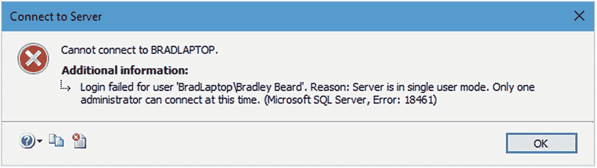

**图 5-8 连接到服务器**

就在那黑色和浅灰色的文字中，解释了我们当前处于单用户模式。单击 **确定**，然后单击 **取消** 返回常规的 SSMS 屏幕。打开一个新的查询窗口，注意你连接的是 `master` 数据库。我们可以在这里开始正常工作，明显的例外是 SQL Server Agent 不会运行，因此我们无法执行任何需要 SQL Server Agent 的操作。清单 5-1 展示了一个用于备份系统数据库的简单脚本。

```sql
USE master
GO
-- 备份 model 数据库
BACKUP DATABASE Model
TO DISK = 'E:\SQL Server\Backup\Model.BAK'
WITH INIT
GO
-- 备份 master 数据库
BACKUP DATABASE Master
TO DISK = 'E:\SQL Server\Backup\Master.BAK'
WITH INIT
GO
-- 备份 msdb 数据库
BACKUP DATABASE MSDB
TO DISK = 'E:\SQL Server\Backup\MSDB.BAK'
WITH INIT
GO
-- 清单 5-1
-- 系统数据库备份脚本
```

这将为我们恢复这些数据库提供一个良好的起点。恢复系统数据库的脚本如清单 5-2 所示。

```sql
RESTORE DATABASE master FROM DISK = 'E:\SQL Server\Backup\Master.BAK' WITH REPLACE;
RESTORE DATABASE model FROM DISK = 'E:\SQL Server\Backup\Model.BAK' WITH REPLACE;
RESTORE DATABASE msdb FROM DISK = 'E:\SQL Server\Backup\MSDB.BAK' WITH REPLACE;
-- 清单 5-2
-- 系统数据库恢复脚本
```

Microsoft 通常建议使用 `sqlcmd` 实用程序来恢复系统数据库，所以让我们打开命令提示符，输入 `sqlcmd`，然后按 Enter。图 5-9 显示了我尝试启动 `sqlcmd` 时发生的情况。

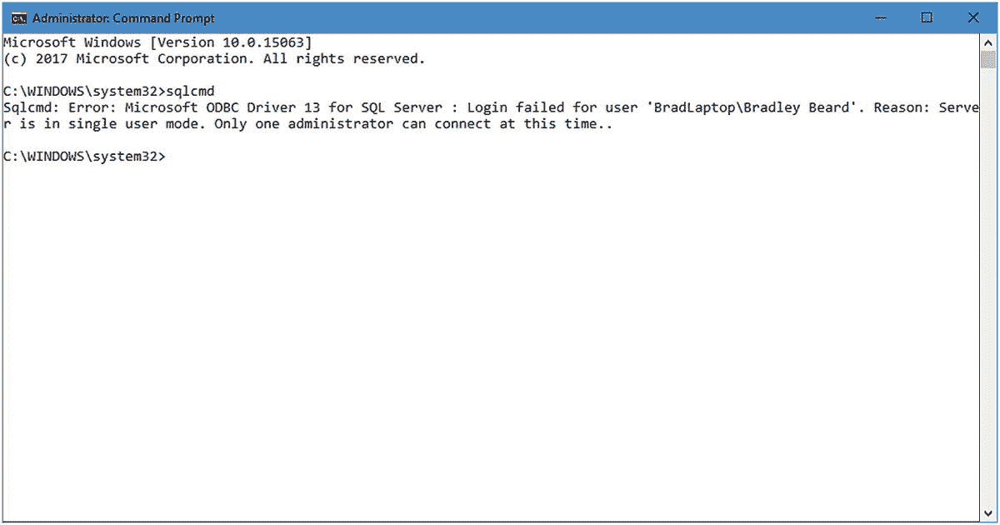

**图 5-9 尝试启动 sqlcmd**

又看到了我们的“错误”。这其实不是错误，更像是一个恼人的提醒，告知我们处于单用户模式。不过没问题；我们只需关闭 SSMS 并重新运行 `sqlcmd` 命令。它现在应该可以正常工作了；如果不行，请重启 SQL Server 服务并重新运行该命令。然后我们将看到图 5-10 所示的内容。

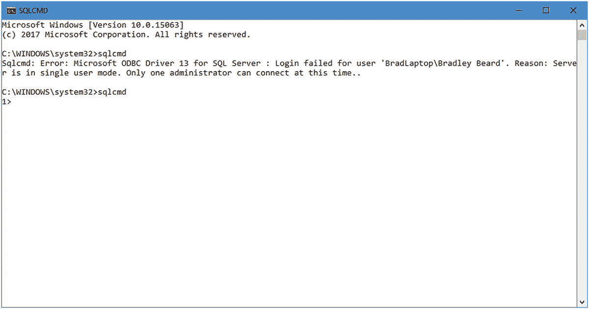

**图 5-10 sqlcmd**


##### 还原主数据库

我们可以看到 `sqlcmd` 实用工具已启动，因为现在 `sqlcmd` 命令下的第一行显示提示符 `1>`。这意味着 `sqlcmd` 正在等待命令。在此提示符下，键入 `RESTORE DATABASE master FROM DISK = 'E:\SQL Server\Backup\Master.BAK' WITH REPLACE;` 并按 Enter 键。然后您将看到提示符 `2>`。您只需在此处键入 `GO` 并按 Enter 键。您的屏幕应与图 5-11 所示非常相似。

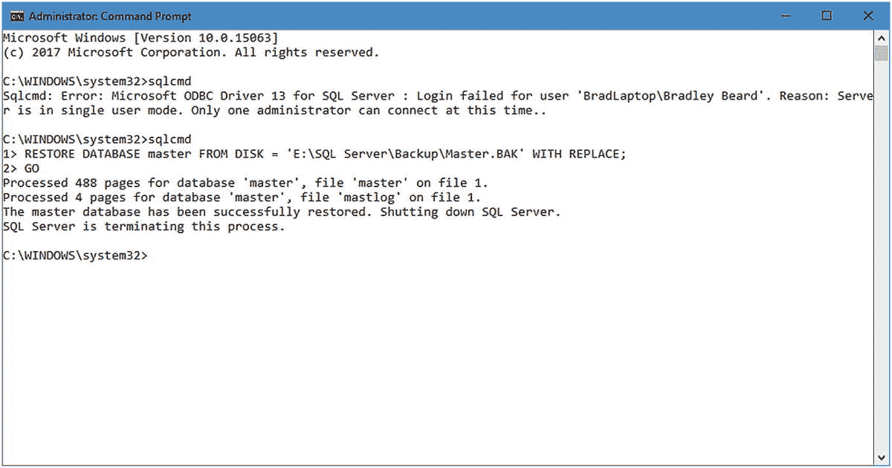

图 5-11

操作完成

这显示主数据库已成功还原，并且进程已正常终止。在我们完成之前，需要重启 SQL Server 服务，因此请打开“服务”并重新启动 `SQL Server (MSSQLSERVER)` 服务（或您正在使用的任何命名实例）。在服务器重启或服务重启之前，您将无法重新连接到数据库实例。

##### 将 SQL Server 恢复为多用户模式

在我看来，恢复 SQL Server 的访问权限比限制访问更容易。将 SQL Server 恢复到其原始状态（即多用户模式）的分步说明如下：

*   再次打开 `sqlservermanager13.msc`，并在右窗格中找到 `SQL Server (MSSQLSERVER)` 项。
*   右键单击并选择 `属性`，然后选择 `启动参数` 选项卡。
*   突出显示 `-m` 条目，然后单击 `删除` 按钮。
*   单击 `应用`，请注意会出现一条消息，提示我们重新启动 SQL Server 服务。单击此消息上的 `确定`，然后在 `SQL Server (MSSQLSERVER) 属性` 窗口上单击 `确定` 以关闭它。
*   单击 `SQL Server Agent` 项，然后按工具栏中的 `启动服务` 按钮。
*   再次单击 `SQL Server (MSSQLSERVER)` 项，然后按工具栏中的 `重新启动服务` 按钮。

这些步骤将我们的 SQL Server 实例设置回多用户模式。恭喜！您刚刚已将 SQL Server 设置为单用户模式、还原了 master 数据库，并将 SQL Server 恢复为多用户模式。

#### 从完整备份还原

到本章此处为止，您可能已经对如何从完整备份还原数据库有了很好的了解。我认识的每一个 DBA 都曾不得不在某个时候运行还原操作，因此这应该不是什么新鲜事。万一这是新内容，本节不仅将介绍如何使用 SSMS 和 T-SQL 从完整备份还原，还将介绍一些还原数据的要点，例如还原到日志备份中的特定点（称为时间点还原）。

##### 使用 SSMS 执行完整还原

还原数据库最常用的方法是使用与 SQL Server 最常关联的图形界面。SQL Server Management Studio 提供了大量可用于操作和管数据库的工具，因此它几乎是每位 SQL Server 管理员的首选。请注意，我这里说的是“几乎”；因为任何规则都有明显的例外，这绝不是侮辱或嘲笑。例如，我曾见过 SQL Server 管理员使用旧版 SSDT，因为他们获得了与数据库的（大部分）相同交互，并且额外获得了可用于编写 DTSX 包或任何他们需要增强界面来完成的任务的 Visual Studio 界面。

我们首先要做的就是找到最新的备份集。如果您像我一样设置了目录，那么它们位于 `E:\SQL Server\Backup`。

接下来，启动 SSMS 并展开 `数据库`。在 `数据库` 菜单内，您将找到您的用户数据库，以及 `ReportServer` 和 `ReportServerTempDB`（如果您安装了 SQL Server Reporting Services）。找到您要处理的数据库（本例中为 `backrecTestDB`），右键单击它，将鼠标悬停在 `任务` 上，然后将鼠标悬停在 `还原` 上，并查看我们可用的选项。图 5-12 显示了此时的界面。

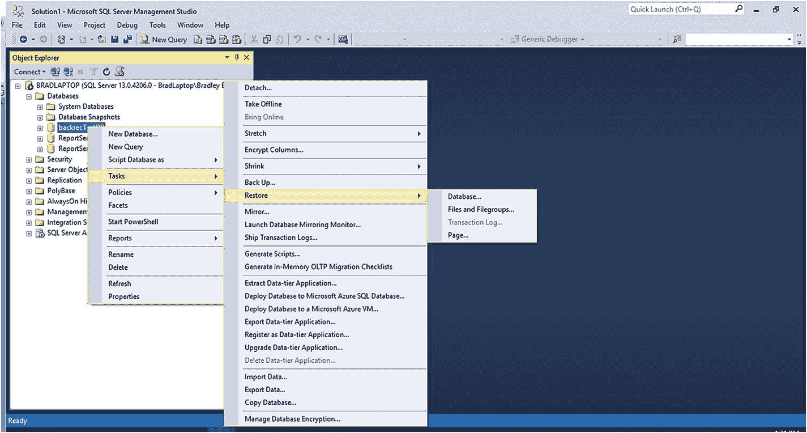

图 5-12

SSMS 还原菜单

在 `还原` 菜单内，我们可以看到列出了四个选项。这些选项是

*   `数据库`
*   `文件和文件组`
*   `事务日志`
*   `页面`

首先，为什么事务日志选项是禁用的？它只能在数据库是使用完整备份还原的，并且在还原时启用了 `RESTORE WITH STANDBY` 的情况下启用。然后数据库将处于待机状态（在 `RecoveryPending` 模式下），等待事务日志尾部的还原。如果您使用 `RESTORE WITH STANDBY` 恢复了一个数据库，然后想要还原事务日志，那么事务日志选项将是唯一可用的选项，其他三个选项将被禁用。

我们希望选择 `数据库` 选项，因此单击此项，您将看到与图 5-13 所示类似的内容。

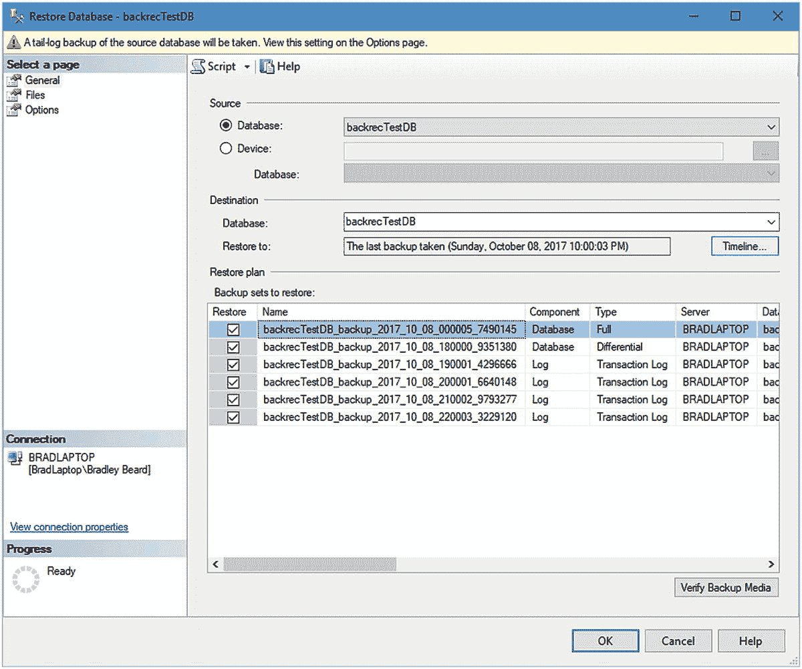

图 5-13

还原数据库窗口，常规选项卡

请注意，`要还原的备份集:` 部分已经启用了最新的备份集并准备进行还原。从上到下，我们可以看到有一个完整备份、一个差异备份和四个事务日志备份可用于还原我们的数据库。另请注意，左侧有复选框，因此我们可以选择要还原哪组数据。您可以看到取消选中差异选项不会取消选中事务日志选项，而选中事务日志选项会自动选中差异选项。

您需要还原到所需时间点的确切文件组合完全取决于您。您可以使用任意数量的备份集。

对于本示例，参考图 5-13，我们可以看到只有几个文件被选中用于还原到最后一个事务日志备份。要还原到此时间点，我们需要按顺序还原最新的完整备份和差异备份，然后是事务日志。假设我们希望还原到前一天。我的备份设置方式使得我只需要还原最多七个文件。原因在表 5-1 中有解释，该表引用自第 4 章。

表 5-1

我的 24 小时备份计划


| 时间 | 完全备份？ | 差异备份？ | 事务日志备份？ |
| --- | --- | --- | --- |
| 12:00 am | X | X | X |
| 1:00 am |   |   | X |
| 2:00 am |   |   | X |
| 3:00 am |   |   | X |
| 4:00 am |   |   | X |
| 5:00 am |   |   | X |
| 6:00 am |   | X | X |
| 7:00 am |   |   | X |
| 8:00 am |   |   | X |
| 9:00 am |   |   | X |
| 10:00 am |   |   | X |
| 11:00 am |   |   | X |
| 12:00 pm |   | X | X |
| 1:00 pm |   |   | X |
| 2:00 pm |   |   | X |
| 3:00 pm |   |   | X |
| 4:00 pm |   |   | X |
| 5:00 pm |   |   | X |
| 6:00 pm |   | X | X |
| 7:00 pm |   |   | X |
| 8:00 pm |   |   | X |
| 9:00 pm |   |   | X |
| 10:00 pm |   |   | X |
| 11:00 pm |   |   | X |

从这个时间表中可以看出，正如我之前所说，我最多只需要恢复七个文件：一个完全备份、一个差异备份和五个事务日志备份。这也意味着，我最多只会丢失一个小时的数据。这种情况只会发生在数据丢失恰好在事务日志运行之后发生时，因此下一个小时的事务会被视为可疑，因为事务日志可能无法正确恢复。

回到我们在 `图 [5-13]` 中看到的内容，这告诉我，我正在从可用的最新数据库备份中恢复。这可能是最常见的恢复操作，因为我们希望恢复到最近过去的某个时间点。但情况并非总是如此，我们可以选择是否使用 `图 [5-13]` 的 `源` 部分中为我们呈现的默认最新备份，或者选择过去的一组备份，这些备份不会显示在 `图 [5-13]` 底部的 `要还原的备份集:` 部分。顶部标记为 `源` 的部分有两个选项：

*   `数据库`：允许您恢复到最新的备份集，该备份集包含完全备份、差异备份以及任何适用的日志备份，具体取决于启动恢复的时间。
*   `设备`：允许您从文件系统中选择任何备份集进行恢复。如果所选部分中的备份集由于某种原因无法恢复，SQL Server 会通知您。

`源` 部分中选择了 `数据库` 选项。`源` 下方是 `目标` 部分。此部分允许您选择要恢复到的数据库，以及要恢复到的时间点。我们将在下一节更深入地介绍时间点恢复。适用的完全备份、差异备份和事务日志备份显示在界面的 `恢复计划` 部分。在 `还原数据库` 窗口的左侧，我们可以看到三个菜单选项：`常规`、`文件` 和 `选项`。现在，让我们先不理会 `常规` 选项卡，点击左侧的 `文件` 菜单部分。`图 [5-14]` 显示了 `文件` 部分。

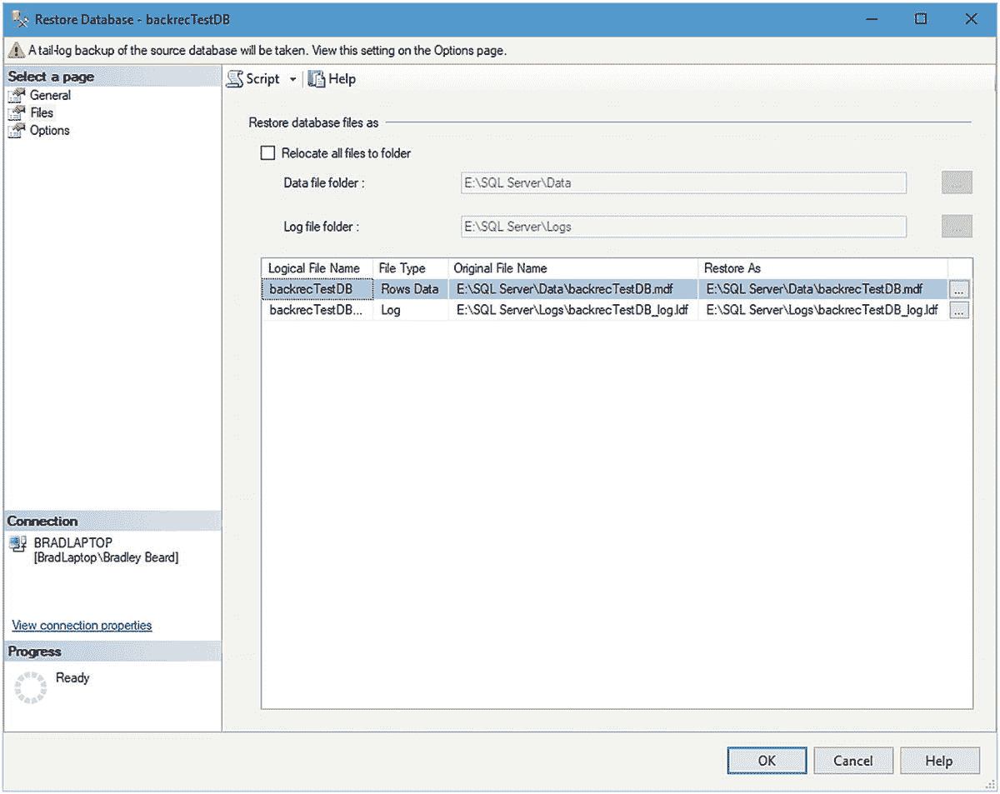
图 5-14
还原数据库窗口，文件选项卡

这些信息来自您安装的默认设置。请注意，已经为我选择了默认文件位置。如您所见，除非在 `还原为` 字段（界面下部最右侧的字段）中输入了新位置，否则恢复过程会将新文件写入指定位置。选择左侧的 `选项` 菜单项以转到下一节。`图 [5-15]` 显示了此默认界面的样子。

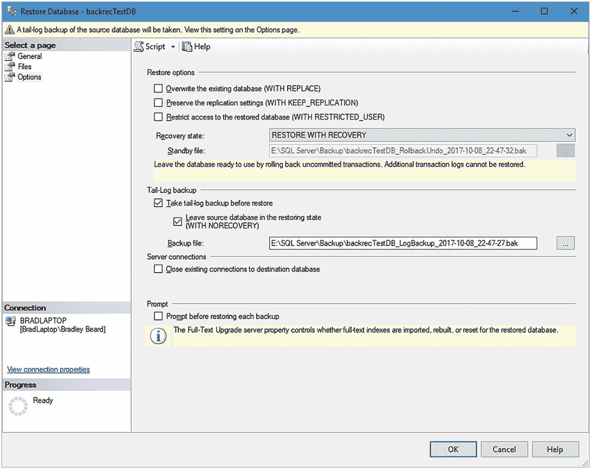
图 5-15
还原数据库窗口，选项选项卡

对于常规恢复，我通常选择 `覆盖现有数据库 (WITH REPLACE)` 并取消选择 `将源数据库保持为还原状态 (WITH NORECOVERY)` 选项，其余保留默认设置。这让我可以覆盖数据库中直至故障发生前的所有内容，并且不会使我的数据库保持锁定且无法恢复，以防发生另一起灾难性事件。当您为场景选择所需的选项后，按 `确定` 按钮。`图 [5-16]` 显示了点击 `确定` 后您应该看到的内容。

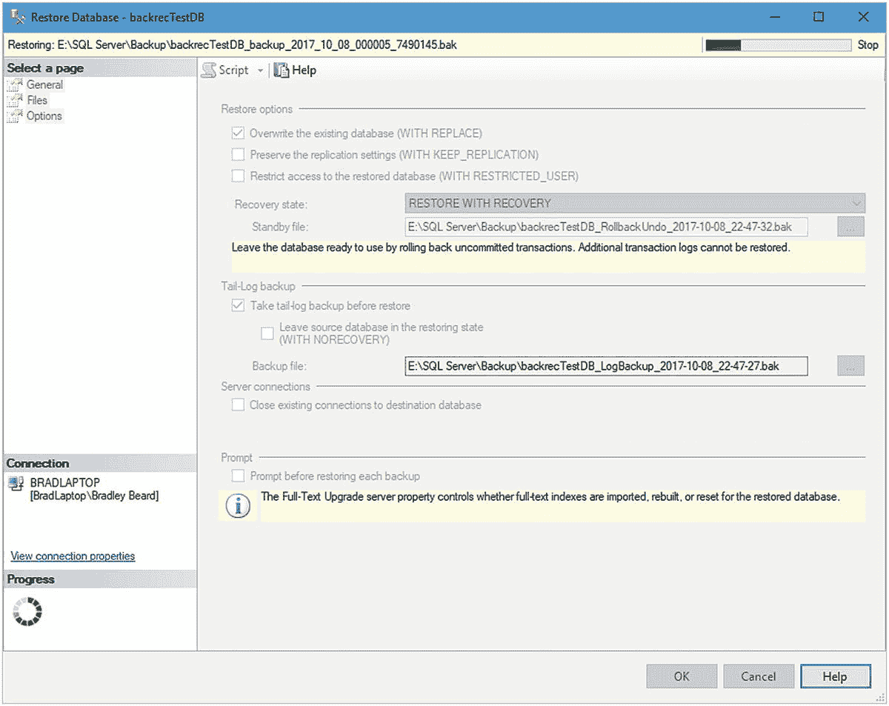
图 5-16
还原数据库，正在还原操作

这需要一段时间才能完成，具体取决于备份的大小。我的备份大约需要 20 秒完成，因为我没有大量的数据需要恢复。最终，您应该会看到 `图 [5-17]` 中所示的内容。

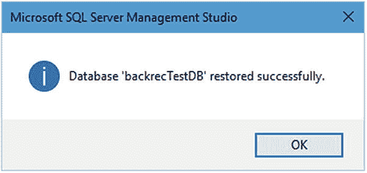
图 5-17
还原成功

成功！这条消息显然意味着我们的数据库已成功恢复。要检查此操作是否成功（遵循“信任，但要验证”的格言），只需运行 `清单 [5-3]` 中的代码。

```sql
SELECT RH.[destination_database_name] as 'Database',
       RH.[restore_date] as 'Restore Date',
       BS.[backup_start_date] as 'Backup Start Date',
       BS.[backup_finish_date] as 'Backup Finish Date',
       BS.[database_name] as 'Source Database',
       BMF.[physical_device_name] as 'Backup Filename'
FROM [msdb].[dbo].[restorehistory] RH
INNER JOIN [msdb].[dbo].[backupset] BS
 ON RH.[backup_set_id] = BS.[backup_set_id]
INNER JOIN [msdb].[dbo].[backupmediafamily] BMF
 ON BS.[media_set_id] = BMF.[media_set_id]
WHERE( MONTH([restore_date]) = MONTH(getDate())
  AND DAY([restore_date]) = DAY(getDate())
  AND YEAR([restore_date]) = YEAR(getDate()))
ORDER BY RH.[restore_date]
```
清单 5-3
信任，但要验证

运行此代码将显示 `图 [5-18]` 中所示的内容。请注意，您的结果可能会因恢复日期、文件名和数据库名称而异。

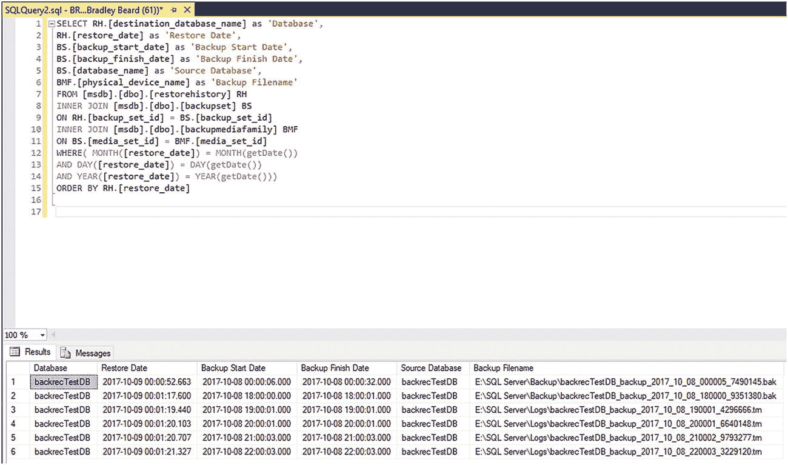
图 5-18
信任，但要验证的结果

有证据表明我们的备份是完整的，并且恢复成功。另请注意，列出的六个文件按顺序排列，与我们之前在 `图 [5-1]` 的 `常规` 选项卡中看到的相同。请翻回该图，并将 `图 [5-13]` 中的文件名与 `图 [5-18]` 中的文件名进行比较。它们是相同的，这再次证明了我们的操作是成功的。


###### 时间点恢复

如果你的数据库未曾遭遇过灾难性故障，那真要恭喜你了。我一只手就能数出自己不得不花一整天时间搜索日志文件并应用备份的次数，而且有时候，这些备份要么过时了，要么已损坏。“沮丧”这个词根本不足以形容我当时的心情；我觉得“愤怒”可能更为贴切。

很可能，你总会遇到需要恢复到某个特定时间点的情况，并且必须迅速行动以恢复必要的数据。在这种情况下，有几种不同的处理方法：一种是按照这些指导进行时间点恢复；另一种是将数据库完整恢复到另一个数据库实例，然后从辅助数据库中恢复的表里提取你需要的数据。本章后面的“紧急完整恢复示例”一节对此有详细描述。现在，我们将专注于时间点恢复。

让我们先来彻底搞乱我们的数据库，好吗？让我们删除 `users1` 表。这应该能在我们的事务日志尾部生成一个相当大的、需要恢复的事务。为了在恢复操作完成后进行比较，我们的初始记录数是 20030001 行。只需在“新建查询”窗口中键入以下内容，然后按 F5 或工具栏上的“执行”按钮来运行查询：

```
DROP TABLE users1;
```

接下来，执行以下语句：

```
SELECT count(*) as cnt FROM users1;
```

你将收到消息 `Invalid object name 'users1'`。我们也可以在“对象资源管理器”中刷新“表”，并确认 `users1` 表现在确实已消失。

要继续操作，请右键单击你的数据库（在我的例子中是 backrecTestDB），展开“任务”，然后展开“恢复”，你应该会看到如图 5-19 所示的内容。


图 5-19: “恢复”菜单位置

单击“数据库”，你将看到一个类似于图 5-20 的界面。这也类似于我们之前在图 5-13 中看到的。

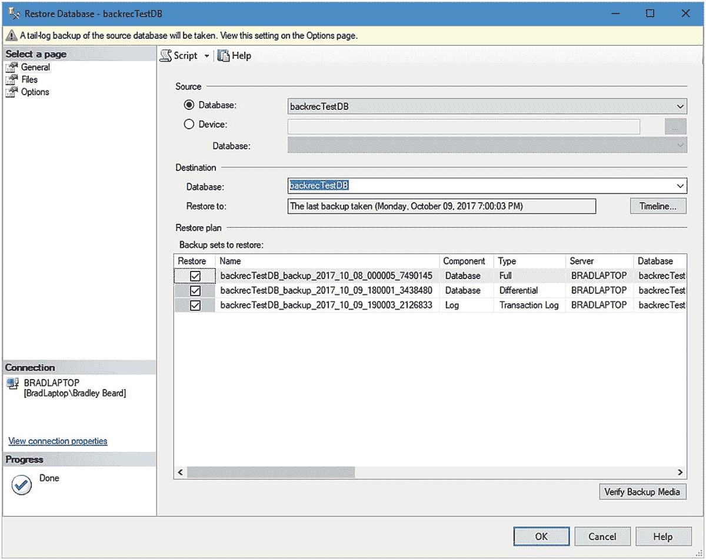
图 5-20: “还原数据库”屏幕

现在你对这个页面应该已经很熟悉了。我们将按下界面右侧的“时间线”按钮继续。按下“时间线”按钮后，你会看到如图 5-21 所示的内容。

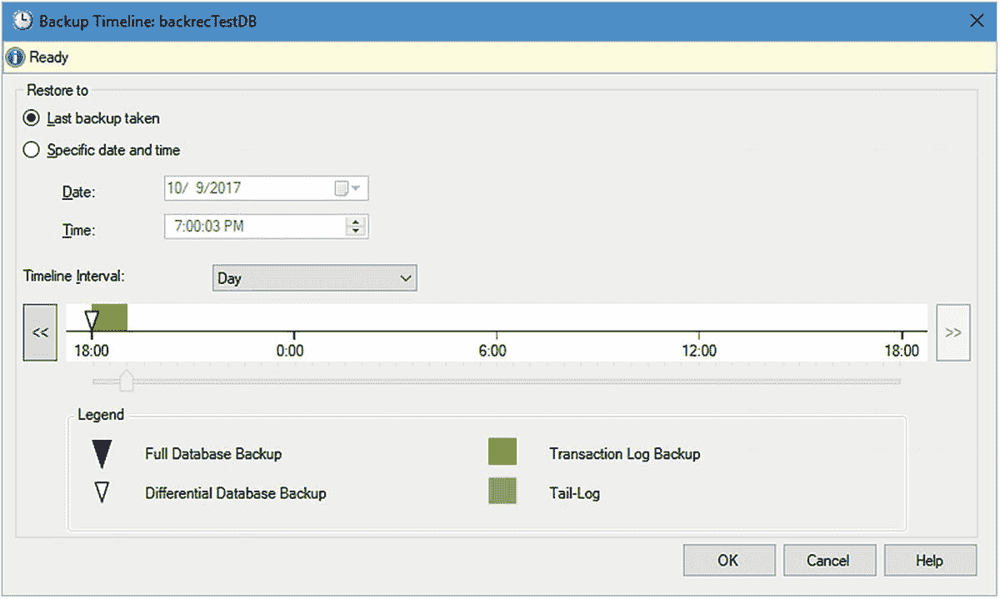
图 5-21: 备份时间线，上次备份

默认选项是“上次备份”。这与在之前的屏幕上直接按“确定”完全一样；它仅根据可用的备份文件进行恢复，仅此而已。

我们需要点击“特定日期和时间”单选按钮，以查看我们可以恢复到什么时间点。注意界面如何变更为图 5-22 所示。

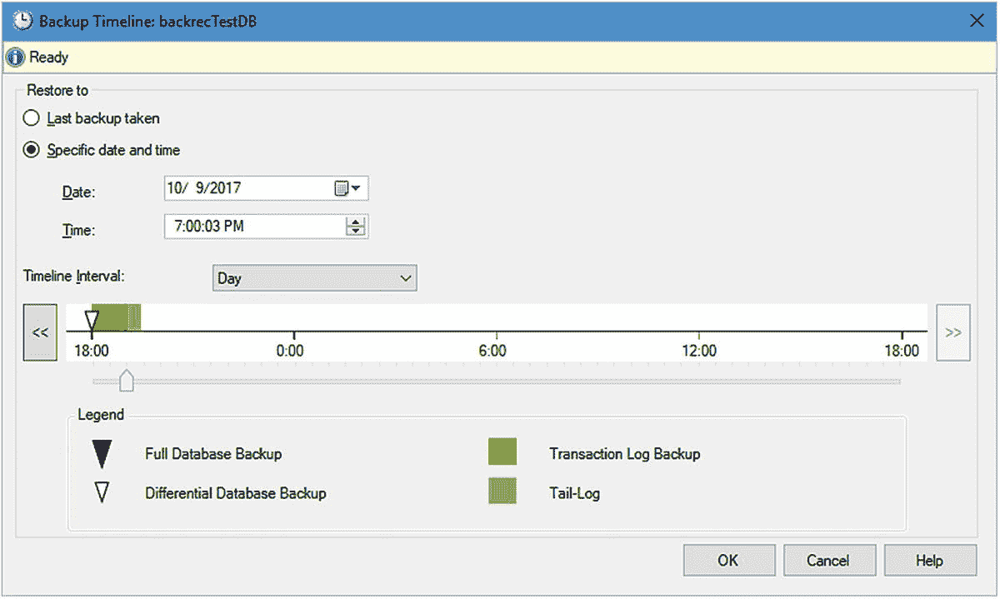
图 5-22: 备份时间线，特定日期和时间

看到“时间间隔”值如何变化以包含事务日志的尾部了吗？这是因为我们包含了尚未备份的那部分事务日志。通常，截止时间将是该事务日志的结尾，并且由于我的事务日志备份每小时运行一次，我最多只会丢失一个小时的数据（假设事务日志损坏）。你可以随意在此处查看而不按“确定”按钮。例如，你可以将“时间间隔”从“天”更改为“小时”、“六小时”或“周”，看看这如何影响你可以恢复的数据。在这个区域，粒度可以极其精细，通过一个简单的下拉选择就可以扩展到非常高的程度。

一旦你准备好继续，请将“时间间隔”下的滑块条移动到你希望恢复到的所需时间点，然后按“确定”。对于本示例，我将恢复到 2017 年 10 月 9 日晚上 6:40:31，因为我知道那是在我删除 `users1` 表之前。我不需要在“常规”选项卡上做任何其他事情，“文件”选项卡也没问题。跳转到“选项”选项卡，在这里我们需要勾选“覆盖现有数据库（`WITH REPLACE`）”选项，并在按“确定”开始恢复过程之前，取消选中“使源数据库处于还原状态（`WITH NORECOVERY`）”复选框。如果我想要在此组恢复操作之后恢复更多文件，我会希望保持“使源数据库处于还原状态（`WITH NORECOVERY`）”复选框为选中状态，但既然我不想再恢复其他内容，我将保持其未选中状态。请注意，除非取消选中“恢复前进行尾日志备份”复选框，否则将进行尾日志备份。在这种情况下，我将保持“恢复前进行尾日志备份”选项为选中状态。一旦所有设置都符合我的要求，我将点击“确定”。按下“确定”后，我看到如图 5-23 所示的内容，大约一分钟后，我看到如图 5-24 所示的内容。

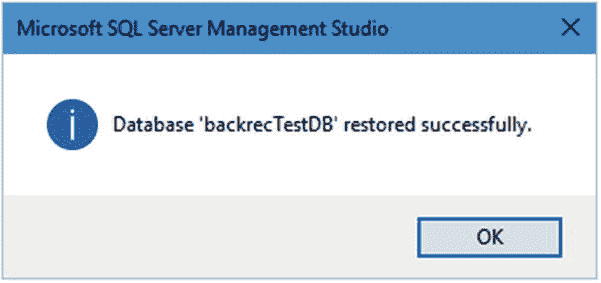
图 5-24: 恢复成功

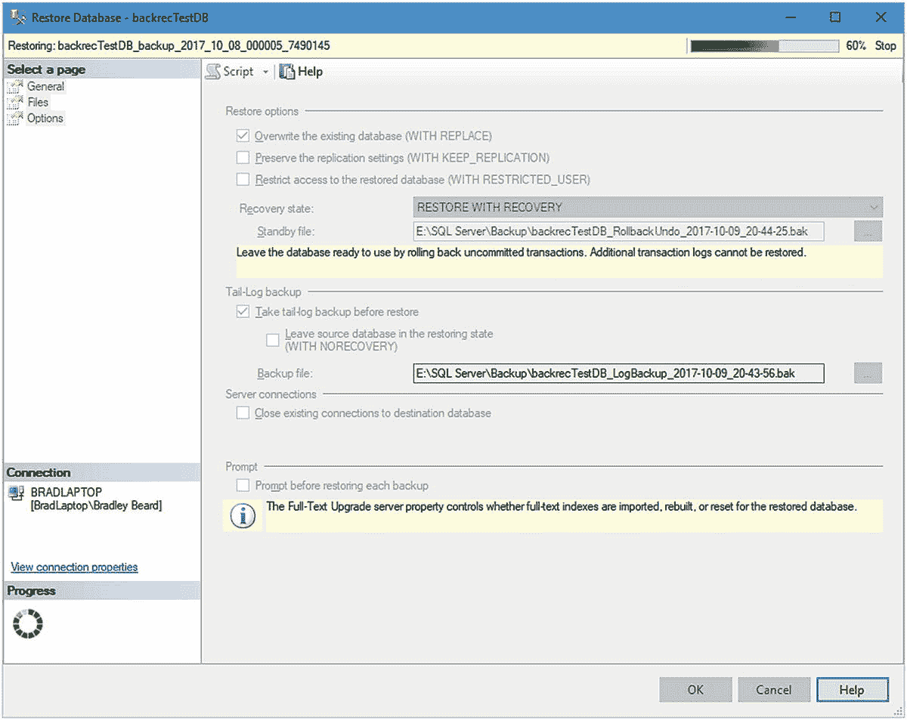
图 5-23: 还原数据库

此时，我知道我的数据库已成功恢复。但是，我仍然想验证 SQL Server 是否确实执行了它应该做的事情（记住，“信任但要核实”）。让我们运行之前运行的简单脚本：

```
SELECT count(*) as cnt FROM users1;
```

并查看结果。查询运行了几秒钟，然后返回值 20030001。和我们最初的值完全一样！因此，我们可以有把握地假设，该数据库已完全恢复到我们在时间线区域所选的时间点。


##### 紧急全量恢复示例

最近，我有一个具体的实例，因为一个脚本中的错误，我不得不恢复生产数据。让我们假设你有一个包含数百条记录的表，每条记录都有一个唯一标识符。这些记录中的每一条都涉及一组特定的数据，这些数据对于特定项目通过工作流的正常运行至关重要。让我们进一步假设，在生产实例上运行的更新脚本没有定义 `WHERE` 子句。我相信你能看出问题出在哪里……我将表中所有行更新为了一个特定值，而不是仅仅更新我需要更新的那一行。现在，在这个例子中，有很多种方法可以恢复数据，但我选择了最快，而不一定是最干净的方法。该方法包含以下步骤：

*   定位最新的备份集（完整备份、差异备份和事务日志备份）
*   将最新的完整备份还原到一个名为 `fixYourMistake` 的新数据库
*   将最新的差异备份还原到 `fixYourMistake` 数据库
*   将自差异备份以来的所有事务日志备份还原到 `fixYourMistake` 数据库
*   在生产数据库中创建一个名为 `(tablename)_archive` 的备用表，其中 `(tablename)` 是我的表名
*   编写一条 `INSERT INTO…SELECT` 语句，将原始表 `(tablename)` 的内容写入归档表
*   编写一条 `TRUNCATE` 语句来清空原始表
*   编写一条 `INSERT INTO…SELECT` 语句，将 `fixYourMistake` 数据库中已恢复的数据插入到生产数据库

你可能会问自己，为什么我没有直接将最新的事务日志还原到生产数据库以更快地完成操作。我之所以没有这样做，是因为我不确定数据库是否还会有其他残留的损害，所以我想要有一个可靠的备份以便恢复，以防万一。我也不想还原整个数据库，因为在此期间还有关键操作正在录入。在我还原了有问题的表并验证数据恢复正确且没有其他损坏后，我在数据库服务器上还有一点清理工作要做。为了在这次恢复后进行清理，我只需要 `DROP` 掉 `fixYourMistake` 数据库和之前创建的归档表。之后，数据库就愉快地运行起来了，信不信由你，除了我自己，甚至没有人意识到数据库曾出过问题。

我想指出，如果没有一个可靠的备份和恢复结构，这是不可能做到的。如果没有先前的备份来恢复数据，我就无法还原到上一个事务日志，这意味着我将丢失自上次完整备份以来——在一个生产环境中的数据。这是非常非常糟糕的消息，我认为不言而喻，自那以后，在生产环境上执行的脚本都受到了更为严格的审查。所以，我想你可以说，当这一切发生时，我既是自己最大的敌人，同时也是自己最好的朋友。在未来，我想少一些“敌人”会是件好事。

#### 总结

在本章中，我们学习了向数据库恢复完整备份的精髓。我们回顾了在数据库中采用完整恢复模式的重要性，这样我们才能使用 SQL Server 中提供的全套备份和恢复功能。

我们研究了时间点恢复，并介绍了 SSMS “恢复”部分中各种界面的基础知识。这些不同的部分包含了大量信息，我鼓励你在 SSMS 中创建一个备用数据库，恢复到这个新数据库，并尝试各种设置，直到你熟悉各种设置和选项在幕后实际所做的事情。

我们在这里学到的原理大部分可以迁移到差异备份和事务日志恢复领域，只是由于备份本身的特性而略有变化。例如，选择差异备份的过程在界面上是相似的，但其功能和目的与其他两种恢复类型完全不同。

## 6. 差异备份恢复

回到第 2 章，我们介绍了差异备份的基础知识，以及差异基准对整个恢复策略的重要性。这些同样的原则也适用于差异恢复，只不过我们现在可以说是在处理交易的另一端。恢复模式的选择是决定可用恢复方法有效性的最重要方面。回想一下，我们的测试数据库使用了完整恢复模型；这意味着我们可以使用数据库的全套备份和恢复功能。如果我们选择了大容量日志恢复模型，我们将获得大部分相同的功能，但如果事务日志中有大容量日志事务，我们将牺牲像第 5 章中那样进行时间点恢复的能力。大容量日志恢复模型将只允许我们恢复到备份的末尾；换句话说，每个备份都必须完整恢复，否则根本不会进行任何数据恢复。

在 SQL Server 中从差异备份恢复数据与从完整备份恢复数据几乎相同，但有一些明显的区别。首先，最明显的一点是，差异备份只能还原到对应的完整备份。这是因为差异备份是从上一次完整备份（在第 2 章中称为“基准”）以来，从已备份的事务日志和更改数据中获取的最后一组数据。因此，如果你尝试按错误顺序还原差异备份，它将失败。数据的序列将无法对齐，SQL Server 将停止恢复操作。其次，数据库必须处于 `NORECOVERY` 或 `STANDBY` 模式才能还原差异备份。这样做的原因是数据库只能将差异备份还原到完整备份；如果不先还原完整备份，就无法单独还原差异备份。一旦完整备份被还原，数据库就可以被置于 `NORECOVERY` 或 `STANDBY` 模式。

让我们简要回顾一下在恢复数据库时可用的恢复状态选项。这些选项控制恢复完成后数据库的状态，并且可以随着每次恢复类型而变化。

*   `RESTORE WITH RECOVERY`：这是默认选项，意味着数据库在恢复过程完成后立即可供使用。这意味着整个数据库恢复操作已完成，意味着无法再恢复额外的事务日志。
*   `RESTORE WITH NORECOVERY`：此选项不会使数据库处于就绪状态，这意味着在恢复操作完成后数据库不可操作。使用此选项，可以继续正常恢复事务日志。在对数据库执行使用 `WITH RECOVERY` 选项的最终命令之前，数据库无法进入就绪状态。
*   `RESTORE WITH STANDBY`：最后，此选项使数据库处于待机模式，本质上是只读的。任何尚未提交到事务日志的事务都将被撤销，并且撤销操作保存在一个待机文件中。

还记得第 5 章中我们如何勾选了 `将源数据库保持为还原状态 (WITH NORECOVERY)` 选项吗？这使我们仍然可以选择恢复更多备份，特别是差异备份和任何后续的事务日志备份，我们将在第 7 章中介绍这些内容。


#### 什么是差异还原？

简而言之，差异还原就是从差异备份中恢复数据。我们知道，差异备份仅包含自上次完整备份以来发生变化的数据，因此它的文件比完整备份要小。

那么，这如何融入我们的备份策略呢？我们的完整备份在每天凌晨 12:00 运行，差异备份每六小时运行一次，事务日志备份则每小时运行一次。换句话说，我个人认为这是一个相当稳健的备份计划。使用完整或简单恢复模型，以及实施差异备份和还原，有以下几个非常显著的意义：

*   我们可以拥有更少的事务日志，从而在备份计划中总体文件更少，因为我们可以删除最后一次完整备份之前的所有事务日志，前提是这些事务日志中的数据已经包含在差异备份中。
*   我们拥有更多的恢复点，或者说，我们可以还原到的位置更多了。
*   备份可以在白天进行，而无需每次都运行完整备份。这将减少服务器 CPU 时间并节省空间。

我们可以看到，在我们的常规数据库恢复计划中使用差异备份和还原，对于我们之前确定的理想恢复场景来说是最佳选择。

#### 使用 SSMS 进行还原

我希望到目前为止，我们都对使用 SQL Server Management Studio 进行数据库还原有了一点经验。如果你读过我的第一本书，我严重依赖维护计划的创建来处理日常数据库维护的全部工作。这包括一种最终可用于数据恢复的备份方法，包含完整备份、差异备份和事务日志备份。我们现在还不想走得那么远，因为这是我们将在后续章节中整合所有内容时才会涉及的，但我们确实想看看如何在 SQL Server Management Studio 中处理差异还原。

如果还没有启动 `SSMS`，请现在开始。你应该会看到左侧有对象资源管理器的界面，而主区域是空的。我通常会在主区域保持一个“新建查询”窗口打开，但这不是必须的。一旦你打开了 `SSMS` 并准备好继续，请展开 `数据库`，右键单击你的测试数据库名称（我的是 `backrecTestDB`），将鼠标悬停在 `任务` 上，然后选择 `还原`，最后选择 `数据库…` 以继续。图 6-1 显示了该菜单项的位置。

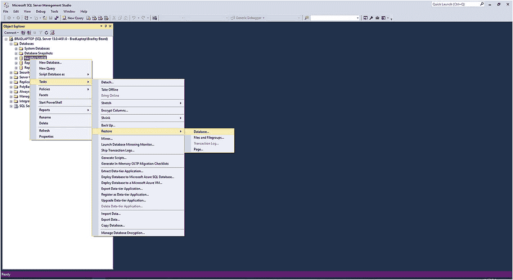

图 6-1：数据库菜单位置

如图 6-1 所示选择 `数据库` 后，你将看到如图 6-2 所示的屏幕。

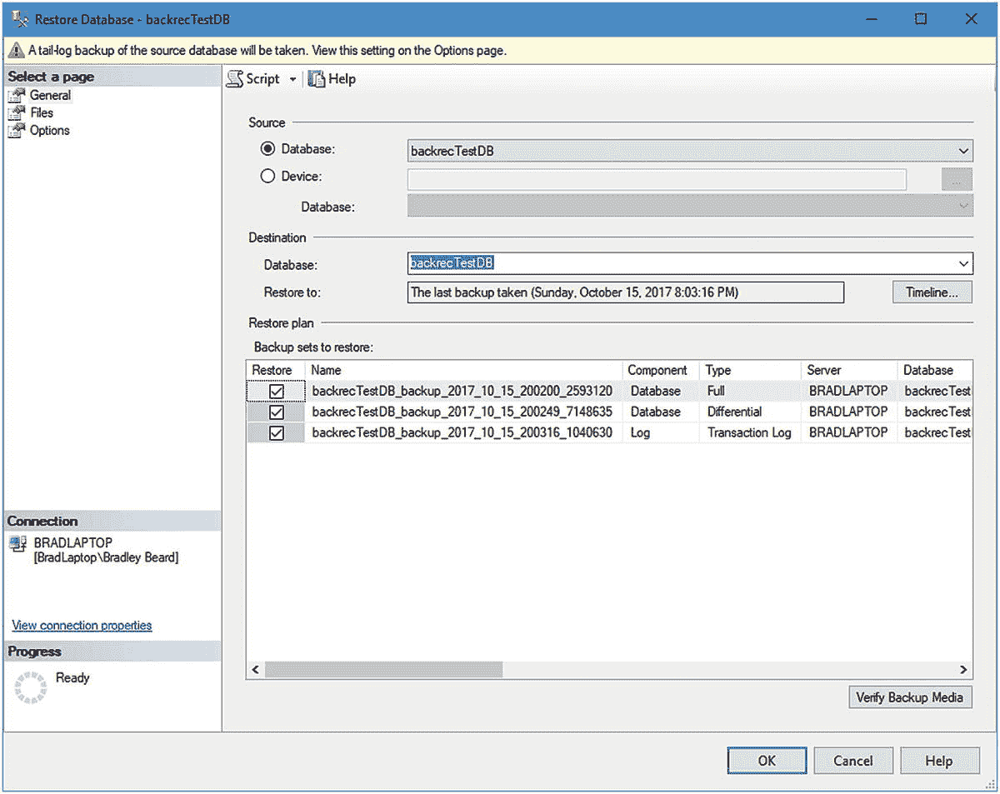

图 6-2：还原数据库

这是每次我们想要还原数据库时之前都见过的常规屏幕。请注意，如图 6-2 所示，该数据库的所有可用备份都显示出来了，我删除了文件系统中的几个备份以使界面更清晰。

在你的界面中，验证列出的三个备份（或你拥有并想要还原的任意数量的备份）旁边的所有复选框是否都已选中。由于我们要还原差异备份，我们必须先还原完整备份，并且为了能够继续还原差异备份和事务日志，我们必须将数据库保持在 `正在还原` 状态。如果你取消选中所有恢复选项，你将看到可以在此数据库内完成的可用还原组合。这些组合如下：

*   完整备份
*   完整备份 + 差异备份
*   完整备份 + 事务日志
*   完整备份 + 差异备份 + 事务日志

换句话说，当我们使用 `SSMS` 时，每次想要执行还原操作都必须从完整备份开始。可以这样想：如果下午 3:05 你的数据库出现错误，在我的当前备份计划下，你需要还原当天早上的最后一个完整备份，然后是中午 12:00 的差异备份，最后是每小时的事务日志，直到恢复到你需要的数据位置。

请注意，我们位于 `还原数据库` 屏幕的 `常规` 选项卡上。我们已经浏览过这些选项卡中的各种选项，所以不需要再重复一遍。请注意，我们还将备份事务日志的尾部，这是一个默认选项，以便运行还原过程的事务保存在新的事务日志中，而之前的事务则保存在新备份的事务日志尾部。

由于我们要还原差异备份，我们只需确保在 `常规` 选项卡上选中了完整备份和差异备份选项，然后按 `OK`。然后我们会等待几秒钟，或者可能更长时间，然后看到如图 6-3 所示的内容。

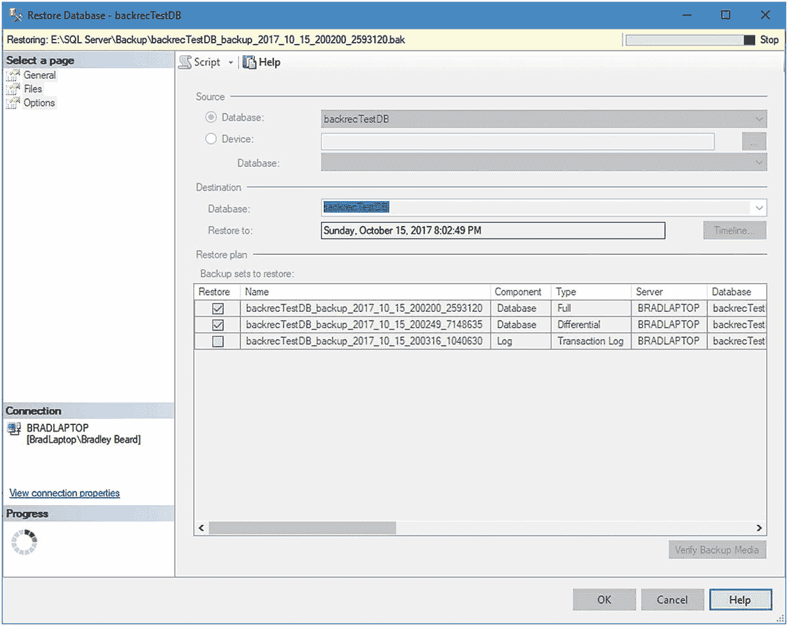

图 6-3：正在进行的还原数据库

希望我们最终会看到一条成功消息。点击此消息上的 `OK`，`还原数据库` 屏幕就会消失。这表明我们的数据库已还原到与差异备份相关的数据状态。

#### 使用 T-SQL 进行还原

使用 `T-SQL` 还原差异备份的过程出奇地简单。到目前为止，我并没有包含大量的 `SQL` 代码，因为我希望这些书籍更侧重于数据库管理的可视化方面，但我认为这里值得花一点时间。

使用 `T-SQL` 的真正优势，除了自动化目的之外，在于如果你无法访问 `SQL` 界面但仍然可以访问数据库服务器，你可以使用 `sqlcmd` 来执行 `SQL` 语句。

使用逻辑备份设备且没有其他文件需要还原时，进行差异还原的基本语法如清单 6-1 所示。

```sql
RESTORE DATABASE backrecTestDB
FROM backrecTestDB
WITH NORECOVERY
清单 6-1：RESTORE DATABASE SQL 脚本
```

没有定义备份设备，或者当你需要从文件系统而非逻辑备份设备还原，并且没有其他文件需要还原时，进行差异还原的基本语法如清单 6-2 所示。

```sql
RESTORE DATABASE backrecTestDB
FROM DISK = 'E:\SQL Server\Backup\backrecTestDB\backrecTestDB_DIFF.bak'
WITH NORECOVERY
清单 6-2：RESTORE DATABASE SQL 脚本
```

请记住，在还原差异备份时，当我们指定 `NORECOVERY`，我们表达的意思是我们希望先还原最后一个完整备份，然后再还原差异备份。这样做的原因在于，正如我们之前讨论的，所有还原都必须有一个逻辑起点，而唯一能做到这一点的地方就是最后一个完整备份，它是该时间段内的最高级别还原。从这一点出发，我们就可以筛选差异备份，最后进入事务日志，以到达数据还原的确切位置。如果我们还有额外的事务日志需要还原，我们也希望指定 `NORECOVERY`；否则，我们将指定 `RECOVERY`。

如果你执行清单 6-1 中的代码，考虑到你已经定义了一个逻辑备份设备，并且没有其他文件需要还原（即额外的事务日志），你将得到与我们之前执行差异还原相同的结果。清单 6-2 也会产生相同的结果，如果你需要从文件系统而非逻辑备份设备还原。


#### 摘要

本章是本书中最简短的一章，原因很简单：差异恢复的概念是建立在先前完整备份的基础之上的。换言之，只要你拥有完整备份，你就能希望开始恢复所需的数据，无论该数据是位于差异备份还是事务日志中。恢复差异备份可以被视为恢复完整备份的逻辑延伸，因为差异恢复的存在以完整备份已先被恢复为前提；但正如我们之前提到的，如果你需要的是事务日志中的数据，你随时可以改为从事务日志恢复。

我们介绍了如何通过 `SSMS` 和直接使用 `SQL` 语句来恢复差异备份，并简要概述了与此类恢复相关的不同选项。请确保在你所需编写的恢复脚本中，包含我们在清单 6-1 和清单 6-2 中介绍的语法。

下一章，我们将探讨如何恢复事务日志，以及在此领域可以启用或禁用的不同选项。

