# 7. 事务日志恢复

在 `SQL Server` 中恢复事务日志可能出乎意料地简单。然而，在尝试恢复事务日志之前，有几件事需要考虑，例如以下问题：
*   你是否需要恢复到某个特定的时间点？
*   你是否正试图从灾难性的数据库故障中恢复？
*   你甚至是否有可恢复的事务日志？
这些问题，有时还有更多问题，都需要得到解答，以便引导你走上正确的事务日志恢复路径。我曾多次收到所属某个数据库发生事故的警报，当时并未停下来考虑该采取哪条路径：我只是径直踏上了“恢复某某东西”这条照明不佳的道路。换句话说，我知道我需要恢复一些数据，但并不确切知道具体需要恢复什么数据。我不知道哪些表（如果有的话）受到了影响，或者某个时间点之后的所有内容是否都受到了影响。

因此，最好永远考虑以下这条免费建议：在尝试恢复事务日志之前，花尽可能多的时间收集正确信息并制定可行计划。请相信我，恢复“错误”的数据可能会让你的情况变得糟糕得多。

**提示**
你的数据库必须启用完整恢复模式或大容量日志恢复模式，才能拥有可供恢复的事务日志。

#### 事务日志恢复基础

在处理本章节语境下的事务日志恢复时，有一些基本事项我们需要先澄清。首先，我不会深入探讨事务日志是什么、它们如何工作、哪个比特位存储了什么数据以及为何这很重要这些细节。对我来说，这个主题或许最好不放在本书中讨论，因为我希望本书更侧重于解决问题，而非学习问题的微妙之处。话虽如此，让我们还是回顾几个我认为重要的小主题（或许还有几个虽不重要但仍可能与事务日志恢复这个整体问题相关）。

恢复事务日志有两种方式：使用 `SSMS`，或者使用 `Transact-SQL`。是的，可以说两种方式都使用了 `Transact-SQL`，因为那是 `SQL Server` 的语言，但我特指的是使用 `SQL Server Management Studio` 来创建 `SQL Server Agent` 作业以自动化恢复过程，或者手动从 `CLI` 或也在 `SSMS` 内部使用 `Transact-SQL`。

对于下一节，我在 `SSMS` 中执行了清单 7-1 所示的代码。

```sql
DECLARE @cnt INT;
SET @cnt = 0;
WHILE @cnt <= 1000
BEGIN
INSERT INTO users1 SELECT * FROM users2;
SET @cnt = @cnt + 1;
END;
SELECT count(*) as cnt FROM users1;
```
**清单 7-1** 为数据库创建更多数据

这是我们早在第 1 章创建的 `CreateTestData.sql` 的一个片段。运行此片段前我的记录数是 `10,020,000`，运行此片段后的记录数是 `20,030,000`。这应该会导致事务日志大小产生相当显著的差异。

我想做的是将数据库恢复到记录数为 `10,020,000` 的先前版本。下一节将详细说明如何在 `SQL Server Management Studio` 中使用“文件和文件组”界面完成此操作，然后使用“还原数据库”界面进行时间点恢复。


#### 使用 SSMS 进行恢复

执行恢复操作最简单的方式很可能是通过图形界面。我确信会有一些老派的命令行高手指出我方法的错误，对此我只想说：“嘿，哇，你在控制台里做的和我在 GUI 里做的本质上是同样的事情……很棒。” 仅此而已。我不是那种规定必须使用特定方法论的开发者，无论是 GUI（在 `SSMS` 中）还是 `CLI`（使用 `Transact-SQL`）。我倾向于使用手头可用的任何工具，并且真的不太关心陷入“你应该用这个工具因为它太棒了，其他任何方式都很糟糕”这种二元对立的争论中。例如，我在 `Dreamweaver` 中编写 `ColdFusion`。我不使用专门为 `ColdFusion` 开发构建的 `IDE`——`ColdFusion Builder`。为什么？因为我最初就更喜欢 `Dreamweaver` 的布局和结构，即使过了这么多年，我仍然如此。这并不意味着 `ColdFusion Builder` 比 `Dreamweaver` 差或好；这只是意味着我个人的偏好是其中一个而非另一个，而且我确信在对某些软件工具的偏好上，我并非个例。

如果你直接进入菜单结构，心里想着“我想恢复一个事务日志”，你可能会在右键单击数据库名称后，从 `Tasks`（任务）菜单选项开始。图 7-1 展示了这个起点。

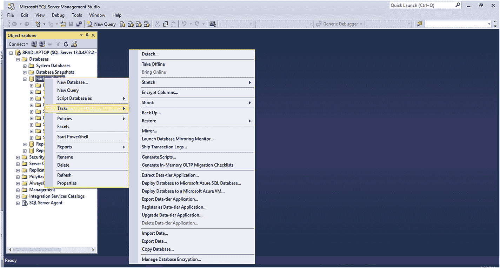

图 7-1：`Tasks`（任务）子菜单

从这里，逻辑上你会指向右侧的 `Restore`（恢复）区域，并从那里继续。这是正确的，但接下来的部分可能会让人困惑。图 7-2 显示了 `Restore`（恢复）选择的展开菜单。

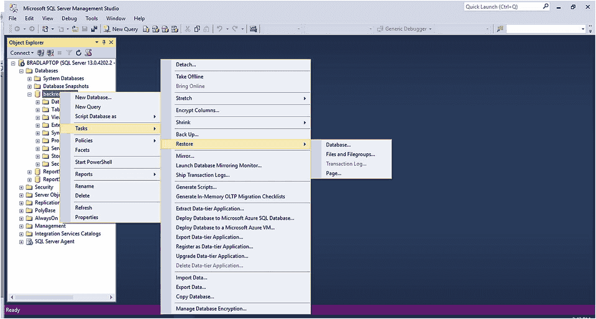

图 7-2：`Restore`（恢复）菜单选项

此菜单有四个选项。这些选项如下：

*   `Database`（数据库）：此选项允许你从完整或差异备份还原数据库。此选项不允许你还原事务日志。
*   `Files and Filegroups`（文件和文件组）：此选项允许你将一组文件还原到新的或现有数据库。你可以选择完整或差异备份，相应的事务日志将被选中用于还原操作。因此，你可以选择单个事务日志进行还原，并且你的选择将自动包含自上次完整或差异备份以来的每个事务日志。请注意，所有当前备份都包含在此界面中，因此在还原数据时要非常小心。
*   `Transaction Log`（事务日志）：此选项通常不可用，只有在少数特定情况下才可用。当数据库已使用完整备份还原，并且选择了 `RESTORE WITH STANDBY`（使用 STANDBY 还原）作为还原选项时，数据库将保持在 `RecoveryPending`（恢复挂起）模式，直到事务日志的尾部被还原。有趣的是，当此选项启用时，意味着数据库当前正处于等待还原事务日志尾部的状态，此区域中所有其余三个选项都会被禁用。此外，当数据库已使用 `NORECOVERY`（无恢复）还原，并且数据库当前处于 `Restoring…`（正在还原…）模式时，此选项可用，意味着你可以继续还原事务日志。
*   `Page`（页面）：此选项将让你检查数据库页面是否存在可能的损坏，并允许你从最新的完整、差异和事务日志备份集中还原。你的选择必须包含一个完整的备份集，这将代表一个完整的还原解决方案。

出于本次演示的目的，我们将选择 `Files and Filegroups`（文件和文件组）选项。这将为我们提供还原事务日志所需的一些选项。你可以通过右键单击要操作的数据库并导航到 `Tasks`（任务）➤ `Restore`（恢复）➤ `File and Filegroups`（文件和文件组）来打开 `Files and Filegroups`（文件和文件组）窗口。图 7-3 显示了此菜单选项的位置。

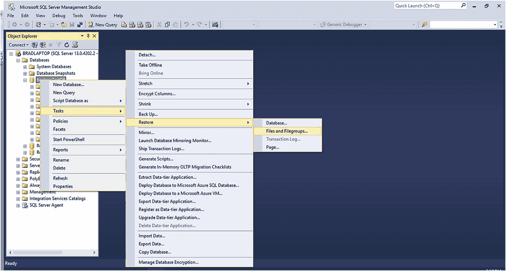

图 7-3：`Files and Filegroups`（文件和文件组）菜单位置

##### 还原文件和文件组 — 常规

图 7-4 显示了 `Restore Files and Filegroups`（还原文件和文件组）部分的初始界面。请注意，默认情况下，选中的是左侧界面指示的 `General`（常规）页面。

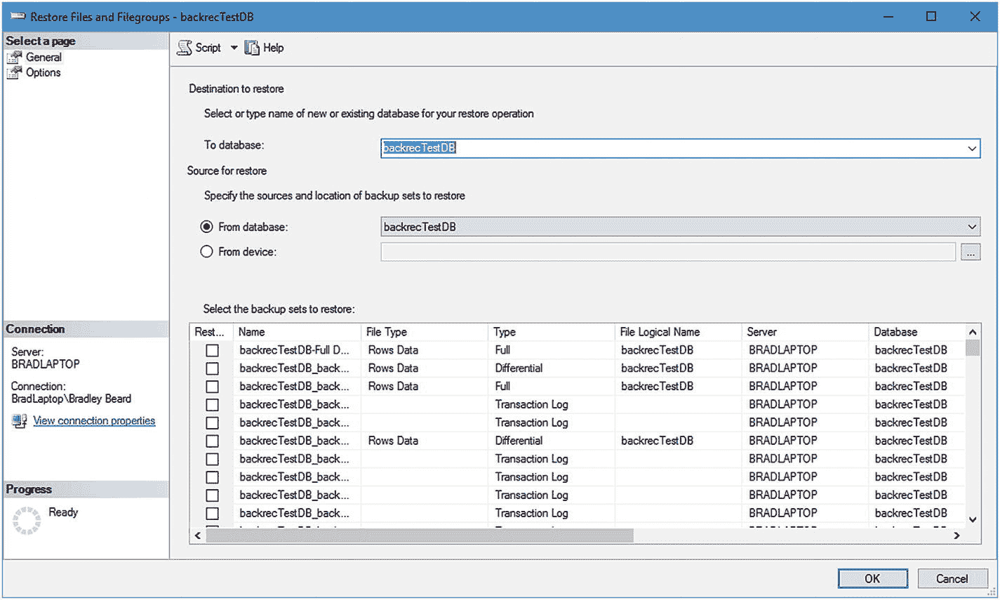

图 7-4：`Restore Files and Filegroups`（还原文件和文件组），`General`（常规）页面

让我们花点时间熟悉一下这个屏幕。`常规`界面与 `SQL Server` 中许多其他常规界面几乎相同，意味着有一个 `目标`（destination）字段和一个 `源`（source）字段。这告诉用户通常有等式的两边需要填写，如果这个等式要平衡并产生预期的结果，两组数据都必须填写正确。

第一部分，`还原的目标`（Destination to restore），包含具有完整或大容量日志恢复模型的数据库名称。你的数据库应该默认被选中。

第二部分，`还原的源`（Source for restore），包含具有可用于还原的有效备份的数据库名称。

在这两个选项下方，显示了备份集。初始布局显示以下列：

*   `还原`（Restore）：是/否的复选框值；勾选表示是，未勾选表示否。
*   `名称`（Name）：备份文件的名称。请注意，此视图中不包含文件扩展名。
*   `文件类型`（File Type）：此值对于完整或差异备份是“行数据”（Rows Data），对于事务日志备份则为空白。
*   `类型`（Type）：备份的类型；值为 `完整`（full）、`差异`（differential）或 `事务日志`（transaction log）。
*   `文件逻辑名称`（File Logical Name）：文件的逻辑名称，独立于 `名称`（Name）字段。
*   `服务器`（Server）：运行备份的 `SQL Server` 实例的名称。
*   `数据库`（Database）：备份来源的 `SQL Server` 数据库的名称。
*   `开始日期`（Start Date）：备份操作开始的日期和时间。
*   `完成日期`（Finish Date）：备份操作完成的日期和时间。
*   `大小`（Size）：备份的大小。
*   `用户名`（Username）：用于生成备份的账户的用户名。

你将使用这些列来确切确定要还原哪些备份以及还原它们的顺序。幸运的是，`SSMS` 为你简化了这项工作。

滚动到 `选择要还原的备份集:`（Select the backup sets to restore:）区域的底部。此区域列出的最后一项应该是事务日志备份。如果事务日志没有列在最后，请向上移动列表，或在时间上更早地找到最近的事务日志备份。勾选 `还原`（Restore）复选框，并注意自上次差异备份以来的所有其他事务日志，以及最后一次差异备份都会被选中。这是因为 `SQL Server` 知道它需要首先还原完整备份，然后是差异备份，最后是事务日志，并按正确的时间顺序进行，才能成功将数据库还原到特定时间点。此时，你应该看到类似图 7-5 所示的内容。

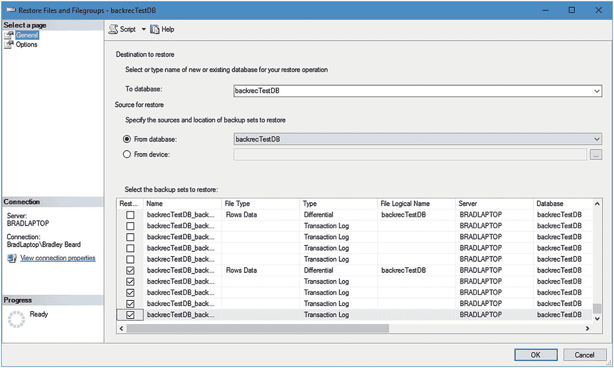

图 7-5：选中了最后一个事务日志

请注意，选中的选项是四个事务日志备份和一个差异备份，如 `类型`（Type）列所示。


##### 还原文件和文件组—选项

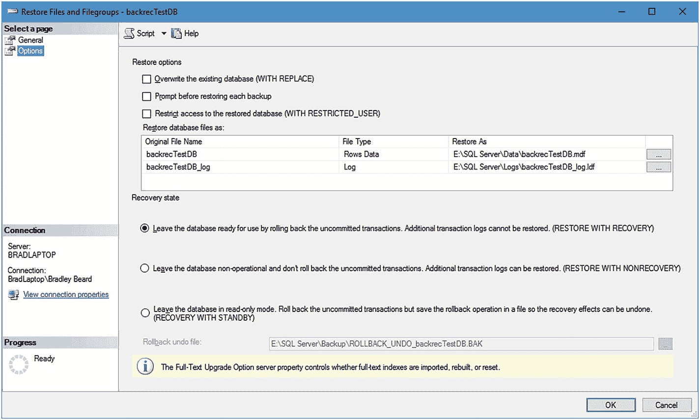

*图 7-6：还原文件和文件组，选项页*

从图 7-6 所示界面左侧导航引用的第二页，标题为**选项**。

###### 界面概览

在此区域中，我们看到一些选项，如果您还不熟悉它们，可能会感到有些困惑。在继续之前，让我们先了解一下。

此界面分为两个主要部分：**还原选项**和**恢复状态**。**还原选项**部分允许您（DBA）在数据还原过程开始前以及过程中自定义各种可用选项；而**恢复状态**部分则允许您定义数据还原后将发生的情况。

###### 还原选项

在**还原选项**部分，有三个复选框，标题如下：

*   覆盖现有数据库 (`WITH REPLACE`)
*   还原每个备份前提示
*   限制对还原数据库的访问 (`WITH RESTRICTED_USER`)

请注意，括号内的部分是如果您使用 Transact-SQL 还原备份时需要记住的代码，这将在下一节讨论。

###### 恢复状态

在**恢复状态**部分，有三个单选按钮，标题如下：

*   通过回滚未提交的事务使数据库处于可用状态。无法还原其他事务日志。(`RESTORE WITH RECOVERY`)
    *   此选项默认选中。原因是这是备份恢复最常见的用途；通过回滚任何未提交的事务，使数据库立即可供运行。
*   使数据库处于不可用状态，并且不回滚未提交的事务。可以还原其他事务日志。(`RESTORE WITH NONRECOVERY`)
    *   这是最具破坏性的选项。老实说，我无法想象在什么情况下我会希望生产数据库处于不可用状态，除非我们正在处理故障转移或负载均衡。在那种情况下，是的，我可以想象这对修复数据库实例有用，但除此之外，正如我所说，它具有破坏性，因为数据库将保持不可用状态，直到显式将其恢复联机。
*   使数据库处于只读模式。回滚未提交的事务，但将回滚操作保存在一个文件中，以便可以撤销恢复效果。(`RECOVERY WITH STANDBY`)
    *   此选项实质上允许您“暂停”数据库并将其置于只读模式。未提交的事务会被回滚，但回滚操作会被保存，以便以后可以撤销（如果需要）。例如，这对于确保数据库中一切按预期工作是一个好选项。
    *   选择此选项后，您可以选择回滚撤销文件的存放位置。

###### 恢复策略

对于“常规”备份，即您只想将数据还原到上一次事务日志备份点，您只需要还原最近的差异备份，然后按顺序还原事务日志，直到您需要访问数据的时间点。对于绝大多数恢复情况，都是如此。

您很少会想要恢复到许多天前的某个特定时间点，并冒着丢失该点之后累积的所有数据的风险，换句话说。不过，确实存在一些特定情况正是如此，在这种情况下，我强烈建议在对生产或开发数据库进行任何操作之前，先运行一次当前数据库的备份。备份运行并验证后，再按照您选择的任何路径继续进行数据库恢复。根据我的经验，我发现将完整备份、差异备份和事务日志备份恢复到辅助数据库，对于验证所寻求的数据是有益的。找到数据后，我再创建 `INSERT INTO… SELECT` 脚本，从辅助数据库更新我的主数据库。更新完成并确认数据已成功恢复后，我可以删除辅助数据库，然后继续处理其他事务。我唯一需要强调的注意事项是，确保 `INSERT INTO… SELECT` 语句编写正确，以便能从辅助数据库正确更新主数据库；否则，您只是在给自己制造更多的工作。

我发现这是一个极好的方法，可以确保正在恢复的主数据库和辅助数据库表之间的数据正确无误，因为我是在当前主数据库之外，但基于过去某个时间点的精确副本来处理辅助数据库。

###### 完成还原

要继续操作，只需确保勾选了**覆盖现有数据库 (`WITH REPLACE`)** 选项，并选择了数据更新之前的事务日志（回滚至上一次完整备份），然后单击**确定**按钮。图 7-7 显示了一个窗口，告诉我们数据库已成功还原。

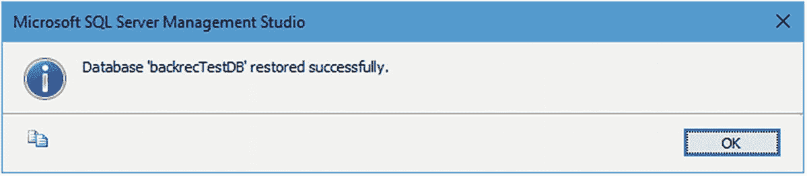

*图 7-7：数据库成功还原*

在此窗口上单击**确定**，请注意我们的主**还原文件和文件组**窗口已关闭。回到 SSMS 并运行以下查询：

```sql
SELECT count(*) as cnt FROM users1
```

您的结果应为 `10,020,000`。恭喜！

##### 时间点还原/恢复

要还原事务日志，我们首先需要还原一个完整备份，并可选地还原一个差异备份。你是否曾在数据库卡在 `正在还原` 模式时，在 `SSMS` 中见过数据库的状态？正如我在本章前面提到的，当使用 `RESTORE WITH STANDBY` 或 `RESTORE WITH NORECOVERY` 选项还原完整或差异备份时，就会发生这种情况。数据库将保持 `正在还原` 状态，直到事务日志尾部被还原，或者 `RESTORE WITH RECOVERY` 语句作为还原过程的一部分被执行。让我们在实践中看一下。

在 SQL Server Management Studio 中，右键单击你的数据库（我的数据库名为 `backrecTestDB`），然后导航到 **任务** ➤ **还原** ➤ **数据库…** 以继续。图 7-8 显示了此菜单项的位置。

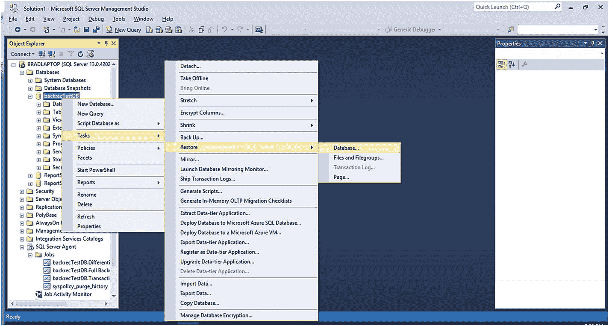

图 7-8

还原数据库菜单位置

打开的界面标题为 **还原数据库**。请注意，左侧有三个选项卡：**常规**、**文件**和**选项**，对应于此界面中的不同页面。默认选择是**常规**，这正是我们在图 7-9 中看到的。

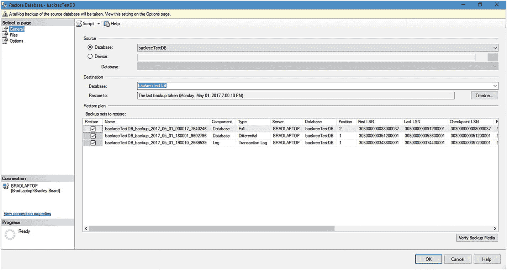

图 7-9

还原数据库界面

此页面向我们展示了**源**、**目标**和**还原计划**部分。这些部分定义如下：

*   **源**：要从中还原的源文件的位置。可以是包含备份文件的现有数据库，也可以是包含备份文件的本地或网络存储位置。
*   **目标**：要还原到的数据库的位置。此处的`还原到`字段的默认值是最后一个备份集，但可以通过单击**时间线…**按钮并选择要还原的时间范围来进行调整。这被称为时间点还原。
*   **还原计划**：该部分详细说明了将要还原的文件，以及即将介绍的**要还原的备份集：**部分。

假设我想将我的数据库还原到今天早上 8:00 的状态。界面的这个部分就是你想要去的地方，因为它允许你精确定位要从中还原数据的特定时间和数据。

点击图 7-9 所示界面中**目标**部分的**时间线**按钮。将打开一个屏幕，如图 7-10 所示，标题为**备份时间线 : backrecTestDB**（或你的数据库名称）。

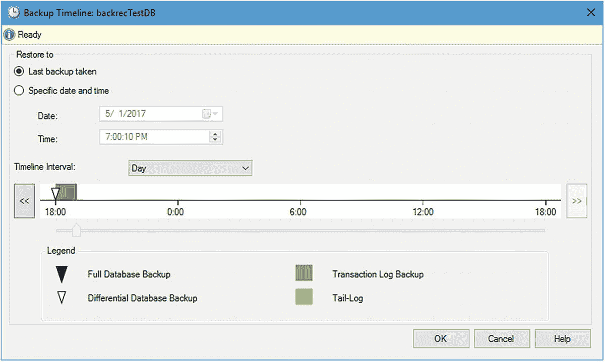

图 7-10

备份时间线: backrecTestDB

请注意，初始配置是**最近一次备份**。在这种情况下，最近一次备份的时间是晚上 7:00。这对你来说可能很理想，但我想还原到早上 8:00，记得吗？点击**特定日期和时间**的单选按钮，并选择你想要还原到的日期。图 7-11 显示了我更新后的界面。

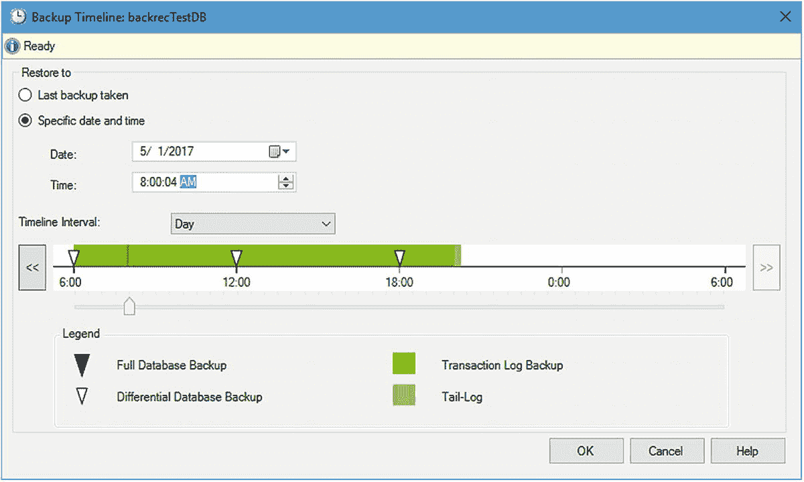

图 7-11

备份时间线: backrecTestDB, 已更新

请注意，`时间线间隔`字段设置为**天**。此下拉菜单中还有其他选项，其值包括**小时**、**六小时**和**周**。如果你愿意，可以随意选择这些选项，但你刚刚所做的选择值可能会发生变化。你还可以在时间线视图底部、图例上方移动滑块以获得更精确的时间线定位。当你选择了想要还原到的正确时间后，单击**确定**按钮返回**还原数据库**屏幕。

一旦你返回到**还原数据库**界面，请注意**要还原的备份集：**部分已更新，显示了相关的待还原备份集。通常，此区域将填充与选定的需要还原事务的时间范围相关的完整备份和差异备份。图 7-12 显示了**要还原的备份集：**部分重新填充后的我的屏幕。

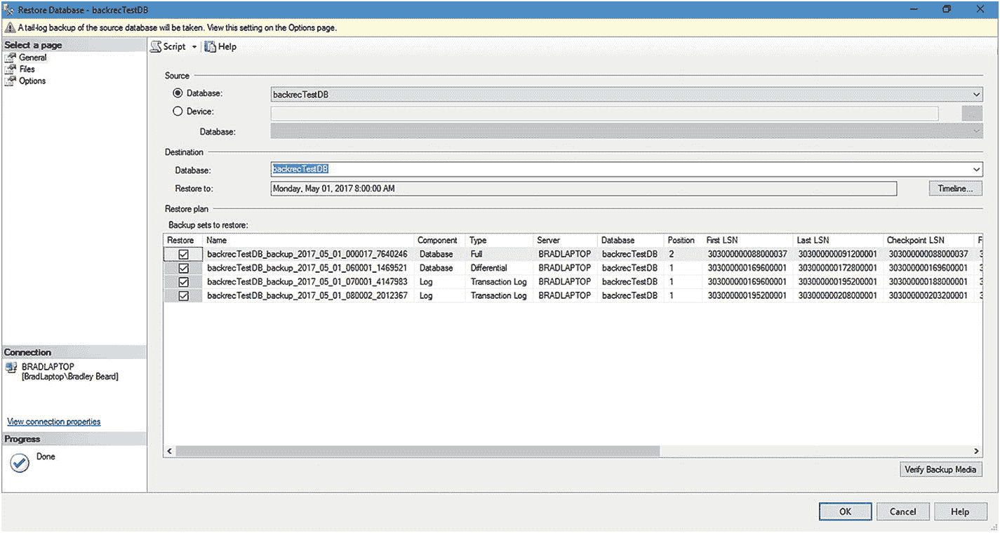

图 7-12

还原数据库, 已更新

此时，我们可以看到列表顶部是完整备份，然后是差异备份，底部是两个事务日志备份。如果需要验证介质，请点击**验证备份介质**按钮；我通常在看到此按钮时都会点击，以防万一。

左侧的**文件**选项卡现在可以保持原样。你通常在此处定义还原文件的存储位置和名称，但我们不打算更改此设置。

**选项**选项卡需要一些解释。请导航到那里，并注意该界面包含以下部分和选项：

*   **还原选项**
    *   **覆盖现有数据库 (WITH REPLACE)**：此选项将覆盖所选数据库的数据库文件。这是一个破坏性很强的选项，请自行承担使用风险。
    *   **保留复制设置 (WITH KEEP_REPLICATION)**：如果为数据库定义了复制设置，则保留它们。此选项专门用于需要将已发布到不同于备份数据库的服务器的数据库进行还原的情况。
    *   **限制对还原数据库的访问 (WITH RESTRICTED_USER)**：数据库还原后，只有 `db_owner`、`dbcreator` 和 `sysadmin` 的成员可以访问。
*   **恢复状态**
    *   **RESTORE WITH RECOVERY**：此选项将还原所有备份集作为默认操作。
    *   **RESTORE WITH NORECOVERY**：此选项将使数据库保持前面讨论的`正在还原…`状态。一旦事务日志尾部被还原，数据库将转入正常状态。
    *   **RESTORE WITH STANDBY**：此选项将使数据库处于只读状态。如果选择此选项，则必须指定一个备用文件。
    *   **备用文件**：此文件将撤消恢复操作。
*   **尾部日志备份**（包含先前未备份的事务日志部分或活动部分的备份）
    *   **还原前进行尾部日志备份**：指定你希望备份事务日志的尾部。
    *   **使源数据库保持在还原状态 (WITH NORECOVERY)**：与前面列出的选项相同；数据库将保持在`正在还原…`状态。
    *   **备份文件**：事务日志尾部备份文件的位置。
*   **服务器连接**
    *   **关闭到目标数据库的现有连接**：基本上，此选项将数据库置于单用户模式，并关闭所有从 `SSMS` 到数据库引擎的连接。还原过程完成后，数据库将恢复为多用户模式，连接再次可用。
*   **提示**
    *   **还原每个备份前进行提示**：此选项将显示一个弹出窗口，询问是否要继续每次还原操作。

对于此**选项**选项卡，我只想勾选**覆盖现有数据库**并取消选中**使源数据库保持在还原状态**。此屏幕上的其他所有内容都可以保持不变（图 7-13）。

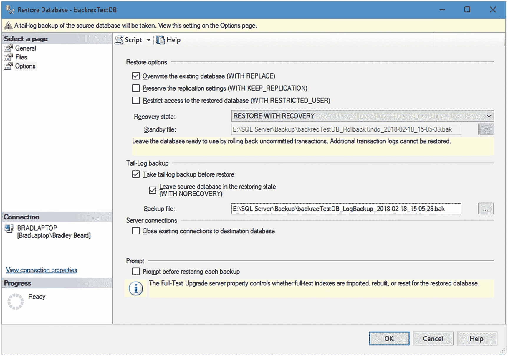

图 7-13

还原数据库, 选项选项卡

准备就绪后，单击屏幕底部的**确定**按钮。你应该会看到界面顶部的“正在还原”状态部分，以及一个递增至 100% 的进度百分比，直到成功完成。

接下来，回到 `SSMS` 并运行以下查询：

```sql
SELECT count(*) as cnt FROM users1
```

你的结果应该是 20030000。恭喜你！

在第一部分中，我们已成功通过 `SQL Server Management Studio` 以两种不同方式还原了事务日志。

#### 使用 Transact-SQL 还原

这种方法稍微简单一些。在 `SQL Server Management Studio` 的下载中，有一个名为 `模板浏览器` 的侧边栏可用。如果你没有立即看到它，请按 `Ctrl+Alt+T`，或在 `SSMS` 中转到 `视图` ➤ `模板资源管理器`。该侧边栏应在主窗口右侧打开。向下滚动到 `还原` 子菜单并展开它。你应该会看到 `还原数据库` 和 `还原文件和文件组` 作为 `还原` 子菜单下的文件。这看起来应该很熟悉，因为我们在上一节中刚刚处理过这些界面。

基本思路是这样的：双击你想要编辑的任何模板，该模板就会作为新查询在 `SSMS` 主窗口中打开。然后，你可以对此文件进行任何所需的更改，并将其作为全新的脚本保存到本地文件系统。

##### 还原文件和文件组模板

这个模板比稍后介绍的 `还原数据库` 模板稍微复杂一些，这是有充分理由的。该模板涉及还原单个文件，而 `还原数据库` 模板只是简单地还原数据库，仅此而已。首先也是最重要的；我们需要删除模板中要求我们创建数据库、备份数据库和备份事务日志的部分。这实质上意味着我们将删除第 5 行到第 41 行（含）。这意味着我们应该剩下四条语句，每条都以 `RESTORE` 开头。接下来，我们想删除其中一条 `RESTORE` 语句。原因是，我们假设我们将还原一个完整备份，然后是一个差异备份，最后是事务日志。

在继续之前，让我们通过运行清单 7-2 中所示的脚本来向数据库添加更多数据。请注意，这与清单 7-1 的脚本完全相同。

```sql
DECLARE @cnt INT;
SET @cnt = 0;
WHILE @cnt <= 1000
BEGIN
INSERT INTO users1 SELECT * FROM users2;
SET @cnt = @cnt + 1;
END;
-- 清单 7-2
-- 为数据库创建更多数据
```

运行此脚本之前的记录数是 20030000，运行脚本后的记录数是 30040000。现在数据已在表中，继续使用你应在第 1 章创建的 `SQL Server Agent` 作业运行完整备份和差异备份。

接下来，你应该将你的脚本修改为如清单 7-3 所示的样子。

```sql
USE master
-- 完整数据库还原
RESTORE DATABASE backrecTestDB
FROM DISK = N'E:\SQL Server\Backup\backrecTestDB_FULL.bak'
WITH NORECOVERY, REPLACE
-- 差异数据库还原
RESTORE DATABASE backrecTestDB
FROM DISK = N'E:\SQL Server\Backup\backrecTestDB_DIFFERENTIAL.bak'
WITH NORECOVERY
-- 还原日志
-- 还原上午 7 点的日志
RESTORE LOG backrecTestDB
FROM DISK = N'E:\SQL Server\Logs\backrecTestDB_7AM.trn'
WITH NORECOVERY
-- 还原上午 8 点的日志
RESTORE LOG backrecTestDB
FROM DISK = N'E:\SQL Server\Logs\backrecTestDB_8AM.trn'
WITH NORECOVERY
RESTORE DATABASE backrecTestDB WITH RECOVERY
-- 清单 7-3
-- 还原脚本
```

在 `SQL Server Management Studio` 中执行清单 7-3 所示的脚本将显示如图 7-14 所示的内容。

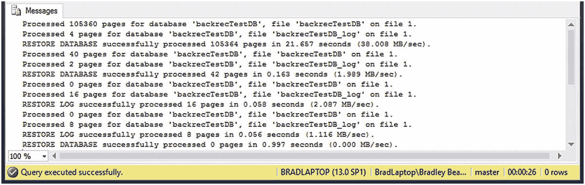

*图 7-14：脚本结果*

我们可以看到，完整备份、差异备份和事务日志备份已成功还原。运行此脚本之前的记录数是 30,040,000，运行脚本后的记录数是 20,030,000。

那么，我们做到了！我们已成功使用 `SQL Server Management Studio` 和 `Transact-SQL` 还原了事务日志。

#### 总结

在本章中，我们学习了 `SQL Server` 中还原过程的各个部分如何协同工作，为恢复数据创建一个可行的解决方案。我们研究了在 `SQL Server Management Studio` 中完成此任务所需的界面的不同部分。

用于事务日志还原的最终脚本作为 `TransactionLogRestore.sql` 在本书的下载中提供。

在下一章中，我们将把第 5 章到第 8 章学到的所有还原原理整合到一个巨大的还原脚本中。

