# 8. 还原方案示例

本章中，我们将把第 5 章到第 7 章学到的内容整合成一个连贯的结构，用于创建一个典型的还原场景。请注意，在之前的章节中我们并未涉及数据还原的所有概念；这将在本章中弥补，因为我将更侧重于介绍 SSMS 中各种屏幕上显示以及通过使用 `sqlcmd` 可用的各种条件和选项。因此，本章将是对 SQL Server 中数据还原的各个角度的一次全面审视，从基本的完整还原到事务日志还原的精确时间点。

建立还原场景时，要牢记的最重要的事情之一是，在将其投入生产环境之前，你需要**练习实施**。你应该有关于如何执行还原的分步说明，并且这些说明应足够简单，以便非 DBA 人员也能坐在服务器控制台前成功执行还原场景。我知道这看起来像是一项艰巨的任务，但本章末尾我将帮助你编写此流程。

执行还原场景必须做的第一件事是定义还原标准。我们需要列出一系列需要还原的情况，然后为每种情况定义最适合的还原类型。直接说还原到事务日志的最新点很容易，因为对于我们 DBA 来说，大约 99% 的情况可能都是如此。但有些情况下这并不是最佳方法，而这正是我们需要为之准备的。

让我们定义几种情况，然后是每种情况所需的适当还原类型。在这些场景中，我们希望：

-   将生产数据库转移到开发环境进行测试
-   从前一天晚上的未知时间点发生的灾难性错误中恢复
-   恢复 15 分钟前被覆盖的数据
-   在常规备份计划之外进行一次备份，作为“已知良好的起点”

正如你所见，对于至少一半的情况，我们只需从事务日志的最后一次备份进行还原即可完成。这就是数据还原的优势（除了实际恢复数据之外）；在大多数情况下，数据还原确实不需要太多预先规划。你知道数据存在于备份中，所以还原备份就行了。非常直接，从那里开始，我们可以根据需要保持简单或使其变得复杂。

在开始构建完整的还原场景之前，让我们先回顾一些在前几章中不太适合讨论、但在讨论数据还原时绝对值得一席之地的主题。并非所有的还原都是通过对象资源管理器中的数据库选项完成的（即右键单击数据库名称，悬停在“任务”上，然后选择“还原”，再选择“数据库”选项）。此菜单中还有两个我们尚未讨论的选项，即“文件和文件组”以及“页面”。这意味着我们不仅可以从数据库还原，还可以还原单个文件和文件组，或者细化到页面级别。

#### 页面还原

对于页面还原，要记住的重要一点是，`msdb` 数据库中的 `suspect_pages` 表是可能的损坏信息所在的位置。该表的结构如表 8-1 所示。

表 8-1 `msdb..suspect_pages` 结构

| 列名 | 描述 |
| --- | --- |
| `database_id` | 发生损坏的数据库的 ID。 |
| `file_id` | 损坏数据库中文件的 ID。 |
| `page_id` | 疑似损坏的页面的 ID。 |
| `event_type` | 表示错误类型的数字。可能的值如下：这是一个错误值的“全能”类型。这意味着发生了 823 错误（由于硬件故障）或 824 错误（其他数据库损坏）。校验和不正确。页面已损坏（torn page）。已还原的页面（被标记为可疑之后）。已由 DBCC 修复（被标记为可疑之后）。已由 DBCC 释放（被标记为可疑之后）。 |
| `error_count` | 错误发生的次数。 |
| `last_update_date` | 条目的日期和时间。 |

在想要执行页面还原时，有几件事需要牢记。例如，你只能还原数据库页面。这可能看起来很明显，但其含义是你不能还原事务日志或任何“特殊”页面：特别是分配页、全局分配映射页、共享全局分配映射页和页面可用空间页。微软在 [`https://docs.microsoft.com/en-us/sql/relational-databases/backup-restore/restore-pages-sql-server`](https://docs.microsoft.com/en-us/sql/relational-databases/backup-restore/restore-pages-sql-server) 上说“仅限数据库页面”时使用了非常精确的语言。

##### 查询 msdb..suspect_pages

`msdb..suspect_pages` 表是告诉你哪些页面被怀疑损坏的关键，希望这能引导你制定一个可靠的计划来还原那些损坏的页面。换句话说，可能还没有什么真正具有破坏性的事情发生，但未来可能会有。很多时候，可以通过常规的数据库恢复操作来修复数据库，这些操作默认会覆盖页面。在数据库被还原的情况下，重要的是要认识到，如果损坏的页面已经被备份到正在还原的备份集中，那么损坏的数据将一直存在，直到被修复。

打开一个新的查询窗口，输入 `SELECT * FROM msdb..suspect_pages;` 并按键盘上的 F5。当我运行此查询时，返回了零个结果，这是件好事。如果我得到了任何结果，我会立即采取表 8-2 中所示的行动。

表 8-2 页面还原操作

| 步骤 | 描述 |
| --- | --- |
| 1 | 从 `msdb..suspect_pages` 查询输出中获取损坏页面的 `page_id`。 |
| 2 | 使用包含相应损坏页面的完整备份、文件备份或文件组备份开始页面还原。如果从 T-SQL 而非 SSMS 运行，请使用以下语法：`RESTORE DATABASE <database_id> PAGE = '<file_id: page_id>' FROM <backup device or file> WITH NORECOVERY` 请注意，`database_id`、`file_id` 和 `page_id` 值均来自先前运行的 `msdb..suspect_pages` 查询。 |
| 3 | 还原最新的差异备份。 |
| 4 | 还原相关的事务日志备份。 |
| 5 | 备份事务日志的尾部。 |
| 6 | 还原步骤 5 中的事务日志。 |

按照这些步骤操作，你就可以在 T-SQL 中安全地还原页面了。


#### 使用 T-SQL 完成数据库完整恢复

回想一下，由于我们是在完整恢复模型下工作，因此拥有更多用于备份和恢复数据的功能可供使用。特别是，我们能根据当前情况，对需要恢复的数据量进行精细控制。完整恢复模型允许我们在需要时恢复整个数据库，更重要的是，正如我们在第 5 章所见，它可以恢复到特定时间点。

在完整恢复模型下恢复数据库时，需要遵循一组基本操作步骤。通用步骤如清单 8-1 所示。

##### 清单 8-1. 数据库恢复操作步骤

*   切换到 master 数据库。
*   使用 `BACKUP LOG backrecTestDB TO DISK = 'E:\SQL Server\Logs\backrecTestDB_TLOG_TAIL.bak' WITH NORECOVERY;` 创建尾日志备份。
    *   SSMS 响应：`为数据库 'backrecTestDB' 的文件 'backrecTestDB_log' 处理了 18 页。BACKUP LOG 成功处理了 18 页，耗时 0.069 秒（1.981 MB/秒）。`
*   使用 `RESTORE DATABASE backrecTestDB FROM DISK = 'E:\SQL Server\Backup\backrecTestDB_FULL.BAK' WITH NORECOVERY;` 恢复最新的完整备份。
    *   SSMS 响应：`为数据库 'backrecTestDB' 的文件 'backrecTestDB' 处理了 107968 页。为数据库 'backrecTestDB' 的文件 'backrecTestDB_log' 处理了 2 页。RESTORE DATABASE 成功处理了 107970 页，耗时 21.669 秒（38.927 MB/秒）。`
*   使用 `RESTORE DATABASE backrecTestDB FROM DISK = 'E:\SQL Server\Backup\backrecTestDB_DIFF.BAK' WITH NORECOVERY;` 恢复最新的差异备份。
    *   SSMS 响应：`为数据库 'backrecTestDB' 的文件 'backrecTestDB' 处理了 136 页。为数据库 'backrecTestDB' 的文件 'backrecTestDB_log' 处理了 2 页。RESTORE DATABASE 成功处理了 138 页，耗时 0.283 秒（3.795 MB/秒）。`
*   使用 `RESTORE LOG backrecTestDB FROM DISK = 'E:\SQL Server\Logs\backrecTestDB_backup_2017_10_16_190004_6842741.trn' WITH NORECOVERY;` 恢复自最新差异备份以来最早的事务日志备份。
    *   SSMS 响应：`为数据库 'backrecTestDB' 的文件 'backrecTestDB' 处理了 0 页。为数据库 'backrecTestDB' 的文件 'backrecTestDB_log' 处理了 16 页。RESTORE LOG 成功处理了 16 页，耗时 0.059 秒（2.118 MB/秒）。`
*   继续恢复事务日志备份，直至恢复到故障发生点。
    *   SSMS 响应：`为数据库 'backrecTestDB' 的文件 'backrecTestDB' 处理了 0 页。为数据库 'backrecTestDB' 的文件 'backrecTestDB_log' 处理了 8 页。RESTORE LOG 成功处理了 8 页，耗时 0.047 秒（1.329 MB/秒）。`
*   使用 `RESTORE DATABASE backrecTestDB WITH RECOVERY;` 恢复数据库。
    *   SSMS 响应：`RESTORE DATABASE 成功处理了 0 页，耗时 0.873 秒（0.000 MB/秒）。`

请注意，我在这些命令的 `DISK` 属性中使用了虚构的名称。这样做是为了让您更容易理解我在一组备份中要查找的是哪个备份。

如果您注意清单 8-1 中的 SSMS 响应要点，在事务日志恢复部分，我在恢复差异备份之后恢复了第一个日志，然后恢复了之后的下一个日志，此时我收到了处理了 `0` 页的消息，这意味着我已经到达了适用事务日志的末尾。在此日志恢复后，可能还有更多需要恢复的日志，但在本例中，这就是需要恢复的数据的终点。在实际场景中，您可能需要在一天中的特定时间恢复数据，因此请记住，您可能需要恢复比本示例所示更多的日志。只需为您需要的事务日志恢复重写脚本即可。

考虑到这些操作步骤，可以组合出一个良好的恢复脚本，如清单 8-2 所示。

##### 清单 8-2. 恢复脚本

```sql
-- 切换到 master 数据库
USE master
GO
-- 备份日志尾部
BACKUP LOG backrecTestDB
TO DISK = 'E:\SQL Server\Logs\backrecTestDB_TLOG_TAIL.bak'
WITH NORECOVERY;
GO
-- 恢复完整备份
RESTORE DATABASE backrecTestDB FROM DISK = 'E:\SQL Server\Backup\backrecTestDB_backup_2017_10_16_000002_2492163.bak'
WITH NORECOVERY;
GO
-- 恢复差异备份
RESTORE DATABASE backrecTestDB FROM DISK = 'E:\SQL Server\Backup\backrecTestDB_backup_2017_10_16_180001_7394135.bak'
WITH NORECOVERY;
GO
-- 恢复事务日志备份
RESTORE LOG backrecTestDB FROM DISK = 'E:\SQL Server\Logs\backrecTestDB_backup_2017_10_16_190004_6842741.trn'
WITH NORECOVERY;
GO
RESTORE LOG backrecTestDB FROM DISK = 'E:\SQL Server\Logs\backrecTestDB_backup_2017_10_16_200001_9609626.trn'
WITH NORECOVERY;
GO
RESTORE DATABASE backrecTestDB WITH RECOVERY;
GO
```

运行清单 8-2 所示的脚本后，您始终可以运行清单 8-3 所示的脚本来验证您的数据库是否已重新联机。

##### 清单 8-3. 数据库状态验证

```sql
SELECT databasepropertyex ('backrecTestDB', 'Status');
```

这应该在 SSMS 的结果窗格中仅返回值 `ONLINE`。一旦看到这个，您就可以放心，所有内容都已成功恢复，并且您的数据库正在平稳运行。


#### 使用 SSMS 完成数据库完整恢复

使用 SSMS 恢复数据库的过程与使用 T-SQL 完全相同；只是我们不再编写代码来执行操作，而是让图形界面为我们完成工作。

图 8-1 展示了在我们进行任何操作之前，对象资源管理器窗格中我的表的样子。

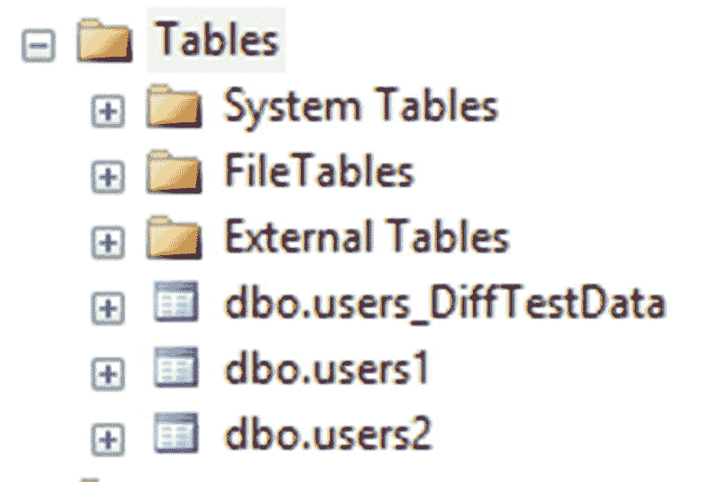

图 8-1. 当前表

我们想要做的是创造一个需要恢复整个数据库的场景，然后按顺序从完整备份、差异备份到事务日志备份，逐步完成恢复过程。一个有趣的方法是直接删除一两个表。这几乎是一个执行恢复操作的绝佳理由，对吧？当你准备好后，首先确认你有一组当前可用的、确实可以从中恢复的数据库备份。接着，右键单击一两个表并选择“删除”。该窗口如图 8-2 所示。

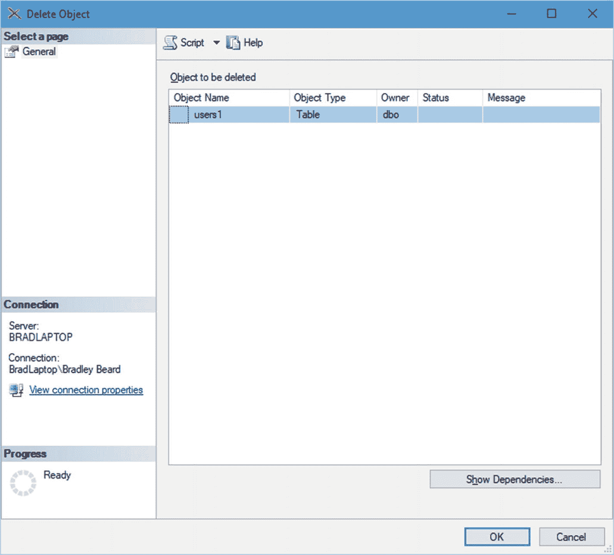

图 8-2. 删除对象窗口

这个窗口只有一个名为“常规”的选项卡。在中间窗格中，我们可以看到我选择了要删除的 `users1` 表。准备好后，只需单击“确定”，表就会被删除。

请注意我的对象资源管理器窗口不再显示 `users1` 表，并且我也无法再查询该表。图 8-3 展示了我更新后的对象资源管理器。

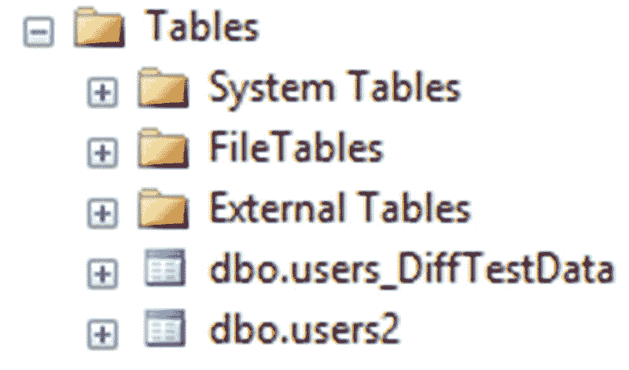

图 8-3. 更新后的对象资源管理器

##### 恢复序列

我们将使用与使用 T-SQL 恢复时相同的事件序列。该序列如清单 8-1 所示，其简化版本在清单 8-4 中重复。

```
清单 8-4. 恢复序列
*   切换到 master 数据库
*   创建尾日志备份
*   恢复最新的完整备份
*   恢复最新的差异备份
*   恢复来自最新差异备份的最旧事务日志备份
*   继续恢复事务日志备份，直到你恢复到故障发生点
*   恢复数据库
```

请注意，我已省略了具体的 SQL 语句，因为在 SSMS 中我们不需要它们。

##### 连接到 master 数据库

我们需要连接到 `master` 数据库以继续。我们可以打开一个新的查询窗口，然后从“可用数据库”菜单中选择 `master`（或按 Ctrl+U 以及上下箭头键），或者我们也可以在登录时确认我们正在连接到 `master` 数据库。如果你在登录时没有连接到 `master`，你可能应该考虑更改。你可以在如图 8-4 所示的“连接到服务器”对话框中更改你的默认数据库。

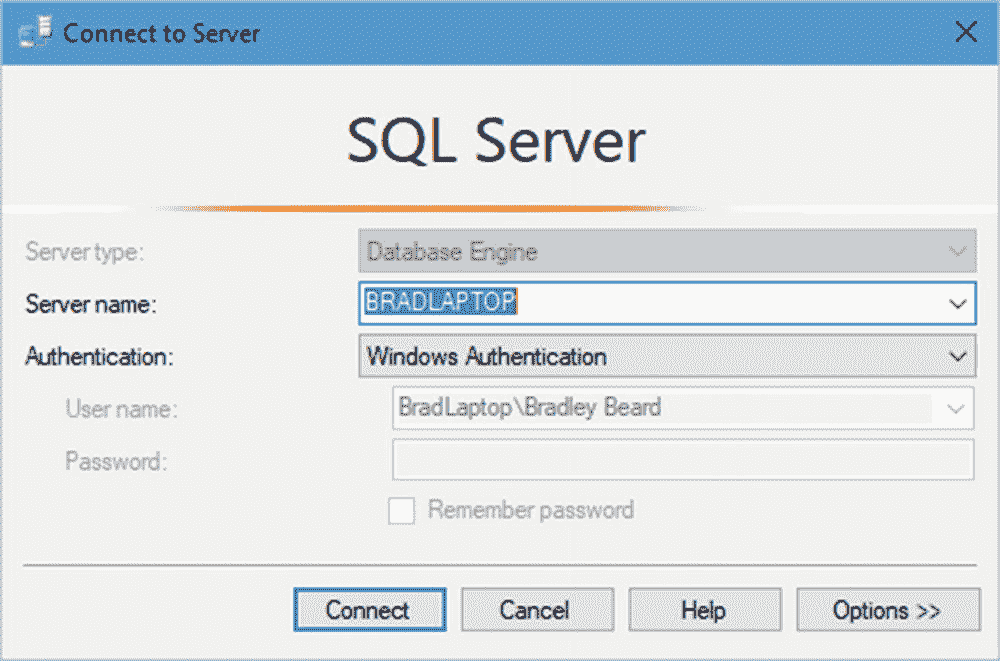

图 8-4. 连接到服务器

单击“选项 >>”按钮，你将看到一个扩展的界面，如图 8-5 所示。

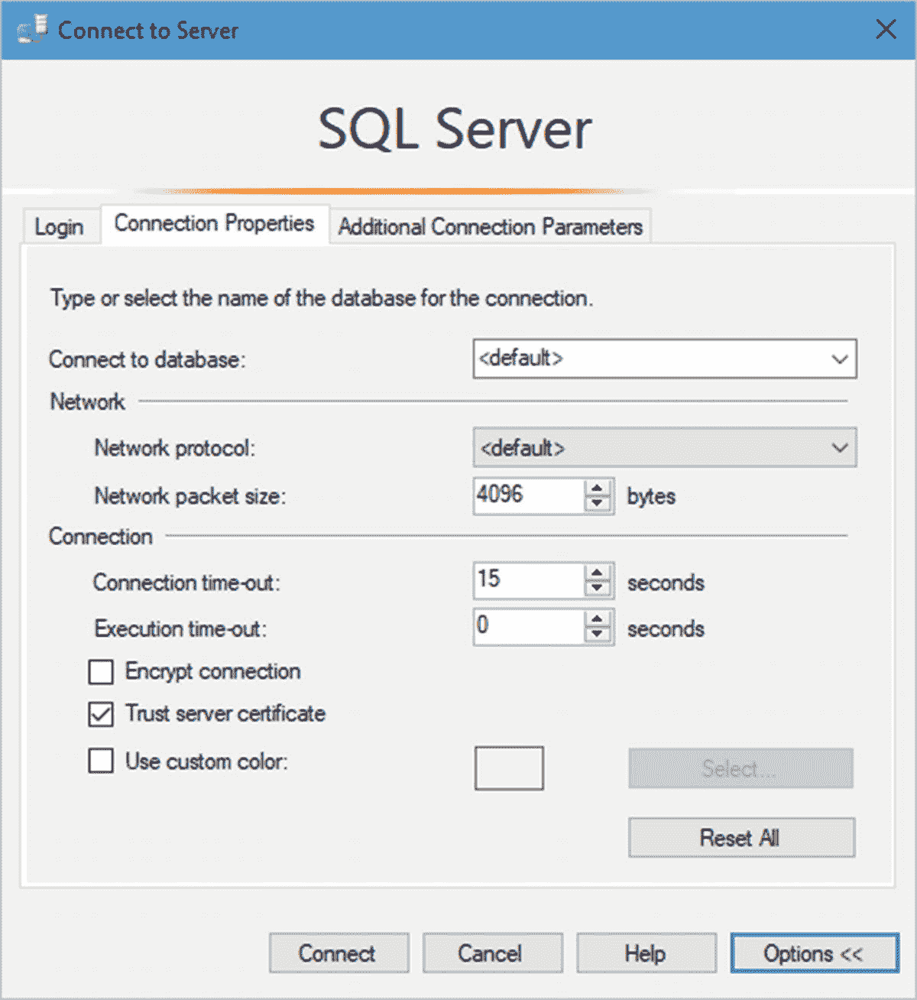

图 8-5. 扩展的连接到服务器界面

下拉“连接到数据库”旁边的下拉菜单，然后选择“浏览服务器”。会弹出一条简短的消息请求连接到服务器，所以当你看到此消息时，单击“是”按钮。然后会显示“浏览服务器数据库”窗口，如图 8-6 所示。

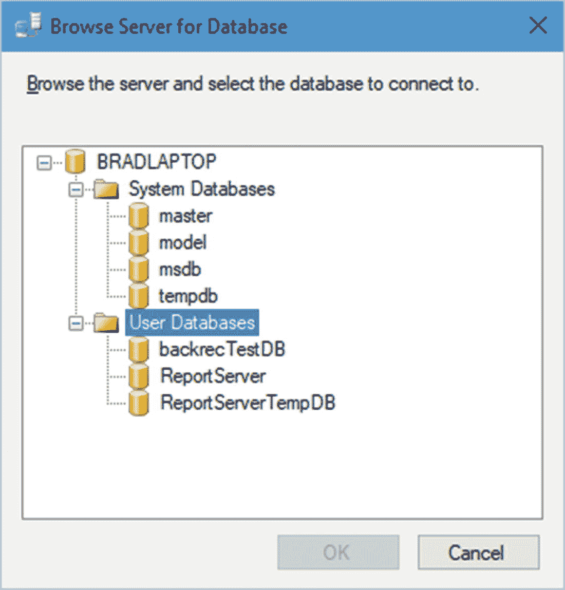

图 8-6. 浏览服务器数据库

我们在这里需要做的只是选择 `master` 并单击“确定”，然后在“连接到服务器”窗口中，`master` 将显示出来以替代“默认值”。图 8-7 显示了我在选择 `master` 后的更新界面。

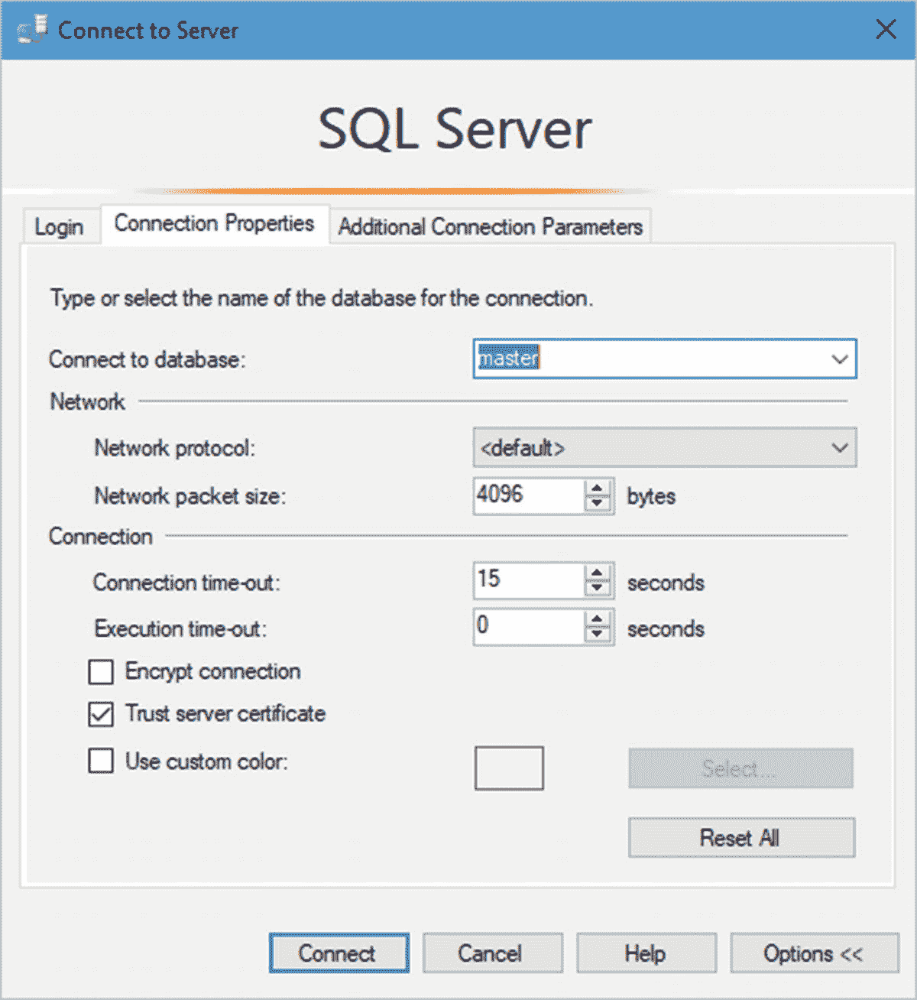

图 8-7. 更新后的连接到服务器界面

我已将此选项卡和其他选项卡中的其余值保留为其默认值。一旦我按下“连接”，我默认就连接到了 `master` 数据库。


下一步是备份事务日志。操作方法是右键单击数据库名称，将鼠标悬停在 `Tasks`（任务）上，然后选择 `Back Up`（备份）。此菜单位置如图 8-8 所示。

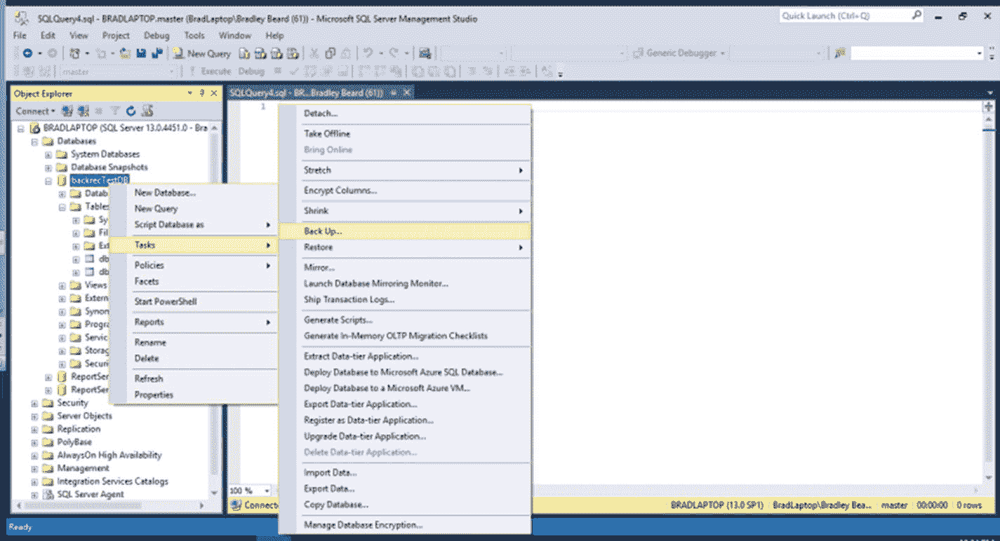

图 8-8：`Back Up`（备份）位置。

这将打开 `Back Up Database`（备份数据库）屏幕，如图 8-9 所示。如果我想执行完整备份（如备份类型选项 `full` 所示），那么这个默认屏幕将是理想的选择，但我目前不想这样做。

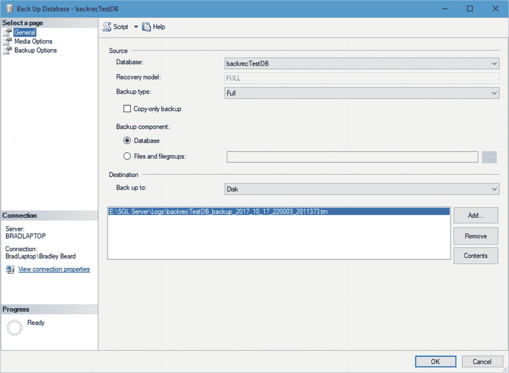

图 8-9：`Back Up Database`（备份数据库）。

由于我不想运行完整备份，我需要下拉该菜单并选择 `transaction log`（事务日志）代替。做出此更改后，你将看到如图 8-10 所示的内容。

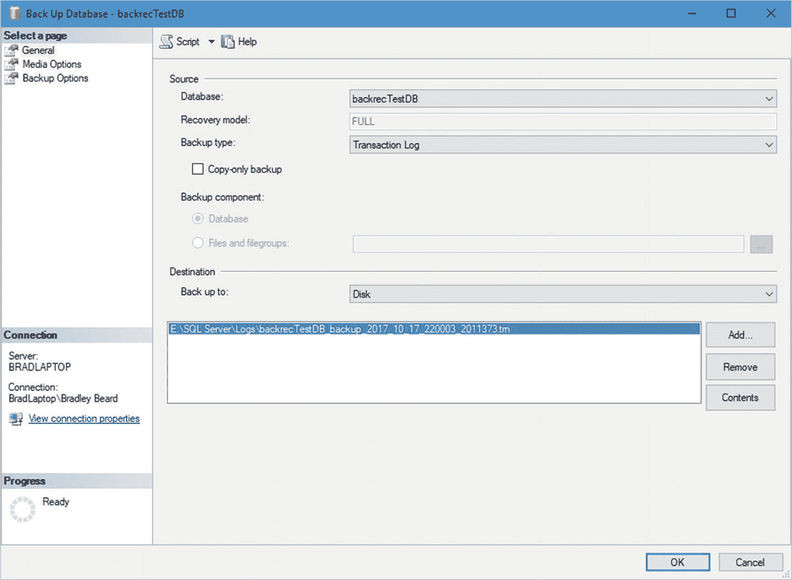

图 8-10：已选择 `Transaction Log`（事务日志）。

这为我们备份事务日志做好了准备，但我们还没有完成。如果我们此时按下 `OK`（确定），我们将使用其他选项卡上的默认值，而我们还没有查看那些选项。

单击左侧的 `Media Options`（介质选项）标签以显示 `Media Options`（介质选项）屏幕。图 8-11 显示了此屏幕的默认值。

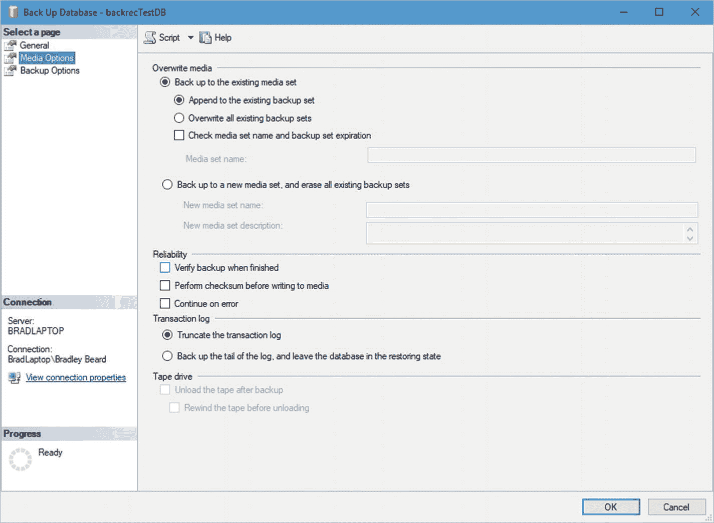

图 8-11：`Back Up Database`（备份数据库），`Media Options`（介质选项）选项卡。

请注意，在 `transaction log`（事务日志）部分中，`Truncate the transaction log`（截断事务日志）单选按钮已被选中。这意味着默认选项只是截断事务日志，并留下该不规则边缘作为事务日志的新尾部。我们希望保持此选项不变。这是因为我们希望保持数据库联机，而不处于 `restoring`（还原）状态。选择指定的选项并按 `OK`（确定）继续。我们不需要担心 `Backup Options`（备份选项）选项卡中的默认值，因为那些默认值正是我们需要的。

应该会迅速出现一条成功消息，告知我们备份已成功完成。看到此消息时单击 `OK`（确定），`Back Up Database`（备份数据库）屏幕将会关闭。

现在，如预期所示，我们的数据库如图 8-12 所示已恢复联机。

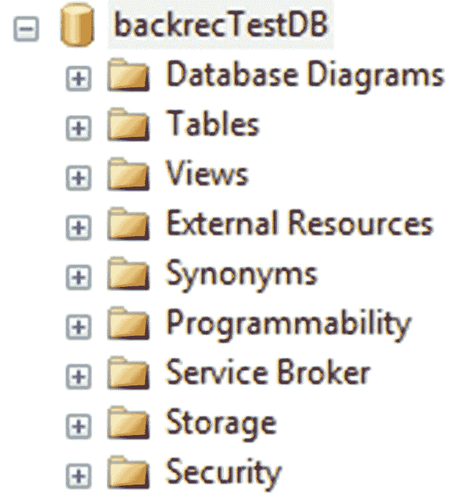

图 8-12：数据库已联机。

一旦我们到达这里，我们就可以进行操作的下一步并开始数据还原。

##### 还原数据库

要开始完整数据库还原，我们开始时的步骤与之前类似，只是菜单位置略有不同，如图 8-13 所示。

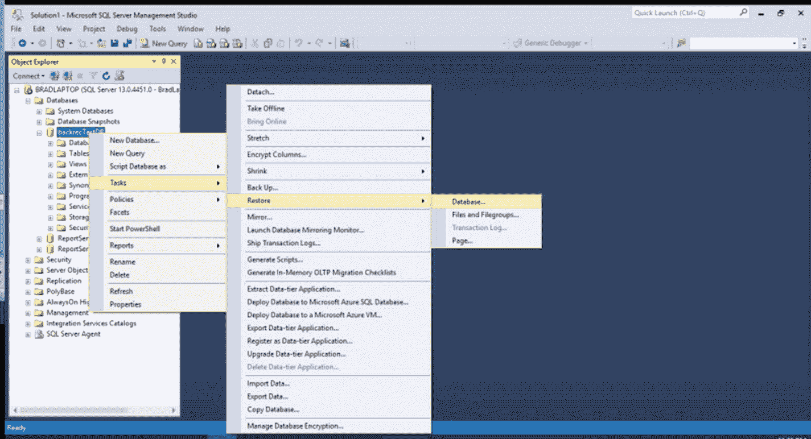

图 8-13：数据库菜单位置。

我们将右键单击我们的数据库，将鼠标悬停在 `Tasks`（任务）上，然后是 `Restore`（还原），最后选择 `Database`（数据库）。

默认屏幕如图 8-14 所示。请注意，此屏幕将根据所选数据库的最新备份自动填充 `Restore Plan`（还原计划）。

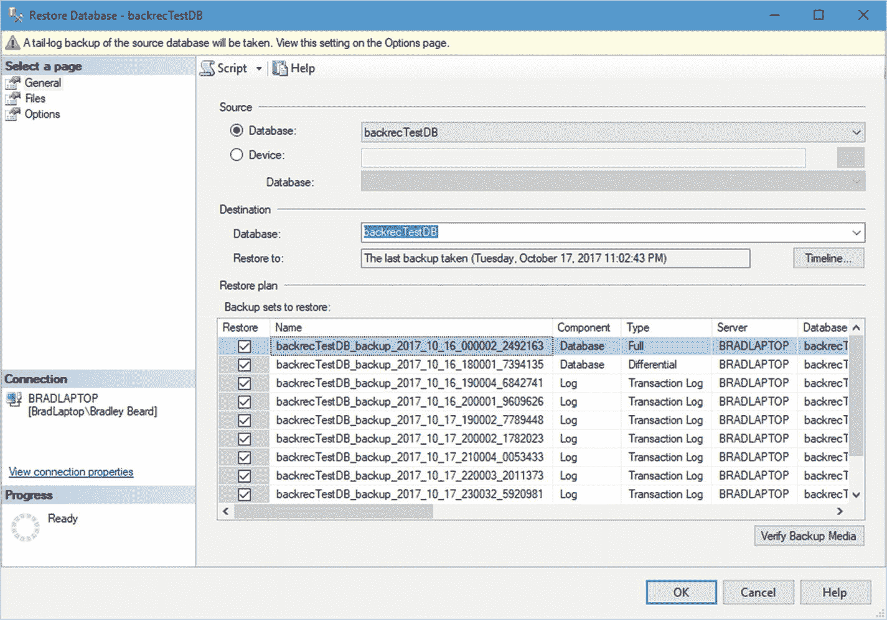

图 8-14：`Restore Database`（还原数据库）。

你可以自由选择 `Database`（数据库）下拉菜单中的任何选项，并观察 `backup sets`（备份集）值如何随每个选择而变化。

**注意：** 请注意 `Name`（名称）字段如何默认显示完整备份，然后是差异备份，接着是自上次差异备份以来的事务日志备份。

我们希望默认选择此区域中的选项，因为我们希望按界面中显示的顺序还原完整备份、差异备份和事务日志备份。我们希望确保既回滚事务日志，又在 `Timeline`（时间线）区域选择一个时间点，或者忽略整个事务日志。我将还原到上一个事务日志，因为我知道数据驻留在该备份中。

`Files`（文件）选项卡中的值默认是合适的，因为我们不想重命名任何文件。换句话说，它们将按默认位置存放。

在 `Options`（选项）选项卡上，我们要确保 `tail-log backup`（尾日志备份）部分两个选项都被选中（默认如此），当我们准备好时，按下 `OK`（确定）按钮。大约一分钟后，你应该会收到显示数据库已成功还原的消息。单击此处的 `OK`（确定）完成此操作，然后按 `F5` 刷新 `SSMS` 界面。

信任但要验证，对吧？继续展开我们数据库下的 `Tables`（表），你应该看到如图 8-15 所示的内容。

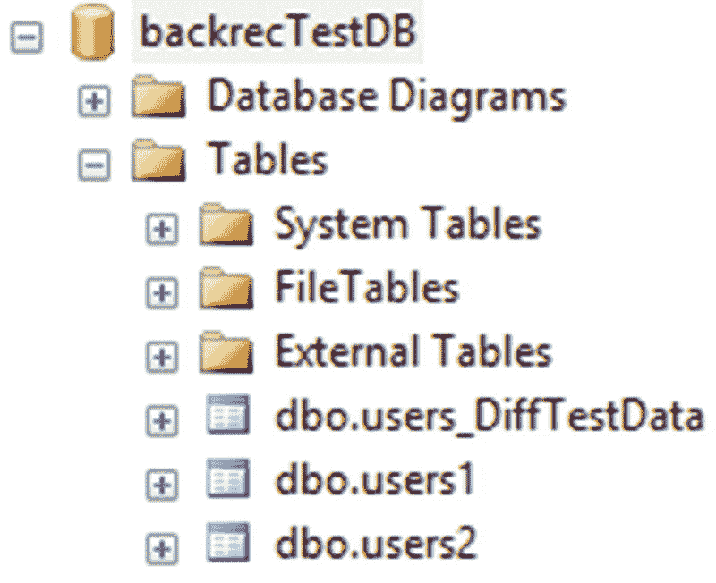

图 8-15：`users1` 表回来了！

所以，你看到了：使用 `SSMS` 完成的数据库完整还原。

#### 数据库快照

快速还原整个数据库的一个好方法是使用数据库快照。这是数据库在特定时间点的真实快照，并且与该时间点的实际数据库一致。这意味着快照充当了一种复制的数据库，因为当源数据库更新时，快照也会更新。从拍摄快照的那一刻起，每个后续事务都会在快照和源数据库中捕获。你还可以为同一数据库创建多个快照，这是一个特别好的做法。如果管理得当，这可以成为管理数据恢复的好方法。例如，如果快照存在很长时间且未被删除，它将继续增长，直到消耗掉它所在的磁盘空间。这显然不理想，因此必须维护快照。

让我在这里停一下，提请注意：数据库快照绝不能用于替代备份和还原场景。如果我们不应该将它们用于备份或恢复，那么它们的目的是什么？使用数据库快照的主要目的是为了让 `DBA` 能够快速拍摄其数据库的快照，对数据库执行可能搞砸的操作，然后测试以确保数据库更改实际有效。如果无效，那么 `DBA` 只需还原快照，他们就回到了几分钟前的状态。执行此操作的时间通常比计划还原操作、执行所有还原步骤以及确定要恢复哪些事务日志要少得多。只需还原快照，工作就完成了。

数据库快照的另一个好用途是用于报告。使用我们的命名约定，我们可以创建一个基于一天中不同时间拍摄的快照数据的标准报告。这可以用于诸如跟踪销售量或监控数据库中随时间记录的各种美元交易等目的。报告服务将获得一个滚动的 24 小时数据窗口，并将此数据量化为管理层易于阅读的仪表盘是数据库快照的一个绝佳用途。`SQL Server` 中的报告主题略微超出了本书的范围，因此我建议阅读 Kathi Kellenberger 的 *Beginning SQL Server Reporting Services*，可在 [`www.apress.com/us/book/9781484219898`](http://www.apress.com/us/book/9781484219898) 获取。对于那些正涉足 `SQL Server` 报告服务世界但不太知道从何开始的 `DBA` 来说，这是一本绝对的必备书。

##### 数据库快照如何工作？

数据库快照的概念对不熟悉的用户来说可能有些令人生畏。我听过最好的解释是，它们在理论上最接近静态完整数据库备份。创建时存在的整个数据库作为只读副本驻留在此快照中，并且该快照保持为源数据库的只读副本，直到快照被删除为止。


##### 创建数据库快照

假设您有一个 SQL Server Agent 作业，它将每小时创建一个数据库快照，并且在创建一定数量的快照后，最旧的快照将被删除。这可能是最常见的用例，因为它限制了存储在快照中的数据量，同时仍然提供可靠的快照结构。

创建数据库快照的语法您应该很熟悉，因为它本质上是一个 `CREATE DATABASE` 语句，如清单 8-5 所示。

```sql
CREATE DATABASE backrecTestDB_snapshot_12AM ON (
NAME = backrecTestDB,
FILENAME = 'E:\SQL Server\Data\backrecTestDB_data_12AM')
AS SNAPSHOT OF backrecTestDB;
-- 清单 8-5
-- 创建数据库快照语法
```

语句 `CREATE DATABASE backrecTestDB_snapshot_12AM ON (` 表示我们要创建一个名为 `backrecTestDB_snapshot_12AM` 的新数据库快照。在 SSMS 中查看时，这也是快照的名称。`ON` 关键字的存在意味着它基于一个现有文件。在此情况下，`NAME =` 属性保存了您在“数据库属性”窗口中找到的数据库文件的逻辑名称，如图 8-16 所示。您可以通过右键单击数据库名称，选择“属性”，然后单击左侧的“文件”菜单选项来打开“文件”选项卡，找到此信息。

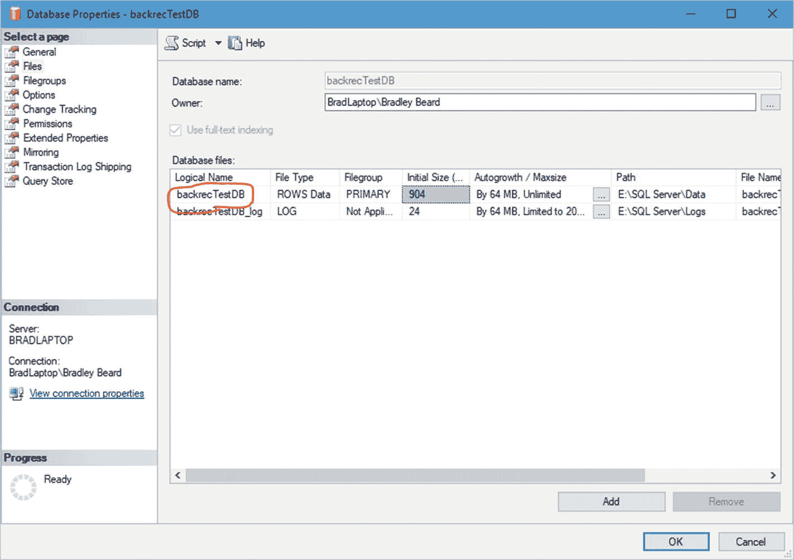

*图 8-16 逻辑名称位置*

`FILENAME = 'E:\SQL Server\Data\backrecTestDB_data_12AM'` 这行代码让我们声明要保存在文件系统中的文件名。最后，`) AS SNAPSHOT OF backrecTestDB;` 这行代码让我们明确定义我们要创建的是一个快照，而不是一个“常规”数据库。将清单 8-5 复制到“新建查询”窗口，并在将我的数据库名称更新为您自己的之后，按 F5 运行脚本。接下来，转到“对象资源管理器”，在工具栏中单击“刷新”按钮，并展开“数据库”下的“数据库快照”选项。如果清单 8-5 中的脚本运行正确，并且数据库快照已创建，您将看到图 8-17 所示的内容。


*图 8-17 数据库快照创建成功*

干得好！现在我们可以看到我们有一个快照，如果您展开 `backrecTestDB_snapshot_12AM` 选项，您将看到拍摄快照时 `backrecTestDB` 数据库的确切内容。

##### 查询数据库快照

查询数据库快照的方式与查询源数据库的方式相同。清单 8-6 展示了两种语法。

```sql
SELECT count(*) as cnt FROM [backrecTestDB_snapshot_12AM].dbo.users2
SELECT count(*) as cnt FROM [backrecTestDB].dbo.users2
-- 清单 8-6
-- 查询源数据库和快照
```

运行后，我们看到每个表都有 10,000 行。这是预料之中的，也是好的，因为它表明我们的数据到目前为止是一致的。我们现在想做的是从源数据库中删除一些数据，然后再次比较两个行数。我使用的查询在清单 8-7 中。

```sql
DELETE FROM [backrecTestDB].dbo.users2 WHERE fname = 'Bradley'
-- 清单 8-7
-- DELETE 代码片段
```

执行此代码将从 `backrecTestDB` 数据库的 `users2` 表中删除 1000 行。

如果我们执行清单 8-6 所示的代码，我们会看到快照中有 10,000 行，而源数据库中有 9000 行。

如果此时我们再拍摄一个快照，然后从 `users2` 表中删除另一组数据或进行任何其他任意更改，那么我们将拥有三个独立且不同的数据集，我们可以从中恢复。

使用此示例，您可以看到为什么我之前提到将快照用作报告源。将数据作为冻结的时间点利用，可以为报告开辟很多可能性。

##### 恢复数据库快照

现在我们看到有两个不同的数据库，包含两组不完全相同的数据，我们可以开始将快照恢复到源数据库之上的过程，基本上撤销自拍摄快照以来所做的任何操作。

为了恢复数据库快照，我们必须执行一个 `RESTORE DATABASE` 命令，类似于清单 8-8 所示。

```sql
RESTORE DATABASE backrecTestDB
FROM DATABASE_SNAPSHOT = 'backrecTestDB_snapshot_12AM'
-- 清单 8-8
-- RESTORE DATABASE 语法
```

在我们运行这个命令之前，让我们先了解一下此操作的几个注意事项。

*   只要没有到数据库实例的开放连接，代码就会运行。如果有开放连接，请运行以下代码关闭连接，然后再运行清单 8-8 中的代码：
    ```sql
    ALTER DATABASE backrecTestDB
    SET SINGLE_USER WITH
    ROLLBACK IMMEDIATE
    ```
*   我们必须知道我们恢复的数据版本是否正确。是的，这就是我们创建命名约定的原因，但只需花一分钟查询快照并确保所需数据肯定在那里。当然，除非您只有一个快照，并且您创建它就是为了恢复。
*   当您验证数据正确后，您必须删除源数据库的任何其他快照。除非只有一个快照，否则恢复操作将无法继续。
*   我们无法使用快照进行时间点恢复。您得到的就是数据库中的内容，仅此而已。因此，您必须确保要恢复的是正确的数据版本。

请继续执行清单 8-8 中的代码，然后立即执行清单 8-6 中的代码。看！我们成功地将 `users2` 表恢复回了 10000 行，因为我们成功恢复了数据库快照。

#### 查看备份和还原历史记录

是否曾想了解备份和还原操作背后发生的情况？翻阅数据库表格可能很单调，相信我。幸运的是，SQL Server 内置了相当多的报告，其中一个专门可以帮助您查看备份和还原事件的报告称为“备份和还原事件”；多么方便！此报告对于定位备份和还原操作期间可能发生的任何错误非常有用。

要运行此报告，请右键单击您的数据库名称（对我来说是 `backrecTestDB`），将鼠标悬停在“报表”上，然后将鼠标悬停在“标准报表”上，并选择“备份和还原事件”。图 8-18 显示了初始报告屏幕的样子。

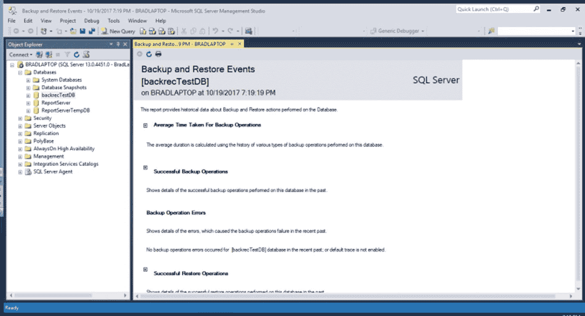

*图 8-18 备份和还原事件报告*

此报告中有四个主要标题。它们如下：

*   备份操作的平均耗时
    *   平均持续时间是使用在此数据库上执行的各种类型备份操作的历史记录计算的。
*   成功的备份操作
    *   显示过去在此数据库上执行的成功备份操作的详细信息。
*   备份操作错误
    *   显示过去导致备份操作失败的错误的详细信息。
*   成功的还原操作
    *   显示过去在此数据库上执行的成功还原操作的详细信息。

此报告非常易于浏览。您只需单击小加号即可展开表格。在内部，您将看到表格按最新记录在顶部进行排序。


#### 总结

本章我们终于完成了恢复操作，并学习了对备份和恢复操作至关重要的各种数据恢复选项。我们了解了如何恢复页面，以及 `msdb..suspect_pages` 表对于发现数据库中可疑页面损坏的价值。我们探讨了从数据库快照恢复及其涉及的所有内容。最后，我们学习了如何查看备份和恢复的历史记录。本章结束了关于备份与恢复操作中“恢复”方面的这一部分。在下一部分中，我们将开始把所有内容整合到一个独立的备份与恢复计划中。

## 第三部分
### 完整解决方案

## 9. 完整备份与恢复解决方案

在“现实世界”中，业务上绝对有需要能够随时提供可靠备份。数据损坏的可能性几乎是必然存在的，因此经验丰富的数据库管理员必须确保其数据库能够快速、正确地恢复。备份的可用性和可靠性至关重要，无论备份是存储在远程位置，还是存储在数据库服务器本地。在我们的备份和恢复实践中，我们经常需要处理服务级别协议，或称为 SLA。这类文档涉及广泛的细节，例如备份运行的频率、数据恢复的条件以及如何恢复数据。您可能在一个不涉及这些内容的地方工作，这也没问题。例如，如果您是作为网络托管套餐的一部分提供数据库存储即服务，那么您很可能会受到一份 SLA 的约束，该 SLA 描述了该系统的可用性细节。无论您作为数据库管理员的日常职责是否受到 SLA 的约束，有一件事是不变的，那就是您对数据库及其所承载数据的健康所负有的责任。在我迄今为止所写的每一本书中，我都试图传达一个信息，本书也不例外：作为数据库管理员，我们最大的责任莫过于保护我们的数据。

根据我的个人经验，我能想到的完全使用 T-SQL 编写完整备份场景的数据库管理员，总共只有一个。此人的理由是，SQL 可以从 SSMS 外部运行，因此在 SSMS 之外可用是理想的。虽然我部分同意这一点，但另一方面我认为，我们应该利用我们掌握的工具，包括（尤其是）那些可以用于自动化任务（如备份）的工具。对我来说，让 SSMS 完成大部分工作是有意义的，但仍然准备好 T-SQL 代码，以备不时之需，比如当我们需要备份或恢复数据库而 SSMS 因故不可用时，像我那位 DBA 朋友一样的代码爱好者可以使用。因此，本章我们将重点介绍如何在 SQL Server Management Studio 中创建一个用于完整备份的维护计划，然后编写相应的 T-SQL，以备需要时使用。需要理解的是，这并不是说 T-SQL 作为经验丰富的或初级的数据库管理员的主要脚本工具没有其用武之地；相反的说法是没有意义的，因为 T-SQL 是数据库管理员与数据库通信的基础语言。通过简单的谷歌搜索可以找到许多 T-SQL 解决方案，其中特别值得一提的是 Ola Hallengren 的备份脚本解决方案，位于 [`https://ola.hallengren.com/`](https://ola.hallengren.com/)。

到目前为止，我们一直专注于备份与恢复之间的区别，并通过不同的章节在我们的脑海中将它们区分开来。现在我们需要开始将这些不同的概念连接成一个连贯的整体，而我能想到的最好方法是创建两个独立的维护计划，一个用于备份，一个用于恢复，来管理计划的不同部分。拥有独立维护计划的明显含义是，每个备份部分将有不同的时间表。

本章，我们将学习如何为完整备份创建维护计划。显然，我们不希望将恢复序列作为备份场景的一部分。原因在于，那样做无非就是运行一个完整数据库备份，然后立即将该备份还原到我们刚刚备份的数据库之上。清单 9-1 展示了我们将在本章构建的内容。

**清单 9-1. 待办事项列表**
```
* 在 SSMS 中创建完整备份维护计划
    * 根据我们之前的计划，每 24 小时进行一次完整备份
    * 备份必须存储在与 SQL Server 安装位置不同的物理磁盘上
* 在 SSMS 中创建完整恢复维护计划
    * 不设置计划，但作为 SQL Server Integration Services (SSIS) 包在 SSMS 中可用
* 使用 T-SQL 创建完整备份维护计划
    * 不设置计划，可在必要时通过 `sqlcmd` 运行
* 使用 T-SQL 创建完整恢复维护计划
    * 不设置计划，可在必要时通过 `sqlcmd` 运行
```
这看起来是本章一个相当不错的开始。接下来的两章中，我们将为差异备份和事务日志备份构建本质上相同的内容。

#### SSMS 中的完整备份计划

一旦启动 `SSMS`，将焦点置于 `对象资源管理器`，我们需要展开 `管理`，然后展开 `维护计划`。如果我们有任何维护计划，它们将位于此区域。它们也会作为独立的作业出现在 `SQL Server 代理` 的 `作业` 菜单中，但我们将在创建维护计划后查看该区域。

右键单击 `维护计划` 并选择 `新建维护计划`。当您看到如图 9-1 所示的 `新建维护计划` 窗口时，为其命名为 `Backup Plan` 并按 `确定`。

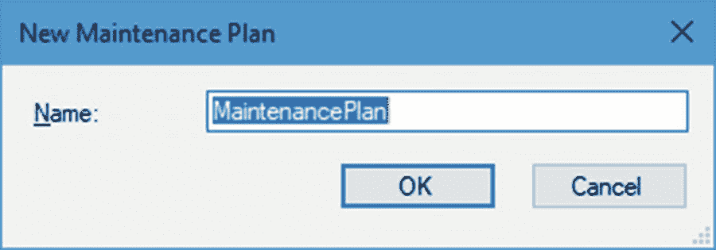
图 9-1. 新建维护计划窗口

一旦您为其命名，一个标题为 `备份计划 [设计]` 的窗口将在主工作区打开。图 9-2 显示了此窗口的默认值。

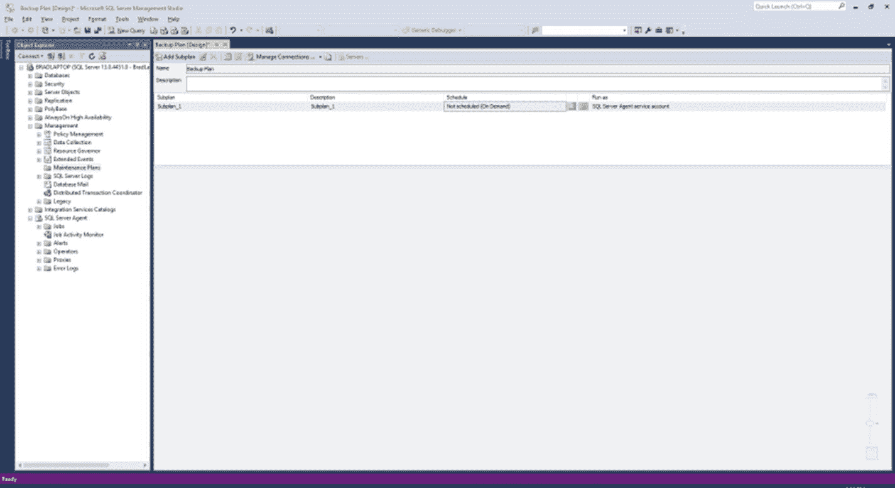
图 9-2. 备份计划 [设计] 窗口

接下来，我们需要通过点击位于 `对象资源管理器` 左侧、界面边缘的浮动 `工具箱` 菜单来打开我们的 `工具箱`。或者，您可以在 `SQL Server Management Studio` 屏幕内的任意位置按下 `Ctrl+Alt+X`，该菜单将作为覆盖层出现在左侧的 `对象资源管理器` 之上。要隐藏 `工具箱`，只需再次点击 `工具箱` 浮动菜单，它就会消失，仅显示 `对象资源管理器`。

工具箱中有相当多的项目，我在我的第一本书 *SQL Server 中的实用维护计划* ([`www.apress.com/us/book/9781484218945`](http://www.apress.com/us/book/9781484218945)) 中进行了详细探讨。从图 9-3 的粗略浏览中我们可以看到，我们需要的选项就在最上面；我们需要的是 `备份数据库任务`。

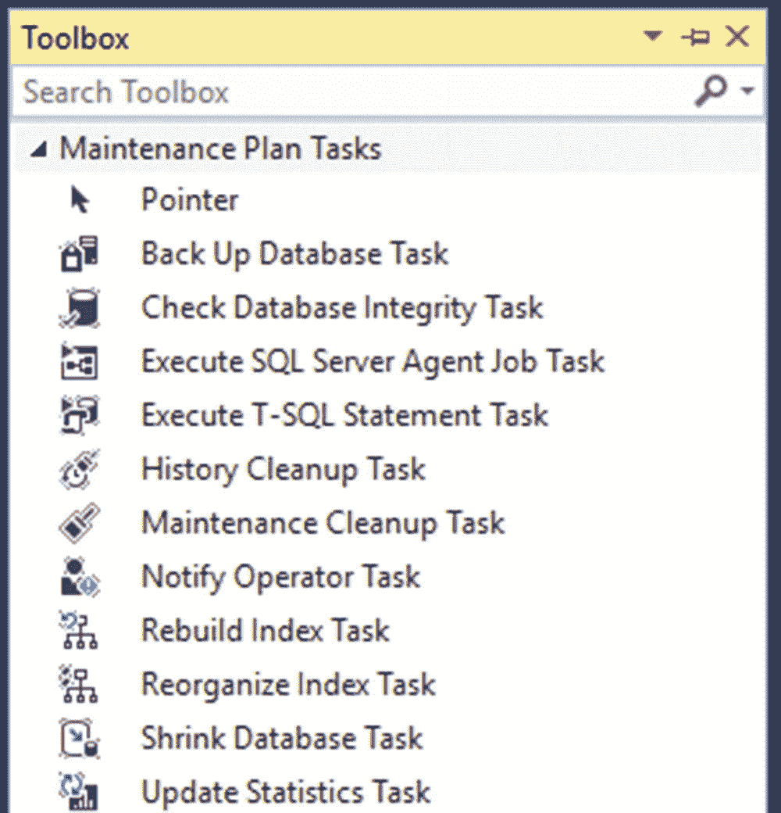
图 9-3. 工具箱

单击并将 `备份数据库任务` 从 `工具箱` 拖到主工作区的灰色区域。图 9-4 显示了该任务在工作区中应放置的大致位置，但放在工作区内的任何地方都可以。工作区充当维护计划各个部分的逻辑容器，它们的顺序完全无关紧要。唯一能将这些部分互连起来的是我们可以放在每个后续项目上的优先级约束，这样我们就可以将事件链接起来，使维护计划比单纯的预定任务块更具过程性。

将 `备份数据库任务` 拖到工作区后，您将看到它如图 9-4 所示出现。请注意，红色的 `X` 表示此项需要配置。

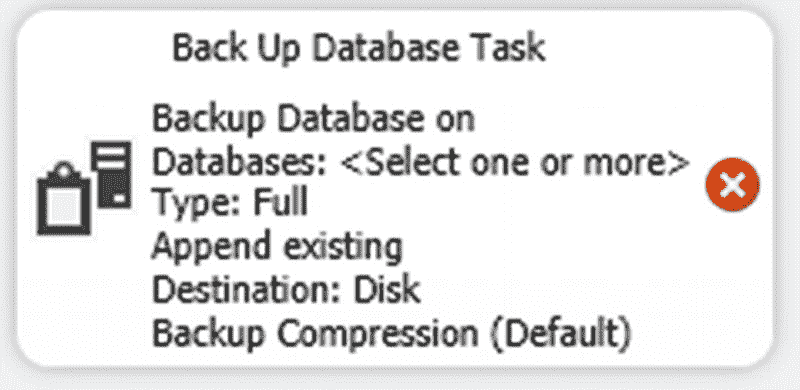
图 9-4. 备份数据库任务

如果您将鼠标悬停在红色的 `X` 上，您会看到消息“未指定连接管理器。”双击该任务，`备份数据库任务` 窗口将出现，如图 9-5 所示。

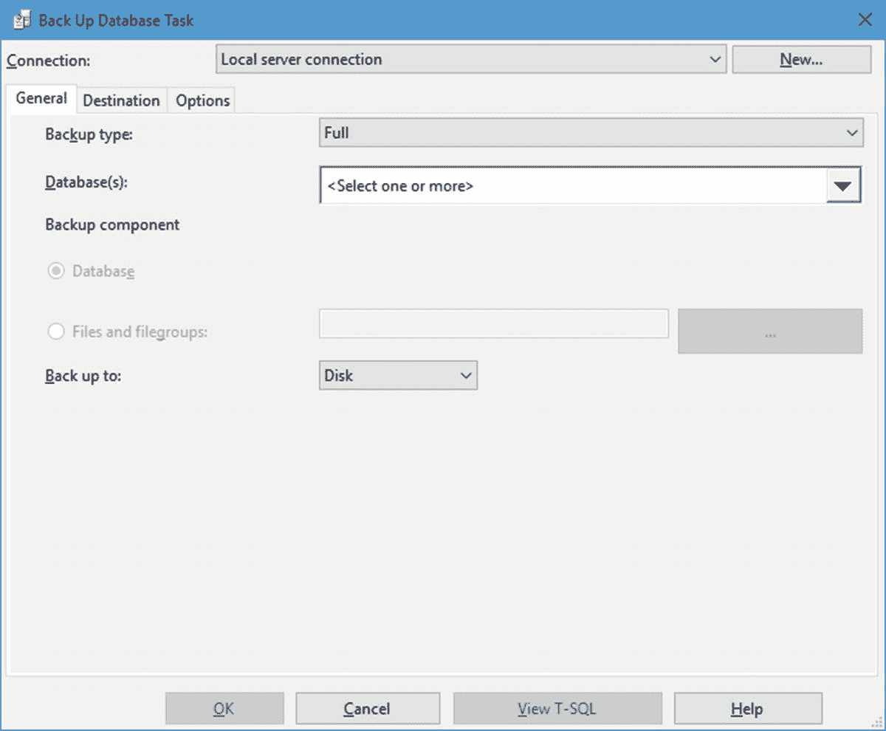
图 9-5. 备份数据库任务窗口

对于那些从之前版本的 `SQL Server` 熟悉此区域的人来说，您会注意到此界面在当前版本的 `SQL Server Management Studio` 中进行了轻微升级。一旦 `SQL Server Management Studio` 再次更新，它甚至可能会有所不同，因为 `SSMS` 现在是独立于 `SQL Server` 下载的，因此其更新周期独立于 Microsoft 发布的服务包。

##### 定义备份数据库任务选项

请注意，我们位于 `常规` 选项卡。这是我们指定清单 9-2 所示项目以准备此区域的地方。

**清单 9-2.** 待办事项列表

- `备份类型`
    - 我们必须从 `完整`、`差异` 或 `事务日志` 中选择。在本例中，我们将选择 `完整`。
- `数据库`
    - 我们必须至少选择一个数据库。请注意，如果从 `备份类型` 选项中选择 `事务日志`，则简单恢复模式数据库将被移除。在本例中，我们将选择我们一直在使用的数据库 `backrecTestDB`。
- `备份组件`
    - 我们可以从 `数据库` 或 `文件和文件组` 中选择。在本例中，我们将选择 `数据库`。如果我们的数据库有多个文件组，我们可以选择 `文件和文件组`，但我只设置了 `PRIMARY` 文件组。
    - **注意** 如果您的场景中有多个文件组，则可以设置多个完整备份任务，以便按您期望的顺序或计划备份每个文件组。
- `备份到`
    - 我们必须从 `磁带`、`磁盘` 或 `URL` 中选择。在本例中，请保持设置为 `磁盘`。

在 `常规` 选项卡上方，我们可以看到 `连接` 下拉菜单。此选项默认为“本地服务器连接”，在此过程中需要保持此设置。

一旦您按照清单 9-2 中的说明进行更改，您的窗口应类似于图 9-6 所示。

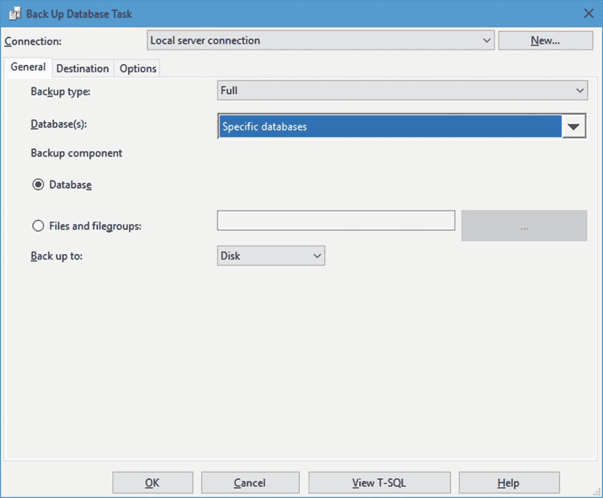
图 9-6. 备份数据库任务（已更新）

请注意，当选择了一个数据库时，`数据库` 区域会变为文本“特定数据库”。

当您准备好后，请选择 `目标` 选项卡以继续。图 9-7 显示了此选项卡的默认设置。

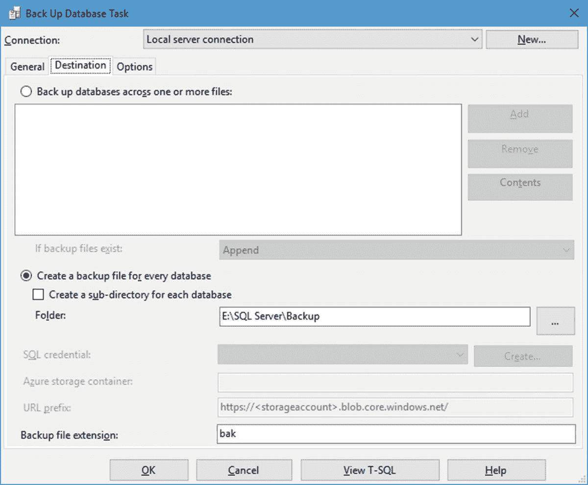
图 9-7. 备份数据库任务，目标选项卡

此选项卡比 `常规` 选项卡稍复杂。在这里，我们有清单 9-3 中详述的选项。

**清单 9-3.** 目标选项卡选项

- `在跨一个或多个文件备份数据库`
    - 此选项存在是为了让我们可以创建同一数据库的多个备份文件。我们可以在此区域添加任意多个不同的文件名，但请注意，条目过多会导致性能问题。
- `为每个数据库创建备份文件`
    - 这可能是最常见的选项，因为它让我们可以为每个选定的数据库创建单个备份文件。您还可以选择为每个数据库创建子目录，这也是一个非常方便的功能。`文件夹` 位置是数据库备份将放置的位置，除非勾选了 `子目录` 选项，在这种情况下，数据库名称将成为文件夹名称，备份将放置在该文件夹内。我们希望选择此选项，并同时勾选 `为每个数据库创建子目录` 复选框。保持 `文件夹` 值不变，因为备份的默认值是一个唯一的日期/时间字符串。

请注意，在清单 9-3 的选项下方还有另一个部分，其定义如清单 9-4 所示。这些选项仅在您选择了图 9-5 所示的 `常规` 选项卡中的 `URL` 选项时才可用。否则，它们默认是禁用的。

**清单 9-4.** Azure 选项


##### 目标配签设置

配置备份任务时，在 **目标** 选项卡上提供了几个关键选项。

*   **SQL 凭据**
    *   这是用于连接到 Azure 数据库的 `SQL 凭据` 账户。
*   **Azure 存储容器**
    *   `Azure 存储容器` 就像一块存储区域，你可以用于几乎任何你想做的事情。在这里，我们特指数据库备份，但它并不是直接备份到 Azure 实例；而是仅将文件备份到基于云的存储中。
*   **URL 前缀**
    *   `URL 前缀` 对每个账户是唯一的。当你注册 Azure 时，会从 Microsoft 获得一个存储账户名称，该存储账户名称将成为 URL 中的前缀。

在这些选项之后，最后一项是 **备份文件扩展名**，默认为 `bak`。你可以将其更改为任何你想要的扩展名，但我建议保持原样，接受默认值。图 9-8 显示了已更新的“目标”选项卡的值。

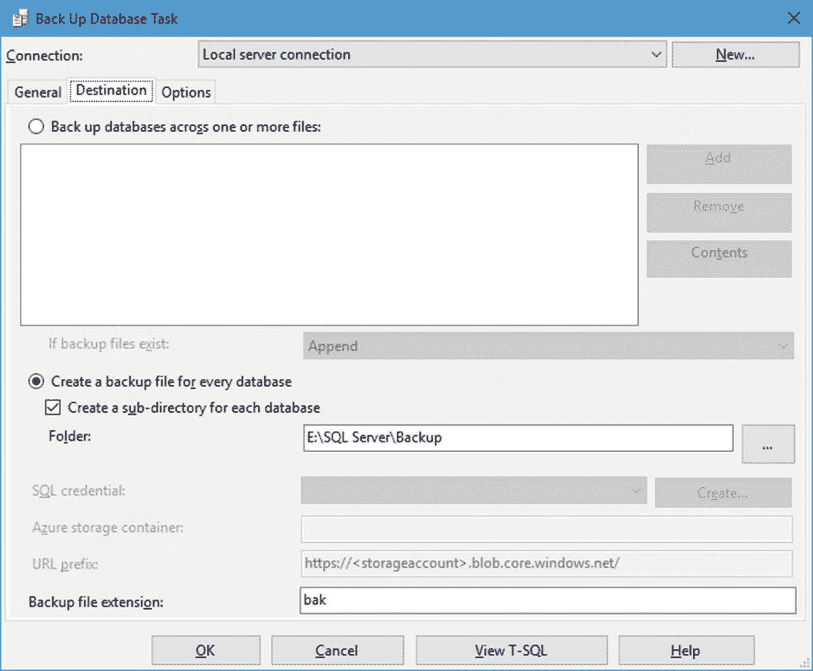

**图 9-8.** 备份数据库任务，目标选项卡，已更新

当你准备好继续时，单击 **选项** 选项卡，你将看到如图 9-9 所示的默认值。

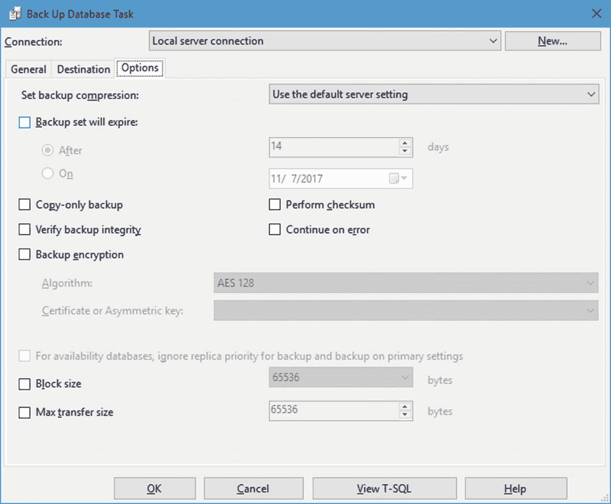

**图 9-9.** 备份数据库任务，选项选项卡

##### 选项选项卡

默认情况下，这些选项都是可以的。但是，让我们按照清单 9-5 逐步查看它们，以便我们理解正在查看的内容。

**清单 9-5.** 选项选项卡...选项？

*   **设置备份压缩**
    *   允许你为备份设置压缩类型。三个选项如下：
        *   `使用默认服务器设置`
        *   `压缩备份`
        *   `不压缩备份`
*   **备份集将过期**
    *   你可以选择在一定天数后或在特定日期使备份过期。
*   **仅复制备份**
    *   这种备份类型可以被视为一种非顺序备份。通常，备份是按特定顺序进行的，并且必须按其进行的顺序恢复；这就是为什么你必须按事务日志创建的顺序来还原它们。此选项允许你仅创建数据库的副本。
*   **执行校验和 (新)**
    *   校验和用于检测数据中的错误或不一致。在此上下文中，会对新生成的备份文件执行校验和，以确保其与预期生成的内容一致。
*   **验证备份完整性**
    *   此选项等同于在备份文件位置运行 `RESTORE VERIFYONLY` 命令。简单语法是 `RESTORE VERIFYONLY FROM DISK = <备份文件位置和名称>`。其目的是验证新生成的备份文件的完整性（这句话是多余的！）。
*   **发生错误时继续 (新)**
    *   简单来说，就是忽略任何错误并继续执行...除非发生致命错误，这会阻止程序执行。
*   **备份加密**
    *   在此区域，你可以选择用于解密的算法、证书或非对称密钥。请非常小心此区域，因为如果希望以后能还原生成的备份，必须使用相同的证书或非对称密钥。如果证书或密钥丢失，备份将无法成功还原。
*   **对于可用性数据库，忽略备份的副本优先级和在主副本上备份设置**
    *   在处理 `AlwaysOn` 和 `可用性组` 时，我总是会参考我的好朋友 Peter Carter 的优秀著作 *SQL Server AlwaysOn Revealed* ( [`www.apress.com/us/book/9781484217634`](http://www.apress.com/us/book/9781484217634) )。此选项允许我们告诉可用性数据库，使用数据库的主副本设置来备份数据库实例。
*   **块大小 (新)**
    *   此选项允许你以字节为单位指定物理块大小，而不是让 `SQL Server` 资源调控器使用默认选项处理备份。将此设置为较低的值会对备份操作产生不利影响，但会写入较小的数据块而不是大块。
*   **最大传输大小 (新)**
    *   此选项允许你指定 `SQL Server` 与备份介质之间使用的最大传输单元（以字节为单位）。


###### 理解 SQL Server 备份中的块大小与最大传输大小

块大小和最大传输大小这两个选项听起来非常相似，不是吗？它们的区别在于，`块大小` 选项允许你告诉 SQL Server：“我知道你通常取一定数量的字节，但我希望你取不同数量的字节并将它们放入备份位置。”而 `最大传输大小` 选项则允许你告诉 SQL Server：“当你将字节移动到备份位置时，我希望那个数据块是一个特定的大小。你可以在该传输大小中打包任意多的块，但一旦达到我设定的限制，你就需要再跑一趟。” 换句话说，可以将 `块大小` 想象成单个火车车厢，而 `最大传输大小` 则是整列火车。因此，`最大传输大小` 选项总是大于 `块大小` 选项。

例如，勾选 `块大小` 和 `最大传输大小` 复选框。然后在 `块大小` 下拉菜单中选择 `4096`。接下来，在 `最大传输大小` 区域输入一个数值；我选择了 `512`。最后，按 `Tab` 键移出 `最大传输大小` 区域。你看到数值变回 `65536` 了吗？接着，点击 `最大传输大小` 区域的向上箭头，它会变为 `131072`。再点击向下箭头两次，它将默认变回 `65536`，但不会变得更低。

在我们继续之前，请确保你取消勾选了 `块大小` 和 `最大传输大小` 复选框。保持它们被勾选可能不会造成太大麻烦，但我不想引入任何可能导致错误的东西。我在这里选择的选项是 `验证备份完整性` 和 `执行校验和`。图 9-10 显示了更新后的 `选项` 选项卡界面。

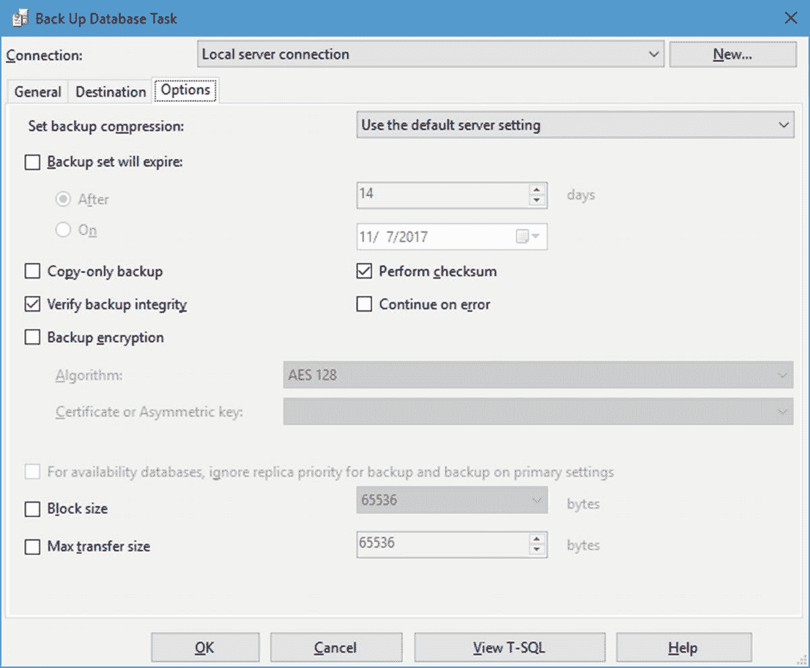

图 9-10. 备份数据库任务，选项选项卡，已更新

以上就是我进行完整备份选项时，在这个区域需要设置的所有选项。在我们继续之前，我想查看一下此计划生成的 `T-SQL`，所以请点击 `查看 T-SQL` 按钮，你将看到与清单 9-6 所示类似的内容。

```
EXECUTE master.dbo.xp_create_subdir N'E:\SQL Server\Backup\backrecTestDB'
GO
BACKUP DATABASE [backrecTestDB] TO DISK = N'E:\SQL Server\Backup\backrecTestDB\backrecTestDB_backup_2017_10_26_223559_7118287.bak' WITH NOFORMAT, NOINIT,  NAME = N'backrecTestDB_backup_2017_10_26_223559_7118287', SKIP, REWIND, NOUNLOAD,  STATS = 10, CHECKSUM
GO
declare @backupSetId as int
select @backupSetId = position from msdb..backupset where database_name=N'backrecTestDB' and backup_set_id=(select max(backup_set_id) from msdb..backupset where database_name=N'backrecTestDB')
if @backupSetId is null begin raiserror(N'Verify failed. Backup information for database ''backrecTestDB'' not found.', 16, 1) end
RESTORE VERIFYONLY FROM DISK = N'E:\SQL Server\Backup\backrecTestDB\backrecTestDB_backup_2017_10_26_223559_7118287.bak' WITH  FILE = @backupSetId,  NOUNLOAD,  NOREWIND
```

清单 9-6. 以 T-SQL 表示的完整备份

请注意，备份文件的名称将与此处显示的不同。这是因为文件名是根据当前时间自动生成的，所以相隔一秒点击 `查看 T-SQL` 按钮会生成两个不同的文件名。此清单应作为模板使用，将你想要备份的备份名称以及备份后想要验证的内容粘贴进去。不要仅仅保存此脚本就期望它能在你的机器上运行；我保证它会运行失败。

准备就绪后，点击 `OK` 继续。注意红色的 `X` 现在消失了，我们剩下如图 9-11 所示的内容。

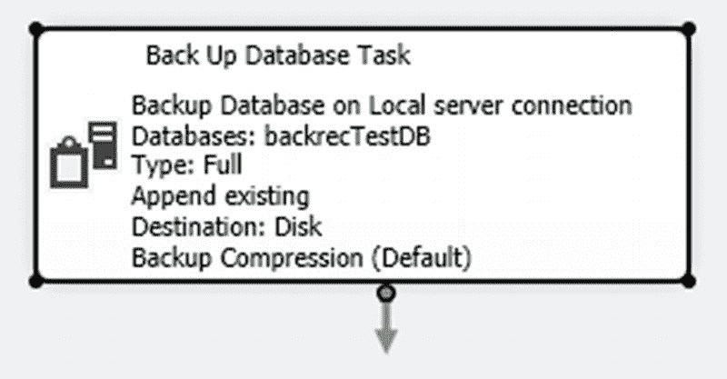

图 9-11. 备份计划 [设计]，已更新

#### 计划完整备份

现在我们已经设置了计划，我们需要设置一个时间表。通常，我在家和工作中使用的时间表几乎相同：午夜进行一次完整备份，每六小时进行一次差异备份，每小时进行一次事务日志备份。在某些情况下，我甚至会每半小时运行一次事务日志备份，但这会引入更多需要从中恢复的文件，同时将数据丢失的最大时间减少一半。

从我们离开的地方开始，我们现在可以看到如图 9-12 所示的内容。

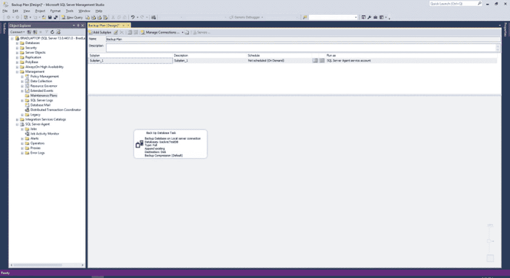

图 9-12. 备份计划 [设计] 阶段

注意，我们现在在舞台上方的区域中有一个名为 `Subplan_1` 的子计划。这是完整备份的计划，但我们需要给它一个更好的名称。双击 `子计划`、`描述` 或 `计划` 列以打开如图 9-13 所示的 `子计划属性` 窗口。

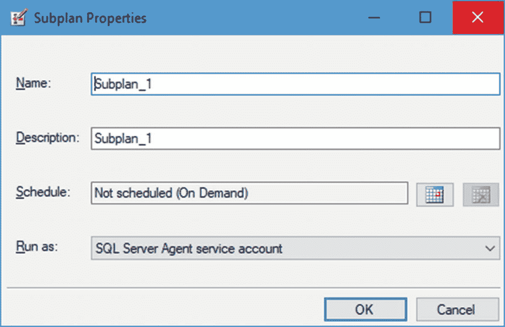

图 9-13. 子计划属性

我们希望将默认值更改为清单 9-7 中所示的值。

清单 9-7. 子计划属性值

*   `名称`
    *   “完整备份”
*   `描述`
    *   “这是备份维护计划中的完整备份部分”
*   `计划`
    *   我们将在另一个区域设置此选项，所以暂时忽略它
*   `运行身份`
    *   保持默认值

更新这些值后，单击 `OK` 关闭该窗口，你将返回到主舞台。图 9-14 显示了 `子计划属性` 窗口中应更新后的值，图 9-15 也显示了此时更新后的舞台。

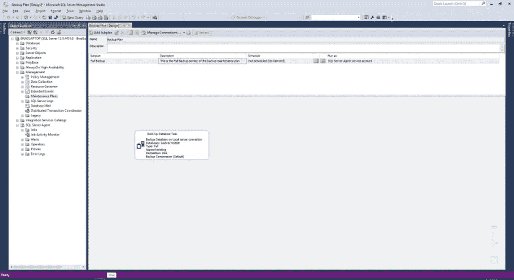

图 9-15. 更新后的舞台

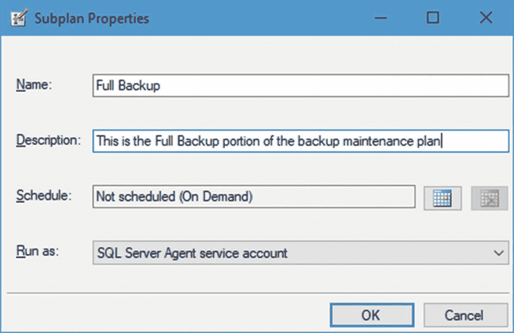

图 9-14. 子计划属性，已更新

我们可以在图 9-15 中看到，`子计划` 行中的值已更新为我们输入的值。对于计划，我们选择稍后再设置，所以现在让我们看看如何设置。

单击 `计划` 列旁边行中的日历图标。图 9-16 显示了 `新建作业计划` 屏幕的初始界面。

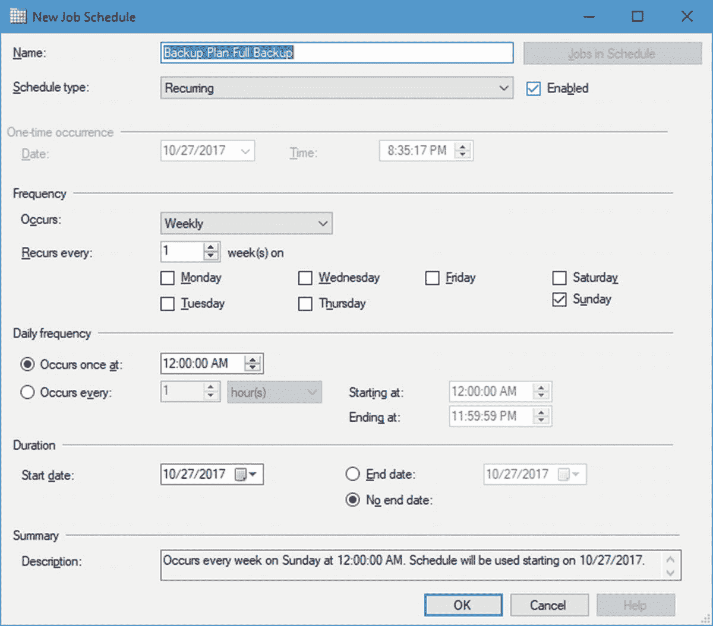

图 9-16. 新建作业计划

清单 9-8 将逐步介绍此屏幕上的所有选项，以便我们决定要执行的时间表。

清单 9-8. 新建作业计划选项


#### 更新 SQL Server 代理作业

现在维护计划已经设置完成，我们可以置之不理，让它正常运行。但是，SQL Server 代理作业需要进行更新。为什么呢？因为出于某些原因，该作业并不会继承维护计划的所有值，我们必须进入作业中手动补充填写这些作业值。希望在未来的 SSMS 版本中这个问题能得到解决。

在“对象资源管理器”中展开 SQL Server 代理菜单，然后展开“作业”。图 9-18 显示了此菜单项的位置。

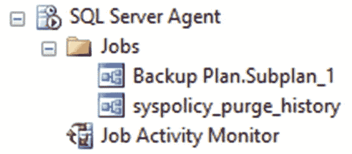

图 9-18
SQL Server 代理、作业的位置

请注意，这里有一个名为 `syspolicy_purge_history` 的默认作业。我们不需要它，所以它留在原处即可。我们关心的是名为 `Backup Plan.Subplan_1` 的作业。我们在图 9-14 的“子计划属性”窗口中更改了这个值，但它并未同步过滤到此区域，所以现在让我们来更新它。

##### 常规选项卡

双击作业名称，将出现“作业属性”窗口，如图 9-19 所示。此选项卡的目的是提供作业的顶层或“常规”设置。不过，不要认为这个区域不重要，因为如果填写不正确，可能会导致很多问题。例如，`启用` 复选框需要保持选中状态，所有者需要保持为具有数据库权限的账户，或者是数据库属性窗口中的数据库所有者。

注意：右键单击数据库名称并选择 `属性`。从这里，你可以查看数据库的所有者。请不要将其与 `dbo` 角色混淆。

根据我的经验，这两个值需要匹配。如果不匹配，正如我所说，那么此值需要是一个对数据库有访问权限的用户。

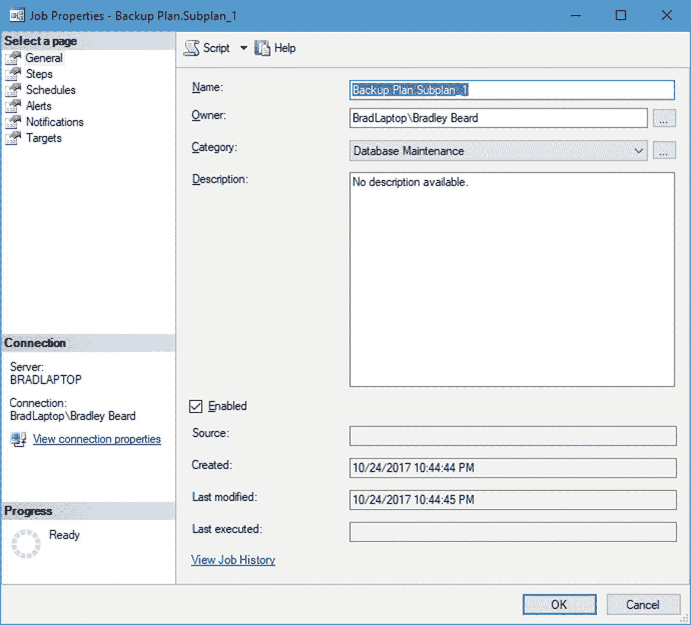

图 9-19
“作业属性”窗口，常规选项卡

如你所见，我们在前一节设置的一些选项并未传递到这个作业中，例如 `名称` 和描述。将 `名称` 字段更新为 `完整备份`，并输入简短描述以完成常规选项卡上的项目。请注意，`类别` 选项可以下拉选择不同的选项。这样做的目的是允许你将不同的作业划分到不同的类别中，然后利用这些不同类别进行日志检查或报告。不过，它默认是 `数据库维护`，所以最好保持原样。

当你对此区域的设置满意后，单击 `步骤` 选项卡。

##### 步骤选项卡

下一个选项卡（来自左侧窗格）是 `步骤`。图 9-20 显示了此页面的默认设置。

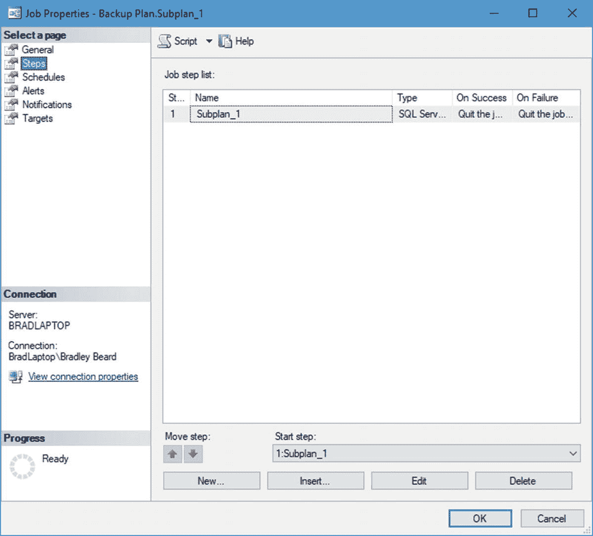

图 9-20
“作业属性”窗口，步骤选项卡

如果此作业有多个步骤，它们将显示在这里。或者，我们也可以在此处添加一些超出我们之前创建的维护计划范围的作业。我们现在不想这样做，但这是你在制定自己的计划时，如果必要，可以考虑的一个选项。

再次注意，名称不同了吗？所以，我们同样需要双击该行并更新那些值。图 9-21 显示了“作业步骤属性 – Subplan_1”窗口的初始值。

###### 作业步骤属性 - Subplan_1 (常规选项卡)

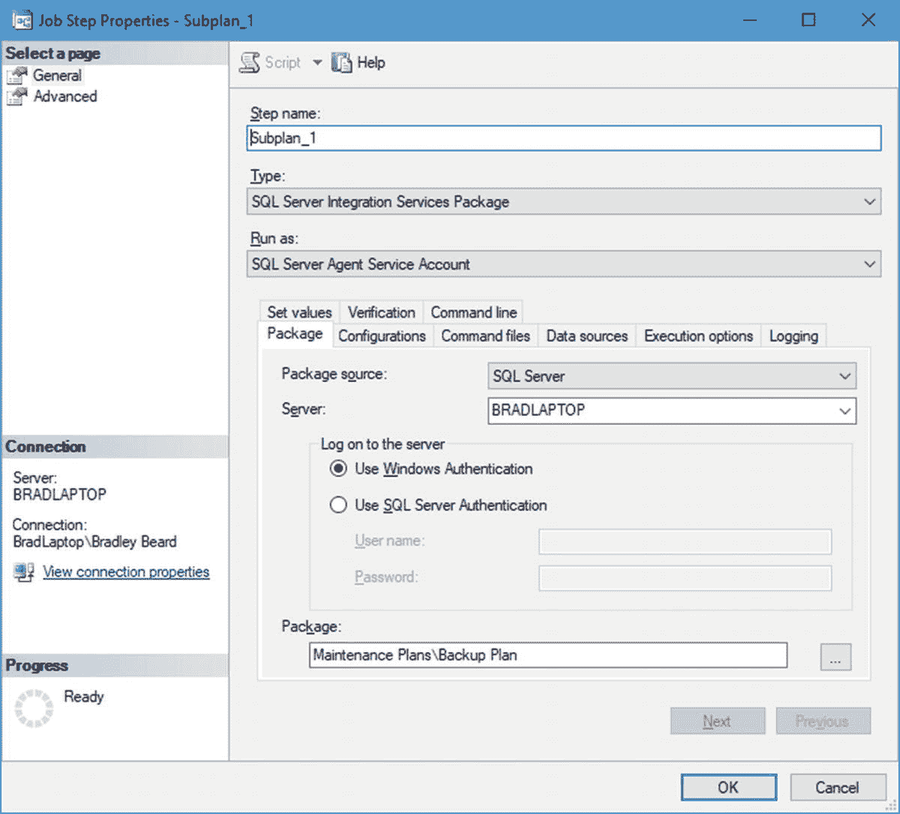

图 9-21
“作业步骤属性 – Subplan_1”，常规选项卡

在这个区域要非常小心。你可能会在此处对此作业和你的数据库造成严重损害。这个区域本质上允许你为创建此作业后将生成的 SSIS 包设置属性和值。

清单 9-9 显示了此选项卡中的可用选项。

清单 9-9. 作业步骤属性 - Subplan_1 选项


*   `Step name`
    *   步骤的名称。
*   `Type`
    *   正在创建的作业类型。其中包含许多与我们当前创建内容完全无关的选项，因此请务必不要更改任何设置。
*   `Run as`
    *   用于执行该程序包的帐户。默认值始终为 `SQL Server Agent`，因为此帐户默认拥有执行 SSIS 程序包的权限。
*   `Package`
    *   此子选项卡允许定义基本的程序包特征，例如：
        *   `Package source`
            *   程序包将创建的位置：`SQL Server`、`File System`、`SSIS Package Store` 或 `SSIS Catalog`。
        *   `Server`
            *   用于部署 SSIS 程序包的目标服务器。
        *   `Log on to the server`
            *   用于手动执行程序包的登录信息。
        *   `Package`
            *   保存程序包的默认位置。此值由“程序包源”下拉菜单中选择的值决定。例如，不能为 `SQL Server` 选项指定 Windows 文件夹位置，因为 `SQL Server` 选项期望程序包驻留在如 `Maintenance Plans\Backup Plan` 所示的 SQL Server 逻辑树中。
*   `Configurations`
    *   如果有任何配置文件，将在此区域添加。
*   `Command files`
    *   如果有任何命令文件，将在此区域添加。
*   `Data sources`
    *   如果需要添加与当前数据源分离且不同的数据源，可以在此处添加。
*   `Execution options`
    *   根据所选选项，这些选项可在程序包执行前或执行期间使用。可用选项包括：
        *   `Fail the package on validation warnings [DURING]`：在程序包执行时触发，以便在出现任何警告时使程序包失败。
        *   `Validate package without executing [BEFORE]`：程序包将不会执行，仅进行验证。
        *   `Override MaxConcurrentExecutables property [BEFORE]`：此选项用于确保不会有过多的可执行文件争夺 CPU 时间。
        *   `Enable package checkpoints [DURING]`：如果启用，程序包将在每个步骤发送状态更新。
        *   `Use 32-bit runtime [BEFORE]`：此选项定义是否在 32 位运行时或默认的 64 位运行时中执行此程序包。
*   `Logging`
    *   这是很多人甚至都不知道的一个绝妙选项，即此区域内置的日志记录功能。SSIS 有一个默认的日志提供程序，可用选项包括 SSIS 日志提供程序，适用于：
        *   `SSIS log provider for text files`
        *   `SSIS log provider for SQL Server`
        *   `SSIS log provider for Windows event log`
        *   `SSIS log provider for SQL server profiler`
        *   `SSIS log provider for XML files`
*   `Set values`
    *   如果有任何需要为程序包设置的值，可以在此处添加。
*   `Verification`
    *   这有点像是前面执行选项的延伸。此区域更多是从安全角度对程序包进行验证。这里的可用选项包括：
        *   `Execute only signed packages`
        *   `Verify package build`
        *   `Verify package ID`
        *   `Verify version ID`
*   `Command line`
    *   任何命令行选项都可以添加在这里，它们将在执行程序包的用户上下文中添加。请绝对确保，如果您更改了此区域，`Run as` 帐户必须具有执行此区域中指定命令的权限。

此处唯一需要更新的是 `Step name`（如果需要）。所有其他设置都已默认为我们所需的位置。更新了 `Step name` 值后，点击 `Advanced` 选项卡。

###### 作业步骤属性 - Subplan_1（高级选项卡）

`Advanced` 选项卡包含报告和日志记录操作的选项。图 9-22 显示了此区域的默认值，这些值对于我们的需求来说大部分是正确的。

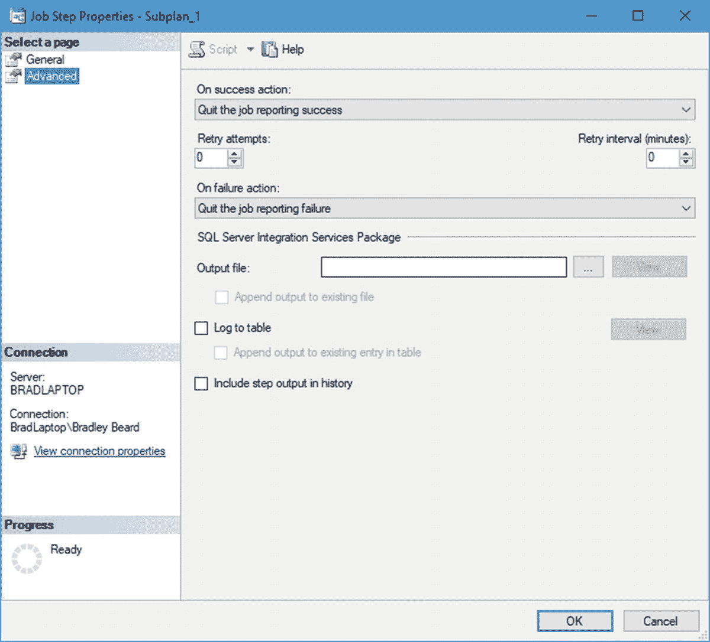

图 9-22

作业步骤属性 – Subplan_1，`Advanced` 选项卡

请注意，默认选项正是您所期望的；当程序包成功执行时，它会以成功状态退出作业。如果失败，则以失败状态退出作业。让我们仔细看看这些选项及其真正含义。清单 9-10 详细分解了这些选项。

清单 9-10. `Advanced` 选项卡选项

*   `On success action`
    *   当步骤成功完成时，程序包应该做什么？这里的可用选项包括：
        *   `Go to the next step`
            *   如果此程序包中还有另一个步骤，则执行该下一步。
        *   `Quit the job reporting success`
            *   默认选项。
        *   `Quit the job reporting failure`
            *   对成功执行的作业报告失败有点像是沟通不畅，所以我能想到这个选项的唯一用途是程序包执行本意是返回失败。
*   `Retry attempts`
    *   此程序包允许的重试次数。
*   `Retry interval (minutes)`
    *   程序包重试之间的等待时间。
*   `On failure action`
    *   与前面相同的选项，除了 `Quit the job reporting success` 选项的逻辑是相反的。
*   `Output file`
    *   执行 SSIS 程序包时，会生成一个输出日志文件。可以在此处输入路径以供以后查看。
*   `Log to table`
    *   选中此选项允许将程序包执行结果记录到 `msdb` 数据库中的 `sysjobstepslogs` 表。
*   `Include step output in history`
    *   此选项允许在 SQL Server Agent 日志中更准确地记录程序包执行情况。

请注意，我之前说这些设置只是“大部分”正确。我们想要勾选 `Log to table` 和 `Include step output in history` 复选框，这是我们在此处要做的唯一更改。图 9-23 显示了此屏幕更新后的值，因此请更新您的屏幕，准备好后单击 `OK` 按钮关闭此窗口，保存设置，并返回到作业属性窗口。

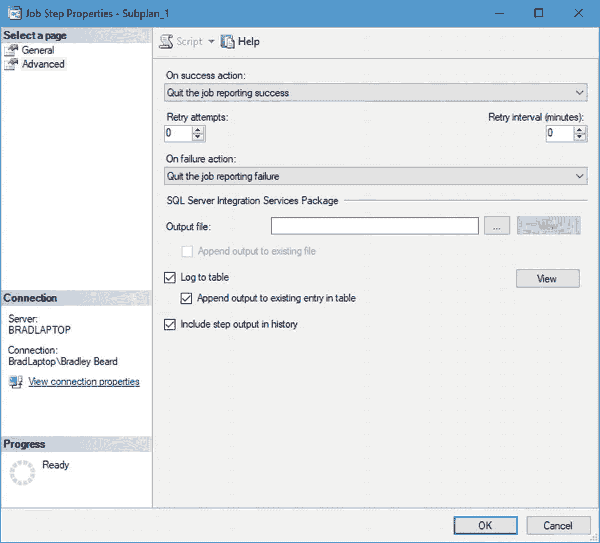

图 9-23

作业步骤属性 – Subplan_1，`Advanced` 选项卡，已更新

回到“作业属性”窗口后，我们可以看到作业的名称已更新。请注意，“起始步骤”值显示为 `Subplan_1` 而不是 `Full Backup`。原因是作业尚未保存，尽管这些值在此界面中显示。

一旦我们在此屏幕上单击 `OK`，这些值将会更新。但我们暂时还不打算这么做，所以请继续点击左侧的 `Schedules` 选项卡。

##### 计划选项卡

当您点击 `Schedules` 选项卡时，应该会看到一个空的界面；此区域中不应有计划。这很完美，因为我们是通过维护计划而不是 SSIS 程序包来安排此作业的。点击 `Alerts` 选项卡继续。

##### 警报选项卡

我们没有为此作业设置任何警报，但如果您想拥有警报，可以在此处设置。此上下文中的警报意味着当发生错误或事件时 SQL Server 会提醒您。SQL Server 还可以生成数据库响应、通过电子邮件或寻呼任何操作员，甚至发送 `NET SEND` 消息。我们不会对此区域进行任何操作，因为我们将在下一个选项卡（巧合的是，标题为 `Notifications`）中处理此作业的通知。点击 `Notifications` 选项卡继续。


##### 通知选项卡

此屏幕的初始界面如图 9-24 所示。请注意，这里唯一选中的选项是`写入 Windows 应用程序事件日志`。这很好，但我们需要的不仅仅是某处日志中的一个条目——我们还得去搜索它，然后尝试确定错误的确切原因。相反，我们可以利用此区域为此作业的任何失败设置实时通知。

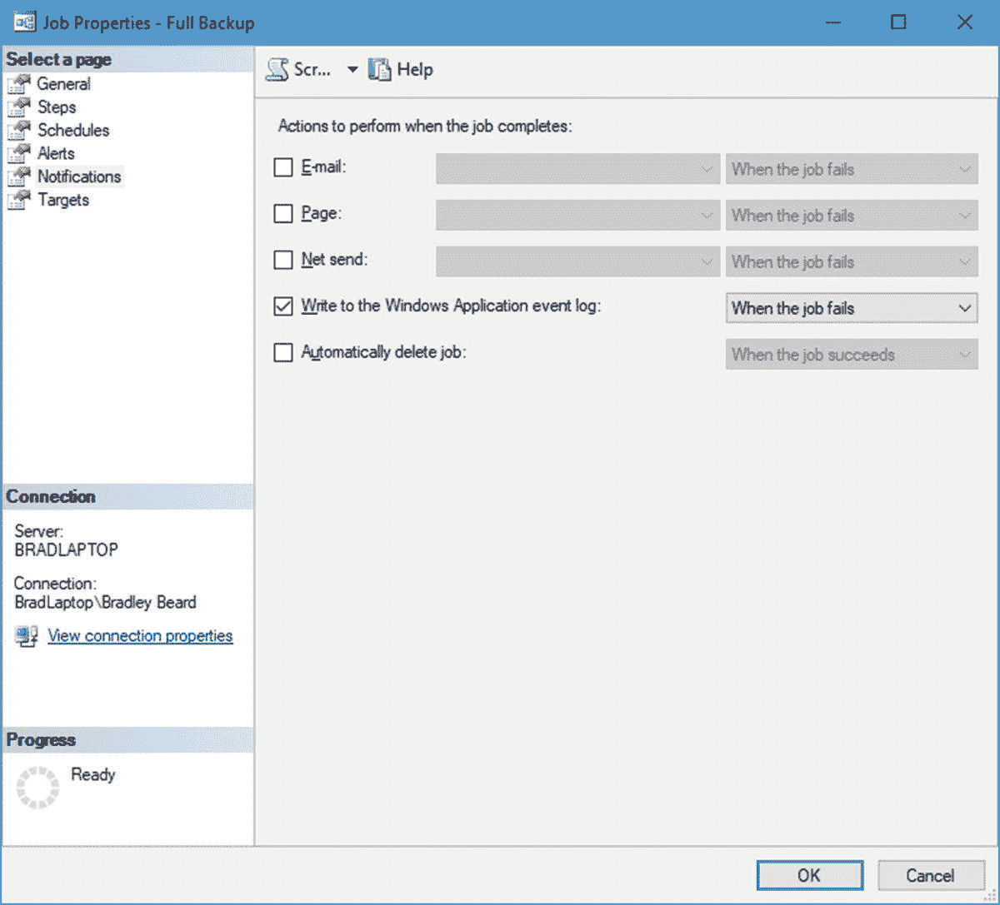

图 9-24

作业步骤属性 – Subplan_1，通知选项卡

清单 9-11 展示了此区域的各种选项和值。要使用`电子邮件`、`寻呼`和`Net send`选项，您必须已经建立了一个`操作员`。由于我们将使用此功能，我将在下一节介绍如何设置`操作员`。

清单 9-11. 通知选项

*   `电子邮件`
    *   这可能是使用最多的选项，因为电子邮件非常普遍。只需选择一个拥有已验证电子邮件的`操作员`，然后从下拉菜单中选择条件。
*   `寻呼`
    *   对于仍在使用寻呼机的数据中心，这是保持联系的好方法。或者，如果某人没有寻呼机，您也可以将给他们发短信视为等同于寻呼。
*   `Net send`
    *   如果您的个人电脑和数据库服务器位于同一网络上，并且您的个人电脑与数据库服务器有直接连接，那么您可以使用`Net send`从数据库服务器直接向您的个人电脑发送消息。此消息将以模式对话框的形式出现在您的个人电脑上。
*   `写入 Windows 应用程序事件日志`
    *   此区域中默认唯一选中的选项。保持勾选此项是个不错的主意。
*   `自动删除作业`
    *   和之前一样，我无法想象会在作业完成后想要删除它的实例，主要是因为该作业的历史记录要么被删除，要么变得难以解读，这样我们就失去了可能需要的任何取证信息。

对于这些选项中的每一个，右侧的下拉菜单都有以下三个选项：

*   `作业成功时`
    *   整个作业必须成功。
*   `作业失败时`
    *   整个作业必须失败。
*   `作业完成时`
    *   整个作业只需完成即可，无论成功还是失败。

本节内容已完成，因此单击`确定`按钮保存更改并再次返回到设计器。请注意，在`对象资源管理器`的`SQL Server 代理`菜单的`作业`子菜单中，作业名称现已更新为`完整备份`。我们将在完成`操作员`的设置后，再回到此`通知`选项卡。

###### 设置操作员

在我的第一本书《SQL Server 中的实用维护计划》中，我详细介绍了如何使用警报选项卡设置新的`操作员`。在该部分有一种添加新`操作员`的方法，但我想专门在本节中介绍如何使用`对象资源管理器`中`SQL Server 代理`菜单下的`操作员`子菜单。

在此上下文中，`操作员`是指负责在事件发生时接收有关数据库状态信息的人员。他们不一定是能够缓解情况的人，但他们是能够触发行动以促成改变的人。例如，一位高管可能希望在备份失败时得到通知，以便他们了解情况，但我非常怀疑这位高管是否能够解决这个问题。

此时，您的`SQL Server 代理`菜单应如图 9-25 所示，特别是在作业名称已更新的部分。

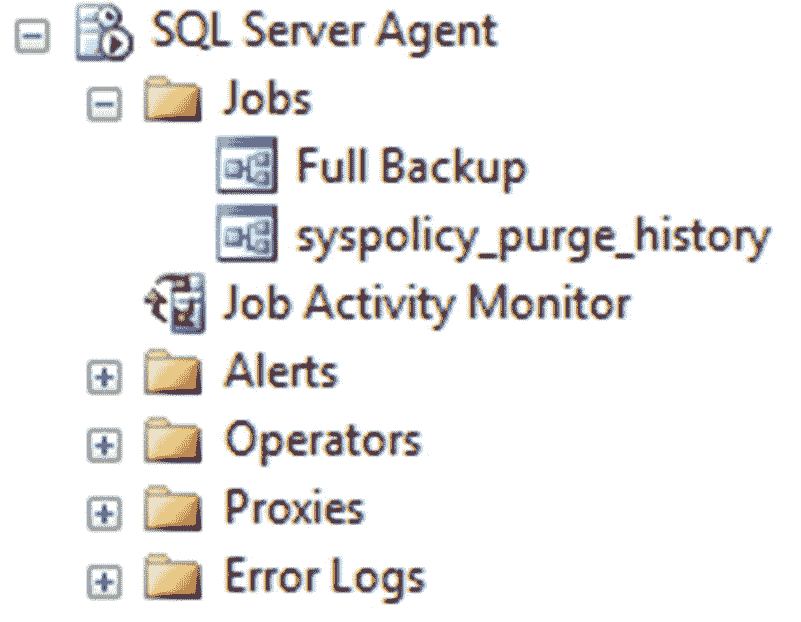

图 9-25

SQL Server 代理菜单

右键单击`操作员`并选择`新建操作员…`以继续。初始界面如图 9-26 所示。

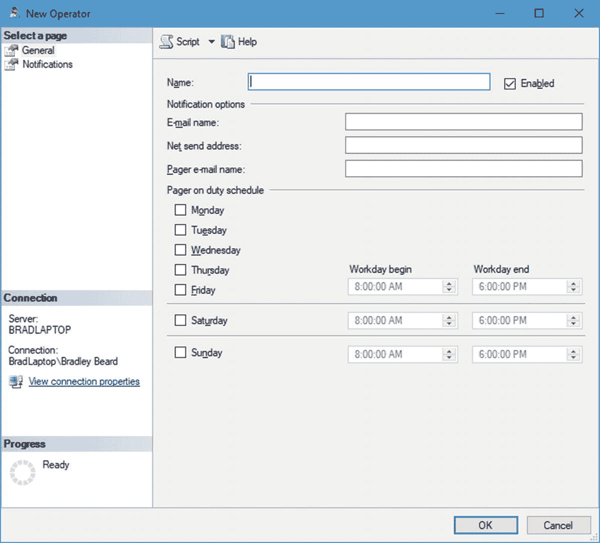

图 9-26

新建操作员

我们将在`名称`字段中输入将接收通知的人员的实际姓名，并在其`电子邮件名称`字段中输入他们的电子邮件地址。如果您有一个`NET SEND`地址，可以在此处输入。寻呼机信息也是如此；如果您有此信息，请在此处输入。如果您没有此信息或不需要使用，可以将其留空。

输入此信息后，您的界面应与图 9-27 所示非常相似。


图 9-27

新建操作员，已更新

接下来，我们想查看`通知`选项卡，尽管在此区域我们暂时无法操作，因为我们是首次创建此用户。如果此用户已存在一段时间，那么这里会有一些我们可以查看的信息，详细说明发送给此用户的通知。例如，如果有用户对收到通知提出异议，这将是有用的。

请单击`确定`按钮继续创建此`操作员`。请注意，我们的`操作员`子菜单现在包含了我们刚刚创建的用户名条目。这意味着该用户现在可以在作业内被指定为`操作员`，因此请再次双击`完整备份作业`并单击`通知`选项卡。这将调出如图 9-24 所示的窗口，只是我们现在可以添加我们的`操作员`了。图 9-28 显示了作业属性窗口的`通知`选项卡中此选项可用。

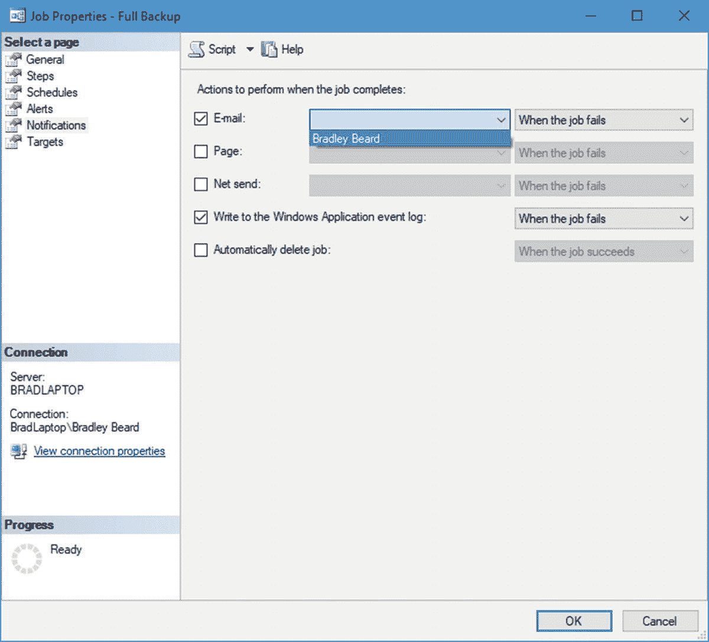

图 9-28

操作员可用

我选择了我的新`操作员`，将事件下拉菜单保持设置为`作业失败时`，然后单击`确定`。这便将我的`操作员`用户添加到了`通知`选项卡，这意味着如果此作业失败，我将收到电子邮件。

设置维护计划到此就完成了。我们已经定义了任务的实际参数，并设置并启用了一个`操作员`来接收失败通知。接下来，我们需要测试此计划，以确保其正常执行。


#### 测试完整备份计划

为了正确判断我们的计划是否运行正常，我们需要为该计划定义退出标准。在此示例中，清单 9-12 详细说明了我们将作为退出标准查看的内容。

清单 9-12. 退出标准

*   作业正确启动且无错误
*   备份文件在正确的位置创建
*   发生错误时发送通知
*   Windows 事件日志记录备份操作
*   作业正确退出且无错误

这些项目的成功完成将决定整个计划的成功与否。我将手动启动作业，而不是等到午夜让它自动运行。我可以随时通过右键单击作业并选择 `在此步骤启动作业…` 选项来启动作业。或者，如果我想运行整个维护计划，我可以右键单击维护计划名称并选择 `执行` 选项。我只想先检查作业，因此如前所述，右键单击该作业并执行它。它运行了几秒钟，然后我们可以看到在 `E:\SQL Server\Backup` 中创建了一个名为 `backrecTestDB` 的新目录，并且一个新的备份文件被放置在该目录中。我们还在图 9-29 所示的对话框窗口中看到了一条成功消息。

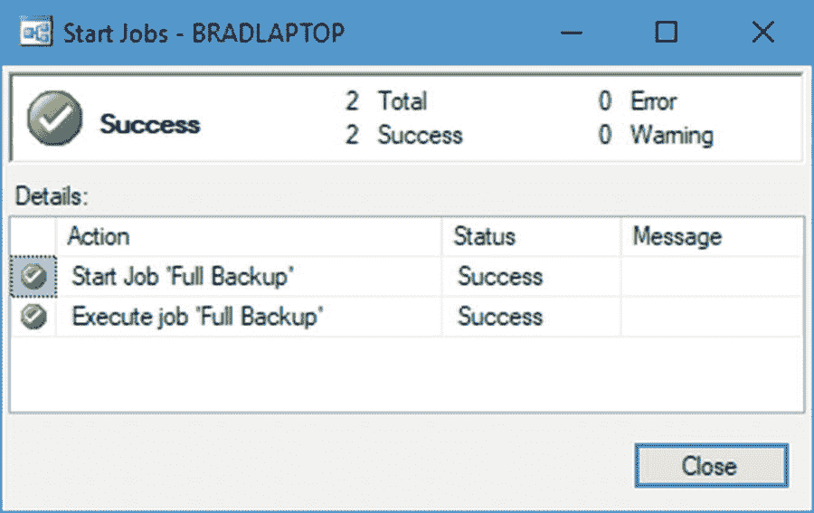

图 9-29

成功消息

如果我们打开 Windows 事件日志并转到应用程序日志，我们将看到图 9-30 所示的内容，这确认了 Windows 将我们的备份操作视为成功的任务。

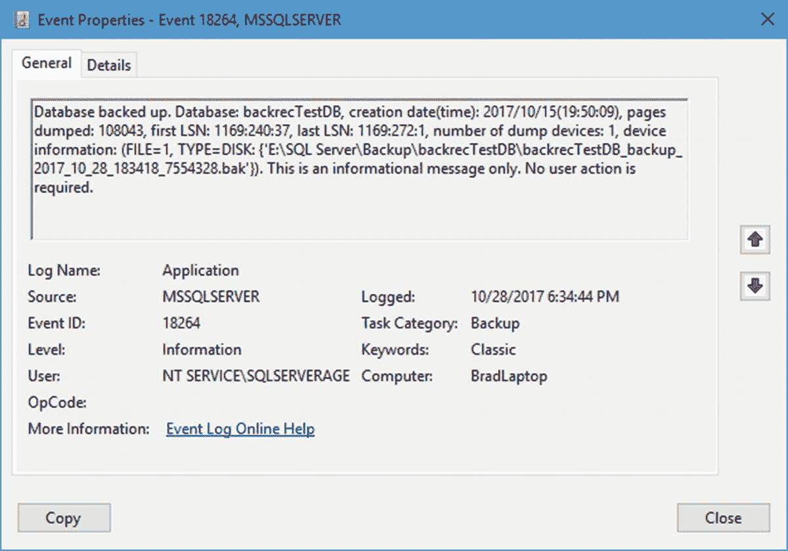

图 9-30

Windows 应用程序事件日志

我们此时唯一没有测试的是“通知”选项，由于没有发生故障，该选项未触发。

#### SSMS 中的完整恢复计划

本节将详细介绍如何从可用的备份文件中制定一个可靠的恢复计划。本节的好处在于，它完全依赖于存在可恢复的备份数据集；如果没有可恢复的备份，我们就无法恢复任何数据。

在 SSMS 中，没有我们可以运行的“还原数据库”任务。相反，我们需要使用用于还原数据库的 T-SQL 命令，并将该命令包装在我们能够按需执行的 SQL Server 代理作业中。我们计划实现此目标的基本结构很简单，如清单 9-13 所示。

清单 9-13. 数据恢复结构

*   使用第 5 章中已知可用的 `RESTORE DATABASE` 命令作为 T-SQL 语法的基础
*   创建一个 T-SQL 类型的 SQL Server 代理作业
*   创建当前完整备份的副本并将其重命名为 `backrecTestDB.bak`
*   正常恢复数据

我想在这里暂停一下，并快速说明一点：我们复制和重命名备份文件的原因是因为我不想破坏维护计划已建立的恢复链。我想使用相同的数据，但脚本必须在恢复脚本中引用一个静态的文件名，这就是我选择复制和重命名文件的原因。我确定处理这一方面有不同的方法，如果你有不同的处理方法，那非常好！

#### T-SQL 恢复命令

参考第 5 章，我们用来恢复数据的命令是

```
RESTORE DATABASE backrecTestDB
FROM DISK = 'E:\SQL Server\Backup\backrecTestDB\backrecTestDB.bak'
WITH REPLACE
GO
```

我们将在恢复作业中使用相同的命令，因此请记下 `FROM DISK` 的位置，因为我们在本节重命名文件时需要使用该位置。

##### SQL Server 代理恢复作业

要开始本节，我们需要在不先创建维护计划的情况下创建一个 SQL Server 代理作业。展开 SQL Server 代理，右键单击 `作业`，然后选择 `新建作业…` 继续。新建作业窗口打开，如图 9-31 所示；请注意，它与我们之前看到的窗口略有不同，该窗口中的一些信息是从维护计划中引用的。

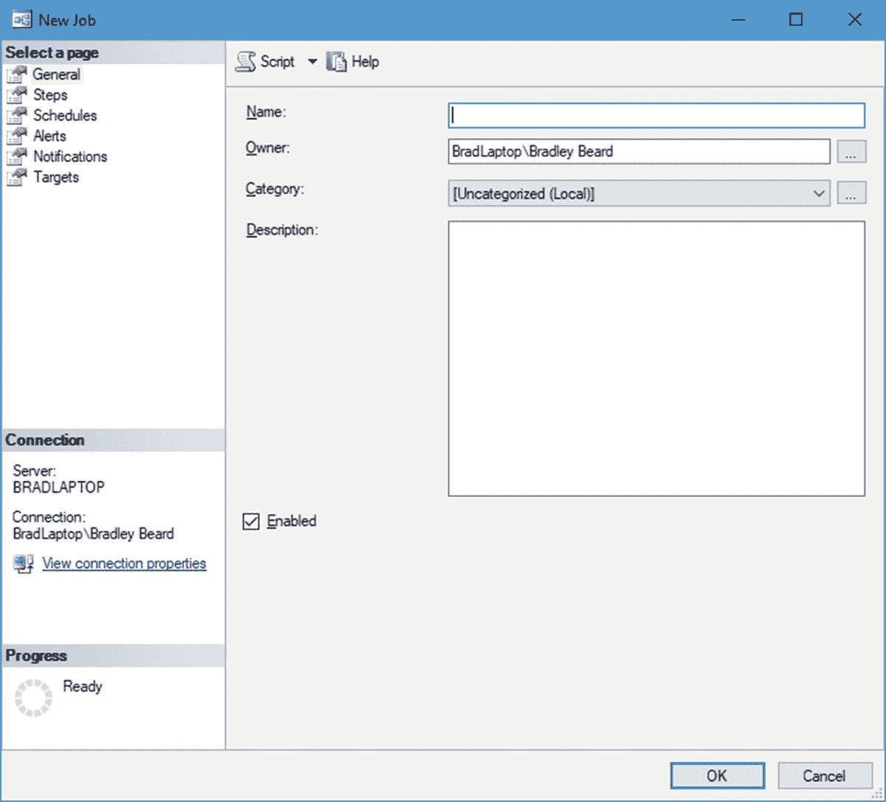

图 9-31

新建作业窗口，常规选项卡

这是一个完全空白的画布，供我们创建任何想要的内容。在此屏幕上，我们希望更新清单 9-14 中的以下值。

清单 9-14. 新建作业的值

*   名称
    *   更新为“完整恢复”
*   所有者
    *   这应该是 SQL Server 中的 `sa`（主要管理员）帐户，或自定义的服务器代理服务帐户，而不是普通用户帐户
*   类别
    *   将其更改为“数据库维护”
*   说明
    *   输入类似“这是完整恢复计划中完整恢复部分”的内容

此外，我们要确保“已启用”复选框保持选中状态。接下来，我们要选择左侧的“步骤”选项卡。此时会打开一个空白窗口，如图 9-32 所示。

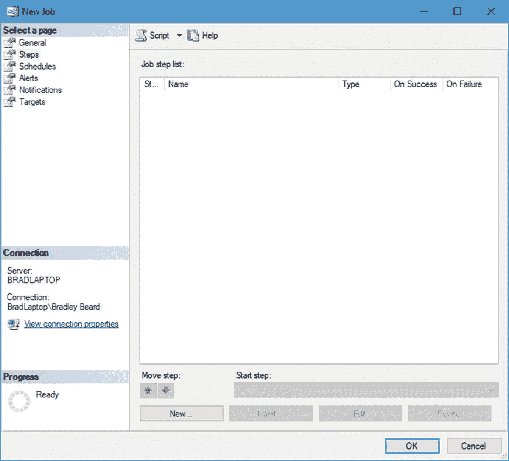

图 9-32

新建作业窗口，步骤选项卡

对于此页面，我们将单击屏幕底部的 `新建…` 按钮，然后看到如图 9-33 所示的新建作业步骤屏幕。

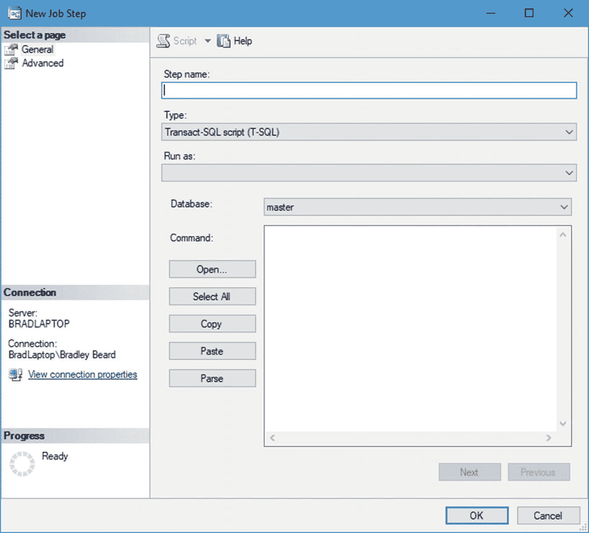

图 9-33

新建作业步骤，常规选项卡

这又是一个我们不熟悉的界面。我们可能习惯于看到从维护计划预先填充了信息的此屏幕，但这实际上非常简单。接下来，我们需要更新清单 9-15 中所示的值。

清单 9-15. 常规选项卡选项

*   步骤名称
    *   完整恢复 T-SQL 命令
*   类型
    *   Transact-SQL 脚本 (T-SQL)
*   运行身份
    *   （此值尚无法更新）
*   数据库
    *   Master
*   命令
    *   粘贴“T-SQL 恢复命令”部分中的 T-SQL 脚本

请注意，我们目前还无法更新 `运行身份:` 值。这暂时没问题，因为我们必须先保存这些值，然后再返回此屏幕。您现在应该会看到如图 9-34 所示的内容。

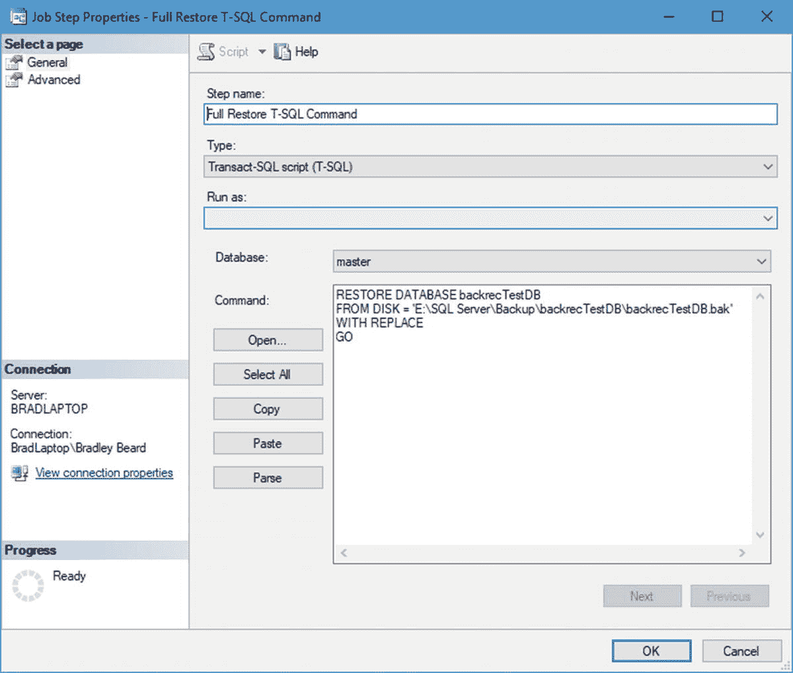

图 9-34

新建作业步骤，常规选项卡（已更新）

所有内容填写完毕后，单击“确定”按钮以创建初步作业。立即再次双击该作业，您将看到 `运行身份:` 下拉菜单现已启用。但是，没有可选择的值。换句话说，我们无法选择以 SQL Server 代理身份运行此作业。

单击“高级”选项卡，您将看到如图 9-35 所示的屏幕。

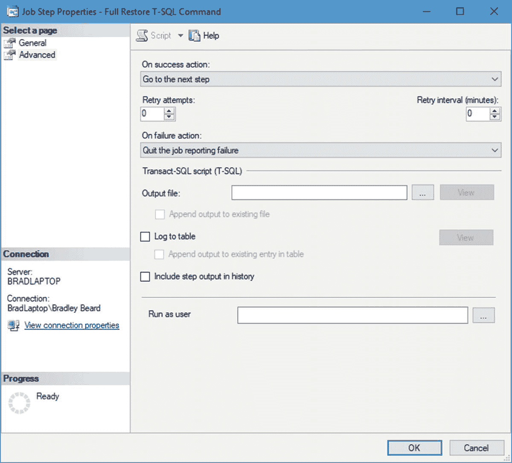

图 9-35

作业步骤属性，高级选项卡

同样，我们需要将这些选项更新为清单 9-16 中所示的值。

清单 9-16. 高级选项卡选项

*   成功时的操作
    *   保留默认值。
*   重试次数
    *   保留默认值。
*   重试间隔（分钟）
    *   保留默认值。
*   失败时的操作
    *   保留默认值。
*   输出文件
    *   除非你想创建输出文件，否则保留空白。我不创建它们，因为我在表中创建了条目，并且步骤输出在历史记录中，但你可以自由选择。
*   记录到表
    *   选择此选项。
*   在历史记录中包括步骤输出
    *   选择此选项。
*   以用户身份运行
    *   保留空白。当我们这样做时，作业将强制以 SQL Server 代理服务帐户身份运行。


当您完成操作后，您的界面应如图 9-36 所示。

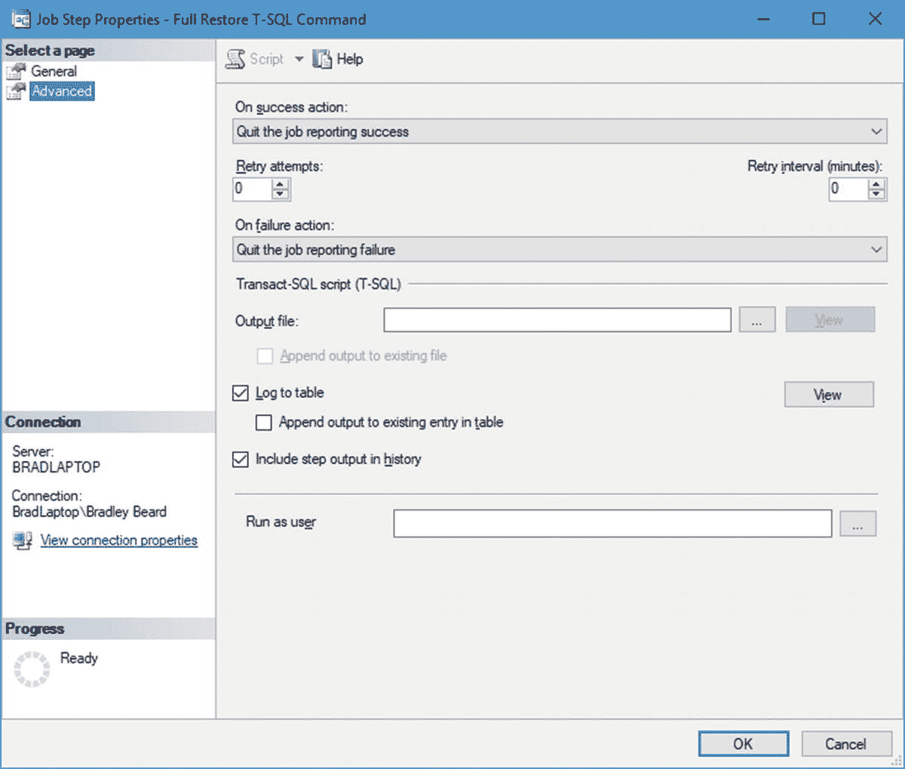

图 9-36

作业步骤属性，高级选项卡（已更新）

这些值都是正确的，因此请继续单击“确定”按钮以保存这些配置设置。然后我们会返回到“新建作业”界面，只是“作业步骤列表”字段中的值已更新。请注意，“开始步骤”值也已更新为我们刚刚创建的步骤名称。图 9-37 显示了此更新后的界面。

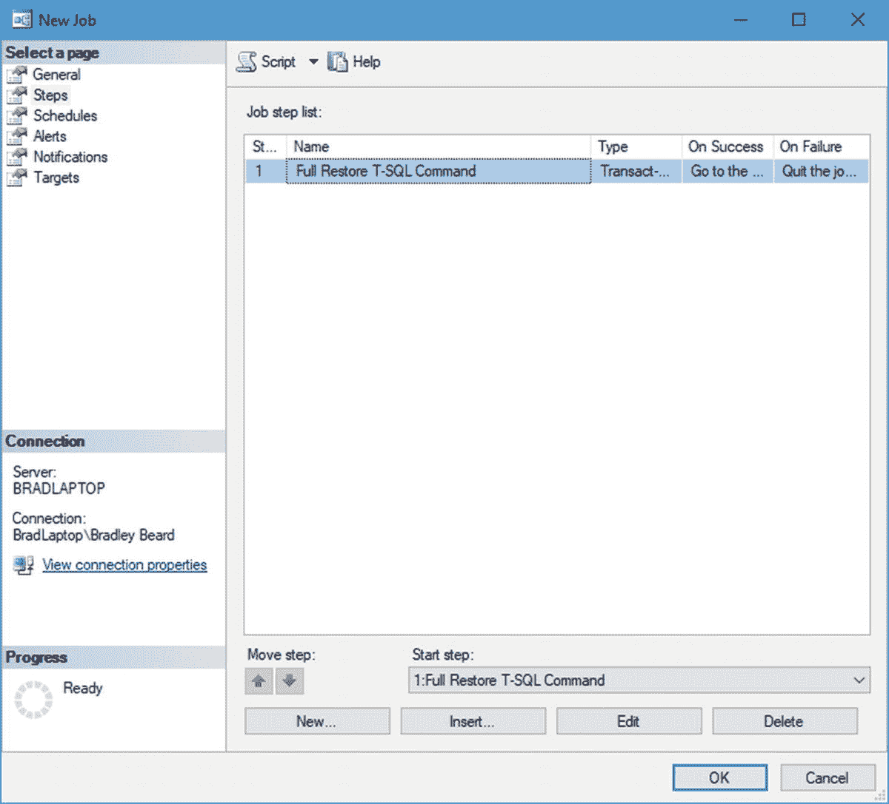

图 9-37

新建作业，已更新

我们不打算计划此作业，也不需要为其设置警报。但是，我们确实希望确保“通知”选项卡已选中“写入 Windows 应用程序事件日志”，并且我们希望向我们的操作员发送电子邮件，通知作业已完成——不是失败也不是成功，而是已完成。这样，无论哪种情况我们都会收到状态更新。图 9-38 显示了“通知”选项卡更新后的界面。

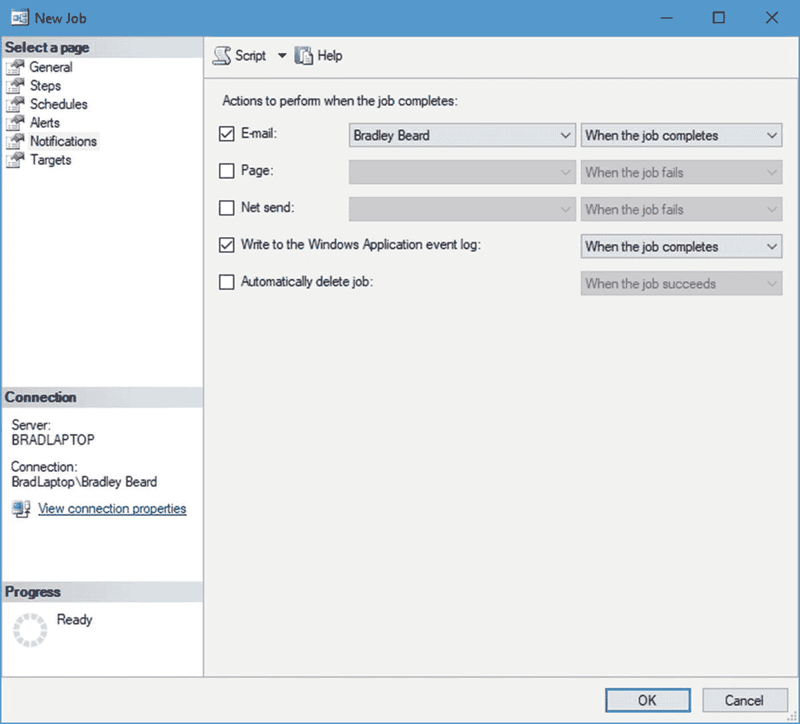

图 9-38

新建作业，通知选项卡（已更新）

这就是配置此作业所需做的全部工作。单击“确定”按钮保存它，并返回到 `SSMS` 主屏幕，此时 `SQL Server 代理`的“作业”子菜单中会显示更新后的作业。图 9-39 显示了此更新后的界面。

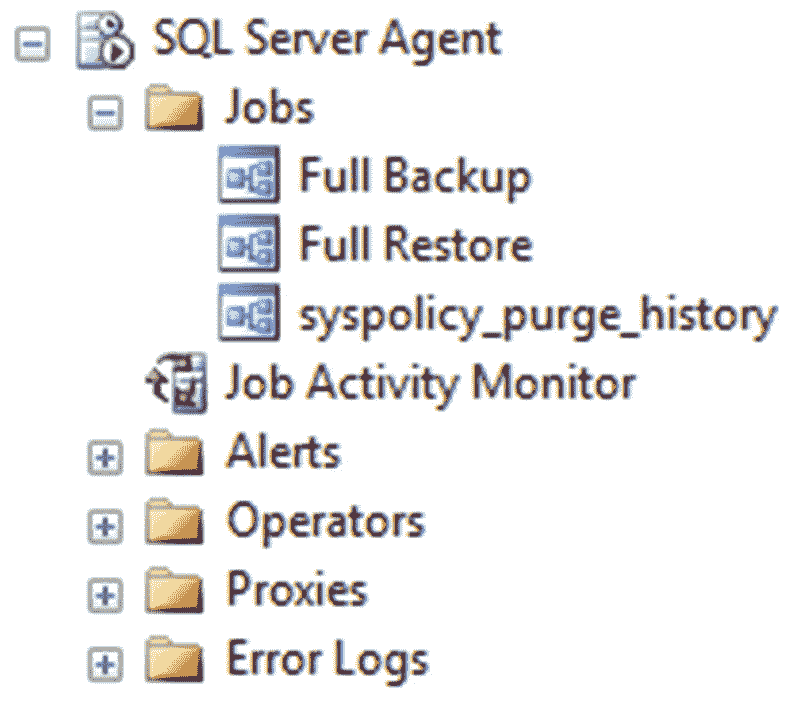

图 9-39

`SQL Server 代理`，已更新

因此，在本节中，我们从头开始创建了一个完整的还原作业；再次说明，我们之所以必须这样做，是因为 `SQL Server` 没有在工具箱中为我们提供还原数据库工具，因此我们不得不将 `RESTORE DATABASE` 命令包装在 `SQL Server 代理`作业中。正如我之前所说，如果您能使用替代方法达到最终结果，那非常好！

##### 复制并重命名当前备份文件

接下来，我们只需要复制本章前面运行的完整备份。此数据库的默认备份位置是 `E:\SQL Server\Backup\backrecTestDB`，但您的可能不同。无论如何，选择备份位置，如前面所示复制并重命名文件。就我而言，我将我的文件重命名为 `E:\SQL Server\Backup\backrecTestDB\backrecTestDB.bak`。完成后，我们就可以进入下一节。

##### 还原数据

对于本节，我们要做的就是右键单击“完整还原作业”并选择 `从步骤开始作业…` 来运行该作业。请注意，我们需要删除任何数据库快照才能还原数据库，因此在尝试继续之前，请从 `SSMS` 界面删除您可能有的任何快照。

一旦我们运行该作业，它需要一点时间来完成，然后我们应该看到如图 9-40 所示的内容。

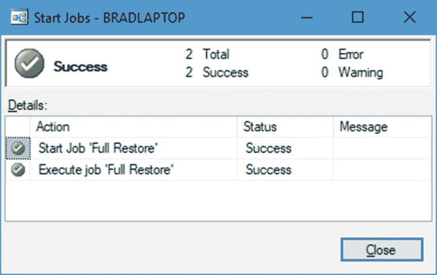

图 9-40

成功还原数据库

接下来，您可以运行“备份和还原事件”报告来查看数据库是否确实已还原。您也可以检查 Windows 应用程序事件日志中的条目，如图 9-41 所示。

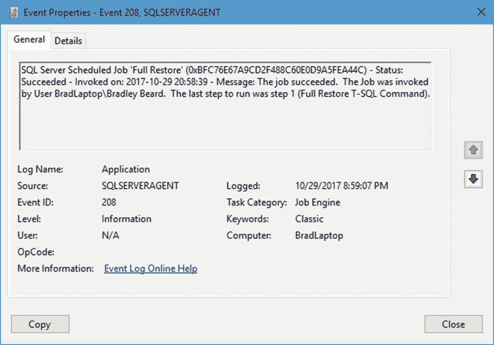

图 9-41

Windows 应用程序事件日志条目

所以，您已经拥有了它。一个完整的完整还原作业，我们现在可以在需要时用来还原数据库。只需按照本节中的说明操作，您就会一切顺利。

#### 总结

在本章中，我们根据本书过程中收集的需求，将完整备份维护计划拼凑完整。

我们学习了 `SSMS` 维护计划区域中的许多各种配置选项。

我们还学习了 `SQL Server 代理` 作业区域中的配置选项。

我们学习了如何设置一个操作员，以便在作业失败时接收电子邮件。

这是创建整个备份场景所需的三部分中的第一部分。当我们完成整个场景后，我们将对其进行广泛测试，以确保每个事件都能正确通知操作员，因此不必担心我们尚未测试电子邮件接收。我们会在本书结束前完成这一点。

我们还拼凑了完整还原计划的各个部分，测试了完整还原 `SQL Server 代理` 作业，然后通过“备份和还原事件”报告和 Windows 应用程序事件日志验证了结果。

在第 10 章中，我们将把差异备份添加到“备份计划”维护计划中，并像配置完整备份计划一样配置它。我们还将创建一个差异还原 `SQL Server 代理` 作业。

在第 11 章中，我们将讨论如何将事务日志备份添加到“备份计划”维护计划，并创建一个事务日志还原 `SQL Server 代理` 作业。

本书将以一个完整的测试计划、一个关于如何测试计划是否成功的指南，以及我们可以用来减轻有害情况或包执行中错误的故障排除提示和技巧作为结尾。

