# 10. 差异备份和还原解决方案

既然我们在第 9 章中详细介绍了功能正常的完整备份和完整还原 `SQL Server 代理` 作业，我们需要拼凑出差异备份和差异还原部分。我们将借鉴第 2 章和第 6 章的内容来完成本章，但我们将着眼于为我们现有的“备份计划”维护计划添加略有不同的功能和定制。

我们想要做的是修改备份计划以包含备份的差异部分，然后创建一个新的差异还原 `SQL Server 代理` 作业，以便手动运行或与完整还原 `SQL Server 代理` 作业结合运行。在本章结束时，我们将为现有计划创建一个附加部分，测试我们目前为该计划创建的内容，并验证预期操作的预期结果。

最近，我接到任务，要在我的工作区域创建一个相同的开发环境。您可能明白我的意思了；由于事情的偶然性，我能够将我们现在所做的应用到真实场景中，并且它奏效了。我可以将完整数据库备份还原到一个全新的 `SQL Server` 实例，没有任何麻烦，不仅如此，我还能将差异和事务日志备份也还原到新服务器上，因此在迁移到开发服务器时基本上实现了零数据丢失。知道我能够快速、正确地备份和还原我负责保护的数据，让我感到非常安心。

我经常发现自己会构思一些“噩梦场景”，这会迫使我快速而正确地思考和行动。显然，这些场景存在局限性；它们必须完全植根于我可以影响或控制结果的情况。例如，服务器宕机的场景完全超出了我的责任范围，因为我需要依赖其他人来解决这种情况。但是，例如，如果不小心运行了一个查询并删除了一个表，或者我的数据库遭受了 `SQL` 注入攻击（它不会，但请记住这是一个噩梦场景），或者其他与 `SQL Server` 相关的问题出现，我需要知道我有技术能力来回答我需要回答的问题。在我看来，我们可以采取不同的步骤来减轻这些噩梦场景，我们希望最终能在本章中解决这些问题。

现在，让我们专注于将差异备份添加到我们在第 9 章开始的“备份计划”维护计划中。


#### 在 SSMS 中添加差异备份

我们首先需要做的是打开维护计划进行编辑。在对象资源管理器中，展开 `Management` 菜单，然后双击 `Backup Plan`。这将打开维护计划，以便我们可以配置其中的任何选项。图 10-1 显示了打开维护计划时您应该看到的初始屏幕。

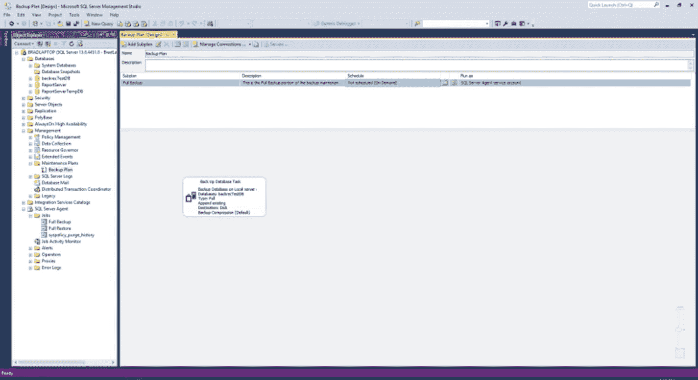

图 10-1：备份计划主舞台

我们需要打开 `Toolbox`，因此可以单击左侧的 `Toolbox` 浮动菜单，或者按 `Ctrl+Alt+X` 来打开 `Toolbox`。接下来，我们要将另一个 `Back Up Database Task` 拖到主舞台上，位于现有 `Back Up Database Task` 的右侧。图 10-2 显示了新任务的大致位置。

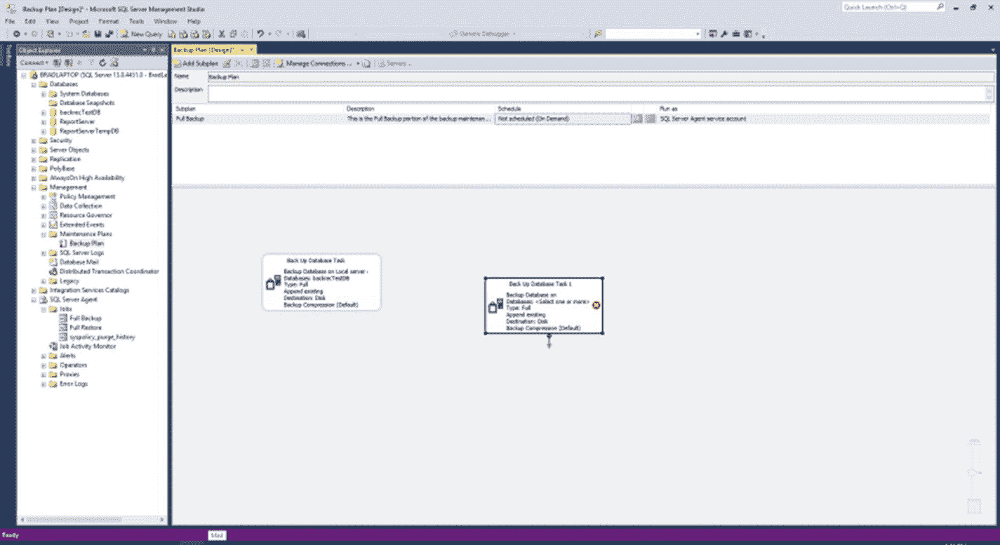

图 10-2：新任务

放在舞台上的任何位置都可以，但我把它放在那里是为了在脑海中将其区分为层次结构；左侧的项目是最高级别，右侧的项目是左侧项目的下一级别。

请注意，新任务上还有一个红色的 `X` 需要处理。我们在第 9 章中遇到过同样的情况，我们这次也将像当时那样处理。我们可以从双击刚刚放置的新任务开始，图 10-3 显示了默认界面。

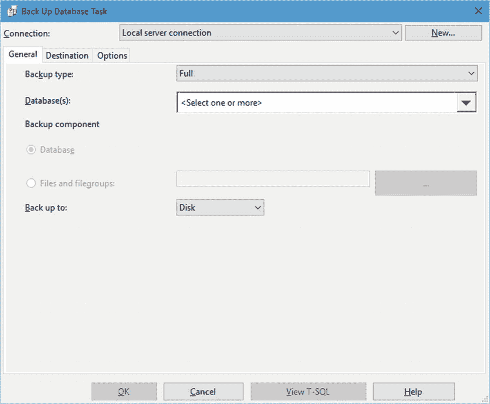

图 10-3：`Back Up Database Task`，`General` 选项卡

对于此区域，我们需要按照清单 10-1 所示进行设置，以配置此区域中的各种选项。

**清单 10-1. 待办事项列表**

*   `Backup type`
    *   我们必须从 `full`、`differential` 或 `transaction log` 中选择。在本例中，我们将选择 `differential`。
*   `Databases`
    *   我们必须至少选择一个数据库。请注意，如果从备份类型选项中选择 `transaction log`，则 `simple` 恢复模型的数据库将被移除。在本例中，我们将选择我们一直在使用的数据库 `backrecTestDB`。
*   `Backup component`
    *   我们可以从 `database` 或 `files and filegroups` 中选择。在本例中，我们将选择 `database`。
*   `Back up to`
    *   我们必须从 `disk`、`tape` 或 `URL` 中选择。在本例中，保持设置为 `disk`。

请注意，这些设置与第 9 章中的设置几乎相同。我们所做的唯一更改是在 `Backup type` 字段中选择了 `differential` 而不是 `full`。您的屏幕现在应该如图 10-4 所示。

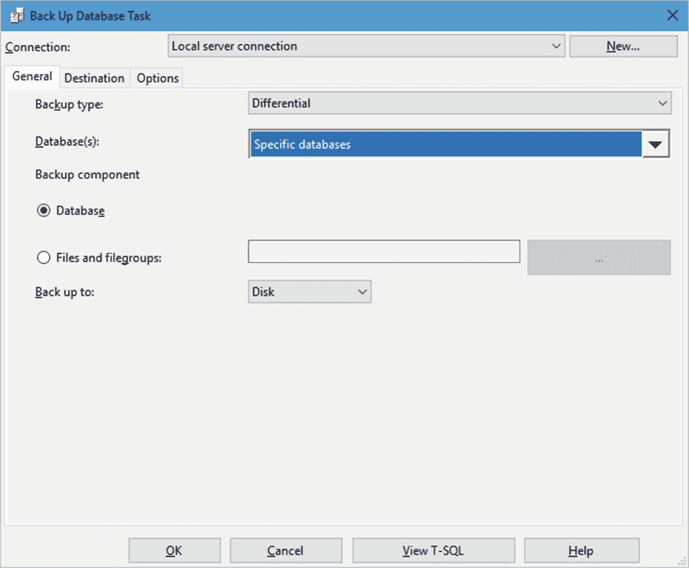

图 10-4：`Back Up Database Task`，`General` 选项卡，已更新

接下来，我们想单击窗口顶部的 `Destination` 选项卡。确保选中 `Create a sub-directory for each database` 复选框，这就是我们对此选项卡需要做的全部。图 10-5 显示了完成的界面。

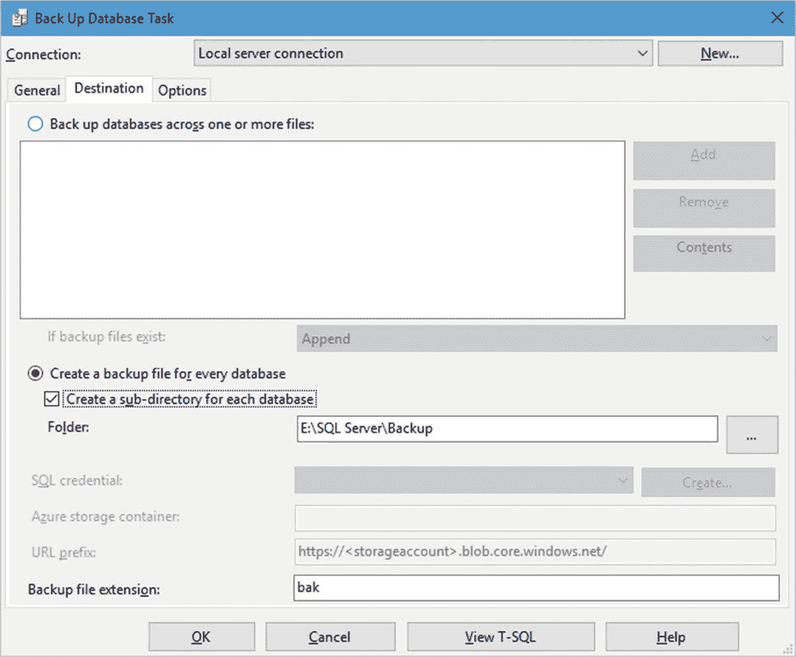

图 10-5：`Back Up Database Task`，`Destination` 选项卡

接下来单击 `Options` 选项卡。再次强调，类似于自定义维护计划的 `Full Backup` 部分，我们将在此选项卡上选中 `Verify backup integrity` 和 `Perform checksum` 复选框。图 10-6 显示了完成的界面。

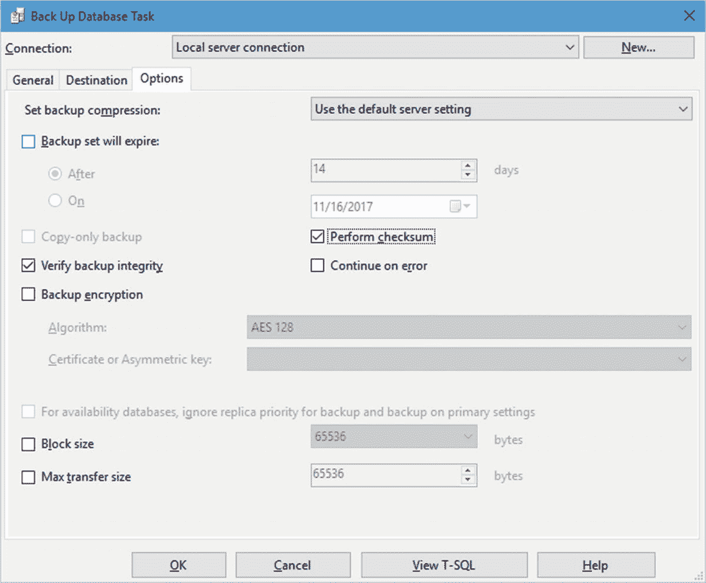

图 10-6：`Back Up Database Task`，`Options` 选项卡

干得漂亮！信不信由你，这部分已经完成了。接下来，我们需要计划此部分的任务（此处巧妙引用了 Dan Fogelberg）。继续并单击 `OK` 按钮以添加此部分任务，并注意红色 `X` 已经消失了。但是，看到我们有两个任务在同一个舞台上吗？让我们更高效地操作。在舞台顶部，有一个标为 `Add Subplan` 的按钮。继续单击该按钮，您将看到如图 10-7 所示的内容。

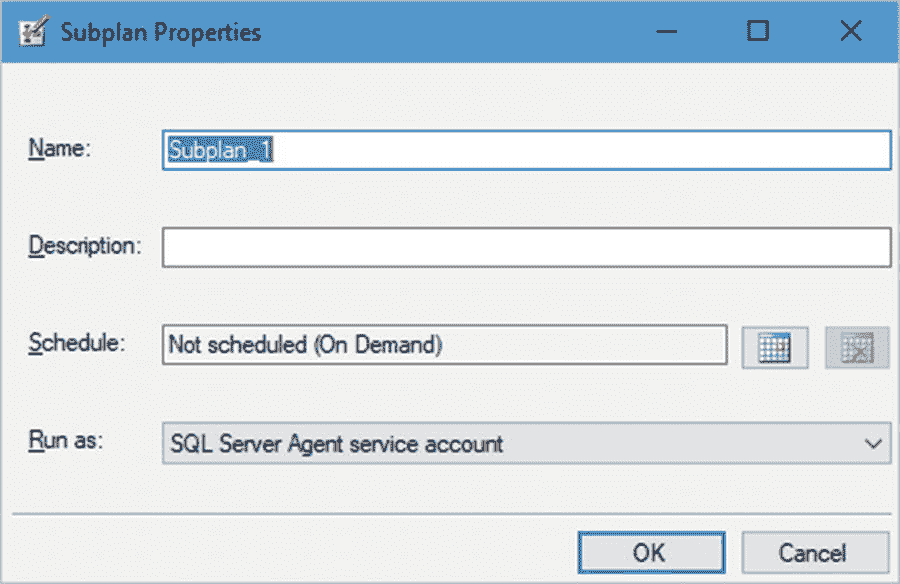

图 10-7：子计划属性

将 `Name` 字段更改为 `Differential Backup`，并添加描述“这是备份维护计划的差异备份部分”。完成后单击 `OK`，您将看到更新后的界面，如图 10-8 所示。

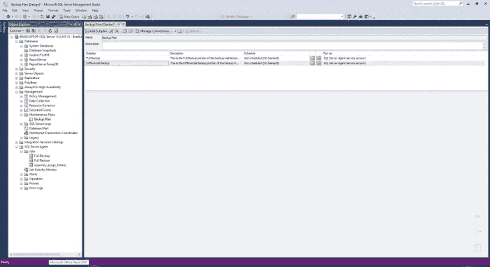

图 10-8：更新后的主舞台

现在舞台上没有任何东西，因为尚未向子计划添加任何内容。单击屏幕顶部的 `Full Backup` 子计划，单击我们刚刚创建的子计划，按 `Ctrl+X` 剪切任务，再次选择 `Differential Backup` 子计划，单击舞台内部，然后按 `Ctrl+V` 粘贴任务。这将把整个任务从 `Full Backup` 子计划转移到 `Differential Backup` 子计划。图 10-9 显示了此时您的更新界面应有的样子。

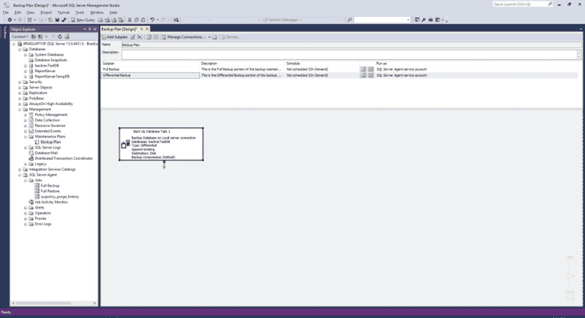

图 10-9：更新后的主舞台

好了，我们已经将任务放在了正确的子计划中，它们各归其位。您也可以在此屏幕上长按文本 `Back Up Database Task 1` 来更改任务名称。我这样做了，并将任务标题简单地改为 `Differential Backup Task`。

关于这部分，我发现一个有趣的地方是完整备份计划似乎没有被保留。回顾我们最初的备份计划，我们需要将完整备份计划设置为在上午 12:00 运行，而我们的差异备份需要每六小时运行一次。

#### 计划差异备份

在顶部区域选中 `Differential Backup` 子计划后，我们想单击菜单栏中的日历或 `Differential Backup` 行中的日历。无论您选择哪一个，都会打开相同的界面。图 10-10 显示了初始的 `New Job Schedule` 窗口。

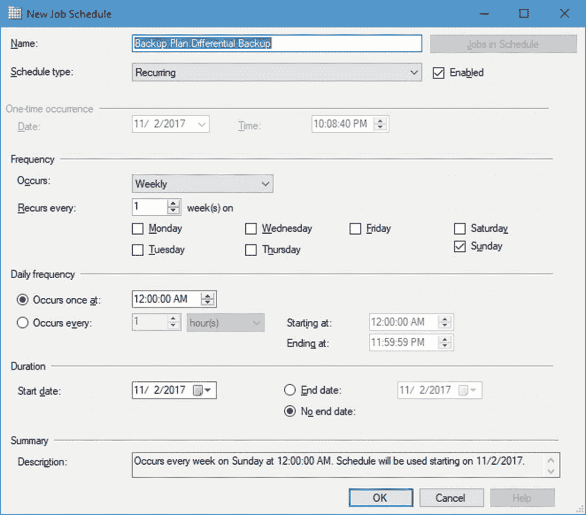

图 10-10：新建作业计划

我在第 9 章中详细解释了这些选项，因此这里不需要重复。相反，您应该将您的设置更新为如图 10-11 所示，即每天每六小时运行一次差异备份。

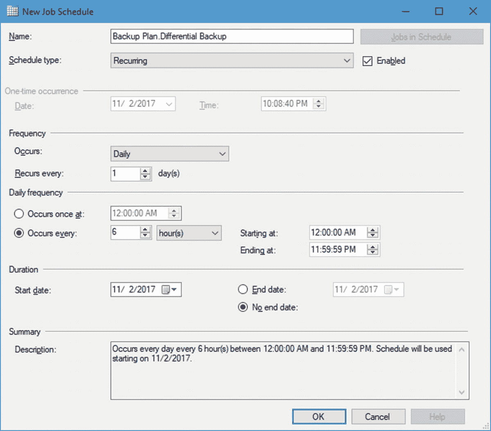

图 10-11：新建作业计划，已更新

完成这些设置后，单击 `OK` 按钮。您的 `Schedule` 列将更改为计划的摘要，如图 10-11 的 `Description` 框所示。一旦回到主舞台，请保存您的工作，并注意我们有了新的 `SQL Server Agent` 作业名称，即使是我们之前已经保存过的项目也是如此。图 10-12 显示了此部分现在的样子。

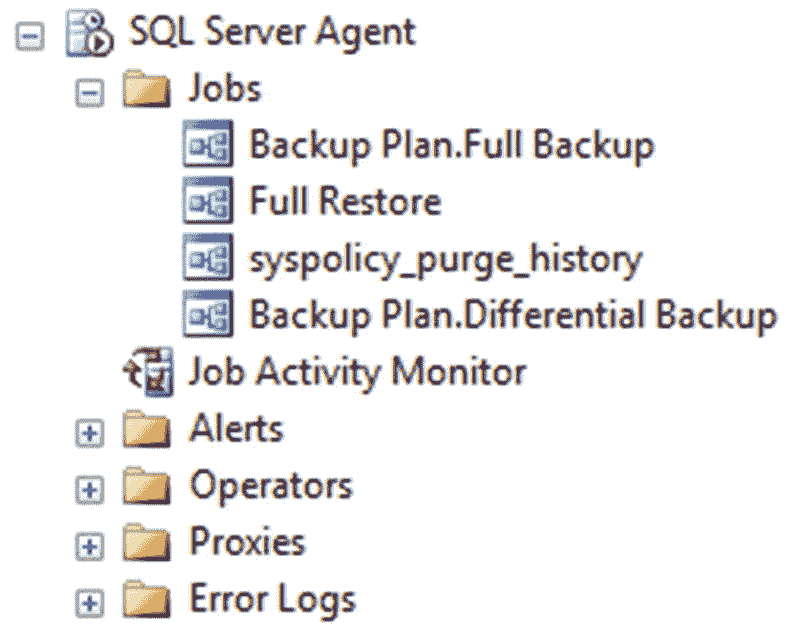

图 10-12：SQL Server Agent，已更新

我们暂时保留给定的名称，但稍后会更改它们。

请注意 `Full Restore` 作业没有改变？这是因为我们是在 `SQL Server Agent` 中专门创建此作业的，而不是从维护计划舞台或界面创建的，因此此界面未参与 `SQL Server Agent` 作业的命名过程。

#### 更新 SQL Server Agent 作业

现在我们可以看到新的 `Differential Backup` 作业，我们需要对其进行配置。我们将遵循作业的 `Full Backup` 部分中的大部分指示，但有一些细微的变化，如下节所述。


##### 常规选项卡

此选项卡无需更改。我们保留了从作业创建的维护计划部分继承的默认设置，因此目前可以直接使用这些设置。图 10-13 显示了带有默认值的“常规”选项卡。

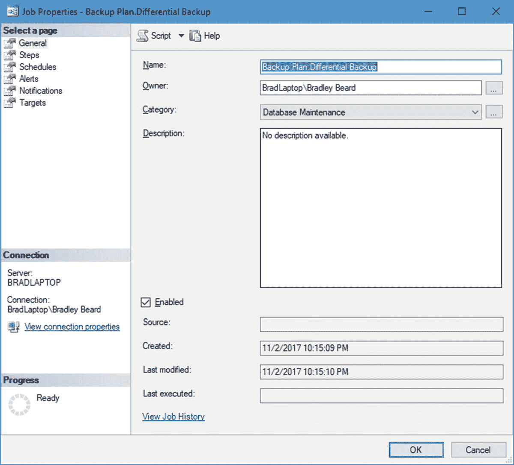
图 10-13 作业属性，常规选项卡

点击左侧的“步骤”菜单选项以继续。

##### 步骤选项卡

“步骤”选项卡的默认设置也很好（图 10-14）。我们可以保持这些设置不变，因为它们正是我们需要的配置方式。请注意，我们目前不会深入探讨该步骤的具体细节。如果您需要关于此步骤可执行的各种选项的更多解释，请参阅第 9 章，我在其中详细介绍了此区域内的每一个选项。

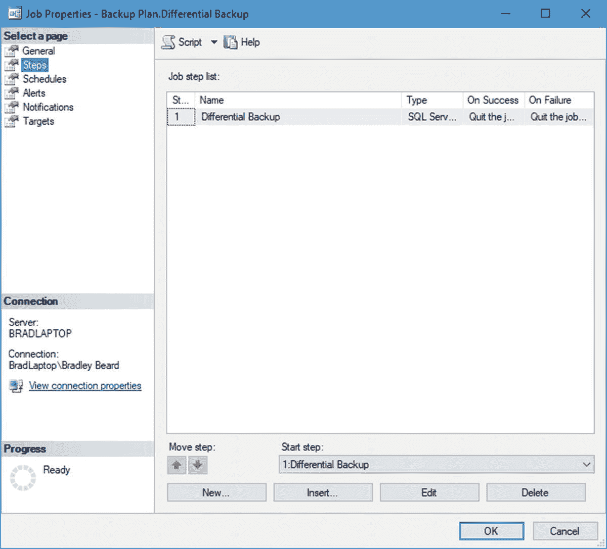
图 10-14 作业属性，步骤选项卡

点击“计划”选项卡以继续。

##### 计划选项卡

此选项卡允许我们为作业设置计划。幸运的是，此区域也已经设置好了！图 10-15 显示了此屏幕的默认设置。

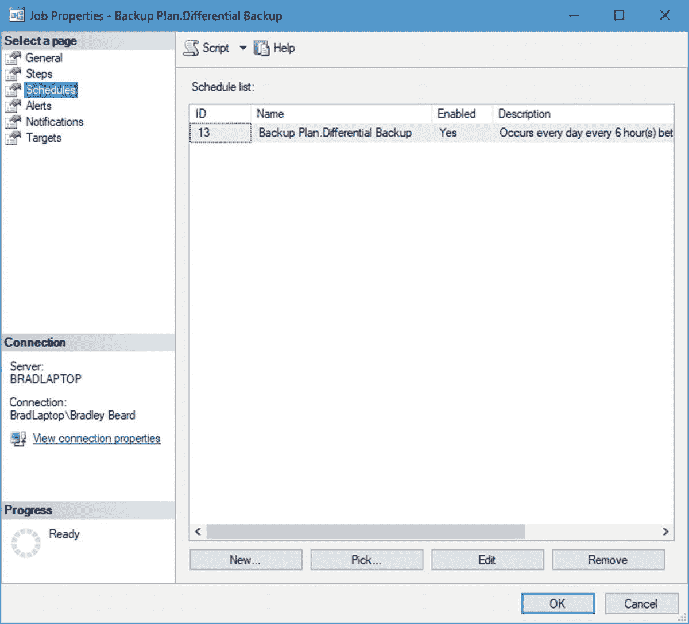
图 10-15 作业属性，计划选项卡

接下来点击“警报”选项卡以检查这些设置。

##### 警报选项卡

此选项卡为空白，因为我们没有为此作业使用任何警报。请直接跳转到下一个“通知”选项卡。

##### 通知选项卡

与完整备份计划类似，我希望如果此计划失败，我能收到电子邮件通知。为了实现这一点，我首先需要设置一个操作员，然后必须在此区域启用并正确配置通知。图 10-16 显示了您所在区域应更新的值。

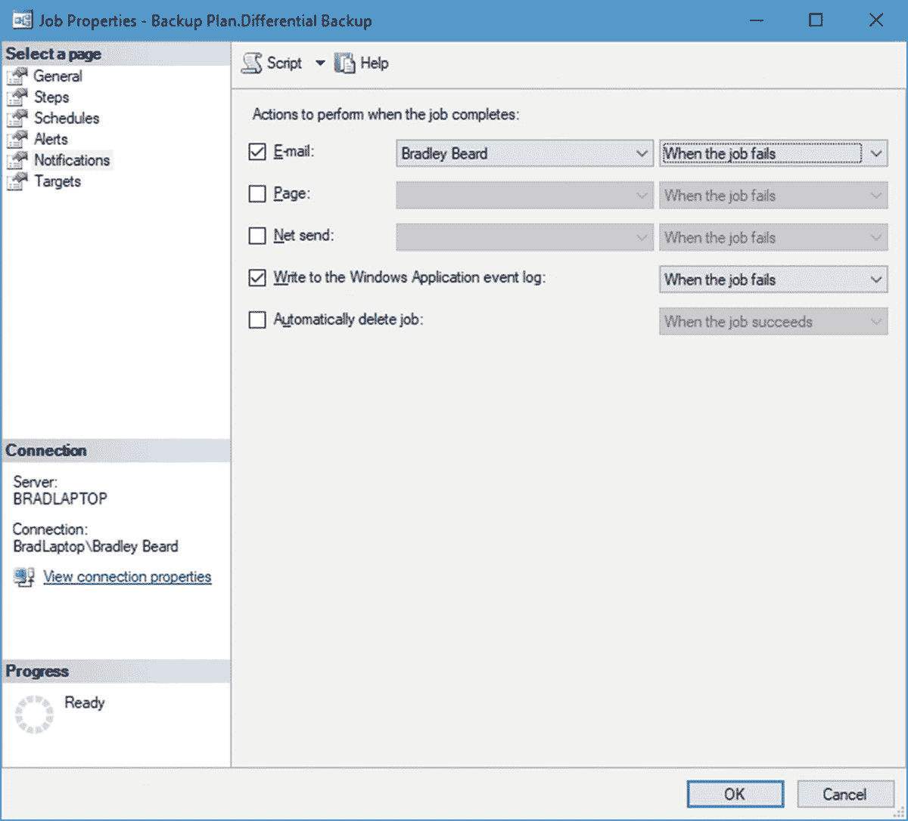
图 10-16 作业属性，通知选项卡

这就是本节的结尾。我们已成功设置了差异备份作业。请继续点击“确定”以进入下一节。

#### 测试差异备份计划

第 9 章让我们创建了完整备份计划，然后进行了测试。如果您跟随操作，您的计划应该也已成功测试。接下来，我们只想运行计划中的差异备份部分，但在开始之前，我们需要确定计划的退出标准。在此示例中，清单 10-2 详细说明了我们将要寻找的退出标准。

清单 10-2. 退出标准
*   作业正确启动且无错误
*   备份文件创建在正确位置
*   如果发生错误，则发送通知
*   Windows 事件日志记录了备份操作
*   作业正确退出且无错误

考虑到这一点，请右键单击 `备份计划.差异备份 SQL Server 代理作业`（记住，我们稍后会更改名称）并选择 `从步骤开始作业…` 来运行作业。您也可以打开文件位置，以验证文件是否按预期写入，并同时打开事件查看器，以便查看 Windows 事件日志中是否添加了新条目。

最终，会出现如图 10-17 所示的窗口，显示我们的作业已成功。

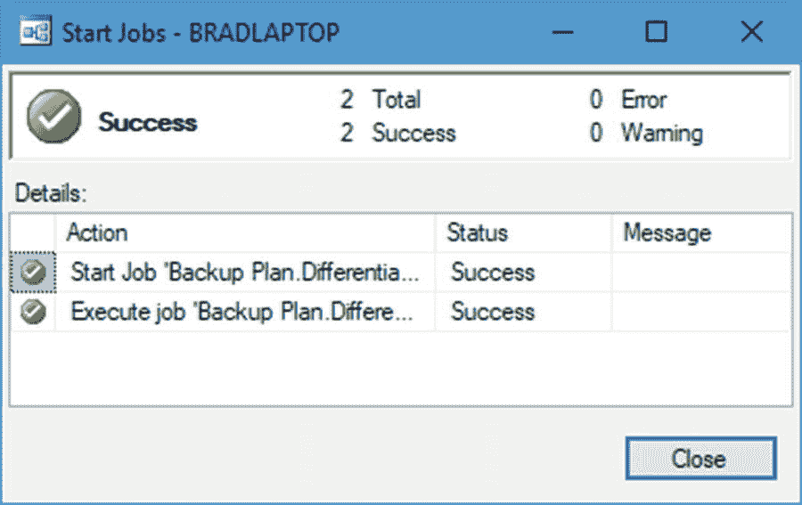
图 10-17 启动作业成功

我还在 Windows 事件查看器的应用程序日志中收到了一个条目，其详细信息如图 10-18 所示。

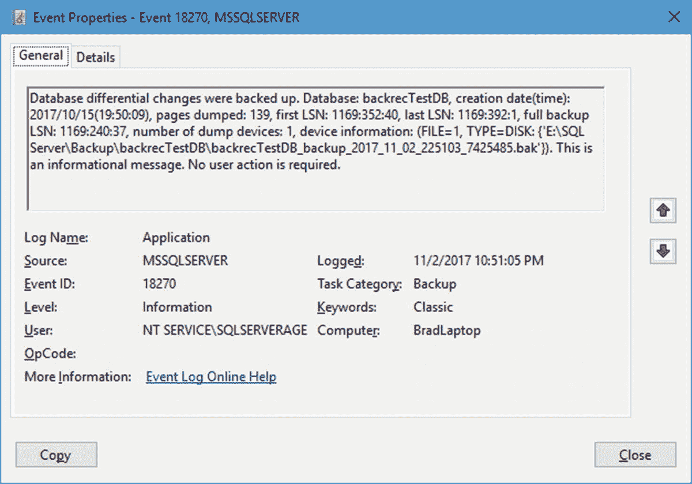
图 10-18 事件属性

我还检查了文件位置，新的差异备份已创建。因此，我们可以安全地认为该计划运行正常。

#### 在 SSMS 中创建差异还原计划

我们将使用 SQL Server Agent 在 SSMS 中创建差异还原计划，就像我们在第 9 章中处理完整还原计划一样。我们将遵循相同的基本指令集，只是在涉及还原类型的地方有所不同。清单 10-3 将详细说明我们需要采取的步骤，以确保我们的差异还原计划正确执行。

我们计划实施此操作的基本结构很简单，如清单 9-12 所示。

清单 10-3. 还原数据的结构
*   配置 `RESTORE DATABASE` 命令
*   创建 T-SQL 类型的 SQL Server Agent 作业
*   创建自上次完整备份以来最新的差异备份副本，并将其重命名为 `backrecTestDB_DIFFERENTIAL.bak`
*   正常还原数据

现在我们有了如何推进的计划，让我们开始创建此计划。

##### T-SQL 还原命令

在此示例中，我们将使用清单 10-4 中所示的 T-SQL 命令。

```sql
RESTORE DATABASE backrecTestDB
FROM DISK = N'E:\SQL Server\Backup\backrecTestDB_FULL.bak'
WITH NORECOVERY, REPLACE;
RESTORE DATABASE backrecTestDB
FROM DISK = N'E:\SQL Server\Backup\backrecTestDB_DIFFERENTIAL.bak'
WITH RECOVERY;
```
清单 10-4 `RESTORE DATABASE` 命令

回想一下，`NORECOVERY` 属性允许我们指定正在还原最后一个完整备份，然后是差异备份。如果不首先还原最近的完整备份，就无法还原差异备份，因此我们需要先运行完整还原，然后再运行差异还原。为此，我们包含了清单 10-4 中所示的完整还原语法以及差异还原语法，以正确还原数据库。请注意，这两条命令由分号分隔；这表示我们将在两个独立的 SQL Server Agent 作业步骤中使用这些命令，如下一节所示。


##### SQL Server 代理恢复作业

在本节中，我们将从创建一个新的 SQL Server 代理作业开始。展开 `SQL Server 代理`，右键单击 `作业`，然后选择 `新建作业…` 以继续。新建作业窗口打开后，请根据图 10-19 所示的值更新窗口。

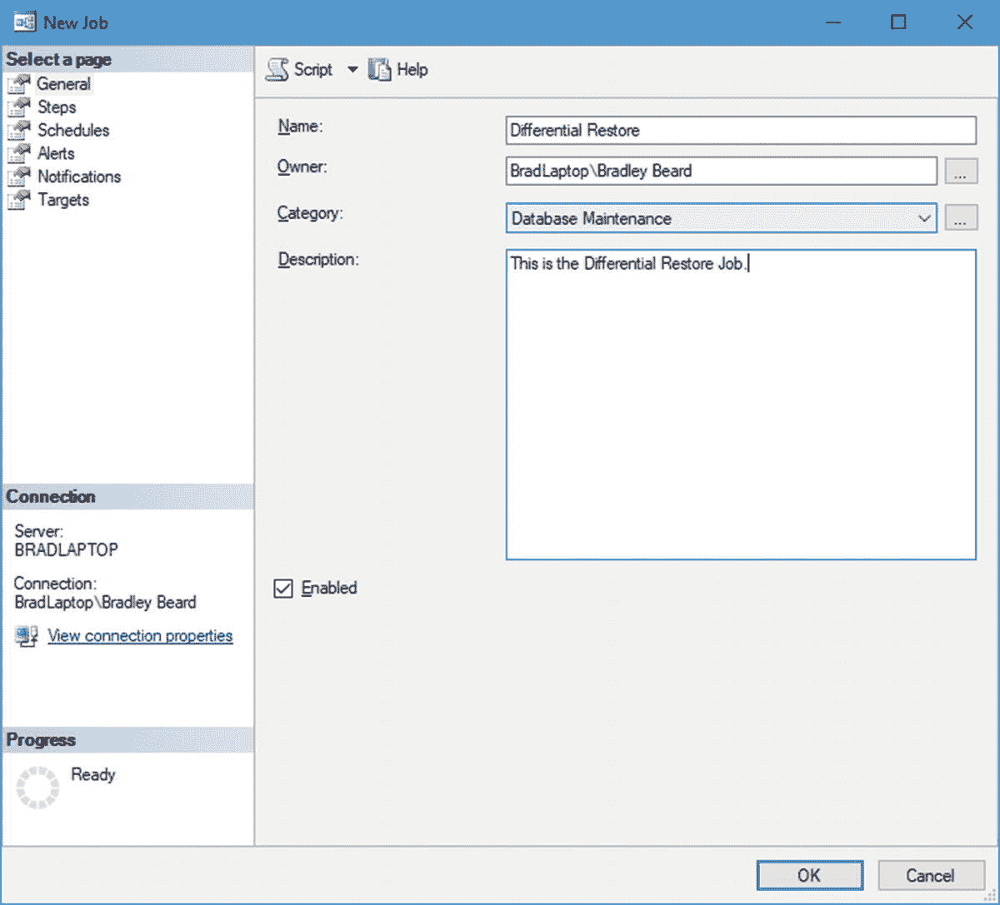

图 10-19：新建作业，常规选项卡

我想重申一下，就所有者这个值而言，你的设置将与我的不同。很可能在很多情况下，你的特定用户账户会与我的不同，因此我给出的指导应概念性地理解，而非字面照搬。这对大多数人来说可能显而易见，但以防有任何混淆，我想在此说明清楚。

接下来，我们要选择 `步骤` 选项卡。在此区域中，我们单击 `新建…` 按钮以打开“新建作业步骤”屏幕，并为作业创建一个新步骤。我们需要创建的第一个步骤是完整还原任务，第二个任务是差异还原。如图 10-20 所示更新“新建作业步骤”屏幕，以创建计划的完整还原部分。

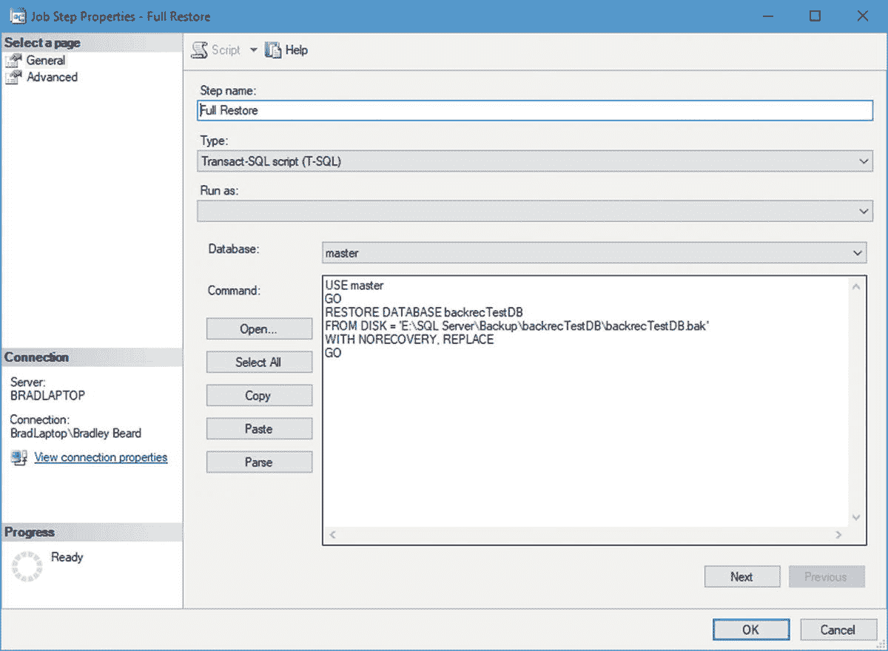

图 10-20：新建作业步骤，常规选项卡

接着，单击 `高级` 选项卡以显示该区域的选项。我们这里只想勾选 `记录到表` 和 `将步骤输出包含在历史记录中` 复选框；其余选项可以保持默认设置。图 10-21 屏幕显示了更新值后应有的样子。

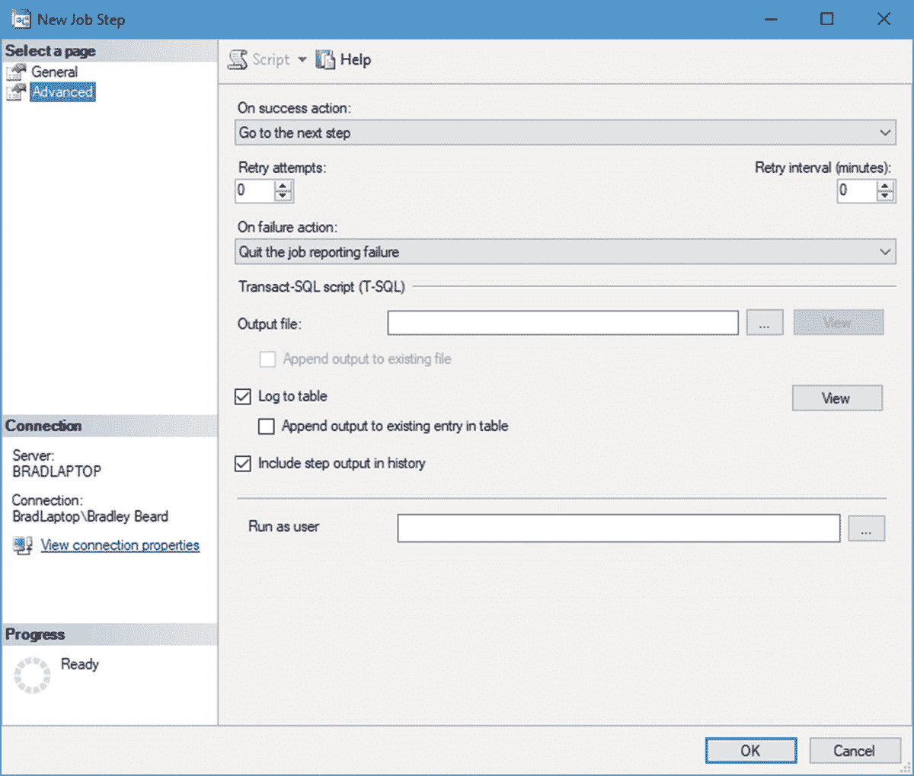

图 10-21：新建作业步骤，高级选项卡

设置好这些值后，单击 `确定` 按钮关闭此窗口并返回到“新建作业”窗口。我们现在可以看到完整还原步骤已列为步骤 1。

我们现在需要创建差异还原步骤，因此再次单击 `新建…` 按钮，打开一个新的“新建作业步骤”窗口实例。在此屏幕上，我们将输入如图 10-22 所示的信息以设置差异步骤。

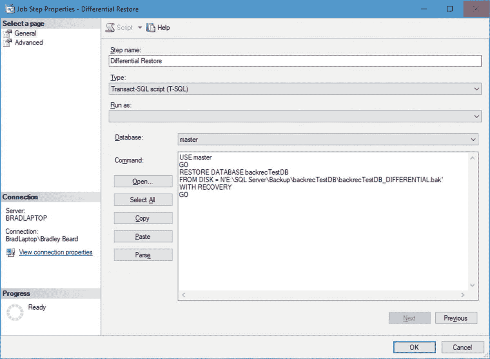

图 10-22：新建作业步骤，常规选项卡

这与我们之前引用的 T-SQL 命令相同，因此我们可以确信它将成功执行。

注意：请注意，对于完整备份步骤，我们使用了 `WITH NORECOVERY` 命令，而对于差异备份步骤，我们使用了 `WITH RECOVERY` 命令。这是因为完整备份步骤之后将立即执行差异备份步骤，我们告诉数据库希望将数据库保持在 `正在还原…` 状态，直到我们还原差异备份步骤，然后在差异备份步骤中使用 `WITH RECOVERY` 命令使数据库重新上线。

现在单击 `高级` 选项卡，并像之前在图 10-21 中那样进行更新。用这些选项更新完高级选项卡后，请单击 `确定` 按钮返回到图 10-23 所示的“新建作业”屏幕。

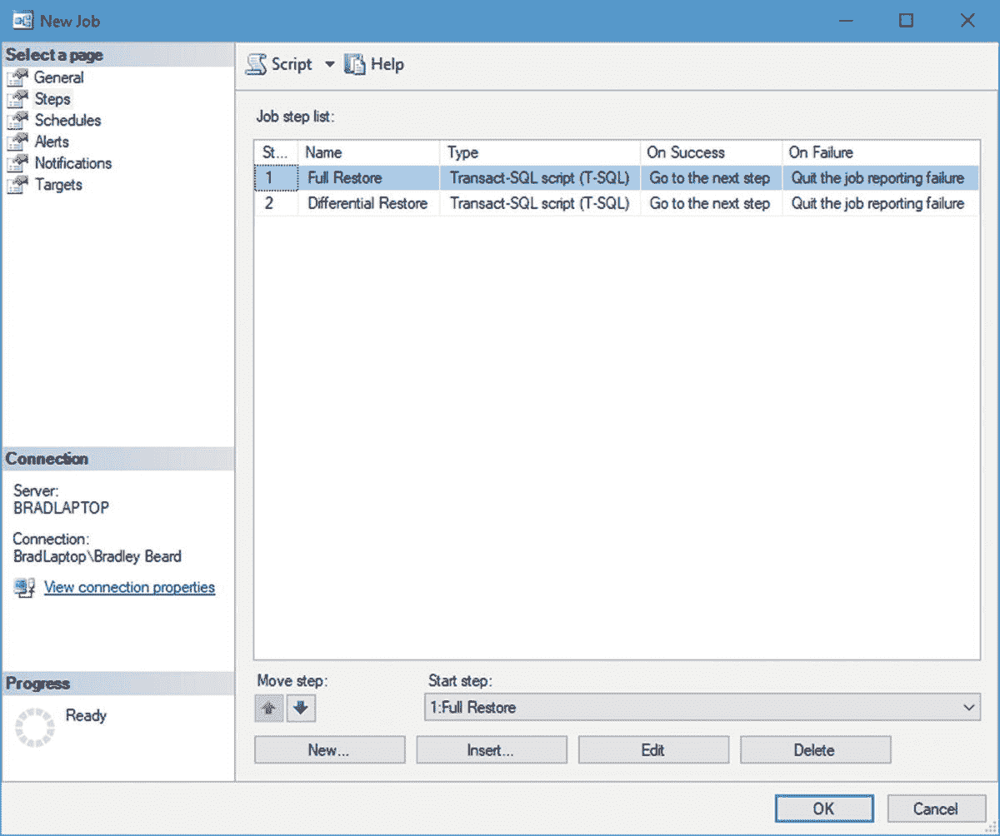

图 10-23：新建作业，已更新

我们现在可以看到，完整还原作业是步骤 1，差异还原是步骤 2。我们还可以看到步骤 1 将在成功时转到步骤 2，这也是我们希望的操作方式。这样，作业就会继续执行，而无需依赖人工干预。毕竟，这些练习的重点是增加 `SQL Server` 内部的自动化，而不是让我们的工作变得更繁琐。

我们不需要访问 `计划` 或 `警报` 选项卡，所以下一步直接跳到 `通知` 选项卡。我们要勾选 `电子邮件` 和 `写入 Windows 应用程序事件日志` 复选框，然后在与 `电子邮件` 复选框相邻的下拉菜单中，选择您应该已设置好的操作员。完成的设置值如图 10-24 所示。

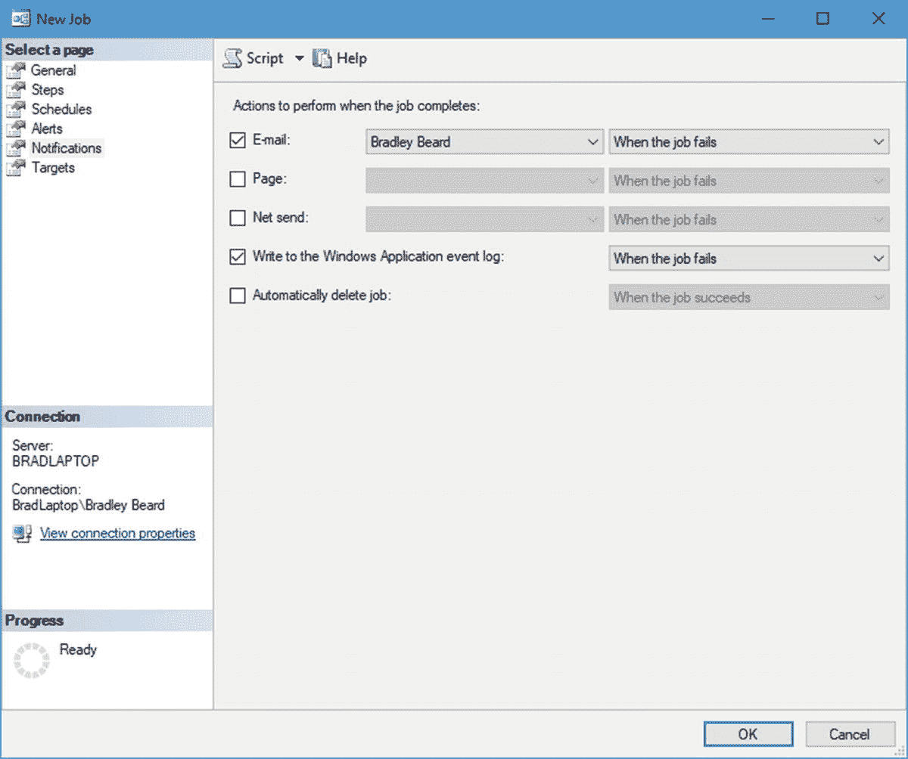

图 10-24：新建作业，通知选项卡

当您的屏幕与图 10-24 所示一致时，只需单击 `确定` 按钮即可返回到 SSMS 主窗口。`SQL Server 代理` 作业已成功创建，对象资源管理器中 `SQL Server 代理` 下的 `作业` 子菜单现已更新，如图 10-25 所示。

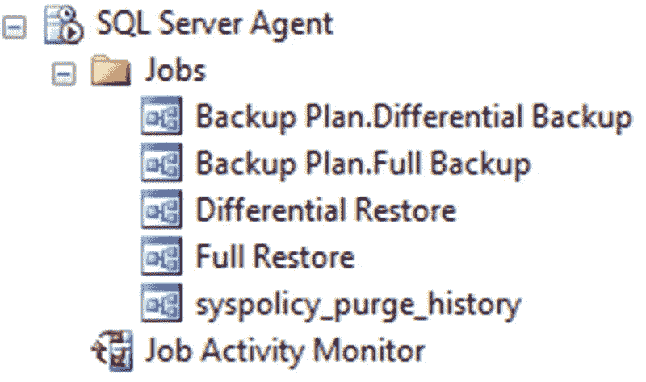

图 10-25：作业子菜单

我们现在准备进入下一节。

##### 复制并重命名当前备份

我的备份位置 `E:\SQL Server\Backup` 已经保持不变好几年了，而且很可能在我停止使用 `SQL Server` 之前都会保持不变。我想原因在于，将备份存储在 `C:` 盘上从来都不是一个好主意，而 `D` 盘通常是 `CD-ROM` 或 `DVD` 驱动器，因此我可用的物理存储是 `E:` 盘。无论你的情况如何，请确保不要将备份存储在启动盘上，这样就没问题了。

导航到你的备份位置，并找到最新的差异备份文件。我们需要复制此文件并将其重命名为 `backrecTestDB_DIFFERENTIAL.bak`。复制并重命名该备份后，我们就可以执行备份并查看它是否有效。

让我们对数据库做一个快速更改，以便有数据可恢复。还记得我们删除了 `users1` 表吗？让我们再做一次。这将为我们提供相当数量的数据用于恢复。请注意，我通常建议使用事务日志还原来恢复这些数据，但我们还没讲到那里，而且就我们需要演示的内容而言，这个方法是可行的。

##### 恢复数据

右键单击 `差异还原` `SQL Server 代理` 作业，然后选择 `从步骤开始作业…` 来执行该作业。此时会弹出一个窗口，如图 10-26 所示。

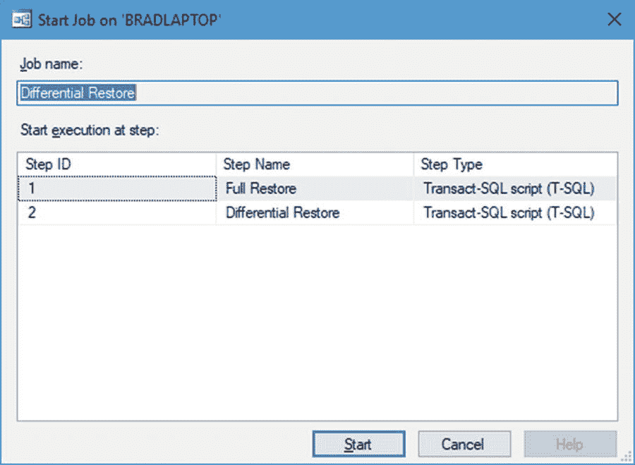

图 10-26：从步骤开始作业…屏幕

选择第一步 `完整还原`，然后单击 `开始` 按钮。最终，我们会看到如图 10-27 所示的成功消息。

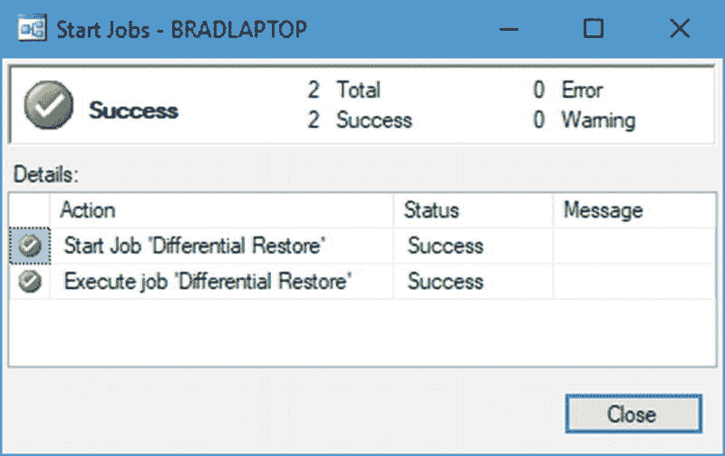

图 10-27：开始作业成功

此时，我们的数据库已应用了完整备份和差异备份。接下来，我们需要验证该计划是否正确恢复了数据，因此运行我们之前运行的“备份和还原事件”报告进行验证。要运行此报告，请右键单击你的数据库，转到 `报告`，然后单击 `备份和还原事件` 项。在那里，你应该看到与图 10-28 非常相似的前两个条目。

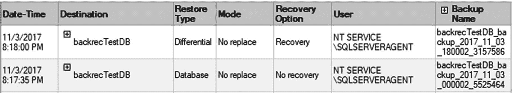

图 10-28：成功的还原操作

这告诉我们，第一个操作是最下面的那个，最后一个操作是最上面的那个。第一个操作是完整还原（我们可以判断，因为它显示模式为“无恢复”），第二个操作是差异还原。

我能判断数据库已正确恢复的另一种方式是，`users1` 表已还原到表列表中。应用程序事件日志也显示了该条目，因此我假设差异还原操作已成功。


#### 摘要

在本章中，我们了解了如何使用 SQL Server Management Studio 备份和还原差异数据的基础知识。我们学习了 `RESTORE DATABASE` 命令的 T-SQL 部分，以及 `WITH NORECOVERY` 和 `WITH RECOVERY` 命令的作用。我们回顾了使用最新的差异备份来还原差异数据的步骤，并学习了如何验证差异还原是否已成功完成。

在下一章中，我们将探讨事务日志备份和还原解决方案，这将增强我们在本书中一直在构建的“备份计划”维护计划。在该章结束时，您将对如何从 SQL Server 备份数据有很好的理解，更重要的是，您将了解如何将该数据还原到 SQL Server，然后验证数据是否已按预期正确还原。

