# 11. 事务日志备份和还原解决方案

在本书的这一部分，我们研究了针对完整和差异类型的完整备份和还原解决方案。我们看到了差异还原类型如何使用完整还原类型作为还原的基础，然后还原到进行差异备份的时间点。在本章中，我们将探讨如何完成单个备份和还原计划的第三部分，即事务日志。

我们分别在第 3 章和第 7 章中研究了事务日志及其工作原理。事务日志的明显目的是记录事务日志，但它们还用于定义事务所在的可量化时间段。换句话说，它不仅仅是一堆杂乱无章的随机数据；它是数据库视角下按时间顺序排列的事件精确记录。这就是我们能够将数据库回滚到特定事务，或者将某个时间段内的所有更改应用到差异或完整还原操作的方式。除非您极其幸运，恰好能够还原到完整或差异备份被还原的确切时间点，否则这种精确度是无法以任何方式实现的。否则，您将仅限于完整或差异还原操作中存储的数据，这无法提供还原到特定时间点所需的精确度。然而，发生这种情况的可能性非常、非常低，因此，我们依赖事务日志来帮助我们非常准确地将重要数据还原到应用程序或我们的 SLA 所要求的点。

在本节之前的章节中，我们基本上是以完整还原或差异还原的形式恢复了一大块数据。曾经有一位讲师告诉我所在的班级，还原方法就像生日蛋糕；有很多层，但实际上只有两个主要部分：绝大部分数据（烤好的蛋糕部分）和数据的细枝末节（糖霜）。换句话说，没有糖霜，您当然也可以有一个很棒的蛋糕，但糖霜非常美味，而且确实能为蛋糕增色。这也许不是最好的类比，但在我脑海中是有道理的，因为我可以想象一个没有糖霜的蛋糕仍然是一个蛋糕，但并不完整；而一个有糖霜的蛋糕……那才叫蛋糕！

作为本章的开始，我们再次需要清楚地了解我们想要完成什么。通常，我们可以在很短的时间内准备好一个备份例程。真正的困难出现在我们必须处理还原事务日志的时候。因此，我们需要以与过去进行完整和差异备份略有不同的方式来进行备份。清单 11-1 展示了我们将要采取的创建事务日志备份的步骤。这是一个简单的过程，特别是因为我们已经在第 3 章中完成了大部分步骤，所以现在我们需要将该章所学内容增强为一个可工作的解决方案，以便与我们的完整备份计划一起使用。回到第 3 章，我们确定希望每小时运行一次事务日志备份，这样我们可能丢失的最大数据量是最小的。当我们还原事务日志时，请记住，我们可以选择备份日志尾部，其中包含最近的事务，因此我们可以使用时间点还原功能还原到故障发生的精确点。


#### 在 SSMS 中添加事务日志备份

我想，读到这里你可能已经开始觉得有些熟悉了。我们将把事务日志备份的部分，添加到我们现有的“备份计划”维护计划中。回顾一下，我们的维护计划中已经有了完整备份和差异备份部分，因此这将是完成整个备份计划所需的最后一块拼图。我在清单 11-1 中概述了一些需要牢记的重要事项。

清单 11-1. 待办事项清单

*   事务日志备份将每小时执行一次，准点运行
*   在差异备份之间，我们最多只能恢复五个事务日志

我将这些事项标记为本节的“待办事项清单”，因为我们需要确保在完成本节之前满足这些目标。

要为维护计划添加事务日志部分，请在对象资源管理器中打开“备份计划”维护计划，使该计划显示在 SQL Server Management Studio 的主界面中，如图 11-1 所示。

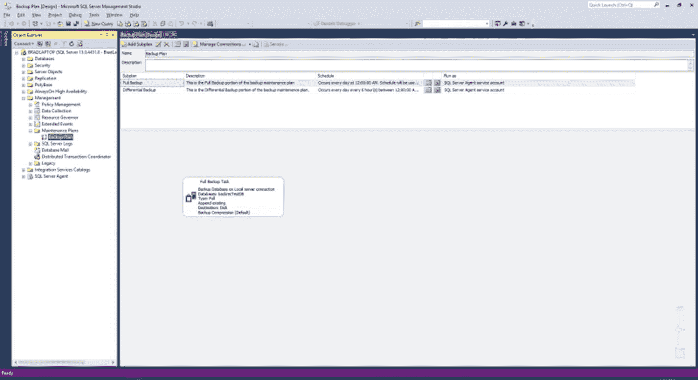
图 11-1：备份计划

接下来，我们需要单击屏幕顶部显示的“添加子计划”按钮。当“子计划属性”窗口出现时，在适用字段中添加以下值：
*   名称：`Transaction log backup`
*   说明：这是备份维护计划的事务日志备份部分。

目前我们不想更改计划或“作为运行”选项，因为我们稍后会处理它们。此时，你应该在“子计划属性”窗口中看到如图 11-2 所示的内容。

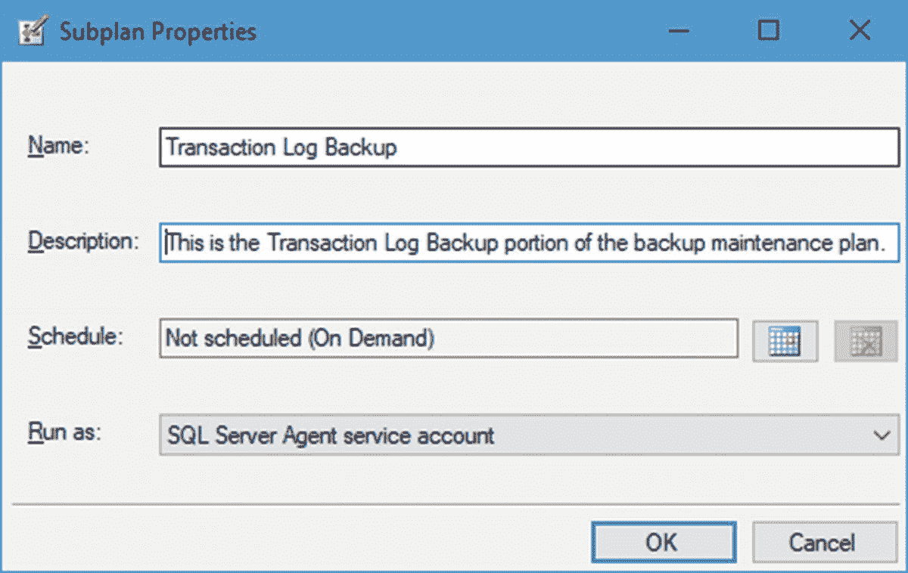
图 11-2：子计划属性

输入此信息后单击“确定”。请注意，主界面会更新，如图 11-3 所示，将事务日志备份添加为新的子计划。另请注意，事务日志备份子计划已被选中，但主界面中还没有任何内容，因为这是维护计划的一个全新部分。

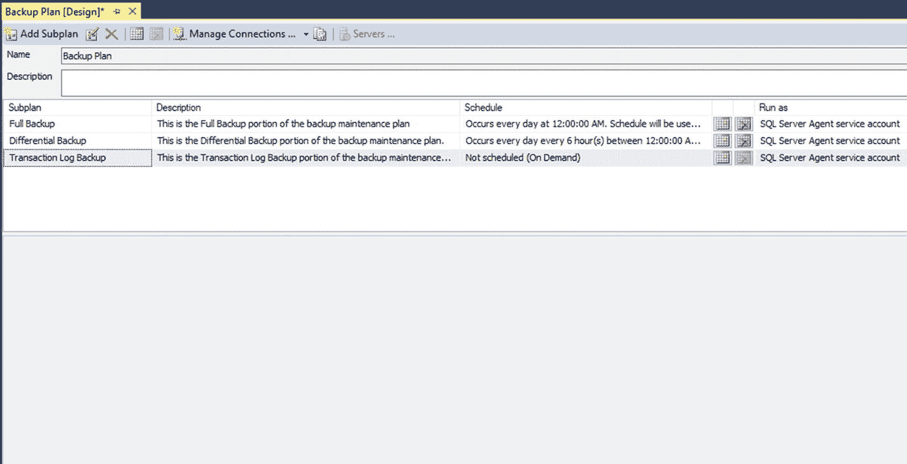
图 11-3：更新后的备份计划

现在我们有了一个可以操作的空白区域，通过单击左侧的浮动菜单或按 `Ctrl+Alt+X` 打开工具箱，然后将一个“备份数据库任务”项拖到主界面。现在我们会看到熟悉的带有红色 X 的界面，如图 11-4 所示，因此双击该任务进行编辑。

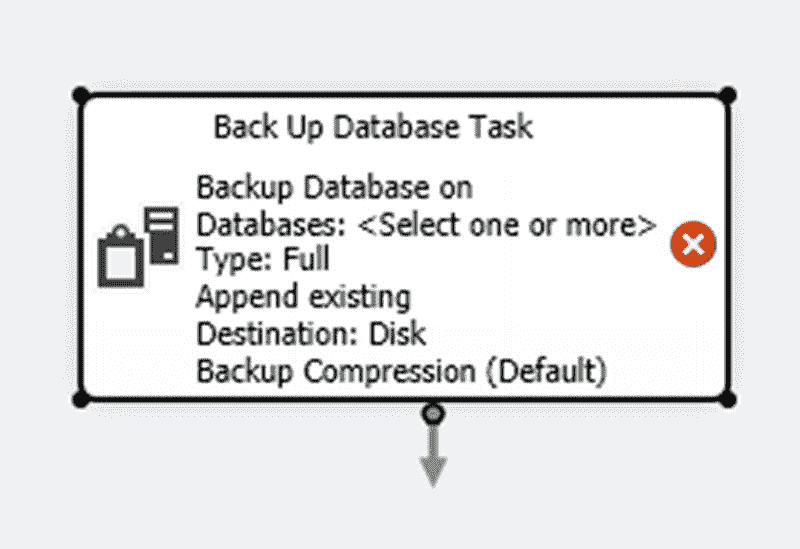
图 11-4：备份数据库任务

一旦“备份数据库任务”窗口打开，你需要在备份类型下拉菜单中选择 `transaction log`。接下来，你需要从“数据库”下拉菜单中选择 `backrecTestDB`（或你的数据库）。你也可以在此区域选择任何其他数据库，但此时我们专门处理我们的数据库。选择所需数据库后，单击“确定”按钮返回主“备份数据库任务”窗口。此选项卡上的最后一个选项“备份到”应保留为默认选项，即 `Disk`。完成的界面如图 11-5 所示。

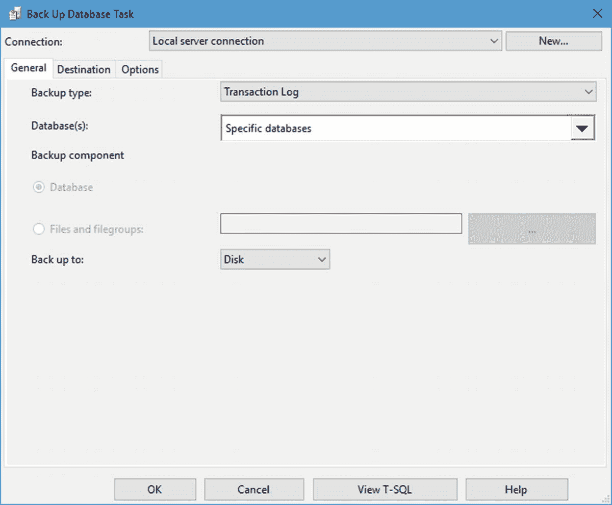
图 11-5：备份数据库任务，“常规”选项卡，已完成

你是否注意到，一旦选择了数据库，“备份组件”选择就变为禁用状态？这是因为你选择了 `transaction log` 选项，因此显然无法选择事务日志以外的备份组件。

在此窗口中选择“目标”选项卡以继续。我们在下一个屏幕上要做的全部操作就是勾选“为每个数据库创建子目录”选项。此选项卡的完成界面如图 11-6 所示。

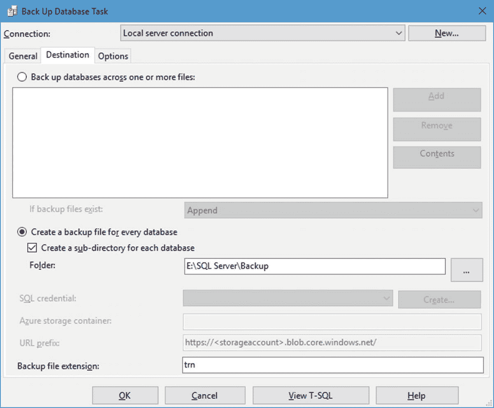
图 11-6：备份数据库任务，“目标”选项卡，已完成

这个简单的选择告诉 SQL Server，我们不希望将事务日志全部放入一个文件夹；相反，我们希望它们按数据库名称分开存放。这将使需要时的恢复和管理更加容易。

接下来选择“选项”选项卡，并回想一下我们要选择的选项如下：
*   `Verify integrity`
*   `Perform checksum`

这些选项将确保我们正在验证备份，并确保将对备份进行错误检查。图 11-7 显示了此选项卡的完成界面。

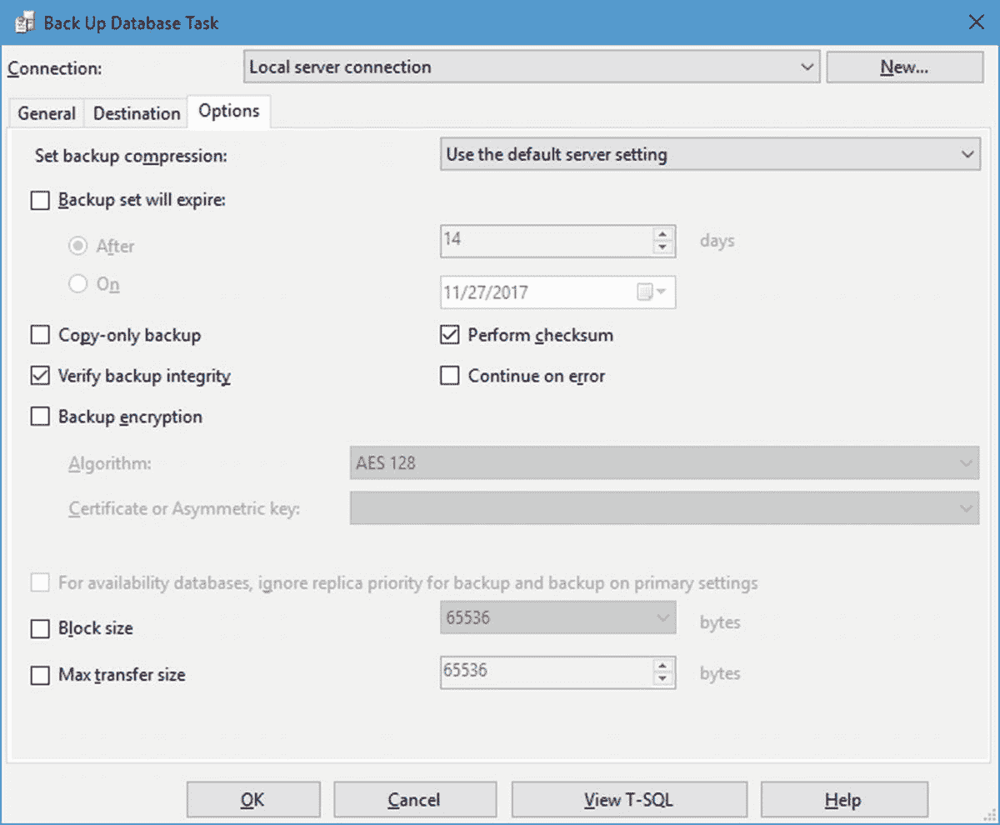
图 11-7：备份数据库任务，“选项”选项卡，已完成

更新此选项卡后，单击“确定”按钮关闭此窗口并返回主界面。请注意，主界面上我们的“备份数据库任务”项中的红色 X 消失了。这表明该任务已消除了基本错误，这些错误在之前红色 X 存在时会阻碍成功启动。

接下来，我们需要设置此任务的计划。

#### 计划事务日志备份

就像我们在第 9 章和第 10 章中设置的先前子计划一样，我们需要单击我们要更新的子计划所在行的日历图标。在本例中，我们将选择事务日志备份子计划上的日历图标。这将打开之前章节中看到的“新建作业计划”窗口。要更新此界面并将备份间隔设置为一小时，请确保你的屏幕与图 11-8 所示的内容匹配。

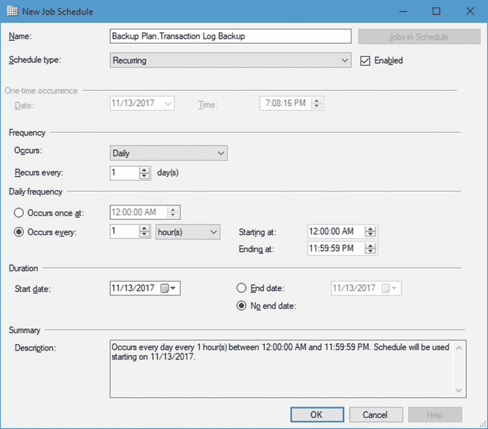
图 11-8：新建作业计划，已完成

为了完成此界面，我在“发生”下拉菜单中选择了“每天”选项，然后选择“发生间隔”单选按钮并保留默认值 `1 hour(s)`。这就是完成此屏幕所需的全部操作。更新此界面后，单击“确定”按钮关闭此窗口并再次返回主界面。图 11-9 显示了我们更新后的维护计划的样子。

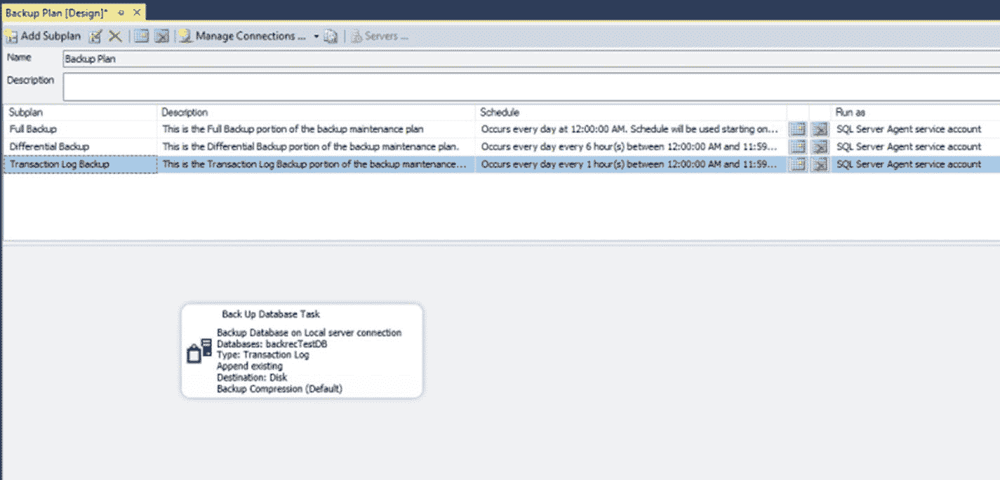
图 11-9：更新后的备份计划

请注意事务日志备份子计划条目中添加的计划信息。这表明我们的计划信息已被维护计划输入并保留。

#### 更新 SQL Server Agent 作业

一旦我们在 SSMS 中完成维护计划主要部分的设置，我们需要在 SQL Server Agent 的“作业”部分中更新一些功能，因此在对象资源管理器中展开 `SQL Server Agent`，然后展开 `Jobs`，再双击 `Backup Plan.Transaction Log Backup`。

##### 常规选项卡

我们从“常规”选项卡开始，因此如图 11-10 所示进行更新。

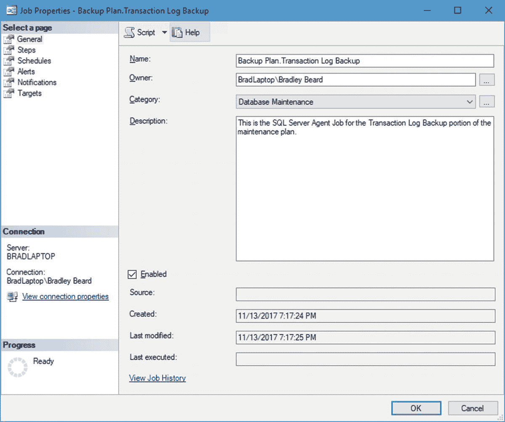
图 11-10：作业属性，“常规”选项卡

我在这里所做的就是更新 `Description` 字段并验证 `Enabled` 复选框已被勾选。这就是我们完成此选项卡所需的全部操作。单击“步骤”选项卡继续。


##### 步骤选项卡

此选项卡在作业步骤列表区域中已经存在事务日志备份作业。不过我们需要更新此作业，因此请双击作业名称，然后单击“高级”选项卡。图 11-11 显示了更新后的“高级”选项卡；请注意，“常规”选项卡是默认界面，但我们无需在此选项卡上更新任何内容。

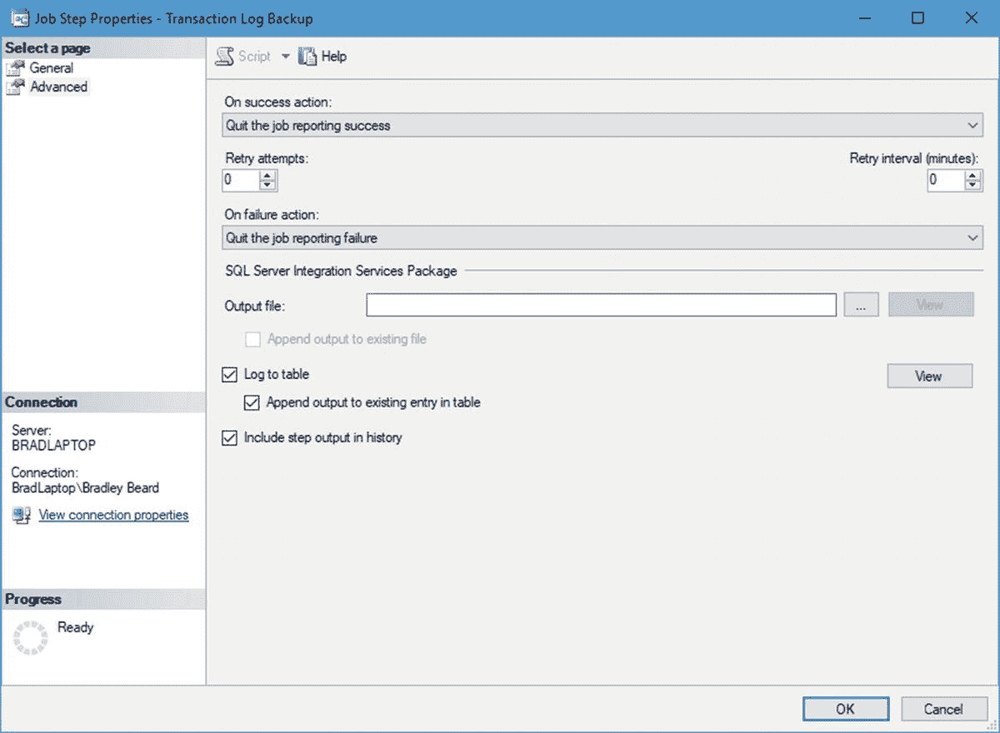

图 11-11

作业步骤属性，高级选项卡

在此选项卡上，我勾选了底部的三个复选框以启用日志记录和历史步骤信息的收集。此屏幕中的其他所有设置保持不变，因此单击“确定”继续。您将最终返回到“步骤”选项卡的默认视图。

由于我们不打算配置“计划”和“警报”选项卡，因此可以跳过它们。接下来，请单击“通知”选项卡继续。

##### 通知选项卡

此选项卡中默认选中的选项是写入 `Windows 应用程序事件日志`。这是一个好的开始，但我们希望在作业失败时通过电子邮件收到通知。为此，请选中“电子邮件”复选框，然后选择操作员（该操作员应已预先设置好）。图 11-12 显示了“通知”选项卡更新后的界面。

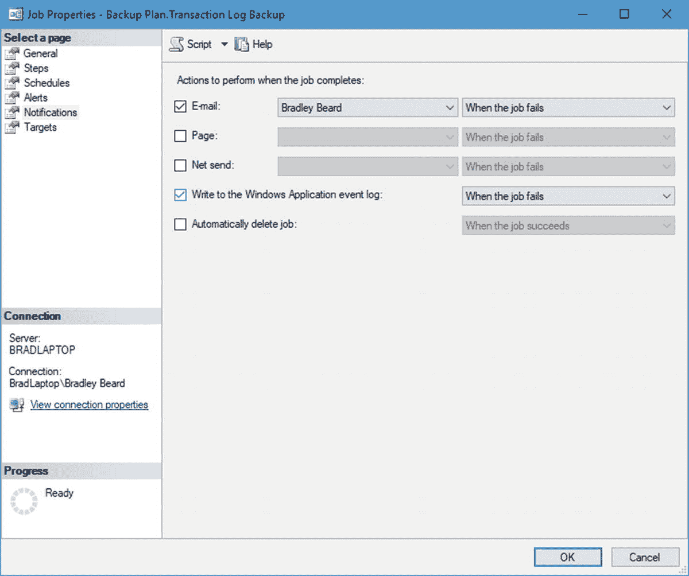

图 11-12

作业属性，通知选项卡

如此设置此选项卡后，如果作业失败，我们将通过电子邮件收到通知，同时信息也会记录到 `Windows 应用程序事件日志`中。这将完成本节配置，因此请继续并按“确定”按钮继续。我们将返回到主舞台，已完成的维护计划就位于此舞台中。现在请将您的工作保存到维护计划中。

#### 测试事务日志备份计划

要测试事务日志备份计划，我们需要右键单击 `Backup Plan.Transaction Log Backup Job`，然后选择 `在步骤启动作业…` 来触发该作业。它的运行时间应该非常短，然后会显示一个类似图 11-13 所示的完成状态窗口。

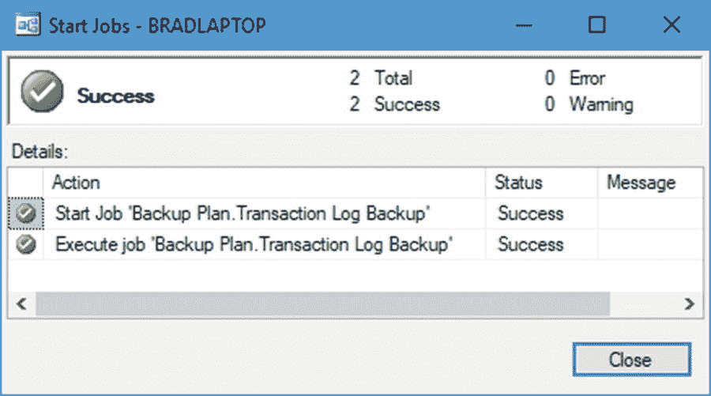

图 11-13

成功启动作业

事务日志中实际上没有太多需要备份的内容，这就是为什么它的运行时间非常短。一旦看到如图 11-13 所示的屏幕，您就可以放心地认为，备份计划维护计划中的事务日志备份部分已经正确配置。通过检查您的备份文件夹（我的是 `E:\SQL Server\Backup\backrecTestDB`）中是否存在 `.trn` 文件来验证备份是否已创建。如果文件位于该位置，那么您就完成了。如果没有，则可能需要返回本章的第一部分，验证您是否将事务日志备份创建到了正确的目录。

#### 在 SSMS 中进行事务日志恢复

我们将在 `SSMS` 中使用 `SQL Server Agent` 来创建事务日志 `还原` 计划，就像我们在第 9 章介绍的完整 `还原` 计划和第 10 章介绍的差异 `还原` 计划一样。不过，对于事务日志还原，我们将遵循稍有不同的操作说明。清单 11-2 将详细说明我们需要采取的步骤，以确保我们的事务日志 `还原` 计划能够正确执行。

清单 11-2. 还原数据的结构

*   创建一个可跟踪的数据轨迹，以便我们知道还原了哪些数据
*   运行 `Backup Plan.Transaction Log Backup` `SQL Server Agent` 作业
*   复制并重命名备份文件
*   配置 `RESTORE DATABASE` 命令
*   还原最近的完整备份
*   还原最近的差异备份
*   按顺序还原事务日志，直至所需的时间点

在此场景中，我们需要先还原完整备份，然后是差异备份，最后按顺序还原事务日志备份。这将使我们能够还原所需的数据，这些数据包含在当前已备份的事务日志中。我们可以使用 `T-SQL` 通过 `RESTORE DATABASE` 命令中的 `STOPAT` 属性来还原到特定时间点。我们将很快介绍此命令的语法。

根据我在本书中一直强调的备份场景，请注意，鉴于我们每六小时执行一次差异备份，每个还原序列最多只需还原五个事务日志。因此，正如我们在清单 11-1 中指出的，当我们像上一节那样实施事务日志备份时，需要确保它们按照前面提到的顺序运行（即每小时整点运行一次事务日志备份）。利用此顺序，我们可以最多还原五个事务日志，而无需转到下一个按时间顺序的完整或差异备份进行还原。

既然我们已经有了如何继续的计划，那么就开始创建这个计划吧。

##### 创建测试数据

我们要做的是对其中一个表进行一些更改，以便查看将数据库还原到某个时间点时会发生什么。为此，我们需要向 `users2` 表中插入一些假数据。清单 11-3 展示了我们将用于实现此目的的 `T-SQL`。

```
INSERT INTO users2
SELECT TOP 1000 * FROM users2
```

清单 11-3 创建测试数据

运行清单 11-3 中的命令时，请密切关注时间，因为我们将在成功添加大量数据之前再运行几次相同的代码。这将确保我们能还原到正确的时间点。

作为参考，运行清单 11-3 中的脚本之前，行数为 10000。运行一次脚本后，行数变为 11000。每次额外运行脚本都会使行数增加 1000 行，因此请确保您留意时间和最终的行数。当我完成记录插入时，我的 `users2` 表中最终有 29000 条记录，比原来的 10000 条有所增加。不过，我只想要 16000 条记录，并且我知道我在晚上 9:22 时拥有这个数量的记录，因此我需要将我的事务日志还原到晚上 9:22。

##### 备份事务日志

接下来，我们需要备份事务日志，以便我们刚刚执行的事务可供我们使用。撰写本文时的时间是晚上 9:30，因此我需要还原晚上 7:00、8:00 和 9:00 的事务日志，以及我们即将创建的那个事务日志。右键单击您的 `Backup Plan.Transaction Log Restore` `SQL Server Agent` 作业，然后选择 `在步骤启动作业…` 来执行该作业。它运行了一秒钟，然后成功完成。完成后单击“关闭”按钮，您将返回到主 `SSMS` 舞台。


#### 复制和重命名备份文件

复制和重命名备份文件的目的在于避免覆盖我们原始的备份数据。说实话，除此之外确实没有其他原因。我希望能尽可能谨慎地处理我的备份，因此我总是会保留原始文件，并在适用时进行复制和重命名。

回想一下，在这种情况下，我的备份目录位于 `E:\SQL Server\Backup\backrecTestDB`。当我导航到该目录时，我可以看到我的备份文件，包括我刚刚备份的事务日志。我想复制我之前记录的日志，并将它们重命名为按时间顺序排列的名称，格式为 `backrecTestDB_1.trn`、`backrecTestDB_2.trn` 和 `backrecTestDB_3.trn`。这三个文件将代表我们需要恢复的三个独立的事务日志。

最终，我复制并重命名了六个文件，如清单 11-4 所示。

清单 11-4. 复制和重命名文件

*   完整备份
    *   `backrecTestDB_FULL.bak`
*   差异备份
    *   `backrecTestDB_DIFF.bak`
*   事务日志备份
    *   `backrecTestDB_1.trn`
    *   `backrecTestDB_2.trn`
    *   `backrecTestDB_3.trn`
    *   `backrecTestDB_922PM.trn`

在 Windows 资源管理器中，我的文件如图 11-14 所示。

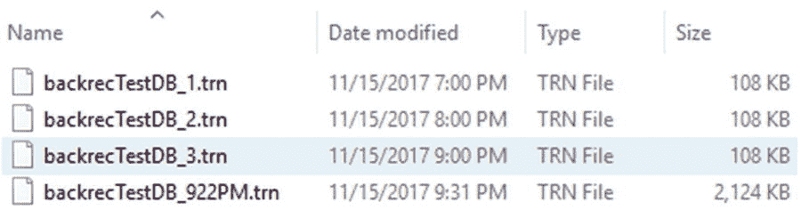

图 11-14

文件的 Windows 列表

注意最后一个事务日志；看到它比其他的要大很多吗？这是我们从清单 11-3 刚刚做的所有更改的日志。接下来，我们将把命令组合在一起来恢复我们的数据。

#### T-SQL 恢复命令

回到第 7 章，我们在清单 7-3 中查看了一个 T-SQL 命令，它允许我们按时间顺序恢复完整备份、差异备份和事务日志备份，直到完成。恢复数据唯一真正棘手的部分是要时刻注意是否需要使用 `WITH RECOVERY` 或 `WITH NORECOVERY`。

那么如何知道何时使用 `WITH RECOVERY` 或 `WITH NORECOVERY` 呢？你首先需要确定你需要恢复什么。

##### 场景 1：完整恢复

例如，如果你正在恢复一个完整的备份，那么你应该使用 `WITH RECOVERY`，因为此命令恢复数据库然后将数据库带出还原状态。

##### 场景 2：完整和差异恢复

如果你正在恢复一个完整备份和一个差异备份，那么你希望在完整恢复时使用 `WITH NORECOVERY`，这会使数据库保持在还原状态并准备好恢复更多数据，然后在差异恢复时使用 `WITH RECOVERY`，这将使数据库脱离还原数据库状态，恢复为常规使用状态。

##### 场景 3：完整、差异和事务日志恢复

这可能是最常见的情况。在这种情况下，你希望在所有的恢复操作上使用 `WITH NORECOVERY`：完整、差异和事务日志。在 T-SQL 脚本的末尾，你可以使用 `RESTORE DATABASE backrecTestDB WITH RECOVERY` 命令行将数据库恢复在线并使其脱离还原状态，或者你可以在最后一个事务日志恢复语句中使用 `WITH RECOVERY`。

清单 11-5 展示了我们将用来从完整备份恢复到差异备份，最后恢复到事务日志的基本 T-SQL 命令。请注意，清单 11-5 中列出的代码与清单 7-3 几乎相同，我们很快将对其进行定制以更好地满足我们的需求。

```
USE master
-- full database restore
RESTORE DATABASE backrecTestDB
FROM DISK = N'E:\SQL Server\Backup\backrecTestDB\backrecTestDB_FULL.bak'
WITH NORECOVERY, REPLACE
-- differential database restore
RESTORE DATABASE backrecTestDB
FROM DISK = N'E:\SQL Server\Backup\backrecTestDB\backrecTestDB_DIFF.bak'
WITH NORECOVERY
-- 7:00PM log restore
RESTORE LOG backrecTestDB
FROM DISK = N'E:\SQL Server\Logs\backrecTestDB\backrecTestDB_1.trn'
WITH NORECOVERY
-- 8:00PM log restore
RESTORE LOG backrecTestDB
FROM DISK = N'E:\SQL Server\Logs\backrecTestDB\backrecTestDB_2.trn'
WITH NORECOVERY
-- 9:00PM log restore
RESTORE LOG backrecTestDB
FROM DISK = N'E:\SQL Server\Logs\backrecTestDB\backrecTestDB_3.trn'
WITH NORECOVERY
-- final log restore
RESTORE LOG backrecTestDB
FROM DISK = N'E:\SQL Server\Logs\backrecTestDB\backrecTestDB_922PM.trn'
WITH RECOVERY,
STOPAT = 'Nov 15, 2017 09:22:00 PM'
```
清单 11-5
初始的 RESTORE 脚本

使用这个脚本，我们重命名了备份目录中的一些文件，然后使用这些重命名的文件成功恢复了数据库。我们在 `RESTORE LOG` 脚本中使用了 `STOPAT` 属性，成功恢复到事务日志中的某个时间点。

在 SSMS 中运行清单 11-5 所示的脚本后，我确实得到了 16000 条记录，正如我所期望的那样。图 11-15 显示了在将数据恢复到晚上 9:22 之前和之后的 users2 表的行数。

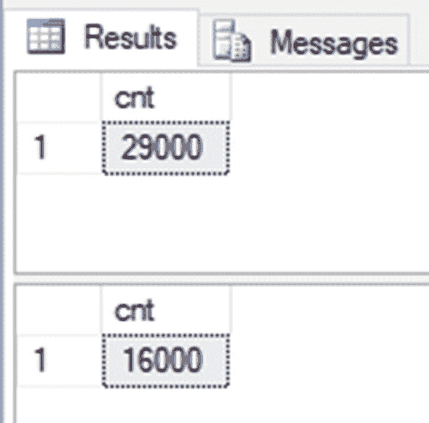

图 11-15

恢复前后的行数

成功！我们现在能够在不使用向导的情况下，通过 SSMS 将数据库恢复到某个时间点。请注意，你可以通过添加相关的 `RESTORE LOG` 命令，并确保 `WITH RECOVERY` 语句仅出现在最后一个恢复语句中，将清单 11-5 中所示的脚本用于任意数量的事务日志恢复（直到下一个差异恢复之前）。


#### 总结

本章为这一节，也为全书画上了句号。我们成功地通过 SQL Server Management Studio 中的 T-SQL 将事务日志恢复到了特定时间点，学习了如何创建测试数据，并了解了 `WITH NORECOVERY` 和 `WITH RECOVERY`。

我真诚地希望您跟随本书一路学来，并在此过程中有所收获。本书所涵盖的内容当然并非 SQL Server 中备份和恢复数据的全部，但我相信，本书为您精通如何制定有效的备份与恢复策略提供了一个极佳的起点。在备份或恢复数据领域，还有许多概念本书未曾涉及；它们固然重要，但我未将其纳入，是因为我认为它们会使我试图阐述的主题变得复杂。我希望将本书做得尽可能易于跟随，并且在这个过程中不想让内容过于深奥，因此，如果内容稍显浅显，我在此致歉。不过，本书中的概念可以关联到开发或生产环境，而且我认为，在介绍更高级的主题之前，牢固掌握备份和恢复数据的基础知识至关重要。我相信，通过阅读本书，您在此主题上的知识已经增长到足以让您舒适地继续阅读一本更高级的书籍，并能轻松跟上进度。

我鼓励您采纳这些示例，并将其应用到您的工作开发环境中，同时专注于利用此处的内容，通过自动化等手段使其变得更加完善。本书中提到了许多优秀的示例，特别是 Ola Hallengren 的维护脚本。本书的第二版将专门用一整章来详细介绍这个脚本，解析其所有独立的部分，因为它确实值得单独讨论；它确实非常出色。

恭喜您读完本书！现在，您可以将所学付诸实践了。我祝愿您，亲爱的读者，在个人和职业生活中一切顺利。

## 索引

A, B, C
- 备份数据库 目标选项卡 差异 任务 选项卡 更新定义 恢复模型 与 恢复脚本 属性 时间线
- `backrecTestDB` 更新 `backrecTestDB`
- 类型

D
- 数据库备份 常规选项卡 手动 备份 事务日志 收缩
- 数据库恢复 说明 恢复脚本 SQL Server Management Studio 状态 验证 T-SQL
- 数据库快照 创建 冻结点 逻辑名称 位置 查询 源 报告 恢复 SQL Server Agent 后续事务
- 数据恢复过程
- 差异备份 添加到备份解决方案 添加 SSMS 配置 目标选项卡 常规选项卡 作业 计划 选项卡 更新 作业计划 定义 依赖关系 作业计划 准备恢复 SSMS 中的计划 场景 计划策略 通过 GUI 在 SSMS 中测试 通过 T-SQL 测试 更新 SQL Server Agent
- 差异基准
- 差异恢复 定义 SSMS T-SQL

E
- 紧急完整恢复 `fixYourMistake` 数据库 恢复步骤

F, G, H
- 完整备份 配置 新建作业计划 选择计划 属性 任务选择 `SeeTask)` 更新计划信息 设计阶段 作业计划 SSMS 中的位置 设计窗口 任务窗口 工具箱 `Subplan` 属性 测试 更新作业计划 更新阶段
- 完整恢复

I
- `INSERT INTO` 语句

J, K, L
- 作业 属性 常规选项卡 通知选项卡 计划选项卡 SQL Server Agent 步骤选项卡

M
- 维护计划 差异备份 `参见差异备份` 完整备份 `参见完整备份` SQL Server Agent 作业 `参见 SQL Server` 事务日志备份 `参见事务日志备份`
- 主数据库恢复

N, O
- 通知选项卡 设置操作员 `subplan_1`

P, Q
- 页恢复
- 时间点恢复 备份时间线 数据库 界面菜单 位置

R
- 恢复模型
- 恢复 备份时间线 数据库 日期和时间 `DROP TABLE users1` 文件和文件组 常规选项 事务日志 选择菜单 操作 灾难性错误 数据库快照 `参见数据库快照` 页恢复 生产环境 时间点恢复 时间线 间隔 值 事务日志 复制并重命名备份文件 测试数据创建 T-SQL 命令
- 在 SSMS 中恢复 复制并重命名 数据库选项 数据库恢复 设备选项 `DTSX` 包 完整恢复 文件选项卡 常规选项卡 24 小时备份计划 标记为 源菜单选项 选项选项卡 恢复操作 验证 代码操作 恢复 `ReportServer` `ReportServerTempDB` 恢复菜单 `RESTORE WITH STANDBY` 恢复数据 SQL Server `参见恢复 SQL Server` 事务日志选项 T-SQL 命令
- 恢复 SQL Server 复制并重命名 事件日志条目 常规选项卡 作业 更新 已恢复数据库 步骤属性 更新 通知选项卡 窗口，常规选项卡 窗口，步骤选项卡

S
- 服务级别协议 (`SLA`)
- SQL Server 高级选项卡 警报选项卡 常规选项卡 作业 位置 作业 子菜单 转为多用户模式 通知选项卡 计划选项卡 单用户模式 说明 服务器连接 `sqlservermanager13.msc` SQL Server (`MSSQLSERVER`) 属性
- SSMS 界面 用户账户控制 步骤选项卡 更新 警报选项卡 常规选项卡 新作业 通知选项卡 计划选项卡 步骤选项卡
- SQL Server 配置管理器
- SQL Server Management Studio (`SSMS`) 添加差异备份 子计划 属性 任务 更新 主阶段 添加事务日志备份 计划 子计划 属性 更新备份计划 备份数据库屏幕 媒体选项 菜单位置 恢复尾日志 事务日志 当前 表 数据库屏幕 数据库选择 展开的 服务器连接菜单项 菜单位置 菜单选择 对象资源管理器，更新 对象窗口，删除 进度 服务器连接 服务器,数据库 任务子菜单 SQL Server (`MSSQLSERVER`) 属性
- 步骤选项卡 高级选项卡 选项 常规选项 `subplan_1`, 高级选项卡 `subplan_1`, 常规选项卡
- 存储区域网络 (`SAN`)
- 系统数据库 备份脚本 恢复脚本 进程终止 `sqlcmd`

T, U, V, W, X, Y, Z
- 尾日志备份
- 任务 备份数据库 常规选项卡 更新 常规选项卡 目标选项卡 常规选项卡 维护选择 选项选项卡 更新 常规选项卡
- 测试 事件属性 退出标准 Windows 事件日志 Windows 事件查看器
- 事务日志备份 在 SSMS 中添加 通过脚本备份 通过 SSMS 备份 备份选项 常规 媒体选项 定义 目标选项卡 文件系统视图 常规选项卡 作业计划 选项选项卡 报告选项 在 SSMS 中恢复 计划 大小 `SQLPERF` 结果 状态 测试 更新计划 更新 SQL Server 向导完成 向导进度
- 事务日志 数据库收缩 数据文件收缩 日志文件收缩
- 事务日志恢复 基础 SSMS `Transact-SQL`
- Transact-SQL (`T-SQL`)
