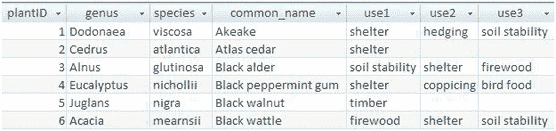
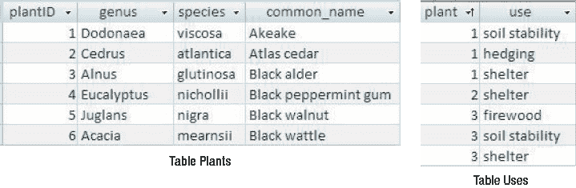
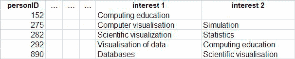
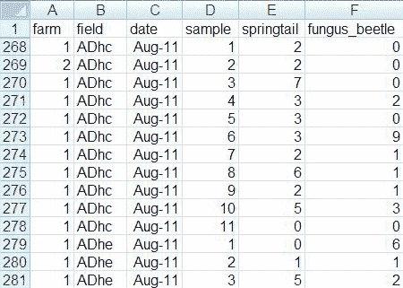
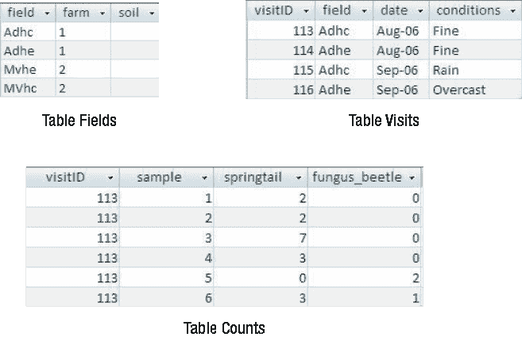

# 第一章

### 可能出错的地方

另一个隐藏成本来自于数据的不准确性。糟糕的数据库设计使得本可避免的不一致性存在于数据中。对类别处理不当可能导致汇总和报告具有误导性，或者坦白地说，是错误的。在大型组织中，每个部门不准确的汇总信息所带来的累积影响可能不会被注意到。

数据库的问题并不一定源于对数据库产品本身缺乏了解（尽管这最终会成为一种限制），而往往是由于在特定表中选择了错误的属性进行分组所致。这主要有两个原因：

1.  创建者对于数据库在中短期内应该提供什么信息没有清晰的想法
2.  创建者对于不同的数据类别及其相互关系没有清晰的模型

本书描述了如何精确理解问题所在，如何为所涉及的数据开发概念模型，以及如何将该模型转化为数据库设计。你将学会设计更好的数据库。你将避免“做错事”的成本。

## 创建数据模型

从对数据库需要能够做什么有一个基本想法，到设计出合适的表，这之间的鸿沟是通过一个清晰的数据模型来架设桥梁的。数据建模涉及为特定问题仔细思考所需的不同数据集或类别。

这里有一个非常简单的教科书例子：一家小企业可能有客户、产品和订单。我们需要记录客户的姓名。这显然属于我们的客户数据集。那么地址呢？现在，这指的是客户的联系地址（在这种情况下它属于客户数据），还是我们运送订单的目的地（在这种情况下它属于订单信息）？折扣率呢？那是属于客户（有些是金卡客户），还是产品（餐具套装目前特价），还是订单（订单超过 400 美元打八折），还是不属于以上任何一种，还是属于以上所有，还是取决于老板的心情？

显然，如果你要为自己或客户提供一个有用的数据库，正确回答这些问题至关重要。在你非常精确地理解“折扣”在当前问题背景下的确切含义之前，在你的电子表格中将一列命名为“折扣”是没有用的。数据模型图表为回答刚刚提出的那些问题提供了非常精确且易于理解的文档。更重要的是，构建数据模型的过程首先引导你提出这些问题。正是这一点，比其他任何东西都更能说明数据建模为何是一个如此有用的工具。

我们将在本书中研究的数据模型都很小。它们可能完整地代表小问题，但更可能是更大问题中的一小部分。重点将是仔细审视少数几个数据类别之间的关系，并确保细节正确。这意味着使用模型的初步尝试来向用户提出问题，发现异常情况（在它们找到你之前），然后对哪些细节对于构建一个有用的数据库是必要的做出一些务实的决定。没有一个好的数据模型，任何数据库几乎在开始之前就注定要失败。

数据模型通常使用某种图表进行可视化表示。图表让你能够一目了然地获取大量信息，使你能够快速把握数据库设计的要点，而不必阅读大量文字。我们将使用来自`UML`的类图符号来表示我们的数据模型，但许多其他符号同样有用。

## 数据库实现

一旦你有了一个支持你的用例的数据模型（以及你在此过程中发现的所有其他细节），你就知道你的问题有多大，以及它将涉及哪种细节。你现在有了一个良好的基础来设计合适的应用程序并进行实施。

从概念上讲，从数据模型到设计数据库或电子表格的转换是简单的。在第 7 章到第 9 章中，我们将探讨如何在关系数据库（如`Microsoft Access`）中设计表和关系，这些表和关系代表了数据模型中的信息。在第 12 章中，我们还将探讨如何在面向对象数据库或语言（例如`JADE`、`Visual Basic`）中完成这项工作，以及对于数据类别不是特别多的问题，如何在诸如`Microsoft Excel`之类的电子表格产品中捕获部分信息。

从数据模型到数据库设计的转换相当直接；然而，实际实施却不那么简单。需要做大量的工作来确保数据库对最终用户来说是方便的。这将意味着设计一个具有清晰逻辑的用户界面、良好的输入设施、快速查找数据进行编辑或删除的能力、适应性强且准确的查询和报告功能、导入和导出数据的能力，以及良好的维护设施，如备份和归档。即使是最小的数据库，也不要低估完成一个有用的应用程序所需的时间和专业知识！诸如用户界面、维护、归档等方面的考虑超出了本书的范围，但在许多关于特定数据库产品的书籍以及关于界面设计的教材中都有很好的介绍。

## 本书目标

即使是一个小问题，正确地建立数据库也可能是一项大工程。本书主要面向初学者或希望建立小型、单用户数据库的人。其中的思想也适用于更大、多用户的项目，但那里会遇到相当多的额外问题。我们不涉及并发（多个用户同时操作）、效率问题或如何管理大型项目等问题。有许多关于软件工程和数据库管理的优秀书籍涉及这些问题。

本书的主要目标是确保刚开始建立数据库的人对底层数据有足够的理解，以便在实际实施上付出的任何努力都能产生令人满意的结果。即使是小问题也比乍看起来更复杂。数据模型将帮助你理解问题的复杂性，从而能够就应该尝试做什么做出一些务实的决定。一旦你有了一个令你满意的数据模型，你就可以确信最终的数据库设计（如果忠实地实施）不会让你失望。可能的情况是，在建模之后，你决定数据库不是合适的解决方案。尽早做出这个决定，总比在付出了数小时的努力投入到一个注定失败的实施之后再决定要好。

本章通过现实生活的例子，来说明当数据存储在设计不佳的电子表格或表格中时，会遇到的一些非常基础的问题类型。这些都是我在自己的设计工作中遇到的真实案例，它们并非出自教科书或试卷。部分数据已被移除或修改，以保护相关责任方的身份。

#### 关键词与类别处理不当

数据库设计中的一个常见问题是未能妥善处理关键词和类别。许多数据库应用涉及的数据都有某种分类方式；产品或事件可能对特定类别的人群有吸引力，而客户也可能按年龄、兴趣或收入（或三者兼有）进行分类。在输入数据时，你通常会想到某个项目及其特定的类别或关键词列表。然而，当你准备报告或进行分析时，可能需要反过来查看数据。你常常希望看到某个类别及其所有项目列表，或项目的数量统计。例如，你可能会问：“我们有多少比例的客户属于高收入群体？”如果关键词和类别最初存储方式不当，生成这类报告就会变得非常困难。

示例 1-1 描述了一个案例，其中关于植物用途的信息以一种乍看合理的方式记录，但最终却妨碍了某些你认为理应能够执行的查询类型。

##### 示例 1-1. 植物数据库

图 1-1 展示了一个记录植物信息的数据库表的片段。开发者决定在记录每种植物的学名和俗名之外，顺便保留其用途信息，以帮助潜在买家判断该植物是否符合他们的需求。

**图 1-1.** 植物数据库

如果我们查找一种植物，可以立即看到它的用途。然而，如果我们想找所有适合做树篱的植物，就会遇到问题。我们需要逐一搜索每个用途列。要生成一份所有树篱植物的报告，需要类似这样的逻辑：“`IF use1 = ‘hedging’ OR use2 = ‘hedging’ OR use3=‘hedging’`”。此外，当前的数据库表设计限制了一种植物最多只能有三个用途。现在这或许足够，但如果这个三用途的限制需要改变，表结构就必须重新设计以添加新的列。所有相关逻辑也需要修改以包含“`OR use4=‘hedging’`”。而且我们心里都明白，无论我们选择多少个用途列，最终总会遇到一种植物需要再多一个用途的情况。精心收集的数据不幸地以一种难以使用和维护的方式保存了下来。

在示例 1-1 中，真正可惜的是，所有数据都经过精心收集和录入，但表的设计却使得回答“哪些植物适合做防风林？”这类问题变得极其困难。这位开发者已经比许多人做得更好，他将用途分到了独立的列中。通常，类似的数据会被存储在单个列中，用逗号或其他标点符号分隔。（例如，一个用途列的条目可能写着：“shelter, hedging, soil stability。”）这种设计比图 1-1 所示的方案更难管理。

问题在于，数据库的设计主要是为了满足用户的即时需求，即：“我需要存储我拥有的关于每种植物的所有信息。”开发者从单一类型或类别的角度思考数据，即`Plant`（植物），并将每种用途视为植物的一个属性，就像其属名或俗名一样。如果你只想知道诸如“这种植物有什么用途？”这类问题的答案，这种设计没问题。但当反过来搜索具有特定用途的植物时，这种方法就不那么有用了。

在示例 1-1 中，我们实际上有两组或两类数据：`Plants`（植物）和`Uses`（用途），我们感兴趣的是它们之间的关联。本书后续章节描述的数据建模技术，是一种实用方法，可以帮助你厘清对数据的期望，并帮助你确定支持这些期望的最佳数据库设计。

稍微提前看一下植物数据库问题的解决方案，你可以通过创建如图 1-2 所示的两个表，快速建立一个有用的关联数据库。（添加一些额外的表会更好，但这将在第 2 章中详细讨论。）

**图 1-2.** 用于表示植物和用途的改进数据库设计

一位具备基本数据库技能的最终用户，就能够设置适当的键、关系和连接，并生成一些有用的报告。对`Uses`表进行一个简单的查询（甚至只是筛选或排序），用户就能找到所有防风植物。现在，一种植物可以拥有的用途数量没有任何限制。与示例 1-1 中描述的单表设计相比，这种分离表设计的初始设置在时间和专业知识上成本稍高，但这些独立的表将能够提供大量额外信息。

示例 1-1 向我们展示了处理类别的一种满意方式。不幸的是，还有其他问题在等着我们。在示例 1-1 中，类别相当明确，但情况并非总是如此。示例 1-2 展示了当类别和关键词不那么容易确定时会出现的问题。

##### 示例 1-2. 研究兴趣

一所大学联络团队的员工经常接到电话，要求与某个特定主题的专家通话。该团队决定建立一个小电子表格来维护每位员工主要研究兴趣的数据。最初，他们只打算为每位员工记录一个主要领域，但学者们的天性使其无法受到如此限制。不确定数量的兴趣问题，通过添加几个额外列来容纳每位员工提供的所有兴趣而得到解决。该电子表格的一部分如图 1-3 所示。

**图 1-3.** 电子表格中的研究兴趣

我们可以一目了然地看到特定人员的研究兴趣，但和示例 1-1 的情况一样，反过来查找对某个特定主题感兴趣的人就变得很麻烦。然而，我们在这里还有一个额外的问题。许多研究兴趣看起来相似，但描述方式不同。要找到一位能够“可视化数据”的研究人员会有多容易？

### 数据类与关系

如示例 1-1 所示，该表的设计仅考虑了一类数据：本例中是 `People`（人员）。但实际上，我们拥有两类数据，`People` 和 `Interests`（兴趣），并且我们关注它们之间的连接或关系。在这种情况下，一个类似于示例 1-1 的解决方案也会有用得多。

创建人员表相对简单直接，但兴趣表则带来了一些问题。在示例 1-1 中，各种可能的用途相当明确（如防风、遮蔽等）。但在示例 1-2 中，不同的研究兴趣有哪些呢？答案并不那么显而易见。快速浏览显示的数据可以看到八种兴趣，但我们有理由假设 `visualisation` 和 `visualization` 只是同一主题的不同拼写。但是 `scientific visualisation` 和 `visualisation of data` 呢——在问题背景下，这些是相同的吗？`computer visualisation` 又如何呢？任何有其中一项兴趣的员工，对于外界关于如何可视化某些数据的咨询，都可能是合适人选。

在决定采用两类数据——`People` 和 `Interests`——之后，我们现在需要明确定义它们的含义。`People` 并不太难——你可能需要考虑哪些员工将被纳入，以及是否也应包括研究生。然而，`Interests` 则更困难。在当前示例中，兴趣是任何员工可能想到的东西。如此模糊的定义会给我们带来一系列问题，尤其是在对特定兴趣进行任何报告或分析时。一种解决方案是预先确定一组广泛的主题，并让人们从中选择适用的选项。但这项任务远非易事。人们会因为自己热衷的主题未能原样包含而感到不满，并且可能花费数小时（甚至数月）试图就一个完整的列表达成一致。而这个列表很可能包含一系列层级化的类别和子类别。图书馆和期刊投入了大量的精力和专业知识来设计并维护此类列表。也许这样的列表对示例 1-2 中的问题有用，但同样也可能没用。

预见到这些困难后，你可能会认为这种努力仍然是值得的，或者你可能会重新考虑并选择不同的解决方案。在后一种情况下，联络团队直接尝试找出最可能的人选，让真实的人来梳理所需内容，可能反而更容易。就在起草本章之前的三个月内，我看到了三种不同的尝试，试图建立电子表格或数据库来记录研究兴趣。每次，人们都花费数小时收集和存储数据，然后创建者开始遇到我刚才描述的问题。目前，没有一个数据库按预期被维护或使用。

### 重复信息

另一个常见问题是不必要地将同一信息存储多次。这种冗余通常是数据库设计反映某种输入表单的结果。例如，在一个小企业中，每张订单表单可能记录客户的姓名、地址和电话号码等关联信息。如果我们设计一个反映此类表单的表，那么每次下订单时都会记录客户的姓名、地址和电话号码。这不可避免地导致不一致和问题，尤其是当客户从一个地址搬迁到另一个地址时。我们可能想发送广告目录，但不确定应该使用哪个地址。有时，重复的信息并不那么明显。示例 1-3 说明了一种这样的情况。

##### 示例 1-3. 昆虫数据¹

一个长期环境项目的团队成员定期访问农场并采集样本，以确定特定昆虫物种的数量。农场的每块田地都被赋予了一个唯一的代码，每次访问田地时，都会采集一些代表性样本。记录每个样本中每种昆虫的数量。

图 1-4 显示了部分数据在电子表格中的记录方式。

`图 1-4.` 电子表格中的昆虫数据

每个农场的信息被（相当正确地）记录在其他地方，从而避免了该数据的重复。然而，仍然存在问题。字段 `ADhc` 位于 `农场 1` 这一事实每次访问都被记录，很快在第 269 行就能发现第一个数据录入错误。（用于田地的编码带来了其他问题，我们暂不讨论。）

表面上看，图 1-4 中将字段 `ADhc` 列在 `农场 2` 而非 `农场 1` 下的错误似乎没什么大不了——但它是可以避免的。农场信息被记录在此电子表格中这一事实意味着数据很可能需要按农场进行分析，而现在 `农场 1` 和 `农场 2` 的任何结果都可能不准确。而且在项目的整个生命周期中，还会有多少其他数据录入错误呢？考虑到示例 1-3 中的结果来自一个精心设计的长期实验，并将用于统计分析，如此容易预防的错误竟能混入其中，似乎令人遗憾。

重要的是区分数据输入错误（任何人都可能偶尔打错字）和设计错误。示例 1-3 中的问题不在于字段 `ADhc` 被错误地关联到 `农场 2`（这是一个可以轻松修复的简单错误），而在于 `农场` 与 `田地` 之间的关联被记录了如此多次，以至于最终出现错误几乎成为必然。而且，这类错误可能非常难以检测。

示例 1-3 的电子表格中还有另一项信息也被重复了：访问日期。字段 `ADhc` 在 `8 月 11 日` 被访问这一信息在第 268 至 278 行重复出现，制造了另一个可避免错误的来源（例如，我们可能不小心在第 273 行填入 `8 月 10 日`）。这样的错误会影响任何基于 `日期` 的分析。

示例 1-3 中重复的访问日期信息还引发了另一个更严重的问题：如何处理与某次特定访问相关的杂项信息（例如，当时正在下雨——如果你在数昆虫，这点相当重要）？是只放在一行中（导致难以找到所有受影响的样本），还是放在该次访问的每一行（操作麻烦且加剧了重复信息问题）？事实上，本例中的天气信息被单独记录在一个文本文档中，从而无法利用软件的功能来协助任何天气分析。

## 后续章节将更详细描述的**技术**本可避免`示例 1-3`中遇到的问题。设计师本不应将数据视为`每个样本中的计数`来思考，而应将`农场`、`田地`、`访察`和`昆虫`视为研究人员感兴趣且可独立或关联研究的独立数据类别。例如，研究人员可能希望查找有关特定土壤类型的田地或在良好天气条件下进行的访察的信息。`图 1-5`展示了将田地和访察信息分离到不同表格中，不仅减少了重复信息的问题，还能轻松添加更多数据（如田地的土壤类型、访察的天气条件）。`计数`表仍然存在与`示例 1-1`和`1-2`中表格相同的问题，但这个问题可以解决。我们将在`第 4 章`回到这个例子。

`图 1-5`. 针对昆虫问题改进后的数据库设计

#### 为单一报告而设计

有问题的数据库的另一个成因是，设计表格以匹配特定报告的需求。一家小企业可能心中已有一份发票所需的格式。学校秘书可能想看到教师在工作周的去向。从某一份特定报告倒推设计，可能导致数据库存在许多缺陷。`示例 1-4`是我特别喜欢的一个例子，因为我第一次因为修复数据库而获得真正的报酬，正是因为这个问题（显然，自那以后，学生记录软件已经进步了很多！）。

`示例 1-4.` 学业成绩

一个大学院系需要将其最终学年的成绩整理成适合带到考官会议上的格式。该课程规定非常严格，所有学生都完成相同的科目，在系统计算机化之前，会手工生成类似`图 1-6`所示的报告。这种格式便于比较每个学生在各科目上的表现，有助于确定荣誉学位的分数线。

`图 1-6`. 学生成绩所需的报告格式

数据库表格被设计成完全匹配`图 1-6`中的报告，每一列对应一个字段。第一年数据库运行良好。第二年问题开始出现。你能预见吗？

一些学生被允许用自己选择的科目替换其中一门试卷。表格被修改，加入了选项名称和选项分数列。接着，一些科目被替换，但过去的科目必须为那些曾经选过的学生保留。表格变得混乱，但尚能应对数据。

该设计无法处理的是那些挂科后重新注册某科目的学生。一个学生的完整学业记录需要被记录下来，而表格的设计使得无法记录一个学生多次完成同一科目时的多个分数。这个问题直到运行的第二年（当第一批学生开始挂科时）才被注意到。那时，已经投入了相当多的开发工作和数据录入努力。一个有些奇怪的解决方案是，为每一年创建一个新表格，然后应用一些迂回的逻辑从相应的表格中提取学生的分数。当最初的开发者离职后，多年的数据处于一种无人能理解的状况。这就是我如何得到我的第一份数据库工作（并且这个数据库应对了多年中不断变化的需求）。

`示例 1-4`特别能说明糟糕的设计会带来多大的麻烦。开发者从所需报告的角度看到了问题。他只从一个类来思考：`学生`。实际上，至少存在两个类，`学生`和`科目`，我们感兴趣的是它们之间的关系。特别是，我们想知道某个特定学生在某个特定科目上获得了什么分数。`第 4 章`将展示，如何通过对诸如`科目`与`学生`之间的**多对多关系**进行探究，从而引入另一个类，`注册记录`。这允许为同一科目的不同尝试记录不同的分数。采用这种方法，关于如何处理学生挂科的疏忽就会被发现，从而避免整个糟糕的局面。

### 总结

关于如何设计数据库的最初想法，可能会受到特定报告或特定输入方法的影响。有时，驱动数据库创建的仅仅是因为手头有一些有价值的信息需要“找个地方存放”。匆忙创建数据库或电子表格可能导致设计无法应对即使是简单的信息检索变化。重要的是仔细思考底层数据，并设计数据库以反映所存储的信息，而不是短期内你可能想对数据做什么。

### 测试你的理解

##### 练习 1-1

一所学校正为学生计划一些户外活动。教职员工希望创建一个关于家长如何提供帮助的数据库。秘书建立了`图 1-7`中的数据库表格来保存信息。

`图 1-7.`. 记录家长贡献的初始数据库表

在充分利用这些信息方面，你能预见哪些问题？
请建议一些更好的存储这些信息的方式。

##### 练习 1-2

一个小型图书馆保存着每天谁在服务台值班的名单。他们有一个数据库表，如`图 1-8`所示。

`图 1-8.`. 记录值班任务的初始数据库表

在充分利用这些信息方面，你能预见哪些问题？
请建议一些更好的存储这些信息的方式。

