# 第二章

## 开发过程导览

建立一个小型数据库的决定通常源于手头有某个具体任务：一位科学家可能有一些需要妥善保管的实验结果；一家小企业可能希望为客户开具发票和月度账单；一个体育俱乐部可能想要跟踪球队和会员缴费情况。

重要的事情是不要仅仅专注于手头的直接任务，而要尝试理解将要支持该任务*以及其他可能任务*的数据。这有时被称为 `数据独立性`。一般来说，你为某个问题保留的基本数据项（姓名、金额、日期）在很长一段时间内变化会非常小。数据值当然会不断变化，但我们记录姓名、金额和日期值这一事实本身不会变。而你用这些数据做的事情则可能经常变化。设计一个反映数据类型本身、而非你当前认为的主要用途的数据库，从长远来看会更有利。

例如，一家小企业可能想要向其客户发送账单和结算单。与其思考结算单及其包含什么，重要的是思考底层的数据项。在这个案例中，这些数据项是客户及其交易记录。结算单只是某个特定客户在一段时间内交易的一个报告。长远来看，结算单的格式可能会改变，例如，加入账龄分析或利息费用。然而，底层的交易数据将是相同的。如果数据库被设计为反映基本数据（客户和交易），它将能够随着需求的变化而演进。数据的类型将保持不变，但报告可以改变。我们可能也会改变数据输入的方式（交易可能通过网页或电子邮件输入），并且我们可能会发现数据的其他用途（客户数据可能用于邮件群发以及开具发票）。

为数据库项目找到一个好的解决方案，需要对问题进行一定的抽象，以便各种可能性变得清晰。在本章中，我们将快速浏览如何从最初的问题陈述，通过一个抽象模型，到（希望是）有用的应用程序的最终实现来处理这个过程。图 2-1 中的图表是思考这个过程的一种有用方式。

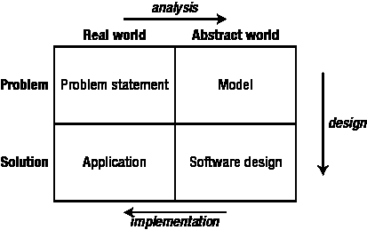

**图 2-1.** 软件过程（基于 Zelkowitz 等人，1979¹）

以图 2-1 作为思考软件过程的方式，我们现在将通过把这些步骤应用到示例 1-1“植物数据库”中，来看看各个步骤如何与建立一个数据库项目相关联。

### 初始问题陈述

我们从对问题的初步描述开始。描述问题的一种方式是使用 `用例`，它是 `统一建模语言`（`UML`）² 的一部分，这是一组用于描绘软件过程各个方面的图示技术。用例是不同类型的用户（更正式地称为 `参与者`）如何与系统交互的描述。大多数系统分析的教科书都包含对用例的讨论。（Alistair Cockburn 的书《编写有效用例》³ 是一本特别易读且务实的论述。）用例可以存在于许多不同的层级，从高层的公司目标到底层的小程序模块描述。我们将专注于坐在台式计算机前的人试图执行的任务。对于一个数据库项目，这些任务很可能是输入或更新数据，以及基于这些数据提取信息。

UML 的用例表示法涉及：用小人图形代表（在我们这里）用户类型，用椭圆形代表用户需要能够执行的每项任务。例如，图 2-2 展示了一个用例，其中用户执行三个目前未知的任务。然而，仅凭这些小人和椭圆并不足以描述与系统的特定交互。在编写用例时，除了图表，你还应该创建一个文本文档，更详细地描述该用例所涉及的内容。

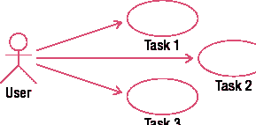

**图 2-2.** 用例的 UML 表示法⁴

让我们看看如何将用例应用到上一章示例 1-1 的问题上。图 2-3 回顾了我们最初建立的一个记录植物及其用途的初始数据库表。

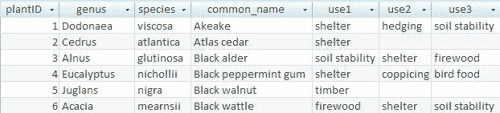

**图 2-3.** 植物及其用途的原始数据

如果我们考虑典型用户可能想对图 2-3 中展示的数据做什么，那么示例 2-1 中建议的用例将是一个起点。

##### 示例 2-1. 植物数据库的初始用例

图 2-4 展示了植物数据库的一些初始用例。图后的文字描述了每个用例。

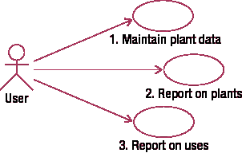

**图 2-4.** 植物数据库用例的首次尝试

**用例 1:** 输入（或编辑）我们拥有的关于每种植物的所有数据；即，植物 ID、属、种、俗名和用途。

**用例 2:** 查找或报告关于一种植物（或每种植物）的信息，并查看它有什么用途。

**用例 3:** 指定一个用途并找到合适的植物（或报告所有用途）。

如前一章所述，如果数据像图 2-3 那样存储，我们就无法方便地满足示例 2-1 中所有用例的要求。通过查看表中的每一行，可以很容易地获得关于每种植物的信息（用例 2）。然而，要找到所有满足特定用途的植物则极其麻烦。尝试找出所有适合当柴火的植物。你必须检查每一行中的每个用途列。

### 分析与简单数据模型

现在我们已经有了一个初步的方向，我们需要进行一些抽象，并形成一个关于问题实质的模型。在图 2-1 的语境下，我们正在图表顶部横向移动。

#### 数据建模入门：使用 UML 类图

一种实际的方法是通过勾勒一个初始数据模型来感受数据涉及的内容，该模型代表不同类型数据之间的交互方式。UML 提供的类图是表示此类信息的实用方法。虽然有许多产品可以维护类图，但对于早期的小型模型，用铅笔和纸进行草图绘制就足够了。本书的大部分内容都在探讨数据建模的复杂性，接下来的章节将快速概述相关定义和符号。

#### 类与对象

每个`class`可以被视为存储关于一组相似事物（地点、事件或人）的数据的模板。让我们参考示例 2-1 中关于植物及其用途的描述。我们的第一个类的一个明显候选者是`Plant`这个概念。每株植物都可以用类似的方式描述，因为每株都有属（`genus`）、种（`species`）、通用名（`common_name`），或许还有一个植物 ID 号（`plantID`）。我们将为每株植物保存的这些信息片段被称为该类的`attributes`（或`properties`）。图 2-5 展示了类及其属性的 UML 表示法。类的名称出现在顶部面板，中间面板包含属性。对于某些类型的软件系统，可能存在一个类需要负责执行的流程。例如，一个与在线购物车相关的`Order`类可能有一个计算含税价格的流程。这些被称为`methods`，并出现在底部面板中。对于以信息为主的问题，在设计的早期阶段，方法通常不是主要考虑因素，我们现在将忽略它们。

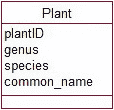

**图 2-5.** 类的 UML 表示法

我们想要保存数据的每株植物都将符合图 2-5 中的模板；也就是说，每株植物都将（或可以）为其属性`plantID`、`genus`、`species`和`common_name`拥有自己的值。每株单独的植物被称为`Plant`类的一个`object`。`Plant`类和一些对象在图 2-6 中描绘。

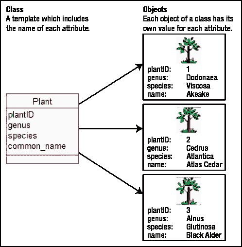

**图 2-6.** 一个类及其部分对象

`Plant`类可以包含其他属性，例如典型高度、寿命等。那么植物的用途呢？在图 2-3 的数据库表中，这些用途被作为植物的几个属性（`use1`、`use2`等）包含在内。在示例 1-1 中，我们看到将用途存储为几个属性导致了一些问题。我们这里遇到的是另一个类的候选者：`Use`。在第 5 章中，我们将更详细地讨论如何判断是否需要类或属性来保存信息。我们的新类`Use`不会有太多属性，可能只有`name`。`Use`类的每个对象都将有一个`name`值，例如“hedging”、“shelter”或“bird food”。对于我们这个例子，特别有趣的是`Use`和`Plant`类之间的`relationship`。

#### 关系

一个特定的植物对象可以有多种用途。例如，我们可以从图 2-3 中看到，Akeake 可用于土壤稳定、树篱和防护。我们可以将此视为`Plant`类的特定对象与`Use`类对象之间的关系（或关联）。这种关系的一些具体实例如图 2-7 所示。

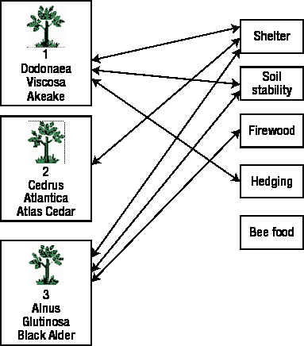

**图 2-7.** `Plant`与`Use`之间关系的一些实例

在数据库中，我们通常会为每个类创建一个表，关于每个对象的信息将作为该表中的一行记录，如图 2-8 所示。关于特定关系实例的信息也会记录在一个表中。对于关系型数据库，你会期望找到像图 2-8 中的表来表示图 2-7 中所示的植物和关系实例。我们将在第 7 章进一步探讨如何以及为何设计这样的表。现在，你只需要确信它包含了适当的信息。

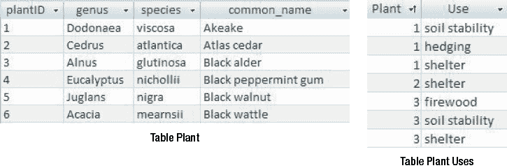

**图 2-8.** 在数据库表中表达的`Plant`对象以及`Plants`与`Uses`之间关系的实例

在 UML 中，关系由两个类矩形之间的线表示，如图 2-9 所示。可以为线命名以明确关系是什么（例如，“can be used for”），但如果上下文明显，也不必命名。线两端的数字表示一个类的多少个对象可以与另一个类的特定对象相关联。第一个数字是最小数量。这通常是 0 或 1，因此有时被称为`optionality`（即，它指示是否必须有一个相关对象）。第二个数字是相关对象的最大数量。它通常是 1 或多个（用`n`表示），尽管其他数字也是可能的。总的来说，这些数字可以称为关系的`cardinality`或`multiplicity`。

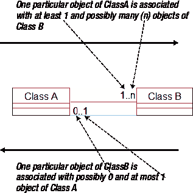

**图 2-9.** 一个表示为 UML 类图的数据模型

关系是双向解读的。图 2-9 显示了右侧类的多少个对象可以与左侧类的一个特定对象相关联，反之亦然。当我们想知道有多少个`ClassB`的对象与`ClassA`相关联时，我们查看最靠近`ClassB`的数字。

通过研究关系的基数可以了解到很多关于数据的信息，我们将在第 4 章进一步探讨基数问题。本章重点介绍类图的表示法以及这些图可以告诉你关于不同类之间关系的哪些信息。图 2-10 展示了一些关系，它们可能与你在第 1 章中看到的某些示例的小部分相关联。

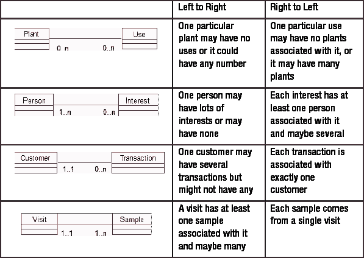

**图 2-10.** 不同基数关系的示例

图 2-10 是一致的，因为右侧列中的短语准确地描述了图表。但每个图表是否适用于特定问题则完全是另一个问题。例如，在图 2-10 的第一行中，为什么我们会想要一个没有任何植物与之关联的用途？正是像这样的问题帮助我们理解问题的复杂性，我们将在第 4 章讨论这些问题。目前，问题尚未充分定义，无法知道图 2-10 中的图表是否准确，但它们是合理的初步尝试。

### 进一步分析：重新审视用例

使用类图的表示法，我们可以初步尝试绘制一个数据模型图来表示我们的植物示例。我们有一个用于植物和用途的类，它们之间的关系看起来像图 2-11。

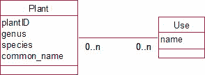

**图 2-11.** 植物示例数据模型的首次尝试

现在，我们需要检查这个模型是否能够满足 图 2-4 中三个用例的要求：

**用例 1：** 维护植物信息。我们可以为每棵植物创建对象，并记录我们现在或将来可能需要的属性。我们可以创建用途对象，并且可以在特定的植物和用途对象之间指定关系实例。

**用例 2：** 报告植物信息。我们可以获取一个特定的植物对象（或依次获取每一个），并找出其属性的值。然后，我们可以找到所有与该植物对象相关的用途对象。

**用例 3：** 报告用途信息。我们可以获取一个特定的用途对象，并找出所有与之相关的植物对象。

到目前为止还不错。但让我们再仔细看看。用例 1 实际上是两个，甚至可能是三个独立的任务。如果我们考虑数据库在实际中如何运作，很可能不同的用途（`hedging`、`shelter` 等）会在项目一开始就被输入，并且会不时更新。输入用途信息是一项用户可能希望独立于任何特定植物信息执行的任务。在稍后的某个时间，同一个用户或其他人可能希望输入一棵植物的详细信息，并将其与已记录的用途关联起来。

这些都是关于任何与输入相关的用例时需要考虑的重要问题。在实践中将如何完成？会涉及不同的人吗？数据的不同部分会在不同的时间输入吗？回答这些问题是分析的第一部分，在这里我们必须深入了解用户的想法，以发现他们实际做什么。（永远不要依赖他们会告诉你。）

 **提示** 对于数据输入或编辑，将由不同人员执行或在不同时间完成的任务分离到它们自己的用例中。

现在，让我们看看用例 2，我们想要报告植物信息。通过更深入地探究用户设想如何报告植物信息，我们可以发现更多问题。思考以下对话：

*你*：您希望能够打印出您所有植物的列表，放在文件夹里或发送给别人吗？

*用户*：那会很好。

*你*：您希望植物按什么顺序列出？

*用户*：按它们的属，我猜。按字母顺序？

*你*：属？所以您希望，例如，所有的 `Eucalyptus` 植物列在一起。

*用户*：是的，那会很好。

在对话的这一点上，我们看到了问题的另一个层面。（如果你已经想到了我即将描述的问题，请给自己加分。）如果我们仔细查看原始表格中的数据，我们可以看到每个属似乎包含多个物种，而每个物种又可以有多种用途。另一个问题可以确认我们对属与物种之间关系的理解是否正确。

*你*：所以每个物种只属于一个属？对吗？

*用户*：没错。

我们可以看到，在最初的问题陈述中，询问关于报告用例的问题是了解更多问题的另一个绝佳方式。

 **提示** 对于数据检索或报告任务，询问有关哪些属性可能用于排序、分组或选择数据的问题。这些属性可能是额外类别的候选。

我们现在意识到，需要在我们的数据模型中添加一个新的类别，`Genus`（属）。为什么包含这个新类别很重要？嗯，如果 `genus` 只是作为我们原始 `Plant`（植物）类别的一个简单属性，我们几乎可以为每个对象输入任何值。两个 `genus` 为 `Eucalyptus` 的对象最终可能会有拼写差异（如果是我输入数据，几乎肯定会这样）。每当我们想要查找、计数或报告所有 `Eucalyptus` 植物时，这都会导致问题。我们的用户提到按 `genus` 分组会有用，这一事实意味着正确存储 `genus` 数据非常重要。我们在 图 2-12 中修订的数据模型展示了如何表示 `genus` 以使数据保持准确。

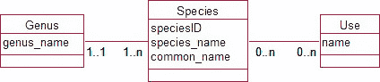

**图 2-12.** 针对我们植物问题的修订数据模型

我们现在有了一组 `genus` 对象，每个 `plant` 必须与其中恰好一个相关联。你会在 图 2-12 中看到，我们还将 `Plant` 类别重命名为 `Species`（物种），因为我们存储信息的对象是物种或植物类型，而不是实际的物理植株。这为我们未来扩展模型以保存关于实际植株的信息（例如，每棵植株是何时种植的、何时修剪的等等）开辟了道路。

输入每个 `genus` 的值可能与输入每个 `species` 的数据是分开的工作，因此它应该有自己的用例。我们不希望也不需要每次输入一个新的 `species` 时都为 `Eucalyptus` 属输入一个新对象。

示例 2-2 展示了修订后的用例。看看报告用例现在如何能够根据数据模型更精确地定义。

##### 示例 2-2. 植物数据库的修订用例

图 2-13 展示了植物问题的修订用例。图后的文字描述了每个用例。

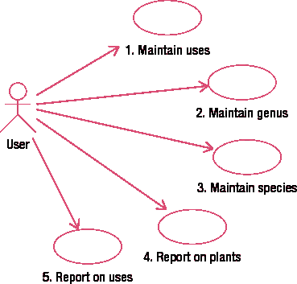

**图 2-13.** 植物问题的修订用例

**用例 1：** 维护用途。创建或更新一个 `use` 对象。输入（或更新）名称。

**用例 2：** 维护属。创建或更新一个 `genus` 对象。输入名称。

**用例 3：** 维护物种。创建一个 `species` 对象。生成一个唯一的 ID，并输入物种名和俗名。将新的 `species` 对象与一个现有的 `genus` 对象关联，并可以选择将其与任意数量的现有 `uses` 关联。

**用例 4：** 报告植物信息。对于每个 `genus` 对象，写出其名称并找出所有关联的 `species` 对象。对于每个 `species` 对象，写出物种名和俗名。找出所有关联的 `uses` 并写出它们的名称。

**用例 5：** 报告用途信息。对于每个 `use` 对象，写出其名称。找出所有关联的 `species` 对象，并为每个 `species` 写出其关联的 `genus` 名称以及物种名和俗名。

我们在这里所做的是，从一些初始用例出发，探索了细节（例如，您希望报告中植物按什么顺序排列？）。这引导我们更新了类图。然后我们研究了新的类图如何处理我们需要执行的任务。这是一个迭代过程，并且构成了问题分析的主要部分。经过几次迭代，我们将更清楚地了解用户想要什么，以及他们使用的许多术语是什么意思。

### 设计

#### 数据库设计与实现

经过几轮对用例和类图的评估，我们应该得到了一个初始的数据模型以及一套详细展示我们如何满足用户需求的用例。下一步是考虑什么类型的软件适合实现该项目。对于一个数据库项目，我们可以选择使用关系数据库产品（例如 `MySQL` 或 `Microsoft Access`）、编程语言（例如 `Visual Basic` 或 `Java`），或者对于小型问题，电子表格（如 `Microsoft Excel`）可能就足够了。

以下是在关系数据库中进行设计的简要概述。我们将在第 7 章到第 9 章中更详细地考虑细节，因此如果您没有完全理解这里的推理，请不要惊慌。对于那些已经了解一些数据库设计的读者，请原谅这里的简化。

##### 关系数据库设计概述

从广义上讲，每个类将由一个数据库表表示。由于每个物种可以有多种用途，反之亦然，我们需要一个额外的表来表示这种关系。这对于两端基数都大于 1 的关系（称为多对多关系）通常是这种情况。（关于这些额外表的更多信息将在第 7 章中介绍。）这些表在`Microsoft Access`中的样子如图 2-14 所示。三个表对应于图 2-12 中的类，而额外的表`PlantUse`为我们提供了一个存放植物物种与用途之间关系的地方（见图 2-7 和图 2-8）。类之间的其他关系可以通过在四个表之间设置参照完整性在数据库中表示（更多关于此的内容在第 7 章）。

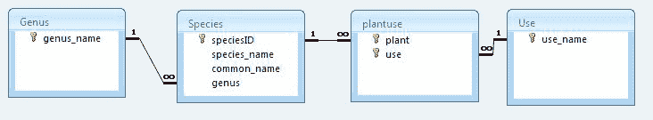

图 2-14. 在 `Microsoft Access` 中表示类和关系

对于那些了解一些数据库设计的读者，我们在`Species`表中包含了一个属性`speciesID`，这是一个对每个物种唯一的数字。这种拥有一个属性（或可能是一个属性组合）来唯一标识每个对象的概念很重要，我们将在第 8 章中进一步探讨。在关系数据库中，这些唯一标识符被称为*键字段*，它们在图 2-14 中用一个小钥匙图标表示。（我们本可以在`Use`和`Genus`表中也添加一个额外的`ID`字段，但由于名称是唯一的，我们选择不这样做。）我们还引入了一些额外的属性来帮助建立表之间的关系。对于`Species`表，我们包含了一个属性`genus`，并要求其值必须来自`Genus`表中的一个条目。（这个新属性在技术术语中被称为*外键*，而要求它匹配`Genus`表中现有值的规则被称为*参照完整性*——更多内容在第 7 章。）`Genus`表和`Species`表之间的线表明`Species`表中的`genus`字段是一个外键，因此其值必须存在于`Genus`表中。这种设计意味着我们永远不必担心*桉树属*的不同拼写方式。类似地，我们在`PlantUse`表中包含了外键属性`use`和`plant`。

##### 实现

我们不会深入探讨如何在任何特定程序中实现数据库的复杂性，但从一般意义上了解分析将引导我们走向何方是有用的。图 2-12 中的数据模型可以在关系数据库产品（如`MySQL`或`Microsoft Access`）中非常准确地表示出来，如图 2-14 所示。实现的第一步是根据设计建立这些表和表示关系的外键，然后输入一些数据。图 2-15 显示了根据图 2-14 的设计建立的关系数据库表中将要包含的一些数据。

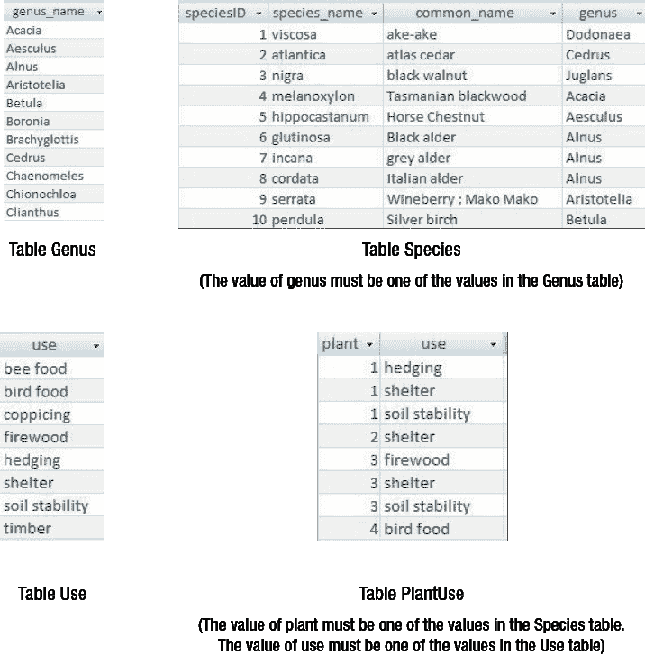

图 2-15. 植物数据库表中的示例数据

我们现在已经实现了我们的设计，但仍然需要提供便捷的方式来维护和检索数据。这意味着我们必须提供表单和报告，以高效地满足我们修订后的用例集中的需求。

##### 用于输入用例的界面

我们需要为我们的植物系统用户提供一种友好的方式来输入他们的数据。维护属和用途数据的用例很容易处理。我们可以通常通过表单或网页等界面直接将数据输入到相应的表中。维护物种信息的用例则稍微复杂一些。我们需要更新两个表：`Species`（存放每个物种的数据）和`PlantUse`（因为我们需要指定每个物种与哪些用途相关联）。一些数据库工具有实用程序来方便同时向两个表输入数据，通常是通过表单。或者，我们可以有一个带有脚本的网页，将数据插入到相应的表中。

图 2-16 显示了一个用于输入特定物种数据的非常基础的表单。它是使用`Microsoft Access`中的表单向导创建的。这个表单允许我们输入数据，这些数据最终将成为`Species`表中的一行和`PlantUse`表中的若干行（每个用途一行）。该表单还通过提供包含所有可能的`genus`或`use`对象的下拉列表，提供了建立物种与其属和用途之间关系的便捷方法。这是满足用例 3（维护物种数据）要求的一种可能的解决方案，既准确又方便。

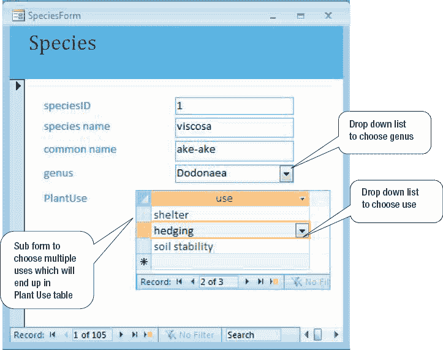

图 2-16. 一个满足维护物种数据用例的表单

##### 用于输出用例的报告

数据存储在不同的表中，数据库产品中的报告和查询功能使得提取（简单的）信息相当直接。我们现在不会深入探讨如何设置查询和报告的细节，但我们将看两个可能满足我们报告用例的报告。大多数优秀的报告生成器允许以各种方式选择、排序和分组数据。通过按`genus`或`use`分组，我们可以非常简单地提供信息来满足图 2-13 中的两个报告用例。图 2-17 显示了一个按用途分组的报告，显示了适用于每种用途的植物。该报告是使用`Access`报告向导中的默认选项非常简单地创建的。

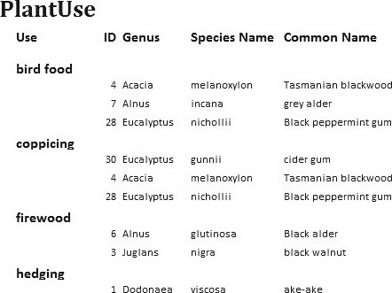

图 2-17. 一个满足为特定用途提供合适植物信息用例的简单报告

### 总结

至此，我们已经完成了从最初模糊的问题陈述到我们非常简单的植物和用途示例的一个可能最终解决方案的完整旅程。步骤在此总结，并通过图 2-19 加以说明。

1.  根据用户想要达成的目标来表述问题。对于一个数据库问题，这通常涉及需要存储的数据和需要检索的信息。勾勒出一些初始的用例和一个数据模型。

2.  思考信息的其他可能用途，以及数据如何可以被有序地或分组地组织。进行一个迭代的分析过程，重新审视数据模型和用例，直到你确信自己对问题有了完整且精确的理解。对于更大的问题，此阶段可能包括做出一些简化或其他实用的选择。本书的大部分内容将集中于流程的这一阶段。

3.  选择管理数据的产品类型并创建适当的设计。对于关系数据库，这将涉及设计表、键和外键。如果项目要用其他类型的产品（如编程语言或电子表格）来实现，则需要不同的结构。设计阶段在第 7 章至第 9 章中有更充分的讨论。

4.  构建应用程序。对于关系数据库，这将包括设置表格以及开发表单和报告以满足用例。如何在任何特定产品中完成这些操作的具体机制超出了本书的范围，但市面上有大量指导书籍可以帮助你。

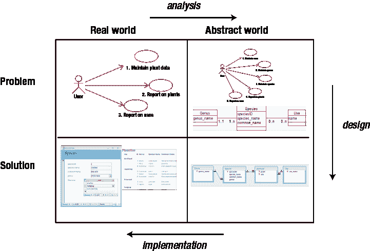

**图 2-19.** 我们简单数据库示例的开发过程

我们可以通过按属（genus）而非用途（use）对数据进行分组，创建一个类似于图 2-17 的报告。然而，从数据库中访问信息的方式有多种。图 2-18 展示了我们的 Access 数据库一个非常简单的网页视图。它允许用户选择一个属并查看相关的物种和用途（该网页是使用 Microsoft Expression Web 开发的）。

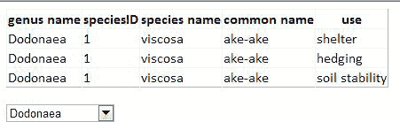

**图 2-18.** 一个简单的网页前端，满足按属分组返回植物信息的用例

### 测试你的理解

##### 练习 2-1

一个小型体育俱乐部保存其会员及所缴会费的信息。秘书希望能够记录会员缴费时间，并打印一份类似于图 2-20 的报告。

**图 2-20.** 一个小型俱乐部的会员数据

a) 思考不同的数据项可能在何时被输入。为数据输入勾勒一个初始的用例图。
b) 考虑你正在保存信息的不同对象，并勾勒一个简单的类图。
c) 你可以向俱乐部建议哪些不同的报告呈现方式？你的类图是否能方便地提供这些信息？

¹ Marvin V. Zelkowitz, Alan C. Shaw, and John D. Gannon, *Principles of Software Engineering and Design* (Englewood Cliffs, NJ: Prentice-Hall, 1979), p. 5.

² Grady Booch, James Rumbaugh, and Ivar Jacobsen, *The Unified Modeling Language User Guide* (Boston, MA: Addison Wesley, 1999).

³ Alistair Cockburn, *Writing Effective Use Cases* (Boston, MA: Addison Wesley, 2001).

⁴ 本书中的图表是使用 Rational Rose ([`www.rational.com`](http://www.rational.com)/)准备的。该软件通过 Rational 的软件工程教育开发计划（SEED Program）提供。

