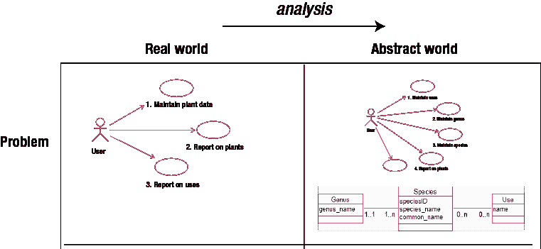
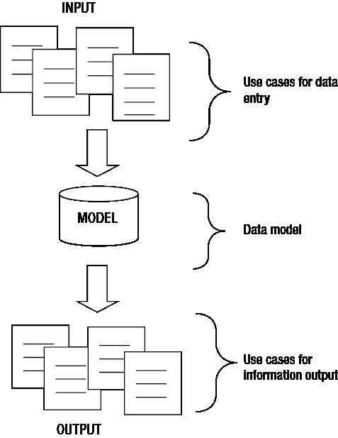
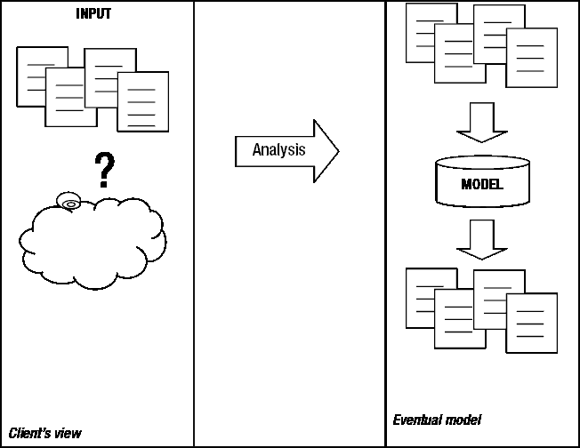
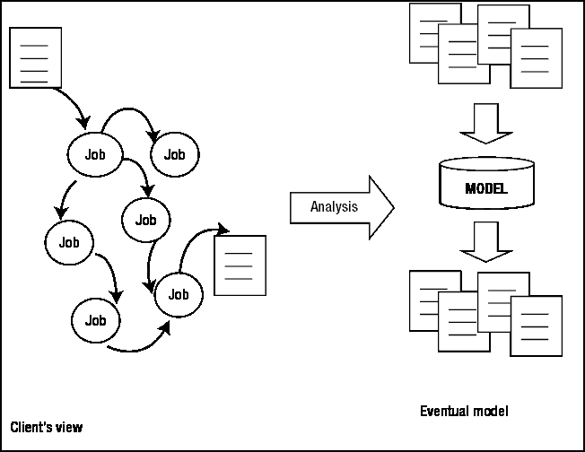

# 初始需求与用例

在本章中，我们将考虑从现实世界问题到最终现实世界解决方案的第一步，如第 2 章所述。首先，我们需要确保自己真正理解了问题。这听起来可能显而易见，但令人惊讶的是，人们经常在完全理解问题之前就开始着手实施数据库。我们需要做两件事：理解系统所有用户需要执行的任务，然后弄清楚需要存储什么数据来支持这些任务。如图 3-1 所示的用例和类图，是开始整合我们对问题理解的好方法。

***图 3-1**. 第一步：为现实世界问题开发一个抽象模型*

首先，我们必须*完全*理解真正的问题。仅仅对业务、俱乐部或科学家所做的事情有一个粗略的了解是不够的。我最喜欢的引述之一来自 Peter Coad 和 Ed Yourdon 的书*《面向对象分析》*^(1)，其中他们对分析空中交通控制系统有如下说法：

*分析师需要将自己沉浸于问题领域中，其深度要达到他开始发现一些细微差别，而这些差别甚至连每天与空中交通管制打交道的人都未曾完全考虑过。*

虽然相关人员是他们特定现实世界问题的专家，但他们很少需要以抽象的方式思考细节。例外和异常情况可以在出现时直接“处理”。在人工系统中，有人可以草草记下笔记、补开一张发票或调整一些总额。然而，自动化系统不能如此宽容，可能的异常情况需要从一开始就加以考虑。

人们通常不会主动提供关于他们问题中那些小异常的信息，即使在被询问时，也常常意识不到这些信息可能很重要。诸如“不，没什么。”或“几乎没有。”或“嗯，不，我想没有，嗯，也许吧。”这样的回答，都是存在需要深入理解的复杂问题的信号，在进一步进行数据库设计之前必须理解这些复杂问题。

正如你在前面章节中所看到的，数据库的建立往往只为解决一个眼前问题，很少考虑接下来可能会发生什么，或者情况有时会如何偏离常规。在示例 1-4“学业成绩”中，表格的设置是为了记录学生的分数，却没有考虑到（不幸的是这并非完全不常见）学生需要重修一门科目这种情况。

在本章中，我们将探讨获取问题的初始、准确概述并用用例来表达它的方法。然后，在理解了所有的定义、细节、例外、异常、合理扩展以及系统用途（天啊）之后，我们必须确保我们的抽象模型准确地捕捉到了最重要的特征。毕竟，最终将被实现的是这个抽象模型。

你可能是在设计自己的数据库，也可能是在为别人设计一个数据库。无论是哪种情况，对问题都有两种视角。一种是来自最终用户（我将称此人为客户）的具体、现实世界的视角，另一种是来自设计并可能开发系统的人（我将称此人为分析师）的更为抽象的模型视角。如果你是在设计自己的数据库，那么请同时戴上两顶帽子，并根据需要进行切换。

### 现实与抽象视图

由于对现实世界问题的良好理解极其依赖于客户与分析师能够相互理解，我们将花点时间来看看对一个问题的两种不同视角。

##### 问题的现实与抽象视图

分析师主要以抽象的方式看待问题。对于我们考虑的这类数据库问题，处理过程大多可以分为：

*   输入、编辑或以其他方式维护数据。
*   根据某些条件从数据库中提取信息。问题的这种视图如图 3-2 所示。

`Figure 3-2`. 分析师对典型数据库系统的视图

分析师首先要做的是充分理解客户的问题，以帮助确定输入和输出需求（即时和潜在的）。这些可以用用例来表达。然后，分析师需要开发一个能够支持这些需求的数据模型。正如你将在后面章节中看到的，数据模型提供了对系统细节的相当深入的理解，因此用例和数据模型通常是并行开发的。

建立用例并非易事。用户或客户很少对整个流程有清晰的了解。许多数据库项目属于下一节描述的两类情况之一，从客户的视角审视这些情况是有益的。

##### 数据整理

数据整理项目涉及一个需要照看其数据的客户。研究结果通常属于这种情况。科学家可能会设计一个实验来收集数据，以便进行专门的统计分析。这里分析师的责任是提前思考，并询问数据还可能如何被使用，并以一种能够满足即时和未来可能需求的方式存储它。这个过程如图 3-3 所示。

`Figure 3-3`. 数据整理问题的分析

在这个阶段进行仔细分析有助于避免一种非常常见且令人恼火的情况：知道数据“在里面”，但无法方便地“取出来”。根据正在收集的数据类型，预测潜在的输出需求是存储数据最困难的方面之一。

##### 任务自动化

许多项目涉及一个客户，其工作需要自动化。这可能是小企业、俱乐部或学校，他们一直用手动或需要更新的软件保存记录。也许他们希望将数据转移到具有 Web 界面的数据库中。这些客户通常对他们所做的工作有清晰的认识。分析师的工作是将客户*所做的*与需要*记录*和*报告的*分开，并如图 3-4 所示重新定义问题。

`Figure 3-4`. 任务自动化问题的分析

一个本地学校任务自动化问题的典型描述可能是这样的：

*当家长打电话来说孩子生病时，我们必须通知他们的班级老师，如果那天是运动会日，孩子在校队里，体育老师可能需要安排替补。然后我们需要统计所有缺勤天数，放到孩子的报告中。教育部每个学期也需要这些总数。*

记录缺勤并能够以多种方式报告显然是主要需求。然而，关于运动队呢？系统是否需要区分那些在队中的孩子（如果是，是否需要知道是哪些队）？系统是否需要知道哪些日期有校际比赛？可能不需要。区分客户*所做*的（如果是运动会日，告诉体育老师）与需要*记录*的，是范围界定过程的一部分。对于体育部分问题的最终解决方案可能像记录所有关于队伍、替补和比赛日期的细节一样复杂，也可能像每天给体育老师一份所有缺勤者的名单并让她自己处理一样简单。

每个问题都是不同的，所以我们需要一个通用的框架来发现和表示数据库问题的复杂性。一个好的开始是确定以下问题的答案：

*   用户做什么？
*   涉及什么数据？
*   系统的主要目标是什么？
*   满足这个目标需要什么数据？
*   输入用例是什么？
*   第一个数据模型是什么？
*   输出用例是什么？

前面的步骤是迭代的。随着我们对问题了解更多，我们可能需要返回到早期的步骤并进行调整。我们将在示例 3-1 的背景下逐步完成这些步骤。

`EXAMPLE 3-1`. 餐食递送

入住当地汽车旅馆或酒店房间的游客会获得一项服务，可以为他们递送各种快餐或外卖餐食（披萨、汉堡、印度外卖等）。访客致电公司并下订单购买一些餐食。一名司机被选中并被派往相应的快餐店取餐。司机将餐食送给客户，接收付款，并通知仓库。他稍后还会填写一份时间表交回仓库。

希望自动化这一目前手动流程的原因之一，是为了能够生成关于所接订单数量以及完成订单所需时间的统计数据。

###### 用户做什么？

“用户做什么？”这个问题对于任务自动化问题特别相关。作为开始，列出用户定期执行的任务是有用的。以下是当前手动餐食递送示例中执行的任务的起始列表：

*   接待员记录订单详情（地址、电话号码、餐食、总价）。
*   接待员选择一名司机并告诉他有关订单的信息。
*   司机从快餐店取餐。
*   司机送餐并通知仓库。
*   司机在下班时交回时间表。
*   接待员或经理生成每周和每月的统计数据。

前面五个任务可能涉及向系统输入数据，而最后一个任务则涉及报告系统中已有的信息。

###### 涉及什么数据？

上一节描述的任务很大程度上是从用户的角度陈述的，是实际发生的事情。我们需要退后一步，戴上分析师的帽子，思考在每一步需要记录或检索什么数据（如果有的话）。

从思考一个典型订单可能涉及的内容开始是有用的。假设一个家庭在汽车旅馆住了一晚，打电话订购咖喱给父母，披萨给孩子。集思广益一下，在工作的每一步可以记录哪些数据。一些可能性如表 3-1 所示。

`Table 3-1`. 物理用户任务及相关数据

### 外卖配送系统数据分析

#### 任务与数据记录

| **任务** | **实际工作** | **可记录的数据** |
| :--- | :--- | :--- |
| 1 | 接单。 | 订单号、地址、电话、姓名、餐品、价格、时间。 |
| 2 | 派单给司机。 | 司机姓名（或 ID？）、订单号、时间、需前往的出餐点。 |
| 3 | 取餐。 | 订单号、每份餐品的取餐时间。 |
| 4 | 送餐。 | 订单号、送达时间。 |
| 5 | 录入工时表。 | 除了每个订单已有的信息外，还需要其他信息吗？签到时间、签退时间？ |

让我们看看这些任务各自可能引发的一些问题：

##### 接单

记录订单信息看似相当直接。我们需要能够轻松识别一个订单。我们可以参考顾客和下单时间，但通常分配一个订单号将使其更容易在各个阶段被追踪。关于顾客的信息是显而易见的。我们至少需要记录餐品的送达地点以及如何联系顾客。那么，关于所请求的餐品呢？我们如何记录这些信息？大概顾客是从某个可用餐品列表中进行选择的。系统是否应该能以某种方式向接线员提供该餐品列表以便进行选择？价格呢？如果我们有了餐品数据，我们就会知道价格。是否需要输入其他费用？比如里程费？

##### 派单给司机

首先，我们需要考虑如何知道是哪位司机将去配送订单。系统需要跟踪司机的位置并确定最合适的司机吗？接线员是从值班司机列表中选择吗？系统是否需要跟踪哪些司机有空或当前正在配送？如果所有司机都忙了，怎么办？

决定好司机后，我们需要告诉他订单详情（两份咖喱，两份披萨）。我们还需要告诉他去哪里取餐吗（例如，有多个披萨店可供选择）？系统是否需要记录为该订单提供餐品的出餐点？如果披萨店和咖喱店相距很远，是否可能需要两名司机参与？

##### 取餐

关于司机取餐，我们想记录什么？我们是否希望系统能够告诉我们订单的当前状态（例如，“咖喱已于 8:40 取走，披萨尚未收集”）？最终的统计是否需要将餐品取餐时间和送达时间分开，还是只需要总时间？

##### 送餐

如果时间统计很重要，记录餐品送达的时间将是必不可少的。

##### 录入工时表

假设工时表目前是手动管理的，查看现有的工时表将非常有帮助。手工工时表可能包含我们已经讨论过的一些信息。是否有我们尚未记录的数据？系统是否需要记录有关司机工资率和支付情况的信息？我们在“深入了解问题”一节中再次讨论了查看现有手工表格的问题。

#### 系统目标是什么？

显然，一个用于记录送餐情况的系统可能非常小，也可能非常大，这取决于我们决定记录前一节中的多少信息。带着分析师的视角，我们需要理清主要目标并提供务实的解决方案（而不是包罗万象的方案）。

如果你与他人合作，一个常见的问题是，当你提出类似于前一节描述的问题时，你的客户可能会对扩大系统范围以包含越来越多功能变得相当热衷。不过，当他们意识到额外的功能需要付出成本时，他们很快就会平静下来。

重要的是，不要将一切*可能*自动化的事情都视为*应该*自动化的事情。许多工作手动完成要方便得多，而且通常让任务或决定有一些人的参与会更好。一个很好的例子是为实验室课程分配演示员。虽然数据库可能有关于需求和可用性的所有信息，但实际的匹配工作可能由真正的人来做会更好，因为他们掌握额外的信息（例如，谁有睡懒觉的倾向，谁可能和谁闹翻，谁在周五下午 5:30 可能最有耐心）。

在分析的早期阶段，最好将问题范围保持得尽可能小且定义严格。首先满足最紧迫的需求。一个设计良好的数据库在必要时或随着时间的推移和资金的允许，应该不会太难扩展。让我们思考一下外卖配送的例子。开发数据库的最初动机是提供关于订单和所涉及时间的汇总信息。汇总的订单信息可能包括订单总数和/或它们的总价值，可能是在某个时间范围内（每周或每月）。这些信息可能让公司识别出一些趋势并相应地调整其业务。

让我们思考一下时间统计。它们应该有多详细？这正是你需要发挥想象力的地方。像“你想要关于时间的哪些统计？”这样的问题可能无法从客户那里得到足够的细节。如果不行，你可以试着想想能实现什么，并提出一些更具体的问题。这里有一些建议：

*   你需要统计数据来支持诸如“我们的餐品在 40 分钟内送达”或“我们的平均送餐时间是 15 分钟”这样的陈述吗？
*   你需要能够分解送餐时间以查看延迟在哪里吗？例如：一个订单通常需要等待多久才有司机可用？等待餐品准备的时间占多大比例？从出餐点送达顾客的平均时间是多少？
*   你需要能够按司机分解这些统计吗？例如，找出是否有司机经常比别人慢？
*   你需要能够按出餐点分解这些统计吗？例如，你是否需要查看每个出餐点的平均等待时间，以确定是否有明显较慢的？

这些问题的目的是确定最紧迫的需求。让我们假设，对于这家小企业，主要目标只是大致了解从打电话到送达的总时间。提出其他问题可能（也可能不会）导致客户变得过于雄心勃勃：“我从未想过这个。好主意。把这个也加进去吧。”

在大家忘乎所以之前，必须考虑获得足够可靠的数据来实现这些额外想法有多现实。总的送餐时间这个主要目标不是太难。它需要记录呼叫时间以及最终送达时间。任何比这更详细的记录都需要付出巨大成本。司机必须不断记录时间或在每个阶段通知仓库。是否需要额外的接线员来处理维护所有这些额外数据的工作？如果这些额外功能对客户不是必需的，那么范围就应该排除它们。然而，如果额外信息是获取该系统的主要目的之一，仍然有一些问题需要考虑。数据会有多准确？如果司机怀疑时间被记录在他们的名字旁边，他们是否会感到压力，有时变得不那么准确？建立一个复杂的系统来分析不准确的数字，是在浪费每个人的时间和金钱。

假设经过一些仔细思考，大家一致认为只需要记录总的配送时间。现在我们可以重新阐述项目的主要目标：

*记录订单信息，以便能够检索不同时间段内订单的数量、价值以及处理订单所花费的总时间等汇总数据。*

#### 需要哪些数据来实现目标？

现在，我们可以带着更明确的目标，重新审视表 3-1 中的每一项任务。在与客户进一步磋商后，我们可以对这些任务产生更精确的描述，如下所示。

##### 接单
如果我们需要按月或周提供统计数据，就需要记录日期。客户已确认有一份不同餐品的价格表，让接待员能够从此列表中选择将非常有用。因此，我们需要一项额外的任务：录入并维护餐品及其价格信息。客户确认，订单成本就是所有餐品的总成本。

##### 派单给司机
我们需要了解如何选择司机，并确定我们需要记录什么。假设我们发现司机是按不同时间单位排班的。显然，能够维护并打印出值班表会很有用。然而，自动化排班并不直接有助于实现我们的主要目标。目前大家同意暂时将排班表排除在系统范围之外。接待员将使用独立于数据库的信息（可能是钉在公告板上的名单）来决定应该指派谁去配送订单。

即使接待员将手动指派司机，我们仍需考虑系统需要记录什么。司机信息的准确性有多重要？如果我们想要保存关于特定司机工作情况的数据（例如用于计算工资或分析绩效），那么保存准确的信息就很重要。如果对于这个系统来说，只需要能够联系司机下达订单并检查进度，那么在订单上记录一个联系电话就足够了。这需要向客户澄清，可以问这样的问题：“了解不同司机配送了多少订单对您来说重要吗？” 假设在初始阶段不需要这个功能。

司机去哪里取披萨？系统的一部分是否应该建议或记录取餐点？同样，如果统计的目的是为了优化业务，那么了解每个司机去了哪里以及在各个取餐点等待了多长时间将是至关重要的。鉴于我们已经确定这不是主要目标，我们决定目前不维护取餐点信息。

##### 取餐
我们与客户达成一致，只需要记录从初次联系到最终送达订单的总时间。这意味着我们不需要记录流程中每个阶段的时间。即使我们不记录取餐时间，知道餐品已被取走并且正在送往客户手中，是否仍然有用？当然，当出现延误或问题时，这将是有用的信息。然而，为了满足我们的主要目标，系统没有必要记录配送状态信息。如果有问题，接待员有司机的联系电话，可以打电话询问订单所处的阶段。因此，首先，我们不需要记录任何关于取餐的信息。

##### 送达餐品
如果我们想要获得整体配送时间的统计数据，显然需要记录每份餐品送达的时间。现阶段我们不需要关心这些信息是如何进入数据库的。司机可能会打电话到仓库，或者将时间写在时间表上稍后录入。在这个阶段，我们只关心系统能否存储每个订单的送达时间。订单送达时，接待员还需要知道司机可以接新订单了。我们在关于派单司机的章节中已经决定，目前这些决定将独立于数据库。接待员可能只会手动记录一下司机可以接新订单了。

##### 录入时间表
我们已经记录了司机姓名、订单信息和送达时间。在这个步骤中，我们还需要记录其他什么吗？假设查看当前的手工时间表确认我们已经掌握了所有需要的信息。

我们费了很大力气去提问，以澄清问题的范围以及支持该范围所需的数据。我们做出的决定是假设性的。它们没有对错之分。即使对于一个实际问题，也不会有绝对的对错答案；我们只能期望得到一个良好的实用解决方案。如果数据库设计得合理，那么在后期能够添加额外信息或扩大范围应该是相当直接的事情。就系统的规模和范围做出某些决定可能需要相当长的时间，因此在达成一些共识后，清晰地表达新的范围非常重要。示例 3-2 根据我们的重新思考，重新陈述了问题。

##### 示例 3-2. 餐品配送问题的重新陈述

系统将记录并提供有关餐品及其当前价格的信息。它将维护订单数据，包括日期、所订餐品、客户联系信息以及分配负责配送的司机信息。它还将维护订单下达时间和最终送达时间。基于此，系统将能够提供特定时间段内订单数量和价值的汇总信息，以及订单整体处理所用时间的汇总信息。系统不会维护关于司机的任何额外信息，也不会维护特定订单与哪些司机关联的信息。系统不会维护关于取餐点的任何信息，也不会记录任何特定订单使用了哪个取餐点。

#### 输入用例是什么？

回想一下，用例只是描述用户与系统交互方式的文本说明。用例有许多不同的层次，从非常高层次的目标描述到非常低层次的任务。对于我们试图理解和描述数据库系统的目的而言，最有用的层次是用户任务层次。Alistair Cockburn 在他的著作《编写有效用例》²中，将其描述为小到“用户可以在大约二十分钟内完成，然后去喝杯咖啡”的任务。他还说，它应该是一个“足够重要的工作，以至于如果一个用户一天内完成了几个这样的任务，他可以以此作为要求加薪的证据。” 因此，像“管理业务的订单”这样的描述对于一个任务来说过于宽泛，而“查找司机的电话号码”可能又过于琐碎。

既然我们对目标和系统范围有了更清晰的认识，就可以回到涉及数据录入的任务列表（之前出现在表 3-1 中），并决定在每个节点需要与系统进行哪些交互。这些交互显示在表 3-2 中。

