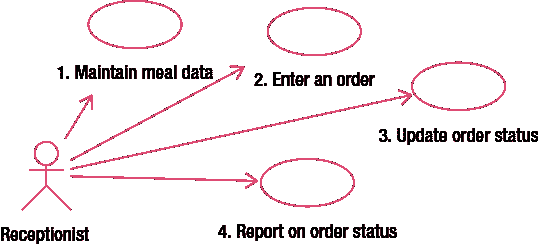
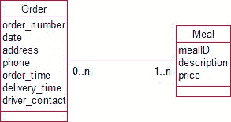

# `表 3-2`. 拟议系统的数据录入与交互物理用户任务

| **任务** | **物理工作** | **与系统交互** |
| :--- | :--- | :--- |
| 0 | 记录可用餐品。 | 输入并维护每个可订购餐品的数据（ID、描述、当前价格）。 |
| 1 | 接单。 | 输入订单数据（订单号、时间、地址、电话）以及所需每份餐品的 ID（目前假设价格不变）。 |
| 2 | 指派司机。 | 将司机的联系电话与相应订单关联记录。 |
| 3 | 取餐。 | 无。 |
| 4 | 送餐。 | 记录相应订单的送达时间（在此处或可能在下一步记录）。 |
| 5 | 录入工时表。 | 无。 |

`表 3-2`中的交互构成了我们首次尝试编写一些数据录入用例的基础。每个用例应该多大？我们应该合并一些任务，还是将其他任务拆分成多个用例？首要考虑的是可读性和沟通效率。初次尝试时，大约五到十个用例就足够了（且不算太多），足以清晰地展现一个小问题的组成部分。

我们可以考虑将所有涉及订单数据的任务合并到一个用例中（即，录入原始订单、添加司机联系方式以及更新送达时间）。然而，对于这个问题，这些任务都相当独立，在不同的时间执行，并且可能由不同的人执行。可能无法立即为订单指派司机（在繁忙时段，我们可能需要等待看哪位司机先有空），因此录入司机联系方式数据应该是一个独立于录入订单的任务。同样，记录送达时间也是一个在不同时间执行的独立任务。这些与更新订单相关的任务都是整个业务的核心，并且一天内会重复多次，因此为每个任务提供独立的用例是合理的。但是，添加司机联系方式和添加送达时间的操作机制几乎完全相同，都需要找到特定订单的信息然后进行更新。我们可以（如果我们愿意的话）将这些合并为一个用例，例如称为“更新订单状态”。

思考更新现有订单的状态，引导我们思考用户将如何定位特定订单。提供尚未指派司机或尚未送达的订单列表可能会有用。我们在此阶段不会研究具体的用户界面设计（即如何呈现此类列表或用户如何选择合适的订单）；然而，提供此类信息将很重要。我们存储了足够的数据，能够找到没有司机联系电话或没有送达时间的订单。鉴于这些信息对接待员来说几乎是必不可少的，并且在系统中易于获取，我们也将未完成订单的报告添加为一个用例。`示例 3-3`显示了目前的用例。

## `示例 3-3`. 餐饮配送的初始用例

`图 3-5`展示了餐饮配送问题的初始用例，每个用例的文本在图后给出。

### `图 3-5`. 餐饮用例

*   **用例 1**：维护餐品数据。输入和更新餐品数据（ID、描述、当前价格）。
*   **用例 2**：录入订单。输入初始订单信息（订单号、日期、地址、电话）并记录每份餐品的 ID。（此假设价格不变。我们将在本章后面的“变更价格”一节中考虑价格变化。）每份餐品必须是系统中已有的。
*   **用例 3**：更新订单状态。针对系统中已有的特定订单，添加司机联系电话或送达时间。
*   **用例 4**：报告订单状态。检索所有满足所需状态（例如，无司机联系电话或无送达时间）的订单。

#### 什么是第一个数据模型？

既然我们对需要维护的数据有了一些概念，就可以为问题勾勒出第一个数据模型。我们显然拥有至少两类独立事物的数据：订单和可供应餐品的类型，因此有两个类，如`图 3-6`所示。`餐品`类的对象将是出现在客户汽车旅馆或酒店房间菜单上的每种餐品类型。

### `图 3-6`. 餐饮配送数据库的首次数据模型尝试

在`图 3-6`中，我们将我们记录的每个数据片段分离开来，并将它们作为属性放入最可能的类中。让我们回顾一下`第 2 章`，了解像`图 3-6`这样的模型意味着什么。从左向右阅读，我们看到一个特定的订单（例如，“4 月 1 日 8:30 送到科伦坡街”）可以涉及一种或多种餐品类型。从右向左看，每种餐品类型（例如，印度风味鸡肉）可以出现在多个订单上，但也可能不出现在任何订单上（例如，可能从来没有人想点菠菜凤尾鱼披萨）。为避免混淆，当我们谈论“餐品”时，指的是菜单上出现的餐品类型。我们并不是指一份特定的咖喱可能会被送到多个订单上！

请注意，这个模型只是首次尝试，忽略了一些我们将在本章后面考虑的重要细节。

#### 什么是输出用例？

我们现在需要根据我们正在维护的数据（如`图 3-6`中的数据模型）重新考虑所需的报告和汇总任务。我们已经确定，报告等待指派司机的订单或尚未送达的订单将很有用，并已将其包含在`示例 3-3`的用例 4 中。

让我们思考一下作为我们主要目标一部分的订单和送达时间统计。订单的统计可以通过考虑`订单`对象来找到。我们可以通过汇总与该订单关联的每份餐品的价格（目前假设价格不变）来找到每个订单的价值。我们还可以通过`订单时间`减去`送达时间`来确定每个订单的耗时。通过选择那些在感兴趣日期范围内的订单对象，我们可以确定特定周、月或任何所需时间段内时间的不同统计数据（例如，平均值或总和）。我们的数据模型中存储了足够的信息来满足主要目标的要求。

#### 数据分析与扩展思考

此时，审视我们正在存储的数据，并看看能推导出哪些其他信息，是很有用的。基于我们已有的数据，我们还能提供哪些统计信息？比如，按餐食类型对所有订单进行分组？鉴于大部分信息已存储在案，询问客户是否想知道披萨带来的总收入、有多少人点了咖喱，或者包含特定类型餐食的订单是否需要更长的配送时间，这可能是有用的。我们是否有现成的信息形式，能让这类报告唾手可得？

我们掌握了特定餐食（例如鸡肉文达卢或羊肉科尔马）的信息，但要获取不同餐食类别（披萨对比咖喱）的信息却并不容易。或许引入一个新的属性或类——`Category`（类别）——会很有用。然后，每种餐食都可以被分配一个特定的类别。我们将在第 5 章(`Chapter 5`)更深入地探讨像类别这样的东西应该是属性还是类，但现在请相信我的话，设立一个`Category`类会是个好主意。这只是对问题的一个小扩展，却可能以微小的额外努力或成本，提供相当可观的补充信息。戴上我们分析师的帽子，我们至少应该与客户讨论一下这个增补。

即使我们不增加一个额外的`Category`类，我们至少还需要一个进一步的用例来处理统计输出。因为所有的报告大体相似，我们可以像在示例 3-4(`Example 3-4`)中展示的那样，在一个用例中相当清晰地描述它们。

### `示例 3-4`. 餐食配送统计报告用例

图 3-7(`Figure 3-7`)展示了用于报告统计信息的用例。

图 3-7(`Figure 3-7`). 统计报告用例

`用例`: 订单汇总报告。（此用例假设价格不变。）

*对于所需时间段内、`date`（日期）符合要求的每一个已完成订单：*

*   查找所有相关的餐食并检索其价格。
*   如果需要，通过从`delivery_time`（配送时间）中减去`order_time`（下单时间）来计算订单耗时。
*   如果需要，按更小的时间段（天、周等）对订单进行分组。
*   计算价格/时间的平均值和/或总值。

#### 关于用例的更多内容

我们在用例中一直使用非常简单的描述。然而，用例可以包含更多信息，优秀的范例可以在阿利斯泰尔·科克伦的《编写有效用例》( `Writing Effective Use Cases` )一书中找到。这本书比我这里讲得更详细，因为它包含了对更大项目的分析，在这些项目中，出于合同目的的需求规范更为关键。在本书中，我们使用用例更多地是将其作为一种澄清和深入了解拟议项目、其范围及其复杂性的方式，而非作为合同规范文件。

关于用例应包含什么内容或应如何呈现，没有硬性的规定。首要的考虑是它们应具备可读性，并清晰、完整地描述每项任务涉及的内容。

让我们更仔细地审视用例的一些其他方面。

##### 参与者

我们使用一个`actor`（参与者）来代表我们数据库的用户。为了考虑到用户可能与数据库交互的所有不同方式，考虑我们的用户可能包含的所有不同`类型`的人是很有用的。

在我们的餐食配送服务示例中，你会看到在图 3-5(`Figures 3-5`)和图 3-7(`3-7`)中，我们区分了两个参与者：`receptionist`（接待员）和`manager`（经理）。不必过于担心哪些人与特定用例相关联。重要的是考虑可能与系统交互的人的`角色`，并从每个角色的角度看待问题。对于小企业，这些角色可能总共由一两个人承担。对于较大的组织，一个单一角色可能由许多人（例如，许多数据录入操作员）来承担。这就变成了戴上不同的帽子，从不同的观点来看待问题。

以下是一些人们可能拥有的广泛角色类别，并附有来自我们餐食配送服务的示例。

`文员/数据录入操作员`：此角色的用户负责输入或更新原始数据（例如，输入订单详情或查找订单以录入配送时间）。

`主管`：此角色的用户处理日常细节。他们可能需要交易清单、值班表等。对于我们的餐食配送数据库，这些用户可能会处理诸如尚未配送的订单列表或特定订单的详情（以跟进问题）等事务。

`经理`：经理更可能对汇总信息而非日常细节感兴趣（例如，上周每天的总订单数或今天订单的平均配送时间）。他们也可能需要非常概括的、显示趋势并可用于预测和战略管理决策的汇总信息（例如，过去两年每月的订单价值）。

从这些不同角色（或参与者）的角度思考，可以极大地了解系统需要提供什么才能最有用。

##### 异常与扩展

每个用例的文本描述部分是用来包含任何可能发生的异常或问题的地方。对于我们的简单示例，问题不太多。我们可能会包含如何处理跨午夜的订单以正确计算耗时（我讨厌处理时间问题！）。我们还可能包含如果订单因某种原因未能完成会发生什么。这相当棘手。我们需要区分已取消的订单和尚未配送的订单，这样我们关于当前订单状态的报告才是正确的。每次我们查询那些尚未配送的订单时，我们不希望包含从一开始所有已中止的订单。这里有两种可能：取消或终止的订单可以从系统中删除；或者我们可以为`Order`类添加一个新的属性——`status`（状态），其值可以是`ordered`（已下单）、`delivered`（已配送）、`cancelled`（已取消）等。第二个选项更可取，因为删除系统中已有的信息似乎是一种浪费，而且经理很可能非常有兴趣知道订单的取消百分比（并且非常想知道原因——但这又引入了另一层复杂性）。任何增补，比如跟踪已取消订单，都必须反映在用例和数据模型中。

如你所见，思考每一步可能出错的事情有助于我们理解问题。

##### 用于维护数据的用例

### 用例分析

#### 数据维护用例

数据维护包括三项活动：存储新值、修改现有值以及删除数据。这三项更新任务可以合并为一个用例（例如，维护膳食数据）。虽然它们都是独立的工作，并且可能在不同的时间完成，但它们各自并不真正符合先前给出的用户任务标准。用户无法真正使用她纠正了许多膳食描述拼写错误这一事实来作为要求加薪的证据。数据库软件提供了执行数据维护活动的工具。如果我们为膳食数据创建一个表，软件几乎肯定会提供实用程序来让我们添加新膳食、查找特定膳食（基于一个或多个属性的值）、更新特定膳食的值或完全删除膳食。因此，对于许多类来说，将这些维护活动包含在一个用例中是相当合理的，而具体细节则留待以后设计用户界面时再考虑。

对于某些任务，将维护特定类数据的不同方面分开可能是有意义的。在我们的送餐示例中，我们将输入订单与更新订单（例如，添加司机联系方式和送货时间）分开了，因为这是接待员工作中相当重要且独立的部分，并且它们肯定会在不同的时间发生。分别考虑输入和更新任务促使我们思考接待员如何能方便地找到适当的订单来更新其状态，因此引导我们提供关于当前订单状态的报告。

是否应该将维护订单数据的这些方面放在单独的用例中，这是一个观点问题，决定因素应该是何种方式最易读且提供了最佳的沟通效果。由于我们的用例不多，将它们分开似乎是合理的；但是，如果范围以及用例的数量增长，那么通过合并它们可能更好地服务于清晰度。

#### 报告信息的用例

对于许多客户来说，报告任务可能是数据库系统最重要的部分。我们需要能够提取满足某些条件的对象，然后对它们做一些事情：在屏幕或网页上显示它们、在报告中写出它们、将它们分组、计数它们，或对某些属性值求平均值或总和。

正如我们所看到的，在生成报告时，考虑我们可能希望如何选择或分组对象是非常有用的。在送餐示例中，我们考虑了按膳食类型对订单进行分组，并很快意识到对*膳食类别*采用更广泛的定义可能被证明是有用的。尽早询问关于报告的详细问题是一项很好的投资，因为它将对所需的类产生影响。

你需要多少个报告用例？再次以可读性为指导。图 3-7 中的用例包含了几个相似但不同的可能性，并且相当容易阅读。如果我们包含其他相当不同的报告（名册、发票等），那么每个报告都应该有自己的用例。

选择打印哪个报告或包含哪些订单（本周的或本月的）的机制不属于分析这一部分的事务。我们将这些决策推迟到用户界面设计阶段。在此阶段，重要的是数据存储的方式应使报告成为可能。

#### 深入了解问题

我们已经考虑了许多需要回答的问题，以理解项目范围和界定范围，并将这些问题呈现为客户和分析师之间的对话。大量信息也可以从其他来源获得。客户（企业、研究人员、俱乐部等）正在使用的现有表单和报告是了解项目概况的绝佳方式。这些文档可以提供丰富的细节，并且可以成为许多有趣问题的来源。在开始时仔细查看输入表单和报告可以增进对问题的理解，并为详细的询问路线奠定良好的基础。

重要的是要意识到，你查看表单和报告是为了发现问题（而不是为了了解表单和报告本身）。空白表单表明了客户期望记录的数据。然而，更多信息将来自已填写的表单。在这里，你很可能会发现许多不规则性和例外情况。查找未填写或标记为“不适用”的字段。查找被划掉并手写了另一个选项的选项。查找包含两个值的字段，或在表单底部或背面手写的解释性注释。正是这些细节将真正让你洞察问题的复杂性。

现有报告也为你提供了关于客户当前可访问信息的指南。但请记住，这个项目之所以被委托，可能正是因为现有报告在某些方面不尽人意。检查现有报告可以引发有趣的问题。查找行或列中的空白。查找空白与零的区别。质疑任何负数。询问金额的定义。

#### 我们推迟了哪些内容？

我们对送餐示例的分析还远未完成，因为我们还需要更多的数据建模专业知识来表示一些复杂性。对于那些担心疏漏的人，这里列出了一些我们仍需考虑的事情。我们将在后面的章节中更深入地探讨这些问题。

##### 变动的价格

`Meal`类有一个我们称之为`price`的属性。这是膳食的当前价格，显然它会随时间变化。当下新订单时，我们需要知道与膳食信息一起记录的当前价格。如果价格发生变化，并且我们运行一份关于旧订单的报告，如图 3-7 中的用例所述，我们将遇到问题。我们存储的唯一价格是当前价格，因此我们不一定能找到特定订单在下单时的总成本，反而会发现这些相同订单按今天当前价格计算的成本。有几种方法可以补救这种情况。在这种情况下，最简单的方法是在`Order`类中包含另一个属性，用于存储`下单时`的订单总价值。这样，当膳食价格在以后日期发生变化时，该值将保持不变。

##### 停售的膳食

另一件肯定会随时间变化的事情是所提供的膳食。添加新膳食不会引起任何问题；然而，移除膳食则更棘手。如果我们移除一种膳食，我们必须考虑与该膳食关联的系统中旧订单会发生什么。我们可能希望保留这些历史数据，因此我们可能选择永不删除与订单关联的任何膳食。

我们接着面临的问题是，我们的餐点集合中包含了一些不应与新订单关联的项目。处理这个问题的一种方法是，在`Meal`类中添加一个`available`属性，用于指示该餐点当前是否可以订购。我们需要修改录入订单的用例，规定只有`available`的餐点才能被包含在内。然而，我们的报告用例可能会包含报告期内所有被订购的餐点。

##### 特定餐点的数量

如果我们的顾客点了两份鸡肉文达洛 os（chicken vindaloos）怎么办？我们可以将`Order`对象与`Meal`对象关联起来，但关于此订单需要配送多少份该特定餐点的信息，我们保存在哪里呢？这是一个非常严重的疏忽，要修复它需要在`Order`和`Meal`类之间引入一个新类。当我们处理多对多（Many–Many）关系时，这种情况经常发生。我们将在第 4 章进一步讨论这一点。

### 小结

分析过程的第一部分是理解项目的主要目标和范围。分析师的工作是深入了解所有将使用系统的不同类型用户的想法，以理解他们当前的需求以及未来可能的需求。这个过程是迭代的，但可能包括以下步骤：

*   确定系统的主要目标。
*   确定不同用户在平均一天中从事的工作。
*   头脑风暴与每项工作可能关联的数据。
*   商定项目范围，并确定相关数据。
*   勾勒数据输入用例，考虑异常情况，并检查现有表格。
*   勾勒初始数据模型。
*   根据正在收集的数据，头脑风暴可能的输出。
*   勾勒信息输出用例。
*   检查数据模型是否能够方便地提供输出信息。

### 检验你的理解

练习 3-1。

考虑本章开头描述的场景：

*当家长打电话说孩子生病时，我们必须通知他们的班级老师；如果当天是运动会日并且孩子在校运动队中，体育老师可能需要安排替补。然后我们需要统计所有缺勤天数以记录在孩子的报告上。教育部门每个学期也需要这些总数。*

按照小结部分中的步骤，勾勒一些用例和一个初始数据模型。假设主要目标是为班级老师记录缺勤情况、用于学校报告以及提供给教育部的统计数据。

¹ Peter Coad 和 Ed Yourdon，《面向对象分析》（Object Oriented Analysis）（新泽西州上鞍 River：Yourdon Press, 1991）。

² Alistair Cockburn，《编写有效用例》（Writing Effective Use Cases）（马萨诸塞州波士顿：Addison Wesley, 2001）。

