# 第 4 章

## 从数据模型中学习

在上一章中，我们试图提取现实世界问题中涉及的基本任务，并用用例来表达它们。我们也首次尝试确定支持这些任务所必需的数据，并形成了一个初始数据模型，我们用类图对其进行了描绘。在本章中，我们将更仔细地研究数据模型，看看它如何能加深我们对数据库系统的理解。

数据模型是对为现实世界问题存储的数据的精确描述，其方式类似于数学方程描述现实世界的物理事件，或建筑图纸描述建筑物的规划。然而，就像数学方程或建筑规划一样，数据模型既不是现实情况的完整描述，也不是其精确描述。它总是基于定义和假设，并且具有有限的范围。例如，一个高中生描述抛向空中的球路径的简单数学方程，可能会对重力的恒定性、空气阻力的缺失做出假设，并可能假设在速度较低时相对论效应可以忽略不计。该方程对于所做的假设是精确和正确的，但它并不能完全反映真实问题。不过，它是一个良好、实用且极其有用的描述，抓住了真实物理事件的本质。

数据模型具有与数学方程类似的优点和局限性。它是关于问题的*正在存储*的*数据项*之间关系的模型，但它不是现实问题本身的完整模型。资金、时间和专业知识的限制总是意味着问题需要被界定范围并做出假设，以提取基本要素。至关重要的是，定义和假设要清晰地表达出来，这样客户和分析师才不会各说各话。

在分析的早期阶段，当客户和开发人员试图理解问题（以及彼此）时，细节必然是模糊的。在本章中，我们将探讨如何使用初始数据模型来发现哪些定义和范围可能需要更严格地表达。

### 数据模型回顾

数据模型的基本方面已在第 2 章中定义。我们将通过一个例子重新审视这些方面，该例子将突出一些额外的特性。设想一个小旅馆，为参观国家公园的学校团体提供若干单人间。该旅馆有一个小型数据库来跟踪其房间和当前入住的人员。由于旅馆主要处理的是具有单一联系点的学生团体，因此“团体”的概念是其业务模型的核心。了解特定学生或教师被分配到哪个房间仍然很重要。捕捉此信息的初始数据模型如图 4-1 所示。

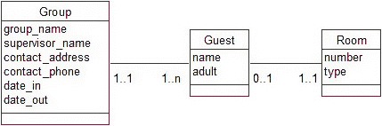

**图 4-1.** 一家小旅馆当前入住情况的初始数据模型

你可以看到`Group`和`Guest`类之间存在一对多（1–Many）关系。从左向右阅读图 4-1，我们得知一个特定团体与一位或多位宾客相关；从右向左看，一位特定宾客只与一个团体关联。图 4-1 还描绘了`Guest`和`Room`之间的一对一（1–1）关系。从左向右看，每位宾客必须关联一个房间；反过来，一个房间最多关联一位宾客，但也可能没有宾客。用通俗的话说，团体由多位宾客组成，每位宾客都有一个房间。房间仅供一位宾客使用，并且可能并非全部住满。这些对象和关系的一些可能实例如图 4-2 所示。我们有两个团体：Green High（关联三位宾客）和 Boys High（关联四位宾客）。每位宾客都关联一个房间（有些房间是空的）。花点时间确认一下图 4-1 中的类图是如何表示这种情况的。

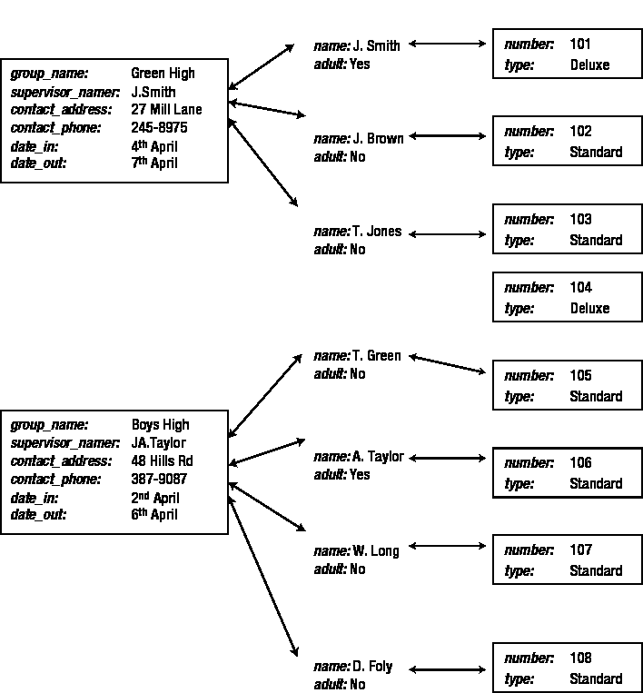

**图 4-2.** 与图 4-1 一致的对象和关系实例

注意，`room` 104 是空的，这是数据模型所允许的（一个 `room` 不一定非要关联一个 `guest`）。既然我们已经以机械的方式解读了数据模型告诉我们的信息，让我们更深入地思考一下，这个模型就现实问题向我们揭示了什么，以及它是如何处理这个问题的。

对于这家旅舍，`group`（团体）的定义是什么？我们在图 4-2 的示例数据中看到，`Boys High` 这个 `group` 由四个人组成。整个 `group` 只有一个抵达日期和一个离开日期，并且只有一套适用于所有 `group` 成员的联系信息。在这方面，我们对 `group` 的定义与日常对话中我们可能预期的含义略有不同。它不是指一群彼此认识、感觉属于一体的人，而是指一群拥有相同抵达和离开日期以及共同联系信息的人。在大多数情况下，这个模型对于旅舍是适用的，但也会存在一些例外情况。如果 `A. Taylor` 和 `W. Long` 需要比 `Boys High` `group` 提前一天离开，我们该怎么办？我们如何记录这条信息？`Taylor` 或 `Long` 的 `Guest` 对象中没有存储日期的位置，而 `Boys High Group` 对象中只有一个存放离开日期的位置。在这个模型内，我们可以通过为 `Taylor` 和 `Long` 创建另一个 `Group` 对象（比如叫 `Boys High Early Leavers`），并附上一组不同的日期来捕获这条信息。这样就能处理知道谁在何时来、何时走的问题。然而，如果系统有必要记录这两组 `Boys High` 的人是某种意义上的“一起的”，那么数据就需要以不同的方式建模。

数据模型还告诉我们，一个 `guest` *必须*属于一个 `group`。这又向我们揭示了关于 `group` 定义的哪些信息呢？对于一个希望住在旅舍的独自旅行者怎么办？鉴于旅舍主要是为团体设立的，这种情况不太常见，但模型可以容纳这种情况。我们可以有一个只包含一个 `guest` 的 `group`。在这方面，这个数据库问题中 `group` 的定义再次与日常对话中这个词的用法不同。我们通常不会说“*一个人的团体*”；然而，对于这个数据模型来说，这是一种可能出现的情况。

因此，我们最初的数据模型，乍一看相当简单，却已经就问题的处理方式告诉了我们很多信息。它引导我们得出了一个关于 `group` 的精确定义：

*   一个 `group` 是一组具有共同联系信息以及相同抵达和离开日期的 `guest`。对于每组不同的抵达和离开日期，都需要组成一个独立的 `group`。一个 `group` 可以关联一个或多个 `guest`。

通过仔细定义 `Group` 类，我们避免了为拥有多组日期的 `group` 或独自旅行的 `guest` 设置特例的需要。这保持了问题和解决方案的简洁性。当然，如果大多数 `guest` 都是独自旅行者，我们会重新思考问题，并以完全不同的方式来建模。

在本章剩余部分，我们将探讨可以对数据模型的细小部分提出哪些问题，以便更深入地理解手头的问题。我们将要探讨的问题只适用于两个类之间的关系，但它们可以引发关于问题的大量讨论。随着对问题理解的加深，我们从数据模型中学到的东西可以反映在用例中。我们将考虑的问题如下：

*   **可选性**：应该是 0 还是 1？
*   **基数 1**：偶尔会是 2 吗？
*   **基数 1**：历史数据怎么办？
*   **多对多**：我们是否遗漏了什么？

### 可选性：应该是 0 还是 1？

如第 2 章所述，关系一端的可选性是指另一端可以与某个对象关联的对象的最小数量。这通常是 0 或 1。例如，在图 4-1 中，从左向右阅读 `guest` 和 `room` 之间的关系，我们得到：一个特定的 `guest` *必须*关联一个 `room`（可选性为 1）；而从右向左阅读该关系，我们看到一个特定的 `room` 可能没有相关的 `guest`（可选性为 0）。

可选性可以提供大量关于类定义和问题范围的信息。我们将看几个小例子，每个例子都说明了决定适当可选性时需要考虑的某个方面。

#### 学生选课示例

考虑图 4-3 中的数据模型，它显示了 `student`（学生）和他们所注册的 `course`（课程）之间的关系。

**图 4-3.** `student` 注册 `course` 的数据模型

乍一看这相当简单：一个 `student` 可以注册许多 `course`，一个 `course` 可以有许多 `student` 注册。那么可选性呢？一个 `student` 可以不注册任何 `course` 吗？我们在日常对话中对 `student` 的定义通常是正在学习的人，或者更准确地说，是正式注册了某个 `course` 的人（这实际上很不一样！）。在这个数据库中，我们对 `student` 的定义是什么？虽然我已经很久不能被日常对话描述为 `student` 了，但我确信我仍然出现在我母校的 `student` 数据库中。因此，就本例而言，我们可能将 `student` 定义为正在或曾经注册过某个 `course` 的人。

在我们的数据库中存在一个从未注册过任何 `course` 的“`student`”是否有意义呢？一个已被大学录取但尚未对任何具体 `course` 做出最终决定的人呢？这个人是 `student` 吗？大学当然希望保存关于此人的信息（她的 `ID`、`name`、`address` 等）。我们可以通过扩展 `student` 的定义来容纳这种情况，将被大学录取和/或在大学注册的人包括在内。

对于一个联系大学并要求发送注册信息的人呢？任何典型的资金紧张的机构都会希望保存关于此类人的信息。提出这个问题开始涉及问题范围以及 `student` 定义相关的问题。重要的是，在分析过程一开始就要考虑诸如“你们称为 `student` 的这些人到底是谁？”这样的问题。系统是要包含曾表示有兴趣入读该大学的所有人的联系信息，还是（至少目前）将范围限制在当前和以往 `student` 的记录上？

显然，只有客户才能回答这些问题。我们可以看到，即使对最简单的数据模型的细节进行仔细考量，也能引出关于问题更广泛方面的关键问题，这是非常有用的。询问一个 `student` 是否必须注册某个 `course` 一开始可能显得迂腐，但直到我们能清楚地回答这个问题之前，我们甚至还没有开始理解我们试图解决的问题。

从右往左看这个关系，并质疑一门课程是否**必须**有学生注册，这引发了关于我们如何定义课程的类似讨论。我们可能希望保留关于课程的哪些数据？思考一下我们可能需要处理的所有不同情况。我们可能需要考虑已开过的、当前正在开设的或计划开设的课程；多次同时开设的热门课程（两个班）；以及在册但没有学生的冷门课程。在不与客户讨论具体情况的情况下，你无法得出绝对的答案，但你可以提出一些可能的定义供考虑。

#### 客户订单示例

这是一个更简单的例子。（真的吗？）我们保存客户及其所下订单的信息。我们的第一反应是说客户可以下多个订单，而每个订单由一位客户下达。这可以如图 4-4 所示。

**图 4-4.** 客户下单的数据模型

那么可选性呢？从左到右考虑这个关系。一个客户能否没有相关联的订单？这取决于客户的定义。出于许多业务的目的，客户可能是*任何我希望能向其销售产品的人*。像*任何曾经下过订单以及将要收到产品目录的其他人*这样的工作定义似乎是合理的，并表明可选性为 0（即，我们数据库中的客户不一定下过订单）。然而，这个定义可能会引发一些问题，例如：“你是否希望能够识别出那些曾经下过订单但现在厌倦了收到产品目录的人？”

从右往左看这个关系，我们想知道每个订单是否**必须**有一个关联的客户。这似乎是显而易见的。如果我们不知道订单是给谁的，那订单有什么意义？如果收到一封没有姓名或地址的邮购订单，我们可以合理地认为它不应被输入数据库，因此从这个角度，我们可以坚持每个订单必须有一个客户（可选性为 1）。

然而，知道订单是为谁下的，与将其关联到数据库中的客户对象之间，存在细微的差别。一封书面订单可能来自里卡通路的史密斯太太。虽然我们知道是谁下的订单，但这与将其关联到一个客户不同。如果史密斯太太是新客户，我们可能不得不创建一个新对象；或者我们可能面临决定这个订单来自现有的三个史密斯太太中的哪一个。区分细节相似的客户，或决定客户数据库中的两个或多个条目是否实际上指的是同一个人，可能很困难。再次强调，我们现在并不是要解决这些问题。我们只是利用数据模型来促使我们清晰地思考我们将要面对的一些问题。

#### 昆虫示例

这是另一个关于如何调查关系可选性可能引发对问题范围思考的例子。图 4-5 展示了来自示例 1-3 的一个可能的数据模型的一部分，其中访问了农场并收集了多个昆虫样本。一个`访问`对象将包含有关特定访问日期和条件的信息，并与多个`样本`对象相关联。每个样本对象将包含有关收集到的昆虫数量的信息。

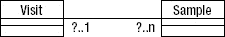

**图 4-5.** 收集样本的数据模型

询问一个样本是否**必须**关联到一次访问，就像上一节中关于订单是否**必须**有客户的问题一样。如果对于这个研究项目，我们的样本只来自农场，那么我们必须访问农场才能收集它们是合理的，因此每个样本应该总是与一次访问相关联。然而，如果数据库的范围更广，包含了存储多年且来源不确定的样本记录，我们可能需要重新考虑。如果我们坚持一个样本必须关联到一次访问，那么我们将无法轻松地记录这些历史样本的信息。

询问每次访问是否必须有一个相关联的样本（样本端的可选性应为 0 还是 1？）引出了一个有趣的问题：是否可能在某些时候，我们想记录为收集样本以外的原因访问农场的情况？这些问题看似微不足道，但只有这样才能增进对更广泛问题的理解。

### 基数为 1：它偶尔会是 2 吗？

问题的每个部分都可能受到特殊情况的影响。在分析情况时，仔细考虑不同的场景非常重要，以确保数据库能够充分处理所有可能出现的数据。一些“例外”实际上是被忽视的复杂情况。现实生活和真正的问题总是复杂的。即使是像*写下你通常的地址*这样简单的事情，也可能隐藏着困难，就像许多共享监护权的孩子在填写学校表格上的地址时所发现的那样。坚持问“一个人可能有不止一个常用地址吗？”可能显得吹毛求疵，但成千上万的现代家庭不能被轻易地当作例外。

在本节中，我们将探讨如何处理那些不值得对问题进行彻底改革，但在数据库的生命周期内仍可能出现的“例外”。在本章前面的旅舍数据模型示例中，我们已经看到了一个可能的例外。在那里，我们考虑了团体中某些成员可能想提前离开的情况。在旅舍数据模型中，我们没有通过允许每个团体有多个离开日期来使问题复杂化，而是重新定义了用于存储数据目的的“团体”含义（即一组在同一日期到达和离开的人）。

以下部分提供了一些其他例子，在这些例子中，不同的定义可以帮助应对一些可预见的、但不寻常的事件。

#### 昆虫示例

在上一节中，我们看了科学家访问农场收集昆虫样本的例子。如果天气晴朗或下雨，某些昆虫的行为可能不同，因此记录样本收集时的天气信息可能很重要。为了始终如一地记录天气状况，科学家可能决定从几个类别中选择。引入一个包含不同天气状况对象（例如，晴天、多云、下雨）的`天气`类可以确保信息被一致地记录。代表该数据的部分可能类图如图 4-6 所示。

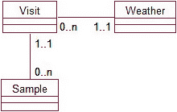

**图 4-6.** 将天气类别与访问相关联

从左到右阅读天气类别和访问之间的关系，一次访问有一个描述它的天气类型是合理的，但也可能有这样的情况：在收集最后几个样本时，一场雷暴来了。如果是这样，我们在意吗？答案当然取决于客户，但提出这个问题并提供一些可能性是分析师的责任。

在一个极端情况下，收集每个单独样本时的条件可能至关重要。在这种情况下，将每个样本与其自身的天气状况关联起来可能更为合理，如图 4-7.所示。

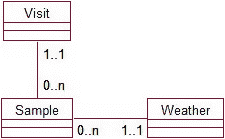

**图 4-7.** 将每个样本与一个天气类别关联

当大多数访问的天气状况稳定时，后一种解决方案可能就显得多余了。为 50 个样本中的每一个都记录相同的天气状况似乎毫无意义。一个折衷的解决方案可能是：如果天气发生显著变化，我们将创建另一次访问。这样，所有访问都只有一个关联的天气类型，并且我们可以通过重新定义“访问”的含义来处理“异常”情况。例如：

*一次访问是指在一天内天气条件恒定的情况下，在农场度过的时间。一天内可以对一个农场进行多次访问。*

这种折衷方案类似于我们在旅舍例子中对具有不同出发和到达日期的人员群体所做的重新定义。数据模型保持不变，但我们对访问的修订定义已经到位，以应对（俗话说）“闪电总会来临”的时刻。

#### 体育俱乐部示例

这是数据库问题的另一个小片段。一个本地体育俱乐部可能希望保留其会员名单以及每位会员当前效力的球队（`SeniorB`、`JuniorA`、`Veteran` 等）。一种对此数据建模的方式如图 4-8 所示。

**图 4-8.** 会员及其当前球队

当前的数据模型并不要求所有会员都必须关联到一支球队（球队端的可选性为 0）。这意味着会员可能纯粹是社交性质的，或者可能未被选入任何球队。然而，我们仍然应该询问关于一名会员可能关联的球队最大数量的问题。例如，“一名会员可以为多支球队效力吗？如果是，我们在乎吗？”该数据模型显然不允许保存历史记录。如果一名球员从一支球队晋升到另一支，他只会与新的球队关联，我们将失去他与先前球队关联的信息。如果数据库的范围仅仅是记录会员当前的球队隶属关系，那么这样是可以的。（如果不是，请稍等片刻，下一节会讲到。）

即使我们只保存当前的球队成员信息，我们也总会遇到这样的情况：伤病使得一支球队的成员需要为另一支球队在特定比赛中临时替补。这将如何影响数据模型？这是一个范围问题。我们为什么要保存这些数据？我们想从数据库中提取什么信息？如果我们想跟踪哪些球员参加了特定的比赛，我们的数据模型就严重不足了。我们将需要引入一个 `Match`（比赛）类并考虑其他复杂因素（参见第 5 章）。

然而，问题的范围可能仅仅是记录一个人的 `主要` 球队。这可能是为了让球队成员在比赛取消、练习重新安排或有社交活动时能够被列入电话通知名单。如果是这种情况，图 4-8 中数据模型的基数为 1 是可以的，只要理解关系 `效力于` 意味着球员的 `主要` 球队，而不仅仅是他们可能效力的任何球队。

### 基数为 1：历史数据怎么办？

我们已经看过了几个一端基数为 1 的关系的例子。一个房间有一位客人；一名俱乐部成员效力于一支球队。在这两种情况下，我们都谨慎地加上了 `当前` 一词，因为随着时间的推移，一个房间会迎来许多客人，一名球员会效力多支球队。一个重要的问题是，“我们希望系统跟踪以前的客人或以前的球队隶属关系吗？”这在分析阶段经常被忽视，而且有时这种疏忽要过一段时间才会显现出来。一个体育俱乐部可能会在第一个赛季发现它的系统运行良好，但当下一年的球队取代了之前的球队，而旧数据永远丢失时，可能会大吃一惊。在本节中，我们将看几个不同的例子来说明如何管理历史数据。

#### 体育俱乐部示例

为了说明体育俱乐部如何可能丢失其历史数据，让我们看一些可能保存在数据库表中的简单数据。如果每个会员只关联到一个球队，那么该球队就成了会员的一个特征，这种关系可以表示为 `Member`（会员）类中的一个属性，如图 4-9 所示。

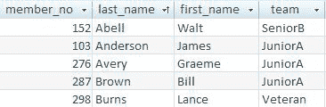

**图 4-9.** 会员及其当前球队

下一个赛季，当 Bill Brown 晋升到 `SeniorB` 球队时，他之前与 `JuniorA` 球队的关联将会丢失。如果历史数据很重要，就必须重新建模，以反映会员随着时间的推移将与多支球队关联这一事实。修订后的模型如图 4-10 所示。

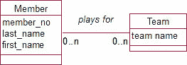

**图 4-10.** 会员及其效力的球队

#### 部门示例

图 4-11 是一个经常出现在教科书中的例子。从左到右阅读，我们看到每个部门有一名员工作为其经理。但这显然意味着是“某一时刻的一名”。随着时间的推移，一个部门会有几位不同的经理。

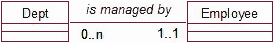

**图 4-11.** 每个部门都有一位经理。

对于这种情况，重要的问题是：“我们想跟踪前任经理吗？”我们为什么要保存关于经理的信息？如果只是为了在出现问题时有个人可联系，那么可能只需要现任经理。但是，如果我们想知道去年出现问题时是谁负责，我们就需要保存历史记录。数据模型需要改变，使得一个部门可以关联到多位经理，如图 4-12 所示。

**图 4-12.** 一个部门在不同时期有多位经理。

我们将在下一节看到，引入一个中间类将允许我们保存每位经理的任职日期。

#### 昆虫示例

这是我们科学昆虫样本数据库中出现的一个真实问题。为了理解数据背景，我们需要知道，这个长期项目的主要目标是研究随着多年来耕作方法的演变，昆虫数量如何变化。所选农场代表了不同的农业类型（有机、种植等）。在项目期间，多次访问了每个农场以收集样本。图 4-13 展示了早期数据模型尝试的一部分。

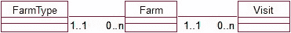

**图 4-13.** 对不同类型农场的访问

### 数据模型中的多对多关系：缺失信息与中间类

#### 数据模型的问题：历史记录的重要性

最初，图 4-13 中的数据模型似乎足以满足其目的，但这仅仅是因为在项目运行期间农场类型没有发生变化。然而，真正的麻烦还在后头。在此模型中，一个农场只能与一种农场类型相关联。当一个农场最终发生变化时，例如从传统种植农场转变为有机农场，如果数据库是这样设置的，之前的农场类型信息将会丢失。

一个农场只能在`at a time`与一种农场类型相关联。需要提出的关键问题是：“类型可能会随时间变化吗？系统记录该历史数据是否重要？”在这个案例中，保留农场类型的历史信息对整个实验至关重要，但这个问题之前没有被注意到，因为变化的时间跨度非常长。

#### 多对多关系：我们是否遗漏了什么？

到目前为止，我们在示例中已经遇到了相当多的多对多关系。例如，一个学生可以选修多门课程，一门课程也可以有许多学生注册。如果我们将一些示例的范围扩大到包含历史数据，如上一节所述，许多一对多关系将变成多对多关系（即，部门可能有许多经理，成员有许多团队，农场在长时间内有许多类型）。

我们经常发现需要保留一些关于多对多关系的额外信息。在运动队的例子中，我们修改了成员和团队的模型，以允许一个成员与多个团队相关联。然而，如果我们看一下图 4-10 中的模型，我们无从得知那些关联是*何时*发生的。没有附加日期的历史数据用处不大。但日期该放在哪里呢？在图 4-10 中，我们有两个类：`Member`和`Team`。日期不属于`Member`的属性，因为它将取决于我们感兴趣的团队。同样，日期也不能是`Team`类的属性，因为每个球员会有不同的日期。这个问题经常出现，通常的解决办法是引入一个新类。

我们需要提出这个问题：

> 是否有任何我们需要记录的数据，取决于多对多关系中两个类的特定实例？

在这个例子中，问题会是：

> 是否有任何数据取决于特定的球员和特定的团队？

答案是：

> 是的——该球员为该团队效力的日期。

图 4-14 展示了如何在多对多关系中引入一个中间类，以便可以包含那些取决于每个类对象特定配对的数据。

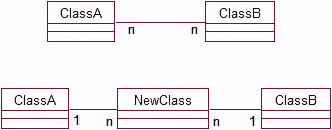

图 4-14. 在多对多关系中引入一个新类

在我们拥有取决于多对多关系中两个类实例的数据的情况下，多对多关系被一个新类和两个一对多关系所取代。新关系的“多”端总是连接到新的中间类。我们将看看这对于一些我们已经检查过的例子意味着什么。

##### 运动俱乐部示例

让我们重新考虑成员和团队的问题。我们将在类中放入一些属性，以更清楚地说明每个类维护的信息。模型如图 4-15 所示。

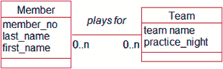

图 4-15. 成员与团队之间的多对多关系

正如我们已经提到的，特定成员为特定团队效力的日期不能存在于`Member`类中（因为一个成员会随时间效力许多不同的团队），也不能存在于`Team`类中。图 4-16 以与图 4-14 相同的方式引入了一个新的中间类`Contract`。

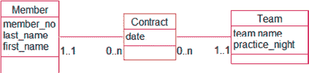

图 4-16. 中间类`Contract`，用于容纳成员为团队效力的日期

从中间类向外读，模型告诉我们每个`Contract`恰好对应一个团队和一个成员。从外向内读，我们看到每个成员可以有多个`Contract`，每个团队也可以有多个`Contract`。图 4-17 显示了可能出现在这样一个数据模型中的对象。

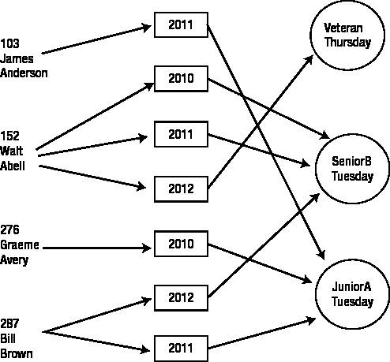

图 4-17. `Member`、`Contract`和`Team`类的一些可能对象

我们现在可以看到成员是哪几年为特定团队效力的。我们可以看到比尔·布朗（287）在 2004 年为`JuniorA`队效力，在 2005 年为`SeniorB`队效力。这些数据将存储在如图 4-18 所示的数据库表中。

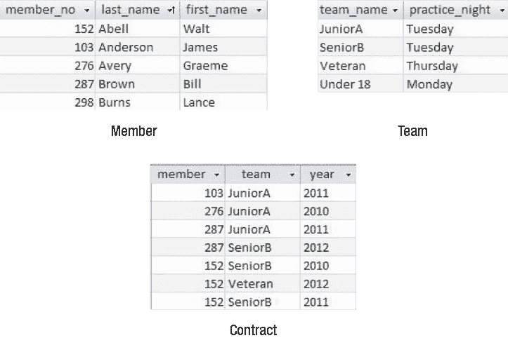

图 4-18. 球员、合同和团队的数据

##### 学生课程示例

现在让我们回到学生注册课程的多对多关系（图 4-3）。这不仅仅是一个历史问题，尽管我们显然会想知道学生何时完成了课程。但即使我们只为一个学年或学期保留学生注册信息，我们仍然应该看看是否有缺失的信息可能需要一个额外的类。需要提出的问题是：

> 是否有任何我希望保留的数据，是特定于某个学生及其在特定课程中的注册的？

一个明显符合前述标准的数据是成绩或分数。同样，我们不能将成绩保存在`Student`类中（因为它需要知道是哪门课程），也不能保存在`Course`类中（因为成绩取决于哪个学生）。以与我们在图 4-14 中处理这种情况相同的方式，我们可以在`Student`和`Course`类之间引入一个新类`Enrollment`，如图 4-19 所示。

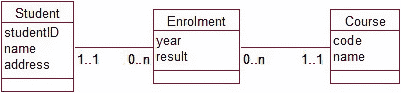

图 4-19. 中间类，用于容纳成绩（和学年）

一个学生和一门课程都可以有许多`Enrollment`，一个特定的`Enrollment`恰好对应一个学生和一门课程。如果我们画一些对象，我们会得到一幅与图 4-17 非常相似的图片，用学生、注册和课程替换了球员、合同和团队。

##### 送餐服务示例

作为我们何时可能需要一个额外类来保留多对多关系信息的最后一个例子，让我们再次看看前一章的送餐问题（例 3-1）。初始数据模型在餐食类型和订单之间有一个多对多关系。一种特定的餐食类型（比如鸡肉印度咖喱）可能出现在许多订单上，而一个特定的订单可能包含许多不同的餐食类型，如图 4-20 所示。

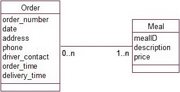

图 4-20. 不同餐食类型的订单

如果一个家庭点了三份鸡肉文达洛、一个汉堡和一份猪肉炒饭，会发生什么？我们该把这些数量放在哪里？这个数量不能作为 `Order` 类的一个属性（因为这个订单有三个数量，每个数量都取决于特定的餐食），也不能放在 `Meal` 类中（因为一个特定餐食类型可能会有数百个订单，每个订单的数量都不同）。

我们再次通过引入一个新类来解决将附加数据放在哪里的问题，如图 4-21 所示。

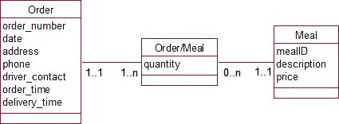

**图 4-21.** 不同餐食类型的订单——带有存储数量的附加类

对于某些问题，为中间类想出一个有意义的名字可能很困难。在这种情况下，我们总是可以像这里用 `Order/Meal` 那样，使用两个原始类名的组合。在这个例子中，我们或许可以把这个类叫做 `Orderline`，因为它代表订单中的每一行（即一份餐食和其数量）。你可能会发现，在图 4-21 中勾勒一下这三个类的一些对象，有助于厘清正在发生的事情。

我们还可以使用这个新的中间类来解决我们在第 3 章中推迟解决的另一个问题。这就是处理餐食价格随时间变化的问题。在图 4-21 的 `Meal` 类中，我们可以将 `price` 属性定义为该类型餐食的当前价格。今天为该餐食下的订单将以那个价格成交。我们如何知道几个月前的订单中，这类餐食收取了什么价格？为了解决价格变化的问题，我们可以在中间类 `Order/Meal` 中包含一个属性 `price`。这将是在特定订单中为特定餐食收取的价格，并且当 `Meal` 类中的当前价格发生变化时，它不会改变。这样，我们就完整记录了每笔订单中每份餐食的价格历史。在这个中间类中设置 `price` 属性，可以让我们保留历史数据，并处理诸如特价或折扣等“异常”情况。我们始终保留的是那个特定订单中为那类餐食实际收取的价格。

关于图 4-20 中原始多对多关系需要提出的问题是：

*有没有我们需要存储的、关于特定订单上特定餐食类型的信息？*

答案是：

*有，就是该订单上订购的该餐食类型的数量，以及为该餐食类型收取的价格。*

**何时多对多关系不需要中间类**

少数多对多关系包含解决问题所需的完整信息，无需在数据模型中引入中间类。涉及类别作为数据一部分的问题通常不需要额外的类。示例 1-1，“植物数据库”，涉及植物及其用途。原始数据模型在图 4-22 中重复展示。

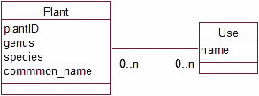

**图 4-22.** 植物及其用途

我们可以问一个问题：“关于特定物种和特定用途，有没有任何我们想要保留的信息？”

在这种情况下，答案可能是“没有。” 一个不需要任何附加信息的多对多关系，通常出现在我们拥有的东西属于多个不同类别时；例如，一种植物有很多不同的用途，而我们只想知道这些用途是什么。

然而，在另一种情况下，我们可能想记录某种特定植物作为树篱是否出色或只是尚可。或者我们可能想记录需要多少株特定物种才能足以吸引蜜蜂。在这两种情况下，我们可能需要一个中间类。试着为这些情况勾勒一个新的模型。

**总结**

即使在分析的非常早期阶段，一个简单的数据模型也能给我们提供许多问题。这些问题的答案将帮助我们更好地理解问题。由此产生的对问题的澄清应该最终反映在用例中，并可能影响最终模型和最终实现。

在本章中，我们提出了一些关于两个类之间单一关系的问题。我们讨论过的一些问题在此回顾一下：

**可选性：** 应该是 0 还是 1？考虑可选性是 0 还是 1 可能会影响我们对类的定义；例如，“一个没有选修任何课程的学生，为了我们数据库的目的，是否仍会被视为学生？”

**基数为 1：** 偶尔会是 2 吗？我们需要考虑是否可能出现例外情况，我们希望把两个数字或类别塞进一个设计为容纳一个的框里；例如，“如果访问期间天气发生变化怎么办？” 重新定义一个类可能有助于处理例外情况，比如，“如果天气变化，我们会将其称为两次访问。”

**基数为 1：** 历史数据呢？始终要考虑关系中的 1 是否真的意味着“一次只有一个”。例如，“一个部门有一位经理。我们想知道该部门之前的经理是谁吗？” 如果是这样，那么该关系应该是多对多。

**多对多：** 我们是否遗漏了什么？考虑是否有我们需要记录的、关于来自每个类的对象的特定配对的信息；例如，“关于特定学生和特定课程，我们可能想知道什么？” 如果有此类信息（例如，成绩），则引入一个新的中间类。

**测试你的理解**

**练习 4-1。**

图 4-23 展示了为一家出版社想要保留关于作者和书籍的信息的情况而做的初步建模。考虑关系 `writes` 两端可能的可选性，并由此确定一些对书籍和作者可能的定义。

**图 4-23.** 考虑作者写书可能的可选性。

**练习 4-2。**

图 4-24 展示了一个鸡尾酒配方的可能数据模型。多对多关系 `uses` 可以双向导航。为了找出曼哈顿鸡尾酒的配料，或者为了发现那瓶味美思酒的可能用途。缺少了什么？

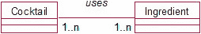

**图 4-24.** 鸡尾酒及其配料。缺少了什么？

**练习 4-3。**

图 4-25 展示了关于旅店客人数据模型的一部分。如何修改该模型以保留关于房间入住情况的历史信息？

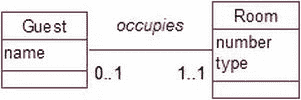

**图 4-25.** 如何修改此模型以保留关于房间入住情况的历史信息？

## 第 5 章

开发数据模型

### 属性、类还是关系？

在之前的章节中，你已经看到了如何通过考虑系统用户需要执行的任务来确定数据库问题的需求。任务用用例表示，并开发了一个简单的数据模型来表示所需的数据。在第 4 章中，你看到通过质疑简单关系的一些细节（特别是关系两端涉及的对象数量）可以学到很多关于问题的知识。在本章中，你将了解到几个经常出现的问题，以扩大你解决棘手情况的“武器库”。

##### 属性、类或关系？

永远不可能说某个给定的数据模型是*唯一*正确的。我们只能说它在给定范围内满足了问题的需求，并且基于某些假设或近似。如果我们有一段描述某个人、物或事件的数据，可能有不同的方式来表示该信息。在本节中，我们将看一个简单的问题，如示例 5-1 所述，其中各种数据片段可以根据问题的总体需求表示为属性、类或关系。

##### 示例 5-1：体育俱乐部

假设我们正在维护一个体育俱乐部当前队伍的信息。俱乐部希望保留非常简单的记录，包括队名、级别和队长。作为开始，我们可以有一个类来包含这些信息，如图 5-1 所示。

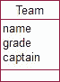

**图 5-1**。队伍的简单类

在图 5-1 中，我们为队伍捕获的每一条信息——名称、级别和队长的名字——都表示为一个属性。使用这个模型，我们可以找到任何给定队伍的属性值，但这就是我们能做的全部了。当然，这可能就是我们想做的全部！

在之前的章节中，我们看到考虑存储的数据未来如何使用是很重要的。对于图 5-1 中的数据，我们很可能希望找到某个级别的所有队伍。简单的数据模型允许这样做吗？当然可以找到所有具有给定`grade`属性值的`Team`对象；然而，为了获得可靠的数据，我们需要数据录入完全准确。如果不同对象的`grade`属性值被分别记录为“Senior”、“snr”、“Sen Grade”、“Senior Grd”等，我们就无法获得 Senior 级别的所有队伍的准确列表。我们在示例 2-1 中看到了类似的问题，当时我们想确保植物属信息（如*Eucalyptus*）的拼写始终正确。如果可靠地记录和提取关于级别的信息对我们的体育俱乐部很重要，那么我们需要一个能确保级别被一致记录的数据模型。这可以通过将队伍的级别表示为一个类来实现，如图 5-2 所示。每个可能的级别都成为`Grade`类的一个对象，每个队伍都与相应的`Grade`对象相关联。

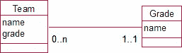

**图 5-2.** 将队伍级别表示为一个类

因此，根据项目的需求，我们可以选择将级别表示为`Team`的一个属性（如果拼写的一致性不重要），或者表示为它自己的一个类（例如，如果我们认为可能想要查找属于同一级别的所有队伍）。

现在考虑图 5-1 中的`captain`属性。一个人不太可能同时担任多支队伍的队长，因此类似于上一节中的查询（查找 Jenny 目前担任队长的所有队伍）不太可能是一个高优先级需求。然而，我们可能希望保存一些关于队长的额外数据：也许是她的电话号码和地址。在体育俱乐部的背景下，这些信息很可能已经存在于某个会员名单中。我们很可能有另一个类`Member`，它保存了体育俱乐部所有会员的联系信息。如果是这样，我们可以将队伍的队长表示为`Team`和`Member`类之间的关系，如图 5-3 所示。一个特定的`Member`对象是一个`Team`对象的队长。

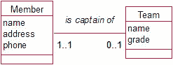

**图 5-3.** 将队长表示为一个关系

再次，根据问题的不同，我们有不同的方式来表示队伍的队长。我们可以选择将队长表示为`Team`的一个属性，或者表示为`Member`和`Team`之间的关系。这里的决定因素将是问题是否需要关于会员的一般信息。

在考虑是否将信息表示为属性、类或关系时，可以问一些有用的问题，总结如下：

*   “我是否可能想要使用某个给定的信息片段进行汇总、分组或选择？” 例如，你是否可能想根据级别选择队伍？如果是，请考虑将该信息片段变成一个类。
*   “我现在或将来是否可能存储关于这个信息片段的其他数据？” 例如，你是否可能想保存队长的电话和地址等信息？这些信息是否（或应该）已经存在于另一个类中？如果是，请考虑将该信息片段表示为类之间的关系。

### 类之间的两个或更多关系

如果我们还想保存关于为一支队伍打球的人的信息，图 5-3 中的模型将如何改变？我们可能需要知道他们的名字和电话号码。将所有信息作为`Team`类的属性保存将很快变得难以处理。我们将需要诸如`player1Name`、`player1Phone`等属性。我们很可能已经在一个`Member`类中拥有了我们需要的关于球员的信息。特定会员为特定队伍效力这一事实因此可以表示为类之间的关系。这与示例 2-1 中植物对象与特定用途对象相关联的情况非常相似。图 5-4 展示了在我们的数据模型中添加的`Member`和`Team`之间的这种关系。

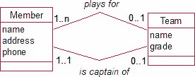

**图 5-4.** Member 和 Team 之间的不同关系

现在在我们的`Member`和`Team`类之间有两个关系。一个是关于哪些会员为队伍效力（可能有很多）。另一个是关于哪个会员是队伍的队长（只有一个）。图 5-4 中的模型也允许有不为任何队伍效力或担任任何队伍队长的会员（他们可能是俱乐部的社交会员）。这样的会员将简单地不与任何队伍关联。

你可能在想，团队的队长是否应该始终是团队中的一员。如图 5-4 所示的模型，并未对此类约束给出任何说明。有多种方式可以表示此类约束。一种可能是将约束纳入相关的用例中。对于描述录入团队信息的用例，我们会规定队长必须是团队成员之一。由对象管理组开发的*对象约束语言（OCL）*^(1)，作为对统一建模语言（UML）的补充，为约束提供了形式化规范。在本书中，我将不深入探讨形式化方法，而更倾向于在用例文本中指出这些额外的约束。

另一种可能需要考虑类之间存在两种关系的情况是当我们拥有历史数据时。示例 5-2 重新审视了我们在第 4 章中首次探讨的`Rooms`（房间）、`Groups`（团体）和`Guests`（客人）示例。

**示例 5-2：小型旅社**

一个小型旅社由单人房组成。通常，团体（如学校班级）会住在该旅社。我们将扩展第 4 章的问题，保留以往客人和当前客人的信息。一个房间随着时间的推移会有许多客人入住。（为简化，我们假设每位客人只入住一次，且只住一间房。）修改后的模型如图 5-5 所示。

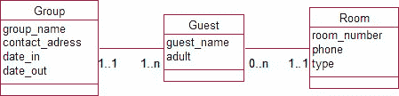

图 5-5. 单人房随时间拥有多个客人的模型

该旅社主要接待团体游客，因此入住和退房日期属于团体信息，而非每位客人个人。

我们能从图 5-5 的模型中发现什么？如果我们想查询某位客人，可以轻松找到其房号，还可以通过查看相关团体对象的日期来确定其入住时长。如果我们想找出当前占用某房间的客人姓名（比如有噪音投诉），事情就变得稍微复杂一些。每个房间随着时间的推移关联的客人越来越多，那么我们该如何找到当前这位客人呢？一种方法是搜索与该房间关联的所有客人，并检查他们相关的团体信息，以找到一个`date_out`（退房日期）在未来的记录。另一个可能的任务是检索空房列表。为此，我们必须找出那些没有关联`date_out`在未来的团体的客人居住的房间。

这些解决方案是可行的，但对于可能需要定期执行的任务来说，它们既复杂又繁琐。另一种选择是考虑在`Room`（房间）和`Guest`（客人）之间为*当前*客人建立第二种关系。所有客人都将像图 5-5 中那样与一个房间关联，但我们在当前客人与房间之间增加一个额外的关系。如图 5-6 所示。

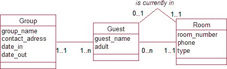

图 5-6. 房间随时间拥有多个客人的替代模型

使用图 5-6 的数据模型，我们只需参考两个类（`Room`和`Guest`）的对象即可找到当前客人。而使用图 5-5 的模型，我们还需要检查`Group`对象的日期属性值。要查找空房，我们现在只需查找所有没有当前客人的房间即可。

以这种方式建模数据存在一些问题，因为需要额外的更新来保持数据一致性。例如，当一个团体退房时，我们必须更新`Group`中的`date_out`，同时还需要移除每个*当前入住*关系实例，以反映房间现在为空。这个额外的维护步骤是因为我们实际上以不止一种方式存储了同一信息。虽然图 5-6 的模型在*检索*空房和当前客人信息时更简单，但数据的*更新*却更复杂。表 5-1 展示了针对团体退房以及为每种数据模型列出当前所有空房报告的可能用例。

表 5-1. 两种客人与房间模型的一些可能用例对比

|   | **使用图 5-5 的数据模型** | **使用图 5-6 的数据模型** |
| :--- | :--- | :--- |
| 团体退房 | 更新相应`Group`对象的`date_out`。 | 更新相应`Group`对象的`date_out`。查找所有关联的`Guest`对象，并移除与`Room`对象的*当前入住*关联。 |
| 列出所有当前空房 | 首先找出被占用的房间：查找所有`date_out`在未来的`Group`对象。找出这些团体的所有关联`Guest`对象，以及这些客人关联的所有`Room`对象的集合。列出*未*包含在此集合中的所有`Room`对象的`room_number`。 | 查找所有没有关联当前`Guest`对象的`Room`对象。 |

很明显，对于图 5-6 这类模型，报告生成更简单；而对于图 5-5 这类模型，维护更简单。图 5-6 模型的问题在于，如果团体退房时所需的更新操作没有正确执行，最终会导致数据库信息不一致。虽然图 5-6 的模型看起来更容易查询，但这是以增加维护难度、从而更可能损害可靠性为代价的。正如你将在下一节看到的，最好避免信息被存储不止一次的情况。

至此，我们意识到，如果我们想保留房间占用的历史数据，那么图 5-5 或 5-6 中的模型对于旅社问题都不算特别好。第 4 章讨论的方案允许我们保留哪些团体曾入住旅社、客人是谁以及房间当前居住者的信息。这些都运作良好。一旦我们尝试添加关于房间占用的历史数据，模型就变得难以管理。第 4 章的“测试你的理解”部分提出了另一种解决方案。

### 类之间的不同路径

使用图 5-6 的模型，我们可以通过两种路径找到房间的当前客人：通过*当前入住*关系，或者通过检查每位曾入住该房间客人的`date_out`日期。这里的问题是，如果数据维护不当，我们可能会得到两个不同的答案。例如，如果一个团体退房了，但我们没有移除所有*当前入住*关联（如表 5-1 中的用例），那么第一条路径会给出房间的前一位客人，而第二条路径则会显示该房间为空。

### 冗余、陷阱与数据模型

正如前一节所论证的，易于检索的优势似乎可能超过随之而来的数据维护复杂性。我们应不惜一切代价避免的是，当没有相应的复杂性降低时，为一条信息提供替代路径。

#### 冗余信息

本应相同的信息通过两种不同路径获取，可被称为 **冗余信息**。在上一节中，关于当前房间住户的信息就是冗余的。我们可以通过检查 `is currently in` 关系来找到当前住户，或者通过查看团队的退房日期来推断当前住户。

让我们看一下示例 5-3，这是冗余信息的另一个案例。

##### 示例 5-3：创业孵化器

一家创业孵化器有若干员工，他们各自为一个或多个小型项目团队工作。每个团队及其所有员工都安置在一个特定的房间里，较大的房间会容纳多个团队。我们可能需要诸如每位员工的工位在哪里、特定员工的电话号码、某个团队在哪里、哪些员工在每个团队中、谁在每个房间等信息。一种可能的数据模型如图 5-7 所示。花点时间理解这个数据模型及其所包含的关于特定问题（如一个房间内有多少团队等）的信息。该模型存在冗余信息。你能看出来吗？

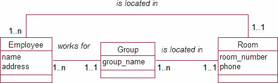

***图 5-7.** 包含冗余关系的员工、团队和房间*

关于示例 5-3，如果我们经常需要查找员工的电话号码，可能会认为图 5-7 中 `Employee` 和 `Room` 之间的顶部关系是一个有用的直接路径。然而，通过 `Group` 的替代路径，同样可以非常容易地获得此信息。我们可以找到该员工（唯一）所属的团队，然后找到该团队（唯一）所在的房间。这是一个非常简单的检索过程（它不涉及困扰示例 5-2 中那家小旅馆的日期相关复杂问题）。

然而，这个额外关系不仅是不必要的，而且是危险的。对于相同信息有两条路径，我们有可能得到两个不同的答案，除非数据得到非常仔细的维护。每当员工更换团队或团队转移房间时，都需要更新两个关系实例。如果没有非常仔细的更新流程，我们最终可能会得到“Jim 在 A 团队，A 团队在 12 号房间”，而另一条路径可能直接将 Jim 关联到 15 号房间。**冗余信息容易导致不一致，应始终予以移除。**

> **注意** 每当数据模型中存在封闭路径时（如图 5-7），值得仔细检查以确保没有关系是冗余的。

#### 提供不同信息的路径

并非所有封闭路径都必然意味着数据冗余。其中一条路径可能包含不同的信息。稍微修改示例 5-3 中的问题，允许一名员工为多个小型项目团队工作。如图 5-8 所示。现在你能推断出某位员工在哪个房间吗？

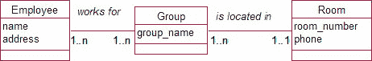

***图 5-8.** 为多个项目团队工作的员工*

在图 5-8 的模型中，没有确定明确的路径连接员工和特定房间。例如，A 团队可能在 12 号房间，B 团队在 16 号房间，而 Jim 可能同时为两个团队工作。因此，Jim 可能在 12 号房间，也可能在 16 号房间。仅仅缩小这种可能性可能就是问题所需的全部。然而，如果每位员工有一个主办公室，而我们希望记录该信息，就需要在员工和房间之间建立一个额外的关系，如图 5-9 所示。

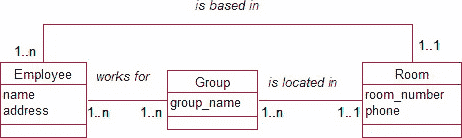

**图 5-9.** 不同的路径提供不同的信息。

看起来我们似乎引入了另一条路径，对于诸如“Jim 在哪个房间？”这样的问题会给出不同的答案。图 5-9 允许我们让 Jim 的办公室不同于他工作的任何一个团队所在的房间。对于现实生活中的问题，这可能正是所需要的。房间的大小和团队的员工数量不太可能总是匹配。重要的是确保两条路径不包含本应相同的信息，这样我们就不会引入可避免的不一致性。

#### 路径产生的虚假信息（扇形陷阱）

无法从图 5-8 推断出员工的房间，是一个更普遍问题的例子。请看示例 5-4。

##### 示例 5-4：更大的组织

一个组织有多个部门。每个部门拥有许多员工，并进一步划分为若干团队。我们可以将其建模为图 5-10。看看这个模型。关于特定员工与哪个（或哪些）团队相关联，我们能推断出什么？

**图 5-10.** 对组织进行建模的一种（危险）方式

图 5-10 代表了一个非常常见的问题，通常被称为 **扇形陷阱**。这里的危险在于，沿着员工和团队之间的路径进行推断，可能会得出并非本意的结论。图 5-11 展示了一些与图 5-10 模型一致的可能对象实例。

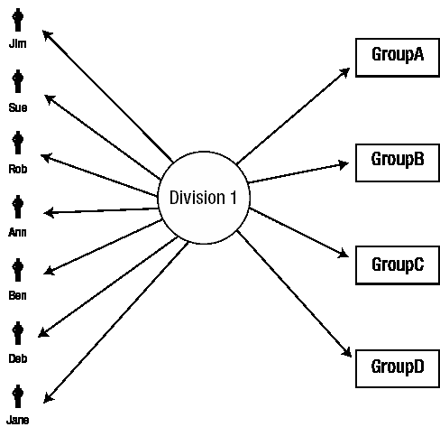

**图 5-11.** 一个扇形陷阱

考虑员工 Jim 和 Sue。无法推断 Jim 或 Sue 在哪些团队工作。只能得到许多共享同一部门的 `Group` 对象和 `Employee` 对象的组合：Jim A、Jim B、Sue B、Jane D 等等。^(2) 我们绝不能将这些组合误认为是所需的信息——例如，Jane 属于哪个（或哪些）团队？

让我们意识到扇形陷阱的特征是：一个类在两端具有“多”基数性的两个关系。这导致了图 5-11 中的扇形形状。

我们能对此做些什么？如果系统能够显示员工工作的团队对我们很重要，那么我们需要在 `Group` 和 `Employee` 之间建立另一种关系，或者我们可能需要以完全不同的方式建模该问题（如下一节所示）。

#### 类之间路径的缺口（峡谷陷阱）

我们可能会选择以层次结构的方式对部门、团队和员工之间的关系进行建模，如图 5-12（即一个部门拥有多个团队，一个团队拥有多名员工）。员工-团队关系一端的可选性尚未指定。思考一下不同的可能性。

**图 5-12.** 对组织建模的另一种方式

图 5-13 展示了一些示例对象。我们有一个员工与一个单一组之间的直接联系（Jim 在 A 组工作），以及另一个组与其所属的一个部门之间的联系（A 组属于 1 部门）。因此，我们可以在 Jim 和 1 部门之间建立明确且唯一的联系。

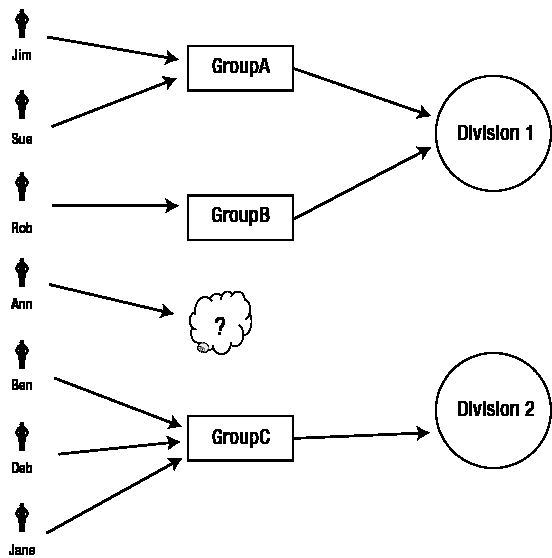

图 5-13. 一个 `断层陷阱`

到目前为止，一切顺利。然而，在类似情况下，检查这种联系是否始终存在总是有用的。如果 Ann 没有分配到具体的组呢？也许她是 1 部门的总管理员，为所有组服务。如果一个员工不一定属于某个组，那么图 5-12 中的模型就无法提供 Ann 与其部门之间的链接。要找到合适的 `部门` 对象，我们需要知道其所在的 `组`，但 Ann 没有相关的 `组` 对象。如果我们需要知道这个信息，那就有问题了。这有时被称为 `断层陷阱`（我们无法从这里到达那里）。

这又是一个通过仔细研究数据模型而对问题提出有趣疑问的案例。对于像图 5-12 这样的模型，我们应该始终检查员工可能未附加到任何组的特殊情况。

如何解决 `断层陷阱` 问题取决于我们正在建模的情况。一种可能是在部门和员工之间添加另一个关系，这样我们总是可以建立那种联系。然而，这种额外的关系会导致信息冗余。对于许多员工来说，我们将有两种方式将他们与部门联系起来：直接联系和通过其所在的组联系。这就是我们在示例 5-3 中遇到的情况，并可能导致连接员工和部门的结果不一致。**不推荐**。

在示例 5-4 中解决问题的另一种方法是引入另一个组对象（管理或辅助人员）。Ann 可以属于这个组，然后我们可以坚持每个员工 `必须` 属于一个组。然而，也许这个问题需要完全重新建模。通常最好回到用例，重新考虑对问题而言什么信息是最重要的。在资源有限的项目中，不可能捕捉到每一个细节，因此务实主义变得非常重要。

#### 同类对象之间的关系

让我们回到示例 5-1 中的体育俱乐部。许多俱乐部要求新成员由现有成员介绍或担保。如果需要存储担保信息，数据模型的初步尝试可能如图 5-14 所示。

图 5-14. 对成员和担保人建模（不正确）

图 5-14 中模型的问题在于（根据定义）担保人是成员。该模型意味着，如果 Jim 担保俱乐部的一名新成员，我们将为他存储两个对象（一个在 `成员` 类中，一个在 `担保人` 类中），两者可能包含相同的信息（直到不可避免地变得不一致）。这里真正发生的是成员相互担保。这可以通过如图 5-15 所示的 `自关联` 来表示。

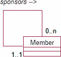

图 5-15. 成员担保其他成员

图 5-15 中的关系读起来与两个不同类之间的关系完全一样。顺时针阅读，我们有 *一个特定成员可以担保许多成员*，而逆时针阅读，我们有 *一个特定成员恰好由一个成员担保*。与所有关系一样，我们必须根据方向改变动词（即 *担保* 和 *由...担保*）。我已经在图 5-15 上做了标注，以消除关于我们朝哪个方向进行的任何困惑。

这个数据模型中没有任何内容阻止成员担保自己。此类约束需要被记录下来，最有效的方法是在适当的用例中提及它们（例如，添加成员时）。

`自关联` 出现在很多情况中。对于与谱系或动物育种相关的数据来说尤其如此。考虑图 5-16 中的情况，我们记录有关动物及其母亲的信息（为了让例子简单，我省略了父亲！）。

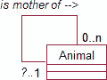

图 5-16. 关于动物的谱系数据

顺时针阅读，我们有 *一只动物可能是多只其他动物的母亲*，而逆时针阅读，我们有 *每只动物最多有一位母亲*。为什么不是 *恰好* 一位母亲？每只动物都应该有妈妈，不是吗？这就是我们必须非常清楚我们的类定义的地方。`动物` 类代表那些我们正在保存其数据的动物，而不是所有动物。例如，如果我们追溯一只纯种狗的血统，我们可能会在我们的数据库中找到他的母亲，以及她的母亲，但最终我们会找到一片空白。你可能会争辩说，为了完整性应该添加额外的世代，但这可能意味着要追溯到原始的泥浆。我们的数据模型并不是说 *有些动物没有母亲*，而仅仅是说 *有些动物没有记录在我们数据库中的母亲*。

顺便说一句，请注意，我们的 `动物` 类可能包含两种性别的动物。显然，如果我们确定两个 `动物` 对象之间存在 `是...的母亲` 关系，那么母亲必须是雌性。就目前而言，模型中没有任何内容阻止雄性动物被记录为母亲。这种约束可以在用例中表达，但如果这是一个严肃的谱系数据库，我们可能希望对雄性和雌性进行稍微不同的处理。我们将在第 6 章 中讨论如何使用称为 `泛化` 和 `特化` 的技术来处理此类情况。

#### 涉及两个以上类的关系

在到目前为止的例子中，我们感兴趣的信息通常涉及两个类之间的关系（例如，哪些成员在哪个队中，或哪个员工在哪个组中）。有时我们的数据依赖于两个以上类的对象。让我们重新考虑一个体育俱乐部。除了保存有关成员及其当前队伍的数据外，我们可能还想保存有关队伍之间比赛的信息。现在忽略像轮空这样的复杂情况，^(3) 我们可以说一场比赛恰好有两支队伍参加。一个可能的数据模型如图 5-17 所示。

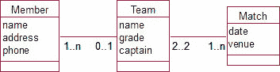

图 5-17. 成员、队伍和比赛的可能数据模型

图 5-17 中的模型允许我们记录一名球员当前或所属的主要球队、特定球队的当前成员，以及球队参与的比赛。然而，我们无法推断出特定球员是否参加了某场给定的比赛（他可能因病或受伤）。这就是本章前面描述的*扇形陷阱*的一个例子。一支球队有许多球员，并参与多场比赛，但我们无法进一步说明哪些球员参与了特定的比赛。我们可以尝试通过添加`Member`和`Match`之间的关系来解决这个问题，如图 5-18 所示。仔细看看这个新的数据模型。你能看出数据可能在哪里变得不一致吗？

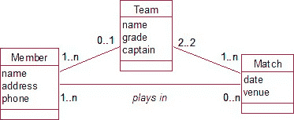

图 5-18. 另一种表示成员、球队和比赛的模型

从图 5-18 来看，可能存在以下关系实例：

*   约翰为 A 队效力。
*   约翰参加了周二的比赛。
*   周二的比赛在 B 队和 C 队之间进行。

如果约翰只效力于一支球队（如模型所示），那么这里就有些不对劲了。

让我们进一步思考一下成员、球队和比赛这个问题。如果我们想跟踪谁参加了哪些比赛，我们的问题有一些复杂性，而模型未能充分表示。如果我们允许人员受伤不参赛，我们还需要考虑另一队人员可能需要替补的情况。例如，约翰通常为 A 队效力，但周二因为斯科特受伤而为 B 队替补。我们在前一段中的情景并不那么奇怪——只是比我们最初想的稍微复杂一些。

然而，我们仍然有一个问题。我们满意约翰通常为 A 队效力，而且他恰好参加了周二 B 队与 C 队之间的比赛，但模型并没有告诉我们他是为哪支队伍比赛的。

我们需要退一步，重新审视用例，并弄清楚我们到底想知道什么。如果我们想知道每场比赛中每支队伍的确切上场球员，那么图 5-18 中的任何关系组合都无法告诉我们这一点。关键点在于，谁在哪个比赛中为哪支队伍效力，需要同时知晓来自三个类的对象信息：哪个`Member`，哪个`Team`，以及哪个`Match`。这有时被称为*三元关系*（类似地，四个类称为四元关系，依此类推）。

当我们需要的信息要求同时知晓来自三个（或更多）类的对象时，我们就引入一个新的类，连接到所有三个类，如图 5-19 所示。

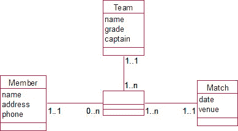

图 5-19. 成员及其在特定比赛中所效力的球队

我们或许能为这个类想一个合适的名字；在这个例子中，`Appearance`是合理的。如果想不到，将其他三个类名连接起来也足够（例如，`Team/Member/Match`）。这与我们在第 4 章中考虑的多对多关系中引入新类并无不同。与那种情况类似，每个外部类的基数为 1。

解读这个模型，我们得到类似这样的信息：每次出场涉及一名成员、一支球队和一场比赛（例如，吉姆在 12 日星期六的比赛中为 A 队出场）；每名成员可能有多次出场（吉姆可以参加多场比赛，可能为不同的球队）；一支球队会有多名球员在不同比赛中出场；一场比赛会有多名球员为每支队伍出场。

新类可能有属性，也可能没有。它可能只是`Member`、`Team`和`Match`对象有效组合的存放处。如果新类有属性，它们必须是涉及所有三个类的信息。例如，关于特定球员在特定比赛中为特定球队效力，我们需要知道什么？可能是位置。如果我们想知道吉姆在 12 日星期六的比赛中为 A 队担任后卫，我们的新类就是记录该信息的地方。

图 5-19 显然包含了一些无法从图 5-18 推断出的额外信息。反之呢？我们能从图 5-19 重新创建出图 5-18 中的所有信息吗？通过查看图 5-19，我们可以推断出一个球员效力过的所有球队、参加过的所有比赛，以及每场比赛涉及的球队。我们不需要在每对类之间添加额外的关系来弄清楚这些信息。事实上，这样做是危险的，因为那样我们就会有两条途径来查找一条信息，而且正如我们所看到的，这种冗余可能导致不一致。然而，可能还有关于每对类的其他信息我们希望保留。例如，在图 5-19 中，我们知道吉姆效力过的所有球队，但我们不知道他通常与哪支球队一起训练。除了与新类的关系外，三个类之间可能还需要一些二元关系。

每当我们遇到类似图 5-19 的模式时，我们应该检查其他二元关系是否必要。如果我们有类 A、B 和 C 连接到第三个类，对于每一对类，我们应该问一个问题，比如：“是否存在我需要知道的关于 A 和 B 之间关系的信息，而这个信息独立于 C？”对于前面的例子，我们可以问：“是否存在我需要知道的关于球员和球队的信息，而这个信息独立于比赛？”这里的答案会是：“是的。我想知道球员的主要球队。”因此，我们会添加一个二元关系来表示该信息，如图 5-20 所示。

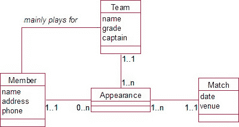

图 5-20. 包含一个独立于某一类的二元关系

我们需要为其他每种组合提出类似的问题；例如，“关于特定球队和特定比赛，我需要知道什么独立于成员的信息？”也许是获胜球队。“关于特定成员和特定比赛，我需要知道什么独立于球队的信息？”也许是裁判是谁。

### 总结

本章描述了一系列常见的建模情况。研究这些情况有助于更精确地理解和表示现实问题。这些情况总结如下：

