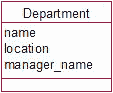
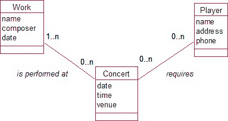

# 依赖于三个或更多类对象的信息

当你需要同时了解来自三个或更多类的对象的组合时，考虑引入一个新类；例如，哪个成员在哪场比赛中为哪支队伍效力？
新类中的任何属性必须依赖于来自*每个*参与类的特定对象组合；例如，关于特定`成员`在特定`队伍`的特定`比赛`中，我需要了解什么？
考虑什么信息可能与来自贡献类*对*的两个对象相关；例如，关于特定成员和特定队伍，*独立于*任何比赛，我需要了解什么？

### 检验你的理解

练习 5-1.

图 5-21 中的类记录了关于一个部门和经理姓名的信息。对于建模部门的经理和位置信息，还有哪些其他选项？

**图 5-21.** 对部门信息建模的初步尝试

练习 5-2.

一所大学希望为课程的教学信息建模。可能有多个教职员工参与授课，其中一位教职员工被指定为课程主管。请提出一个初步的数据模型。

练习 5-3.

你会如何为婚姻信息建模——谁和谁结婚，以及何时结婚？思考所有可能出现的不同情况（为简化，目前暂不考虑参与者的性别）。

练习 5-4.

一个管弦乐队保存着关于其音乐家、曲目和音乐会的信息。一个部分数据模型如图 5-22 所示。这些关系存储了诸如“Joe Smith 被要求参加周六的音乐会”和“贝多芬的小提琴奏鸣曲将在周六的音乐会上演奏”等信息。

**图 5-22.** 管弦乐队曲目和音乐会的部分数据模型

从这个初始模型中可能推导出哪些错误信息？
修正该模型，使其能正确维护以下信息：

*   哪些演奏者参与了音乐会中特定的作品
*   音乐会上将要呈现的作品
*   演奏者参加特定音乐会所获得的报酬

¹[`www.omg.org/`](http://www.omg.org)
²这种情况有时也被称为`有损连接`。
³在队伍数量为奇数的竞赛中，有时会出现`轮空`。

