# 第 6 章
## 泛化与特化

随着数据模型开始发展，有时会出现一些情况，我们发现一个类可能无法像我们希望的那样清晰地描述我们可能的对象。我们可能会发现，对于某些对象，其中一些属性并不真正适用。例如，如果我们有一个类来记录公司所有相关人员的信息，我们可能会发现有些人是小时工资率，而另一些人是年薪。在许多方面，关于每个员工的大部分信息是相似的，但也存在差异。我们也可能遇到这样的情况：我们最初有两个独立的类，例如`讲师`和`学生`，然后开始意识到它们之间有大量共同信息，或者它们涉及相同的关系（比如说，谁有停车许可）。我们如何以务实的方式处理这些“相同却又不同”的情况？

一些值得牢记的问题是：

`这两个类是否有足够的共同点，需要重新考虑它们的定义方式？`
`给定类中的某些对象是否与其他对象有足够大的差异，值得重新考虑其定义方式？`

## 共同点很多的类或对象

考虑一个希望保存员工信息的公司。对于所有员工，它需要保存员工编号、姓名、联系地址和工作类型，但根据工作类型的不同，其余信息可能有所不同。行政人员可能有级别，技术人员可能有证书续期日期。一些工作者可能有年薪，而另一些可能有小时工资率。

让我们以一个外包公司保存行政人员和技术人员信息的简单情况为例。作为开始，我们可以只考虑一个类，`员工`，如图 6-1 所示。在图 6-2 中，我们展示了该类的一些可能对象。

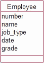

**图 6-1.** 保存在一个类中的不同类型工作者的信息

**图 6-2.** 类`员工`的一些可能对象

### 数据建模：继承

#### 数据不一致问题

我们该如何看待 Ann？她被记录为一名技术人员，但没有到期日期，而是有一个等级。这里就有点令人困惑了。她既是技术人员又是行政人员吗？如果她是技术人员，为什么没有到期日期？或者（正如最可能的情况）是否出现了某种数据录入混乱？一个允许明显不一致或不完整数据输入的数据库，将无法提供准确或可靠的信息。我们本可以在用例描述中对维护**员工**数据添加一些约束（例如，如果**工作类型**=技术人员，则**等级**必须为空且**日期**必须有值），但这相当混乱，并且随着其他工作类型的加入只会变得越来越复杂。我们可以考虑完全移除**工作类型**字段，理由是我们可以根据到期日期或等级的存在与否来推断工作类型。我们可以推断 Jane 是一名行政人员，即使**工作类型**字段为空。然而，如果我们移除**工作类型**字段，关于 Pat 我们又能推断出什么呢？目前，我们知道她是一名行政人员，其等级目前未知或不需要。没有了**工作类型**字段，我们将一无所知。

当然，真正的问题是：“我们是否真的能输入不一致或不完整的数据，这真的重要吗？”对于某些应用程序来说，可能并不重要。然而，如果项目的目标之一是能够生成关于员工工作类型和能力的可靠统计数据，那么图 6-1 中简单的类显然不太实用。

## 专业化

上一节的情况是*专业化*的一个例子。通常，我们有许多具有共同特征的员工，但根据每个人的工作类型，我们可能希望保存不同的专业化数据。数据建模通过*子类*和*超类*为这个想法提供了一种机制，这个概念被称为*继承*。图 6-3 显示了一个名为**Employee**的类，以及它的两个子类（有时称为*继承类*），名为**Administrator**和**Technician**。

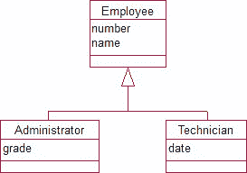

**图 6-3.** 包含专业化信息的子类

箭头下的两个类派生自**Employee**，这意味着除了它们自己的任何属性之外，它们还将拥有**Employee**类的所有属性。

我们现在有三个类：**Employee**的对象将具有**number**和**name**（以及通常与所有员工相关的任何其他信息）；**Administrator**的对象将具有**number**、**name**和**grade**；**Technician**的对象将具有**number**、**name**和**date**。一些可能的对象如图 6-4 所示。

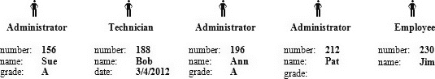

**图 6-4.** 符合图 6-3 模型的一些对象

每个对象都是三个类之一：**Employee**、**Administrator**或**Technician**。现在不可能再出现一个有等级的技术人员了。然而，也有可能存在像 Pat 这样的员工，她是一名行政人员但等级未知。我们还有一个既不是行政人员也不是技术员的员工（尽管我们将在本章后面看到，这并不推荐）。

通过这个模型，我们能够准确保存不同类型员工及其工作的专业数据。如果我们需要保存其他类型员工的信息，只需添加更多子类即可。例如，我们可能发现需要添加另一个类来保存电工及其注册号的信息。

能够在不干扰现有类所保存数据的情况下添加新类，对于创建能够随情况变化而演进的软件非常重要。在软件工程中，这被称为开闭原则：*软件实体（例如类）应该对扩展开放，对修改封闭*。观察图 6-3，这意味着一旦开始存储数据，我们就不应更改顶层类**Employee**。对该类的任何更改都会影响所有现有的子类（**Technician**和**Administrator**），这可能会影响使用它们的任何应用程序。但是，我们可以通过添加额外的子类（例如**Electrician**）来扩展问题。这意味着顶层或父类必须在开始时非常仔细地设计；它应该尽可能通用。

## 一般化

当我们从两个不同的类开始并发现它们有一些共同行为时，使用类和子类的模型也很有用。让我们考虑一个如图 6-5 所示的数据库，其中包含关于讲师和学生以及他们教授或注册课程的信息。

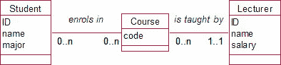

**图 6-5.** 作为独立类的讲师和学生

大学可能（像所有大学一样）有停车问题，并决定每个人被允许拥有一个且仅有一个指定的停车位。如果我们希望在模型中包含此信息，可能会尝试如图 6-6 所示的解决方案。然而，我们很快遇到了一个真正的问题。你能看出是什么吗？

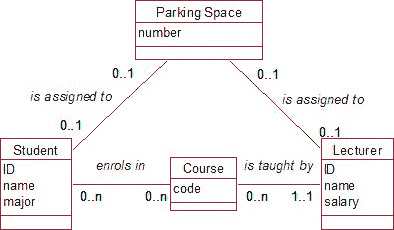

**图 6-6.** 用于维护停车信息的可能模型

从底到顶阅读模型，我们看到学生和讲师每人最多可以有一个停车位。这没问题。然而，从顶到底看，我们发现一个停车位可以分配给一个学生，同一个车位又可以分配给一个讲师。模型没有显示的是，一个停车位不能同时分配给一个学生和一个讲师。

我们以前遇到过对特定对象的约束，我们可以在维护数据的用例中指定这些约束。然而，这里我们有一个更优雅的解决方案。在许多方面，我们的**Lecturer**和**Student**对象具有相同的行为——它们被分配了停车位。它们也有共同的属性——它们都有一个名字和一个 ID。我们可以通过创建一个超类来捕获这些共同的数据和行为，如图 6-7 所示。

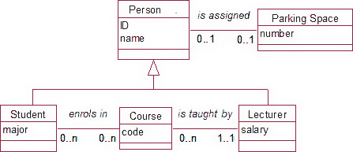

**图 6-7.** 捕获在超类中的共同行为

在这个模型中，我们有“人”，具有 ID 和名字（以及其他共同属性），每人可以被分配一个停车位。学生是有专业并注册课程的人，而讲师是有薪水并教授课程的人。我们现在没有棘手的额外约束问题，因为一个停车位不能同时分配给一个讲师*和*一个学生；我们只是规定一个停车位分配给一个人。

#### 继承总结

本章到目前为止我们所看的例子中，专业化和一般化只是同一枚硬币的两面。它们都导向如图 6-8 所示的通用数据模型。

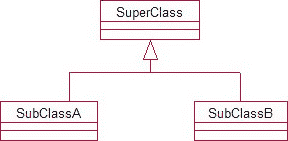

**图 6-8.** 显示继承关系的数据模型

**SubClassA**和**SubClassB**都是类**SuperClass**的专业化类型。它们将拥有**SuperClass**的所有属性，并额外拥有自己的专业化属性和/或其他类的关系。

### 面向对象设计：继承的适用性、误区与权衡

#### 何时考虑继承（子类与超类）

当你发现自己在思考诸如“但一个停车位可能关联给讲师*或者*学生”，或者“一次预订可能为个人*或者*公司”等情况时，考虑使用一个超类来捕获共同行为。

当你发现，“有些对象会有这个属性的值，但没有那个属性的值”，或者“只有部分类的对象会与那个类的对象存在关联”，你应该考虑创建一些子类来捕获这种专业行为。

要检查继承（子类和超类）是否适用于某个特定问题，你应该问以下问题。例如，要检查图 6-8 中的`SubClassA`是否真的是`SuperClass`的子类，可以问：

*   `SubClassA`的对象是否总是`SuperClass`的一种？（总是/有时/从不）
*   `SuperClass`的对象是否总是`SubClassA`的一种？（总是/有时/从不）

如果第一个问题的答案是“总是”，而第二个问题的答案是“有时”，那么这个问题就非常适合用继承模型来解决。例如，我们可以通过提问来检验图 6-3 的有效性：

*   管理员是否总是员工的一种？（总是）
*   员工是否总是管理员的一种？（有时）

这些答案意味着将`Administrator`作为`Employee`的子类是可行的。

提出“总是/有时/从不”的问题有助于理清复杂的问题描述。假设我们有一个复杂的员工层级结构，包括管理员、代理人、销售人员等等。这两个“总是/有时/从不”的问题可以帮助我们梳理清楚。假设我们发现：

*   代理人总是销售人员，而销售人员总是代理人。

我们知道，在这种情况下，“销售人员”和“代理人”是同一个事物的两种不同称呼。我们应该只有一个类，叫做`Salesperson`或者`Agent`。

然而，假设我们发现：

*   销售人员总是代理人，而代理人有时是销售人员。

这里，我们就有充分的理由考虑将`Salesperson`类作为`Agent`的子类。

#### 何时继承不是一个好主意

数据模型中的继承并不像你最初想象的那么常见。人类非常擅长将事物分类到层级结构中，一旦人们掌握了数据建模中的继承概念，就可能会想在所有地方都使用它。在上一节中，我谨慎地说明，对“A 是否是 B 的一种？”这个问题的肯定回答，只意味着使用继承*可能*是一种理清问题的可能方式。在本节中，我们将看几个例子，在这些例子中，继承绝对不是思考问题的好方法。

##### 混淆对象与子类

考虑一个不同品种的狗的数据库。我们可能有一个品种的层级结构，乍一看可能认为继承是一个可行的方案。考虑以下陈述：

*   柯基犬是一种狗。
*   罗孚是一只柯基犬。
*   奎因是一只拉布拉多犬。
*   拉布拉多犬是一种狗。

虽然这四句话很相似，但它们并不都暗示子类。罗孚和奎因不是类；它们是某个狗类的*对象*。另一方面，柯基犬和拉布拉多犬可能是某个超类`Dog`的子类，但也许也不是。让我们考虑如何判断某物是对象还是类。为什么罗孚很可能是对象，而柯基犬可能是类？

一个快速帮助判断某物是类还是对象的方法是提出这样的问题：“我是否可能拥有多个<某物>，并且我是否对它们作为一个群体感兴趣？”例如：

*   我是否可能拥有多只柯基犬，并且我对它们作为一个群体感兴趣？很可能。因此柯基犬是一个潜在的类。
*   我是否可能拥有多只罗孚，并且我对它们作为一个群体感兴趣？很可能有多只名叫罗孚的狗，但很难想象为什么仅仅因为它们有相同的名字，我们就会对它们作为一个群体感兴趣。

柯基犬和拉布拉多犬是潜在的类，而奎因和罗孚更可能是我们某个狗类的对象。一个可能的层级结构以及一些符合前述陈述的对象如图 6-9 所示。

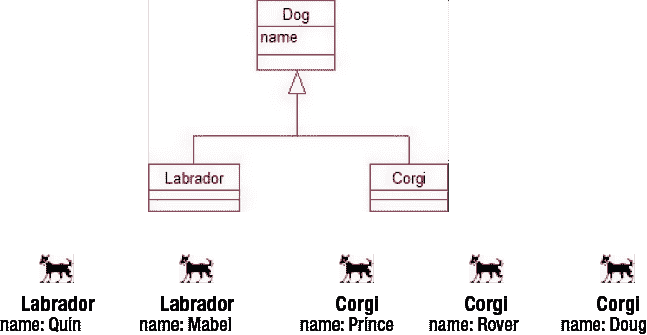

**图 6-9.** 狗数据模型的一些可能的类、子类和对象

##### 混淆关联与子类

图 6-9 中的模型起初可能看起来不错，但实际上我们不需要继承来维护关于我们狗的不同品种的简单信息。到目前为止，我们并没有为拉布拉多犬保存任何与柯基犬或其他品种不同的信息。我们只是注意到我们的狗中有些是柯基犬，有些是拉布拉多犬，这可以通过在`Dog`对象与另一个名为`Breed`的类的对象之间建立简单的关联来实现，如图 6-10 所示（假设为纯种狗）。

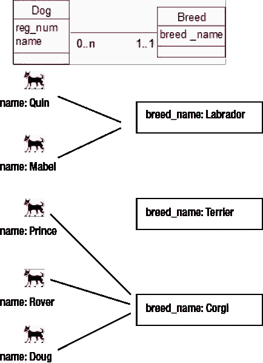

**图 6-10.** 每个`Dog`对象都关联到一个品种。

图 6-10 中的模型比图 6-9 中的模型简单得多。由此产生的数据库也将更容易维护。在图 6-9 中，如果我们添加一个新品种，就需要添加一个新的*子类*。而对于图 6-10 的模型，我们只需要再添加一个`Breed`类的*对象*。

如果问题变成我们想保留支付给养犬俱乐部的费用，并且这些费用因品种而异（例如，拉布拉多犬花费 100 美元，柯基犬 80 美元，梗犬 85 美元）呢？现在我们有了一些关于品种的不同信息，是否应该重新考虑专门的类？

不。我们这里有的只是一个属性`fee`的不同*值*，这可以很容易地在`Breed`类中容纳。只有当我们拥有不同的属性或关系（而不仅仅是属性值不同）时，才需要考虑专门的类。

#### 何时值得考虑继承

我们已经看到，看起来像继承的东西通常可以通过简单的关系更简单（且有效地）表示。在什么情况下值得考虑继承呢？让我们为我们的狗模型设想另一个场景。

假设镇议会保留了一份狗的登记册。其中一些只是普通的家庭宠物，而另一些可能是与养犬俱乐部有关联的参展犬。如果（一个很大的如果）议会想要保留这些信息，那么像图 6-11 这样的模型可能值得考虑。

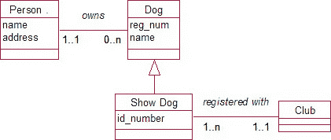

**图 6-11.** 使用继承展示不同行为的可能模型

在图 6-11 中，我们看到参展犬不仅拥有额外的属性（例如，`id_number`可能用于指向其谱系记录），而且拥有不同的关联（即，参展犬会在养犬俱乐部注册，而普通宠物不会）。

我们还能如何建模呢？嗯，我们可以给所有狗一个`id_number`属性（对于普通宠物可以留空），并让所有狗都与俱乐部有一个可选的关系，如图 6-12 所示。你能看出这个模型有什么缺点吗？

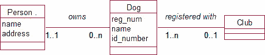

**图 6-12.** 不使用继承的可能模型

利用图 6-12 中的模型来捕获所有所需信息是可行的，但要保持数据的准确性却并非易事。我们遇到的问题与之前图 6-1 和 6-2 中关于`Employees`模型的问题如出一辙。那些没有`id_number`却与俱乐部相关的狗怎么办，反之亦然？这些是参展犬，还是仅仅是数据录入失误？

是否使用继承的决策，取决于数据的完整性和准确性对项目目标的重要性。这又把我们带回到了第 3 章中思考过的问题。主要目标是什么？范围是什么？这些数据的准确性有多重要？总的来说，当你刚开始处理一个问题时，最好让你的解决方案尽可能简单。继承为许多涉及特化和泛化的问题提供了优雅的解决方案，但你应该只在必要时才使用它。

#### 超类应该拥有对象吗？

在图 6-11 中，我们有一个狗的类，其中参展犬是其子类。这里的含义是，你普通的宠物将是超类`Dog`的对象，而参展犬将是子类的对象。随着项目的发展，这可能会导致一些问题。

正如我们所见，我们只应在拥有需要精确维护的、具有专门数据的对象时才考虑继承。我们需要确保我们开发的模型能够应对未来范围的变更或扩展。

考虑一个图书馆，它建立了一个小型数据库来维护关于书籍的信息（目录号、标题、作者）。一段时间后，它在馆藏中加入了有声读物。有声读物拥有与普通书籍完全相同的属性，但除此之外还有播放时长。这似乎是建立专门子类的一个合理候选，我们可能会得到一个如图 6-13 所示的模型。

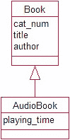

`图 6-13.` 有声读物的专门类

如果我们基于这个模型建立数据库，我们可能会有一些`Book`类型的对象（包含编号、标题和作者的值）和一些`AudioBook`类型的对象（包含编号、标题、作者和播放时长的值）。一段时间后，问题可能会发生变化，我们可能想为普通书籍保存一些额外的信息——例如，页数。我们现在遇到了一个问题。我们的有声读物是超类的对象：如果我们向父类`Book`添加一个属性`page_num`，它将被我们的`AudioBook`子类对象继承，这完全不是我们想要的。

当数据模型的父类拥有对象时，就可能出现这个问题。通常建议是，任何拥有子类的类都应该是`abstract`类，这意味着它不能拥有对象。抽象类的目的是保存对其子类通用的信息，这些信息可以被那些类的对象所继承。遵循这个建议，我们应该在层次结构的顶部有一个抽象类（比如`Item`），以及它的两个子类`Book`和`AudioBook`，如图 6-14 所示。这样，我们可以在不影响另一个子类的情况下对我们每个子类进行更改。

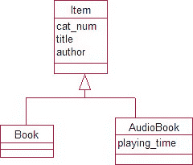

`图 6-14.` `Item`作为抽象类

`Book`最初可能没有额外的属性，这并不重要。类已经存在，随时准备在我们想要进行更改时使用。我们现在可以将页数添加到`Book`类，而不会影响`AudioBook`类。

#### 属于多个子类的对象

本章中的大多数例子，问题都被极大地简化了。在图 6-15 中，我们有一个模型，其中`Lecturer`（讲师）和`Student`（学生）被表示为`Person`（人）类的子类，同时还有这两个子类的一些对象。我们看到，在这种情况下，我们的对象要么是讲师，要么是学生。

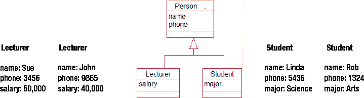

`图 6-15.` 学生和讲师是不同的。

图 6-15 处理了讲师和学生截然不同这种简单情况。然而，更可能的情况是两者之间存在一些重叠。如果讲师约翰同时也在兼职攻读文学学士学位，而学生琳达为了支付学费在兼职教学怎么办？我们该把约翰的专业和琳达的工资存在哪里？

我们可以再创建两个对象，为约翰额外创建一个`Student`对象，为琳达额外创建一个`Lecturer`对象，但这种方法存在问题。我们现在总共有六个`Person`对象，而现实中只有四个人。任何关于人数的统计或汇总都将是不准确的。另一个问题是，琳达将有两个对象，它们都会有`name`和`phone`的值，当琳达的联系方式变更时就会引发问题。必须在两个地方进行更新。

一个解决方案是考虑另一个同时继承自`Student`和`Lecturer`的类。从两个不同的父类继承有时被称为`multiple inheritance`（多重继承）。我们新的`Lecturer/Student`类的对象将拥有属性`name`、`phone`、`salary`和`major`，如图 6-16 所示。

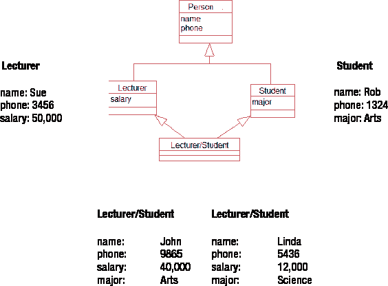

`图 6-16.` 使用多重继承来捕获两个类的对象（不推荐）

图 6-16 中的方法存在困难。从纯粹务实的设计角度来看，明显的问题是，当中间层添加更多类时，我们就会陷入麻烦。如果我们在`Person`下添加新的类（例如`Administrator`和`Cleaner`）作为额外的子类，我们就需要在底层添加一大堆子类来应对所有可能的组合。例如，兼职做讲师的管理员、兼职学习的研究人员、为资助学业而做一大堆额外工作的贫困学生，等等。这种方法很快就会失控。

我们的问题在于，我们一直将学生和讲师视为不同类型的人，而实际上他们都只是做不同事情的人。思考这类场景的一个更好方式，与其说是存在不同类型的“人”，不如说是存在扮演许多不同“角色”的人。我们可以将这些工作或角色建模为一个类，并根据我们需要存储不同信息的工作为其创建许多不同的子类。与其让`People`有子类，我们可以有另一个类（我们称之为`Contract`），它拥有代表我们需要描述的不同角色的子类。然后，每个人可以拥有许多合约，如图 6-17 中的模型所示。

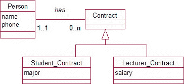

`图 6-17.` 人可以拥有多种角色（合约）

与图 6-16 场景一致、且符合图 6-17 数据模型的一些对象如图 6-18 所示。我们可以清楚地看到，我们有四个人，他们各自承担着若干不同的角色。一个人可以拥有不止一份合约，而每份合约都与一个人相关联。

### 数据库设计中的继承与组合模式

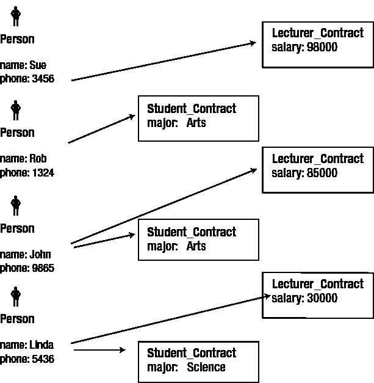

#### 使用角色（契约）作为多重继承的替代方案

Figure 6-17 中的方法在添加新角色时很容易调整（例如，管理员、清洁工）。如果我们希望将与其契约特定信息一起包含的管理员，只需向 `Contract` 类添加另一个子类 `Administrator_Contract`。

然而，存在一个小问题。在 Figure 6-17 中，一个人可以关联多个契约，但我们对契约的类型没有任何约束。该模型无法阻止 Linda 与多个 `Lecturer` 契约和/或多个 `Student` 契约关联。在现实中，这可能正是问题所需。Linda 可能在完成艺术学位后继续攻读科学学位。John 可能被晋升并签订一份新的 120,000 美元契约。我们可以向父 `Contract` 类添加一些日期属性，以便契约可以被识别为连续或重叠。总体而言，Figure 6-17 中的模型非常灵活，并允许我们以透明的方式处理许多复杂情况。

然而，我们需要确保我们问题的目标需要这种关于人员及其所承担角色的准确性。如果目标是维护关于不同类型员工、他们的薪酬和资格的可靠统计，那么这种模型对于帮助我们理解现状是必要的。如果这些信息仅是次要的（即，我们的主要目标是维护学生注册和结果），那么我们可能不需要引入子类来维护人员可能扮演的其他次要角色的专门数据。

## 组合与聚合

通常，我们有由其他对象组成的对象：森林由树木组成或建筑物由房间组成。有些人使用特殊符号表示这种关系，但我从未发现这样做特别有帮助。

当处理我们拥有这种对象的组合或聚合的情况时，继承会变得有用。考虑一栋建筑有多个房间，如 Figure 6-19 所示。每年建筑物必须进行安全检查。偶尔需要检查个别房间。我们可以有一个记录日期的 `Check` 类。`Check` 类应该与 `Building` 类关联，还是与 `Room` 类关联，或与两者关联？

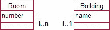

**Figure 6-19.** 一栋建筑有许多房间。

出于此问题的目的，`Room` 和 `Building` 有共同之处。它们都可以与安全检查关联。因此，这成为继承解决方案的候选。首次尝试如 Figure 6-20 所示。

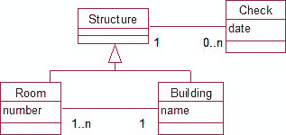

**Figure 6-20.** 建筑和房间都是可能进行安全检查的结构类型。

现在我们可以存储关于单次检查的数据，其中包含建筑物（并且我们知道包括了哪些房间）。然而，如果需要，检查也可以与单个房间关联。虽然这个解决方案很好，但使用软件模式可以使其更加通用。有许多对软件开发人员有用的设计模式[¹]。它们主要处理行为，而我们的重点是数据。Figure 6-21 中的解决方案基于 `Composite` 模式。

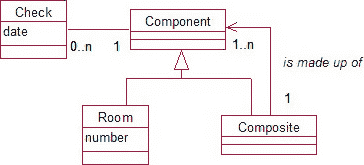

**Figure 6-21.** 使用组合模式。对组件进行检查，该组件可能是单个房间或其他组件的组合。

Figure 6-21 中的模型说明，我们有一个可以进行安全检查的东西（组件）。该组件可能是一个单独的组件（在本例中是一个房间）或其他组件的集合。例如，我们可以有一个 `Composite` 对象，它是一个由房间组成的建筑物。这类似于 Figure 6-20。然而，我们的新模型更通用，因为 `Composite` 可以由其他组合构成。例如：一个工业区可能由建筑物组成，每栋建筑物由楼层组成，每个楼层包含房间。使用 Figure 6-21 中的 `Composite` 模式，我们可以在任何级别（房间、楼层、建筑物等）记录安全检查。

我们将在 Chapter 7 中研究如何在关系数据库中表示继承。与此同时，Figure 6-22 中的表显示了信息可能如何记录。`Check` 表显示组件 3 在 2012 年 2 月 3 日 被检查。从 `Composite` 表中，我们可以推断（通过查看右列）组件 40 和 60 属于 3，而组件 113、115 和 117 属于 40 或 60。`Component` 表记录了所有这些实体是什么，因此我们知道 2012 年 2 月 3 日 的检查是在福布斯大楼上，该大楼包含 4 楼和 6 楼，其中又包含房间 F403、F409 和 F632。在 2012 年 2 月 10 日，对 113（房间 F408）进行了一次检查，该房间没有子部分（未出现在 `Composite` 表的右列中）。

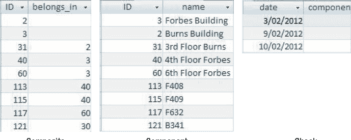

**Figure 6-22.** 表示组合模式的数据库表

## 并不容易

继承提供了一些非常优雅的方式来为非常复杂的问题建模。然而，获得一个能处理所有最终数据的类和子类层次结构是非常困难的。我们在本章中仅涉及了继承的*数据*方面。如果我们需要向类添加*行为*（或方法），处理继承的类会变得相当困难。然而，添加行为超出了本书中考虑的基于数据的问题的范围。

即使对于静态数据，当我们尝试设计继承层次结构时，仍然可能遇到问题。考虑 Figure 6-23 中的模型。

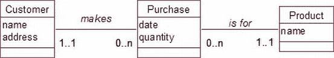

**Figure 6-23.** 一位业余生物学家用于保存动物数据的模型

将动物分为鱼类、哺乳动物、鸟类等，在输入有关熊、狗、鲨鱼和麻雀的数据时可能效果很好。但是当我们遇到鲸鱼时会发生什么？鲸鱼完全不符合 Figure 6-13 的模型。鲸鱼是哺乳动物，但它也需要被显示为生活在海水中，类似于鱼类。如果数据库已经实现并输入了大量数据，插入层级或移动子类之间可能非常困难。一开始就正确设计非常重要。构思不佳的继承可能比解决的问题带来更多问题，因此在数据库问题中要非常谨慎地使用它。

在 Chapter 7 中，我们将看到如何在关系数据库中捕获这些数据模型的最重要部分。

### 总结

继承可能适用的情况包括以下几种：

[¹]: 设计模式是软件设计中常见问题的通用可重用解决方案。

### 继承的使用原则

*   如果不同对象在某些属性上具有互斥的值（例如，管理员有等级而技术员有日期），请考虑专门的子类。
*   当你认为 *这就像那个，除了……* 时，请考虑子类。
*   当两个类与另一个类具有相似的关系时，请考虑一个新的泛化超类（例如，如果学生和员工都被分配停车位，考虑一个针对人的泛化类）。

在使用继承之前，请确保：

*   你没有将对象与子类混淆（例如，`Rover` 很可能是一个对象，`Dog` 或 `Cat` 可能是类）。
*   你已经考虑过与类别类的关联是否足够（例如，`Labrador` 和 `Corgi` 可以是 `Breed` 类的对象，并且每只狗都可以与一个品种关联）。
*   这不仅仅是属性值不同（例如，不要因为 `Labrador` 和 `Collie` 的费用不同就考虑继承）。

其他注意事项：

*   拥有子类的类应该是抽象的，这意味着它们永远不会有任何对象。这使得问题更容易扩展。
*   当遇到 *我的对象同时是这两个类的成员* 这个困境时，请考虑与角色的关联。
*   除非子类中的专门数据对项目的主要目标很重要，否则不要引入继承的复杂性。

### 测试你的理解

##### 练习 6-1

考虑图 6-24 中的模型，该模型描述了一家销售玩具的小型邮购公司客户对产品的购买。为简单起见，每次购买针对一种或多种相同的玩具。每笔交易必须有一名客户，以便向其开具发票并交付产品。这些数据将用于准备关于所售不同产品、购买价值和客户消费习惯的统计信息。

`images/9781430242093_Fig06-24_fmt.jpeg`

**图 6-24.** 客户购买产品。

公司改变了其业务方式，允许客户直接上门支付现金。无需将任何客户与现金购买关联。讨论以下数据变更的有效性。

*   将关系客户端的可选性更改为 0，这样并非所有购买都需要客户。
*   将可选性保留为 1，但包含一个名为 `CashCustomer` 的虚拟客户对象。
*   创建 `Customer` 的子类：`Cash_Customer` 和 `Account_Customer`。
*   创建 `Purchase` 的子类：`Cash_Purchase` 和 `Account_Purchase`。

##### 练习 6-2

1.  一位农民保存有关其农作物施肥（例如，数量、日期）的信息。他的农场由大片区域组成，这些区域又被划分为田地。通常，一次施肥施用于整个区域，但偶尔也会施用于单个田地。你会如何建模？

##### 练习 6-3

2.  一家志愿者图书馆有员工、会员和书籍。它想知道哪些书借给了谁，知道如何联系借阅者，并对逾期图书收取费用。参考书不可外借。会员逾期图书每天罚款 5 美元，但员工不会收到罚款。你会如何为这种情况建模？一些初始类如图 6-25 所示。

`images/9781430242093_Fig06-25_fmt.jpeg`

**图 6-25.** 人们可以借书。

¹ Erich Gamma, Richard Helm, Ralph Johnson, and John Vlissides, *Design Patterns: Elements of Reusable Object-Oriented Software* (Indianapois, IN: Addison and Wesley, 1994.)

