# 第 7 章


## 从数据模型到关系数据库设计

让我们回顾一下迄今为止的故事，在我们致力于设计数据库的过程中。我们从用例开始，描述问题的基本需求，并开发了初始数据模型。通过仔细查看模型的细节，我们能够提出问题，以帮助理解现实世界问题中进一步的微妙之处和复杂性。然后，我们研究了许多模型中出现的一些情况，希望这些在其他上下文中遇到困难情况时会很有用。

目标不是试图获得一个完美或完整的模型。我们寻求的结果是就一个能准确反映现实世界问题基本需求的模型达成一致。这将涉及多次迭代，因为用例会调整以反映改进的理解和变化的范围。在获得一套大家都满意的用例和数据模型后，我们现在可以进入开发过程的第三阶段，如图 7-1 右下角方框所示。

`images/9781430242093_Fig07-01_fmt.png`

**图 7-1**. 数据库开发过程

在本章及后续章节中，我们将研究如何设计可在关系数据库产品（例如 MySQL、Microsoft Access、SQL Server、Oracle 等）中实现的数据库。

### 表示模型

我们不遗余力地在数据模型中捕获尽可能多的细节。其中许多细节可以通过关系数据库管理软件中内置的标准技术来表示和强制实施。一个好的模型，使用标准技术实现，使我们能够捕获类之间关系所隐含的许多约束，而无需借助编程或复杂的界面设计。

在本章中，我将向你展示数据模型的许多方面如何能够通过标准数据库功能来捕获。为了让你了解即将的内容，我在表 7-1 中总结了这些技术。

***表 7-1**. 表示数据模型方面的技术*

| **模型中的特性** | **关系数据库中使用的技术** |
| --- | --- |
| 类 | 添加一个带有主键的表。 |
| 属性 | 向表中添加一个具有适当数据类型的字段。 |
| 对象 | 向表中添加一行数据。 |
| 1-多关系 | 使用外键，即引用关系“1”端表中特定行（或对象）的键。 |
| 多-多关系 | 添加一个包含两个外键的新表。 |
| 关系“1”端的可选性为 1 | 要求外键的值是必需的。 |
| 父类和子类（继承） | 为父类添加一个表。为每个子类添加表，其主键也是引用父表的外键（不是精确表示，但可以接受）。 |

表 7-1 中描述的所有技术都可以在大多数数据库管理产品中作为表规范的一部分执行。更复杂的约束可能需要一些额外的程序或在数据输入时进行检查，但如果有一个好的模型，这可以最小化。通过利用数据库产品的内置设施，应用程序的实现、维护和扩展所需的时间大大减少。

### 表示类和属性

考虑图 7-2，它表示了成员和团队数据模型的一小部分。

`images/9781430242093_Fig07-02_fmt.jpeg`

**图 7-2**. 成员和团队数据模型的一部分


### 设计数据库表

第一步是为每个类设计一个数据库表。类的属性将成为表中的字段或列名，当数据被添加时，表中的每一行或记录将代表一个对象。例如，作为开始，我们将为图 7-2 中的`Member`类创建一个名为`Member`的表。该表将有两个字段或列，一个用于存储成员的姓名，一个用于存储地址。然后，我们将为每个成员对象（例如，John Smith，83 SomePlace，Christchurch）在表中添加一行。

#### 创建表

所有关系数据库都允许你使用 SQL 创建表，SQL 是一种用于创建、更新和查询数据库的语言。首先，我们需要一个存储所有表的数据库。要创建一个表，我们需要提供表的名称以及每列的名称和域。域指定了该特定列允许的值集。我们将在本章后面稍作讨论域。对于许多目的，仅指定数据类型就足够了，例如日期（8/4/12）、一段文本或一组字符（"Mary Smith"）、一个整数（467）或其他类型的数字（3.57）。特定的数据库产品提供不同的数据类型，我们将在“选择数据类型”一节中稍后讨论合适的选择。

除了提供 SQL 作为创建表的方式外，许多数据库还提供更图形化的前端，用户可以通过它提供有关列及其数据类型的信息。创建一个非常简单的`Member`表的等效方式如清单 7-1 以及图 7-3 和图 7-4 所示。图 7-3 显示了 MySQL Workbench 前端，而图 7-4 显示了 MS Access 中的等效界面。这两个程序都会生成类似于清单 7-1 所示的 SQL 语句。请注意，这两个字段的数据类型在 Access 中称为`Text`，在 SQL 中称为`VarChar`。它们都表示用户将能够输入最多指定最大数量（姓名为 25，地址为 40）的任意数量的字符。

**清单 7-1.** 用于创建包含两个字段的 Member 表的标准 SQL 命令

```sql
CREATE TABLE Member (
    member_name VARCHAR(25),
    member_address VARCHAR(40)
);
```

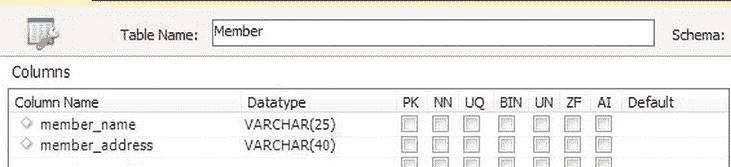

**图 7-3**. 在 MySQL Workbench 中创建 Member 表

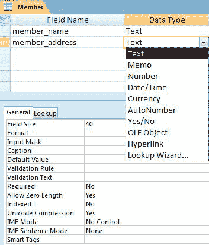

**图 7-4**. 在 Microsoft Access 中创建 Member 表

正如你在图 7-3 和图 7-4 中看到的，列还有许多其他可能的规格说明。我们将在后面讨论其中的一些。现在我们只是为每列声明了名称和数据类型的最低要求。表创建后，我们就可以输入数据。对于`Member`表，我们将为每个成员对象输入一行。同样，这可以通过如清单 7-2 中的 SQL 命令完成，或者对于许多产品，可以通过类似表格的前端完成，如 Access 中的图 7-5 所示。

**清单 7-2.** 用于向 Member 表插入记录的 SQL 命令

```sql
INSERT INTO Member (name, address)
VALUES ('Green, Ruth', '36 Some Street, Christchurch');
```


**图 7-5**. 通过 MS Access 界面输入数据

#### 选择数据类型

类中的每个属性都成为表中的一个`field`或列。当我们创建表时，我们需要为该字段提供一个名称（例如，`name`，`address`）并指定将存储在该字段中的数据类型。数据库产品通常提供数量惊人、各不相同的数据类型，但它们基本上分为以下几类：

**字符类型**：这些类型允许你输入任意组合的字符——数字、字母和标点符号。它们用于姓名、地址、描述等。你通常需要为进入该字段的数据提供一个最大长度。在 SQL 中，`VARCHAR(60)`类型允许你输入最多 60 个字符。在 Access 中，等效类型称为`Text`。如果你有大量文本（注释、讨论等），你可能需要查看其他类型（例如，SQL Server 中的`Text`或 Access 中的`Memo`）。

**整数类型**：这些类型用于输入没有小数部分的数字。它们非常适合用于客户编号等 ID 号以及任何你可以计数的东西。数据库系统通常提供不同大小的整数类型（`long`、`short`、`byte`等），它们可以输入的最大数字也不同。除非你有特定的性能问题或数据量极大，否则使用普通整数类型（SQL 中的`INT`）可能就足够了。只需检查它能处理的最大数字是否足够你的数据。

**带小数部分的数字**：这些用于你测量的东西（身高、体重等）以及诸如平均值等计算产生的数字。大多数情况下，使用称为`float`或`single`（取决于你使用的产品）的类型就足够了。如果你需要特别精确的测量或计算，还存在其他类型。一种`float`可能不适用的情况是当你需要准确记录相当大数额的金钱时。许多产品现在为此提供了`money`或`currency`类型，或者你可能会发现该类型被称为类似`fixed-length decimal`。这些类型使你能够拥有许多有效数字，从而可以准确地跟踪你的数十亿资产，精确到几分之一美分！

**日期**：不用猜也能知道你可以在这类字段中存放什么类型的数据。如果你的产品有不同的日期类型，有些可能允许你包含时间，而另一些可能允许你访问更久远的过去或将来的日期。

为什么选择正确的数据类型很重要？你可以争辩说，既然你可以将任何东西放入字符字段，那么你可以为所有东西都使用字符字段（我确实见过这么做的！）。选择适合每个字段的数据类型主要有三个原因：

**值的约束**：字符字段类型对你可输入的内容没有约束；然而，大多数其他字段类型有约束。数字字段不允许你意外地输入错误，例如，输入额外的小写字母`O`而不是数字`0`。日期字段不允许输入 2 月 29 日，除非是闰年，等等。因此，电话号码（可能包含括号`()`等额外符号）需要存储在字符字段而不是数字字段中。

**排序**：不同类型的字段有不同的比较或排序值的方法。例如，字符字段可以按字母顺序（A 到 Z）排序，数字字段可以按数字顺序（从小到大）排序，日期可以按时间顺序（较早的优先）排序。如果你将数字存储在字符字段中，然后要求你的产品对它们排序，你可能会得到类似这样的结果：10，12，123，2，200，36。字符字段中的日期可能像这样排序：August 1，2012；February 1，2012；May 4，2012。你能看出为什么吗？


**计算：** 你的数据库产品可以对数据进行算术运算和执行其他功能，但前提是数据类型必须正确。例如，它将能够对数字进行加、乘和平均运算；计算两个日期之间相隔的天数；以及在一段文本中查找特定字符。你需要拥有正确的数据类型才能利用这些功能。回到电话号码的例子，你绝不应该对它们进行减法、平均或按数字排序，因此它们通常可以且应该存储在字符字段类型中。

#### 域与约束

域是允许用于属性或字段的一组值。对于像产品描述这样的情况，域可以是任意字符集（直到某个指定长度）可能就足够了。其他属性可能具有更具体的域。例如，性别属性可能只允许值“M”或“F”；星期几可能被约束为字符“Mon”、“Tue”、“Wed”、“Thu”、“Fri”、“Sat”和“Sun”；考试的可能分数可能是 0 到 100 之间的整数。

一些数据库产品（例如 SQL Server）允许用户创建自己的域或数据类型。例如，你可以将类型 `ExamMark` 定义为 0 到 100 之间的整数。然后，这个用户定义的域或类型可以在数据库的所有表中使用。其他产品（例如 Access）不允许创建域，但所有产品都允许在单个列上声明约束。例如，我们可以将 `gender` 声明为长度为 1 的字符类型，并约束它只接受值“M”或“F”。约束和域之间的区别在于，前者必须在每个表中指定，而后者只需在数据库中声明一次。

创建具有 `gender` 字段值约束的表的 SQL 代码如 列表 7-3 所示。

**列表 7-3. 创建带约束的表的 SQL**

```sql
CREATE TABLE Member (
    member_name VARCHAR(25),
    member_address VARCHAR(40),
    gender VARCHAR(1) CHECK gender IN (‘M’, ‘F’)
)
```

一个非常重要的约束是指定一个值是必需的还是可以留空。一个没有任何内容的字段被称为 `null`，当创建表时，我们可以指定哪些字段不允许为 null。这在 SQL 中如 列表 7-4 所示。

**列表 7-4. 指定名称字段必须包含值的 SQL**

```sql
CREATE TABLE Member (
    member_name VARCHAR(20) NOT NULL,
    member_address VARCHAR(45),
    gender VARCHAR(1) CHECK gender IN (‘M’, ‘F’)
)
```

查看 列表 7-4 中的代码，很自然会问为什么我们没有同样坚持 `gender` 也必须始终有值。毕竟所有成员都有性别。一般来说，我们可能需要在字段中放入 `null` 有两个主要原因：要么该字段不适用于特定记录（一个人可能有也可能没有驾照号码），要么该字段适用，但我们目前不知道实际值。对于 `gender` 的情况，显然这个值适用，但也可能存在我们不知道它是什么的情况。如果我们强制要求始终输入一个值，我们可能面临无法输入记录的风险，或者导致苦恼的数据录入员猜测一个可能的值。

想象一位大学管理员正在处理一堆学生申请表，其中几份的性别栏留空了。大学宁愿让学生的信息不完整地录入，也不要完全不录入。至少这样他们可以收取一些费用，并在以后联系该学生询问性别。那么姓名呢——应该允许它为 `null` 吗？这通常是一个判断问题，但我个人认为，记录一个无名学生的详细信息可能会在将来导致麻烦。

即使你认为某个值对于数据的准确性至关重要，也不要低估禁止 `null` 可能导致输入错误值的可能性。我在填写美国网站的表格时经常这样做，这些网站要求必须提供州（state）的信息。我住在新西兰。我们没有州，所以我只能编造一个。有些网站接受“XXX”，而另一些则要求真实的美国州名；在后一种情况下，我使用“弗吉尼亚州（Virginia）”。我不知道为什么。但我知道这种情况让我抓狂，并且任何关于网站访问者所在州的统计数据都将是极不准确的。

##### 检查字符字段

字符字段与其他字段类型略有不同。对于字符字段，我们可以输入任何我们想要的内容（如果没有其他约束），因此有可能在一个字段中输入多个值。其他字段如数字和日期只允许输入一个值。

你已经在 图 7-5 中看到了在一个字符字段中存储多个值的例子。`member_name` 字段目前可以包含关于名字、姓氏、可能包括其他名字、首字母和称谓的数据。要找到 图 7-5 中显示的记录将会非常困难。用户会知道是搜索 Mrs. Green、Mrs. Rose Green、Rose Green、Mrs. R. Green 还是 Ms. Green 吗？对记录进行合理排序也会很困难。我们通常希望按姓氏对人员排序，而按照 图 7-5 中记录数据的方式，这将无法实现。地址数据的记录方式将使得按城市选择记录或轻松打印格式美观的地址标签变得困难。将数据分离成如 图 7-6 所示的字段，会使数据更有用。一个好的经验法则是：任何你可能希望用于搜索、排序或以某种方式提取的数据都应该单独放在一个字段中。

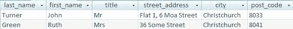

**图 7-6**. 用于描述客户的改进字段

如果某个字段中值的准确性对项目确实至关重要，那么也许这个特定的信息实际上应该自成一类。你可能还记得，我们将 `genus`（属）从我们的 `Plant`（植物）类中分离出来（参考对 图 2-12 的讨论），因为其准确性很重要，我们不希望出现任何拼写错误。在 图 7-6 的表中，我们可能会问：`city` 字段中的值被准确记录有多重要？如果准确性至关重要（例如，我们经常希望针对特定城市的客户投放广告），我们可能需要两个类，`City` 和 `Customer`，并在它们之间建立一对多（1-Many）关系。如果我们只需要地址用于发送普通邮件，准确性就不那么重要了，因为邮递员大概能应付偶尔的拼写错误。

##### 主键


##### 主键

我们以模型为基础，为每个类创建了一张表。类中的每个属性都由一个具有特定数据类型的字段来表示，并且我们可以对允许存入字段的值施加一些约束。到目前为止，我们忽略了一个如此重要的约束，以至于它值得单独成节来讨论。这涉及到为表选择一个主键。我们必须总能定位到一个特定的对象（即表中的一行或一条记录），这一点至关重要。这意味着所有记录必须是唯一的；否则，你就无法区分两条相同的记录。

设想一下两条相同记录的后果：当会员支付年度会费时，我们需要将这笔付款与会员关联起来。假设我们的会员表中有两行关于 Ruth Smith 的完全相同的记录，我们如何知道哪一行与某笔会费支付相关联？如果搞错了，那么当另一位 Smith 女士收到另一张发票时，她会非常恼火。每个会员都必须能够被唯一标识。在任何表中都绝不允许存在两条完全相同的记录。

##### 确定主键

键是一个字段，或是字段的组合，它保证对于表中的每条记录都具有唯一值。通过考虑哪些字段可能是候选键，我们可以深入了解问题。我们稍后会看到，一个表中可能存在不止一组可以具有唯一值的字段。我们从中选择一个作为主键，然后使用它来唯一地标识记录。

考虑以下表的哪些字段可以作为键，表中字段名称在表名后的括号中给出：

`Member` (`name`, `address`, `phone`, `birth_date`)

用 `name` 作为键怎么样？不行；完全有可能我们会有两个同名的会员，我们需要能够区分他们。那么组合 (`name`, `address`) 呢？这个更有希望，但众所周知，父亲会用自己的名字给儿子命名，而且他们在人生的不同时期共享同一地址并成为同一俱乐部会员也并非不可能。许多机构有时会使用组合 (`name`, `birth_date`) 作为客户键，认为这不太可能重复。然而，新闻中经常报道一些令人震惊的故事，人们在努力躲避法警和警察时，突然发现自己有一个同名的孪生兄弟。

一个候选键必须保证对于每条可能的记录都是唯一的。在像我们的会员表这样的情况下，除了添加一个新的属性或字段，如 `member_number`，然后为所有会员分配他们自己唯一的号码以便我们区分他们之外，几乎没有太多选择。这有时被称为代理键。在现实生活中，我们总是可以区分个体，但当我们查看我们存储的关于他们的数据时，可能无法找到一组唯一的值。在许多情况下，隐私法阻止使用诸如社会保障号或税务编号之类的信息来识别个人，因此每个企业或组织通常都被迫提供其自己的个人识别号。

当我们在数据库中创建表时，我们可以指定哪个字段将作为表的主键。实现这一点的 SQL 语句如 代码清单 7-5 所示。大多数数据库产品通常也提供一个界面来帮助创建表并选择构成主键的字段。

**代码清单 7-5. 指定主键**

```sql
CREATE TABLE Member (
    member_number INT PRIMARY KEY,
    member_name VARCHAR (25)
)
```

指定了主键字段后，就对表施加了一个约束，确保每条记录的 `member_number` 都必须具有唯一值。用户将永远无法输入两条 `member_number` 值相同的记录，因此我们表中的每个会员都可以被唯一地区分。该约束还确保主键字段始终有值，因此每条记录必定有一个 `member_number` 值。

可以让数据库自动生成像 `member_number` 这样的字段的唯一值。根据你所使用的产品，你会发现一种名为 `identity`、`auto_increment`、`autonumber` 或类似的字段类型。然后，你可以指定某个起始数和一个步长，输入表中的每一行新记录都会自动被分配下一个可用的数字。

##### 连接键

并不总是必须或甚至可取地在表中引入一个新的自动递增数字字段作为主键。在会员的例子中，没有其他方法可以确保每条记录都有一个唯一字段，但通常表中已经存在一个唯一的字段或字段组合。当我们有一个可以唯一标识记录的字段组合时，这被称为连接键或复合键。思考哪些字段组合可能是候选键，可以帮助你发现和理解问题的微妙之处。这里有一个例子。

图 7-7 中的表用于保存学生选课信息，它的一个可能的键是什么？

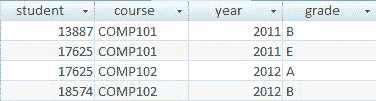

**图 7-7. 选课表**

`student` 不适合作为键，因为一个学生会有一条关于他所选每门课程的记录（我们可以看到值 17625 出现在至少两条记录中）。同样，`course` 也不行，因为一门课程会有多次选课，每次选课都有其自己的记录（值 `COMP102` 重复了）。事实上，每一列都有重复值，因此没有单个字段适合作为键。

组合 (`student`, `course`) 怎么样？在 图 7-7 所示的少量记录中，这个组合总是唯一的，但我们必须确保对于我们可能需要输入的每条记录，这*总是*如此。我们需要进一步了解这个问题。考虑以下对话：

*分析师：* 学生 17625 能否第二次选修 `COMP101` 以尝试提高成绩？

*客户：* 是的。

现在我们看到 `student` 和 `course` *不会*是一个合适的键。一旦学生尝试再次选修该课程，我们将有另一行具有相同的学号和课程值。

让我们尝试组合 (`studentID`, `course`, `year`)：

*分析师：* 学生是否可能在同一学年（比如在夏季）再次选修同一门课程？

*客户：* 对于某些科目是可以的。

*分析师：* 如果一个学生确实在夏季重新选修了同一门科目，您是否希望同时保留她之前的成绩和新的成绩？

*客户：* 当然！

组合 (`studentID`, `course`, `year`) 也不能作为键，因为当一个学生在同一年的稍后时间再次选修同一门课程时，我们将不得不重复这三个字段的值。显然，我们需要一个额外的属性（可能是学期）来区分这些选课记录。思考一个可能的键揭示了这个问题更多的复杂性，并帮助我们发现了一个缺失的属性或字段。

每当我们检查一组字段作为键的适用性时，我们需要找到一个问题来验证该组合是否*永远*是唯一的。在这个案例中，我们需要提出以下问题：

*学生是否可能多次选修同一门课程？*
*是的。 (`student`, `course`) 不是一个合适的键。*

*学生是否可能在同一年内多次选修同一门课程？*


### 表示关系

到目前为止，我们将每个类表示为一个表，每个属性表示为具有特定类型的字段，并确定了一个字段或字段组合作为具有唯一值的**主键**。现在，我们可以利用这个主键来帮助我们表示模型中类之间的关系。

让我们考虑体育俱乐部的例子。一个简单的数据模型如图 7-8 所示，其中一些可能的对象如图 7-9 所示。一个成员可能*只*为*一个*当前效力的球队效力，而每支球队恰好有*一位*队长。

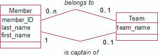

图 7-8. 体育俱乐部数据模型

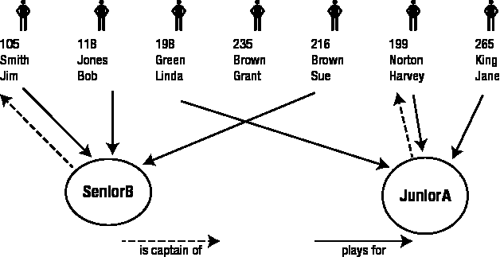

图 7-9. 成员、球队以及它们之间关系的实例

首先，我们设计两个表来表示这些类，并为每个表选择一个主键。我们将采用为主键字段加下划线的约定。

*   Member (成员): (`member_ID`, `last_name`, `first_name`)
*   Team (球队): (`team_name`)

图 7-9 中的每个对象都将是相应表中的一行。

为了表示 `plays for`（效力于）和 `is captain of`（担任...队长）的关系，我们需要一种方法来指定图 7-9 中对象之间的每一条连线。例如，我们需要显示 Bob Jones 效力于 SeniorB 队，而 JuniorA 队的队长是 Harvey Norton。

既然我们已经建立了主键，就可以轻松地识别与每个对象关联的行（例如，Harvey Norton 是 Member 表中主键字段 `member_ID` 值为 `199` 的那一行）。为了表示对象之间的关系，我们通过下一节将描述的*外键*机制来使用这些键值。

#### 外键

图 7-10 再次展示了 Member 和 Team 这两个表，但现在我们增加了一个字段来显示每支球队的队长是谁。我们所做的是在 Team 表中添加一个新字段 (`captain`)，它将包含担任队长的成员的键值。这就是一个外键。外键是一个字段（或字段组）（此处是 `captain`），它引用另一个表（此处是 Member 表）中的主键字段（此处包含来自 Member 表键字段 `member_ID` 的值）。通过这种方式，我们建立了不同类对象之间的关系。

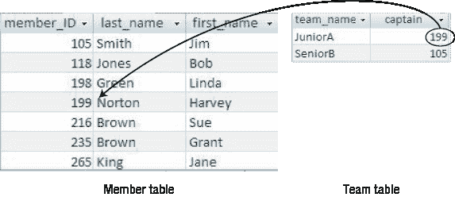

图 7-10. Team 表有一个外键字段 (`captain`) 引用 Member 表。

创建带有引用 Member 表的外键的 Team 表的 SQL 语句如清单 7-6 所示。许多产品还提供图形化界面来指定外键。在 Access 中设置外键的界面如图 7-11 所示。

清单 7-6. 创建带有外键的 Team 表的 SQL

```sql
CREATE TABLE Team (
    team_name VARCHAR(10) PRIMARY KEY,
    captain INT FOREIGN KEY REFERENCES Member
)
```

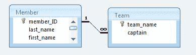

图 7-11. 在 Access 中指定 `captain` 是引用 Member 表的外键的界面

`member_ID` 和 `captain` 这两个字段的值将来自同一个域，即 MemberIDs 集合。形式上，一个外键和它引用的表的主键必须具有相同的域。在大多数数据库产品中，这一要求被放宽为它们必须是相同或兼容的数据类型。被视为兼容的数据类型取决于所使用的数据库软件（例如，在某些产品中，不同长度的字符字段是兼容的，但在其他产品中则不是）。

#### 参照完整性

与外键概念相伴而生的是*参照完整性*的概念。这是一个约束，它要求外键字段中的每个*值*（即图 7-10 中 Team 表的 `199` 和 `105`）必须作为值存在于被引用表的主键字段中（即 `199` 和 `105` 必须作为值存在于 Member 表的 `member_ID` 字段中）。这可以防止我们将一个不存在的成员（例如 `765`）设为球队的队长。这也意味着，在成员 `199` 和 `105` 担任球队队长期间，我们不能将他们从成员表中删除。一旦你设置了一个外键，这种参照完整性约束就会自动为你处理好。

##### 表示一对多关系

在之前的章节中，你已经看到了如何通过使用外键在数据模型中表示关系的实例。一般来说，处理一对多关系的过程如下：

对于一对多关系，将代表“一”端类的表中的键字段作为外键添加到代表“多”端类的表中。

我们已经在图 7-8 中表示了 `is captain of`（担任...队长）的关系。现在，让我们使用通用准则，为 Member 和 Team 之间的 `plays for`（效力于）关系做同样的事情。

“一”端的类是 Team，因此我们将 Team 表中的主键字段作为新的外键属性添加到 Member 表中。我们可以给这个字段起任何喜欢的名字，但它应该清楚地表明它所代表的关系，例如 `current_team`（当前球队）。这如图 7-12 所示。

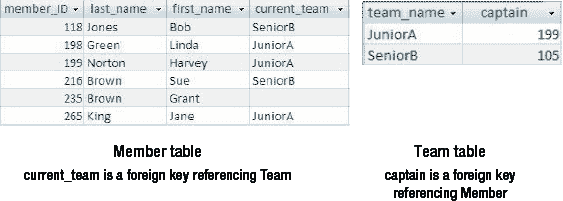

图 7-12. 体育俱乐部模型中的两个关系都通过外键表示


#### 引用完整性

引用完整性是通过将 `current_team` 字段设置为外键实现的，它确保输入 `current_team` 的值能在 `Team` 表的主键列（`team_name`）中找到。这保证了成员只能为已存在于 `Team` 表中的球队效力。

请注意，外键字段可以为空。Grant Brown 不属于任何球队，因此他记录中的外键字段没有值。这与图 7-8 中“效力于”关系的可选性一致。如果该关系不是可选的，我们就必须对该字段施加额外的约束，不允许为空值。如果我们想确保每支球队都有队长（正如数据模型所示），那么除了将 `Team` 表中的 `captain` 字段设为外键外，我们还需要指定它永远不能为空。

#### 自关系示例

让我们看另一个一对多关系的例子——这次是一个自关系。我们将考虑这样一种情况：一个成员赞助其他希望获得俱乐部会员资格的成员。数据模型的相关部分如图 7-13 所示，一些对象及其关系如图 7-14 所示。

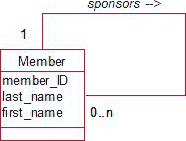

图 7-13. 自关系：成员赞助其他成员。

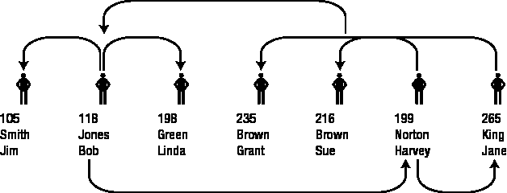

图 7-14. 互相赞助的成员实例

这种自关系是一个一对多关系，我们处理它的方式与处理任何其他一对多关系完全相同。我们从代表关系“一”端的类对应的表中取出主键（`member_ID`），并将其作为外键添加到代表关系“多”端的类对应的表（`Member`）中。即使这是同一个表也没有关系。我们为这个新的外键字段起一个描述关系的名字，比如 `sponsor`，该表将如图 7-15 所示。

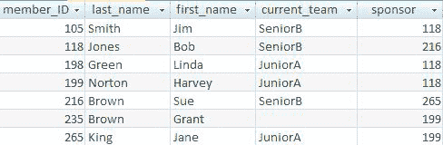

图 7-15. 代表自关系的外键 (`sponsor`)

`Member` 表有一个外键 `sponsor`，引用其自身表。Jim Smith 由成员 118（即 Bob Jones）赞助。与主键不同，外键如 `sponsor` 没有必须唯一的限制。在图 7-15 中，我们可以看到 118（Bob Jones）正在赞助多名成员。引用完整性确保成员只能由已经是会员的人赞助。如果关系是强制性的，也就是说我们在 `sponsor` 字段上添加了不允许为空的约束，就会有点问题。当没有现有成员可以赞助她时，你如何将第一个成员录入数据库呢？这不只是一个数据库问题，它实际上是我们问题描述的一部分。所有新成员都需要一个赞助人，但创始成员呢？让 `sponsor` 字段成为必填项可能不是一个好主意。

#### 表示多对多关系

你可能还记得在第 4 章中，多对多关系并不像你最初想象的那么常见。它们通常表明问题的某些信息最初被忽略了，需要一个中间类来存储这些信息。然而，当我们拥有同时属于许多类别的对象时，它们确实会真实存在。图 7-16 和 7-17 回顾了来自第 2 章的植物数据库，那里我们有适用于多种用途的植物物种。


图 7-16. 植物数据库的数据模型

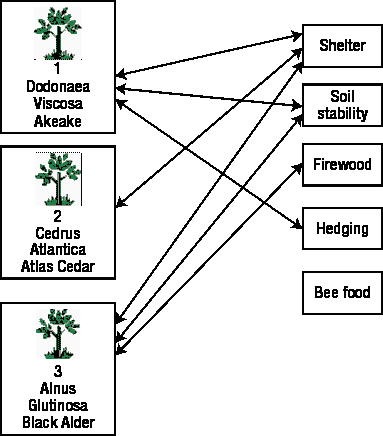

图 7-17. 一些物种及其用途的示例

我们该如何表示这种关系的所有实例呢？外键不再管用，因为我们永远不知道一个特定物种会有多少用途，也不知道一个特定用途会关联多少物种。为了在关系数据库中处理这个问题，我们必须在数据模型中引入一个新的中间类。在第 4 章中，当我们有一些需要新类的附加信息时，你已经看到了如何做到这一点。在这种多对多的情况下，新的中间类将没有任何属性，因为我们对特定的 `Species` 和 `Use` 组合没有需要了解的信息。我们使用这个新类 (`Species_Use`) 只是为了存储所有相关的 `Use` 和 `Species` 配对。如同第 4 章一样，新类通过两个一对多关系连接到现有类，如图 7-18 所示。我们可以这样解读该图：“每个 `Species_Use` 对象（或配对）恰好包含一个物种和一个用途。”

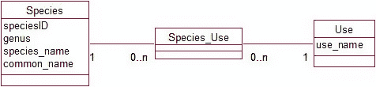

图 7-18. 在关系数据库中添加另一个类来表示多对多关系

现在，这两个一对多关系可以像处理其他任何一对多关系一样处理了。首先，我们需要为我们的新类创建一个表 `Species_Use`。然后，对于每一个一对多关系，我们将代表关系“一”端的类对应的表中的主键字段作为外键添加到代表关系“多”端的类对应的表中。这意味着在 `Species_Use` 表中添加两个新的外键属性：`species` 和 `use`。这些外键将分别引用 `Species` 和 `Use` 表。包含一些数据的结果表如图 7-19 所示。

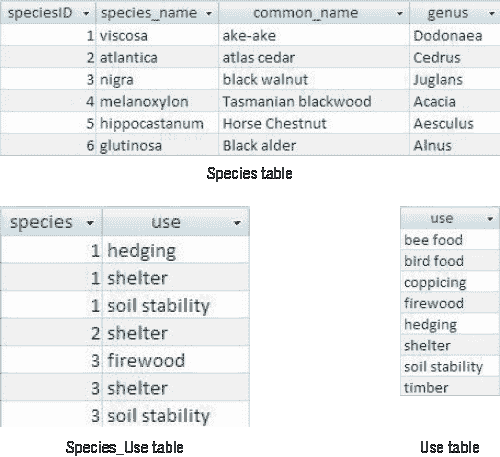

图 7-19. 使用带有两个外键的附加表来表示多对多关系

我们现在必须为新的 `Species_Use` 表确定一个主键。两个外键字段（`speciesID`, `use`）的组合可以做到这一点。在多对多关系中引入中间表的情况下，这种将外键组合形成主键的做法很常见。

#### 表示一对一关系

在之前的所有章节中，我们最终总是将关系“一”端的主键字段作为外键放在另一端的表中。如果关系的两端基数都是 1，我们应该以哪种方式来做呢？

我们的成员和球队的例子中有一个一对一关系：*担任…的队长*。数据模型的那部分如图 7-20 所示。

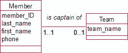

图 7-20. “担任…的队长”是一个一对一关系。

问题是将 `member_ID` 作为外键放在 `Team` 表中，还是将 `team_name` 作为外键放在 `Member` 表中。这两种方案生成的表如图 7-21 所示。

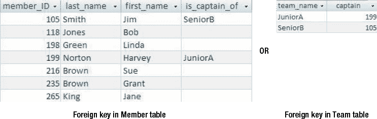

图 7-21. 表示一对一关系的两种方式

两种表都表示了相同的信息。我们绝不能同时采用两种方式，否则可能会导致数据不一致。例如，根据 `Member` 表，可能是 Bob 担任 SeniorB 队的队长，而根据 `Team` 表，却是 Jim 担任队长。

```
Member 表：Bob 是 SeniorB 的队长。
Team 表：SeniorB 的队长是 Jim。（数据不一致）
```


