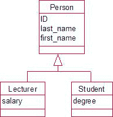
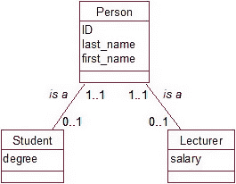
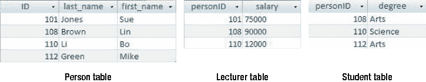
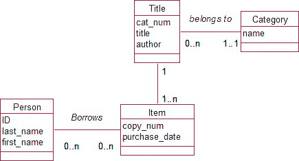

# 第 7 章

### 表示继承

关系型数据库本身并没有内置继承的概念；然而，近似地表达继承思想是可行的。

正如第 6 章所讨论的，继承对于建模棘手问题非常有用，但只应在其他更简单的模式无法完全表示某些本质复杂性时使用。图 7-22 展示了一个简单的继承案例，其中讲师和学生继承了人的属性，并且各自拥有一些专门的属性。

**图 7-22**. 包含继承的简单模型

在关系型数据库中捕捉继承主要方面的一种方法是，为每个父类和子类建立类，并在每个子类及其父类之间包含一个 1 对 1 关系，如图 7-23 所示。这些关系（向上读）表明一个讲师`是一个`人，一个学生`也是一个`人，这是一种思考该模型的自然方式。

**图 7-23**. 使用 1 对 1“是一个”关系近似表示继承

图 7-23 中`Student`和`Person`之间的关系在顶端是强制的，因为每个学生都是一个人；但在底端是可选的，因为一个人不一定是学生。我们现在可以像上一节处理 1 对 1 关系那样建立表。我们选择将外键（`personID`）放在`Student`表中（因为学生必须是人），对于`Lecturer`表也类似处理。`personID`也将成为`Lecturer`表和`Student`表的主键。我们最终将得到三个表，如图 7-24 所示。

**图 7-24**. 表示图 7-23 模型的表

我们捕捉到了继承的哪些要素呢？嗯，我们把每个人的联系详情只放在一个地方——`Person`表。我们知道谁是讲师，谁是学生，并且我们把每个角色的专业属性整齐地存储在相应的表中。作为一个特别的好处，我们还成功地捕捉到了多重继承！John 和 Linda 同时出现在讲师表和学生表中。

与真正的继承有何不同？在图 7-23 的模型中，对于 Sue（一个`Lecturer`对象），我们只有一个`对象`。在图 7-24 中，我们有`两行`（`Person`表中的一行和`Lecturer`表中的一行），它们之间有一个关系。扩展模型在两种情况下也不同。如果，日后我们需要一个额外的子类（例如`Administrator`），这可以非常简单地添加到图 7-22 的层次结构中。在图 7-23 中，我们将需要添加另一个类，但除此之外还要创建和维护另一个关系。

### 总结

我们取了一个数据模型，并使用关系型数据库产品中可用的功能表示了其主要特征。以下是步骤总结：

1.  为每个类创建一个表。
2.  为每个属性创建一个字段，并选择合适的数据类型。考虑是否某些属性（例如`address`）应拆分为多个字段。
3.  考虑哪些字段需要必填值。
4.  考虑需要对字段值施加哪些约束。如果你的数据库产品支持，可以考虑创建一个新的域。
5.  选择一个字段或字段组合作为主键。仔细提出问题以确保键字段始终具有唯一值。
6.  对于每个多对多关系，插入一个新的中介类以及两个一对多关系。
7.  对于每个一对多关系，取表示“一”端类的表中的主键字段，并将此字段作为外键添加到表示“多”端类的表中。
8.  对于一对一关系，将外键放在最可能有值或该属性最重要的表中。
9.  对于强制关系，向外键字段添加约束，规定它们不得为`null`。
10. 对于继承（一种近似表示），修改模型以在父类和每个子类之间建立一对一的“是一个”关系。如第七点所述创建表和外键。

### 测试你的理解

练习 7-1.

图 7-25 展示了一个小型图书馆的初始数据模型。它不完整，因此在回答以下问题时，请考虑可能还需要包含哪些内容。

a)  向图书管理员解释这个初始数据模型的含义。
b)  为捕获该模型所表示的信息，设计关系型数据库的表。包括主键、外键和其他适当的约束。

**图 7-25**. 小型图书馆的数据模型草稿

