# 第 8 章


## 规范化

我们在数据库设计方面做得相当不错。到目前为止，你已经学习了用例和数据模型如何帮助你理解试图表示问题的许多复杂性。在上一章中，你看到了如何在关系型数据库中表示数据模型的主要部分。回顾一下：

```
*   每个类由一个表表示。
*   每个属性由一个具有数据类型和可能约束的字段表示。
*   每个对象成为表中的一行。
*   对于每个表，我们确定一个主键，它是唯一标识每行的一个字段（或字段组合）。
*   我们使用主键字段通过外键来表示类之间的关系。
```


### 数据库规范化

在这一阶段，一切看起来可能完全正常，但也可能，我们的模型中有些类（或数据库中的表）仍可能给我们带来问题。规范化是一种正式的方法，用于检查字段是否位于正确的表中，或者我们是否可能需要重组或增加额外的表来帮助保持数据的准确性。规范化最初的想法由 E. F. Codd ¹ 于 1970 年首次提出，并从那时起一直作为关系数据库设计的基石。本书的一些读者可能会惊恐地举手抗议，我竟然把这个重要主题留到第 8 章才讲。然而，实际上我们从示例 1-1 开始就在对数据库进行规范化，当时我们看到需要两个类来保存关于植物及其用途的信息。

在本章中，我们将首先探讨为何所有属性都必须在正确的表中至关重要，以及规范化如何帮助我们确保这一点。

#### 更新异常

让我们看一个简单的例子，其中属性位于错误的表中可能会在维护数据时导致若干问题。假设我们有一个数据库，用于维护公司许多不同方面的信息。可能会有几个表用于维护客户、产品、订单、供应商等，还有两个表如图 8-1 所示，分别关于员工以及他们被分配到的一些小型项目。你能看出`Assignment`表中潜藏的问题吗？

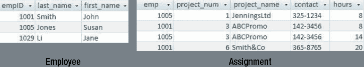

**图 8-1.** 存在潜在更新问题的表

`Assignment`表的一个问题，是我们早在示例 1-3“昆虫数据”中就遇到过的。我们重复存储了关于一个项目的信息。如果一个项目有超过一名员工参与，那么该项目的编号、名称和联系人可能会在这个表中重复出现多次。这几乎不可避免地会导致某些行（例如项目编号为 3 的行）在某个阶段拥有不一致的名称或联系电话。对于图 8-1 中的数据，这相对容易发现，但通常可能不那么明显。如果我们没有两名员工参与项目 3 的数据，我们可能甚至意识不到存在这种可能性。规范化为我们提供了一种正式的方法，在我们陷入麻烦之前检查此类情况。

除了数据不一致的可能性外，`Assignment`表的设计还可能导致其他问题。这些问题通常统称为*更新异常*。我们现在来看其中一些其他问题。

##### 插入问题

您会记得，我们数据库中的每个表都需要有一个主键。这是为了使我们能够唯一地标识每一行，并拥有一种关联不同表中行的机制。对于图 8-1 中的`Assignment`表，一个可能的主键是什么？仅查看表中的数据，我们可以看到没有单个字段是潜在的主键字段。每一列都有重复的值。我们需要寻找一个连接键，而`emp`和`project_num`这对字段是可能的。我们需要确认每个员工只与一个项目关联一次，如果情况如此，那么`emp`和`proj_num`这对值就是合适的主键。

然而，我们有一个问题。如果我们想保存关于某个特定项目的信息，但目前还没有员工在该项目上工作，那么我们就缺少`emp`的值，而`emp`是构成我们主键的字段之一。如果一个字段对于唯一确定我们表中的某一行是必不可少的，那么它可以是空值就说不通了。正如您可能从前一章回忆到的，为主键施加的约束之一是，所涉及的字段必须始终有值。我们不能输入一个记录，其中`emp`作为主键的一部分却为空。因此，在有人参与项目之前，我们无法记录任何关于该项目的信息。

#### 删除问题

这是另一种可能发生的情况。员工 1001 可能完成了在 Smith&Co 项目上的工作。如果发生这种情况，我们将从`Assignment`表中删除该行。删除此行可能带来的副作用是什么？嗯，如果员工 1001 是唯一参与该项目的人员，那么对 Smith&Co 的所有引用都将消失，我们将丢失该项目的联系电话。通过删除关于员工 1001 参与项目的信息，我们不恰当地丢失了关于该项目的信息。

### 处理更新异常

我们已经看到了图 8-1 中`Assignment`表的三种不同更新问题：当修改重复信息时可能出现不一致的数据；由于主键部分可能为空而导致插入新记录的问题；以及作为删除的副产品而意外丢失信息的问题。

我相信您早就发现了这些问题的解决方案。我们需要的是另一个表来记录项目信息，如图 8-2 所示。采用这种设计，我们不会多次记录一个项目的联系电话；即使没有人工作，我们也可以在`Project`表中添加一个新项目；并且我们可以删除一个分配（例如员工 1001 在项目 6 上工作）而不会意外丢失关于项目的信息。

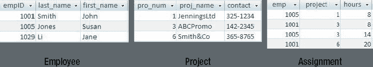

**图 8-2.** 已消除更新异常的表

很可能，在您最初的用例分析和数据模型中，`Project`表已经出现了。但是，您如何能确定没有遗漏任何东西呢？这就是规范化表的形式化定义发挥作用的地方。

#### 函数依赖

规范化帮助我们确定我们的表结构是否能够避免上一节描述的更新异常。规范化定义的核心是*函数依赖*的概念。函数依赖是描述我们表中属性或字段之间相互依赖关系的一种方式。有了函数依赖的定义，我们可以为主键提供一个更正式的定义，解释规范化表的含义，并讨论不同形式的规范化。

##### 函数依赖的定义

函数依赖本质上是一条陈述：“如果我知道这个（些）属性的值，我就可以唯一地告诉你某个其他（些）属性的值。” 例如，我们可以说：

如果我知道一名员工的 ID 号，我就能确定地告诉你他的姓氏。

或者等价地：

员工的 ID 号函数决定员工的姓氏。

或者用符号表示：

`empID → last_name`


### 函数依赖与规范化

对于图 8-2 所描述的情况，如果我知道一名员工的 ID 是 1001，我就可以告诉你他的姓氏是 Smith。那么反过来是否也成立？如果我知道一名员工的姓氏，我能唯一确定他的员工 ID 号吗？从表中显示的数据来看，你可能会说“可以”。然而，要使一个函数依赖成立，它必须对于将来可能存入我们表中的任何数据都为真。我们知道，长远来看，很可能有多名员工都叫 Smith，因此仅凭姓氏无法唯一确定 ID。或者更正式地说，`last_name`不能函数决定`empID`。

让我们尝试另一个例子。对于图 8-2 中的数据库表，员工 ID 号和他所分配的项目之间是否存在函数依赖？如果我知道员工的 ID 是 1001，我无法告诉你一个*唯一*的项目编号。它可能是项目 3 或项目 6，因此员工的 ID 号不能函数决定（或唯一决定）一个项目编号。

确定函数依赖需要我们理解具体情况的复杂性。对于员工和项目的情况，我们需要知道一个员工是否只能被分配到一个项目，或者他是否可以被分配到许多不同的项目。这听起来熟悉吗？确定属性之间是否函数依赖，与我们在理解第 4 章数据模型时所经历的同类型问题有关。

对于包含`Employee`类和`Project`类的数据模型，我们会问：“一个员工是否可能被关联到多个项目？”

如果答案是“否”，那么员工和项目之间就是 1 对多（1-Many）关系，如图 8-3a 所示；否则，我们有多对多（Many-Many）关系，如图 8-3b 所示。

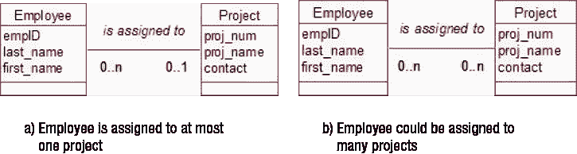

**图 8-3.** `Employee`与`Project`之间的不同关系

从函数依赖的角度来看，我们有一个类似的问题：“如果我知道一个员工的 ID 号，我能告诉你一个唯一的项目编号吗？”

如果答案是“是”，那么`empID →proj_num`；否则，员工 ID 不能函数决定项目编号。理解函数依赖与理解类及其关系，是我们弄清楚所要建模问题的复杂性的两种不同方法。

#### 函数依赖与主键

现在你了解了函数依赖，我们有另一种方式来思考主键的含义。如果我们知道表中键字段的值，我们就能在表中找到唯一的一行。一旦我们有了那一行，我们就知道该行所有其他字段的值。例如，如果我知道`empID`，我就可以在`Employee`表中找到一个唯一的行，从而确定`last_name`和`first_name`。或者，用函数依赖的术语来说：

`empID → last_name, first_name`

这引出了我们定义键的一种更正式的方式：

*键字段函数决定表中的所有其他字段。*

如果我知道键的值，我保证能告诉你行中每个其他字段的值。这就是为什么`last_name`不能作为我们`Employee`表的键字段。如果我知道一名员工的姓氏是 Smith，我无法保证我能找到一个单一的行并告诉你`empID`的值。

你可能已经注意到，在过去的几段中，我一直在使用术语*key*（键）而不是*primary key*（主键）。这两者是有区别的。想一想。属性对`(`empID`, `last_name`)`是我们`Employee``表的一个可能的键吗？我们对键的定义是，如果我们知道键字段的值，我们就能找到一个唯一的行。如果我们知道`empID`和`last_name`，这当然是成立的。然而，我相信你能看出`last_name`是冗余的。属性对`(`empID`, `last_name`)`是一个键，仅仅是因为`empID`是一个键。如果我们知道`empID`，我们就能找到那一行，而不管我们有什么额外信息；我们不需要同时知道`last_name`。

键中包含多余字段的想法，正是键与主键候选键之间的区别。要被视为主键，必须没有任何不必要的字段。更正式地说：

*主键没有任何子集本身也是一个键。*

为什么这很重要？假设我们的每个项目都有一名经理，如数据模型片段图 8-4 所示。

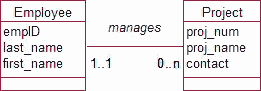

**图 8-4.** 一个 1 对多关系

还记得我们在数据库中如何表示 1 对多关系吗？我们从“一”端的表（`Employee`）中获取主键字段，并将这些字段作为外键放入`Project`表中。如果我们错误地使用了对`(`empID`, `last_name`)`作为`Employee`表的主键，我们将得到一个如图 8-5 所示的`Project`表。我相信你能看到其中的信息冗余和潜在问题。

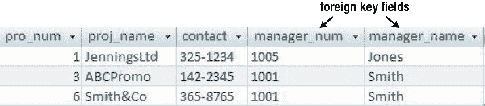

**图 8-5.** 由于没有合适的主键而导致的冗余问题

现在你了解了什么是函数依赖以及主键的更正式定义，我们可以看看规范化如何帮助确保我们的表设计良好。

### 范式

“规范化”的表通常将避免我们在本章前面研究的更新问题。有多个级别的规范化，称为*范式*，每个范式都针对可能发生问题的额外情况。在本节中，我们将查看使用函数依赖定义的范式。

#### 第一范式

第一范式是最重要的，它基本上指出，我们不应该试图将多条数据塞进一个字段中。我们的第一个关于可能出错情况的例子，例 1-1 “植物数据库”，就是一个有问题的情况。在植物数据库中，我们保存有关不同植物物种及其适合的不同用途的信息。一些可能的（但不推荐的！）保存每种植物多种用途的方法如图 8-6 所示。

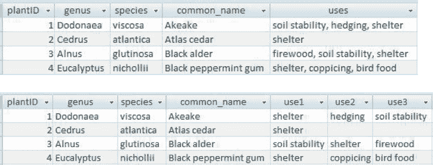

**图 8-6.** 保存多种用途信息的非推荐方式

我们在例 1-1 中看到了将植物数据保存在如图 8-6 所示的表中所产生的问题。例如，可能难以找到具有特定用途的所有植物（例如，所有防护植物）。


### 数据库规范化

回想一下我们对主键的新定义，让我们重新审视图 8-6 中两个表的`主键`。`plantID`在每行都不同的意义上，是两个表的主键。它是否在函数上决定了所有其他属性？如果我知道`plantID`的值（例如，`plantID = 1`），我能否告诉你一个唯一的用途？嗯，在上面的表中，我可以告诉你`uses`字段中的字符串，而在第二个表中，我可以告诉你三个列中任何一个特定列的内容，所以从一个非常正式的角度来看，是的，我可以。然而，如果我们考虑这些字段背后的含义，仅通过知道植物的 ID，我无法给你提供关于一个独特用途的信息。我只能告诉你每种植物的一系列用途。

这两个表不符合第一范式（从技术意义上讲）。它们都在以一种迂回的方式试图保存多个用途值。

> `如果一个表为一条信息保存了多个值，那么该表就不符合第一范式。`

规范化给了我们一种正式的方法来确定图 8-6 中表的设计存在问题。它还为我们提供了一种解决问题的方法。

> `如果一个表不符合第一范式，请从表中移除多值信息。用该信息和原始表的主键创建一个新表。`

对于我们这个植物数据库的例子，这意味着像图 8-7 那样设置两个表。

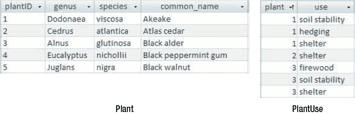

**图 8-7.** 从未规范化的表中移除多值字段以创建额外的表

当我们通过数据模型考虑这个问题时，我们决定实际上有两个类，`Plant`和`Use`，它们之间存在多对多关系。在第 7 章中，你看到要表示一个多对多关系，我们需要添加一个中间表。如果你回头看看图 7-17 到 7-19，你会发现新表与图 8-7 中的`PlantUse`表相同。我们通过两条不同的路径得到了相同的规范化解决方案。正如例 1-1 所讨论的，像图 8-7 这样的规范化表避免了与图 8-6 中原始未规范化表相关的许多问题。

##### 第二范式

一个符合第一范式的表仍然可能存在更新问题。本章开头我们讨论过的图 8-8 中的`Assignment`表就是一个例子。其中关于项目名称和联系人的信息被重复了多次，结果可能导致信息最终变得不一致。我们还看到，插入新记录可能会出现问题，而删除某些记录可能会导致信息丢失。

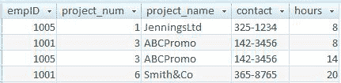

**图 8-8.** 存在更新异常的 Assignment 表

第一和第二范式的定义都要求我们知道我们正在评估的表的主键。`Assignment`表的主键是`empID`和`proj_num`字段的组合。这个表符合第一范式吗？如果我告诉你一个员工 ID 和一个项目编号（例如，`1005`和`1`），你能告诉我所有其他非键字段的唯一值吗？是的。项目名称是`Jennings Ltd`，联系人是`325-1234`，工时是`8`。这个表中没有多值字段。我们没有在任何地方试图将多个信息位挤入一个字段。但更新异常的问题仍然存在。

这里的问题是，虽然我可以通过知道主键来找出所有非键字段的值，但我实际上并不需要主键的两个字段都能做到这一点。如果我想知道工时数，我需要知道`empID`和`proj_num`的值。但是，如果我想知道联系电话或项目名称，我只需要知道`proj_num`的值。问题就出在这里，它引出了我们对第二范式的定义。

> `如果一个表符合第一范式，并且我们需要键中的所有字段来确定非键字段的值，那么该表就符合第二范式。`

我们也有办法修正一个不符合第二范式的表。

> `如果一个表不符合第二范式，请移除那些不依赖于整个主键的非键字段。用这些字段和它们所依赖的那部分主键创建另一个表。`

这意味着我们将非键字段`proj_name`和`contact`从`Assignment`表中移除，并将它们与`proj_num`（它们所依赖的那部分键）一起放入一个新表中。这种拆分未规范化表的过程通常被称为*分解*。因此，我们可以说原始的`Assignment`表被分解成了两个符合第二范式的表，如图 8-9 所示。

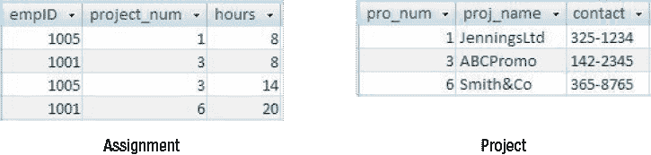

**图 8-9.** Assignment 表分解为两个表

如果我们从数据建模的角度来处理这个问题，我们会说有两个类，`Employee`和`Project`，它们之间存在如图 8-3b 所示的多对多关系。正如第 7 章所讨论的，要表示这种关系，我们需要添加一个中间表，这样我们就会得到完全相同的表（外加一个`Employee`表），如图 8-9 所示。

我们再次通过两条路径得到了相同的解决方案：思考类及其关系，或者考虑函数依赖和规范化。

##### 第三范式

你猜对了。符合第二范式的表仍然可能给我们带来问题。这次，考虑一下我们的`Employee`表，其中添加了一些关于员工所在部门的信息。看看图 8-10 中的表。

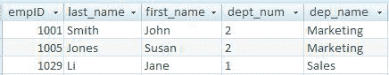

**图 8-10.** 存在更新问题的 Employee 表

图 8-10 中`Employee`表的主键是什么？如果一个员工只在一个部门工作，那么仅知道`empID`就足以找到特定的行。这个表符合第一范式吗？是的。如果我知道`empID`的值（例如，`1029`），我可以告诉你其他每个字段的唯一值。这个表符合第二范式吗？是的，现在主键只是一个字段，所以没有什么可以依赖于“部分”键。还有问题吗？是的。部门名称的信息在几行上重复，很可能变得不一致。

这个表的情况是，部门名称由不止一个字段决定。如果我知道主键字段`empID`的值是`1001`，我可以告诉你部门名称是`Marketing`。然而，如果我知道`dept_num`的值是`2`，我也可以告诉你部门名称是`Marketing`。有两个不同的字段决定了部门名称的值。这就是这次问题出现的地方，并引出了第三范式的定义。

> `如果一个表符合第二范式，并且没有非键字段依赖于非主键的字段，那么该表就符合第三范式。`

与其他范式一样，我们也有一个简单的方法来修正不符合第三范式的表。


*若一张表不符合第三范式，则应移除那些依赖于非主键字段的非键字段。使用该字段及其所依赖的字段创建另一张表。*

对于图 8-10 中的`Employee`表，这意味着将`dept_name`字段从原始`Employee`表中移除，并将其与它所依赖的字段（`dept_num`）一起放入一个新表中，如图 8-11 所示。字段`dept_num`将成为新表的主键，并同时作为外键保留在`Employee`表中。

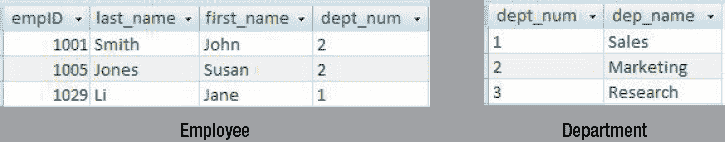

**图 8-11.** 分解为两张表的员工表

##### Boyce–Codd 范式

这是涉及函数依赖的最后一个范式。对于大多数表而言，它等同于第三范式，但对于某些存在多个可能的字段组合可作为主键的表，它的定义稍强一些。此处我们不讨论那些情况。然而，Boyce–Codd 范式是一个相当优雅的表述，它囊括了前三种范式。

*如果一个表中每个决定因子都可能成为主键，那么该表就符合 Boyce–Codd 范式。*

让我们看看这是如何运作的。假设我知道某个特定字段（例如 `proj_num`）的值决定了另一个字段（例如 `proj_name`）的值。我们称 `proj_num` 为一个*决定因子*（它决定了其他东西的值）。在任何存在这种情况的表中，`proj_num` 都必须能够成为主键。

考虑图 8-8 中的 `Assignment` 表。`proj_num` 决定了 `proj_name`，但 `proj_num` 无法成为主键（可能存在多行具有相同的 `proj_num` 值）。在这种情况下，Boyce–Codd 范式是第二范式的一个更普遍的表述——`proj_num` 是一个决定因子，但它不是整个键。在图 8-10 中的 `Employee` 表中，`dept_num` 是一个决定因子，但它不能成为主键，因为它在每一行中并非唯一。在这种情况下，Boyce–Codd 范式是一个包含了第三范式的表述。

总结我们讨论过的范式，最精妙的方式之一来自比尔·肯特。² 他这样总结范式：

> *一张表应基于*
> *键，*
> *整个键，*
> *且只基于键（愿 Codd 为我作证）*

仅仅记住这句简单的引言，就能帮助你确保所有表都规范化到第三范式。

### 数据模型还是函数依赖？

在我们对基于函数依赖的范式的讨论中，你已看到，在大多数示例中，我们最终得到的表集合与之前章节中通过考虑类及其关系所得到的结果相同。这两种方法有何区别？一般来说，我们应该如何进行数据库设计？

本质上，我们有两种可用的工具，当我们发现它们有帮助时，应该使用其中一种或两种都用。这取决于具体的人和我们试图建模的具体问题。无论使用哪种工具，最根本的是理解问题的范围以及数据片段之间关系的错综复杂。详细的理解要求我们就项目提出非常具体的问题。我们可以用数据模型的一部分或写下函数依赖来表示答案。有时一种方式就是比另一种更自然。让我们看一些例子。

对于一个特定问题，我可能知道我需要关于员工和项目的数据，并且需要了解更多关于它们之间关系的信息。

从数据建模的角度，我可能会问：“一个员工能否与多个项目相关联？”

我可以根据答案来决定员工类和项目类之间的关系是一对多还是多对多。对我来说，这似乎是思考和讨论这个问题的自然方式。从函数依赖的角度，我会问类似这样的问题：“如果我知道员工的 ID 号，我能知道她关联的唯一项目吗？”

如果答案是“是”，我会将其表示为函数依赖

```
empID → project
```

对我来说，后一种描述问题这个方面的方式感觉不太自然。其他人可能想法完全不同。这两个问题以及表示它们的两种方式（类图或函数依赖）包含了关于员工和项目之间关系的几乎相同的信息。

让我们尝试另一个例子。工资和税率之间的关系呢？从函数依赖的角度，我会问：“如果我知道工资，我能唯一确定税率吗？”

对我来说，这似乎是思考问题这个方面的良好方式。如果答案是“是”，我可以将其表示为函数依赖

```
salary → tax_rate
```

从数据建模的角度，我不确定我会问什么问题。我可能没有工资类或税率类，所以考虑类之间的关系并不是理解这种复杂性的自然方式。

如果我们试图完全通过函数依赖和规范化来完成整个数据库设计，会发生什么？我们可以从一个包含每条信息字段的巨大表开始。这有时被称为*泛关系*。我们可以列出所有不同字段之间适用的所有函数依赖，然后应用我们的规范化规则逐步将大表分解为一组规范化的表。实际上有算法可以自动完成此操作。然而，将我们数据库的所有规则都用函数依赖表示，并将所有信息视为一个大表的独立字段，很少是一种实用的起始方式。

当我们第一次开始思考一个问题时，很自然地会从非常概括的角度思考。例如，我们可能知道我们必须保存关于人员的数据、关于项目的信息，并且我们不能忘记建筑物。开始时我们可能对这些事物分别要保存哪些数据没有清晰的概念，因此尝试用函数依赖来捕捉这些原始信息并无帮助。然而，关于项目最基本的概念很自然地归入类。数据模型或类图将向我们显示我们需要建筑物、项目和人员类，并让我们开始思考关系。人们是否在特定的建筑物工作？人们是否参与多个项目？人们是否与项目有其他关系（例如，除了工作外还可能管理项目）？人们是否互相管理？

所有这些关于项目的广泛的初始想法都可以被数据模型轻松捕捉。当我们质疑关系的基数和可选性，或寻找扇形陷阱，或检查某些关系是否冗余时，数据模型也帮助我们发现更详细的信息。


一旦我们确认类图准确地捕获了信息，就可以将该图表示为一组表以及主键和外键，正如 `第 7 章` 所描述的那样。此时，最好检查每个表，看看它是否已经规范化。我们可能有一个包含 `empID`、`last_name`、`first_name`、`salary` 和 `tax_rate` 字段的 `Employee` 表，其中 `empID` 是主键。现在我们可能会问 `salary` 和 `tax_rate` 之间的函数依赖关系。如果存在函数依赖，那么我们的表就不符合第三范式（`tax_rate` 依赖于主键之外的其他东西），它不应该出现在这个表中。

数据模型适用于把握整体结构，而规范化则适用于处理细节。同时使用这两种工具，可以确保你为数据库获得最佳的结构。

### 其他注意事项

我们已经了解了函数依赖以及基于它们定义的范式：第一、第二、第三和 Boyce–Codd 范式。数据片段之间可能存在其他类型的依赖关系，以及防止某些潜在问题的额外范式。我不会以非常正式的方式来描述这些，但我会指出它们与数据模型的哪些方面相关。

##### 第四和第五范式

第四和第五范式处理的是存在多值依赖关系的表。我们已经看到过可能发生这种情况的案例。让我们重新考虑 `第 5 章` 中的运动队示例。我们有 `Player`（球员）、`Match`（比赛）和 `Team`（球队）。如果我指定一支球队，那么与该球队关联的比赛有多个值，类似地，关联的球员也有多个值。假设我们对比赛特别感兴趣——谁参加了比赛以及涉及哪些球队。我们需要考虑是否应该有中间表（`Appearance`）和/或 `图 8-12` 中的其他关系。

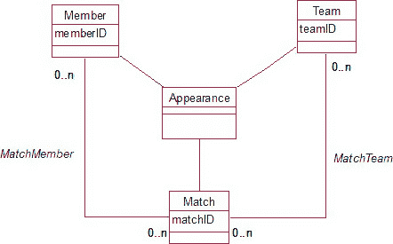

`图 8-12.` `Member`、`Team` 和 `Match` 之间需要哪些关系？

如果我们用关系数据库来表示 `图 8-12` 中的模型，我们将需要为类 `Member`、`Team`、`Match` 和 `Appearance` 各创建一个表。我们还需要两个额外的表来表示 `Match` 和 `Team` 之间，以及 `Match` 和 `Member` 之间的多对多关系。`图 8-13` 展示了一些可能存在于这些表中的数据。

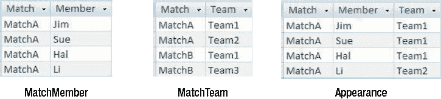

`图 8-13.` 表示 `图 8-12` 中关系的示例数据

对于 `图 8-13` 中的每个表，主键由所有字段组成。没有非键字段，也没有函数依赖。因此，它们都符合 Boyce–Codd 范式，因为没有不可能作为键的决定因素（根本就没有决定因素！）。问题是，“我们需要所有三个表吗？”就目前的数据而言，显然存在一些重复信息。例如，从 `MatchMember` 和 `Appearance` 表中都可以看出 Jim 参与了 `MatchA`。当信息被存储两次时，总是存在不一致的危险。那么，我们需要（如果有的话）去掉什么？

一场比赛有许多成员参与，也有许多（两支）球队参加。我们需要回答的问题是，“对于我们的实际问题，这两组信息是独立的吗？”如果是，我们就不需要（也不应该有）`Appearance` 表。然而，正如我们在 `第 5 章` 中所讨论的，我们很可能需要知道在特定比赛中，哪个成员为哪支球队效力。仅凭另外两个表中的数据，我们无法计算出这一点（即使包含一个 `MemberTeam` 表也不行）。因此，对于这种我们需要知道“谁在哪场比赛中为哪支球队效力”的情况，`Appearance` 表是必需的。

那么 `图 8-13` 中的另外两个表呢？如果我们有了 `Appearance` 表，还需要另外两个吗？回顾 `第 5 章` 中的讨论，我们需要问的问题是：“我们是否想了解与参与成员无关的比赛和球队信息？”以及“我们是否想了解与球队无关的成员和比赛信息？”让我们思考第一个问题。当比赛最初的对阵安排确定时会发生什么？我们可能需要在数据库中记录 `Team1` 和 `Team2` 计划在 `MatchA` 中进行比赛。如果我们只有 `Appearance` 表，我们就无法插入相应的记录。为什么？因为所有字段都是主键的一部分，都不能为空，而我们在 `Member` 字段中无内容可填。我们希望记录比赛已计划这一事实，而且需要独立于参与的成员来记录。我们可能还有关于比赛和球队的其他独立于成员的信息需要记录。例如，我们很可能需要记录比分。如果没有 `MatchTeam` 表，我们将把它存储在哪里？它应该放在 `Appearance` 表的哪一行？会是很多行。所以，是的，如果我们想存储所有这些信息，我们确实需要 `MatchTeam` 表。你可以通过类似的思考过程来决定 `MatchMember` 表是否也是必需的。

每当有三个（或更多）以任何方式相互关联的类时，这类问题就会出现。是否存在我们需要了解所有三个类的对象组合的情况？是否存在关于两个类的对象组合的独立于第三个类的信息？如果我们正确地找出这些问题的答案，就能确信最终的表结构能充分表示这个问题。

### 总结

如果数据库中的表结构不佳，我们就有可能遇到数据更新问题。这些问题包括：

*   **修改问题**：如果信息重复，那么在未全部更新时就会变得不一致。
*   **插入问题**：如果我们没有每个主键字段的信息，我们将无法插入记录。
*   **删除问题**：如果我们删除一条记录以移除某条信息，可能会因此丢失一些额外的信息。

通过理解函数依赖、主键和规范化的概念，我们可以确保表的结构能够避免上述更新问题。

*   表中两组字段之间存在函数依赖：如果字段 `A` 函数决定字段 `B`，这意味着如果我知道 `A` 的值，我就能唯一地告诉你 `B` 的值。
*   主键是一个（最小的）字段集合，它函数决定表中的所有其他字段。
*   前三个范式可以总结为 `表基于键、整个键、除了键什么也不是`。
*   符合 Boyce–Codd 范式的表是每一个决定因素都可能成为主键的表。
*   当你有三个或更多相互关联的类时，要问自己：是否需要了解涉及所有三个类的信息（如果有，是哪些）；以及涉及其中两个类但独立于第三个类的信息是哪些。

在设计关系数据库时


### 测试你的理解

练习 8-1。

`示例 1-3`（回顾 `第 1 章`）是一个关于未规范化数据的很好的现实例子。简要回顾一下：农场被访问，并从不同的田地采集多个样本。记录每个样本中每种物种（目前仅有弹尾虫和甲虫）的数量。该数据的一个版本如 `图 8-14` 所示。

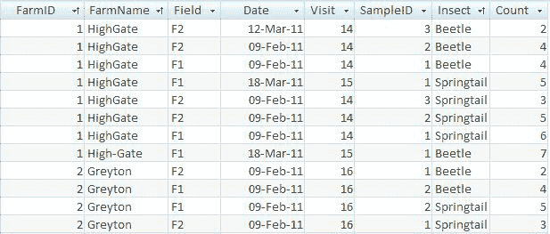

`图 8-14.` 昆虫数据的未规范化版本

思考以下问题：

a)  `图 8-14` 中的表可能会出现哪些更新异常问题？

b)  以下哪些功能依赖关系适用于该昆虫数据？

*   `农场 ID` → `农场名称`？
*   `农场 ID` → `访问`？
*   `访问` → `日期`？
*   `日期` → `访问`？
*   `访问` → `农场 ID`？
*   `样本` → `田地`？
*   (`样本`, `访问 ID`) → `田地`？
*   (`样本`, `昆虫`) → `数量`？

c)  (`访问 ID`, `样本`, `昆虫`) → `数量` ？(`访问 ID`, `样本`, `昆虫`) 被建议作为合适的主键。你能通过知道这三个字段的值来确定所有其他值吗？它会是一个合适的主键吗？

d)  使用 Part C 中的字段作为主键，运用规范化规则将 `图 8-14` 中的表分解为一组符合第三范式的表。

¹ Edgar F. Codd, (1970 年 6 月). “大型共享数据库的关系数据模型。” *ACM 通讯*： 13(6): 第 377–387 页。
² William Kent, “关系数据库理论中第五范式的简单指南，” ACM 通讯 26(2), 1983 年 2 月, 120-125.

## 第 9 章


### 关于键和约束的更多内容

在前面的章节中，你已经了解了如何将类图表示为一组关系数据库表。我们研究了如何用主键和外键表示类之间的关系，然后应用规范化的思想来确保属性位于正确的表中。在本章中，我们将重新审视其中一些思想，并思考一些其他的可能性。特别是，我们将更仔细地研究主键以及如何选择它们。我们还将看看在数据不断更新时，如何维护参照完整性。

### 选择主键

在前两章中，我描述了我们需要如何选择一个字段或字段组合作为表示类的数据库表的主键。关键字段将具有唯一值，因此可用于标识表中的特定行。主键还用于通过外键建立不同表中行之间的关系。选择主键并非总是直截了当的。对于一个人，有时会使用姓名和出生日期等组合作为键，但它们不能保证唯一。你已经看到，引入客户编号或使用某种自动生成的 ID 号可以确保我们拥有一个对每一行都唯一的字段。现在，让我们再看看这个 ID 号码的概念。

### 关于 ID 号码的更多内容

一个生成的 ID 号码并不能解决我们所有的问题。如果我们的表中有两行，除了 ID 之外在所有方面都相同，我们就会陷入真正的麻烦。两个同名同姓且出生日期相同的约翰·史密斯住在同一个地址，无论他们是否有不同的客户编号，都会使事情变得复杂。他们是同一个人还是不同的人？如果区分一个人与另一个人的唯一依据是某个生成的 ID，那将是无法容忍的。首先，谁能记住他们可能数百个不同的 ID 号码呢？我们总是期望企业能够根据能将我们与其他人区分开来的信息，为我们找到客户编号。

那么，这是否意味着总会存在（或应该存在）一个由关于客户保存的数据的某种组合构成的可能键呢？很可能是的。那么，为什么我们还需要 ID 号码呢？由表中所有字段组成的主键不行吗？

ID 号码在许多情况下是必要的，主要原因之一是，尽管可能总存在某些信息可以将一个客户与另一个客户区分开，但这些值中的一些很可能在不断变化。如果我们决定用姓名、出生日期、地址、母亲娘家姓名等来标识一个客户，那么将其作为表中的主键对我们来说没有用处。地址肯定会改变，姓名很可能改变，这就是我们遇到问题的地方。我们使用主键是为了与不同表中的行建立连接。例如，我们会使用 `客户` 表的主键作为 `订单` 表中的外键，以标识哪个客户下了特定订单。如果必须将姓名和地址的组合作为外键放入我们的 `订单` 表中，我相信你能想象当客户搬迁到新地址时，我们可能会遇到的与特定客户关联订单的各类问题。然而，一个 ID 号码将是恒定不变的。例如，一个订单可能与客户 `3602` 相关联，而 `客户` 表中关于客户 `3602` 的信息可以随意更改。简·格林可以随心所欲地搬家和再婚，而我们仍然可以通过她恒定的客户编号来跟踪她的订单。

在数据库中存储有关人员的信息时，ID 号码几乎总是必需的。人们通常相当抗拒被一个数字所描述，但他们很可能与他们打交道的每个企业都有一个不同的号码。出于隐私原因，许多公民自由团体抵制通用 ID 号码，尽管在许多国家，社会保障号码、税务号码或驾照号码几乎已成为默认的通用 ID。许多网站现在使用电子邮件地址作为一种身份识别形式——尽管当你与配偶或伴侣共享个人电子邮件地址时，这可能会导致问题。（我知道这个！）

虽然 ID 号码是必不可少的，但它们仍然存在问题。当一个人被同一组织分配了两个 ID 号码时，就会出现一个问题。考虑一下入院的情况。你生病了，你的朋友被询问你的姓名、地址以及你以前是否住过院。他们给出的姓名可能与你的确切姓名不同。他们叫你罗布·布朗，但你的真实姓名是雅各布·罗伯特·布朗，他们不知道你小时候曾因扁桃体炎住过院。因此，一个新的病人被输入数据库并获得一个新编号。现在真正的问题来了：罗布·布朗有两个病人编号，在病人表中有两行。过敏信息可能关联到一个病人编号，而治疗信息则关联到另一个。据传闻，在不同时期，与新西兰医院相关的病人数量大约比总人口多 25%！


当学生在大学注册时，这种情况也很容易发生。某年她预注册后决定休学一年去旅行，却不知道自己已被分配了一个学号。次年她入学注册时，勾选了 `新生` 框，于是又获得了一个新学号。到了毕业那年，这名学生发现有些学分计入了第一个学号，有些则计入了第二个学号，而两个学号的学分都不足以达到毕业要求（这种情况真实发生过！）。

除了在数据录入时建立非常严谨的流程外，这些问题几乎无法避免。需要提醒数据录入员注意那些姓名相似的现有客户或用户，以便进行核查。然而，这个过程无法实现自动化，因为有时两个不同的人可能拥有完全相同的姓名甚至出生日期。

### 候选键

在上一章中，我们利用函数依赖帮助我们定义了什么是键。

`键字段函数地决定表中所有其他字段。`

这意味着，如果我们知道键字段的值，就能定位到表中的唯一一行，然后我们就能查看所有其他字段的值。我们还讨论了那些对于构成可能键并非必需的字段。例如，如果我们将 `customerID` 作为 `Customer` 表的一个键，那么根据我们的定义，`customerID` 和 `customer_name` 的组合也将是一个键。显然，`customer_name` 是多余的，并且在第 8 章中我们讨论过，如果将这个多余字段用作外键的一部分，将会导致问题。术语 `候选键` 用于描述没有不必要字段的键。

`候选键是指其字段的任何子集都不能单独构成键的键。`

根据这个定义，我们看到 `customerID` 和 `customer_name` 的组合不是一个候选键，因为子集 `customerID` 本身就是一个键。一个表中可能存在多个候选键。例如，在 `Customer` 表中，我们可能还存储了客户的税务或社会保障号码。

```
Customer(customerID, customer_name, address, phone, birth_date, tax_number)
```

现在我们有了两个候选键：`customerID` 和 `tax_number`。两者对于每条记录都是唯一的，并且（只要每位客户都能够并愿意提供税务号码）其中任何一个都足以唯一地标识一条记录。在这种情况下，你需要从候选键中选择一个作为表的主键。在两个或多个候选键之间选择主键时，需要考虑哪些因素呢？

## 身份证号还是连接键？

让我们重新审视第 1 章中关于昆虫数据的那个老问题（示例 1-3）。这是一个环境项目，研究人员定期访问农场，从不同田地中采集昆虫样本。因为我想用“field”这个词来表示数据库意义上的“字段”，所以我将使用农场田地的澳式英语同义词 `paddock`。

让我们慢慢构建类图和相关的表。首先，我们需要保存关于每个农场以及该农场内各个牧场的信息。一个可能的类图如图 9-1 所示。

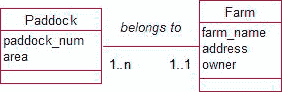

**图 9-1.** 农场与牧场

代表 `Farm` 类的表，其合适的主键应该是什么？随着时间的推移，农场的名称和所有者可能会改变，而且同一个人可能拥有多个农场，因此 `owner` 的值可能不是唯一的。农场地址不会移动，但当道路变更或边界变化时，地址很可能会改变。ID 号码似乎是最稳妥的选择。

牧场呢？每个农民可能都有自己的牧场编号系统。仅考虑图 9-1 中的这两个类，我们可以建立两个表：


`Farm(farmID, farm_name, address, owner)`
`Paddock(paddock_num, area)`

为了表示 `Farm` 和 `Paddock` 之间的关系，我们将 `Farm` 表的主键作为外键字段包含在 `Paddock` 表中：`Paddock(paddock_num, area, farm)`，其中 `farm` 是一个外键，其值将对应农场的 `farmID`。

现在我们面临一个决策：围场编号（paddock number）是在所有围场中唯一的数字，还是仅在农场内唯一？两种可能性如 图 9-2 所示。在 图 9-2a 中，主键将是 `paddock_num`；而在 图 9-2b 中，主键将是组合 (`farm`, `paddock_num`)。

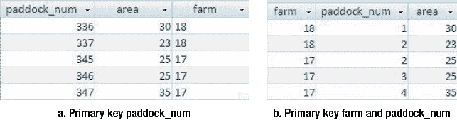

图 9-2. `Paddock` 表的简单主键和组合主键

在 图 9-2a 中，我们只需要一个字段作为主键；然而，随着项目规模扩大，围场编号会变得很大，而且它们本身意义不大。在第二种方案中，`paddock_num` 的编号不再唯一（每个农场都从 1 重新开始），我们需要两个字段来标识一个围场。但是，围场 (17, 2) 对于农场 17 的所有者来说，比围场 345 更有意义。在这个阶段，选择并不是那么关键。

`farm` 和 `paddock` 之间的这种关系（一种具有强制一端的一对多关系）有时被称为 `所有权`（ownership）关系。`paddock` `必须`有一个关联的 `farm`，或者换个角度看，`farm` `拥有` `paddock`。当我们遇到一长串的一对多所有权关系时，外键大小的问题就变得更加突出。考虑图 9-3 中展示的更多昆虫数据模型。该模型描述了一个我们之前考虑过的问题的简化版本。每次 `访问`（visit）都必须关联到一个 `paddock`，每个 `样本`（sample）都必须关联到一个特定的 `访问`。

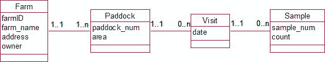

图 9-3. 几个一对多所有权关系

对于每个多对一的关系，我们需要将一端的主键作为外键包含在多端。让我们假设一个 `paddock` 在任何给定日期只能被访问一次。前述模型的一个可能的表集合如下所示：

`Farm(farmID, farm_name, address, owner)`

`Paddock(farmID, paddock_num, area)`，其中 `farmID` 是引用 `Farm` 的外键

`Visit(date, farm, paddock,)`，其中 (`farm`, `paddock`) 是引用 `Paddock` 的外键

`Sample(date, farm,, paddock, sample_num, count)`，其中 (`date`, `farm`, `paddock`) 是引用 `Visit` 的外键

在这个表集合中，我们假设围场在每个农场内从 1 开始编号，样本在每次 `访问` 内从 1 开始编号。`Visit` 表不需要有一个 ID，因为组合 (`date`, `farm`, `paddock`) 对于这个问题来说是唯一的。

`Sample` 表现在看起来相当繁琐，因为引用 `Visit` 表的外键是一个由三个字段组成的组合。这个表最终将拥有最多的行，因此除了看起来不美观之外，还可能存在大小（存储空间）方面的考虑。如果我们采用了 图 9-2a 中为 `Paddock` 使用单一主键的替代方案，那么 `Visit` 和 `Sample` 表中的外键会小一些，但代价是围场的标识不那么直观。

我们还有哪些其他选择？引入一个 `visitID` 是有意义的。`Visit` 很可能按时间顺序排列，因此 ID 号将具有某种含义。`Visit` 458 很可能是发生在 `visit` 457 之后的那次访问，而 `paddock` 458 与 `paddock` 457 没有明显的关系。

一个折中的方案可能是下面这组表：

`Farm(farmID, farm_name, address, owner)`


### 表结构设计

`Paddock`(`farmID`, `paddock_num`, `area`)，其中`farmID`是外键，引用`Paddock`表。

`Visit`(`visitID`, `date`, `farm`, `paddock`)，其中(`farm`, `paddock`)是外键，引用`Paddock`表。

`Sample`(`visit`, `sample_num`, `count`)，其中`visit`是外键，引用`Visit`表。

牧场在农场内编号，访问按时间顺序编号，样本在访问内编号。因此，我们引入的所有 ID 号都具有一定含义，样本表比之前的要小得多。总而言之，选择主键可能并不直接。有时自动生成的 ID 号是必要的，但它并不能解决所有问题。我们可以考虑使用由 ID 号串联而成的主键（例如，在农场内为牧场编号或在访问内为样本编号）。串联 ID 号可能更有意义，但代价是其他相关表中可能存在笨拙的外键，这两者之间总需要权衡。选择主键总是有其他方法，与大多数设计问题一样，没有硬性规定说哪种选择是最好的。

### 唯一约束

让我们再看一下`Visit`表，如图 9-4 所示。我们有两个候选键：`visitID`和组合(`date`, `farm`, `paddock`)。基于上一节讨论的原因，我们选择`visitID`作为主键。这个选择会让我们失去什么吗？

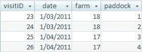

**图 9-4.** 带有生成的`visitID`的`Visit`表

如果(`date`, `farm`, `paddock`)组合不是主键，我们就失去了每行必须在此字段组合上具有唯一值的约束。这意味着我们可能会错误地插入两行记录：2011 年 4 月 1 日访问 17 号农场 3 号牧场。我们仍然希望保持此组合的唯一性，为此可以设置一个唯一约束。

清单 9-1 展示了创建`Visit`表的 SQL，其中包含一个唯一约束，以确保(`date`, `farm`, `paddock`)组合在表中不重复。

***清单 9-1.** 创建带唯一约束的 `Visit` 表的 SQL*
```sql
CREATE TABLE Visit (
    visitID INT PRIMARY KEY,
    date DATE,
    farm INT,
    paddock INT,
    FOREIGN KEY (farm, paddock) REFERENCES Paddock,
    UNIQUE (date, farm, paddock)
)
```
唯一约束也是强制表间 1-1 关系的一种方式。考虑图 9-5 中运动队的类图，其中每个队都有一名成员担任队长。

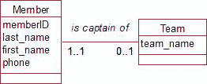

**图 9-5.** `Team`和`Member`之间的 1-1 关系

当我们在关系数据库中建立图 9-5 的类时，1-1 关系将通过`Team`表中的外键表示，如图 9-6 所示。

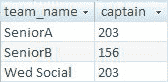

**图 9-6.** `Team`表

每个队只能有一名队长（因为只有一个`captain`字段）；然而，我们尚未讨论如何确保每位成员按照 1-1 关系的要求只能担任一个队的队长。在图 9-6 中，注意成员 203 是多个队的队长。我们可以通过在`Team`表的`captain`字段上添加唯一约束来防止这种情况发生。这将阻止同一个值被输入到多行的`captain`字段中。创建在`captain`字段上带有唯一约束的`Team`表的 SQL 如清单 9-2 所示。

***清单 9-2.** 确保 `Member` 和 `Team` 之间的 1-1 队长关系*
```sql
CREATE TABLE Team (
    team_name VARCHAR(20) PRIMARY KEY,
    captain INT UNIQUE FOREIGN KEY REFERENCES Member
)
```
唯一约束能帮助我们解决一些设计问题：强制 1-1 关系，以及维护未被选为主键的候选键的唯一性。

## 使用约束代替类别类

我们关于类及其在关系数据库中对应表的讨论，很多都涉及引入新的类和表以保持数据的准确性和一致性。现在我们将看看何时你可能决定不添加额外的类以及原因。让我们思考俱乐部的成员及其会员类型（例如，高级会员`Senior`、初级会员`Junior`或社交会员`Social`）。如果我们在`Member`表中将会员类型作为一个字段，可能会出现一致性问题，如图 9-7 中表的第一行所示的拼写错误。

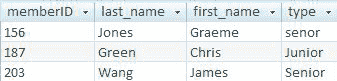

**图 9-7.** 将会员类型作为`Member`表中的一个字段

如果我们有兴趣创建报告，将所有不同类型的成员分组（例如，所有高级会员、所有初级会员等），在图 9-7 的表中，我们遇到类型拼写不一致的问题。我们在前几章中的解决方案是创建一个额外的类（表）来保存不同的会员类型，并建立一个 1-多关系，如图 9-8 所示。

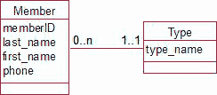

**图 9-8.** 用类表示会员类型

我们现在可以有`Type`类的对象或`Type`表的行来表示我们的每种类型：`Junior`、`Senior`等。这确保了我们在命名不同类型时的一致性。看看图 9-9 中的表。`Type`表看起来有点多余。

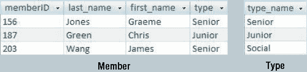

**图 9-9.** 会员类型是一个单独的表

这个额外的`Type`表所实现的，只是确保`Member`表中`type`字段条目的统一性。我们可以通过在`type`字段上设置检查约束来达到同样的目的。我们在第 7 章讨论了字段上的约束。图 9-10 展示了在像 Access 这样的产品中如何轻松完成此操作，清单 9-3 展示了等效的 SQL。

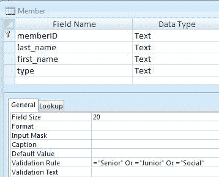

**图 9-10.** 带有约束的会员类型

***清单 9-3.** 在字段上放置约束*
```sql
CREATE TABLE Member (
    memberID INT PRIMARY KEY,
    last_name VARCHAR(20),
    first_name VARCHAR(20),
    type VARCHAR(20) CHECK type IN ('Senior', 'Junior', 'Social')
)
```
我们应该优先选择哪种：带有字段约束的表（[图 9-10](#9781430242093_Ch09.xhtml#F10]）还是引用另一个表的表（[图 9-9](#9781430242093_Ch09.xhtml#F9]）？在[图 9-10](#9781430242093_Ch09.xhtml#F10]中，我们有一个内置在表设计中的约束。如果以后添加了额外的会员类型，则必须更改约束的定义。这需要由系统管理员或至少是受信任可以更改设计的人员来完成。从积极的方面看，我们的数据库中少了一个表。


在`图 9-9`中，我们面临一个额外表的复杂性。然而，如果需要另一种会员类型，只需将其作为`Type`表中的一个新行添加即可。这只是一个数据录入工作，不涉及数据库设计的任何更改。如果类型将保持相当恒定，则约束更简单，而对另一个表的引用则使用户易于添加不同类型。

有一种情况，额外的表将始终是合适的选择。这就是当存在（或以后可能存在）属于`Type`类的某些额外属性时。例如，如果我们希望为每种不同的会员类型保留费用，我们唯一能做到这一点的方法是通过如`图 9-11`所示的`Type`类。

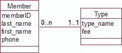

`图 9-11`：如果存在额外属性，则需要一个额外的类。

总之，当我们有一个表现得像类别（例如，会员类型）的数据项时，我们有时可以选择是将其作为表中的一个简单字段存储并通过约束或验证规则保持值一致，还是拥有一个单独的类别表供我们引用。如果类别的数量可能增加，第二种选择更好，因为这变成了向类别表添加额外行的简单事情，而不是更改父表上的约束。如果存在或可能存在与该类别相关的其他属性，则额外的表是唯一的选择。如果这两种情况都不适用，值得考虑带有约束的简单字段是否更合适。

### 删除被引用的记录

你已经看到了我们如何使用外键来表示两个表之间的关系。再看一下我们在`图 9-5`中关于团队和成员的模型。我们可以在`Team`表中使用外键（`captain`）来表示`is captain of`关系，如`图 9-12`所示。

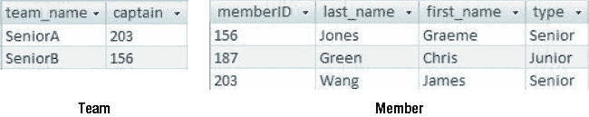

`图 9-12`：团队和成员

外键确保我们具有参照完整性。回顾`第 7 章`，参照完整性防止我们在外键字段`captain`中拥有一个值，如果该值在`Member`表的主键字段`memberID`中不存在。这确保了我们所有的队长都是我们已经记录了姓名和其他详细信息的成员。与主键不同，外键字段不一定是强制的，`captain`字段可以为空（即，参照完整性并不要求每个团队都必须有一个队长）。我们当然可以施加那个额外的约束，通过指定`captain`字段必须为`NOT NULL`。

到目前为止，我们只从添加新团队和队长的角度看参照完整性。然而，我们还面临从`Member`表中删除成员的情况。例如，如果我们试图删除成员 156，我们将在`Team`表中遇到参照完整性问题。`SeniorB`的队长将不再存在于`Member`表中。

有三种方法来处理这种情况。数据库软件产品在提供这些选项的能力上各不相同，但所有产品都会提供第一种，如下所示：

`不允许删除`：你不能删除正在被引用的行。例如，当成员 156 正在被`Team`表引用时，删除操作将不被允许。如果我们想要删除成员 156，我们将首先必须移除`Team`表中对他的引用，然后才能从`Member`表中删除他。

`置空删除`：如果成员 156 被删除，引用它的字段`captain`将被置空（变为空）。这本质上是说，如果一个团队的队长离开了俱乐部，该团队就没有队长——在这种情况下这可能是相当合理的。

`级联删除`：如果删除一行，所有引用它的行也将被删除（以及引用它们的行，依此类推）。在这种情况下，删除成员 156 将意味着团队`SeniorB`将被删除。这显然不是我们想要的。

当我们设置一个字段为外键时，我们可以指定当尝试删除其引用的行时应发生什么。`代码清单 9-4`显示了在创建`Team`表时，为外键`captain`指定“置空删除”的 SQL 语句。如果你没有指定选项，默认通常是“不允许删除”。

`代码清单 9-4`：在外键上指定删除选项

```sql
CREATE TABLE Team (
team_name VARCHAR(20),
captain INT FOREIGN KEY REFERENCES Member ON DELETE NULLIFY )
```

根据具体问题，我们可以选择最合适的删除选项。对于团队和成员的情况，“置空删除”对于外键`captain`似乎是合理的。我们希望能够删除成员，并且如果成员 156 离开，`SeniorB`团队的队长职位将会空缺，这是有道理的。然而，我们`图 9-5`中的模型目前不允许这一点。它说每个团队必须有一个队长。也许值得重新考虑这一点。虽然在正常情况下我们期望所有团队都有队长，但我们会遇到人们意外离开或辞职的情况。在这些情况下，我们希望对我们保存的数据发生什么？如果我们坚持每个团队都有一个队长（通过使该字段为必需），我们将必须在能够从会员列表中删除旧队长之前找到一个新队长。也许这正是我们想要的，或者那可能限制性太强。我们在前面的章节中讨论了使字段成为必需字段的后果。考虑从数据库中删除记录可能会让我们重新考虑`is captain of`关系以及它是否应该是可选的。

让我们考虑一个不同的情况，即订单和产品，如`图 9-13`所示。

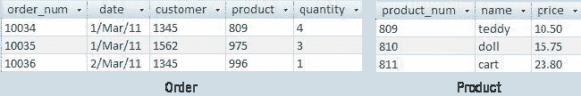

`图 9-13`：订单和产品：如果我们删除一个产品会发生什么？

如果我们不再库存产品 809 会怎样？如果我们在`Product`表中删除这一行，我们的参照完整性将受到损害，因为订单号 10034 引用了它。我们有哪些选择？“置空删除”意味着在`Order`表的外键`product`字段中没有任何内容。这没有意义。我们会有一个曾经订购了四个某种产品的记录——但我们不知道那个产品是什么，而且我们无法找到价格。显然，这不会是有用的。“级联删除”将意味着所有产品 809 的订单都将被删除。这似乎也不合理，因为企业需要跟踪其所有订单以确定利润、税收等。因此，在这种情况下，我们唯一的选择是“不允许删除”选项。如果存在对该产品的订单，我们就不能从`Product`表中删除该产品。


将已停产的产品保留在表格中是重要的，但我们也希望能够将它们与当前产品区分开来。对于这种情况，我们可以考虑在`Product`表中添加一个额外的字段（例如`current`字段）来区分当前产品与已停产产品。现在我们面临一个新问题：如何防止为已停产产品输入新订单？这开始超出了本书的讨论范围。许多数据库应用程序允许通过`触发器`对表格施加额外的约束。触发器是一种由表中的更改（例如添加或更新行）触发的程序，并将执行指定的操作。在这种情况下，触发器会检查`Order`表中潜在的新行是否对应已停产产品，如果是，则阻止该行被永久添加到表中。诸如仅允许当前产品订单之类的约束也可以通过数据库界面实现，我们将在第 11 章中探讨这种方法的优缺点。

何时选择“级联删除”是合适的？这是一个相当粗暴的解决方案，设置时应非常谨慎。如果我们有一个科目的注册信息，然后该科目被取消，那么也许可以合理地期望删除该科目的所有注册信息。但我们必须小心，确保没有往年的历史注册记录。删除信息并不像你预期的那样频繁发生。产品和科目可能会停产，但如果我们要保留已停产科目的历史订单或注册信息，就需要保留这些信息。在这些情况下，`禁止删除`选项是最佳选择。当客户和订单确实不再有用时，通常更常见的做法是将重要的或汇总的信息存档并存储到其他地方，而不是完全删除。请谨慎使用`级联删除`选项。

综上所述，我们可能会认为最安全的选项是永不删除任何内容。可以设置表格使得任何行都无法被删除。然而，尽管这似乎是个好主意，但我们总是需要删除那些误输入到表中的记录。例如，假设我们不小心输入了同一个客户两次（但客户编号不同）。我们需要尽快将那条多余的记录从表中移除，以免引起各种问题。

### 总结

在本章中，我们探讨了在更新表中数据时，选择适当的主键以及确保参照完整性所涉及的一些问题。需要记住的一些要点如下：

*   我们通常需要引入一个生成的 ID 号，以确保我们有一个值稳定且唯一的字段，可以将其用作主键。这对于人员信息尤其重要，因为姓名和地址等标识信息可能会发生变化。
*   请注意，数据录入错误可能导致同一个人在您的数据库中以两个不同的 ID 号出现。请尽量避免这种情况！
*   当主键由多个拼接字段组成时，值得考虑使用生成的 ID 号来减小引用该表的外键的大小。
*   在引入生成 ID 的情况下，应使用约束来保持被替换为主键的字段组合的唯一性。
*   唯一约束可用于强制实现 1 对 1 关系。
*   对字段值的约束可能比关联到另一个（非常简单的）表的关系更合适。
*   当您希望删除一个被外键引用的行时，有三种选项：
    *   禁止删除。
    *   将引用被删除行的字段设为`NULL`（`空值删除`）。
    *   删除所有引用被删除行的行（`级联删除`）。

### 测试你的理解

##### 练习 9-1

又是非常实用的“客户订购产品”示例——总有新东西可发掘。设计将表示图 9-14 中`Order`类的表。考虑约束、主键和外键，以及更新规则。

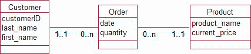

**图 9-14.** 客户下单模型

##### 练习 9-2

汽车销售场需要保存有关可用汽车的品牌和型号信息，以及他们库存中单个汽车的注册信息。例如，福特 Siesta 有轿车和掀背车，他们目前有一辆蓝色轿车，注册号为 TC545。对于某些型号，您可能可以选择自动或手动变速箱，有些还提供不同的排量（例如 1.5 升或 2.0 升）。思考为此情况设置表格的可用选项。

## 第 10 章


## 查询基础

我们花费了大量精力设计数据库，以确保数据能够以一致和准确的方式存储。在本章中，我们将探讨如何将信息提取出来。数据将存储在许多独立的表中，根据我们提出的问题，我们需要以多种不同的方式组合来自这些表的数据。本章只是查询艺术的一个简要介绍。如需进一步了解，您可能有兴趣查阅我的书 *SQL 查询入门：从新手到专业*。^(1)

### 单表简单查询

让我们从只看一个表开始。我们将使用`Student`表（其一小部分如图 10-1 所示）来说明一些主要的查询类型。

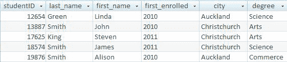

**图 10-1**. `Student`表的一小部分

随着时间的推移，`Student`表可能会累积数十万条记录，实际上还会有更多列来记录出生日期、电话号码、移民身份等信息。对用户相关的是这些信息的可管理子集。我们应该回顾项目最初用例，看看人们会对数据提出哪些问题。注册主任可能想要一份今年开始学习的所有学生的名单；校友经理可能想要一份居住在基督城的当前和过去学生的名单；系主任可能想要一份今年注册文学学士学位学生的名单；管理层可能需要过去十年的注册人数以确定趋势。所有这些信息都可以从这个表中收集。为此，我们可以使用基本的关系运算`选择`和`投影`，以及排序和聚合函数。

### 投影操作

投影操作允许我们指定要检索表的哪些列。如果我们想要一份姓名列表，我们其实不想看到关于每个学生的所有其他信息。如果我们只想看到每个学生的 ID 号和姓名，我们只投影（或检索）前三列。清单 10-1 展示了如何用 SQL 命令实现这一点。第一行说明需要哪些列，第二行说明从哪个表中检索。

**清单 10-1.** 用于从`Student`表投影三列的 SQL

```sql
SELECT studentID, first_name, last_name
FROM Student
```


清单 10-1 中的查询结果将是一个新行集，其中只包含我们指定的那三个字段或列。投影操作是表上最简单的操作之一，但即使对于这样简单的过程，我们也必须仔细思考我们在做什么。表中的每一行都保证是唯一的，因为我们总是有一个主键。然而，如果主键不是我们在查询中指定的列之一，那么投影操作产生的结果行可能不是唯一的。我们应该如何处理重复行？答案完全取决于你的查询用途。

考虑几个可能产生重复行的查询例子，使用的是图 10-1 中 `Student` 表的小样本数据。假设校友经理正在组织一次晚宴，并希望获得一份名单来为所有客人制作姓名标签。他从 `Student` 表中投影出 `first_name` 和 `last_name`，结果有两行都是 `John Smith`。他需要这两行吗？他当然需要，因为两个同名的不同的人会来参加晚宴。现在考虑校友经理希望建立校友分会，因此想要一份所有学生来自的城市列表。他从 `Student` 表中投影出 `city`，得到了几行 `Christchurch`。他想要所有这些行吗？不。他只想要知道这个城市的集合。

所以，有时我们希望查询结果中包含重复行，有时则不希望。默认情况下，像清单 10-1 这样的 SQL 语句会检索出重复行。如果你不想要重复行，可以使用关键字 `DISTINCT`，如清单 10-2 所示。

清单 10-2. `仅检索唯一记录`

```sql
SELECT DISTINCT city
FROM Student
```

### 选择操作

我们想对单个表做的另一件事是仅检索其中某些行。例如，我们可能想检索那些正在攻读理科学位的学生的信息，或者仅仅是那些在 2011 年首次入学的学生。检索行的子集被称为*选择*操作。我们需要指定如何确定我们想要哪些行。我们通过指定一个测试条件来实现这一点，该条件对每一行而言，结果要么为真，要么为假。要找到所有的理科学生，我们会指定条件 `degree = ‘Science’`，而要找到所有在 2011 年进入大学的学生，条件则是 `year = 2011`。该条件会依次对每一行进行检查，如果为真，则该行将被包含在正在检索的结果集中。我们可以通过使用 `AND`、`OR` 和 `NOT` 等运算符来构建更复杂的条件。例如，如果我们只想要在 2011 年入学的理科学生，条件就是 `degree = ‘Science’ and year = 2011`。如果我们想要一份所有商科和文科学生（但不包括其他任何学位）的名单，条件则是 `degree = ‘Arts’ OR degree = ‘Commerce’`。

在 SQL 语句中，通过使用关键字 `WHERE` 后跟适当的条件来指定选择操作，如清单 10-3 所示。第一行中的 `*` 表示检索所选行的*所有*列或字段。

清单 10-3. `指定要检索哪些行`

```sql
SELECT *
FROM Student
WHERE degree = ‘Science’ and year = 2011
```

有一个虽小但重要的点需要记住：如果一个字段（例如 `degree`）没有值，那么像 `degree = ‘Science’` 这样的语句的真假性是未知的。SQL 查询只返回那些条件语句*已知*为真的行。如果我们为 `degree = ‘Science’` 检索行，然后为 `degree <> ‘Science’` 检索行，我们将漏掉那些 `degree` 字段没有值的行，因为我们不知道它的值（它可能是 Science，也可能不是）。要找到那些为空的字段，我们可以使用表达式 `degree is NULL`。

大多数查询将需要结合使用选择和投影操作。在这种情况下，首先根据条件选择行，然后检索指定的列。我们可能不想像清单 10-3 那样看到每个所选学生的全部信息，而可能只想看到他们的 ID 号和姓名。清单 10-4 展示了在 SQL 语句中结合使用选择和投影操作。

清单 10-4. `指定要检索哪些行和列`

```sql
SELECT studentID, first_name, last_name
FROM Student
WHERE degree = ‘Science’ and year = 2011
```

请注意，条件中涉及的字段（`degree` 和 `year`）不必出现在投影的列中。

## 聚合

我们可能想从 `Student` 表中检索的其他类型信息包括计数、平均值和总和。例如，我们可能想知道曾经注册过的学生总数、每个学位的注册人数，或过去十年中每年的注册人数。如果 `Student` 表中有更多的列，我们可能还想计算费用的总和或年龄的平均值等等。

SQL 提供了多种不同的函数用于计数和聚合数值数据（例如，`COUNT`、`AVG`、`SUM`、`MAX`、`MIN`）。我们现在来看如何执行几个不同的查询。

如果我们只想简单地统计一下曾经在该大学注册过的学生人数，我们可以发出一个如清单 10-5 所示的 SQL 语句。

清单 10-5. `选择单个计数`

```sql
SELECT COUNT(*)
FROM Student
```

`COUNT(*)` 的意思就是统计每条记录。这将只返回一个数字，即表中的行数。如果我们想找到最大的 `studentID`，我们会发出类似的语句，但要指定我们要为其查找最大值的字段，如清单 10-6 所示。

清单 10-6. `查找字段的最大值`

```sql
SELECT MAX(studentID)
FROM Student
```

我们可以在 `COUNT` 语句中指定一个特定的字段。你认为如果我们要求 `COUNT(studentID)` 或 `COUNT(city)` 会返回什么？在这两种情况下，我们可能会得到相同的答案（行数），因为大多数版本的 SQL 默认只计算该字段有值的所有行。如果我们要求统计学生 ID，这可能是我们想要的，但当我们要求统计城市数量时，我们实际上是想知道表中出现了多少个不同的城市。这可以通过在 `COUNT` 函数中添加关键字 `DISTINCT` 来实现，如清单 10-7 所示。

清单 10-7. `计算不同城市的数量`

```sql
SELECT COUNT(DISTINCT city)
FROM Student
```

这些聚合语句中的每一个都可以与选择操作结合使用，以首先检索行的子集。我们可以通过添加一个 `WHERE` 子句来指定我们想要应用聚合操作的行来实现这一点。例如，要找出曾经攻读过理科专业的学生人数，我们会使用清单 10-8 中的语句。我们可以将其理解为首先检索相应的行，然后对它们进行计数。

清单 10-8. `计算行的子集`


### SQL 查询、分组与连接

SQL 的聚合功能非常强大，其中一个特别强大的特性是能够对行的子集进行分组，然后统计每个子集中的行数。例如，清单 10-8 返回了已报名科学学位的学生人数。很可能我们同时需要知道科学、艺术及其他学位的学生人数。与其为每个学位单独发出几条命令，不如将它们合并到一条语句中，如 清单 10-9 所示。

**清单 10-9.** *检索每个学位的计数*

```sql
SELECT degree, COUNT(*)
FROM Student
GROUP BY degree
```

我喜欢这样理解 清单 10-9 中的查询：去获取 `Student` 表中的所有行，将每个学位对应的所有行归为一组，统计每个子集中的行数，然后输出学位和计数（如第一行所指定）。结果将类似于 图 10-2。

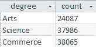

**图 10-2.** 如 清单 10-9 中所示的分组聚合查询的结果

再次强调，所有这些聚合查询都可以与 `WHERE` 子句结合，以便在分组和计数之前仅检索行的一个子集。这意味着我们可以满足多种多样的请求，例如检索过去十年中每年报名科学的学生人数、来自每个城市的学生人数、来自每个城市的理科学生人数等等。

#### 排序

当我们从表中检索行和列的子集时，可能希望它们以特定的顺序显示。例如，如果我们想要一个 2011 年首次入学的所有学生姓名列表，我们很可能希望按姓名排序，而不是随机顺序。SQL 短语 `ORDER BY` 允许我们指定行的呈现顺序。清单 10-10 展示了检索行子集然后对其进行排序的 SQL 语句：首先按 `last_name` 排序，然后对于 `last_name` 值相同的行，再按 `first_name` 排序。

**清单 10-10.** *按指定顺序检索行和列的子集*

```sql
SELECT last_name, first_name, studentID
FROM Student
WHERE year = 2011
ORDER BY last_name, first_name
```

### 涉及两个或多个表的查询

上一节概述了我们可以对单个表执行的一些查询。我们的大多数查询将需要数据库中多个表的信息。

有多种不同的关系操作可以用来组合表，我们将在本节中了解其中一些。关系数据库操作的一个真正优雅的特性是，当我们对一个或多个表执行操作时，可以将结果视为一个新表。这个新表并非永久存在于数据库中，但概念上将其视为在查询期间存在的虚拟表是方便的。我们在上一节中使用的所有操作（投影列、选择行、聚合和排序）随后都可以应用于这个新的虚拟表。我们还可以将组合两个表产生的虚拟表与另一个真实表组合，然后再与另一个组合。因此，通过一些相当简单的操作，我们可以轻松构建涉及多个表的查询，以满足相当复杂的问题。让我们首先看一些组合表的操作。

#### 连接操作

组合两个表最常见的操作是 *内连接*。考虑 图 10-3 中的 `Student` 和 `Enrollment` 表。

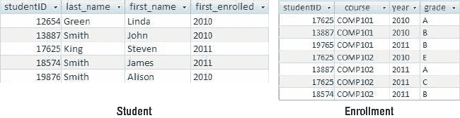

**图 10-3.** `Student` 和 `Enrollment` 表的部分内容

如果我们想回答“谁在 2011 年注册了 COMP102？”这样的问题，我们需要两个表中的数据。如果我们仅通过查看表来回答这个问题，我们会首先从 `Enrollment` 表中找到满足条件 `course = ‘COMP102’ AND year = 2011` 的行。然后我们需要查看 `Student` 表以找到对应的姓名。内连接允许我们将两个表组合起来，使所有需要的信息一起出现。对于此查询，我们对来自 `Student` 表的行和来自 `Enrollment` 表的行感兴趣，其中 `studentID` 的值在两个表中相同。这将是连接条件。让我们看看 清单 10-11 中的 SQL 语句，然后思考它的含义。

**清单 10-11.** *连接两个表的 SQL 语句*

```sql
SELECT *
FROM Student INNER JOIN Enrollment ON Student.studentID = Enrollment.studentID
```

将内连接操作理解为创建一个新的虚拟表是很有用的，该表将包含来自两个原始表的所有列。我们用每个表的行的所有组合填充这个表，然后保留那些满足条件 `Student.studentID = Enrollment.studentID`（即，两个表中 `studentID` 的值相同）的行。图 10-4 显示了结果行集的一部分。

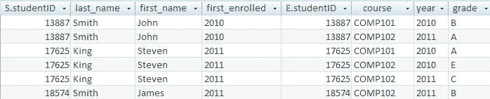

**图 10-4.** 在 `studentID` 上连接 `Student` 和 `Enrollment` 得到的行

在 图 10-4 中，前四列来自 `Student` 表，后四列来自 `Enrollment` 表。我们只看到两个表中 `studentID` 相同的行组合。现在我们有了这个虚拟表，就可以将所有单表操作应用于它。我们可以用 `WHERE` 子句仅选择 2011 年注册 COMP102 的那些行，然后投影或仅检索学生的 ID 和姓名。执行此操作的 SQL 语句如 清单 10-12 所示，结果行如 图 10-5 所示。

**清单 10-12.** *检索 2011 年注册 COMP102 的学生的 ID 和姓名的 SQL 语句*

```sql
SELECT Student.studentID, last_name, first_name
FROM Student INNER JOIN Enrollment ON Student.studentID = Enrollment.studentID
WHERE course = ‘COMP102’ AND year = 2011
```

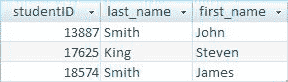

**图 10-5.** 将连接与选择和投影操作结合后得到的行

这只是对内连接的一个非常粗略的解释，但我相信你能看出如何不断地将产生的虚拟表与另一个表连接，然后再与另一个连接，从而构建出越来越复杂的查询。

在这个关于连接的基本介绍中，最后一点值得提及的是，当我们连接 图 10-6 中那样的两个表时会发生什么。

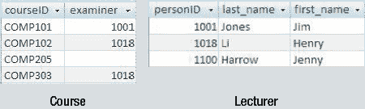

**图 10-6.** `Course` 和 `Lecturer` 表

如果我们想要一个包含考官姓名的课程列表，我们可能会首先尝试一个内连接，其中 `Course` 表中的 `examiner` 等于 `Lecturer` 表中的 `personID`。如果我们这样做，那么结果行将如 图 10-7 所示。

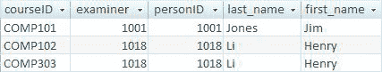

**图 10-7.** `Course` 和 `Lecturer` 表内连接的结果


图 10-7 中的行可能并非我们所预期的那样——如果我们原本期望看到每个课程对应一行的话。内连接返回的是两个表中 `examiner` = `personID` 的行组合，而当 `examiner` 字段为 `Null` 时，这个条件永远不会成立。结果表中缺少了 `COMP205` 这门课，因为它没有考官。如果问题更准确地表述为“检索*所有*课程，以及*对于那些有考官的课程*，同时检索考官信息”，我们可以使用所谓的*外连接*，如代码清单 10-13 所示。

***代码清单 10-13.** 用于检索所有课程及其考官的外连接*

```sql
SELECT *
FROM Course LEFT OUTER JOIN Lecturer ON examiner = personID
```

此查询的结果如图 10-8 所示，与内连接的结果相同，但除此之外，左表（`Course`）中连接字段（`examiner`）为空的任何行也会出现。

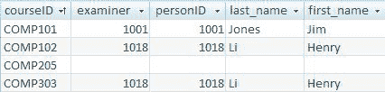

**图 10-8**. 外连接检索所有课程的结果

在连接语句中，表的先后顺序无关紧要，因此 `Course LEFT OUTER JOIN Lecturer` 等价于 `Lecturer RIGHT OUTER JOIN Course`。标准 SQL 也支持全外连接，这意味着两个表中的每一行都会在结果中得到体现。`Lecturer FULL OUTER JOIN Course` 将检索所有的讲师（即使他们没有监考课程）和所有的课程（即使它们没有考官）。虽然全外连接是标准 SQL 的一部分，但并非所有系统都明确支持它（例如 MS Access 不支持）。不过，我们总是可以通过使用*联合*（*union*）操作（我将在下一节描述）组合两个外连接来达到相同的效果。

### 集合操作

虽然连接可能是组合多个表信息最常用的操作，但还有一些其他操作。连接可以在任意两个表之间使用。集合操作则用于两个具有相同数量和类型列的表（或虚拟表）。它们用于诸如“检索同时出现在这两个表中的行”或“检索在这个表中但不在那个表中的行”之类的查询。我们可以使用图 10-9 中的 `Enrollment` 表来说明这些概念。

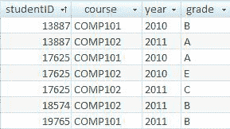

**图 10-9**. `Enrollment` 表

以下是我们可能希望执行的一些查询：

*   检索所有*同时*选修了 `COMP101` *和* `COMP102` 的学生的 `ID` 号。
*   检索所有*要么*选修了 `COMP101` *要么*选修了 `COMP102` 的学生的 `ID` 号。
*   检索所有选修了 `COMP101` *但未*选修 `COMP102` 的学生的 `ID` 号。

首先，我们需要两个查询，分别返回选修了 `COMP101` 和 `COMP102` 的学生的 `ID`。这些查询及其产生的虚拟表如图 10-10 所示。

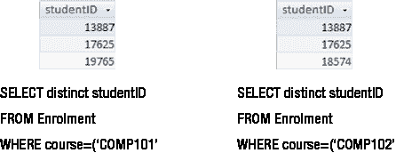

**图 10-10**. 用于选择选修了特定科目的学生的查询结果

如图 10-11 所示，对这两个虚拟表进行一些重新排序和叠加，可以帮助我们看清哪些行会满足我们提出的每个问题。

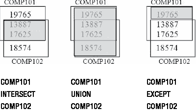

**图 10-11**. 使用集合操作查找关于选课问题的答案

图 10-11 中展示的三种集合操作，分别向我们显示了那些选修了*两门*科目（`intersect`）、*任一门*科目（`union`）以及选修了 `COMP101` *但未*选修 `COMP102`（`except`）的学生。Oracle 使用关键字 `MINUS` 代替 `EXCEPT`。代码清单 10-14 展示了从原始真实表出发，检索这两个 `studentID` 集合之并集的 SQL。

***代码清单 10-14.** 选修了 COMP101 或 COMP102 的学生的 studentID*

```sql
SELECT distinct studentID FROM Enrollment WHERE course = ‘COMP101’
UNION
SELECT distinct studentID FROM Enrollment WHERE course = ‘COMP102’
```

原则上，在 SQL 中，我们可以将代码清单 10-11 中的关键字 `UNION` 替换为 `INTERSECT` 和 `EXCEPT` 来获得其他集合操作。实际上，并非所有数据库系统都提供后两个关键字。这是因为可以使用其他一些 SQL 语句获得相同的结果。如何实现这一点超出了本入门介绍的范围，但可以在我的《SQL 查询》书中找到。重要的是要知道，你的关系数据库系统将允许你编写 SQL 语句来检索等价于图 10-11 中每个集合操作的行。

### 索引如何提供帮助

许多查询需要连接多个表、提取特定的行和列，并可能按指定的顺序呈现结果。随着表变得越来越大，这些操作显然会变得更加耗时。索引是一种能够快速找到数据库表中特定行的方法。

 注意 这是关于索引如何帮助查询执行的一个非常简短的介绍。如果你负责为大型数据库创建索引，你需要阅读更多关于这个主题的资料。诸如 *Expert Indexing in Oracle Database 11g* (Apress, 2012) 和 *Expert Performance Indexing for SQL Server 2012* (Apress, 2012) 之类的书籍可以提供帮助。

根据你使用的数据库软件，你可能会发现你的表默认被添加了许多索引。规划有用的索引还有几个考虑因素：

*   你是在更新数据还是检索数据；
*   你检索的是非常通用还是非常具体的数据；
*   涉及连接的表的相对大小；
*   表中行的大小；
*   无数其他难以预料的因素。

我在此不打算讨论这些问题。希望本章能让你意识到索引的作用，这样你就可以开始学习更多知识，并与你的数据库管理员进行有益的讨论。

### 索引与简单查询

让我们从查看对单个表（如图 10-12 中的 `Enrollment` 表）的简单查询开始。我们将需要为不同的目的检索行的不同子集。

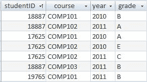

**图 10-12**. 一个潜在非常大的表的一小部分

我们很可能会希望通过 `course` 来访问此表（以便检索选修特定班级的学生），而在其他时候通过 `studentID`（以获取学生记录）。索引帮助我们高效地完成这两项任务。数据库索引的作用非常类似于你在书后找到的索引。例如，如果你在名称上有一个索引，它会按字母顺序存储 `name` 字段的所有值，并在其他地方存储指向完整记录的指针或引用。这个引用就像在书的索引中存储页码一样。图 10-13 展示了你如何设想 `Enrollment` 表上的索引。

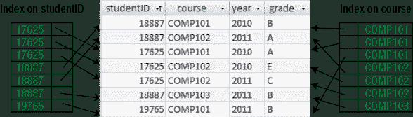

**图 10-13**. `Enrollment` 表上的两个索引


#### 索引如何提升查询速度

如果我们想要一门课程 `COMP101` 的选课名单，系统可以快速搜索课程索引来找到 `COMP101` 的条目。该索引还包含指向 `Enrollment` 表中完整行的引用，因此系统可以快速定位其余信息。或者，如果我们需要记录学生 `17625` 的进度，我们可以使用学生索引来快速访问该学生的相应记录。

清单 10-15 展示了在 `Enrollment` 表的 `student` 和 `course` 字段上创建两个索引的 SQL 语句。

##### 清单 10-15. 在 `Enrollment` 表上创建两个索引
```sql
CREATE INDEX IDX_student ON Enrollment (studentID)
CREATE INDEX IDX_course ON Enrollment (course)
```

让我们看另一个使用 `Student` 表的例子，如图 10-14 所示。

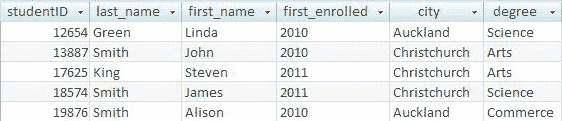

**图 10-14**. `Student` 表

在 `Student` 表中，主键字段是 `studentID`。当我们指定一个字段为主键时，大多数数据库会自动为该字段创建一个索引。该索引将被指定为 `unique`（唯一），这意味着只能包含每个值的一个条目。这个索引就是主键约束在物理上的实现方式。当我们在表中添加新行时，系统会快速搜索索引，查看主键值是否已经存在，如果存在则拒绝新行。

对于 `Student` 表，我们经常需要做的两件事是按姓名查找特定学生，以及按字母顺序检索学生。由于表中可能有数千个条目，我们不希望为了查找某个学生姓名而扫描整个表，因此某种涉及姓名的索引将非常有用。如果我们只是想查找某个特定学生，对 `last_name` 字段建立索引会加快速度，因为所有的史密斯姓氏会排在一起，并且需要扫描的记录更少。为了进一步改善访问，我们可以设置一个复合索引，其中姓氏有序排列，对于重复的姓氏则按名字排序。如果需要按字母顺序访问表记录，这个索引可以非常快速地完成。创建复合索引的 SQL 如 清单 10-16 所示。

##### 清单 10-16. 在 `Student` 表上创建一个复合索引
```sql
CREATE INDEX IDX_fullName ON Student (last_name, first_name)
```

`Student` 表中另一个可能适合建立索引的字段是 `degree` 字段。这很可能是一个外键，引用另一个包含不同学位信息的表 `Degree`。对外键字段建立索引的一个原因是为了加速对其引用的表进行的更新。例如，如果 `Degree` 表中的某一行被标记为删除，则需要检查它是否被 `Student` 表引用。由于 `Student` 表可能变得很大，如果没有 `degree` 字段上的索引，查找任何引用 `Degree` 表的行可能会很慢。外键字段也经常参与连接条件，适当的索引也有助于在这种情况下找到匹配的行。

总之，索引可以帮助我们加速那些需要查找特定记录集的 `select` 查询（例如，`Enrollment` 表中学生 `17625` 的所有行），或者查找特定记录（例如，根据姓名查找学生）。它们有时也对加速带有 `ORDER BY` 子句的查询有用，并且外键上的索引可以加快对引用表的更新以及连接的执行。

#### 索引的缺点

显然，索引对于加速查询非常有用。然而，在我们过于热衷并开始为所有列创建索引之前，我们需要考虑其缺点。

让我们看看 `Enrollment` 表及其两个索引（一个在 `studentID`，一个在 `course`）会发生什么。这个表可能会非常庞大，这两个索引将加速检索特定学生记录或选课名单的行。但是，当我们向表中添加新行时会发生什么？系统不仅需要添加实际的行，还需要更新两个索引。这将涉及在每个索引中找到正确的位置，插入一个条目，并添加对新行的引用。删除行时也需要类似的过程。数据库系统在管理索引方面实际上相当聪明，但尽管如此，仍然存在性能成本。

数据库管理员需要仔细权衡更新记录时降低的性能与检索记录时提升的性能。在选课场景中，检索操作很可能每天都在发生，而新的选课可能只在每个学期开始时录入。检索性能的提升可能会超过数据维护性能的任何损失。然而，在超市收银台的情况又如何呢？每次进行购买时，都可能向数据库表中插入一条记录。每小时成千上万的更新，这需要尽可能高效。如果每次购买都必须更新该表上的几个索引，可能会显著降低性能。相比之下，从表中检索信息（如总计和摘要）可能可以在夜间或不太繁忙、速度不那么关键的时候进行。

#### 索引类型

到目前为止我们讨论的索引都是所谓的 `nonclustered`（非聚集）索引。非聚集索引是指我们仅按顺序保存一个（或几个）字段的值，并附带对完整行的引用，而完整行则保存在其他地方。非聚集索引可以被指定为 `unique`（唯一），这意味着任何条目都不能重复。当我们声明一个字段具有唯一约束时（如我们在上一章所做），系统很可能会构建一个唯一的非聚集索引来管理该约束。一个表应该始终至少有一个唯一索引，那就是其主键字段上的索引；这是系统确保主键值对于每一行都不同的方式。如果看起来合理，一个表也可以有其他几个非聚集索引。

另一种索引类型是 `clustered`（聚集）索引。聚集索引影响记录或行在磁盘上的物理存储方式。当我们请求数据库系统为我们查找记录时，它会检索一个通常包含多条记录的磁盘区域。如果我们经常需要同时获取的记录在物理上存储在一起，这将加快速度。例如，如果我们经常需要按名称顺序获取客户信息，那么按该顺序将所有记录存储在磁盘上可能会很有用。显然，一个表只能有一个聚集索引。如果我们不指定聚集索引，同时添加的行可能会存储在彼此附近，但我们不能依赖这一点。聚集索引包含表中的所有数据，而非聚集索引仅包含索引字段和对表的引用。这意味着在索引中找到所需值后，在表中查找其余信息会有一些开销。


### 视图

要为哪些字段建立索引以及使用哪种类型的索引，并不是容易回答的问题。索引的不同安排会根据特定时刻所执行的查询或更新操作类型而更加适用。大型数据库产品通常会提供一个查询分析器，向你展示索引在给定查询中的使用情况，并估算所需时间。如果某个特定查询导致性能问题，你可以使用分析器工具尝试不同的索引类型，以确定该查询的最佳安排。遗憾的是，这种安排对于你需要的其他查询或更新操作可能是次优的。毕竟，数据库设计是一门艺术，而非精确科学！

### 创建视图

要创建视图，我们只需发出我们想要的查询语句，并在前面加上 `CREATE VIEW ... AS` 这些词。列表 10-17 展示了创建一个连接 `Customer` 表和 `Order` 表的视图的 SQL 语句。`Cust_Ord` 只是赋予该视图的名称，以便我们可以引用它。

**列表 10-17.** 创建连接客户表和订单表的视图

```sql
CREATE VIEW Cust_Ord AS
SELECT * FROM Customer INNER JOIN Order ON custID = customer
```

当我们运行或打开视图时，系统将执行连接操作并返回结果作为一个单一的虚拟表，该表将被称为 `Cust_Ord`。我们可以像对待其他任何表一样处理这个表，在新的查询中将其与其他表组合等等。然而，它并不物理存在。如果底层表中的数据发生变化，视图中的结果行也会随之改变。

数据库设计的一部分包括提供一组对用户有用的视图。回顾最初的用例将是确定哪些视图最重要的最佳指南。

### 视图的用途

显然，视图对于从数据库中检索数据很有用。你将在下一章看到如何将视图用作发票或价目表等报表的基础。视图有时也可用于输入数据。如果有一个客户订购了某种产品，我们需要在 `Order` 表中插入一个新行，从 `Customer` 表中找到客户编号，并且很可能需要在 `Product` 表中查找产品编号和价格。单独访问所有这些表效率不高，在下一章你将看到如何在表单底层使用视图来管理数据输入和维护。

视图的另一个用途是为我们的数据提供一定的安全性。考虑一个 `Employee` 表。它将包含每个人都需要的信息，如办公室和电话号码。它还将包含相当私密的信息，如只有经理才能看到的薪水。还有一个信息更新的问题。秘书可能能够更改电话号码，但不能更改薪水。

全面讨论安全问题远远超出了本书的范围，但了解如何使用视图来管理谁能查看和做什么是非常有用的。例如，我们可以在 `Employee` 表上建立两个视图。一个将显示员工姓名和电话号码，另一个将包含薪水。这些视图如列表 10-18 所示。

**列表 10-18.** 员工表的两个视图

```sql
CREATE VIEW Phone_view AS
SELECT empID, last_name, first_name, phone from Employee;

CREATE VIEW Manager_view
AS SELECT empID, last_name, first_name, phone, salary from Employee;
```

当创建表或视图时，它由创建者所有。这通常是某种数据管理员。默认情况下，他将是唯一能够查看或更新该表或视图的人。表或视图的所有者可以授予其他用户或用户组读取、更新或删除该表或视图中数据的适当权限。

通常，数据库用户将被分组到不同的安全级别或权限组中。总会有一个 `Public` 组，由所有用户组成，为了控制谁能查看或更新不同的数据，我们可能会考虑诸如 `Managers` 和/或 `Secretaries` 这样的组。

我们希望每个人都能查看姓名和电话号码，因此我们可以授予每个人（`Public` 组）从 `Phone_view` 检索或选择信息的权限。我们只希望经理能看到薪水，因此我们只授予该组从 `Manager_view` 查看行的权限。授予这些权限的 SQL 如列表 10-19 所示。

**列表 10-19.** 授予不同组对不同视图的读取权限

```sql
GRANT SELECT on Phone_view TO Public
GRANT SELECT on Manager_view TO Managers
```

可以授予单个数据库用户或用户组多种不同类型的权限。列表 10-20 展示了如何允许 `Secretaries` 组更新我们员工和电话号码视图中的信息。

**列表 10-20.** 授予用户组通过视图更新数据的权利

```sql
GRANT UPDATE on Phone_view TO Secretaries
```

### 小结

本章非常简要地介绍了如何使用查询从数据库中检索信息。

*   我们可以使用多种不同的关系数据库操作从数据库中检索不同的数据子集。这些操作包括：
    *   从表或视图中检索行的子集。
    *   从表或视图中检索列的子集。
    *   使用连接组合两个表或视图。
    *   在具有相同列的表或视图上执行集合操作（`intersect`、`union` 和 `difference`）。
*   索引可以帮助加速查询。你应该考虑在查询中涉及 `select` 或 `join` 条件的字段上建立索引，或者那些经常用于数据排序的字段。在许多情况下，为外键建立索引可能是有益的。请记住，索引可以加快检索速度，但可能会减慢数据的更新速度。
*   视图是一种存储查询规范的方式，以便你可以重用它。视图作为表单和报表的基础非常有用，并且可以帮助控制不同用户组的访问。

### 测试你的理解

##### 练习 10-1

图 10-15 展示了一个描述第 3 章中考虑的送餐问题的数据模型。它显示了可用的餐点以及哪些餐点出现在每个订单中。

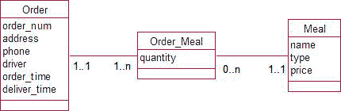

**图 10-15.** 送餐问题的数据模型

客户确认的一些需求包括：

a) 确定特定订单的成本。
b) 准备一份未送达订单的清单。
c) 确定给定月份内不同类型餐点的收入。

确定能提供所需信息的查询。（注意：在如此简要地介绍查询之后，期望新手能够完整地写出查询是不合理的，但请思考可能需要哪些连接、需要选择哪些行等等。）为了帮助你思考这个问题，图 10-16 展示了数据库表和一些可能的数据。在 `Order_Meal` 表中，`order` 和 `meal` 分别是 `Orders` 表和 `Meals` 表的外键。


