# 第 11 章

## 用户界面

在本书开篇，我们从数据库不同用户需要执行的操作角度，探讨了如何定义我们的数据库需求。我们通过用例来规定这些需求，其中大多数可归为两类：用户为高效输入数据而需要执行的任务，以及以不同报告形式检索信息的任务。

在中间的章节中，我们主要关注将数据分离到多个规范化表中，以确保数据以一种能随着数据库演进支持构建不同报告的方式保存。这种数据分离也确保了数据的准确性和一致性。

在第 10 章中，我们探讨了查询和视图如何让我们以多种不同方式从多个表中汇集信息。在本章，我们将简要介绍如何设计窗体和报告来满足最初的用例。这些可以作为前端添加到你的数据库中，为用户提供一种便捷、友好且高效的数据交互方式。

### 输入窗体

图 11-1 展示了我们（非常小的）大学数据库的一些可能用例。用例 1 到 3 涉及数据录入，用例 4 和 5 是报告任务。

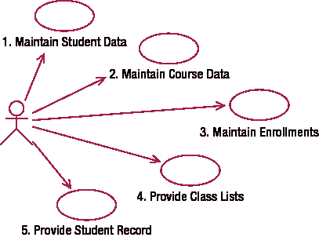

`图 11-1.` 大学数据库的用例

满足图 11-1 中用例的一个简单数据模型如图 11-2 所示，图 11-3 则展示了一些代表性数据。

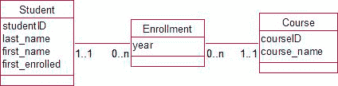

`图 11-2.` 大学数据库的简单数据模型

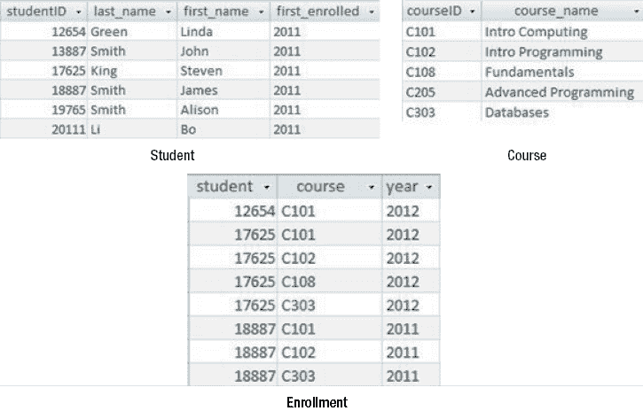

`图 11-3.` 大学数据库中的部分数据

#### 基于单表的输入窗体

我们先来看用例 1。这是一个学生刚进入大学时以及她的联系信息或其他细节发生变更的低频时段可能执行的任务。数据录入只涉及一个表，即图 11-3 中的`Student`表。数据库系统自带的窗体生成软件通常提供多种向单表输入数据的方式。一种方式是设计一个在网格中显示多条记录的窗体（类似于图 11-3 中的表）。当每条记录字段较少，可以全部在一屏内显示时，这种方式很有用。实际上，我们的`Student`表将包含比我们展示的多得多的字段。当字段很多时，最好每个窗体只显示一条记录。图 11-4 展示了一个示例。

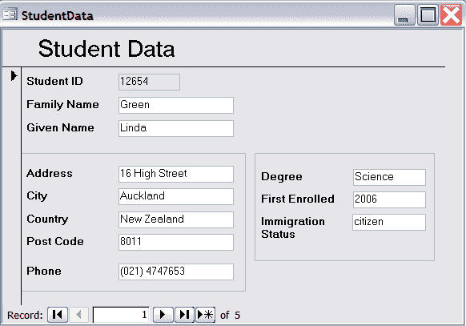

`图 11-4.` 用于更新单个学生详情的窗体

图 11-4 中的窗体是使用`MS Access Form Design Wizard`的默认选项并稍作修改制作而成的。我添加了标题，重新定位并调整了部分字段的大小，还添加了一些边框将相似字段组合在一起。专业的平面设计师会做得远比这出色！默认窗体在底部提供导航按钮，用于在记录间移动或添加新记录，还有内置的搜索功能，使你能快速定位到与你可能在字段中输入的值相匹配的记录。我们会为录入课程数据创建一个类似的窗体。

#### 基于多表的输入窗体

录入`enrollment`（选课）数据的用例需要多一些思考。表面上，我们只需要将信息输入到`Enrollment`表，但实际上我们需要看到另外两个表中的对应信息。假设 James Smith 是一名现有学生，想在 2012 年注册三门课程。我们需要一种便捷的方式来添加类似图 11-3 中`Enrollment`表底部三行所示的数据。如果仅仅基于`Enrollment`表在窗体中输入，数据录入员将不得不输入年份和`studentID`三次（每行一次），而且没有反馈让他知道 18887 确实是 James Smith 的正确编号。输入每个`course`代码也可能导致错误。

表之间的参照完整性将确保每次选课都对应一名现有学生和一门现有课程。然而，数据录入员只有在尝试为不存在的学生或课程输入选课记录后才会收到错误信息。幸运的是，基于视图的窗体允许我们让这个过程更高效且不易出错。

我们可以创建一个包含三个表相关信息的视图。清单 11-1 展示了连接三个表的`SQL`，图 11-5 展示了结果数据。

`清单 11-1.` 用于创建连接`Enrollment`、`Student`和`Course`表的视图的`SQL`

```sql
CREATE VIEW all_info as
SELECT * FROM
(Course INNER JOIN Enrollment on courseID = course)
INNER JOIN Student on studentID = student
```

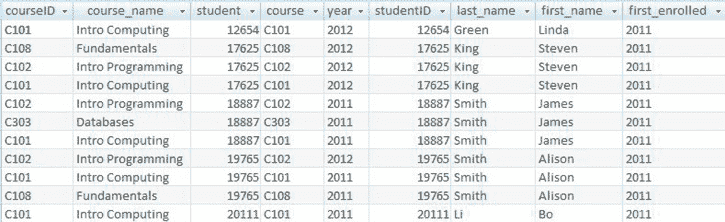

`图 11-5.` 将`Enrollment`表与`Student`和`Course`表连接后得到的部分数据

我们可以基于图 11-5 中的视图创建窗体，然后对字段应用一些条件和格式，以生成类似图 11-6 的结果。

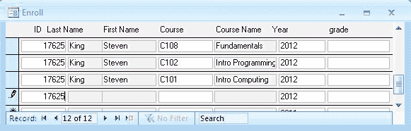

`图 11-6.` 基于图 11-5 视图创建的窗体


### 表单上的约束

数据录入操作员将详细信息输入到白色框中，但当输入 `studentID` 和 `courseID` 时，相应的名称将出现，为用户提供一些反馈。也可以约束用户被允许的操作。在图 11-6 所示的表单中，三个姓名字段的属性已更改为只读，以便用户可以查看但不会意外更改这些值。将背景设为灰色可以清楚地向用户表明这三个字段仅用于显示信息。默认值也可以让表单使用起来更高效。在任何特定学年的开始，很可能只需要录入该年的注册信息，因此在年份字段中指定一个默认值将加快数据录入速度。表单生成器允许快速开发诸如图 11-6 所示的表单。像 Expression Web 或 Dreamweaver 这样的 Web 软件允许生成类似的表单，这些表单允许通过 Web 浏览器访问数据库。

我们还能如何改进用于录入注册信息的表单？再看一下图 11-2 中的数据模型。`Student` 类和 `Course` 类都与 `Enrollment` 类具有一对多的关系。每个学生有多次注册，每门课程也有多次注册。从数据录入的角度来看，哪一个关系更相关？在学年开始时，很可能有学生来到注册处办公室，想一次性完成他所有的注册。让我们的表单反映学生与其注册之间这种一对多关系是有意义的。

图 11-7 中的表单是两个表单的组合。顶部部分是基于 `Student` 表字段的表单。底部部分是一个子表单，其布局与图 11-6 中的表单类似，但基于一个连接 `Enrollment` 和 `Course` 表的视图。这两个表单是关联的，因此我们只看到顶部显示的学生的注册信息。这样，一旦定位到特定学生的记录，数据录入操作员就可以在一个地方录入所有的注册信息。

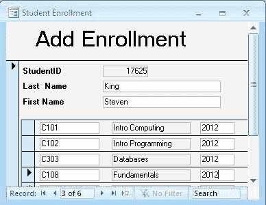

`图 11-7.` 基于 `Student` 的表单，带有基于 `Enrollment` 和 `Course` 连接视图的子表单

下一个明显的改进以帮助数据录入是允许用户从可用选项列表中进行选择，而不是必须手动键入。例如，在图 11-7 的注册表单中，参照完整性要求输入到 `Enrollment` 表的课程代码必须是 `Course` 表中已经存在的代码。如果用户输入一个不存在的代码，他将从底层数据库系统获得错误消息。为了避免这种情况发生，我们可以向用户展示一个允许课程的下拉列表。在图 11-8 中，我们将课程代码的文本框更改为列表框。然后我们指定列表框显示 `Course` 表中的主键值。

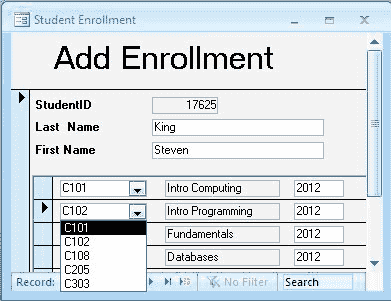

`图 11-8.` 一个允许用户选择科目的列表框

我们还可以使用列表框来实现其他约束。一个可能的情况是，在我们的课程数据表中，我们可能会指定特定科目是否正在开设，如图 11-9 所示。

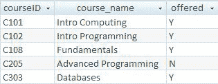

`图 11-9.` 包含“课程是否正在开设”字段的课程表

当在 `Enrollment` 表中输入新的注册信息时，我们希望将 `course` 的值限制为 `Course` 表中那些 `offered` 字段为 `'Y'` 的课程。我们该如何做到这一点？第 9 章中描述的检查约束是行不通的。检查约束基于我们正在更新的表中的值。这里我们正在更新一个表，即 `Enrollment`，但我们需要检查另一个不同表 `Course` 中的某一行。参照完整性也帮不上忙，因为它只要求课程代码在 `Course` 表中存在，因此会允许 `C205`。我们可以像图 11-8 那样使用列表框来帮助解决这个问题。我们不是用 `Course` 表中的所有值来填充列表框，而是用某个视图中的值来填充，该视图只选择那些正在开设的课程。用于创建这样一个视图的 SQL 如清单 11-2.所示。

`清单 11-2.` 一个将选择正在开设课程代码的查询

```sql
CREATE VIEW OfferedCourses AS
SELECT courseID FROM Course
WHERE offered = 'Y'
```

现在，如果我们限制用户只能从用此查询填充的列表框中选择值，我们就有效地应用了我们的约束。请注意，此约束仅在此特定表单中生效。如果我们以任何其他方式更新 `Enrollment` 表，该约束将不会生效。确保约束始终生效的唯一方法是将其直接放在表上。这可以通过检查约束实现，或者对于跨多个表的约束，可以通过如第 10 章讨论的触发器实现。

仅在某些表单上生效的约束有其适用之处。我们的注册示例就是其中之一。`offered` 字段与当前年份相关。在我们的 `Enrollment` 表中，会有许多来自往年、对应已不再开设课程的记录。我们可能需要追溯更新其中一些记录，因此我们实际上并不希望在表上设置此约束。我们只想限制*新*记录只能选择当前年份正在开设的课程。数据录入表单是应用该约束的好地方。这与第 9 章讨论的问题相同，即如何防止对已无库存的物品下订单。同样的解决方案在那里也适用。实际上，我们有一组通过表设计应用于数据库表的永久性约束。此外，我们还可以在表单上设置其他约束，这些约束仅在某些情况下适用。

### 限制对表单的访问

表单为设计者提供了极大的灵活性，可以控制用户能做什么。大多数表单设计软件都允许您指定表单是仅用于查看数据，还是可以用于更新或删除记录。您还可以指定表单上的某些字段不能被更改。例如，在图 11-8 中，我们可能不希望一个本应录入注册信息的学生用户更改学生的 ID 号或更改课程名称。然而，我们确实希望他能够看到这些值，以确认他拥有正确的记录。对 ID 和课程名称字段提供只读访问权限将防止对该数据的意外更改。

由于表单基于视图或表，我们还可以限制*谁*能通过表单查看或更新数据。这可以通过如第 10 章所述，向不同用户组授予底层视图的不同权限来实现。我们可能会授予负责的组（例如管理员）对我们视图的更新权限，而只允许可靠性较低的组（例如学术人员）拥有读取权限。

### 报告


### 数据库报表基础

用例 4 和 5 在图 11-1 的示意图中都涉及输出。它们要求基于我们表中的数据生成有用且易于阅读的报告。对于普通用户来说，报告可能是数据库中最显眼的部分。我们的大学数据库需要能够提供班级名单和学生记录；企业则需要提供产品清单、发票和销售摘要。所有这些报告都基于数据的子集，例如特定客户未付款交易的发票、上个月的销售摘要、特定课程的注册情况，等等。

许多数据库系统提供报告生成软件，也有一些独立产品，例如 `Crystal Reports`。大多数软件都使用相同的原则来设计报告，因此我们来看看其基本要素。

#### 基于视图创建报告

大多数信息丰富的报告都需要来自多个表的数据。如果我们对注册信息的细节感兴趣，我们可能不仅想看到学生的 `ID`，还想看到她的姓名，以及课程代码对应的课程名称。显然，我们需要一个连接这三个表的视图。这里需要小心。我们可能希望看到所有的课程和所有的学生，即使是那些没有注册记录的。正如我们在上一章讨论的，这需要外连接，如清单 11-3 所示。

***清单 11-3**. 一个用于检索*注册*信息的视图

```sql
CREATE EnrollView AS
SELECT courseID course_name, studentID, last_name, first_name, year
FROM (Course FULL OUTER JOIN Enrollment ON courseID = course)
FULL OUTER JOIN Student ON studentID = student
```

运行清单 11-3 中的视图时，检索到的部分行如图 11-10 所示。

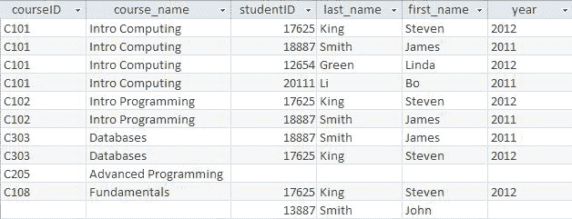

**图 11-10.** 对`Enrollment`表进行外连接`Student`和`Course`表后得到的视图结果

请注意，外连接意味着我们为没有注册记录的课程（`C205`）和没有注册记录的学生（`John Smith`）也显示了行。现在我们有了这个底层视图，就可以基于它创建许多不同的报告。

#### 报告的主要组成部分

报告生成器通常包含以下部分：

**报告标题**：出现在报告顶部的文本，通常是标题和日期

**页面标题**：出现在每页顶部的文本，例如列标题

**明细**：你希望从查询或报告所基于的表中每一行看到的数值

**页脚**：出现在每页底部的文本，通常是页码

**报告脚注**：出现在报告末尾的文本，通常是整体摘要

图 11-11 展示了一个包含报告标题和页面标题的报告，所有字段都显示在明细区域（查询结果中的每一行对应一个明细区域）。在报告设计中，我们可以指定明细行的显示顺序（本例中按`StudentID`排序），报告软件会处理分页等所有必要的格式问题。

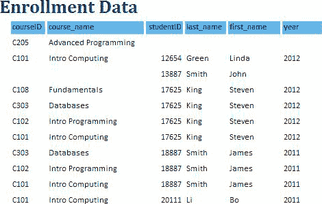

**图 11-11.** 基于`EnrollView`的基本报告

图 11-12 中的报告目前用处不大，但我们可以做一些简单的改进。通常，对要查看的行设置一个选择条件会很有用（例如，特定课程的行）。我们可以将这个条件包含在底层视图中，但这意味着每次需要特定课程的列表时都要更改视图。更有用的方法是将这些标准构建到报告的设计中，这样每次运行报告时都可以指定条件。根据你使用的工具，会有不同的实现方法。

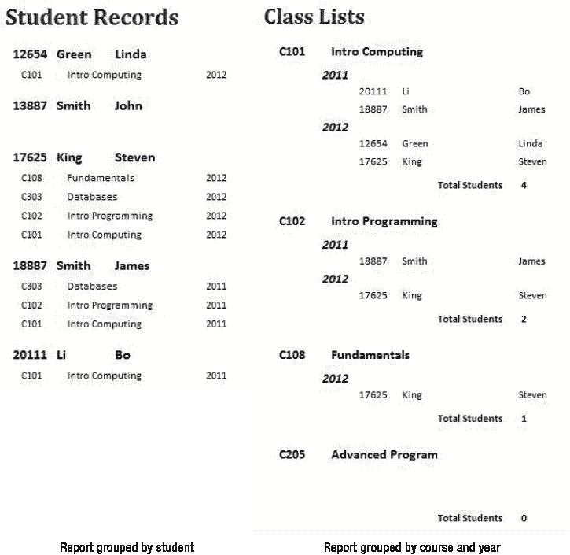

**图 11-12.** 基于`EnrollView`的两个采用不同分组方式的报告部分

#### 分组与汇总

我们可以调整图 11-11 中的基本报告，以便更有效地满足用例需求。基本报告提供了我们所需的所有信息，只是结构不太合适。使用报告生成器的*分组*功能可以提供合适的结构。对于班级名单，我们希望看到每个班级的所有注册信息分组在一起；而对于学生记录，我们希望注册信息按学生分组。这本质上反映了我们数据模型中的两个一对多关系——一个学生有多次注册，一门课程有多次注册。我们的模型允许我们根据需要从任一角度进行报告。

应用分组时，报告生成器允许我们为该组相关的特定信息添加组标题和组脚注。其原理是：如果按`courseID`分组，视图中的行（如图 11-10 所示）将按`courseID`顺序排序。当报告输出每一行时，每当`courseID`的值发生变化，它就会插入一个脚注和标题。图 11-12 展示了两个基于`EnrollView`的报告：一个按`studentID`分组，另一个先按`courseID`再按`year`分组。

在学生记录报告中，我们有一个组标题，显示每个学生的`studentID`、姓氏和名字，而明细部分则显示课程数据。在班级名单报告中，第一个组标题包含课程信息，下一个组标题包含年份，最后明细部分包含学生信息。在班级名单中，我们还有一个组脚注，用于汇总该课程的学生人数。这是通过一个计算字段完成的，该字段会有一个公式，类似于 `= Count(*)`。如果愿意，我们可以限制这两个报告，使其仅显示特定课程、特定学生或特定年份的数据。

至此，我们已经满足了两个报告用例的需求。还可以生成许多其他报告。例如，我们可以选择抑制报告的明细部分，这样我们就只会看到每个组的标题和/或脚注。一个按`courseID`分组、抑制了明细部分并在报告脚注中显示总计数的报告将如图 11-13 所示。

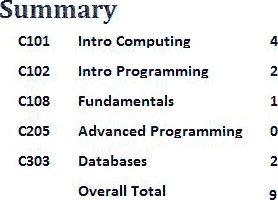

**图 11-13.** 按课程分组的汇总报告

我们可以看到，许多非常有用的报告都可以基于我们关于注册数据的这一个视图。所有这些报告都可以设置选择条件，以便用户将它们限制在特定的年份、特定的课程子集或单个学生。我们数据库设计的一部分工作，应该是提供一组能够满足设计初期商定用例的报告。

### 总结

设计一个有用数据库的一部分工作，是为用户提供一个方便的界面来输入数据和检索信息。最初的用例将很好地指示出需要什么功能。


### 表单、报告及其他实现方式

*   表单和报告为将数据输入数据库以及查看格式良好的输出提供了便捷的方式。
*   表单和报告通常都基于视图。
*   通过控制授予视图的权限，我们可以限制用户组对特定表单和报告的访问。
*   子表单是便捷地输入涉及*一对多*关系（例如，一个学生有多条注册记录）的数据的一种方法。
*   在表单上，列表框允许用户从一组值中进行选择。通过用视图填充列表框，可以对通过该表单输入的数据应用额外的约束。
*   通过使用不同的分组方式，可以在单个视图上构建几个非常不同的报告。这些报告可用于满足需求中识别出的输出用例。
*   报告可以包含汇总数据，例如总计、小计、计数等。
*   报告可以被设计为在每次运行时进一步细化数据的子集。

### 测试你的理解

##### 练习 11-1

在练习 3-1 中，我们研究了学校记录学生缺勤的问题。初始用例如图 11-14 所示，第一个数据模型如图 11-15 所示。设计一些表单来满足数据输入要求（用例 1–3）以及报告来满足输出用例（4 和 5）。

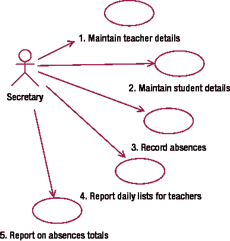

图 11-14. 用于记录和报告学校缺勤的用例

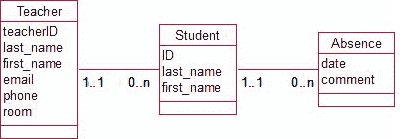

图 11-15. 用于记录学校缺勤的数据模型

