# 第 12 章 其他实现方式


在本书的前几章中，我们专注于获取一组用例和一个能准确表示问题范围及不同数据项相互关联的数据模型。第 7 章到第 9 章展示了我们如何将数据模型在关系数据库中表示为一组规范化表，并通过外键实现关系。前两章展示了我们如何高效地向这些表中输入数据并使用查询来提取有意义的信息和报告。

现在，我们将简要了解表示数据模型的其他方法。我们将研究面向对象数据库、电子表格（用于简单的数据模型）和 XML 作为表示数据模型的方式。

### 面向对象实现

我们的数据模型是*面向对象的*。这意味着我们从特定对象的角度来看待数据和关系，就像这个对“一对多”关系的描述：“一个 `Customer` 类对象可以与多个 `Order` 类对象关联。” 使用 Java、VB .NET 或 C# 等面向对象语言的程序员可以直接创建和操作对象。OO 语言还具有大多数关系数据库软件中不具备的附加功能。这些功能包括为属性使用复杂类型（对象或对象集合）的能力，以及将描述对象行为的方法作为类定义一部分存储的能力。OO 语言的另一个优势是能够直接实现和维护类与子类，从而充分利用继承。有时 OO 语言中缺少的是以透明方式将对象保存到持久性存储和从中检索对象的方法。OO 数据库提供了一种无缝创建对象、将其存储到磁盘然后再找到它们的方法。OO 程序的设计是一个巨大的主题，因此在此我仅概述一些捕获数据模型基本要素的主要技术。

#### 类与对象

与关系数据库不同，OO 编程语言直接支持类和对象的概念。类是对象将如何构造的定义或模板。例如，一个 `Customer` 类将指定每个 `Customer` 对象将具有的属性（例如，名称、地址等）。每个 `Customer` 对象将根据类的定义创建，并将拥有其各自属性的值。类只是一个抽象概念，但对象本身是独立的实体。相比之下，在关系数据库中，我们从表的角度思考。我们构造一个表来表示每个类，而对象由行表示。我们对表执行连接和联合等操作，而不是对行。关系数据库中的操作严格基于表，而在 OO 环境中，重点是对象（因此称为“面向对象”）。

当我们考虑继承时，OO 语言和关系数据库之间的差异尤其明显。在第 6 章中，我们看到了特化和泛化的概念如何帮助我们建模那些有许多共同点的类所在的特定情况。在图 12-1 中，我们有一个数据模型，它捕获了学生和讲师在父类 `Person` 中的相似之处。

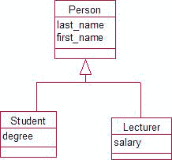

图 12-1. 具有继承关系的数据模型

图 12-2 展示了我们如何尝试在关系数据库中使用表来捕获此数据模型的主要特征。

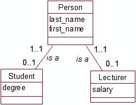

图 12-2. 用 1-1 关系表示的继承

图 12-2 中的表示需要三个表。每个学生将由两行表示：一行在 `Person` 表中，另一行在 `Student` 表中。如果我们想要某个特定学生的所有信息，我们需要连接 `Student` 和 `Person` 表以检索学位和姓名。在 OO 环境中，如果我们创建一个 `Student` 或 `Lecturer` 类的对象，该对象将包含嵌入其中的所有相关属性。我们不需要查找任何其他对象或引用任何其他类来检索所需信息。这描绘在图 12-3 中。


图 12-3. OO 环境中的学生和讲师对象

在 OO 环境中，每个对象都是一个独立的实体，拥有自己唯一的对象标识符。因为每个对象都有自己的标识，所以不要求其属性值是唯一的。换句话说，从实现的角度来看，不需要提供我们在关系数据库中需要的等效主键。例如，图 12-4 中的两个对象都可以通过其唯一的 `OID` 被系统识别，尽管它们的属性值是相同的。然而，`OID` 不一定可用，对用户也没有意义。程序可以区分对象，但用户能区分吗？


图 12-4. 两个不同的对象；但用户能区分它们吗？

现实中会有一些信息可以区分两个不同的学生（例如，地址或出生日期）。虽然不是必须的，但像学号这样的唯一标识符对于帮助用户引用特定的人可能仍然有用。引用学生 128675 比引用住在 Beckenham 的 Jane Smith 更容易。

#### 复杂类型与方法


#### 使用复杂属性类型

在大多数关系型系统中，我们通常使用简单类型（例如数字、文本、日期等）的属性。在面向对象的环境中，我们可以拥有更复杂的属性。

考虑地址和名称的问题。在第 7 章中，我们认为单一的地址字段是不够的，因此我们引入了诸如`street`、`city`、`post_code`和`country`等独立字段。我们对名称做了类似的事情，引入了`title`、`first_name`、`last_name`、`initials`等字段。这样使得按国家或姓氏有效地搜索或排序行，以及在报告中正确格式化地址成为可能。在关系型数据库中，这些字段都是独立的；如果不创建一个新表，就没有简单的方法来说明*这些字段应该以某种方式保持在一起，因为它们共同构成了一个地址*。创建一个新表来保存地址属性并不会真正带来太多好处，因为每次我们需要获取某人及其地址的所有信息时，都需要创建连接。对于额外的开销来说，这几乎没有实现什么。

在面向对象的环境中，我们可以定义一个`Address`类，它有自己的属性（`street`、`city`、`country`、`postcode`），然后在`Customer`类中，我们可以有一个属性`address`，它引用一个`Address`对象。图 12-5 说明了地址和名称的这个想法。

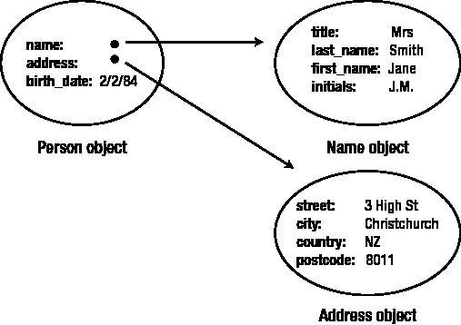

**图 12-5.** 一个`Person`对象可以引用一个`Address`对象和一个`Name`对象。

在`Person`类中，我们有三个属性：`name`和`address`（它们是对我们的新`Name`和`Address`类的对象的引用），以及`birth_date`（这是一个简单的日期类型）。拥有这些新类的主要优点之一是我们能够声明可以在属性上执行的方法或指令集。让我们看一个`Name`类的简单例子。在图 12-6 中，我们有一个和之前类似的类图，但现在底部的矩形中有一些方法。

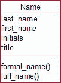

**图 12-6.** 包含两个方法的`Name`类

方法`formal_name()`可能会指示程序打印出`title`、`initials`和`last_name`（例如，Mr. J. A. Wilson），而`full_name()`可能会打印出`first_name`、`last_name`（例如，John Wilson）。在关系型数据库中，这些类型的指令将与特定的报告或表单保存在一起。每次我们需要一个新报告时，都必须重新发出这些指令。在面向对象环境中，这些指令与数据保存在一起。无论我们在哪里使用`Name`对象，我们只需要请求`full_name`，这些指令就是可用的。

#### 对象集合

面向对象环境具有对象的*集合*（或集合或列表）的概念。就像`Student`表是管理关系型数据库中所有行的方式一样，在面向对象环境中，我们可以建立许多不同的对象集合。每个特定类的对象可能都有一个内置集合（例如，所有`Student`对象），但我们也创建自己的集合。我们可能有名为`AllStudents`、`CurrentStudents`、`Lecturers`、`People`等的集合。每个集合都将包含一组对单个对象的引用。图 12-7 显示了如何可视化集合和对象。特定对象可能被多个集合引用（例如，一个`Lecturer`对象可能被`People`集合引用，也被`Lecturers`集合引用）。

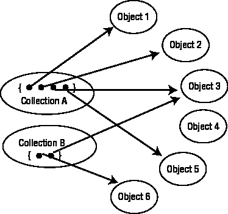

**图 12-7.** 引用对象的集合

集合对于表示对象之间的关系非常重要，正如你将在下一节中看到的。集合还可以用于帮助确保对象具有唯一值的某些属性，以便用户能够区分它们。在面向对象环境中没有像主键这样的概念，但我们可以使用集合来强制实施类似的唯一性约束。通常，有不同类型的集合可供选择。一种有用的集合类型是可以在特定属性或属性组合上进行键控的集合。例如，一个在`studentID`上键控的集合`AllStudents`，其设置方式将非常高效，可以在给定 ID 号时定位特定对象。在`last_name`上键控的集合将能够高效地基于姓名查找特定对象。在键控集合中查找特定对象与在具有索引的表中查找行非常相似。与关系模型一样，我们可以指定特定的键控集合可能只具有键的唯一值。如果我们有一个在`studentID`上唯一键控的集合`AllStudents`，并且我们确保所有`Student`对象都添加到这个集合中，我们就有效地强制实施了约束：没有两个`Student`对象具有相同的`studentID`值。这确保了我们所有的对象都有一个（或一组）让用户可识别的属性。

### 表示关系

对对象和对象集合的引用可用于表示数据模型中的关系。考虑图 12-8 中的模型，其中客户可以有多个订单，而每个订单恰好对应一个客户。

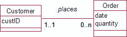

**图 12-8.** 客户与订单之间关系的数据模型

我们将有两个类，`Customer`和`Order`。每个客户将有自己的对象，每个订单也将有自己的对象。那么这两个对象之间的关系呢？让我们看看关系的“1”端。每个订单有一个关联的`Customer`对象。因为我们可以将复杂类型作为类中的属性，所以每个`Order`中可以有一个属性，它是对相应`Customer`对象的引用。图 12-9 说明了这一点。

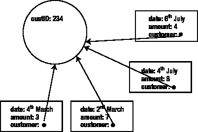

**图 12-9.** 每个`Order`对象包含一个对`Customer`对象的引用。

`Order`对象中的这个引用与关系模型中的外键概念并非完全不同；不同之处在于，外键的引用指向表，应用程序必须找到关联的行。在面向对象环境中，引用直接指向相关的`Customer`对象。

现在让我们考虑关系的“多”端。每个`Customer`对象有多个`Order`对象，我们也可以直接建立这种关联。我们可以在`Customer`类中包含一个`Order`引用的集合作为属性，如图 12-10 所示。

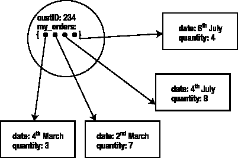

**图 12-10.** 一个`Customer`对象有一个对其关联`Order`对象的引用集合。

##### 导航与关系表示

我们可以选择在`Order`类中包含对`Customer`的引用（图 12-9），在`Customer`类中包含`Order`的集合（图 12-10），或者两者都包含。决策将取决于我们希望如何在类之间*导航*。用例将指导我们。如果我们想知道特定客户下了哪些订单，就需要通过`Order`对象的集合，从`Customer`导航到`Orders`。如果有一个未收集的订单，而我们想知道客户的姓名，则需要通过`Customer`对象的引用，从`Order`导航到`Customer`。

这与关系数据库有何不同？在关系数据库中，`Order`表中的每一行都有一个外键`customer`指向`Customer`表，但我们没有行之间的直接连接。如果需要来自`Customer`和`Order`表的信息，我们需要连接这两个表并创建一个新的虚拟表。那个表非常对称，我们能够从这个虚拟表中为特定订单查找客户，也能为特定客户查找订单。这非常有用。回想一下前一章，我们如何能够从一个虚拟表创建两个截然不同的报告——学生记录和班级列表。

相比之下，在面向对象（OO）环境中，如果我们认为需要这些路径，就必须显式地提供两条路径。如果`Customer`中没有集合，我们就无法轻易找到特定客户的订单。如果在`Order`对象中没有对客户的引用，我们将没有直接的方法来找到合适的客户。然而，我们可以提供的直接链接对于在对象之间导航非常高效。

##### 多对多关系的表示

既然我们可以用对象集合来表示关系的“多”端，那么多对多（Many-Many）关系就可以直接表示。这与关系模型形成对比，在关系模型中，我们必须创建一个新的中间表来处理多对多关系。例如，在图 12-11 的模型中，植物（plants）和用途（uses）之间的多对多关系可以通过让每个`Plant`对象关联一个`Use`对象的集合，以及每个`Use`对象关联一个`Plant`对象的集合来表示。对象之间的关联是直接的；我们不需要额外的表，也不需要像关系模型那样执行两次连接。

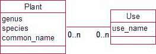

**图 12-11.** 一个多对多关系

你可能已经发现了其中的潜在问题。以客户和订单的例子为例。如果我们选择同时包含引用和集合，如图 12-9 和 12-10 所示，我们可能存储了关于对象间关联的信息两次。一个特定的订单会在客户的订单集合中，同时客户引用也会与订单一起保存。现在有产生不一致性的风险。订单 A 可能在客户 Smith 的集合中，但订单 A 对象可能引用客户 Green。如何管理这一点取决于你使用的软件。更多内容将在下一节中讨论。

#### OO 环境

有许多开发平台使用面向对象的概念。许多现代编程语言（例如`VB .NET`、`C#`、`Java`、`C++`、`Python`）都基于类和对象。然而，使用这些语言来维护数据不一定容易。虽然它们提供了我们迄今为止讨论的所有概念，但当你尝试永久存储数据时，问题就来了。当你向关系数据库输入一行时，软件会自动负责将其保存到磁盘，以便在软件和计算机关闭并重新启动后数据仍然可用。这是*永久*或*持久*的数据。其他变量——计算的中间结果等——不会以这种方式保存，被称为*临时*数据。

在 OO 编程语言中，程序员通常必须专门保存和检索关于对象的数据，而这并非易事。专门设计的 OO 数据库系统（例如 Intersystems 的`Cache`¹和`JADE`²）可以透明地处理对象的存储和检索。像`JADE`这样的系统允许你获取数据模型并定义类层次结构。可以指定类中对象之间的关系并自动维护。例如，前一节提到的关于`Order`和`Customer`对象之间引用不一致的问题就不会出现。如果从客户的集合中移除一个订单，`Order`对象中对该客户的引用将自动更新。

一个良好的面向对象数据库产品提供了许多优势。它可以充分利用继承的全部能力，管理复杂类型，将方法与数据一起存储，并在相关对象之间提供非常高效的链接。然而（总是有个然而），关系模型最强大的方面之一是我们可以对表执行的操作集合，以检索复杂的数据子集，如第 10 章所述：连接、并集、交集等。执行这些操作的`SQL`命令相对直接，并且是任何关系数据库系统不可或缺的一部分。但是，所有这些操作都是在表上定义的，在 OO 系统中没有直接的对应部分。目前正在大力开发面向对象数据库的标准和 OO 数据库查询语言³。

介于完整的 OO 数据库和关系数据库之间的一种折中方案是，使用 OO 编程语言连接到关系数据库。对象被转换为表中的行，然后可以利用关系数据库的全部数据管理能力进行存储和检索。在编程语言内部，可以使用`SQL`与数据库通信并插入和检索数据。诸如`Hibernate`⁴之类的工具促进了这种对象关系映射的过程。然而，在执行对象和表之间的转换时，我们可能会失去针对数据对象的许多特定 OO 优势。

### 在电子表格中实现数据模型

电子表格也许是桌面广泛可用的应用程序中最通用的之一。有许多产品可供选择，包括`Microsoft Excel`、`Open Office`和`Google Docs`。电子表格的流行源于能够打开工作表并立即开始输入数字和公式——无需声明变量或设计表。


### 电子表格在数据管理中的应用

对于那些拥有数据并需要快速找到统计或计算结果的人来说，电子表格非常出色。电子表格通过其丰富的函数和特性，提供了惊人的强大功能。然而，它们也可能相当危险。任何考虑使用电子表格执行重要计算的人都应该访问一些专门讨论困扰大多数电子表格的各类错误的网站。

#### 电子表格的优缺点

电子表格非常适合执行计算，但不太适合存储可能需要以多种方式提取的数据。要轻松查询和报告数据，所需信息通常需要放在一个工作表上。这有点像将所有问题数据保存在一个数据库表中。我们在第一章中展示了一些这样做的问题示例。本书的其余部分主要讨论了如何通过将数据拆分为类或规范化的表来避免这些问题。然而，电子表格是如此流行的工具，因此值得研究如何有效地使用它们来表示一个小型数据模型。

对于那些类很多且关系复杂的问题，电子表格无法以可维护的方式准确捕捉其复杂性。对于只有少数几个类（主要是类别型类）的问题，有时可以通过精心设计的电子表格来捕捉数据模型的相当一部分复杂性。

#### 示例：简单订单模型

考虑一个将客户交易数据保存在电子表格中的小企业。您可能会想象，初步的电子表格设计可能类似于图 12-12。

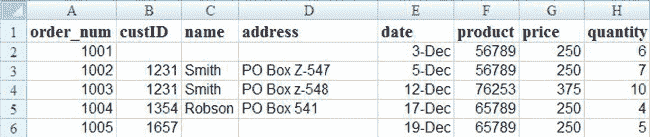

**图 12-12.** 用于处理客户（非常）简单产品订单的电子表格

到目前为止，您应该能够看到这种解决方案的潜在问题。数据是重复的（例如，客户地址和产品价格），存在不一致的可能性（如第 3 行和第 4 行）。订单可以在没有关联客户的情况下输入（第 2 行），而且据我们所见，这里没有检查是否输入了有效的产品代码（真的有产品 76253 吗？）。

#### 优化的数据模型

针对上述情况的一个合适数据模型（假设订单仅针对单一产品）如图 12-13 所示。通过将客户和产品信息分离到不同的类中，我们可以确保交易始终针对有效的客户和产品，并且相关的名称、地址和价格是一致的。

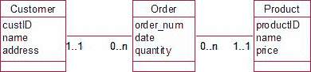

**图 12-13.** 客户订购产品的数据模型

#### 在电子表格中实现关系

在电子表格中，我们计算和分析的主要焦点将是订单。我们将需要按日期排序、汇总金额、按客户搜索等。为此，所有信息必须集中在一张工作表上，如图 12-12 所示。那么，我们如何对数据的一致性和准确性保持一定的控制呢？

图 12-13 中的数据模型有两个“一对多”关系，因此我们首先看看如何在电子表格中表示这些关系。

##### 表示一对多关系

为了表示如图 12-13 所示的涉及“一对多”关系的数据模型，我们首先为“一”端的每个类设置一个单独的工作表。图 12-14 显示了一个包含客户信息的工作表，其中数据被赋予了一个范围名称（`all_Customers`）。还会有另一个包含产品信息的工作表。单独的客户工作表使得行可以独立于其他信息（订单和产品）添加或更新。

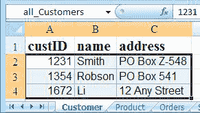

**图 12-14.** 包含客户信息的工作表，范围名称为`all_Customers`

然后，我们为“多”端的类（订单）创建第三张工作表，我们将在其中汇总所有需要的信息。我们无需输入每个客户的全部信息，而可以输入客户 ID 并显示来自客户工作表的匹配数据。这可以通过一个名为`VLOOKUP`的函数来完成。

```
=VLOOKUP(1672,all_Customers,2,FALSE)
```

列表 12-1 中的公式获取值（例如 1672）并在范围`all_Customers`（图 12-14）中查找它；参数“2”表示返回该范围中第二列的相关值（姓名 - Li）。“FALSE”表示如果该值不在表中，则返回错误消息。列表 12-1 中的公式在 Excel、Google Docs 以及（如果将逗号替换为分号）Open Office 中都是有效的。

图 12-15 显示了列 C 中 VLOOKUP 函数的结果。列 D 和 G 也包含用于从相应工作表查找数据的函数。史密斯先生地址不一致的问题（图 12-12）已得到解决，并且在第 6 行有一个警告，提示在`all_Customers`中没有客户 1657。

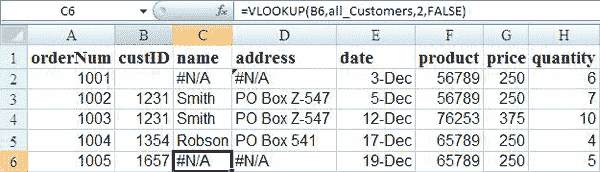

**图 12-15.** 带有客户和产品详情查找的订单表

#### 数据验证与参照完整性

图 12-15 中的`custID`列的行为有点类似于关系表中的外键。然而，与外键不同的是，到目前为止，没有任何东西阻止我们在列 B 中输入一个在客户工作表中不存在的值（第 6 行），但如果我们使用**精确匹配**查找（包括列表 12-1 中的“FALSE”参数），我们会得到一个非常明确的信号，即错误消息`#N/A`（不可用），表明存在问题。

电子表格产品还提供数据验证工具，因此我们可以控制输入到列 B 的客户编号。我们可以指定订单表上列 B 中的值必须来自客户工作表的 ID 列中的值列表。Google Docs 中的实现方式如图 12-16 所示。我们将客户工作表上包含客户编号的单元格范围命名为`custIDs`。

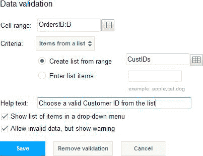

**图 12-16.** Google Docs 验证工具

除了限制我们可以输入到列中的值之外，验证工具还提供了一个方便的有效值列表框以帮助数据录入，如图 12-17 所示。

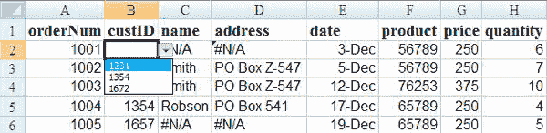

**图 12-17.** 使用数据验证工具限制列中的值

在图 12-17 的列 B 上使用数据验证，为我们提供了一种在订单表上输入或更新数据时的参照完整性。查找函数本身的行为有点像连接操作。图 12-15 中的订单表将来自客户和产品工作表的数据汇集在一起，其方式与关系数据库中三个表之间的外连接非常相似。当我们的模型中存在大量不同的类时，这种处理关系的方法很快就会失控，但对于小型问题来说，这是一个不错的近似方案。


我们设法分隔了三个班级的数据以避免不一致性，使用数据验证在一定程度上模拟了参照完整性，并通过查找功能实现了类似联接的操作。因此我们对数据的准确性有了一定的控制。我们可以使用排序和筛选工具来实现等效的行选择操作，并能通过隐藏列来模拟列投影。电子表格还提供了大量的分析功能。我们所缺乏的是轻松执行需要其他关系运算的复杂查询的能力，例如，*哪些客户同时订购了产品 76253 和 56789？*

#### 多对多关系

现在让我们看看电子表格中的多对多关系。这种情况经常出现在我们拥有分类数据时，我们将最后一次查看图 12-18 中展示的植物示例数据模型。

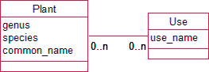

**图 12-18.** 一个表示具有多种用途的植物的多对多关系

有几种不同的方法可以在电子表格中存储多个用途值。我们将探讨三种不同方法的优缺点：`重复列`、`类别作为列`和`规范化范围`。

##### 重复列

图 12-19 展示了一种人们在电子表格（也经常在数据库中！）中存储多值类别的常见方法：`重复列`。

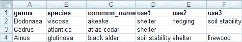

**图 12-19.** 使用`重复列`表示多种用途值

这种数据存储方式如此受欢迎的原因在于它采用了一种对用户有用的格式。用户最初可能从植物及其用途的角度考虑数据，而这种格式将每种植物及其所有用途显示在一行上。（从规范化的数据库表中生成这种输出可能很困难。）我们已经在第 1 章中讨论过以这种方式存储数据的一些问题，但通过使用一些电子表格功能，我们可以减少部分问题。其中一个问题是确保 D 列到 F 列中的条目拼写一致。这可以通过在电子表格中使用`数据验证`功能来实现，即要求这些列中的值来自存储在另一张工作表上的可能用途列表。另一个重要问题是能够找到具有特定用途（例如，遮荫）的所有植物。仅仅对 D 列进行排序或筛选来查找所有遮荫值是不够的；这是因为遮荫可能记录在 D 列到 F 列中的任何一列。可以使用`高级筛选`和条件表来检查所有三列，但这远远超出了普通用户的能力范围。具备这种技能的用户，从一开始就使用数据库会更好。因此，`重复列`可以对用途数据进行一些检查，提供良好的报告格式，但在根据给定用途查找植物方面查询能力较差。

##### 类别作为列

另一种常见的存储方法是让每一列对应一个独立的类别，并使用复选标记来指定它们是否适用于特定物种。如图 12-20 所示。

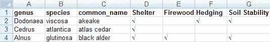

**图 12-20.** 使用`类别作为列`表示多种用途值

这实际上是一种非常有用的表示方法。只要类别数量不是太多，它就很适合报告目的，因为您可以在一行上看到所有用途。不存在用途名称拼写问题，因为这些名称只在标题行中出现一次。也能够非常简单地找到具有特定用途的所有植物。如果我们想找到所有的树篱植物，我们可以简单地对 F 列进行排序或筛选。简单的筛选还允许我们执行更复杂的查询，例如*查找既适用于树篱又适用于柴火的植物*。因此，`类别作为列`的安排提供了良好的报告、良好的数据录入一致性和有用的查询功能。

##### 规范化范围

最后一种方法是我们称之为`规范化范围`的方法。这种方法实际上模仿了关系数据库，引入了等同于图 12-18 中的中间类，将多对多关系转换为两个一对多关系。我们现在的情况与前面描述的订单电子表格非常相似。我们会有一个包含所有物种信息的工作表（带有一个 ID 列），一个包含所有用途的工作表，以及第三个工作表用于存储物种和用途的配对，并使用`查找`或`验证`功能关联到其他工作表。如图 12-21 所示。B 列到 D 列在植物工作表中进行查找，E 列可以从用途工作表进行验证。

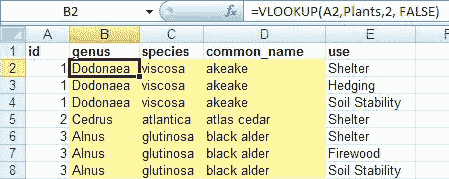

**图 12-21.** 使用`规范化范围`和`查找`表示多种用途值

使用这种数据保存方法，我们对数据进行了良好的检查，我们可以对 A 列进行排序或筛选以查找特定植物的所有用途，也可以对 E 列进行排序或筛选以查找具有特定用途的所有植物。到目前为止，一切都很好。然而，报告效果很差。数据的格式不是任何人想要打印出来的形式，使用起来也不是特别方便。如果数据要以这种方式存储，不如将其存储在数据库中的三个表里，这样我们就能使用更好的查询、数据录入和报告功能。

### 在 XML 中实现

XML（可扩展标记语言）⁶被设计为一种交换信息的方式。它基于带标签元素的层次结构，这些元素包含信息的描述和值。例如，清单 12-2 显示了一个表示名字数据片段的带标签元素。我们有开始标签和结束标签，它们描述了数据内容（名字），标签之间是值“James”。

***清单 12-2**. 表示名字的 XML 标签*

```xml
<first_name>James</first_name>
```

元素也可以有属性，并且元素可以相互嵌套。清单 12-3 显示了学生的 XML 定义。`student`是一个带有属性`studentID`的元素，姓氏和名字被声明为元素。

***清单 12-3**. 使用元素和属性表示学生数据*

```xml
<student studentID=“113452”>
    <first_name>James</first_name>
    <last_name>Green</last_name>
</student>
```

如果你在问为什么`studentID`是属性而名字是元素，你并不孤单！学生信息可以用属性或元素的许多不同组合来反映，尽管通常任何被认为对人类读者重要的东西都用元素表示。关于清单 12-3 需要注意的重要一点是，XML 既包含了数据结构的定义（学生有 ID、名字和姓氏），也包含了数据的值（这个学生是 ID 为 113452 的 James Green）。


XML 非常灵活，元素可以在任何时候定义。其规则之一是整体结构为一棵树，包含一个**根元素**，所有其他元素都必须嵌套在其中。Listing 12-3 是可以的，因为它只表示一个学生；但要表示多个学生，我们需要一个包容性的根元素，例如 `<university>`，如 Listing 12-4. 所示。

`Listing 12-4`. 表示多个学生的层次结构*

```
<university>

<student studentID=“113452”>

<first_name>James</first_name>

<last_name>Green</last_name>

</student>

<student studentID=“113756”>

<first_name>Mary</first_name>

<last_name>Smith</last_name>

<degree>Science</degree>

</student>

<student studentID=“116543”>

<first_name>Sally</first_name>

<last_name>Hunter</last_name>

<hostel>Helliers</hostel>

</student>

</university>
```

XML 允许我们为每个学生保存不同类型的数据。在 Listing 12-4 中，我们看到 Mary 有关于学位的信息，而 Sally 有关于宿舍的信息。用这种方式表示数据极其灵活，因为它不需要像关系型数据库表那样预定义结构。可以轻松添加额外信息，因为描述和值都保存在一起。这种灵活性的缺点是你永远无法确切知道一个学生是如何被描述的，因此查询数据将会很困难。

### 表示关系

XML 的层次特性允许我们将元素相互嵌套，因此一对多关系很容易表示。我们可以取一个包含多个部门元素的 `organization` 元素，每个部门元素内部又嵌套了 `employee` 元素。让我们看看如何使用 XML 来表示 Figure 12-22 中的多对多关系。

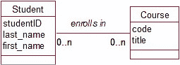

`Figure 12-22.` 学生选课的数据模型

我们可以从两个方面来思考 Figure12-22 中的信息：作为每个学生拥有一组课程，或作为每门课程拥有一组学生。Figure 12-23 展示了表示学生和课程相关数据的两种可能的 XML 树版本。

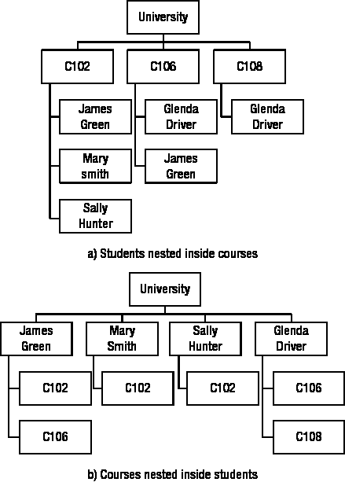

`Figure 12-23.` 表示学生和课程的两种可能的 XML 树

在 Figure 12-23 的树中，每个方框都是一个元素，拥有自己嵌套的元素和属性。例如，James Green 的每个方框都将用 Listing 12-3 中的代码表示。显然，这里存在一个信息重复的问题。在 Figure 12-23a 中，每个学生的数据会为每门课程重复；而在 Figure 12-23b 中，每门课程的信息会为每个学生重复。如果 XML 仅用作不同应用程序之间传输数据的手段，这不一定是个问题，但如果有人试图直接更新数据，这显然会成为问题。

表示 Figure 12-22 中模型的另一种方式是引入第三种类型的元素（`enroll`），这与我们在关系型数据库中引入中间表的方式非常相似。Listing 12-5 展示了表示两门课程、两名学生及其在 C102 课程中注册情况的代码。

`Listing 12-5`. 表示学生、课程以及关联它们的注册关系的层次结构*

```
<?xml version=“1.0”?>

<university>

<courses>

<course>

<code>C102</code>

<title>Programming</title>

</course>

<course>

<code>C106</code>

<title>Databases</title>

</course>

</courses>

<students>


<student studentID = "113452">
<first_name>James</first_name>
<last_name>Green</last_name>
</student>

<student studentID = "113756">
<first_name>Mary</first_name>
<last_name>Smith</last_name>
</student>
</students>

<enrollments>
<enroll>
<stud>113452</stud>
<crse>C102</crse>
</enroll>
<enroll>
<stud>113756</stud>
<crse>C102</crse>
</enroll>
</enrollments>
</university>

### 定义 XML 类型

大多数数据库系统都具备从 XML 文件导入和导出数据的功能。例如，清单 12-5 中的文件可以直接导入到 Access 中，以创建和填充三个数据库表（`student`、`course` 和 `enroll`）。

前几节中的 XML 非常灵活。然而，在实践中，我们通常需要更精确地描述数据元素。可以使用 DTD（文档类型定义）将课程定义为一个包含代码（`code`）和标题（`title`）的元素。清单 12-6 中的代码就是一个课程的`course`定义。它说明一个课程由`code`和`title`组成，并且`code`和`title`都是字符数据。底部的几行代码则为课程提供了一些值。

***清单 12-6**. 课程的 DTD*

```xml
<?xml version="1.0"?>
<!DOCTYPE course[
  <!ELEMENT course (code, title)>
  <!ELEMENT code (#CDATA)>
  <!ELEMENT title (#CDATA)>
]>
<course>
  <code>C102</code>
  <title>Programming</title>
</course>
```

将清单 12-6 中的 XML 文档导入 Access 将创建一个包含两个文本列（`code`和`title`）的表，以及一行值为`C102`和`Programming`的记录。这是在应用程序之间传输数据结构和值信息的绝佳方式。

一种更具表现力的定义 XML 数据类型的方法是使用 XML 模式语言（XML Schema Language）。XML 模式文档（XSD）是用于描述数据的 XML 代码。清单 12-7 展示了一个定义课程的简单 XSD。由于元素的定义很可能在许多不同场景中被重用，我们可能会遇到不同文档中的两个或更多元素具有相同名称的情况。例如，我们可能在另一个定义中发现一个名为`title`的不同元素。XSD 具有命名空间的概念，因此所有元素都可以被唯一标识。清单 12-7 中的第二行代码表明，任何以`xs`为前缀的定义都来自我们大学的这个定义。其余代码说明`course`是一个由`code`和`title`序列组成的复杂类型，两者都是字符串（或字符类型）。

***清单 12-7**. 非常基础的课程 XSD*

```xml
<?xml version="1.0"?>
<xs:schema xmlns:xs="http://university">
  <xs:element name="course">
    <xs:complexType>
      <xs:sequence>
        <xs:element name="code" type="xs:string"/>
        <xs:element name="title" type="xs:string"/>
      </xs:sequence>
    </xs:complexType>
  </xs:element>
</xs:schema>
```

`XSD`是一个庞大的语言，它允许你定义值的约束、指定基数（例如，一个学生可能拥有的最少和最多课程数）、指定默认值、声明元素必须具有唯一值等等。完整规范可以在 [`www.w3.org/XML/Schema`](http://www.w3.org/XML/Schema) 找到。本质上，它允许你指定等同于数据库表的结构，但使用的是平台无关的文本文档。它对于在应用程序之间传输模式描述非常有用。

### 查询 XML

本节关于查询`XML`数据的内容仅旨在简要介绍其可能性，并指引你获取更多信息。请参考清单 12-8 中一些学生数据的`XML`描述。

***清单 12-8**. 描述一些学生数据的 XML*

```xml
<?xml version="1.0"?>
<university>
  <student>
    <studentID>15673</studentID>
    <last_name>Smith</last_name>
    <first_name>Jim</first_name>
    <age>18</age>
  </student>
  <student>
    <studentID>23543</studentID>
    <last_name>Green</last_name>
    <first_name>Ruby</first_name>
    <age>22</age>
  </student>
</university>
```

这种分层结构意味着我们可以解析文本来查找符合特定条件的学生。`XPath`是一种简洁的语言，允许遍历层次结构以检索满足不同条件的元素。例如，清单 12-9 中的`XPath`代码将检索所有年龄超过 20 岁的学生的姓氏。

***清单 12-9**. 检索年龄超过 20 岁的学生的姓氏的 XPath 表达式*

```
/university/student[age>20]/last_name
```

该代码将遍历`university`树，找到所有定义为`student`的元素，然后找到他们的`last_name`——但仅限于满足`age`元素值大于 20 这一条件的记录。`XQuery`是`XPath`的扩展，它允许以各种方式（例如，按字母顺序排序）转换结果，甚至允许在数据集之间进行等同于连接（`join`）的操作。`XPath`和`XQuery`的规范可以在 [`www.w3.org/standards/xml/`](http://www.w3.org/standards/xml/) 找到。

### NoSQL

本书重点关注小型数据库。我们特别关注高度结构化的数据，其中重点在于能够检索不同类型的信息。这只是整个数据库世界中的一小部分。互联网催生了巨大的数据集，这些数据通常需要存储在横跨各大洲的数百台计算机上。高度结构化的数据模型及其在关系型或`SQL`数据库中的表示方式并不是管理此类数据的有效方法。

`NoSQL`数据库提供了一种结构化程度较低的方式来管理大量数据。一个例子是键值数据库。键数据（比如一个字符串）被存储且可搜索，值则是指向可以找到其余数据的位置的引用。对于数据的结构方式没有约束，因此这些数据库非常灵活。其他例子包括文档数据库和大表数据库（其中所有行可以具有不同的结构）。虽然这些类型的数据库在存储大量数据方面有许多优势，但缺点在于查询的难易程度以及发现不同数据片段之间联系的能力。没有严格的结构，你无法拥有`SQL`中可用的操作，如连接（`join`）。这种逻辑通常在`NoSQL`数据库中通过前端编程来处理。图数据库可以通过维护数据项之间的链接来反映不同数据片段之间的关联。同样，实际数据可以以任何方式结构化，而预设的链接可以在数据项之间提供快速访问。临时查询是困难的。

`SQL`数据库为结构良好的数据提供了高效的存储和查询。`NoSQL`数据库则提供了管理大量不同类型数据的灵活方式。

### 总结

在本章中，我们探讨了使用关系型数据库之外的替代方案来表示数据模型。

### 面向对象数据库

面向对象数据库在处理复杂数据类型（例如姓名和地址）、方法（例如输出不同格式的名称）以及准确表示继承方面，相比关系型数据库具有许多优势。缺点在于复杂的查询可能更难建立。

要在面向对象语言或数据库中表示数据模型：


### 数据存储与表示

#### 面向对象数据库设计注意事项

*   为每个类定义一个类。
*   考虑为复杂数据类型（如地址或名称）创建类。
*   考虑向类添加方法（例如，用于格式化地址或执行计算）。
*   思考用户将如何识别对象（等同于主键）。
*   对于关系中的“多”端，包含一个集合，该集合拥有对多个对象的引用（例如，一个`Customer`将拥有一个包含许多`Order`对象的集合）。
*   对于关系中的“一”端，包含对特定对象的引用（例如，一个`Order`将拥有一个对单个`Customer`对象的引用）。

#### 电子表格

电子表格是数据分析和计算的绝佳工具。它们并非真正为存储数据而设计，但由于通常被认为比数据库更简单且更直接有用，因此常被用于此目的。对于具有类之间简单关系的**小型数据模型**，可以设计出既实用又准确的电子表格。

要在电子表格中表示非常简单的 1-多关系：

*   为每个类创建一个独立的工作表。
*   创建一个工作表，用于汇集所有信息。
*   使用精确匹配查找来显示来自其他工作表的信息。
*   使用数据验证功能来提供工作表之间等同于**参照完整性**的功能。

在电子表格中表示多-多关系有几种方式：

*   重复列（适用于验证和报告，但不适用于查询）
*   将类别作为列（适用于验证、报告和查询）
*   规范化范围（适用于验证和查询，但报告和易用性较差）

#### XML

XML 提供了一种以文本格式表达数据结构以及数据元素值的方法。它对于平台无关的数据规范以及在应用程序之间传输数据描述和值非常有用。

*   一个简单的 XML 文档是由标签指定的元素树。
*   我们可以通过利用 XML 树的层次结构来表示关系。例如，学生可以嵌套在课程中，反之亦然。
*   多-多关系也可以通过定义三个复杂的 XML 元素来表示，例如学生（students）、课程（courses）和注册（enrollments）（类似于关系数据库中用于表示多-多关系的表）。
*   文档类型定义（DTD）和 XML 模式定义（XSD）可用于定义数据的结构。
*   XPath 和 XQuery 是两种能够从 XML 文档中检索特定元素的语言。

¹ [`www.intersystems.com/cache/index.html`](http://www.intersystems.com/cache/index.html)

² [`www.jadeworld.com/`](http://www.jadeworld.com/)

³ [`www.odbms.org/`](http://www.odbms.org/)

⁴ [`www.hibernate.org/`](http://www.hibernate.org/)

⁵ [`study.lincoln.ac.nz/spreadsheet`](http://study.lincoln.ac.nz/spreadsheet), [`panko.shidler.hawaii.edu/SSR/index`](http://panko.shidler.hawaii.edu/SSR/index)

⁶ [`www.w3.org/standards/xml`](http://www.w3.org/standards/xml)/

## 附录


### 测试你的理解

在本附录中，我们将讨论每章末尾的问题。我强调这些是讨论而非答案。处理这些不同场景可能还有其他可接受的方式。

##### 练习 1-1

一所学校正在为其学生规划一些户外活动。它想创建一个关于家长如何提供帮助的数据库。秘书设置了如`图 A-1`所示的数据库表来保存信息。

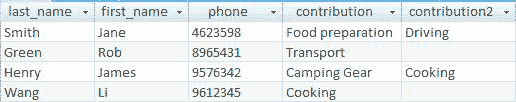

**图 A-1.** 用于记录家长贡献的初始数据库表

a)  你预见到在`图 A-1`的表格中充分利用信息会存在什么问题？

该表可能被设计成`图 A-1`的样子，因为学校秘书准备了一份人员名单，并请他们填写自己可以帮助学校露营旅行做什么。然而，数据的主要用途很可能相反——谁能提供这种帮助？如果你想找人帮忙开车，你必须检查两个列，因此对表格进行筛选或排序以找到司机将很困难。此外，还存在类别或关键词问题。有些人将他们愿意送孩子去营地称为“driving（驾驶）”，而另一些人则称之为“transport（运输）”。这使得任何自动选择合适人员的操作几乎不可能。需要人工检查每一行。

b)  建议一些更好的存储这些信息的方法。

一个改进是预先确定一些类别：transport（运输）、provide equipment（提供设备）和 food preparation（食物准备）。如`图 A-2`所示，基于这些类别的简单电子表格或表格将更容易操作。例如，对运输列进行一些简单的筛选将很快找到所有司机。

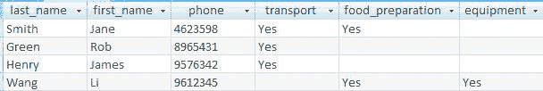

**图 A-2.** 使用类别的电子表格或数据库表

`图 A-2`中的解决方案如果学校只想保留这些信息，那是没问题的，很可能确实如此。然而，如果学校后来决定想要详细说明诸如食物准备等任务，或者保留关于可用性的日期，那么该设计将难以修改。我们实际上存储的是关于两件事的信息：人和贡献，以及它们之间的关系（即，谁可以提供什么，可能在什么时候）。类似于`图 2-1`中为植物和用途提出的解决方案将是此问题的一个更通用的解决方案，但它可能不值得付出努力。总是在为当前问题提供良好、廉价的解决方案和提供能够演进的可扩展设计之间存在权衡。

##### 练习 1-2

a)  你预见到在`图 A-3`的数据库表中充分利用信息会存在什么问题？

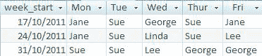

**图 A-3.** *一个用于记录值班任务的初始数据库表*

该表基于用户预想的报告。它便于为给定月份打印出来，放在电话旁或墙上。但这基本上是它唯一有用的方面，而且它同样容易写在一张纸上。从这个数据中可以获得的一个额外信息是为每个人显示他们被安排值班的日期的报告。数据就在那里，但用这种设计提取它一点也不容易。再次强调，思考数据而非输出是有用的。我们正在保存关于两件事的信息：人和日期，以及它们之间的关系。

b)  建议一些更好的存储这些信息的方法。

一个类似于`图 A-4`中的表或电子表格将能够实现对数据的更多视图。我们可以按姓名筛选以获取一个人的值班表，或选择特定的周来获取相同的信息，如`图 A-3`所示。

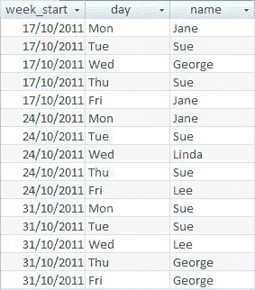

**图 A-4.** 存储关于值班任务数据的一种更有用的方式


虽然所有信息都包含在表格中，但要让报告的呈现形式与图 A-3 完全一致并非易事。因此，这里需要做出权衡。我个人非常想要图 A-3 中的表格格式，但我愿意在格式上妥协，以换取图 A-4 所提供的额外数据视图。

##### 练习 2-1

一个小型体育俱乐部需要管理其会员及他们会费缴纳的信息。秘书希望能够录入会员缴费数据，并打印一份类似图 A-5 的报告。

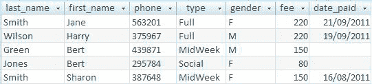

**图 A-5.** 一个小型俱乐部的会员数据

### a)  思考不同数据项可能在何时录入。为数据录入绘制一个初始的用例图。

乍一看，我们可能会认为录入数据是一个一步完成的任务，但仔细观察后会发现，可能存在三个不同的流程。不同会员类型的会费很可能在当年年初就已确定，并可在那时录入。一些会员数据可能已经存在，但我们需要在会员加入俱乐部时添加新成员。会费可能会在稍后的某个日期缴纳（特别是对于现有会员）。因此，初始的用例图应反映这些独立的任务。

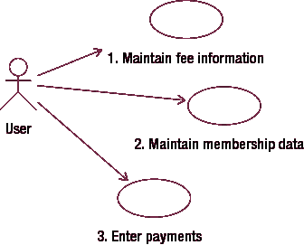

**图 A-6.** *用于录入俱乐部数据的可能用例*

### b)  考虑你需要维护哪些不同类型的信息，并绘制一个简单的类图。

数据在不同阶段录入这一事实，为我们提供了一些线索，表明有多个不同的类参与其中。我们有关于会员类型和会费的信息、关于会员的信息以及关于付款的信息。如下的类图草稿展示了初始设想。

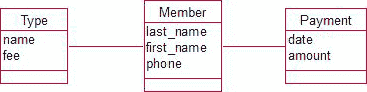

**图 A-7.** *代表俱乐部数据的类图初稿*

现在考虑一下基数。从表面上看，我们有这样的关系：一个特定的类型（例如，全费会员）会关联许多会员；一个会员只属于一种类型；一笔付款只关联一个会员。一个会员可能会有多少笔付款？这取决于我们是只保存一年的信息还是长期保存。有时，像俱乐部秘书这样的人可能只关心手头的工作，即整理好今年的信息——而这可能就是全部需求。然而，如果你费心建立一个数据库，那么拥有一个能够长期应对的数据库是至关重要的。（然后我们将不得不担心会费随时间变化的问题，但稍后再详述。目前我们假设会费保持不变。）包含基数的完整类图如图 A-8 所示。请注意，会员（目前）可能没有任何付款记录，并且在某些时候，可能存在一些没有任何关联会员的会员类型。

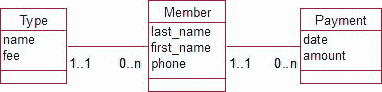

**图 A-8.** *代表俱乐部数据的类图，包括基数*

### c)  你可以向俱乐部建议哪些不同的报告呈现方式？你的类图是否能方便地获取所需信息？

能够按类型区分会员可能对计算付款汇总和小计很有用（拥有类型类将确保此信息的准确性）。找出未付款的会员将是必不可少的。如果我们只保存单一年度的付款记录，这很容易——只需找出没有关联付款记录的会员即可。然而，如果我们长期保存付款记录，事情就变得有点棘手了。我们需要知道一笔付款是针对哪一年缴纳的，而不是它何时被支付（有些会员可能会非常拖延）。检查某一年是否已付款可能并不令人满意。我们将在后续章节中探讨处理这类问题的方案。

##### 练习 3-1

考虑以下场景，并绘制一些用例图和初始数据模型。假设系统的主要目标是：为课堂教师记录学生缺勤情况，为学校报告提供信息，以及为教育部提供统计数据。

*当家长打电话说孩子生病时，我们必须通知他们的课堂教师；如果那天是运动日，而孩子在校队里，体育老师可能需要安排替补。然后，我们需要统计所有缺勤天数，写入孩子的报告。教育部每个学期也需要这些总数。*

让我们按照第 3 章总结部分的步骤来进行。

1.  **确定系统的主要目标。**

    我们与客户达成一致，主要目标是为课堂教师、学校报告和教育部的统计数据记录缺勤情况。

2.  **确定不同用户在平均一天内所做的工作。**

    *   秘书接听电话并记录每个学生的姓名。
    *   秘书为每位课堂教师整理缺勤信息，并通知他们哪些学生缺席。
    *   如果是比赛日，秘书将缺勤名单交给体育老师。
    *   统计每个学生的缺勤总数，用于其个人报告。
    *   汇总所有学生的缺勤总数，用于教育部。

3.  **头脑风暴与每项工作相关的数据。**

    a.  秘书接听电话并记录每个学生的姓名。

    由于缺勤信息需要按学生整理，我们必须确保正确识别学生。这些学生数据将是系统的重要组成部分。我们需要记录所有学生的姓名，并应考虑引入 ID 编号来区分可能有相同姓名的学生。我们还需要记录当前日期。

    b.  秘书为每位课堂教师整理缺勤信息，并通知他们哪些学生缺席。

    我们需要能够将每个学生与一位课堂教师关联起来。我们需要教师的姓名和一些联系信息。如何通知教师？是给他们送去打印的名单，还是打电话？也许我们可以发电子邮件。从一开始就记录教师的联系信息，如房间号、电话号码和电子邮件地址，会给我们带来灵活性，而且很容易做到。

    c.  如果是比赛日，秘书将运动队缺勤名单交给体育老师。

    这不是主要目标之一，因此记录运动队成员信息目前看来超出了问题范围。能够打印一份当天所有缺勤人员的名单可能就足够了，而我们已经掌握了所有这些信息。

    d.  统计每个学生的缺勤总数，用于其个人报告。

    我们正在收集缺勤日期和学生的 ID，这样我们就可以按任何所需的时间段（周、学期或年）统计每个学生的缺勤次数。

    e.  汇总所有学生的缺勤总数，用于教育部。

    与上一步相同，但汇总所有学生。

4.  **商定项目范围并确定相关数据。**

    至少我们需要：

    对于每位教师：姓名和联系方式（可能还需要一个 ID）


#### 学生出勤系统设计过程

##### 5. 草拟数据输入用例——考虑异常情况——检查现有表单

图 A-9 展示了一些初始的数据输入用例。

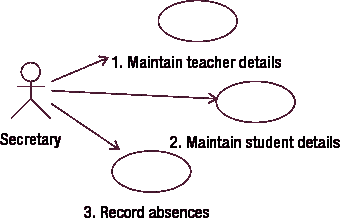

`图 A-9.` 数据输入用例

以下是图 A-9 中所示用例的简要描述。

1.  维护教师详情：记录或更新姓名和联系方式。
2.  维护学生详情：为新学生分配学号。记录或更新姓名，并将学生与现有的班级教师关联。
3.  记录每次缺勤的日期和缺勤学生的学号。

##### 6. 考虑异常情况和复杂问题

一个想到的问题是：我们如何记录一个学生连续缺勤多天的情况？我们有几个选择；我们可以将每一天记录为一次单独的缺勤，或者我们可以记录一次缺勤并带有开始日期和结束日期。前者是最简单的选择。然而，如果学校可能需要关于缺勤类型的一些统计数据（例如，平均缺勤时长是多少？有多少学生一次缺勤超过一周？），那么我们就必须重新考虑我们的方法。由于主要目标只是统计总的缺勤天数，我们目前将每次缺勤记录为单独的一天。另一个问题涉及那些缺勤但未接到家长电话的学生。班级教师将能够使用现有的用例，但这引发了一个问题：缺勤是否有不同的类别。目前，我们只在缺勤数据中添加一条备注。

##### 7. 草拟第一个数据模型

图 A-10 展示了一个数据模型。

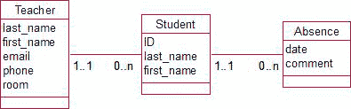

`图 A-10.` 记录学生缺勤的类图

对于图 A-10 中的模型，以下陈述成立：

*   每个学生只有一位班级教师，但可以有多次缺勤。
*   每位教师可能作为班级教师负责许多学生（但有些教师可能不是班级教师）。
*   每次缺勤只针对一个学生。

##### 8. 根据收集的数据，头脑风暴可能的输出

我们拥有报告每个学生或所有学生缺勤次数所需的全部信息。我们还能检索到哪些进一步的信息？我们已决定不保留缺勤时长。那么缺勤原因呢？添加一些缺勤类别（如生病、学校旅行、体育比赛等）将是一个简单的补充。这可能值得与客户讨论。

草拟信息输出用例。

图 A-11 展示了一些满足系统主要目标的输出用例。


`图 A-11.` 报告信息的用例

以下是图 A-11 中所示用例的简要描述。

4.  体育教师完整列表：查找今天日期的所有缺勤记录。打印出相关学生的姓名。
    班级教师列表：查找今天日期的所有缺勤记录。打印出学生姓名和教师姓名，并按教师分组。
5.  提交给教育部门：查找相关时间段内日期的所有缺勤记录并进行计数。
    用于学校报告：对于每个学生，统计相关时间段内日期的所有缺勤次数。

### 练习

##### 练习 4-1

图 A-12 展示了一个初步草图，用于对一家出版公司希望保存作者和书籍信息的场景进行建模。考虑关系`writes`两端的可能可选性，并据此确定书籍和作者的一些可能定义。


`图 A-12.` 考虑作者写书关系的可能可选性

起初我们可能认为，一个作者总会至少有一本他写的书，一本书也总会至少有一个作者（即使我们可能不知道是谁）。这对于*实际的*书籍和作者来说可能是正确的，但这里我们关心的是关于书籍和作者的*信息*。一家出版公司可能会经常看到某个主题的出书机会，并在寻找作者时记录该信息。同样，出版商可能会保留一个潜在的作者并存储其信息，即使该人尚未为该出版商写过书。

可能的定义可能包括：*书籍是已写成或计划写成的作品；作者是已经或可能在将来写书的人*。

##### 练习 4-2

图 A-13 展示了一个鸡尾酒配方的可能数据模型。缺少了什么？

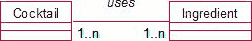

`图 A-13.` 鸡尾酒及其成分；缺少了什么？

每种鸡尾酒可能有多种成分（曼哈顿：味美思，威士忌；玛格丽特：龙舌兰，橙味酒，酸橙）。缺少的是用量。正如多对多关系中常见的情况，需要一个中间类。用量取决于鸡尾酒和成分的特定配对。图 A-14 展示了一个更好的模型，并附带了一些可能的数据。包含`Recipe`类允许我们保存诸如制作“大吉利”需要多少朗姆酒，而制作“缆车”又需要多少等信息。

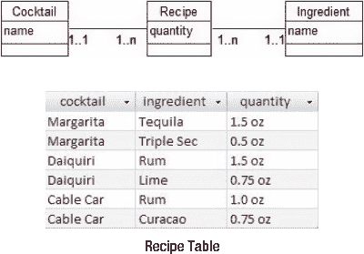

`图 A-14.` 一个中间类`Recipe`可以记录每种鸡尾酒和成分配对的用量。

##### 练习 4-3

图 A-15 展示了关于旅馆客人的部分数据模型。如何修改该模型以保存关于房间占用情况的历史信息？

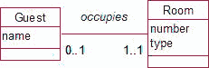

`图 A-15.` 如何修改此模型以保存关于房间占用的历史信息？

该数据模型表明，对于单人间的旅馆，一个房间可能空置或最多有一位住客。每位当前的客人占用一个房间。然而，随着时间的推移，一个房间将会有许多不同的客人，客人也可能返回并入住不同的房间。这需要被建模为一个多对多关系，如图 A-16 所示。（顺便说一句，从客人与房间关联的可选性为`1`，你可以推断出，我们对客人的定义是在某个阶段被分配了房间的人——而不仅仅是任何可能或不可能来旅馆的人。）

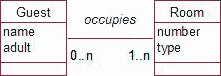

`图 A-16.` 用多对多关系建模客人与房间

现在我们有了一个多对多关系，我们需要问：有什么缺失吗？显然缺失的是关于特定客人在何时占用特定房间的信息。这需要一个中间类，如图 A-17 所示。

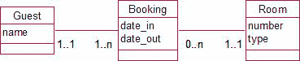

`图 A-17.` 包含一个`Booking`类以保存客人占用房间的日期信息


#### 预订模型的问题与业务规则

每位客人可以随时间拥有多个预订，一个房间也可以被多次预订。每次预订对应一位客人和一个特定房间。这里需要提醒注意——我们最初的数据模型（图 A-16）表明一个房间只能容纳一位客人。既然我们现在允许一个房间随时间容纳多位客人，我们就丢失了这样一个信息：在任何特定时间点，一个房间只能有一位客人入住。我们在图 A-17 中的模型无法防止多人同时预订同一个房间。这类问题从来不简单！记录关于同时预订的业务规则的一种方法，是在用于为房间添加预订的用例中进行描述。它可能会这样写：*不能为已有预订日期重叠的房间添加新的预订*。数据模型为我们提供了大量的洞见，但它本身并不能完整地描述问题。

##### 练习 5-1

图 A-18 中的类记录了关于一个部门的信息。对于部门的经理和位置信息进行建模，还有哪些其他选择？

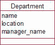

图 A-18. 部门信息建模的初步尝试

首先考虑位置。我们想用这些信息做什么？能够找到所有位于同一地点的部门可能很有用——例如，可以通知他们 CEO 要来访。如果我们想根据属性的值来检索对象，就必须确保该值在每个对象中存储一致。创建一个新类有助于解决这个问题。如果引入一个`Location`类，我们就可以存储每个位置的信息，并在部门和位置之间建立关系。引入`Location`类还允许我们保留关于位置的额外信息：地址、电话等等。

我们不太可能经常需要根据经理的姓名来检索部门对象，因为在大多数情况下，经理只与一个部门相关联。然而，关于一位经理，我们需要了解大量的额外信息。如何联系他至少是一个起点。我们已经有这些信息了吗？公司肯定存储了其所有员工的信息，所以在这里我们应该将经理建模为指向现有`Employee`类的关系。

图 A-19 展示了一个更好的模型。如果你感兴趣，可以尝试基于这个新模型来考虑历任经理。

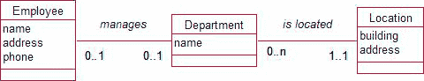

图 A-19. 更灵活的部门信息模型

##### 练习 5-2

一所大学想要为课程教学的信息建模。可能有多名教职员工参与一门课程的教学，其中一名教职员工被指定为课程主管。请提出一个初步的数据模型。

我们为这种情况有两个显而易见的类：`Course`（课程）和`StaffMember`（教职员工）。这两个类之间有两种不同的关系：`teaches`（教）和`supervises`（监督）。图 A-20 展示了一个可能的模型。从右向左阅读：每门课程有一位或多位教师，每门课程只有一位主管。从左向右阅读：教职员工可能教授和/或监督任意数量的课程。在这个模型中，我们没有考虑任何历史信息；也没有考虑其他可能的约束，例如，主管是否必须是教师之一？

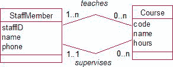

图 A-20. 使用两种关系对课程教学和监督进行建模

##### 练习 5-3

你会如何为婚姻信息建模？考虑所有可能产生的情况（为简单起见，暂时不必担心参与者的性别）。

我们需要保存关于人的信息——至少是他们的名字。一个人与另一个人结婚，因此需要一个自反关系，如图 A-21 所示。

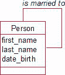

图 A-21. 使用自反关系对婚姻建模

可选性很容易理解——人们不必与他人结婚。基数（Cardinalities）呢？通常是一次只有一段婚姻（但不总是如此）。然而，从历史上看，一个人可能有多次婚姻。这就需要一个多对多（Many–Many）关系。当我们有一个多对多关系时，谨慎的做法总是要问：“关于特定的一对对象，哪些附加信息可能有用？”在这种情况下，婚姻的日期会很有用。这些信息可以保存在一个中间类`Marriage`中。我们还可以保存关于婚姻结束原因（离婚、分居、配偶去世等）的详细信息。一个`EndType`类将有助于准确维护这些类别，图 A-22 中的数据模型就能捕获大量这类细节。每段婚姻恰好涉及两个人（`Marriage`和`Person`之间的两条线），而每个人可以涉及任意多次婚姻。一些婚姻已经结束，因此有一个与之关联的可选类别。

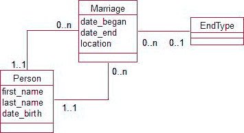

图 A-22. 包含附加类以捕获婚姻信息

##### 练习 5-4

一个管弦乐队保存关于其音乐家、曲目和音乐会的信息。一个部分数据模型如图 A-23 所示。

从这个初始模型中可能推导出哪些错误信息？

修改模型，使其能正确维护以下信息：
*   特定音乐会中哪些演奏者参与了特定的作品
*   音乐会上将呈现哪些作品
*   演奏者在特定音乐会中出场获得的酬金

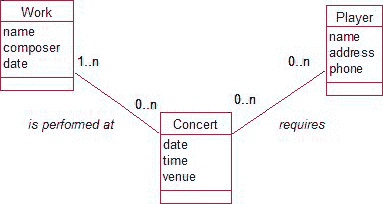

图 A-23. 管弦乐队音乐会信息的部分模型

这个模型存在一个扇形陷阱（fan trap）：两个关系的外端都具有多（Many）基数。例如，如果我们知道 Joe Smith 被要求参加周六的音乐会，并且贝多芬的小提琴奏鸣曲将在周六的音乐会上演出，我们可能会错误地推断 Joe 会演奏这首小提琴奏鸣曲。

如果我们想知道在特定音乐会上，哪些演奏者参与了哪些特定的作品，我们需要一个同时涉及`Player`（演奏者）、`Concert`（音乐会）和`Work`（作品）这三个类的三元关系。图 A-24 通过一个新的`Appearance`（出场）类来表示这种三元关系。

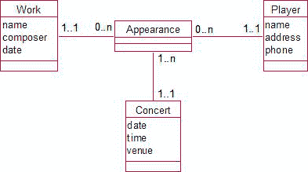

图 A-24. 通过附加类表示的三元关系

`Appearance`类的每个对象都与一位演奏者、一部作品和一场音乐会相关联。它允许我们保存如图 A-25 中表格所示的数据。我们可以看到 Joe 在周六演奏了奏鸣曲和交响曲，而 Linda 只演奏了奏鸣曲。

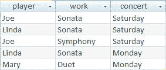

图 A-25. 由`Appearance`类表示的示例数据


我们需要在 `Work`（作品）和 `Concert`（音乐会）之间建立关系，以便了解节目单上有什么曲目吗？从图 A-25 可以看出，周六的音乐会以奏鸣曲和交响曲为特色。然而，节目单很可能在任何演奏者参与之前很久就已确定，因此我们需要关于特定音乐会中作品的信息，且该信息独立于演奏者。图 A-26 中 `Concert` 和 `Work` 之间的二元关系可以记录该信息：一场音乐会在节目单上有一部或多部作品，一部作品可能在许多音乐会上演出。

那么，演奏者在音乐会演出所获得的报酬呢？如果报酬与每部作品相关，那么它们可以作为属性包含在 `Appearance`（演出）中。例如，Joe 因周六演奏奏鸣曲获得 30 美元，因演奏交响曲获得 50 美元。如果一笔报酬是针对整场音乐会的（例如，差旅津贴），那么它与作品无关，就需要在 `Player`（演奏者）和 `Concert`（音乐会）之间建立一个新的二元关系。该关系将是多对多（一个演奏者可能参与多场音乐会，一场音乐会有许多演奏者）。因此需要引入新的中间类 `Player/Concert`，以便我们有一个地方来包含特定演奏者-音乐会组合的报酬。

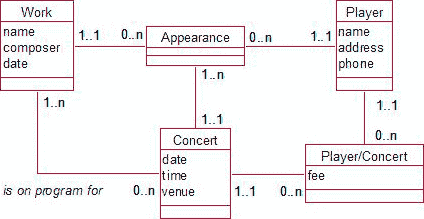

图 A-26. 一个更全面的音乐会信息模型

##### 练习 6-1

考虑图 A-27 中的模型，它描述了一家小型邮购公司的客户购买产品的情况。该公司改变了其业务模式，允许客户直接上门支付现金。现金购买无需关联任何客户。

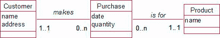

图 A-27. 客户购买产品。

讨论以下数据修改方式的效果如何。

*   将关系客户端的可选性改为 0，这样并非所有购买都需要关联客户。

    这个方案解决了现金销售无需关联客户的当前问题。如果处理得当，它可以工作。然而，存在一个问题：当邮购购买需要开具发票或交付时，将没有客户的记录。

*   保持可选性为 1，但包含一个名为“现金客户”的虚拟客户对象。

    我们现在必须为每笔购买指定一个客户。这可能比前一个选项稍微安全一些。然而，该项目的目标之一是提供关于客户习惯的统计数据。“现金客户先生”可能会有大量的购买记录，这可能会扭曲平均价值或平均购买次数等统计数据的结果。如果记得的话，可以在进行统计前移除“现金客户”的购买记录，但这很繁琐。这取决于这些统计的重要性以及需求的频率。

*   创建 `Customer` 的子类：`Cash_Customer`（现金客户）和 `Account_Customer`（账户客户）。

    这实际上并不比前一个选项实现更多目标，而且实现起来要困难得多。我们没有收集关于现金客户的信息，因此为它们设立一个类是无意义的。

*   创建 `Purchase`（购买）的子类：`Cash_Purchase`（现金购买）和 `Account_Purchase`（账户购买）。

    我们将有许多现金购买（无关联客户）和许多账户购买（有强制关联的客户），因此为每种类型设立一个类是一个合理的想法。这使得为不同客户类型推导统计信息变得简单。对于当前的需求集，它比虚拟现金客户并没有太大优势，但如果我们想开始记录支付方式（现金、EFTPOS、信用卡等），那么添加这些会很容易。图 A-28 展示了如何对此建模。

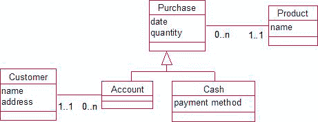

图 A-28. 购买可以是针对有账户的客户，也可以是匿名的现金交易。

##### 练习 6-2

一位农民记录其农作物施用肥料的信息（例如，用量、日期等）。他的农场由大的区域（section）组成，这些区域又划分为田地（field）。通常，一次肥料施用是针对整个区域的，但偶尔也针对单个田地。你会如何为此建模？

我们可以从一个名为 `Application`（施用）的类开始，它可以记录日期和肥料用量，并且与某种区域——一个区域或一块田地——相关联。区域和田地都是“区域”，它们有共同之处（名称、大小、可施肥等），因此这是泛化的一个候选。看看图 A-29 中的模型。

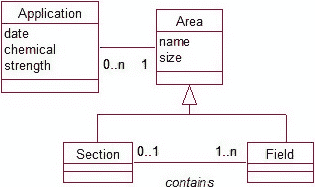

图 A-29. 肥料施用于区域，这些区域要么是区域（section），要么是田地（field）。

除了一个区域要么是区域（section）要么是田地（field）之外，我们还知道一个区域（section）中可能包含许多田地（field）。现在我们可以记录一次施用是针对某个区域（section）的，并知道哪些田地接受了处理。如果需要，我们也可以记录针对单个田地的施肥。

图 A-29 是一个好的解决方案；然而，使用图 A-30 中的组合模式，可以提供一个更通用的解决方案。我们可以记录对整个农场的施肥，农场由区域（section）组成，区域又由田地（field）组成。我们也可以在这任意层级记录肥料施用。这类似于第 6 章讨论的建筑物检查问题。

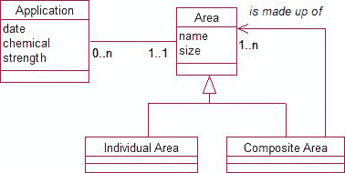

图 A-30. 组合模式允许对所有层级的区域进行施肥记录。

##### 练习 6-3

一个志愿者图书馆有工作人员、会员和书籍。需要知道哪些书借给了谁以及如何联系借阅者，并记录因书籍逾期产生的费用。参考书不可外借。会员因书籍逾期每天被罚款 5 美元，但工作人员不被罚款。你会如何为此情况建模？一些初始类如图 A-31 所示。

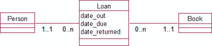

图 A-31. 人们可以借书。

我们知道有两种类型的书（普通书和参考书）和两种类型的人（工作人员和会员）。现在的重要问题是：我们需要继承吗？对于人，问题陈述中唯一的区别是逾期罚款的数值。没有行为上的差异。我们可以创建一个 `Type`（类型）类（包含工作人员和会员对象），该类与每个人相关联。这个类可以记录该类型的罚款金额（会员 5.00 美元，工作人员 0.00 美元）。类似地，我们可以将每本书分类为某种类型，并在用例中内置一条规则，即参考书不能关联到借阅。然而，这种不同的行为可能值得考虑继承解决方案。图 A-32 描述了一个可能的解决方案，使用一个关联来表示不同类型的人，使用继承来表示不同类型的书。注意，我们引入了一个抽象的 `Book`（书）类，以便我们可以独立地修改普通书和参考书类。


图 A-32. 表示不同类型书籍和人员的众多可能方法之一

##### 练习 7-1


#### 图书馆数据模型与关系数据库设计

a) 图 A-33 展示了一个小型图书馆的初始数据模型。向图书管理员解释这个初始数据模型的含义。

b) 为关系数据库设计表，以捕获该模型所表示的信息。包括主键、外键以及其他适当的约束。


**图 A-33.** 一个小型图书馆的草稿数据模型

##### 解释数据模型

a) 以下是一种向图书管理员解释数据模型含义的可能方式。

“该模型显示，您打算保存有关人员的信息（每个人都有一个编号和姓名）。您还保存有关馆藏图书书目的信息：作者、书名和类别。对于每个书目，至少有一个副本，也可能有更多。这些副本有一个副本编号和购买日期。您将保存有关哪些人员借阅了特定副本的信息。”

显然，这个模型中缺少一些重要的内容——我们稍后会提到其中一些！

##### 转换为关系数据库

b) 现在让我们看看如何在关系数据库中表示该模型。

对于每个类，我们需要一个表，其字段用于表示属性。

直接转换得到：

```
Person      (ID, last_name, first_name)

Title       (cat_num, title, author)

Item        (copy_num, purchase_date)

Category    (name)
```

我们需要为字段指定一些类型。`ID` 应该是一个整数，您可以考虑某种自动递增的类型。根据编目系统，`cat_num` 很可能是一个文本字段。`copy_num` 将是一个整数（1, 2, 3 等），`purchase_date` 显然是一个日期，其他字段都是文本。我们可能应该更仔细地查看作者字段。这里有一些可能性；至少它应该被分成名字和姓氏，但由于人们可能希望按作者搜索，它可能应该是一个独立的类。我们现在暂时不考虑这一点。

约束呢？所有这些字段对我来说似乎都很重要，我看不出有什么理由不将它们全部设为必填（非空）。购买日期可能应该是一个过去的日期，但那样如果需要存储计划中的未来购买可能会造成问题（而这扩大了范围，所以我们现在也暂时不考虑）。

`Person`（`ID`）、`Title`（`cat_num`）和 `Category`（`name`）表的主键很容易确定，但 `Item` 表没有一个明显的主键候选。每个书目都会有一个 `copy_num = 1` 的副本，并且它们可能是在同一天购买的。因此，没有任何字段或字段组合是合适的。我们可以添加一个唯一标识符，但我们将稍作等待，看看后续情况。

现在来表示关系。`Title` 和 `Category` 之间的一对多（1–Many）关系可以通过在 `Title` 表中添加一个外键来表示，同样，我们需要在 `Item` 表中添加一个引用 `Title` 表的外键。这些外键的数据类型必须与它们所引用的表中的数据类型相同。为了表示“借阅”这个多对多（Many–Many）关系，我们需要首先添加一个新类（`Loan`），如图 A-34 所示。


**图 A-34.** 一个用于帮助表示多对多关系“借阅”的新类

在这个阶段，我们应该意识到（你可能早就意识到了）需要存储有关 `Person` 和 `Item` 配对的信息（`date_out`、`due_date` 等）。这些需要与客户讨论。我们现在先做个记录。为了表示图 A-34 中的两个一对多关系，我们将在 `Loan` 表中添加两个外键，分别引用 `Person` 和 `Item`。

下面，我总结了我们目前的进展。（我使用加粗下划线表示主键，斜体表示外键。）

|   | Person | (`ID`, last_name, first_name) |
|   | Title | (cat_num, title, author, *category*) |
|   | Item | (`copy_num`, purchase_date, *title_cat_num*) |
|   | Category | (`name`) |
|   | Loan | (`<dates>`, *item*, *person*) |

我们快完成了；我们只需要决定 `Item` 和 `Loan` 表的主键。对于 `Item` 表，现在可以使用 `title_cat_num` 和 `copy_num` 的组合作为主键。每个书目都有一个唯一的目录编号，并且每个书目只会有一个副本 1、一个副本 2，依此类推。对于 `Loan` 表，`item` 和 `person` 的组合并不合适；同一个人可能第二次借阅同一件物品。然而，如果我们包含借出日期，那么这三个字段将是唯一的（假设您不会在同一天借出同一件物品两次）。也可以在 `Loan` 表中添加一个唯一的贷款编号作为主键（我们在第 8 章中探讨这个选择）。

代码清单 A-1 展示了在 SQL Server 中创建这些表的 SQL（我们尚未在本设计书籍中涵盖处理连接键和外键的所有必需语法，但它相当容易理解）。

**代码清单 A-1.** 创建图书馆数据库的 SQL

```sql
CREATE TABLE Category (name VARCHAR (20) PRIMARY KEY);

CREATE TABLE Person (ID INT PRIMARY KEY, last_name VARCHAR(20) NOT NULL, first_name VARCHAR(20) NOT NULL);

CREATE TABLE Title (cat_num VARCHAR(40) PRIMARY KEY, title VARCHAR(80) NOT NULL, author VARCHAR(80) NOT NULL, category VARCHAR(20) NOT NULL FOREIGN KEY REFERENCES Category);

CREATE TABLE Item (title_cat_num VARCHAR (40) FOREIGN KEY REFERENCES Title, copy_num INT, purchase_date DATE NOT NULL, PRIMARY KEY (title_cat_num, copy_num));

CREATE TABLE Loan (date_out DATE, cat_num VARCHAR(40), copy_num INT, borrower INT FOREIGN KEY REFERENCES Person, FOREIGN KEY (cat_num, copy_num) REFERENCES Item, PRIMARY KEY (date_out, cat_num, copy_num, borrower) );
```

##### 练习 8-3

图 A-35 展示了示例 1-3 中讨论的未规范化昆虫数据的一个版本。


**图 A-35.** *未规范化的昆虫数据*

a) 可能会出现哪些更新问题？

最明显的问题很可能源于重复信息导致的不一致数据。每个农场的名称被记录了多次，并且不可避免地导致 `HighGate` 出现了拼写错误。访问日期 14 是 2 月 9 日这一事实被记录了多次，数据输入错误是可能的。由于数据存储在电子表格中，没有主键，因此不会出现插入和删除问题。

b) 以下哪些函数依赖成立？

#### 函数依赖分析

*   `FarmID` -> `FarmName`? 是的。如果我知道 ID 就能告诉你名称（或者在拼写错误被纠正后应该可以）。
*   `FarmID` -> `Visit`? 不是。如图 A-35 中所示的数据，农场 1 有两个关联的访问（14 和 15）。如果这个函数依赖成立，那就意味着每个农场只有一个访问——显然不是本意。
*   `Visit` -> `Date`? 对于所示数据这肯定是正确的，但这会永远成立吗？这将意味着一次访问发生在单日——需要与客户确认。我们暂时说是。
*   `Date` -> `Visit`? 不是。那将意味着每天只有一次访问。2 月 9 日有两个关联的访问：14 和 16。
*   `Visit` -> `FarmID`? 所示数据支持这一点。通常我们需要确认一次访问只针对一个农场（即不包含全国巡游）。我们暂时说是。
*   `SampleID` -> `Field`? 如果我们知道样本，肯定也应该知道它来自哪个田地，对吗？然而，一些`SampleID`为 2 的行，`Field`值是 F1，而另一些是 F2。所以，不行——我们无法通过知道`SampleID`的值来确定`Field`的值。这是因为`SampleID`字段不能唯一标识一个样本。存在多个来自不同访问的`SampleID`为 2 的样本。要标识一个样本，我们还需要知道它是在哪次访问中收集的。
*   (`SampleID`, `VisitID`) -> `Field`? 是的——见上文！数据支持这一点。访问 14 的样本 2 只关联 F2，访问 16 的样本 2 只关联 F1。
*   (`SampleID`, `Insect`) -> `Count`? 在一个实际样本中，如果我们指定了昆虫，那么应该得出一个唯一的计数。但记住，`SampleID`字段不能唯一标识一个实际样本。看看`SampleID = 2`且`Insect = 'Beetle'`的那些行。（多么巧合！）
*   (`VisitID`, `SampleID`, `Insect`) -> `Count`? 见上文。现在我们将`VisitID`与`SampleID`一起包含，就可以识别出实际的试管（或其他容器）并知道甲虫的数量。

##### 问题 c)

(`VisitID`, `SampleID`, `Insect`) 是一个合适的键吗？

从问题 2，让我们总结一下对这些数据成立的函数依赖（FD）。

*   FD1: `FarmID` -> `FarmName`
*   FD2: `VisitID` -> `Date`, `FarmID`
*   FD3: `SampleID`, `VisitID` -> `Field`
*   FD4: `VisitID`, `SampleID`, `Insect` -> `Count`

如果我有(`VisitID`, `SampleID`, `Insect`)的值，我能确定哪些字段值？

我们知道`Count` (FD4)，`Field` (FD3)，`Date`和`FarmID` (FD2)，并且因为现在我知道了`FarmID`，我就能告诉你`FarmName` (FD1)。这就是所有信息，所以这个集合是一个键。它是一个主键，因为如果你移除了任何字段，你就无法知道所有信息（我将把验证这一点留给非常热衷的读者）。

##### 问题 d)

将图 A-35 中的数据分解为一组符合第三范式（3rd Normal form）的表。

字段如下（主键带下划线）：

(`FarmID`, `VisitID`, `SampleID`, `Date`, `FarmName`, `Field`, `Insect`, `Count`)

这符合第一范式（1st Normal Form）吗？

是的。我们没有试图在一个单元格中放入多个信息。

这符合第二范式（2nd Normal Form），或者说非键字段是否依赖于整个键？

不是。我们仅通过知道`FarmID`就能确定`FarmName` (FD1)，所以它应该被移除到另一个与它所依赖的字段一起的表中。这给我们留下：

(`FarmID`, `VisitID`, `SampleID`, `Date`, `FarmName`, `Field`, `Insect`, `Count`)

(`FarmID`, `FarmName`) (新表)

仅通过知道`Visit`就能确定`Date`和`FarmID` (FD2)。移除这两个字段后剩下：

(`FarmID`, `VisitID`, `SampleID`, `Date`, `FarmName`, `Field`, `Insect`, `Count`)

(`VisitID`, `FarmID`, `Date`) (新表)

仅通过知道`SampleID`和`VisitID`就能确定`Field` (FD3)。所以这需要被移除。

(`FarmID`, `VisitID`, `SampleID`, `Date`, `FarmName`, `Field`, `Insect`, `Count`)

(`VisitID`, `SampleID`, `Field`) (新表)

最终我们得到以下四个表（键带下划线，外键用斜体）。

*   (`FarmID`, `FarmName`)
*   (`VisitID`, *`FarmID`*, `Date`)
*   (*`VisitID`*, `SampleID`, `Field`)
*   (*`VisitID`*, *`SampleID`*, `Insect`, `Count`) (原表的剩余部分)

如果我们从图 A-36 中的类图开始，也能推导出这些表。


**图 A-36.** `昆虫数据类图`

类图本质上表示一个农场获得多次访问。每次访问有许多关联的样本，对于每个样本，我们可以记录昆虫的数量。我想你会看到，从类图开始会省去很多麻烦，并且还会促使我们思考其他一些可能的类，比如`Field`和`Insect`。然而，这两种方法是达到类似结果的等效途径。

##### 练习 9-1

这里我们再次看到非常有用的“客户订购产品”示例。设计将代表图 A-37 中`Order`类的表。考虑约束、主键和外键以及更新规则。


**图 A-37.** `客户下订单模型`

我们假设`customerID`和`product_name`分别是`Product`和`Customer`表的主键。为了表示这两个关系，这些主键将作为新的外键字段包含在`Order`表中。我们将有（外键用斜体）：

`Order` (`customer`, `product`, `date`, `quantity`)

什么是主键？一个客户可能多次订购一个产品，可能在同一日期甚至相同数量。（你可能为你的聚会订购了三打点心，意识到你误算了某些客人的胃口，并立即又订购了三打。）这是一个（相当罕见的）情况，其中没有属性组合可以保证是唯一的，需要添加一个生成的订单号。所有属性都是必要的，因此应具有`NOT NULL`约束。如果日期是订单下达的日期，那么它不应该是未来的日期——但如果它是订单生效的日期，也许未来日期是有意义的——我们现在先不限定这个。至于更新规则，我们必须选择`Disallow Delete`（默认）。如果删除了客户或产品，我们仍然希望出于会计目的保留订单（如第 9 章所讨论的，我们可能也希望保留产品和客户）。`Nullify Delete`将使订单信息无用，因为我们留下的数据会是这样的：“在某个特定日期，某人订购了六件某物。”

创建该表的 SQL 语句将类似于清单 A-2 所示。

**清单 A-2.** 创建订单表的 SQL——禁止删除是默认更新规则

```sql
CREATE TABLE Order (
    order_num INT PRIMARY KEY,
    product INT NOT NULL FOREIGN KEY REFERENCES Product,
    customer INT NOT NULL FOREIGN KEY REFERENCES Customer,
    quantity INT NOT NULL,
    date DATE NOT NULL,
);
```

##### 练习 9-2

思考为汽车销售场设置品牌和车型表的可用选项。

我们有品牌（makes）、车型（models）、类型（types）和实际的汽车（cars）。如果我们回溯到第 2 章，思考用户可能用于排序或搜索的属性并将它们作为单独的类是很有用的。（我们在植物案例中对属（genus）这样做了，以确保所有桉树（Eucalyptus）物种的拼写正确）。在这里，我们很可能希望能够找到关于所有福特（Fords）、所有西耶那（Siestas），甚至所有轿车（sedans）或所有蓝色汽车的信息。初始模型可能类似于图 A-38 中的样子。


##### 图 A-38：保存车辆信息的可能模型

如果我们进行从类到表的转换，我们会从以下表开始（主键带下划线，外键用斜体表示）：

品牌（`品牌名称`）

型号（`型号名称`，`品牌名称`）

版本（`类型名称`，`排量`，`变速箱`，`价格`，`型号名称`，`品牌名称`）（主键？）

车辆（`车牌号`，`颜色`，？）

让我们在这里停一下。`型号`表的主键是`型号名称`和`品牌名称`的组合，这似乎是合理的。我们不能保证型号名称在不同品牌间是唯一的，而引入一个生成的 ID 在这里似乎并没有增加太多价值。

`版本`表的问题更大。我们需要除`价格`外的所有字段来构成主键：`福特嘉年华自动 1.5 升轿车`与`福特嘉年华自动 2.0 升轿车`是不同的版本。拥有这样一个长主键本身没有问题，直到我们处理`车辆`表时。那五个属性的集合将成为外键，并且需要出现在`车辆`表的每一行中。这将变得非常麻烦。

在这一点上，为`版本`表考虑一个生成的 ID 可能是值得的。然后我们可以得到以下表。

品牌（`品牌名称`）

型号（`型号名称`，`品牌名称`）

版本（`版本 ID`，`类型名称`，`排量`，`变速箱`，`价格`，`型号名称`，`品牌名称`）

车辆（`车牌号`，`颜色`，`版本`）

那么类型（如`轿车`、`掀背车`等）怎么办？这里你有两种选择：引入一个新表，或者在`版本`表的`类型名称`字段上创建一个约束。我们可以对颜色做类似的处理。我可能倾向于为类型单独建一个表：随着我们开始考虑三门或五门掀背车以及其他变体，新类型会被不断添加。我甚至不想去想颜色。如果我们能只假设红色、绿色和蓝色，那会很容易，但我敢肯定你会发现有叫做`樱桃色`、`火焰红`、`猩红色`等等颜色。

##### 练习 10-1

图 A-39 展示了第 3 章中讨论的订餐问题的数据库表和一些可能的数据。在`订单 _ 餐品`表中，`订单`和`餐品`分别是引用`订单`表和`餐品`表的外键。


###### 图 A-39：用于送餐的表

确定可提供以下信息的查询。

**a) 确定特定订单（例如 232 号）的费用。**

需要哪些表来获取此信息？我们实际上不需要`订单`表。`订单 _ 餐品`表有订单号和餐品名称，`餐品`表有价格。在`餐品`和`订单 _ 餐品`之间进行连接，条件是`名称 = 餐品`，将给我们提供图 A-40 中的虚拟表。


###### 图 A-40：餐品表和订单 _ 餐品表连接的结果

图 A-40 中的数据包含了我们需要的所有信息。对于每一行，我们可以将`价格`乘以`数量`。我们可以检索订单`232`的所有行并汇总这些金额。

看一下清单 A-3 中的 SQL 代码，看看是否能理解。

**清单 A-3. 用于查找订单 232 费用的 SQL 代码**
```sql
SELECT SUM (quantity * price)
FROM Meals INNER JOIN Order_Meal on name = meal
WHERE order = 232
```

**b) 准备一份未送达订单的列表。**

我们只需要`订单`表来获取此信息。任何没有送达时间的订单都尚未送达（或未记录为已送达）。因此，一个简单的`select`操作来查找`送达时间`字段为空的行即可实现我们的目标。代码如清单 A-4 所示。

**清单 A-4. 用于查找未送达订单的 SQL 代码**
```sql
SELECT *
FROM Orders
WHERE deliver_time is NULL
```

清单 A-4 中的查询将为我们提供每个未完成订单的`订单号`、`地址`、`电话`、`司机`和`下单时间`。这足以打电话给司机询问情况。如果我们还想知道点了哪些餐，那么我们需要将`订单`表与`餐品 _ 订单`表进行连接，以获取所点菜品的名称和数量。

**c) 确定某个月份不同类型餐品的收入。**

这个查询有相当多的步骤，你需要一点练习才能快速得出答案。然而，如果慢慢来，它是很容易理解的。我们需要`餐品`表（用于价格）、`订单 _ 餐品`表（用于数量）和`订单`表（用于查找日期）。清单 A-5 展示了这三个表之间的连接。

**清单 A-5. 连接餐品数据库中三个表的 SQL 代码**
```sql
SELECT *
FROM (Meal INNER JOIN Order_Meal ON name = meal)
          INNER JOIN Orders ON order = order_num
```

图 A-41 展示了清单 A-5 中连接产生的一些最相关的列。前三列来自`餐品`表，接下来三列来自`订单 _ 餐品`表，其余列来自`订单`表。


###### 图 A-41：餐品表、订单 _ 餐品表和订单表连接后的部分列

一个`WHERE`子句将找到所需时间段内的行。（例如，`WHERE 下单时间 >= 2012/02/01 AND 下单时间 < 2012/03/01` 将检索 2012 年 2 月的行。）我们可以进行`数量`和`价格`的乘法运算来计算总额，类似于本问题 a)部分的做法。一个`GROUP BY`子句将允许我们找到每种餐品类型的总额。

清单 A-6 展示了最终的查询。试着识别不同的部分。

**清单 A-6. 用于查找 2012 年 2 月不同类型餐品收入的 SQL 代码**
```sql
SELECT type, SUM (quantity * price)
FROM (Meal INNER JOIN Order_Meal ON name = meal)
          INNER JOIN Orders ON order = order_num
WHERE Order_time >= 02/01/2012 AND Order_time <= 03/01/2012
GROUP BY type
```

##### 练习 11-1

在练习 3-1 中，我们研究了学校记录学生缺勤的问题。初始用例如图 A-42 所示，初始数据模型如图 A-43 所示。设计一些表单以满足数据输入需求（用例 1-3），并设计一些报告以满足输出用例（4 和 5）。


###### 图 A-42：记录和报告学校缺勤情况的用例


###### 图 A-43：记录学校缺勤情况的数据模型

A-44 展示了一些具有代表性的表数据：外键，`学生`和`教师`，已分别添加到`缺勤`表和`学生`表中。


###### 图 A-44：学校缺勤情况的一些数据

用于输入教师和学生数据的表单非常简单，因为它们各自基于单个表。记录缺勤的表单需要在`缺勤`表中输入`学生 ID`和`日期`。然而，接听家长电话的学校秘书会希望处理姓名而非 ID，因此提供姓名信息对于数据输入很重要。图 A-45 展示了一个基于`缺勤`表和`学生`表连接的表单。一个下拉列表按字母顺序显示所有学生的 ID 和姓名，方便选择；只读字段显示学生姓名；新条目的日期默认为今天的日期。


###### 图 A-45. 录入缺勤情况的表单

为了向教师报告，我们需要来自全部三张表的信息。代码清单 A-7 展示了用于连接这些表的视图的 SQL。请注意，我们在 `Student` 表上使用了外连接，以便即使学生没有缺勤记录也能被包含在内。

###### 代码清单 A-7. 从所有三张表中检索信息的 SQL

```sql
CREATE VIEW AllInfo AS
SELECT * FROM Teacher INNER JOIN
(Student LEFT JOIN Absence ON studentID = student)
ON teacherID = teacher;
```

图 A-46 展示了基于代码清单 A-7 中视图查询出的一些数据。


###### 图 A-46. 从图 A-8 中视图检索出的数据

图 A-46 中的数据包含了我们制作所有报告所需的一切。我们只需要选择相关的行，然后进行一些分组和汇总操作。

通过仅选择当天的行，我们可以获取每日缺勤情况。按学生姓名对数据进行排序对于体育老师来说就可以了，但如图 A-47 那样按教师对数据进行分组，则是向每位班级教师提供信息的一种更有用的方式。


###### 图 A-47. 为每位班级教师分组的当前缺勤情况

添加一些计数、选择相关时间段的数据以及增加分组，可以提供多种不同的报告。图 A-48 展示了两份报告：一份显示每日缺勤总数，另一份显示二月份每位学生的缺勤总数。


###### 图 A-48. 通过不同分组和汇总方式可能生成的报告示例

#### 索引

### A

抽象模型

学术数据报告

聚合

异常更新
- 任务表
- 删除问题
- 插入问题
- 修改问题
- 项目表

### B

Boyce-Codd 范式

### C

基数
- 历史数据示例
- 昆虫样本收集问题
- 体育俱乐部问题

字符类型

深渊陷阱，组织模型

聚集索引

复合键。*参见* 连接键

组合

连接键

约束。*参见* 唯一约束

客户订单下单问题

### D

数据抽象

数据分析
- 类与对象
- 关系

数据库开发过程
- 数据抽象
- 数据分析
  - 类与对象
  - 关系
- 数据独立性
- 设计实现
  - 输入用例的接口
  - 植物数据库表


#### 索引

*   输出用例的报告
*   使用 UML 的初始问题陈述
*   关系数据库设计
*   修订后的用例和数据模型
*   软件过程
*   体育俱乐部数据
    *   会员资格
    *   支付记录
    *   简单类图
    *   用例图
*   步骤

### 数据库规范化

*   更新异常
*   任务表
*   删除问题
*   插入问题
*   修改问题
*   项目表
*   定义 (函数依赖)
*   数据模型
    *   定义 (主键)
*   昆虫数据
*   类图
    *   未规范化
*   多值依赖
*   范式
    *   Boyce-Codd 范式
    *   第一范式
    *   第二范式
    *   第三范式

## 数据库查询。*参见* 查询

## 数据库报告。*参见* 报告

## 数据库表问题

*   家长贡献
*   记录名册职责
*   名册职责存储
*   使用类别

## 数据录入表单

*   多个表格
*   单个表格

#### 数据录入屏幕/报告

## 数据独立性

## 数据维护

## 数据整理问题

##### 数据模型

*   基数
    *   历史数据示例
    *   昆虫样本收集问题
    *   体育俱乐部问题
*   陷阱，组织模型
*   类和/或对象
*   鸡尾酒配方
*   复合与聚合
*   定义 (组)
*   部门信息
*   扇形陷阱，组织模型
*   家谱数据
*   泛化
*   旅馆客人
*   旅馆问题
*   继承
    *   混淆关联与子类
    *   混淆对象与子类
    *   客户购买产品
    *   狗模型
    *   肥料施用
    *   类与子类的层次结构
    *   多重继承


### E

#### 异常和扩展
#9781430242093_Ch03.xhtml#cXXX.308

#### 可扩展标记语言 (XML)
#9781430242093_Ch12.xhtml#page_181

##### 描述
#9781430242093_Ch12.xhtml#cXXX.64

##### 层次化表示
#9781430242093_Ch12.xhtml#cXXX.65

##### 查询
#9781430242093_Ch12.xhtml#cXXX.74

##### 类型
#9781430242093_Ch12.xhtml#cXXX.66

###### DTD
#9781430242093_Ch12.xhtml#cXXX.68

###### XSD
#9781430242093_Ch12.xhtml#cXXX.72

### F

#### 扇形陷阱，组织模型
#9781430242093_Ch05.xhtml#cXXX.88

#### 第一范式
#9781430242093_Ch08.xhtml#cXXX.179

#### 外键，关系数据库设计
#9781430242093_Ch07.xhtml#cXXX.146

## 表单。参见 `数据录入表单`
#9781430242093_Ch11.xhtml#page_158

#### 函数依赖
#9781430242093_Ch08.xhtml#page_115

##### 数据模型
#9781430242093_Ch08.xhtml#cXXX.189

##### 定义
#9781430242093_Ch08.xhtml#cXXX.174

##### 主键
#9781430242093_Ch08.xhtml#cXXX.176

### G

#### 泛化，数据模型
#9781430242093_Ch06.xhtml#cXXX.101

#### 组，数据模型
#9781430242093_Ch04.xhtml#cXXX.322

### H

#### 招待所问题
#9781430242093_Ch05.xhtml#cXXX.82

### I

#### ID 号，主键
#9781430242093_Ch09.xhtml#cXXX.194

#### 索引
#9781430242093_Ch10.xhtml#page_149

##### 缺点
#9781430242093_Ch10.xhtml#cXXX.24

##### 注册表
#9781430242093_Ch10.xhtml#cXXX.20

##### 学生表
#9781430242093_Ch10.xhtml#cXXX.22

##### 类型
#9781430242093_Ch10.xhtml#cXXX.26

##### 用途
#9781430242093_Ch10.xhtml#cXXX.18

#### 继承
#9781430242093_Ch06.xhtml#cXXX.103

##### 适用性
#9781430242093_Ch06.xhtml#page_79

#### 超类

#### 志愿者图书馆

#### 招待所入住的初始模型

#### 多对多关系

##### 中间类的消除

##### 中间类的引入

#### 送餐问题

#### 体育俱乐部问题

##### 学生选课问题

#### 婚姻记录

#### 送餐问题

#### 对象和关系实例

#### 可选性

##### 客户下单问题

##### 昆虫样本采集问题

##### 学生选课问题

##### 管弦乐团音乐会信息

##### 出版公司

#### 关系

#### 特化

#### 体育俱乐部问题

#### 创业孵化器问题，冗余

#### 大学课程、教学和指导

#### 数据冗余

#### 数据存储问题

#### 数据录入屏幕/报告

#### 数据冗余

#### 关键词和类别的错误处理

#### 特定数据报告

#### 数据类型

#### 删除问题

#### 设计实现

##### 输入用例的接口

##### 植物数据库表

##### 输出用例的报告

## 用例设计。参见 `用例，设计`
#9781430242093_Ch02.xhtml#page_10

#### 文档类型定义 (DTD)
#9781430242093_Ch12.xhtml#cXXX.69

## DTD。参见 `文档类型定义 (DTD)`
#9781430242093_Ch12.xhtml#cXXX.70

## 数据重复。参见 `数据冗余`
#9781430242093_Ch01.xhtml#cXXX.224


#### 索引

图书与有声电子书子类

混淆关联与子类

混淆对象与子类

客户购买产品

狗模型

肥料施用

类与子类的层次结构

多重继承

表示

超类类型

志愿者图书馆

昆虫数据问题

昆虫样本收集问题

插入问题

整数类型

接口。参见 用户界面

### K

键选择，主键

候选键

组合键

农场与围场关系

ID 号

关键字与类别

### M

多对多关系

消除中间类

引入中间类

送餐问题

关系数据库设计

体育俱乐部问题

学生课程注册问题

送餐问题

价格变动

数据模型

配送餐食任务

停售餐食

调度司机任务

录入工时表任务

手册

输出用例

特定餐食数量

取餐任务

重新陈述

接单任务

时间统计

用例

报告统计用例

多重继承

多值依赖

### N

非聚集索引

范式

Boyce-Codd 范式

第一范式

第二范式

第三范式

规范化。参见 数据库规范化

NoSQL

### O

面向对象实现

优势

类与对象

集合概念

复杂类型与方法

缺点

特性

关系表示

一对多关系，关系数据库设计

一对一关系，关系数据库设计

单表查询

聚合

投影操作


### P

- `选择操作`
- `SQL 短语 ORDER BY`
- `可选性，数据模型`
- `客户订单处理问题`
- `昆虫样本采集问题`
- `学生课程注册问题`
- `组织模型`
- `漏斗陷阱`
- `扇形陷阱`
- `Plant 数据库`
- `关系数据库设计`
- `主键`
- `汽车销售问题`
- `选择`
- `连接键`
- `客户订单处理模型`
- `决定因素`
- `及函数依赖`
- `被引用记录的删除`
- `选择`
- `候选键`
- `连接键`
- `农场与围场关系`
- `ID 号`
- `唯一性约束`
- `设计问题`
- `一对一关系`
- `用途`
- `访问表`

### Q

- `查询`
- `索引`
- `缺点`
- `注册表`
- `学生表`
- `类型`
- `用途`
- `送餐问题`
- `单表`
- `聚合`
- `投影操作`
- `选择操作`
- `SQL 短语 ORDER BY`
- `两表/多表`
- `连接操作`
- `集合操作`
- `类型`
- `视图`
- `创建`
- `用途`
- `XML`

### R

- `冗余信息。` `另见` `数据冗余`
- `参照完整性`
- `关系数据库设计`
- `类与属性表示`
- `字符字段`
- `数据类型`
- `域与约束`
- `成员表创建`
- `数据库开发流程`
- `开发流程`
- `外键`
- `继承概念`
- `图书馆，草案数据模型`
- `属性`
- `描述`
- `多对多关系`
- `SQL`
- `多对多关系`
- `一对多关系`
- `一对一关系`
- `主键`
- `选择`
- `连接键`
- `决定因素`


### R

参照完整性

体育俱乐部数据模型

技术

数据重复。 *参见* 数据冗余

报表

基于

描述

分组特征

组成部分

汇总

需求分析

现实世界问题的抽象模型

练习样例

迭代过程

问题的真实与抽象视图

数据挖掘问题

送餐任务，送餐问题

调度司机任务，送餐问题

录入工时单任务，送餐问题

手动送餐问题

取餐任务，送餐问题

问题复杂性

问题重述，送餐问题

接单任务，送餐问题

任务自动化问题

时间统计，送餐问题

员工研究兴趣

### S

第二范式

软件设计。 *参见* 数据库开发过程

软件过程

专门化，数据模型

体育俱乐部问题

属性、类或关系

数据模型

基数

多对多关系

类间关系

同类对象间的关系

涉及多个类的关系

电子表格

描述

多对多关系

类别作为列的方法

规范化区域

重复列的方法

一对多关系

创业孵化器问题

冗余信息

具有一致信息的路径

学生选课问题

### T

表创建。 *另见* 数据库表问题

任务自动化问题

第三范式

多表查询

连接操作

集合操作

### U

统一建模语言 (UML)

唯一约束

设计问题

一对一关系

用途

访问表

创建

带生成的访问 ID

大学联络团队。 *参见* 员工研究兴趣

用例

参与者

数据录入与交互，用户任务级别

定义

设计

异常与扩展

用于维护数据

用于送餐问题

用于报告信息

用于报告送餐问题统计信息

用户任务级别

用户界面

输入表单

访问限制

约束

数据录入表单

描述

报表

基于

描述

分组特征

组成部分

汇总

学校缺勤

### X

XML。参见 可扩展标记语言 (XML)

XML 模式定义文档 (XSD)
