# 2. 开发者概览

## 准备工作

### 访问 APEX 实例

这绝对是一本实践性的书，因此要完成其中的示例和练习，您需要访问一个 APEX 5.0 实例。有多种不同的方式可以访问 APEX；根据您对 Oracle 的熟悉程度和专业知识，某些方式可能更适合您。以下是三种最常见场景的描述：

*   迄今为止最简单的方式是，在 Oracle 托管的 APEX 版本上注册一个账户，地址是 [`https://apex.oracle.com`](https://apex.oracle.com/)。它对非生产应用是免费的，并且是开始学习的好地方，因为您无需担心安装数据库或 APEX。
*   如果您本地已经安装了 Oracle 数据库，您可以下载 APEX 5.0 并安装到该实例中。只需访问 Oracle APEX 主页 [`http://otn.oracle.com/apex`](http://otn.oracle.com/apex)，下载最新版本的软件即可。
*   如果您还没有 Oracle 数据库，但想在本地安装一个，您可以从 Oracle 技术网络 (OTN) 下载免费的开发者许可版本数据库，地址是 [`http://otn.oracle.com/database`](http://otn.oracle.com/database)。Oracle 11g 和 12c 都可以运行 APEX 5.0。两者都允许您在数据库安装过程中选择安装 APEX（尽管是早期版本）。

虽然拥有一个本地可访问的 Oracle 数据库实例可以让您更直接地访问数据，但对于完成本书中的练习来说，这绝对不是必需的。所有的代码和说明都已编写好，可以在 Oracle 的托管实例上完成，无需特殊访问权限。

**注意**

Oracle 为数据库和 APEX 的安装过程提供了非常好的文档，因此这里不详细介绍。但是，如果您计划在您组织的某个环境中安装 APEX，您应该与负责该实例的数据库管理员协调，以确保不会发生意外。

### Web 浏览器

APEX 文档指出，要查看或开发 APEX 应用程序，您必须拥有一个支持 Cookie、JavaScript、HTML 5 和 CSS 3 的 Web 浏览器。然而，尽管您可以部署到任何支持这些特性的浏览器，但支持的浏览器列表相当窄。目前支持的浏览器有：Internet Explorer 9+、Firefox 35+、Apple 的 Safari 7+ 以及 Google Chrome 40+。

不深入探讨哪种浏览器是市场上最好的这类争议，作者在开发时更倾向于使用 Firefox 或 Chrome，因为它们有大量可以帮助 APEX 开发的开发者工具和附加组件。请注意，由于每个浏览器解释 HTML 和 JavaScript 的方式不同，您必须在目标受众可能使用的所有 Web 浏览器中测试您的应用程序。

### SQL Developer

如前所述，本书中的所有练习和脚本都可以直接在 APEX 界面中加载和运行。但是，如果您选择安装或可以访问本地 Oracle 数据库实例，使用 SQL IDE 肯定会让您的工作更轻松。

SQL Developer 是 Oracle 提供的一个免费的 SQL 和 PL/SQL IDE。您可以从 OTN 的主页 [`http://www.oracle.com/sqldeveloper`](http://www.oracle.com/sqldeveloper) 下载 SQL Developer。

使用 SQL Developer，您可以浏览数据库对象、编辑行数据、开发和测试存储的 PL/SQL 程序单元、编写和测试 SQL 语句，以及交互式地调试 PL/SQL 代码。SQL Developer 还与 APEX 有许多直接的集成点，使得报告、监控和维护 APEX 实例及应用程序变得更加容易。本书不涵盖这些内容，但花时间研究这个工具绝对值得。

## 总结

Oracle Application Express 从其简单的起点一路走来，已经取得了长足的进步，而 APEX 社区正站在一个新增长周期的起点。APEX 5.0 提供了如此多的可能性和前景，让人很难不对未来充满期待。怀着这种精神，您已准备好开始您的探索之旅，了解 APEX 如何使开发变得更轻松、更有趣。

您可能迫不及待地想要开始，但在一头扎进 APEX 开发之前，有几个概念您应该理解。本章将介绍 APEX 的基本开发架构，然后带您浏览开发者界面的不同区域。

随着您阅读本书并将架构付诸实践，您会更深入地了解细节，但提前了解事物的结构将大有裨益。本章旨在引导您入门，但它并非每个角落的完整导览。请保持耐心；您会达到目标的。

## 工作区的构成

APEX 从一开始就被设计为多租户架构，其中许多不同的开发环境（称为工作区）可以存在于一个 APEX 实例中。例如，Oracle 的免费托管实例 `apex.oracle.com` 拥有超过 10,000 个活跃的工作区，每个工作区都是一个完全独立的环境，无法看到或与其他任何工作区交互。您可以将其视为软件即服务 (SaaS) 或云计算架构，但基本上，这意味着每个工作区都是独特且与其他所有工作区隔离的。

简单来说，每个工作区代表一个虚拟的私有容器，开发者在其中创建和部署他们的 APEX 应用程序。开发过程是在工作区的上下文中进行的，因此了解工作区的结构很重要。图 2-1 使用数据库实体关系图的术语来帮助解释工作区中对象的组成。

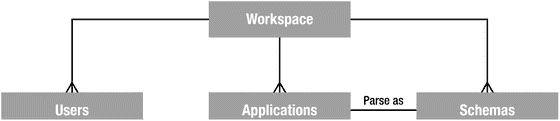

图 2-1. 工作区的逻辑构成

一个工作区可能包含：

*   一个到多个用户：这些用户可能是三种类型之一：管理员、开发者或最终用户。
*   零个到多个应用程序：应用程序可以从打包应用程序列表中添加、导入或从头开始创建。
*   一个到多个方案：虽然工作区在创建时必须分配至少一个方案，但实例管理员可以为一个工作区分配多个方案。

一个工作区中可以有多个应用程序和多个方案，但一个应用程序只能解析为一个（且仅一个）方案，这个方案只能在开发期间设置。接下来的部分将更深入地探讨这一点，让您全面理解这些概念之间的关系。

### APEX 用户

要登录 APEX 工作区，您必须拥有一个有效的 APEX 用户访问权限。系统提供了多种不同的用户角色，它们决定了您登录后可以执行的操作。具体角色如下：

*   **实例管理员**是特殊用户，负责管理和维护整个 APEX 实例。他们可以设置实例级别的首选项和消息、创建和管理工作区、监控空间利用率，以及执行与整个 APEX 安装相关的许多其他操作。实例管理员只能登录特殊的`INTERNAL`工作区，该工作区包含 APEX 管理服务应用程序。
*   **工作区管理员**负责管理工作区的具体细节，可以管理与该工作区相关的用户账户、监控工作区活动、查看日志文件、覆盖开发人员的锁定和设置等。尽管不是好的实践，但工作区管理员也可以充当开发人员的角色，创建和修改应用程序。
*   **开发人员**是创建和编辑工作区中应用程序的用户。他们可以访问分配给工作区的模式中的底层表，并可以创建和修改数据库对象以及存储的 PL/SQL 单元。大多数编写 APEX 应用程序的人只需要此级别的访问权限。
*   **终端用户**只能运行工作区中的应用程序。他们无法直接访问任何底层数据库对象，也无法访问任何 APEX 开发模块。终端用户不能直接登录工作区。

除了 APEX 实例管理员外，在默认安装中，APEX 用户是特定于且唯一于某个工作区的，这意味着您可以在单个 APEX 实例的多个工作区中拥有同名用户，但这些用户中的每一个都是唯一的。他们可以有自己的密码和设置，并且彼此之间没有任何关联。

APEX 5.0 引入了使用外部存储库（如单点登录或 LDAP）作为来源来分配和验证 APEX 用户的能力，这意味着单个用户可以访问多个工作区。但是，此功能默认未设置，需要实例管理员进行配置。

在开发时，您应该养成以开发人员身份登录的习惯，而不是以工作区管理员身份登录。系统提供了多种保护措施来防止开发人员在工作区中相互干扰。如果您以工作区管理员身份登录，这些保护措施将被绕过，您可能会意外干扰他人正在处理的内容。虽然这在只有单个开发人员的工作区中不是问题，但养成这种习惯仍然是好的。

**注意**

本书使用最后三种类型的用户。它假设 APEX 已安装，工作区已创建，并且您已获得工作区管理员的登录凭据。如果您使用的是 `apex.oracle.com` 上的托管实例，那么您在注册时获得的用户名就具有工作区管理员的凭据。但是，如果您使用的是本地实例，请参考 APEX 文档或让您的实例管理员帮助您设置工作区。

### 应用程序、页面、区域和项目

尽管工作区基本上从空开始，但您可以拥有多个驻留在工作区中的应用程序。没有特定的规则，但工作区中的所有应用程序很可能有一些共同点：它们可能都使用相同的底层数据库对象，针对相同的用户社区，或使用相同的用户认证方法。

在构建应用程序时，您会添加新页面，并使用区域和项目构建这些页面。图 2-2 显示了不同类型对象之间的层次结构。

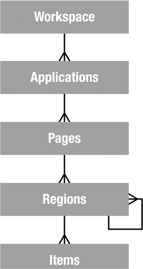

图 2-2. 通用应用程序层次结构

应用程序基本上是执行与业务功能相关的一个任务（或一组任务）的页面组。在本书的过程中，您将在单个工作区中构建一个应用程序，但重要的是要知道，在典型的开发环境中，您可能会在多个工作区中处理许多应用程序。

页面是应用程序的基本构建块，包含用户界面（UI）组件和处理用户输入的程序逻辑。我们稍后将介绍 UI 渲染与用户输入处理的区别，但现在可以将页面大致等同于桌面 UI 术语中的屏幕。

区域是充当内容容器的 UI 项。一个页面上可以有任意数量的区域，并且区域可以嵌套在其他区域中。这为您提供了创建诸如仪表板之类的东西的机会，您可能会将一个数据报告区域和一个图表区域嵌套在单个父级`HTML`区域中。

项目是用于向用户呈现 UI 的 HTML 表单元素。这些包括诸如按钮、选择列表、文本字段、复选框、单选按钮组等。项目分为两类：页面级项目和应用程序级项目的区别在于，后者是在应用程序级别定义的，并不直接呈现在页面上。您可以将它们视为全局变量。页面级项目是在特定页面上定义的，并分配给某个区域以控制它们在用户界面上的显示位置和方式。

应用程序显然远不止这些简单的构建块，但如果您理解它们之间的基本层次关系，那么在构建您的第一个页面时将有一个良好的开端，并在执行更复杂的任务时打下坚实的基础。


## 工作区、应用与模式

虽然工作区与应用之间的关系很直接，但当你引入数据库**模式**（schema）的关系时，情况就变得稍微复杂一些。图 2-3 展示了这种关系。

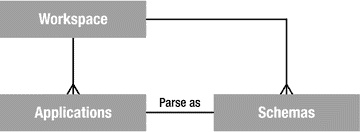

图 2-3. 模式如何与工作区及应用关联

当创建一个工作区时，它至少与一个（也可能多个）底层数据库模式相关联。这使得应用能够访问数据库对象，如表、视图、存储的 PL/SQL 程序单元等。

当创建一个应用时，它会被分配一个来自该工作区关联模式列表中的单一“解析模式（parse as schema）”。所谓“解析模式”，是指该应用执行的所有 SQL 查询和 PL/SQL 调用都在该 Oracle 数据库用户下运行。因此，如果你的应用定义的“解析模式”是 `DOUG`，那么像这样的查询：

```sql
select * from emp
```

在数据库中的执行效果等同于：

```sql
select * from DOUG.emp
```

因为 APEX 应用是可移植的，并且不一定在与开发时相同的模式中运行，所以将模式名硬编码到你的 SQL 或 PL/SQL 中不是好的实践。相反，APEX 提供了一个替换变量（本书后续会介绍多个此类变量）来代表“解析模式”。`#OWNER#` 替换变量会在运行时被替换为应用实际的“解析模式”。因此，语句：

```sql
select * from #OWNER#.emp
```

会解析为：

```sql
select * from DOUG.emp
```

在最常见的实现中，一个工作区被创建并关联到一个单一的底层数据库模式。在该工作区中开发的应用，其“解析模式”被设置为该工作区唯一关联的模式，并使用属于该模式的数据库对象。

如果一个工作区被分配了多个模式，情况就会变得有些复杂。你可能会想当然地认为，如果你将三个模式关联到一个工作区，该工作区中的任何应用都能自动访问这三个模式中的数据。然而，这种想法是错误的。

因为一个应用只被分配一个（且仅有一个）“解析模式”，所有的 SQL 语句和 PL/SQL 调用都作为该模式执行。尽管工作区可能与多个模式相关联，但应用本身并非如此。如果你想访问应用“解析模式”之外的模式中的数据，你必须确保在数据库级别授予了正确的权限，就像使用任何其他 Oracle 工具或开发环境时一样。

看一下图 2-4 所示的例子，其中你希望在 SQL 语句中连接的两个表分别属于不同的模式。

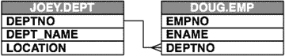

图 2-4. 跨模式连接表

如果你的“解析模式”是 `DOUG`，那么你必须被明确授予对 `JOEY` 模式中对象的访问权限。为此，你需要以 `JOEY`（或 DBA）身份登录数据库，并将对 `JOEY.DEPT` 的适当数据库权限授予 `DOUG`。

在此例中，如果你需要在 `select` 语句中连接这两个表，授予 `DOUG` 对 `JOEY.DEPT` 的 `SELECT` 权限就足够了。然后，你可以这样编写你的 `select` 语句：

```sql
select e.empno,
e.ename,
d.dept_name,
d.location
from #OWNER#.emp e,
JOEY.dept d
where e.deptno = d.deptno
```

`#OWNER#` 替换变量将被解析为你的“解析模式”（`DOUG`），只要正确的权限已到位，这个连接就能正确工作。

**注意**

因为允许从 `JOEY` 模式进行 `select` 的权限是在数据库级别设置的，所以没有必要将 `JOEY` 模式关联到你的工作区。你只需要在一种情况下需要将模式关联到工作区：要么你将它用作该工作区中应用的“解析模式”，要么你需要从 SQL 工作坊直接访问该模式的对象。

### 关于工作区的最后一点

如你所知，一个 APEX 实例可以有多个工作区。但应该有多少个工作区呢？答案并不简单。

除非你是一个应用非常少的小型组织，否则你可能不应该只有一个工作区。另一方面，你也不应该为你编码的每一个新应用都创建一个新的工作区。

对此有几种不同的看法，但我倾向于从应用套件的角度来思考。如果一些应用针对相同的数据集执行类似的任务，并且面向相同的目标用户群，那么将它们放在同一个工作区中可能会更好。

关键在于运用你的判断力，努力使开发和维护变得简单。没有什么比登录一个工作区后，发现你不得不翻阅数十甚至数百个应用才能找到你要处理的那个更糟糕的了。

## APEX 模块概览

现在你已经了解了逻辑架构的基本情况，是时候更近距离地看看 APEX 开发环境了。本节将向你介绍 APEX 环境的不同部分，并概述其布局。

图 2-5 展示了 APEX 菜单结构的层次布局。稍后，你将看到每个主要部分并了解其内部机制；这只是一个介绍性的概览。在我们逐步学习开发流程的过程中，你会更深入地了解它。

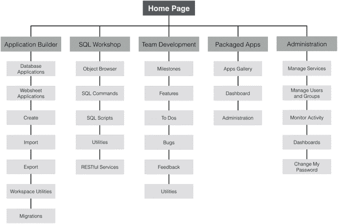

图 2-5. APEX 5.0 层次化菜单结构

如你所见，开发环境分为五个主要部分：

*   **应用构建器（Application Builder）** 是你创建和修改应用及页面的地方，很可能也是你花费大部分时间的地方。
*   **SQL 工作坊（SQL Workshop）** 是你直接处理底层数据库对象及其相关数据的地方。可以把它看作是一个基于网页的 SQL*PLUS，并加入了一些图形用户界面功能以使事情更容易。
*   **团队开发（Team Development）** 这个部分让你可以输入和跟踪与 APEX 应用开发相关的信息。
*   **打包应用（Packaged Apps）** 提供了一种安装和管理 Oracle APEX 自带的大量应用程序的方法。其中许多应用程序可以开箱即用，以解决实际的业务问题。其他的则仅仅是示例应用程序，用于帮助展示 APEX 的功能。
*   **管理（Administration）** 是你可以管理工作区细节的地方——其默认设置、用户、组等等。请注意，工作区管理员比普通开发者拥有更多可用的选项。


### 主页

一旦登录到你的工作区，你就会看到如图 2-6 所示的**工作区主页**。主页是你通往开发环境中其他部分的门户，并提供了一些关于工作区动态的高层次信息。

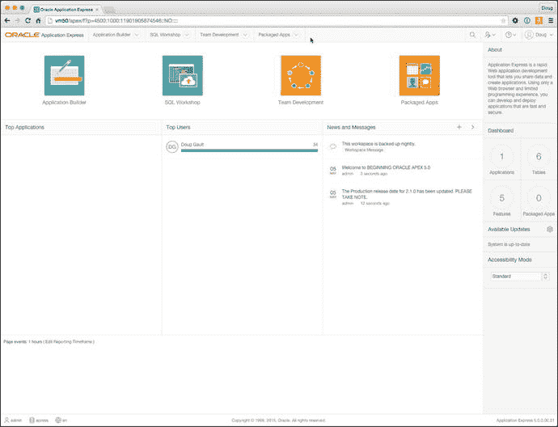
*图 2-6. APEX 开发主屏幕*

页面顶部是导航栏，其中包含你在整个开发人员界面中可用的主要导航结构。它提供了对你在开发应用程序时需要快速访问的许多部分的直接访问。值得注意的是，菜单栏的每个主要选项都分为两部分。例如，如果你直接点击`应用程序构建器`项，你会立即被带到`应用程序构建器`主页。但是，如果你点击其右侧的小向下箭头，则会显示一个更详细的下拉菜单，让你可以更细致地选择目的地，如图 2-7 所示。

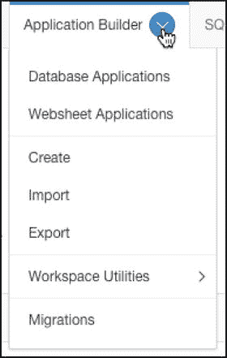
*图 2-7. 使用菜单栏上的下拉菜单*

在导航栏的右侧，是一组图标表示的菜单选项，如图 2-8 所示。


*图 2-8. 导航栏右侧的图标*

第一个是搜索图标，点击后允许你执行上下文相关的搜索。搜索的上下文取决于你在`应用程序构建器`中的位置。例如，如果你在工作区主页上，你的搜索范围是整个工作区。但是，如果你在`应用程序构建器`或`管理`部分，搜索将被限制在那些特定区域。

第二个是`管理`菜单。无论你是`工作区管理员`还是`开发人员`，此菜单都对你可用。区别在于你能访问哪些功能。`开发人员`可以监控工作区的某些活动区域并访问仪表板，而`工作区管理员`则可以完全访问所有功能，包括用户维护和服务请求。

第三个是`帮助`菜单，它提供对在线文档、APEX 支持论坛、Oracle 技术网络站点的 APEX 部分以及一个`关于`部分的访问。

最后一个是当前登录用户的个人资料链接。在这里，用户可以编辑他们的详细信息、更新个人资料图片和更改密码。

在浏览器的最底部是一个信息区域，显示当前登录的用户、当前工作区、语言以及 Oracle APEX 的当前版本。

页面的其余部分要么用于提供指向四个主要部分的快速链接，要么为你提供有关工作区内正在发生什么的信息。从左到右的前两个区域显示工作区活动的概览。它们显示了工作区中的`热门应用程序`和`热门用户`。`新闻与消息`区域允许工作区中的开发人员输入他们希望工作区中其他人看到的信息。在一个新的工作区中，这些区域可能没有任何内容，但随着你按照本书学习，你会看到这种情况开始改变。

请注意，开发环境中每个部分的主页大多遵循这种仪表板风格的主页界面，一个显著的例外是`应用程序构建器`。让我们首先看看那个部分。

### 应用程序构建器

`应用程序构建器`是 APEX 应用程序开发环境的核心。你将使用`SQL 工作室`来操作底层数据库对象，而`应用程序构建器`则用于在编写、测试和调试应用程序时完成大部分实际工作。

#### 应用程序构建器主页

点击`应用程序构建器`菜单选项会带你进入`应用程序构建器`主页。与大多数主页一样，它的布局是顶部为菜单栏，右侧是包含任务和快速链接的区域。

主要区别在于`应用程序构建器`主页不包含任何仪表板风格的摘要。相反，这里是你看到工作区中包含的不同应用程序列表的地方。（图 2-9 提供了一个例子。）根据你的 APEX 实例设置，你可能会看到一些由`工作区管理员`安装的示例应用程序，但如果完全没有看到任何应用程序，也不必担心。

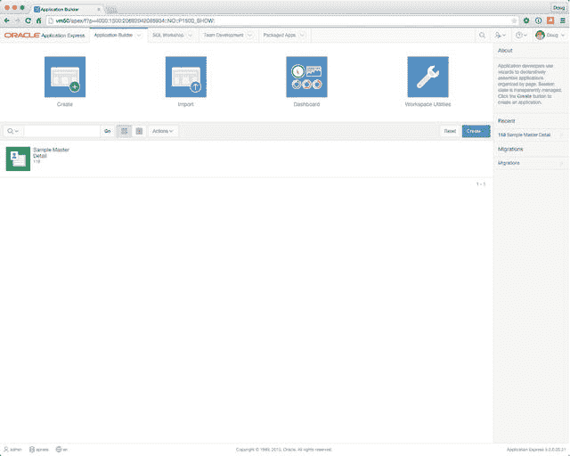
*图 2-9. 应用程序构建器主页*

图 2-9 显示了工作区中的一个应用程序，名为`Sample Master Detail`。但是，除了它的名称和应用程序 ID (118) 之外，没有太多关于它的信息。从这里你开始看到 APEX 的强大之处，不仅在开发者 UI 中，也在你的应用程序中。

你看到的应用程序列表实际上是一种称为`交互式报表(IR)`的报表样式。`IR` 允许我们自定义报表及其内容的显示方式。`IR` 在整个 APEX 开发界面中使用，也可以在创建你自己的应用程序时使用。它们是极其强大的工具，你会经常用到它们。

页面右侧有三个区域，显示`关于`信息、最近编辑的应用程序以及指向`应用程序迁移`向导的链接。你稍后会更多地处理这些；现在，我们将深入查看一个应用程序的详细信息。

#### 应用程序主页

点击列出的任何一个应用程序会深入到`应用程序`主页，如图 2-10 所示。此页面与`应用程序构建器`主页非常相似，但它显示了特定应用程序中的所有页面。同样，它使用了一个`IR`，因此你可以自定义查看此数据的方式。

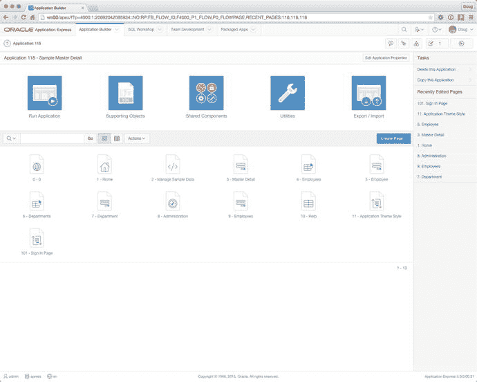
*图 2-10. 应用程序主页*

请注意页面的结构方式，与页面相关的任务和最近编辑的页面显示在页面右侧。当你在界面中导航时，这种布局将成为一个熟悉的主题。

从这里，你可以点击列出的任何页面，使用`页面设计器`编辑该页面。你还可以`运行`、`导出`和`导入`应用程序，编辑支持对象或共享组件，以及访问与应用程序相关的实用程序。


#### 页面设计器

页面设计器是您作为开发人员创建和编辑页面、区域和项目时将花费大部分时间的地方。APEX 5.0 中的页面设计器与之前的版本完全不同，现在呈现的方式更接近传统的桌面 IDE 布局。这一变化使我们能够从单一页面界面管理组件并编辑它们的布局和属性。

最大的变化之一是，由于采用了单页面界面，对页面的修改现在必须明确保存。虽然这可能看起来有些不便，但它实际上带来了一些有用的功能。例如，现在可以进行多项修改并一次性保存，从而可能减少开发时间。此外，未保存的修改现在可以轻松撤销。

另一个主要的省时功能是能够使用 `Shift+Click`（在 Mac 上为 `Cmd+Click`）选择页面上的多个组件。一旦选择了多个项目，您就可以在属性编辑器中编辑它们的共同属性。例如，如果您想编辑页面上所有按钮的属性，将它们的视觉属性设置为完全相同，这会非常有用。

随着拖放界面的引入，区域和项目的放置得到了增强。所有的渲染组件都可以轻松地在页面上放置或重新排列。

新页面设计器的布局相当深入，如果您不熟悉它，可能会有点令人困惑。本书后面的附录 A 将带您详细参观页面设计器及其组件，阐明将在本书其余部分使用的术语和命名规范。请花点时间翻阅附录 A，以熟悉这些术语和工具的位置。

我的目标是，在本书的剩余部分，通过一种能帮助您自然学习如何使用页面设计器的方式来引导您完成开发过程。然而，如果您在任何时候对某个指令感到困惑，或者忘记了某个特定工具的名称，参考附录 A 应该有助于您理清思路。

### SQL 工作坊

SQL 工作坊是一套工具，使开发人员能够查看和管理工作区所分配底层模式中的数据库对象。如图 2-11 所示的 SQL 工作坊主页，让您能够访问每个底层工具，并提供有关最近创建的对象和已运行命令的一些高层信息。

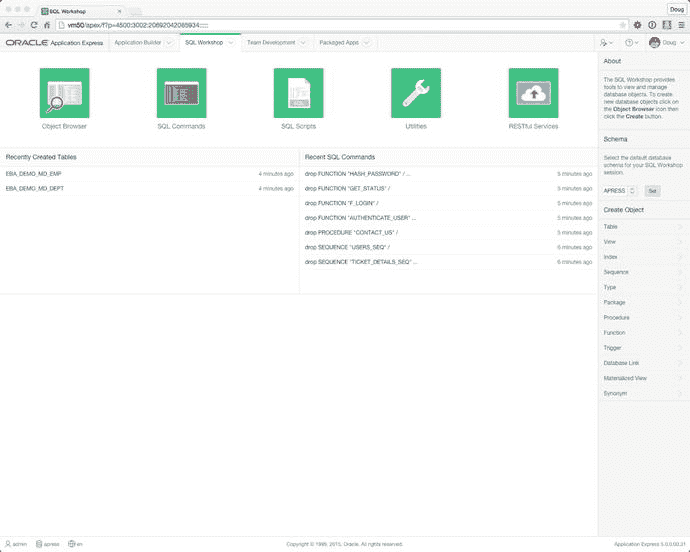

图 2-11.
SQL 工作坊主页

因为工作区可能分配了不止一个模式，右侧的模式选择对话框允许您选择并设置所有工具的默认模式。您也可以在每个工具中更改当前工作的模式。

页面顶部的工具栏显示了作为 SQL 工作坊一部分提供的主要工具。每个独立的工具都值得单独介绍，所以现在让我们花点时间看看它们是什么以及它们能做什么。当您为应用程序创建数据库对象时，会更多地使用 APEX 的这一部分。

#### 对象浏览器

如果您使用数据库有一段时间了，您可能用过一些流行的 GUI 工具来浏览和管理模式中的数据库对象。APEX 对象浏览器是一个非常相似的工具，通过您的 Web 浏览器呈现。图 2-12 显示了对象浏览器正被用来查看表 `EBA_DEMO_MD_DEPT`。

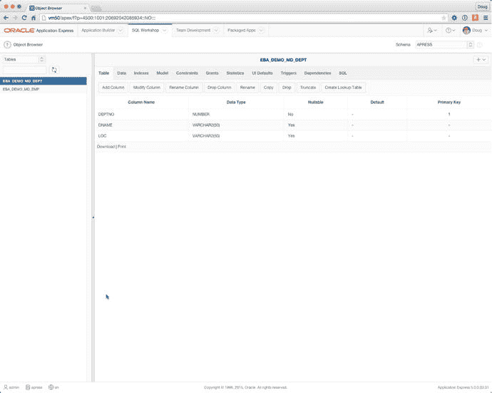

图 2-12.
APEX 对象浏览器

“对象浏览器”这个名称有些用词不当，因为该工具不仅可以用于浏览底层模式中的对象，还可以创建新对象、浏览和编辑数据、删除对象以及编辑对象定义。尽管它可以操作的对象类型存在一些限制，但它已经足够强大，可以完成应用程序开发人员需要处理的大多数日常任务。

您可以通过左上角的下拉列表选择要处理的对象类型。您可以在下面的搜索框中输入文本字符串，然后单击右侧的刷新图标来搜索选定的对象类型。单击对象的名称会显示其属性以及深入查看更多详细信息的链接。

虽然对象浏览器的界面相当直观，但有一些有趣的地方需要注意。右上角有一个下拉列表，允许您设置当前模式。该列表包含当前分配给工作区的所有模式。您只需从列表中选择一个新的模式即可在它们之间切换。

#### SQL 命令界面

SQL 命令界面允许您使用标准的 SQL 命令或 PL/SQL 与底层模式进行交互，就像在任何其他 GUI 工具或 SQL*Plus 中一样。不同之处在于您可以保存语句以供以后使用。图 2-13 显示了一个在 SQL 命令界面中执行的简单 SQL 语句。

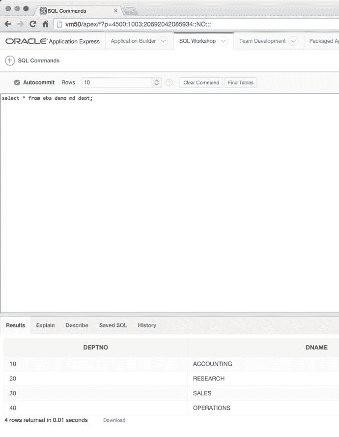

图 2-13.
SQL 命令界面

尽管其核心功能相当直接，但 SQL 命令界面比初看起来要强大得多。除了能够保存和检索 SQL 与 PL/SQL 外，它还可以对语句运行执行计划，并允许您查看语句历史记录。因此，如果您运行了一个特别有用的脚本或语句但忘记了保存，您仍然可以从历史缓冲区中检索它。

SQL 命令界面还与查询生成器（稍后描述）集成，允许您加载和操作在查询生成器中构建的已保存语句。

注意
默认情况下，通过 SQL 命令界面执行的所有 SQL 语句都会自动提交。要覆盖此设置并进入事务模式，请取消选中工具栏中的“自动提交”复选框。完成此操作后，您可以手动提交和回滚您的 SQL 语句。

没有办法永久关闭“自动提交”，因此每当您想进入事务模式时，都需要记得这样做。


#### SQL 脚本界面

SQL 脚本界面允许您管理和运行保存到脚本文件中的 SQL 命令集。单个脚本可以包含一个或多个 SQL 语句或 PL/SQL 块。在 APEX 外部编写的 SQL 脚本可以加载到 SQL 脚本存储库中，并在其中进行编辑或运行。您也可以使用 SQL 脚本界面从头开始创建 SQL 脚本。图 2-14 展示了主要的 SQL 脚本界面页面。

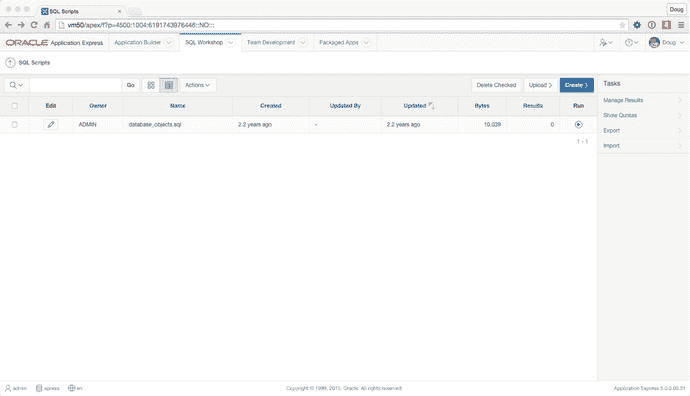

图 2-14. 主要的 SQL 脚本界面页面

在此示例中，一个名为`database_objects.sql`的脚本已加载到脚本存储库中。通过点击编辑图标，您可以编辑脚本内容，如图 2-15 所示。很有帮助的是，APEX 在脚本编辑器中提供了语法高亮显示。编辑器还具有查找和替换功能以及自动完成能力，还有撤销和重做功能。

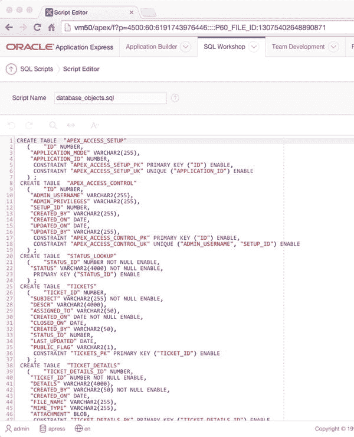

图 2-15. SQL 脚本编辑器

您也可以将脚本下载到本地文件，以便在您喜欢的本地文本编辑器中进行编辑。完成后，只需将其剪切并粘贴回编辑器，或作为新的脚本文件上传即可。

注意：当您将脚本文件上传到存储库时，脚本名称必须是唯一的。如果不先从脚本存储库中删除现有的同名脚本文件，您无法用一个新版本覆盖它。

一旦脚本准备好运行，您可以点击列表中的运行图标（或编辑器中的运行按钮），系统将引导您完成运行脚本向导。这允许您选择是立即运行脚本还是在后台运行。如果选择在后台运行，您的脚本将进入队列，并在到达队列前端时执行。

无论哪种方式，您都会被带到 SQL 脚本界面的“管理脚本结果”页面，如图 2-16 所示。此屏幕允许您查看脚本执行的状态和某些高级详细信息。对于以批处理模式提交的脚本，您还可以查看队列中特定脚本的状态。

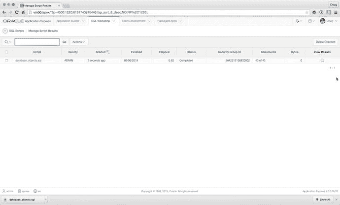

图 2-16. “管理脚本结果”页面

点击查看结果图标会显示运行脚本的最终结果。在图 2-17 中，您可以看到脚本存在错误，错误详情显示在报告正文中。如果脚本成功，则不会显示任何错误，并且页面底部的语句结果将显示零错误。

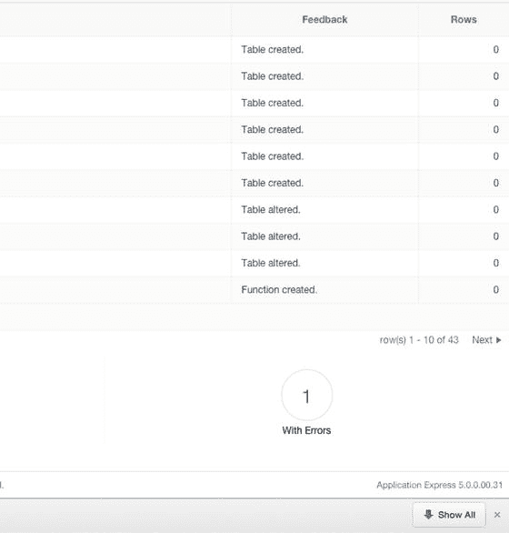

图 2-17. SQL 脚本界面错误示例

注意：尽管 SQL 命令和 SQL 脚本界面都能接受并运行标准 SQL 语句，但 SQL\*PLUS 的扩展命令在这些工具中无效。

SQL 命令界面在遇到任何 SQL\*PLUS 特定命令时会抛出错误。然而，SQL 脚本界面会在运行的脚本中存在 SQL\*PLUS 命令时警告用户，如果用户选择继续，则会忽略这些命令。因此，SQL 命令和 SQL 脚本界面无法执行许多扩展 SQL\*Plus 脚本的功能。

#### 查询构建器

尽管查询构建器已被归入“实用程序”页面，但因为它很有帮助，特别是对初学者而言，值得专门讨论。查询构建器允许您使用更具图形化的界面构建 SQL `select`语句，虽然不完全的拖放操作，但相当直观。

当您首次进入查询构建器时，会看到一个屏幕，其中列出了当前活动模式中所有可用的表和视图。图 2-18 显示了初始的查询构建器屏幕。

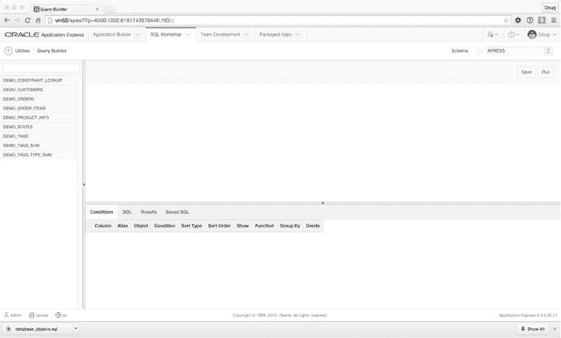

图 2-18. 初始的查询构建器屏幕

从这里，您可以开始构建查询。要将表包含在您的`select`语句中，只需点击左侧列表中的表。该表的表示形式将放置在“条件”区域上方的屏幕空白区域。您可以根据需要添加任意多的表到查询中，甚至可以通过再次点击来包含同一个表多次。请注意，如果包含同一个表的多个实例，新实例将附加一个序列号以区别于原始表。

图 2-19 展示了`DEMO_ORDERS`表的图形表示示例，并概述了不同的交互功能。

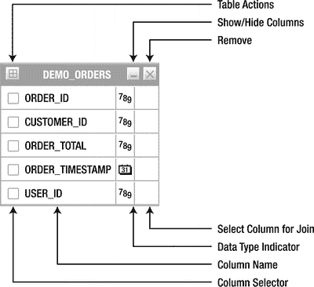

图 2-19. 查询构建器中表示的`DEMO_ORDERS`表

如图 2-19 所示，从上到下，这些操作区域如下：

*   **表操作**显示一个对话框，允许您执行以下操作之一：
    *   **全选**允许您快速选择或取消选择对象的所有列，以包含在正在构建的查询中。
    *   **添加父表**允许您根据外键关系选择并添加一个父表到查询构建器。
    *   **添加子表**允许您根据外键关系选择并添加一个子表到查询构建器。
*   **显示/隐藏列**用于展开和折叠对象，从而显示或隐藏列定义。
*   **删除**从`select`语句中删除该表及其任何相关子句。
*   **选择连接列**通过点击列名旁边的空白方块激活。这样做会使方块变暗，并将查询构建器置于表链接模式。然后您可以点击另一个空白方块（在另一个表或同一个表中），查询构建器将在两个列之间插入一个`EQUALITY where`子句到 SQL 语句中。
*   **数据类型指示器**指示列的数据类型，例如`number`、`character`、`date`等。
*   **列名**指示在表描述中定义的列名。
*   **列选择器**允许您单独选择或取消选择要包含在 SQL 语句中进行处理的列。这也可以包括您想在`where`子句中使用但不在 SQL 语句输出中显示的列。基本规则是，您需要选择所有要显示的列，但不一定必须显示所有您选择的列。

当您添加并连接表以及选择要操作的列时，屏幕底部的区域开始变化。该区域细分为几个选项卡，如下所示：


#### 实用工具

*   **条件**选项卡为上方区域选择的每个列显示一行，并允许您进一步定义其属性。（此功能稍后将详细介绍。）
*   **SQL**选项卡显示向导正在构建的 SQL 语句。虽然它不能直接编辑，但您可以从此处轻松高亮显示该语句并将其复制到剪贴板。
*   **结果**选项卡显示运行 SQL 语句的结果，并允许您以 CSV 格式下载结果数据。
*   **已保存的 SQL**选项卡允许您保存、调用和管理使用查询生成器构建的语句。其中还包含筛选器，可用于搜索和限制显示哪些已保存的查询。

除了**条件**选项卡外，其余都一目了然，因此让我们更详细地介绍这个选项卡。图 2-20 展示了一个双表连接的示例，并选择了五个列进行操作。

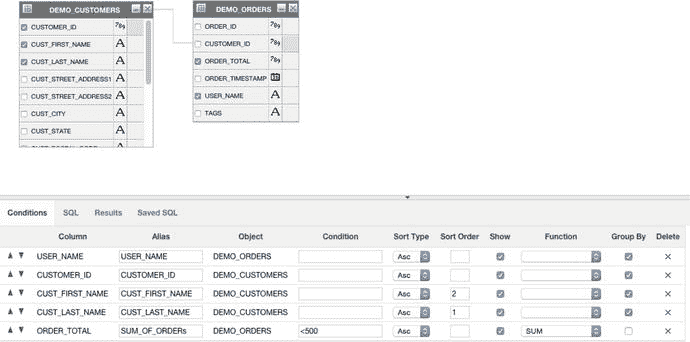

图 2-20. 一个双表连接示例

在此示例中，已对查询应用了以下修改：

*   将`ORDER_TOTAL`列的别名更改为`SUM_OF_ORDERS`
*   将结果集限制为仅包含`ORDER_TOTAL`小于 500 的记录
*   按`CUST_LAST_NAME`、`CUST_FIRST_NAME`升序对返回的记录排序
*   对`ORDER_TOTAL`列执行`SUM`函数
*   按`USER_NAME`、`CUSTOMER_ID`、`CUST_FIRST_NAME`、`CUST_LAST_NAME`对查询进行分组

根据列选择以及在**条件**选项卡中引入的限制和更改，SQL 语句（如在**SQL**选项卡中显示）如下所示：

```sql
select DEMO_ORDERS.USER_NAME as USER_NAME,
DEMO_CUSTOMERS.CUSTOMER_ID as CUSTOMER_ID,
DEMO_CUSTOMERS.CUST_FIRST_NAME as CUST_FIRST_NAME,
DEMO_CUSTOMERS.CUST_LAST_NAME as CUST_LAST_NAME,
sum(DEMO_ORDERS.ORDER_TOTAL) as "SUM_OF_ORDERs"
from DEMO_ORDERS DEMO_ORDERS,
DEMO_CUSTOMERS DEMO_CUSTOMERS
where DEMO_CUSTOMERS.CUSTOMER_ID=DEMO_ORDERS.CUSTOMER_ID
and DEMO_ORDERS.ORDER_TOTAL <500
group by DEMO_ORDERS.USER_NAME,
DEMO_CUSTOMERS.CUSTOMER_ID,
DEMO_CUSTOMERS.CUST_FIRST_NAME,
DEMO_CUSTOMERS.CUST_LAST_NAME
order by DEMO_CUSTOMERS.CUST_LAST_NAME ASC,
DEMO_CUSTOMERS.CUST_FIRST_NAME ASC
```

虽然查询生成器非常有用，并允许您使用简单的 GUI 快速组合出基本查询，但它确实有其局限性，例如嵌套子查询和复杂的联合查询。我们可以使用查询生成器来定义查询的骨架；然后，我们可以将查询带到 SQL 命令窗口或 SQL IDE 中，并从那里进行微调。

最后值得一提的是，查询生成器在 APEX 的多个地方都有链接，因此，每当需要您提供 SQL 语句时（例如，作为报表的基础），您都可以在弹出窗口中打开查询生成器，并将查询返回给调用表单。

### 打包应用程序

**打包应用程序**部分是您将安装和管理随 APEX 发行版捆绑的应用程序的地方。主页面如图 2-22 所示，显示了打包应用程序的主页。从这里您可以看到已安装了哪些应用程序，并可以导航到三个子部分。

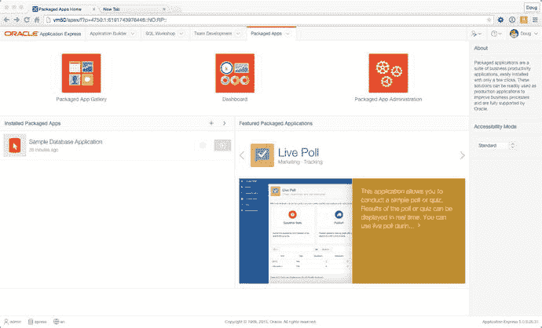

图 2-22. 打包应用程序主页


#### 打包应用画廊

打包应用画廊展示了随`APEX`发行版捆绑提供的所有应用程序。共有 35 个独立的打包应用，它们可归属于多个不同类别，包括软件开发、跟踪、团队生产力、营销、知识管理、IT 管理、项目管理、示例应用程序和示例工作表。

点击某个应用程序的图标，将带你进入该应用程序的详细信息页面。在这里，你将能看到应用程序的截图、阅读其完整描述并查看版本信息，如图 2-23 所示。

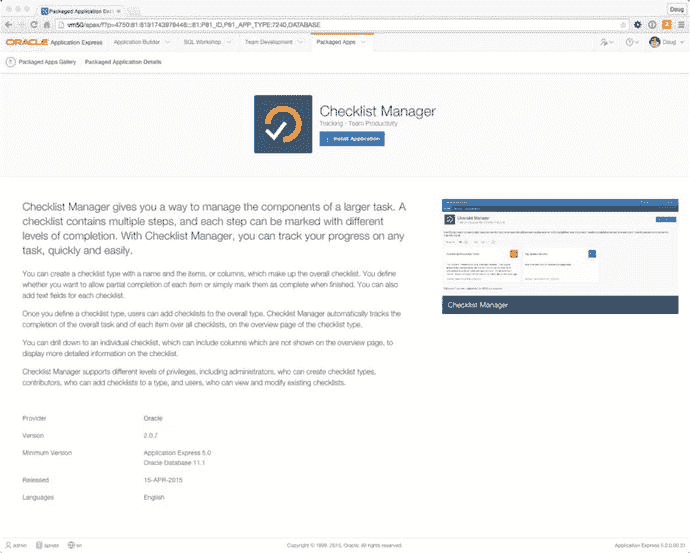
图 2-23. 清单管理器打包应用信息页面

点击`Install Application`（安装应用）按钮，将引导你完成在当前工作区中安装所选应用程序的过程。一个弹出式安装向导将让你选择身份验证方法，通常默认为`Application Express Accounts`（应用程序快速帐户）。点击向导中最后的`Install Application`按钮，将安装该应用程序及其所有支持对象，包括任何必需的数据库对象。安装完成后，你将被带回到应用程序的信息页面，如图 2-24 所示，你会看到应用程序已成功安装，并会获得管理和运行该应用程序的选项。


图 2-24. 查看清单管理器应用已成功安装

关于打包应用程序，有几件事你应该了解：

*   任何名称中包含“Sample”（示例）的应用程序都是为了演示`APEX`中可用的功能，因此默认将以未锁定状态安装。这意味着开发者将能够编辑该应用程序，并查看`APEX`团队是如何开发该应用的。
*   名称中不包含“Sample”的应用程序是作为生产就绪版本提供的，将以锁定状态安装，不允许任何编辑，直到该应用被明确解锁。这可以通过`Manage`（管理）按钮完成，如图 2-24 所示。任何已安装并保持锁定的此类应用程序，在生产环境中均得到 Oracle 的完全支持。这些锁定的应用程序也可以升级到未来`APEX`版本可能附带的更当前版本。一旦你解锁它们，Oracle 的所有支持即告终止，可升级性失效，并且无法重新锁定应用程序。
*   所有打包应用程序都安装到工作区默认的“解析为”模式中。目前，没有直接的方法将它们安装到次要的“解析为”模式中，除非先解锁并导出应用程序，从而使其失去任何支持。

尽管示例应用是作为学习辅助工具编写的，但从许多生产就绪的应用程序中同样能学到很多东西。我衷心建议你读完本书后的第一个行动，就是去看看一些打包应用程序的内部工作原理。

#### 打包应用仪表板

如图 2-25 所示，仪表板页面展示了当前工作区中打包应用程序的使用情况概览。你会看到可用应用的总数、已安装的数量，以及是否有可升级的应用程序。你还能看到是谁安装了这些应用以及它们的使用频率。

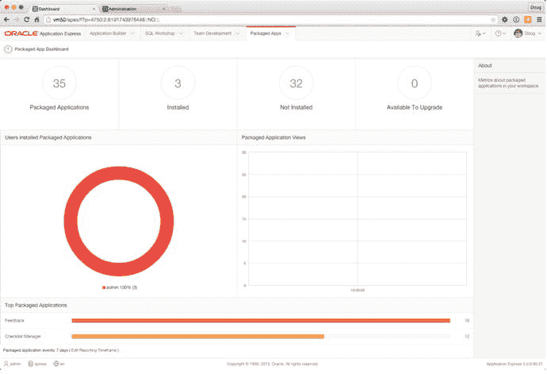
图 2-25. 打包应用仪表板

#### 打包应用管理

打包应用管理页面提供了一系列专门与安装在当前工作区中的打包应用程序相关的管理任务列表。如果你以开发者身份登录，只会看到与管理`Interactive Report`（交互式报表）设置和`Activity reports`（活动报告）相关的选项。但是，当你以工作区管理员身份登录时，会看到一个名为`Manage Services`（管理服务）的部分，其中展示了完整管理部分中对你可用功能的一小部分。

### 管理与团队开发

UI 的最后两个功能区域，管理与团队开发，其复杂程度足以独立成章。因此，我们建议你参考深入介绍这些领域的章节。第 10 章涵盖应用程序的部署，第 14 章是关于管理工作区的，而第 15 章则讲解团队开发。

在本书中，你会接触到各种管理任务，因此如果你希望在开始前对管理有全面的了解，应该绕道先阅读这些章节以打好基础。然而，如果你准备好边做边学，那么就进入下一章，在那里你将开始真正的编程。

## 总结

`APEX`的架构起初可能看起来有点令人生畏，但一旦你真正开始使用它，事情就会变得井然有序，你会越来越理解各个部分是如何组合在一起的。如果你从本章只带走一样东西，那就是：工作区本质上是你的开发沙盒。你所做的一切都发生在工作区的上下文中。其他所有事情——从开发的角度来看——与任何其他开发环境非常相似。你要构建一个新应用程序？那么它需要在工作区中创建。你需要访问一个模式来构建那个应用？那么它需要被分配到你的工作区。你明白这个道理了。现在，开始有趣的部分吧！

