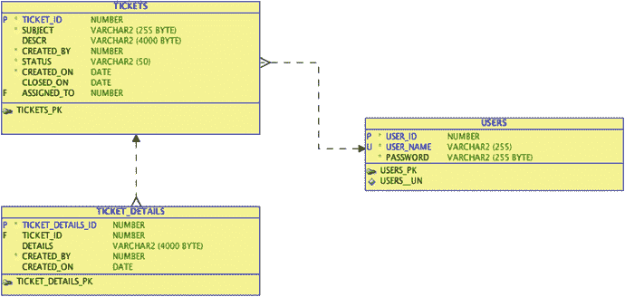

# 从未有白纸一张

如今，几乎没有任何计算机系统是从零开始构建的。几乎总会存在一些已有基础，哪怕只是一些松散的指导方针或想法。

在这个例子中，假设你的公司有一个非常基础的系统，但它已不再能满足你不断增长的用户群体的需求。你的目标是创建一个新的系统，使记录问题及其解决方案的过程对所有相关人员来说都更加容易；然而，要做到这一点，你必须理解用户的需求以及当前在用系统的功能。

## 一个破损的系统

一般来说，帮助台系统的用户可以分为两类：记录问题的人（最终用户）和帮助解决问题的人（技术人员）。根据你所属的用户群体不同，你的需求可能也不同，但总的来说，系统应该帮助最终用户和技术人员就问题或事项进行沟通。

第一步是了解你的帮助台当前是如何管理的，以及它为何不起作用。与技术人员和最终用户交谈都能提供大量信息，但挑战在于，这些信息通常以对当前系统的抱怨形式呈现。

询问最终用户会发现，他们的主要抱怨是他们永远不知道自己所提交问题的进度状态。他们可能几天，甚至几周都收不到技术人员的回复，在用户看来，没有回复就意味着没有人处理他们的问题。另一个用户抱怨是帮助台技术人员通常不知道如何联系他们，以提出进一步问题或沟通进展。

在问题的另一端，技术人员则不堪重负。工单信息保存在一个 Excel 电子表格中。最初，帮助台只有一个人，但现在有好几名技术人员独立工作。在执行日常工作的同时，每个人都需要在分配给他们的工单信息中更新电子表格。访问单个电子表格的人数不断增加导致了问题，因为任何时候都只有一个人能打开并更新该电子表格。技术人员也厌倦了用户不断打电话来询问他们问题状态的最新情况。

显然，这个系统已经失效。用户和技术人员都对现状不满意。你的工作就是从这些谈话中收集信息，并设计出一个能满足两个用户群体需求的东西。

## 你如何修复问题？

利用目前收集到的信息，你现在可以定义一些初步的需求，并按用户类型进行分解，以便更清晰地了解每个群体需要什么。然后，根据这些需求，你可以开始思考需要创建什么样的数据库设计来支持它们。

### 定义需求

你可以从两个角度来看待需求。最终用户有一套需求，技术人员有另一套。有些需求在两个群体之间是重叠的，而另一些则是某个群体所特有的。

最终用户应该能够

*   创建一个概述他们问题的新工单
*   查看工单的状态和进度

技术人员应该能够

*   轻松识别和查看新工单
*   轻松识别哪些工单是直接分配给自己的
*   搜索现有工单
*   代表最终用户创建新工单
*   将工单分配给其他技术人员
*   向工单添加详情（评论、信息和附件）
*   更新工单状态

尽管你可以考虑得更远，但这些需求已经构成了一个相当完整的帮助台系统的基础。当你以后更清楚用户和公司可能还需要什么时，你随时可以为其添加功能。

### 推断数据库设计

明确了需求之后，你就可以开始推断需要创建哪些数据库对象来存储数据。如果你是数据库设计的新手，这里有一个快速技巧可以帮助你识别需要为之建表的实体：回顾你的需求，寻找代表你需要跟踪的最高层级对象的具体名词。当你找到这些名词时，试着判断它们是否确实处于最高层级，或者它们是否只是某个更大事物的属性。

如果你按照这个过程来处理你的简要需求规格说明，名词 `用户` 和 `工单` 就凸显出来，成为你想要跟踪的两个主要对象。很容易想把用户分成两个不同的集合——技术人员和最终用户——但用户类型仅仅是用户的一个属性。

一个较难识别的对象是 `工单详情`。认为它仅仅是 `工单` 的一个属性是完全合理的；然而，线索在于这样一个事实：你无法具体确定任何给定的 `工单` 会有多少条 `工单详情` 条目。这个数字未知的事实表明，你应该创建一个作为 `工单` 实体子级的表，称为 `工单详情`。这样，你就可以根据需要输入任意多条详情记录。

因此，你已经识别出了三个主要实体：`用户`、`工单` 和 `工单详情`。你现在需要考虑每个实体的属性以及它们将包含的数据类型。通过回顾需求陈述、与技术人员讨论他们当前跟踪的信息，以及思考在解决问题过程中你希望跟踪哪些类型的信息，你可以识别出你对象的一系列属性。表 3-1 到 3-3 展示了这些属性。

表 3-3. `工单详情` 属性

| 属性名称 | 数据类型 | 注释 |
| --- | --- | --- |
| `工单详情 ID` | 数字 | 标识此详情条目的唯一方式 |
| `工单 ID` | 数字 | 此详情链接到的工单 |
| `详情` | 文本 | 技术人员输入的任何详情的文本描述 |
| `创建者` | 文本 | 记录此工单的用户 |
| `创建时间` | 日期 | 用户创建工单的日期 |

表 3-2. `工单` 属性

| 属性名称 | 数据类型 | 注释 |
| --- | --- | --- |
| `工单 ID` | 数字 | 标识工单的唯一方式 |
| `主题` | 文本 | 问题的简短一行陈述 |
| `描述` | 文本 | 问题的详细描述 |
| `状态` | 文本 | 工单在处理过程中的状态（`打开`、`待处理`、`已关闭`等） |
| `创建者` | 文本 | 记录此工单的用户 |
| `创建时间` | 日期 | 用户创建工单的日期 |
| `关闭时间` | 日期 | 工单被关闭的日期 |
| `分配给` | 文本 | 被指派处理此工单的技术人员 |

表 3-1. `用户` 属性

| 属性名称 | 数据类型 | 注释 |
| --- | --- | --- |
| `用户 ID` | 数字 | 每个用户的唯一 ID |
| `用户名` | 文本 | 每个用户的登录 ID |
| `密码` | 文本 | 用于登录系统的密码 |

尽管尽早尝试做到尽可能详细是好事，但你在这里不必追求完美。当你识别出其他潜在属性时，你随时可以返回并修改或扩展你希望捕获的数据。

## 以 APEX 为核心进行系统设计

由于 APEX 不仅存在于 Oracle 数据库之上，而且其本身就是构建于 Oracle 数据库之中，你可能会认为为 APEX 设计数据库对象与为任何其他使用 Oracle 作为数据存储的系统进行设计是一样的——在某些方面你确实是对的。然而，在为 APEX 系统进行设计时，肯定有一些你需要理解的要点，这将使你的工作轻松得多。

你在 APEX 中所做的大部分工作，至少在初始阶段，都是通过一系列向导完成的。如果数据库对象的设计考虑了 APEX 的需求，向导将为你完成更多的工作；因此，你将需要手动进行的微调工作就会大大减少。以下部分将讨论最重要的设计考量因素，以及它们如何影响向导为你所做的工作。

### 表定义与用户界面默认设置

稍后你会更详细地看到的一个领域是用户界面默认设置（`UI 默认设置`）。重要的是要知道，当你使用 `UI 默认设置` 时，某些表属性会被转化为在 APEX 中通用的默认设置。以下是你在表级别可以执行的一些影响更深远的操作，以帮助使 `UI 默认设置` 更有用：

*   在表列上添加注释，会将该注释文本作为该项的 `UI 默认设置` 帮助文本。
*   在数据库级别将列标记为 `NOT NULL`，会触发在 `UI 默认设置` 中设置 `必填` 标志。
*   `Date` 和 `Timestamp` 数据类型被设置为在输入表单上显示为日期选择器。
*   列在表中出现的顺序，就是 `UI 默认设置` 在表单或报表上显示它们的默认顺序。
*   将列定义为 `BLOB` 会设置表单级别的 `UI 默认设置` 以使用 APEX 声明式的 `BLOB` 功能。

你将在后面的章节中设置和修改 `UI 默认设置`，以便亲眼看到设计决策如何影响它们的设置方式。

### APEX 与主键

APEX 的设计旨在充分利用不超过两列的、基于序列的代理主键。虽然你仍然可以在使用多列自然键的表结构上使用 APEX，但如果你按照 APEX 的偏好进行设计，过程会容易得多，并且你能获得更多的开箱即用功能。

多年来我使用过许多实现了多列自然键的系统，我也成功地在这些类型的数据结构之上实施了 APEX 系统。然而，我最终不得不手动编写逻辑，而如果这些结构使用的是单列或双列代理主键，APEX 本可以免费提供这些逻辑。

在 APEX 4 中，引入了使用 `ROWID` 代替主键的功能，以帮助解决多列主键的问题。此功能通过使用 `ROWID` 作为主键，提供了一种绕过 APEX 双列主键限制的方法。

尽管以这种方式使用 `ROWID` 在技术和语法上是正确的，但当从头开始构建 APEX 应用程序时，使用基于数据库序列（Oracle 11g 及以下版本）并由数据库触发器或标识列（Oracle 12c）分配的单列代理主键仍然被认为是最佳实践。

以 `TICKET` 表为例，工单的 ID 只是一个用于唯一标识一张工单的任意数据。因此，它很容易符合代理主键的范畴。即使帮助台技术人员当前使用的电子表格已经为工单分配了 ID，你也可以加载这些值，并让序列从一个高于当前最高 `TICKET ID` 的数值开始计数。`TICKET DETAILS` 表也是如此。即使在 `USER` 表中，你有一个唯一的、单列的自然键（用户名），实现一个代理主键也是有益的，以便能够利用 APEX 内置的代码路径。

### 业务逻辑与用户界面逻辑

由于 APEX 主要用 PL/SQL 编写，它充分利用了 PL/SQL 提供的一切功能。APEX 开发团队彻底利用了存储的 PL/SQL 程序单元来实现他们的业务逻辑，你可以从他们身上学到重要的一课。

虽然首先在 APEX 内部将业务逻辑编写为匿名 PL/SQL 块进行原型设计，可以说是一种有效的开发方法，但长期将其留在那里是愚蠢的。通过将其移出到存储程序单元中，你会在多个方面获益。

一个非常重要的收获是在性能领域。匿名 PL/SQL 块以未编译的 PL/SQL 代码形式存储在 APEX 元数据中。每次需要运行时，它们必须首先从 APEX 元数据中提取、解析、编译，然后运行。如果相关的 PL/SQL 是每天有数千甚至数十万次点击的页面的一部分，这个过程会带来相当大的开销。如果你将该代码移入数据库中的存储程序单元，则提取、解析和编译步骤都可以跳过，代码将直接运行。

另一个好处是可重用性。如果相同的逻辑在多个地方使用，它可以简单地被调用，而不是在两个匿名块中重复。因此，对业务逻辑的任何更改只需在一个地方进行。另一个可重用性的好处可能出现在多个系统（其中一些是非 APEX 系统）需要访问相同的业务逻辑时。当存储在 PL/SQL 程序单元中时，调用系统是 APEX、.NET、Java 还是 PHP 都无关紧要——它们都可以使用相同的逻辑。

最后，通过将业务逻辑代码移入存储程序单元，你获得了在 APEX 的限制之外使用你最喜欢的 PL/SQL 编码工具来编写、调试和测试这些程序单元的能力。然而，并非所有代码都需要移出到数据库中。管理和操作页面上项目的用户界面逻辑，例如计算、验证和过程，通常最好作为页面的一部分保留。这样的逻辑通常非常页面特定且占用空间很小，将其移出到数据库所带来的收益不值得付出额外的管理开销。作为一个经验法则，控制或操作 UI 的逻辑最好放在 APEX 中，而实现业务规则或控制数据的逻辑最好放在数据库的存储程序单元中。

### 数据库对象的放置位置

Oracle 数据库非常灵活，允许将来自多个模式的数据授予其他模式并由其他模式查询，甚至可以跨数据库链接进行。APEX 向导的编码旨在当数据库对象驻留在直接分配给工作区的“解析为”模式中时效果最佳。

APEX 向导大量使用“解析为”模式中对象的数据库元数据。如果你试图针对来自另一个模式的同义词或通过跨数据库链接到另一个数据库来创建应用程序，在许多情况下向导将无法正常工作，因为这些对象的元数据不可用。某些功能将完全无法工作，例如跨数据库链接管理 `BLOB` 数据。

通常，在处理异构数据时，报表处理起来要容易得多，因为你可以提供一个有效的查询并创建一个报表。然而，表单会变得困难得多，因为插入、更新和删除逻辑必须手动编码，而不是依赖 APEX 提供的自动 DML 过程。

虽然并不总是可行，但最佳实践是在应用程序的“解析为”模式中创建底层数据库对象。这就是你构建帮助台系统的方式。

## 将理论转化为实践

既然你已经对设计系统数据库对象时需要考虑的事项有了合理的理解，就可以将基于文本的表格转化为真实的模式定义了。虽然直接将前面描述的对象和属性拿到 `SQL Workshop` 中开始输入定义非常容易，但通常建议还是遵循创建实体关系图（ERD）的步骤。通常，执行此操作的过程可以揭示其他设计考量。

绘制 ERD 的方法有几十种，从纸笔到高端的数据库设计工具都有。不过，我倾向于采取折中方案，使用 Oracle 的 `SQL Developer Data Modeler`，这是 Oracle 提供的一个功能强大且免费的工具。

图 3-1 展示了使用 Data Modeler 根据初始定义中的信息创建 ERD 的结果。

图 3-1. 数据库设计初稿

图中显示每个表都有一个代理主键来唯一标识记录。如前一节所讨论的，这使得 `APEX` 向导能够更无缝地工作并生成更完整的对象。

在 `TICKETS` 和 `USERS` 表之间设置了外键，以标识当前分配该工单的人员。此外，在 `USERS` 表的 `USER_NAME` 列上设置了唯一约束，以确保不会意外创建两个具有相同 `USER_NAME` 的用户。

虽然这可能不是数据模型的最终版本，但作为起点可能已经足够完整了。使用你的 ERD 工具，你可以继续生成数据库对象创建脚本，然后通过 `APEX SQL Workshop` 的 `SQL Scripts` 界面上传并运行它们。然而，由于你的数据模型非常小，在下一章中，你将使用 `Object Browser` 工具从头开始创建这些对象。

### 总结

识别你的 `APEX` 应用程序要解决的问题只是成功了一半。良好的数据库设计——特别是考虑到 `APEX` 的设计——是创建成功的 `APEX` 应用程序的关键。花时间确保你有一个坚实的基础，意味着你可以充分利用 `APEX` 提供的一切，从而减少后续的工作量。

