# 4. SQL Workshop

电子补充材料 本章的在线版本（doi:[10.​1007/​978-1-4842-0466-5_​4](http://dx.doi.org/10.1007/978-1-4842-0466-5_4)）包含补充材料，可供授权用户使用。

现在你已经有了基础表应该是什么样子的图形化表示，即实体关系图（ERD），是时候深入研究并开始创建对象了。如前所述，你可以使用 ERD 工具来生成脚本，但为了习惯使用 `SQL Workshop`，在这里你将从头开始创建这些对象。

注意

对于本章以及接下来的许多章节，你需要下载随书附带的代码。如果还没有这样做，请从本书主页 [`www.apress.com`](http://www.apress.com/) 下载代码 `.zip` 文件。然后将其解压缩到一个便于检索文件的目录中。

## 使用 Object Browser 创建对象

`SQL Workshop` 的 `Object Browser` 有些名不副实，因为它不仅允许你查看数据库对象，还允许你创建和编辑它们。现在，你将跳过 `USERS` 表；你将在本书后面的部分再回到它。现在，你将专注于 `TICKETS` 和 `TICKET_DETAILS` 表。从这一点开始，你将遵循逐步说明，其间穿插图示和讨论，说明你试图实现的目标以及为何以这种方式进行。让我们开始吧：

1.  登录到你的 `APEX` 工作区。你将看到工作区的主页，除非你一直在该工作区进行其他工作，否则它可能看起来有点空旷。
2.  使用主页顶部的标签导航栏，点击标签右侧的箭头，下拉 `SQL Workshop` 子菜单（参见图 4-1）。

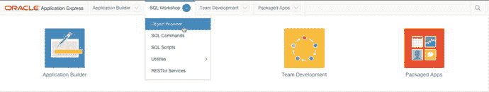

图 4-1. 导航到 Object Browser

3.  点击 `Object Browser` 选项。
4.  在 `Object Browser` 中，点击右上角的“+”图标（代表 `Create` 按钮），并从下拉菜单中选择 `Table`。`Create Table` 向导将打开。第一个屏幕（图 4-2）允许你命名表并输入表中每一列的详细信息。使用 `Move` 列中的两个箭头，你可以按任何顺序移动列。这会影响它们在表中定义和存储的顺序。如果用完了输入列的空行，可以单击 `Add Column` 按钮向表单添加一个新的空列定义行。

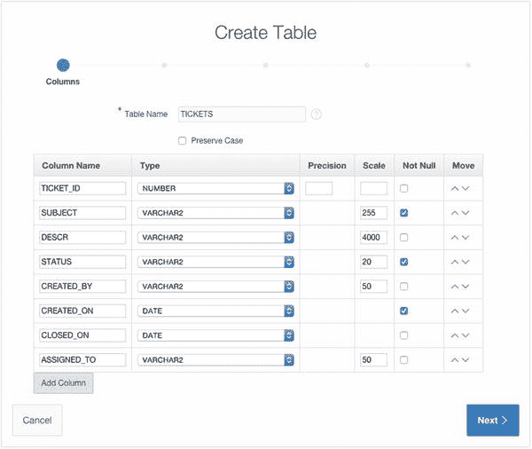

图 4-2. 定义表及其列

5.  根据第 3 章末尾和图 4-2 中的 ERD 指示，输入 `TICKETS` 表的详细信息。确保在表单的 `Not Null` 列中勾选适当的复选框。然后单击 `Next`。
6.  向导的下一步（图 4-3）允许你选择主键的填充方式以及使用哪一列作为主键。主键的四个选项相当直观，但中间的两个可能是最常用的。你是从头开始，因此数据库中没有任何现有的序列定义。选择“`Populate from a new sequence`”后，你会告诉 `APEX` 为你创建一个序列，并在表上创建一个数据库触发器，除非该字段已有值，否则该触发器将使用序列中的下一个值填充选定的主键列。在此步骤中，你也有机会为序列命名。在此实例中，你将使用给定的默认名称。

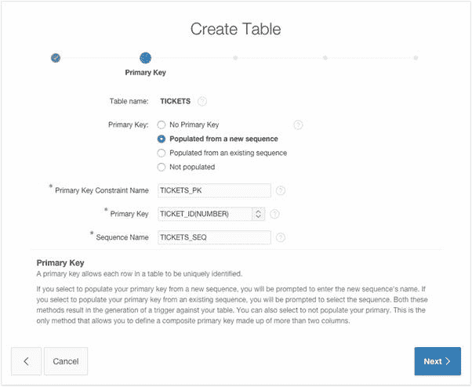

图 4-3. 定义表的主键

7.  选择 `Populated from a new sequence` 单选按钮。屏幕变化后，为 `Primary Key` 选择 `TICKET_ID (NUMBER)`。将 `Sequence Name` 保留为默认设置，然后单击 `Next`。
8.  你还不打算在此表中创建任何外键，因此保留默认值并单击 `Next`。
9.  图 4-4 中的 `Constraints` 屏幕允许你向表定义中添加 `Unique` 或 `Check` 约束。你通过在 `Add Constraints` 区域定义约束并单击 `Add` 按钮将其添加到列表中来添加约束。在 `Add Constraints` 区域下方有两个 `Help` 区域。单击区域标题左侧的箭头可展开帮助信息，显示你在表中定义的列以及如何编写各种检查约束的示例。

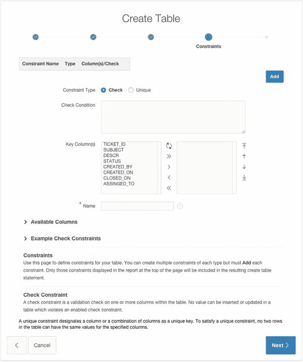

图 4-4.


## 定义约束的步骤

当你点击 `Add` 按钮时，约束的定义就会被添加到页面顶部的约束列表中。你可以为一张给定的表定义任意数量的必需约束。完成后，请继续向导流程。

在此处，我们不创建任何 `唯一` 或 `检查` 约束，因此请保持默认设置并点击 `Next`。

## 完成创建表向导

创建表向导的最后一步让你有机会确认你的请求，并在需要时查看即将执行的代码。如果你需要修改表的定义，可以使用页面底部的按钮回退到之前的向导步骤。要查看代码，请点击 `SQL` 标签左侧的箭头以展开该区域，如图 4-5 所示。

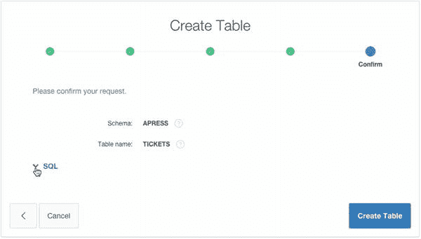
图 4-5.

### 查看 SQL 代码

查看创建表向导 `SQL` 区域中展示的文本。点击 `Create Table` 以完成向导。

成功完成向导后，你将返回到对象浏览器，并显示 `TICKETS` 表的定义。花点时间检查一下表的定义。你应该看到所有你定义的列。如果你点击定义区域顶部的 `Constraints` 标签，你会看到几种不同的约束，包括在 `TICKET_ID` 上的主键约束。

在对象浏览器的左上角是一个选择列表，用于定义正在浏览的对象类型。使用此选择列表选择 `Sequences`。你会看到 APEX 创建了一个名为 `TICKETS_SEQ` 的序列，它将用于填充 `TICKET_ID`。

再次使用对象类型选择列表并选择 `Triggers`。你将看到一个名为 `BI_TICKETS` 的触发器（`BI` 代表“before insert”，即“插入前”）。在左侧选择 `BI_TICKETS` 触发器，然后点击触发器详细信息上方的 `Code` 标签，将显示该触发器的代码。它会在 `TICKET_ID` 为 `null` 时使用 `TICKETS_SEQ` 序列来填充它。你应该看到类似于以下内容的代码：

```
create or replace trigger "BI_TICKETS"
before insert on "TICKETS"
for each row
begin
  if :NEW."TICKET_ID" is null then
    select "TICKETS_SEQ".nextval into :NEW."TICKET_ID" from sys.dual;
  end if;
end;
```

现在你已经定义了 `TICKETS` 表，让我们回去创建 `TICKET_DETAILS` 表。这次，你将创建一个指向 `TICKETS` 表的外键，并设置为 `级联删除`。这意味着如果你删除一张票，票的详细信息也会被自动删除。

使用 `创建 (+)` 按钮启动创建表向导。

根据 ERD 和图 4-6 输入表名和列定义，然后点击 `Next`。再次确保勾选了适当的 `Not Null` 复选框。

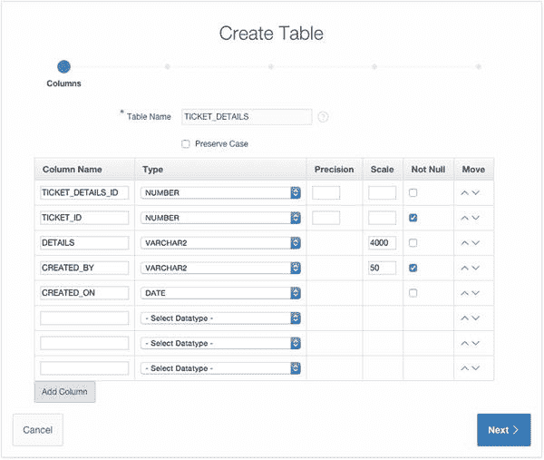
图 4-6.

### 定义 `TICKET_DETAILS` 表

接下来的步骤故意比之前的更模糊一些。你现在应该已经习惯使用创建表向导了，但如果需要复习，可以查看前面的步骤。

为 `主键` 选择 `从新序列填充`，选择 `TICKET_DETAILS_ID(NUMBER)` 作为 `主键` 列，然后点击 `Next`。

在 `TICKET_DETAILS` 表中的 `TICKET_ID` 与 `TICKETS` 表中的 `TICKET_ID` 之间添加一个外键。确保 `删除操作` 设置为 `级联删除`。你的屏幕应该与图 4-7 中的类似。此外，请确保你从 `引用表` 字段中跳出（按 Tab 键），以便 APEX 显示允许你选择引用列的穿梭控件。

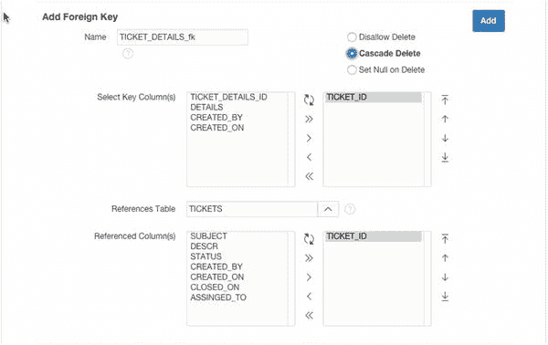
图 4-7.

### 为 `TICKET_ID` 定义级联删除外键

点击 `Add` 按钮以添加新的外键约束。

点击 `Next`（见图 4-8）。

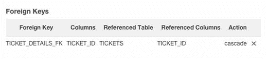
图 4-8.

### 在表向导中定义的外键

此表不需要其他约束。点击 `Next`。

查看 `SQL` 语句并点击 `Create Table` 以完成向导。


## 使用数据工作坊实用程序加载数据

现在您已经定义了两个基础表，可以开始将旧数据迁移到您崭新的数据结构中。您可以使用 SQL 工作坊的数据工作坊实用程序，以多种方式从 Oracle 模式中加载和卸载数据，如图 4-9 所示。数据加载选项允许您选择文本数据、XML 数据和电子表格数据。

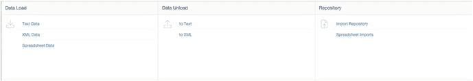

图 4-9. 数据工作坊实用程序提供的数据加载和卸载方法

虽然呈现了三个独立的选项，但文本数据和电子表格数据选项实际上使用的是同一个数据加载向导。无论您选择哪个选项，该向导的操作几乎没有可察觉的区别。

第三个选项（XML 数据）允许您加载以 Oracle 专有的 XML 数据传输格式导出的数据。其格式如下所示：

```
<ROWSET>
<ROW>
<USER_ID>2</USER_ID>
<USER_NAME>DOUG</USER_NAME>
<PASSWORD>A69856770A9AB9CBB0479573FCB3E2A5</PASSWORD>
</ROW>
<ROW>
<USER_ID>3</USER_ID>
<USER_NAME>DAVID</USER_NAME>
<PASSWORD>E2E89134B8AC6E1FFC14139A6FB2C10B</PASSWORD>
</ROW>
</ROWSET>
```

在您设想的公司中，服务台技术人员一直使用 Microsoft Excel 来跟踪工单，因此您将使用电子表格数据选项加载数据。快速浏览一下技术人员使用的电子表格，您会发现 Excel 工作簿中有两个独立的工作表：`TICKETS` 和 `TICKET_DETAILS`。

知道您使用的是已存在主键和外键的预置表，您需要小心处理数据加载方式。`TICKET_DETAILS` 依赖 `TICKETS` 表作为其父级，因此您需要先加载 `TICKETS` 数据。您的电子表格应如图 4-10 所示。

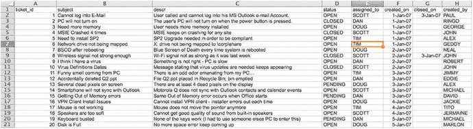

图 4-10. 来自 Excel 工作簿 TICKETS 标签页的电子表格数据

一旦将 `TICKETS` 数据复制到剪贴板，您可以切换回 APEX 并使用数据加载向导将这些数据插入到您的 `TICKETS` 表中。以下是从电子表格加载数据到数据库的步骤：

在您下载的本书支持文件中找到 `helpdesk_spreadsheet.xls` 文件，并用 Microsoft Excel 打开它。导航到 `TICKETS` 标签页。请注意，每个工单对应一行数据，还有一行包含各列标题的标题行。选择所有数据（包括列标题）并将其复制到剪贴板。小心不要意外选中那些没有数据的行，因为这可能导致数据加载向导中出现虚假行或错误。切换回您的 Web 浏览器，使用 SQL 工作坊选项卡上的下拉菜单，在实用程序部分下选择数据工作坊。在数据加载区域，单击电子表格数据。您应该会看到如图 4-11 所示的加载数据对话框。

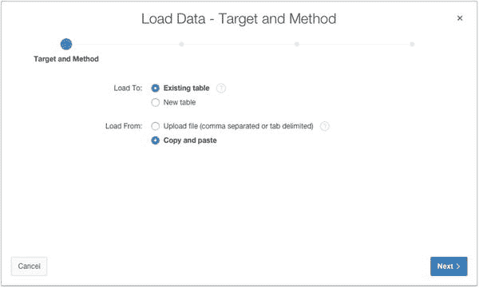

图 4-11. 准备复制粘贴电子表格数据并将其加载到现有的 `TICKETS` 表中

在向导中，对于“加载到”选择“现有表”，对于“加载自”选择“复制并粘贴”，然后单击下一步。从“表所有者”选择列表中选择您的“解析为”模式。这与您在对象浏览器中创建表的模式相同。为“表名”选择 TICKETS，如图 4-12 所示，然后单击下一步。这就是您将加载 TICKETS 数据的目标表。

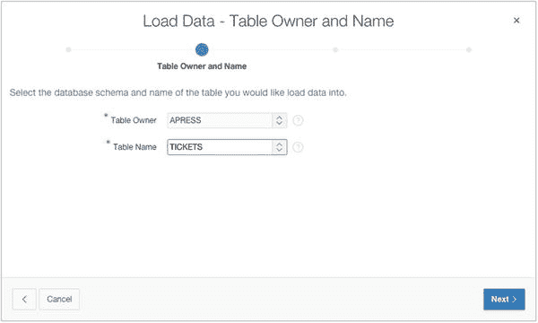

图 4-12. 输入要将数据加载到的表的名称

将您在步骤 2 中复制到剪贴板的数据粘贴到“数据”文本区域。将“分隔符”从逗号更改为 `\t`，这代表制表符分隔。现在确保“首行包含列名”复选框已勾选，如图 4-13 所示。单击下一步。（您可能需要在对话框中滚动才能看到所有选项。）

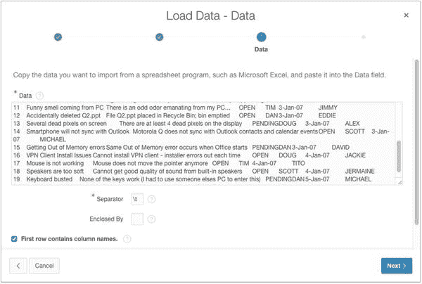

图 4-13. 将电子表格数据粘贴到“数据”文本框中

当您单击下一步时，APEX 会解析您粘贴的数据，并尽力将电子表格数据第一行中的列名与您要加载数据的目标表的列名进行匹配。在下一个屏幕上，会呈现列映射，以便您检查其准确性，并在必要时进行更改和更正。APEX 在将电子表格中定义的列名与表中同名列匹配方面表现得非常好。但是，如果名称不同，它不会尝试猜测，而是将映射留给您完成。如果您向右滚动，应该会看到 APEX 已将电子表格中的所有列名正确匹配到了表列。如果由于某些原因映射不正确，您可以使用图 4-14 所示的下拉菜单进行调整。

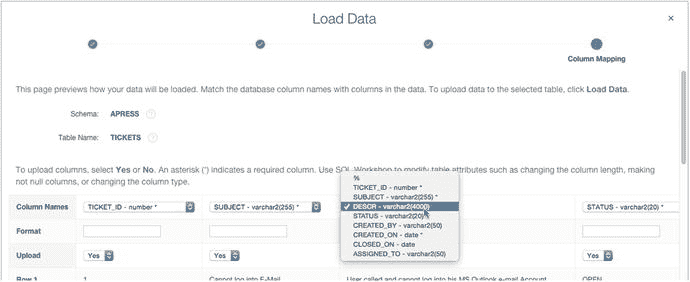

图 4-14. 手动将数据列映射到表

当您确定所有映射都正确后，单击“加载数据”按钮将数据加载到 `TICKETS` 表中。数据加载后，将显示如图 4-15 所示的电子表格存储库屏幕。该屏幕显示有二十行数据已加载到数据库中，加载过程中发生了零个错误。

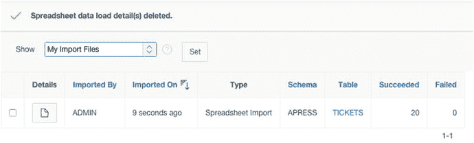

图 4-15. 数据已加载到 `TICKETS` 表中

如果您导航到对象浏览器，选择 `TICKETS` 表并查看该表中的数据，您可以看到电子表格中的记录已被加载到数据库中。要完成工作，您还需要加载 `TICKET_DETAILS` 的数据。操作如下：导航到数据工作坊，单击数据加载区域中的电子表格数据链接，然后单击下一步。在向导中，对于“加载到”选择“现有表”，对于“加载自”选择“复制并粘贴”，然后单击下一步。从“表所有者”选择列表中选择您的“解析为”模式。这与您在对象浏览器中创建表的模式相同。为“表名”选择 TICKET_DETAILS，然后单击下一步。在 Microsoft Excel 中，导航到 `TICKET_DETAILS` 标签页，并将该电子表格中的所有数据（包括列标题）复制到剪贴板。在浏览器中，将您复制到剪贴板的数据粘贴到“数据”文本区域，将“分隔符”更改为 `\t`，并确保“首行包含列名”已勾选，然后单击下一步。在“定义列映射”区域检查 APEX 所做的映射。它应该已经正确映射了所有内容。单击“加载数据”以完成数据加载。摘要应说明有二十二条记录已加载到 `TICKET_DETAILS` 表中，错误数为零。

现在，您已经创建了两个主要表，并加载了遗留数据。仅凭这一点就足以开始开发应用程序了，但您还没有完全准备好开始。


## 创建查找表

看看你刚刚创建的表的定义和数据。它们基本上就是技术人员之前使用的电子表格标签的镜像。如果你仔细检查数据，会发现仍有一些区域的数据规范化程度不够理想。

例如，在 `TICKETS` 表中，`STATUS` 列只有三个值——`OPEN`、`CLOSED` 和 `PENDING`——并且不断重复。该列中的数据值表明它是创建查找表的完美候选。虽然手动使用“创建表向导”创建表并手动迁移数据很诱人，但 APEX 可以创建一个查找表（包含其自身的序列、触发器和外键），并修改原始表使其指向新的查找表，而无需你编写一行代码。操作方法如下：

导航到“对象浏览器”，在屏幕左侧的“对象列表”中选择 `TICKETS` 表。你应该会看到类似图 4-16 所示的结果。

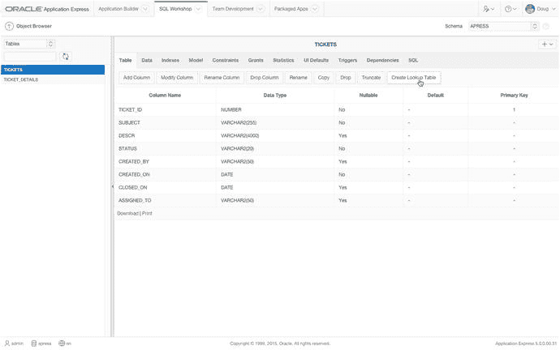
**图 4-16.**

点击“创建查找表”按钮会启动“创建查找表向导”。确保选中了“表”选项卡。选项卡栏下方是一组类似按钮的链接。点击 `Create Lookup Table`（创建查找表）按钮，如图 4-16 中鼠标箭头所示；它会启动“创建查找表向导”。向导的第一步（图 4-17）让你选择是仅显示 `VARCHAR` 列类型还是所有列类型。默认选择是 `VARCHAR`，因为它最有可能成为查找表的候选。查看向导中显示的列，你会看到其中一个 `VARCHAR` 列就是你的 `STATUS` 列。

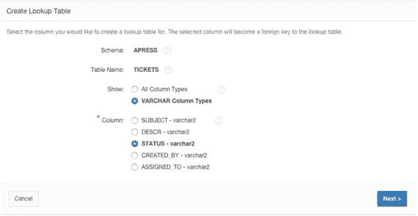
**图 4-17.**

选择 `STATUS` 列作为查找表的源。选择 `STATUS` 作为你想从中创建查找表的列，然后点击“下一步”。下一步允许你为查找表及其关联的序列命名。APEX 已经为新表和序列选择了一个合理的名称，因此接受默认设置并点击“下一步”。向导的最后一个屏幕（图 4-18）提供了有关已做选择和即将执行操作的信息。很容易忽略向导区域正下方的 SQL 语法链接。点击 SQL 链接以显示 SQL。

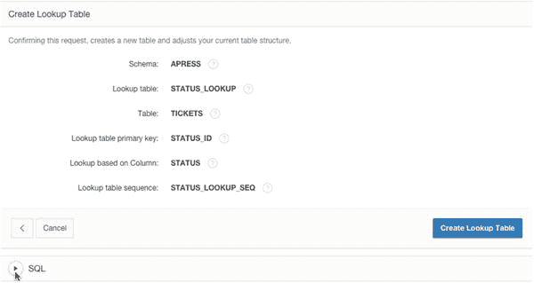
**图 4-18.**

点击 SQL 语法链接会显示即将执行的 SQL。检查 SQL 可以看到创建新查找表、关联序列和触发器、将数据插入表中以及更新原始表中的数据以引用新查找表的步骤。这为你节省了大量工作。点击 `Create Lookup Table`（创建查找表）完成向导。你将返回到“对象浏览器”。`STATUS_LOOKUP` 表会被高亮显示并展示其详细信息。

使用“对象浏览器”检查向导创建的对象。

## 加载并运行 SQL 脚本

SQL Workshop 的“SQL 脚本”工具允许你创建、上传、管理和运行 SQL 脚本。这些脚本在很多方面与 `SQL*PLUS` 脚本类似。但是，如果你使用为 `SQL*PLUS` 编写的脚本，APEX 会忽略任何 `SQL*PLUS` 特有的语法。

脚本一旦创建或加载，就会移入脚本存储库，并一直保留，直到你决定删除它。在脚本存储库中，你可以决定编辑或运行脚本。当你运行脚本时，APEX 会保存结果供你稍后查看。例如，你可以回来检查结果以寻找可能的错误信息。

现在，你将加载并运行一个脚本，该脚本会稍微修改底层数据。原因如下：在实际工作中，你从帮助台团队收到的电子表格中会包含当前的日期和数据；然而，随本书附带的 `.zip` 文件下载的电子表格中的工单日期很可能不是当前的。如果你按日期搜索，这会导致你必须追溯历史记录来查找工单。此脚本将更新这些日期，使其变为近期的日期。

另一件需要考虑的事情是，你向表中加载了大量已分配了 ID 的数据。由于 ID 是随数据一起加载的，你并没有使用数据库序列。因此，你的序列与数据不同步。你需要删除并重新创建序列，使下一个序列号大于关联表中使用的最大 ID。

你还需要修改在 `TICKETS` 表上自动创建的“插入前”触发器，使其自动填充 `CREATED_ON` 列。你还将创建几个数据库视图，稍后将用于检索数据，以便为你要创建的一些特定图表和日历进行格式化。

最后，你将创建一个函数，当传入一个状态名称（如 `OPEN`）时，它会返回该状态的 ID。该函数在多个地方使用，因为你无法保证知道给定状态的 ID 值。因此，此函数是获取给定状态关联 ID 的唯一安全方法。

当你在任何 SQL Workshop 工具中时，可以使用 SQL Workshop 选项卡的下拉菜单作为快速导航到其他工具的方式。图 4-19 显示了此菜单并突出了“SQL 脚本”选项。

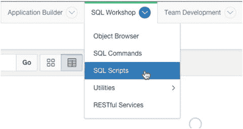
**图 4-19.**

使用 SQL Workshop 菜单导航到基础工具。

以下是运行脚本来相应更新你的模式对象的步骤：

使用 SQL Workshop 菜单导航到“SQL 脚本”工具。点击屏幕右上部分的 `Upload`（上传）按钮。点击 `Browse`（浏览）或 `Choose File`（选择文件）按钮来搜索要上传的 SQL 文件。在弹出的文件查找窗口中，找到并选择 `ch4_schema_changes.sql` 文件，然后点击 `Upload`（上传）。你不需要为脚本命名；它默认使用操作系统级别的文件名。文件上传后，你会看到一个 SQL 脚本报告，显示你刚刚上传的脚本。从这时起，你可以编辑或运行该脚本。如果你想查看脚本包含的内容，可以自由编辑它。你也可以从编辑屏幕运行脚本。通过点击 `Run`（运行）按钮（如果你正在编辑脚本）或 `Run`（运行）图标（如果你仍在查看 SQL 脚本报告）来运行脚本。如图 4-20 所示，系统会要求你在 `Run in Background`（在后台运行）和 `Run Now`（立即运行）之间做出选择。选择 `Run Now`（立即运行）。

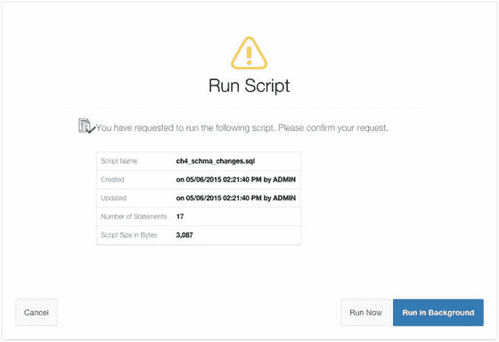
**图 4-20.**


## 查看脚本运行结果

选择“在后台运行”或“立即运行”。脚本运行后，您会立即被带到“管理脚本结果”页面。您很可能会看到脚本状态为 `COMPLETED`。

点击报告行最右侧的“查看结果”图标，以查看脚本运行的结果。图 4-21 显示了点击位置。

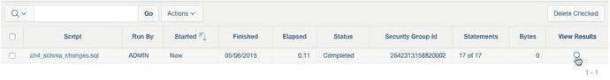
**图 4-21. 点击“查看结果”图标以查看脚本运行结果**

“查看结果”页面允许您查看脚本运行时发生的情况。默认视图通过显示每条语句的前 50 个左右字符、一些简要反馈以及语句影响的行数来显示概览。图 4-22 显示了某次脚本运行的结果。

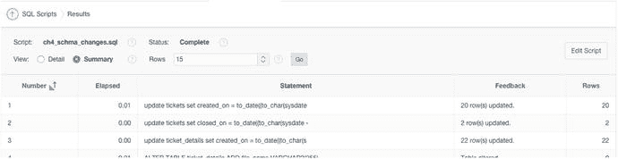
**图 4-22. 脚本结果的摘要视图**

但是，通过将报告视图更改为“详细”，您可以获得更详细的反馈。这样做能提供更深入的洞察，特别是当您的脚本在执行过程中出现错误时。图 4-23 显示了一个详细视图。

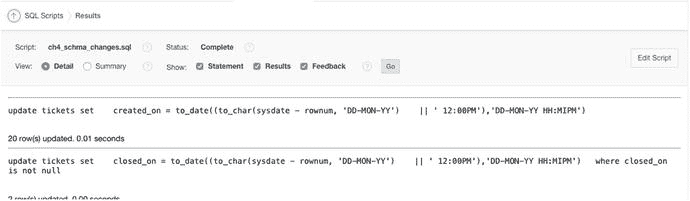
**图 4-23. 脚本结果的详细视图**

在任一视图中，您都可以通过滚动到页面底部并查看报告页脚来快速查看脚本是否遇到任何错误，报告页脚显示了处理的语句总数、成功的语句数以及生成错误的语句数。图 4-24 显示了某次脚本运行的处理语句数。

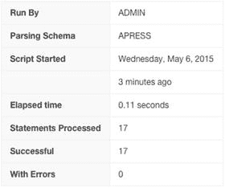
**图 4-24. 任一报告页脚中都包含脚本的成功摘要**

## 用户界面默认值

在开始编写应用程序之前，最后一件能让您后续工作更轻松的事是创建一些用户界面（UI）默认值。在我看来，这是 APEX 中最未被充分利用的功能之一。

### 理解用户界面默认值

UI 默认值允许您自定义表、视图及其列的默认显示属性。它们可用于控制许多属性，包括对齐方式、可搜索性、显示顺序、为列创建的项类型、默认值等等。

例如，当您通过向导（大多数时候都是如此）创建新表单或报告时，APEX 会询问您是否要使用 UI 默认值。如果您选择“是”且存在默认值，APEX 会根据定义属性的表或列，将这些默认值应用于相应的区域或项。UI 默认值分为两类：属性字典和表字典。

属性字典允许您基于属性名称创建更通用的 UI 默认值。可以将其视为更宏观级别的定义。

假设您为任何名为 `PHONE_NUMBER` 的属性创建了一个属性级别的默认值。如果一个名为 `PHONE_NUMBER` 的列出现在表中，并且没有分配表字典默认值，则属性字典默认值将生效。

属性字典定义还可以分配同义词，允许多个属性名称共享相同的实际定义。因此，例如，您可以为原始的 `PHONE_NUMBER` 定义创建同义词 `PHONE`、`TELEPHONE`、`PHONENUMBER` 等。如果向导遇到具有这些名称中任何一个的列，它会将 `PHONE_NUMBER` 默认值应用于创建的 APEX 项。

表字典允许您为特定表或列定义默认值，并且这些默认值仅应用于为这些特定项创建的 APEX 区域或项。

以下是关于 UI 默认值需要注意的一些事项：

*   表字典默认值始终覆盖属性字典默认值。
*   当使用 UI 默认值创建项时，不会与 UI 默认值建立关系。因此，如果您后来更改了 UI 默认值的定义，这些更改不会传播到先前创建的项。
*   在建立 UI 默认值之前创建的项不会继承 UI 默认值的属性。
*   开发人员可以选择不使用 UI 默认值，即使使用了，也可以在组件创建后覆盖它们。

话虽如此，UI 默认值确实有助于确保应用程序的一致性，并使开发人员的工作更加轻松。


### 为表格定义 UI 默认值

UI 默认值既可以从 SQL Workshop 的“对象浏览器”管理，也可以从 SQL Workshop 的“实用程序”页面管理。操作步骤如下：

通过 SQL Workshop 选项卡上的下拉菜单导航至 SQL Workshop 的 UI 默认值页面，然后选择“实用程序”；接着，从下拉菜单中选择“用户界面默认值”。您将进入 UI 默认值仪表板，此时看起来可能相当空旷。这是因为您实际上尚未创建任何 UI 默认值。创建 UI 默认值的第一步是将表字典与数据库同步，以便其了解您的模式中有哪些表。点击页面顶部的“表字典”选项卡，然后在出现的屏幕上点击“同步”按钮。这将启动同步向导。此向导会显示已定义默认值的表数量和未定义默认值的表数量。在此情况下，您应该有零个具有默认值的对象和六个没有默认值的对象。点击“同步默认值”按钮以开始与数据库同步。这可能需要一点时间。一旦表字典与数据库中的定义同步完成，您将看到如图 4-25 所示的报告，其中显示了每个现在具有基本 UI 默认值的表。如果您的模式中还有其他表，它们也会出现在此报告中。

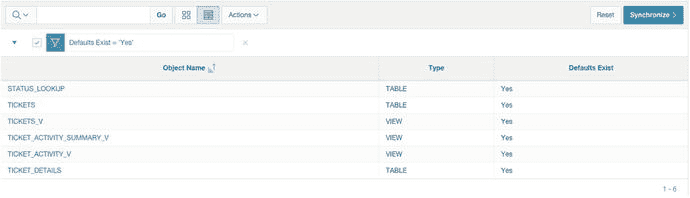
*图 4-25. 已定义 UI 默认值的对象列表*

现在，您可以查看或编辑这些表中每一个的 UI 默认值。首先查看 `TICKETS` 表的 UI 默认值：点击报告中的 `TICKETS` 链接。您应该会看到如图 4-26 所示的结果。

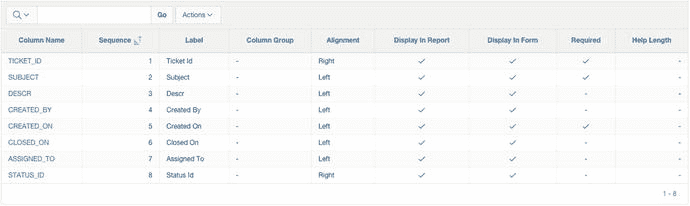
*图 4-26. 表和列 UI 默认值概览*

在图 4-26 的页面上，您可以看到 `TICKETS` 表 UI 默认值的概览。报告的上半部分是表级定义，包括基于此表的表单和报告区域将被称为什么。下半部分是表的列列表、将使用的标签、它们在报告中使用时的对齐方式、是否在报告或表单中显示、是否在表单中设置其 `REQUIRED` 属性，以及它们是否有任何帮助文本。接下来，编辑表级和列级属性：点击报告右上角的“编辑表默认值”按钮。这允许您编辑基于此表的表单和报告区域的命名方式。为“表单区域标题”输入 `Manage Tickets`，将“报告区域标题”保留原样，然后点击“应用更改”。

点击任何列名将转到一个页面，允许您为该特定列设置 UI 默认值。当您浏览列 UI 默认值时，请注意有些内容已为您设置好，包括 `REQUIRED` 属性。当 APEX 与数据库同步时，它会看到某些字段在数据库级别被标记为 `NOT NULL`，并将这些约束转换为 UI 默认值供您使用。

APEX 还会根据列的数据类型做出一些决策，例如在报告中显示时如何对齐列。使用以下信息，通过点击列名中的链接来修改指定列的 UI 默认值：

*   列：`SUBJECT`
    *   标签：`Subject`
    *   帮助文本：`A brief title for the issue.`
*   列：`DESCR`
    *   标签：`Description`
    *   帮助文本：`Describes the ticket in detail. Please be as complete as you can.`
    *   可调整大小：`YES`
    *   宽度：`50`
    *   高度：`5`
*   列：`STATUS_ID`
    *   标签：`Status`

如果您愿意，可以继续为其他任何列和/或表设置 UI 默认值。请记住，您现在所做的操作将影响向导稍后为您创建的内容，因此如果某些内容看起来与本书中所示的不完全一致，请检查您为 UI 默认值设置了什么。

## 总结

SQL Workshop 可能比不上一些更流行的 GUI 工具，但它无疑具备了您在创建和管理表和数据时所需的大部分功能。您也已经看到，SQL Workshop 有一些内置但隐藏的瑰宝，比如“创建查找表向导”。最后，在众多实用工具中，UI 默认值管理器使您作为开发人员的工作变得更加轻松。

当然，本章并未涵盖 SQL Workshop 的全部内容，但您肯定已经对其功能有了相当多的了解。在本书的后续部分，您将使用 SQL Workshop 完成许多其他任务，但现在不必等待。去那些黑暗的角落探索一番，看看您能发现什么吧！

