# 5. 应用程序与导航

电子补充材料：本章的在线版本（doi:[10.​1007/​978-1-4842-0466-5_​5](http://dx.doi.org/10.1007/978-1-4842-0466-5_5)）包含补充材料，可供授权用户使用。

在创建了一些基本数据之后，您现在可以为您的应用程序创建框架。APEX 提供了一个用于创建应用程序的向导。向导内提供多个选项，以帮助生成起始应用程序。根据前期规划的多少，运行初始应用程序向导的结果可能会有所不同。本章将从逐步讲解向导的步骤开始，同时我将重点介绍最常见的功能。

对于示例应用程序，您将创建仅包含一个页面的最基础的应用程序框架。在其他场景中，您可以创建所有页面的初始草稿。为了说明用于创建页面的各个向导，它们将在后面的章节中更详细地探讨。

示例应用程序创建完成后，您将为其添加共享组件。共享组件是在应用程序所有页面中通用的项目和结构。您将准备面包屑导航、列表和值列表（LOV）以供使用；您还将了解全局页面概念的工作原理。到本章结束时，您将拥有应用程序的一些基本组件以及其余页面的起始大纲。

## 创建应用程序向导

APEX 中的应用程序可以通过应用程序导入、复制现有应用程序或运行“创建应用程序向导”来创建。“创建应用程序向导”是从头开始创建应用程序的第一步。本章将引导您完成使用“创建应用程序向导”创建“帮助台”应用程序的过程。

首先，导航到 APEX 中的“应用程序生成器”。您可以从 APEX 主页点击“应用程序生成器”菜单项或如图 5-1 所示的“应用程序生成器”图标来完成此操作。“应用程序生成器”会显示当前应用程序的列表。列表顶部是一个高亮的“创建”按钮，如图 5-2 所示。点击该按钮，向导即启动。

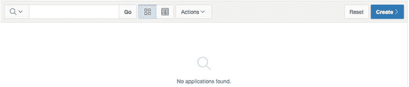
*图 5-2. “创建”按钮*

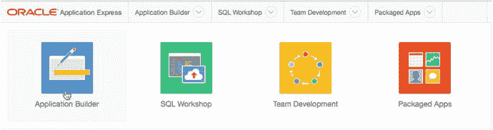
*图 5-1. APEX 主页上的“应用程序生成器”图标*

您将看到四种应用程序类型的选择：桌面、移动设备、网页表格和打包应用程序。当您使用 APEX 时，“应用程序生成器”很快就会变得非常熟悉。因此，即使在 APEX 的其他部分，图 5-3 中的快捷菜单也可用于辅助快速导航。

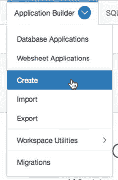
*图 5-3. 创建应用程序的快捷方式*


### 示例与打包应用程序

如果这是一个新建的工作区，可能有一个在配置工作区时自动创建的示例应用程序，也可能没有。自动安装示例应用程序是一项功能设置，可由 `APEX` 管理员配置。如果未安装示例应用程序，您可以通过在 `创建应用程序向导` 的第一步中选择 `打包应用程序` 来手动安装一个，如图 5-4 所示。

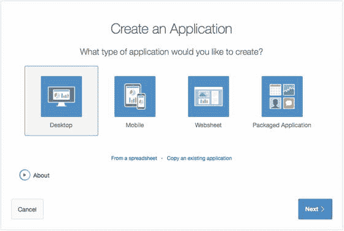
图 5-4. 选择应用程序类型

`打包应用程序` 部分是您安装和管理随 `APEX` 发行版捆绑的应用程序的地方。如图 5-5 所示的主页，展示了可从 `APEX` 主导航菜单访问的 `打包应用程序主页`。从这里，您可以看到已安装了哪些应用程序，并可导航到三个子部分。

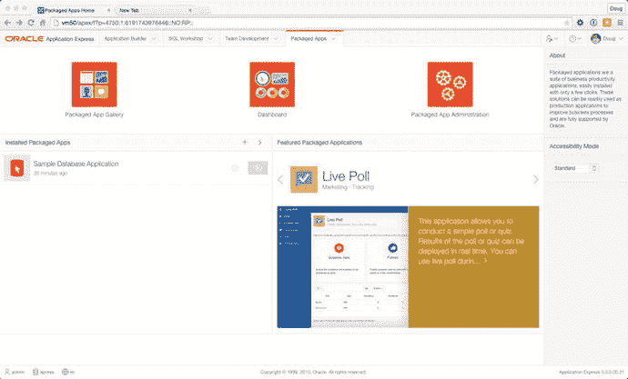
图 5-5. 打包应用程序主页

#### 打包应用程序库

`打包应用程序库` 展示了所有随 `APEX` 发行版捆绑的应用程序。共有 35 个独立的打包应用程序，它们可能属于多个不同的类别，包括 `软件开发`、`跟踪`、`团队生产力`、`市场营销`、`知识管理`、`IT 管理`、`项目管理`、`示例应用程序` 和 `示例 Web 表`。

点击应用程序的图标将带您进入该应用程序的详细信息页面。在这里，您将能够看到应用程序的屏幕截图、阅读其完整描述并查看应用程序的版本信息，如图 5-6 所示。

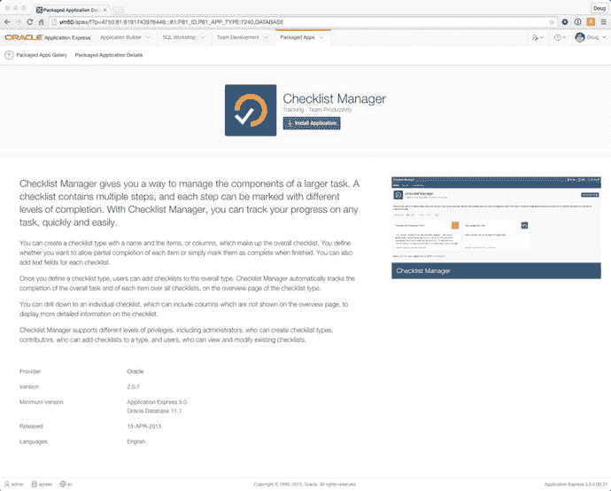
图 5-6. 清单管理器打包应用程序信息页面

点击 `安装应用程序` 按钮将引导您完成在当前工作区中安装所选应用程序的过程。一个弹出式安装向导将让您选择要使用的身份验证方法；它通常默认为 `应用程序 Express 帐户`。点击向导中的最后一个 `安装应用程序` 按钮将安装应用程序及其所有支持对象，包括任何必需的数据库对象。安装完成后，您将被带回应用程序的信息页面，如图 5-7 所示，您可以看到应用程序已成功安装，并且会看到管理和运行该应用程序的选项。


图 5-7. 查看清单管理器应用程序已成功安装

关于打包应用程序，有几点您需要了解：

任何名称中包含“示例”的应用程序都是为了演示 `APEX` 中可用的功能而存在的，因此默认情况下将以未锁定状态安装。这意味着开发者将能够编辑该应用程序并查看 `APEX` 团队是如何开发该应用程序的。名称中不包含“示例”的应用程序是作为生产就绪版本提供的，并将以锁定状态安装，在应用程序被明确解锁之前不允许任何编辑。这可以通过 `管理` 按钮完成，如图 5-7 所示。任何已安装并保持锁定的此类应用程序在生产环境中都得到 `Oracle` 的完全支持。这些锁定的应用程序也可以升级到未来 `APEX` 版本中可能附带的更新版本。一旦您解锁它们，`Oracle` 的所有支持即告终止，升级能力失效，并且无法重新锁定应用程序。截至 `APEX 5.0`，所有打包应用程序都安装到工作区的默认“解析为”模式中。目前，没有直接的方法可以在不先解锁并导出应用程序（从而使其失去任何支持）的情况下将它们安装到次要的“解析为”模式中。

尽管示例应用程序是作为学习辅助工具编写的，但从许多生产就绪的应用程序中也能学到很多东西。我衷心建议您在读完本书后的第一个动作，就是去看看一些打包应用程序的内部工作原理。

#### 打包应用程序仪表板

如图 5-8 所示，仪表板页面展示了当前工作区中 `打包应用程序` 的使用概况。您会看到可用应用程序的总数、已安装的数量以及是否有任何可以升级的应用程序。您还可以看到谁安装了这些应用程序以及它们的使用频率。

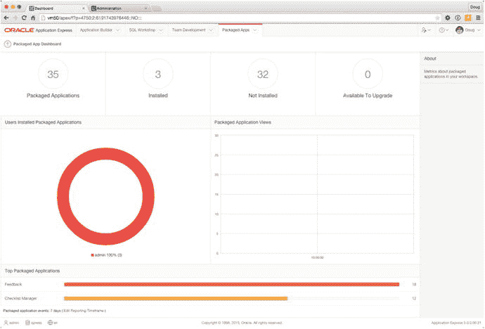
图 5-8. 打包应用程序仪表板

#### 打包应用程序管理

`打包应用程序管理` 页面提供了与当前工作区中安装的打包应用程序特别相关的管理任务列表。如果您以开发者身份登录，您将只能看到与管理 `交互式报表` 设置和 `活动` 报告相关的选项。但是，当以工作区管理员身份登录时，您会看到一个名为 `管理服务` 的部分，其中展示了完整 `管理` 部分中可用内容的一个小子集。

### Web 表应用程序

本书将在 第 11 章 和 第 12 章 中介绍 Web 表应用程序功能。创建 Web 表应用程序的起点与创建数据库应用程序相同。主要区别在于会创建支持 Web 表应用程序的预定义数据库对象。

### 从电子表格创建数据库应用程序

通过向导创建桌面应用程序时，您很快会面临一个问题：您的数据从何而来？图 5-4 中列出的链接之一允许您基于现有电子表格中的数据创建应用程序。如果您选择此选项，`创建应用程序向导` 将提供将数据加载到单个表中的步骤，同时创建一个允许您管理和操作该数据的应用程序。该应用程序非常简单，使用报表和表单的组合，如图 5-9 所示。从电子表格创建数据库应用程序是一种快速简便的方法，可将单页电子表格转换为可扩展并添加其他工具和功能的工作在线应用程序。

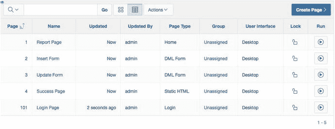
图 5-9. 来自电子表格应用程序的应用程序页面

### 从零开始创建应用程序

当您从零开始创建应用程序时，向导会提供许多有趣的选项。您可以创建任意数量的页面，并将页面链接到不同的数据表。额外的步骤提供了高级选项，如果提前规划好，这些选项将非常强大。从零开始创建应用程序是在票务应用程序练习中使用的方法。以下是开始创建过程的操作步骤：

1.  导航到 `应用程序构建器`，并点击 `创建` 按钮以启动 `创建应用程序向导`。
2.  选择 `桌面` 作为应用程序类型，然后点击 `下一步`。

以下小节详细描述了剩余的创建过程。每个小节包含创建过程中的一个或多个后续步骤。请阅读描述并按照所述步骤操作。


#### 命名应用程序

选择桌面应用程序选项后，系统会提示您填写应用程序的详细信息，如图 5-10 所示。`模式` 选择列表仅当工作区被授予访问多个数据库模式时才存在，它允许您选择希望应用程序用作其“解析模式”的模式。`名称` 值是在构建器内部标识应用程序的名称，并被用作应用程序的标题。

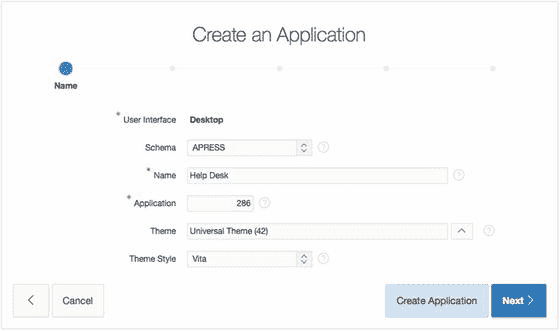
图 5-10. 输入应用程序属性

应用程序 `ID` 必须在整个 `APEX` 实例中是唯一的，因此最好将 `ID` 保留为 `APEX` 已分配的数字。

接下来的选项涉及 `APEX` 主题和主题样式。`APEX` 主题是模板的集合，用于建立页面、报表、按钮和其他图形组件的外观和风格。随着 `APEX` 和网络标准的发展，`APEX` 中预制的示例主题也在发展。5.0 版本提供了一个开创性的新主题选项，称为通用主题，同时还包含多个符合 HTML5/CSS3 标准的主题和一个响应式主题，以及一些已存在相当长时间的旧版主题。

虽然 `APEX` 目前附带 27 个外观各异的桌面主题，但始终可以自定义现有主题或创建一个全新的主题。`APEX` 管理员还能够创建特定于其实例的主题。在“创建应用程序”向导中选择主题是应用默认主题的一种简单方法。正如您所料，您以后可以更改主意并应用其他主题。作为 `APEX` 共享组件的一部分，可以添加、修改和测试其他主题。

图 5-11 展示了 `APEX` 主题选择器。区域顶部的下拉列表决定显示哪些主题。您的选择如下：

*   标准主题：目前，对于 `APEX` 5.0，这仅显示通用主题。`APEX` 中的所有其他主题现在都被视为“旧版主题”。
*   自定义主题：显示由工作区或实例管理员安装的任何自定义主题。默认情况下，没有自定义主题。
*   所有主题：显示所有先前集合中的所有可用主题，包括 26 个旧版主题。

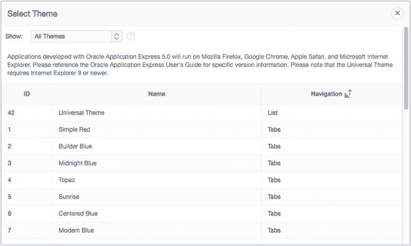
图 5-11. 主题选择

主题样式选项是所选主题的子选项，将展示该主题下可用的样式。目前，只有通用主题具有相关的主题样式。

了解了主题之后，请继续创建过程，为您的示例应用程序选择通用主题。请按照以下步骤操作：

在 `名称` 中输入 `Help Desk`，确保您的 `模式` 已设置。从主题选择列表中选择通用主题 (42)，然后为您的应用程序选择 Vita 作为主题样式。单击下一步。

#### 布局页面

向导的下一步是决定您的应用程序需要哪些页面。向导要求至少创建一个页面，但图 5-12 显示您可以根据需要创建任意多个页面。

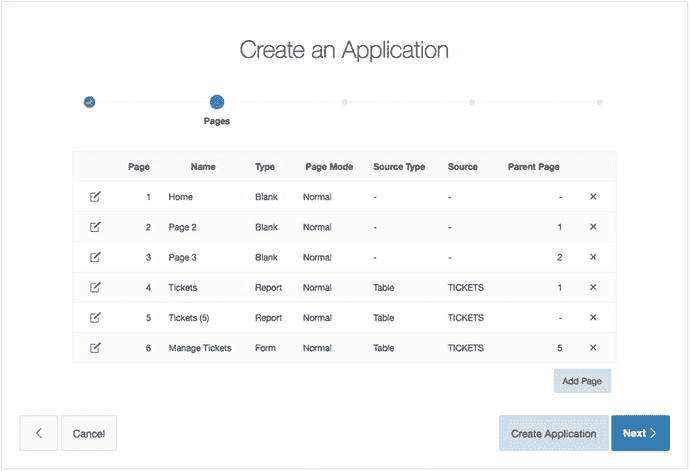
图 5-12. 在“创建应用程序”向导中定义多个页面

此页面底部的“添加页面”按钮会调用一个弹出式向导，允许您定义不同类型的页面。每种页面类型都需要提供不同的信息。例如，添加报表页面会提示您选择一个表名或查询作为报表的基础。选择图表则需要指定图表类型和用于初始数据系列的查询。

现在，我们将保留空白的主页，并在以后根据需要创建其余的页面。因此，下一步很简单：

应用程序主页已创建。接受此页面的默认设置，然后单击下一步。

#### 复制共享组件

下一个屏幕询问您是否希望从另一个应用程序复制共享组件。如果您有一个模板应用程序，其中包含在同一工作区的应用程序之间共享的组件，这会非常方便。复制共享组件并不是一个高级操作，但它确实有助于实现受控和成熟的开发过程。向导中的这一步是一项便利功能，因为相同的对象可以在应用程序创建后以其他方式复制。您不需要此步骤，因为您是从头开始创建应用程序。按如下方式跳过此步骤：

对于“从另一个应用程序复制共享组件”选择 `否`，然后单击下一步。

#### 应用程序属性

向导的下一步允许您设置一些应用程序级别的属性，例如要使用的身份验证类型和全球化属性，包括从何处获取主要语言、日期格式等。让我们逐一查看这些选项，以便您充分理解每个选项的影响。

##### 选择身份验证方法

对于每个应用程序，您都需要选择身份验证方式，即使选择的是完全不进行身份验证。此主题将在第 9 章中进一步讨论。默认情况下，`APEX` 创建应用程序向导提供三种身份验证选项：

*   应用程序表达账户：用户和密码在 `APEX` 工作区本地管理。这些用户的管理方式与 `APEX` 工作区内的开发者账户管理方式相同，并且用户仅在当前工作区内工作。
*   数据库账户：此选项使用 Oracle 数据库模式用户名和密码作为凭据。一些组织使用这种类型的数据库驱动身份验证来跟踪用户。应用程序仍然以所选的“解析模式”执行，而不是以数据库中的单个用户身份执行。
*   无身份验证：这类似于公共网站。系统不会提示用户进行任何类型的身份验证。这对于“您是谁？”这个问题不重要的信息类应用程序很有用。

为简单起见，默认使用应用程序表达身份验证方案。这是提供登录安全性的设置；默认情况下，编写应用程序的开发者无需任何额外工作即可登录。

注意
许多组织已有现成的用户身份验证方法。如果当前有 `LDAP` 服务器可用（例如 Oracle Internet Directory、用于网络域身份验证的 Microsoft Active Directory，甚至 Oracle E-Business Suite），您可能希望将此系统用于 `APEX` 身份验证。选项和方法的数量超出了本书的范围。只需了解，利用 Oracle 数据库技术和应用程序服务器技术，可以使用许多最常见的身份验证基础设施。


### 选择标签选项

标签页是 Web 应用程序中常见的导航结构，传统的 APEX 主题从很早的版本就已支持它们。它们为切换应用程序中的主题或通用区域提供了一个直观的界面。有三种选项可供选择：

*   **无标签页**：这是一种基本的页面样式，向导不生成任何标签页，页面模板也不显示标签页。这通常被用于小型应用程序，或导航由其他方式（如列表、按钮或其他模板结构）管理的应用程序。
*   **一级标签页**：这是最常见的标签页布局样式；它适用于功能需要分离但又易于访问的中小型应用程序。这也是最易于管理的标签页样式类型。
*   **二级标签页**：二级标签页的构建使用一个父标签页结构，并将标准标签页划分为标签页组。这类似于有一个控制标签页。

APEX 中的传统主题在其提供的显示模板中最多支持两级标签页，并且向导会在向导过程中构建标签页组的共享组件。如果你了解应用程序的页面大纲，并能在创建应用程序时进行布局，向导将完成大部分的标签页设置工作。如果应用程序设计需要大量标签页，在创建时设计页面可以节省大量时间。无论如何，你都可以在初次运行**创建应用程序**向导后创建和修改共享组件。

**注意**
新的**通用主题**不使用标签页进行导航，而是使用嵌套的静态列表。因此，当你选择使用**通用主题**时，向导的**应用程序属性**页面上的**标签页**选项将不会出现。

### 全球化选项

向导中的认证步骤还包括六个附加设置，如图 5-13 所示。其中一些设置与将应用程序翻译为其他语言的能力有关。多语言应用程序超出了本书的范围，但为了完整性，这里包含了这些选项的一般使用说明。

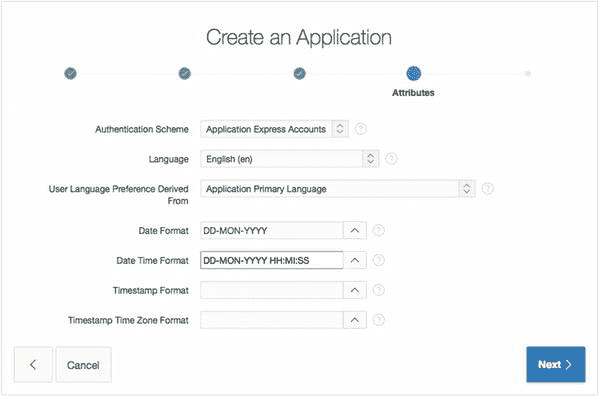
*图 5-13. “创建应用程序”向导的“属性”页面*

这些设置如下：

*   **语言**：这是应用程序默认使用的语言。在多语言应用程序的情况下，它也用作任何国际化和翻译的基础。
*   **用户语言偏好来源**：对于多语言应用程序，此设置决定了应用程序如何获取所需的翻译。
*   **日期格式**：此选项设置应用程序内日期元素的默认格式。世界不同地区对于日期格式的表示方式有不同的习惯，特别是当它们是严格的数字值时。一种常用于尝试缓解此问题的格式是 `DD-MON-YYYY` 格式。这种格式明确表示了哪部分代表日、月、年（例如，`01-JAN-2010`）。
*   **日期时间格式**：此选项设置包含时间维度的日期的默认格式。
*   **时间戳格式**：此选项指定整个应用程序中使用的时间戳数据类型的格式。
*   **时间戳时区格式**：此选项指定整个应用程序中使用的带时区数据的时间戳数据类型的格式。

向导使用这些设置作为起始值。你可以在应用程序的共享组件中根据需要更改它们。

语言、日期格式设置和时区处理被归类为全球化设置。应用程序创建后，你可以开启自动时区检测；该设置位于**应用程序设置**的**全球化**选项卡中。自动时区检测对于用户分布在不同时区的应用程序尤其有用。

按如下方式继续创建示例应用程序：

1.  将**认证方案**设置为**Application Express**，**语言**设置为**English (en)**，**用户语言偏好来源**设置为**应用程序主语言**。
2.  选择 `12-JAN-2004`（返回 `DD-MON-YYYY`）作为**日期格式**，选择 `12-JAN-2004 14:30:00`（返回 `DD-MON-YYYY HH:MI:SS`）作为**日期时间格式**，并将最后两个选项留空。
3.  点击**下一步**。

#### 完成创建应用程序向导

向导的最后一步是一个简单的确认对话框。点击图 5-14 中看到的**创建应用程序**按钮将提交所有设置并生成应用程序。**上一步**按钮允许你在完成过程之前回溯向导以进行任何其他更改。

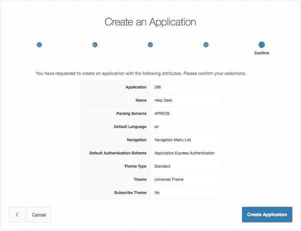
*图 5-14. 完成“创建应用程序”向导*

通过执行流程的最后一步来完成示例应用程序的创建：

1.  查看向导的摘要页面，并通过点击**创建应用程序**来确认你所做的选择。

现在你已经有了一个只有两个页面的简单应用程序，如图 5-15（查看报告视图）所示。运行该应用程序，你应该会看到图 5-16 所示的登录页面。该登录页面需要你输入正常的 APEX 开发者用户名和密码。登录后，你将进入应用程序的**主页**，如图 5-17 所示。

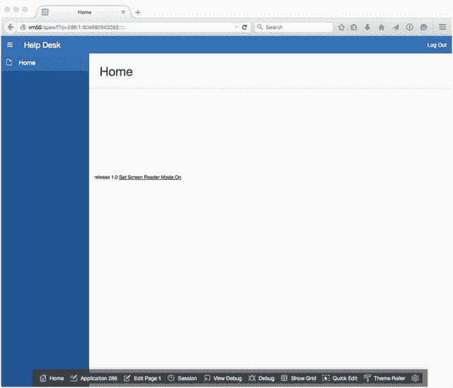
*图 5-17. 登录后的应用程序*

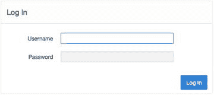
*图 5-16. 运行应用程序时的登录提示*

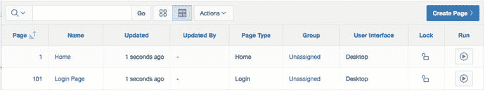
*图 5-15. 服务台应用程序的生成页面*

现在应用程序的框架已经创建完成，你可以继续通过添加其他页面、区域和项目来扩展它。

## 静态内容区域

静态内容区域类型是最基本但也最灵活的区域类型之一。通过操作静态内容区域的属性（如图 5-18 所示），你可以控制该区域的显示方式：

*   `输出方式`: 选择 `HTML` 会将区域源中输入的任何标记解释为 HTML 并呈现结果输出。选择 `文本（转义特殊字符）` 会在将区域源输出到页面时转义（不解释）特殊字符，如 `<`、`>`、`&`。例如：`<br />` 将显示为代码 `<br />`，而不是被解释为换行符。
*   `展开快捷键`: 启用或禁用对快捷键技术的支持。该技术包括一个共享组件对象，可用于使用 `SHORTCUT_NAME` 语法管理一种变量。

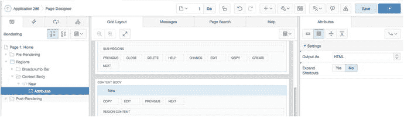

图 5-18. 查看静态内容区域的属性

静态内容区域的简单性带来了广泛的用途。静态内容区域是一个容器，可以拥有自己的值、嵌入的 JavaScript 或 CSS 定义，也可以包含其他页面项目。输入源中的任何有效 HTML 都会在 APEX 页面上呈现。替换字符串语法，如 `&ITEM_NAME.`，也可以用于在源文本中显示项目值。

继续处理帮助台应用程序，向第一页添加一些内容：

### 导航至应用程序构建器并编辑应用程序

导航到应用程序构建器，并编辑帮助台应用程序。根据您查看应用程序报告的方式，您可能需要点击如图 5-19 所示的图标，或点击应用程序的名称，如图 5-20 所示。

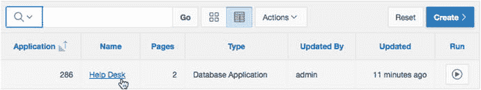

图 5-20. 从报告视图编辑帮助台应用程序

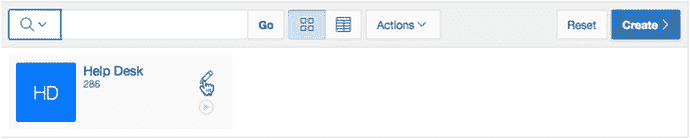

图 5-19. 从图标视图编辑帮助台应用程序

### 编辑主页

通过点击报告中页面名称的链接来编辑主页，如图 5-21 所示。

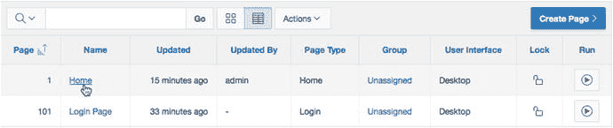

图 5-21. 编辑主页

### 添加静态内容区域

从屏幕下部中心的库中，为组件类型选择 `区域`。

点击并拖动库中的 `静态内容` 图标到屏幕的网格布局部分，并将组件放置在 `内容主体` 内容区域中，如图 5-22 所示。

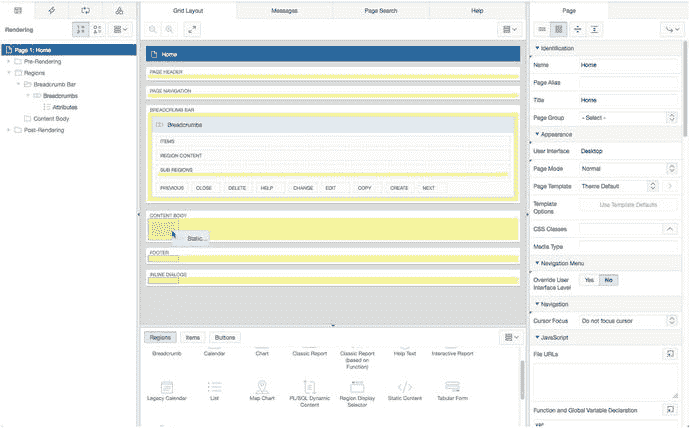

图 5-22. 将静态内容组件拖到内容主体区域

放置组件后，视图将发生变化，显示新区域在网格布局中的位置，并在树状窗格和网格布局中被选中为当前项，如图 5-23 所示。

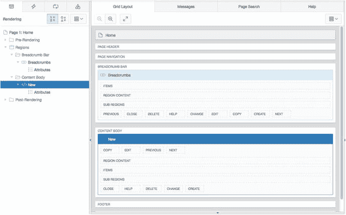

图 5-23. 页面设计器中显示的新静态内容区域

### 编辑新区域的属性

现在，编辑新区域的属性：

在属性窗格的“标识”部分，将 `标题` 设置为 `APEX Issue Tracker`。

在属性窗格的“源”部分，为 `文本` 输入以下内容，然后点击页面顶部的 `保存` 按钮。参见图 5-24。

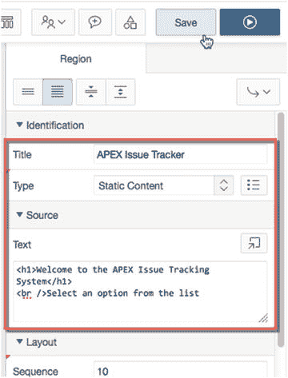

图 5-24. 输入标题和文本并保存工作

```
<h1>Welcome to the APEX Issue Tracking System</h1>
<br />Select an option from the list
```

### 运行页面

通过点击页面设计器顶部的 `运行` 按钮来运行页面。您应该看到刚刚所做的更改，表现为一个包含友好欢迎消息的新区域。您的结果应与图 5-25 所示相似。

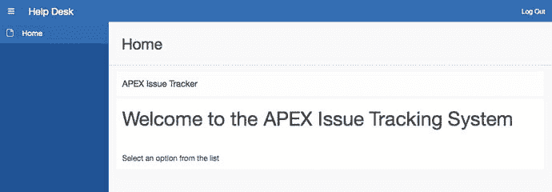

图 5-25. 添加静态内容区域后的结果

## 公共页面

如前所述，可以允许整个应用程序不使用任何认证方案。但是，如果您希望某些页面需要认证，而另一些页面是公开的呢？如何制作一个不需要登录即可查看的页面？

如果应用程序中的任何页面需要认证，则必须对整个应用程序应用适当的身份验证方案。APEX 允许您使用页面的定义属性将各个页面定义为 `公共` 或 `需要认证`。每个页面可以有不同的安全要求（授权），但一个应用程序只能应用一种身份验证机制。公共页面对于介绍性的登陆页面、登录页面和信息页面非常有用。

在帮助台项目中，您希望主页面对所有访问者可用。为此，您可以修改应用程序的第一页，允许任何人查看而无需身份验证。通过以下步骤完成：

### 导航至页面 1 并编辑页面属性

在帮助台应用程序中，导航至并编辑第 1 页。

在树状窗格中，通过点击渲染树中的页面名称 (`主页`) 来编辑页面属性。页面名称显示为树的根节点，如图 5-26 所示。

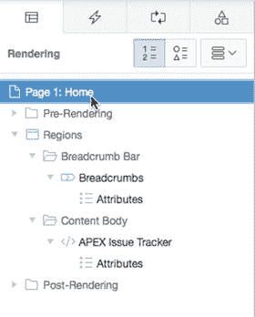

图 5-26. 在渲染树中选择页面节点

### 将页面设置为公共

在属性窗格中，滚动到“安全”部分，如图 5-27 所示。在此部分，将 `身份验证` 更改为 `页面是公共的`。

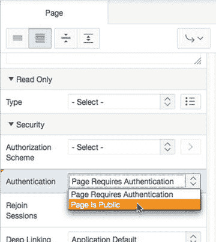

图 5-27. 更改页面的身份验证设置

### 保存更改

在页面顶部，点击 `保存`。

现在，当运行页面时，请求第 1 页将不会出现身份验证屏幕。您将在第 9 章中了解更多关于身份验证和授权的信息。目前，只需知道您所做的更改允许用户在未登录的情况下查看应用程序的第一页。


## 导航栏条目

每个 APEX 应用都有一个导航栏，其中可以包含多个条目。通常显示在每页的链接示例包括“登录”、“注销”、“帮助”和“我的账户”。作为开发者，您可以根据应用和需求创建和修改导航栏条目。导航栏不仅限于标准链接文本；还可以修改为包含图像。条目可以基于条件、授权方案和构建选项来显示。导航栏的位置由页面模板替换变量 `#NAVIGATION_BAR#` 决定。在大多数应用中，导航栏位于页面的右上角或左上角。

示例应用已经为您创建了一个非常简单的导航栏，如图 5-28 所示。它目前只包含一个“注销”链接。

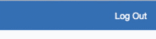

图 5-28.

基本导航栏

因为您已将主页修改为可公开查看的页面，所以需要添加一个导航栏条目，允许用户登录。同时，您需要使“登录”和“注销”链接具有上下文敏感性，以便它们只在有需要时才显示。（例如，“注销”链接应仅在用户实际登录时显示。）

导航栏是应用共享组件的一部分，因此需要从应用程序构建器的“共享组件”部分创建和维护。在示例应用中按如下步骤创建一个：

从页面设计器中，点击页面右上角“保存”按钮旁边的“共享组件”图标，如图 5-29 所示。

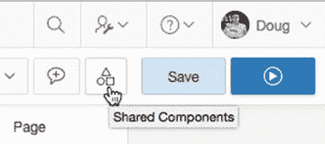

图 5-29.

从页面设计器导航到共享组件屏幕

在“导航”部分下，点击“导航栏列表”，如图 5-30 所示。

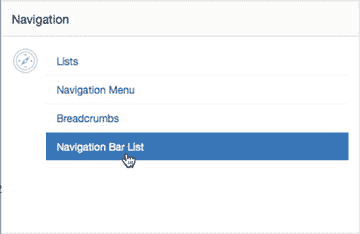

图 5-30.

共享组件屏幕中的导航组件

您将看到一个报告显示已经存在一个名为 `Desktop Navigation Bar` 的导航栏列表。您需要编辑此列表以添加“登录”条目并编辑“注销”条目。

点击报告中的 `Desktop Navigation Bar` 链接。

点击屏幕右上角的 `Create List Entry` 按钮。

在页面的“条目”部分，在 `List Entry Label` 字段中输入 `Login`。

在“目标”部分，将 `Target Type` 设置为 `Page in This Application`。

对于 `Page`，输入 `101`。这将使用户在注销后返回到登录页面。参见图 5-31。

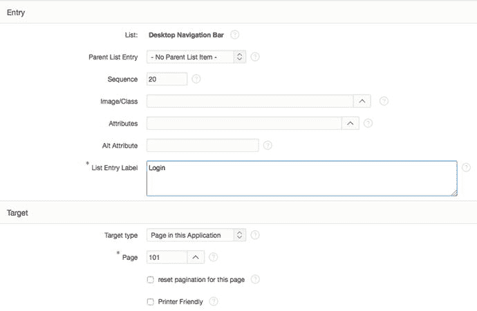

图 5-31.

导航栏设置

在“条件”部分，将 `Condition Type` 设置为 `User is the Public User (user has not authenticated)`，如图 5-32 所示。

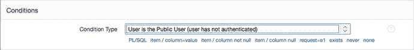

图 5-32.

导航栏条件

点击页面顶部的 `Create List Entry`。

现在运行应用。如果您已登录，则只会看到“注销”导航栏条目。点击“注销”链接。一旦注销，您将看到新的导航项，如图 5-33 所示。这暴露了一个小问题：即使您已经注销，仍然可以看到“注销”链接。

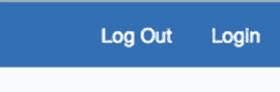

图 5-33.

“登录”和“注销”链接同时显示

显然，同时显示“登录”和“注销”选项是有问题的。毕竟，这两个选项中只有一个可以适用。让我们来解决这个问题：

导航回 Help Desk 应用的“共享组件”部分。

编辑“导航栏列表”，然后编辑 `Desktop Navigation Bar` 列表。

通过点击报告中其名称来编辑“注销”导航栏条目。

在页面的“条件”部分，将 `Condition Type` 设置为 `User is Authenticated (not public)`，如图 5-34 所示。


图 5-34.

导航栏条件类型

点击 `Apply Changes`。

再次运行应用。您应该会看到“登录”和“注销”导航项是互斥的。在创建新的导航项时，您为其应用了条件，使其仅对公共用户可见。“注销”导航项是在“创建应用”向导中创建的；默认情况下没有为“注销”项设置条件。您将在第 8 章中了解更多关于条件的信息。

## 全局页面

`全局页面`是一种特殊类型的页面，用作您应用的“母版页”，并且可以为每种用户界面类型添加一个（即，您可以有一个用于桌面 UI 的 `全局页面`，另一个用于移动 UI）。

放置在 `全局页面` 上的项目会在其相关 UI 的每个页面上渲染，除非有条件地指定不这样做。当您发现需要在多个页面甚至应用的所有页面上显示相同区域时，这特别有用。只需将一个区域移动到您的 `全局页面`，它就会随每个页面一起渲染。

一个很好的使用例子是面包屑区域或包含自定义 JavaScript 代码的区域，这些代码需要每个页面都能使用。来自 `全局页面` 的区域内容会包含在该 UI 的每个页面中，即使区域没有可见地渲染。

虽然您可以为 `全局页面` 分配任何页码，但与桌面界面相关的 `全局页面` 的默认页码是零 (`0`)。实际上，`全局页面` 取代了以前 APEX 版本中称为 `Page Zero` 的功能。

在 APEX 页面设计器中查看 `全局页面` 的定义时（图 5-35），您可能会注意到“处理”选项卡的树状窗格中没有任何节点。`全局页面` 仅在页面渲染期间使用。添加到 `全局页面` 的区域甚至会包含在登录页面上。在向 `全局页面` 添加内容时，您需要考虑应用中不同的页面类型。

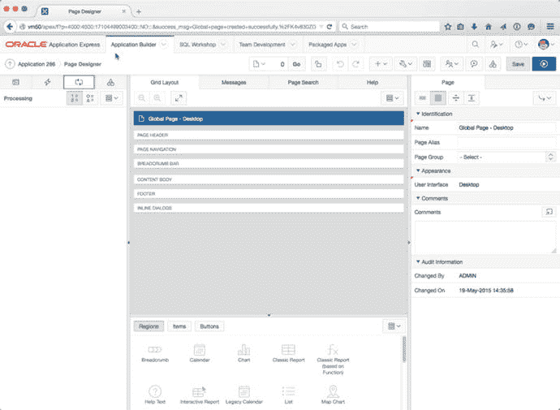

图 5-35.

如 APEX 页面设计器所示，`全局页面` 没有处理节点

创建 `全局页面` 就像在 APEX 应用中创建任何其他页面一样。但是，一旦创建，它就不再出现在该 UI 类型的 `创建选项` 列表中。让我们为桌面界面创建一个 `全局页面`：

从应用页面列表中，点击“创建页面”按钮。

在弹出的向导中，从“页面类型”列表中选择 `全局页面` 并点击“下一步”。图 5-36 显示了 `全局页面` 选项，它应该位于列表的底部附近。

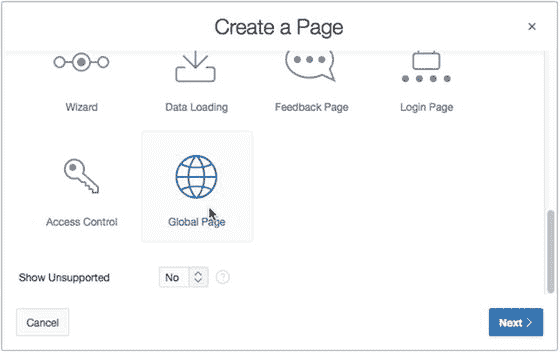

图 5-36.

选择创建 `全局页面`

将 `Page Number` 保留为 `0`（零），然后点击“创建”。

您现在应该看到您的 `全局页面` 列在应用的页面中。目前，`全局页面` 上没有任何内容。您将使用此 `全局页面` 来包含并显示下一节将介绍的面包屑区域。


## 面包屑区域

面包屑是一种流行的导航结构。它为用户提供当前导航路径的快速直观表示，并可选择使用该结构向后导航。Oracle Application Express 在图 [5-37] 所示的构建器中使用了此结构。


图 5-37.
应用程序构建器中的面包屑示例

在 `APEX` 中，面包屑是一种具有内置行为的声明式结构。它们作为共享组件进行管理，并拥有自己的区域类型和模板。当您运行创建应用程序向导时，向导创建的页面会自动包含一个用于容纳面包屑的区域。图 [5-38] 显示了页面面包屑栏部分中的面包屑区域。

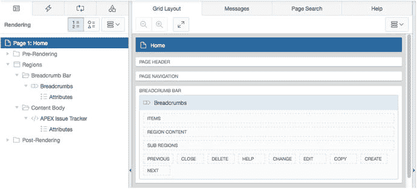

图 5-38.
面包屑在页面渲染层次结构中的位置

当您为应用程序创建新页面时，创建页面向导有一个选项可帮助创建新的面包屑条目。使用此选项时，子页面会从父页面复制面包屑区域，并在面包屑组中自动添加一个条目。如果面包屑区域不存在，则不会复制任何内容，但面包屑共享组件中的条目仍会创建。这种方法的一个问题是，如果您需要对区域的显示或其他布局考虑进行任何更改，则必须在包含面包屑区域的每个页面上手动完成。将区域添加到全局页面以使其出现在所有页面上会很有帮助，因为它为您提供了一个更改点而不是多个。

继续使用帮助台应用程序，设计要求面包屑区域出现在所有页面上。无需手动重新创建该区域。因为创建应用程序向导已经为您创建了该区域，您可以使用 `APEX` 中的复制区域功能将该区域复制到您的全局页面。操作如下：

使用页面设计器编辑页面 1。
在渲染树窗格中右键单击面包屑区域以显示上下文菜单，如图 [5-39] 所示。

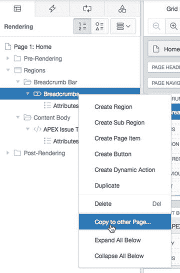

图 5-39.
面包屑区域的上下文菜单
选择复制到其他页面...选项。
将新区域的目标页码更改为 0，如图 [5-40] 所示，然后单击下一步。

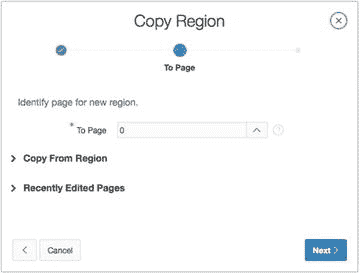

图 5-40.
设置目标页面
复制向导允许以有限的方式修改复制的内容。不适用的选项会被禁用。在当前示例中，您可以修改区域名称、序列以及一些显示放置选项。现在，保留它们的默认值：
确认图 [5-41] 中所示的设置。单击复制以完成向导。

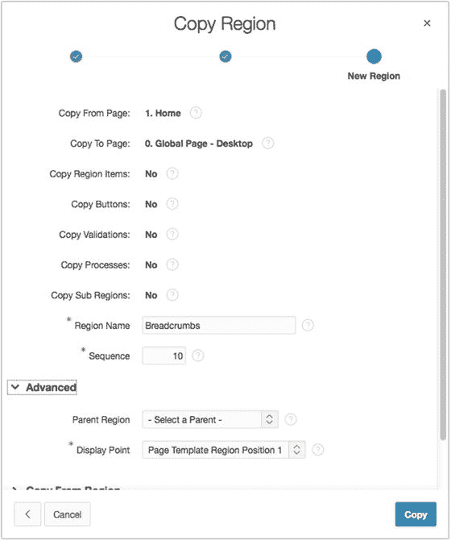

图 5-41.
确认复制操作

在页面设计器中查看更改，注意到全局页面现在有了新的面包屑区域，但原始面包屑区域仍保留在页面 1 上。运行应用程序时，您可以看到图 [5-42] 中显示的两个面包屑区域。请注意，复制功能不会删除现有的面包屑区域。

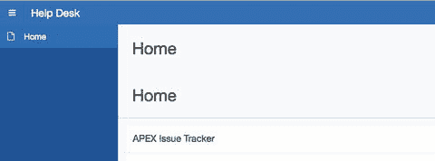

图 5-42.
冗余的面包屑区域

要更正此重复项，请执行以下操作：

编辑页面 1。
在渲染树中右键单击面包屑区域名称，然后从上下文菜单中选择删除，如图 [5-43] 所示。

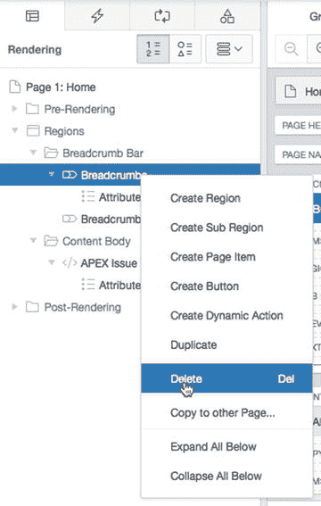

图 5-43.
准备从页面 1 删除冗余的面包屑区域
单击页面设计器右上角的保存按钮。

现在，重新测试应用程序。您应该只看到全局页面版本的面包屑区域，如图 [5-44] 所示。

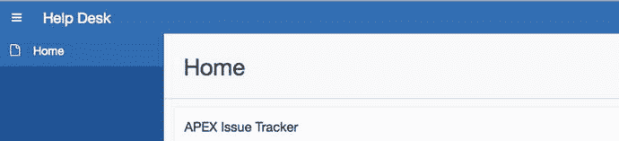

图 5-44.
面包屑区域迁移到全局页面完成

实际上，您已经将面包屑区域的管理移到了全局页面。对该区域在全局页面上进行的任何设置更改都会在应用程序的所有页面上显示，而无需任何额外工作。

## 面包屑条目

随着应用程序中添加更多页面，页面创建向导会提示可选的面包屑设置。如果它们在页面创建时未设置，或者需要从现有设置进行修改，您可以在应用程序的共享组件部分修改驱动面包屑的数据。

一个应用程序中可以有多个面包屑。`APEX` 创建应用程序向导会创建一个名为 `Breadcrumb` 的默认面包屑。这是面包屑条目的分组名称。`APEX` 提供了一些实用程序来查看面包屑的使用位置，以及编辑条目的简单方法。

要查看创建的面包屑组，请导航到共享组件部分，然后单击导航部分中的面包屑选项。图 [5-45] 显示了用于列出不同面包屑组的主屏幕。

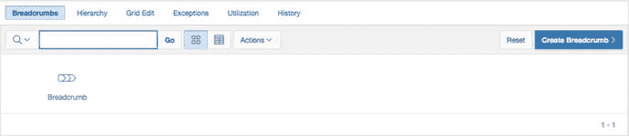

图 5-45.
应用程序中可用的面包屑组

单击组名将显示该组中的详细条目，如图 [5-46] 所示。条目可以在此处独立修改。随着应用程序变大，您可能需要将条目安排到不同的面包屑组中。

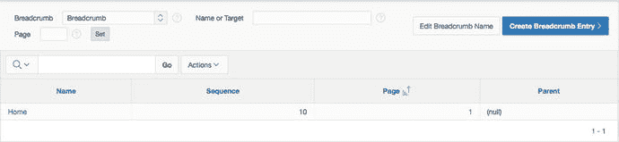

图 5-46.
面包屑组中条目的详细信息


## 列表

### 列表：定义与类型

顾名思义，列表是 `APEX` 用来保存链接数据集合的一种结构。列表结构使得菜单能够在众多应用页面间保持一致的显示，且易于在应用的 `共享组件` 区域进行维护。请不要将我们在此讨论的导航列表与值列表（`LOVs`）混淆。列表是一种内置了用于以不同方式显示信息的模板的导航结构。`LOVs` 则用于支持数据输入，限制用户可以输入的选项。

列表有两种类型：静态和动态。静态列表由列表项组成，这些项不是数据驱动的，而是在设计时由开发者输入的。动态列表基于数据，返回到列表中的值基于一个 `SQL` 查询。

### 列表模板与自定义

列表模板功能强大。它们支持层级列表、图形项目符号、动态 `HTML` 以及当前页面的高亮显示。列表可以包含具有父子关系的数据；一些列表模板是专门为显示父子数据而设计的。`APEX` 主题包含多种列表模板，但如果你需要的行为尚未提供，你可以修改或创建自己的列表模板，以按需显示和运作。

### 通用主题中的列表

如本章前文简要提及，新的通用主题使用静态列表代替选项卡进行导航。会创建一个名为 `Desktop Navigation List` 的列表来存放站点的导航，并使用通用主题中内置的一个特殊 `List` 模板来显示该列表，具体取决于一些应用级属性。

无论使用列表还是选项卡，当你通过页面创建向导进行操作时，`APEX` 都会询问你是否希望为正在创建的页面创建一个导航条目。如果你在使用通用主题时选择创建一个新的导航条目，系统会为你创建一个新的列表项。

### 手动创建列表项

尽管我们可以让页面创建向导为我们创建所有列表项，但你将为尚不存在的页面在列表中手动创建两个条目，以演示如何手动完成。别担心——你将在接下来的几章中创建这些页面。请遵循以下步骤：

1.  导航到应用的 `共享组件` 部分。
2.  找到并点击 `导航` 下的 `列表` 条目。
3.  在结果报告中找到并点击 `Desktop Navigation Menu` 列表。
4.  要创建新的列表项，请点击 `图 5-47` 中所示的 `创建列表项` 按钮。

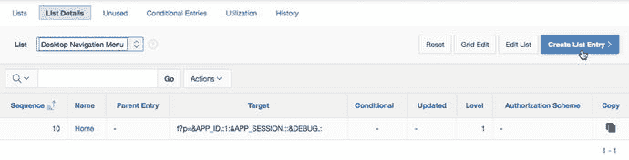
`图 5-47`. 创建新的列表项

生成的页面展示了列表项的所有可用选项。列表结构内置了许多功能。你感兴趣的关键项显示在 `表 5-1` 中。请使用 `表 5-1` 中的值填写 `图 5-48` 和 `5-49` 所示的页面。其他值保持默认。

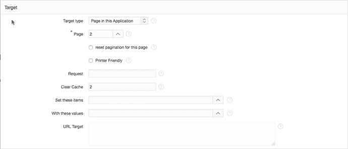
`图 5-49`. 目标定义

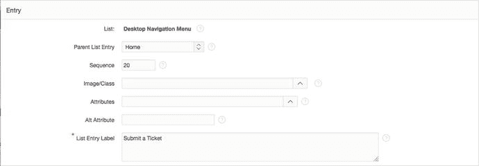
`图 5-48`. 选择父列表项并设置标签

`表 5-1`. 第一个列表项使用的值

| `部分` | `值` | `条目` |
| --- | --- | --- |
| `条目` | `父项` | `Home` |
|   | `列表项标签` | `提交工单` |
| `目标` | `页面` | `2` |
|   | `清除缓存` | `2` |

完成第一个列表项的条目后，滚动到页面顶部并点击 `创建并创建另一个` 按钮。这将带你返回同一页面，并允许你添加另一个列表项。使用 `表 5-2` 中的信息创建第二个列表项。

`表 5-2`. 第二个列表项使用的值

| `部分` | `值` | `条目` |
| --- | --- | --- |
| `条目` | `父项` | `Home` |
|   | `列表项标签` | `联系我们` |
| `目标` | `页面` | `3` |
|   | `清除缓存` | `3` |

点击 `创建列表项` 以保存你的更改。

你现在应该有一个包含三个条目的列表，如 `图 5-50` 所示。`列表详情` 选项卡在一个视图中显示了一些重要信息。`序号` 值标识了使用无序列表类型时项目的列出顺序。一些列表类型被归类为有序，在这种情况下，它们会按名称字母顺序排序。`目标` 值是一个 `URL` 的构造，它包含要导航到的页面以及清除缓存的指令。几种声明性表单会根据提供的输入构造 `URL`，其方式与列表项相同。

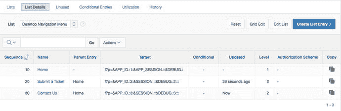
`图 5-50`. 列表项一览

列表作为一个共享组件（除非它被指定为 `UI` 的默认导航列表），不会直接显示在应用程序中。通常，必须在页面上配置一个列表区域，用户才能看到该列表。`APEX` 有一个专门定义的模板类型来支持列表。列表模板包含了动态列表所需的所有智能以及显示选项。当你创建列表区域时，可以设置模板选择，并且可以通过区域设置进行修改。

在我们的例子中，你创建的列表项将作为通用主题的一部分，显示在导航列表区域中。

现在运行你的应用程序，你应该能看到你创建的列表项出现在屏幕左侧，作为 `导航` 菜单的一部分（`图 5-51`）。点击任一链接都会产生应用程序错误。这是预期的：你要求应用程序链接到尚不存在的页面。

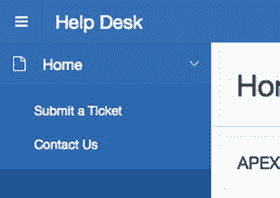
`图 5-51`. 包含新列表项的导航菜单

## 值列表

基于数据库架构编写应用程序的一个基本好处是能够强制执行数据质量。`LOVs` 是一种可以映射到不同项类型的 `APEX` 组件，包括 `选择列表`、`多选列表`、`复选框` 和 `单选组`。这类结构有助于确保通过事务收集的数据是一致的。与列表类似，`APEX` 中也有两种类型的 `LOVs`：

*   静态：在 `APEX` 中定义的一组固定选项
*   动态：基于通过 `SQL` 从数据库返回的数据

`LOVs` 可以在应用级别或项级别定义为共享组件。`图 5-52` 展示了一个静态 `LOV` 的项级别属性定义。一个使用超过一次的 `LOV` 应该被编写为共享组件。这允许在 `共享组件` 中对该 `LOV` 进行集中维护。如果一个 `LOV` 是在项级别创建的，可以使用 `APEX` 提供的实用程序轻松将其转换为共享 `LOV`。在查看 `LOV` 共享组件时，本地定义的 `LOV` 可以被编辑并转换为共享组件 `LOV`。

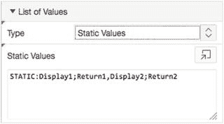
`图 5-52`. 一个具有静态选项的项级别 `LOV`


