# 6. 表单与报表：基础

电子补充材料 本章节的在线版本（doi:[10.​1007/​978-1-4842-0466-5_​6](http://dx.doi.org/10.1007/978-1-4842-0466-5_6)）包含补充材料，授权用户可获取。

现在，你已经准备好了数据库对象和基础应用程序，可以开始构建应用程序页面的真正工作了。大多数应用程序包含一系列用于显示、编辑和收集数据的表单、报表、图表及其他元素。

本章将重点介绍基础的表单和报表。这些是 APEX 中最简单、最标准的表单和报表类型。它们通常通过使用 APEX 向导来创建，这些向导会为你生成表单或报表的所有元素。

在接下来的章节中，你将学习如何使用 APEX 向导为你的“服务台”应用程序添加页面。你将在`Tickets`表上创建一些基础的表单和报表；同时，你也将了解向导为你创建的工作表单和报表的构成元素。

## 静态值列表

静态值列表简单来说就是一组显示值与返回值的配对。这种类型的列表通常简短且固定不变。当你在项目层级定义静态值列表时，有两种数据选项：

*   `STATIC`：条目会自动按字母顺序排序。
*   `STATIC2`：条目按输入的顺序呈现。

指定静态值列表的语法如下：

`TYPE:显示值;返回值,显示值;返回值,...`

其中`TYPE`可以是`STATIC`或`STATIC2`。

如果你希望某个条目的显示值和返回值相同，可以省略分号，只指定一个值。例如，下面例子中的第二个项目，其显示值和返回值是同一个值：

`TYPE: 值 1,值 2,值 3,...`

值列表中的返回值会作为关联表单项的值保存。在静态列表中，使用分号作为条目的值可能会导致解析列表时出现问题。

以下是一个静态列表的例子。列表项之间用逗号分隔。每个列表项由一个显示值和一个返回值组成，两者之间用分号分隔：

`STATIC:C;1,A;2,D;3,B;4,`

当你显示此列表中的值时，你只会看到显示值。因为列表类型是`STATIC`，所以值会按字母顺序显示：

`A`
`B`
`C`
`D`

接下来是一个`STATIC2`列表的例子。请注意，条目的指定顺序与之前相同：

`STATIC2:C;1,A;2,D;3,B;4,`

然而，这次值会按照定义的顺序显示，而不会按字母顺序排序：

`C`
`A`
`D`
`B`

共享组件层级的静态值列表比项目层级的静态值列表有更多的选项。由于其共享性质，可以配置条件和构建选项。这些可以在列表创建后进行编辑。因为列表作为共享组件存储方式不同，所以可以在项目值中使用分号。

## 动态值列表

与静态值列表类似，动态值列表也需要有显示值和返回值的配对。不同之处在于，这些值是通过 SQL 查询获取的。你编写的 SQL 查询必须返回两列。如果两列相同，你需要使用别名来区分显示值和返回值。如果你使用连接字符串作为列，也必须使用别名。动态值列表还可以使用会话变量或应用程序中当前使用的值。这使得动态值列表具有灵活性，可以在运行时动态改变提供的选项。

示例应用程序需要两个值列表来支持用户名的选择。为了准备构建你的表单页面，创建一个值列表来支持你的服务台系统中用户和技术人员的名字：

导航到“服务台”应用程序的“共享组件”部分，然后转到如图 5-53 所示的“其他组件”部分，并点击“值列表”链接。

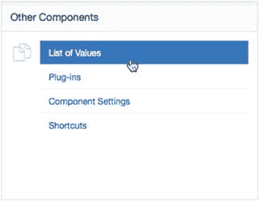

图 5-53. 其他组件选项

点击“创建”按钮以创建一个新的值列表。

选择“从头开始”作为创建值列表的方法，如图 5-54 所示。

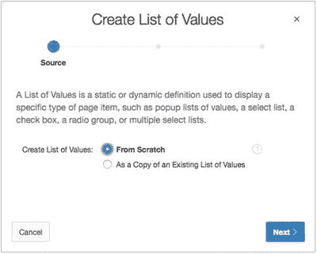

图 5-54. 从头开始创建值列表

点击“下一步”。

输入`TECHS`作为“名称”值，并选择“静态”作为“类型”，如图 5-55 所示。

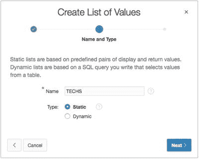

图 5-55. 将列表指定为静态

点击“下一步”。

在表单中输入表 5-3 所示的值。将你自己的名字添加到列表中！

表 5-3. 值列表的显示属性

| 显示值 | 返回值 |
| --- | --- |
| Scott | SCOTT |
| Doug | DOUG |
| Karen | KAREN |
| Martin | MARTIN |
| Patrick | PATRICK |
| Tim | TIM |
| （你的登录名） | （YOUR LOGIN NAME） |

完成后点击“创建值列表”。现在你已经创建了一个静态值列表，让我们再包含一个使用 SQL 查询来生成值列表的动态列表：

重复步骤 1 到 4。

创建第二个名为`USERS`的列表，选择“动态”选项。点击“下一步”。

找到书籍的补充文件`ch5_lov.txt`，其中包含 SQL 查询文本。将该 SQL 查询输入作为值列表的来源。

点击“创建值列表”。

你现在应该有两个值列表了。如果你不小心弄错了，也不用担心。所有的设置都可以修改——只需点击你想要修改的值列表的名称即可。

## 总结

在本章中，你创建了应用程序的基本框架以及将在后续章节中使用的若干支撑对象。这些项目是根据在开始创建应用程序之前所做的规划而创建的。根据你的情况，你为自己应用程序所做的规划量会有所不同。这里概述的共享组件可以在开发过程中的任何时间创建。在下一节中，你将开始使用这里概述的一些关键结构。

## APEX 表单

表单用于显示、编辑和收集数据，然后将数据发送回数据库进行处理。表单可以与表、视图（通过 `instead of` 触发器）、过程和 Web 服务进行交互。

一个 `APEX` 表单实际上是一组 `APEX` 对象的集合，它们作为一个单一、内聚的单元协同工作，对数据元素执行插入、更新和删除操作。一个 `APEX` 表单通常由一个区域、一个或多个项目、一个或多个按钮以及一个或多个处理与数据库交互的过程组成。`APEX` 表单向导会创建一个功能完备的表单所需的所有对象。

**注意**
表单生成后，其中的对象在逻辑上并无任何关联，它们只是共同构成一个完整的工作表单。虽然可以修改或删除单个元素，但如果引入错误，可能会导致表单无法正常工作；因此，不建议这样做。

图 6-1 中列出的 `APEX` 表单向导是创建 `APEX` 表单最快、最有效且最准确的方式。向导会引导你完成一系列步骤，收集表单类型所需的信息，然后生成所有必需的项目、过程和按钮。使用向导可以让你免于繁琐且易出错地逐个创建每个组件的任务。在向导创建表单之后，你可以（而且很可能需要）对生成的组件进行修改和增强，以使表单符合你的特定需求。

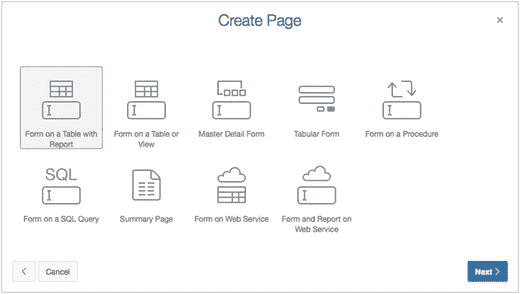
图 6-1. `APEX` 创建页面向导，显示表单选项

以下是使用图 6-1 中列出的向导可以创建的一些表单类型：

*   **基于表的带报表的表单**：一个建立在表或视图列上的表单，每个表列对应一个项目，一次处理一行数据，外加一个基于该表或视图内容的报表，并包含报表页和表单页之间的导航元素。
*   **基于表或视图的表单**：一个建立在表或视图列上的表单，每个表列对应一个项目，一次处理一行数据。
*   **主从表单**：建立在具有主从关系的一对表上的表单。`APEX` 主从表单向导会创建管理主从数据所需的所有数据、处理和导航元素。
*   **表格表单**：一个多行多列的表单（类似电子表格），允许一次性编辑多行和多列数据。
*   **基于过程的表单**：一个基于过程参数的表单，通常用于收集要传递给过程进行后续处理的数值。
*   **基于 SQL 查询的表单**：一个建立在 `SQL` 查询结果上的表单。由于其灵活性，这是一个非常强大的表单结构。
*   **摘要页**：一个只显示的表单，展示来自现有输入表单页面的选定项目。摘要页常用于为向导构建确认页。
*   **基于 Web 服务的表单**：一个基于 Web 服务参数的表单。
*   **基于 Web 服务的表单和报表**：一个基于 Web 服务参数的单行表单，附带所有数据行的相应报表，并包含在报表和表单之间来回移动的导航元素。

如果你查看可用的 `APEX` 表单向导，会发现其中几个会创建附带的报表（例如“基于表的带报表的表单”和“基于 Web 服务的表单和报表”向导）。常见的做法是使用基于表、视图或 Web 服务的报表来定位特定的数据行，然后在基于同一表、视图或 Web 服务的表单中编辑该数据。有些向导会直接为你创建报表和表单，包括使一切正常工作所需的所有导航元素和数据库事务处理过程。

## 基于表的表单

`APEX` 中最常见的表单类型之一是基于表的表单。`APEX` 基于表的表单向导会自动创建 `APEX` 项目并将其映射到数据库列，这使得为数据库表的录入和更新快速创建表单变得非常简单。作为开发者，你随后可以修改每列不同类型的数据控件。所有支持的 `HTML` 控件（文本框、文本区域、选择列表、单选按钮组、复选框等）都可用，此外还有一些 `APEX` 特有的控件。理解 `APEX` 基于表的表单向导功能的最佳方式就是使用它，那么让我们开始动手创建一个基于表的表单吧。

### 在表上创建表单

在本节中，你将创建帮助台系统的第 2 页，并向其添加一个表单。此表单将允许用户通过向 `TICKETS` 表插入一行来创建新的工单。你可以限制表单在 APEX 中可以执行的 DML 操作。在这种情况下，你将其限制为仅执行插入操作。

“表单向导”将引导你完成在表上生成表单所需的所有步骤：选择解析模式、选择作为表单基础的表、选择要包含和编辑的列、分配区域和表单标题，以及指定列标题。开始操作如下：

导航至你的应用程序的开发主页。此页面列出了应用程序中的所有页面。
点击屏幕右上角的 **创建页面** 按钮。
选择 **表单**，然后点击 **下一步**。
选择 **表或视图上的表单**，然后点击 **下一步**。
将 **表/视图所有者** 设置为你的模式，并为 **表/视图名称** 选择 `TICKETS`（表），如图 6-2 所示。点击 **下一步**。

图 6-2.

输入模式和表名
下一步允许你设置将由向导创建的页面和区域的一些详细信息。**页面编号** 可以设置为任何你希望的值，但它必须在应用程序内唯一。**页面名称** 设置应用程序运行时在浏览器选项卡中显示的文本，**区域标题** 设置在区域标题区域中显示的文本。**页面模式** 决定你正在创建的页面是普通的 APEX 页面，还是 APEX 5.0 内置的两种对话框之一：模态或非模态。模态对话框不允许与对话框下方的页面交互，而非模态对话框允许用户查看并与底层页面交互。**区域模板** 决定区域容器的视觉呈现方式。每个 APEX 主题都有多个可用模板，但你会发现 **标准** 模板使用得最多。继续操作如下：

输入 `2` 作为 **页面编号**，如图 6-3 所示。为 **页面名称** 和 **区域标题** 都输入 `创建工单`。将 **页面模式** 设置为 **正常**。将 **面包屑** 设置为 **面包屑**。页面刷新后，将 **上级条目** 设置为 **主页**，然后点击 **下一步**。

图 6-3.

指定页面、区域、模式和面包屑信息
接下来，你可以选择此页面如何与你已经定义的菜单系统关联（如果关联的话）。我们已经为这些页面在 **导航列表** 中创建了条目，因此我们将在创建页面时使用它们：

对于 **导航首选项**（图 6-4），选择 **为此页面标识现有导航菜单条目**。页面刷新后，将 **现有导航菜单条目** 设置为 **主页**，然后点击 **下一步**。

图 6-4.

指定导航选项
APEX 4 引入了使用 `ROWID` 作为主键的功能。这在处理具有多列自然主键的表时很方便，但该表已经定义了单列主键，因此你将使用该主键：

将 **主键类型** 设置为 **选择主键列**，确保 **主键** 设置为 `TICKET_ID`，然后点击 **下一步**。
该表的主键基于数据库中的序列，并且已经存在一个触发器，如果传入记录的主键为空，则使用下一个序列值填充主键，如下所示：

将 **源类型** 设置为 **现有触发器**，如图 6-5 所示，然后点击 **下一步**。

图 6-5.

指定主键填充选项
接下来，指定在表单上可见和可编辑的列。默认情况下，所选表中的所有列都会出现在选定列中。但是，对于这个简单的表单，你想要限制用户可以查看的列：

使用穿梭框，确保仅选择了 `SUBJECT`、`DESCR`、`CREATED_BY` 和 `STATUS_ID` 这几列，如图 6-6 所示，然后点击 **下一步**。

图 6-6.

选择要包含的列
并非所有表单都允许人们更新或删除数据。有些仅仅是数据录入表单。在这种情况下，你希望未经认证的用户能够提交工单，但你不想让他们能够编辑或删除这些工单。向导的下一步允许开发者选择最终用户可用的操作，并为这些操作相关的按钮命名。每个表单都应该有一个 **取消** 按钮，允许用户中止任何操作或数据录入。但其余的按钮是可选的：

*   **创建** 按钮：保存新记录
*   **保存** 按钮：保存对现有记录的更新
*   **删除** 按钮：删除现有记录

现在继续创建表单：

为 **取消按钮标签** 输入 `取消`，为 **创建按钮标签** 输入 `创建工单`。将 **显示保存按钮** 和 **显示删除按钮** 设置为 **否**，如图 6-7 所示，然后点击 **下一步**。

图 6-7.

指定要显示的按钮
当用户输入工单并单击按钮以取消数据录入或创建新工单时，你需要指定接下来会发生什么。APEX 是停留在同一页面？还是返回到主页？在此示例中，无论用户做出何种选择，你都希望将用户重定向到主页：

将 **提交时分支至此** 和 **取消时分支至此** 都设置为 `1`，然后点击 **下一步**。参见图 6-8。

图 6-8.

指定提交和取消的分支
与大多数向导一样，你会看到一个总结你选择的最终页面。此时，你可以使用 **上一步** 和 **下一步** 按钮在向导步骤中来回导航以更改你的任何选择。然后执行以下操作：

点击 **创建** 以完成向导。
运行你的应用程序。

恭喜！你刚刚在 `TICKETS` 表上创建了一个功能齐全的表单。该表单应与图 6-9 中的类似。

图 6-9.

运行 `TICKETS` 表上的表单

请注意，表单区域按你在步骤 6 中指定的方式标记，表单包含你在步骤 10 中选择的四个列的字段，并且 **创建工单** 按钮按你在步骤 11 中指定的方式标记。另请注意，这四个字段都是根据你在 第 4 章 为 `TICKETS` 表创建的 UI 默认值中指定的默认元素类型创建的。你为每个列指定的帮助文本都在那里，当你点击字段末尾的问号图标时，它会在新窗口中弹出。**取消** 按钮会带你到主页——第 1 页，正如你在步骤 12 中指定的那样。APEX 为你做了大量工作！

### 修改表单

APEX 向导处理了为你创建表单的大部分工作。然而，你很少不需要对向导创建的内容进行一些小的修改。现在你已经在应用程序的第 2 页上拥有了 **创建工单** 表单，你可以进行一些更改来稍微润色一下。

#### 修改标签模板

你将把 `P2_SUBJECT` 和 `P2_CREATED_BY`（对应于 `SUBJECT` 和 `CREATED_BY` 表列）的标签模板修改为 **必填带帮助**。使用 **必填带帮助** 标签模板向最终用户表明此字段是表单上的必填字段。但是，这并不会使字段本身成为强制性的。你稍后会进行设置。

你还将减小 `P2_CREATED_BY` 的宽度，以节省显示空间。请按以下步骤操作：

1.  编辑应用程序的第 2 页。
2.  在树状窗格的“渲染”选项卡中，点击项目名称 `P2_SUBJECT` 进行编辑。
3.  在属性编辑器中，滚动到“外观”属性组，如图 6-10 所示，将“模板”设置为 **必填**，然后点击“保存”。

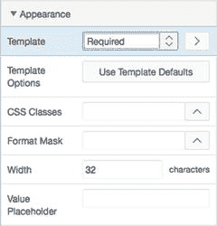
图 6-10. 修改标签模板

4.  在树状窗格的“渲染”选项卡中，点击项目名称 `P2_CREATED_BY` 进行编辑。
5.  在属性编辑器中，滚动到“外观”属性组，如图 6-11 所示。将“模板”设置为 **必填**，宽度设置为 `20`，然后点击“保存”。

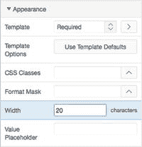
图 6-11. 设置显示属性

接下来，你想对用户隐藏 `P2_STATUS_ID` 项目，因为你希望用户不能更改此值。然而，你希望所有新建工单的默认状态为 `OPEN`。由于无法保证哪个 `STATUS_ID` 对应哪个 `STATUS`，因此你可以调用一个简单函数并传入 `STATUS`。该函数会返回对应的 `STATUS_ID`，并将其设置为 `P2_STATUS_ID` 的默认值：

1.  在树状窗格的“渲染”选项卡中，点击项目名称 `P2_STATUS_ID` 进行编辑。
2.  在“标识”属性组中，将“类型”设置为“隐藏”。
3.  在如图 6-12 所示的“默认”属性组中，将“类型”设置为 **PL/SQL 函数体**，并将默认值设置为 `RETURN get_status('OPEN');`。此函数是作为 第 4 章 中运行的脚本的一部分创建的。

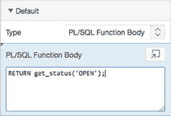
图 6-12. 指定默认值

4.  点击“保存”。

接下来，你希望将第 2 页设置为公共页面。你希望任何用户——无论是否经过身份验证——都能访问此页面：

1.  在树状窗格的“渲染”选项卡顶部，点击页面名称（第 2 页：创建工单）来编辑页面属性。
2.  将第 2 页设置为公共页面，然后点击“应用更改”。有关详细步骤，请回顾 第 5 章。

最后，你需要确保用户为“主题”和“创建者”字段输入值。在 APEX 中有两种方法可以使字段成为必填项。出于演示目的，你将对每个字段使用不同的方法。

#### 使字段成为必填项

对于“主题”字段，你将创建一个验证。虽然验证需要更多步骤，但它可以让你更好地控制验证的执行方式和时机。以下是你需要执行的操作，先对“主题”字段，然后对“创建者”字段：

1.  编辑应用程序的第 2 页。
2.  切换到树状窗格的“处理”选项卡，在树中的“验证”节点上右键单击，然后选择“创建验证”，如图 6-13 所示，以创建新验证。

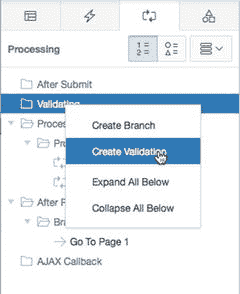
图 6-13. 选择创建新验证

3.  你将在验证树中看到一个高亮显示的新节点，其名称旁边有一个红色 X。这表示验证已创建，但必须填写某些属性。查看属性编辑器，你会看到许多属性以红色高亮显示，如图 6-14 所示。

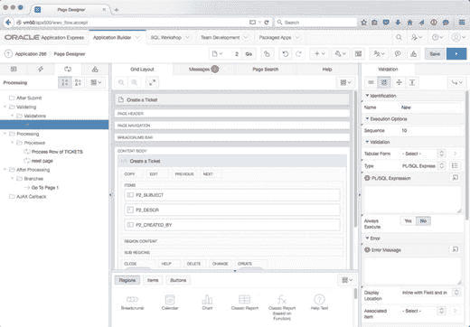
图 6-14. 需要完成的新验证

4.  现在，我们将填写验证所需的属性，如图 6-15 所示：

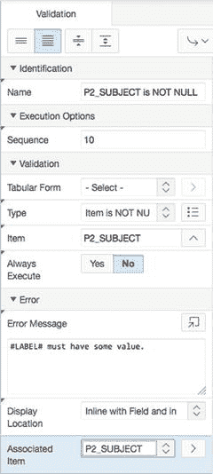
图 6-15. 输入新验证的详细信息

    -   在“标识”属性组中，将名称设置为 `P2_SUBJECT is NOT NULL`。
    -   在“验证”属性组中，将“类型”设置为 **项目不为空**，然后使用弹出选择列表，将“项目”设置为 `P2_SUBJECT`。
    -   在“错误”属性组中，将“错误消息”设置为 `#LABEL# 必须包含某个值`，并将“关联项目”设置为 `P2_SUBJECT`。
    -   点击“保存”。

5.  接下来，使用第二种方法使“创建者”字段成为必填项。为此，只需设置输入项目的一个属性：
    -   切换到树状窗格的“渲染”选项卡并编辑 `P2_CREATED_BY`。
    -   在属性编辑器中，导航到如图 6-16 所示的“验证”属性组，将“值必填”设置为“是”，然后点击“保存”。

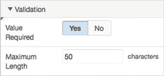
图 6-16. 使值成为必填

6.  如果你检查树状窗格的“处理”选项卡，会看到没有创建新的验证。这是因为你使用了项目级别的属性，而不是创建了完整的验证。项目级别验证与完整验证的主要区别在于，使用项目级别验证时，你无法有条件地控制属性何时应用，并且无法直接控制显示的错误消息。

继续并再次运行应用程序。此时，你应该能够将新工单输入系统，但在 SQL Workshop 之外无法看到它们。

### 深入幕后

现在你有一个可工作的表单了，让我们来看看 APEX 表单向导到底构建了什么，以便更深入地理解表单的工作原理。如果你安装了 Web Developer Toolbar 插件（适用于 Chrome 和 Firefox），可以使用 “Form » Display Form Details” 选项来显示表单详情。图 6-17 展示了显示了表单详情的 “Create a Ticket” 表单。

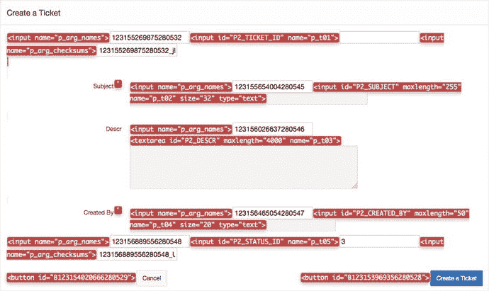
**图 6-17.** 显示了表单详情的 `TICKETS` 表单

> 注意
> Web Developer Toolbar 插件是一个由 Chris Pederick 编写的免费 Web 开发工具，可用于检查网页的各个方面。要了解更多关于 Web Developer 的信息，请访问 [`http://chrispederick.com/`](http://chrispederick.com/) 。

高亮显示的 `input` 标签展示了表单每个字段的输入标识符和名称。这两者对于每个表单字段都是唯一的。输入标识符是在列名前加上了页码。输入名称则标识了 APEX 在内部用于处理表单数据时使用的元素名称。请注意，那些你选择不在表单中显示的列，例如 `TICKET_ID` 和 `STATUS_ID`，仍然存在于页面的 HTML 中。

深入了解幕后会告诉你更多信息。编辑第 2 页，查看构成新表单的元素。

图 6-18 展示了树状面板中的三个选项卡：Rendering（渲染）、Processing（处理）和 Shared Components（共享组件）。Rendering 选项卡包含页面渲染所需的 APEX 对象。Processing 选项卡包含页面处理所需的对象，例如验证（validations）、进程（processes）和分支（branches）。Shared Components 选项卡包含跨页面共享的 APEX 对象，例如选项卡（tabs）、值列表（lists of values）、面包屑（breadcrumbs）、模板（templates）和安全方案（security schemes）。

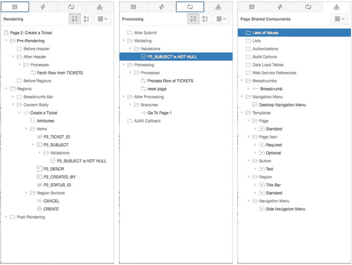
**图 6-18.** 从页面生成器（Page Builder）的各种树状面板中查看表单元素

对于你的新 “Create a Ticket” 表单，在 Rendering 选项卡中，你会看到向导已经为你通过向导选择的 `TICKETS` 表的每一个列创建了一个项（item）。还有两个分别名为 Cancel 和 Create 的按钮，以及一个 Fetch Row from TICKETS 进程。这个进程是一个自动行获取（Automated Row Fetch）进程，正如其名所示：它将指定表中的一行获取到当前表单中。自动行获取进程的属性指定了表所有者、表名、主键列、成功和失败消息以及一个条件。

注意 `TICKET_ID` 项存在于树中，但并未在表单上渲染，也未出现在网格布局（Grid Layout）中。在表单的 “Display Details” 视图（图 6-17）中，它作为页面上的第一个元素可见，但没有与之关联的可见元素。`TICKET_ID` 是一个隐藏项（hidden item）。APEX 隐藏项用于保存一个值，但尽管它们在页面上被渲染，用户却不可见。在这个例子中，隐藏的 `TICKET_ID` 列保存了 `TICKETS` 行的主键值。作为主键，`TICKET_ID` 被 APEX 进程用来从数据库提取数据，并处理对 `TICKETS` 行的插入、更新和删除操作。因为你不想让最终用户编辑主键，APEX 会自动为你将其隐藏。

在 Processing 选项卡中，你有一个 Process Row of TICKETS 进程、一个 Reset Page 进程和一个 Go To Page 1 分支。Process Row of TICKETS 进程正是做这件事：它使用对应于 `TICKETS` 表各列的项中的值，来处理 `TICKETS` 表的一行。这个进程在用户点击 Create 按钮时触发。Reset Page 进程会清除页面上的项。它在用户点击 Cancel 按钮时触发。

在 Shared Components 选项卡中，你需要展开 Navigation Menu 树节点，才能看到此页面使用了 Desktop Navigation Menu。展开 Breadcrumbs 区域会显示 Breadcrumb 对象。在 Templates 下，你会看到你的表单使用了 Standard 页面模板、Title Bar 和 Standard 模板、两个不同的 Page Item 模板以及默认的 Button 模板。

所有的 APEX 表单向导都会创建项、按钮和进程，但会根据表单类型的特定需求以不同的组合方式来创建。其他的 APEX 表单向导本质上以相同的方式工作，只是在进程类型和导航对象上略有差异，以适应底层数据源：表或视图、过程、查询或 Web 服务。接下来，让我们看一个基于过程（procedure）的表单。

## Form on a Procedure

在 APEX 中创建表单的另一种方式是基于 PL/SQL 过程的参数来创建。APEX 会调用关联的过程并执行其中嵌入的任何逻辑，而不是传统的 DML 进程。这种方法也被称为使用表 API（table APIs），因为如果你工作区模式中对表的所有访问都必须通过表 API 完成，那么就应该选择这个选项。

### Creating a Form on a Procedure

创建基于过程的表单与创建基于表的表单几乎相同。你将创建一个新页面，其中包含一个基于 `CONTACT_US` 存储过程的表单，该过程是在 第 4 章 的练习中创建的，它使用户能够通过 Help Desk 应用程序联系你：

1.  导航到你的应用程序开发主页。
2.  点击屏幕右上角的 Create Page 按钮。
3.  选择 Form，然后点击 Next。
4.  选择 Form on a Procedure，然后点击 Next。
5.  将 Procedure Owner 设置为你的模式，为 Stored Procedure Name 输入 `CONTACT_US`，如图 6-19 所示，然后点击 Next。

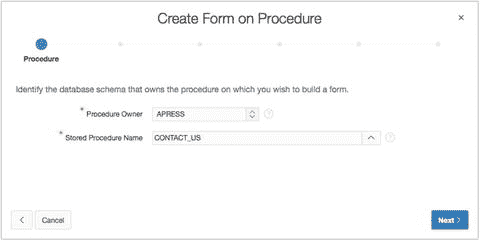
**图 6-19.** 创建基于存储过程的表单

6.  在页面的顶部区域，为 Page Number 输入 `3`，为 Page Name 和 Region Name 都输入 `Contact Us`，并将 Breadcrumb 设置为 Breadcrumb。当区域刷新后，选择 Home (Page 1) 将其设置为 Parent Entry，如图 6-20 所示，然后点击 Next。

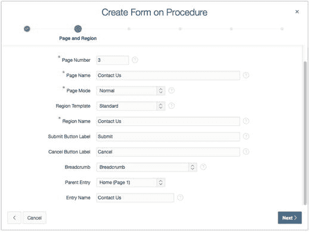
**图 6-20.** 选择面包屑父条目

7.  对于 Navigation Preferences，选择 Identify an existing navigation menu entry for this page。页面刷新后，将 Existing Navigation Menu Entry 设置为 Home，然后点击 Next。
8.  将 Invoking Page 和 Button Label 留空，然后点击 Next。
9.  为 Branch here on Submit 和 Branch here on Cancel 都输入 `1`，如图 6-21 所示。然后点击 Next。

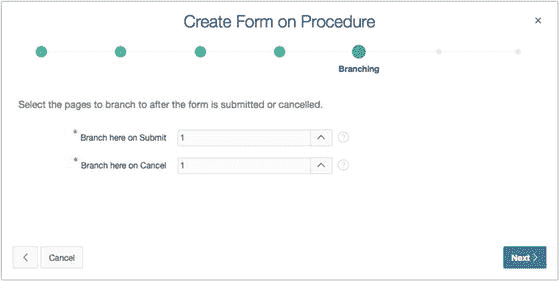
**图 6-21.** 指定分支选项

10. 在图 6-22 的对话框中，将 `P_FROM` 的 Label 设置为 From。将 P_BODY 的 Label 设置为 `Body`。将 P_BODY 的 Display Type 设置为 Textarea，然后点击 Next。

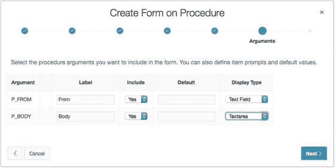
**图 6-22.** 指定过程参数

11. 点击 Create。

### 修改基于存储过程的表单

再次说明，向导已经完成了大部分工作，但在您的基于存储过程的表单完成之前，您还需要进行一些小的修改。您希望`发件人`和`邮件正文`这两个值都是必填的，因此需要更改它们的标签模板，并将其`值必需`属性设置为`是`。这次我们将使用 APEX 5.0 中的一个新功能，它允许我们同时编辑多个组件的属性。请执行以下操作：

编辑应用程序的第 3 页。
通过单击其名称选择`P3_FROM`。
按住 CTRL 键（在 Mac 上是 Command 键），通过单击其名称选择`P3_BODY`。此时，两个元素都应被选中。现在，如果您查看属性编辑器，您会看到有几个选项具有蓝色背景，并且标签左侧有一个灰色的三角符号（Δ）。这表示您选择的组件对于这些选项具有不同的值。这只是一个视觉提示，让您知道这些字段实际上可能并非空白，只是 APEX 无法显示组件之间的不同值。我们将继续更改通用属性，如下所示：

在`外观`属性组中，将`模板`更改为`必填`。
在`验证`属性组中，将`值必需`更改为`是`。

我们现在只想更改`P3_BODY`的几个属性。因此，我们必须取消选择所有其他内容，以免意外地也更改它们的属性。请记住，只要您没有单击`保存`按钮，您始终可以使用`撤销`按钮逐步撤回您的操作。要选择`P3_BODY`并取消选择所有其他内容：

在树形窗格的“呈现”选项卡中，单击`P3_BODY`。
在`外观`属性组中，将`宽度`设置为`80`，`高度`设置为`5`。

接下来，将第 3 页设置为公共页面。您希望任何用户——无论是已认证还是未认证——都能通过“联系我们”页面向您发送消息：

将第 3 页设置为公共页面。有关详细步骤，请回顾第 5 章。

最后，修改已创建的流程以包含成功消息：

切换到树形窗格的“处理”选项卡。
通过单击其名称编辑流程`运行存储过程`。
在`成功消息`属性组中，为`成功消息`输入以下内容：`您的消息已发送。`
滚动到顶部并单击`保存`。

运行您的应用程序并测试“联系我们”表单。每次您提交一条记录，一封电子邮件就会被发送到`info@example.com`。如果您想更改电子邮件的目标地址，可以使用 SQL Workshop 的对象浏览器来编辑`CONTACT_US`存储过程。

### 探究幕后机制

从用户的角度来看，没有迹象表明您刚刚创建的表单是基于存储过程创建的。在页面构建器中查看，页面呈现部分中的对象与您在第 2 页基于表的表单中看到的类似，但又不完全相同。让我们来看看是什么让您的基于存储过程的表单不同于基于表的表单。编辑应用程序的第 3 页。树形窗格的不同选项卡如图 6-23 所示。

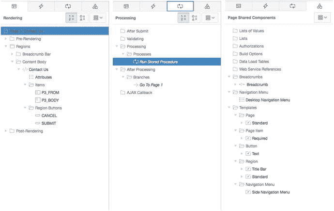

图 6-23. 从页面构建器的各种树形窗格中查看到的基于存储过程的表单元素

在“呈现”选项卡中，您有两个项目，`P3_FROM`和`P3_BODY`，对应于您的两个表单字段：发件人和邮件正文。有两个按钮，`取消`和`提交`。

在“处理”选项卡中是一个流程和一个分支。但是，这个流程是不同类型——一个 PL/SQL 匿名块。这种强大的流程类型执行“源”元素中指定的 PL/SQL 过程。该 PL/SQL 过程可以是一个存储的 PL/SQL 过程或一个匿名的 PL/SQL 块，只要代码在`BEGIN`语句和`END`语句之间语法正确即可。在这个案例中，该流程使用`P3_FROM`和`P3_BODY`项目的值作为输入参数来调用`CONTACT_US`过程。`CONTACT_US`过程的主体就是创建和发送电子邮件的部分。因此，基于表的表单与基于存储过程的表单之间的关键区别，在于点击“创建”按钮时执行的页面处理流程。APEX 向导自动为所选的表单类型提供了所需的流程类型。

“共享组件”区域包含表、面包屑和页面、选项卡、区域、标签以及按钮模板的标准条目，这与基于表的表单相同。同样，表单向导为您创建了所有这些元素，真是太好了。

## 主从报表与表单

APEX 中最受欢迎的功能之一就是主从表单向导。通过一个简单直观的向导，您可以快速创建报表及相应的表单，以管理以主从关系存储的数据。让我们使用这个向导为`TICKETS`和`TICKET_DETAILS`表创建报表和表单。

### 创建主从报表与表单

首先，您需要在应用程序的第 200、210 和 220 页上创建报表和表单。由于您尚未创建这些页面，向导会为您完成。

1.  导航至您应用程序的 Application Builder 主页。
2.  点击屏幕右上角的 **创建页面** 按钮。
3.  选择 **表单**，然后点击 **下一步**。
4.  选择 **主从表单**，然后点击 **下一步**。参见图 6-24。
5.  将 **表/视图所有者** 设置为您的 schema。
6.  将 **表/视图名称** 设置为 `TICKETS`（表）。页面刷新后，默认会选中该表中的所有列。点击 **下一步**。

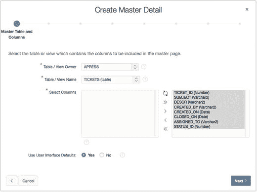
*图 6-24. 创建主表*

处理主从关系时，通常在明细表和主表之间存在外键。然而，情况并非总是如此。在明细表步骤中，向导允许您选择是否只显示通过外键关联的表。本例中，这些表确实存在关联，因此您可以保持 **仅显示相关表** 设置为 **是**。

7.  为 **表/视图名称** 选择 `TICKET_DETAILS`。页面刷新后，请确保以下列被移至右侧的 **已选中** 区域。最终结果应与图 6-25 类似。

    *   `TICKET_DETAILS_ID`
    *   `TICKET_ID`
    *   `DETAILS`
    *   `CREATED_BY`
    *   `CREATED_ON`
    *   `ATTACHMENT`

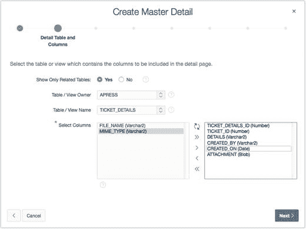
*图 6-25. 定义明细表*

8.  点击 **下一步**。
9.  将主表的 **主键类型** 设置为 **选择主键列**。
10. 对于 **主键列 1**，选择 `TICKET_ID`（数字）。
11. 将明细表的 **主键类型** 设置为 **选择主键列**。
12. 对于 **主键列 1**，选择 `TICKET_DETAILS_ID`（数字）。
13. 点击 **下一步**。
14. 将主表的 **主键源** 设置为 **现有触发器**，然后点击 **下一步**。
15. 将明细表的 **主键源** 设置为 **现有触发器**，然后点击 **下一步**。
16. 如图 6-26 所示，将 **包含主行导航？** 设置为 **是**。
17. 将 **主行导航顺序** 设置为 `CREATED_ON`，然后点击 **下一步**。

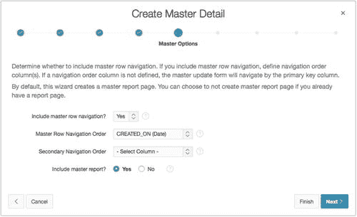
*图 6-26. 定义主行导航选项*

**此时请勿点击完成。**

18. 将 **使用以下项构建主从关系** 设置为 **在单独页面编辑明细**，然后点击 **下一步**。
19. 在下一页，将各项设置为图 6-27 所示的值。

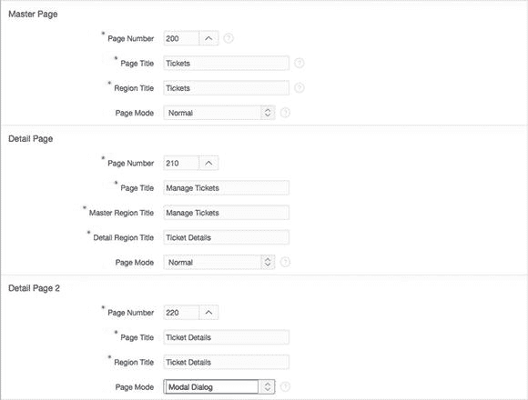
*图 6-27. 指定页面属性*

20. 将 **面包屑** 设置为 **面包屑**。
21. 区域刷新后，在 **创建面包屑条目** 部分，将各项设置为图 6-28 所示的值。

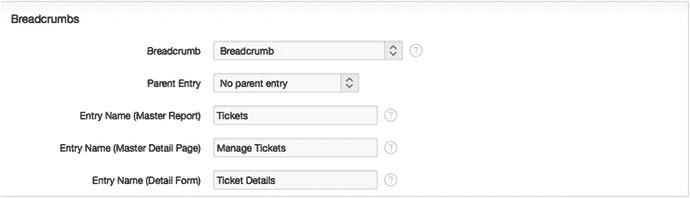
*图 6-28. 创建面包屑条目*

22. 点击 **下一步**。
23. 将图 6-29 中的 **导航首选项** 设置为 **创建新的导航菜单项**。
24. 页面刷新后，在 **新建导航菜单项** 中输入 `Tickets`，并将 **父导航菜单项** 保持为 `- 未选择父项 -`。
25. 点击 **下一步**。

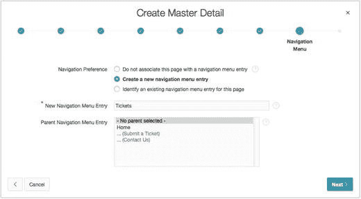
*图 6-29. 设置导航选项*

26. 确认您的选择，然后点击 **创建**。

向导完成后，您将获得一个基于 `TICKETS` 和 `TICKET_DETAILS` 表的可用主从表单，以及一个基于 `TICKETS` 表的报表。这可能比您预期的多了一个报表，但 APEX 知道在大多数情况下，您需要报表来选择要编辑的主从记录，因此为方便起见，同时创建了该报表。

主从表单向导创建了一个报表和两个表单，以及用于导航的链接和分支，还有执行数据库事务的进程。**工单** 报表有一个指向**工单** 表单的链接，该表单允许编辑工单主数据并列出工单明细。**管理工单** 页面上的 **工单明细** 区域有一个指向**工单明细** 模态对话框的 **编辑** 链接，用户可以在其中添加、更新或删除工单明细信息。所有项目、按钮、进程甚至列链接均由主从表单向导创建。

再次强调，虽然您可以手动构建主从表单和报表，但向导速度更快且效率更高。现在，让我们对报表和表单进行一些调整以满足您的要求。

