# 修改主从报表

接下来，让我们修改该报表以添加 CSV 导出功能、更改排序选项并修改日期格式掩码。然后我们将清理两个编辑表单。步骤如下：

1.  编辑应用程序中的页面 `200`。
2.  在树状窗格的“渲染”选项卡中，高亮显示 `Tickets` 报表中除 `TICKET_ID` 和 `DESCR` 外的所有列，如图 6-30 所示。
    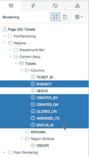
    *图 6-30. 选择编辑报表属性*
3.  在“属性编辑器”中，导航到“排序”属性组，将 `可排序` 设置为 `是`。
4.  选择报表的 `DESCR` 列，在“属性编辑器”中，将 `类型` 更改为 `隐藏列`。参见图 6-31。
    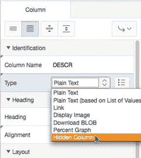
    *图 6-31. 编辑列属性*
5.  在树状窗格的“渲染”选项卡中，单击 `Tickets` 报表的“属性”子节点。
6.  在“属性编辑器”中，导航到“分页”属性组，将 `部分页面刷新` 设置为 `是`。
7.  在“下载”属性组中，将 `启用 CSV 导出` 设置为 `是`。该部分刷新后，设置以下选项（您也可以在图 6-32 中看到）：
    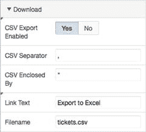
    *图 6-32. 设置报表导出选项*
    *   `分隔符`: `,`
    *   `包含于`: `"`
    *   `链接文本`: `导出到 Excel`
    *   `文件名`: `tickets.csv`
8.  在树状窗格的“渲染”选项卡中，通过单击其名称编辑 `CREATED_ON` 列。
9.  在“外观”属性组中，使用弹出的值列表选择 `Monday, 12 January, 2004` 作为 `格式掩码`。选择它会将 `fmDay,fmDD fmMonth,YYYY` 返回到“数字/日期格式”字段中，如图 6-33 所示。
    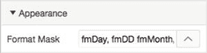
    *图 6-33. 选择日期格式掩码*
10. 在“列格式”属性组中输入的 CSS 和 HTML 格式化指令在页面呈现时应用于报表列。在“列格式”属性组中，为 CSS 样式字段输入 `font-weight:bold`（图 6-34）。
    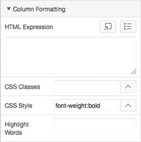
    *图 6-34. 选择列格式化选项*
11. 通过单击其名称编辑 `TICKET_ID` 列。
12. 在“导出/打印”属性组中，将 `包含在导出/打印中` 设置为 `否`，然后单击“保存”。
13. 运行页面以查看您的更改。

请注意，当您按日期对 APEX 报表列进行排序时，报表是根据实际日期值而非显示值进行排序的。这是 APEX 的内置功能。同样，当您导出到 Excel 时，`TICKET_ID` 列不会出现在生成的 CSV 文件中，这是您将 `包含在导出中` 选项设置为 `否` 的结果。

接下来，移除 `STATUS_ID` 并通过稍微调整查询，将相应值拉入报表中以替换它：

1.  编辑应用程序中的页面 `200`。
2.  通过单击渲染树中区域的名称来编辑 `Tickets` 报表。
3.  在“源”属性组中，单击右上角靠近 SQL 查询定义的“代码编辑器”按钮。这将展开一个编辑器窗口，允许您更好地编辑 SQL 语句。
4.  找到并打开文件 `ch6_add_status_to_report.txt`（您可以在之前提取类文件的位置找到它），将其内容复制到代码编辑器中，替换当前所有文本，然后单击“确定”关闭代码编辑器。参见图 6-35。
    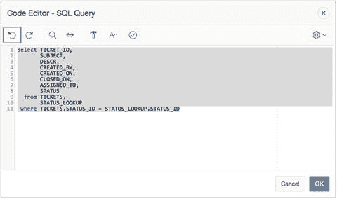
    *图 6-35. 将新查询文本粘贴到代码编辑器中*

现在，我们将使用简单的拖放操作重新排序报表中的列。在本例中，我们希望将 `STATUS` 列移动到 `TICKET_ID` 和 `SUBJECT` 列之间。您可以按如下方式操作：

1.  在渲染树中，单击并拖动 `STATUS` 列从列表底部，并在指示器显示其位置位于 `TICKET_ID` 和 `SUBJECT` 之间时释放，如图 6-36 所示。
    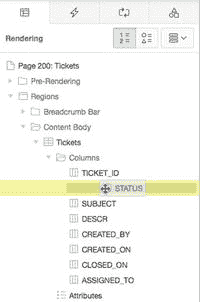
    *图 6-36. 使用拖放操作重新排序报表中的列*
2.  保存您的更改。

运行应用程序以查看对 `Tickets` 报表的更改。您应该会看到如图 6-37 至 6-39 所示的结果。“创建时间”和“状态”值现在更易读，并且您可以通过单击列标题按列排序。
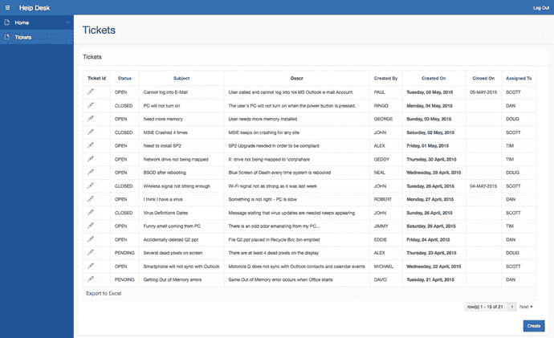
*图 6-37. Tickets 报表*
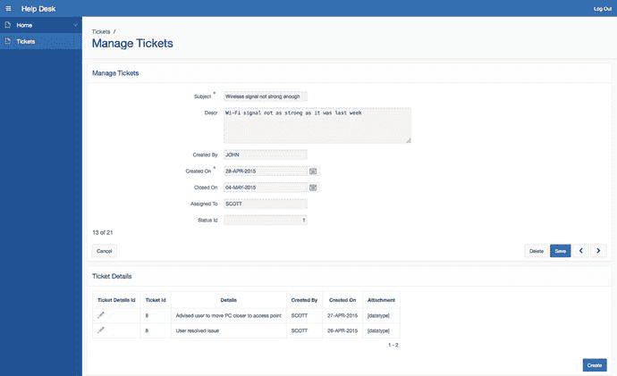
*图 6-38. 管理 Tickets 表单*
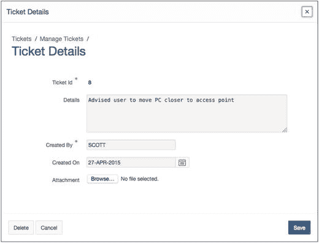
*图 6-39. Ticket 详情表单*

## 会话状态

接下来，让我们向报表添加一个搜索字段，以允许用户筛选他们可能感兴趣的特定工单。在我们开始之前，先简要解释一下会话状态，以帮助您理解 APEX 如何跟踪与用户会话关联的值。

### 理解会话状态

会话状态使 APEX 能够跟踪属于特定用户 APEX 会话的所有值。当用户在应用程序中从一个页面移动到另一个页面时，会话状态对于跟踪值特别有用。

与有状态的数据库应用程序（其中连接持续保持，所有值都会保留直到被更改或移除，或者会话结束）不同，APEX 应用程序不维护到数据库的持续连接。APEX 是一个无状态系统——APEX 引擎根据存储在 APEX 存储库中的指令生成 HTML 页面。每个页面呈现都是一个无状态事务。APEX 会话将无状态的 HTML 页面连接在一起。

APEX 会话在逻辑和物理上都与底层数据库会话不同。数据库会话是有状态的，而 APEX 会话是无状态的。为了说明区别，可以将数据库会话想象成固定电话上的通话。双方在通话期间保持连接。双方都必须投入资源来进行对话。即使没有人说话，连接——以及双方之间的链接——仍然存在，如图 6-40 所示。
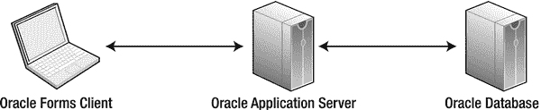
*图 6-40. 数据库会话通信*

可以将 APEX 会话想象成短信。双方没有直接连接；他们一次向一个方向推送信息，即使整个交流是通过一系列短信进行的对话。图 6-41 说明了 APEX 无状态会话通信。
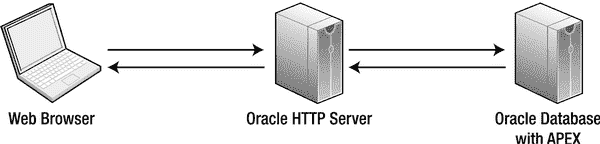
*图 6-41. APEX 会话通信*


### 共享数据库连接

多个 APEX 用户可以共享同一个数据库连接。APEX 用户与数据库会话之间存在一对多关系。这就是为什么 APEX 能够如此高效地扩展——它不需要为每个用户分配专用的数据库会话，只需一个数据库会话来处理用户请求即可。

APEX 是无状态的，必须依赖外部机制来管理会话状态。APEX 引擎内置了一个会话状态管理组件。这种会话状态管理是 APEX 不可或缺的一部分——无法被禁用或规避。

每个 APEX 用户都被分配一个唯一的会话标识符。无论用户如何向系统认证——APEX 认证、数据库认证、自定义认证或公开用户——会话状态管理的功能都是相同的。是的，即使是未认证的用户也会被分配一个会话标识符。默认情况下，APEX 每 8 小时会清除一次超过 24 小时不活动的会话。APEX 会话状态值存储在数据库的一个表中。APEX 引擎通过会话标识符来识别用户，并检索与该用户会话对应的一组会话状态值。

所有 APEX 项（包括页面项和应用项）的值都与这个唯一的会话标识符绑定。该标识符被称为 `APP_SESSION_ID`。在大多数 APEX 应用程序的页面 URL 中，您都可以看到这个会话标识符。它在图 6-42 中被突出显示。


图 6-42.
APEX URL 中的会话标识符

### 设置和检索会话状态

会话状态由用户输入项、计算、进程和 PL/SQL 代码设置。在 PL/SQL 中，如果在 APEX 进程内，您可以将一个项设置为等于一个值，如下所示：
```
:P1_ITEM_NAME := 'some value';
```

在 PL/SQL 中，如果在存储过程中，您可以使用 `apex_util.set_session_state` 过程来设置会话状态中的值，如下所示：
```
apex_util.set_session_state( 'P1_ITEM_NAME', 'some value');
```

检索项会话状态的语法根据引用项的位置而有所不同。

在模板、区域、选项卡、菜单或列表中，使用以下替代字符串语法（别忘了结尾的点！）：
`&P1_ITEM_NAME.`

在 SQL 语句中使用以下语法：
`:P1_ITEM_NAME`

在 PL/SQL 中，根据您所在的程序块类型，使用以下两种选项之一：
匿名 PL/SQL 块：`:P1_ITEM_NAME.`
从 APEX 调用的 PL/SQL 单元：`V('P1_ITEM_NAME')`

在条件内部，使用此语法：
`P1_ITEM_NAME`

注意
上面提到的 `V` 函数是 APEX 提供的一个函数，用于检索 APEX 项的会话状态值。使用此函数时需谨慎，因为在存储程序单元中使用它可能会引入性能问题。

### 查看会话状态

要查看会话状态，请点击开发者工具栏上的“会话”链接。您应该会看到一个类似于图 6-43 所示的页面。然后使用页面、查找和视图参数来查看应用程序的会话状态。图 6-44 中所示的下拉“视图”菜单允许您查看页面项、应用项、会话状态、集合以及上述所有内容。

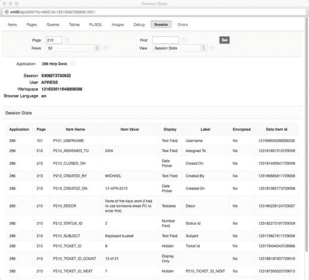
图 6-44.
选择查看应用程序中所有项的会话状态

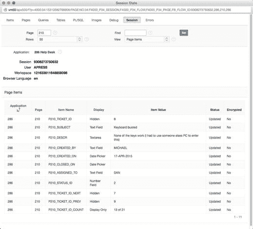
图 6-43.
查看页面项的会话状态

## APEX 项

APEX 项有两种类型：页面项（在页面上向用户显示）和应用项（在应用程序中保存值但不显示）。在查询中引用这两种类型的项值时，您应使用绑定变量。您可能还需要引用一些可用的内置项。

### 页面项与应用项

APEX 页面项是让用户查看和输入数据的 UI 控件——文本字段、文本区域、选择列表、复选框等。页面项与特定页面相关联，并具有相关的 UI 属性；项根据 UI 属性向用户显示（或不显示）。图 6-45 显示了可用的 APEX 页面项类型，作为组件库的一部分展示。有关页面项类型及其属性的更多信息，请参阅 APEX 文档。

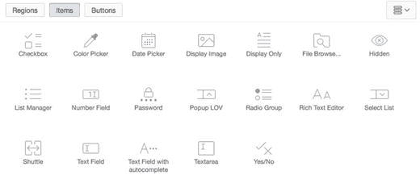
图 6-45.
APEX 页面项类型

应用项不与任何页面关联，也没有 UI 属性。它们在应用程序中保存至关重要但不一定显示的值。您可以像使用全局变量一样使用应用项。例如，您可能需要根据用户所在的州计算销售税。您可以在用户登录时从表中读取该销售税百分比，并将值保留在应用项中，供整个用户会话期间使用。

### 绑定变量的重要性

当引用 APEX 项值时，特别是在 APEX 应用程序的 SQL 查询中，考虑 SQL 安全基础（包括 SQL 注入）非常重要。考虑一个在线表单的示例，该表单允许用户使用用户名和密码登录，最终执行以下查询：
```
SELECT COUNT(*) FROM users
WHERE username = '&username'
  AND password = '&password'
```

如果您输入此密码
`I_dont_know OR 'x' = 'x`

产生的 SQL 是
```
SELECT COUNT(*) FROM users
WHERE username = 'SCOTT'
  AND password = 'I_dont_know' OR 'x' = 'x'
```

这条 SQL 语句错误地返回了 `1`（表示 `True`），而不是 `未找到数据`。用户被允许登录！这不好。为了防止注入非预期的 SQL，请在 SQL 查询中使用绑定变量，如下所示：
```
SELECT COUNT(*) FROM users
WHERE username = :USERNAME
  AND password = :PASSWORD
```

现在尝试输入以下内容作为密码：
`I_dont_know OR 'x' = 'x`

除非这整个字符串确实是您的密码，否则数据库会返回 `未找到数据`。您尝试绕过登录的企图失败了。

我们建议尽可能使用绑定变量。它们可以防止 SQL 注入并提高 SQL 性能。

### 内置项

APEX 包含几个用于引用关键 APEX 应用程序范围会话状态值的内置项。这些由 APEX 自动设置，可供开发者在整个 APEX 中引用。其中最常见的如下：

*   `APP_ID`：当前运行应用程序的应用标识符
*   `APP_ALIAS`：当前运行应用程序的应用别名
*   `APP_USER`：当前登录的用户
*   `APP_SESSION`：当前登录用户的会话标识符
*   `APP_PAGE_ID`：当前运行的页面标识符


## APEX URL 语法

每个 APEX 页面都是对 APEX 引擎的一次调用。每个 APEX URL 实际上都是对特定页面的调用，并传递各种参数。图 6-46 展示了 URL 语法。

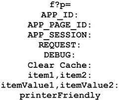

图 6-46. APEX URL 语法

`f?p` 是对 `f` PL/SQL 过程的调用，传递参数 `p`。该参数实际上是九个参数的串联组合，以冒号分隔。`p` 参数的这九个元素对于所有 APEX 页面请求都是相同的。你可以省略一个或多个参数，但必须包含冒号分隔符作为占位符。

构成 `p` 参数的元素如下：

*   `APP_ID`：应用程序编号或别名
*   `APP_PAGE_ID`：页面编号或别名
*   `APP_SESSION`：APEX 会话标识符
*   `REQUEST`：HTML 请求
*   `DEBUG`：调试标志，设置为 `YES` 或 `NO`，或省略以使用调试标志的当前值
*   `Clear Cache`：要清除缓存的页面列表
*   Item names：APEX 项名称列表，以逗号分隔
*   Item values：APEX 项值列表，以逗号分隔，与项名称列表中指定的项顺序对应
*   `Printer Friendly`：决定页面是否以打印机友好模式呈现的标志

通过查看几个示例来理解 APEX URL 语法最为容易。表 6-1 展示了几个示例并进行了解释。

表 6-1. APEX URL 示例

| URL | 描述 |
| --- | --- |
| `f?p=&APP_ID.:10:&APP_SESSION.:::10` | 使用当前会话调用当前应用程序的第 10 页，并清除第 10 页的会话缓存 |
| `f?p=&APP_ID.:5:&APP_SESSION.::NO::P2_ID:1234` | 使用当前会话调用当前应用程序的第 5 页，不处于调试模式，将 `P2_ID` 的值设置为 1234 |
| `f?p=&APP_ID.:5:&APP_SESSION.::YES` | 使用当前会话以调试模式调用当前应用程序的第 5 页 |

如你所见，APEX URL 不仅为服务器提供了指示，也是你了解正在请求哪个页面、使用什么请求以及携带什么值的关键。那么，这种 URL 语法如何与你在“服务台”应用程序中的工作联系起来呢？

APEX 应用程序将所有值存储在 APEX 会话中，该会话安全地绑定到特定用户和用户会话。存储在此用户会话中的值可以由开发人员轻松设置或读取。任何项——应用程序级或页面级——都可以从 APEX 应用程序内的任何位置轻松引用。这些值可以作为 `p` 参数的一部分被引用并传递给 APEX，以控制呈现哪个 APEX 页面以及该页面上显示的值。

随着系统中数据量的增长，你需要一种快速的方法来对其进行排序并控制将什么数据传递到哪个页面。你可以添加一个页面项，然后使用该项的值来过滤应用程序第 200 页报表的 SQL 语句。实际上，APEX 中的项可以通过使用绑定变量语法 (`:P1_ITEM_NAME`) 在 SQL 或 PL/SQL 区域中被引用，例如在查询的谓词中，也可以作为 APEX URL 的一部分被引用。

回到向导生成的“工单”报表，你可以应用刚刚学到的关于会话状态、APEX 项和 APEX URL 的知识，添加一个名为 `P200_SEARCH` 的新项，用户可以使用它来过滤报表。完成这些报表修改后，让我们更仔细地看看 APEX 报表的组件和属性。

## 可搜索的 APEX 报表

带有“编辑”链接的报表允许用户扫描行列表并选择一行进行修改。扫描对于较短的报表效果很好，但当报表较长，特别是超过一两页时，就需要添加一些搜索功能来帮助用户快速定位要编辑的记录。

### 创建可搜索的 APEX 报表

你已经修改了由主详细信息表单向导生成的“工单”报表，添加了排序、CSV 导出功能和可读的状态值。按生成时的样式，报表的第一列有一个“编辑”链接，该链接导航到“工单—工单详情”主详细信息表单。为了让用户找到要编辑的正确工单，你需要一个搜索功能。在接下来的步骤系列中，你将添加一个搜索项和一个“执行”按钮来激活搜索，并将修改报表查询以根据搜索值进行过滤。我们将使用两种不同的方法将这些项放置在网格布局中。要知道两种方法效果相当；使用哪种取决于你更习惯哪一种。首先，让我们创建搜索字段：

1.  编辑应用程序的第 200 页。
2.  通过右键单击“工单”区域名称并选择“创建页面项”，在该区域中创建一个新项。
3.  在“属性编辑器”中，为“名称”输入 `P200_SEARCH`，并将“标签”设置为 `搜索`，如图 6-47 所示。

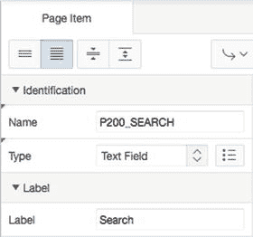

图 6-47. 设置新创建项的属性

4.  在“设置”属性组中，将“按下回车键时提交”属性的值设置为“是”。尽管你刚刚设置了项属性以在按下 Enter 键时提交页面，但提供一种使用鼠标提交页面的方法仍然是个好习惯。接下来，你将使用组件库并通过拖放来创建一个新按钮，该按钮在被点击时处理项值，将其存储在会话状态中，然后重新加载第 200 页：
5.  在屏幕底部的“组件库”中，选择“按钮”作为组件类型。点击并拖动“文本”按钮，将其直接放置在你上一步创建的 `P200_SEARCH` 项旁边，如图 6-48 所示。

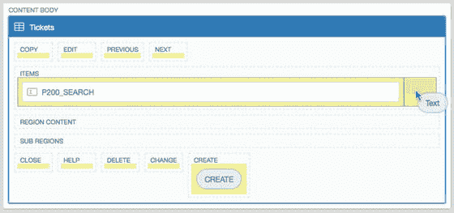

图 6-48. 为搜索功能创建“执行”按钮

6.  在“属性编辑器”中，输入 `P200_GO` 作为“按钮名称”，`执行` 作为“标签”。保持所有其他属性不变。接下来，你将调整报表查询以应用 `P200_SEARCH` 过滤器。你将在查询谓词中添加一行，使用存储在 `P200_SEARCH` 中的值作为过滤器：
7.  通过在“渲染”树中单击其名称来编辑“工单”区域定义。
8.  单击“SQL 查询”属性右上角的“代码编辑器”按钮。
9.  将以下行附加到查询末尾，然后单击“确定”：

```
AND UPPER(subject) LIKE '%'||UPPER(:P200_SEARCH)||'%'
```

10. 保存并运行你的报表。记得同时测试按钮和在编辑搜索字段时按回车键。两者都应能正确过滤报表。


### 添加重置分页功能

每当向页面添加一个搜索项时，非常建议同时添加一个重置分页进程。这样可以防止 APEX 报表引擎在结果集中“迷路”。在这种情况下，创建该进程只有一种方式，因为组件面板中没有现成的进程组件：

编辑应用程序的第 200 页。
导航到树形面板的 **处理** 选项卡。
右键单击树中的“处理”节点，并从上下文菜单中选择“创建进程”。
在属性编辑器中，将**名称**设置为 `Reset Pagination Process`，并将**类型**选择为“重置分页”，如图 6-49 所示。

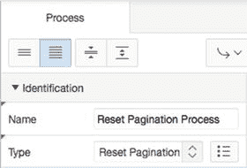
图 6-49. 指定进程选项

保存并运行应用程序。

搜索功能应该在用户按下回车键和点击“执行”按钮时都能工作。但让我们再进一步，修改 `Subject` 列，使搜索项以红色高亮显示：

编辑应用程序的第 200 页。
导航到渲染树，单击 `Subject` 列的名称进行编辑。
在属性编辑器中，找到“列格式化”属性组，并在“突出显示词”元素中输入 `&P200_SEARCH.`。请确保包含末尾的句点 (.)。如果忘记了，变量将无法正确解析，因此值也不会被高亮显示。此过程利用 APEX 会话状态来指示用户输入到 `P200_SEARCH` 中的值应用来高亮显示 `Subject` 列中相同的文本。继续如下操作：
保存并运行您的应用程序。

现在，当您输入一个搜索值时，匹配的行将被返回，并且搜索项会以红色高亮显示。仅仅几分钟内，您就为您的服务台系统创建了一个可排序、可搜索的报表。让我们看看这个报表在幕后是什么样子。图 6-50 展示了从树形面板的各个选项卡中看到的组件。

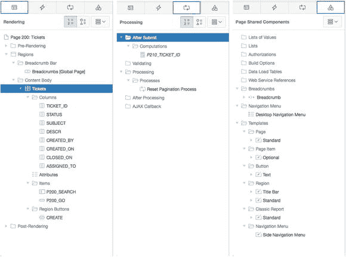
图 6-50. 从树形面板的各个选项卡看到的可搜索报表

### 深入幕后——APEX 报表

让我们更仔细地看看 Tickets 报表的组件和属性。编辑第 200 页，查看应用程序构建器中的**渲染**、**处理**和**共享组件**选项卡。在**渲染**选项卡中，您有一个包含报表列的 `Tickets` 区域、您刚刚为搜索功能添加的两个项，以及一个“创建”按钮。单击 `Tickets` 区域名称以选中它。现在，在**属性**窗格中，您可以看到如图 6-51 所示的详细信息。

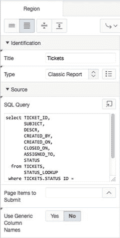
图 6-51. 带有搜索过滤器的 Tickets 报表区域源

您可以看到，区域类型是“经典报表”。此区域的源是您在 `TICKETS` 表上执行的 SQL 查询，其中修改了 `WHERE` 子句以添加对 `P200_SEARCH` 项的过滤，并将 `P200_SEARCH` 引用为绑定变量。如果愿意，您可以使用“代码编辑器”按钮来更好地查看 SQL 语句。

通过单击页面左侧渲染树中的“属性”子节点，您可以查看和编辑报表区域的视觉属性。此外，在渲染树中您可以看到报表列的列表。

通过选择一列或多列，您可以调整标题、列宽、列对齐方式和标题对齐方式；您还可以决定是否显示该列、是否需要求和以及是否要对该列启用排序。可以通过拖放它们来重新排列列的顺序。

在共享组件树中，您可以看到导航、面包屑导航和页面的预期对象，以及区域、报表、标签和按钮模板。这并不新鲜，但值得高兴的是向导已经为您构建了这些。

接下来，让我们关注 Tickets 和 Ticket Details 表单，这是主从表单向导生成的其他组件。

### 深入幕后——APEX 主从表单

编辑第 210 页，查看应用程序构建器中的**页面渲染**、**页面处理**和**共享组件**区域。您应该看到类似于图 6-52 所示的结果。

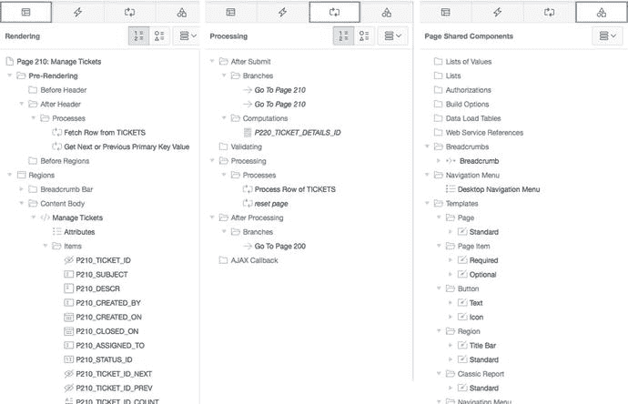
图 6-52. 从树形面板的各个选项卡看到的主从页面

在**渲染**选项卡中，您有两个“页眉后”进程、一个包含表单项的 `Manage Tickets` HTML 区域，以及一个 `Ticket Details` 报表区域。

两个“页眉后”进程，`Fetch Row from TICKETS` 和 `Get Next or Previous Primary Key Value`，其功能正如其名所示。当页面传递一个 `TICKET_ID` 时，`Fetch Row from TICKETS` 进程会从 `TICKETS` 表中获取一行数据以在表单中显示。`Get Next or Previous Primary Key Value` 进程获取序列中的下一个或上一个 `TICKET_ID` 值，并与主从页面上的“下一个”和“上一个”按钮协同触发。

`Manage Tickets` 区域包含一个 APEX 项，对应您选择包含在主从表单中的每个 `TICKETS` 列，以及用于取消、删除、保存、创建、下一个和上一个操作的按钮。

`Ticket Details` 区域是一个报表区域，显示工单详细信息和一个“创建”按钮，该按钮将重定向您到第 220 页以创建额外的工单详细信息。

在**处理**选项卡中，您可以看到两个“提交后”分支（它们都将您返回到当前页面）、一个“提交后” `P220_TICKET_DETAILS_ID` 计算、两个进程（`Process Row of TICKETS` 和 `Reset Page`）以及一个指向第 200 页的“处理后”分支。“提交后”计算在您点击 `Ticket Details` 区域中的“创建”按钮时获取下一个 `TICKET_DETAILS_ID`。新的 `TICKET_DETAILS_ID` 被传递到第 220 页，即工单详细信息表单。`Process Row of TICKETS` 进程对 `TICKETS` 表执行数据库 DML 操作，包括插入、更新和删除。当点击“删除”按钮时，`Reset Page` 进程会重置（清除）页面上的元素。指向第 200 页的“处理后”分支在处理成功后将用户重定向到第 200 页，即您的 `TICKETS` 列表。

**共享组件**区域包含了您已经熟悉的 APEX 元素，用于页面选项卡、值列表、面包屑导航和模板。

在应用程序构建器中转到第 220 页，即 `Ticket Details` 表单，您将看到与第 210 页的 `Manage Tickets` 表单相似的元素（参见图 6-53）。

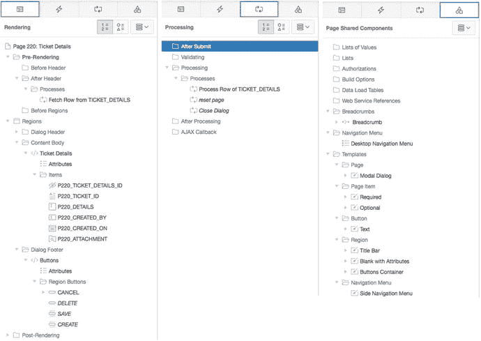
图 6-53. 从树形面板的各个选项卡看到的工单详细信息表单

**渲染**选项卡包括一个“页眉后” `Fetch Row from TICKET_DETAILS` 进程、一个 HTML 区域（该区域包含对应您选择包含在主从表单中的 `TICKET_DETAILS` 列的项）以及用于处理的按钮。

**处理**选项卡包括一个 `Process Row of TICKET_DETAILS` 进程（用于处理 `TICKET_DETAILS` 表上的插入、更新和删除操作）、一个 `Reset Page` 进程（用于在删除事务中清除行）以及一个指向第 210 页的“转到页面”分支（该分支在工单详细信息事务完成后将用户返回到工单页面）。

工单详细信息页面上的**共享组件**区域包括您的页面选项卡、面包屑导航和模板。

哇！主从表单向导创建了这么多东西——一个功能齐全的报表及其主从表单，所有这些都不需要您编写任何代码。这个主从示例突显了 APEX 向导在生成 APEX 组件方面的省时价值，尤其是在为应用程序创建更复杂和多页面的组件时。


## 关于 APEX 表单的更多内容

在创建表单时，APEX 向导能完成你大约 80% 的期望工作。最后 20% 的微调工作则需要你——开发者——来完成。在本节中，你将对“管理工单”和“工单详情”表单进行一些小的修改，总体目标是提升可用性。

### 项目布局

APEX 5.0 提供了两种调整项目布局的方式：调整特定的项目属性设置，以及在树形视图中拖拽项目。你将使用这两种方法来调整“管理工单”和“工单详情”表单。

在许多旧主题中，APEX 使用标准的 HTML 表格来布局表单项。这有一定的局限性，因为表格的行列布局相对固定。使用新的通用主题，APEX 引入了更灵活的网格布局概念。不再使用带有行列的 HTML 表格，而是用 `DIV` 元素来封装每个项目。

可以将网格想象成一个坐标系统，项目被放置在彼此旁边或上下位置。这种网格布局看起来可能有限制，但你可以利用项目的网格属性来重新排列项目。在本节中，你将使用页面上项目的网格属性，将“分配给”、“创建于”和“创建者”项目移动到同一行。

通过修改项目 `P210_CREATED_ON` 来开始调整“管理工单”表单的布局，使其自动填充今天的日期。然后，将其设置为始终以只读模式显示，以防止用户进行任何更改：

1.  编辑应用程序的第 210 页。
2.  单击项目名称以编辑项目 `P210_CREATED_ON`。
3.  在属性编辑器中，导航到“默认值”属性组（如图 6-54 所示），将“类型”设置为 `PL/SQL 表达式`，并在“默认值”中输入 `SYSDATE`。

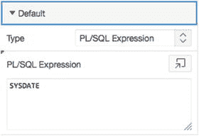

图 6-54. 为日期指定默认值

4.  在如图 6-55 所示的“只读”属性组中，将“类型”设置为 `始终`。

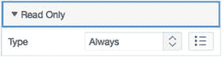

图 6-55. 设置只读条件

你还要修改 `P210_CLOSED_ON`。为了减少错误，你可以使用一个鲜为人知的 HTML 属性来使实际的输入字段变为只读。这样用户就只能使用日期选择器弹出窗口：

1.  单击项目名称以编辑项目 `P210_CLOSED_ON`。
2.  在“外观”属性组中，为“宽度”输入 `12`。
3.  在“高级”属性组中，在“自定义属性”字段的现有文本后立即添加以下文本（如图 6-56 所示）：`readonly="readonly"`

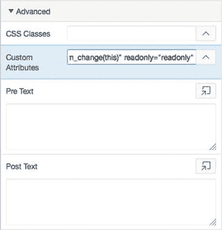

图 6-56. 设置宽度并添加 HTML 表单元素 `readonly="readonly"`

4.  单击“保存”。

### 将多个项目放置在同一行

现在，让我们重新排列页面上的项目，使它们不在单列中，而是将多个项目排列在同一行：

1.  编辑第 210 页。
2.  用鼠标点击并拖动网格布局中的 `P210_CREATED_BY`，将其放置在 `P210_CREATED_ON` 右侧的新网格位置。当你在网格中拖动组件时，黄色框表示可以放置的区域。还有一个位置指示器，以灰色框的形式，显示组件当前的放置位置，如图 6-57 所示。

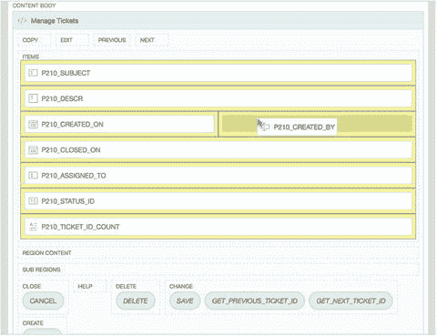

图 6-57. 通过点击并拖动组件来重新定位 `P210_CREATED_BY`

3.  当你正确放置字段后，网格布局看起来如图 6-58 所示。

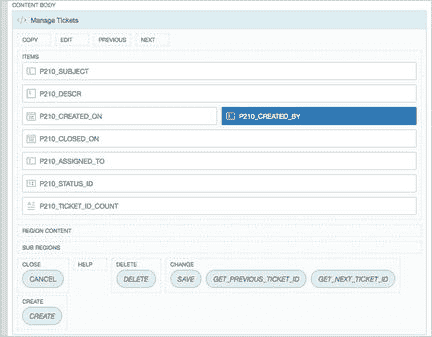

图 6-58. 网格布局中重新定位的组件

现在你需要确保“分配给”、“创建于”和“创建者”字段显示在同一行：

4.  使用你刚刚学到的相同技术，重新定位 `P210_ASSIGNED_TO`，使其直接位于 `P210_CLOSED_ON` 之前。当所有组件都正确定位后，网格布局将如图 6-59 所示。

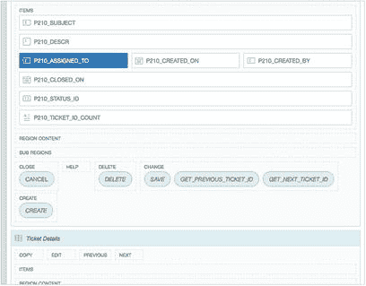

图 6-59. 网格布局中三个重新定位的组件

5.  单击“保存”。

### 实现值列表

接下来，你将把第 4 章中创建的值列表绑定到表单上的 `P210_ASSIGNED_TO` 和 `P210_CREATED_BY` 项目：

1.  编辑应用程序的第 210 页。
2.  单击项目名称以编辑项目 `P210_ASSIGNED_TO`。
3.  在“标识”属性组中，将“类型”设置为 `选择列表`。
4.  在“值列表”属性组中（见图 6-60），将“类型”设置为“共享组件”，“值列表”设置为 `TECHS`，“显示额外值”设置为“否”，“显示空值”设置为“是”，并在“空值显示值”中输入 `- 选择一名技术人员 -`。

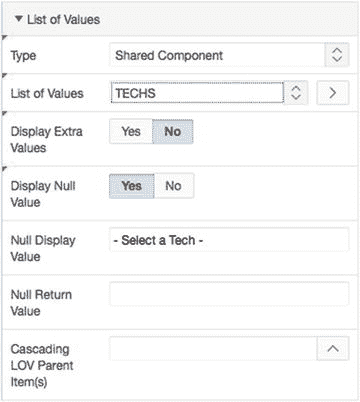

图 6-60. 设置值列表属性

5.  双击项目名称以编辑项目 `P210_CREATED_BY`。
6.  在“标识”属性组中，将“类型”设置为 `选择列表`。
7.  在“值列表”属性组中（见图 6-60），将“类型”设置为“共享组件”，“值列表”设置为 `USERS`，“显示额外值”设置为“否”，“显示空值”设置为“是”，并在“空值显示值”中输入 `- 选择一名用户 -`。
8.  保存并运行应用程序。你应该会看到类似图 6-61 所示的结果。注意组件变得非常小，尽管似乎有很多空白区域。

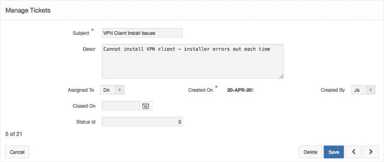

图 6-61. 使用新字段位置的“管理工单”表单

单击页面底部的开发者工具栏中的“显示网格”按钮，然后将鼠标悬停在某个字段标签上，将显示该标签占据了网格的三列，如图 6-62 所示。

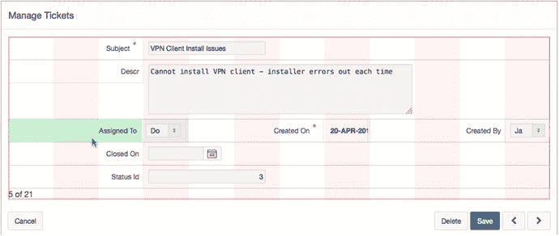

图 6-62. 开启“显示网格”后的“管理工单”表单

页面默认每个标签占据三列网格；当你将多个项目放在同一行时，这会迫使项目缩小以适应空间。我们可以通过调整“标签列跨度”设置来解决这个问题。然而，如果你只为这三个标签进行调整，最终会导致表单元素无法与表单的其他部分对齐。在我们的例子中，我们希望调整屏幕上所有可输入组件的标签：

1.  使用 CTRL-单击（Mac 使用 COMMAND-单击）同时编辑以下项目：
    `P210_SUBJECT`
    `P210_DESCR`
    `P210_ASSIGNED_TO`
    `P210_CREATED_ON`
    `P210_CREATED_BY`
    `P210_CLOSED_ON`
    `P210_STATUS_ID`
2.  在属性编辑器中，导航到“网格”属性组（如图 6-63 所示），将“标签列跨度”设置为 `2`，然后单击“保存”。

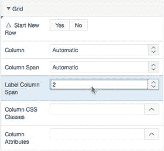

图 6-63. 更改标签列跨度以允许项目尺寸扩大

3.  再次运行应用程序，你会注意到页面上项目布局的变化。你应该会看到类似图 6-64 所示的结果。

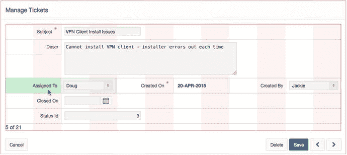

图 6-64. 修正后的“管理工单”表单布局


### 主从关系清理

你还需要对主从报表和表单进行一些小的调整。我们首先从明细报表和表单中隐藏 `TICKET_ID` 列。在明细级别，`TICKET_ID` 是外键，不应是可编辑项：

编辑应用程序的第 210 页。
在渲染树中的 Ticket Details 报表节点下，展开 Columns 子节点。
点击 `TICKET_ID` 列，通过编辑其类型属性并将其值设置为 **Hidden Column** 来隐藏它。
使用多选，通过将 Sortable 属性设置为 **Yes** 来为 `DETAILS`、`CREATED_ON` 和 `CREATED_BY` 列启用排序，如图 6-65 所示。

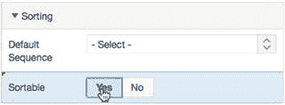
图 6-65. 指定列是否可排序

最后，编辑 `TICKET_DETAILS_ID` 列，将其 Heading 属性更改为 `Edit`。
点击 **Save**。

最后，对第 220 页上的项目做一些小的更改：

编辑应用程序的第 220 页。
编辑项目 `P220_TICKET_ID`。
在 Identification 属性组中，将 Type 设置为 **Hidden**。
编辑项目 `P220_DETAILS`。
在 Appearance 属性组中，将 Height 设置为 **5**。
编辑项目 `P220_CREATED_ON`。
在 Default 属性组中，将 Type 设置为 **PL/SQL Expression**，然后在 PL/SQL Expression 中输入 `SYSDATE`。
在 Read Only 部分，将 Type 设置为 **Always**。
编辑项目 `P220_CREATED_BY`。
将 Type 设置为 **Select List**。在 List of Values 属性组中，将 Type 设置为 **Shared Component**，List of Values 设置为 **TECHS**，Display Extra Values 设置为 **No**，Display Null Values 设置为 **Yes**，并在 Null Display Value 中输入 `- 选择一个技术人员 -`。
保存你的更改。

由于第 220 页被设置为模态对话框，你无法直接运行该页面。相反，你需要导航到第 200 页或 210 页来运行应用程序。

你的主从报表和表单现已完成。使用主从表单向导，你基于 `TICKETS` 和 `TICKET_DETAILS` 表生成了一个报表和主从表单。你修改了报表，使其包含用户友好的状态值、可排序的列以及你首选的日期格式。你修改了“管理工单”和“工单详情”表单，以排列页面上的项目、使用文本区域和选择列表。在此过程中，你回顾了构成报表和表单的 APEX 组件，以及可用于根据需要自定义表单和报表的表单、报表和列属性。

## APEX 帮助

为终端用户提供帮助是一项常被遗忘且通常很繁琐的任务。开发人员通常选择简单的方式，要么完全跳过，要么在项目接近尾声时将其最小化或取消。虽然 APEX 不能神奇地将帮助功能融入你的应用程序，但它确实使你作为开发人员能够更容易地做到这一点。

### 添加帮助文本区域

APEX 帮助文本区域会自动显示给定页面及其项目相关的任何帮助文本。它可以放置在任何页面上，包括全局页面。尽管你可以为帮助文本区域选择区域模板，但无法更改实际文本的样式。例如，让我们在第 210 页添加一个帮助文本区域，作为主编辑区域的子区域：

编辑应用程序的第 210 页。
通过导航到组件库的 Regions 面板并将帮助文本图标拖动到“管理工单”区域内的“子区域”部分来创建一个新的帮助文本区域，如图 6-66 所示。

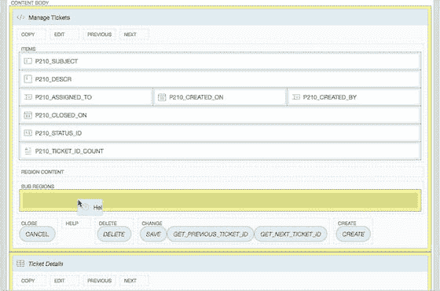
图 6-66. 创建帮助文本区域

在属性编辑器中，将 Name 设置为 **Help**。
在 Appearance 属性组中，将 Template 设置为 **Collapsible**，然后点击 **Template Options** 按钮以展开模板选项弹出窗口。
将 Default State 设置为 **Collapsed** 并点击 OK。
保存并运行你的应用程序。

注意，当你运行第 210 页时，你会在“管理工单”区域的底部看到区域标题“Help”旁边渲染了一个 `>`。新创建的帮助区域是作为一个子区域创建的，因此它出现在其父区域内。点击 `➤` 会展开该区域；因此，帮助文本仅在用户明确请求时才会显示。目前，帮助区域没有任何帮助文本。你将在下一节中植入项目级别的帮助文本。你可以通过编辑页面定义并在“帮助”部分的“帮助文本”输入框中输入文本来添加页面级别的帮助。

### 植入帮助文本

请注意，并非所有项目都显示在帮助区域中。这是因为定义 UI 默认值时已向该区域添加了一些帮助文本，但其他项目的帮助文本仍然为空。在 UI 默认值中定义的帮助文本会自动提取到使用这些默认值构建的任何表单中。你可以通过编辑每个项目来手动添加帮助文本。你也可以使用另一个 APEX 向导为任何尚未分配帮助文本的 APEX 项目植入帮助文本。

在应用程序构建器的右上角，点击 **Utilities** 图标，如图 6-67 所示，然后选择 **Application Utilities** 以进入应用程序实用工具主页。


图 6-67. 定位应用程序实用工具图标

在页面右侧的 Page-Specific Utilities 区域中，点击 **Item Utilities**。
点击 **Grid Edit of all Item Help Text**。这里的报表只显示那些已有关联帮助文本的项目。但是，你可以使用此表单上的一个按钮，用单个默认值为你的应用程序中所有空的帮助文本植入内容。没有完美的值可用于植入帮助文本，但类似“需要帮助文本”的内容可以表明该项目的帮助需要输入：
点击 **Seed Item Help Text**。
在“植入项目帮助”部分的 Default Help Text 中输入 `NEED HELP TEXT`，如图 6-68 所示，然后点击 **Apply Changes**。

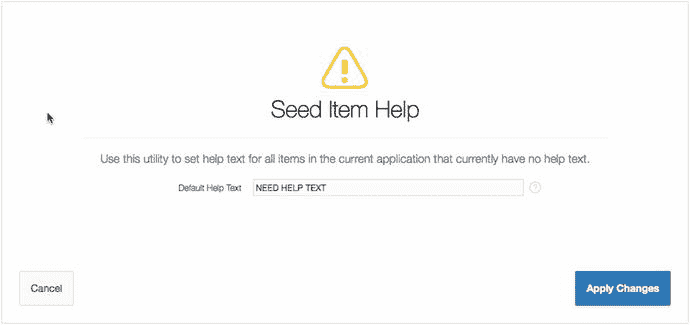
图 6-68. 植入项目帮助文本

帮助文本已植入，你将返回到主报表。从这里，你可以缩小显示的项目范围并直接编辑帮助文本：
在页面顶部的 Report Filter 部分，为 Minimum Page Number 输入 `210`，然后点击 **Go**。

此时，你正在一个界面中查看第 210 页或更大页面上所有项目的帮助文本。你可以随意更改第 210 页上任何项目的值，以便在帮助区域中查看它们。

一旦你修改并保存了帮助内容，运行第 210 页。注意，如果你点击第 210 页上任何单个项目旁边的问号图标，会弹出一个窗口，显示特定于该项目的帮助信息。

APEX 帮助文本区域会自动显示给定页面及其关联项目的帮助文本。帮助文本的显示由 APEX 在后台管理。尽管它不是非常强大——无法通过模板或其他方式更改区域的外观——但现在你没有任何借口不为你的应用程序添加帮助功能了。


## 声明式 BLOBs

在 Oracle 中，BLOB 代表二进制大对象，是一种设计用于存储二进制文件的数据类型。APEX 通过一项名为“声明式 BLOBs”的功能，简化了管理 BLOB 列的方式。APEX 向导能识别 BLOB 列，并自动修改相关的 APEX 项和报表，以便与该列无缝交互。为什么你需要关心 BLOB 列？使用 BLOB 列可以让你轻松地将文件（如文档、电子表格和图像）上传到应用程序中并下载。

使用声明式 BLOBs 功能时需提前规划。在设计时，请将这些列包含在将使用声明式 BLOBs 的表中：

*   `FILENAME`: 存储用户上传文件时使用的实际文件名
*   `MIME_TYPE`: 存储文件类型，以便浏览器知道应启动哪个应用程序（如用 Word 打开`.doc`，用 Excel 打开`.xls`等）
*   `LAST_UPDATED`: 存储 BLOB 最后更新的日期
*   `CHARACTER_SET`: 存储 BLOB 的字符集，这对于索引和处理存储在 BLOB 内的数据至关重要

前两列对于需要时从 BLOB 中读取数据至关重要。APEX 使用 BLOB 列的“数字/日期格式”列属性，将这些属性映射到数据库中存储的 BLOB 列。

如果你在使用向导创建报表或表单之后才添加 BLOB 列，则必须手动设置列或项属性以集成 BLOB 处理。

由于你在运行 SQL 脚本时已向`TICKET_DETAILS`表添加了 BLOB 列，系统已为你完成了一些工作。但要正确使用声明式 BLOBs，你仍需要完成几项操作。首先，必须将`FILENAME`和`MIME_TYPE`列映射到用于上传文档的表单，以便将这些详细信息保存在数据库中。让我们先处理第 220 页的表单。

编辑应用程序的第 220 页。编辑项`P220_ATTACHMENT`。在“设置”部分，你将看到图 6-69 中所示的字段。

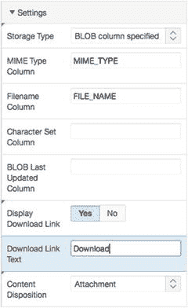

图 6-69. 指定 BLOB 设置

在“设置”属性组中，为“MIME 类型列”输入`MIME_TYPE`，为“文件名列”输入`FILE_NAME`，为“下载链接文本”输入`Download`。点击“保存”。

接下来，修改第 210 页的报表：

编辑应用程序的第 210 页。点击其名称编辑“工单详情”区域。找到并打开文件`ch6_blob_report.txt`（该文件位于你之前提取的类文件所在目录），将其内容复制到“SQL 查询”属性中，替换当前的所有文本。参见图 6-70。

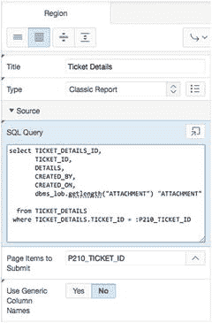

图 6-70. 输入包含 BLOB 列的报表查询

请注意选择列表中最后一列的变化。使用`dbms_lob.getlength`向 APEX 指示`ATTACHMENT` BLOB 列是否包含数据。如果包含，查询将返回一个大于 0 的数字。现在你需要修改报表列以显示一个链接，允许最终用户下载任何可能已上传的文档：

在渲染树中展开“工单详情”节点下的“列”节点。编辑`ATTACHMENT`列，将“类型”属性更改为“下载 BLOB”。在新出现的“BLOB 属性”属性组中，为“表名”输入`TICKET_DETAILS`，为“Blob 列”输入`ATTACHMENT`，为“主键列 1”输入`TICKET_DETAILS_ID`，为“Mime 类型列”输入`MIME_TYPE`，为“文件名列”输入`FILE_NAME`，并在“外观”下为“下载文本”输入`Download`，如图 6-71 所示。

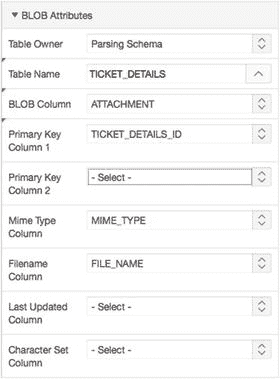

图 6-71. 修改 BLOB 列属性

保存你的更改。

运行应用程序。通过将文件附加到某个工单详情记录，然后从报表中下载它，来测试文件上传和下载功能。

APEX 中这种轻松上传和下载文件的能力，在构建用户需要为任何目的上传和下载数据的 Web 应用程序时极其有用。APEX 的声明式 BLOBs 功能使开发者能够轻松地向应用程序添加上传和下载功能。

## 小结

你已了解了大多数 APEX 表单和报表类型，并使用 APEX 表单和报表向导，逐步为你的 Help Desk 系统构建了各种表单和报表。在此过程中，你学习了 APEX 项、会话状态、APEX URL 语法、向 APEX 页面添加帮助信息，以及通过使用声明式 BLOBs 功能来整合上传和下载功能。需要消化的内容很多，但 APEX 向导已为你完成了大部分工作。

这里的共同主题是，APEX 表单和报表向导为开发者节省了大量时间，它们创建了工作表单或报表所需的所有对象——项、按钮、分支、进程等。然后，你可以修改这些创建的对象，快速自定义表单或报表以满足你的需求。

尽管如此，你尚未远离 APEX 为你构建的内容，并且只涵盖了最简单的表单和报表类型。下一章将探讨更复杂的 APEX 表单和报表类型，它们同样由向导生成。

