# 7. 表单与报表：高级篇

电子补充材料 本章的在线版本（doi:[10.​1007/​978-1-4842-0466-5_​7](http://dx.doi.org/10.1007/978-1-4842-0466-5_7)）包含补充材料，可供授权用户使用。

本章将重点介绍更复杂的表单和报表类型；同时还将介绍图表和地图。尽管这些是更复杂的表单和报表类型，但它们最常通过使用 APEX 表单和报表向导来创建。

在接下来的章节中，你将学习如何使用 APEX 表单和报表向导，向你的 Help Desk 应用程序添加页面，以便在单个页面上管理多个工单，允许对工单数据进行一些交互式分析，并按日期和状态可视化工单。为此，你将创建一个表格表单、一个交互式报表、一个日历和一个饼图，每个都演示一种更高级的 APEX 表单或报表类型。

## 表格表单

表格表单允许用户同时编辑数据的多行和多列，很像电子表格。开发者可以为每一列选择不同的元素类型——文本框、文本区域、选择列表、复选框、单选组等。用户可以修改多个数据元素，并将它们作为一个事务提交。APEX 表格表单处理插入、更新和删除——全部无需代码！

APEX 向导为功能齐全的表格表单创建了所有必需的元素。与所有 APEX 表单一样，构成表格表单的项之间没有逻辑关系。一旦向导创建了这些项，它们就与其他的 APEX 页面项无异，并且可以独立于彼此进行修改。但是，我建议在修改由 APEX 向导生成的项时要谨慎；这样做可能会导致表格表单无法操作。

你可以选择绕过向导，创建自己的表格表单。随着应用程序变得越来越复杂，你可能会发现手动创建表单更高效。然而，本书侧重于向导方法。


### 创建表格表单

在本节中，你将创建一个新页面，该页面包含基于 `TICKETS` 表的表格表单。该表单允许在同一页面上编辑多个工单。随后，你将更改表格表单各列的显示属性。请按以下步骤操作：

导航到你的应用程序的应用程序生成器主页。
单击页面右上角的“创建页面”按钮。
选择“表单”并单击“下一步”。
选择“表格表单”并单击“下一步”。
对于“表/视图所有者”，选择你的模式，然后对于“表/视图名称”，选择 `TICKETS`（表）。
确保“允许的操作”设置为“更新”、“插入”和“删除”。
默认情况下，“使用用户界面默认值”以及所有列都已被选中，如图 7-1 所示。单击“下一步”。

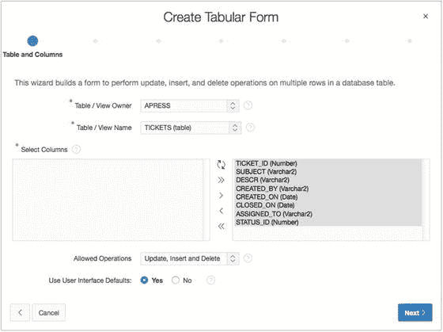
图 7-1. 为表格表单选择列

将“主键类型”设置为“选择主键列”。
将“主键列 1”设置为 `1. TICKET_ID (数字)`，然后单击“下一步”。
将“源类型”设置为“现有触发器”并单击“下一步”。
选择所有列作为“可更新列”，如图 7-2 所示，然后单击“下一步”。

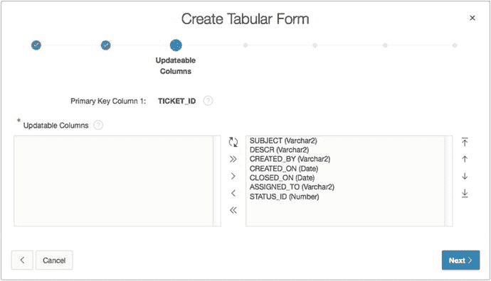
图 7-2. 为表格表单选择可更新列

对于“页面”输入 `230`，对于“页面名称”和“区域标题”输入“管理多个工单”，如图 7-3 所示。

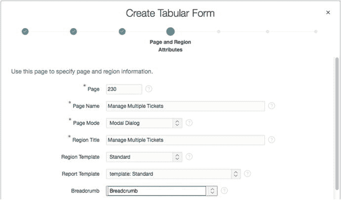
图 7-3. 为表格表单标识页面和区域属性

将“页面模式”设置为“模态对话框”。
将“面包屑”设置为“面包屑”。
页面刷新后，将“条目名称”设置为“管理多个工单”，将“父条目”设置为“工单（页面 200）”，如图 7-4 所示，然后单击“下一步”。


图 7-4. 为表格表单创建面包屑条目

对于“导航首选项”，选择“为此页面标识现有导航菜单条目”。
对话框刷新后，将“现有导航菜单条目”设置为“工单”，然后单击“下一步”。
将“添加行按钮标签”更改为 `添加工单`。
在“确认”可滚动区域中检查你的选择，如图 7-5 所示。

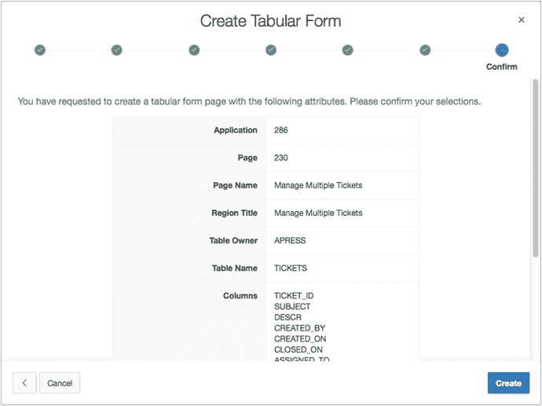
图 7-5. 在“确认”区域检查我们的选择

单击“创建”。

### 修改表格表单

你的表格表单可以工作，但目前无法导航到它。首先，你需要在页面 200 上创建一个按钮，以链接到你的新表格表单：

编辑应用程序的页面 200。
通过将“文本[热]”按钮从“组件库”拖到“工单”区域的“创建”按钮位置来创建新按钮，如图 7-6 所示。

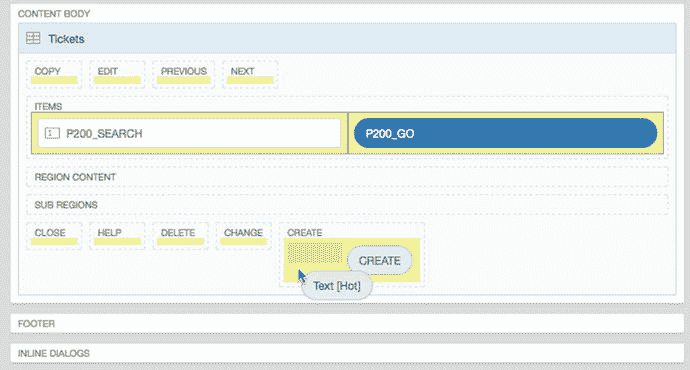
图 7-6. 将新按钮拖到“工单”区域

对于“按钮名称”输入 `MANAGE_MULTIPLE_TICKETS`，对于“标签”输入“管理多个工单”，如图 7-7 所示。

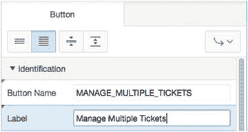
图 7-7. 指定按钮属性

在“行为”属性组中，将“操作”设置为“重定向到此应用程序中的页面”。
单击“目标”旁边的“选项对话框”按钮。
“选项对话框”出现后，将“页面”设置为 `230`，将“重置分页”设置为“是”，如图 7-8 所示，然后单击“确定”。

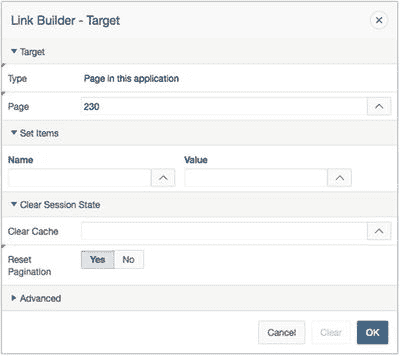
图 7-8. 指定按钮操作属性

保存并运行你的应用程序。

此时，你应该能够通过单击“管理多个工单”按钮从页面 200 导航到你的表格表单。

不过，现在你需要进行一些外观修改，以便更好地控制数据输入以及对话框的观感。

首先，增大对话框窗口的大小，以便可以看到表单的所有元素：

编辑应用程序的页面 230。
在树状窗格的“呈现”选项卡中，选择“页面 230：管理多个工单”。
在“属性编辑器”中，将对话框的 `宽度` 属性设置为 `1200`，将 `高度` 属性设置为 `720`。
单击“保存”。接下来，你将对表格表单的列进行一些更改。
在“呈现”选项卡的树中，展开“管理多个工单”节点下的“列”节点。
编辑 `TICKET_ID_DISPLAY` 列，并将“类型”属性设置为“隐藏列”。
多选 `SUBJECT`、`DESCR`、`CREATED_BY`、`CREATED_ON`、`CLOSED_ON`、`ASSIGNED_TO` 和 `STATUS_ID`，并确保它们的 `可排序` 属性设置为“是”。
多选 `SUBJECT` 和 `DESCR` 列。
在“属性编辑器”中，将“类型”设置为“文本区域”，`宽度` 设置为 `16`，`高度` 设置为 `3`。
编辑 `ASSIGNED_TO` 列。
在“属性编辑器”中，将“类型”设置为“选择列表”。
在“值列表”属性组中，将“类型”设置为“共享组件”，“值列表”设置为 `TECHS`，“显示额外值”设置为“否”，“显示空值”设置为“是”，并为“空值显示值”输入 `- 选择一名技术人员 -`，如图 7-9 所示。

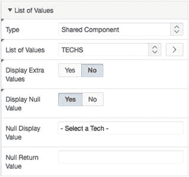
图 7-9. 为 `ASSIGNED_TO` 列指定值列表

编辑 `CREATED_BY` 列。
在“属性编辑器”中，将“类型”设置为“选择列表”。
在“值列表”部分，将“类型”设置为“共享组件”，“值列表”设置为 `USERS`，“显示额外值”设置为“否”，“显示空值”设置为“是”，并为“空值显示值”输入 `- 选择一名用户 -`，如图 7-10 所示。

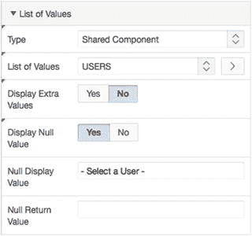
图 7-10. 为 `CREATED_BY` 列指定值列表属性

编辑 `STATUS_ID` 列。
在“属性编辑器”中，导航到“默认值”属性组，将“类型”设置为“PL/SQL 表达式”，并为“默认值”输入 `get_status ('OPEN')`。
保存你刚才所做的编辑，然后运行你的应用程序。注意：由于页面 230 是一个模态对话框页面，你需要通过页面 200 上创建的按钮来运行它。

### 深入了解幕后

让我们看看表格表单向导为你创建了什么——你的表格表单的内容。编辑页面 230 以检查树状窗格的各个选项卡。它们应该类似于图 7-11 所示。

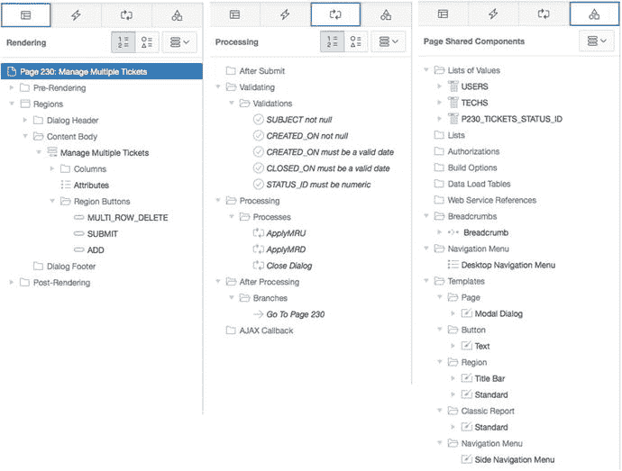
图 7-11. 页面 230 树状窗格的各个选项卡

在“呈现”选项卡中，APEX 已创建了一个“报表”区域。但你创建的是一个表单，不是吗？尽管名称如此，表格表单实际上是一个启用了特定列级选项并添加了一些进程来处理数据操作的 SQL 报表。

在“处理”选项卡的“处理”部分，你可以看到两个进程：`ApplyMRU` 和 `ApplyMRD`。这些特殊类型的进程处理 `TICKETS` 表上的多行插入和更新（`ApplyMRU`）以及删除（`ApplyMRD`）。这些进程为你处理 `TICKETS` 表上的所有 DML 操作。

APEX 还为多个列创建了验证，这些验证是根据 `TICKETS` 表的列定义以及在 `TICKETS` 表上定义的任何 UI 默认值自动创建的。

在“共享组件”选项卡中，是应用程序默认的常规页面和标签页模板。

如你所见，`ApplyMRU` 和 `ApplyMRD` 进程使得“报表”区域从静态报表区域变成了功能齐全的表格表单。而且，让 APEX 向导为你创建这一切要容易得多！


## 交互式报告

你的工单报告通常被称为**经典报告**。它是 APEX 报告的原始样式，在需要简单数据列表且无需交互性的各种情况下仍然具有实际应用价值。然而，包括 APEX 自身在内的大多数应用程序，现在都采用了**APEX 交互式报告**。

交互式报告功能在 APEX 3.1 中引入，它使得 APEX 能够快速轻松地在你的应用程序中纳入由用户驱动的临时查询能力。交互式报告在 APEX 5.0 中得到了极大增强。APEX 交互式报告的妙处在于，它们为最终用户提供了强大的临时查询能力，而开发者无需编写任何代码。最终用户可以自定义以下内容：

*   搜索
*   排序顺序
*   列
*   分组中断
*   高亮显示
*   计算
*   聚合
*   图表
*   分组依据
*   闪回时间
*   保存的报告
*   订阅（电子邮件通知）

交互式报告在技术上不过是一种报告类型。创建报告向导的步骤与我们已经看到的类似，构建交互式报告所花费的努力与经典报告相同。

经典报告可以轻松转换为交互式报告。然而，无法从交互式报告转换回经典报告。（但为什么你会想要这样做呢？）交互式报告的最终用户功能和整体价值通过一个例子最能说明，因此让我们为你的应用程序添加一个交互式报告。

### 创建交互式报告

交互式报告只需要一个 SQL 查询。APEX 会处理其余部分。你首先需要基于你的服务台数据视图，同时创建一个新页面、菜单项和交互式报告。开始如下：

导航到你的应用程序的 Application Builder 主页。点击屏幕右上角的“Create Page”按钮。选择“Report”并点击“Next”。选择“Interactive Report”并点击“Next”。输入`300`作为页面编号，输入`Analysis`作为页面名称和区域名称，并将区域模板设置为“Interactive Report”。将“Breadcrumb”设置为“Breadcrumb”，页面刷新后，点击“Next”。参见图 7-12。

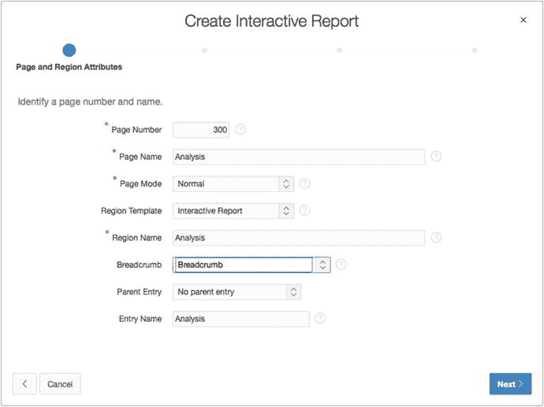

图 7-12。指定交互式报告的页面编号、名称和面包屑

将导航首选项设置为“Create a new navigation menu entry”。页面刷新后，应类似图 7-13。点击“Next”。

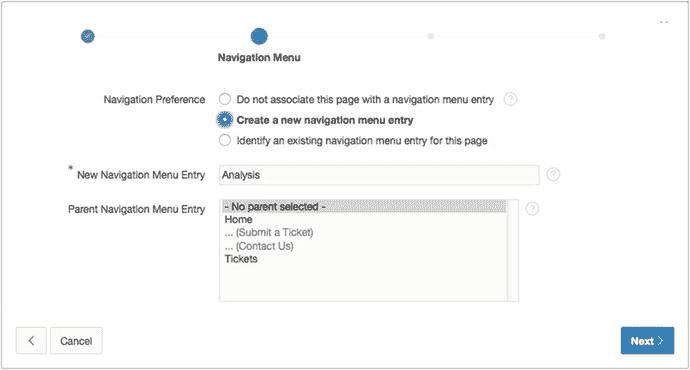

图 7-13。指定交互式报告的导航选项

对于此报告，你将使用`TICKETS_V`视图，而不是直接使用`TICKETS`表。该视图将`TICKETS`表与`STATUS_LOOKUPS`表连接起来，因此你无需稍后在列级别手动操作：将源类型设置为“Table”，然后为“Table / View Name”选择`TICKETS_V`（视图）。将“Uniquely Identify Rows by”设置为“Unique Column”，为“Unique Column”输入`TICKET_ID`，然后点击“Next”（参见图 7-14）。

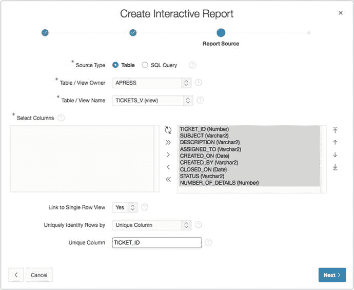

图 7-14。为交互式报告输入 SQL SELECT 语句

点击“Create”。

### 运行交互式报告

运行应用程序并导航到“Analysis”菜单项。该页面类似于图 7-15 所示。乍一看，交互式报告看起来与其他 APEX 报告没什么不同。然而，交互式报告可以执行标准 APEX 报告无法完成的许多功能。

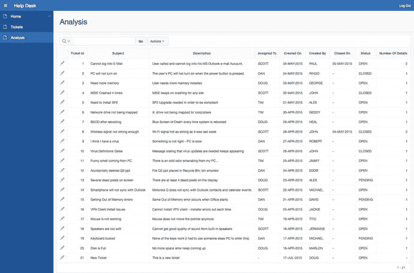

图 7-15。用于工单分析的交互式报告

交互式报告内置了搜索栏，它是交互式报告的指挥中心。所有最终用户功能都通过位于交互式报告顶部的搜索栏访问，这是报告搜索字段的标准位置。但这远不止是一个搜索字段！搜索栏包括以下部分：

*   查找器下拉菜单：以放大镜图标表示，此功能允许用户选择要筛选的列。
*   搜索字段：用户可以在其中输入并查找文本字符串的字段。
*   报告选择列表：所有已保存报告的下拉列表。仅当有多个已保存报告可用时，此列表才可见。我们稍后会讨论已保存报告。
*   每页行数选择器：行数选项的下拉列表。默认情况下此功能是关闭的，因为它也可以在“Actions”菜单中使用。
*   “Actions”菜单：为此报告启用的操作菜单——交互式报告的“交互式”选项。

要使用搜索字段，请在其中输入字符串或短语，然后点击“Go”按钮。交互式报告仅列出与你在搜索字段中输入的值匹配的结果。

要使用查找器下拉菜单，请点击搜索栏左侧放大镜图标旁边的箭头。此操作将打开报告列名的菜单。选择一个列名会导致仅在所选列上执行搜索。

要使用报告选择列表，请选择“Report”列表选项之一以导航到所选报告。要使用每页行数选择器，请从下拉列表中选择所需显示的每页行数。

要使用“Actions”菜单，请点击它以展开交互式报告操作菜单，然后选择所需的操作。

### 按报告限制功能

作为开发者，你可以通过在 Page Builder 的报告级别设置选项来控制“Actions”菜单上哪些选项对最终用户可用。你还可以控制搜索栏上包含哪些前述组件。如图 7-16 所示的搜索栏选项允许你选择是否包含搜索栏，以及选择搜索栏的哪些元素对用户可见。这在报告级别控制了最终用户的功能。

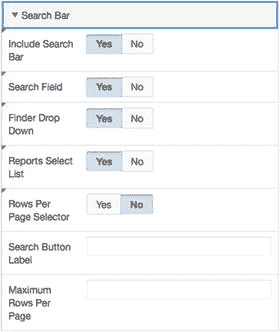

图 7-16。指定搜索栏选项

如图 7-17 所示的“Actions”菜单切换按钮，允许你指定哪些“Actions”菜单选项对用户可用。其中，“Save Report”、“Save Public Report”和“Subscription”选项仅对经过身份验证的用户可用。这是因为 APEX 需要知道经过身份验证的用户信息才能保存报告和发送订阅。

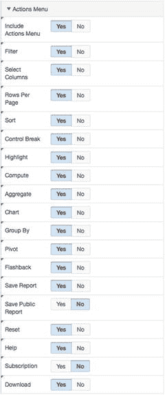

图 7-17。为“Actions”菜单指定选项

### 按列限制功能

特定的交互式报告操作也可以在列级别逐列限制。例如，你可以允许报告被筛选，但不允许特定列用于筛选。通过在 Page Builder 中编辑报告列，你可以声明性地启用或禁用“Enable Users To”属性组中的隐藏、排序、筛选、高亮、分组中断、聚合、计算、图表、分组依据和枢轴功能，如图 7-18 所示，作为各个列的报告属性页面的一部分。

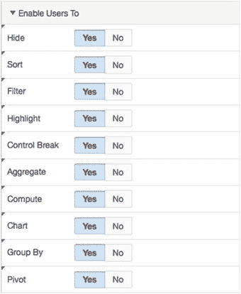

图 7-18。指定单个列的选项

你已经了解了作为开发者在报告级别和列级别可用的交互式报告设置。现在，让我们从最终用户的角度来看看交互式报告功能。以下各节将从最终用户角度探讨如何使用交互式报告的关键功能。


### 使用列标题菜单

运行交互式报表时，列标题本身就包含各项功能，这或许是格式化报表单列最快捷的方式。图 7-19 展示了交互式报表的列标题功能。点击列标题会打开一个列级别的菜单，其中包含图标驱动的选项，可用于快速排序、从报表中移除该列、在该列上添加中断、搜索以及筛选。此菜单中的 `Search Bar`（搜索栏）允许最终用户直接搜索和筛选该列中的值。`Remove Column`（移除列）选项让用户可以快速将该列从报表中移除。若要恢复该列，用户必须选择 `Actions`（操作）菜单的 `Select Columns`（选择列）选项。`Break`（中断）选项可在该列上添加中断。

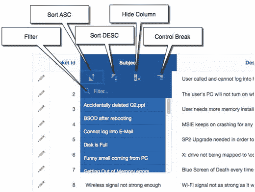

图 7-19.

使用列标题菜单

如果您查看 `Filter`（筛选）文本字段下方，您会看到该列中出现的所有不同值的完整列表。点击其中任何一个不同的值都会在该列上创建一个筛选器，仅显示与所选值匹配的行。

### 按列搜索

`Search Bar`（搜索栏）左端的放大镜图标实际上是报表中可见列的列表，这是按特定列或所有列进行快速筛选的便捷方式。所选列即为搜索文本所应用的列。

在搜索字段中输入一个值，会对所有列（默认）或所选列应用筛选器。一旦应用了筛选器，`Control Summary`（控制摘要）区域就会出现一个选项，如图 7-20 所示。`Control Summary` 区域是 `Search Bar` 和报表之间的区域。该区域仅当对交互式报表应用了操作时才会显示，用作当前正在应用哪些操作的提示。`Control Summary` 区域为每个已应用的操作包含一行。交互式报表的操作是叠加的：后续操作会在现有操作的基础上应用。用户可以通过取消勾选其复选框来禁用某个操作。用户可以通过点击该操作的 × 图标来移除该操作。点击 `Control Summary` 区域中的某个操作会打开该操作控件进行编辑。

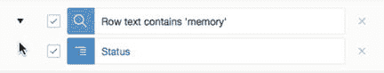

图 7-20.

打开状态下的控制摘要区域

`Control Summary` 面板可以切换打开或关闭。您可以通过点击“关闭”（向下的三角）图标来最小化它。

已关闭的 `Control Summary` 区域，如图 7-21 所示，可以通过点击“打开”（向右的三角）图标来展开。


图 7-21.

关闭状态下的控制摘要区域

`Finder`（查找器）下拉菜单可通过 `Search Bar` 左侧的放大镜图标访问，它显示交互式报表中所有列的列表，如图 7-22 所示。选择其中一列会将搜索功能限制在该列。

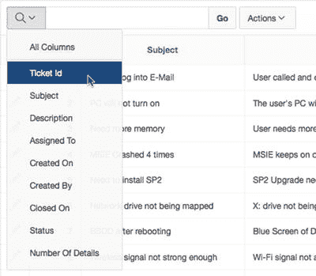

图 7-22.

查找器下拉菜单

`Actions`（操作）菜单，如图 7-23 所示，提供了一系列列选择、筛选和操作选项。在 `Format`（格式）选项下进一步展开菜单，会揭示用于排序、中断、高亮显示、计算新列、聚合、绘图和分组的其他操作。展开的 `Format` 菜单如图 7-24 所示。

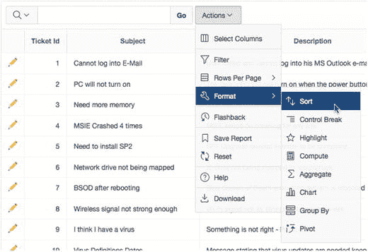

图 7-24.

从操作菜单中选择格式选项

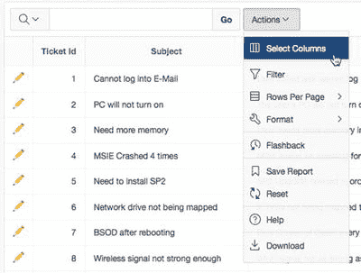

图 7-23.

操作菜单

### 选择列

`Select Columns`（选择列）操作，如图 7-25 所示，允许用户选择要显示的列并根据需要重新排列列顺序。穿梭框控件允许用户使用中间的箭头轻松添加或移除列，并使用区域右侧的上、下按钮对显示的列进行排序。

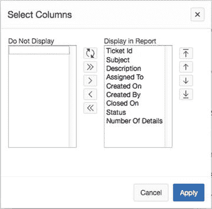

图 7-25.

选择列

**注意**

交互式报表的 `Select Columns` 操作始终控制显示哪些列。如果作为开发人员，您修改了 SQL 查询以向交互式报表添加一列，那么在将该新列从 `Do Not Display`（不显示）区域移动到穿梭框的 `Display in Report`（在报表中显示）区域之前，该新列将不会可见。

### 筛选

`Filter`（筛选）操作允许用户声明式地根据一系列运算符的结果定义筛选器。一个用户可以为每个报表定义多个筛选器。多个筛选器使用逻辑 `AND`（与）运算符组合。通过 `Search Bar` 定义的筛选器与通过 `Filter` 操作定义的筛选器组合使用。目前，交互式报表中没有提供实现筛选器逻辑 `OR`（或）的功能。

`Filter` 操作提供了一套完整的筛选操作供选择，如图 7-26 所示。

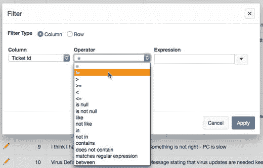

图 7-26.

对交互式报表应用筛选器

`Filter` 操作支持列筛选器和行筛选器。列筛选器应用于单个列。列筛选器选项会根据筛选列的类型和所选运算符进行交互式变化。例如，如果您选择一个日期列，如 `Created On`（创建于），然后选择 `Between`（介于）操作，那么 `Expression`（表达式）元素现在会包含两个字段，用于 `Between` 子句的 `From`（从）和 `To`（到）。在这种情况下，这些字段各自都有一个日期选择器，便于输入 `Date From`（日期从）和 `To`（到）的值。最终用户还可以使用声明式的 `Filter` 构建自定义筛选器。

行筛选器允许用户构建基于同一行中多个列的筛选条件。您的 Analysis（分析）报表的一个简单行筛选器可能是筛选出所有在同一天关闭的工单。`Filter` 表达式可以通过在 `Columns`（列）和 `Functions/Operators`（函数/运算符）区域中进行选择来声明式构建，如图 7-27 所示，也可以手动输入。在 `Filter` 表达式中，选定的列由其字母别名表示。

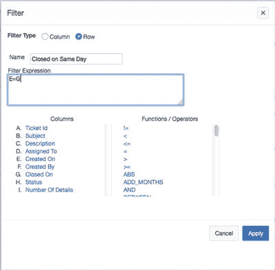

图 7-27.

构建行筛选器

### 排序

`Sort`（排序）界面允许用户指定最多六个列的排序（升序或降序），并指定 `NULL` 值是排在最前还是最后。排序可以在显示的列和非显示的列上执行（参见图 7-28）。

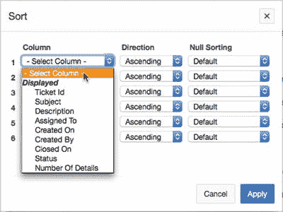

图 7-28.

向交互式报表添加排序

### 添加中断

`Control Break`（控制中断）操作允许用户在最多六个列上定义中断格式。用户指定中断列以及中断是禁用还是启用。APEX 会自动将声明的中断格式应用于报表。请注意，中断列在 `Control Summary` 中作为单独的条目出现，允许用户单独启用、禁用或移除中断列。图 7-29 显示了在 `Assigned To`（分配给）和 `Status`（状态）列上应用了中断的 Analysis（分析）报表。

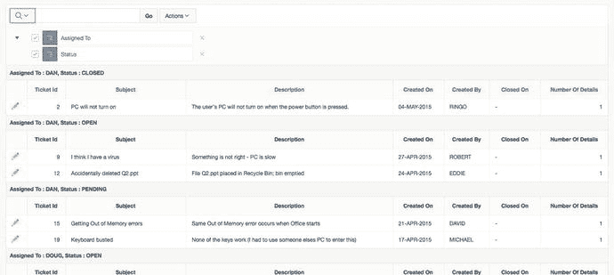

图 7-29.

应用了控制中断的交互式报表


### 高亮显示

高亮操作允许用户查找匹配的数据，并按行或列进行高亮显示，同时可指定高亮的背景色和文本颜色。高亮操作的界面如图 7-30 所示。

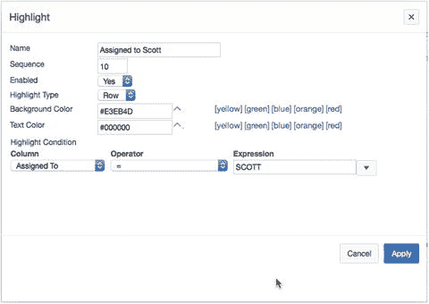

图 7-30.

使用高亮操作添加高亮

您在筛选操作中看到的相同运算符也适用于此。背景色和文本颜色可以使用十六进制表示法或调色板来指定。高亮操作在控制摘要区域中显示为一个高亮的行。

### 计算列

用户可以通过计算操作界面，基于现有列和函数定义一个新列作为计算结果，该界面如图 7-31 所示。

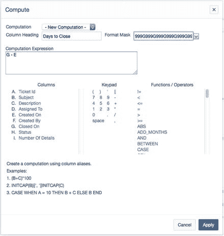

图 7-31.

使用计算操作计算新的交互式报告列

用户可以以声明方式或手动方式定义计算值。声明式界面与行筛选器界面非常相似。在计算中，列使用其字母别名来指定。此选项功能强大，因为它允许最终用户构建他们所需的任何列。

### 添加聚合

聚合操作对某一列执行以下聚合函数之一：

*   求和
*   平均值
*   计数
*   计数（去重）
*   最小值
*   最大值
*   中位数

所选列的数据类型必须为 `NUMBER`。结果显示在报告的末尾。请注意，只有当对应的列也显示时，聚合结果才会显示。

### 向交互式报告添加图表

图表操作允许用户以动态 Flash 图表的形式显示报告中的数据，如图 7-32 所示。数据的图表表示会替代表格数据显示。可以通过单击视图图表图标（如图 7-32 所示）来切换显示方式。使用“编辑图表”链接可重新进入图表操作界面。

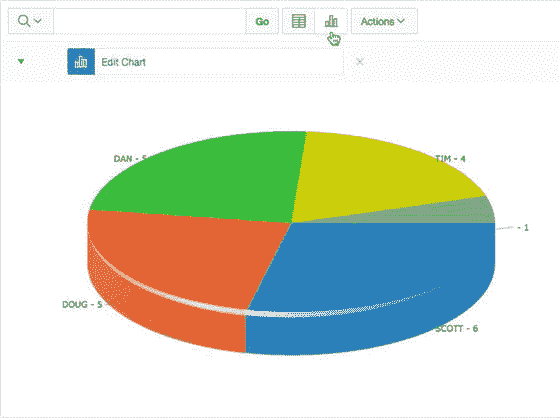

图 7-32.

交互式报告饼图

交互式报告中支持以下图表类型：

*   水平条形图
*   垂直条形图
*   饼图
*   折线图

简单的图表操作界面（如图 7-33 所示）允许用户选择图表类型，并分配标签列、值列、函数以及用于排序的列。

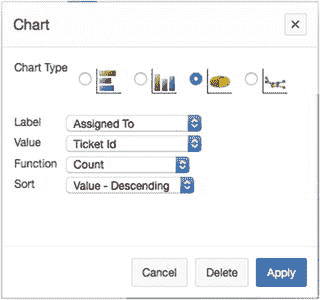

图 7-33.

使用图表操作添加图表

用户在图表操作中无法使用 APEX 图表的全部功能，但轻松显示这些最常见图表类型的能力非常有价值。

### 分组

分组操作允许用户定义分组，然后在这些分组上应用聚合函数，从而让用户以声明方式定义他们自己的报告数据摘要视图。使用分组操作的示例结果如图 7-34 所示。

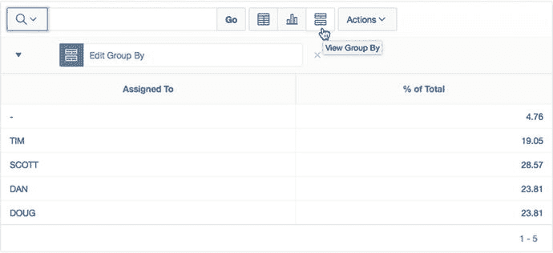

图 7-34.

使用分组操作进行分组

与图表视图类似，数据的分组视图在搜索栏中心有一个显示图标，如图 7-34 所示。用户可以通过单击相应的显示图标来显示数据视图、分组视图，或者（如果已定义）图表视图。

### 数据透视

数据透视操作允许用户定义报告中数据的数据透视图，使用户能够完全控制要透视的列、要显示为行的列以及要使用可用聚合函数之一进行聚合的列。设置的示例及生成的透视报告如图 7-35 所示。

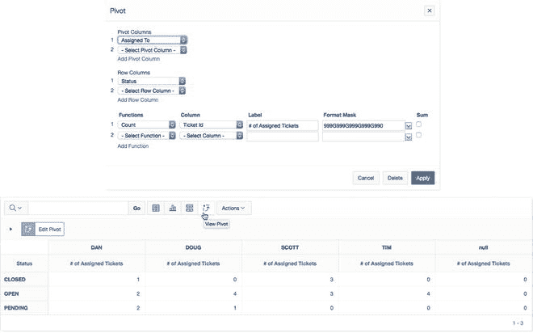

图 7-35.

使用数据透视操作生成的透视报告

### 使用闪回

闪回操作使用户能够将数据库闪回到指定的分钟数，以查看数据在该时间点的样子。该选项基于 Oracle 数据库的 `FLASHBACK` 功能构建。必须启用数据库 `FLASHBACK`。闪回操作会询问要闪回的分钟数，如图 7-36 所示。

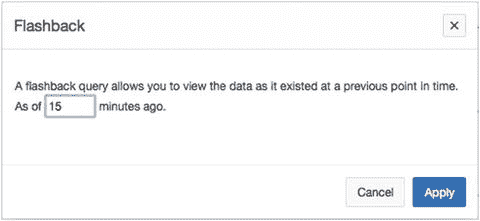

图 7-36.

使用闪回操作

闪回时间长度是可配置的。最大闪回周期基于数据库中的 `UNDO_RETENTION` 参数，该参数默认设置为三小时。

### 保存交互式报告

保存报告操作允许用户将交互式报告的当前配置保存为命名报告。如果最终用户也是 APEX 开发人员，用户将看到“另存为默认报告设置”选项，如图 7-37 所示。

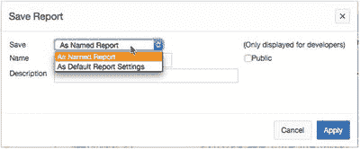

图 7-37.

使用保存报告操作保存交互式报告

作为开发人员，您需要尝试预先创建您认为最广大用户群最广泛使用的报告版本。您可以将当前报告配置保存为主要或替代默认报告设置，如图 7-38 所示。主报告是任何新用户登录系统时默认看到的报告。如果存在替代默认报告，用户可以从选择列表中选择它们。

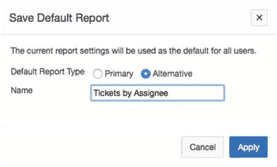

图 7-38.

设置替代的已保存报告

显然，您无法预先创建报告的每一个可能迭代。因此，用户可以将报告另存为私有报告。保存报告后，它会添加到搜索栏的“报告”菜单中，如图 7-39 所示。

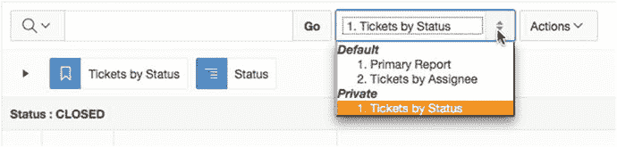

图 7-39.

使用默认的“报告”菜单

### 重置交互式报告

重置操作（如图 7-40 所示）将当前报告恢复为默认设置。格式或结果集（通过筛选）的任何更改都会丢失，当然，除非该报告是一个已保存的报告。然后可以通过从选择列表中选择报告名称来简单地恢复它。

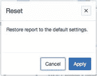

图 7-40.

将交互式报告重置为其默认设置

### 获取帮助

帮助操作打开一个窗口，其中包含特定于交互式报告的帮助，如图 7-41 所示。无论当前报告是否启用，此帮助窗口中都会显示所有交互式报告选项。

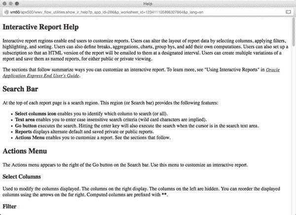

图 7-41.

交互式报告帮助页面


## 添加订阅

`订阅`操作允许用户按计划将报告以电子邮件形式发送到指定的邮箱地址。用户需要输入电子邮件地址、主题、频率以及开始和结束日期，如图 7-42 所示。此操作仅对已认证用户可用。收到的电子邮件是您报告的可搜索`HTML`版本。分组格式和高亮显示不会被保留。

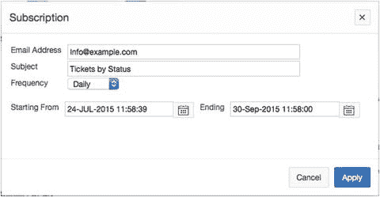

图 7-42. 订阅交互式报表

如果当前用户已有一个生效的订阅，您可以通过再次使用`订阅`操作来编辑该订阅。此时表单将显示当前订阅的属性，并允许用户更改或删除订阅。界面与图 7-42 所示完全相同，只是增加了一个`删除`按钮。

报告订阅也可以由工作区管理员通过`管理主页` ➤ `任务菜单` ➤ `交互式报表设置` ➤ `订阅`界面进行管理，如图 7-43 所示。

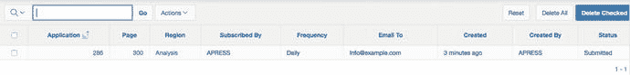

图 7-43. 通过管理订阅界面管理订阅

## 下载

`下载`操作允许用户以以下格式之一下载其报告的当前结果集：

*   `CSV`
*   `HTML`
*   `电子邮件`
*   `PDF`
*   `XLS` (MS Excel)
*   `RTF` (MS Word)

后两种格式需要`Oracle BI Publisher`，这可能需要向 Oracle 申请单独的许可。仅当您的`APEX`管理员已将`APEX`配置为与外部电子邮件服务器集成时，`电子邮件`选项才可用。图 7-44 显示了不使用和使用`BI Publisher`时的下载选项。您可以在`下载`属性区域指定可用的格式，如图 7-45 所示。

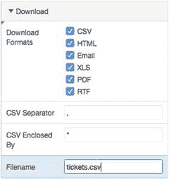

图 7-45. 指定下载属性

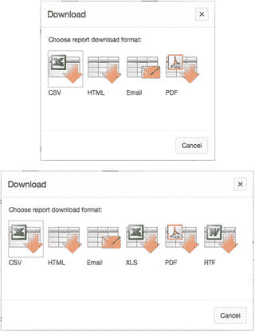

图 7-44. 选择下载选项（不使用和使用 BI Publisher）

以`CSV`格式下载的报告是纯的、以逗号分隔的数据。结果集中数据的内容和顺序在`CSV`文件中得以保留，但分组格式和高亮显示不会被保留。

以`HTML`格式下载的报告是结果集的可搜索`HTML`版本，如图 7-46 所示。同样，结果集内容被保留，但分组格式和高亮显示不会被保留。

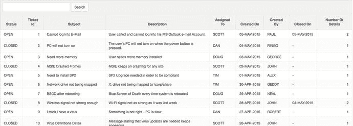

图 7-46. 交互式报表的可搜索 HTML 下载

`电子邮件`下载的输出与`HTML`下载相同，但通过电子邮件发送。`XLS`和`RTF`下载格式需要与`Oracle BI Publisher`集成，这可能需要向 Oracle 申请单独的许可。`PDF`输出可以通过`Oracle Rest Data Services`、外部`格式化对象处理器`（`FOP`）或`BI Publisher`来实现。关于使用`Oracle BI Publisher`生成这些格式报告的完整描述超出了本书范围。更多详情请参阅`Oracle APEX`文档的“高级打印选项和配置”部分。如果您的安装未配置这些选项，它们将不会出现在下载选项列表中。

花些时间尝试一下交互式报表的功能。如果您迷失了方向需要重置，只需点击`操作`按钮并选择`重置`。交互式报表将被重置为其原始状态，您对它所做的所有修改都将被丢弃。

## 修改交互式报表

尽管交互式报表提供了大量的功能，但您可能希望限制最终用户可用的功能。交互式报表的每个功能都可以按报告为基础进行禁用。此外，您可以为特定报告设置默认选项，使这些选项对所有最终用户可用。


#### 添加属性与移除列

让我们再次查看您的交互式报表。您可以结合使用交互式报表的最终用户操作与开发者设置来完成修改。首先，通过操作菜单从报表中移除一列并添加排序属性：

运行应用程序并导航至 `Analysis` 菜单项。
单击 `Actions` 按钮以显示操作菜单。
选择 `Select Columns` 选项，如图 7-47 所示。

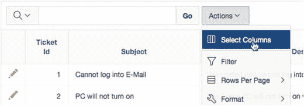

**图 7-47. 选择“选择列”选项**

将 `Ticket Id` 移动到穿梭框的 `Do Not Display` 部分，如图 7-48 所示，方法是双击其名称。

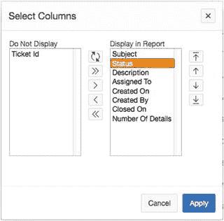

**图 7-48. 选择列**

使用上下箭头，重新排序剩余列，使 `Status` 出现在 `Subject` 之后、`Description` 之前，如图 7-48 中的 `Display in Report` 部分所示，然后单击 `Apply`。请注意，`Ticket Id` 列不再显示在您的报表中，而 `Status` 列紧接在 `Subject` 列之后显示。

接下来，您可以将更改设置为交互式报表的默认选项。这些选项将应用于使用该交互式报表的所有最终用户。`Save As Default Report Settings` 选项仅对身为 APEX 开发者的最终用户可用：

单击 `Actions` 按钮并选择 `Save Report` 项。
将 `Save` 设置为 `As Default Report Settings`，如图 7-49 所示。

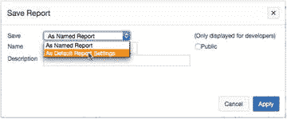

**图 7-49. “另存为默认报表设置”选项**

该区域会立即变化，允许您将报表保存为主要默认值或命名的替代项。将其设置为 `Primary default`，如图 7-50 所示。点击 `Apply`。

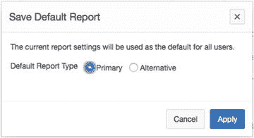

**图 7-50. 保存主要交互式报表**

现在，创建一个命名的替代默认报表，该报表对 `Status` 列执行控制中断：

单击 `Actions` 按钮并导航至 `Format` ➤ `Control Break`，如图 7-51 所示。

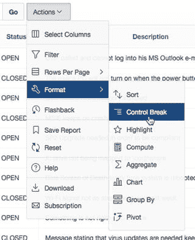

**图 7-51. 选择“控制中断”操作**

在第一个 `Column` 选择列表中选择 `Status`，并确保其设置为 `Enabled`，如图 7-52 所示。点击 `Apply`。

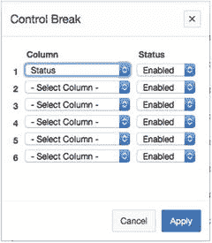

**图 7-52. 向交互式报表应用控制中断**

单击 `Actions` 按钮并选择 `Save Report` 选项。
将 `Save` 设置为 `As Default Report Settings`，如图 7-53 所示。


**图 7-53. 将交互式报表保存为默认设置**

该区域立即变化。这次，将报表保存为命名的替代项：为 `Default Report Type` 选择 `Alternative`，在 `Name` 中输入 `Tickets by Status`，如图 7-54 所示，然后点击 `Apply`。


**图 7-54. 将交互式报表保存为替代报表**

报表顶部的工具栏现在有一个新的 `Reports` 选择列表，其中包含您的默认报表和替代报表，如图 7-55 所示。


**图 7-55. 显示主要报表和命名替代报表的“报表”选择列表**

#### 有选择地启用和禁用项

作为开发者，您可以有选择地启用或禁用 `Actions` 菜单中的项。这样做可以限制最终用户在特定交互式报表中可用的选项。以下是一个示例操作：

编辑应用程序的 `Page 300`。
通过单击渲染树中的 `Attributes` 节点来编辑 `Analysis` 报表的交互式报表属性。
向下滚动到 `Actions Menu` 属性组。将 `Flashback` 和 `Save Report` 设置为 `NO`，并将 `Subscription` 设置为 `YES`，如图 7-56 所示。


**图 7-56. 选择操作菜单选项**

保存您的更改。
再次运行您的报表，然后单击 `Actions` 按钮展开操作菜单。请注意，`Flashback` 项不再存在。虽然我们关闭了 `Save Report`，但您仍然可以保存报表，因为您是以开发者身份登录到底层工作区的。标准最终用户将看不到此选项。您还应该看到一个新的订阅选项。

#### 将操作限制于特定列

除了控制哪些操作显示在交互式报表中外，您还可以进行更精细的设置，确定可以在哪些列上执行特定操作。图 7-57 显示了您的交互式报表的列级 `Actions` 设置。操作如下：

编辑应用程序的 `Page 300`。
在渲染树中展开 `Analysis Interactive Report` 节点下的 `Columns` 节点，并选择 `Description` 列。
在 `Enable Users To` 属性组中，将 `Sort` 和 `Filter` 属性设置为 `NO`。
保存您的更改。


**图 7-57. 为交互式报表选择列级操作**

运行应用程序的 `Page 300`。
单击 `Actions` 按钮并选择 `Format` ➤ `Sort`。`Sort` 操作界面应类似于图 7-58。


**图 7-58. 修改后的“选择列”列表**

请注意，`Description` 不再作为列名出现在列列表中。

默认情况下，交互式报表链接到称为 `Single Row View` 的视图。此视图显示一个只读区域，其中包含特定行的所有详细信息。在这种情况下，您可能希望链接回您在 `page 210` 上创建的表单。此时，您可以修改交互式报表，使其使用更传统的页面链接，而不是 `Single Row View`。您可以通过编辑 `Link Column` 属性来实现，如图 7-59 所示：


**图 7-59. 设置链接列属性**

编辑应用程序的 `Page 300`。
单击 `Analysis Interactive Report` 的 `Attributes` 节点。
在 `Link` 属性组中，将 `Link Column` 设置为 `Link to Custom Target`。
单击 `Target` 属性的 `Options Dialog` 按钮。
在出现的对话框中，确保 `Type` 设置为 `Page in This Application`，将 `Page` 设置为 `210`，在第一行的 `Name` 中输入 `P210_TICKET_ID`，在 `Value` 中输入 `#TICKET_ID#`，然后单击 `OK`（参见图 7-59）。
保存您的更改。

`Name` 和 `Value` 告诉链接传递当前工单的 ID（由 `#TICKET_ID#` 标识），并将其分配给会话状态中的 `P210_TICKET_ID`。

运行应用程序的 `page 300`。您现在应该能够通过单击带有 `Edit` 链接的列来深入了解任何行的详细信息。


### 探索幕后

让我们来看看交互式报表的幕后。你可能会惊讶地发现，在`Rendering`选项卡中，只有一个交互式报表区域，如图 7-60 所示。


图 7-60.
交互式报表的 Application Builder 视图

`Processing`选项卡不包含任何元素，`Shared Components`选项卡也只包含预期的元素。

这是第一次出现无法轻松使用标准声明式 APEX 元素重新创建交互式报表的情况。其附加功能来自于一组 JavaScript 函数、CSS 和 HTML，这些都包含在交互式报表区域类型中。虽然你可以从头开始构建此功能，但 APEX 交互式报表无疑是一个巨大的效率提升工具。

## 日历

有时，数据中存在一些以传统的行列格式查看时不太明显的趋势。通过简单地以不同的方式（例如日历报表）显示数据，这些趋势可能会变得显而易见。APEX 日历报表可以以每日、每周或每月视图显示数据，并且不需要你输入任何 SQL。

### 理解日历类型

APEX 日历是一种 APEX 报表类型。数据在日历上渲染，而不是以传统的行列格式。对 APEX 日历的唯一要求是，底层表或视图必须至少有一个`DATE`类型的列。

有两种类型的 APEX 日历：

*   Calendar：基于一个开源的 jQuery 组件，开箱即用，提供了相当多的功能。
*   Legacy Calendar：使用了在 APEX 4.2 及之前版本中可用的日历区域类型，其功能比新的基于 jQuery 的日历少。

日历中的数据可以像任何其他报表列一样充当列链接。这使得构建一个让用户点击日期并钻取到另一个页面或 URL 的日历变得非常简单。

### 创建日历

要实现一个 APEX 日历，你可以使用创建页面向导新建一个页面和一个日历区域。请遵循以下步骤：

1.  导航到你应用的 Application Builder 主页。
2.  点击屏幕右上角的`Create Page`按钮。
3.  选择`Calendar`并点击`Next`。
4.  再次选择`Calendar`并点击`Next`。
5.  如图 7-61 所示，在`Page Number`输入`400`，在`Page Name`和`Region Name`均输入`Ticket Activity Calendar`，并将`Breadcrumb`设置为`Breadcrumb`。
6.  当页面重新加载时，为`Entry Name`输入`Ticket Activity Calendar`并点击`Next`（参见图 7-62）。
7.  将`Navigation Preference`设置为`Create a new navigation menu entry`。页面刷新后，为`New Navigation Menu Entry`输入`Calendar`并点击`Next`（图 7-63）。
8.  确保`Source Type`设置为`Table`，选择你的模式作为`Table/View Owner`，为`Table/View Name`选择`TICKETS_V (view)`，如图 7-64 所示，然后点击`Next`。
9.  向导的下一步允许你选择在日历上显示的内容，以及开始和结束日期。此外，在此页面上，你可以选择希望如何显示日期（仅日期或日期和时间）。还有一些选项可以自动生成创建页面或编辑页面，并选择是否希望能够在日历上使用拖放来更改事件的开始和结束日期。我们将使用第 210 页作为我们的创建和编辑页面，但我们确实希望打开`Drag & Drop`。继续如下：
    *   对于`Display Column`，选择`SUBJECT`。
    *   对于`Start Date Column`，选择`CREATED_ON`。对于`End Date Column`，选择`CLOSED_ON`。
    *   将`Show Time`设置为`Yes`。
    *   将`Add Create Page`和`Add Edit Page`设置为`No`。
    *   将`Generate Drag & Drop Code`设置为`Yes`。
    *   点击`Next`。
    *   将`Primary Key Type`设置为`Select Primary Key Column(s)`。
    *   选择`TICKET_ID(Number)`作为`Primary Key Column`。
    *   点击`Next`。
    *   将`Source Type`设置为`Existing Trigger`并点击`Next`。
    *   点击`Create`。

运行日历报表，你会看到类似图 7-65 所示的内容。将鼠标悬停在任何事件条上将显示一个悬停提示，其中包含更多主题和日期信息。由于我们打开了`Drag & Drop`，你可以点击并拖动任何事件来更改其`Created On`日期。


图 7-65.
由向导生成的日历报表

我们可以对日历进行一些调整，以便为查看者提供更多信息，并将其与第 210 页上的工单编辑屏幕链接起来：

1.  编辑应用的第 400 页。
2.  编辑`Ticket Activity Calendar`的属性。
3.  找到并打开文件`ch7_calendar_details.txt`（你可以在解压的书籍文件中找到它）。将该文件的内容复制并粘贴到`Settings`属性组下的`Supplemental Information`文本区域中，如图 7-66 所示。
4.  点击`View/Edit Link`旁边的`Options`按钮。该按钮应该显示为`No Link Defined`。
5.  在弹出的对话框中，将`Page`设置为`210`，将`Name`设置为`P210_TICKET_ID`，将`Value`设置为`&TICKET_ID.`，将`Clear Cache`设置为`210`，如图 7-67 所示，然后点击`OK`。保存你的更改。

运行该页面，你的日历应该看起来与图 7-68 相似。现在，当你将鼠标悬停在事件条上时，可以看到更多的工单详情。你现在也可以点击事件条来编辑工单详情。


图 7-68.
修改后的工单活动日历

> 注意
>
> 如果`Supplemental Information`中显示的数据可能包含特殊字符，如`&`、`'`、`"`或`/`，APEX 将尝试对它们进行编码以降低跨站脚本的风险。如果你信任数据源，可以编辑日历区域，在`Security`属性部分，将`Escape Special Characters`设置为`No`。

### 探索幕后

既然你的日历可以工作了，让我们看看日历向导为你构建了什么。编辑第 400 页。在`Rendering`选项卡中，如图 7-69 所示，你基本上只会看到`Calendar`区域。


图 7-69.
你的日历的页面渲染区域

请注意，在页面的`Processing`选项卡中没有任何进程。这是因为日历区域使用 JavaScript 调用从数据库获取数据，并根据拖放操作更改任何移动的值。这只是 JavaScript 和 jQuery 强大功能的一个简短示例。


## 图表

在 APEX 4.2 中，通过整合 AnyChart 6，图表功能得到了重大改进，这一改进也延续到了 APEX 5.0。这个版本的 AnyChart 不仅生成的图表比之前的版本看起来更专业，而且图表引擎还提供了基于 Flash 或基于 HTML5 的图表选项。这对于面向移动市场的应用程序来说是一个巨大的进步，因为 HTML5 图表可以在大多数现代浏览器上渲染，而无需额外的插件。

新图表引擎的美妙之处在于，你可以在页面开发过程中随时在渲染 Flash 和 HTML5 图表之间切换，而声明性数据保持不变，与渲染方式的选择无关。

HTML5 图表也保持了与 Flash 图表相同级别的交互性，包括悬停和点击钻取功能。

图 7-70 展示了柱状图的 Flash 版本和 HTML5 版本，表明尽管外观有所变化，但相同的代码生成了非常相似的图表。


图 7-70. 使用 Flash 和 HTML5 渲染的相同图表

Flash 和 HTML5 图表的功能几乎相同，但 HTML5 图表能够在任何平台上原生渲染，而 Flash 图表在 Apple 的任何移动平台上都无法工作。

### 为图表编写查询

APEX 图表通常需要这种类型的查询：

```sql
SELECT
  link,
  label,
  value
FROM
  table
WHERE
  where conditions
GROUP BY
  group by column list
ORDER BY
  Order by column list
```

其中

*   `link` 是指向 APEX 页面或其他 URL 的链接；
*   `label` 是图表元素的标签；以及
*   `value` 是要绘制的值。

确切的语法会根据各种图表类型的需求略有变化，但通用的链接-标签-值格式保持不变。有关每种图表类型的确切语法，请参阅 APEX 在线文档。

### 创建图表

让我们创建一个饼图，显示每个状态的工单数量。稍后，你将把点击饼图切片的动作链接到过滤工单报告，以仅显示该状态的工单。请按照以下步骤操作：

1.  编辑应用程序的任何页面。
2.  点击页面设计器工具栏中的创建（+）按钮并选择“页面”。
3.  选择“图表”并点击“下一步”。
4.  从选择列表中选择“HTML5 图表”。
5.  页面刷新后，选择“饼图和环形图”并点击“下一步”。
6.  选择“2D 饼图”并点击“下一步”。
7.  输入 `500` 作为“页面编号”，`Tickets by Status` 作为“页面名称”和“区域名称”，并将“面包屑导航”设置为“面包屑”（参见图 7-71）。页面重新加载后，输入 `Tickets by Status` 作为“条目名称”并点击“下一步”。


图 7-71. 为图表设置页面编号、页面名称和区域名称属性
8.  将“导航首选项”设置为“创建新的导航菜单条目”。页面刷新后，输入 `Chart` 作为“选项卡标签”并点击“下一步”（参见图 7-72）。


图 7-72. 为图表设置导航属性
9.  设置“图表标题”为 `Ticket Statuses` 并点击“下一步”。
10. 定位并打开文件 `ch7_chart_query.txt`，你可以在解压本书文件的位置找到它。该文件的内容应与此查询类似：
```sql
SELECT
  'f?p=&APP_ID.:200:' || :APP_SESSION || '::::P200_STATUS_ID:' || sl.status_id link,
  sl.status label,
  count(*) value
FROM
  tickets t,
  status_lookup sl
WHERE
  t.status_id = sl.status_id
GROUP BY
  sl.status_id, sl.status
ORDER BY
  3 DESC
```
11. 将文件 `ch7_chart_query.txt` 的内容粘贴到“输入 SQL 查询或返回 SQL 查询的 PL/SQL 函数”区域中，或者将上一个查询键入该区域，然后点击“下一步”。
12. 点击“创建”。

运行页面。你的图表应该与图 7-73 中的类似。


图 7-73. Ticket Statuses 图表

### 过滤图表数据

你在 SQL 语句中包含的链接将一个状态值传递到页面 200 的 `P200_STATUS_ID` 字段。然而，你还没有创建该项。接下来的步骤在页面 200 上创建 `P200_STATUS_ID` 项，以便在点击图表切片时，报告可以根据状态进行过滤：

1.  编辑应用程序的页面 200。
2.  通过将“组件库”的“项”部分中的“选择列表”项拖到“工单”区域中来创建一个新项。将其放置在 `P200_SEARCH` 项和 `P200_GO` 按钮之间，如图 7-74 所示。


图 7-74. 添加一个选择列表项
3.  在“编辑属性”窗格中，设置“名称”为 `P200_STATUS_ID`，“标签”为 `Status`（参见图 7-75）。


图 7-75. 设置名称和标签
4.  在“值列表”属性组中，设置“类型”为“共享组件”，“值列表”为 `P210_TICKETS_STATUS_ID`，确保“显示空值”设置为“是”，为“空值显示值”输入 `- All Statuses -`，并为“空值返回值”输入 `%`。
5.  在“默认值”属性组中，设置“类型”为“静态值”，并为“静态值”输入 `%`，如图 7-76 所示。


图 7-76. 设置默认值
6.  保存你的更改。

同样，默认情况下，“搜索”和“描述”字段的标签被设置为占用布局网格的三列。让我们更改此设置，使它们各只占一列：

1.  多选 `P200_SEARCH` 和 `P200_STATUS_ID`。
2.  在“编辑属性”窗格中，导航到“网格”属性组，并将“标签列跨度”更改为 1。
3.  保存你的更改。

最后，你必须更改页面 200 上工单报告的查询，以考虑项 `P200_STATUS_ID` 的设置值：

1.  通过单击其名称来编辑页面 200 上的工单报告。
2.  将以下行附加到查询末尾并保存你的更改：
```sql
AND tickets.status_id LIKE :P200_STATUS_ID
```

现在，运行应用程序并导航到“图表”页面。点击图表中的任何值，该值应传递到“工单”页面并进入状态过滤器。生成的报告应仅显示与图表中点击的状态相对应的记录。

### 探究幕后原理

在应用程序构建器中查看“图表”页面，你可以看到生成的唯一元素是“页面渲染”区域中的“图表”区域，如图 7-77 所示。这个“图表”区域很有趣，因为它包含一个“系列”元素，其中包含你的 SQL 查询。这个“图表”区域体现了将你的查询传递给 AnyChart 引擎以生成图表的逻辑。


图 7-77. Ticket Statuses 图表的渲染选项卡

## 小结

你已审阅了大部分的 APEX 表单和报表类型，并使用 APEX 表单和报表向导，逐步实践了为帮助台系统构建各种表单和报表。你创建了一个交互式报表，并分别以开发者和最终用户的身份对其进行了调整。你已接触了图表，并向应用程序中添加了一个图表，以直观显示工单状态。

这里的共同主题是，APEX 表单和报表向导对开发者而言是巨大的时间节省工具，它们创建了可工作的表单、报表、日历或图表所需的所有对象——包括项、按钮、分支、进程等等。你能够修改已创建的对象，从而快速定制生成的表单或报表以满足你的需求。尽管如此，你并未偏离 APEX 为你构建的基础太远。

随着你的应用程序变得愈发复杂，在某些情况下，你将希望添加代码来强制执行业务规则，或执行比简单的插入、更新或删除更复杂的处理逻辑。为此，你可以使用 APEX 的各种程序化元素。下一章将探讨验证、计算和进程的主题。

