# 8. 程序化元素

本章将介绍能为 APEX 框架提供简单和复杂功能的程序化元素。APEX 通过向导提供了简单的声明式功能来指导你。由于其与数据库的集成，APEX 还能充分利用 Oracle 数据库内部的 PL/SQL 引擎的全部能力。自 APEX 4 版本实现以来，即使是 JavaScript 交互性也已在该框架内变得可声明和可扩展。

## 条件

在整个帮助台应用程序的构建过程中，会有时候你想利用 APEX 组件可用的条件逻辑。与其试图理解每一种条件类型（条件类型列表中大约有 60 种），不如主要专注于理解条件的总体概念。

条件特性提供了一个可以开启或关闭特定 APEX 技术逻辑的位置。在采取行动显示或执行特定 APEX 组件之前，会评估应用于该组件的条件是否为`TRUE`，即肯定结果。

用于开发条件的逻辑选项非常广泛。条件类型定义了用于评估条件的具体机制，并酌情使用参数。简单的页面项比较是最容易解释的。例如，一个进程可能只需要在特定页面项具有值时才运行。在发送电子邮件的情况下，只有在提供了电子邮件地址时，才应尝试发送消息。从这个简单的起点开始，条件可以变得像你需要的那样复杂。在高级情况下，条件也可以包括浏览器和 Web 服务器选项。

花时间审阅可用的条件类型并熟悉其用法。理解每个项的技术实现或语法并不像理解构成单一条件的选项那样重要。这种熟悉度在你开始定义 APEX 组件并理解灵活且模块化应用程序设计的考虑因素时将有所帮助。

## 必填值

要求提供值是一个常见的需求，APEX 5.0 通过本质上是在页面项级别设置一个`NOT NULL`标记来支持必填值。你无需创建一个完整的验证（接下来讨论）来使一个项成为必填项。你只需从一个开关项中做出选择即可。

继续我们的帮助台应用程序，让我们为“描述”字段实现一个“值必需”验证：

```
编辑应用程序的第 210 页。
编辑 P210_DESCR 页面项。
在“验证”属性组中，将“值必需”更改为“是”，如图 8-1 所示。（根据你的 UI 默认设置方式，“值必需”可能已经设置为“是”。）
```

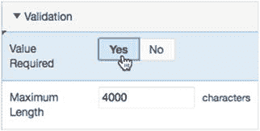

图 8-1. 要求值存在

```
保存你的更改。
```

要测试新的验证，首先创建一个工单。在你输入任何值之前，单击“创建”按钮。图 8-2 显示了预期的结果，其中包含一个整合的页面验证消息框和项验证消息。

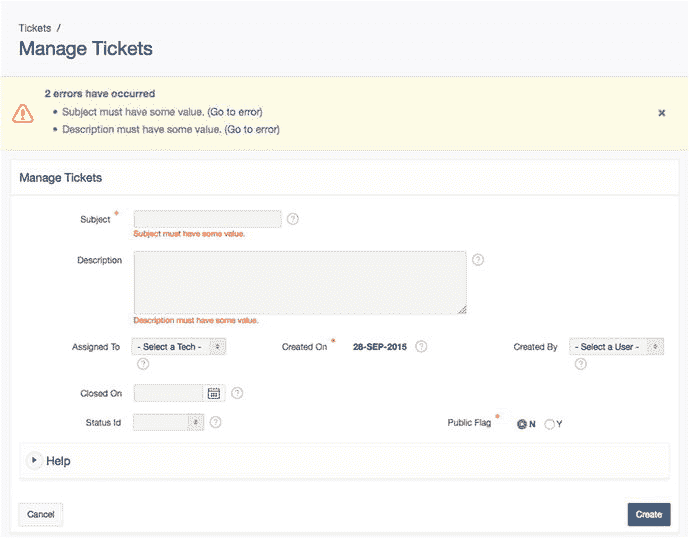

图 8-2. 验证显示两个元素的必填值，既在行内显示，也在页面级别整合显示

在应用程序中，“主题”元素已经设置了值必需验证。这是因为在你使用向导创建表单时，APEX 考虑了表中该列的`NOT NULL`属性。你还会看到 APEX 向导选择了一个在标签文本开头包含星号(*)的项标签模板。这为最终用户提供了该列是必填项的视觉提示。然而，要注意不要将选择一个指示字段是必填的标签与实际使用`VALUE_REQUIRED`属性或验证使该字段成为必填项混淆。

多个验证的错误消息是累积的。在处理页面时，你会看到所有的验证消息。参见图 8-2。

> **注意**
>
> 所示的消息文本是默认的，可以被替换为应用程序特定的文本，这是“共享组件”区域中全球化功能的一个特性。整个应用程序每种语言只有一个默认值。当在单一语言应用程序中需要自定义消息时，我建议使用标准的验证类型，它允许为你创建的每个验证设置不同的消息。

## 验证

验证的目的是协助提供数据质量，并确保用户输入数据的完整性。从机制上讲，验证是评估结果为`TRUE`或`FALSE`的测试。验证在页面被处理或提交时进行评估。所有的验证都会被评估；任何一个验证返回`FALSE`都会阻止额外的页面进程执行，并且理想情况下，会向用户提供反馈。验证也可以使用 JavaScript 在客户端执行。尽管 JavaScript 的交互性在用户界面上可能非常吸引人，但它也很容易被绕过。任何在 JavaScript 中执行的验证都应该辅以在页面处理期间或数据库级别的适当验证。

> **注意**
>
> 假设每个事务都是恶意的，这是一个良好的实践。完全出于安全目的实现验证是可能的，但有时很难从一个进程中抽身出来，以识别薄弱点可能存在于何处。例如，在一个购物车应用程序中，如果有人订购了-1 个产品，总额会发生什么变化？他们会自动获得退款吗？在开发过程中，请花额外的时间审视你的应用程序，以识别可能存在的安全弱点，并实现使其整体上更健壮和安全的功能。

验证有四种类型：项级别、页面级别，以及对于表单区域，列级别和行级别。项级别验证针对单个 APEX 项操作。当多个项参与验证条件时，使用页面级别验证。表单区域的验证行为类似，但是针对表单区域的列和行进行的。你将在帮助台应用程序中使用每种类型的一个示例。


### 项目级验证

对单个元素的验证可以具有特定于该元素的属性，并且可以根据该元素的要求自定义行为。这里你将实现的示例是一个仅在特定条件为真时才检查其条件的验证。需求是当状态为关闭时，必须输入结束日期。请按照以下步骤操作：

编辑应用程序的第 210 页。导航到树状窗格的“处理”选项卡。在处理树的“验证”节点上右键单击，然后选择“创建验证”，如图 8-3 所示。

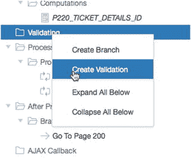

图 8-3. 准备为页面创建验证

在属性窗格中，将“名称”设置为 `Check CLOSED_ON date`。在“验证”属性组中，将“类型”选择为 `Item is NOT NULL`，然后为“项目”选择 `P210_CLOSED_ON`。在“错误消息”文本区域中输入 `Please enter a value for #LABEL#.`，并将“关联项目”设置为 `P210_CLOSED_ON`，如图 8-4 所示。显示的错误消息使用了一个替换变量 `#LABEL#` 来包含消息中项目的标签。这样，当将来表单项目的标签发生变化时，验证错误消息将自动引用新标签。

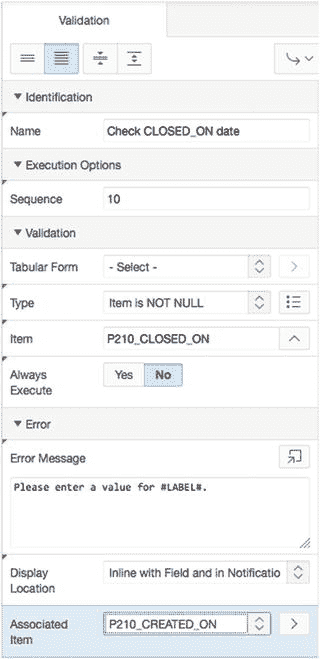

图 8-4. 设置验证属性

在此步骤中，我们将使验证仅在当前工单状态为 `CLOSED` 时适用：在“条件”属性组中，将“类型”设置为 `PL/SQL Function Body`，如图 8-5 所示。

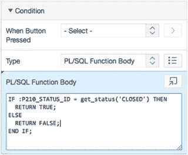

图 8-5. 为验证设置条件类型和函数体

将以下代码输入到 PL/SQL 函数体中：

```
IF :P210_STATUS_ID = get_status('CLOSED') THEN
   RETURN TRUE;
ELSE
   RETURN FALSE;
END IF;
```

保存你的更改。

创建验证后，它会出现在 APEX 页面设计器的“渲染”和“处理”两个选项卡中，如图 8-6 所示。这两个引用指向相同的实现，显示出来是为了方便导航。

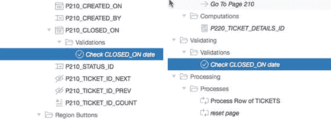

图 8-6. 创建的验证在应用程序生成器页面的两个位置显示

现在，此验证要求当工单状态设置为 `CLOSED` 时，必须为 `Closed On` 项目输入一个值。应用于验证的条件会在每次页面提交时进行评估。

### 页面级验证

页面级验证同时应用于一个或多个项目，并且通常可以是整个 PL/SQL 代码块，必须计算为 `TRUE` 验证才算成功。Help Desk 应用程序的需求是比较 `Created On` 日期和 `Closed On` 日期，以确保它们按时间顺序发生。一个在创建之前就关闭的工单没有意义。这是一个使用验证来确保数据质量的好例子。以下是你如何创建所需验证：

编辑应用程序的第 210 页。导航到树状窗格的“处理”选项卡。在处理树的“验证”节点上右键单击，然后选择“创建验证”。在属性窗格中，将“名称”设置为 `Closed Date must be after Creation Date`。为“错误消息”输入 `Closed On Date must be Later than the Created Date`，将“类型”设置为 `PL/SQL Function Body (returning Boolean)`，然后在 PL/SQL 表达式文本区域中输入以下代码。图 8-7 显示了完成的值。单击“下一步”继续：

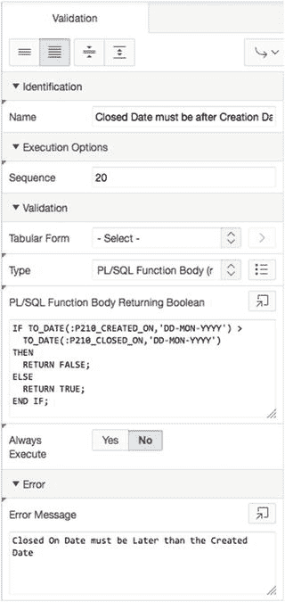

图 8-7. 验证属性

```
IF TO_DATE(:P210_CREATED_ON,'DD-MON-YYYY') >
   TO_DATE(:P210_CLOSED_ON,'DD-MON-YYYY')
THEN
   RETURN FALSE;
ELSE
   RETURN TRUE;
END IF;
```

保存你的更改。

在你的应用程序中，现在你拥有一个有助于确保输入数据质量的功能。这种数据检查确保任何从开始到结束计算时间的指标不会因为日期问题而产生负数答案。这提高了数据质量和报告中产生的指标的可靠性。

### 表格表单验证

APEX 5.0 中的表格表单能够比以前版本更好地执行验证。创建表格表单的向导也会为你添加验证。向导会根据数据模型自动创建验证。然而，向导只能了解你的业务流程的有限信息，数据模型可能比你应用程序中想要的更灵活。

查看第 230 页的定义，向导已经根据底层 `TICKETS` 表的 `NOT NULL` 属性为你创建了许多 `Not Null` 验证。但是，向导不知道当工单关闭时你需要一个 `Closed On` 日期。你可以使用列级表格表单验证来应用该验证：

编辑应用程序的第 230 页。导航到树状窗格的“渲染”选项卡。展开“管理多个工单”表格表单的“列”节点。右键单击 `CLOSED_ON` 并从上下文菜单中选择“创建验证”。在属性窗格中，将“名称”设置为 `CLOSED_ON is Not Null if Ticket is CLOSED`。将“表格表单”设置为“管理多个工单”，“类型”设置为 `Column is NOT NULL`，“列”设置为 `CLOSED_ON`，如图 8-8 所示。

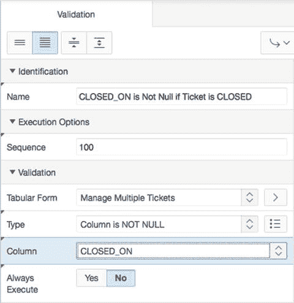

图 8-8. 设置验证名称和验证属性

对于“错误消息”，输入 `#COLUMN_HEADER# must be entered if Status is CLOSED`，如图 8-9 所示。单击“下一步”。

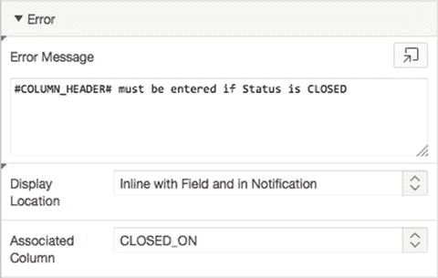

图 8-9. 使用替换变量的错误消息

在“条件”属性组中，将“类型”设置为 `PL/SQL Function Body`，“执行范围”设置为 `For Created and Modified Rows`，然后在 PL/SQL 函数体文本区域中键入以下代码：

```
IF :STATUS_ID = get_status('CLOSED') THEN
   RETURN TRUE;
ELSE
   RETURN FALSE;
END IF;
```

保存你的更改。

当你运行“管理多个工单”页面时，你可以通过添加一个状态为 `CLOSED` 且未设置 `Closed On` 日期的新工单，或者通过移除现有已关闭工单的 `Closed On` 日期并尝试保存更改来测试新的验证。在图 8-10 中，每一行不满足验证要求的行都会被高亮显示，并出现在页面顶部的错误列表中。在此示例中，没有 `Closed On` 日期的行未能通过验证，并被标记为需要注意。

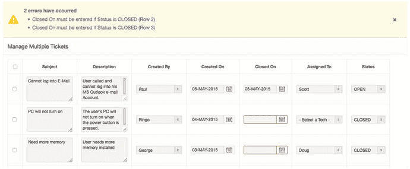

图 8-10. 未通过验证的结果被高亮显示并呈现在消息区域中

注意：默认情况下，这些验证仅针对新的或更改的行执行。你可以通过设置验证的“执行范围”（位于“条件”部分）来更改此行为。

创建验证向导还允许在表格表单上创建行级验证。这些验证对于表格表单处理的每一行运行一次。在这个级别上，你可以轻松地创建一个类似于为第 210 页创建的验证，用于检查 `Closed On` 日期是否发生在 `Created On` 日期之后。

作为对你所学内容的练习，请尝试在第 230 页的表格表单的行级别实现该验证。


## 计算

一项 APEX 计算类似于一个 PL/SQL 函数。其目的是通过多种方法设置值来对应用程序中的项目进行操作。这使得信息能够被推导出来，而不仅仅是存储在数据表中。根据应用程序的需求，计算可以在页面渲染时实现，也可以在页面提交回服务器后实现。计算可以作用于应用程序内可用的任何项目。可以设置的项目包括当前页面上的项目、另一个页面上的项目，甚至是应用程序级别的项目。

还有一种可以在应用程序级别使用的计算。它在应用程序的共享组件中可用。这种计算有额外的执行点选项，包括一个名为“新建实例时”的计算点，该点在用户登录时获得新会话（或实例）时执行。

### 执行

理解计算相对于页面上显示值的时间点以及相对于其他值可供计算使用的时间点来执行，这一点很重要。当在计算中使用某个项目的值时，使用的是该项目的当前会话状态值。计算会在会话状态中设置一个项目值，之后任何使用该项目的处理（计算、验证或流程）都会看到该计算的结果。当页面被渲染时，它显示的是该值在页面上显示时其会话状态中的内容。计算点是决定计算何时执行的设置。

在页面定义屏幕中，几个计算点显示在页面树中。你可以通过在树中单击并将计算拖动到不同的计算点，或者通过编辑计算并直接更改序列和计算点的值来调整计算点。序列仅用于排序给定计算点内的计算。通常，页面按照页面定义屏幕上的显示从上到下进行渲染和处理。只有少数例外，例如动态操作和 AJAX 回调，它们具有可变的执行点。

### 类型

计算具有与其他 APEX 组件相同的灵活性。它们可以是复杂的，也可以是简单的，并拥有 Oracle 数据库的全部功能来支持它们。计算的类型如下：

*   静态值：简单的静态文本值
*   项目：应用程序中另一个项目的名称
*   SQL 查询（返回单个值）：只要返回单行单列的任何 SQL 语句
*   SQL 查询（返回冒号分隔值）：用于多选项目的 SQL
*   SQL 表达式：在 SQL 语句的 `SELECT` 部分使用的表达式
*   PL/SQL 表达式：与 SQL 表达式相同
*   PL/SQL 函数体：带有 `RETURN` 语句的 PL/SQL 函数语法
*   首选项：存储在元数据中的 APEX 用户首选项的值

计算可以像许多其他 APEX 组件一样具有条件性。条件可以像业务规则要求的那样复杂，能够使用数据库功能和 APEX 会话项目来评估条件。条件评估为 `TRUE` 会导致计算被执行。

### 创建计算

服务台应用程序有一个需求，需要显示一个工单已开启的天数。结果应该是一个派生值，它会根据所审查记录的日期和状态而变化。你可以通过在页面上放置一个新项目来显示计算结果来实现这一点：

编辑页面 210。从组件库的“项目”部分，单击并拖动“仅显示”项目，使其出现在 `P210_SUBJECT` 的右侧。参见图 8-11。

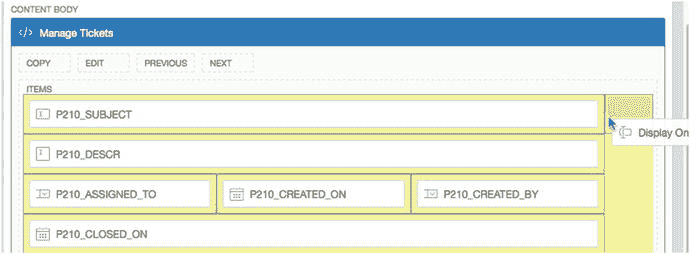
*图 8-11.*

放置“仅显示”项目。在“属性”窗格中，为“名称”输入 `P210_DAYS_OPEN`，为“标签”输入 `Days Open`。将“保存会话状态”设置为“否”。现在，该区域中有一个新项目，你可以将其用作计算的容器。接下来，我们创建计算，以便将值设置为工单已开启的天数。但是，我们只希望此计算针对已创建的工单显示，而不针对正在输入的新工单。在“条件”属性组中，将“类型”设置为“项目不为空”。当区域刷新时，将“项目”的值设置为 `P210_TICKET_ID`，如图 8-12 所示。

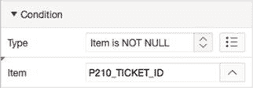
*图 8-12.*

仅当另一个项目包含值时才显示一个项目。在“源”属性组中，将“类型”设置为“空”。在树窗格的“渲染”选项卡中，右键单击 `P210_DAYS_OPEN`，然后从上下文菜单中选择“创建计算”，如图 8-13 所示。

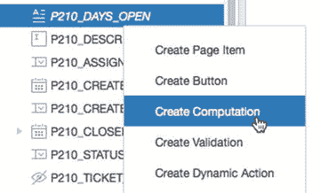
*图 8-13.*

使用右键快捷方式创建计算。在“属性”窗格中，将“类型”设置为“SQL 查询（返回单个值）”。在 SQL 查询文本区域中，输入以下 SQL 语句（也如图 8-14 所示），然后保存更改：

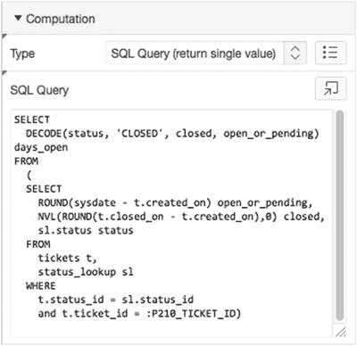
*图 8-14.*

输入计算的 SQL 语句。
```sql
SELECT
    DECODE(status, 'CLOSED', closed, open_or_pending) days_open
FROM
    (
    SELECT
        ROUND(sysdate - t.created_on) open_or_pending,
        NVL(ROUND(t.closed_on - t.created_on),0) closed,
        sl.status status
    FROM
        tickets t,
        status_lookup sl
    WHERE
        t.status_id = sl.status_id
        and t.ticket_id = :P210_TICKET_ID)
```

要查看添加新项目的结果，请运行应用程序并导航到“工单”报告（页面 200）。单击其中一个“编辑”图标以调出单记录视图（页面 210）。你现在应该能看到计算的结果，即天数。在开始创建新工单的过程时，该字段不会显示，因为条件阻止了该字段的显示。

## 流程

如果说计算类似于数据库函数，那么流程就类似于数据库过程。流程是一个逻辑单元的容器。

流程可以说是 APEX 最复杂的部分，因为它们是用于处理数据库中的数据处理以及对 API（例如用于发送电子邮件和执行应用程序所需的任何其他业务逻辑的 API）的引用的结构。在处理数据表单时，APEX 向导会创建内置流程来管理表单数据的读写。这些类型的内置流程称为数据操作流程。

流程与计算类似，可以发生在页面渲染和页面处理期间。流程支持 APEX 条件功能，这允许将流程编写为独立的逻辑单元，由条件决定是否需要该逻辑。


### 执行点

进程的执行点与计算的执行点相同。进程最常用的执行点是 `提交后 - 计算和验证之后` 和 `按需 - 当 AJAX 请求时运行此进程`，因为这些点支持按钮按压活动和动态操作。完整列表如下：

*   新会话
*   页头之前
*   页头之后
*   区域之前
*   区域之后
*   页脚之前
*   页脚之后
*   提交后
*   处理中
*   AJAX 回调

进程可以在单个页面级别定义，也可以作为共享组件的一部分在应用程序级别定义。从功能上讲，页面进程和应用程序进程的行为方式相同。区别在于业务逻辑的包含位置。对于需要在所有页面上运行的进程，您可以定义一个应用程序进程。同样，就像区域一样，您可以使用全局页面来定义在每个页面上运行的进程，但这仅适用于页面渲染。

## 进程类型

每种不同的进程类型根据需求有不同的用途。类型及其用途如下：

*   自动行获取：从单个数据库表或视图中检索记录
*   自动行处理 (DML)：处理从单个数据库表或视图插入、更新或删除记录
*   清除会话状态：清除会话状态值；也称为缓存
*   关闭对话框：关闭当前模态或非模态对话框的进程
*   表单分页：从数据库表或视图中检索单条上一条或下一条记录的进程。最常用于主从表单
*   加载上传数据：将已解析的电子表格数据加载到现有表或视图中的进程
*   解析上传数据：解析已准备的电子表格数据的进程，为加载到现有表做准备
*   PL/SQL 代码：通常用于利用数据库 PL/SQL 逻辑
*   准备上传数据：准备电子表格数据以上传到现有表中的进程
*   重置分页：重置报表的分页
*   发送电子邮件：用于轻松发送电子邮件的声明性界面
*   表格表单 - 添加行：向表格表单区域添加一行的进程。
*   表格表单 - 多行删除：从表格表单区域删除多行的进程
*   表格表单 - 多行更新：从表格表单区域更新多行的进程
*   用户首选项：为最终用户设置用户首选项的进程。
*   Web 服务：向 Web 服务提供者提交请求
*   插件：由插件提供的进程功能

## 帮助台应用中的进程

进程背后的细节可能非常复杂。为了提供一个充分的示例，我们将在帮助台应用中包含一个简单的进程：一个要求应用跟踪记录最后一次修改时间的需求。您可以通过在记录每次保存时更新其上的 `最后更新` 日期来完成此操作。有不止一种方法可以完成此任务。在这里，您将使用一个进程来实现。

首先，您需要将 `LAST_UPDATED` 字段添加到 `TICKETS` 表中。为此，您再次使用 SQL 工作坊：

从 SQL 工作坊下拉菜单中，选择对象浏览器，如图 8-15 所示。


图 8-15. 导航到 SQL 工作坊对象浏览器

从左侧的对象列表中选择 `TICKETS` 表。

单击表定义上方的“添加列”按钮，如图 8-16 所示。


图 8-16. 向表中添加列

在“添加列”中输入 `LAST_UPDATED`，在“类型”中输入 `DATE`，然后单击“下一步”。

单击“完成”。现在您可以将进程添加到页面：

编辑应用程序的第 210 页。

在树状面板的“处理”选项卡中，右键单击“进程”节点，然后从上下文菜单中选择“创建”，如图 8-17 所示。


图 8-17. 使用上下文菜单创建进程

将进程的“名称”设置为 `设置最后处理时间`，并将“点”设置为 `处理中`。将“类型”设置为 `PL/SQL 代码`。在下一步中，您将设置匿名 PL/SQL 块的内容。如果您不熟悉 PL/SQL 匿名块，它是一段以 `BEGIN` 开始并以 `END` 结束的 PL/SQL 代码，它们包裹着内容。您需要遵循 PL/SQL 语法约定，包括用分号结束语句。可以嵌套匿名代码块，但本示例不需要：

在 PL/SQL 代码文本区域中输入以下 SQL（参见图 8-18）：


图 8-18. 输入匿名 PL/SQL 块

```
BEGIN
    UPDATE tickets SET last_updated = sysdate
       WHERE ticket_id = :P210_TICKET_ID;
END;
```

将“成功消息”和“错误消息”都留空。这些消息将在进程完成后作为用户反馈显示在页面顶部。您的需求不要求您通知用户最后更新日期已被更改。

在“条件”属性组中，将“当按钮被按下”更改为 `SAVE`。

保存您的更改。

至此，进程已创建。目前，您没有在摘要报告中显示“最后更新”日期。为了在报告中看到该值，您需要将 `LAST_UPDATED` 列添加到报告获取数据的查询中。该报告位于应用程序的第 200 页：

编辑第 200 页。

通过在树中单击区域的名称来编辑“工单”区域。

将 `LAST_UPDATED` 日期添加到报告的区域源中，如下列 SQL 所示。完成后单击“保存”：

```
select TICKET_ID,
       SUBJECT,
       DESCR,
       CREATED_BY,
       CREATED_ON,
       CLOSED_ON,
       ASSIGNED_TO,
       STATUS,
      LAST_UPDATED
   from TICKETS,
       STATUS_LOOKUP
 where TICKETS.STATUS_ID = STATUS_LOOKUP.STATUS_ID
   and UPPER(SUBJECT) LIKE '%'||UPPER(:P200_SEARCH)||'%'
   and tickets.status_id LIKE :P200_STATUS_ID
```

要测试和查看更改，请运行应用程序并导航到“工单”报告。编辑任意工单，然后单击“应用更改”按钮。您现在应该会看到“最后更新”的值，显示当前日期。

这是一个关于如何使用进程应用基于表单的逻辑的快速示例。当表单用于进行更改时，一小段 PL/SQL 会自动进行记录更改。包、过程和 API 都可以通过类似于该示例的进程来访问。


## PL/SQL 区域

PL/SQL 区域类型本质上是一个开放的 PL/SQL 容器，并带有生成输出的附加选项。您可以使用 Oracle Web Application (OWA) 工具包过程（例如 `htp.p`）来生成输出。对 APEX 项的引用可以使用绑定变量语法（例如，`:P1_ITEM_NAME`）、`v` 函数（例如，`v('P1_ITEM_NAME')`）或替换字符串语法（例如，`&P1_ITEM_NAME`）来实现，以支持区域中包含的逻辑。

PL/SQL 区域与过程区域的不同之处在于，PL/SQL 区域仅在页面渲染期间执行，而过程可以在页面处理和页面渲染期间运行。PL/SQL 区域的优势在于能够直接在页面上生成内容。这种输出的一个用例是需要一种超出标准报告模板能力的复杂报告格式。在这种情况下，可以编写一个生成所需 HTML 输出的 PL/SQL 包，并由 PL/SQL 区域调用。

在“服务台”应用程序中，您希望通过添加个人未解决工单数量的快速摘要，使主页更有用。这仅适用于有人登录的情况。因此，如果他们未登录，简单的问候消息就足够了。您可以通过添加一个包含一些逻辑以输出相应消息的 PL/SQL 区域来完成添加摘要的任务：

1.  编辑页面 1。
2.  通过在树中单击其名称来编辑 APEX Issue Tracker 区域。目前，此区域是一个标准的静态内容区域，会发出您输入到其中的确切 HTML 代码。您希望使其动态化，因此将其切换为使用 PL/SQL：
    *   在“标识”属性组中，将“类型”更改为“PL/SQL 动态内容”。
    *   在“PL/SQL 代码”文本区域中输入以下代码，替换原有的静态 HTML，然后保存您的更改：

```
DECLARE
   l_count NUMBER;
   l_status_id NUMBER := get_status('OPEN');
BEGIN
   IF :APP_USER != 'nobody' THEN
      SELECT count(*)
        INTO l_count
        FROM tickets
       WHERE assigned_to = :APP_USER
         AND status_id = l_status_id;
      htp.p('<h1>Welcome to the APEX Issue Tracking System, '
            || :APP_USER || '</h1>'
            || 'You have ' || l_count || ' Open tickets.<br />'
            || 'Select an option from the list');
   ELSE
      htp.p('<h1>Welcome to the APEX Issue Tracking System</h1>'
            || 'Select an option from the list');
   END IF;
END;
```

此代码实现了基于用户替换变量 `:APP_USER` 做出决策的逻辑，并根据该区分因素定制 `htp.p` 输出。当用户尚未登录时，APEX 会提供 “nobody” 作为用户名，因此逻辑会根据该值进行判断。

当为尚未登录的用户生成 PL/SQL 区域时，会产生一条简单的欢迎消息（见图 8-19）。当拥有凭据的用户登录到应用程序时，会产生类似于图 8-20 中的消息，显示特定于用户的问候语以及分配给该用户的未解决工单数量的快速计数。

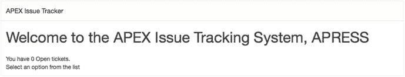

图 8-20. 对于已验证用户，PL/SQL 区域会生成问候语和工单计数

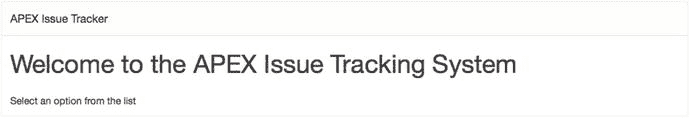

图 8-19. 用户尚未登录时的 Issue Tracker PL/SQL 区域

在本节中，您创建了一个动态 PL/SQL 区域，该区域根据应用程序用户改变输出。本节的示例虽然简单，但展示了如何使用数据库中的 PL/SQL 使区域的内容根据需要变得动态。

## 动态 SQL

动态 SQL 是指不是在设计时确定，而是在运行时由任意数量的动态条件组装而成的 SQL 的术语。当 SQL 语句的确切要求直到运行时才知晓，或者当 SQL 需要在应用程序运行时改变时，会使用动态 SQL。动态 SQL 允许您在应用程序运行时修改列列表、`where` 子句、连接以及 SQL 语句的任何其他部分。

APEX 支持报告中的动态 SQL，并且可以支持返回 SQL 语句作为结果的 PL/SQL 函数。但是，存在一些约束。函数必须返回有效的 SQL 语句。根据实现的不同，如果列数未知或会变化，语句可能需要返回一组通用列。

“服务台”应用程序需要区分公共工单和私人工单。为了实现该目标，您可以实现一个公共标志功能。实现该标志需要对数据模型进行快速更新，然后在主页报告中实现动态 SQL。首先进行数据修改：

1.  导航到 SQL Workshop。
2.  单击 SQL Commands 图标。
3.  在文本区域中输入以下 SQL 语句，然后单击 Run 按钮。这会将名为 `PUBLIC_FLAG` 的新列添加到 `TICKETS` 表中：

```
ALTER TABLE tickets ADD (public_flag VARCHAR2(1))
```

4.  在文本区域中输入以下 SQL 语句，替换当前语句，然后单击 Run。确保 Autocommit 复选框已选中。这会将所有当前工单更新为默认值 `N`：

```
UPDATE tickets SET public_flag = 'N'
```

现在数据模型修改已完成，您可以转向应用程序。在工单编辑屏幕中添加查看和编辑新值的选项：

1.  编辑“服务台”应用程序的页面 210。
2.  使用组件库中的拖放功能，向“管理工单”区域添加一个新的单选组项。将新项定位在“状态 ID”项的右侧。
3.  输入 `P210_PUBLIC_FLAG` 作为名称，输入 `Public Flag` 作为标签。
4.  在“设置”属性组中，将“列数”设置为 `2`。
5.  在“外观”属性组中，将“模板”设置为“必填”。
6.  将“需要值”字段设置为“是”。
7.  在“值列表”属性组中，将“类型”设置为“静态值”，同时在“静态值”文本区域中输入 `STATIC:Y,N`。
8.  将“显示空值”设置为“否”，如图 8-21 所示。

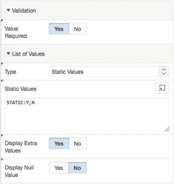

图 8-21. 公共标志的值列表

当向表单添加与表单所基于的表中的数据库列相关的列时，必须更改一些设置。“源使用”和“源类型”共同作用来标识每个项如何获取其值：

1.  在“源”属性组中，将“类型”设置为“数据库列”，这将相应地将“源使用”设置为“始终”，替换会话状态中的任何现有值。确保“数据库列名”为 `PUBLIC_FLAG`。
2.  在“默认值”属性组中，将“类型”设置为“静态值”，并在“静态值”中输入 `N`。
3.  保存您的更改。

现在您的数据模型中有了一个 `PUBLIC_FLAG` 列，并且能够通过“工单”表单控制它，您可以在页面 1 上创建动态 SQL 报告，以便为未验证用户显示带有“公共”选项的工单：

1.  在您的应用程序中编辑页面 1。
2.  通过在页面设计器工具栏中单击“创建”按钮并选择“报告区域”，如图 8-22 所示，来创建一个新区域。

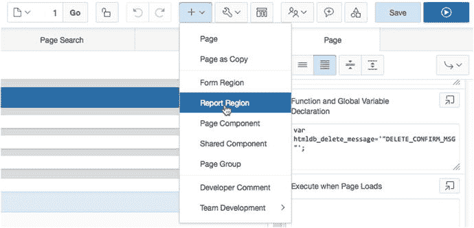

图 8-22. 为 SQL 创建区域以生成您的报告

3.  选择“经典报告”，然后单击“下一步”。
4.  输入 `Current Open Issues` 作为标题，如图 8-23 所示。单击“下一步”。

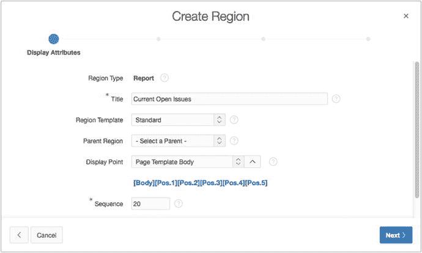

图 8-23.


**区域标题与显示点**  将**源类型**设置为**SQL 查询**，并将以下 SQL 输入到**区域源**中。完成后，点击**创建区域**按钮，接受所有剩余设置的默认值：

```sql
DECLARE
    l_sql VARCHAR2(500);
BEGIN
    l_sql := l_sql ||  q'!
                SELECT
                  subject,
                  created_on,
                  assigned_to
                FROM
                  tickets t,
                  status_lookup sl
                WHERE
                  t.status_id = sl.status_id
                  AND sl.status = 'OPEN'
        !';
    IF :APP_USER = 'nobody' THEN
        l_sql := l_sql || q'! AND public_flag = 'Y' !';
    END IF;
    RETURN l_sql;
END;
```

要完整查看此报告的结果，您需要将一些工单设置为新的 PUBLIC 选项。以已登录用户身份导航到工单摘要屏幕，并将几个状态为 OPEN 的工单的 PUBLIC 选项更改为“是”。当您以已登录用户身份导航到主屏幕时，应出现所有未关闭工单的完整列表，如图 8-24 所示。注销后，您将仅看到标记为 PUBLIC 的工单。

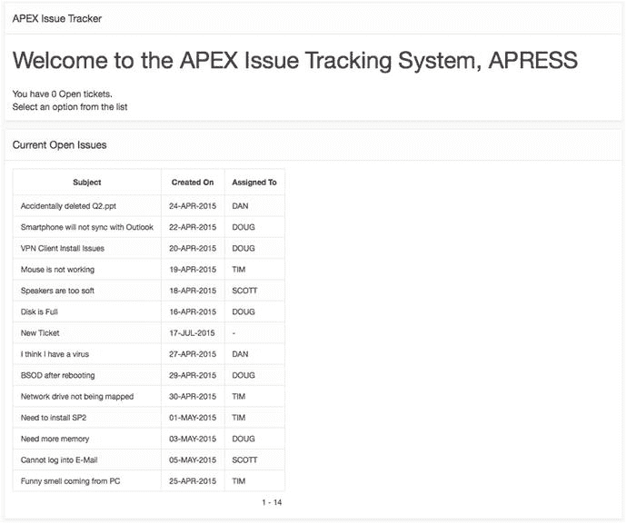
*图 8-24. 由动态 SQL 生成的报告结果*

> 注意：该 SQL 语句使用了您可能不熟悉的引用语法。Oracle 数据库 10g 引入了一种用于字符串字面量的引用机制，允许您定义自己的字符串定界符，从而无需在字符串中重复单引号。可以使用任何字符作为定界符，包括括号组合 `() {} [] <>`。基本语法是 `q’X 字符串 X'`，其中 `X` 是任意单个字符。`q’X` 开启字面量字符串，`X'` 关闭字面量字符串。您可以在 Oracle 数据库 SQL 语言参考手册中找到有关字面量语法的更多详细信息。

## 总结
与任何编程语言或框架一样，学习基础知识是第一步。本章涉及的许多要点可能只是冰山一角。每一节都有能力深入到一系列广泛的技术之中，其中 Oracle 数据库是主要部分。本章的目的是通过示例应用程序演示 APEX 框架的工作原理，并为进一步探索细节提供一个起点。

