# 9. 安全性
电子补充材料 本章的在线版本（doi:[10.​1007/​978-1-4842-0466-5_​9](http://dx.doi.org/10.1007/978-1-4842-0466-5_9)）包含补充材料，可供授权用户使用。

安全性的实施程度各不相同；从来没有一个非黑即白的答案。在确定需要多少安全性之后，会紧接着出现关于被保护对象的价值、风险、后果以及被攻击的可能性等附加问题。对于任何安全措施，总会有人试图规避它。本章将回顾基本的安全特性以及保护 Help Desk 应用程序的一种方法。这里回顾的概念适用于所有 APEX 应用程序，并且是 APEX 框架特有的。

## 用户维护导航
在 Help Desk 应用程序中，您有通过 Web 界面在应用程序中维护用户的需求。现在，让我们向应用程序添加一个部分，用于维护用户账户，然后修改标签页结构以导航到新创建的表单。这一次，您将不使用**创建页面**向导来创建菜单项，而是将在**共享组件**部分从头开始创建它们，以便您能更好地理解菜单层次结构是如何工作的。

首先，创建一个空白页面，作为新标签页的目标页面（标签页需要引用一个页面）：

1.  在应用程序构建器主页中，编辑 Help Desk 应用程序时，点击**创建页面**按钮。
2.  选择**空白页**选项，然后点击**下一步**。
3.  将**页面号**设置为 `600`，在**名称**字段中输入 `Users`，并将**面包屑**选择设置为**面包屑**。页面刷新后，确保**条目名称**为 Users，然后点击**下一步**。
4.  对于**导航首选项**单选组，选择**不要将此页面与导航菜单条目关联**。点击**下一步**。
5.  点击**完成**以完成页面的创建。完成的页面应为空，并且您不应看到任何与之相关的新菜单项，如图 9-1 所示。


*图 9-1. 查看新创建的空白页面及其单个面包屑条目*

现在您已经有了一个 Users 页面，需要修改导航。我们将向菜单添加一个 Admin 条目，并为用户维护创建子条目。以下是添加具有正确层次结构的新菜单项的流程：

1.  导航到**共享组件**页面。
2.  在**导航**部分，点击**导航菜单**。
3.  此交互式报表显示了可用的菜单。点击**桌面导航菜单**，如图 9-2 所示。

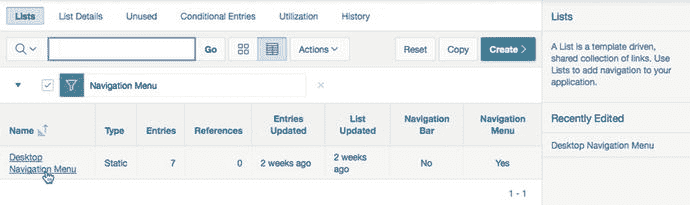
*图 9-2. 点击桌面导航菜单*

查看当前的菜单结构，如图 9-3 中的报表所示，我们可以看到已经有七个条目，并且其中两个条目（提交工单和联系我们）是主页菜单条目的子条目。接下来，我们将添加 Admin 菜单条目，然后添加用户维护的子条目。

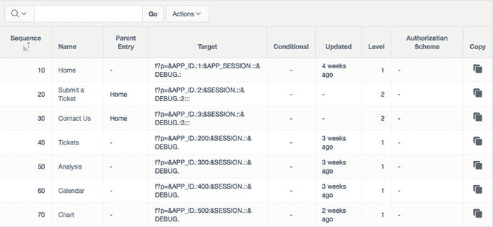
*图 9-3. 查看当前存在的导航菜单条目*

要添加 Admin 菜单条目，点击右上角的**创建列表条目**按钮，如图 9-4 所示。

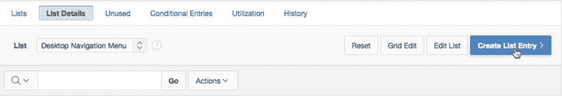
*图 9-4. 使用“创建列表条目”按钮创建新菜单项*

1.  在**条目**部分，为**列表条目标签**输入 `Admin`。
2.  在**目标**部分，为**页面**输入 `600`，然后点击页面顶部的**创建列表条目**。参见图 9-5。

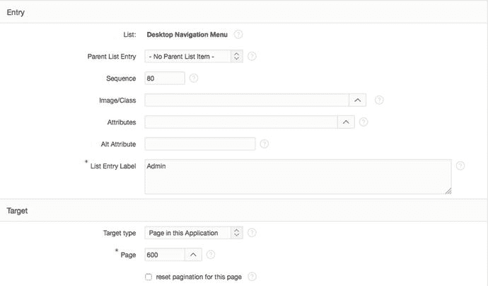
*图 9-5. 输入新的 Admin 菜单条目的属性*

要添加 User Maintenance 菜单条目，点击右上角的**创建列表条目**按钮。
1.  在**条目**部分，将**父列表条目**设置为 Admin，然后为**列表条目标签**输入 `User Maintenance`。
2.  在**目标**部分，为**页面**输入 `600`。
3.  在**当前列表条目**部分，将**页面类型的列表条目当前**设置为**逗号分隔的页面列表**。
4.  在**列表条目当前条件**中，输入 `600,610`，然后点击页面顶部的**创建列表条目**按钮。


现在，你的管理员菜单项下已有一个用户维护的子菜单项。当用户点击父菜单项时，系统会跳转到你创建菜单项时指定的页面，但应用程序中的其他页面也可能通过一个选项卡处于活动状态。在本例中，用户维护菜单项将同时是页面 600 和 610 的当前项。你尚未创建页面 610 也没关系——你很快就会创建的。

现在运行应用程序，将显示如图 9-6 所示的结果。当前活动的页面会改变应用在不同选项卡元素上的高亮样式。

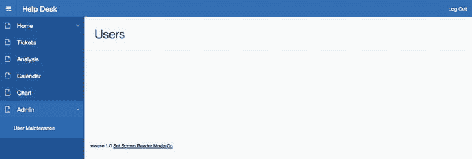

图 9-6. 新的导航菜单，显示管理员条目和用户维护子条目

现在你有了一个清晰区分管理应用程序所需各项的导航框架。此设计具有可扩展性。随着应用程序随时间发展，可以在此导航结构中添加需要管理的附加功能。

## 用户维护数据录入

作为服务台设计的一部分，你应该能够从应用程序中维护用户。为此，你需要实现一些新的数据库对象。

上传并运行脚本 `ch9_security_objects.sql`。如需分步指导，请参阅第 4 章。你应该看到 13 行结果，全部成功完成。我们简要说明一下这个脚本为你做了什么：

第 1–16 行：创建一个名为 `hash_password` 的函数，用于对传入的任何字符串进行编码。
第 18–24 行：创建将用于保存用户记录的 `USERS` 表。
第 26–27 行：创建 `USER_SEQ` 序列，该序列将用作 `USERS` 表的主键。
第 29–37 行：在 `USERS` 表上创建一个插入前触发器，该触发器自动分配下一个序列值作为主键，将用户名转换为大写，并调用 `hash_password` 函数对用户密码进行加密。
第 39–50 行：创建一个更新前触发器，将用户名转换为大写，如果密码已更改，则对其进行哈希处理。
第 52–87 行：创建 `authenticate_user` 函数，用于验证传入的用户名和密码与 `USERS` 表中的现有记录是否匹配。
第 90–103 行：在 `USERS` 表中创建六个条目，所有密码均为 apress。

现在你已经拥有了新的数据库对象，可以继续实现安全模型：编辑应用程序的第 600 页。单击“创建”按钮并选择“表单区域”来创建一个新区域。选择“基于表的表单（含报表）”并单击“下一步”。由于该报表实际上相当小且包含的列非常少，将其创建为交互式报表可能有些过度，因此在此情况下请坚持使用经典报表：将“实现方式”设置为“经典”。输入 `Users` 作为区域标题，并将区域模板设置为“标准”。设置如图 9-7 所示。

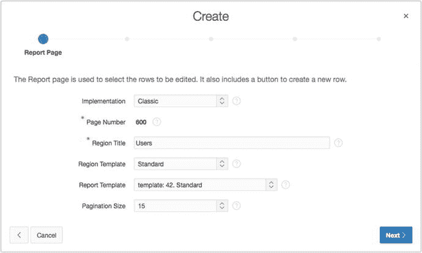

图 9-7. 报表页面设置

单击“下一步”。将“表/视图所有者”设置为你的模式名称，并将“表/视图名称”设置为 Users（表），如图 9-8 所示。

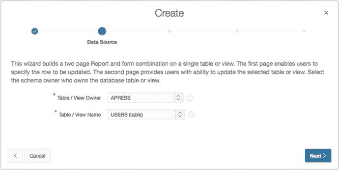

图 9-8. 设置所有者和表名

单击“下一步”。选择 `USER_ID` 和 `USER_NAME` 作为要在报表中显示的列。通过将其穿梭到左侧来移除 `PASSWORD` 列，然后单击“下一步”。选择任意编辑链接图像，然后单击“下一步”。为“页码”输入 `610`，为“页面名称”和“区域标题”输入 `Manage Users`，如图 9-9 所示。单击“下一步”。

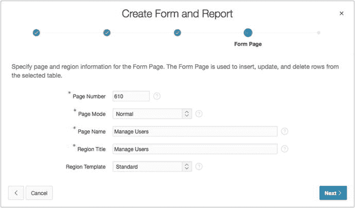

图 9-9. 定义“管理用户”表单的名称

将“主键类型”设置为“选择主键列”，页面刷新后，为“主键列 1”选择 `USER_ID`。单击“下一步”。为“主键源”选择“现有触发器”，然后单击“下一步”。选择 `USER_NAME` 和 `PASSWORD` 作为表单上可编辑的列，如图 9-10 所示，然后单击“下一步”。

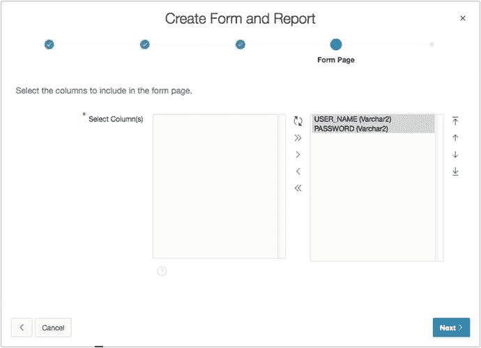

图 9-10.


选择 `USER_NAME` 和 `PASSWORD` 作为表单中要显示的字段。将 `Insert`、`Update` 和 `Delete` 全部设置为 `Yes`，然后点击 Next。点击 `Create`。

完成这些步骤后，Help Desk 应用程序会新增一些对象。页面 `600` 上的区域是当前用户的报表。同时请注意，新页面允许编辑数据值，包括执行相应数据库事务的所有流程。

不过，你仍需对页面 `610` 进行一些设置，才能使其正确显示面包屑导航：

1.  导航至您应用程序的 `Shared Components` 区域。
2.  在 `Navigation Section` 中，点击 `Breadcrumbs` 链接。
3.  点击 `Breadcrumb` 图标，查看所有面包屑条目。

查看面包屑条目，我们可以看到，虽然存在页面 `600` 的条目，但没有页面 `610` 的条目。我们需要手动添加：

1.  点击页面右上角的 `Create Breadcrumb Entry` 按钮。
2.  在 `Breadcrumb` 区域，为 `Page` 输入 `610`。
3.  在 `Entry` 区域，选择 `Users (Page 600)` 作为 `Parent Entry`，然后为 `Short Name` 输入 `Manage Users`。
4.  在 `Target` 区域，为 `Page` 输入 `610`。

这些条目如图 9-11 所示。

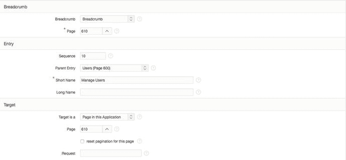

图 9-11. 为页面 610 输入面包屑详细信息

在页面顶部，点击 `Create Breadcrumb Entry`。完成后，页面 `610` 将拥有一个与页面 `600` 类似的 `Shared Components` 面包屑条目。运行应用程序，将显示用户报表页面和管理用户页面的面包屑条目，如图 9-12 所示。

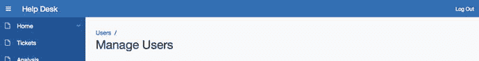

图 9-12. 显示管理用户页面的面包屑条目

最后，你需要将 `P610_PASSWORD` 的项类型更改为 `Password`，这样它就能接受用户输入，但在键入密码时显示星号 (`*`) 字符。此项目类型设计为在编辑记录时不检索数据，尽管它绑定到数据库列。此外，此项目类型不会在会话状态中保存任何值，这意味着在页面处理完成后不会记住输入的值。这是一项安全功能，旨在防止不恰当地检索标识为密码的数据。

步骤如下：

1.  编辑页面 `610`。
2.  编辑项目 `P610_PASSWORD`。
3.  在 `Properties Editor` 中，将 `Type` 设置为 `Password`，如图 9-13 所示。

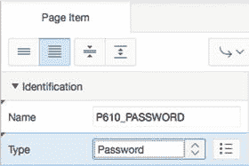

图 9-13. 将 `P610_PASSWORD` 元素设置为密码字段

尽管在创建新账户时需要密码，但如果管理员用户在编辑现有用户时不输入密码，您希望系统保留当前密码。因此，你需要将密码字段的 `Value Required` 属性设置为 `NO`，并改为实现一个仅在创建新用户时触发的验证：

1.  在 `P610_PASSWORD` 的 `Validating` 区域，将 `Value Required` 属性设置为 `NO`。
2.  编辑页面 `610` 时，右键单击 `P610_PASSWORD`，然后选择 `Create Validation`。
3.  在 `Properties Editor` 中，将 `Name` 设置为 `P610_PASSWORD Is Not Null`。
4.  在 `Validation` 区域，选择 `Item is Not Null` 作为 `Type`，并将 `Item` 设置为 `P610_PASSWORD`。
5.  为 `Error Message` 输入 `A password must be specified.`。
6.  在 `Condition` 区域，将 `When Button Pressed` 设置为 `CREATE`。
7.  保存您的更改。

这完成了您正在实施的安全方案的导航和用户界面部分。有了导航和维护功能，您现在可以实施将使用这些信息的身份验证方案。

## 身份验证

构建安全应用程序的关键在于了解访问用户是谁。APEX 将此称为身份验证。身份验证回答“您是谁？”的问题。APEX 工具提供了一系列预定义的身份验证机制，包括内置的身份验证框架和可扩展的自定义框架。在设计时，通过设置活动方案，可以轻松切换身份验证方法。一个应用程序一次只能有一个活动的身份验证方案。以下是主要的身份验证方案类型：

*   `Application Express Accounts`：用户在 APEX 工作区中管理，其维护方式与工作区开发者账户相同。
*   `LDAP Directory`：用户是符合 LDAP 标准的现有服务器，如 Active Directory 或 Oracle Internet Directory。
*   `Oracle Application Server Single Sign On`：身份验证可以在 APEX 和现有的 Oracle SSO 服务器之间传递。登录 SSO 服务器一次，相同的凭据将传递给所有 APEX 应用程序。
*   `Database Accounts`：数据库用户名和密码决定身份验证。请勿将其与 APEX 应用程序中的数据访问混淆。
*   `HTTP Header Variable`：此方法支持使用 HTTP 头变量来识别用户并创建 Application Express 用户会话。
*   `Custom`：逻辑由开发者决定。使用示例包括面向互联网的应用程序，可能需要自注册。另一个例子是同时使用多个身份验证源，例如使用两个 LDAP 服务器。
*   `Open Door`：开发者测试模拟以不同用户身份登录。此方案不打算用作公共身份验证方案。
*   `No Authentication`：此选项旨在允许访问应用程序的所有部分，无需用户登录。

每个应用程序都有其自己的一组身份验证方案，作为其 `Shared Components` 的一部分进行管理。需要时，身份验证方案可以在应用程序之间复制。当开发了自定义身份验证方案并希望在多个应用程序中使用时，此复制功能尤其有用。身份验证方案还利用 APEX 订阅框架，允许将主副本应用于单个工作区内的订阅者。


## 自定义认证方案

在上一节中，导入的脚本包含了表、触发器和函数的定义。你将把这些元素用作自定义认证方案的一部分。该认证方案的关键组件是一个函数，它将给定的用户名和密码与`USERS`表中存储的值进行比较。如果匹配，则用户通过认证。你应该查看 SQL Workshop 中的数据库对象和 PL/SQL 函数代码，以了解更多关于此实现的细节。

**注意**

虽然`USERS`表包含一个名为`PASSWORD`的字段，但它不是实际的密码值；它是密码的加密哈希。密码永远不应以纯文本形式存储。

以下是根据刚刚提到的数据库对象创建自定义认证方案的流程：

1.  导航到应用程序的“共享组件”。在“安全性”区域，点击“认证方案”，如图 9-14 所示。

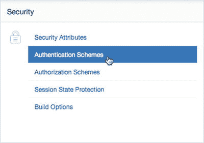

*图 9-14. 导航到“认证方案”共享组件*

2.  在“认证方案”屏幕的右上角，点击“创建”按钮。从图库中选择“基于预配置方案”，然后点击“下一步”。
3.  为“名称”输入`Custom Authentication Scheme`，然后为“方案类型”选择“自定义”。页面将刷新，并根据所选的方案类型显示不同的输入选项。
4.  在“设置”部分，为“认证函数名称”输入`authenticate_user`，如图 9-15 所示。你不需要填写此部分中的其他任何项目。

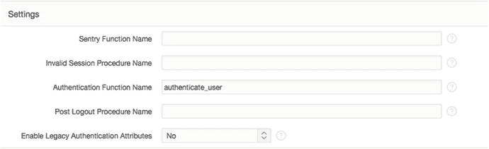

*图 9-15. 设置认证函数名称*

5.  点击“创建认证方案”。**注意**

这里没有使用参数，也没有使用 PL/SQL 分号。这是 APEX 处理自定义认证函数定义的一部分。之前创建的`authenticate_user`函数符合预期的签名：一个返回`BOOLEAN`值的函数，带有两个参数：`p_username varchar2(255)`和`p_password varchar2(255)`。

默认情况下，当你创建一个新的认证方案时，它会自动设置为活动方案。现在你必须使用`USERS`表中存在的用户名和密码来登录你的应用程序。

运行应用程序，如果显示已登录，请先注销。你可以作为以下任一用户登录：Scott、Doug、Martin、Karen、Patrick 或 Tim；所有密码都是小写的`apress`。

## 条件性安全

APEX 的许多方面都是条件性的。有一对条件特别适用于认证状态：“用户是公共用户”和“用户已认证”。这些条件可以帮助你将 APEX 中的对象限制为仅对公共用户（尚未登录的用户）或认证用户（已登录的用户）可用。

通过将安全规则应用于“Help Desk”应用程序，你可以通过限制显示对公众不可用的菜单选项来提高可用性。这避免了混淆，并改善了访问应用程序时的整体用户体验。让我们逐步创建这个条件：

1.  导航到应用程序的“共享组件”区域。在“导航”部分，点击“导航菜单”链接。
2.  点击“桌面导航菜单”链接以查看导航菜单条目。
3.  通过点击其名称来编辑“Tickets”菜单项。
4.  在“条件”部分，将“条件类型”设置为“用户已认证（非公共用户）”，然后点击“应用更改”。图 9-16 显示了该条件的预期值。


*图 9-16. 设置菜单项条件*

5.  对“Analysis”、“Calendar”、“Chart”和“Admin”菜单项重复步骤 4 和 5。

现在运行应用程序并点击“注销”链接。“Admin”、“Tickets”、“Analysis”、“Calendar”和“Chart”菜单项应该消失，只留下“Home”菜单项及其子项。再次登录应恢复之前看到的选项卡的显示。

## 访问控制

APEX 包含一个内置功能，用于创建包含三个角色（管理员、编辑和查看）的访问控制框架。该向导旨在创建数据结构来存储角色、用于编辑分配的页面以及整个应用程序中使用的授权方案。这个向导使得在应用程序中创建基本安全功能变得非常容易。向导最后一步创建的汇总对象如图 9-18 所示。

然而，使用内置的访问控制机制也有缺点。如果你需要的访问控制粒度比管理员、编辑和查看角色所提供的更细，那么你可能需要从头开始创建自己的访问控制机制。对于“Help Desk”应用程序，这些角色已经足够。以下是如何在“Help Desk”应用程序中实现访问控制：

1.  导航到应用程序的应用程序构建器主页，然后点击“创建页面”。
2.  选择“访问控制”，然后点击“下一步”。
3.  为“管理页面编号”输入`620`，然后点击“下一步”。
4.  选择“创建新的导航菜单条目”，允许页面刷新，然后为“新导航菜单条目”输入`Access Control`。
5.  接着，将“父导航菜单条目”设置为“Admin”，如图 9-17 所示。点击“下一步”。

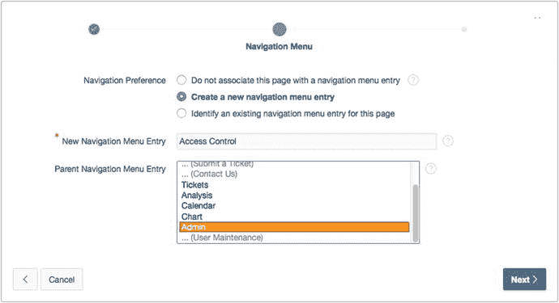

*图 9-17. 将页面 620 分配给 Admin 条目下的新菜单条目*

6.  点击“创建”，如图 9-18 所示。

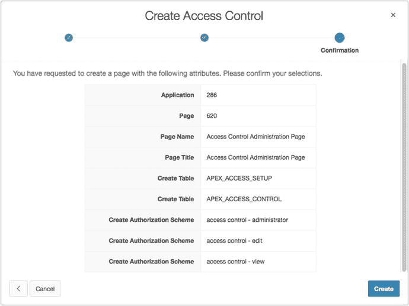

*图 9-18. 作为访问控制向导一部分的对象汇总视图*

随着向导的完成，所有对象都已创建并可供使用。在启用安全实用程序之前，你需要添加一些用户以便使用管理功能。现在运行应用程序，你可能会注意到用户名只是一个开放的文本字段。你应该创建一个值列表（LOV）作为共享组件，其中包含你想要控制访问的所有用户。因为访问控制页面现在是应用程序的一部分，你可以根据需要对其进行更改。为了提高输入数据的质量，将用户字段更新为选择列表：

1.  编辑页面 620。
2.  展开“访问控制列表”报表的“列”节点。
3.  编辑`ADMIN_USERNAME`列。
4.  在“标识”部分，将“类型”设置为“选择列表”。
5.  在“值列表”部分，将“类型”设置为“SQL 查询”，然后在“SQL 查询”文本区域中输入以下 SQL 语句并保存你的更改：
    ```sql
    SELECT user_name d, user_name r
    FROM users
    ```

当你运行页面 620 时，请注意没有为该页面创建面包屑。你可以按如下方式操作：


