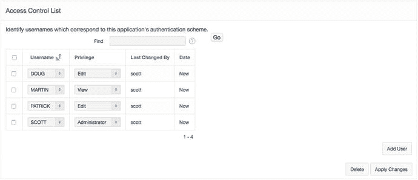
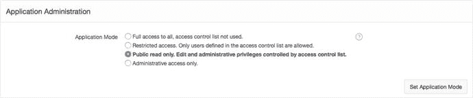
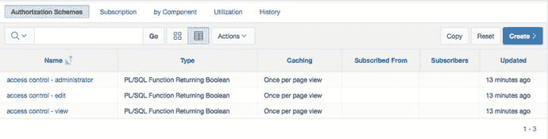
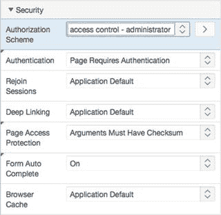
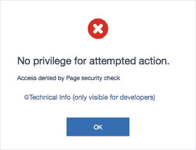
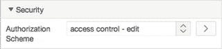

# 设置访问控制

导航至应用程序的共享组件。在导航部分，点击“面包屑”链接。点击“面包屑”图标以编辑面包屑条目。点击页面右上角的 `创建面包屑条目` 按钮。在面包屑部分，为 `页面` 输入 `620`。在条目部分，为 `简称` 输入 `访问控制`。在目标部分，为 `页面` 输入 `620`。在页面顶部，点击 `创建面包屑条目`。

接下来，你需要通过访问控制页面为每个现有用户关联一个权限：

1.  运行应用程序并以用户 `SCOTT` 登录。
2.  导航到访问控制屏幕，点击 `管理` 菜单项，然后点击 `访问控制` 子项。
3.  在 `访问控制列表` 部分，点击 `添加用户`。
4.  选择 `Scott` 作为 `用户名`，将 `权限` 设置为 `管理员`，然后点击 `添加用户`。
5.  选择 `Doug` 作为 `用户名`，将 `权限` 设置为 `编辑`，然后点击 `添加用户`。
6.  选择 `Patrick` 作为 `用户名`，将 `权限` 设置为 `编辑`，然后点击 `添加用户`。
7.  输入 `Martin` 作为 `用户名`，将 `权限` 设置为 `查看`，然后点击 `应用更改`。

你的结果应与图 9-19 中的相似。

**图 9-19.** 包含用户名和权限的访问控制列表

访问控制实用程序的功能之一是能够启用或禁用该实用程序本身的强制执行。运行页面 `620` 会显示如图 9-20 所示的标题。默认情况下，访问控制实用程序设置为 `完全访问`。要启用访问控制功能，请按以下步骤设置模式：

**图 9-20.** 访问控制列表设置为公共只读

1.  运行页面 `620`。
2.  将 `应用程序模式` 设置为 `公共只读`。编辑和管理权限由访问控制列表控制。
3.  点击图 9-20 中所示的 `设置应用程序模式` 按钮。

现在，编辑表单已经就位，所有数据也已正确设置，尽管应用程序尚未使用你创建的任何限制。你将在下一节中完成此操作。

## 授权

认证回答的是“你是谁？”的问题，而授权则致力于回答“登录后你被允许做什么？” APEX 提供了称为授权方案的应用程序共享组件。这些授权方案可以应用于应用程序内的组件，以告知 APEX 引擎何时应执行或渲染这些组件。

当你创建访问控制页面时，APEX 为你创建了三个授权方案，分别对应编辑屏幕中可用的每个角色：`管理员`、`编辑` 和 `查看`。图 9-21 显示了授权方案共享组件报告。

**图 9-21.** 作为访问控制机制一部分创建的授权方案

此过程的最后一步是开始使用这些授权方案锁定页面。首先，让我们锁定应用程序的管理员部分，以便只有具有 `管理员` 权限的用户才能使用它：

1.  编辑页面 `620`。
2.  通过点击页面名称编辑页面属性。
3.  在属性编辑器的 `安全性` 部分，将 `授权方案` 设置为 `访问控制 - 管理员`，如图 9-22 所示。保存你的更改。

**图 9-22.** 在页面级别设置授权方案

4.  对页面 `600` 和 `610` 重复步骤 2 和 3。

现在授权方案已在管理页面上实施，你可以测试安全行为了。只有在访问控制页面上设置为 `管理员` 角色的用户才能使用 `600` 到 `620` 的管理页面。以用户 `Scott` 登录应用程序，你可以导航所有管理功能。以任何其他用户登录并点击 `管理` 父选项卡，将导致图 9-23 中所示的消息。

**图 9-23.** 授权方案返回拒绝结果时生成的错误消息

图 9-23 中的错误消息不太友好。应用程序应尽一切努力避免导致权限错误的事件类型。在此应用程序中，当不符合访问限制时，应从页面中删除 `管理` 菜单项。你可以通过将相同的授权方案应用于菜单项本身来实现这一点：

1.  导航到应用程序的共享组件。
2.  在导航部分点击 `导航菜单` 链接。
3.  点击 `桌面导航菜单` 链接以编辑导航条目。
4.  通过点击其名称编辑 `管理` 菜单项。
5.  在 `授权` 下，将 `授权方案` 设置为 `访问控制 - 管理员`，然后点击 `应用更改`。

现在，运行应用程序时，如果用户没有管理员权限，菜单项将不会显示。这避免了导致用户看到访问被拒绝错误消息的事件。

你已经在管理页面的页面级别和标签级别应用了授权方案。接下来，让我们通过将 `编辑` 授权方案与创建工单所需的按钮相关联，来移除只读用户创建新记录的能力：

1.  编辑应用程序的页面 `200`。
2.  通过点击其名称编辑 `创建` 按钮。
3.  在图 9-24 所示的 `安全性` 部分，将 `授权方案` 设置为 `访问控制 - 编辑`，然后点击 `保存`。

**图 9-24.**

